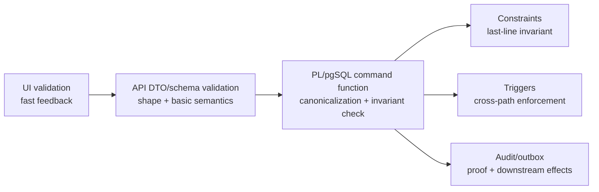
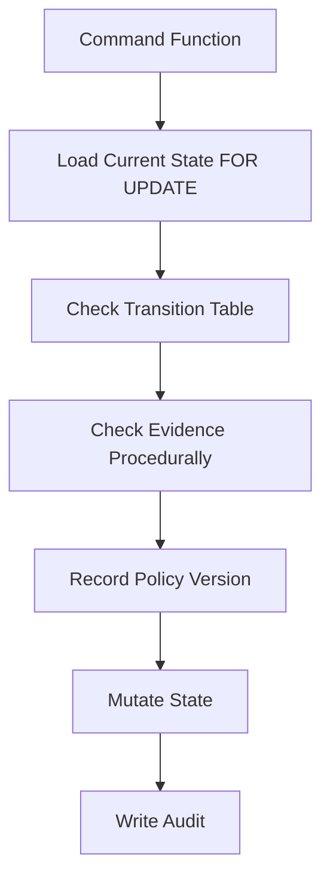

# Part 025 — Validation, Normalization, and Policy Enforcement Functions

Validation is not one thing.

In production systems, people often say “validate the data” when they actually mean five different jobs:

1. **Parse** the input into a shape the system understands.
2. **Normalize** semantically equivalent values into one canonical representation.
3. **Validate** whether the value is structurally and semantically acceptable.
4. **Authorize** whether the actor may perform the command.
5. **Enforce policy** against current system state, rule versions, deadlines, thresholds, and workflow context.

PL/pgSQL is strong when the rule must be enforced next to the data and inside the same transaction as the mutation.

PL/pgSQL is weak when the rule is mostly UI ergonomics, external-service dependent, high-churn product logic, or expensive procedural computation that should be handled in application/service code.

The goal of this part is to build the mental model and implementation patterns for **database-side validation and policy enforcement** without creating a black box.

---

## 1. Core Mental Model

A database validation function is not a form validator.

A form validator helps a user fix input before submission.

A database validation function protects the system's invariants even if the caller is buggy, malicious, outdated, concurrent, or bypasses the normal application path.

The stronger mental model is this:

```txt
Input is untrusted until it has passed through a named boundary.
Canonical values are the only values allowed to become durable state.
Policy decisions must be explainable after the fact.
```

A high-quality PL/pgSQL validation/policy layer should answer:

- What exact command is being executed?
- Which durable entity is affected?
- Which actor/request/context is involved?
- What raw values arrived?
- What canonical values will be stored?
- Which invariant is protected?
- Which policy version decided the outcome?
- What failure code should a caller receive?
- What evidence would a reviewer need later?

This means the function signature matters. A validation function with vague arguments is usually the beginning of design decay.

Bad:

```sql
CREATE FUNCTION app.validate_case(data jsonb) RETURNS boolean ...
```

Better:

```sql
CREATE FUNCTION case_api.validate_submit_case(
  p_case_id uuid,
  p_actor_id uuid,
  p_reason_code text,
  p_expected_state text,
  p_payload jsonb
)
RETURNS TABLE (
  error_code text,
  field_path text,
  message text,
  severity text
) ...
```

Best for mutation boundaries:

```sql
CREATE FUNCTION case_api.submit_case(
  p_case_id uuid,
  p_actor_id uuid,
  p_expected_state case_status,
  p_reason_code text,
  p_idempotency_key text,
  p_payload jsonb
)
RETURNS case_command_result ...
```

The last form does not merely validate. It validates and mutates atomically.

---

## 2. Boundary Map

A production system usually has multiple validation boundaries. They do not replace each other.



The database layer should not attempt to do every validation. It should own the validations that must remain true regardless of caller.

| Rule Type | Best Home | Why |
|---|---|---|
| Input field required for a screen | UI/API | User-experience concern; often changes with product flow |
| Primitive type/shape validation | API + DB check where critical | Prevents obvious malformed commands early |
| Canonical email/lowercase/trim | Shared library + DB if stored invariant | Prevents duplicate semantics |
| Unique identity | Constraint/index | Needs concurrency-safe enforcement |
| State transition allowed | PL/pgSQL command function + constraint/trigger guard | Requires current row state and audit proof |
| Actor permission | Application auth + DB policy when bypass risk matters | Needs both identity context and data ownership |
| “Cannot approve own case” | PL/pgSQL command function | Domain invariant tied to state and actor |
| “Escalate if deadline passed” | PL/pgSQL worker/procedure | Data-local scheduled rule |
| External sanction-screening result | Application/service + durable result | External dependency should not run inside DB transaction |
| Audit reason required | PL/pgSQL command function + trigger guard | Must be defensible |

The point is not to centralize everything in PL/pgSQL. The point is to put **non-negotiable invariants** where they cannot be accidentally skipped.

---

## 3. Validation Vocabulary

Use precise words in code and schema names.

### 3.1 Parsing

Parsing converts an external representation into an internal representation.

Example: `jsonb` request payload into typed fields.

Parsing can fail because the input shape is wrong.

### 3.2 Normalization

Normalization converts acceptable variants into a canonical value.

Examples:

- trim whitespace;
- lowercase case-insensitive identifiers;
- collapse repeated spaces in names;
- convert blank strings to `NULL` when the domain says empty is absence;
- canonicalize country code to uppercase ISO-like form;
- parse and normalize phone numbers, if the system has a reliable rule set.

Normalization should be deterministic and boring.

### 3.3 Validation

Validation decides whether a value is allowed.

Examples:

- an email must not be blank;
- a status must be in a known enum/domain;
- a JSON object must contain required keys;
- an amount must be positive;
- a deadline must be in the future;
- a case cannot be submitted without at least one allegation.

Validation can return a list of errors or raise an exception, depending on boundary.

### 3.4 Policy Enforcement

Policy enforcement decides whether a command is allowed given current state and context.

Examples:

- actor role may approve this case;
- case state allows transition from `under_review` to `approved`;
- approval requires two independent reviewers;
- escalation cannot be closed without resolution evidence;
- a policy version requires additional data after a regulatory effective date.

Policy is not just value checking. Policy is decision logic.

### 3.5 Authorization

Authorization determines whether an actor may act.

Authorization may involve application identity, database role, row ownership, org hierarchy, and explicit permissions. PL/pgSQL can enforce data-local permissions, but it should not invent identity out of thin air.

---

## 4. The Decision Matrix: Constraint, Domain, Function, Trigger, or Procedure?

| Need | Prefer | Avoid |
|---|---|---|
| Single-column primitive invariant | Domain or column `CHECK` | Trigger |
| Cross-column invariant in same row | Table `CHECK` | Function-only enforcement |
| Cross-row uniqueness | Unique index/constraint | Check-then-insert in PL/pgSQL |
| Cross-row aggregate invariant | Command function + lock/constraint strategy | Naive trigger that scans table under concurrency |
| Canonical stored value | Normalization function inside command boundary | Ad hoc normalization in every app service |
| Rich validation errors | Validation function returning rows | Throwing first error too early |
| Must reject all mutation paths | Constraint or trigger | Application-only validation |
| Command-specific policy | PL/pgSQL command function | Generic trigger that cannot see command intent |
| Long-running batch with commits | Procedure | Function |
| UI form hints | Application/API | Database function as UI oracle |

A good database design uses the strongest primitive for each invariant.

Weak pattern:

```sql
CREATE FUNCTION validate_unique_email(p_email text)
RETURNS boolean AS $$
BEGIN
  RETURN NOT EXISTS (
    SELECT 1 FROM account_user WHERE email = p_email
  );
END;
$$ LANGUAGE plpgsql;
```

This is not concurrency-safe. Two transactions can both see “valid” and then both insert.

Strong pattern:

```sql
CREATE UNIQUE INDEX account_user_email_uq
ON account_user (normalized_email);
```

Then your command function catches/labels the unique violation if you need a domain-specific error.

---

## 5. Schema Setup for Examples

The examples use a small regulatory case intake domain.

```sql
CREATE SCHEMA IF NOT EXISTS intake;
CREATE SCHEMA IF NOT EXISTS intake_api;
CREATE SCHEMA IF NOT EXISTS app_error;

CREATE TYPE intake.case_status AS ENUM (
  'draft',
  'submitted',
  'under_review',
  'rejected',
  'accepted'
);

CREATE TYPE intake.validation_severity AS ENUM (
  'error',
  'warning'
);

CREATE TABLE intake.case_file (
  case_id uuid PRIMARY KEY,
  status intake.case_status NOT NULL DEFAULT 'draft',
  title text NOT NULL,
  normalized_title text NOT NULL,
  reporter_email text NOT NULL,
  normalized_reporter_email text NOT NULL,
  intake_payload jsonb NOT NULL DEFAULT '{}'::jsonb,
  created_at timestamptz NOT NULL DEFAULT clock_timestamp(),
  updated_at timestamptz NOT NULL DEFAULT clock_timestamp(),
  submitted_at timestamptz,
  version bigint NOT NULL DEFAULT 1,
  CONSTRAINT case_file_payload_is_object
    CHECK (jsonb_typeof(intake_payload) = 'object'),
  CONSTRAINT case_file_title_not_blank
    CHECK (length(btrim(title)) > 0),
  CONSTRAINT case_file_normalized_title_not_blank
    CHECK (length(btrim(normalized_title)) > 0),
  CONSTRAINT case_file_reporter_email_not_blank
    CHECK (length(btrim(reporter_email)) > 0),
  CONSTRAINT case_file_submitted_at_required_when_submitted
    CHECK (
      status <> 'submitted'
      OR submitted_at IS NOT NULL
    )
);

CREATE UNIQUE INDEX case_file_normalized_reporter_title_uq
ON intake.case_file (normalized_reporter_email, normalized_title)
WHERE status <> 'rejected';
```

Notice the layered design:

- `CHECK` constraints protect primitive invariant;
- enum restricts allowed states;
- unique partial index protects dedup semantics under concurrency;
- command functions will enforce transition rules and produce better errors.

---

## 6. Domains: Useful, but Not Magic

A domain is a type with constraints. It is excellent for reusable primitive constraints.

```sql
CREATE DOMAIN intake.non_blank_text AS text
CHECK (VALUE IS NULL OR length(btrim(VALUE)) > 0);

CREATE DOMAIN intake.normalized_email AS text
CHECK (
  VALUE IS NULL
  OR (
    VALUE = lower(VALUE)
    AND VALUE !~ '\s'
    AND position('@' in VALUE) > 1
  )
);
```

Important design choice: allow `NULL` in the domain and apply `NOT NULL` at the column where needed.

```sql
CREATE TABLE intake.contact_point (
  contact_point_id uuid PRIMARY KEY,
  email intake.normalized_email NOT NULL
);
```

Why? SQL has places where a value of a domain type can still appear as null even if the domain says `NOT NULL`, especially through outer joins or scalar subqueries. Column-level `NOT NULL` is a clearer enforcement point.

### 6.1 When to Use a Domain

Use a domain when:

- the rule is primitive;
- the rule is reusable;
- the rule does not require table access;
- the rule does not depend on time, user, tenant, policy version, or mutable config;
- the rule is stable enough that changing it is a migration event.

Avoid domains for:

- rules that need cross-row lookup;
- rules that depend on current date/time;
- rules that call mutable functions;
- high-churn product policy;
- complex validation where you need multiple user-facing errors.

### 6.2 Domain Failure Mode

This is dangerous:

```sql
CREATE FUNCTION intake.is_allowed_email(p_email text)
RETURNS boolean
LANGUAGE plpgsql
IMMUTABLE
AS $$
BEGIN
  RETURN EXISTS (
    SELECT 1
    FROM intake.allowed_email_domain
    WHERE p_email LIKE '%@' || domain_name
  );
END;
$$;
```

It is marked `IMMUTABLE`, but it reads a table. That is a lie to the optimizer and to future maintainers.

A function used inside a domain or check constraint should behave like pure math over its arguments.

---

## 7. Normalization Functions

A normalization function should be boring, deterministic, and preferably expressible as a SQL function.

```sql
CREATE OR REPLACE FUNCTION intake.normalize_email(p_email text)
RETURNS text
LANGUAGE sql
IMMUTABLE
RETURNS NULL ON NULL INPUT
AS $$
  SELECT nullif(lower(btrim(p_email)), '')
$$;
```

```sql
CREATE OR REPLACE FUNCTION intake.normalize_title(p_title text)
RETURNS text
LANGUAGE sql
IMMUTABLE
RETURNS NULL ON NULL INPUT
AS $$
  SELECT nullif(regexp_replace(btrim(p_title), '\s+', ' ', 'g'), '')
$$;
```

Design rules:

- normalization should not raise unless the input type itself is invalid;
- normalization should not query tables;
- normalization should not depend on current time;
- normalization should not write audit records;
- normalization should be idempotent.

Idempotent means:

```sql
SELECT intake.normalize_email(intake.normalize_email(' USER@EXAMPLE.COM '));
-- same result as one normalization pass
```

A normalization function that changes output every time it is called is not normalization. It is a mutation.

---

## 8. Validation as Error Rows

When validating user-submitted data, returning all errors is often better than raising the first error.

```sql
CREATE TYPE intake.validation_error AS (
  error_code text,
  field_path text,
  message text,
  severity intake.validation_severity
);
```

```sql
CREATE OR REPLACE FUNCTION intake_api.validate_case_draft(
  p_title text,
  p_reporter_email text,
  p_payload jsonb
)
RETURNS SETOF intake.validation_error
LANGUAGE plpgsql
STABLE
AS $$
DECLARE
  v_normalized_email text := intake.normalize_email(p_reporter_email);
  v_normalized_title text := intake.normalize_title(p_title);
BEGIN
  IF v_normalized_title IS NULL THEN
    RETURN NEXT (
      'TITLE_REQUIRED',
      'title',
      'Title is required.',
      'error'
    )::intake.validation_error;
  END IF;

  IF v_normalized_email IS NULL THEN
    RETURN NEXT (
      'REPORTER_EMAIL_REQUIRED',
      'reporterEmail',
      'Reporter email is required.',
      'error'
    )::intake.validation_error;
  ELSIF v_normalized_email !~ '^[^@\s]+@[^@\s]+\.[^@\s]+$' THEN
    RETURN NEXT (
      'REPORTER_EMAIL_INVALID',
      'reporterEmail',
      'Reporter email is not in an accepted format.',
      'error'
    )::intake.validation_error;
  END IF;

  IF p_payload IS NULL THEN
    RETURN NEXT (
      'PAYLOAD_REQUIRED',
      'payload',
      'Payload is required.',
      'error'
    )::intake.validation_error;
  ELSIF jsonb_typeof(p_payload) <> 'object' THEN
    RETURN NEXT (
      'PAYLOAD_MUST_BE_OBJECT',
      'payload',
      'Payload must be a JSON object.',
      'error'
    )::intake.validation_error;
  END IF;

  RETURN;
END;
$$;
```

This function is queryable:

```sql
SELECT *
FROM intake_api.validate_case_draft(
  '',
  'bad-email',
  '[]'::jsonb
);
```

It is useful for API preflight.

But it is not enough for mutation safety.

A caller can ignore warnings. A caller can forget to run validation. A caller can run validation and then mutate different values.

Therefore, mutation functions must re-enforce the critical checks.

---

## 9. Validation as Command Boundary

A command function is stronger than a validator because it validates and writes in one transaction.

```sql
CREATE OR REPLACE FUNCTION intake_api.create_case_draft(
  p_case_id uuid,
  p_title text,
  p_reporter_email text,
  p_payload jsonb
)
RETURNS intake.case_file
LANGUAGE plpgsql
AS $$
DECLARE
  v_normalized_title text := intake.normalize_title(p_title);
  v_normalized_email text := intake.normalize_email(p_reporter_email);
  v_case intake.case_file%ROWTYPE;
BEGIN
  IF p_case_id IS NULL THEN
    RAISE EXCEPTION USING
      ERRCODE = 'P2501',
      MESSAGE = 'CASE_ID_REQUIRED',
      DETAIL = 'case_id must be provided.';
  END IF;

  IF v_normalized_title IS NULL THEN
    RAISE EXCEPTION USING
      ERRCODE = 'P2502',
      MESSAGE = 'TITLE_REQUIRED',
      DETAIL = 'title must not be blank.';
  END IF;

  IF v_normalized_email IS NULL THEN
    RAISE EXCEPTION USING
      ERRCODE = 'P2503',
      MESSAGE = 'REPORTER_EMAIL_REQUIRED',
      DETAIL = 'reporter_email must not be blank.';
  END IF;

  IF v_normalized_email !~ '^[^@\s]+@[^@\s]+\.[^@\s]+$' THEN
    RAISE EXCEPTION USING
      ERRCODE = 'P2504',
      MESSAGE = 'REPORTER_EMAIL_INVALID',
      DETAIL = format('normalized_reporter_email=%s', v_normalized_email);
  END IF;

  IF p_payload IS NULL OR jsonb_typeof(p_payload) <> 'object' THEN
    RAISE EXCEPTION USING
      ERRCODE = 'P2505',
      MESSAGE = 'PAYLOAD_MUST_BE_OBJECT',
      DETAIL = 'intake_payload must be a JSON object.';
  END IF;

  INSERT INTO intake.case_file (
    case_id,
    title,
    normalized_title,
    reporter_email,
    normalized_reporter_email,
    intake_payload
  )
  VALUES (
    p_case_id,
    btrim(p_title),
    v_normalized_title,
    btrim(p_reporter_email),
    v_normalized_email,
    p_payload
  )
  RETURNING * INTO v_case;

  RETURN v_case;

EXCEPTION
  WHEN unique_violation THEN
    RAISE EXCEPTION USING
      ERRCODE = 'P2506',
      MESSAGE = 'DUPLICATE_CASE_DRAFT',
      DETAIL = 'A non-rejected case already exists for the normalized reporter email and title.';
END;
$$;
```

This function encodes an important production principle:

> Preflight validation improves feedback. Command validation protects the database.

Do not choose one. Use both when the rule is important.

---

## 10. Error Codes as API Contract

The exception message should not be your only contract.

Use stable error codes.

```sql
CREATE TABLE app_error.error_catalog (
  error_code text PRIMARY KEY,
  sqlstate text NOT NULL,
  public_message text NOT NULL,
  retryable boolean NOT NULL DEFAULT false,
  owner_team text NOT NULL,
  created_at timestamptz NOT NULL DEFAULT clock_timestamp()
);

INSERT INTO app_error.error_catalog (
  error_code,
  sqlstate,
  public_message,
  retryable,
  owner_team
)
VALUES
  ('TITLE_REQUIRED', 'P2502', 'Title is required.', false, 'case-platform'),
  ('REPORTER_EMAIL_INVALID', 'P2504', 'Reporter email is invalid.', false, 'case-platform'),
  ('DUPLICATE_CASE_DRAFT', 'P2506', 'A similar case already exists.', false, 'case-platform');
```

Then make your raised exceptions stable:

```sql
RAISE EXCEPTION USING
  ERRCODE = 'P2504',
  MESSAGE = 'REPORTER_EMAIL_INVALID',
  DETAIL = format('normalized_reporter_email=%s', v_normalized_email),
  HINT = 'Use a deliverable email address for the reporter.';
```

A stable error contract lets application code map database failures into consistent API responses without parsing free-text error messages.

---

## 11. Policy Enforcement Functions

Validation asks: “Is this value acceptable?”

Policy asks: “Is this command allowed now?”

Example policy: a submitted case must have a title, reporter email, at least one allegation, and a reason code. It may only be submitted from `draft`.

```sql
CREATE TABLE intake.case_audit_event (
  event_id bigserial PRIMARY KEY,
  case_id uuid NOT NULL,
  actor_id uuid NOT NULL,
  event_type text NOT NULL,
  reason_code text,
  old_status intake.case_status,
  new_status intake.case_status,
  event_payload jsonb NOT NULL DEFAULT '{}'::jsonb,
  occurred_at timestamptz NOT NULL DEFAULT clock_timestamp()
);
```

```sql
CREATE OR REPLACE FUNCTION intake_api.submit_case(
  p_case_id uuid,
  p_actor_id uuid,
  p_expected_version bigint,
  p_reason_code text
)
RETURNS intake.case_file
LANGUAGE plpgsql
AS $$
DECLARE
  v_case intake.case_file%ROWTYPE;
  v_allegation_count integer;
BEGIN
  IF p_actor_id IS NULL THEN
    RAISE EXCEPTION USING
      ERRCODE = 'P2510',
      MESSAGE = 'ACTOR_REQUIRED';
  END IF;

  SELECT *
  INTO STRICT v_case
  FROM intake.case_file c
  WHERE c.case_id = p_case_id
  FOR UPDATE;

  IF v_case.version <> p_expected_version THEN
    RAISE EXCEPTION USING
      ERRCODE = 'P2511',
      MESSAGE = 'CASE_VERSION_CONFLICT',
      DETAIL = format(
        'expected_version=%s actual_version=%s',
        p_expected_version,
        v_case.version
      );
  END IF;

  IF v_case.status <> 'draft' THEN
    RAISE EXCEPTION USING
      ERRCODE = 'P2512',
      MESSAGE = 'CASE_NOT_SUBMITTABLE',
      DETAIL = format('current_status=%s', v_case.status);
  END IF;

  IF nullif(btrim(p_reason_code), '') IS NULL THEN
    RAISE EXCEPTION USING
      ERRCODE = 'P2513',
      MESSAGE = 'REASON_CODE_REQUIRED';
  END IF;

  SELECT jsonb_array_length(v_case.intake_payload -> 'allegations')
  INTO v_allegation_count
  WHERE jsonb_typeof(v_case.intake_payload -> 'allegations') = 'array';

  IF coalesce(v_allegation_count, 0) = 0 THEN
    RAISE EXCEPTION USING
      ERRCODE = 'P2514',
      MESSAGE = 'AT_LEAST_ONE_ALLEGATION_REQUIRED';
  END IF;

  UPDATE intake.case_file c
  SET status = 'submitted',
      submitted_at = clock_timestamp(),
      updated_at = clock_timestamp(),
      version = c.version + 1
  WHERE c.case_id = p_case_id
  RETURNING * INTO v_case;

  INSERT INTO intake.case_audit_event (
    case_id,
    actor_id,
    event_type,
    reason_code,
    old_status,
    new_status,
    event_payload
  )
  VALUES (
    p_case_id,
    p_actor_id,
    'case.submitted',
    p_reason_code,
    'draft',
    'submitted',
    jsonb_build_object('expectedVersion', p_expected_version)
  );

  RETURN v_case;

EXCEPTION
  WHEN no_data_found THEN
    RAISE EXCEPTION USING
      ERRCODE = 'P2515',
      MESSAGE = 'CASE_NOT_FOUND',
      DETAIL = format('case_id=%s', p_case_id);
END;
$$;
```

Key properties:

- row is locked before policy decision;
- expected version prevents stale caller writes;
- state transition is explicit;
- reason code is mandatory;
- audit event is written in the same transaction;
- failures have stable SQLSTATE/message contracts.

---

## 12. Policy Versioning

Regulatory and compliance rules change. A policy decision without policy version is hard to defend later.

```sql
CREATE TABLE intake.policy_rule_set (
  policy_version text PRIMARY KEY,
  effective_from timestamptz NOT NULL,
  effective_to timestamptz,
  rule_payload jsonb NOT NULL,
  CHECK (effective_to IS NULL OR effective_to > effective_from)
);
```

```sql
CREATE OR REPLACE FUNCTION intake.current_policy_version(
  p_at timestamptz DEFAULT clock_timestamp()
)
RETURNS text
LANGUAGE sql
STABLE
AS $$
  SELECT prs.policy_version
  FROM intake.policy_rule_set prs
  WHERE prs.effective_from <= p_at
    AND (prs.effective_to IS NULL OR prs.effective_to > p_at)
  ORDER BY prs.effective_from DESC
  LIMIT 1
$$;
```

Now store the policy version in audit events:

```sql
ALTER TABLE intake.case_audit_event
ADD COLUMN policy_version text;
```

Then, inside command functions:

```sql
DECLARE
  v_policy_version text := intake.current_policy_version();
BEGIN
  -- enforce rules using v_policy_version
  -- write v_policy_version into audit
END;
```

Be careful: if a function reads policy tables, it is not immutable. Marking it `IMMUTABLE` would be incorrect.

---

## 13. Table-Driven Policy vs Procedural Policy

There are two common styles.

### 13.1 Table-Driven Policy

```sql
CREATE TABLE intake.allowed_transition (
  from_status intake.case_status NOT NULL,
  to_status intake.case_status NOT NULL,
  command text NOT NULL,
  requires_reason boolean NOT NULL DEFAULT true,
  PRIMARY KEY (from_status, to_status, command)
);
```

```sql
SELECT 1
FROM intake.allowed_transition t
WHERE t.from_status = v_case.status
  AND t.to_status = 'submitted'
  AND t.command = 'submit_case';
```

Good for rules that are mostly data.

Benefits:

- easy to inspect;
- easier to version;
- less code branching;
- good for policy review.

Risks:

- table rules can become a hidden DSL;
- complex conditions become unreadable;
- migrations must coordinate data and code;
- invalid table contents can weaken the system.

### 13.2 Procedural Policy

```sql
IF v_case.status <> 'draft' THEN
  RAISE EXCEPTION USING MESSAGE = 'CASE_NOT_SUBMITTABLE';
END IF;

IF v_case.intake_payload ? 'specialCategory'
   AND NOT intake.actor_has_permission(p_actor_id, 'case.special.submit') THEN
  RAISE EXCEPTION USING MESSAGE = 'SPECIAL_CATEGORY_PERMISSION_REQUIRED';
END IF;
```

Good for rules that involve multiple state reads, branching, or evidence-specific logic.

Benefits:

- straightforward to read for complex command logic;
- easier to debug step by step;
- can produce very specific errors.

Risks:

- policy becomes harder to review by non-engineers;
- duplicated checks creep in;
- code deploy required for policy changes.

### 13.3 Hybrid Pattern

Use table-driven rules for stable transition topology, and procedural code for command-specific evidence checks.



---

## 14. Guarding Direct Mutation Paths

If `submit_case()` is the intended command boundary, direct update should not bypass it.

A trigger can guard direct status changes.

```sql
CREATE OR REPLACE FUNCTION intake.guard_case_status_change()
RETURNS trigger
LANGUAGE plpgsql
AS $$
BEGIN
  IF TG_OP = 'UPDATE' AND NEW.status IS DISTINCT FROM OLD.status THEN
    IF current_setting('app.case_command_boundary', true) IS DISTINCT FROM 'true' THEN
      RAISE EXCEPTION USING
        ERRCODE = 'P2516',
        MESSAGE = 'DIRECT_CASE_STATUS_UPDATE_FORBIDDEN',
        DETAIL = format('case_id=%s old_status=%s new_status=%s',
                        OLD.case_id, OLD.status, NEW.status);
    END IF;
  END IF;

  RETURN NEW;
END;
$$;

CREATE TRIGGER case_file_guard_status_change_trg
BEFORE UPDATE OF status ON intake.case_file
FOR EACH ROW
EXECUTE FUNCTION intake.guard_case_status_change();
```

Then the command function sets a local transaction setting:

```sql
PERFORM set_config('app.case_command_boundary', 'true', true);
```

This is not a substitute for privileges. It is a guardrail.

For stronger enforcement:

- revoke direct table write from application roles;
- grant execute only on command functions;
- use `SECURITY DEFINER` carefully with hardened `search_path`;
- audit privileged admin bypass.

---

## 15. Generated Columns for Canonical Values

If canonical values are a pure function of raw fields, generated columns can reduce drift.

```sql
CREATE TABLE intake.reporter_identity (
  reporter_id uuid PRIMARY KEY,
  raw_email text NOT NULL,
  normalized_email text GENERATED ALWAYS AS (
    lower(btrim(raw_email))
  ) STORED,
  CONSTRAINT reporter_identity_email_not_blank
    CHECK (length(btrim(raw_email)) > 0)
);

CREATE UNIQUE INDEX reporter_identity_normalized_email_uq
ON intake.reporter_identity (normalized_email);
```

Use generated columns when:

- canonical value is always derived from fields in the same row;
- expression is immutable;
- you want to index the canonical value;
- you want to eliminate dual-write drift.

Avoid generated columns when canonicalization depends on policy tables, user context, or time.

---

## 16. Validation Result Tables for Batch Intake

For batch processing, raising on the first bad row is operationally painful. Store validation findings.

```sql
CREATE TABLE intake.batch_file (
  batch_id uuid PRIMARY KEY,
  source_name text NOT NULL,
  received_at timestamptz NOT NULL DEFAULT clock_timestamp()
);

CREATE TABLE intake.batch_case_row (
  batch_id uuid NOT NULL REFERENCES intake.batch_file(batch_id),
  row_number integer NOT NULL,
  raw_payload jsonb NOT NULL,
  validation_status text NOT NULL DEFAULT 'pending',
  PRIMARY KEY (batch_id, row_number)
);

CREATE TABLE intake.batch_case_row_error (
  batch_id uuid NOT NULL,
  row_number integer NOT NULL,
  error_code text NOT NULL,
  field_path text,
  message text NOT NULL,
  created_at timestamptz NOT NULL DEFAULT clock_timestamp(),
  PRIMARY KEY (batch_id, row_number, error_code, coalesce(field_path, ''))
);
```

The primary key above is invalid because expressions cannot appear directly in a primary key definition. Use a generated column or a unique index instead:

```sql
ALTER TABLE intake.batch_case_row_error
ADD COLUMN field_path_key text GENERATED ALWAYS AS (coalesce(field_path, '')) STORED;

ALTER TABLE intake.batch_case_row_error
ADD CONSTRAINT batch_case_row_error_pk
PRIMARY KEY (batch_id, row_number, error_code, field_path_key);
```

Batch validation function:

```sql
CREATE OR REPLACE PROCEDURE intake_api.validate_batch_case_rows(
  p_batch_id uuid
)
LANGUAGE plpgsql
AS $$
DECLARE
  r record;
  e intake.validation_error;
BEGIN
  FOR r IN
    SELECT row_number, raw_payload
    FROM intake.batch_case_row
    WHERE batch_id = p_batch_id
      AND validation_status = 'pending'
    ORDER BY row_number
  LOOP
    DELETE FROM intake.batch_case_row_error
    WHERE batch_id = p_batch_id
      AND row_number = r.row_number;

    FOR e IN
      SELECT *
      FROM intake_api.validate_case_draft(
        r.raw_payload ->> 'title',
        r.raw_payload ->> 'reporterEmail',
        r.raw_payload
      )
    LOOP
      INSERT INTO intake.batch_case_row_error (
        batch_id,
        row_number,
        error_code,
        field_path,
        message
      )
      VALUES (
        p_batch_id,
        r.row_number,
        e.error_code,
        e.field_path,
        e.message
      )
      ON CONFLICT DO NOTHING;
    END LOOP;

    UPDATE intake.batch_case_row b
    SET validation_status = CASE
      WHEN EXISTS (
        SELECT 1
        FROM intake.batch_case_row_error err
        WHERE err.batch_id = p_batch_id
          AND err.row_number = r.row_number
      )
      THEN 'invalid'
      ELSE 'valid'
    END
    WHERE b.batch_id = p_batch_id
      AND b.row_number = r.row_number;
  END LOOP;
END;
$$;
```

This gives operations a queryable validation report.

---

## 17. Do Not Hide External Dependencies in Validation

This is usually wrong:

```sql
CREATE FUNCTION intake.validate_address_with_external_api(...)
RETURNS boolean
LANGUAGE plpgsql
AS $$
BEGIN
  -- call external service somehow
END;
$$;
```

Reasons:

- database transactions should not wait on unreliable networks;
- external calls make rollback semantics confusing;
- retries can duplicate external side effects;
- database connection pools are not designed for long I/O waits;
- observability and circuit breaking are better in application infrastructure.

Better pattern:

1. Application calls external service.
2. Result is stored durably with source, timestamp, request id, and confidence.
3. PL/pgSQL policy function checks the durable result.
4. Outbox event requests re-validation if needed.

```sql
CREATE TABLE intake.address_verification_result (
  address_id uuid PRIMARY KEY,
  provider_name text NOT NULL,
  provider_request_id text NOT NULL,
  verification_status text NOT NULL,
  confidence_score numeric(5,4),
  verified_at timestamptz NOT NULL,
  raw_response jsonb NOT NULL,
  UNIQUE (provider_name, provider_request_id)
);
```

Now policy depends on durable state, not a live network call.

---

## 18. Function Volatility Discipline

Volatility is a promise to PostgreSQL.

- `IMMUTABLE`: same arguments always produce same result forever.
- `STABLE`: same arguments produce same result within a statement; does not modify database.
- `VOLATILE`: may change, may modify database, default.

Practical guidance:

| Function | Suggested Volatility | Reason |
|---|---:|---|
| `normalize_email(text)` | `IMMUTABLE` | Pure string transformation |
| `normalize_title(text)` | `IMMUTABLE` | Pure string transformation |
| `validate_case_draft(text,text,jsonb)` | `STABLE` if no table reads that change within statement | Returns validation rows, no writes |
| `current_policy_version(timestamptz)` | `STABLE` | Reads policy table, no writes |
| `submit_case(...)` | `VOLATILE` | Writes data |
| `actor_has_permission(uuid,text)` | usually `STABLE` | Reads permission state |
| `random_reference()` | `VOLATILE` | Changes every call |

Never mark a table-reading function as `IMMUTABLE` just to make an index or constraint accept it. That is a correctness bug disguised as optimization.

---

## 19. Constraint + Function Integration

Sometimes a check constraint calls a function. This can be acceptable if the function is truly immutable.

```sql
CREATE OR REPLACE FUNCTION intake.is_reason_code_format(p_reason_code text)
RETURNS boolean
LANGUAGE sql
IMMUTABLE
RETURNS NULL ON NULL INPUT
AS $$
  SELECT p_reason_code ~ '^[A-Z][A-Z0-9_]{2,63}$'
$$;

CREATE TABLE intake.reasoned_action (
  action_id uuid PRIMARY KEY,
  reason_code text NOT NULL,
  CONSTRAINT reasoned_action_reason_code_format_ck
    CHECK (intake.is_reason_code_format(reason_code))
);
```

This is acceptable because the rule depends only on the input string.

This is not acceptable:

```sql
CREATE OR REPLACE FUNCTION intake.reason_code_exists(p_reason_code text)
RETURNS boolean
LANGUAGE sql
IMMUTABLE
AS $$
  SELECT EXISTS (
    SELECT 1 FROM intake.reason_code WHERE code = p_reason_code
  )
$$;
```

Use a foreign key instead:

```sql
CREATE TABLE intake.reason_code (
  code text PRIMARY KEY,
  description text NOT NULL,
  active boolean NOT NULL DEFAULT true
);

CREATE TABLE intake.reasoned_action (
  action_id uuid PRIMARY KEY,
  reason_code text NOT NULL REFERENCES intake.reason_code(code)
);
```

Foreign keys are built for referential integrity. Do not reimplement them in PL/pgSQL.

---

## 20. Authorization: Actor Context Is Data Too

Policy functions need actor context. Do not hide it globally unless you have a strong reason.

Prefer explicit actor parameters:

```sql
CREATE OR REPLACE FUNCTION intake_api.assign_case(
  p_case_id uuid,
  p_actor_id uuid,
  p_assignee_id uuid,
  p_expected_version bigint
)
RETURNS intake.case_file
LANGUAGE plpgsql
AS $$
DECLARE
  v_case intake.case_file%ROWTYPE;
BEGIN
  IF NOT intake.actor_has_permission(p_actor_id, 'case.assign') THEN
    RAISE EXCEPTION USING
      ERRCODE = 'P2520',
      MESSAGE = 'ACTOR_CANNOT_ASSIGN_CASE';
  END IF;

  SELECT * INTO STRICT v_case
  FROM intake.case_file
  WHERE case_id = p_case_id
  FOR UPDATE;

  -- mutation omitted
  RETURN v_case;
END;
$$;
```

Session settings can be useful for correlation id, request id, or tenant id, but they are easier to misuse.

```sql
SELECT set_config('app.request_id', 'req-123', true);
```

Inside a function:

```sql
current_setting('app.request_id', true)
```

Guardrails:

- validate required settings at command entry;
- treat session settings as caller-supplied unless set by trusted middleware;
- do not use untrusted session settings as sole authorization proof;
- include request id in audit/log context.

---

## 21. Avoid “Boolean Validator” APIs

This looks clean:

```sql
CREATE FUNCTION intake.can_submit_case(p_case_id uuid)
RETURNS boolean ...
```

But it loses information:

- Which rule failed?
- Is the failure retryable?
- Which actor was evaluated?
- Which policy version applied?
- Which evidence is missing?
- Was the state stale?

Better:

```sql
CREATE TYPE intake.policy_decision AS (
  allowed boolean,
  decision_code text,
  policy_version text,
  detail jsonb
);
```

```sql
CREATE OR REPLACE FUNCTION intake.evaluate_submit_case_policy(
  p_case_id uuid,
  p_actor_id uuid
)
RETURNS intake.policy_decision
LANGUAGE plpgsql
STABLE
AS $$
DECLARE
  v_case intake.case_file%ROWTYPE;
  v_policy_version text := intake.current_policy_version();
BEGIN
  SELECT * INTO v_case
  FROM intake.case_file
  WHERE case_id = p_case_id;

  IF NOT FOUND THEN
    RETURN (false, 'CASE_NOT_FOUND', v_policy_version, '{}'::jsonb)::intake.policy_decision;
  END IF;

  IF v_case.status <> 'draft' THEN
    RETURN (
      false,
      'CASE_NOT_IN_DRAFT',
      v_policy_version,
      jsonb_build_object('status', v_case.status)
    )::intake.policy_decision;
  END IF;

  RETURN (
    true,
    'ALLOWED',
    v_policy_version,
    jsonb_build_object('status', v_case.status)
  )::intake.policy_decision;
END;
$$;
```

Then the command function can call the evaluator and raise if denied.

Do not let a read-only evaluator become the actual guard if the mutation can race. The mutation boundary must re-check under appropriate lock.

---

## 22. Concurrency and Validation

This pattern is unsafe:

```sql
IF NOT EXISTS (
  SELECT 1 FROM intake.case_file
  WHERE normalized_reporter_email = v_normalized_email
    AND normalized_title = v_normalized_title
) THEN
  INSERT ...;
END IF;
```

It is a classic race.

Use unique constraint/index:

```sql
CREATE UNIQUE INDEX case_file_dedup_uq
ON intake.case_file (normalized_reporter_email, normalized_title)
WHERE status <> 'rejected';
```

Then insert and handle `unique_violation`.

If the invariant is not expressible as a constraint, lock the invariant scope explicitly.

Example: per-reporter daily limit.

```sql
CREATE OR REPLACE FUNCTION intake_api.create_limited_case_draft(
  p_case_id uuid,
  p_title text,
  p_reporter_email text,
  p_payload jsonb
)
RETURNS intake.case_file
LANGUAGE plpgsql
AS $$
DECLARE
  v_email text := intake.normalize_email(p_reporter_email);
  v_count integer;
  v_case intake.case_file%ROWTYPE;
BEGIN
  IF v_email IS NULL THEN
    RAISE EXCEPTION USING MESSAGE = 'REPORTER_EMAIL_REQUIRED';
  END IF;

  PERFORM pg_advisory_xact_lock(hashtext('case_daily_limit:' || v_email));

  SELECT count(*)
  INTO v_count
  FROM intake.case_file c
  WHERE c.normalized_reporter_email = v_email
    AND c.created_at >= date_trunc('day', clock_timestamp());

  IF v_count >= 5 THEN
    RAISE EXCEPTION USING
      ERRCODE = 'P2521',
      MESSAGE = 'REPORTER_DAILY_CASE_LIMIT_REACHED';
  END IF;

  SELECT * INTO v_case
  FROM intake_api.create_case_draft(
    p_case_id,
    p_title,
    p_reporter_email,
    p_payload
  );

  RETURN v_case;
END;
$$;
```

The lock key represents the invariant scope: “daily limit for this normalized reporter email”.

---

## 23. Validation Performance

Validation functions can become bottlenecks when they do too much row-by-row work.

Watch for:

- repeated lookup queries inside loops;
- dynamic SQL in validation hot path;
- regex checks over large payloads;
- JSON path scans over large documents;
- table-driven policy lookup without indexes;
- validation function called once per row from large SQL query;
- `VOLATILE` functions preventing planner optimizations;
- broad exception blocks hiding slow paths.

Instrumentation pattern:

```sql
RAISE DEBUG 'validate_case_draft title_present=% email_present=% payload_type=%',
  v_normalized_title IS NOT NULL,
  v_normalized_email IS NOT NULL,
  jsonb_typeof(p_payload);
```

For batch jobs, store validation statistics:

```sql
CREATE TABLE intake.batch_validation_run (
  run_id uuid PRIMARY KEY,
  batch_id uuid NOT NULL,
  started_at timestamptz NOT NULL DEFAULT clock_timestamp(),
  finished_at timestamptz,
  rows_checked integer NOT NULL DEFAULT 0,
  rows_valid integer NOT NULL DEFAULT 0,
  rows_invalid integer NOT NULL DEFAULT 0
);
```

Production validation should be observable. A silent validator is a future incident.

---

## 24. Failure Modes

### 24.1 Validation Only in Application

Symptom: data corruption appears after migration scripts, admin SQL, alternate services, or old clients.

Countermeasure: put durable invariants in constraints/command functions/triggers.

### 24.2 Validation Only in Trigger

Symptom: command intent is lost. Trigger cannot tell whether a status change is approval, rejection, admin correction, migration, or rollback.

Countermeasure: use command functions for command-specific policy; use triggers as guardrails.

### 24.3 Overusing Domains

Symptom: domain constraints become complicated, unstable, or table-dependent.

Countermeasure: keep domains primitive and immutable.

### 24.4 Boolean Validators

Symptom: caller receives “false” and nobody knows why.

Countermeasure: return error rows or policy decision objects.

### 24.5 Normalization Drift

Symptom: raw and normalized columns disagree.

Countermeasure: generated columns where possible; otherwise single command boundary and tests.

### 24.6 Mutable Function in Check Constraint

Symptom: dump/restore failures, inconsistent historical data, or planner misbehavior.

Countermeasure: only immutable functions in check/domain expressions; use FK/table lookup for mutable reference data.

### 24.7 Catch-All Exception Blocks

Symptom: real database errors become generic validation failures.

Bad:

```sql
EXCEPTION WHEN others THEN
  RAISE EXCEPTION 'invalid input';
```

Better:

```sql
EXCEPTION
  WHEN unique_violation THEN
    RAISE EXCEPTION USING MESSAGE = 'DUPLICATE_CASE_DRAFT';
```

Only translate errors you understand.

---

## 25. Testing Strategy

Validation and policy functions need tests at multiple levels.

### 25.1 Pure Normalizer Tests

```sql
SELECT is(
  intake.normalize_email(' User@Example.COM '),
  'user@example.com',
  'email is trimmed and lowercased'
);
```

### 25.2 Validation Error Tests

```sql
SELECT results_eq(
  $$
    SELECT error_code
    FROM intake_api.validate_case_draft('', 'bad', '{}'::jsonb)
    ORDER BY error_code
  $$,
  ARRAY[
    'REPORTER_EMAIL_INVALID',
    'TITLE_REQUIRED'
  ],
  'draft validation returns stable error codes'
);
```

### 25.3 Mutation Boundary Tests

Test:

- valid command succeeds;
- invalid state fails;
- stale version fails;
- missing reason fails;
- duplicate insert fails with domain-specific error;
- audit row is written;
- transaction rollback removes both mutation and audit.

### 25.4 Concurrency Tests

Use two sessions or a harness to prove:

- unique constraint protects dedup;
- `FOR UPDATE` serializes state transition;
- advisory lock protects aggregate quota;
- stale version conflicts are reported.

---

## 26. Review Checklist

For every PL/pgSQL validation or policy function, ask:

- What boundary does this function protect?
- Is it preflight-only or mutation-enforcing?
- Are all critical checks repeated inside the mutation transaction?
- Does it use constraints/indexes for concurrency-sensitive invariants?
- Does it return/raise stable error codes?
- Are raw and normalized values both handled intentionally?
- Is the function volatility honest?
- Does it depend on mutable config, time, actor, or policy version?
- If yes, is that dependency explicit?
- Are direct table mutations prevented by privilege or trigger guardrail?
- Is audit written in the same transaction as the decision?
- Is the policy version recorded where required?
- Are validation failures observable in batch workflows?
- Are broad exception handlers avoided?
- Are tests covering success, failure, rollback, and concurrency?

---

## 27. Practical Rule of Thumb

Use this hierarchy:

```txt
Constraint if the database can express it declaratively.
Domain if the primitive rule is reusable and immutable.
Generated column if canonical value is pure row-local derivation.
Command function if the rule depends on current state and command intent.
Trigger if every mutation path must be guarded.
Procedure if the validation workflow needs transaction control across batches.
Application service if the rule depends on external systems or high-churn UX logic.
```

This keeps PL/pgSQL powerful without letting it become a second application layer that nobody can reason about.

The top 1% skill here is not knowing every syntax form.

It is knowing which invariant belongs where, and making the enforcement boundary impossible to bypass accidentally.
