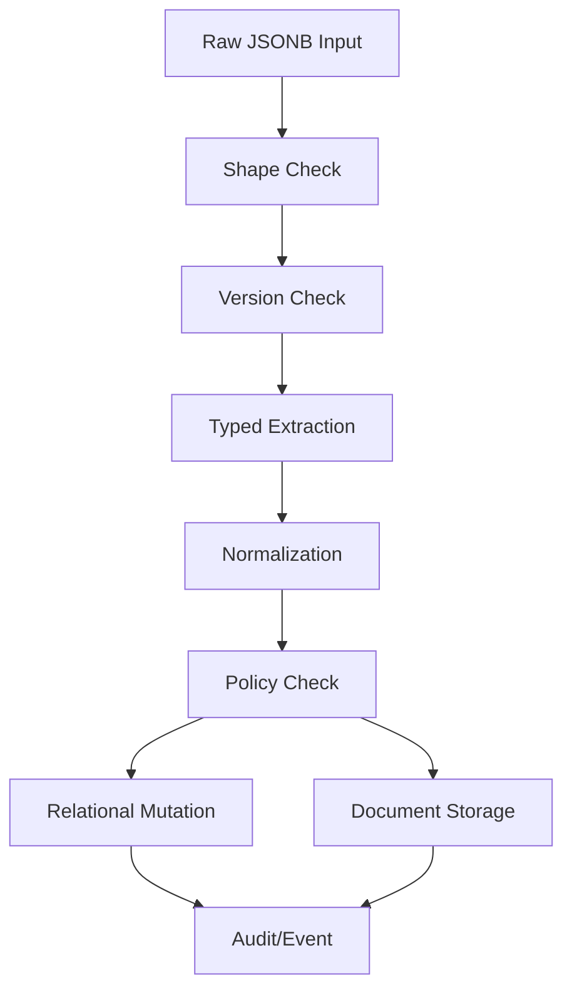

# Part 026 — JSON/JSONB Document Processing and Contract-Safe Mutation

JSONB is useful. JSONB is also one of the easiest ways to destroy your database model while feeling productive.

The trap looks like this:

```sql
CREATE TABLE event (
  id uuid PRIMARY KEY,
  payload jsonb NOT NULL
);
```

At first, this is flexible. Then the product grows.

Different services put different shapes into `payload`. Some keys are strings in one version and numbers in another. Queries become `payload ->> 'status'`. Indexes multiply. Validation moves into application code. Reporting becomes fragile. Nobody knows which fields are contractual and which are incidental.

The right mental model is:

> JSONB should represent a **bounded document island**, not an excuse to abandon durable contracts.

This part is about using JSONB with PL/pgSQL in production:

- validating JSON shape;
- extracting typed values safely;
- mutating JSON documents without corrupting contracts;
- storing versioned payloads;
- building patch functions;
- preventing schema-less drift;
- deciding when to promote JSON fields into relational columns.

---

## 1. JSON vs JSONB: Practical Position

PostgreSQL has both `json` and `jsonb`.

For most production application data, prefer `jsonb`.

Why:

- `jsonb` stores a decomposed binary representation;
- supports containment and existence operators;
- supports GIN indexes;
- normalizes object key order and removes duplicate-key ambiguity;
- is generally the better fit for querying and processing.

Use `json` only when preserving the exact input text, whitespace, or duplicate-key behavior matters. That is rare for command payloads and domain documents.

The important design question is not “json or jsonb?”

The important question is:

> Which parts of this document are contractual, indexed, audited, validated, and stable enough to become columns?

---

## 2. JSONB Boundary Types

Not all JSONB columns are the same.

| Boundary Type | Example | Design Rule |
|---|---|---|
| Command payload | raw create/update request | Store temporarily or audit; do not use as primary state forever |
| External provider response | sanction-screening result | Store raw response with provider/version metadata |
| Flexible attributes | case custom fields | Validate allowed fields and field types by config version |
| Audit snapshot | old/new row image | Append-only, query rarely, preserve evidence |
| Outbox event payload | integration message | Version explicitly; consumer contract matters |
| Search metadata | extracted optional facets | Index carefully; promote frequently queried fields |
| Embedded subdocument | structured but variable detail | Add check constraints and typed accessors |

If you cannot name the boundary type, the JSONB column is probably a dumping ground.

---

## 3. Document Contract Map

A JSONB processing flow should look like this:



The key idea: do not let raw JSONB directly become durable state.

It must pass through a contract boundary.

---

## 4. Basic JSONB Shape Guardrails

At minimum, protect root shape.

```sql
CREATE TABLE intake.case_document (
  case_id uuid PRIMARY KEY,
  document_version integer NOT NULL,
  document_body jsonb NOT NULL,
  created_at timestamptz NOT NULL DEFAULT clock_timestamp(),
  CONSTRAINT case_document_body_is_object
    CHECK (jsonb_typeof(document_body) = 'object'),
  CONSTRAINT case_document_version_positive
    CHECK (document_version > 0)
);
```

Common checks:

```sql
CHECK (jsonb_typeof(document_body) = 'object')
```

```sql
CHECK (document_body ? 'schemaVersion')
```

```sql
CHECK ((document_body ->> 'schemaVersion') ~ '^\d+$')
```

```sql
CHECK (jsonb_typeof(document_body -> 'allegations') = 'array')
```

But avoid putting very complex JSON validation directly into table `CHECK` constraints. It becomes hard to debug and hard to evolve.

Use table checks for root-level non-negotiables. Use PL/pgSQL validation functions for richer error reporting.

---

## 5. Example Document Contract

Assume an intake payload:

```json
{
  "schemaVersion": 1,
  "reporter": {
    "email": "user@example.com",
    "displayName": "Jane Reporter"
  },
  "allegations": [
    {
      "type": "misconduct",
      "description": "Delayed disclosure",
      "occurredAt": "2026-06-30T10:00:00Z"
    }
  ],
  "metadata": {
    "source": "portal"
  }
}
```

Contractual fields:

- `schemaVersion` must exist and be integer-like;
- `reporter.email` is required;
- `allegations` must be a non-empty array;
- each allegation must have `type` and `description`;
- `occurredAt`, if present, must be parseable as timestamp;
- `metadata.source`, if present, must be an allowed value.

Some of those should become relational columns:

- reporter email if used for dedup/search;
- allegation count if used for workflow decision;
- source if used for routing;
- schema version if used for compatibility.

Do not repeatedly query deep JSON paths for core workflow state.

---

## 6. Validation Function Returning Error Rows

```sql
CREATE TYPE intake.json_validation_error AS (
  error_code text,
  json_path text,
  message text,
  severity text
);
```

```sql
CREATE OR REPLACE FUNCTION intake.validate_case_payload_v1(
  p_payload jsonb
)
RETURNS SETOF intake.json_validation_error
LANGUAGE plpgsql
STABLE
AS $$
DECLARE
  v_allegation jsonb;
  v_index integer := 0;
  v_occurred_at_text text;
BEGIN
  IF p_payload IS NULL THEN
    RETURN NEXT (
      'PAYLOAD_REQUIRED',
      '$',
      'Payload is required.',
      'error'
    )::intake.json_validation_error;
    RETURN;
  END IF;

  IF jsonb_typeof(p_payload) <> 'object' THEN
    RETURN NEXT (
      'PAYLOAD_MUST_BE_OBJECT',
      '$',
      'Payload must be a JSON object.',
      'error'
    )::intake.json_validation_error;
    RETURN;
  END IF;

  IF (p_payload ->> 'schemaVersion') IS DISTINCT FROM '1' THEN
    RETURN NEXT (
      'UNSUPPORTED_SCHEMA_VERSION',
      '$.schemaVersion',
      'schemaVersion must be 1.',
      'error'
    )::intake.json_validation_error;
  END IF;

  IF nullif(btrim(p_payload #>> '{reporter,email}'), '') IS NULL THEN
    RETURN NEXT (
      'REPORTER_EMAIL_REQUIRED',
      '$.reporter.email',
      'Reporter email is required.',
      'error'
    )::intake.json_validation_error;
  END IF;

  IF jsonb_typeof(p_payload -> 'allegations') <> 'array' THEN
    RETURN NEXT (
      'ALLEGATIONS_MUST_BE_ARRAY',
      '$.allegations',
      'allegations must be an array.',
      'error'
    )::intake.json_validation_error;
    RETURN;
  END IF;

  IF jsonb_array_length(p_payload -> 'allegations') = 0 THEN
    RETURN NEXT (
      'ALLEGATIONS_REQUIRED',
      '$.allegations',
      'At least one allegation is required.',
      'error'
    )::intake.json_validation_error;
  END IF;

  FOR v_allegation IN
    SELECT value
    FROM jsonb_array_elements(p_payload -> 'allegations') AS t(value)
  LOOP
    IF jsonb_typeof(v_allegation) <> 'object' THEN
      RETURN NEXT (
        'ALLEGATION_MUST_BE_OBJECT',
        format('$.allegations[%s]', v_index),
        'Each allegation must be an object.',
        'error'
      )::intake.json_validation_error;
    ELSE
      IF nullif(btrim(v_allegation ->> 'type'), '') IS NULL THEN
        RETURN NEXT (
          'ALLEGATION_TYPE_REQUIRED',
          format('$.allegations[%s].type', v_index),
          'Allegation type is required.',
          'error'
        )::intake.json_validation_error;
      END IF;

      IF nullif(btrim(v_allegation ->> 'description'), '') IS NULL THEN
        RETURN NEXT (
          'ALLEGATION_DESCRIPTION_REQUIRED',
          format('$.allegations[%s].description', v_index),
          'Allegation description is required.',
          'error'
        )::intake.json_validation_error;
      END IF;

      v_occurred_at_text := nullif(btrim(v_allegation ->> 'occurredAt'), '');

      IF v_occurred_at_text IS NOT NULL THEN
        BEGIN
          PERFORM v_occurred_at_text::timestamptz;
        EXCEPTION WHEN invalid_datetime_format OR datetime_field_overflow THEN
          RETURN NEXT (
            'ALLEGATION_OCCURRED_AT_INVALID',
            format('$.allegations[%s].occurredAt', v_index),
            'occurredAt must be a valid timestamp.',
            'error'
          )::intake.json_validation_error;
        END;
      END IF;
    END IF;

    v_index := v_index + 1;
  END LOOP;

  RETURN;
END;
$$;
```

This function is intentionally verbose. In production, verbosity is often cheaper than ambiguous validation failures.

---

## 7. Typed Extraction

After validation, extract values into typed columns.

```sql
CREATE TABLE intake.case_intake_request (
  request_id uuid PRIMARY KEY,
  case_id uuid NOT NULL,
  schema_version integer NOT NULL,
  reporter_email text NOT NULL,
  normalized_reporter_email text NOT NULL,
  source text NOT NULL,
  allegation_count integer NOT NULL,
  raw_payload jsonb NOT NULL,
  accepted_at timestamptz NOT NULL DEFAULT clock_timestamp(),
  CHECK (jsonb_typeof(raw_payload) = 'object'),
  CHECK (allegation_count > 0)
);
```

```sql
CREATE OR REPLACE FUNCTION intake.accept_case_payload_v1(
  p_request_id uuid,
  p_case_id uuid,
  p_payload jsonb
)
RETURNS intake.case_intake_request
LANGUAGE plpgsql
AS $$
DECLARE
  v_error_count integer;
  v_result intake.case_intake_request%ROWTYPE;
  v_email text;
  v_source text;
BEGIN
  SELECT count(*)
  INTO v_error_count
  FROM intake.validate_case_payload_v1(p_payload) e
  WHERE e.severity = 'error';

  IF v_error_count > 0 THEN
    RAISE EXCEPTION USING
      ERRCODE = 'P2601',
      MESSAGE = 'CASE_PAYLOAD_INVALID',
      DETAIL = format('error_count=%s', v_error_count);
  END IF;

  v_email := p_payload #>> '{reporter,email}';
  v_source := coalesce(nullif(p_payload #>> '{metadata,source}', ''), 'unknown');

  INSERT INTO intake.case_intake_request (
    request_id,
    case_id,
    schema_version,
    reporter_email,
    normalized_reporter_email,
    source,
    allegation_count,
    raw_payload
  )
  VALUES (
    p_request_id,
    p_case_id,
    (p_payload ->> 'schemaVersion')::integer,
    btrim(v_email),
    intake.normalize_email(v_email),
    v_source,
    jsonb_array_length(p_payload -> 'allegations'),
    p_payload
  )
  RETURNING * INTO v_result;

  RETURN v_result;
END;
$$;
```

The important pattern:

```txt
Validate first.
Extract once.
Store typed columns for durable workflow/query fields.
Keep raw JSONB as evidence/source payload.
```

---

## 8. Using `jsonb_to_record` and `jsonb_to_recordset`

PostgreSQL can expand JSON objects into typed records.

For a simple object:

```sql
SELECT *
FROM jsonb_to_record(
  '{"email":"user@example.com","displayName":"Jane"}'::jsonb
) AS x(email text, display_name text);
```

For an array:

```sql
SELECT *
FROM jsonb_to_recordset(
  '[{"type":"misconduct","description":"A"}]'::jsonb
) AS x(type text, description text, occurred_at text);
```

Use this when the shape is known enough to project.

Example validation/extraction:

```sql
CREATE TYPE intake.allegation_input AS (
  allegation_type text,
  description text,
  occurred_at_text text
);
```

PostgreSQL maps JSON object keys to output column names. If the JSON uses camelCase and SQL uses snake_case, be explicit:

```sql
SELECT
  item ->> 'type' AS allegation_type,
  item ->> 'description' AS description,
  item ->> 'occurredAt' AS occurred_at_text
FROM jsonb_array_elements(p_payload -> 'allegations') AS a(item);
```

This is often clearer than relying on automatic name matching.

---

## 9. Contract-Safe Mutation

`jsonb_set` is powerful. It can also silently create inconsistent documents if used casually.

Bad:

```sql
UPDATE intake.case_document
SET document_body = jsonb_set(document_body, '{status}', '"approved"');
```

Why bad:

- no state transition check;
- no schema version check;
- no actor/reason/audit;
- no guarantee `status` belongs inside the document;
- no concurrency guard;
- no validation after mutation.

Better: expose named patch functions.

```sql
CREATE OR REPLACE FUNCTION intake_api.set_case_document_metadata_source(
  p_case_id uuid,
  p_expected_version integer,
  p_source text,
  p_actor_id uuid
)
RETURNS intake.case_document
LANGUAGE plpgsql
AS $$
DECLARE
  v_doc intake.case_document%ROWTYPE;
  v_new_body jsonb;
BEGIN
  IF p_source NOT IN ('portal', 'api', 'backoffice', 'migration') THEN
    RAISE EXCEPTION USING
      ERRCODE = 'P2602',
      MESSAGE = 'INVALID_DOCUMENT_SOURCE',
      DETAIL = format('source=%s', p_source);
  END IF;

  SELECT * INTO STRICT v_doc
  FROM intake.case_document
  WHERE case_id = p_case_id
  FOR UPDATE;

  IF v_doc.document_version <> p_expected_version THEN
    RAISE EXCEPTION USING
      ERRCODE = 'P2603',
      MESSAGE = 'DOCUMENT_VERSION_CONFLICT';
  END IF;

  v_new_body := jsonb_set(
    v_doc.document_body,
    '{metadata,source}',
    to_jsonb(p_source),
    true
  );

  IF jsonb_typeof(v_new_body) <> 'object' THEN
    RAISE EXCEPTION USING
      ERRCODE = 'P2604',
      MESSAGE = 'DOCUMENT_MUTATION_CORRUPTED_ROOT';
  END IF;

  UPDATE intake.case_document d
  SET document_body = v_new_body,
      document_version = d.document_version + 1
  WHERE d.case_id = p_case_id
  RETURNING * INTO v_doc;

  INSERT INTO intake.case_audit_event (
    case_id,
    actor_id,
    event_type,
    event_payload
  )
  VALUES (
    p_case_id,
    p_actor_id,
    'case.document.metadata_source_changed',
    jsonb_build_object('source', p_source)
  );

  RETURN v_doc;
END;
$$;
```

The named function makes intent explicit.

---

## 10. Generic JSON Patch: Be Careful

A generic patch endpoint is tempting:

```sql
apply_json_patch(case_id, path, value)
```

This is dangerous unless you have an allow-list.

```sql
CREATE TABLE intake.allowed_document_patch_path (
  schema_version integer NOT NULL,
  path text[] NOT NULL,
  value_type text NOT NULL,
  requires_reason boolean NOT NULL DEFAULT true,
  PRIMARY KEY (schema_version, path)
);

INSERT INTO intake.allowed_document_patch_path (
  schema_version,
  path,
  value_type
)
VALUES
  (1, ARRAY['metadata','source'], 'string'),
  (1, ARRAY['reporter','displayName'], 'string');
```

Patch function:

```sql
CREATE OR REPLACE FUNCTION intake_api.patch_case_document_allowed_path(
  p_case_id uuid,
  p_expected_version integer,
  p_path text[],
  p_value jsonb,
  p_reason_code text,
  p_actor_id uuid
)
RETURNS intake.case_document
LANGUAGE plpgsql
AS $$
DECLARE
  v_doc intake.case_document%ROWTYPE;
  v_allowed intake.allowed_document_patch_path%ROWTYPE;
  v_value_type text := jsonb_typeof(p_value);
  v_new_body jsonb;
BEGIN
  SELECT * INTO STRICT v_doc
  FROM intake.case_document
  WHERE case_id = p_case_id
  FOR UPDATE;

  IF v_doc.document_version <> p_expected_version THEN
    RAISE EXCEPTION USING MESSAGE = 'DOCUMENT_VERSION_CONFLICT';
  END IF;

  SELECT * INTO v_allowed
  FROM intake.allowed_document_patch_path a
  WHERE a.schema_version = v_doc.document_version
    AND a.path = p_path;

  IF NOT FOUND THEN
    RAISE EXCEPTION USING
      ERRCODE = 'P2605',
      MESSAGE = 'DOCUMENT_PATCH_PATH_NOT_ALLOWED',
      DETAIL = format('path=%s', p_path);
  END IF;

  IF v_allowed.value_type <> v_value_type THEN
    RAISE EXCEPTION USING
      ERRCODE = 'P2606',
      MESSAGE = 'DOCUMENT_PATCH_VALUE_TYPE_INVALID',
      DETAIL = format('expected=%s actual=%s', v_allowed.value_type, v_value_type);
  END IF;

  IF v_allowed.requires_reason AND nullif(btrim(p_reason_code), '') IS NULL THEN
    RAISE EXCEPTION USING
      ERRCODE = 'P2607',
      MESSAGE = 'DOCUMENT_PATCH_REASON_REQUIRED';
  END IF;

  v_new_body := jsonb_set(v_doc.document_body, p_path, p_value, true);

  UPDATE intake.case_document d
  SET document_body = v_new_body,
      document_version = d.document_version + 1
  WHERE d.case_id = p_case_id
  RETURNING * INTO v_doc;

  INSERT INTO intake.case_audit_event (
    case_id,
    actor_id,
    event_type,
    reason_code,
    event_payload
  )
  VALUES (
    p_case_id,
    p_actor_id,
    'case.document.patched',
    p_reason_code,
    jsonb_build_object(
      'path', p_path,
      'valueType', v_value_type
    )
  );

  RETURN v_doc;
END;
$$;
```

There is a subtle bug in the example: it compares patch-path schema version to `document_version`, which is a concurrency version, not a schema version. Fix the schema by separating them.

```sql
ALTER TABLE intake.case_document
ADD COLUMN schema_version integer NOT NULL DEFAULT 1;
```

Then the lookup should use:

```sql
WHERE a.schema_version = v_doc.schema_version
```

This is an important production lesson: **document schema version and optimistic concurrency version are different concepts**.

---

## 11. JSONB Null vs SQL NULL

This is a common source of bugs.

```sql
SELECT jsonb_typeof('null'::jsonb);
-- 'null'

SELECT jsonb_typeof(NULL::jsonb);
-- SQL NULL
```

`payload -> 'x'` returns JSONB or SQL NULL if key missing.

`payload ->> 'x'` returns text or SQL NULL if key missing. If the JSON value is `null`, `->>` also returns SQL NULL.

Implication:

```sql
IF p_payload ->> 'email' IS NULL THEN
  -- key missing OR JSON null
END IF;
```

If you need to distinguish missing key from JSON null:

```sql
IF NOT (p_payload ? 'email') THEN
  -- missing key
ELSIF jsonb_typeof(p_payload -> 'email') = 'null' THEN
  -- explicit JSON null
END IF;
```

Design rule: for command payloads, usually treat missing and null as invalid unless the contract says otherwise.

---

## 12. JSONB Path and SQL/JSON Path

For simple paths, operators are enough:

```sql
p_payload #>> '{reporter,email}'
```

For more complex predicates, JSON path functions can help:

```sql
SELECT jsonb_path_exists(
  p_payload,
  '$.allegations[*] ? (@.type == "misconduct")'
);
```

Use JSON path for:

- existence of nested structures;
- array element predicates;
- complex document search;
- validation helper checks.

Avoid using JSON path as a hidden business rules DSL. A policy that matters should still have named functions, tests, and audit context.

---

## 13. Promoting JSON Fields into Columns

A field should probably become a column when:

- it participates in workflow decisions;
- it is used in joins;
- it is filtered/sorted frequently;
- it needs foreign key integrity;
- it needs uniqueness;
- it needs permissions/security policy;
- it appears in many reports;
- it is used for partitioning;
- it has a stable domain meaning.

Example:

```sql
ALTER TABLE intake.case_intake_request
ADD COLUMN reporter_country_code text;
```

Backfill:

```sql
UPDATE intake.case_intake_request
SET reporter_country_code = upper(raw_payload #>> '{reporter,countryCode}')
WHERE raw_payload #>> '{reporter,countryCode}' IS NOT NULL;
```

Then enforce:

```sql
ALTER TABLE intake.case_intake_request
ADD CONSTRAINT reporter_country_code_format_ck
CHECK (
  reporter_country_code IS NULL
  OR reporter_country_code ~ '^[A-Z]{2}$'
);
```

JSONB is good for flexible edges. Relational columns are better for durable core semantics.

---

## 14. Indexing JSONB Without Losing Your Mind

JSONB indexes are useful, but they should not become a substitute for modeling.

Common indexes:

```sql
CREATE INDEX case_intake_request_raw_payload_gin_idx
ON intake.case_intake_request
USING gin (raw_payload);
```

Expression index:

```sql
CREATE INDEX case_intake_request_source_idx
ON intake.case_intake_request ((raw_payload #>> '{metadata,source}'));
```

Partial index:

```sql
CREATE INDEX case_intake_request_portal_idx
ON intake.case_intake_request (accepted_at)
WHERE raw_payload #>> '{metadata,source}' = 'portal';
```

Generated column + normal index is often clearer:

```sql
ALTER TABLE intake.case_intake_request
ADD COLUMN source_from_payload text GENERATED ALWAYS AS (
  raw_payload #>> '{metadata,source}'
) STORED;

CREATE INDEX case_intake_request_source_from_payload_idx
ON intake.case_intake_request (source_from_payload);
```

Review question:

> If this JSON path is important enough to index, is it important enough to be a named column?

Often yes.

---

## 15. Audit Diff for JSONB Documents

A simple top-level diff helper:

```sql
CREATE OR REPLACE FUNCTION intake.jsonb_top_level_diff(
  p_old jsonb,
  p_new jsonb
)
RETURNS jsonb
LANGUAGE sql
IMMUTABLE
AS $$
  WITH keys AS (
    SELECT key FROM jsonb_object_keys(coalesce(p_old, '{}'::jsonb)) AS k(key)
    UNION
    SELECT key FROM jsonb_object_keys(coalesce(p_new, '{}'::jsonb)) AS k(key)
  )
  SELECT coalesce(
    jsonb_object_agg(
      key,
      jsonb_build_object(
        'old', p_old -> key,
        'new', p_new -> key
      )
    ) FILTER (WHERE (p_old -> key) IS DISTINCT FROM (p_new -> key)),
    '{}'::jsonb
  )
  FROM keys
$$;
```

Trigger example:

```sql
CREATE OR REPLACE FUNCTION intake.audit_case_document_change()
RETURNS trigger
LANGUAGE plpgsql
AS $$
DECLARE
  v_diff jsonb;
BEGIN
  v_diff := intake.jsonb_top_level_diff(OLD.document_body, NEW.document_body);

  IF v_diff <> '{}'::jsonb THEN
    INSERT INTO intake.case_audit_event (
      case_id,
      actor_id,
      event_type,
      event_payload
    )
    VALUES (
      NEW.case_id,
      coalesce(current_setting('app.actor_id', true), '00000000-0000-0000-0000-000000000000')::uuid,
      'case.document.changed',
      jsonb_build_object('diff', v_diff)
    );
  END IF;

  RETURN NEW;
END;
$$;
```

This is top-level only. Deep diffs are more complex and can become expensive. For regulatory audit, it is often better to store command events and old/new snapshots than to rely entirely on computed diffs.

---

## 16. Versioned Payloads

JSONB contracts evolve. Add schema version to documents.

```sql
CREATE TABLE intake.case_document_versioned (
  case_id uuid PRIMARY KEY,
  schema_version integer NOT NULL,
  document_version bigint NOT NULL DEFAULT 1,
  document_body jsonb NOT NULL,
  CHECK (schema_version > 0),
  CHECK (document_version > 0),
  CHECK (jsonb_typeof(document_body) = 'object')
);
```

Dispatch validation by schema version:

```sql
CREATE OR REPLACE FUNCTION intake.validate_case_payload(
  p_payload jsonb
)
RETURNS SETOF intake.json_validation_error
LANGUAGE plpgsql
STABLE
AS $$
DECLARE
  v_schema_version integer;
BEGIN
  IF p_payload IS NULL OR jsonb_typeof(p_payload) <> 'object' THEN
    RETURN NEXT (
      'PAYLOAD_MUST_BE_OBJECT', '$', 'Payload must be a JSON object.', 'error'
    )::intake.json_validation_error;
    RETURN;
  END IF;

  BEGIN
    v_schema_version := (p_payload ->> 'schemaVersion')::integer;
  EXCEPTION WHEN invalid_text_representation THEN
    RETURN NEXT (
      'SCHEMA_VERSION_INVALID', '$.schemaVersion', 'schemaVersion must be an integer.', 'error'
    )::intake.json_validation_error;
    RETURN;
  END;

  IF v_schema_version = 1 THEN
    RETURN QUERY SELECT * FROM intake.validate_case_payload_v1(p_payload);
  ELSE
    RETURN NEXT (
      'UNSUPPORTED_SCHEMA_VERSION', '$.schemaVersion', 'Unsupported schema version.', 'error'
    )::intake.json_validation_error;
  END IF;

  RETURN;
END;
$$;
```

Do not silently assume “latest” when reading old documents. Version dispatch should be explicit.

---

## 17. Migrating JSONB Documents

A migration function should be explicit about source and target schema versions.

```sql
CREATE OR REPLACE FUNCTION intake.migrate_case_payload_v1_to_v2(
  p_payload jsonb
)
RETURNS jsonb
LANGUAGE plpgsql
IMMUTABLE
AS $$
DECLARE
  v_new jsonb;
BEGIN
  IF (p_payload ->> 'schemaVersion') IS DISTINCT FROM '1' THEN
    RAISE EXCEPTION USING
      ERRCODE = 'P2610',
      MESSAGE = 'SOURCE_SCHEMA_VERSION_NOT_V1';
  END IF;

  v_new := jsonb_set(p_payload, '{schemaVersion}', '2'::jsonb, true);

  v_new := jsonb_set(
    v_new,
    '{metadata,migratedFrom}',
    '"v1"'::jsonb,
    true
  );

  RETURN v_new;
END;
$$;
```

This function is `IMMUTABLE` only if it depends solely on input JSONB.

For actual table migration:

```sql
CREATE OR REPLACE PROCEDURE intake_api.migrate_case_documents_v1_to_v2(
  p_limit integer DEFAULT 1000
)
LANGUAGE plpgsql
AS $$
DECLARE
  r record;
BEGIN
  FOR r IN
    SELECT case_id, document_body
    FROM intake.case_document_versioned
    WHERE schema_version = 1
    ORDER BY case_id
    LIMIT p_limit
    FOR UPDATE SKIP LOCKED
  LOOP
    UPDATE intake.case_document_versioned d
    SET document_body = intake.migrate_case_payload_v1_to_v2(r.document_body),
        schema_version = 2,
        document_version = d.document_version + 1
    WHERE d.case_id = r.case_id;
  END LOOP;
END;
$$;
```

Batch migration should be observable, retryable, and resumable. Do not do massive JSON rewrites blindly in one transaction unless the table is small and the maintenance window is explicit.

---

## 18. JSONB and Triggers

A trigger can protect root document invariants when multiple mutation paths exist.

```sql
CREATE OR REPLACE FUNCTION intake.guard_case_document_contract()
RETURNS trigger
LANGUAGE plpgsql
AS $$
DECLARE
  v_error_count integer;
BEGIN
  IF jsonb_typeof(NEW.document_body) <> 'object' THEN
    RAISE EXCEPTION USING
      ERRCODE = 'P2611',
      MESSAGE = 'DOCUMENT_BODY_MUST_BE_OBJECT';
  END IF;

  SELECT count(*)
  INTO v_error_count
  FROM intake.validate_case_payload(NEW.document_body)
  WHERE severity = 'error';

  IF v_error_count > 0 THEN
    RAISE EXCEPTION USING
      ERRCODE = 'P2612',
      MESSAGE = 'DOCUMENT_BODY_INVALID',
      DETAIL = format('error_count=%s', v_error_count);
  END IF;

  RETURN NEW;
END;
$$;

CREATE TRIGGER case_document_contract_trg
BEFORE INSERT OR UPDATE OF document_body ON intake.case_document_versioned
FOR EACH ROW
EXECUTE FUNCTION intake.guard_case_document_contract();
```

Trade-off:

- stronger protection;
- higher write cost;
- less contextual error reporting;
- risk of validation logic becoming too heavy for every update.

Use this for critical documents, not for every incidental JSONB blob.

---

## 19. Outbox Event Payloads

Outbox payloads are JSONB contracts for consumers.

```sql
CREATE TABLE integration.outbox_event (
  event_id uuid PRIMARY KEY,
  aggregate_type text NOT NULL,
  aggregate_id uuid NOT NULL,
  event_type text NOT NULL,
  event_version integer NOT NULL,
  payload jsonb NOT NULL,
  occurred_at timestamptz NOT NULL DEFAULT clock_timestamp(),
  published_at timestamptz,
  CHECK (jsonb_typeof(payload) = 'object'),
  CHECK (event_version > 0)
);
```

Create events with named builders:

```sql
CREATE OR REPLACE FUNCTION integration.build_case_submitted_event_v1(
  p_case intake.case_file
)
RETURNS jsonb
LANGUAGE sql
STABLE
AS $$
  SELECT jsonb_build_object(
    'eventVersion', 1,
    'caseId', p_case.case_id,
    'status', p_case.status,
    'submittedAt', p_case.submitted_at,
    'reporterEmail', p_case.normalized_reporter_email
  )
$$;
```

Then in command function:

```sql
INSERT INTO integration.outbox_event (
  event_id,
  aggregate_type,
  aggregate_id,
  event_type,
  event_version,
  payload
)
VALUES (
  gen_random_uuid(),
  'case',
  v_case.case_id,
  'case.submitted',
  1,
  integration.build_case_submitted_event_v1(v_case)
);
```

Do not build critical event payloads ad hoc in ten different functions. Use named builders and tests.

---

## 20. Dynamic JSON Keys and Allow-Lists

JSONB often comes with dynamic custom fields.

Example: custom intake attributes by case type.

```sql
CREATE TABLE intake.custom_field_definition (
  case_type text NOT NULL,
  field_key text NOT NULL,
  value_type text NOT NULL,
  required boolean NOT NULL DEFAULT false,
  active boolean NOT NULL DEFAULT true,
  PRIMARY KEY (case_type, field_key),
  CHECK (field_key ~ '^[a-z][a-zA-Z0-9_]{0,63}$'),
  CHECK (value_type IN ('string', 'number', 'boolean', 'array', 'object'))
);
```

Validator:

```sql
CREATE OR REPLACE FUNCTION intake.validate_custom_fields(
  p_case_type text,
  p_custom_fields jsonb
)
RETURNS SETOF intake.json_validation_error
LANGUAGE plpgsql
STABLE
AS $$
DECLARE
  r record;
  v_key text;
BEGIN
  IF p_custom_fields IS NULL THEN
    p_custom_fields := '{}'::jsonb;
  END IF;

  IF jsonb_typeof(p_custom_fields) <> 'object' THEN
    RETURN NEXT (
      'CUSTOM_FIELDS_MUST_BE_OBJECT',
      '$.customFields',
      'customFields must be an object.',
      'error'
    )::intake.json_validation_error;
    RETURN;
  END IF;

  FOR r IN
    SELECT field_key, value_type, required
    FROM intake.custom_field_definition
    WHERE case_type = p_case_type
      AND active
  LOOP
    IF r.required AND NOT (p_custom_fields ? r.field_key) THEN
      RETURN NEXT (
        'CUSTOM_FIELD_REQUIRED',
        format('$.customFields.%s', r.field_key),
        format('Custom field %s is required.', r.field_key),
        'error'
      )::intake.json_validation_error;
    ELSIF p_custom_fields ? r.field_key
          AND jsonb_typeof(p_custom_fields -> r.field_key) <> r.value_type THEN
      RETURN NEXT (
        'CUSTOM_FIELD_TYPE_INVALID',
        format('$.customFields.%s', r.field_key),
        format('Custom field %s must be %s.', r.field_key, r.value_type),
        'error'
      )::intake.json_validation_error;
    END IF;
  END LOOP;

  FOR v_key IN
    SELECT key FROM jsonb_object_keys(p_custom_fields) AS k(key)
  LOOP
    IF NOT EXISTS (
      SELECT 1
      FROM intake.custom_field_definition d
      WHERE d.case_type = p_case_type
        AND d.field_key = v_key
        AND d.active
    ) THEN
      RETURN NEXT (
        'CUSTOM_FIELD_NOT_ALLOWED',
        format('$.customFields.%s', v_key),
        format('Custom field %s is not allowed.', v_key),
        'error'
      )::intake.json_validation_error;
    END IF;
  END LOOP;

  RETURN;
END;
$$;
```

This is a controlled schema-flexible pattern. It is very different from “store anything in JSONB”.

---

## 21. JSONB Contract Anti-Patterns

### 21.1 Payload-as-Database

```sql
SELECT * FROM case_file WHERE payload ->> 'status' = 'approved';
```

If `status` drives workflow, it belongs in a column.

### 21.2 Unversioned Documents

No `schemaVersion`, no migration path, no compatibility story.

### 21.3 Generic Patch Without Allow-List

Any caller can mutate any path.

### 21.4 Validation Only in Application

A migration or admin script writes invalid documents.

### 21.5 Over-Indexing JSONB Paths

Dozens of expression indexes reveal missing modeling decisions.

### 21.6 Silent Cast Failures or Broad Exception Blocks

```sql
BEGIN
  v_amount := (p_payload ->> 'amount')::numeric;
EXCEPTION WHEN others THEN
  v_amount := 0;
END;
```

This converts data corruption into fake data.

### 21.7 Deep JSON Loops in Hot Paths

Repeatedly scanning large arrays in PL/pgSQL can become expensive. Extract relational child rows when arrays become operationally important.

---

## 22. Child Rows vs JSON Arrays

Keep arrays in JSONB when:

- array is small;
- array is mostly evidence/source payload;
- elements are not independently addressed;
- no foreign keys needed;
- no frequent filtering/joining per element.

Promote to child table when:

- elements have lifecycle;
- elements need identity;
- elements are queried independently;
- elements need permissions;
- elements need audit per item;
- array can grow large;
- element-level constraints matter.

Example promotion:

```sql
CREATE TABLE intake.case_allegation (
  allegation_id uuid PRIMARY KEY,
  case_id uuid NOT NULL REFERENCES intake.case_file(case_id),
  allegation_type text NOT NULL,
  description text NOT NULL,
  occurred_at timestamptz,
  created_at timestamptz NOT NULL DEFAULT clock_timestamp()
);
```

Extractor:

```sql
CREATE OR REPLACE FUNCTION intake_api.extract_allegations_from_payload(
  p_case_id uuid,
  p_payload jsonb
)
RETURNS integer
LANGUAGE plpgsql
AS $$
DECLARE
  r record;
  v_inserted integer := 0;
BEGIN
  IF jsonb_typeof(p_payload -> 'allegations') <> 'array' THEN
    RAISE EXCEPTION USING MESSAGE = 'ALLEGATIONS_MUST_BE_ARRAY';
  END IF;

  FOR r IN
    SELECT
      item ->> 'type' AS allegation_type,
      item ->> 'description' AS description,
      nullif(item ->> 'occurredAt', '') AS occurred_at_text
    FROM jsonb_array_elements(p_payload -> 'allegations') AS a(item)
  LOOP
    INSERT INTO intake.case_allegation (
      allegation_id,
      case_id,
      allegation_type,
      description,
      occurred_at
    )
    VALUES (
      gen_random_uuid(),
      p_case_id,
      r.allegation_type,
      r.description,
      r.occurred_at_text::timestamptz
    );

    v_inserted := v_inserted + 1;
  END LOOP;

  RETURN v_inserted;
END;
$$;
```

If this function becomes hot, rewrite it as set-based `INSERT INTO ... SELECT` rather than loop insert.

---

## 23. Set-Based Extraction

Better for bulk extraction:

```sql
CREATE OR REPLACE FUNCTION intake_api.extract_allegations_from_payload_set_based(
  p_case_id uuid,
  p_payload jsonb
)
RETURNS integer
LANGUAGE plpgsql
AS $$
DECLARE
  v_inserted integer;
BEGIN
  INSERT INTO intake.case_allegation (
    allegation_id,
    case_id,
    allegation_type,
    description,
    occurred_at
  )
  SELECT
    gen_random_uuid(),
    p_case_id,
    item ->> 'type',
    item ->> 'description',
    nullif(item ->> 'occurredAt', '')::timestamptz
  FROM jsonb_array_elements(p_payload -> 'allegations') AS a(item);

  GET DIAGNOSTICS v_inserted = ROW_COUNT;
  RETURN v_inserted;
END;
$$;
```

Set-based SQL is usually better than row-by-row PL/pgSQL when transforming arrays into rows.

---

## 24. Security Considerations

JSONB can contain sensitive data.

Guardrails:

- classify payload fields;
- avoid logging full payloads in exceptions;
- mask sensitive paths in audit events;
- restrict direct table access;
- use views/functions to expose safe projections;
- consider column-level privileges for raw JSONB;
- do not put secrets in outbox payloads;
- avoid dynamic SQL built from JSON keys without allow-lists.

Bad:

```sql
RAISE EXCEPTION 'invalid payload: %', p_payload;
```

Better:

```sql
RAISE EXCEPTION USING
  MESSAGE = 'CASE_PAYLOAD_INVALID',
  DETAIL = jsonb_build_object(
    'schemaVersion', p_payload ->> 'schemaVersion',
    'payloadType', jsonb_typeof(p_payload)
  )::text;
```

The database log is not a safe place for arbitrary user payloads.

---

## 25. Operational Queries

Find payloads with invalid root shape:

```sql
SELECT case_id, jsonb_typeof(document_body) AS root_type
FROM intake.case_document_versioned
WHERE jsonb_typeof(document_body) <> 'object';
```

Find schema versions in use:

```sql
SELECT schema_version, count(*)
FROM intake.case_document_versioned
GROUP BY schema_version
ORDER BY schema_version;
```

Find large documents:

```sql
SELECT case_id, pg_column_size(document_body) AS bytes
FROM intake.case_document_versioned
ORDER BY pg_column_size(document_body) DESC
LIMIT 20;
```

Find documents missing expected keys:

```sql
SELECT case_id
FROM intake.case_document_versioned
WHERE schema_version = 1
  AND NOT (document_body ? 'reporter');
```

Find source distribution:

```sql
SELECT document_body #>> '{metadata,source}' AS source, count(*)
FROM intake.case_document_versioned
GROUP BY source
ORDER BY count(*) DESC;
```

These queries should be part of runbooks for JSON-heavy tables.

---

## 26. Testing Strategy

Test JSONB functions with fixtures.

### 26.1 Valid Payload

```sql
SELECT is_empty(
  $$
    SELECT error_code
    FROM intake.validate_case_payload_v1(
      '{
        "schemaVersion": 1,
        "reporter": {"email": "user@example.com"},
        "allegations": [
          {"type": "misconduct", "description": "Delayed disclosure"}
        ]
      }'::jsonb
    )
    WHERE severity = 'error'
  $$,
  'valid v1 payload has no errors'
);
```

### 26.2 Invalid Shape

```sql
SELECT results_eq(
  $$
    SELECT error_code
    FROM intake.validate_case_payload_v1('[]'::jsonb)
  $$,
  ARRAY['PAYLOAD_MUST_BE_OBJECT'],
  'array root is rejected'
);
```

### 26.3 Null vs Missing

Test both:

```json
{"reporter": {"email": null}}
```

and:

```json
{"reporter": {}}
```

If your contract treats them differently, tests must prove it.

### 26.4 Patch Allow-List

Test:

- allowed path succeeds;
- unknown path fails;
- wrong value type fails;
- stale version fails;
- audit event is written;
- raw document remains object;
- schema version and document version are not confused.

---

## 27. Review Checklist

For every JSONB column:

- What boundary type is it?
- Is root shape constrained?
- Is schema version explicit?
- Which fields are contractual?
- Which fields should be columns?
- Which fields are indexed?
- Which fields are sensitive?
- Is validation database-enforced, application-enforced, or both?
- Are JSON null and missing key semantics defined?
- Are mutation paths named and allow-listed?
- Is optimistic concurrency version separate from schema version?
- Are event payloads versioned?
- Are large arrays extracted into child rows where needed?
- Are JSONB functions tested with fixtures?
- Are logs protected from full payload leakage?

---

## 28. Practical Rule of Thumb

Use JSONB when the shape is legitimately flexible, evidence-like, external, or versioned.

Use relational columns when the value is identity, workflow state, searchable fact, join key, security boundary, foreign key, or frequently queried dimension.

Use PL/pgSQL to enforce the boundary:

```txt
JSONB input -> validate -> extract typed facts -> mutate relational state -> store raw evidence -> audit decision
```

Do not let JSONB become the place where contracts go to disappear.

A strong JSONB design is not schema-less.

It is schema-conscious, versioned, validated, observable, and honest about which facts deserve relational form.
