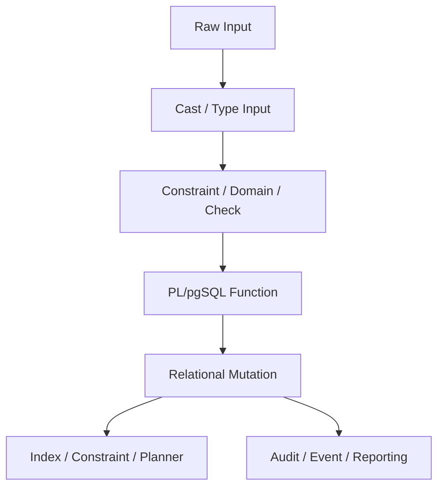

# Part 027 — Arrays, Ranges, Enums, and Advanced PostgreSQL Types in PL/pgSQL

A common sign of immature PL/pgSQL code is that every value becomes one of four things:

- `text`;
- `integer`;
- `boolean`;
- `jsonb`.

That works for a prototype. It fails under production semantics.

PostgreSQL is not just a row store with SQL syntax. It has a rich type system. PL/pgSQL becomes much more powerful when you let the type system carry part of the domain model.

But advanced types are not magic. They can also create opaque code, weak contracts, and difficult migrations.

The engineering question is not:

> Can PostgreSQL represent this type?

The better question is:

> Does this type make the invariant simpler, safer, and more visible?

This part focuses on using PostgreSQL-native advanced types inside PL/pgSQL:

- arrays;
- ranges;
- multiranges;
- enums;
- domains;
- composite values;
- network and identifier-like types;
- type-driven function contracts;
- advanced-type failure modes.

The goal is to make PL/pgSQL code **more precise**, not more clever.

---

## 1. The Type-System Mental Model

Think of PostgreSQL types as a contract layer between raw data and domain behavior.



A type can help with five things:

| Type Role | Example | Benefit |
|---|---|---|
| Shape | `uuid[]`, `text[]`, composite | Reject impossible structures early |
| Vocabulary | enum, domain | Restrict allowed values |
| Interval semantics | `daterange`, `tstzrange` | Make overlap/containment explicit |
| Operator semantics | network/range/array operators | Use optimized relational operators |
| Documentation | function signatures | Make contracts visible to callers |

Bad type usage does the opposite:

- hides relational structure inside arrays;
- stores workflow state in enums that change too often;
- uses ranges without constraints;
- passes anonymous `record` values around without contract;
- uses JSONB because a proper type design feels slower.

The rule:

> Use advanced types where they make invalid states harder to represent.

---

## 2. Arrays Are Value Lists, Not Child Tables

PostgreSQL arrays are useful. They are also often misused as embedded tables.

Good array use cases:

- small bounded lists passed into a function;
- temporary command inputs;
- tags/flags that are not independently addressable;
- bulk IDs for set-based operations;
- fixed-shape vectors where position is meaningful and controlled.

Bad array use cases:

- order items;
- case assignees with assignment metadata;
- workflow history;
- approvals;
- child rows with lifecycle;
- anything needing per-element audit, permissions, or foreign keys.

A safe test:

> If an array element needs its own identity, timestamp, status, or audit trail, it is probably a table.

---

## 3. Passing Arrays into PL/pgSQL

A frequent production pattern is passing a set of IDs into a function.

```sql
CREATE OR REPLACE FUNCTION case_mgmt.assign_cases(
  p_case_ids uuid[],
  p_assignee_id uuid,
  p_actor_id uuid
)
RETURNS TABLE (
  case_id uuid,
  assigned boolean,
  reason text
)
LANGUAGE plpgsql
AS $$
DECLARE
  v_case_id uuid;
BEGIN
  IF p_case_ids IS NULL OR cardinality(p_case_ids) = 0 THEN
    RAISE EXCEPTION USING
      ERRCODE = 'P2701',
      MESSAGE = 'case_ids must not be empty';
  END IF;

  FOREACH v_case_id IN ARRAY p_case_ids LOOP
    UPDATE case_mgmt.case_file c
       SET assignee_id = p_assignee_id,
           updated_by = p_actor_id,
           updated_at = clock_timestamp()
     WHERE c.id = v_case_id
       AND c.status IN ('open', 'under_review');

    IF FOUND THEN
      case_id := v_case_id;
      assigned := true;
      reason := 'assigned';
      RETURN NEXT;
    ELSE
      case_id := v_case_id;
      assigned := false;
      reason := 'not_found_or_not_assignable';
      RETURN NEXT;
    END IF;
  END LOOP;
END;
$$;
```

This is simple. It is also not always the best implementation.

For many IDs, prefer set-based SQL:

```sql
CREATE OR REPLACE FUNCTION case_mgmt.assign_cases_set_based(
  p_case_ids uuid[],
  p_assignee_id uuid,
  p_actor_id uuid
)
RETURNS TABLE (
  case_id uuid,
  assigned boolean,
  reason text
)
LANGUAGE plpgsql
AS $$
BEGIN
  IF p_case_ids IS NULL OR cardinality(p_case_ids) = 0 THEN
    RAISE EXCEPTION USING
      ERRCODE = 'P2701',
      MESSAGE = 'case_ids must not be empty';
  END IF;

  RETURN QUERY
  WITH input_ids AS (
    SELECT DISTINCT x.case_id
    FROM unnest(p_case_ids) AS x(case_id)
  ), updated AS (
    UPDATE case_mgmt.case_file c
       SET assignee_id = p_assignee_id,
           updated_by = p_actor_id,
           updated_at = clock_timestamp()
      FROM input_ids i
     WHERE c.id = i.case_id
       AND c.status IN ('open', 'under_review')
     RETURNING c.id
  )
  SELECT i.case_id,
         u.id IS NOT NULL AS assigned,
         CASE WHEN u.id IS NOT NULL
              THEN 'assigned'
              ELSE 'not_found_or_not_assignable'
          END AS reason
    FROM input_ids i
    LEFT JOIN updated u ON u.id = i.case_id;
END;
$$;
```

The set-based version has better planner visibility and avoids one SQL statement per element.

---

## 4. Array Invariants You Must Enforce Explicitly

PostgreSQL can store arrays of variable length. Declared size and dimension are not a reliable runtime constraint for table columns. Treat array size declarations as documentation, not enforcement.

So if the domain requires a bounded list, enforce it.

```sql
CREATE TABLE case_mgmt.notification_rule (
  id uuid PRIMARY KEY,
  name text NOT NULL,
  channels text[] NOT NULL,
  CONSTRAINT notification_rule_channels_non_empty
    CHECK (cardinality(channels) BETWEEN 1 AND 3),
  CONSTRAINT notification_rule_channels_allowed
    CHECK (channels <@ ARRAY['email', 'sms', 'webhook']::text[])
);
```

Important operators:

| Operator / Function | Meaning | Typical Use |
|---|---|---|
| `cardinality(a)` | total element count | non-empty/bounded checks |
| `array_length(a, 1)` | length of dimension 1 | one-dimensional checks |
| `unnest(a)` | array to rows | set-based processing |
| `= ANY(a)` | scalar membership | filter against input IDs |
| `<@` | array contained by array | allowed-values check |
| `@>` | array contains array | required values check |
| `&&` | array overlaps array | matching tags/flags |

Production rule:

> If an array is durable state, it needs explicit constraints just like a table does.

---

## 5. Avoid Array Order Ambiguity

Arrays preserve order, but order is often semantically unclear.

This is weak:

```sql
reviewer_ids uuid[]
```

Does position mean priority? assignment sequence? display order? fallback chain?

If position matters, name it.

```sql
CREATE TABLE case_mgmt.case_reviewer (
  case_id uuid NOT NULL REFERENCES case_mgmt.case_file(id),
  reviewer_id uuid NOT NULL,
  review_order integer NOT NULL,
  assigned_at timestamptz NOT NULL DEFAULT clock_timestamp(),
  PRIMARY KEY (case_id, reviewer_id),
  UNIQUE (case_id, review_order)
);
```

Use arrays for command input:

```sql
SELECT case_mgmt.set_reviewer_order(
  p_case_id := '2b5f4b2a-b1a7-4a8a-87f6-7d3f2e0e1c41',
  p_reviewer_ids := ARRAY[
    '8ef6d2c3-8a68-49df-87c3-1e1e0b6e81ac',
    'a9df8cc4-5d7b-44ed-93d0-0188db14f63d'
  ]::uuid[],
  p_actor_id := '11111111-1111-1111-1111-111111111111'
);
```

Then normalize into rows inside the function.

```sql
CREATE OR REPLACE FUNCTION case_mgmt.set_reviewer_order(
  p_case_id uuid,
  p_reviewer_ids uuid[],
  p_actor_id uuid
)
RETURNS void
LANGUAGE plpgsql
AS $$
BEGIN
  IF cardinality(p_reviewer_ids) = 0 THEN
    RAISE EXCEPTION USING
      ERRCODE = 'P2702',
      MESSAGE = 'reviewer list must not be empty';
  END IF;

  IF cardinality(p_reviewer_ids) <> (
    SELECT count(DISTINCT x)::integer FROM unnest(p_reviewer_ids) AS x
  ) THEN
    RAISE EXCEPTION USING
      ERRCODE = 'P2703',
      MESSAGE = 'reviewer list must not contain duplicates';
  END IF;

  DELETE FROM case_mgmt.case_reviewer
   WHERE case_id = p_case_id;

  INSERT INTO case_mgmt.case_reviewer(case_id, reviewer_id, review_order, assigned_by)
  SELECT p_case_id,
         x.reviewer_id,
         x.ordinality::integer,
         p_actor_id
    FROM unnest(p_reviewer_ids) WITH ORDINALITY AS x(reviewer_id, ordinality);
END;
$$;
```

The array is an input format. The table is the durable model.

---

## 6. Enums: Stable Vocabulary, Not Workflow Design

PostgreSQL enums are excellent when the vocabulary is stable.

Good enum use cases:

- provider classification with rare change;
- severity level with stable order;
- communication channel;
- audit event category;
- lifecycle state only if changes are controlled and rare.

Risky enum use cases:

- product-configured statuses;
- tenant-specific workflow states;
- values that need localization, display metadata, sorting rules, or deprecation windows;
- values that are frequently added/removed/renamed.

Example:

```sql
CREATE TYPE case_mgmt.case_priority AS ENUM (
  'low',
  'normal',
  'high',
  'critical'
);

ALTER TABLE case_mgmt.case_file
  ADD COLUMN priority case_mgmt.case_priority NOT NULL DEFAULT 'normal';
```

PL/pgSQL function:

```sql
CREATE OR REPLACE FUNCTION case_mgmt.escalate_priority(
  p_case_id uuid,
  p_actor_id uuid,
  p_reason text
)
RETURNS case_mgmt.case_priority
LANGUAGE plpgsql
AS $$
DECLARE
  v_new_priority case_mgmt.case_priority;
BEGIN
  UPDATE case_mgmt.case_file c
     SET priority = CASE c.priority
       WHEN 'low' THEN 'normal'::case_mgmt.case_priority
       WHEN 'normal' THEN 'high'::case_mgmt.case_priority
       WHEN 'high' THEN 'critical'::case_mgmt.case_priority
       ELSE 'critical'::case_mgmt.case_priority
     END,
     updated_by = p_actor_id,
     updated_at = clock_timestamp()
   WHERE c.id = p_case_id
   RETURNING c.priority INTO STRICT v_new_priority;

  INSERT INTO case_mgmt.case_audit(case_id, actor_id, event_type, reason)
  VALUES (p_case_id, p_actor_id, 'priority_escalated', p_reason);

  RETURN v_new_priority;
END;
$$;
```

### Enum Warning

Enum ordering follows enum declaration order. That can be useful for severity-like values, but dangerous if people later assume lexical order.

This is acceptable:

```sql
SELECT *
FROM case_mgmt.case_file
WHERE priority >= 'high'::case_mgmt.case_priority;
```

Only do this when enum order is part of the domain contract.

---

## 7. Enum vs Lookup Table

Use this decision table.

| Requirement | Enum | Lookup Table |
|---|---:|---:|
| Very small stable vocabulary | Good | Also fine |
| Frequent additions | Risky | Good |
| Tenant-specific values | Bad | Good |
| Needs display name | Bad | Good |
| Needs active/inactive lifecycle | Bad | Good |
| Needs metadata | Bad | Good |
| Needs strict typed function parameter | Good | Possible but less direct |
| Needs migration-light changes | Risky | Good |

A lookup table often wins in enterprise systems:

```sql
CREATE TABLE case_mgmt.case_status_ref (
  status_code text PRIMARY KEY,
  display_name text NOT NULL,
  is_terminal boolean NOT NULL,
  is_active boolean NOT NULL,
  sort_order integer NOT NULL
);
```

Then PL/pgSQL validates against the table.

```sql
IF NOT EXISTS (
  SELECT 1
  FROM case_mgmt.case_status_ref s
  WHERE s.status_code = p_target_status
    AND s.is_active
) THEN
  RAISE EXCEPTION USING
    ERRCODE = 'P2704',
    MESSAGE = 'target status is not active',
    DETAIL = format('target_status=%s', p_target_status);
END IF;
```

Rule:

> Use enums for stable language-level vocabulary. Use tables for configurable business vocabulary.

---

## 8. Ranges: Intervals as First-Class Values

Ranges are one of PostgreSQL's most important advanced types for domain modeling.

Instead of storing this:

```sql
valid_from timestamptz NOT NULL,
valid_to timestamptz
```

You can store this:

```sql
valid_during tstzrange NOT NULL
```

A range is not just two columns. It has interval semantics:

| Operation | Meaning |
|---|---|
| `@>` | contains element or range |
| `<@` | is contained by range |
| `&&` | overlaps |
| `-|-` | adjacent |
| `*` | intersection |
| `+` | union, where valid |
| `lower(r)` | lower bound |
| `upper(r)` | upper bound |
| `isempty(r)` | empty range |
| `lower_inf(r)` | unbounded lower side |
| `upper_inf(r)` | unbounded upper side |

Example:

```sql
CREATE TABLE case_mgmt.assignment_window (
  id uuid PRIMARY KEY,
  assignee_id uuid NOT NULL,
  valid_during tstzrange NOT NULL,
  CONSTRAINT assignment_window_not_empty
    CHECK (NOT isempty(valid_during))
);
```

Query active assignment:

```sql
SELECT *
FROM case_mgmt.assignment_window
WHERE assignee_id = p_assignee_id
  AND valid_during @> clock_timestamp();
```

This reads like the domain.

---

## 9. Range Bounds: Always Choose a Convention

The safest production convention for temporal ranges is usually:

```txt
[start, end)
```

Inclusive lower bound, exclusive upper bound.

Why:

- adjacent periods do not overlap;
- no fake `23:59:59.999` end timestamps;
- easier effective dating;
- easier partitioning and reporting;
- matches built-in canonical form for discrete ranges like `daterange`.

Construct ranges with constructors, not string concatenation.

```sql
v_window := tstzrange(p_start_at, p_end_at, '[)');
```

Validate:

```sql
IF p_end_at <= p_start_at THEN
  RAISE EXCEPTION USING
    ERRCODE = 'P2705',
    MESSAGE = 'invalid time window',
    DETAIL = format('start=%s end=%s', p_start_at, p_end_at);
END IF;
```

A range can be empty. Decide whether empty is meaningful. In most business-validity models, it is not.

```sql
CHECK (NOT isempty(valid_during))
```

---

## 10. Preventing Overlap with Exclusion Constraints

Do not use PL/pgSQL alone to prevent interval overlap. Use constraints.

For example, one active policy per product and effective period:

```sql
CREATE EXTENSION IF NOT EXISTS btree_gist;

CREATE TABLE pricing.price_policy (
  id uuid PRIMARY KEY,
  product_id uuid NOT NULL,
  valid_during tstzrange NOT NULL,
  price numeric(18, 2) NOT NULL,
  created_at timestamptz NOT NULL DEFAULT clock_timestamp(),
  CONSTRAINT price_policy_valid_not_empty
    CHECK (NOT isempty(valid_during)),
  CONSTRAINT price_policy_no_overlap
    EXCLUDE USING gist (
      product_id WITH =,
      valid_during WITH &&
    )
);
```

The important part:

```sql
EXCLUDE USING gist (
  product_id WITH =,
  valid_during WITH &&
)
```

That says:

> For the same product, no two rows may have overlapping validity windows.

PL/pgSQL then becomes orchestration and error translation, not the only protection.

```sql
CREATE OR REPLACE FUNCTION pricing.create_price_policy(
  p_product_id uuid,
  p_valid_from timestamptz,
  p_valid_to timestamptz,
  p_price numeric,
  p_actor_id uuid
)
RETURNS uuid
LANGUAGE plpgsql
AS $$
DECLARE
  v_id uuid := gen_random_uuid();
BEGIN
  INSERT INTO pricing.price_policy(id, product_id, valid_during, price, created_by)
  VALUES (
    v_id,
    p_product_id,
    tstzrange(p_valid_from, p_valid_to, '[)'),
    p_price,
    p_actor_id
  );

  RETURN v_id;
EXCEPTION
  WHEN exclusion_violation THEN
    RAISE EXCEPTION USING
      ERRCODE = 'P2706',
      MESSAGE = 'price policy validity overlaps existing policy',
      DETAIL = format('product_id=%s valid_from=%s valid_to=%s', p_product_id, p_valid_from, p_valid_to),
      HINT = 'Close or split the existing policy window before inserting a new overlapping policy.';
END;
$$;
```

This design remains correct under concurrency because the database constraint is the final arbiter.

---

## 11. Multiranges: Sets of Non-Overlapping Ranges

A multirange represents a set of ranges.

Use cases:

- availability windows;
- blackout periods;
- allowed processing windows;
- combined eligibility periods;
- calendar-like constraints.

Example:

```sql
CREATE TABLE ops.worker_calendar (
  worker_id uuid PRIMARY KEY,
  available_during tstzmultirange NOT NULL
);
```

Check whether a proposed job window is fully covered:

```sql
CREATE OR REPLACE FUNCTION ops.worker_can_accept_job(
  p_worker_id uuid,
  p_job_start timestamptz,
  p_job_end timestamptz
)
RETURNS boolean
LANGUAGE plpgsql
STABLE
AS $$
DECLARE
  v_available tstzmultirange;
  v_job_window tstzrange;
BEGIN
  SELECT c.available_during
    INTO STRICT v_available
    FROM ops.worker_calendar c
   WHERE c.worker_id = p_worker_id;

  v_job_window := tstzrange(p_job_start, p_job_end, '[)');

  RETURN v_available @> v_job_window;
END;
$$;
```

Multiranges are powerful, but use them carefully. If individual windows need identity, audit, approval, or notes, store them as rows and derive a multirange for querying.

---

## 12. Date Range vs Timestamp Range vs Timestamptz Range

Choose the range type based on the domain.

| Type | Use When | Avoid When |
|---|---|---|
| `daterange` | whole-day validity, calendar dates | time-of-day matters |
| `tsrange` | local timestamp without zone, controlled local domain | cross-region interpretation matters |
| `tstzrange` | instant-based validity, global systems | business means local civil date only |

For distributed systems, `tstzrange` is often safer for actual instants.

For policy effective dates, `daterange` may be better:

```sql
CREATE TABLE compliance.rule_version (
  rule_code text NOT NULL,
  effective_dates daterange NOT NULL,
  rule_body jsonb NOT NULL,
  PRIMARY KEY (rule_code, effective_dates),
  EXCLUDE USING gist (
    rule_code WITH =,
    effective_dates WITH &&
  )
);
```

Effective “from 2026-01-01 to 2026-04-01” means whole dates, not instants.

---

## 13. Domains as Reusable Invariants

A domain wraps a base type with constraints.

Use domains for reusable scalar rules:

```sql
CREATE DOMAIN case_mgmt.non_blank_text AS text
CHECK (length(btrim(VALUE)) > 0);

CREATE DOMAIN case_mgmt.risk_score AS integer
CHECK (VALUE BETWEEN 0 AND 100);
```

Then use them in PL/pgSQL signatures:

```sql
CREATE OR REPLACE FUNCTION case_mgmt.set_case_risk_score(
  p_case_id uuid,
  p_score case_mgmt.risk_score,
  p_actor_id uuid
)
RETURNS void
LANGUAGE plpgsql
AS $$
BEGIN
  UPDATE case_mgmt.case_file
     SET risk_score = p_score,
         updated_by = p_actor_id,
         updated_at = clock_timestamp()
   WHERE id = p_case_id;

  IF NOT FOUND THEN
    RAISE EXCEPTION USING
      ERRCODE = 'P2707',
      MESSAGE = 'case not found';
  END IF;
END;
$$;
```

The caller cannot pass `-1` or `500` without failing before your function logic accepts it.

Domains are especially useful when the rule is stable and reused widely.

Avoid domains when:

- the rule frequently changes;
- the rule is tenant-specific;
- error messages need rich context from multiple columns;
- validation depends on other tables.

---

## 14. Composite Types: Explicit Structured Contracts

Composite types are useful for structured inputs and outputs.

```sql
CREATE TYPE case_mgmt.case_decision_input AS (
  case_id uuid,
  decision text,
  reason_code text,
  comment text
);
```

Function using composite type:

```sql
CREATE OR REPLACE FUNCTION case_mgmt.apply_decision(
  p_input case_mgmt.case_decision_input,
  p_actor_id uuid
)
RETURNS void
LANGUAGE plpgsql
AS $$
BEGIN
  IF p_input.case_id IS NULL THEN
    RAISE EXCEPTION USING
      ERRCODE = 'P2708',
      MESSAGE = 'case_id is required';
  END IF;

  IF p_input.decision NOT IN ('approve', 'reject', 'escalate') THEN
    RAISE EXCEPTION USING
      ERRCODE = 'P2709',
      MESSAGE = 'invalid decision';
  END IF;

  INSERT INTO case_mgmt.case_decision(
    case_id,
    decision,
    reason_code,
    comment,
    actor_id,
    decided_at
  ) VALUES (
    p_input.case_id,
    p_input.decision,
    p_input.reason_code,
    p_input.comment,
    p_actor_id,
    clock_timestamp()
  );
END;
$$;
```

Composite types make the signature cleaner. But they also create migration coupling: changing the type affects dependent functions.

Use composite types when:

- the structure is reused;
- the structure is part of the database API;
- you want typed contracts between functions.

Do not use composite types just to avoid writing parameters.

---

## 15. Network Types and Other Native Types

PostgreSQL has native types for more than common scalars.

Examples:

| Type | Useful For |
|---|---|
| `inet` | IP address and network-aware comparison |
| `cidr` | network blocks |
| `macaddr`, `macaddr8` | device identifiers |
| `uuid` | distributed identifiers |
| `ltree` extension | hierarchical paths |
| `pg_lsn` | WAL location operational tooling |
| `bytea` | binary payloads, hashes, signatures |

Example: IP allow-list check.

```sql
CREATE TABLE security.allowed_network (
  id uuid PRIMARY KEY,
  tenant_id uuid NOT NULL,
  network cidr NOT NULL,
  active boolean NOT NULL DEFAULT true
);

CREATE OR REPLACE FUNCTION security.is_ip_allowed(
  p_tenant_id uuid,
  p_ip inet
)
RETURNS boolean
LANGUAGE plpgsql
STABLE
AS $$
BEGIN
  RETURN EXISTS (
    SELECT 1
    FROM security.allowed_network n
    WHERE n.tenant_id = p_tenant_id
      AND n.active
      AND p_ip <<= n.network
  );
END;
$$;
```

This is better than storing IP addresses as text and reimplementing network logic in application code.

---

## 16. Type-Driven Function Design

A PL/pgSQL function signature is an API.

Weak signature:

```sql
CREATE FUNCTION set_policy(p_payload jsonb)
RETURNS jsonb
```

Stronger signature:

```sql
CREATE FUNCTION set_policy(
  p_policy_code text,
  p_effective_dates daterange,
  p_priority compliance.rule_priority,
  p_conditions jsonb,
  p_actor_id uuid
)
RETURNS uuid
```

The second signature tells the caller what the database expects.

A strong signature improves:

- validation;
- documentation;
- discoverability;
- planner behavior;
- testability;
- error localization.

Use JSONB only for the truly flexible portion.

---

## 17. Advanced Types and Index Design

A type is only half the story. Operators and indexes determine whether it works at scale.

| Type | Common Index | Common Operators |
|---|---|---|
| array | GIN | `@>`, `<@`, `&&` |
| range | GiST / SP-GiST | `&&`, `@>`, `<@`, `-|-` |
| multirange | GiST | `&&`, `@>`, `<@` |
| enum | B-tree | `=`, ordering comparisons |
| inet/cidr | GiST/SP-GiST/B-tree depending query | `<<=`, `>>=`, `&&` |
| jsonb | GIN | `@>`, `?`, JSON path |

In PL/pgSQL, do not assume the type makes things fast. The query shape must use indexable operators.

Good:

```sql
WHERE valid_during @> p_at
```

Often worse:

```sql
WHERE lower(valid_during) <= p_at
  AND upper(valid_during) > p_at
```

The second form may be necessary sometimes, but it loses the direct range-operator expression that GiST indexes are designed to support.

---

## 18. Advanced-Type Failure Modes

### 18.1 Array as Hidden Many-to-Many

Symptom:

```sql
user_ids uuid[]
```

Then you need:

- who added each user;
- when each user was added;
- why they were added;
- per-user status;
- per-user permission.

Fix: normalize into a table.

### 18.2 Enum as Product Configuration

Symptom:

```sql
CREATE TYPE workflow_status AS ENUM (...);
```

Then product asks for tenant-defined statuses.

Fix: lookup table + transition table.

### 18.3 Range Without Exclusion Constraint

Symptom:

```sql
valid_during tstzrange NOT NULL
```

But no overlap constraint.

Fix: add exclusion constraint for the invariant.

### 18.4 Domain with Volatile Business Rules

Symptom:

```sql
CREATE DOMAIN allowed_status AS text CHECK (...);
```

Then each tenant has different status rules.

Fix: table-driven validation.

### 18.5 Composite Type as Dumping Ground

Symptom:

```sql
CREATE TYPE request_input AS (... 40 fields ...);
```

Fix: split command types by use case.

---

## 19. Production Pattern: Effective Policy Upsert with Range Contract

This example combines:

- `daterange`;
- exclusion constraints;
- PL/pgSQL error translation;
- JSONB conditions;
- audit event.

```sql
CREATE TABLE compliance.policy_version (
  id uuid PRIMARY KEY,
  policy_code text NOT NULL,
  effective_dates daterange NOT NULL,
  decision_logic jsonb NOT NULL,
  created_by uuid NOT NULL,
  created_at timestamptz NOT NULL DEFAULT clock_timestamp(),
  CONSTRAINT policy_version_effective_dates_not_empty
    CHECK (NOT isempty(effective_dates)),
  CONSTRAINT policy_version_no_overlap
    EXCLUDE USING gist (
      policy_code WITH =,
      effective_dates WITH &&
    )
);
```

Function:

```sql
CREATE OR REPLACE FUNCTION compliance.create_policy_version(
  p_policy_code text,
  p_effective_from date,
  p_effective_to date,
  p_decision_logic jsonb,
  p_actor_id uuid
)
RETURNS uuid
LANGUAGE plpgsql
AS $$
DECLARE
  v_id uuid := gen_random_uuid();
  v_effective_dates daterange;
BEGIN
  IF p_policy_code IS NULL OR btrim(p_policy_code) = '' THEN
    RAISE EXCEPTION USING
      ERRCODE = 'P2710',
      MESSAGE = 'policy_code is required';
  END IF;

  IF p_effective_to <= p_effective_from THEN
    RAISE EXCEPTION USING
      ERRCODE = 'P2711',
      MESSAGE = 'policy effective date range is invalid';
  END IF;

  v_effective_dates := daterange(p_effective_from, p_effective_to, '[)');

  INSERT INTO compliance.policy_version(
    id,
    policy_code,
    effective_dates,
    decision_logic,
    created_by
  ) VALUES (
    v_id,
    p_policy_code,
    v_effective_dates,
    p_decision_logic,
    p_actor_id
  );

  INSERT INTO compliance.policy_audit(
    policy_version_id,
    actor_id,
    event_type,
    event_at
  ) VALUES (
    v_id,
    p_actor_id,
    'policy_version_created',
    clock_timestamp()
  );

  RETURN v_id;
EXCEPTION
  WHEN exclusion_violation THEN
    RAISE EXCEPTION USING
      ERRCODE = 'P2712',
      MESSAGE = 'policy version overlaps existing effective date window',
      DETAIL = format('policy_code=%s effective_dates=%s', p_policy_code, v_effective_dates);
END;
$$;
```

Notice the constraint carries the concurrency invariant. The function gives the caller a domain-readable failure.

---

## 20. Review Checklist

Before using an advanced type in PL/pgSQL, ask:

- Does this type make invalid state harder to store?
- Is the type stable enough for a database-level contract?
- Do callers benefit from seeing this type in the function signature?
- Are constraints enforcing the invariant, or only PL/pgSQL code?
- Are operators used in an index-friendly way?
- Is this array hiding a child table?
- Is this enum hiding configurable business state?
- Is this range protected by an exclusion constraint where overlap matters?
- Is this domain too rigid for tenant-specific or time-versioned policy?
- Are error messages translated into domain language?

---

## 21. Final Mental Model

Advanced PostgreSQL types are not decoration.

They are a way to move domain rules closer to the data.

Good usage makes the system smaller:

- less application validation;
- fewer race conditions;
- clearer function signatures;
- stronger constraints;
- better operator semantics;
- easier audit reasoning.

Bad usage makes the system stranger:

- arrays become hidden tables;
- enums become product configuration;
- ranges lack constraints;
- domains become rigid policy traps;
- composite types become opaque request blobs.

The production rule is simple:

> Use advanced types when they clarify invariants. Avoid them when they only hide structure.

---

## References

- PostgreSQL Documentation — Data Types: https://www.postgresql.org/docs/current/datatype.html
- PostgreSQL Documentation — Arrays: https://www.postgresql.org/docs/current/arrays.html
- PostgreSQL Documentation — Enumerated Types: https://www.postgresql.org/docs/current/datatype-enum.html
- PostgreSQL Documentation — Range Types: https://www.postgresql.org/docs/current/rangetypes.html
- PostgreSQL Documentation — Domain Types: https://www.postgresql.org/docs/current/domains.html
- PostgreSQL Documentation — Composite Types: https://www.postgresql.org/docs/current/rowtypes.html
- PostgreSQL Documentation — Network Address Types: https://www.postgresql.org/docs/current/datatype-net-types.html
- PostgreSQL Documentation — PL/pgSQL Statements: https://www.postgresql.org/docs/current/plpgsql-statements.html
