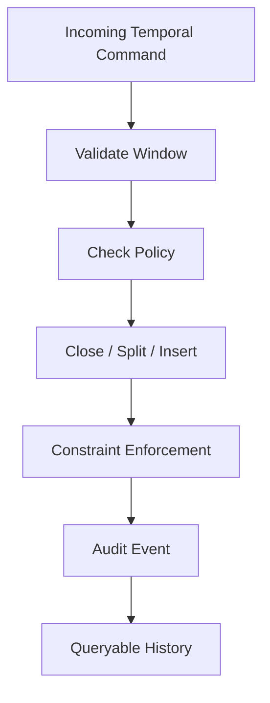
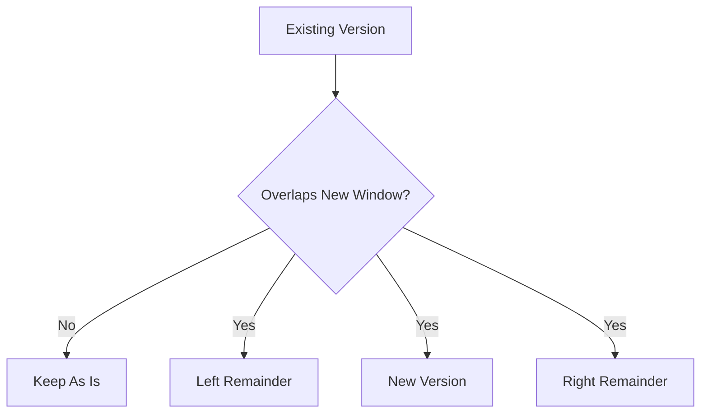

# Part 028 — Temporal Logic, Effective Dating, and History-Preserving Code

Most application bugs are not about time.

The worst ones are.

Temporal bugs are expensive because they often look correct in the present but become wrong under audit, reporting, retry, backfill, or replay.

A typical weak design looks like this:

```sql
CREATE TABLE customer_plan (
  customer_id uuid PRIMARY KEY,
  plan_code text NOT NULL,
  updated_at timestamptz NOT NULL
);
```

That table answers one question:

> What do we think the current plan is?

It cannot reliably answer:

- What was the plan on 2026-03-15?
- Who changed it?
- Was the change known late but effective earlier?
- Did two effective windows overlap?
- Which version of the rule applied when the decision was made?
- Can we replay the event without corrupting history?
- Can we correct a past mistake without rewriting evidence?

Temporal logic is about separating **when something is true** from **when we learned or recorded it**.

PL/pgSQL is useful here because temporal mutations are rarely simple inserts. They often require:

- validating windows;
- closing current rows;
- inserting new versions;
- preventing overlap;
- preserving audit evidence;
- translating constraint errors;
- supporting backdated and future-dated changes;
- making replay safe.

This part builds the mental model and production patterns.

---

## 1. The Two Clocks You Must Not Confuse

Temporal systems usually have at least two kinds of time.

| Time | Meaning | Example Column |
|---|---|---|
| Effective time | When the fact is valid in the business/domain world | `valid_during`, `effective_from`, `effective_to` |
| Transaction/record time | When the database recorded the fact | `created_at`, `recorded_at`, `superseded_at` |

Example:

A regulator publishes a rule on March 10, but it applies from January 1.

- effective time: starts January 1;
- record time: March 10.

If your model stores only `updated_at`, you lose the distinction.

Production rule:

> Never use `updated_at` as a substitute for effective dating.

---

## 2. Three Temporal Model Shapes

### 2.1 Current-State Table

```sql
CREATE TABLE subscription.current_plan (
  customer_id uuid PRIMARY KEY,
  plan_code text NOT NULL,
  updated_at timestamptz NOT NULL DEFAULT clock_timestamp()
);
```

Use when:

- only current truth matters;
- history is external;
- corrections can overwrite;
- audit requirements are low.

Avoid for regulatory, billing, pricing, entitlements, case decisions, and policy rules.

### 2.2 History Table with Current Marker

```sql
CREATE TABLE subscription.customer_plan_history (
  id uuid PRIMARY KEY,
  customer_id uuid NOT NULL,
  plan_code text NOT NULL,
  valid_from timestamptz NOT NULL,
  valid_to timestamptz,
  is_current boolean NOT NULL,
  recorded_at timestamptz NOT NULL DEFAULT clock_timestamp()
);
```

Common but easy to corrupt.

You must maintain:

- no overlapping windows;
- exactly one current row, if required;
- consistent `valid_to` semantics;
- no manual updates bypassing functions.

### 2.3 Range-Based Temporal Table

```sql
CREATE TABLE subscription.customer_plan_version (
  id uuid PRIMARY KEY,
  customer_id uuid NOT NULL,
  plan_code text NOT NULL,
  valid_during tstzrange NOT NULL,
  recorded_at timestamptz NOT NULL DEFAULT clock_timestamp(),
  recorded_by uuid NOT NULL,
  CONSTRAINT customer_plan_version_non_empty
    CHECK (NOT isempty(valid_during))
);
```

This is usually cleaner.

A validity window is one value with interval operators.

---

## 3. Temporal Invariant Map

Temporal design starts with invariants.



Core invariants:

| Invariant | Meaning |
|---|---|
| Non-empty window | `valid_to` must be after `valid_from` |
| No overlap | same entity cannot have two conflicting facts at same time |
| Optional continuity | gaps are allowed or forbidden depending on domain |
| One current truth | exactly one active version at a point in time |
| Immutable record time | recorded evidence should not be rewritten casually |
| Correction traceability | corrections must leave reason/evidence |

Do not start by writing a function. Start by naming the invariant.

---

## 4. Use Half-Open Intervals

For most production temporal logic, use:

```txt
[start, end)
```

Meaning:

- lower bound included;
- upper bound excluded.

Why:

- adjacent windows do not overlap;
- no fake end-of-day values;
- no precision bug around milliseconds/microseconds;
- easier queries;
- easier splitting.

Bad pattern:

```sql
valid_to = '2026-12-31 23:59:59'
```

Better:

```sql
valid_during = tstzrange('2026-01-01', '2027-01-01', '[)')
```

For date-level policy:

```sql
valid_dates = daterange('2026-01-01', '2027-01-01', '[)')
```

Do not mix date and timestamp semantics accidentally.

---

## 5. Current Query vs As-Of Query

Current query:

```sql
SELECT *
FROM subscription.customer_plan_version v
WHERE v.customer_id = p_customer_id
  AND v.valid_during @> clock_timestamp();
```

As-of query:

```sql
SELECT *
FROM subscription.customer_plan_version v
WHERE v.customer_id = p_customer_id
  AND v.valid_during @> p_as_of;
```

This small difference is architectural.

Any reporting, compliance, billing, or appeal workflow usually needs as-of queries.

Create explicit functions:

```sql
CREATE OR REPLACE FUNCTION subscription.get_customer_plan_as_of(
  p_customer_id uuid,
  p_as_of timestamptz
)
RETURNS TABLE (
  plan_code text,
  valid_during tstzrange,
  recorded_at timestamptz
)
LANGUAGE plpgsql
STABLE
AS $$
BEGIN
  RETURN QUERY
  SELECT v.plan_code,
         v.valid_during,
         v.recorded_at
    FROM subscription.customer_plan_version v
   WHERE v.customer_id = p_customer_id
     AND v.valid_during @> p_as_of
   ORDER BY v.recorded_at DESC
   LIMIT 1;
END;
$$;
```

If overlap is correctly prevented, the `ORDER BY` should not be needed for correctness. It may still be used defensively if late corrections are modeled separately.

---

## 6. Enforce No Overlap with Constraints

Do not implement overlap prevention only with `SELECT` then `INSERT`.

That is a race condition.

Use an exclusion constraint.

```sql
CREATE EXTENSION IF NOT EXISTS btree_gist;

CREATE TABLE subscription.customer_plan_version (
  id uuid PRIMARY KEY,
  customer_id uuid NOT NULL,
  plan_code text NOT NULL,
  valid_during tstzrange NOT NULL,
  recorded_at timestamptz NOT NULL DEFAULT clock_timestamp(),
  recorded_by uuid NOT NULL,
  reason_code text NOT NULL,
  CONSTRAINT customer_plan_version_non_empty
    CHECK (NOT isempty(valid_during)),
  CONSTRAINT customer_plan_version_no_overlap
    EXCLUDE USING gist (
      customer_id WITH =,
      valid_during WITH &&
    )
);
```

The function should still check and explain, but the constraint must protect concurrency.

```sql
CREATE OR REPLACE FUNCTION subscription.add_customer_plan_version(
  p_customer_id uuid,
  p_plan_code text,
  p_valid_from timestamptz,
  p_valid_to timestamptz,
  p_actor_id uuid,
  p_reason_code text
)
RETURNS uuid
LANGUAGE plpgsql
AS $$
DECLARE
  v_id uuid := gen_random_uuid();
  v_window tstzrange;
BEGIN
  IF p_valid_to <= p_valid_from THEN
    RAISE EXCEPTION USING
      ERRCODE = 'P2801',
      MESSAGE = 'invalid validity window',
      DETAIL = format('valid_from=%s valid_to=%s', p_valid_from, p_valid_to);
  END IF;

  v_window := tstzrange(p_valid_from, p_valid_to, '[)');

  INSERT INTO subscription.customer_plan_version(
    id,
    customer_id,
    plan_code,
    valid_during,
    recorded_by,
    reason_code
  ) VALUES (
    v_id,
    p_customer_id,
    p_plan_code,
    v_window,
    p_actor_id,
    p_reason_code
  );

  RETURN v_id;
EXCEPTION
  WHEN exclusion_violation THEN
    RAISE EXCEPTION USING
      ERRCODE = 'P2802',
      MESSAGE = 'customer plan validity overlaps existing version',
      DETAIL = format('customer_id=%s valid_during=%s', p_customer_id, v_window),
      HINT = 'Close, split, or correct the existing version before inserting an overlapping version.';
END;
$$;
```

The constraint is the invariant. The PL/pgSQL function is the interface.

---

## 7. Close-and-Insert Pattern

Many business workflows update current state by closing the old row and inserting a new row.

Example: change plan from now.

```sql
CREATE OR REPLACE FUNCTION subscription.change_plan_now(
  p_customer_id uuid,
  p_new_plan_code text,
  p_actor_id uuid,
  p_reason_code text
)
RETURNS uuid
LANGUAGE plpgsql
AS $$
DECLARE
  v_now timestamptz := clock_timestamp();
  v_old subscription.customer_plan_version%ROWTYPE;
  v_new_id uuid := gen_random_uuid();
BEGIN
  SELECT *
    INTO STRICT v_old
    FROM subscription.customer_plan_version v
   WHERE v.customer_id = p_customer_id
     AND v.valid_during @> v_now
   FOR UPDATE;

  IF v_old.plan_code = p_new_plan_code THEN
    RAISE EXCEPTION USING
      ERRCODE = 'P2803',
      MESSAGE = 'new plan is the same as current plan';
  END IF;

  UPDATE subscription.customer_plan_version v
     SET valid_during = tstzrange(lower(v.valid_during), v_now, '[)')
   WHERE v.id = v_old.id;

  INSERT INTO subscription.customer_plan_version(
    id,
    customer_id,
    plan_code,
    valid_during,
    recorded_by,
    reason_code
  ) VALUES (
    v_new_id,
    p_customer_id,
    p_new_plan_code,
    tstzrange(v_now, upper(v_old.valid_during), '[)'),
    p_actor_id,
    p_reason_code
  );

  INSERT INTO subscription.customer_plan_audit(
    customer_id,
    actor_id,
    event_type,
    old_plan_code,
    new_plan_code,
    effective_at,
    event_at,
    reason_code
  ) VALUES (
    p_customer_id,
    p_actor_id,
    'plan_changed_now',
    v_old.plan_code,
    p_new_plan_code,
    v_now,
    clock_timestamp(),
    p_reason_code
  );

  RETURN v_new_id;
END;
$$;
```

Important details:

- `FOR UPDATE` locks the current version row;
- the old row is shortened;
- the new row starts at the same instant;
- half-open intervals prevent overlap;
- audit captures effective and record time.

---

## 8. Backdated Change Pattern

Backdated changes are harder.

Suppose the current timeline is:

```txt
[Jan 01, Apr 01) plan_basic
[Apr 01, infinity) plan_pro
```

A correction says:

```txt
[Feb 15, Mar 10) plan_suspended
```

You cannot just insert the new row. You must split existing rows.



A simplified split function:

```sql
CREATE OR REPLACE FUNCTION subscription.correct_plan_window(
  p_customer_id uuid,
  p_new_plan_code text,
  p_valid_from timestamptz,
  p_valid_to timestamptz,
  p_actor_id uuid,
  p_reason_code text
)
RETURNS uuid
LANGUAGE plpgsql
AS $$
DECLARE
  v_new_window tstzrange;
  v_existing subscription.customer_plan_version%ROWTYPE;
  v_new_id uuid := gen_random_uuid();
BEGIN
  IF p_valid_to <= p_valid_from THEN
    RAISE EXCEPTION USING
      ERRCODE = 'P2804',
      MESSAGE = 'invalid correction window';
  END IF;

  v_new_window := tstzrange(p_valid_from, p_valid_to, '[)');

  FOR v_existing IN
    SELECT *
      FROM subscription.customer_plan_version v
     WHERE v.customer_id = p_customer_id
       AND v.valid_during && v_new_window
     ORDER BY lower(v.valid_during)
     FOR UPDATE
  LOOP
    DELETE FROM subscription.customer_plan_version
     WHERE id = v_existing.id;

    IF lower(v_existing.valid_during) < lower(v_new_window) THEN
      INSERT INTO subscription.customer_plan_version(
        id, customer_id, plan_code, valid_during, recorded_by, reason_code
      ) VALUES (
        gen_random_uuid(),
        v_existing.customer_id,
        v_existing.plan_code,
        tstzrange(lower(v_existing.valid_during), lower(v_new_window), '[)'),
        p_actor_id,
        'system_split_left'
      );
    END IF;

    IF upper(v_existing.valid_during) > upper(v_new_window)
       OR upper_inf(v_existing.valid_during) THEN
      INSERT INTO subscription.customer_plan_version(
        id, customer_id, plan_code, valid_during, recorded_by, reason_code
      ) VALUES (
        gen_random_uuid(),
        v_existing.customer_id,
        v_existing.plan_code,
        tstzrange(upper(v_new_window), upper(v_existing.valid_during), '[)'),
        p_actor_id,
        'system_split_right'
      );
    END IF;
  END LOOP;

  INSERT INTO subscription.customer_plan_version(
    id,
    customer_id,
    plan_code,
    valid_during,
    recorded_by,
    reason_code
  ) VALUES (
    v_new_id,
    p_customer_id,
    p_new_plan_code,
    v_new_window,
    p_actor_id,
    p_reason_code
  );

  INSERT INTO subscription.customer_plan_audit(
    customer_id,
    actor_id,
    event_type,
    new_plan_code,
    effective_window,
    event_at,
    reason_code
  ) VALUES (
    p_customer_id,
    p_actor_id,
    'plan_window_corrected',
    p_new_plan_code,
    v_new_window,
    clock_timestamp(),
    p_reason_code
  );

  RETURN v_new_id;
END;
$$;
```

This is a simplified model. A production version should also preserve original version lineage, correction reason, approval reference, and old row snapshots.

---

## 9. History-Preserving vs History-Rewriting

Temporal mutation has two broad styles.

### 9.1 History-Rewriting

You update old rows directly:

```sql
UPDATE customer_plan_version
SET valid_during = ...
WHERE id = ...;
```

This may be acceptable for internal derived tables or non-regulatory systems.

Risk:

- evidence changes;
- audit reconstruction becomes hard;
- old reports may become unreproducible.

### 9.2 History-Preserving

You append correction events and derive effective timeline.

```sql
CREATE TABLE subscription.plan_event (
  id uuid PRIMARY KEY,
  customer_id uuid NOT NULL,
  plan_code text NOT NULL,
  effective_during tstzrange NOT NULL,
  event_type text NOT NULL,
  recorded_at timestamptz NOT NULL DEFAULT clock_timestamp(),
  recorded_by uuid NOT NULL,
  correction_of uuid,
  reason_code text NOT NULL
);
```

Then a materialized timeline is built from events.

This is more complex, but stronger for audit.

Decision table:

| Requirement | Rewrite Timeline | Preserve Event History |
|---|---:|---:|
| Simple operational state | Good | Possibly overkill |
| Regulated evidence | Risky | Good |
| Need reproduce previous reports | Risky | Good |
| High query simplicity | Good | Needs derived model |
| Correction traceability | Needs audit | Native |
| Legal defensibility | Weak alone | Stronger |

---

## 10. Bitemporal Thinking

A bitemporal model stores both:

- valid time: when the fact is true in the domain;
- system time: when the database recorded that version.

Example:

```sql
CREATE TABLE compliance.case_status_fact (
  id uuid PRIMARY KEY,
  case_id uuid NOT NULL,
  status_code text NOT NULL,
  valid_during tstzrange NOT NULL,
  recorded_during tstzrange NOT NULL,
  recorded_by uuid NOT NULL,
  reason_code text NOT NULL,
  CONSTRAINT case_status_fact_valid_non_empty
    CHECK (NOT isempty(valid_during)),
  CONSTRAINT case_status_fact_recorded_non_empty
    CHECK (NOT isempty(recorded_during))
);
```

Current belief about current status:

```sql
SELECT *
FROM compliance.case_status_fact f
WHERE f.case_id = p_case_id
  AND f.valid_during @> clock_timestamp()
  AND f.recorded_during @> clock_timestamp();
```

What did we believe on March 10 about the status on January 20?

```sql
SELECT *
FROM compliance.case_status_fact f
WHERE f.case_id = p_case_id
  AND f.valid_during @> '2026-01-20'::timestamptz
  AND f.recorded_during @> '2026-03-10'::timestamptz;
```

Bitemporal models are not always necessary. But once the business asks “what did we know when?”, current-state tables are insufficient.

---

## 11. Temporal Function Contracts

A temporal function should make time explicit.

Weak:

```sql
approve_case(p_case_id uuid)
```

Better:

```sql
approve_case(
  p_case_id uuid,
  p_effective_at timestamptz,
  p_decided_at timestamptz,
  p_actor_id uuid,
  p_reason_code text
)
```

But be careful. The caller should not always be allowed to choose `p_decided_at`.

A common pattern:

- caller provides effective time;
- database assigns recorded/event time.

```sql
CREATE OR REPLACE FUNCTION compliance.approve_case(
  p_case_id uuid,
  p_effective_at timestamptz,
  p_actor_id uuid,
  p_reason_code text
)
RETURNS uuid
LANGUAGE plpgsql
AS $$
DECLARE
  v_event_id uuid := gen_random_uuid();
  v_recorded_at timestamptz := clock_timestamp();
BEGIN
  -- domain checks omitted for brevity

  INSERT INTO compliance.case_decision_event(
    id,
    case_id,
    decision,
    effective_at,
    recorded_at,
    actor_id,
    reason_code
  ) VALUES (
    v_event_id,
    p_case_id,
    'approved',
    p_effective_at,
    v_recorded_at,
    p_actor_id,
    p_reason_code
  );

  RETURN v_event_id;
END;
$$;
```

The system controls record time. The domain controls effective time.

---

## 12. Future-Dated Changes

Future-dated changes are not pending tasks. They are already-known future facts.

Example:

```sql
SELECT subscription.add_customer_plan_version(
  p_customer_id := 'aaaaaaaa-aaaa-aaaa-aaaa-aaaaaaaaaaaa',
  p_plan_code := 'enterprise',
  p_valid_from := '2026-09-01T00:00:00Z',
  p_valid_to := 'infinity',
  p_actor_id := 'bbbbbbbb-bbbb-bbbb-bbbb-bbbbbbbbbbbb',
  p_reason_code := 'contract_signed'
);
```

Design implications:

- “current” and “scheduled” are different views over the same temporal table;
- future changes must still obey no-overlap constraints;
- cancellation must be modeled as a temporal correction;
- background workers should not be required just to make a fact become true.

Query scheduled future changes:

```sql
SELECT *
FROM subscription.customer_plan_version v
WHERE v.customer_id = p_customer_id
  AND lower(v.valid_during) > clock_timestamp()
ORDER BY lower(v.valid_during);
```

---

## 13. Temporal Idempotency

Temporal commands often arrive more than once.

Bad idempotency key:

```txt
customer_id + plan_code
```

This fails when the same customer moves to the same plan at different periods.

Better:

```txt
source_system + source_event_id
```

or:

```txt
customer_id + plan_code + valid_window + command_hash
```

Table:

```sql
CREATE TABLE subscription.temporal_command_log (
  idempotency_key text PRIMARY KEY,
  command_hash bytea NOT NULL,
  result_version_id uuid,
  processed_at timestamptz NOT NULL DEFAULT clock_timestamp()
);
```

Function sketch:

```sql
CREATE OR REPLACE FUNCTION subscription.process_plan_command(
  p_idempotency_key text,
  p_command_hash bytea,
  p_customer_id uuid,
  p_plan_code text,
  p_valid_from timestamptz,
  p_valid_to timestamptz,
  p_actor_id uuid
)
RETURNS uuid
LANGUAGE plpgsql
AS $$
DECLARE
  v_existing subscription.temporal_command_log%ROWTYPE;
  v_result_id uuid;
BEGIN
  SELECT *
    INTO v_existing
    FROM subscription.temporal_command_log
   WHERE idempotency_key = p_idempotency_key
   FOR UPDATE;

  IF FOUND THEN
    IF v_existing.command_hash <> p_command_hash THEN
      RAISE EXCEPTION USING
        ERRCODE = 'P2805',
        MESSAGE = 'idempotency key reused with different command payload';
    END IF;

    RETURN v_existing.result_version_id;
  END IF;

  v_result_id := subscription.add_customer_plan_version(
    p_customer_id,
    p_plan_code,
    p_valid_from,
    p_valid_to,
    p_actor_id,
    'external_command'
  );

  INSERT INTO subscription.temporal_command_log(
    idempotency_key,
    command_hash,
    result_version_id
  ) VALUES (
    p_idempotency_key,
    p_command_hash,
    v_result_id
  );

  RETURN v_result_id;
END;
$$;
```

Temporal replay safety must include the window, not just the entity.

---

## 14. Clock Function Discipline

PostgreSQL exposes multiple time functions with different semantics.

For temporal PL/pgSQL, choose intentionally.

| Function | Meaning | Use Case |
|---|---|---|
| `now()` / `transaction_timestamp()` | transaction start time | consistent timestamp across transaction |
| `statement_timestamp()` | statement start time | statement-level measurement |
| `clock_timestamp()` | actual wall-clock at call time | audit event time, long-running procedures |

If a function performs many steps and you want one consistent command timestamp, capture once:

```sql
DECLARE
  v_recorded_at timestamptz := clock_timestamp();
BEGIN
  -- use v_recorded_at everywhere for this command
END;
```

Do not call `clock_timestamp()` in ten places if the whole command should share one recorded time.

---

## 15. Temporal Reporting Views

Production users rarely want raw temporal rows.

Create explicit views.

Current state:

```sql
CREATE VIEW subscription.customer_current_plan AS
SELECT DISTINCT ON (v.customer_id)
       v.customer_id,
       v.plan_code,
       v.valid_during,
       v.recorded_at
  FROM subscription.customer_plan_version v
 WHERE v.valid_during @> clock_timestamp()
 ORDER BY v.customer_id, v.recorded_at DESC;
```

Future changes:

```sql
CREATE VIEW subscription.customer_scheduled_plan_change AS
SELECT v.customer_id,
       v.plan_code,
       lower(v.valid_during) AS effective_at,
       v.recorded_at,
       v.recorded_by,
       v.reason_code
  FROM subscription.customer_plan_version v
 WHERE lower(v.valid_during) > clock_timestamp();
```

As-of access should usually be a function, not a view, because it needs a parameter.

---

## 16. Temporal Audit Table

Audit should include both event time and effective time.

```sql
CREATE TABLE subscription.customer_plan_audit (
  id uuid PRIMARY KEY DEFAULT gen_random_uuid(),
  customer_id uuid NOT NULL,
  actor_id uuid NOT NULL,
  event_type text NOT NULL,
  old_plan_code text,
  new_plan_code text,
  effective_window tstzrange,
  effective_at timestamptz,
  event_at timestamptz NOT NULL DEFAULT clock_timestamp(),
  reason_code text NOT NULL,
  metadata jsonb NOT NULL DEFAULT '{}'::jsonb
);
```

Minimum audit questions:

| Question | Column |
|---|---|
| Who did it? | `actor_id` |
| When did we record it? | `event_at` |
| When does it apply? | `effective_at` / `effective_window` |
| What changed? | old/new values or row diff |
| Why? | `reason_code` |
| From where? | metadata: source/request/job |

An audit row without effective time is weak in temporal systems.

---

## 17. Direct Update Guardrail

If temporal tables must only change through functions, enforce it.

One approach is privilege design:

```sql
REVOKE INSERT, UPDATE, DELETE ON subscription.customer_plan_version FROM app_user;
GRANT EXECUTE ON FUNCTION subscription.change_plan_now(uuid, text, uuid, text) TO app_user;
GRANT EXECUTE ON FUNCTION subscription.correct_plan_window(uuid, text, timestamptz, timestamptz, uuid, text) TO app_user;
```

For stronger internal guardrails, use trigger context flags carefully.

```sql
CREATE OR REPLACE FUNCTION subscription.guard_plan_version_direct_change()
RETURNS trigger
LANGUAGE plpgsql
AS $$
BEGIN
  IF current_setting('subscription.allow_temporal_mutation', true) IS DISTINCT FROM 'on' THEN
    RAISE EXCEPTION USING
      ERRCODE = 'P2806',
      MESSAGE = 'direct mutation of customer_plan_version is not allowed';
  END IF;

  RETURN COALESCE(NEW, OLD);
END;
$$;
```

Mutation function:

```sql
PERFORM set_config('subscription.allow_temporal_mutation', 'on', true);
```

Use this pattern carefully. Privileges are still the primary boundary. Session settings are guardrails, not security by themselves.

---

## 18. Temporal Failure Modes

### 18.1 Current-State Overwrite

Symptom:

```sql
UPDATE case_file SET status = 'closed'
```

No answer to “what was the previous status and when was it valid?”

Fix: state transition table or event table.

### 18.2 Overlap Race

Symptom:

```sql
IF NOT EXISTS (SELECT 1 WHERE overlaps) THEN INSERT ...
```

Two concurrent transactions pass the check.

Fix: exclusion constraint.

### 18.3 End-of-Day Timestamp Hack

Symptom:

```sql
valid_to = '2026-12-31 23:59:59'
```

Precision and timezone bugs.

Fix: half-open ranges.

### 18.4 Backdated Correction Without Evidence

Symptom:

Old row is modified without reason.

Fix: correction event + audit + lineage.

### 18.5 Confusing Effective Time and Record Time

Symptom:

`updated_at` used to answer business effective-date queries.

Fix: separate effective and record timestamps.

### 18.6 Future Change Implemented as Background Job

Symptom:

A job runs at midnight to update current state.

If the job fails, the truth is wrong.

Fix: store future-dated rows and query by `valid_during @> now()`.

---

## 19. Production Pattern: Rule Version Resolution

Compliance systems often need to resolve the correct rule version for a decision date.

Table:

```sql
CREATE TABLE compliance.rule_version (
  id uuid PRIMARY KEY,
  rule_code text NOT NULL,
  effective_dates daterange NOT NULL,
  rule_body jsonb NOT NULL,
  recorded_at timestamptz NOT NULL DEFAULT clock_timestamp(),
  recorded_by uuid NOT NULL,
  CONSTRAINT rule_version_effective_non_empty
    CHECK (NOT isempty(effective_dates)),
  CONSTRAINT rule_version_no_overlap
    EXCLUDE USING gist (
      rule_code WITH =,
      effective_dates WITH &&
    )
);
```

Resolver:

```sql
CREATE OR REPLACE FUNCTION compliance.resolve_rule_version(
  p_rule_code text,
  p_decision_date date
)
RETURNS compliance.rule_version
LANGUAGE plpgsql
STABLE
AS $$
DECLARE
  v_rule compliance.rule_version%ROWTYPE;
BEGIN
  SELECT *
    INTO STRICT v_rule
    FROM compliance.rule_version r
   WHERE r.rule_code = p_rule_code
     AND r.effective_dates @> p_decision_date;

  RETURN v_rule;
EXCEPTION
  WHEN no_data_found THEN
    RAISE EXCEPTION USING
      ERRCODE = 'P2807',
      MESSAGE = 'no rule version effective for decision date',
      DETAIL = format('rule_code=%s decision_date=%s', p_rule_code, p_decision_date);
  WHEN too_many_rows THEN
    RAISE EXCEPTION USING
      ERRCODE = 'P2808',
      MESSAGE = 'multiple rule versions effective for decision date',
      DETAIL = format('rule_code=%s decision_date=%s', p_rule_code, p_decision_date),
      HINT = 'Check temporal overlap constraints and corrupted history.';
END;
$$;
```

Decision function stores the resolved version:

```sql
INSERT INTO compliance.case_decision(
  case_id,
  decision,
  rule_version_id,
  decided_at,
  actor_id
)
VALUES (
  p_case_id,
  v_decision,
  v_rule.id,
  clock_timestamp(),
  p_actor_id
);
```

Never store only the rule code if decisions must be defensible. Store the exact version used.

---

## 20. Testing Temporal Logic

Temporal code needs tests beyond normal happy path.

Test matrix:

| Scenario | Expected Result |
|---|---|
| adjacent windows | allowed |
| overlapping windows | rejected |
| empty window | rejected |
| open-ended current row | allowed if domain permits |
| backdated correction inside one row | split into left/new/right |
| correction spanning multiple rows | all overlapping rows adjusted |
| future-dated change | visible in future query, not current query |
| as-of query before first version | no result/domain error |
| replay same command | same result |
| replay different payload same key | rejected |
| concurrent overlapping insert | one succeeds, one fails |

Example overlap test:

```sql
BEGIN;

SELECT subscription.add_customer_plan_version(
  gen_random_uuid(),
  'basic',
  '2026-01-01T00:00:00Z',
  '2026-02-01T00:00:00Z',
  gen_random_uuid(),
  'test'
);

-- second insert for same customer would be tested with captured id in real test

ROLLBACK;
```

For concurrency, use two sessions or an integration test harness. Unit tests alone cannot prove concurrency invariants.

---

## 21. Operational Queries

Find overlaps if constraints were added late or disabled:

```sql
SELECT a.customer_id,
       a.id AS left_id,
       b.id AS right_id,
       a.valid_during AS left_window,
       b.valid_during AS right_window
FROM subscription.customer_plan_version a
JOIN subscription.customer_plan_version b
  ON b.customer_id = a.customer_id
 AND b.id > a.id
 AND b.valid_during && a.valid_during;
```

Find empty or suspicious windows:

```sql
SELECT *
FROM subscription.customer_plan_version
WHERE isempty(valid_during)
   OR lower(valid_during) IS NULL;
```

Find future scheduled changes:

```sql
SELECT customer_id,
       plan_code,
       lower(valid_during) AS starts_at
FROM subscription.customer_plan_version
WHERE lower(valid_during) > clock_timestamp()
ORDER BY starts_at;
```

Find open-ended rows:

```sql
SELECT *
FROM subscription.customer_plan_version
WHERE upper_inf(valid_during);
```

Operational readiness means having these queries before the incident.

---

## 22. Review Checklist

Before approving temporal PL/pgSQL code, ask:

- Which time is effective time?
- Which time is record/event time?
- Are intervals half-open?
- Are overlaps prevented by constraint, not just function logic?
- Does the function support future-dated changes safely?
- Does it support or reject backdated changes explicitly?
- Are corrections traceable?
- Are old reports reproducible?
- Are concurrent commands safe?
- Are idempotency keys temporal enough?
- Does audit store effective time and event time?
- Are direct table mutations blocked by privilege or guardrail?
- Are as-of queries first-class?
- Are open-ended windows intentional?
- Are date-level and instant-level semantics separated?

---

## 23. Final Mental Model

Temporal logic is not an `updated_at` problem.

It is an invariant problem.

A strong temporal PL/pgSQL design separates:

- what is true;
- when it is true;
- when we recorded it;
- who recorded it;
- why it changed;
- what version of policy was used;
- whether the mutation preserved history.

The most important production rule:

> Time must be modeled as part of the domain, not inferred from side-effect timestamps.

Once you apply that rule, PL/pgSQL becomes a useful place to enforce temporal mutation discipline: validate windows, lock affected rows, split timelines, translate constraint errors, and write defensible audit records.

---

## References

- PostgreSQL Documentation — Date/Time Types: https://www.postgresql.org/docs/current/datatype-datetime.html
- PostgreSQL Documentation — Date/Time Functions and Operators: https://www.postgresql.org/docs/current/functions-datetime.html
- PostgreSQL Documentation — Range Types: https://www.postgresql.org/docs/current/rangetypes.html
- PostgreSQL Documentation — Exclusion Constraints: https://www.postgresql.org/docs/current/ddl-constraints.html#DDL-CONSTRAINTS-EXCLUSION
- PostgreSQL Documentation — Explicit Locking: https://www.postgresql.org/docs/current/explicit-locking.html
- PostgreSQL Documentation — Transaction Isolation: https://www.postgresql.org/docs/current/transaction-iso.html
- PostgreSQL Documentation — PL/pgSQL Errors and Messages: https://www.postgresql.org/docs/current/plpgsql-errors-and-messages.html
