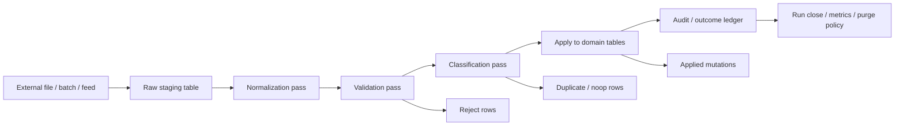
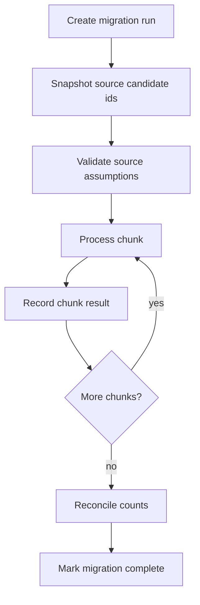

# Part 029 — Bulk Data Processing, Staging Tables, and Migration Functions

Bulk processing is where PL/pgSQL either becomes a quiet production weapon or a silent disaster.

Small examples make PL/pgSQL look like procedural glue:

```sql
FOR r IN SELECT * FROM input_rows LOOP
  INSERT INTO target_table (...) VALUES (...);
END LOOP;
```

That style works in tutorials. It fails in real systems because bulk workloads are not just “many rows”. They are **many uncertain rows**: malformed fields, duplicate identifiers, partial business validity, retry attempts, schema drift, long locks, audit requirements, operational timeouts, and recovery questions.

A production bulk routine must answer six questions:

1. What exact input did we receive?
2. Which rows are syntactically invalid?
3. Which rows are semantically invalid?
4. Which rows are duplicates, replacements, or no-ops?
5. Which domain mutations were actually applied?
6. Can the whole run be retried without corrupting state?

The core idea: **do not bulk-load directly into the domain model**.

Load into a staging boundary first. Then validate, classify, apply, audit, and close the run.



This part is about using PL/pgSQL to build that boundary.

---

## 1. Bulk Processing Mental Model

A bulk workflow is not one operation. It is a pipeline with explicit state.

| Stage | Purpose | Typical Tables | Failure Style |
|---|---|---|---|
| Receive | Preserve input as received | `load_run`, `stg_raw_*` | transport / format failure |
| Normalize | Convert text/raw values into canonical shape | `stg_*` columns | row-local conversion failure |
| Validate | Check syntactic and domain rules | `stg_*`, `stg_validation_error` | row-local rejection |
| Classify | Decide insert/update/noop/duplicate/conflict | staging + target | row-local or group-level conflict |
| Apply | Mutate authoritative domain tables | target tables | transaction-level failure |
| Record | Persist counts, errors, audit, applied IDs | run ledger, audit | observability failure |
| Cleanup | Purge, archive, retain evidence | partition/archive tables | retention failure |

The mistake is treating all stages as one huge `INSERT ... SELECT` without intermediate evidence. That may be fast, but it is not diagnosable.

Production rule:

> Use set-based SQL for data movement, PL/pgSQL for orchestration, guardrails, diagnostics, and policy branching.

Do not use PL/pgSQL loops as your default data mover.

---

## 2. COPY, INSERT Batching, and Where PL/pgSQL Fits

PostgreSQL `COPY` is designed for large loads. It moves data between PostgreSQL tables and files or client streams, and `COPY FROM` appends rows into a table. For large data loads, `COPY` is generally preferred over many individual `INSERT`s.

But `COPY` is not your whole ingestion architecture.

`COPY` answers:

> How do I get many rows into PostgreSQL efficiently?

It does not answer:

> How do I validate, classify, apply, audit, retry, and explain them?

That second job is where PL/pgSQL is useful.

A good boundary:

```txt
client / psql / ETL tool  ->  COPY into staging
PL/pgSQL procedure        ->  validate + classify + apply + close run
application               ->  show result / retry / download rejects
```

Important distinction:

| Mechanism | Where file/stream lives | Best use |
|---|---|---|
| SQL `COPY FROM '/path/file.csv'` | database server filesystem | controlled server-side import jobs |
| SQL `COPY FROM STDIN` | client-server protocol | application/driver streaming |
| psql `\copy` | client filesystem | operator/manual import from workstation or job runner |
| PL/pgSQL routine | database execution context | validation, classification, apply, run bookkeeping |

Avoid giving application roles server-file privileges just to run imports. Server-side file access and `COPY PROGRAM` are powerful and dangerous; they belong to tightly controlled operational roles.

---

## 3. The Run Ledger: Never Process a Bulk Job Without One

Before designing staging rows, design the **run**.

A run is the unit of idempotency, observability, and recovery.

```sql
CREATE SCHEMA IF NOT EXISTS import_ops;

CREATE TYPE import_ops.load_run_status AS ENUM (
  'received',
  'loaded',
  'validating',
  'validated',
  'applying',
  'applied',
  'failed',
  'cancelled'
);

CREATE TABLE import_ops.load_run (
  run_id              uuid PRIMARY KEY,
  import_type         text NOT NULL,
  source_name         text NOT NULL,
  source_checksum     text,
  requested_by        text NOT NULL,
  status              import_ops.load_run_status NOT NULL DEFAULT 'received',
  received_at         timestamptz NOT NULL DEFAULT clock_timestamp(),
  loaded_at           timestamptz,
  validated_at        timestamptz,
  applied_at          timestamptz,
  failed_at           timestamptz,
  total_rows          bigint NOT NULL DEFAULT 0,
  valid_rows          bigint NOT NULL DEFAULT 0,
  rejected_rows       bigint NOT NULL DEFAULT 0,
  duplicate_rows      bigint NOT NULL DEFAULT 0,
  applied_rows        bigint NOT NULL DEFAULT 0,
  noop_rows           bigint NOT NULL DEFAULT 0,
  error_code          text,
  error_message       text,
  metadata            jsonb NOT NULL DEFAULT '{}'::jsonb,
  created_at          timestamptz NOT NULL DEFAULT clock_timestamp(),
  updated_at          timestamptz NOT NULL DEFAULT clock_timestamp()
);

CREATE UNIQUE INDEX load_run_source_once_uq
  ON import_ops.load_run (import_type, source_checksum)
  WHERE source_checksum IS NOT NULL;
```

Why this table matters:

- It prevents duplicate imports of the same file.
- It gives operators a single object to inspect.
- It gives retry logic a stable handle.
- It separates “file was loaded” from “domain was mutated”.
- It makes partial failure visible.

A common production failure is having rows in staging but no durable run state. That forces humans to infer state from timestamps and row counts. Do not do that.

---

## 4. Staging Table Design: Raw, Normalized, Classified

A staging table should not pretend to be the target table. It has different responsibilities.

A domain table wants clean state. A staging table wants evidence.

Example: importing customer risk ratings.

```sql
CREATE TABLE import_ops.stg_customer_risk_rating (
  run_id              uuid NOT NULL REFERENCES import_ops.load_run(run_id),
  row_no              bigint NOT NULL,

  -- raw input as loaded
  external_customer_id_raw text,
  rating_raw               text,
  effective_from_raw       text,
  reason_raw               text,

  -- normalized fields
  external_customer_id     text,
  rating                   text,
  effective_from           date,
  reason_code              text,

  -- row processing state
  row_status               text NOT NULL DEFAULT 'loaded',
  action                   text,
  target_customer_id       bigint,
  validation_errors        jsonb NOT NULL DEFAULT '[]'::jsonb,
  classification_reason    text,

  created_at               timestamptz NOT NULL DEFAULT clock_timestamp(),
  updated_at               timestamptz NOT NULL DEFAULT clock_timestamp(),

  PRIMARY KEY (run_id, row_no)
);

CREATE INDEX stg_customer_risk_rating_run_status_idx
  ON import_ops.stg_customer_risk_rating (run_id, row_status);

CREATE INDEX stg_customer_risk_rating_external_idx
  ON import_ops.stg_customer_risk_rating (run_id, external_customer_id);
```

Notice the separation:

| Column Category | Example | Why It Exists |
|---|---|---|
| Raw | `rating_raw` | audit/debug exact input |
| Normalized | `rating` | canonical business value |
| Classified | `action` | insert/update/noop/reject |
| Evidence | `validation_errors` | explainability |
| Linkage | `target_customer_id` | trace staging row to domain row |

Do not overwrite raw columns during normalization. Raw input is evidence.

---

## 5. Loading: Minimal Assumptions First

For CSV import, load into raw text columns whenever possible.

Why?

Because direct loading into typed columns makes the first invalid date or number potentially abort the load before you can produce a row-level reject report.

Bad for user-facing import:

```sql
-- One invalid date may fail the whole COPY.
CREATE TABLE import_ops.stg_bad (
  run_id uuid,
  row_no bigint,
  effective_from date
);
```

Better:

```sql
CREATE TABLE import_ops.stg_good (
  run_id uuid,
  row_no bigint,
  effective_from_raw text,
  effective_from date,
  validation_errors jsonb NOT NULL DEFAULT '[]'::jsonb
);
```

Then normalize inside controlled SQL/PL/pgSQL steps.

A load command executed by an external job might look like:

```sql
COPY import_ops.stg_customer_risk_rating (
  run_id,
  row_no,
  external_customer_id_raw,
  rating_raw,
  effective_from_raw,
  reason_raw
)
FROM STDIN
WITH (FORMAT csv, HEADER true);
```

The import procedure should assume the rows are already in staging.

```sql
CREATE OR REPLACE PROCEDURE import_ops.process_customer_risk_rating_run(
  p_run_id uuid
)
LANGUAGE plpgsql
AS $$
DECLARE
  v_status text;
BEGIN
  SELECT status
    INTO v_status
    FROM import_ops.load_run
   WHERE run_id = p_run_id
   FOR UPDATE;

  IF NOT FOUND THEN
    RAISE EXCEPTION USING
      ERRCODE = 'P0002',
      MESSAGE = 'load run not found',
      DETAIL  = format('run_id=%s', p_run_id);
  END IF;

  IF v_status NOT IN ('loaded', 'validated') THEN
    RAISE EXCEPTION USING
      ERRCODE = 'P0001',
      MESSAGE = 'load run is not processable',
      DETAIL  = format('run_id=%s status=%s', p_run_id, v_status);
  END IF;

  UPDATE import_ops.load_run
     SET status = 'validating',
         updated_at = clock_timestamp()
   WHERE run_id = p_run_id;

  CALL import_ops.normalize_customer_risk_rating_run(p_run_id);
  CALL import_ops.validate_customer_risk_rating_run(p_run_id);
  CALL import_ops.classify_customer_risk_rating_run(p_run_id);
  CALL import_ops.apply_customer_risk_rating_run(p_run_id);
  CALL import_ops.close_customer_risk_rating_run(p_run_id);
END;
$$;
```

This procedure is orchestration. It should not hide all data movement inside opaque loops.

---

## 6. Normalization Pass

Normalization converts raw input into canonical representation.

Examples:

- trim whitespace;
- uppercase codes;
- convert empty string to `NULL`;
- parse dates;
- normalize identifiers;
- map source-specific values to internal codes.

Keep normalization deterministic and repeatable.

```sql
CREATE OR REPLACE PROCEDURE import_ops.normalize_customer_risk_rating_run(
  p_run_id uuid
)
LANGUAGE plpgsql
AS $$
BEGIN
  UPDATE import_ops.stg_customer_risk_rating s
     SET external_customer_id = NULLIF(trim(s.external_customer_id_raw), ''),
         rating = upper(NULLIF(trim(s.rating_raw), '')),
         reason_code = upper(NULLIF(trim(s.reason_raw), '')),
         row_status = 'normalized',
         updated_at = clock_timestamp()
   WHERE s.run_id = p_run_id
     AND s.row_status IN ('loaded', 'normalized');
END;
$$;
```

Date parsing needs care. A direct cast can abort the whole statement if one row is malformed.

A safe pattern is to validate format first, then cast.

```sql
UPDATE import_ops.stg_customer_risk_rating s
   SET effective_from = CASE
         WHEN s.effective_from_raw ~ '^\d{4}-\d{2}-\d{2}$'
         THEN s.effective_from_raw::date
         ELSE NULL
       END,
       updated_at = clock_timestamp()
 WHERE s.run_id = p_run_id;
```

This only checks shape. Calendar-invalid values can still fail on cast, for example `2026-02-31`. For messy inputs, isolate parsing into a function with exception handling.

```sql
CREATE OR REPLACE FUNCTION import_ops.try_parse_iso_date(p_value text)
RETURNS date
LANGUAGE plpgsql
IMMUTABLE
AS $$
DECLARE
  v_date date;
BEGIN
  IF p_value IS NULL OR trim(p_value) = '' THEN
    RETURN NULL;
  END IF;

  IF p_value !~ '^\d{4}-\d{2}-\d{2}$' THEN
    RETURN NULL;
  END IF;

  BEGIN
    v_date := p_value::date;
    RETURN v_date;
  EXCEPTION WHEN datetime_field_overflow OR invalid_datetime_format THEN
    RETURN NULL;
  END;
END;
$$;
```

Then:

```sql
UPDATE import_ops.stg_customer_risk_rating s
   SET effective_from = import_ops.try_parse_iso_date(s.effective_from_raw),
       updated_at = clock_timestamp()
 WHERE s.run_id = p_run_id;
```

Use exception handling sparingly in per-row functions. It is useful for messy boundary parsing, not for normal control flow in hot paths.

---

## 7. Validation as Data, Not Just Exceptions

For bulk import, invalid rows are expected. They are not exceptional.

Do not raise an exception for every bad row. Store validation errors as data.

```sql
CREATE TABLE import_ops.stg_validation_error (
  run_id          uuid NOT NULL,
  row_no          bigint NOT NULL,
  field_name      text,
  error_code      text NOT NULL,
  error_message   text NOT NULL,
  severity        text NOT NULL DEFAULT 'error',
  created_at      timestamptz NOT NULL DEFAULT clock_timestamp(),
  PRIMARY KEY (run_id, row_no, error_code, field_name)
);
```

Validation procedure:

```sql
CREATE OR REPLACE PROCEDURE import_ops.validate_customer_risk_rating_run(
  p_run_id uuid
)
LANGUAGE plpgsql
AS $$
DECLARE
  v_total bigint;
  v_rejected bigint;
BEGIN
  DELETE FROM import_ops.stg_validation_error
   WHERE run_id = p_run_id;

  INSERT INTO import_ops.stg_validation_error (
    run_id, row_no, field_name, error_code, error_message
  )
  SELECT s.run_id,
         s.row_no,
         'external_customer_id',
         'required',
         'external customer id is required'
    FROM import_ops.stg_customer_risk_rating s
   WHERE s.run_id = p_run_id
     AND s.external_customer_id IS NULL;

  INSERT INTO import_ops.stg_validation_error (
    run_id, row_no, field_name, error_code, error_message
  )
  SELECT s.run_id,
         s.row_no,
         'rating',
         'invalid_rating',
         'rating must be LOW, MEDIUM, or HIGH'
    FROM import_ops.stg_customer_risk_rating s
   WHERE s.run_id = p_run_id
     AND s.rating IS DISTINCT FROM ALL (ARRAY['LOW', 'MEDIUM', 'HIGH']);

  INSERT INTO import_ops.stg_validation_error (
    run_id, row_no, field_name, error_code, error_message
  )
  SELECT s.run_id,
         s.row_no,
         'effective_from',
         'invalid_effective_date',
         'effective_from must be a valid ISO date'
    FROM import_ops.stg_customer_risk_rating s
   WHERE s.run_id = p_run_id
     AND s.effective_from IS NULL;

  UPDATE import_ops.stg_customer_risk_rating s
     SET row_status = CASE
           WHEN EXISTS (
             SELECT 1
               FROM import_ops.stg_validation_error e
              WHERE e.run_id = s.run_id
                AND e.row_no = s.row_no
                AND e.severity = 'error'
           ) THEN 'rejected'
           ELSE 'validated'
         END,
         validation_errors = COALESCE((
           SELECT jsonb_agg(
                    jsonb_build_object(
                      'field', e.field_name,
                      'code', e.error_code,
                      'message', e.error_message
                    )
                    ORDER BY e.field_name, e.error_code
                  )
             FROM import_ops.stg_validation_error e
            WHERE e.run_id = s.run_id
              AND e.row_no = s.row_no
         ), '[]'::jsonb),
         updated_at = clock_timestamp()
   WHERE s.run_id = p_run_id;

  SELECT count(*) INTO v_total
    FROM import_ops.stg_customer_risk_rating
   WHERE run_id = p_run_id;

  SELECT count(*) INTO v_rejected
    FROM import_ops.stg_customer_risk_rating
   WHERE run_id = p_run_id
     AND row_status = 'rejected';

  UPDATE import_ops.load_run
     SET status = 'validated',
         total_rows = v_total,
         rejected_rows = v_rejected,
         valid_rows = v_total - v_rejected,
         validated_at = clock_timestamp(),
         updated_at = clock_timestamp()
   WHERE run_id = p_run_id;
END;
$$;
```

Why store errors separately and also denormalize into `validation_errors`?

- The separate table is queryable and indexable.
- The JSONB column is convenient for API/result export.
- The staging row remains self-explaining.

---

## 8. Duplicate Detection and Classification

Validation says whether a row is acceptable in isolation.

Classification says what the row means relative to other rows and target state.

Common actions:

| Action | Meaning |
|---|---|
| `insert` | target does not exist |
| `update` | target exists and values differ |
| `noop` | target exists and values are already equal |
| `duplicate` | another row in same run has same business key |
| `conflict` | row is individually valid but violates group/domain rule |
| `reject` | row cannot be applied |

Example duplicate detection inside a run:

```sql
WITH ranked AS (
  SELECT s.run_id,
         s.row_no,
         row_number() OVER (
           PARTITION BY s.run_id, s.external_customer_id, s.effective_from
           ORDER BY s.row_no
         ) AS rn
    FROM import_ops.stg_customer_risk_rating s
   WHERE s.run_id = p_run_id
     AND s.row_status = 'validated'
)
UPDATE import_ops.stg_customer_risk_rating s
   SET row_status = 'duplicate',
       action = 'duplicate',
       classification_reason = 'duplicate business key inside same run',
       updated_at = clock_timestamp()
  FROM ranked r
 WHERE s.run_id = r.run_id
   AND s.row_no = r.row_no
   AND r.rn > 1;
```

Then classify against target.

Assume domain tables:

```sql
CREATE TABLE app_customer.customer (
  customer_id bigint GENERATED ALWAYS AS IDENTITY PRIMARY KEY,
  external_customer_id text NOT NULL UNIQUE,
  created_at timestamptz NOT NULL DEFAULT clock_timestamp()
);

CREATE TABLE app_customer.customer_risk_rating (
  customer_id bigint NOT NULL REFERENCES app_customer.customer(customer_id),
  effective_from date NOT NULL,
  rating text NOT NULL,
  reason_code text NOT NULL,
  imported_run_id uuid,
  imported_row_no bigint,
  created_at timestamptz NOT NULL DEFAULT clock_timestamp(),
  updated_at timestamptz NOT NULL DEFAULT clock_timestamp(),
  PRIMARY KEY (customer_id, effective_from)
);
```

Classification:

```sql
WITH linked AS (
  SELECT s.run_id,
         s.row_no,
         c.customer_id,
         r.rating AS existing_rating,
         r.reason_code AS existing_reason_code
    FROM import_ops.stg_customer_risk_rating s
    LEFT JOIN app_customer.customer c
      ON c.external_customer_id = s.external_customer_id
    LEFT JOIN app_customer.customer_risk_rating r
      ON r.customer_id = c.customer_id
     AND r.effective_from = s.effective_from
   WHERE s.run_id = p_run_id
     AND s.row_status = 'validated'
)
UPDATE import_ops.stg_customer_risk_rating s
   SET target_customer_id = l.customer_id,
       action = CASE
         WHEN l.customer_id IS NULL THEN 'reject'
         WHEN l.existing_rating IS NULL THEN 'insert'
         WHEN l.existing_rating IS NOT DISTINCT FROM s.rating
          AND l.existing_reason_code IS NOT DISTINCT FROM s.reason_code THEN 'noop'
         ELSE 'update'
       END,
       row_status = CASE
         WHEN l.customer_id IS NULL THEN 'rejected'
         ELSE 'classified'
       END,
       classification_reason = CASE
         WHEN l.customer_id IS NULL THEN 'unknown customer'
         WHEN l.existing_rating IS NULL THEN 'new effective rating'
         WHEN l.existing_rating IS NOT DISTINCT FROM s.rating
          AND l.existing_reason_code IS NOT DISTINCT FROM s.reason_code THEN 'target already matches'
         ELSE 'target differs'
       END,
       updated_at = clock_timestamp()
  FROM linked l
 WHERE s.run_id = l.run_id
   AND s.row_no = l.row_no;
```

Classification makes the apply stage boring. That is the goal.

---

## 9. Apply Stage: Set-Based and Idempotent

The apply stage should be:

- set-based;
- protected by constraints;
- idempotent where possible;
- observable through row counts;
- narrow in lock scope.

Insert new ratings:

```sql
INSERT INTO app_customer.customer_risk_rating (
  customer_id,
  effective_from,
  rating,
  reason_code,
  imported_run_id,
  imported_row_no
)
SELECT s.target_customer_id,
       s.effective_from,
       s.rating,
       s.reason_code,
       s.run_id,
       s.row_no
  FROM import_ops.stg_customer_risk_rating s
 WHERE s.run_id = p_run_id
   AND s.row_status = 'classified'
   AND s.action = 'insert'
ON CONFLICT (customer_id, effective_from) DO NOTHING;
```

Update changed ratings:

```sql
UPDATE app_customer.customer_risk_rating r
   SET rating = s.rating,
       reason_code = s.reason_code,
       imported_run_id = s.run_id,
       imported_row_no = s.row_no,
       updated_at = clock_timestamp()
  FROM import_ops.stg_customer_risk_rating s
 WHERE s.run_id = p_run_id
   AND s.row_status = 'classified'
   AND s.action = 'update'
   AND r.customer_id = s.target_customer_id
   AND r.effective_from = s.effective_from
   AND (r.rating, r.reason_code)
       IS DISTINCT FROM
       (s.rating, s.reason_code);
```

Mark staging outcomes:

```sql
UPDATE import_ops.stg_customer_risk_rating
   SET row_status = CASE
         WHEN action IN ('insert', 'update') THEN 'applied'
         WHEN action = 'noop' THEN 'noop'
         ELSE row_status
       END,
       updated_at = clock_timestamp()
 WHERE run_id = p_run_id
   AND row_status = 'classified';
```

Close run with counts:

```sql
UPDATE import_ops.load_run lr
   SET applied_rows = stats.applied_rows,
       noop_rows = stats.noop_rows,
       duplicate_rows = stats.duplicate_rows,
       rejected_rows = stats.rejected_rows,
       status = 'applied',
       applied_at = clock_timestamp(),
       updated_at = clock_timestamp()
  FROM (
    SELECT count(*) FILTER (WHERE row_status = 'applied') AS applied_rows,
           count(*) FILTER (WHERE row_status = 'noop') AS noop_rows,
           count(*) FILTER (WHERE row_status = 'duplicate') AS duplicate_rows,
           count(*) FILTER (WHERE row_status = 'rejected') AS rejected_rows
      FROM import_ops.stg_customer_risk_rating
     WHERE run_id = p_run_id
  ) stats
 WHERE lr.run_id = p_run_id;
```

Use `GET DIAGNOSTICS ROW_COUNT` when the exact effect of a specific statement matters for guardrails.

```sql
DECLARE
  v_updated bigint;
BEGIN
  UPDATE ...;
  GET DIAGNOSTICS v_updated = ROW_COUNT;

  IF v_updated > 100000 THEN
    RAISE EXCEPTION USING
      ERRCODE = 'P0001',
      MESSAGE = 'bulk update exceeded safety threshold',
      DETAIL = format('updated=%s threshold=%s', v_updated, 100000);
  END IF;
END;
```

---

## 10. Chunked Apply for Very Large Runs

Sometimes one transaction is correct. Sometimes it is dangerous.

One transaction gives atomicity. It also gives:

- longer lock lifetime;
- larger rollback cost;
- more WAL pressure;
- longer replication lag risk;
- more painful failure recovery.

For very large maintenance-style imports, use procedures that commit per chunk. That design must be explicit because partial progress becomes part of the contract.

Chunk table:

```sql
CREATE TABLE import_ops.load_run_chunk (
  run_id uuid NOT NULL,
  chunk_no bigint NOT NULL,
  min_row_no bigint NOT NULL,
  max_row_no bigint NOT NULL,
  status text NOT NULL DEFAULT 'pending',
  started_at timestamptz,
  finished_at timestamptz,
  error_message text,
  PRIMARY KEY (run_id, chunk_no)
);
```

Chunk creation:

```sql
INSERT INTO import_ops.load_run_chunk (run_id, chunk_no, min_row_no, max_row_no)
SELECT p_run_id,
       row_number() OVER (ORDER BY min(row_no)) AS chunk_no,
       min(row_no),
       max(row_no)
  FROM (
    SELECT row_no,
           ((row_no - 1) / 10000) AS bucket
      FROM import_ops.stg_customer_risk_rating
     WHERE run_id = p_run_id
  ) x
 GROUP BY bucket;
```

Chunked worker procedure:

```sql
CREATE OR REPLACE PROCEDURE import_ops.apply_customer_risk_rating_chunks(
  p_run_id uuid,
  p_max_chunks integer DEFAULT NULL
)
LANGUAGE plpgsql
AS $$
DECLARE
  v_chunk record;
  v_done integer := 0;
BEGIN
  LOOP
    SELECT *
      INTO v_chunk
      FROM import_ops.load_run_chunk
     WHERE run_id = p_run_id
       AND status = 'pending'
     ORDER BY chunk_no
     FOR UPDATE SKIP LOCKED
     LIMIT 1;

    EXIT WHEN NOT FOUND;

    UPDATE import_ops.load_run_chunk
       SET status = 'running',
           started_at = clock_timestamp()
     WHERE run_id = v_chunk.run_id
       AND chunk_no = v_chunk.chunk_no;

    -- apply only rows in this chunk
    CALL import_ops.apply_customer_risk_rating_chunk(
      p_run_id,
      v_chunk.min_row_no,
      v_chunk.max_row_no
    );

    UPDATE import_ops.load_run_chunk
       SET status = 'done',
           finished_at = clock_timestamp()
     WHERE run_id = v_chunk.run_id
       AND chunk_no = v_chunk.chunk_no;

    COMMIT;

    v_done := v_done + 1;
    EXIT WHEN p_max_chunks IS NOT NULL AND v_done >= p_max_chunks;
  END LOOP;
END;
$$;
```

Only use this when the procedure is called in a context that permits transaction control. This is not a function pattern.

Chunking changes the failure model:

| Design | Failure Meaning |
|---|---|
| Single transaction | all applied or none applied |
| Chunked commits | some chunks may already be durable |
| Chunked idempotent | rerun applies only pending/retry-safe chunks |

Chunking without idempotency is corruption with extra steps.

---

## 11. Migration Functions: Data Migration, Not Schema Migration Theater

Schema migration should usually be managed by migration tooling.

PL/pgSQL migration routines are most useful for **data migration** that needs:

- repeatable transformation;
- complex validation;
- batch execution;
- operational pause/resume;
- domain-aware correction;
- audit evidence;
- progress tracking.

Bad migration:

```sql
DO $$
DECLARE
  r record;
BEGIN
  FOR r IN SELECT * FROM old_table LOOP
    INSERT INTO new_table (...) VALUES (...);
  END LOOP;
END;
$$;
```

Better migration shape:



Migration run table:

```sql
CREATE TABLE import_ops.data_migration_run (
  migration_name text NOT NULL,
  run_id uuid NOT NULL,
  status text NOT NULL DEFAULT 'created',
  started_at timestamptz NOT NULL DEFAULT clock_timestamp(),
  finished_at timestamptz,
  source_count bigint,
  migrated_count bigint NOT NULL DEFAULT 0,
  skipped_count bigint NOT NULL DEFAULT 0,
  error_count bigint NOT NULL DEFAULT 0,
  metadata jsonb NOT NULL DEFAULT '{}'::jsonb,
  PRIMARY KEY (migration_name, run_id)
);
```

Candidate snapshot:

```sql
CREATE TABLE import_ops.data_migration_candidate (
  migration_name text NOT NULL,
  run_id uuid NOT NULL,
  candidate_id bigint NOT NULL,
  status text NOT NULL DEFAULT 'pending',
  error_message text,
  created_at timestamptz NOT NULL DEFAULT clock_timestamp(),
  updated_at timestamptz NOT NULL DEFAULT clock_timestamp(),
  PRIMARY KEY (migration_name, run_id, candidate_id)
);
```

Snapshot first. Do not let the candidate set drift during a long migration unless that is explicitly intended.

```sql
INSERT INTO import_ops.data_migration_candidate (
  migration_name,
  run_id,
  candidate_id
)
SELECT 'backfill_customer_risk_rating_v2',
       p_run_id,
       c.customer_id
  FROM app_customer.customer c
 WHERE c.created_at < timestamp '2026-01-01'
ON CONFLICT DO NOTHING;
```

Processing procedure:

```sql
CREATE OR REPLACE PROCEDURE import_ops.run_customer_risk_backfill_chunk(
  p_run_id uuid,
  p_limit integer DEFAULT 5000
)
LANGUAGE plpgsql
AS $$
DECLARE
  v_count bigint;
BEGIN
  WITH claimed AS (
    SELECT candidate_id
      FROM import_ops.data_migration_candidate
     WHERE migration_name = 'backfill_customer_risk_rating_v2'
       AND run_id = p_run_id
       AND status = 'pending'
     ORDER BY candidate_id
     FOR UPDATE SKIP LOCKED
     LIMIT p_limit
  ), applied AS (
    INSERT INTO app_customer.customer_risk_rating (
      customer_id,
      effective_from,
      rating,
      reason_code
    )
    SELECT c.candidate_id,
           date '2026-01-01',
           'LOW',
           'MIGRATION_DEFAULT'
      FROM claimed c
    ON CONFLICT (customer_id, effective_from) DO NOTHING
    RETURNING customer_id
  )
  UPDATE import_ops.data_migration_candidate d
     SET status = 'done',
         updated_at = clock_timestamp()
   WHERE d.migration_name = 'backfill_customer_risk_rating_v2'
     AND d.run_id = p_run_id
     AND d.candidate_id IN (SELECT candidate_id FROM claimed);

  GET DIAGNOSTICS v_count = ROW_COUNT;

  UPDATE import_ops.data_migration_run
     SET migrated_count = migrated_count + v_count
   WHERE migration_name = 'backfill_customer_risk_rating_v2'
     AND run_id = p_run_id;
END;
$$;
```

The exact semantics here are important: a candidate can be `done` even if `ON CONFLICT DO NOTHING` did not insert because the desired state already existed. If that distinction matters, capture `inserted` vs `already_present` separately.

---

## 12. Reconciliation: Trust, but Count

A bulk job is incomplete until it reconciles.

Minimum reconciliation checks:

```sql
-- Staging row status distribution
SELECT row_status, action, count(*)
  FROM import_ops.stg_customer_risk_rating
 WHERE run_id = $1
 GROUP BY row_status, action
 ORDER BY row_status, action;

-- Rows classified as applied but not present in target
SELECT s.*
  FROM import_ops.stg_customer_risk_rating s
  LEFT JOIN app_customer.customer_risk_rating r
    ON r.customer_id = s.target_customer_id
   AND r.effective_from = s.effective_from
 WHERE s.run_id = $1
   AND s.row_status = 'applied'
   AND r.customer_id IS NULL;

-- Unknown row states
SELECT row_status, count(*)
  FROM import_ops.stg_customer_risk_rating
 WHERE run_id = $1
 GROUP BY row_status
HAVING row_status NOT IN (
  'loaded', 'normalized', 'validated', 'classified',
  'applied', 'noop', 'duplicate', 'rejected'
);
```

Reconciliation should be part of the procedure or runbook, not tribal knowledge.

---

## 13. Error Handling Strategy

Bulk routines need two error channels.

| Error Type | Example | Handling |
|---|---|---|
| Row-level expected error | invalid rating value | store in validation table |
| Run-level unexpected error | target table missing, lock timeout, bug | fail run and raise exception |

Use an exception block around orchestration to record run failure.

```sql
CREATE OR REPLACE PROCEDURE import_ops.safe_process_customer_risk_rating_run(
  p_run_id uuid
)
LANGUAGE plpgsql
AS $$
DECLARE
  v_message text;
  v_detail text;
  v_hint text;
BEGIN
  CALL import_ops.process_customer_risk_rating_run(p_run_id);
EXCEPTION WHEN OTHERS THEN
  GET STACKED DIAGNOSTICS
    v_message = MESSAGE_TEXT,
    v_detail = PG_EXCEPTION_DETAIL,
    v_hint = PG_EXCEPTION_HINT;

  UPDATE import_ops.load_run
     SET status = 'failed',
         failed_at = clock_timestamp(),
         updated_at = clock_timestamp(),
         error_code = SQLSTATE,
         error_message = concat_ws(' | ', v_message, v_detail, v_hint)
   WHERE run_id = p_run_id;

  RAISE;
END;
$$;
```

Do not swallow run-level errors. Persist them, then re-raise.

---

## 14. Operational Guardrails

Bulk routines need kill switches and thresholds.

```sql
CREATE TABLE import_ops.import_guardrail (
  import_type text PRIMARY KEY,
  enabled boolean NOT NULL DEFAULT true,
  max_rows bigint,
  max_rejected_ratio numeric(6,5),
  updated_at timestamptz NOT NULL DEFAULT clock_timestamp()
);
```

Use it before apply:

```sql
DECLARE
  v_guard import_ops.import_guardrail%ROWTYPE;
  v_total bigint;
  v_rejected bigint;
BEGIN
  SELECT * INTO STRICT v_guard
    FROM import_ops.import_guardrail
   WHERE import_type = 'customer_risk_rating';

  IF NOT v_guard.enabled THEN
    RAISE EXCEPTION USING
      ERRCODE = 'P0001',
      MESSAGE = 'import type is disabled';
  END IF;

  SELECT total_rows, rejected_rows
    INTO v_total, v_rejected
    FROM import_ops.load_run
   WHERE run_id = p_run_id;

  IF v_guard.max_rows IS NOT NULL AND v_total > v_guard.max_rows THEN
    RAISE EXCEPTION USING
      ERRCODE = 'P0001',
      MESSAGE = 'import exceeds max row guardrail',
      DETAIL = format('total=%s max=%s', v_total, v_guard.max_rows);
  END IF;

  IF v_guard.max_rejected_ratio IS NOT NULL
     AND v_total > 0
     AND (v_rejected::numeric / v_total) > v_guard.max_rejected_ratio THEN
    RAISE EXCEPTION USING
      ERRCODE = 'P0001',
      MESSAGE = 'import rejected ratio exceeds guardrail',
      DETAIL = format('rejected=%s total=%s', v_rejected, v_total);
  END IF;
END;
```

Production bulk jobs should be stoppable without code deployment.

---

## 15. Anti-Patterns

### 15.1 Row-by-Row Insert Loop

Bad:

```sql
FOR r IN SELECT * FROM staging LOOP
  INSERT INTO target (...) VALUES (...);
END LOOP;
```

Better:

```sql
INSERT INTO target (...)
SELECT ...
  FROM staging
 WHERE run_id = p_run_id
   AND row_status = 'classified';
```

Use loops for orchestration and chunk claiming, not for moving ordinary rows.

### 15.2 Direct Load Into Domain Table

Bad:

```sql
COPY app_customer.customer_risk_rating FROM STDIN WITH (FORMAT csv);
```

This bypasses validation evidence, classification, audit, and controlled error reporting.

### 15.3 No Run ID

Bad:

```sql
CREATE TABLE stg_import (...);
```

Better:

```sql
CREATE TABLE stg_import (
  run_id uuid NOT NULL,
  row_no bigint NOT NULL,
  ...,
  PRIMARY KEY (run_id, row_no)
);
```

Without `run_id`, every cleanup and retry becomes fragile.

### 15.4 Exceptions as Row Validation

Bad:

```sql
BEGIN
  v_date := raw_date::date;
EXCEPTION WHEN OTHERS THEN
  RAISE EXCEPTION 'bad row';
END;
```

For bulk imports, expected bad rows should become reject records, not failed runs.

### 15.5 Migration Without Candidate Snapshot

Bad:

```sql
UPDATE target
   SET ...
 WHERE condition_still_changing();
```

Better:

- create run;
- snapshot candidate IDs;
- process candidates;
- reconcile candidate count vs migrated count.

---

## 16. Review Checklist

Before approving a PL/pgSQL bulk routine, ask:

- Is there a durable `load_run` or migration run record?
- Is input preserved before normalization?
- Can invalid rows be reported without aborting the whole run?
- Are validation errors stored as data?
- Is classification explicit?
- Are apply operations set-based?
- Are constraints still the final authority?
- Is the apply stage idempotent or clearly single-use?
- Are row counts recorded?
- Is retry behavior defined?
- Is chunking used only when partial progress is acceptable?
- Are run-level errors persisted and re-raised?
- Is there a guardrail for max rows, reject ratio, or disabled import type?
- Is there a reconciliation query or procedure?
- Is staging retention defined?

---

## 17. What You Should Be Able To Do After This Part

You should now be able to design a production-grade PL/pgSQL bulk workflow where:

- ingestion is separated from application;
- raw input is preserved;
- validation is row-level and explainable;
- classification is explicit;
- domain mutation is set-based;
- run state is durable;
- retries are safe;
- migrations are chunkable and auditable;
- operational failure is visible.

The next part applies the same thinking to partition-aware maintenance: creating future partitions, attaching/detaching safely, enforcing retention windows, and automating table lifecycle without blocking production traffic unnecessarily.

---

## References

- PostgreSQL Documentation — `COPY`: `https://www.postgresql.org/docs/current/sql-copy.html`
- PostgreSQL Documentation — Populating a Database: `https://www.postgresql.org/docs/current/populate.html`
- PostgreSQL Documentation — PL/pgSQL Transaction Management: `https://www.postgresql.org/docs/current/plpgsql-transactions.html`
- PostgreSQL Documentation — PL/pgSQL Errors and Messages: `https://www.postgresql.org/docs/current/plpgsql-errors-and-messages.html`
- PostgreSQL Documentation — INSERT / `ON CONFLICT`: `https://www.postgresql.org/docs/current/sql-insert.html`
