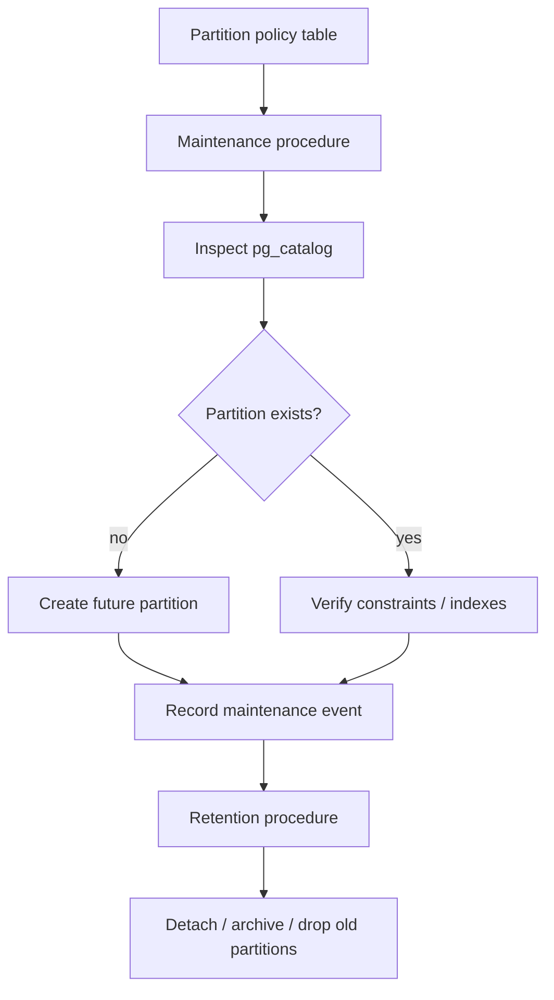
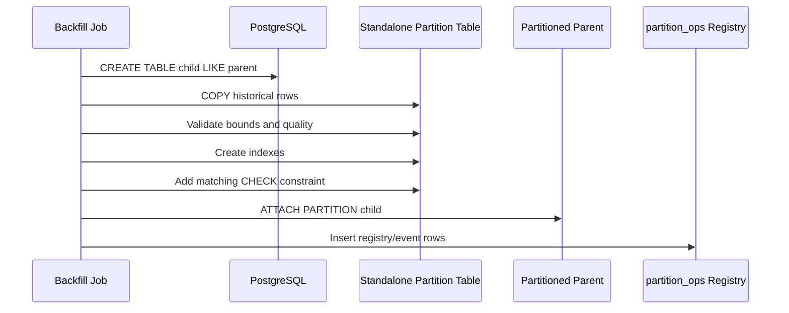

# Part 030 — Partition-Aware PL/pgSQL and Maintenance Automation

Partitioning is not a performance feature you “turn on”. It is a lifecycle design.

A partitioned table forces you to answer:

- How is data divided?
- How are future partitions created?
- How are old partitions archived or removed?
- How are indexes maintained?
- How do migrations interact with partitions?
- What happens when a row targets a missing partition?
- How much locking does partition maintenance introduce?
- Who owns partition operations?

PL/pgSQL is useful here because partition maintenance is procedural by nature. You inspect metadata, decide what exists, generate DDL, enforce guardrails, record outcomes, and expose runbook-friendly diagnostics.

The dangerous version is dynamic DDL scattered across application code.

The production version is metadata-driven, audited, idempotent, and lock-aware.



This part focuses on native declarative partitioning and PL/pgSQL automation around it.

---

## 1. Partitioning Mental Model

In declarative partitioning, the parent table is a logical routing and planning object. Data lives in partitions.

Common partition strategies:

| Strategy | Example | Best For | Risk |
|---|---|---|---|
| Range | monthly by `created_at` | time-series, audit, events | missing future partition |
| List | by region/status/type | bounded categorical domains | category explosion |
| Hash | by tenant/account | distribution | harder retention/window management |

Most operational automation focuses on range partitioning because time creates predictable lifecycle windows.

Example parent table:

```sql
CREATE SCHEMA IF NOT EXISTS audit_log;

CREATE TABLE audit_log.case_event (
  event_id       uuid NOT NULL,
  case_id        bigint NOT NULL,
  event_type     text NOT NULL,
  occurred_at    timestamptz NOT NULL,
  actor_id       text NOT NULL,
  payload        jsonb NOT NULL DEFAULT '{}'::jsonb,
  created_at     timestamptz NOT NULL DEFAULT clock_timestamp(),
  PRIMARY KEY (event_id, occurred_at)
) PARTITION BY RANGE (occurred_at);
```

The primary key includes the partition key. That is not accidental. PostgreSQL partitioned unique/primary constraints must include all partition key columns when they are enforced across the partitioned table.

Monthly partition:

```sql
CREATE TABLE audit_log.case_event_2026_07
PARTITION OF audit_log.case_event
FOR VALUES FROM ('2026-07-01 00:00:00+00') TO ('2026-08-01 00:00:00+00');
```

The application inserts into the parent:

```sql
INSERT INTO audit_log.case_event (
  event_id,
  case_id,
  event_type,
  occurred_at,
  actor_id,
  payload
)
VALUES (
  gen_random_uuid(),
  1001,
  'case_opened',
  clock_timestamp(),
  'user-123',
  '{"source":"portal"}'::jsonb
);
```

The application should not need to know the partition table name.

---

## 2. The First Operational Invariant: Future Partitions Must Exist

For range partitioning, missing future partitions cause inserts to fail once the clock moves beyond available ranges.

That is not a query performance problem. It is an availability problem.

You need an invariant:

> For every partitioned time-series table, partitions must exist from `now - retention_grace` through `now + creation_horizon`.

Represent that invariant as metadata.

```sql
CREATE SCHEMA IF NOT EXISTS partition_ops;

CREATE TABLE partition_ops.partition_policy (
  policy_name             text PRIMARY KEY,
  parent_table            regclass NOT NULL,
  partition_schema        name NOT NULL,
  partition_prefix        name NOT NULL,
  partition_key           name NOT NULL,
  granularity             text NOT NULL CHECK (granularity IN ('monthly', 'daily')),
  create_ahead_intervals  integer NOT NULL DEFAULT 3,
  retain_intervals        integer,
  archive_before_drop     boolean NOT NULL DEFAULT true,
  enabled                 boolean NOT NULL DEFAULT true,
  created_at              timestamptz NOT NULL DEFAULT clock_timestamp(),
  updated_at              timestamptz NOT NULL DEFAULT clock_timestamp()
);
```

Example policy:

```sql
INSERT INTO partition_ops.partition_policy (
  policy_name,
  parent_table,
  partition_schema,
  partition_prefix,
  partition_key,
  granularity,
  create_ahead_intervals,
  retain_intervals,
  archive_before_drop
)
VALUES (
  'audit_log_case_event_monthly',
  'audit_log.case_event'::regclass,
  'audit_log',
  'case_event',
  'occurred_at',
  'monthly',
  6,
  36,
  true
);
```

The `regclass` stores a relation identity-like reference. It also helps avoid stringly-typed table references in internal calls.

---

## 3. Maintenance Event Ledger

DDL automation must leave evidence.

```sql
CREATE TABLE partition_ops.partition_maintenance_event (
  event_id        bigint GENERATED ALWAYS AS IDENTITY PRIMARY KEY,
  policy_name     text NOT NULL REFERENCES partition_ops.partition_policy(policy_name),
  parent_table    regclass NOT NULL,
  partition_name  text NOT NULL,
  action          text NOT NULL,
  status          text NOT NULL,
  started_at      timestamptz NOT NULL DEFAULT clock_timestamp(),
  finished_at     timestamptz,
  error_code      text,
  error_message   text,
  metadata        jsonb NOT NULL DEFAULT '{}'::jsonb
);
```

Why log maintenance events?

- Operators need to know what changed.
- Repeated jobs need idempotency evidence.
- Partition DDL can fail due to locks, permissions, name conflicts, or constraint mismatch.
- Retention automation must be defensible.

Partition automation is production mutation. Treat it that way.

---

## 4. Computing Partition Bounds

Partition creation begins with deterministic bound calculation.

```sql
CREATE OR REPLACE FUNCTION partition_ops.month_start(p_ts timestamptz)
RETURNS timestamptz
LANGUAGE sql
IMMUTABLE
AS $$
  SELECT date_trunc('month', p_ts);
$$;

CREATE OR REPLACE FUNCTION partition_ops.partition_name_monthly(
  p_prefix name,
  p_start timestamptz
)
RETURNS text
LANGUAGE sql
IMMUTABLE
AS $$
  SELECT format(
    '%s_%s',
    p_prefix,
    to_char(p_start AT TIME ZONE 'UTC', 'YYYY_MM')
  );
$$;
```

Time zone discipline matters.

For audit/event tables, prefer UTC partition boundaries unless the domain explicitly requires local calendar boundaries. Local-time partitioning introduces daylight-saving and jurisdiction complexity. For regulatory systems, ambiguity is expensive.

---

## 5. Checking Whether a Partition Exists

Use catalogs, not guesses.

```sql
CREATE OR REPLACE FUNCTION partition_ops.partition_exists(
  p_schema name,
  p_partition_name text
)
RETURNS boolean
LANGUAGE sql
STABLE
AS $$
  SELECT EXISTS (
    SELECT 1
      FROM pg_class c
      JOIN pg_namespace n
        ON n.oid = c.relnamespace
     WHERE n.nspname = p_schema
       AND c.relname = p_partition_name
       AND c.relkind IN ('r', 'p')
  );
$$;
```

This only checks relation existence. It does not prove that the relation is attached to the expected parent with expected bounds. For safety-critical automation, verify attachment too.

```sql
CREATE OR REPLACE FUNCTION partition_ops.partition_attached_to_parent(
  p_parent regclass,
  p_child regclass
)
RETURNS boolean
LANGUAGE sql
STABLE
AS $$
  SELECT EXISTS (
    SELECT 1
      FROM pg_inherits i
     WHERE i.inhparent = p_parent
       AND i.inhrelid = p_child
  );
$$;
```

---

## 6. Creating Future Partitions Idempotently

A monthly partition creation procedure:

```sql
CREATE OR REPLACE PROCEDURE partition_ops.ensure_monthly_partition(
  p_policy_name text,
  p_start timestamptz
)
LANGUAGE plpgsql
AS $$
DECLARE
  v_policy partition_ops.partition_policy%ROWTYPE;
  v_partition_name text;
  v_partition_qualified text;
  v_end timestamptz;
  v_event_id bigint;
BEGIN
  SELECT *
    INTO STRICT v_policy
    FROM partition_ops.partition_policy
   WHERE policy_name = p_policy_name
     AND enabled
   FOR UPDATE;

  IF v_policy.granularity <> 'monthly' THEN
    RAISE EXCEPTION USING
      ERRCODE = 'P0001',
      MESSAGE = 'partition policy is not monthly',
      DETAIL = format('policy=%s granularity=%s', p_policy_name, v_policy.granularity);
  END IF;

  p_start := partition_ops.month_start(p_start);
  v_end := p_start + interval '1 month';
  v_partition_name := partition_ops.partition_name_monthly(v_policy.partition_prefix, p_start);
  v_partition_qualified := format('%I.%I', v_policy.partition_schema, v_partition_name);

  IF partition_ops.partition_exists(v_policy.partition_schema, v_partition_name) THEN
    INSERT INTO partition_ops.partition_maintenance_event (
      policy_name,
      parent_table,
      partition_name,
      action,
      status,
      finished_at,
      metadata
    )
    VALUES (
      p_policy_name,
      v_policy.parent_table,
      v_partition_qualified,
      'ensure_create',
      'already_exists',
      clock_timestamp(),
      jsonb_build_object('from', p_start, 'to', v_end)
    );

    RETURN;
  END IF;

  INSERT INTO partition_ops.partition_maintenance_event (
    policy_name,
    parent_table,
    partition_name,
    action,
    status,
    metadata
  )
  VALUES (
    p_policy_name,
    v_policy.parent_table,
    v_partition_qualified,
    'create_partition',
    'running',
    jsonb_build_object('from', p_start, 'to', v_end)
  )
  RETURNING event_id INTO v_event_id;

  EXECUTE format(
    'CREATE TABLE %s PARTITION OF %s FOR VALUES FROM (%L) TO (%L)',
    v_partition_qualified,
    v_policy.parent_table,
    p_start,
    v_end
  );

  UPDATE partition_ops.partition_maintenance_event
     SET status = 'done',
         finished_at = clock_timestamp()
   WHERE event_id = v_event_id;
EXCEPTION WHEN OTHERS THEN
  IF v_event_id IS NOT NULL THEN
    UPDATE partition_ops.partition_maintenance_event
       SET status = 'failed',
           finished_at = clock_timestamp(),
           error_code = SQLSTATE,
           error_message = SQLERRM
     WHERE event_id = v_event_id;
  END IF;

  RAISE;
END;
$$;
```

Notes:

- The partition table name is identifier-quoted with `%I` through the prebuilt qualified name.
- Bounds are literal-quoted with `%L`.
- The procedure is idempotent at the “already exists” level.
- The policy row is locked so two maintenance workers do not race for the same policy.

For stronger cross-session protection, use advisory locks keyed by policy name.

```sql
PERFORM pg_advisory_xact_lock(hashtext('partition-policy:' || p_policy_name));
```

---

## 7. Ensuring a Horizon of Future Partitions

The common scheduled job should not create one partition. It should enforce a horizon.

```sql
CREATE OR REPLACE PROCEDURE partition_ops.ensure_policy_horizon(
  p_policy_name text,
  p_reference_time timestamptz DEFAULT clock_timestamp()
)
LANGUAGE plpgsql
AS $$
DECLARE
  v_policy partition_ops.partition_policy%ROWTYPE;
  v_start timestamptz;
  i integer;
BEGIN
  SELECT *
    INTO STRICT v_policy
    FROM partition_ops.partition_policy
   WHERE policy_name = p_policy_name
     AND enabled;

  PERFORM pg_advisory_xact_lock(hashtext('partition-policy:' || p_policy_name));

  IF v_policy.granularity = 'monthly' THEN
    v_start := partition_ops.month_start(p_reference_time);

    FOR i IN 0..v_policy.create_ahead_intervals LOOP
      CALL partition_ops.ensure_monthly_partition(
        p_policy_name,
        v_start + make_interval(months => i)
      );
    END LOOP;
  ELSE
    RAISE EXCEPTION USING
      ERRCODE = 'P0001',
      MESSAGE = 'unsupported partition granularity',
      DETAIL = format('granularity=%s', v_policy.granularity);
  END IF;
END;
$$;
```

This procedure should be run by a scheduler before the current horizon is exhausted.

Operational invariant query:

```sql
SELECT policy_name,
       parent_table,
       create_ahead_intervals,
       enabled
  FROM partition_ops.partition_policy
 WHERE enabled;
```

The actual “are all future partitions present?” check can be implemented as a function returning missing bounds.

```sql
CREATE OR REPLACE FUNCTION partition_ops.missing_monthly_partitions(
  p_policy_name text,
  p_reference_time timestamptz DEFAULT clock_timestamp()
)
RETURNS TABLE (
  partition_start timestamptz,
  partition_end timestamptz,
  expected_partition text
)
LANGUAGE plpgsql
STABLE
AS $$
DECLARE
  v_policy partition_ops.partition_policy%ROWTYPE;
  v_start timestamptz;
  v_candidate_start timestamptz;
  v_name text;
  i integer;
BEGIN
  SELECT * INTO STRICT v_policy
    FROM partition_ops.partition_policy
   WHERE policy_name = p_policy_name;

  v_start := partition_ops.month_start(p_reference_time);

  FOR i IN 0..v_policy.create_ahead_intervals LOOP
    v_candidate_start := v_start + make_interval(months => i);
    v_name := partition_ops.partition_name_monthly(
      v_policy.partition_prefix,
      v_candidate_start
    );

    IF NOT partition_ops.partition_exists(v_policy.partition_schema, v_name) THEN
      partition_start := v_candidate_start;
      partition_end := v_candidate_start + interval '1 month';
      expected_partition := format('%I.%I', v_policy.partition_schema, v_name);
      RETURN NEXT;
    END IF;
  END LOOP;
END;
$$;
```

This is useful for monitoring.

---

## 8. Attach vs Create Partition Directly

There are two common creation paths:

### Path A — Direct Partition Creation

```sql
CREATE TABLE child PARTITION OF parent
FOR VALUES FROM (...) TO (...);
```

Simple, useful for empty future partitions.

### Path B — Create Standalone, Load/Check, Attach

```sql
CREATE TABLE child (LIKE parent INCLUDING DEFAULTS INCLUDING CONSTRAINTS);

-- load, validate, transform

ALTER TABLE child
  ADD CONSTRAINT child_bounds_chk
  CHECK (occurred_at >= timestamp '2026-07-01'
     AND occurred_at <  timestamp '2026-08-01');

ALTER TABLE parent
  ATTACH PARTITION child
  FOR VALUES FROM ('2026-07-01') TO ('2026-08-01');
```

This path is useful when:

- you need to load data before making it visible through the parent;
- you want to validate or transform a partition offline;
- you are backfilling historical partitions;
- you want more control over indexes before attach.

Important operational detail: when attaching a table as a partition, PostgreSQL may need to scan it to validate the partition constraint. Adding a matching `CHECK` constraint beforehand can avoid that validation scan.

This is a very practical optimization for large historical backfills.

---

## 9. Retention: Detach, Archive, Drop

Partition retention should be explicit.

There are three basic outcomes:

| Outcome | Use When | Risk |
|---|---|---|
| Drop partition | data can be destroyed | irreversible without backup |
| Detach partition | data leaves parent but remains table | parent queries no longer see it |
| Detach + archive/export | data must be retained outside hot path | archive verification needed |

A retention procedure should not blindly drop tables.

It should:

1. identify expired partitions;
2. check policy;
3. optionally detach;
4. optionally export/archive;
5. drop only after archive confirmation if required;
6. record event.

Simplified metadata for archived partitions:

```sql
CREATE TABLE partition_ops.partition_retention_record (
  policy_name      text NOT NULL,
  parent_table     regclass NOT NULL,
  partition_table  regclass NOT NULL,
  partition_name   text NOT NULL,
  detached_at      timestamptz,
  archived_at      timestamptz,
  dropped_at       timestamptz,
  archive_uri      text,
  status           text NOT NULL,
  metadata         jsonb NOT NULL DEFAULT '{}'::jsonb,
  PRIMARY KEY (policy_name, partition_name)
);
```

Finding candidate partitions requires metadata parsing. For robust systems, store partition bounds when you create the partition rather than reverse-engineering names later.

```sql
CREATE TABLE partition_ops.partition_registry (
  policy_name      text NOT NULL REFERENCES partition_ops.partition_policy(policy_name),
  parent_table     regclass NOT NULL,
  partition_table  regclass NOT NULL,
  partition_schema name NOT NULL,
  partition_name   name NOT NULL,
  range_start      timestamptz NOT NULL,
  range_end        timestamptz NOT NULL,
  created_at       timestamptz NOT NULL DEFAULT clock_timestamp(),
  detached_at      timestamptz,
  dropped_at       timestamptz,
  status           text NOT NULL DEFAULT 'attached',
  PRIMARY KEY (policy_name, partition_name)
);
```

Modify partition creation to insert this registry row after successful `CREATE TABLE ... PARTITION OF`.

```sql
INSERT INTO partition_ops.partition_registry (
  policy_name,
  parent_table,
  partition_table,
  partition_schema,
  partition_name,
  range_start,
  range_end
)
VALUES (
  p_policy_name,
  v_policy.parent_table,
  v_partition_qualified::regclass,
  v_policy.partition_schema,
  v_partition_name,
  p_start,
  v_end
)
ON CONFLICT (policy_name, partition_name) DO NOTHING;
```

Retention selection becomes simple:

```sql
SELECT *
  FROM partition_ops.partition_registry r
  JOIN partition_ops.partition_policy p
    ON p.policy_name = r.policy_name
 WHERE r.policy_name = $1
   AND r.status = 'attached'
   AND p.retain_intervals IS NOT NULL
   AND r.range_end < partition_ops.month_start(clock_timestamp())
                     - make_interval(months => p.retain_intervals);
```

---

## 10. Detach Procedure

A simple detach procedure:

```sql
CREATE OR REPLACE PROCEDURE partition_ops.detach_partition(
  p_policy_name text,
  p_partition_name name
)
LANGUAGE plpgsql
AS $$
DECLARE
  v_reg partition_ops.partition_registry%ROWTYPE;
  v_event_id bigint;
BEGIN
  SELECT *
    INTO STRICT v_reg
    FROM partition_ops.partition_registry
   WHERE policy_name = p_policy_name
     AND partition_name = p_partition_name
     AND status = 'attached'
   FOR UPDATE;

  INSERT INTO partition_ops.partition_maintenance_event (
    policy_name,
    parent_table,
    partition_name,
    action,
    status
  )
  VALUES (
    p_policy_name,
    v_reg.parent_table,
    format('%I.%I', v_reg.partition_schema, v_reg.partition_name),
    'detach_partition',
    'running'
  )
  RETURNING event_id INTO v_event_id;

  EXECUTE format(
    'ALTER TABLE %s DETACH PARTITION %s',
    v_reg.parent_table,
    v_reg.partition_table
  );

  UPDATE partition_ops.partition_registry
     SET status = 'detached',
         detached_at = clock_timestamp()
   WHERE policy_name = p_policy_name
     AND partition_name = p_partition_name;

  UPDATE partition_ops.partition_maintenance_event
     SET status = 'done',
         finished_at = clock_timestamp()
   WHERE event_id = v_event_id;
EXCEPTION WHEN OTHERS THEN
  IF v_event_id IS NOT NULL THEN
    UPDATE partition_ops.partition_maintenance_event
       SET status = 'failed',
           finished_at = clock_timestamp(),
           error_code = SQLSTATE,
           error_message = SQLERRM
     WHERE event_id = v_event_id;
  END IF;

  RAISE;
END;
$$;
```

`DETACH PARTITION CONCURRENTLY` has special transaction behavior and cannot be run inside a transaction block. Since PL/pgSQL procedures themselves execute inside database transaction control rules, do not blindly hide `CONCURRENTLY` inside generic maintenance code. Treat it as a separate runbook operation or a carefully designed top-level procedure path with explicit call constraints.

---

## 11. Index Maintenance on Partitioned Tables

Partitioning changes index operations.

A parent partitioned index represents attached child indexes. For large existing partitions, a common safer pattern is:

1. create index on parent as invalid using `CREATE INDEX ON ONLY parent ...`;
2. create indexes concurrently on partitions;
3. attach partition indexes to the parent index;
4. parent index becomes valid once all partition indexes are attached.

This is not something to improvise during an incident.

Represent index policy explicitly:

```sql
CREATE TABLE partition_ops.partition_index_policy (
  policy_name       text NOT NULL REFERENCES partition_ops.partition_policy(policy_name),
  index_name_suffix text NOT NULL,
  index_definition  text NOT NULL,
  enabled           boolean NOT NULL DEFAULT true,
  PRIMARY KEY (policy_name, index_name_suffix)
);
```

Example:

```sql
INSERT INTO partition_ops.partition_index_policy (
  policy_name,
  index_name_suffix,
  index_definition
)
VALUES (
  'audit_log_case_event_monthly',
  'case_id_occurred_at_idx',
  '(case_id, occurred_at DESC)'
);
```

Create index for a newly created partition:

```sql
CREATE OR REPLACE PROCEDURE partition_ops.ensure_partition_indexes(
  p_policy_name text,
  p_partition_name name
)
LANGUAGE plpgsql
AS $$
DECLARE
  v_reg partition_ops.partition_registry%ROWTYPE;
  v_idx record;
  v_index_name text;
BEGIN
  SELECT * INTO STRICT v_reg
    FROM partition_ops.partition_registry
   WHERE policy_name = p_policy_name
     AND partition_name = p_partition_name;

  FOR v_idx IN
    SELECT *
      FROM partition_ops.partition_index_policy
     WHERE policy_name = p_policy_name
       AND enabled
  LOOP
    v_index_name := format('%s_%s', p_partition_name, v_idx.index_name_suffix);

    EXECUTE format(
      'CREATE INDEX IF NOT EXISTS %I ON %s %s',
      v_index_name,
      v_reg.partition_table,
      v_idx.index_definition
    );
  END LOOP;
END;
$$;
```

Be cautious: `CREATE INDEX CONCURRENTLY` cannot run inside a normal transaction block, so it is not a drop-in replacement inside arbitrary PL/pgSQL routines. If you need concurrent index builds, design that as a top-level operational command flow.

---

## 12. Partition-Aware Ingestion

For declarative partitioning, inserts should go to the parent. PostgreSQL routes them.

But PL/pgSQL still has responsibilities:

- ensure the target partition exists before loading;
- prevent partition-key mutation that would surprise retention logic;
- guard against default partition overuse;
- validate event timestamps;
- route bulk loads into offline partitions when backfilling.

### Guarding Partition Key Mutation

For event/audit tables, the partition key should usually be immutable after insert.

```sql
CREATE OR REPLACE FUNCTION audit_log.prevent_occurred_at_change()
RETURNS trigger
LANGUAGE plpgsql
AS $$
BEGIN
  IF NEW.occurred_at IS DISTINCT FROM OLD.occurred_at THEN
    RAISE EXCEPTION USING
      ERRCODE = 'P0001',
      MESSAGE = 'occurred_at cannot be changed',
      DETAIL = format('event_id=%s', OLD.event_id);
  END IF;

  RETURN NEW;
END;
$$;

CREATE TRIGGER case_event_prevent_occurred_at_change
BEFORE UPDATE OF occurred_at ON audit_log.case_event
FOR EACH ROW
EXECUTE FUNCTION audit_log.prevent_occurred_at_change();
```

PostgreSQL has restrictions around `BEFORE ROW` triggers on partitioned insert routing; do not rely on triggers to change the final partition destination for inserted rows. Validate before insert or insert correct values into the parent.

---

## 13. Default Partitions: Safety Net or Trash Can?

A default partition can prevent insert failure when a value does not match existing partitions.

```sql
CREATE TABLE audit_log.case_event_default
PARTITION OF audit_log.case_event
DEFAULT;
```

This is tempting. It is also dangerous.

A default partition can become a trash can for missing future partitions, bad timestamps, or application bugs.

If you use one, monitor it aggressively:

```sql
SELECT count(*)
  FROM audit_log.case_event_default;
```

Better operational pattern:

- avoid default partitions for strict audit/event tables unless you have a clear recovery process;
- create partitions ahead of time;
- alert when horizon is incomplete;
- use default partition only when the business prefers degraded correctness over write failure.

For regulatory audit trails, silently landing rows in a default partition may make later retention and reporting harder.

---

## 14. Partition Maintenance Scheduler Shape

A scheduled partition maintenance job should run a small number of predictable procedures.

```sql
CREATE OR REPLACE PROCEDURE partition_ops.run_partition_maintenance()
LANGUAGE plpgsql
AS $$
DECLARE
  v_policy record;
BEGIN
  FOR v_policy IN
    SELECT policy_name
      FROM partition_ops.partition_policy
     WHERE enabled
     ORDER BY policy_name
  LOOP
    BEGIN
      CALL partition_ops.ensure_policy_horizon(v_policy.policy_name);
      CALL partition_ops.apply_retention_policy(v_policy.policy_name);
    EXCEPTION WHEN OTHERS THEN
      INSERT INTO partition_ops.partition_maintenance_event (
        policy_name,
        parent_table,
        partition_name,
        action,
        status,
        finished_at,
        error_code,
        error_message
      )
      SELECT p.policy_name,
             p.parent_table,
             '<policy-level>',
             'run_partition_maintenance',
             'failed',
             clock_timestamp(),
             SQLSTATE,
             SQLERRM
        FROM partition_ops.partition_policy p
       WHERE p.policy_name = v_policy.policy_name;

      -- Continue to next policy or re-raise depending on operational design.
      -- For many maintenance jobs, continue is preferable so one broken policy
      -- does not block all partition creation.
    END;
  END LOOP;
END;
$$;
```

There are two valid failure strategies:

| Strategy | Use When |
|---|---|
| Fail fast | one table is mission-critical and should page immediately |
| Continue per policy | many independent partitioned tables share one scheduler |

Make the strategy explicit.

---

## 15. Monitoring Queries

### 15.1 Missing Future Partitions

```sql
SELECT p.policy_name,
       m.partition_start,
       m.partition_end,
       m.expected_partition
  FROM partition_ops.partition_policy p
 CROSS JOIN LATERAL partition_ops.missing_monthly_partitions(p.policy_name) m
 WHERE p.enabled;
```

This query should return zero rows.

### 15.2 Recent Maintenance Failures

```sql
SELECT *
  FROM partition_ops.partition_maintenance_event
 WHERE status = 'failed'
   AND started_at >= clock_timestamp() - interval '24 hours'
 ORDER BY started_at DESC;
```

### 15.3 Partitions Near Retention Boundary

```sql
SELECT r.policy_name,
       r.partition_name,
       r.range_start,
       r.range_end,
       p.retain_intervals
  FROM partition_ops.partition_registry r
  JOIN partition_ops.partition_policy p
    ON p.policy_name = r.policy_name
 WHERE r.status = 'attached'
   AND p.retain_intervals IS NOT NULL
 ORDER BY r.range_end;
```

### 15.4 Default Partition Usage

For each policy with a known default partition, track row count and newest row.

```sql
SELECT count(*) AS default_rows,
       max(occurred_at) AS newest_occurred_at
  FROM audit_log.case_event_default;
```

Default partition rows should usually be treated as exceptions.

---

## 16. Backfill Into Historical Partitions

For large historical loads, direct insert into the parent may work, but it can be operationally awkward. A safer pattern:

1. create standalone table like target partition;
2. bulk load into standalone table;
3. validate bounds;
4. build needed indexes;
5. add matching check constraint;
6. attach as partition;
7. record registry row.



This avoids exposing partially loaded historical data through the parent.

---

## 17. Lock-Aware Design

Partition DDL takes locks. Automation that ignores locks eventually causes incidents.

Practical guardrails:

- run partition creation ahead of need, not at the moment of insert failure;
- create empty future partitions, which is cheap;
- avoid doing historical attach during peak traffic;
- create matching `CHECK` constraints before attach to avoid validation scans;
- separate `CONCURRENTLY` operations into explicit top-level workflows;
- set conservative `lock_timeout` for maintenance sessions;
- log skipped maintenance due to lock timeout.

Example lock timeout wrapper:

```sql
CREATE OR REPLACE PROCEDURE partition_ops.ensure_policy_horizon_with_timeout(
  p_policy_name text,
  p_lock_timeout text DEFAULT '5s'
)
LANGUAGE plpgsql
AS $$
BEGIN
  PERFORM set_config('lock_timeout', p_lock_timeout, true);
  CALL partition_ops.ensure_policy_horizon(p_policy_name);
END;
$$;
```

`set_config(..., true)` applies locally to the current transaction.

If partition creation fails because of lock timeout, the right response is usually to retry later, not to block production sessions indefinitely.

---

## 18. Security Boundary

Partition maintenance should not be executable by ordinary application roles.

Use a narrow owner role:

```sql
CREATE ROLE partition_maint_owner NOLOGIN;
CREATE ROLE partition_maint_executor NOLOGIN;

GRANT USAGE ON SCHEMA partition_ops TO partition_maint_executor;
GRANT EXECUTE ON PROCEDURE partition_ops.run_partition_maintenance()
  TO partition_maint_executor;
```

For security-definer procedures, remember the hardening rules from Part 020:

- set a safe `search_path`;
- schema-qualify objects;
- do not accept arbitrary table names from untrusted callers;
- use policy tables with allow-listed parent tables;
- revoke broad execute privileges;
- avoid dynamic SQL built from user input.

Example:

```sql
ALTER PROCEDURE partition_ops.run_partition_maintenance()
  SECURITY DEFINER
  SET search_path = partition_ops, pg_catalog;
```

Whether to use `SECURITY DEFINER` depends on your operational role model. If a scheduler already runs as a maintenance role, invoker security may be cleaner.

---

## 19. Failure Modes

### 19.1 Missing Future Partition

Symptom: inserts start failing after time crosses boundary.

Root causes:

- scheduler disabled;
- partition policy disabled;
- job failed silently;
- time zone boundary mistake;
- application inserted future-dated data beyond horizon.

Mitigation:

- monitor missing future partitions;
- create more than one interval ahead;
- alert before horizon expires;
- validate future timestamps.

### 19.2 Default Partition Growth

Symptom: default partition has many rows.

Root causes:

- missing partitions;
- invalid partition key values;
- incorrect application timestamps;
- unsupported historical data.

Mitigation:

- alert on default rows;
- build procedure to move rows from default to correct partitions;
- treat default partition as incident queue.

### 19.3 Attach Scans Blocking Operations

Symptom: historical partition attach blocks or waits too long.

Root causes:

- no matching check constraint;
- large table scan required;
- default partition scan required;
- attach during peak traffic.

Mitigation:

- add check constraint first;
- validate offline;
- avoid default partition or constrain it;
- schedule attach in maintenance window.

### 19.4 Unique Constraint Surprise

Symptom: desired unique constraint cannot be created on partitioned table.

Root cause: unique/primary constraint does not include partition key.

Mitigation:

- include partition key in uniqueness contract;
- redesign key semantics;
- use different table shape if global uniqueness is mandatory independent of partition key.

### 19.5 Unsafe Dynamic DDL

Symptom: procedure can create/drop unexpected objects.

Root causes:

- table name accepted directly from caller;
- no policy allow-list;
- unsafe `search_path`;
- bad identifier quoting.

Mitigation:

- use `regclass` policy rows;
- schema-qualify everything;
- separate identifiers and values;
- restrict execute privileges.

---

## 20. Production Checklist

Before adopting partition automation, verify:

- Parent table partitioning strategy is justified.
- Partition key is stable and present in uniqueness constraints where required.
- Application inserts into parent, not child partitions.
- Future partition horizon is defined.
- Partition policy metadata exists.
- Maintenance event ledger exists.
- Missing partition monitoring exists.
- Default partition policy is explicit.
- Retention behavior is explicit: detach, archive, drop, or keep.
- Attach/backfill process uses matching check constraints where needed.
- Index strategy for new and existing partitions is defined.
- Lock timeout is configured for maintenance jobs.
- Maintenance jobs are idempotent.
- DDL automation has a narrow security boundary.
- Runbook covers failed create, failed attach, failed detach, default partition rows, and retention mistakes.

---

## 21. What You Should Be Able To Do After This Part

You should now be able to design PL/pgSQL partition automation that:

- creates future partitions ahead of time;
- records maintenance actions;
- uses metadata rather than hardcoded DDL;
- supports retention windows;
- avoids unsafe dynamic SQL;
- detects missing partitions;
- separates hot-path ingestion from historical backfill;
- understands attach/detach lock implications;
- treats default partitions as explicit operational trade-offs;
- gives operators clear queries and failure states.

Partitioning is not only about pruning queries. It is about making data lifecycle cheap, predictable, and observable.

The next part moves deeper into metadata-driven programming: using PostgreSQL catalogs, introspection, dependency discovery, generated checks, and schema-aware routines without building an unsafe homemade ORM inside the database.

---

## References

- PostgreSQL Documentation — Table Partitioning: `https://www.postgresql.org/docs/current/ddl-partitioning.html`
- PostgreSQL Documentation — `CREATE TABLE`: `https://www.postgresql.org/docs/current/sql-createtable.html`
- PostgreSQL Documentation — `ALTER TABLE`: `https://www.postgresql.org/docs/current/sql-altertable.html`
- PostgreSQL Documentation — System Catalogs: `https://www.postgresql.org/docs/current/catalogs.html`
- PostgreSQL Documentation — PL/pgSQL Dynamic Commands: `https://www.postgresql.org/docs/current/plpgsql-statements.html`
