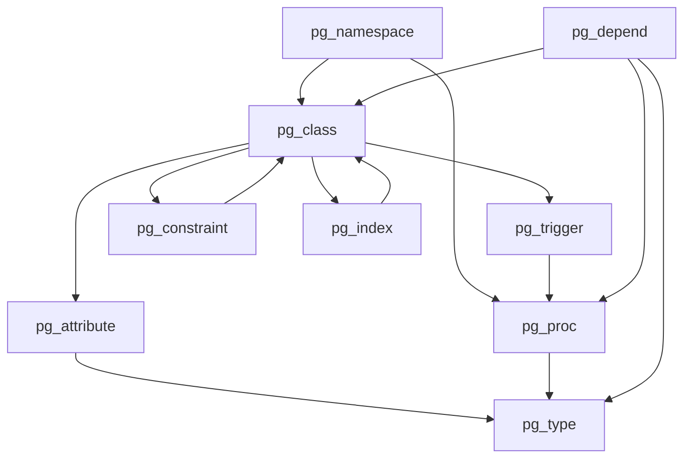
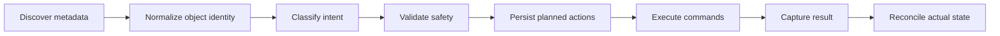
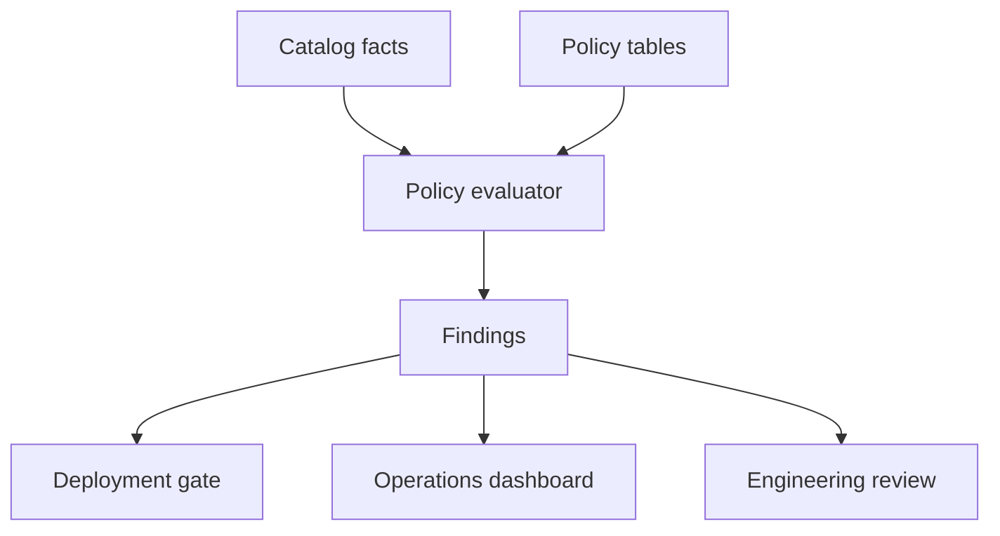
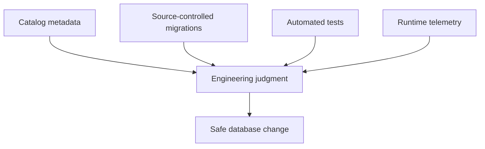

# Part 031 — Metadata-Driven Programming, Catalogs, and Introspection

> Goal: build the mental model and implementation discipline needed to write PL/pgSQL routines that reason about schema metadata safely, generate commands deterministically, and support production operations without turning `pg_catalog` into a fragile internal API dependency.

Most application code treats database schema as something static: tables exist, columns exist, functions exist, triggers exist. Production database work is different. You often need routines that can answer questions like:

- Which tenant partitions are missing for next month?
- Which functions are `SECURITY DEFINER` but do not pin `search_path`?
- Which tables have data-change triggers but no audit trigger?
- Which functions changed between release `2026.07.03-rc1` and production?
- Which columns violate naming or nullability policy?
- Which routines depend on a type that will be changed by the next migration?
- Which generated maintenance commands will run before we actually run them?

This is where metadata-driven programming enters.

The key idea is simple:

> Metadata-driven PL/pgSQL does not hard-code every object name. It queries database metadata, derives an intended action list, validates that list, and only then executes safe dynamic commands.

That sounds powerful because it is. It is also dangerous. PostgreSQL system catalogs are real tables containing database metadata and internal bookkeeping. PostgreSQL documentation is explicit that system catalogs can be damaged if modified by hand; normal schema changes should use SQL commands, not direct catalog writes. So this part treats catalogs as **read-only truth sources**, not mutation targets.

We will focus on production-grade patterns:

1. Choosing `information_schema` vs `pg_catalog`.
2. Reading routine metadata from `pg_proc`.
3. Inspecting tables, columns, indexes, constraints, triggers, and dependencies.
4. Building metadata-driven maintenance routines.
5. Creating safe dynamic SQL from catalog-derived object identities.
6. Storing metadata snapshots for drift detection.
7. Avoiding introspection traps that create false confidence.

We are not trying to memorize every catalog column. We are building a system-level skill: use metadata as a first-class input to database operations.

---

## 1. Mental Model: PostgreSQL Has Two Metadata Surfaces

PostgreSQL exposes metadata mainly through two surfaces:

| Surface | What it is | Strength | Weakness | Use when |
|---|---|---|---|---|
| `information_schema` | SQL-standard metadata views | Portable, stable-ish, easier for generic tools | Incomplete for PostgreSQL-specific features | You need common table/column/routine metadata |
| `pg_catalog` | PostgreSQL-native catalogs and helper functions | Complete, precise, supports PostgreSQL features | More version-specific and lower-level | You need triggers, function flags, partitions, dependencies, indexes, RLS, extensions, etc. |

A useful rule:

> Start with `information_schema` for simple inventory; switch to `pg_catalog` when correctness depends on PostgreSQL-specific behavior.

For PL/pgSQL production work, you will almost always need `pg_catalog` eventually.

Examples:

- Function `SECURITY DEFINER`? `pg_proc.prosecdef`.
- Function volatility? `pg_proc.provolatile`.
- Function kind: function/procedure/aggregate/window? `pg_proc.prokind`.
- Trigger enabled state? `pg_trigger.tgenabled`.
- Object dependencies? `pg_depend`.
- Table identity by OID? `pg_class`.
- Namespace? `pg_namespace`.
- Column details? `pg_attribute`.
- Constraints? `pg_constraint`.
- Indexes? `pg_index` plus `pg_class` plus helper functions.

Use `pg_catalog` with respect. It is a sharp tool.

---

## 2. Catalog as Graph, Not Tables

A beginner sees PostgreSQL catalogs as tables. A production engineer sees a graph.



The catalog graph lets you answer architectural questions:

- What object owns this name?
- What type does this column use?
- Which trigger function is attached to this table?
- Which routine returns this composite type?
- Which objects depend on this type, table, view, or function?
- Which objects will break if we drop or rename something?

The dangerous mistake is to query only names.

Names are human-facing labels. OIDs are database object identities.

For introspection, prefer joining through OIDs:

```sql
select
    n.nspname as schema_name,
    c.relname as table_name,
    c.oid     as table_oid
from pg_catalog.pg_class c
join pg_catalog.pg_namespace n
  on n.oid = c.relnamespace
where n.nspname = 'app'
  and c.relname = 'case_file';
```

Then use `oid` or `regclass` when building follow-up logic.

---

## 3. The Metadata-Driven Execution Pipeline

Every metadata-driven routine should follow this pipeline:



This protects you from the most common failure mode: directly looping through catalog rows and executing generated SQL immediately.

Bad shape:

```sql
for r in select ... from pg_catalog... loop
    execute 'alter table ' || r.table_name || ' ...';
end loop;
```

Production shape:

1. Discover candidates.
2. Convert every object to a stable identity.
3. Generate commands using `format('%I.%I', schema, object)` or `regclass`-based lookup.
4. Store planned actions in a ledger table.
5. Review or dry-run.
6. Execute in bounded chunks.
7. Store outcome.
8. Re-query database state to prove convergence.

---

## 4. Naming, Identity, and Quoting Discipline

Metadata-driven PL/pgSQL is usually coupled with dynamic SQL. That means the Part 014 rules become non-negotiable:

- Identifiers are not values.
- Values are not identifiers.
- Use `%I` for identifiers.
- Use `USING` for values where SQL command parameters are supported.
- Use allow-lists for object classes and schema names.
- Do not concatenate untrusted names.
- Avoid relying on `search_path`.

Use full qualification:

```sql
format('%I.%I', v_schema_name, v_table_name)
```

Do not do this:

```sql
v_schema_name || '.' || v_table_name
```

This fails with mixed-case names, reserved words, spaces, and malicious names.

When a relation is known to exist, `regclass` is often better than raw text:

```sql
select 'app.case_file'::regclass;
```

When the relation may not exist, use `to_regclass()`:

```sql
select to_regclass('app.case_file');
```

`to_regclass()` returns `NULL` instead of throwing an error for missing relation names. That makes it useful for metadata-driven existence checks.

---

## 5. Routine Inventory with `pg_proc`

`pg_proc` stores metadata about functions, procedures, aggregates, and window functions. For PL/pgSQL governance, it is one of the most useful catalogs.

A routine inventory query:

```sql
select
    n.nspname as schema_name,
    p.proname as routine_name,
    p.oid::regprocedure as routine_identity,
    case p.prokind
        when 'f' then 'function'
        when 'p' then 'procedure'
        when 'a' then 'aggregate'
        when 'w' then 'window'
        else p.prokind::text
    end as routine_kind,
    l.lanname as language_name,
    p.prosecdef as security_definer,
    case p.provolatile
        when 'i' then 'immutable'
        when 's' then 'stable'
        when 'v' then 'volatile'
    end as volatility,
    p.proparallel,
    p.procost,
    p.prorows,
    pg_catalog.pg_get_function_arguments(p.oid) as arguments,
    pg_catalog.pg_get_function_result(p.oid) as result_type
from pg_catalog.pg_proc p
join pg_catalog.pg_namespace n
  on n.oid = p.pronamespace
join pg_catalog.pg_language l
  on l.oid = p.prolang
where n.nspname not in ('pg_catalog', 'information_schema')
order by n.nspname, p.proname, p.oid::regprocedure::text;
```

This query is not merely reporting. It is a policy surface.

You can answer:

- Which functions are `SECURITY DEFINER`?
- Which routines are `VOLATILE`?
- Which functions have suspiciously low/high `COST`?
- Which functions are in unapproved schemas?
- Which routines use PL/pgSQL vs SQL vs C extension language?
- Which functions return sets?
- Which routines are overloaded?

---

## 6. Extracting Function Definitions

PostgreSQL provides helper functions for reconstructing routine definitions:

```sql
select
    p.oid::regprocedure as routine_identity,
    pg_catalog.pg_get_functiondef(p.oid) as ddl
from pg_catalog.pg_proc p
join pg_catalog.pg_namespace n
  on n.oid = p.pronamespace
where n.nspname = 'app'
  and p.proname = 'transition_case';
```

This is useful for:

- drift detection,
- release artifact comparison,
- manual review,
- inventory snapshots,
- security review.

But it has a boundary:

> `pg_get_functiondef()` reconstructs the routine definition as PostgreSQL understands it. It is not a replacement for source-controlled migrations.

You should still treat migrations as the canonical deployment artifact. Catalog-extracted definitions are excellent for detecting what is actually deployed.

---

## 7. Function Drift Snapshot

A practical production pattern is to snapshot routine metadata after deployment.

```sql
create schema if not exists ops;

create table if not exists ops.routine_snapshot (
    snapshot_id      bigserial primary key,
    captured_at      timestamptz not null default clock_timestamp(),
    release_id       text not null,
    schema_name      text not null,
    routine_identity text not null,
    routine_kind     text not null,
    language_name    text not null,
    security_definer boolean not null,
    volatility       text not null,
    definition_hash  text not null,
    definition_text  text not null
);
```

Snapshot function:

```sql
create or replace function ops.capture_routine_snapshot(p_release_id text)
returns integer
language plpgsql
security definer
set search_path = ops, pg_catalog
as $$
declare
    v_inserted integer;
begin
    insert into ops.routine_snapshot (
        release_id,
        schema_name,
        routine_identity,
        routine_kind,
        language_name,
        security_definer,
        volatility,
        definition_hash,
        definition_text
    )
    select
        p_release_id,
        n.nspname,
        p.oid::regprocedure::text,
        case p.prokind
            when 'f' then 'function'
            when 'p' then 'procedure'
            when 'a' then 'aggregate'
            when 'w' then 'window'
            else p.prokind::text
        end,
        l.lanname,
        p.prosecdef,
        case p.provolatile
            when 'i' then 'immutable'
            when 's' then 'stable'
            when 'v' then 'volatile'
        end,
        md5(pg_catalog.pg_get_functiondef(p.oid)),
        pg_catalog.pg_get_functiondef(p.oid)
    from pg_catalog.pg_proc p
    join pg_catalog.pg_namespace n on n.oid = p.pronamespace
    join pg_catalog.pg_language l on l.oid = p.prolang
    where n.nspname in ('app', 'audit', 'policy', 'ops');

    get diagnostics v_inserted = row_count;
    return v_inserted;
end;
$$;
```

Usage:

```sql
select ops.capture_routine_snapshot('2026.07.03-rc1');
```

Then compare releases:

```sql
with latest as (
    select distinct on (schema_name, routine_identity)
        schema_name,
        routine_identity,
        release_id,
        definition_hash
    from ops.routine_snapshot
    where release_id = '2026.07.03-prod'
    order by schema_name, routine_identity, captured_at desc
), previous as (
    select distinct on (schema_name, routine_identity)
        schema_name,
        routine_identity,
        release_id,
        definition_hash
    from ops.routine_snapshot
    where release_id = '2026.07.03-rc1'
    order by schema_name, routine_identity, captured_at desc
)
select
    coalesce(l.schema_name, p.schema_name) as schema_name,
    coalesce(l.routine_identity, p.routine_identity) as routine_identity,
    case
        when p.routine_identity is null then 'added'
        when l.routine_identity is null then 'removed'
        when l.definition_hash <> p.definition_hash then 'changed'
        else 'same'
    end as drift_status
from latest l
full join previous p
  on p.schema_name = l.schema_name
 and p.routine_identity = l.routine_identity
where p.routine_identity is null
   or l.routine_identity is null
   or l.definition_hash <> p.definition_hash
order by 1, 2;
```

This is the difference between “we think migrations ran” and “we can prove the deployed database routine graph changed in these ways.”

---

## 8. Security Definer Audit Query

Part 020 covered `SECURITY DEFINER`. Catalog introspection lets you enforce it continuously.

```sql
select
    n.nspname as schema_name,
    p.proname as function_name,
    p.oid::regprocedure as function_identity,
    p.proconfig as config_settings,
    pg_catalog.pg_get_userbyid(p.proowner) as owner_name
from pg_catalog.pg_proc p
join pg_catalog.pg_namespace n
  on n.oid = p.pronamespace
where p.prosecdef
  and n.nspname not in ('pg_catalog', 'information_schema')
order by n.nspname, p.proname;
```

A strong security review asks:

- Does it set `search_path`?
- Is the owner a non-login owner role?
- Is `EXECUTE` revoked from `PUBLIC` where appropriate?
- Does it use dynamic SQL?
- Does it validate object identifiers?
- Does it bypass RLS intentionally or accidentally?
- Does it write audit logs?

Detect missing `search_path` in `proconfig`:

```sql
select
    p.oid::regprocedure as function_identity,
    p.proconfig
from pg_catalog.pg_proc p
join pg_catalog.pg_namespace n on n.oid = p.pronamespace
where p.prosecdef
  and n.nspname not in ('pg_catalog', 'information_schema')
  and not exists (
      select 1
      from unnest(coalesce(p.proconfig, array[]::text[])) as cfg(setting)
      where cfg.setting like 'search_path=%'
  );
```

This query can become a deployment gate.

---

## 9. Table and Column Inventory

For simple inventory, `information_schema.columns` is pleasant:

```sql
select
    table_schema,
    table_name,
    ordinal_position,
    column_name,
    data_type,
    is_nullable,
    column_default
from information_schema.columns
where table_schema = 'app'
order by table_schema, table_name, ordinal_position;
```

For production policy checks, use `pg_catalog`.

```sql
select
    ns.nspname as schema_name,
    cls.relname as table_name,
    att.attnum as ordinal_position,
    att.attname as column_name,
    pg_catalog.format_type(att.atttypid, att.atttypmod) as data_type,
    att.attnotnull as not_null,
    pg_catalog.pg_get_expr(def.adbin, def.adrelid) as default_expr,
    col_description(att.attrelid, att.attnum) as column_comment
from pg_catalog.pg_attribute att
join pg_catalog.pg_class cls
  on cls.oid = att.attrelid
join pg_catalog.pg_namespace ns
  on ns.oid = cls.relnamespace
left join pg_catalog.pg_attrdef def
  on def.adrelid = att.attrelid
 and def.adnum = att.attnum
where ns.nspname = 'app'
  and cls.relkind in ('r', 'p')
  and att.attnum > 0
  and not att.attisdropped
order by ns.nspname, cls.relname, att.attnum;
```

This gives you PostgreSQL-native data type formatting, dropped-column filtering, table kind detection, and comments.

---

## 10. Constraint Inventory

Constraints are the first line of domain correctness. Introspection lets you find missing or suspicious ones.

```sql
select
    ns.nspname as schema_name,
    cls.relname as table_name,
    con.conname as constraint_name,
    case con.contype
        when 'c' then 'check'
        when 'f' then 'foreign_key'
        when 'p' then 'primary_key'
        when 'u' then 'unique'
        when 'x' then 'exclusion'
        else con.contype::text
    end as constraint_type,
    pg_catalog.pg_get_constraintdef(con.oid, true) as constraint_definition
from pg_catalog.pg_constraint con
join pg_catalog.pg_class cls
  on cls.oid = con.conrelid
join pg_catalog.pg_namespace ns
  on ns.oid = cls.relnamespace
where ns.nspname = 'app'
order by ns.nspname, cls.relname, con.conname;
```

Policy examples:

- Every table has a primary key.
- Every table has `created_at` and `updated_at` if mutable.
- Every state column has a check constraint or enum/domain.
- Every foreign key has an intentional `ON DELETE` behavior.
- Every temporal validity table has an exclusion constraint.
- Every audit table has append-only constraints or trigger guardrails.

A query for tables without primary key:

```sql
select
    ns.nspname as schema_name,
    cls.relname as table_name
from pg_catalog.pg_class cls
join pg_catalog.pg_namespace ns
  on ns.oid = cls.relnamespace
where ns.nspname = 'app'
  and cls.relkind in ('r', 'p')
  and not exists (
      select 1
      from pg_catalog.pg_constraint con
      where con.conrelid = cls.oid
        and con.contype = 'p'
  )
order by 1, 2;
```

---

## 11. Trigger Inventory

Trigger behavior is easy to hide. Make it visible.

```sql
select
    ns.nspname as table_schema,
    cls.relname as table_name,
    trg.tgname as trigger_name,
    trg.tgenabled as enabled_state,
    proc.oid::regprocedure as trigger_function,
    pg_catalog.pg_get_triggerdef(trg.oid, true) as trigger_definition
from pg_catalog.pg_trigger trg
join pg_catalog.pg_class cls
  on cls.oid = trg.tgrelid
join pg_catalog.pg_namespace ns
  on ns.oid = cls.relnamespace
join pg_catalog.pg_proc proc
  on proc.oid = trg.tgfoid
where not trg.tgisinternal
  and ns.nspname = 'app'
order by ns.nspname, cls.relname, trg.tgname;
```

This should be part of any production readiness review.

Ask:

- Which tables have mutation triggers?
- Which triggers are disabled?
- Which triggers call `SECURITY DEFINER` functions?
- Which triggers are recursive or could cascade indirectly?
- Which triggers write to audit/outbox tables?
- Which triggers enforce domain transitions?
- Which triggers are still needed after application refactoring?

A useful guardrail query: tables with state column but no transition trigger.

```sql
with state_tables as (
    select distinct
        cls.oid,
        ns.nspname as schema_name,
        cls.relname as table_name
    from pg_catalog.pg_class cls
    join pg_catalog.pg_namespace ns on ns.oid = cls.relnamespace
    join pg_catalog.pg_attribute att on att.attrelid = cls.oid
    where ns.nspname = 'app'
      and cls.relkind in ('r', 'p')
      and att.attname in ('status', 'state')
      and att.attnum > 0
      and not att.attisdropped
)
select st.schema_name, st.table_name
from state_tables st
where not exists (
    select 1
    from pg_catalog.pg_trigger trg
    where trg.tgrelid = st.oid
      and not trg.tgisinternal
      and trg.tgname like '%transition%'
)
order by 1, 2;
```

This query does not prove correctness. It finds suspicious gaps.

---

## 12. Dependency Introspection with `pg_depend`

`pg_depend` records dependency relationships between database objects. PostgreSQL uses dependency data to decide whether `DROP RESTRICT` should fail and what `DROP CASCADE` would affect.

A simple dependency query is hard because object identity spans many catalogs. Use helper functions first.

```sql
select
    pg_catalog.pg_describe_object(d.classid, d.objid, d.objsubid) as dependent_object,
    pg_catalog.pg_describe_object(d.refclassid, d.refobjid, d.refobjsubid) as referenced_object,
    d.deptype
from pg_catalog.pg_depend d
where pg_catalog.pg_describe_object(d.refclassid, d.refobjid, d.refobjsubid)
      like '%app.case_file%'
order by 1, 2;
```

This is useful for exploration, not necessarily final automation.

For robust automation, constrain object types explicitly.

Example: find routines that depend on a type by name:

```sql
with target_type as (
    select t.oid
    from pg_catalog.pg_type t
    join pg_catalog.pg_namespace n on n.oid = t.typnamespace
    where n.nspname = 'app'
      and t.typname = 'case_status'
)
select distinct
    p.oid::regprocedure as routine_identity,
    n.nspname as routine_schema,
    p.proname as routine_name
from pg_catalog.pg_depend d
join pg_catalog.pg_proc p
  on p.oid = d.objid
join pg_catalog.pg_namespace n
  on n.oid = p.pronamespace
join target_type tt
  on tt.oid = d.refobjid
where d.classid = 'pg_catalog.pg_proc'::regclass
order by 1;
```

Important caveat:

> Dependency metadata is strong for parsed object dependencies. It is not a perfect semantic dependency graph for dynamic SQL strings, JSON field names, external code, comments, or application assumptions.

If a function uses this:

```sql
execute format('select count(*) from %I.%I', p_schema, p_table);
```

then `pg_depend` cannot know every future table name the dynamic SQL might touch.

For dynamic SQL, you need your own metadata registry or allow-list table.

---

## 13. Index Inventory and Policy Checks

Index metadata spans `pg_index`, `pg_class`, `pg_namespace`, and helper functions.

```sql
select
    ns.nspname as schema_name,
    tbl.relname as table_name,
    idx.relname as index_name,
    ix.indisunique as is_unique,
    ix.indisprimary as is_primary,
    ix.indisvalid as is_valid,
    ix.indisready as is_ready,
    pg_catalog.pg_get_indexdef(idx.oid) as index_definition
from pg_catalog.pg_index ix
join pg_catalog.pg_class tbl
  on tbl.oid = ix.indrelid
join pg_catalog.pg_class idx
  on idx.oid = ix.indexrelid
join pg_catalog.pg_namespace ns
  on ns.oid = tbl.relnamespace
where ns.nspname = 'app'
order by ns.nspname, tbl.relname, idx.relname;
```

Production checks:

- Invalid indexes after failed concurrent index build.
- Duplicate or redundant indexes.
- Missing unique index for idempotency key.
- Missing partial index for queue worker status.
- Missing GIN index for JSONB query path that is actually used.
- Missing exclusion constraint backing temporal invariant.

PL/pgSQL can automate checks and produce review rows, but avoid automatic “index everything” behavior. Index creation is an operational decision with locking, storage, write amplification, and planner consequences.

---

## 14. Metadata-Driven Maintenance Ledger

Never let a metadata-driven routine be a black box. Persist its plan.

```sql
create schema if not exists ops;

create table if not exists ops.metadata_action_plan (
    action_id       bigserial primary key,
    created_at      timestamptz not null default clock_timestamp(),
    plan_name       text not null,
    release_id      text,
    object_schema   text not null,
    object_name     text not null,
    object_kind     text not null,
    action_kind     text not null,
    command_text    text not null,
    command_hash    text not null,
    status          text not null default 'planned'
        check (status in ('planned', 'approved', 'executed', 'skipped', 'failed')),
    executed_at     timestamptz,
    error_sqlstate  text,
    error_message   text,
    unique (plan_name, command_hash)
);
```

Generate first, execute later:

```sql
create or replace function ops.plan_missing_next_month_partitions(
    p_plan_name text,
    p_release_id text,
    p_parent_schema text,
    p_parent_table text,
    p_from_date date,
    p_month_count integer
)
returns integer
language plpgsql
security definer
set search_path = ops, pg_catalog
as $$
declare
    v_parent_oid oid;
    v_month date;
    v_partition_name text;
    v_command text;
    v_inserted integer := 0;
begin
    if p_month_count <= 0 or p_month_count > 24 then
        raise exception 'invalid month count: %', p_month_count
            using errcode = '22023';
    end if;

    select c.oid
      into v_parent_oid
    from pg_catalog.pg_class c
    join pg_catalog.pg_namespace n on n.oid = c.relnamespace
    where n.nspname = p_parent_schema
      and c.relname = p_parent_table
      and c.relkind = 'p';

    if v_parent_oid is null then
        raise exception 'partitioned table %.% not found', p_parent_schema, p_parent_table
            using errcode = '42P01';
    end if;

    for i in 0..(p_month_count - 1) loop
        v_month := date_trunc('month', p_from_date)::date + make_interval(months => i);
        v_partition_name := format('%s_%s', p_parent_table, to_char(v_month, 'YYYYMM'));

        if to_regclass(format('%I.%I', p_parent_schema, v_partition_name)) is null then
            v_command := format(
                'create table %I.%I partition of %I.%I for values from (%L) to (%L)',
                p_parent_schema,
                v_partition_name,
                p_parent_schema,
                p_parent_table,
                v_month,
                (v_month + interval '1 month')::date
            );

            insert into ops.metadata_action_plan (
                plan_name,
                release_id,
                object_schema,
                object_name,
                object_kind,
                action_kind,
                command_text,
                command_hash
            )
            values (
                p_plan_name,
                p_release_id,
                p_parent_schema,
                v_partition_name,
                'partition',
                'create_partition',
                v_command,
                md5(v_command)
            )
            on conflict (plan_name, command_hash) do nothing;

            get diagnostics v_inserted = row_count;
        end if;
    end loop;

    return v_inserted;
end;
$$;
```

This function does not execute DDL. It plans DDL.

That separation is a major production safety upgrade.

---

## 15. Executing Planned Actions Safely

Execution should be bounded, audited, and fail-visible.

```sql
create or replace procedure ops.execute_metadata_action_plan(
    p_plan_name text,
    p_limit integer default 10
)
language plpgsql
security definer
set search_path = ops, pg_catalog
as $$
declare
    r record;
begin
    if p_limit <= 0 or p_limit > 100 then
        raise exception 'invalid execution limit: %', p_limit
            using errcode = '22023';
    end if;

    for r in
        select action_id, command_text
        from ops.metadata_action_plan
        where plan_name = p_plan_name
          and status = 'approved'
        order by action_id
        limit p_limit
        for update skip locked
    loop
        begin
            execute r.command_text;

            update ops.metadata_action_plan
               set status = 'executed',
                   executed_at = clock_timestamp(),
                   error_sqlstate = null,
                   error_message = null
             where action_id = r.action_id;
        exception
            when others then
                update ops.metadata_action_plan
                   set status = 'failed',
                       executed_at = clock_timestamp(),
                       error_sqlstate = sqlstate,
                       error_message = sqlerrm
                 where action_id = r.action_id;

                raise warning 'metadata action % failed: [%] %',
                    r.action_id, sqlstate, sqlerrm;
        end;
    end loop;
end;
$$;
```

This pattern intentionally resembles a job runner:

- plan,
- approve,
- execute bounded batch,
- store result,
- continue or stop based on failure.

For high-risk DDL, you may want no automatic execution at all. The generated command list may be exported and reviewed by humans.

---

## 16. Schema Policy as Data

Hard-coded policy inside introspection queries becomes unmaintainable. Store policy as data.

```sql
create table ops.schema_policy (
    policy_id       bigserial primary key,
    policy_name     text not null unique,
    enabled         boolean not null default true,
    target_schema   text not null,
    target_kind     text not null,
    rule_config     jsonb not null default '{}'::jsonb,
    created_at      timestamptz not null default clock_timestamp()
);
```

Example policies:

```sql
insert into ops.schema_policy (
    policy_name,
    target_schema,
    target_kind,
    rule_config
)
values
('app tables require primary key', 'app', 'table', '{"require_primary_key": true}'),
('state tables require transition trigger', 'app', 'table', '{"state_columns": ["status", "state"], "trigger_pattern": "%transition%"}'),
('security definer requires search_path', 'app', 'routine', '{"security_definer_requires_search_path": true}');
```

Then policy checks produce findings:

```sql
create table ops.schema_policy_finding (
    finding_id      bigserial primary key,
    checked_at      timestamptz not null default clock_timestamp(),
    policy_name     text not null,
    object_schema   text not null,
    object_name     text not null,
    object_kind     text not null,
    severity        text not null check (severity in ('info', 'warning', 'error')),
    finding_code    text not null,
    finding_message text not null,
    evidence        jsonb not null default '{}'::jsonb
);
```

This is how you turn catalog introspection into governance:



---

## 17. A Concrete Policy Check: Tables Without Primary Key

```sql
create or replace function ops.check_tables_without_primary_key(p_schema text)
returns integer
language plpgsql
security definer
set search_path = ops, pg_catalog
as $$
declare
    v_inserted integer;
begin
    insert into ops.schema_policy_finding (
        policy_name,
        object_schema,
        object_name,
        object_kind,
        severity,
        finding_code,
        finding_message,
        evidence
    )
    select
        'app tables require primary key',
        ns.nspname,
        cls.relname,
        'table',
        'error',
        'TABLE_WITHOUT_PRIMARY_KEY',
        format('Table %I.%I has no primary key', ns.nspname, cls.relname),
        jsonb_build_object('relkind', cls.relkind)
    from pg_catalog.pg_class cls
    join pg_catalog.pg_namespace ns
      on ns.oid = cls.relnamespace
    where ns.nspname = p_schema
      and cls.relkind in ('r', 'p')
      and not exists (
          select 1
          from pg_catalog.pg_constraint con
          where con.conrelid = cls.oid
            and con.contype = 'p'
      );

    get diagnostics v_inserted = row_count;
    return v_inserted;
end;
$$;
```

Notice the function returns number of findings, not a boolean.

A boolean loses evidence. Findings are data.

---

## 18. Metadata-Driven Code Generation

Code generation from metadata can be useful for repetitive boilerplate:

- audit triggers,
- table-specific validation wrappers,
- partition creation commands,
- grant statements,
- row-count reconciliation queries,
- test fixture reset scripts,
- view regeneration,
- index maintenance commands.

But generated code must be deterministic.

A deterministic generator means:

- stable ordering,
- stable formatting,
- no dependence on current `search_path`,
- no implicit random names,
- no clock timestamp inside generated DDL unless intended,
- no unbounded object discovery,
- clear version identifier,
- dry-run output available.

Example: generate missing audit trigger commands.

```sql
select
    format(
        'create trigger %I after insert or update or delete on %I.%I referencing old table as old_rows new table as new_rows for each statement execute function audit.capture_statement_changes()',
        'trg_audit_' || cls.relname,
        ns.nspname,
        cls.relname
    ) as command_text
from pg_catalog.pg_class cls
join pg_catalog.pg_namespace ns
  on ns.oid = cls.relnamespace
where ns.nspname = 'app'
  and cls.relkind in ('r', 'p')
  and not exists (
      select 1
      from pg_catalog.pg_trigger trg
      where trg.tgrelid = cls.oid
        and not trg.tgisinternal
        and trg.tgname = 'trg_audit_' || cls.relname
  )
order by ns.nspname, cls.relname;
```

Do not execute this output blindly. Store it in a plan table, review, then execute.

---

## 19. Catalog Introspection for Application Compatibility

Metadata is also useful at application boundaries.

Example: detect breaking result-shape change in functions used by API.

```sql
create table ops.api_routine_contract (
    routine_identity text primary key,
    expected_result  text not null,
    expected_args    text not null,
    owner_team       text not null
);
```

Check actual vs expected:

```sql
select
    c.routine_identity,
    c.expected_args,
    pg_catalog.pg_get_function_arguments(c.routine_identity::regprocedure::oid) as actual_args,
    c.expected_result,
    pg_catalog.pg_get_function_result(c.routine_identity::regprocedure::oid) as actual_result
from ops.api_routine_contract c
where c.expected_args <> pg_catalog.pg_get_function_arguments(c.routine_identity::regprocedure::oid)
   or c.expected_result <> pg_catalog.pg_get_function_result(c.routine_identity::regprocedure::oid);
```

This protects against accidental changes to API-facing database functions.

---

## 20. Introspection for PL/pgSQL Smell Detection

Some smells are detectable from catalogs.

### 20.1 Too Many `SECURITY DEFINER` Functions

```sql
select n.nspname, count(*)
from pg_catalog.pg_proc p
join pg_catalog.pg_namespace n on n.oid = p.pronamespace
where p.prosecdef
  and n.nspname not in ('pg_catalog', 'information_schema')
group by n.nspname
order by count(*) desc;
```

A high count does not prove danger, but it demands review.

### 20.2 Overloaded Function Ambiguity

```sql
select
    n.nspname as schema_name,
    p.proname as function_name,
    count(*) as overload_count
from pg_catalog.pg_proc p
join pg_catalog.pg_namespace n on n.oid = p.pronamespace
where n.nspname = 'app'
group by n.nspname, p.proname
having count(*) > 1
order by overload_count desc, function_name;
```

Overloading can be useful. It can also make deployment, permissioning, and application calls harder to reason about.

### 20.3 Volatile Functions Used as Query Helpers

```sql
select
    p.oid::regprocedure as routine_identity,
    p.provolatile,
    pg_catalog.pg_get_function_result(p.oid) as result_type
from pg_catalog.pg_proc p
join pg_catalog.pg_namespace n on n.oid = p.pronamespace
where n.nspname = 'app'
  and p.provolatile = 'v'
  and pg_catalog.pg_get_function_result(p.oid) not in ('trigger', 'event_trigger', 'void')
order by 1;
```

This may indicate functions that should be reviewed for planner impact and side effects.

---

## 21. Introspection Boundary: What Catalogs Cannot Tell You

Catalogs are powerful, but they cannot tell the whole truth.

They usually cannot fully answer:

- Does this function implement the correct business policy?
- Is this function safe under production concurrency?
- Is dynamic SQL touching a table that the catalog cannot statically detect?
- Is a JSONB field part of an implicit application contract?
- Is this trigger behavior desirable?
- Is this index actually useful under workload?
- Is this function called by application code that is not represented inside the database?
- Is a migration safe for downstream services?

The catalog tells you structure. Runtime tells you behavior. Tests tell you expected outcomes. Observability tells you production reality.

Use all four.



---

## 22. Metadata Snapshots for Drift Detection

Routine snapshots are one example. You can snapshot schema-level facts too.

```sql
create table ops.schema_object_snapshot (
    snapshot_id     bigserial primary key,
    captured_at     timestamptz not null default clock_timestamp(),
    release_id      text not null,
    object_schema   text not null,
    object_name     text not null,
    object_kind     text not null,
    object_identity text not null,
    object_hash     text not null,
    object_ddl      text not null
);
```

For tables and indexes, exact DDL reconstruction can be harder than functions. Sometimes it is better to hash normalized metadata:

```sql
select
    ns.nspname as object_schema,
    cls.relname as object_name,
    'table' as object_kind,
    cls.oid::regclass::text as object_identity,
    md5(jsonb_pretty(jsonb_agg(
        jsonb_build_object(
            'attnum', att.attnum,
            'attname', att.attname,
            'type', pg_catalog.format_type(att.atttypid, att.atttypmod),
            'not_null', att.attnotnull,
            'default', pg_catalog.pg_get_expr(def.adbin, def.adrelid)
        ) order by att.attnum
    ))) as object_hash
from pg_catalog.pg_class cls
join pg_catalog.pg_namespace ns on ns.oid = cls.relnamespace
join pg_catalog.pg_attribute att on att.attrelid = cls.oid
left join pg_catalog.pg_attrdef def
  on def.adrelid = att.attrelid
 and def.adnum = att.attnum
where ns.nspname = 'app'
  and cls.relkind in ('r', 'p')
  and att.attnum > 0
  and not att.attisdropped
group by ns.nspname, cls.relname, cls.oid;
```

This is not a replacement for migration diffing. It is a production drift detector.

---

## 23. Building a Catalog Utility Schema

Production teams often benefit from an `ops` or `dbmeta` schema containing stable utility views.

Example:

```sql
create schema if not exists dbmeta;

create or replace view dbmeta.routine_inventory as
select
    n.nspname as schema_name,
    p.proname as routine_name,
    p.oid::regprocedure as routine_identity,
    case p.prokind
        when 'f' then 'function'
        when 'p' then 'procedure'
        when 'a' then 'aggregate'
        when 'w' then 'window'
        else p.prokind::text
    end as routine_kind,
    l.lanname as language_name,
    p.prosecdef as security_definer,
    case p.provolatile
        when 'i' then 'immutable'
        when 's' then 'stable'
        when 'v' then 'volatile'
    end as volatility,
    pg_catalog.pg_get_function_arguments(p.oid) as arguments,
    pg_catalog.pg_get_function_result(p.oid) as result_type
from pg_catalog.pg_proc p
join pg_catalog.pg_namespace n on n.oid = p.pronamespace
join pg_catalog.pg_language l on l.oid = p.prolang
where n.nspname not in ('pg_catalog', 'information_schema');
```

Benefits:

- every engineer uses the same interpretation,
- tests can target the view,
- dashboards can consume the view,
- query complexity is hidden behind a stable internal contract,
- catalog version changes are localized.

But do not hide semantics too aggressively. Name views clearly and document what they include/exclude.

---

## 24. Version-Sensitive Catalog Work

Catalog columns and semantics can change across PostgreSQL versions. That does not mean you should avoid `pg_catalog`. It means you should isolate version-sensitive code.

Recommended practices:

1. Put catalog queries in dedicated views/functions.
2. Test catalog utility views during PostgreSQL upgrade rehearsals.
3. Avoid `select *` from catalogs.
4. Fully qualify `pg_catalog` references in privileged routines.
5. Prefer documented helper functions where available.
6. Do not modify catalogs directly.
7. Avoid relying on undocumented side effects.
8. Keep upgrade compatibility checks as part of CI.

Example version check:

```sql
show server_version;
show server_version_num;
```

You can store expected major version in a deployment check table, but do not scatter version conditionals through business functions.

---

## 25. PL/pgSQL Pattern: Metadata-Driven Grant Review

Permissions drift over time. Catalogs can expose it.

A function to report executable routines and whether `PUBLIC` has execute privilege:

```sql
select
    p.oid::regprocedure as routine_identity,
    n.nspname as schema_name,
    p.proname as routine_name,
    has_function_privilege('public', p.oid, 'execute') as public_can_execute,
    pg_catalog.pg_get_userbyid(p.proowner) as owner_name
from pg_catalog.pg_proc p
join pg_catalog.pg_namespace n on n.oid = p.pronamespace
where n.nspname in ('app', 'policy', 'audit', 'ops')
order by public_can_execute desc, routine_identity;
```

Use this before and after migrations.

Typical policy:

- Application API functions: executable by app role.
- Internal helper functions: not executable by app role unless required.
- Privileged maintenance routines: executable only by deployment/ops roles.
- `SECURITY DEFINER` routines: no `PUBLIC` execute unless intentionally public and safe.

---

## 26. PL/pgSQL Pattern: Catalog-Driven Reset for Test Schemas

Testing often needs deterministic cleanup. Catalog metadata can generate truncate order.

For a test-only schema:

```sql
select format('truncate table %I.%I restart identity cascade;', n.nspname, c.relname) as command_text
from pg_catalog.pg_class c
join pg_catalog.pg_namespace n on n.oid = c.relnamespace
where n.nspname = 'test_app'
  and c.relkind in ('r', 'p')
order by c.relname;
```

Be careful:

- never run this against production schemas,
- require explicit schema allow-list,
- reject `public` unless intentionally test-only,
- log every command,
- put it behind test-only role permissions.

A safe reset procedure should look like this:

```sql
create or replace procedure test_support.reset_schema(p_schema text)
language plpgsql
security definer
set search_path = test_support, pg_catalog
as $$
declare
    r record;
begin
    if p_schema not like 'test\_%' escape '\' then
        raise exception 'schema % is not an allowed test schema', p_schema
            using errcode = '42501';
    end if;

    for r in
        select format('truncate table %I.%I restart identity cascade', n.nspname, c.relname) as command_text
        from pg_catalog.pg_class c
        join pg_catalog.pg_namespace n on n.oid = c.relnamespace
        where n.nspname = p_schema
          and c.relkind in ('r', 'p')
        order by c.relname
    loop
        execute r.command_text;
    end loop;
end;
$$;
```

---

## 27. Metadata-Driven Programming Failure Modes

| Failure | Root Cause | Consequence | Prevention |
|---|---|---|---|
| Catalog mutation | Treating catalogs as writable implementation tables | Database corruption or unsupported state | Never modify catalogs directly |
| Name concatenation | Dynamic SQL built from unquoted names | Broken commands or injection | Use `%I`, `regclass`, allow-lists |
| Unbounded object discovery | Routine acts on every schema/table | Blast radius too large | Schema allow-list and plan ledger |
| No dry-run | Generated command immediately executed | Irreversible operation surprises | Plan/approve/execute lifecycle |
| Catalog false confidence | Static metadata treated as behavior proof | Runtime bugs missed | Combine with tests and telemetry |
| Dynamic SQL invisible dependency | `pg_depend` cannot see generated object references | Unsafe migration | Maintain explicit metadata registry |
| Version fragility | Catalog query tied to version-specific columns | Upgrade failure | Encapsulate catalog queries and test upgrades |
| Search path dependence | Metadata routine resolves wrong object | Security or correctness issue | Fully qualify objects |
| No result ledger | Operations leave no audit trail | Incident debugging impossible | Store planned/executed outcomes |
| Over-generated code | Generator creates code humans cannot reason about | Maintenance debt | Generate deterministic, reviewable commands |

---

## 28. Production Checklist

Before merging a metadata-driven PL/pgSQL routine:

- [ ] Does it treat `pg_catalog` as read-only?
- [ ] Does it use OIDs/regtypes/regclasses where object identity matters?
- [ ] Does it fully qualify catalog references?
- [ ] Does it avoid `search_path` dependency?
- [ ] Does it use `%I` for identifiers and `USING`/`%L` for values?
- [ ] Does it limit allowed schemas and object kinds?
- [ ] Does it produce a planned action list before execution?
- [ ] Does it support dry-run?
- [ ] Does it persist outcome rows?
- [ ] Does it have a bounded execution limit?
- [ ] Does it capture SQLSTATE and error message?
- [ ] Does it re-query actual state after execution?
- [ ] Does it have tests for empty schema, missing object, weird identifier, duplicate object, and permission failure?
- [ ] Does it avoid assuming dynamic SQL dependencies are visible in `pg_depend`?
- [ ] Is it tested against the target PostgreSQL major version?

---

## 29. Final Mental Model

Metadata-driven PL/pgSQL is not “write SQL that writes SQL.” That phrase is too shallow.

A better model:

> Metadata-driven PL/pgSQL is a database control plane. It reads structural truth, derives intended changes, constrains blast radius, produces reviewable commands, executes bounded work, and proves convergence.

The control plane must be more disciplined than ordinary business logic because mistakes operate on the database shape itself.

You now have the building blocks for:

- schema inventory,
- drift detection,
- policy findings,
- routine security review,
- trigger inventory,
- dependency exploration,
- partition/action planning,
- deterministic command generation,
- test schema reset,
- governance dashboards.

The next part will turn this into executable confidence: testing PL/pgSQL with fixtures, pgTAP-style assertions, regression suites, failure simulations, and CI gates.

---

## References

- PostgreSQL Documentation — System Catalogs: `https://www.postgresql.org/docs/current/catalogs.html`
- PostgreSQL Documentation — `pg_proc`: `https://www.postgresql.org/docs/current/catalog-pg-proc.html`
- PostgreSQL Documentation — `pg_depend`: `https://www.postgresql.org/docs/current/catalog-pg-depend.html`
- PostgreSQL Documentation — System Information Functions: `https://www.postgresql.org/docs/current/functions-info.html`
- PostgreSQL Documentation — `CREATE FUNCTION`: `https://www.postgresql.org/docs/current/sql-createfunction.html`
- PostgreSQL Documentation — `CREATE TRIGGER`: `https://www.postgresql.org/docs/current/sql-createtrigger.html`
