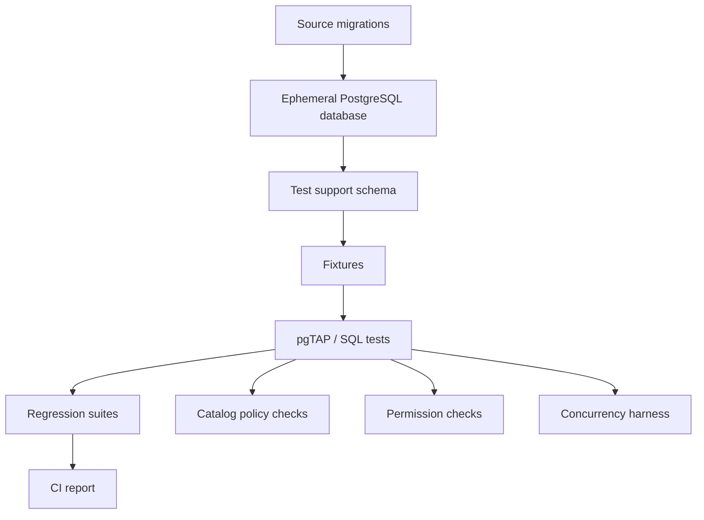
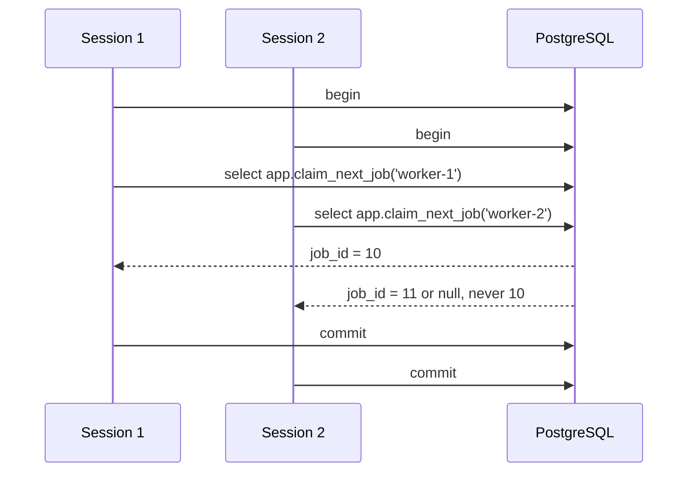
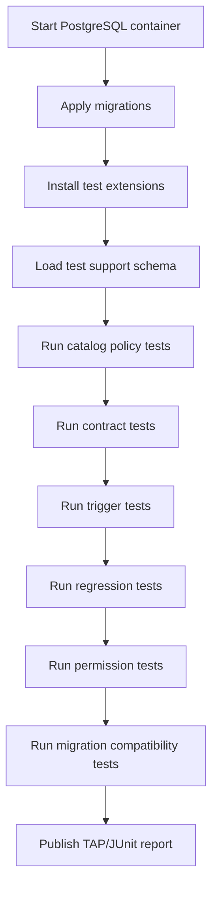
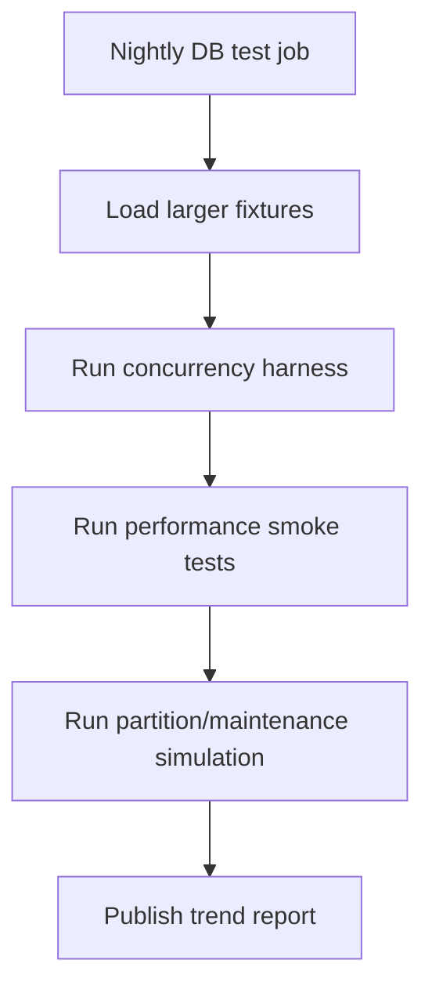

# Part 032 — Testing PL/pgSQL with pgTAP, Fixtures, and Regression Suites

> Goal: learn how to test PL/pgSQL as production behavior, not as isolated syntax. We will design test schemas, fixtures, assertions, regression suites, failure simulations, and CI gates that make database-side logic safe to evolve.

PL/pgSQL is executable production code. It deserves the same engineering discipline as Java, Go, Node.js, or .NET code.

But testing PL/pgSQL has a special shape because database code lives inside a stateful engine:

- It reads and writes tables.
- It depends on constraints, triggers, policies, indexes, privileges, extensions, and transaction isolation.
- It can behave differently under concurrency.
- It can hide side effects behind triggers.
- It can be sensitive to `search_path`, role, timezone, locale, configuration, and snapshot visibility.
- It can pass unit tests and still fail under migration order or production data shape.

So the right question is not:

> How do I unit test a function?

The better question is:

> What behavior must remain true when this database function runs inside real database semantics?

This part builds a complete testing model for PL/pgSQL.

We will use pgTAP as the main database-native testing vocabulary. pgTAP is a unit testing framework for PostgreSQL that provides TAP-emitting assertion functions and can integrate with TAP harnesses. Even if you do not adopt pgTAP, the architecture in this part still applies: assertions, fixtures, test isolation, regression suites, and failure simulation.

---

## 1. Testing Taxonomy for PL/pgSQL

Do not collapse all tests into “unit tests.” Database behavior has multiple layers.

| Test Type | Target | Example | Runs In |
|---|---|---|---|
| Catalog test | Schema/routine metadata | Function is `SECURITY DEFINER` and pins `search_path` | CI + deploy gate |
| Contract test | Function input/output contract | `transition_case()` rejects invalid transition | CI |
| Constraint test | Constraint behavior | duplicate idempotency key fails | CI |
| Trigger test | Hidden side effect | update writes audit row | CI |
| Fixture test | Known data scenario | escalation selects overdue case | CI |
| Regression test | Previously fixed bug | backdated correction does not create overlap | CI |
| Error test | SQLSTATE and message contract | invalid state returns domain SQLSTATE | CI |
| Permission test | Role boundary | app role cannot call internal routine | CI/pre-prod |
| Migration test | Upgrade safety | old and new function contracts coexist | CI/pre-prod |
| Concurrency test | Race behavior | two workers cannot process same job | specialized CI/pre-prod |
| Performance smoke test | Obvious regression | function does not scan entire audit table | nightly/pre-prod |

A mature PL/pgSQL test suite has more than value assertions. It validates **contracts, boundaries, side effects, and failure modes**.

---

## 2. What Makes PL/pgSQL Testing Hard

### 2.1 State Leaks

If one test inserts data and another test accidentally depends on it, your suite becomes order-dependent.

### 2.2 Transaction Semantics

Some behavior only appears at commit time, such as deferred constraints. Some procedures can manage transactions when called in allowed contexts.

### 2.3 Hidden Trigger Behavior

Calling one function may mutate multiple tables through triggers. If the test only checks the direct return value, it misses side effects.

### 2.4 Role and `search_path`

A function may pass as owner but fail as application role. A function may work with one `search_path` and call the wrong object with another.

### 2.5 Time

Escalation logic, effective-dating, audit timestamps, and retention routines depend on time. Tests using `now()` directly become flaky.

### 2.6 Concurrency

Single-session tests cannot prove race safety.

### 2.7 Production Data Shape

A function can pass tiny fixture tests and fail under skewed distribution, null-heavy rows, old data, or partition boundaries.

The solution is not “write more tests randomly.” The solution is a layered test architecture.

---

## 3. Test Architecture

A production-grade PL/pgSQL test environment should look like this:



Core principles:

1. Build database from migrations, not from a manually maintained dump.
2. Keep test helpers in a dedicated schema.
3. Make fixtures explicit and deterministic.
4. Run tests in isolated transactions when possible.
5. Reset state between tests when isolation by transaction is impossible.
6. Test error contracts, not just success paths.
7. Test role boundaries.
8. Keep regression tests close to the bug they protect.
9. Separate deterministic CI tests from slower concurrency/performance tests.

---

## 4. Test Schema Layout

A clean layout:

```txt
/db
  /migrations
    V001__base_schema.sql
    V002__case_workflow.sql
    V003__audit.sql
  /test
    000_setup_test_extensions.sql
    010_test_support_schema.sql
    020_fixtures.sql
    100_contract_transition_case.sql
    110_trigger_audit.sql
    120_permission_security_definer.sql
    130_regression_temporal_overlap.sql
    900_teardown.sql
```

Suggested schemas:

| Schema | Purpose |
|---|---|
| `app` | Application tables and routines under test |
| `audit` | Audit tables/routines under test |
| `policy` | Policy functions under test |
| `ops` | Operational routines under test |
| `test_support` | Test helpers, fixture builders, fake context setters |
| `tap` or extension schema | pgTAP functions if installed into separate schema |

Do not put test helper functions into the production schema unless they are explicitly production support routines.

---

## 5. pgTAP Basics

pgTAP provides assertion functions that emit TAP output. A typical script shape is:

```sql
begin;

select plan(4);

select is(
    app.normalize_case_reference(' abc-123 '),
    'ABC-123',
    'case reference is trimmed and upper-cased'
);

select throws_ok(
    $$ select app.normalize_case_reference(null) $$,
    '23502',
    null,
    'null case reference is rejected'
);

select finish();

rollback;
```

The `BEGIN`/`ROLLBACK` wrapper keeps the database clean when the tested behavior does not require commit.

Important pattern:

> Most PL/pgSQL tests should run inside a transaction and roll back.

But not all can. Procedures that use transaction control, concurrent worker tests, and some DDL/migration tests require special treatment.

---

## 6. Test Fixture Philosophy

Bad fixture design creates brittle tests.

Avoid giant fixtures:

```sql
insert into app.case_file ... 500 rows copied from production-ish data ...;
```

Prefer named fixture builders:

```sql
select test_support.given_case(
    p_case_ref => 'CASE-001',
    p_status => 'OPEN',
    p_priority => 'HIGH',
    p_created_at => timestamptz '2026-07-01 09:00:00+00'
);
```

A fixture builder makes intent visible.

Example:

```sql
create schema if not exists test_support;

create or replace function test_support.given_case(
    p_case_ref text,
    p_status text default 'OPEN',
    p_priority text default 'NORMAL',
    p_created_at timestamptz default timestamptz '2026-01-01 00:00:00+00'
)
returns bigint
language plpgsql
set search_path = test_support, app, pg_catalog
as $$
declare
    v_case_id bigint;
begin
    insert into app.case_file (
        case_ref,
        status,
        priority,
        created_at,
        updated_at
    )
    values (
        p_case_ref,
        p_status,
        p_priority,
        p_created_at,
        p_created_at
    )
    returning case_id into v_case_id;

    return v_case_id;
end;
$$;
```

Fixture builders should:

- use deterministic timestamps,
- return primary keys,
- avoid random values unless seeded,
- create only what the test needs,
- make invalid data possible when testing validation,
- avoid hiding too much domain setup.

---

## 7. Test Data Builders vs Direct Inserts

Use direct inserts for simple table behavior:

```sql
insert into app.case_priority(priority_code) values ('HIGH');
```

Use builders for repeated domain scenarios:

```sql
select test_support.given_case(p_case_ref => 'CASE-001', p_status => 'OPEN');
select test_support.given_assigned_officer('CASE-001', 'officer-1');
select test_support.given_policy_version('workflow-v3');
```

Do not let builders become a second implementation of the domain logic. A builder should create state. It should not validate the behavior being tested.

---

## 8. Testing Pure-ish Functions

Some PL/pgSQL functions behave like pure functions: normalize input, classify value, compute policy result.

Example function:

```sql
create or replace function app.normalize_case_reference(p_value text)
returns text
language plpgsql
immutable
as $$
declare
    v_result text;
begin
    if p_value is null then
        raise exception 'case reference is required'
            using errcode = '23502';
    end if;

    v_result := upper(trim(p_value));

    if v_result !~ '^CASE-[0-9]{3,}$' then
        raise exception 'invalid case reference: %', p_value
            using errcode = '22023';
    end if;

    return v_result;
end;
$$;
```

Test:

```sql
begin;

select plan(5);

select is(app.normalize_case_reference(' case-001 '), 'CASE-001', 'normalizes spacing and case');
select is(app.normalize_case_reference(E'\tcase-999\n'), 'CASE-999', 'normalizes whitespace');

select throws_ok(
    $$ select app.normalize_case_reference(null) $$,
    '23502',
    null,
    'rejects null case reference'
);

select throws_ok(
    $$ select app.normalize_case_reference('abc') $$,
    '22023',
    null,
    'rejects invalid format'
);

select volatility_is('app', 'normalize_case_reference', array['text'], 'immutable', 'normalizer is immutable');

select finish();

rollback;
```

The test checks behavior and catalog contract.

---

## 9. Testing Mutation Functions

Mutation functions should be tested through both direct result and database state.

Example function:

```sql
select app.transition_case(
    p_case_id => 101,
    p_expected_status => 'OPEN',
    p_next_status => 'UNDER_REVIEW',
    p_reason_code => 'INTAKE_COMPLETE',
    p_actor_id => 'user-1'
);
```

Test shape:

```sql
begin;

select plan(6);

select test_support.given_case(
    p_case_ref => 'CASE-001',
    p_status => 'OPEN'
) as case_id \gset

select lives_ok(
    format(
        $$ select app.transition_case(%s, 'OPEN', 'UNDER_REVIEW', 'INTAKE_COMPLETE', 'user-1') $$,
        :'case_id'
    ),
    'valid transition succeeds'
);

select is(
    (select status from app.case_file where case_id = :'case_id'),
    'UNDER_REVIEW',
    'case status changes'
);

select is(
    (select count(*)::integer from audit.case_event where case_id = :'case_id'),
    1,
    'case event is written'
);

select is(
    (select reason_code from audit.case_event where case_id = :'case_id'),
    'INTAKE_COMPLETE',
    'audit reason is recorded'
);

select is(
    (select actor_id from audit.case_event where case_id = :'case_id'),
    'user-1',
    'audit actor is recorded'
);

select is(
    (select count(*)::integer from app.case_file where case_id = :'case_id'),
    1,
    'no duplicate case row is created'
);

select finish();

rollback;
```

This tests:

- command succeeds,
- state changes,
- audit side effect exists,
- reason is recorded,
- actor is recorded,
- row cardinality remains correct.

A mutation test that only checks return value is weak.

---

## 10. Testing Error Contracts

Production callers often depend on SQLSTATE to classify failures. Test that contract.

```sql
begin;

select plan(3);

select test_support.given_case(
    p_case_ref => 'CASE-002',
    p_status => 'CLOSED'
) as case_id \gset

select throws_ok(
    format(
        $$ select app.transition_case(%s, 'OPEN', 'UNDER_REVIEW', 'INTAKE_COMPLETE', 'user-1') $$,
        :'case_id'
    ),
    'P4001',
    null,
    'expected-status mismatch uses domain SQLSTATE'
);

select is(
    (select status from app.case_file where case_id = :'case_id'),
    'CLOSED',
    'failed transition does not mutate case'
);

select is(
    (select count(*)::integer from audit.case_event where case_id = :'case_id'),
    0,
    'failed transition does not write audit event'
);

select finish();

rollback;
```

Test both the exception and absence of side effects.

---

## 11. Testing Triggers

Triggers are hidden execution. Tests must make them visible.

Example: metadata stamping trigger.

```sql
begin;

select plan(4);

insert into app.case_file(case_ref, status, priority)
values ('CASE-010', 'OPEN', 'NORMAL')
returning case_id \gset

select isnt(
    (select created_at from app.case_file where case_id = :'case_id'),
    null,
    'created_at is stamped'
);

select isnt(
    (select updated_at from app.case_file where case_id = :'case_id'),
    null,
    'updated_at is stamped'
);

update app.case_file
   set priority = 'HIGH'
 where case_id = :'case_id';

select ok(
    (select updated_at >= created_at from app.case_file where case_id = :'case_id'),
    'updated_at remains at or after created_at'
);

select throws_ok(
    format(
        $$ update app.case_file set created_at = clock_timestamp() where case_id = %s $$,
        :'case_id'
    ),
    'P4101',
    null,
    'created_at is immutable after insert'
);

select finish();

rollback;
```

Trigger tests should include:

- insert path,
- update path,
- delete path if relevant,
- blocked mutation path,
- audit side effect,
- recursion prevention,
- disabled trigger detection by catalog test.

---

## 12. Testing Statement-Level Audit with Transition Tables

For audit capture using transition tables, test multi-row operations.

```sql
begin;

select plan(4);

select test_support.given_case('CASE-101', 'OPEN', 'NORMAL');
select test_support.given_case('CASE-102', 'OPEN', 'NORMAL');
select test_support.given_case('CASE-103', 'CLOSED', 'NORMAL');

update app.case_file
   set priority = 'HIGH'
 where status = 'OPEN';

select is(
    (select count(*)::integer from app.case_file where priority = 'HIGH'),
    2,
    'two open cases were updated'
);

select is(
    (select count(*)::integer from audit.row_change where table_name = 'case_file'),
    2,
    'audit captured two row changes'
);

select is(
    (select count(*)::integer from audit.audit_event where operation = 'UPDATE'),
    1,
    'statement-level audit event captured once'
);

select is(
    (select changed_row_count from audit.audit_event where operation = 'UPDATE'),
    2,
    'statement-level audit event records changed row count'
);

select finish();

rollback;
```

This catches a common bug: audit code that accidentally assumes one changed row per statement.

---

## 13. Testing Idempotency

Idempotency tests need replay.

```sql
begin;

select plan(5);

select app.process_external_command(
    p_idempotency_key => 'cmd-001',
    p_payload => '{"caseRef":"CASE-500","action":"OPEN"}'::jsonb
) as result1 \gset

select app.process_external_command(
    p_idempotency_key => 'cmd-001',
    p_payload => '{"caseRef":"CASE-500","action":"OPEN"}'::jsonb
) as result2 \gset

select is(:'result2', :'result1', 'same idempotency key returns same result');

select is(
    (select count(*)::integer from app.case_file where case_ref = 'CASE-500'),
    1,
    'replay does not create duplicate case'
);

select is(
    (select count(*)::integer from app.idempotency_request where idempotency_key = 'cmd-001'),
    1,
    'one idempotency record exists'
);

select is(
    (select status from app.idempotency_request where idempotency_key = 'cmd-001'),
    'COMPLETED',
    'idempotency record is completed'
);

select throws_ok(
    $$
    select app.process_external_command(
        p_idempotency_key => 'cmd-001',
        p_payload => '{"caseRef":"CASE-999","action":"OPEN"}'::jsonb
    )
    $$,
    'P2301',
    null,
    'same idempotency key with different payload is rejected'
);

select finish();

rollback;
```

Idempotency tests should verify:

- first execution,
- exact replay,
- conflicting replay,
- side-effect count,
- stored response,
- request hash.

---

## 14. Testing Temporal Logic

Temporal logic needs edge cases.

Use half-open intervals: `[valid_from, valid_to)`.

Tests:

```sql
begin;

select plan(5);

insert into app.case_assignment(case_id, officer_id, valid_from, valid_to)
values (1, 'officer-a', date '2026-01-01', date '2026-02-01');

select lives_ok(
    $$ insert into app.case_assignment(case_id, officer_id, valid_from, valid_to)
       values (1, 'officer-b', date '2026-02-01', date '2026-03-01') $$,
    'adjacent intervals are allowed'
);

select throws_ok(
    $$ insert into app.case_assignment(case_id, officer_id, valid_from, valid_to)
       values (1, 'officer-c', date '2026-01-15', date '2026-02-15') $$,
    '23P01',
    null,
    'overlapping intervals are rejected by exclusion constraint'
);

select is(
    (select count(*)::integer from app.case_assignment where case_id = 1),
    2,
    'failed overlap insert did not persist'
);

select is(
    app.officer_for_case_at(1, date '2026-01-31'),
    'officer-a',
    'lookup before boundary returns first officer'
);

select is(
    app.officer_for_case_at(1, date '2026-02-01'),
    'officer-b',
    'lookup at boundary returns second officer'
);

select finish();

rollback;
```

Temporal tests should include:

- exact boundary,
- adjacent intervals,
- overlap,
- open-ended interval,
- backdated correction,
- future-dated change,
- timezone if using `timestamptz`,
- DST-sensitive timestamps if relevant.

---

## 15. Testing JSONB Contract

JSONB tests must distinguish:

- missing key,
- JSON `null`,
- SQL `NULL`,
- wrong type,
- invalid enum value,
- unknown extra key,
- nested path mutation.

Example:

```sql
begin;

select plan(6);

select is(
    app.extract_payload_case_ref('{"caseRef":"CASE-001"}'::jsonb),
    'CASE-001',
    'extracts caseRef'
);

select throws_ok(
    $$ select app.extract_payload_case_ref('{}'::jsonb) $$,
    'P2601',
    null,
    'missing caseRef is rejected'
);

select throws_ok(
    $$ select app.extract_payload_case_ref('{"caseRef": null}'::jsonb) $$,
    'P2602',
    null,
    'JSON null caseRef is rejected'
);

select throws_ok(
    $$ select app.extract_payload_case_ref('{"caseRef": 123}'::jsonb) $$,
    'P2603',
    null,
    'numeric caseRef is rejected'
);

select is(
    app.patch_case_payload(
        '{"priority":"NORMAL","tags":["a"]}'::jsonb,
        '{"priority":"HIGH"}'::jsonb
    ),
    '{"priority":"HIGH","tags":["a"]}'::jsonb,
    'allowed patch updates priority'
);

select throws_ok(
    $$ select app.patch_case_payload('{"priority":"NORMAL"}'::jsonb, '{"internalFlag":true}'::jsonb) $$,
    'P2604',
    null,
    'unknown patch key is rejected'
);

select finish();

rollback;
```

Do not just test “happy JSON.” JSON is where implicit contracts go to hide.

---

## 16. Testing Catalog Policy

From Part 031, we can test metadata rules.

Example: all `SECURITY DEFINER` functions in approved schemas must set `search_path`.

```sql
begin;

select plan(1);

select is_empty(
    $$
    select p.oid::regprocedure::text as function_identity
    from pg_catalog.pg_proc p
    join pg_catalog.pg_namespace n on n.oid = p.pronamespace
    where p.prosecdef
      and n.nspname in ('app', 'audit', 'policy', 'ops')
      and not exists (
          select 1
          from unnest(coalesce(p.proconfig, array[]::text[])) as cfg(setting)
          where cfg.setting like 'search_path=%'
      )
    $$,
    'all security definer functions set search_path'
);

select finish();

rollback;
```

Catalog tests are powerful because they catch entire classes of problems before behavior tests even run.

Other catalog tests:

- no table in `app` without primary key,
- no disabled non-internal trigger,
- no routine in `public` schema,
- no `SECURITY DEFINER` function owned by login role,
- no app-executable internal routine,
- every state table has transition trigger,
- every audit table is append-only,
- every idempotency table has unique key,
- every partitioned table has next period partition.

---

## 17. Testing Permissions and Roles

Database security tests should run as the role that production uses.

Example:

```sql
begin;

select plan(3);

set local role app_user;

select lives_ok(
    $$ select app.get_case_summary(1) $$,
    'app_user can read case summary'
);

select throws_ok(
    $$ select ops.capture_routine_snapshot('test') $$,
    '42501',
    null,
    'app_user cannot execute ops routine'
);

reset role;

select ok(
    has_function_privilege('deployment_role', 'ops.capture_routine_snapshot(text)', 'execute'),
    'deployment_role can execute ops snapshot routine'
);

select finish();

rollback;
```

Permission tests catch problems that function-owner tests miss.

Also test negative permissions. “Cannot do X” is a contract.

---

## 18. Testing `search_path` Safety

A `SECURITY DEFINER` function that depends on caller `search_path` is dangerous.

Test by poisoning `search_path` in a controlled test schema.

```sql
begin;

select plan(1);

create schema attacker;
create table attacker.case_file(case_id bigint, status text);

set local search_path = attacker, public, app, pg_catalog;

select lives_ok(
    $$ select app.safe_get_case_status(1) $$,
    'function survives hostile search_path'
);

select finish();

rollback;
```

Better: assert the function explicitly sets `search_path` using catalog policy.

Behavior tests prove symptoms. Catalog tests prove configuration.

---

## 19. Testing Procedures with Transaction Control

Procedures can use transaction control only in specific call contexts. Tests that wrap everything in `BEGIN` may make such procedures fail for the wrong reason.

For transaction-controlling procedures:

- run them in dedicated test scripts,
- do not wrap them in one outer test transaction,
- clean up using explicit teardown,
- use a dedicated ephemeral database where possible.

Example procedure test pattern:

```sql
select plan(3);

call ops.run_partition_maintenance(p_limit => 2);

select ok(
    exists (
        select 1
        from ops.metadata_action_plan
        where status in ('executed', 'skipped')
    ),
    'partition maintenance records outcomes'
);

select is_empty(
    $$ select * from ops.metadata_action_plan where status = 'failed' $$,
    'partition maintenance has no failed actions'
);

select ok(
    exists (
        select 1
        from ops.maintenance_run
        where completed_at is not null
    ),
    'maintenance run completes'
);

select finish();
```

Run this in a disposable database. Do not rely on rollback.

---

## 20. Testing Concurrency

Single-session pgTAP tests cannot prove concurrency behavior. You need a harness that opens multiple sessions.

Approaches:

1. Application-level test harness with two or more database connections.
2. Shell script using multiple `psql` processes.
3. pgbench custom scripts for contention scenarios.
4. Dedicated integration test in Java/Go/Node.
5. Pre-production simulation job.

Example scenario: two workers claim jobs.

Invariant:

> A job can be claimed by at most one worker.

Test outline:



A Java-ish test should assert:

- both calls complete,
- returned job IDs are distinct,
- database has no job claimed twice,
- failed/empty result is acceptable if queue is exhausted,
- no deadlock under repeated runs.

SQL invariant check:

```sql
select job_id, count(*)
from app.job_claim_history
group by job_id
having count(*) > 1;
```

Should return no rows.

Concurrency tests should run many iterations. Race bugs are probabilistic until you force the interleaving.

---

## 21. Forcing Race Windows

You can create test-only hooks to force interleavings.

Example:

```sql
create table test_support.pause_point (
    point_name text primary key,
    enabled boolean not null default false,
    pause_seconds numeric not null default 0
);

create or replace function test_support.maybe_pause(p_point_name text)
returns void
language plpgsql
as $$
declare
    v_seconds numeric;
begin
    select pause_seconds
      into v_seconds
    from test_support.pause_point
    where point_name = p_point_name
      and enabled;

    if v_seconds is not null and v_seconds > 0 then
        perform pg_sleep(v_seconds);
    end if;
end;
$$;
```

Then in test builds only:

```sql
perform test_support.maybe_pause('before_job_update');
```

Be careful: do not ship test hooks into production logic unless they are strictly disabled, permissioned, and reviewed. Many teams prefer application harnesses instead.

---

## 22. Regression Tests

Every production bug fixed in PL/pgSQL should create a regression test.

Regression test structure:

```sql
-- Bug: CASE-2026-0177
-- Problem: backdated assignment correction created overlapping assignment interval.
-- Fix: close-and-insert function now uses exclusion constraint and expected-current-row guard.
-- Invariant: no two assignment intervals overlap for same case.

begin;

select plan(2);

-- setup scenario that used to fail
select test_support.given_assignment(1, 'officer-a', '2026-01-01', '2026-04-01');

select lives_ok(
    $$ select app.correct_assignment(1, 'officer-b', date '2026-02-01', date '2026-03-01', 'DATA_CORRECTION') $$,
    'backdated correction completes'
);

select is_empty(
    $$
    select a1.assignment_id, a2.assignment_id
    from app.case_assignment a1
    join app.case_assignment a2
      on a1.case_id = a2.case_id
     and a1.assignment_id < a2.assignment_id
     and tstzrange(a1.valid_from, a1.valid_to, '[)') && tstzrange(a2.valid_from, a2.valid_to, '[)')
    $$,
    'no overlapping assignment intervals remain'
);

select finish();

rollback;
```

Good regression tests include:

- bug reference,
- old failure condition,
- invariant protected,
- minimal scenario,
- assertion that would have failed before the fix.

---

## 23. Testing Migration Compatibility

PL/pgSQL functions are often called by application versions deployed before and after a database migration. Test compatibility windows.

Example problem:

- Old app calls `app.transition_case(case_id, expected_status, next_status)`.
- New app calls `app.transition_case(case_id, expected_status, next_status, reason_code, actor_id)`.
- Migration must support both during rolling deploy.

Test:

```sql
begin;

select plan(2);

select has_function(
    'app',
    'transition_case',
    array['bigint', 'text', 'text'],
    'old transition_case signature still exists during compatibility window'
);

select has_function(
    'app',
    'transition_case',
    array['bigint', 'text', 'text', 'text', 'text'],
    'new transition_case signature exists'
);

select finish();

rollback;
```

Migration tests should protect:

- function signature compatibility,
- default parameter behavior,
- result shape,
- permission compatibility,
- trigger existence,
- old/new view compatibility,
- rollback path.

---

## 24. Testing Observability

You cannot easily assert every log message from inside SQL tests, but you can test durable observability rows.

For batch/procedure logic, prefer run tables:

```sql
select ops.run_case_escalation(p_limit => 100) as run_id \gset

select is(
    (select status from ops.escalation_run where run_id = :'run_id'),
    'COMPLETED',
    'run completed'
);

select isnt(
    (select completed_at from ops.escalation_run where run_id = :'run_id'),
    null,
    'run completion timestamp recorded'
);

select is(
    (select failed_count from ops.escalation_run where run_id = :'run_id'),
    0,
    'run has no failed items'
);
```

Test operational tables as part of behavior, not as incidental storage.

---

## 25. Testing Performance Without Lying to Yourself

Unit tests are not performance tests. But you can add performance smoke tests to catch catastrophic mistakes.

Examples:

- Function must use indexed lookup by idempotency key.
- Queue claim should not scan all historical jobs.
- Audit lookup should target partition or indexed time range.
- JSONB query path should use intended index under representative data.

Use `EXPLAIN` in controlled smoke tests carefully.

Example idea:

```sql
explain (format json)
select app.get_case_summary(123);
```

Then parse plan outside PostgreSQL or with JSON functions. Avoid brittle assertions like exact cost values. Prefer structural assertions:

- no sequential scan on huge table,
- expected index appears,
- partition pruning occurs,
- estimated rows are within broad sanity range.

Performance smoke tests should be separate from fast deterministic tests.

---

## 26. Test Isolation Patterns

### Pattern A: Transaction Rollback

Best for most tests.

```sql
begin;
select plan(...);
-- setup and assertions
select finish();
rollback;
```

### Pattern B: Dedicated Test Schema Reset

Useful when procedures commit or when external harness needs persistent state.

```sql
call test_support.reset_schema('test_app');
```

### Pattern C: Ephemeral Database

Best for migration, procedure transaction, and destructive tests.

```txt
createdb test_run_20260703_001
apply migrations
run tests
dropdb test_run_20260703_001
```

### Pattern D: Testcontainers / Dockerized PostgreSQL

Best for application-integrated CI. The application test harness controls database lifecycle and connections.

Choose based on behavior under test.

---

## 27. Test Determinism

Avoid nondeterminism:

| Source | Problem | Fix |
|---|---|---|
| `now()` | Time moves | Inject timestamp parameter or use fixed fixture time |
| random UUID | Hard to assert | Pass explicit IDs in tests |
| unordered query | Flaky result order | Add `ORDER BY` |
| sequence values | Differ by test order | Use returned IDs or reset schema |
| current role | Depends on runner | Set role explicitly |
| timezone | Timestamp differences | Set timezone explicitly |
| search path | Wrong function/table resolution | Set `search_path` explicitly |
| concurrent tests | Data interference | Isolate database/schema |
| existing local data | False pass/fail | Use ephemeral database |

At the top of test scripts, set environment explicitly:

```sql
set timezone = 'UTC';
set datestyle = 'ISO, YMD';
set client_min_messages = warning;
set search_path = app, audit, policy, test_support, pg_catalog;
```

For security tests, deliberately override `search_path` to hostile values.

---

## 28. CI Execution Model

A practical CI pipeline:



Optional slower lane:



Separate fast feedback from heavier confidence checks.

---

## 29. Example Test Runner Script

A simple local runner:

```bash
#!/usr/bin/env bash
set -euo pipefail

DB_NAME="${DB_NAME:-plpgsql_test}"

psql -v ON_ERROR_STOP=1 -d "$DB_NAME" -f db/test/000_setup_test_extensions.sql
psql -v ON_ERROR_STOP=1 -d "$DB_NAME" -f db/test/010_test_support_schema.sql

for file in db/test/[1-8][0-9][0-9]_*.sql; do
  echo "Running $file"
  pg_prove -d "$DB_NAME" "$file"
done
```

Many teams use `pg_prove` with pgTAP. Others use `psql` plus a test harness. The key is that database tests should be first-class CI artifacts, not manual DBA scripts.

---

## 30. Testing Without pgTAP

If pgTAP is unavailable, you can still build assertions.

Example helper:

```sql
create schema if not exists test_support;

create or replace function test_support.assert_equals(
    p_actual anyelement,
    p_expected anyelement,
    p_message text
)
returns void
language plpgsql
as $$
begin
    if p_actual is distinct from p_expected then
        raise exception 'assertion failed: %, expected %, got %',
            p_message, p_expected, p_actual
            using errcode = 'P0001';
    end if;
end;
$$;
```

Use:

```sql
select test_support.assert_equals(
    app.normalize_case_reference(' case-001 '),
    'CASE-001',
    'normalizes case reference'
);
```

This is less expressive than pgTAP and produces less standardized output, but it is still better than manual testing.

---

## 31. Common PL/pgSQL Testing Anti-Patterns

| Anti-Pattern | Why It Fails | Better Approach |
|---|---|---|
| Only testing happy path | Domain failures break production | Test invalid input and SQLSTATE |
| Testing only return value | Side effects hidden | Assert table state and audit/outbox rows |
| Giant fixture dump | Brittle, slow, unclear | Minimal fixture builders |
| No rollback/reset | Order-dependent tests | Transaction rollback or ephemeral DB |
| Ignoring roles | Passes as owner, fails as app | `SET ROLE` tests |
| Ignoring `search_path` | Security bug hidden | Catalog and hostile path tests |
| No regression tests | Fixed bugs return | One test per production bug |
| Exact plan cost assertions | Flaky across versions/data | Structural performance smoke tests |
| Single-session “concurrency” test | Race not tested | Multi-session harness |
| Tests depend on current time | Flaky | Inject/fix timestamps |
| Testing implementation detail only | Refactor breaks tests without behavior change | Assert contract/invariant |
| No migration compatibility tests | Rolling deploy breaks | Test old/new signatures and views |

---

## 32. What to Test for Each PL/pgSQL Routine

Use this review matrix.

| Routine Kind | Must Test |
|---|---|
| Normalizer/classifier | valid input, invalid input, nulls, volatility, edge format |
| Validator | all failure categories, SQLSTATE, message detail if contract-relevant |
| Mutation function | state before/after, row count, audit, outbox, idempotency, error rollback |
| Trigger function | insert/update/delete paths, blocked path, audit, recursion, disabled state |
| Procedure | run ledger, chunking, partial failure, restartability, transaction behavior |
| Dynamic SQL routine | identifier quoting, allow-list, missing object, weird names, injection attempt |
| Security definer function | role permissions, `search_path`, owner, privilege boundary |
| State transition function | valid transition, invalid transition, expected-state mismatch, audit reason |
| Temporal function | boundary, overlap, gap, open-ended, backdated correction |
| JSONB function | missing key, JSON null, SQL null, wrong type, extra key, nested patch |
| Queue worker | claim uniqueness, skip locked behavior, retry, dead-letter, concurrency |
| Maintenance routine | dry-run, limit, ledger, failure capture, idempotency, actual convergence |

---

## 33. Production-Grade Test Example: Case Transition Suite

A compact but strong suite for `app.transition_case`:

```sql
begin;

select plan(10);

set local timezone = 'UTC';
set local search_path = app, audit, test_support, pg_catalog;

select test_support.given_case('CASE-700', 'OPEN', 'HIGH') as case_id \gset

select lives_ok(
    format(
        $$ select app.transition_case(%s, 'OPEN', 'UNDER_REVIEW', 'INTAKE_COMPLETE', 'user-7') $$,
        :'case_id'
    ),
    'valid OPEN -> UNDER_REVIEW transition succeeds'
);

select is(
    (select status from app.case_file where case_id = :'case_id'),
    'UNDER_REVIEW',
    'status updated'
);

select is(
    (select count(*)::integer from audit.case_event where case_id = :'case_id'),
    1,
    'audit event inserted'
);

select is(
    (select reason_code from audit.case_event where case_id = :'case_id'),
    'INTAKE_COMPLETE',
    'reason code recorded'
);

select throws_ok(
    format(
        $$ select app.transition_case(%s, 'OPEN', 'CLOSED', 'BAD_EXPECTED_STATE', 'user-7') $$,
        :'case_id'
    ),
    'P4001',
    null,
    'expected-state mismatch rejected'
);

select is(
    (select status from app.case_file where case_id = :'case_id'),
    'UNDER_REVIEW',
    'failed transition did not change state'
);

select throws_ok(
    format(
        $$ select app.transition_case(%s, 'UNDER_REVIEW', 'DELETED', 'INVALID_TRANSITION', 'user-7') $$,
        :'case_id'
    ),
    'P4002',
    null,
    'invalid transition rejected'
);

select is(
    (select count(*)::integer from audit.case_event where case_id = :'case_id'),
    1,
    'failed invalid transition did not add audit event'
);

select is_empty(
    $$
    select *
    from app.case_file
    where status not in ('OPEN', 'UNDER_REVIEW', 'ESCALATED', 'CLOSED')
    $$,
    'no invalid statuses exist'
);

select has_function(
    'app',
    'transition_case',
    array['bigint', 'text', 'text', 'text', 'text'],
    'transition function signature exists'
);

select finish();

rollback;
```

This suite tests behavior, side effects, failure rollback, state invariant, and function signature.

---

## 34. Testing Review Checklist

Before accepting a PL/pgSQL change:

- [ ] Is there at least one test for successful behavior?
- [ ] Is there at least one test for domain failure?
- [ ] Are SQLSTATE contracts tested for caller-visible errors?
- [ ] Are side effects tested: audit, outbox, ledger, counters, history rows?
- [ ] Are no-side-effect guarantees tested after failure?
- [ ] Are trigger paths tested directly or indirectly?
- [ ] Are permission boundaries tested with `SET ROLE`?
- [ ] Are `SECURITY DEFINER` functions checked for `search_path`?
- [ ] Are temporal boundaries tested if time is involved?
- [ ] Are JSON missing/null/wrong-type cases tested if JSON is involved?
- [ ] Are idempotency replay and conflict cases tested?
- [ ] Are migration compatibility contracts tested for API-facing routines?
- [ ] Are fixtures minimal and deterministic?
- [ ] Does each regression bug have a regression test?
- [ ] Are concurrency-sensitive invariants tested with a multi-session harness?
- [ ] Are slow tests separated from fast CI tests?

---

## 35. Final Mental Model

Testing PL/pgSQL is not about proving that syntax compiles. PostgreSQL already does that.

It is about proving that database-side behavior remains correct under real database semantics:

- constraints,
- triggers,
- roles,
- transactions,
- time,
- concurrency,
- migration order,
- hidden side effects,
- operational recovery.

A strong PL/pgSQL test suite works like a legal defense file for your database behavior:

- Here is the expected behavior.
- Here is the invalid behavior we reject.
- Here is the SQLSTATE contract.
- Here is the side effect we require.
- Here is the side effect we forbid after failure.
- Here is the role allowed to execute it.
- Here is the migration compatibility window.
- Here is the regression case that used to fail.

That is how you evolve PL/pgSQL without fear.

The next part moves from tests to runtime investigation: debugging, profiling, and performance analysis of PL/pgSQL routines in realistic execution paths.

---

## References

- pgTAP Documentation: `https://pgtap.org/documentation.html`
- pgTAP Project: `https://pgtap.org/`
- PostgreSQL Documentation — PL/pgSQL Errors and Messages: `https://www.postgresql.org/docs/current/plpgsql-errors-and-messages.html`
- PostgreSQL Documentation — PL/pgSQL Control Structures: `https://www.postgresql.org/docs/current/plpgsql-control-structures.html`
- PostgreSQL Documentation — Transaction Isolation: `https://www.postgresql.org/docs/current/transaction-iso.html`
- PostgreSQL Documentation — System Catalogs: `https://www.postgresql.org/docs/current/catalogs.html`
- PostgreSQL Documentation — `CREATE FUNCTION`: `https://www.postgresql.org/docs/current/sql-createfunction.html`
