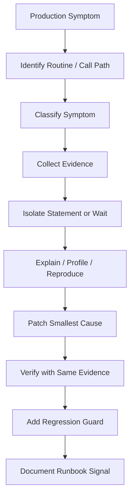
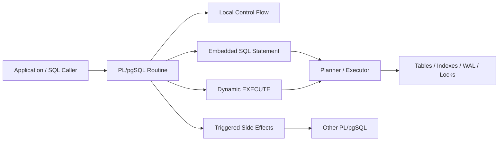

# Part 033 — Debugging, Profiling, and Performance Investigation

> Goal: learn how to investigate PL/pgSQL behavior with evidence. We will separate function overhead, SQL plan cost, trigger side effects, lock waits, row-by-row execution, WAL pressure, bad cardinality estimates, and operational symptoms.

A slow PL/pgSQL function is rarely slow because “PL/pgSQL is slow.”

Most production incidents hide behind that sentence, but the real cause is usually one of these:

- one SQL statement inside the function has a bad plan;
- the function executes a cheap statement thousands of times;
- a trigger chain adds hidden work;
- the function waits on locks;
- a cached plan becomes wrong for a parameter distribution;
- dynamic SQL defeats expected plan reuse;
- `RETURN NEXT` / `RETURN QUERY` materializes more data than expected;
- excessive writes generate WAL and index churn;
- a procedure holds a transaction open too long;
- instrumentation is too weak to know which of the above is happening.

This part builds an investigation model.

The core rule:

> Do not optimize PL/pgSQL from vibes. Build a causal chain from symptom → function → statement → plan/wait/write → fix → regression guard.

---

## 1. The Performance Investigation Loop

Performance investigation is not a bag of tricks. It is a loop.



Each loop must answer:

1. What is slow?
2. How often does it happen?
3. Under what parameter shape?
4. Is time spent executing, waiting, planning, writing, or looping?
5. What changed after the fix?

A top-tier engineer avoids broad claims like “the database is slow.” They produce a narrow sentence:

> `app.transition_case()` is slow for tenant 42 because the `case_event` lookup inside the trigger uses a generic plan that scans a partition with poor cardinality estimates; the slow path appears when event count exceeds 10M and action = 'ESCALATE'.

That sentence is actionable.

---

## 2. Symptom Taxonomy

Start by classifying the symptom. Different symptoms require different tools.

| Symptom | Likely Class | Primary Evidence |
|---|---|---|
| Function call latency high | Routine or inner SQL | `pg_stat_user_functions`, logs, app traces |
| One statement dominates DB time | Query plan | `pg_stat_statements`, `EXPLAIN ANALYZE` |
| Latency spikes only under load | Lock/contention | `pg_locks`, `pg_stat_activity`, wait events |
| Fast for some tenants, slow for others | Parameter-sensitive plan | `EXPLAIN` with real parameters, generic/custom plan comparison |
| Slow only after release | Migration/schema/statistics drift | catalog diff, `ANALYZE`, index inventory |
| Slow only with triggers enabled | Hidden side effect | trigger inventory, `auto_explain.log_nested_statements` |
| High CPU | loop, sort/hash, expression cost | `EXPLAIN`, sampled profiling, statement counts |
| High I/O | missing index, bad join, cold cache | `EXPLAIN (ANALYZE, BUFFERS)` |
| High WAL | write amplification | `EXPLAIN (ANALYZE, WAL)`, table/index design |
| Long transaction | procedure boundary | transaction age, blocking tree, run ledger |

The most important distinction:

> Slow execution and lock waiting are different incidents.

If a function spends 10 seconds waiting for a lock, rewriting its SQL may not help. If it spends 10 seconds scanning a table, adding retry logic may not help.

---

## 3. PL/pgSQL Performance Anatomy

A PL/pgSQL routine has layers.



When investigating, do not treat the function as a black box forever. Drill down:

1. Which function/procedure/trigger is involved?
2. Which branch is used?
3. Which embedded SQL statement runs?
4. How many times does it run?
5. What plan does it use?
6. What waits or writes does it cause?

PL/pgSQL is often the coordinator. The cost usually lives in the statements it coordinates.

---

## 4. Minimal Evidence to Capture for Every Incident

Before changing code, capture the basic incident envelope.

| Field | Why It Matters |
|---|---|
| Routine name and schema | Avoid wrong routine version or shadowing |
| Function/procedure signature | Overloaded functions can hide different behavior |
| Caller role | Privilege, RLS, and `search_path` can change behavior |
| Search path | Security and name-resolution bugs |
| Input shape | Cardinality and branch selection depend on parameters |
| Tenant/account/entity id | Data skew often dominates plan behavior |
| Transaction isolation | Retry and snapshot behavior |
| Approximate row counts touched | Explains loop and write cost |
| Timing by phase | Distinguish validation, mutation, audit, outbox |
| SQLSTATE on failure | Classifies retryability and domain failure |
| Wait event if blocked | Distinguish CPU/I/O from lock waits |

A production-ready routine should make this easy. If not, add instrumentation before optimization.

---

## 5. Function-Level Statistics

PostgreSQL can expose statistics for tracked functions through `pg_stat_user_functions` when function tracking is enabled.

Useful query:

```sql
SELECT
  schemaname,
  funcname,
  calls,
  total_time,
  self_time,
  round(total_time / NULLIF(calls, 0), 3) AS avg_ms,
  round(self_time / NULLIF(calls, 0), 3) AS self_avg_ms
FROM pg_stat_user_functions
ORDER BY total_time DESC
LIMIT 30;
```

How to read this:

| Metric | Meaning | Use |
|---|---|---|
| `calls` | number of tracked calls | frequency hotspot |
| `total_time` | total time including called functions | end-to-end routine cost |
| `self_time` | time excluding called functions | local routine overhead clue |
| `avg_ms` | rough average | initial ranking only |

Do not over-trust averages. A function with low average but extreme p99 can still cause incidents.

A stronger analysis groups by call path and parameter shape. PostgreSQL statistics alone often do not tell you whether tenant 42, status `OPEN`, or date window `2026-Q2` is the slow path.

---

## 6. Statement-Level Statistics with `pg_stat_statements`

`pg_stat_statements` is usually more useful than function-level timing because embedded SQL usually dominates runtime.

Example hotspot query:

```sql
SELECT
  queryid,
  calls,
  rows,
  total_exec_time,
  mean_exec_time,
  min_exec_time,
  max_exec_time,
  stddev_exec_time,
  shared_blks_hit,
  shared_blks_read,
  temp_blks_read,
  temp_blks_written,
  wal_records,
  wal_bytes,
  left(query, 180) AS query_sample
FROM pg_stat_statements
ORDER BY total_exec_time DESC
LIMIT 20;
```

Interpretation:

| Signal | Suspicion |
|---|---|
| high `total_exec_time`, many calls | frequent statement dominates workload |
| high `mean_exec_time`, few calls | rare heavy operation |
| high `stddev_exec_time` | parameter-sensitive or skewed workload |
| high `shared_blks_read` | I/O pressure or poor cache locality |
| high temp blocks | sort/hash spill or large intermediate result |
| high WAL bytes | write amplification |

For PL/pgSQL, the hard part is mapping normalized statements back to routine branches. Use comments carefully when allowed:

```sql
/* fn=case_transition phase=lock_current_case */
SELECT c.*
FROM app.case_file c
WHERE c.case_id = p_case_id
FOR UPDATE;
```

But do not inject sensitive values in comments. Comments may appear in logs and monitoring systems.

---

## 7. EXPLAIN Discipline

`EXPLAIN` answers a narrower question than many engineers think.

It does not answer:

> Why is my function slow?

It answers:

> How does PostgreSQL plan or execute this SQL statement under this environment?

Use it at statement boundaries.

Recommended default during investigation:

```sql
EXPLAIN (ANALYZE, BUFFERS, WAL, VERBOSE, SETTINGS)
SELECT ...;
```

Use options intentionally:

| Option | Use |
|---|---|
| `ANALYZE` | actually executes and reports runtime |
| `BUFFERS` | shows shared/local/temp buffer activity |
| `WAL` | shows WAL generated by data-modifying plans |
| `VERBOSE` | reveals output expressions and relation details |
| `SETTINGS` | shows non-default planner-affecting settings |
| `FORMAT JSON` | machine-readable plan regression capture |

Warning:

```sql
EXPLAIN (ANALYZE)
UPDATE app.case_file
SET status = 'ESCALATED'
WHERE case_id = '...';
```

This runs the update. Use a transaction and rollback when investigating mutations:

```sql
BEGIN;
EXPLAIN (ANALYZE, BUFFERS, WAL)
UPDATE app.case_file
SET status = 'ESCALATED'
WHERE case_id = '...';
ROLLBACK;
```

That avoids durable changes, but it still executes locks, triggers, constraint checks, and side effects visible inside the transaction. Do not run destructive explain tests casually in production.

---

## 8. Extracting SQL from a Function

If a function is slow, extract each embedded statement and test it with production-like parameters.

Suppose this function is slow:

```sql
CREATE OR REPLACE FUNCTION app.get_case_dashboard(
  p_tenant_id bigint,
  p_assignee_id bigint,
  p_from timestamptz,
  p_to timestamptz
)
RETURNS TABLE (
  status text,
  case_count bigint,
  oldest_case_at timestamptz
)
LANGUAGE plpgsql
AS $$
BEGIN
  RETURN QUERY
  SELECT c.status, count(*), min(c.created_at)
  FROM app.case_file c
  WHERE c.tenant_id = p_tenant_id
    AND c.assignee_id = p_assignee_id
    AND c.created_at >= p_from
    AND c.created_at < p_to
  GROUP BY c.status;
END;
$$;
```

Extract:

```sql
EXPLAIN (ANALYZE, BUFFERS)
SELECT c.status, count(*), min(c.created_at)
FROM app.case_file c
WHERE c.tenant_id = 42
  AND c.assignee_id = 991
  AND c.created_at >= timestamptz '2026-01-01'
  AND c.created_at < timestamptz '2026-02-01'
GROUP BY c.status;
```

Then test skew:

```sql
-- Small tenant
-- Large tenant
-- Assignee with many cases
-- Assignee with zero cases
-- Very narrow time range
-- Very wide time range
```

A single happy-path parameter set does not prove the function is fast.

---

## 9. Investigating Cached Plan Problems

PL/pgSQL may cache plans for optimizable SQL commands. That is often good. It avoids repeated planning overhead.

But for parameter-sensitive queries, a cached generic plan can be worse than a custom plan for specific parameter values.

Symptoms:

- function is fast in raw SQL but slow inside PL/pgSQL;
- function is fast for most tenants but terrible for large tenants;
- latency changes after enough executions;
- `EXECUTE` version is faster because it replans each time;
- forcing planner settings changes the behavior.

Diagnostic experiment:

```sql
-- Static SQL version inside PL/pgSQL may use cached plan behavior.
CREATE OR REPLACE FUNCTION app.find_cases_static(p_tenant_id bigint)
RETURNS SETOF app.case_file
LANGUAGE plpgsql
AS $$
BEGIN
  RETURN QUERY
  SELECT *
  FROM app.case_file c
  WHERE c.tenant_id = p_tenant_id
    AND c.status = 'OPEN';
END;
$$;
```

Dynamic version:

```sql
CREATE OR REPLACE FUNCTION app.find_cases_dynamic(p_tenant_id bigint)
RETURNS SETOF app.case_file
LANGUAGE plpgsql
AS $$
BEGIN
  RETURN QUERY EXECUTE
    'SELECT * FROM app.case_file c WHERE c.tenant_id = $1 AND c.status = $2'
    USING p_tenant_id, 'OPEN';
END;
$$;
```

Do not immediately choose dynamic SQL because it is faster in one test. It trades plan reuse for per-call planning. Use it when parameter sensitivity is proven and material.

Investigation checklist:

```sql
-- Check actual data distribution.
SELECT tenant_id, count(*)
FROM app.case_file
GROUP BY tenant_id
ORDER BY count(*) DESC
LIMIT 20;

-- Make sure statistics are current.
ANALYZE app.case_file;

-- Compare plans with representative parameters.
EXPLAIN (ANALYZE, BUFFERS)
SELECT ... WHERE tenant_id = 1;

EXPLAIN (ANALYZE, BUFFERS)
SELECT ... WHERE tenant_id = 42;
```

If the fix is dynamic SQL, document why. Future maintainers need to know it was intentional.

---

## 10. Investigating Row-by-Row Execution

PL/pgSQL makes loops easy. That is dangerous.

Bad pattern:

```sql
FOR v_case IN
  SELECT case_id FROM app.case_file WHERE status = 'READY'
LOOP
  UPDATE app.case_file
  SET status = 'PROCESSED'
  WHERE case_id = v_case.case_id;
END LOOP;
```

This creates one SQL execution per row.

Better set-based mutation:

```sql
UPDATE app.case_file c
SET status = 'PROCESSED',
    processed_at = clock_timestamp()
WHERE c.status = 'READY';
```

But set-based is not always enough. If each row needs a separate validation decision, use set-based classification first:

```sql
WITH candidate AS (
  SELECT c.case_id,
         CASE
           WHEN c.locked_by IS NOT NULL THEN 'LOCKED'
           WHEN c.evidence_count = 0 THEN 'MISSING_EVIDENCE'
           ELSE 'READY'
         END AS decision
  FROM app.case_file c
  WHERE c.status = 'SUBMITTED'
)
UPDATE app.case_file c
SET status = 'READY_FOR_REVIEW'
FROM candidate x
WHERE x.case_id = c.case_id
  AND x.decision = 'READY';
```

Investigation signal:

- high function `self_time`;
- high statement call count;
- many repeated normalized statements in `pg_stat_statements`;
- logs show repeated branch output;
- CPU high with low rows per statement.

A top-tier rule:

> Loop over decisions, not over database writes, unless per-row transactional semantics are genuinely required.

---

## 11. Trigger Chain Investigation

Triggers are hidden call paths.

When an update is slow, the visible SQL may not be the cause. Trigger functions can perform audit writes, validation, outbox insert, counter maintenance, JSON diff, notification, and additional queries.

Inventory triggers for a table:

```sql
SELECT
  n.nspname AS schema_name,
  c.relname AS table_name,
  t.tgname AS trigger_name,
  p.proname AS function_name,
  t.tgenabled,
  pg_get_triggerdef(t.oid) AS trigger_definition
FROM pg_trigger t
JOIN pg_class c ON c.oid = t.tgrelid
JOIN pg_namespace n ON n.oid = c.relnamespace
JOIN pg_proc p ON p.oid = t.tgfoid
WHERE NOT t.tgisinternal
  AND n.nspname = 'app'
  AND c.relname = 'case_file'
ORDER BY t.tgname;
```

Use `auto_explain` with nested statement logging in a controlled environment to reveal statements inside functions and triggers.

Example session-level setup in non-production or a carefully controlled admin session:

```sql
LOAD 'auto_explain';
SET auto_explain.log_min_duration = '50ms';
SET auto_explain.log_analyze = on;
SET auto_explain.log_buffers = on;
SET auto_explain.log_wal = on;
SET auto_explain.log_nested_statements = on;
```

Then run the call path and inspect logs.

Do not enable noisy settings globally without an operational plan. Detailed explain logging can produce heavy logs and sensitive query text.

---

## 12. Lock and Wait Investigation

If a function is slow because it waits, `EXPLAIN` may not reveal the root cause. You need wait and lock evidence.

Current active sessions:

```sql
SELECT
  pid,
  usename,
  application_name,
  state,
  wait_event_type,
  wait_event,
  now() - xact_start AS xact_age,
  now() - query_start AS query_age,
  left(query, 200) AS query_sample
FROM pg_stat_activity
WHERE state <> 'idle'
ORDER BY query_start;
```

Blocking tree:

```sql
SELECT
  blocked.pid AS blocked_pid,
  blocked.usename AS blocked_user,
  blocked.wait_event_type,
  blocked.wait_event,
  now() - blocked.query_start AS blocked_for,
  left(blocked.query, 160) AS blocked_query,
  blocker.pid AS blocker_pid,
  blocker.usename AS blocker_user,
  now() - blocker.xact_start AS blocker_xact_age,
  left(blocker.query, 160) AS blocker_query
FROM pg_stat_activity blocked
JOIN LATERAL unnest(pg_blocking_pids(blocked.pid)) AS bpid(blocker_pid) ON true
JOIN pg_stat_activity blocker ON blocker.pid = bpid.blocker_pid
ORDER BY blocked.query_start;
```

Lock detail:

```sql
SELECT
  a.pid,
  a.state,
  a.wait_event_type,
  a.wait_event,
  l.locktype,
  l.mode,
  l.granted,
  l.relation::regclass AS relation_name,
  l.page,
  l.tuple,
  l.virtualtransaction,
  l.transactionid,
  left(a.query, 120) AS query_sample
FROM pg_locks l
JOIN pg_stat_activity a ON a.pid = l.pid
WHERE a.datname = current_database()
ORDER BY l.granted, a.query_start;
```

Interpretation:

| Observation | Meaning |
|---|---|
| blocked session has `wait_event_type = Lock` | waiting, not executing |
| blocker has old `xact_start` | long transaction holding locks |
| many sessions blocked by one pid | incident center |
| procedure call is blocker | transaction boundary too wide |
| trigger update blocks unrelated path | hidden write lock coupling |

Optimization path depends on the lock story:

- shorten transaction;
- reduce rows touched;
- make update predicate more selective;
- move external calls outside transaction;
- add `NOWAIT` or `SKIP LOCKED` where semantics allow;
- enforce deterministic lock ordering;
- split workflow into claim/process/finalize phases.

---

## 13. Write Amplification and WAL Investigation

A PL/pgSQL routine can be slow because it writes too much, not because it reads badly.

Write amplification sources:

- updating unchanged columns;
- updating wide rows;
- many indexes on updated columns;
- audit trigger writes full JSONB before/after images;
- outbox rows with large payloads;
- repeated intermediate status updates;
- delete/reinsert instead of update;
- partition maintenance with heavy catalog operations.

Use `EXPLAIN (ANALYZE, WAL)` for controlled statement investigation:

```sql
BEGIN;
EXPLAIN (ANALYZE, BUFFERS, WAL)
UPDATE app.case_file c
SET status = 'ESCALATED',
    updated_at = clock_timestamp()
WHERE c.status = 'OPEN'
  AND c.escalate_after < clock_timestamp()
  AND c.tenant_id = 42;
ROLLBACK;
```

Then ask:

1. How many rows were actually updated?
2. Did triggers multiply writes?
3. Did indexes amplify each update?
4. Did the audit payload write large JSONB values?
5. Could this be chunked?
6. Could unchanged rows be skipped?

Skip no-op updates:

```sql
UPDATE app.case_file c
SET priority = v_new_priority
WHERE c.case_id = p_case_id
  AND c.priority IS DISTINCT FROM v_new_priority;
```

That small predicate can avoid unnecessary row versions, index churn, trigger execution, and WAL.

---

## 14. Temporary Instrumentation Tables

Sometimes logs are not enough. Use a scoped diagnostic table.

```sql
CREATE TABLE ops.plpgsql_trace_event (
  trace_id uuid NOT NULL,
  event_no bigint GENERATED ALWAYS AS IDENTITY,
  routine_name text NOT NULL,
  phase text NOT NULL,
  entity_id bigint,
  row_count bigint,
  elapsed_ms numeric,
  detail jsonb NOT NULL DEFAULT '{}'::jsonb,
  created_at timestamptz NOT NULL DEFAULT clock_timestamp(),
  PRIMARY KEY (trace_id, event_no)
);
```

Helper:

```sql
CREATE OR REPLACE FUNCTION ops.trace_plpgsql(
  p_trace_id uuid,
  p_routine_name text,
  p_phase text,
  p_entity_id bigint DEFAULT NULL,
  p_row_count bigint DEFAULT NULL,
  p_elapsed_ms numeric DEFAULT NULL,
  p_detail jsonb DEFAULT '{}'::jsonb
)
RETURNS void
LANGUAGE plpgsql
SECURITY DEFINER
SET search_path = ops, pg_catalog
AS $$
BEGIN
  INSERT INTO ops.plpgsql_trace_event (
    trace_id,
    routine_name,
    phase,
    entity_id,
    row_count,
    elapsed_ms,
    detail
  )
  VALUES (
    p_trace_id,
    p_routine_name,
    p_phase,
    p_entity_id,
    p_row_count,
    p_elapsed_ms,
    COALESCE(p_detail, '{}'::jsonb)
  );
END;
$$;
```

Use sparingly. Instrumentation is code. It can create overhead, contention, and sensitive records.

Better pattern:

- enabled by diagnostic flag or admin-only call;
- never logs secrets;
- records bounded JSON;
- has retention policy;
- is removed or disabled after incident;
- emits phase names stable enough for runbooks.

---

## 15. Phase Timing Pattern

To isolate function phases:

```sql
CREATE OR REPLACE FUNCTION app.transition_case_debug(
  p_case_id bigint,
  p_target_status text,
  p_trace_id uuid DEFAULT NULL
)
RETURNS app.case_file
LANGUAGE plpgsql
AS $$
DECLARE
  v_case app.case_file%ROWTYPE;
  v_t0 timestamptz;
  v_t1 timestamptz;
  v_row_count bigint;
BEGIN
  v_t0 := clock_timestamp();

  SELECT *
  INTO STRICT v_case
  FROM app.case_file
  WHERE case_id = p_case_id
  FOR UPDATE;

  v_t1 := clock_timestamp();

  IF p_trace_id IS NOT NULL THEN
    PERFORM ops.trace_plpgsql(
      p_trace_id,
      'app.transition_case_debug',
      'lock_case',
      p_case_id,
      1,
      EXTRACT(milliseconds FROM v_t1 - v_t0),
      '{}'::jsonb
    );
  END IF;

  v_t0 := clock_timestamp();

  UPDATE app.case_file
  SET status = p_target_status,
      updated_at = clock_timestamp()
  WHERE case_id = p_case_id
  RETURNING * INTO v_case;

  GET DIAGNOSTICS v_row_count = ROW_COUNT;
  v_t1 := clock_timestamp();

  IF p_trace_id IS NOT NULL THEN
    PERFORM ops.trace_plpgsql(
      p_trace_id,
      'app.transition_case_debug',
      'update_case',
      p_case_id,
      v_row_count,
      EXTRACT(milliseconds FROM v_t1 - v_t0),
      jsonb_build_object('target_status', p_target_status)
    );
  END IF;

  RETURN v_case;
END;
$$;
```

This is not a permanent style for every function. It is an incident investigation pattern.

---

## 16. Debugging Dynamic SQL

Dynamic SQL has two frequent problems:

1. wrong generated statement;
2. correct statement but bad plan or unsafe interpolation.

Debug pattern:

```sql
DECLARE
  v_sql text;
BEGIN
  v_sql := format(
    'SELECT count(*) FROM %I.%I WHERE tenant_id = $1 AND status = $2',
    p_schema_name,
    p_table_name
  );

  RAISE DEBUG 'dynamic sql routine=% phase=% sql=%',
    'app.count_cases_dynamic',
    'build_statement',
    v_sql;

  EXECUTE v_sql
  INTO v_count
  USING p_tenant_id, p_status;
END;
```

Do not log parameter values when they may contain PII, secrets, or regulatory-sensitive identifiers. Log shape instead:

```sql
RAISE DEBUG 'params tenant_present=% status_present=%',
  p_tenant_id IS NOT NULL,
  p_status IS NOT NULL;
```

For plan investigation, copy the generated SQL and substitute representative bind values manually in a controlled environment.

---

## 17. Debugging Exceptions Without Hiding Root Cause

Bad exception handling:

```sql
EXCEPTION WHEN others THEN
  RAISE EXCEPTION 'failed';
```

This destroys evidence.

Better:

```sql
EXCEPTION WHEN others THEN
  GET STACKED DIAGNOSTICS
    v_state = RETURNED_SQLSTATE,
    v_message = MESSAGE_TEXT,
    v_detail = PG_EXCEPTION_DETAIL,
    v_hint = PG_EXCEPTION_HINT,
    v_context = PG_EXCEPTION_CONTEXT;

  RAISE EXCEPTION USING
    ERRCODE = v_state,
    MESSAGE = 'case transition failed: ' || v_message,
    DETAIL = jsonb_build_object(
      'case_id', p_case_id,
      'target_status', p_target_status,
      'source_sqlstate', v_state
    )::text,
    HINT = v_hint;
END;
```

Preserve:

- source SQLSTATE;
- operation;
- entity id if safe;
- phase;
- context;
- retryability classification.

Do not wrap every error. Wrap only when you add useful domain context.

---

## 18. Planner Statistics Drift

A function can become slow because table statistics no longer represent reality.

Signs:

- plan estimates differ massively from actual rows;
- recently loaded or migrated data;
- skewed tenant distribution;
- new status values or new enum-like text values;
- partition changed but parent statistics stale;
- correlated predicates not captured by basic statistics.

Basic check:

```sql
EXPLAIN (ANALYZE, BUFFERS)
SELECT ...;
```

Look for:

```txt
rows=10  actual rows=100000
```

That is a planner misestimate.

Refresh statistics:

```sql
ANALYZE app.case_file;
```

For correlated predicates, consider extended statistics outside the function:

```sql
CREATE STATISTICS app_case_file_tenant_status_stats
ON tenant_id, status
FROM app.case_file;

ANALYZE app.case_file;
```

The PL/pgSQL fix may be no code change. The right fix may be statistics, indexes, query shape, or data model.

---

## 19. Investigation Runbook Template

Use this as an incident document.

```md
# PL/pgSQL Performance Investigation

## Symptom
- Routine:
- Caller:
- Time window:
- Impact:
- p50/p95/p99:

## Context
- PostgreSQL version:
- Role:
- search_path:
- transaction isolation:
- input shape:
- tenant/entity distribution:

## Evidence
- pg_stat_user_functions:
- pg_stat_statements queryid:
- EXPLAIN plan link/output:
- blocking sessions:
- WAL/buffer indicators:
- trigger inventory:

## Diagnosis
- bottleneck class:
- exact statement/phase:
- reason:

## Fix
- code/schema/config change:
- rollback plan:
- expected effect:

## Verification
- before metric:
- after metric:
- regression test:
- runbook update:
```

This prevents “we changed something and it felt better.”

---

## 20. Common Root Causes and Fix Patterns

| Root Cause | Evidence | Fix Pattern |
|---|---|---|
| Missing index | sequential scan, high read buffers | add index matching predicate/order |
| Bad generic plan | skewed parameters, static function slower | rewrite query, dynamic SQL, stats, plan config carefully |
| Row-by-row update | many statement calls | set-based mutation/classification |
| Trigger writes too much | update plan cheap, total slow | reduce trigger work, async outbox, narrow audit payload |
| Lock wait | `wait_event_type = Lock` | shorten transaction, lock ordering, `SKIP LOCKED`, claim table |
| No-op updates | rows updated even when unchanged | `IS DISTINCT FROM` guard |
| Sort/hash spill | temp blocks | index/order rewrite, reduce result set, memory tuning with care |
| Stale stats | estimate mismatch | `ANALYZE`, extended stats |
| Large returned set | high memory/latency | cursor/keyset pagination/materialized result |
| Dynamic SQL injection risk | identifier interpolation | `%I`, `USING`, allow-list |

---

## 21. Performance Investigation Checklist

Before changing PL/pgSQL:

- [ ] I know the exact routine and signature.
- [ ] I know whether time is execution time or wait time.
- [ ] I have inspected `pg_stat_statements` for the inner SQL.
- [ ] I have captured `EXPLAIN (ANALYZE, BUFFERS)` for representative parameters.
- [ ] For writes, I have considered `EXPLAIN (ANALYZE, WAL)` in a safe transaction.
- [ ] I have checked trigger side effects.
- [ ] I have checked row-by-row execution.
- [ ] I have checked whether cardinality estimates are wrong.
- [ ] I have checked locks and blockers during the incident.
- [ ] I have considered plan caching/generic-plan behavior.
- [ ] I know the rollback plan for the fix.
- [ ] I added a regression test, benchmark, or monitoring signal.

---

## 22. What Top Engineers Do Differently

They do not ask only:

> How do I make this function faster?

They ask:

> Which part of this function consumes which resource under which data shape, and what invariant must the fix preserve?

That question keeps optimization honest.

A production PL/pgSQL performance fix is complete only when:

1. the root cause is named;
2. the evidence is preserved;
3. the fix is minimal;
4. the correctness invariant still holds;
5. the same class of regression is detectable next time.

---

## References

- PostgreSQL Documentation — Using EXPLAIN: https://www.postgresql.org/docs/current/using-explain.html
- PostgreSQL Documentation — EXPLAIN: https://www.postgresql.org/docs/current/sql-explain.html
- PostgreSQL Documentation — auto_explain: https://www.postgresql.org/docs/current/auto-explain.html
- PostgreSQL Documentation — pg_stat_statements: https://www.postgresql.org/docs/current/pgstatstatements.html
- PostgreSQL Documentation — Cumulative Statistics System: https://www.postgresql.org/docs/current/monitoring-stats.html
- PostgreSQL Documentation — pg_locks: https://www.postgresql.org/docs/current/view-pg-locks.html
- PostgreSQL Documentation — Runtime Statistics Configuration: https://www.postgresql.org/docs/current/runtime-config-statistics.html
