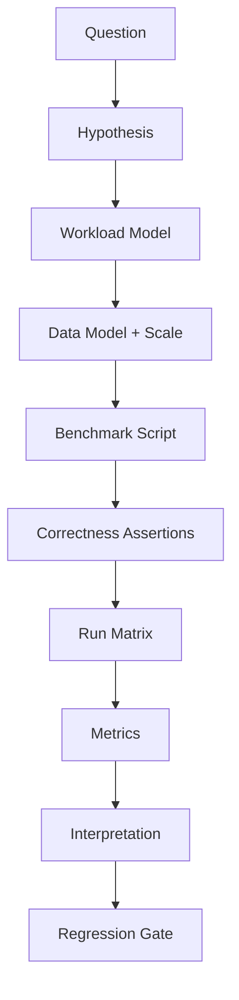
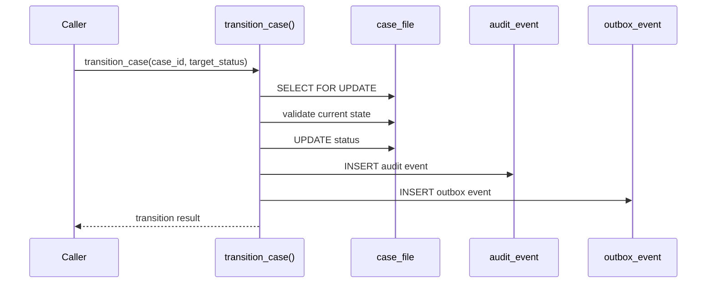

# Part 034 — Benchmarking PL/pgSQL: Micro, Macro, and Contention Tests

> Goal: learn how to benchmark PL/pgSQL routines without fooling yourself. We will design microbenchmarks, macrobenchmarks, contention tests, replay workloads, correctness checks, and regression thresholds using PostgreSQL-native tooling and production-grade assumptions.

A benchmark is a claim.

When someone says:

> This function handles 10,000 calls per second.

The real questions are:

- with how many clients?
- with what data volume?
- with what parameter distribution?
- with hot cache or cold cache?
- with triggers enabled?
- with audit/outbox enabled?
- with realistic constraints and indexes?
- with realistic lock contention?
- with what isolation level?
- on what hardware and PostgreSQL settings?
- with what correctness checks after the run?

Without those answers, the benchmark is mostly theater.

This part builds a benchmarking discipline for PL/pgSQL.

---

## 1. Benchmarking Mental Model

Benchmarking is not “run a loop and print time.”

It is controlled evidence about behavior under a declared workload.



A useful benchmark starts with a question:

| Bad Benchmark Question | Better Benchmark Question |
|---|---|
| Is this function fast? | How does `claim_next_job()` behave at 1, 8, 32, and 128 clients with 1M pending jobs? |
| Is dynamic SQL faster? | Does dynamic SQL reduce p95 latency for skewed tenants enough to justify planning overhead? |
| Can the trigger handle load? | What is the write amplification of audit trigger under 500 updates/sec? |
| Is this state transition scalable? | Does transition latency degrade when 20 workers target the same case group? |

Benchmarks must be anchored to product behavior.

---

## 2. Benchmark Types

| Benchmark Type | Target | Example | Risk If Missing |
|---|---|---|---|
| Microbenchmark | narrow routine/statement | static SQL vs dynamic SQL function | local optimization guesses |
| Macrobenchmark | end-to-end workflow | submit → validate → transition → audit → outbox | misses integration cost |
| Contention benchmark | concurrent conflict path | workers claim same queue | race and lock issues hidden |
| Data-scale benchmark | increasing table size | 100k, 10M, 100M rows | false confidence from tiny data |
| Skew benchmark | uneven distribution | tenant 1 has 80% rows | generic-plan traps hidden |
| Regression benchmark | compare versions | old vs new function | performance drift unnoticed |
| Failure benchmark | retries/errors | serialization failure path | retry storms hidden |

Do not run only microbenchmarks. PL/pgSQL often looks fine in isolation and fails when triggers, locks, audit, and data skew join the party.

---

## 3. Benchmark Invariants

Every benchmark should declare invariants.

Example for a queue claim function:

```md
## Invariants
- No job is claimed by more than one worker.
- Claimed jobs move from READY to CLAIMED exactly once.
- Failed claims do not modify job state.
- Total claimed count equals distinct worker claims.
- No transaction remains open after the benchmark.
```

Performance without correctness is irrelevant.

After every run, verify the data:

```sql
-- No duplicate claims.
SELECT job_id, count(*)
FROM bench.job_claim_log
GROUP BY job_id
HAVING count(*) > 1;

-- Status/count reconciliation.
SELECT status, count(*)
FROM bench.job
GROUP BY status
ORDER BY status;

-- Claimed jobs have a log.
SELECT count(*)
FROM bench.job j
WHERE j.status = 'CLAIMED'
  AND NOT EXISTS (
    SELECT 1
    FROM bench.job_claim_log l
    WHERE l.job_id = j.job_id
  );
```

A benchmark that does not validate invariants can reward broken code.

---

## 4. Use pgbench for Database-Native Load

`pgbench` is PostgreSQL's built-in benchmarking client. It can run repeated SQL command sequences across multiple concurrent sessions and report transaction rate.

Basic custom-script run:

```bash
pgbench \
  --client=16 \
  --jobs=4 \
  --time=120 \
  --progress=10 \
  --file=bench/claim_job.sql \
  appdb
```

Useful options:

| Option | Meaning |
|---|---|
| `--client` / `-c` | concurrent database sessions |
| `--jobs` / `-j` | worker threads in pgbench client |
| `--time` / `-T` | duration-based run |
| `--transactions` / `-t` | fixed transactions per client |
| `--progress` / `-P` | periodic progress output |
| `--file` / `-f` | custom transaction script |
| `--rate` / `-R` | target rate instead of maximum pressure |
| `--latency-limit` / `-L` | count transactions above latency limit |
| `--report-latencies` | report latency statistics |
| `--aggregate-interval` | aggregate logs by interval |

Maximum-throughput tests and rate-limited tests answer different questions.

- Maximum throughput asks: “Where does it saturate?”
- Rate-limited test asks: “Does it meet SLA at expected traffic?”

Production readiness needs both.

---

## 5. Benchmark Schema Design

Create dedicated benchmark schemas. Do not benchmark against ad-hoc tables with unknown history.

```sql
CREATE SCHEMA IF NOT EXISTS bench;

DROP TABLE IF EXISTS bench.job_claim_log;
DROP TABLE IF EXISTS bench.job;

CREATE TABLE bench.job (
  job_id bigint GENERATED ALWAYS AS IDENTITY PRIMARY KEY,
  tenant_id bigint NOT NULL,
  status text NOT NULL CHECK (status IN ('READY', 'CLAIMED', 'DONE', 'FAILED')),
  priority integer NOT NULL DEFAULT 0,
  available_at timestamptz NOT NULL DEFAULT clock_timestamp(),
  claimed_by text,
  claimed_at timestamptz,
  payload jsonb NOT NULL DEFAULT '{}'::jsonb
);

CREATE INDEX bench_job_ready_idx
ON bench.job (priority DESC, available_at, job_id)
WHERE status = 'READY';

CREATE TABLE bench.job_claim_log (
  claim_id bigint GENERATED ALWAYS AS IDENTITY PRIMARY KEY,
  job_id bigint NOT NULL REFERENCES bench.job(job_id),
  worker_id text NOT NULL,
  claimed_at timestamptz NOT NULL DEFAULT clock_timestamp(),
  UNIQUE (job_id)
);
```

Seed realistic data:

```sql
INSERT INTO bench.job (tenant_id, status, priority, available_at, payload)
SELECT
  CASE
    WHEN gs <= 800000 THEN 1
    WHEN gs <= 950000 THEN 2
    ELSE 3
  END AS tenant_id,
  'READY',
  (random() * 100)::integer,
  clock_timestamp() - ((random() * 86400)::integer || ' seconds')::interval,
  jsonb_build_object('source', 'benchmark', 'n', gs)
FROM generate_series(1, 1000000) AS gs;

ANALYZE bench.job;
```

This creates skew. Skew is not a bug in the benchmark; it is production realism.

---

## 6. Benchmark Routine: Queue Claim

A realistic PL/pgSQL claim function:

```sql
CREATE OR REPLACE FUNCTION bench.claim_next_job(p_worker_id text)
RETURNS bigint
LANGUAGE plpgsql
AS $$
DECLARE
  v_job_id bigint;
BEGIN
  SELECT j.job_id
  INTO v_job_id
  FROM bench.job j
  WHERE j.status = 'READY'
    AND j.available_at <= clock_timestamp()
  ORDER BY j.priority DESC, j.available_at, j.job_id
  FOR UPDATE SKIP LOCKED
  LIMIT 1;

  IF v_job_id IS NULL THEN
    RETURN NULL;
  END IF;

  UPDATE bench.job j
  SET status = 'CLAIMED',
      claimed_by = p_worker_id,
      claimed_at = clock_timestamp()
  WHERE j.job_id = v_job_id;

  INSERT INTO bench.job_claim_log (job_id, worker_id)
  VALUES (v_job_id, p_worker_id);

  RETURN v_job_id;
END;
$$;
```

This routine contains real benchmark concerns:

- selective partial index;
- row lock;
- `SKIP LOCKED`;
- update;
- log insert;
- unique correctness guard;
- concurrency behavior.

---

## 7. pgbench Script for Claim Function

`bench/claim_job.sql`:

```sql
\set worker_id random(1, 1000000)
SELECT bench.claim_next_job('worker-' || :worker_id);
```

Run matrix:

```bash
for c in 1 4 8 16 32 64; do
  pgbench \
    --client=$c \
    --jobs=4 \
    --time=120 \
    --progress=10 \
    --file=bench/claim_job.sql \
    appdb \
    > results/claim_job_c${c}.txt
 done
```

After each run, reset or reseed the dataset. Otherwise later runs benchmark a different workload.

Reset example:

```sql
TRUNCATE bench.job_claim_log;
UPDATE bench.job
SET status = 'READY',
    claimed_by = NULL,
    claimed_at = NULL;
VACUUM ANALYZE bench.job;
```

For large tables, full reset may be expensive. In that case, use isolated benchmark database snapshots, containerized instances, or partitioned benchmark runs.

---

## 8. Read the Results Correctly

A simple pgbench output may show transactions per second and latency. Do not stop there.

Capture database-side metrics around the run.

Before:

```sql
SELECT pg_stat_reset();
SELECT pg_stat_statements_reset();
```

After:

```sql
SELECT
  calls,
  total_exec_time,
  mean_exec_time,
  max_exec_time,
  rows,
  shared_blks_hit,
  shared_blks_read,
  temp_blks_written,
  wal_records,
  wal_bytes,
  left(query, 160) AS query_sample
FROM pg_stat_statements
ORDER BY total_exec_time DESC
LIMIT 20;
```

Function timing:

```sql
SELECT
  schemaname,
  funcname,
  calls,
  total_time,
  self_time,
  total_time / NULLIF(calls, 0) AS avg_total_ms,
  self_time / NULLIF(calls, 0) AS avg_self_ms
FROM pg_stat_user_functions
WHERE schemaname = 'bench'
ORDER BY total_time DESC;
```

Lock snapshot during run:

```sql
SELECT
  wait_event_type,
  wait_event,
  count(*)
FROM pg_stat_activity
WHERE datname = current_database()
GROUP BY wait_event_type, wait_event
ORDER BY count(*) DESC;
```

Interpret benchmark with at least four dimensions:

1. throughput;
2. latency distribution;
3. database resource profile;
4. correctness invariants.

---

## 9. Microbenchmark: Static SQL vs Dynamic SQL

Question:

> Does dynamic SQL improve parameter-sensitive lookup enough to justify replanning cost?

Schema:

```sql
CREATE TABLE bench.case_file (
  case_id bigint GENERATED ALWAYS AS IDENTITY PRIMARY KEY,
  tenant_id bigint NOT NULL,
  status text NOT NULL,
  created_at timestamptz NOT NULL DEFAULT clock_timestamp()
);

CREATE INDEX bench_case_file_tenant_status_idx
ON bench.case_file (tenant_id, status, created_at DESC);
```

Skewed data:

```sql
INSERT INTO bench.case_file (tenant_id, status, created_at)
SELECT
  CASE WHEN gs <= 900000 THEN 1 ELSE gs END,
  CASE WHEN random() < 0.9 THEN 'OPEN' ELSE 'CLOSED' END,
  clock_timestamp() - ((random() * 31536000)::bigint || ' seconds')::interval
FROM generate_series(1, 1000000) gs;

ANALYZE bench.case_file;
```

Static function:

```sql
CREATE OR REPLACE FUNCTION bench.count_open_cases_static(p_tenant_id bigint)
RETURNS bigint
LANGUAGE plpgsql
AS $$
DECLARE
  v_count bigint;
BEGIN
  SELECT count(*)
  INTO v_count
  FROM bench.case_file c
  WHERE c.tenant_id = p_tenant_id
    AND c.status = 'OPEN';

  RETURN v_count;
END;
$$;
```

Dynamic function:

```sql
CREATE OR REPLACE FUNCTION bench.count_open_cases_dynamic(p_tenant_id bigint)
RETURNS bigint
LANGUAGE plpgsql
AS $$
DECLARE
  v_count bigint;
BEGIN
  EXECUTE
    'SELECT count(*) FROM bench.case_file c WHERE c.tenant_id = $1 AND c.status = $2'
  INTO v_count
  USING p_tenant_id, 'OPEN';

  RETURN v_count;
END;
$$;
```

pgbench script for skew:

```sql
\set tenant random(1, 1000000)
SELECT bench.count_open_cases_static(
  CASE WHEN :tenant <= 900000 THEN 1 ELSE :tenant END
);
```

Run both versions under the same data, same clients, same duration, same warmup. Compare:

- mean latency;
- p95/p99 if captured;
- planning time if tracked;
- total execution time;
- plan shape for tenant 1 vs rare tenant;
- correctness count.

Do not choose a winner from one client and one dataset.

---

## 10. Macrobenchmark: Workflow Path

Microbenchmarks are good for isolated hypotheses. Macrobenchmarks test real workflow cost.

Example case transition path:



Benchmark script:

```sql
\set case_id random(1, 1000000)
SELECT app.transition_case(:case_id, 'ESCALATED', 'benchmark');
```

But this is not enough. If cases can be transitioned only once, random ids will increasingly hit invalid states. That changes benchmark meaning.

Better script pattern:

```sql
WITH candidate AS (
  SELECT case_id
  FROM app.case_file
  WHERE status = 'OPEN'
  ORDER BY random()
  LIMIT 1
)
SELECT app.transition_case(candidate.case_id, 'ESCALATED', 'benchmark')
FROM candidate;
```

This is realistic but expensive because of `ORDER BY random()`. For benchmark generation, pre-create a candidate table:

```sql
CREATE TABLE bench.transition_candidate AS
SELECT case_id, row_number() OVER () AS rn
FROM app.case_file
WHERE status = 'OPEN';

CREATE UNIQUE INDEX ON bench.transition_candidate (rn);
ANALYZE bench.transition_candidate;
```

pgbench:

```sql
\set rn random(1, 1000000)
SELECT app.transition_case(c.case_id, 'ESCALATED', 'benchmark')
FROM bench.transition_candidate c
WHERE c.rn = :rn;
```

Then verify:

```sql
SELECT status, count(*)
FROM app.case_file
GROUP BY status;

SELECT count(*) FROM app.audit_event WHERE reason_code = 'benchmark';
SELECT count(*) FROM app.outbox_event WHERE aggregate_type = 'case_file';
```

Macrobenchmarks must include side effects.

---

## 11. Contention Benchmark

Contention tests ask:

> What happens when multiple sessions want the same logical resource?

Example: same case group has a serial invariant.

```sql
CREATE TABLE bench.case_group_counter (
  group_id bigint PRIMARY KEY,
  open_count bigint NOT NULL
);

CREATE TABLE bench.case_item (
  case_id bigint GENERATED ALWAYS AS IDENTITY PRIMARY KEY,
  group_id bigint NOT NULL,
  status text NOT NULL
);
```

Function:

```sql
CREATE OR REPLACE FUNCTION bench.close_case_with_counter(p_case_id bigint)
RETURNS void
LANGUAGE plpgsql
AS $$
DECLARE
  v_group_id bigint;
BEGIN
  SELECT group_id
  INTO STRICT v_group_id
  FROM bench.case_item
  WHERE case_id = p_case_id
  FOR UPDATE;

  UPDATE bench.case_item
  SET status = 'CLOSED'
  WHERE case_id = p_case_id
    AND status = 'OPEN';

  IF FOUND THEN
    UPDATE bench.case_group_counter
    SET open_count = open_count - 1
    WHERE group_id = v_group_id;
  END IF;
END;
$$;
```

Contention script intentionally targets a small group set:

```sql
\set case_id random(1, 10000)
SELECT bench.close_case_with_counter(:case_id);
```

Measure:

- throughput collapse as clients increase;
- lock waits;
- deadlocks;
- invariant errors;
- p99 latency;
- counter correctness.

Correctness assertion:

```sql
SELECT g.group_id, g.open_count, actual.actual_open_count
FROM bench.case_group_counter g
JOIN (
  SELECT group_id, count(*) AS actual_open_count
  FROM bench.case_item
  WHERE status = 'OPEN'
  GROUP BY group_id
) actual USING (group_id)
WHERE g.open_count <> actual.actual_open_count;
```

If the benchmark finds counter drift, the function is incorrect regardless of TPS.

---

## 12. Warmup, Cache, and Repeatability

Benchmarks are sensitive to cache state.

| Run Type | Meaning |
|---|---|
| Cold-ish run | data not mostly in shared buffers / OS cache |
| Warm run | repeated workload benefits from cache |
| Steady-state run | system has reached stable throughput/latency |
| Saturation run | clients exceed capacity and queueing dominates |

For application SLOs, steady-state under expected traffic is often more useful than maximum TPS.

Recommendations:

- run warmup separately;
- discard first interval;
- repeat runs;
- report variance;
- keep data volume constant;
- isolate benchmark machine;
- record PostgreSQL settings;
- record schema/index version;
- record git commit/migration version;
- record hardware/container resource limits.

Example run record:

```md
## Benchmark Run
- Date: 2026-07-03
- PostgreSQL: 18.x
- Dataset: 10M case_file rows, 100M audit rows
- Script: bench/transition_case.sql
- Clients: 1, 8, 32, 64
- Duration: 180s + 30s warmup
- Hardware: 8 vCPU, 32GB RAM, NVMe
- Config changes: shared_buffers=8GB, work_mem=64MB
- App version: git sha ...
- Migration version: ...
```

Without a run record, benchmark results are hard to reproduce and easy to misuse.

---

## 13. Rate-Limited Benchmarking

Maximum pressure can hide SLA behavior.

Rate-limited test:

```bash
pgbench \
  --client=32 \
  --jobs=8 \
  --time=300 \
  --rate=500 \
  --latency-limit=200 \
  --file=bench/transition_case.sql \
  appdb
```

This asks:

> At 500 transactions/sec, how many calls exceed 200ms?

That is closer to production SLO than “what is the maximum TPS?”

Use rate-limited tests for:

- expected traffic;
- Black Friday / peak model;
- batch windows;
- migration cutover load;
- retry storm simulation.

---

## 14. Benchmarking Failure Paths

Many systems benchmark only success. Production often suffers in failure paths.

Failure path examples:

- duplicate idempotency key;
- invalid state transition;
- serialization failure retry;
- lock timeout;
- permission denied;
- missing referenced entity;
- audit insert conflict;
- outbox unavailable due to constraint problem.

Example invalid transition script:

```sql
\set case_id random(1, 1000000)
SELECT app.transition_case(:case_id, 'IMPOSSIBLE_STATUS', 'benchmark_failure');
```

If this throws and aborts every transaction, pgbench will report failures. That may be desired. But for controlled failure-path latency, wrap with a function that catches expected domain SQLSTATE and records result.

```sql
CREATE OR REPLACE FUNCTION bench.try_invalid_transition(p_case_id bigint)
RETURNS text
LANGUAGE plpgsql
AS $$
BEGIN
  PERFORM app.transition_case(p_case_id, 'IMPOSSIBLE_STATUS', 'benchmark_failure');
  RETURN 'unexpected_success';
EXCEPTION
  WHEN SQLSTATE 'P2401' THEN
    RETURN 'expected_domain_failure';
END;
$$;
```

Then benchmark:

```sql
\set case_id random(1, 1000000)
SELECT bench.try_invalid_transition(:case_id);
```

Failure handling can be more expensive than success if it writes logs, captures diagnostics, or performs compensating work.

---

## 15. Benchmarking Retry Behavior

Retry logic can amplify load.

Suppose a caller retries serialization failures. Benchmark the total attempt cost, not just successful calls.

Database helper:

```sql
CREATE TABLE bench.retry_observation (
  observation_id bigint GENERATED ALWAYS AS IDENTITY PRIMARY KEY,
  worker_id text NOT NULL,
  attempt_no integer NOT NULL,
  sqlstate text,
  success boolean NOT NULL,
  observed_at timestamptz NOT NULL DEFAULT clock_timestamp()
);
```

Application-level retries are better tested from the application harness, because PL/pgSQL functions normally run inside a transaction controlled by the caller. Still, database-side observations can show retry storms.

Metrics:

- attempts per successful transition;
- SQLSTATE distribution;
- latency including retries;
- lock wait during retries;
- duplicate side effects;
- idempotency correctness.

A workflow is not production-ready until retry behavior is measured.

---

## 16. Benchmarking Triggers

Trigger cost is often invisible in naive benchmarks.

Create variants:

| Variant | Purpose |
|---|---|
| trigger disabled in isolated test | lower-bound mutation cost |
| audit only | audit overhead |
| audit + outbox | full side-effect overhead |
| full production triggers | realistic path |

Do not disable triggers in production. For benchmark isolation, use dedicated schemas or databases.

Measure statement with trigger effects:

```sql
BEGIN;
EXPLAIN (ANALYZE, BUFFERS, WAL)
UPDATE app.case_file
SET status = 'ESCALATED'
WHERE status = 'OPEN'
  AND tenant_id = 42
LIMIT 0; -- invalid syntax: use controlled predicate instead
ROLLBACK;
```

PostgreSQL does not support `UPDATE ... LIMIT` directly. Use a CTE:

```sql
BEGIN;
WITH candidate AS (
  SELECT case_id
  FROM app.case_file
  WHERE status = 'OPEN'
    AND tenant_id = 42
  ORDER BY case_id
  LIMIT 1000
)
EXPLAIN (ANALYZE, BUFFERS, WAL)
UPDATE app.case_file c
SET status = 'ESCALATED'
FROM candidate x
WHERE x.case_id = c.case_id;
ROLLBACK;
```

This tests bounded trigger cost.

---

## 17. Benchmarking Large Result Functions

Set-returning PL/pgSQL functions can produce misleading benchmarks. They may materialize results and hide memory or temp-file behavior.

Benchmark questions:

- How many rows are returned?
- Does the caller fetch all rows?
- Is ordering required?
- Does the function use `RETURN NEXT` loop or `RETURN QUERY`?
- Are temp files created?
- Does latency measure first row or full result?

Example bad benchmark:

```sql
SELECT count(*) FROM app.get_large_report(42);
```

This measures full consumption, not client streaming behavior.

Better variants:

```sql
-- Full result cost.
SELECT count(*) FROM app.get_large_report(42);

-- Page-like access.
SELECT * FROM app.get_large_report_page(42, 1000, NULL);

-- Query plan for underlying statement.
EXPLAIN (ANALYZE, BUFFERS)
SELECT ... underlying report query ...;
```

For large result APIs, benchmark pagination/keyset design separately.

---

## 18. Regression Thresholds

A benchmark becomes useful when it becomes a gate.

Example threshold file:

```yaml
routine: app.transition_case
workload: bench/transition_case.sql
dataset: case-management-10m-v3
thresholds:
  mean_latency_ms_max: 25
  p95_latency_ms_max: 80
  p99_latency_ms_max: 200
  tps_min: 500
  error_rate_max: 0.001
  duplicate_side_effects_max: 0
  wal_bytes_per_tx_max: 5000
  lock_wait_ratio_max: 0.02
```

Use thresholds carefully:

- too strict causes noisy CI;
- too loose catches nothing;
- hardware-dependent thresholds must run on stable benchmark infrastructure;
- logic thresholds are more stable than raw TPS.

Good gate:

> No duplicate claims. p95 latency must not regress by more than 20% against baseline on benchmark runner.

Bad gate:

> Must always be faster than 10ms everywhere.

---

## 19. Benchmark Result Table

Store benchmark results as data.

```sql
CREATE TABLE bench.benchmark_run (
  run_id uuid PRIMARY KEY,
  benchmark_name text NOT NULL,
  git_sha text,
  migration_version text,
  postgres_version text NOT NULL DEFAULT version(),
  dataset_name text NOT NULL,
  clients integer NOT NULL,
  duration_seconds integer NOT NULL,
  started_at timestamptz NOT NULL DEFAULT clock_timestamp(),
  notes text
);

CREATE TABLE bench.benchmark_metric (
  run_id uuid NOT NULL REFERENCES bench.benchmark_run(run_id),
  metric_name text NOT NULL,
  metric_value numeric NOT NULL,
  unit text NOT NULL,
  PRIMARY KEY (run_id, metric_name)
);
```

This enables trend analysis:

```sql
SELECT
  r.started_at,
  r.git_sha,
  r.clients,
  m.metric_value AS p95_latency_ms
FROM bench.benchmark_run r
JOIN bench.benchmark_metric m USING (run_id)
WHERE r.benchmark_name = 'transition_case'
  AND m.metric_name = 'p95_latency_ms'
ORDER BY r.started_at;
```

Performance work becomes engineering when history is queryable.

---

## 20. Benchmark Anti-Patterns

| Anti-Pattern | Why It Misleads |
|---|---|
| tiny dataset | hides indexes, cache, partition, and stats issues |
| one client only | hides lock/contention behavior |
| max TPS only | ignores SLA and tail latency |
| no correctness check | rewards broken code |
| no warmup policy | mixes startup effects with steady-state |
| random data only | hides skew and hot keys |
| benchmark on developer laptop only | poor production prediction |
| disabled triggers | hides real workflow cost |
| no version record | impossible to reproduce |
| averages only | hides p95/p99 pain |
| comparing different datasets | invalid conclusion |
| no reset between runs | workload changes over time |

A bad benchmark is worse than no benchmark because it creates confidence in the wrong thing.

---

## 21. Practical Benchmark Playbook

For any important PL/pgSQL routine:

1. Define the product question.
2. Define invariants.
3. Create realistic data volume.
4. Include skew and hot keys.
5. Benchmark success path.
6. Benchmark failure path.
7. Benchmark concurrency path.
8. Capture `pg_stat_statements`.
9. Capture function stats.
10. Capture lock/wait snapshots.
11. Verify correctness after the run.
12. Repeat across a client matrix.
13. Store results.
14. Add regression threshold.
15. Document interpretation.

---

## 22. Example Final Benchmark Report

```md
# Benchmark Report: app.transition_case

## Question
Can `app.transition_case()` sustain expected peak traffic of 500 transitions/sec with p95 < 80ms and no duplicate audit/outbox side effects?

## Workload
- Dataset: 10M cases, 50M audit rows, 10M outbox rows
- Distribution: tenant 1 owns 70% of open cases
- Clients: 1, 8, 16, 32, 64
- Duration: 5 minutes each, 30s warmup discarded
- Script: bench/transition_case.sql

## Correctness Invariants
- no invalid state transition accepted
- every successful transition has exactly one audit event
- every successful transition has exactly one outbox event
- no case has duplicate transition for same command id

## Results
| Clients | TPS | p95 ms | p99 ms | Error % | Notes |
|---:|---:|---:|---:|---:|---|
| 1 | ... | ... | ... | ... | baseline |
| 8 | ... | ... | ... | ... | stable |
| 16 | ... | ... | ... | ... | stable |
| 32 | ... | ... | ... | ... | lock wait begins |
| 64 | ... | ... | ... | ... | saturation |

## Diagnosis
Saturation begins around 32 clients due to row lock contention on hot tenant transition sequence.

## Decision
Accept for expected load with rate limit. For batch escalation, use partitioned worker by tenant group.
```

This is the level of evidence expected in serious engineering organizations.

---

## 23. What Top Engineers Do Differently

They do not benchmark to win an argument. They benchmark to reduce uncertainty.

A top-tier PL/pgSQL benchmark is:

- explicit about workload;
- honest about data distribution;
- concurrent enough to expose locks;
- strict about correctness;
- repeatable;
- connected to SLOs;
- tracked over time;
- interpreted with database evidence, not just client-side TPS.

The goal is not a pretty number.

The goal is this sentence:

> Under this workload, with this data shape, this routine preserves these invariants and meets these latency/throughput bounds until this saturation point.

That sentence is engineering.

---

## References

- PostgreSQL Documentation — pgbench: https://www.postgresql.org/docs/current/pgbench.html
- PostgreSQL Documentation — pg_stat_statements: https://www.postgresql.org/docs/current/pgstatstatements.html
- PostgreSQL Documentation — Cumulative Statistics System: https://www.postgresql.org/docs/current/monitoring-stats.html
- PostgreSQL Documentation — Explicit Locking: https://www.postgresql.org/docs/current/explicit-locking.html
- PostgreSQL Documentation — Transaction Isolation: https://www.postgresql.org/docs/current/transaction-iso.html
- PostgreSQL Documentation — EXPLAIN: https://www.postgresql.org/docs/current/sql-explain.html
- PostgreSQL Documentation — Runtime Statistics Configuration: https://www.postgresql.org/docs/current/runtime-config-statistics.html
