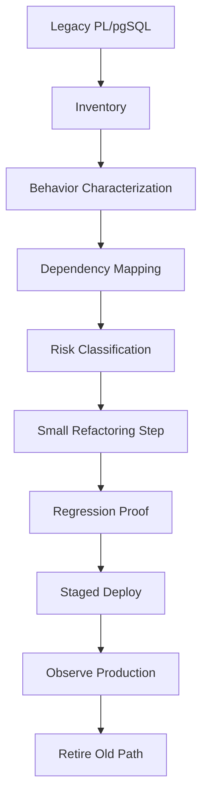
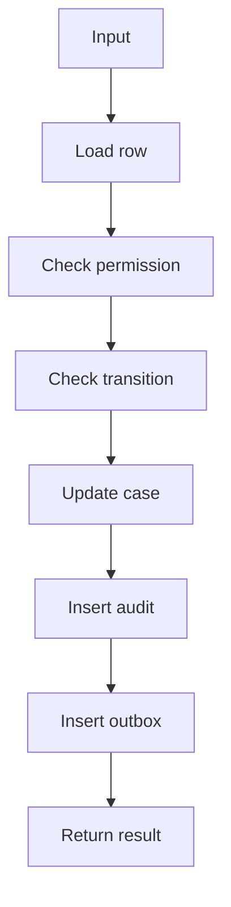
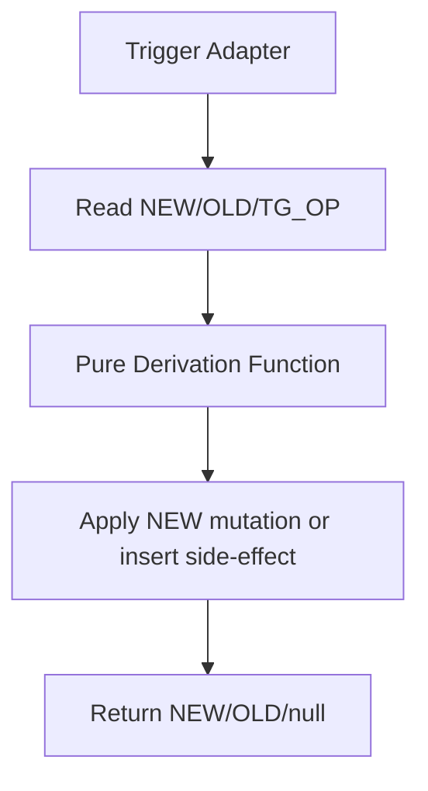
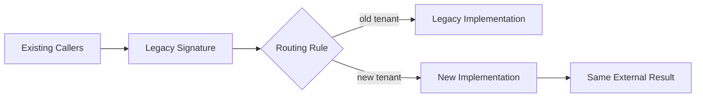

# Part 035 — Refactoring Legacy PL/pgSQL and Reducing Database Code Risk

> Goal: learn how to refactor legacy PL/pgSQL without turning the database into an uncontrolled experiment. The target is not cosmetic cleanup. The target is behavior preservation, operational risk reduction, clearer boundaries, safer deployment, and better evidence.

Legacy PL/pgSQL is usually dangerous for one reason: it is not only code.

It is code plus:

- privileges,
- triggers,
- data invariants,
- hidden callers,
- overloaded signatures,
- migration history,
- cached assumptions in application code,
- operational habits,
- and years of production data edge cases.

A Java service method can often be refactored behind a test suite and deployed behind a feature flag. A PL/pgSQL function might be called by applications, triggers, reports, ad-hoc scripts, background jobs, views, generated columns, RLS policies, and other functions. Some dependencies are visible in PostgreSQL catalogs. Some are only visible in text bodies, application code, or production logs.

So the central rule is simple:

> Refactor legacy PL/pgSQL by first making behavior observable and bounded. Only then make structure better.

---

## 1. Refactoring Mental Model

Refactoring database-side code is not merely changing source code.

It is changing behavior located near the system of record.



The loop is intentionally conservative.

The moment you skip inventory or characterization, you are not refactoring. You are rewriting.

And rewriting legacy database code without a behavior harness is usually gambling.

---

## 2. What Makes Legacy PL/pgSQL Risky?

Legacy PL/pgSQL is not risky because it is old. It is risky because its execution boundary is often unclear.

| Risk | Typical Symptom | Production Consequence |
|---|---|---|
| Hidden callers | Function used by trigger, app, report, job | Seemingly safe change breaks unexpected flow |
| Signature coupling | Same name overloaded by input type | Caller resolves to a different routine than expected |
| Return-shape coupling | `RETURNS TABLE` used by report or ORM | Column change breaks downstream consumers |
| Security coupling | `SECURITY DEFINER` with broad owner | Refactor changes privilege boundary |
| Search path coupling | Unqualified table/function references | Wrong object used after schema/path change |
| Error contract coupling | Apps depend on SQLSTATE/message pattern | Refactor breaks retry/user-facing behavior |
| Trigger coupling | Row mutation invokes unknown chain | Refactor changes write amplification or recursion |
| Transaction coupling | Procedure commits or raises in specific place | Rollback/partial progress behavior changes |
| Data-shape coupling | Function depends on historical bad data | Clean test data misses production edge cases |
| Performance coupling | Function accidentally relies on generic/custom plan behavior | Refactor regresses p95/p99 latency |

The worst legacy code is not ugly.

The worst legacy code is ambiguous.

---

## 3. Refactoring vs Rewriting

Use the right word.

| Work Type | Meaning | Risk Level |
|---|---|---|
| Formatting | Whitespace, comments, no semantic change | Low |
| Mechanical refactor | Rename local variables, extract local block, same contract | Low to medium |
| Behavioral refactor | Same external contract, improved internal behavior | Medium |
| Contract refactor | Signature, return type, SQLSTATE, security, volatility changes | High |
| Rewrite | New implementation with same rough intent | Very high |
| Replacement | New API with old API deprecated | High but controllable |

For PL/pgSQL, a contract includes more than the function signature.

It includes:

- input argument types,
- output shape,
- null behavior,
- volatility marking,
- strictness,
- parallel marking,
- cost/rows estimate,
- `SECURITY DEFINER` vs invoker,
- `search_path` setting,
- SQLSTATE behavior,
- row-count behavior,
- locking behavior,
- trigger side effects,
- transaction behavior,
- timing of audit/outbox writes,
- and privilege assumptions.

A function body can be equivalent by eye and still be a contract break.

---

## 4. First Artifact: Routine Inventory

Before changing anything, build an inventory.

The inventory answers:

- what routines exist?
- who owns them?
- are they functions or procedures?
- are they PL/pgSQL?
- are they `SECURITY DEFINER`?
- what volatility are they marked with?
- what is their signature?
- what do they return?
- what configuration do they set?
- who can execute them?

```sql
select
  n.nspname as schema_name,
  p.proname as routine_name,
  case p.prokind
    when 'f' then 'function'
    when 'p' then 'procedure'
    when 'a' then 'aggregate'
    when 'w' then 'window'
  end as routine_kind,
  pg_get_function_identity_arguments(p.oid) as identity_args,
  pg_get_function_result(p.oid) as result_type,
  l.lanname as language,
  r.rolname as owner_name,
  p.prosecdef as security_definer,
  p.provolatile as volatility,
  p.proisstrict as strict,
  p.proparallel as parallel_safety,
  p.procost,
  p.prorows,
  p.proconfig
from pg_proc p
join pg_namespace n on n.oid = p.pronamespace
join pg_language l on l.oid = p.prolang
join pg_roles r on r.oid = p.proowner
where n.nspname not in ('pg_catalog', 'information_schema')
order by n.nspname, p.proname, pg_get_function_identity_arguments(p.oid);
```

This query is not just documentation.

It is a refactoring input.

A function marked `SECURITY DEFINER` goes into a different risk bucket than a plain helper. A volatile function used in a report has a different blast radius than a private mutation function. A procedure with transaction control must not be refactored like a pure function.

---

## 5. Second Artifact: Source Snapshot

Create a source snapshot before changing code.

```sql
create schema if not exists refactor_audit;

create table if not exists refactor_audit.routine_source_snapshot (
  snapshot_id bigserial primary key,
  captured_at timestamptz not null default clock_timestamp(),
  environment text not null default current_setting('server_version'),
  routine_oid oid not null,
  schema_name text not null,
  routine_name text not null,
  identity_args text not null,
  result_type text,
  source_hash text not null,
  source_sql text not null
);

insert into refactor_audit.routine_source_snapshot (
  routine_oid,
  schema_name,
  routine_name,
  identity_args,
  result_type,
  source_hash,
  source_sql
)
select
  p.oid,
  n.nspname,
  p.proname,
  pg_get_function_identity_arguments(p.oid),
  pg_get_function_result(p.oid),
  md5(pg_get_functiondef(p.oid)),
  pg_get_functiondef(p.oid)
from pg_proc p
join pg_namespace n on n.oid = p.pronamespace
join pg_language l on l.oid = p.prolang
where l.lanname = 'plpgsql'
  and n.nspname not in ('pg_catalog', 'information_schema');
```

Why store this in the database?

Because many production incidents start with a question nobody can answer:

> What exactly changed?

Source control helps. But database state is the runtime truth. A database snapshot gives you an independent witness.

---

## 6. Third Artifact: Dependency Map

PostgreSQL tracks dependencies between many database objects. You should use that information, but you must also understand its limits.

A useful dependency query:

```sql
with target as (
  select p.oid
  from pg_proc p
  join pg_namespace n on n.oid = p.pronamespace
  where n.nspname = 'app'
    and p.proname = 'submit_case'
    and pg_get_function_identity_arguments(p.oid) = 'p_case_id bigint, p_actor_id bigint'
)
select
  pg_describe_object(d.classid, d.objid, d.objsubid) as dependent_object,
  pg_describe_object(d.refclassid, d.refobjid, d.refobjsubid) as referenced_object,
  d.deptype
from pg_depend d
join target t on t.oid = d.refobjid
order by dependent_object;
```

But do not overtrust it.

PostgreSQL can track dependencies based on externally visible properties such as argument and result types. It cannot fully understand every dependency hidden inside a PL/pgSQL function body stored as text.

Example:

```sql
create or replace function app.count_open_cases()
returns bigint
language plpgsql
as $$
declare
  v_count bigint;
begin
  select count(*)
  into v_count
  from app.case_file
  where status = 'OPEN';

  return v_count;
end;
$$;
```

The function body references `app.case_file`, but catalog dependency tracking for PL/pgSQL text bodies is not a complete static-analysis engine.

So dependency mapping must combine:

- catalog dependency queries,
- source grep over `pg_get_functiondef`,
- application code search,
- query logs,
- report definitions,
- migration files,
- and operational knowledge.

---

## 7. Classify the Routine Before Refactoring

Every routine should receive a risk classification.

| Class | Description | Refactoring Strategy |
|---|---|---|
| Pure helper | No writes, no dynamic SQL, no privileges | Mechanical refactor usually safe with tests |
| Query API | Used by app/report to return data | Preserve result shape carefully |
| Command boundary | Mutates domain state | Add characterization tests before change |
| Trigger function | Runs implicitly on DML | Test with full table mutation paths |
| Security function | Uses `SECURITY DEFINER` or grants | Security review required before code change |
| Dynamic SQL routine | Builds statements at runtime | Add allow-list and injection tests first |
| Procedure | May control transaction boundary | Test partial-progress semantics |
| Migration helper | Used during deployment/backfill | Make idempotency explicit |
| Legacy unknown | No owner, no test, unknown callers | Freeze, instrument, observe before refactor |

Do not start with the ugliest function.

Start with the function that has high value and bounded risk.

---

## 8. Behavior Characterization Before Cleanup

A characterization test captures what the legacy function currently does, including weird behavior.

You do not have to like the behavior. You need to know it.

Example target:

```sql
create or replace function app.normalize_reference(p_reference text)
returns text
language plpgsql
as $$
declare
  v_reference text;
begin
  v_reference := upper(trim(p_reference));
  v_reference := replace(v_reference, ' ', '-');
  return v_reference;
end;
$$;
```

Characterization table:

```sql
create table test_case.normalize_reference_cases (
  input_reference text,
  expected_reference text,
  note text
);

insert into test_case.normalize_reference_cases values
  (' abc 123 ', 'ABC-123', 'normal trimming'),
  ('abc   123', 'ABC---123', 'legacy preserves repeated spaces as repeated dashes'),
  (null, null, 'legacy null behavior');
```

Regression query:

```sql
select
  input_reference,
  expected_reference,
  app.normalize_reference(input_reference) as actual_reference,
  app.normalize_reference(input_reference) is not distinct from expected_reference as passed,
  note
from test_case.normalize_reference_cases;
```

The second test looks ugly. That is the point.

A refactor that “fixes” repeated spaces may break downstream matching. Separate refactoring from behavior change.

---

## 9. Preserve the External Contract First

Before changing body structure, write down the external contract.

```txt
Routine: app.transition_case(bigint, text, bigint, text)
Kind: function
Security: SECURITY DEFINER
Search path: app, pg_temp
Volatility: VOLATILE
Null behavior: called on null input
Return: app.case_transition_result
Errors:
  P3001 invalid transition
  P3002 stale expected state
  P3003 permission denied
Writes:
  app.case_file
  app.case_event
  app.outbox_message
Locks:
  row lock on app.case_file
Audit:
  one case_event per accepted transition
Idempotency:
  no idempotency key in legacy version
Known callers:
  case-service
  escalation-worker
  manual-admin-console
  trigger none
```

This is boring documentation until the first incident.

Then it becomes the map.

---

## 10. Refactoring Technique: Rename for Name Resolution Safety

Legacy PL/pgSQL often has ambiguous names:

```sql
create or replace function app.assign_case(case_id bigint, owner_id bigint)
returns void
language plpgsql
as $$
begin
  update app.case_file
  set owner_id = owner_id
  where case_id = case_id;
end;
$$;
```

This function is terrifying because it visually says something plausible while resolving names in a way that may not match intent.

Refactor local and parameter names first:

```sql
create or replace function app.assign_case(
  p_case_id bigint,
  p_owner_id bigint
)
returns void
language plpgsql
as $$
begin
  update app.case_file cf
  set owner_id = p_owner_id
  where cf.case_id = p_case_id;
end;
$$;
```

This kind of refactor is small but high-value.

Checklist:

- parameters prefixed with `p_`,
- local variables prefixed with `v_`,
- records prefixed with `r_`,
- table aliases always used,
- target table columns qualified where allowed,
- no unqualified column reference in multi-table statements,
- no variable name identical to column name.

---

## 11. Refactoring Technique: Replace Implicit Outcome with Explicit Outcome

Legacy function:

```sql
create or replace function app.close_case(p_case_id bigint)
returns boolean
language plpgsql
as $$
begin
  update app.case_file
  set status = 'CLOSED'
  where case_id = p_case_id
    and status = 'OPEN';

  return found;
end;
$$;
```

This is compact, but `FOUND` is easy to misuse after adding one extra statement.

Safer refactor:

```sql
create or replace function app.close_case(p_case_id bigint)
returns boolean
language plpgsql
as $$
declare
  v_rows_updated integer;
begin
  update app.case_file cf
  set status = 'CLOSED'
  where cf.case_id = p_case_id
    and cf.status = 'OPEN';

  get diagnostics v_rows_updated = row_count;

  return v_rows_updated = 1;
end;
$$;
```

Why this is safer:

- the outcome is named,
- it survives future statements,
- it can be logged,
- it can be asserted,
- it can be converted into a structured result later.

---

## 12. Refactoring Technique: Split Decision from Mutation

Legacy command functions often mix read logic, policy logic, mutation, audit, and notification.



Do not immediately split everything into many functions. First identify pure decision logic.

Example policy function:

```sql
create type app.case_transition_decision as (
  allowed boolean,
  denial_code text,
  denial_message text
);

create or replace function app.evaluate_case_transition(
  p_current_status text,
  p_requested_status text,
  p_actor_role text
)
returns app.case_transition_decision
language plpgsql
stable
as $$
begin
  if p_current_status = p_requested_status then
    return (true, null, null)::app.case_transition_decision;
  end if;

  if p_current_status = 'CLOSED' then
    return (false, 'CASE_ALREADY_CLOSED', 'Closed case cannot transition')::app.case_transition_decision;
  end if;

  if p_requested_status = 'APPROVED' and p_actor_role <> 'SUPERVISOR' then
    return (false, 'SUPERVISOR_REQUIRED', 'Only supervisor can approve')::app.case_transition_decision;
  end if;

  return (true, null, null)::app.case_transition_decision;
end;
$$;
```

Then the command function can call the policy function.

This allows policy testing without creating rows, locks, audit records, or outbox messages.

---

## 13. Refactoring Technique: Replace Boolean Return with Outcome Record

Legacy boolean returns hide why a mutation failed.

```sql
returns boolean
```

This forces callers to guess:

- not found?
- already closed?
- permission denied?
- stale state?
- validation failed?

A safer internal refactor is to introduce a result type while preserving the old API temporarily.

```sql
create type app.close_case_result as (
  accepted boolean,
  case_id bigint,
  previous_status text,
  current_status text,
  failure_code text,
  failure_message text
);
```

New implementation:

```sql
create or replace function app.close_case_v2(p_case_id bigint)
returns app.close_case_result
language plpgsql
as $$
declare
  r_case app.case_file%rowtype;
begin
  select *
  into r_case
  from app.case_file cf
  where cf.case_id = p_case_id
  for update;

  if not found then
    return (false, p_case_id, null, null, 'NOT_FOUND', 'Case does not exist')::app.close_case_result;
  end if;

  if r_case.status = 'CLOSED' then
    return (false, p_case_id, r_case.status, r_case.status, 'ALREADY_CLOSED', 'Case is already closed')::app.close_case_result;
  end if;

  update app.case_file cf
  set status = 'CLOSED'
  where cf.case_id = p_case_id;

  return (true, p_case_id, r_case.status, 'CLOSED', null, null)::app.close_case_result;
end;
$$;
```

Compatibility wrapper:

```sql
create or replace function app.close_case(p_case_id bigint)
returns boolean
language plpgsql
as $$
declare
  r_result app.close_case_result;
begin
  r_result := app.close_case_v2(p_case_id);
  return r_result.accepted;
end;
$$;
```

This is often better than mutating the old contract in place.

---

## 14. Refactoring Technique: Tame Exception Blocks

Legacy PL/pgSQL often contains broad exception handling:

```sql
exception
  when others then
    return false;
```

This is dangerous because it converts unknown failures into normal outcomes.

It can hide:

- constraint violations,
- serialization failures,
- deadlocks,
- permission errors,
- missing table errors,
- search path bugs,
- data corruption,
- and deployment defects.

A safer pattern is explicit classification:

```sql
exception
  when unique_violation then
    raise exception using
      errcode = 'P2301',
      message = 'Duplicate external reference',
      detail = format('external_reference=%s', p_external_reference),
      hint = 'Use idempotency key or load existing case';

  when serialization_failure or deadlock_detected then
    raise;

  when others then
    raise exception using
      errcode = 'P9999',
      message = 'Unexpected failure while submitting case',
      detail = sqlerrm;
end;
```

General principle:

> Catch errors to translate them, compensate them, or add context. Do not catch errors merely to suppress them.

---

## 15. Refactoring Technique: Pull Dynamic SQL Behind a Narrow Builder

Legacy dynamic SQL often appears as string concatenation:

```sql
v_sql := 'select count(*) from ' || p_table_name || ' where status = ''' || p_status || '''';
execute v_sql into v_count;
```

Refactor into identifier allow-list plus value parameters:

```sql
create or replace function admin.count_rows_by_status(
  p_table regclass,
  p_status text
)
returns bigint
language plpgsql
security definer
set search_path = admin, pg_temp
as $$
declare
  v_count bigint;
  v_allowed boolean;
begin
  select exists (
    select 1
    from admin.allowed_status_table ast
    where ast.table_oid = p_table
  )
  into v_allowed;

  if not v_allowed then
    raise exception using
      errcode = 'P5001',
      message = 'Table is not allow-listed for status counting';
  end if;

  execute format(
    'select count(*) from %s where status = $1',
    p_table
  )
  into v_count
  using p_status;

  return v_count;
end;
$$;
```

The important move is not only `format()`.

The important move is separating:

- object identity,
- value parameters,
- permission to use object,
- and execution.

---

## 16. Refactoring Technique: Decompose Trigger Functions Carefully

Legacy trigger functions are special because their callers are implicit.

A table write becomes a function call.

Bad refactor approach:

> Rewrite the trigger function because it is ugly.

Better approach:

1. inventory every trigger on the table,
2. identify firing time and order,
3. characterize `INSERT`, `UPDATE`, `DELETE` paths,
4. separate pure derivation logic from trigger adapter,
5. keep `NEW`/`OLD` semantics unchanged,
6. validate write amplification,
7. deploy in a controlled migration.

Trigger inventory:

```sql
select
  n.nspname as schema_name,
  c.relname as table_name,
  t.tgname as trigger_name,
  pg_get_triggerdef(t.oid) as trigger_def,
  p.proname as function_name,
  pg_get_function_identity_arguments(p.oid) as function_args
from pg_trigger t
join pg_class c on c.oid = t.tgrelid
join pg_namespace n on n.oid = c.relnamespace
join pg_proc p on p.oid = t.tgfoid
where not t.tgisinternal
order by n.nspname, c.relname, t.tgname;
```

Decompose like this:



Keep the adapter small.

Example:

```sql
create or replace function app.derive_case_priority(
  p_case_type text,
  p_risk_score numeric
)
returns text
language plpgsql
immutable
as $$
begin
  if p_risk_score >= 90 then
    return 'CRITICAL';
  elsif p_case_type = 'ENFORCEMENT' and p_risk_score >= 70 then
    return 'HIGH';
  elsif p_risk_score >= 40 then
    return 'MEDIUM';
  else
    return 'LOW';
  end if;
end;
$$;

create or replace function app.case_file_set_priority_trg()
returns trigger
language plpgsql
as $$
begin
  new.priority := app.derive_case_priority(new.case_type, new.risk_score);
  return new;
end;
$$;
```

This makes the core logic directly testable.

---

## 17. Refactoring Technique: Make Security Definer Functions Boring

A legacy `SECURITY DEFINER` function must be treated as privileged code.

Before refactor:

```sql
create or replace function admin.do_thing(p_table text)
returns void
language plpgsql
security definer
as $$
begin
  execute 'delete from ' || p_table;
end;
$$;
```

This is not just ugly. It is dangerous.

A safer refactor includes:

- fixed `search_path`,
- narrow owner role,
- schema-qualified references,
- object allow-list,
- no raw value concatenation,
- explicit grants,
- and revocation from `PUBLIC` unless intentional.

```sql
create or replace function admin.purge_approved_staging_rows(
  p_batch_id bigint
)
returns integer
language plpgsql
security definer
set search_path = admin, staging, pg_temp
as $$
declare
  v_deleted integer;
begin
  delete from staging.case_import_row r
  where r.batch_id = p_batch_id
    and r.row_status = 'APPLIED';

  get diagnostics v_deleted = row_count;
  return v_deleted;
end;
$$;

revoke all on function admin.purge_approved_staging_rows(bigint) from public;
grant execute on function admin.purge_approved_staging_rows(bigint) to app_maintenance_role;
```

Security refactoring is not complete until grants are reviewed.

---

## 18. Refactoring Technique: Replace Hidden Configuration with Explicit Parameters

Legacy code often reads session settings deep inside the function:

```sql
v_actor_id := current_setting('app.actor_id')::bigint;
```

This can be valid, especially for audit context, but it should be explicit at the boundary.

A safer structure:

```sql
create or replace function app.current_actor_id_required()
returns bigint
language plpgsql
stable
as $$
declare
  v_actor_id text;
begin
  v_actor_id := nullif(current_setting('app.actor_id', true), '');

  if v_actor_id is null then
    raise exception using
      errcode = 'P4001',
      message = 'Missing app.actor_id session setting';
  end if;

  return v_actor_id::bigint;
end;
$$;
```

Then command functions can make the dependency visible:

```sql
v_actor_id := app.current_actor_id_required();
```

This is still session-context based, but no longer invisible.

---

## 19. Refactoring Technique: Convert Multi-Meaning Nulls

Legacy functions often return `NULL` for multiple reasons.

```sql
returns bigint
-- null means not found, not allowed, not applicable, or error swallowed
```

Replace with structured result internally:

```sql
create type app.lookup_case_result as (
  found boolean,
  allowed boolean,
  case_id bigint,
  failure_code text
);
```

Compatibility wrapper can still expose legacy null behavior:

```sql
create or replace function app.lookup_case_id_legacy(p_reference text)
returns bigint
language plpgsql
as $$
declare
  r_result app.lookup_case_result;
begin
  r_result := app.lookup_case_id_v2(p_reference);

  if not r_result.found or not r_result.allowed then
    return null;
  end if;

  return r_result.case_id;
end;
$$;
```

This lets new callers get clarity while old callers remain stable.

---

## 20. Refactoring Technique: Introduce a Strangler Wrapper

When a function is too risky to replace in one step, create a wrapper.



Example:

```sql
create or replace function app.calculate_penalty(
  p_case_id bigint
)
returns numeric
language plpgsql
as $$
declare
  v_use_new_engine boolean;
begin
  select coalesce(ff.enabled, false)
  into v_use_new_engine
  from app.feature_flag ff
  where ff.flag_name = 'penalty_engine_v2';

  if v_use_new_engine then
    return app.calculate_penalty_v2(p_case_id);
  end if;

  return app.calculate_penalty_v1(p_case_id);
end;
$$;
```

Use this with caution.

A database feature flag can itself become legacy complexity. The wrapper must have an exit plan.

---

## 21. Refactoring Technique: Replace Row-by-Row Work Gradually

Legacy PL/pgSQL often loops over rows and performs one statement per row.

```sql
for r_case in
  select case_id from app.case_file where status = 'PENDING_REVIEW'
loop
  update app.case_file
  set status = 'REVIEW_EXPIRED'
  where case_id = r_case.case_id;
end loop;
```

Refactor to set-based mutation when semantics allow:

```sql
update app.case_file cf
set status = 'REVIEW_EXPIRED'
where cf.status = 'PENDING_REVIEW'
  and cf.review_due_at < clock_timestamp();
```

But do not blindly replace loops.

A loop may be doing:

- per-row audit,
- per-row validation,
- per-row external outbox message,
- lock ordering,
- throttling,
- or error isolation.

A safer set-based refactor preserves side effects:

```sql
with changed as (
  update app.case_file cf
  set status = 'REVIEW_EXPIRED'
  where cf.status = 'PENDING_REVIEW'
    and cf.review_due_at < clock_timestamp()
  returning cf.case_id, cf.status
)
insert into app.case_event(case_id, event_type, event_payload, created_at)
select
  c.case_id,
  'REVIEW_EXPIRED',
  jsonb_build_object('new_status', c.status),
  clock_timestamp()
from changed c;
```

The goal is not fewer lines.

The goal is equivalent behavior with fewer round trips inside the database engine.

---

## 22. Function Body Diff Discipline

Before deployment, generate a body diff.

```sql
select
  old.schema_name,
  old.routine_name,
  old.identity_args,
  old.source_hash as old_hash,
  md5(pg_get_functiondef(p.oid)) as new_hash,
  old.source_hash = md5(pg_get_functiondef(p.oid)) as unchanged
from refactor_audit.routine_source_snapshot old
join pg_proc p on p.oid = old.routine_oid
where old.snapshot_id = (
  select max(snapshot_id)
  from refactor_audit.routine_source_snapshot s
  where s.routine_oid = old.routine_oid
);
```

For more advanced workflows, store snapshots by release version and compare in CI.

A function that changed outside migration should be treated as configuration drift.

---

## 23. Refactoring Review Checklist

Use this before merging a PL/pgSQL refactor.

### Contract

- [ ] Same function/procedure kind?
- [ ] Same schema?
- [ ] Same identity argument types?
- [ ] Same return type and return column names?
- [ ] Same null behavior?
- [ ] Same volatility?
- [ ] Same strictness?
- [ ] Same parallel safety?
- [ ] Same security mode?
- [ ] Same `search_path` or intentionally changed?
- [ ] Same grants or intentionally changed?

### Behavior

- [ ] Characterization tests exist?
- [ ] Known weird legacy behavior documented?
- [ ] SQLSTATE behavior preserved or migrated intentionally?
- [ ] Locking behavior reviewed?
- [ ] Audit/outbox side effects preserved?
- [ ] Trigger firing paths tested?
- [ ] Null semantics tested?
- [ ] Duplicate/idempotency behavior tested?

### Dependencies

- [ ] `pg_depend` checked?
- [ ] `pg_get_functiondef` text search checked?
- [ ] application call sites checked?
- [ ] reports/jobs checked?
- [ ] migration scripts checked?
- [ ] overloaded functions checked?

### Performance

- [ ] Query plans compared?
- [ ] Row counts compared?
- [ ] Lock behavior compared?
- [ ] Trigger write amplification compared?
- [ ] Batch path tested if relevant?
- [ ] p95/p99 risk considered?

### Security

- [ ] `SECURITY DEFINER` owner reviewed?
- [ ] `search_path` hardened?
- [ ] dynamic SQL uses allow-list and `USING`?
- [ ] no privilege broadening?
- [ ] no accidental grant to `PUBLIC`?

---

## 24. A Practical Refactoring Playbook

For a medium-risk legacy function:

```txt
1. Capture source snapshot.
2. Inventory routine properties and grants.
3. Identify visible dependencies.
4. Search function bodies and application code for callers.
5. Create characterization cases from production-like examples.
6. Add tests for nulls, duplicates, missing rows, stale state, and errors.
7. Make one mechanical refactor.
8. Run tests.
9. Compare plans for critical SQL.
10. Deploy with CREATE OR REPLACE only if signature and return type are unchanged.
11. Observe logs, error rates, latency, and row-count outcomes.
12. Remove temporary instrumentation after confidence window.
```

Do not bundle ten refactors in one migration.

Database refactoring should be boring, small, and observable.

---

## 25. Enterprise Example: Refactoring a Case Transition Function

Legacy shape:

```sql
create or replace function app.change_status(id bigint, st text)
returns boolean
language plpgsql
security definer
as $$
begin
  update app.case_file set status = st where case_id = id;
  insert into app.case_event(case_id, event_type) values (id, 'STATUS_CHANGED');
  return true;
exception when others then
  return false;
end;
$$;
```

Problems:

- ambiguous parameter names,
- no expected-state guard,
- no row-count verification,
- audit event can be inserted even for meaningless transition,
- broad exception swallow,
- no actor/reason,
- no hardened `search_path`,
- boolean hides failure reason,
- direct update allows invalid transition.

Step 1: preserve old signature with wrapper.

```sql
create type app.change_status_result as (
  accepted boolean,
  case_id bigint,
  previous_status text,
  new_status text,
  failure_code text,
  event_id bigint
);
```

Step 2: introduce explicit implementation.

```sql
create or replace function app.change_status_v2(
  p_case_id bigint,
  p_expected_status text,
  p_requested_status text,
  p_actor_id bigint,
  p_reason_code text
)
returns app.change_status_result
language plpgsql
security definer
set search_path = app, pg_temp
as $$
declare
  r_case app.case_file%rowtype;
  v_event_id bigint;
begin
  select *
  into r_case
  from app.case_file cf
  where cf.case_id = p_case_id
  for update;

  if not found then
    return (false, p_case_id, null, null, 'NOT_FOUND', null)::app.change_status_result;
  end if;

  if r_case.status is distinct from p_expected_status then
    return (false, p_case_id, r_case.status, r_case.status, 'STALE_STATE', null)::app.change_status_result;
  end if;

  if not exists (
    select 1
    from app.case_status_transition_rule rule
    where rule.from_status = r_case.status
      and rule.to_status = p_requested_status
      and rule.enabled
  ) then
    return (false, p_case_id, r_case.status, r_case.status, 'INVALID_TRANSITION', null)::app.change_status_result;
  end if;

  update app.case_file cf
  set status = p_requested_status,
      updated_at = clock_timestamp(),
      updated_by = p_actor_id
  where cf.case_id = p_case_id;

  insert into app.case_event(
    case_id,
    event_type,
    actor_id,
    reason_code,
    event_payload,
    created_at
  ) values (
    p_case_id,
    'STATUS_CHANGED',
    p_actor_id,
    p_reason_code,
    jsonb_build_object(
      'previous_status', r_case.status,
      'new_status', p_requested_status
    ),
    clock_timestamp()
  )
  returning case_event_id into v_event_id;

  return (true, p_case_id, r_case.status, p_requested_status, null, v_event_id)::app.change_status_result;
end;
$$;
```

Step 3: keep legacy wrapper while callers migrate.

```sql
create or replace function app.change_status(id bigint, st text)
returns boolean
language plpgsql
security definer
set search_path = app, pg_temp
as $$
declare
  r_case app.case_file%rowtype;
  r_result app.change_status_result;
begin
  select *
  into r_case
  from app.case_file cf
  where cf.case_id = id;

  if not found then
    return false;
  end if;

  r_result := app.change_status_v2(
    id,
    r_case.status,
    st,
    app.current_actor_id_required(),
    'LEGACY_CALLER'
  );

  return r_result.accepted;
end;
$$;
```

This is not perfect. But it is a controlled bridge.

---

## 26. Failure Modes During Refactoring

| Failure | Cause | Prevention |
|---|---|---|
| Function silently changed contract | Return shape, SQLSTATE, null behavior changed | Contract checklist and characterization tests |
| Trigger behavior changed | `NEW`/`OLD` handling changed | Trigger-path tests for insert/update/delete |
| Grants lost | Drop/recreate instead of replace | Use `CREATE OR REPLACE` when possible; reapply grants explicitly otherwise |
| Dependent object broke | Signature/return type changed | Dependency inventory and wrapper migration |
| Security hole introduced | `SECURITY DEFINER` without safe `search_path` | Security review and fixed search path |
| Performance regression | Query structure changed plan | Compare `EXPLAIN ANALYZE` and production stats |
| Deadlock introduced | New lock order | Lock-order review and contention tests |
| Audit gap | Refactor moved or skipped event insert | Audit invariant tests |
| Retry behavior changed | SQLSTATE swallowed or translated incorrectly | Error contract tests |
| Unknown caller broke | Hidden application/report call | Logging, query search, staged rollout |

---

## 27. Final Mental Model

Legacy PL/pgSQL refactoring is evidence-driven change near the system of record.

You are not optimizing for pretty code first.

You are optimizing for:

- explicit contracts,
- preserved behavior,
- smaller blast radius,
- clear dependencies,
- safer security boundaries,
- better observability,
- testable policies,
- stable deployment,
- and controlled retirement of old paths.

The best refactoring is often invisible to users and obvious to maintainers.

---

## References

- PostgreSQL Documentation — `CREATE FUNCTION`: `https://www.postgresql.org/docs/current/sql-createfunction.html`
- PostgreSQL Documentation — `DROP FUNCTION`: `https://www.postgresql.org/docs/current/sql-dropfunction.html`
- PostgreSQL Documentation — `ALTER FUNCTION`: `https://www.postgresql.org/docs/current/sql-alterfunction.html`
- PostgreSQL Documentation — Dependency Tracking: `https://www.postgresql.org/docs/current/ddl-depend.html`
- PostgreSQL Documentation — `pg_proc`: `https://www.postgresql.org/docs/current/catalog-pg-proc.html`
- PostgreSQL Documentation — `pg_depend`: `https://www.postgresql.org/docs/current/catalog-pg-depend.html`

---

## Next Part

Part 036 will continue from refactoring into release mechanics: versioning, deployment, rollback, compatibility windows, and zero-downtime function changes.
