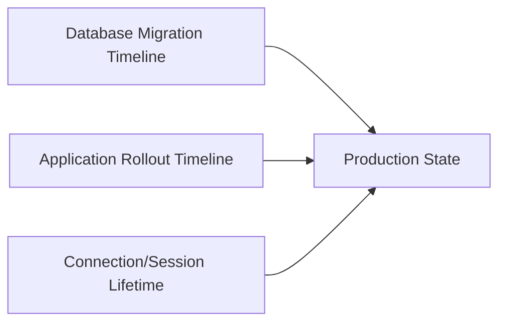
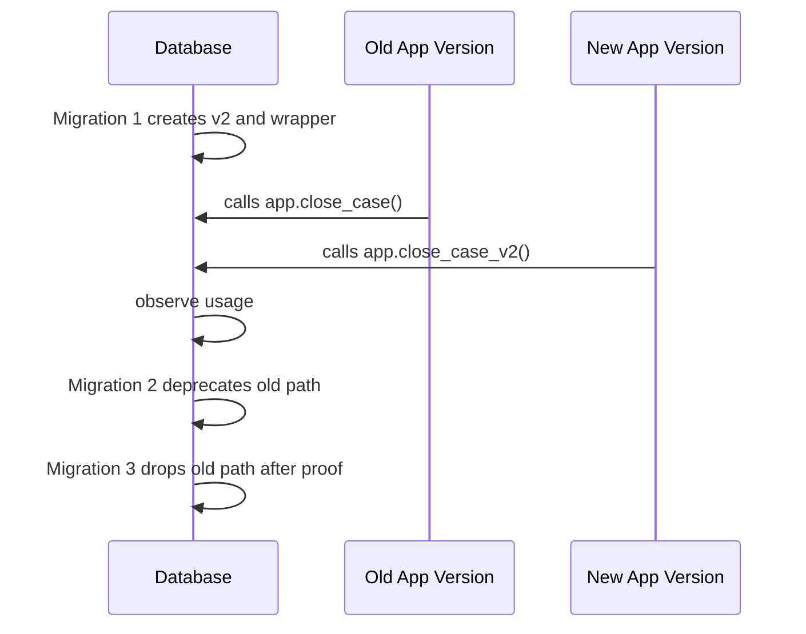
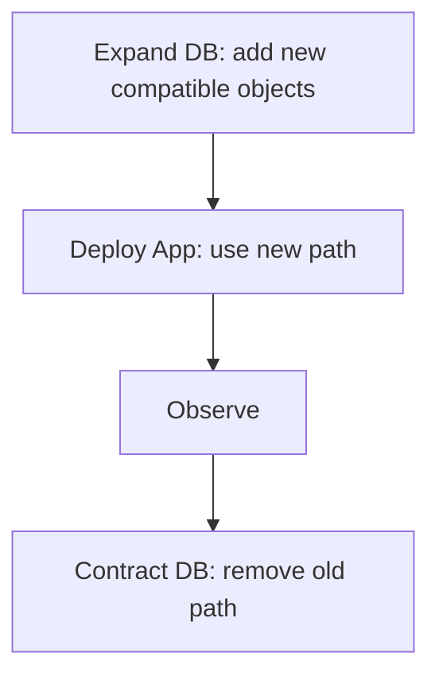
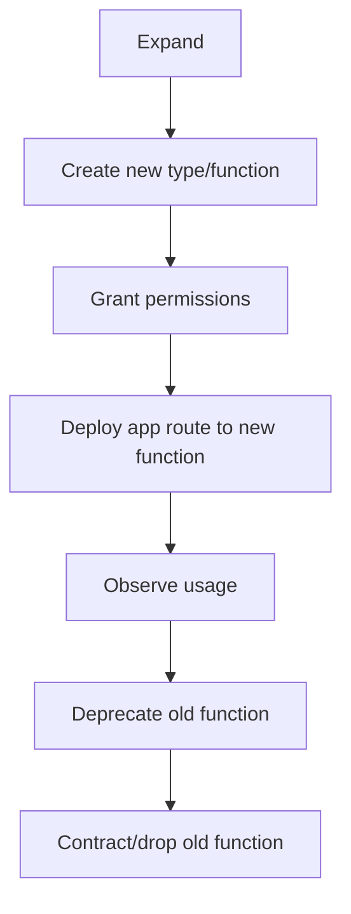
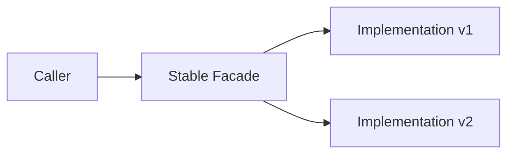

# Part 036 — Versioning, Deployment, Rollbacks, and Zero-Downtime Function Changes

> Goal: learn how to deploy PL/pgSQL changes without breaking live callers. We will cover function identity, `CREATE OR REPLACE` limits, signature versioning, compatibility wrappers, grants, dependency handling, rollback strategy, migration order, and zero-downtime release patterns.

Database code deployment is not just shipping code.

It is changing executable behavior inside the system of record.

A PL/pgSQL deployment can break production even if the syntax is valid.

Examples:

- the function body changes but callers depend on old SQLSTATE behavior,
- a return column is renamed and a report breaks,
- a function is dropped and recreated, losing grants or breaking dependent triggers,
- a new function overload causes unexpected resolution,
- a `SECURITY DEFINER` function changes owner or `search_path`,
- a procedure commits differently and creates partial progress,
- an application deploy and database deploy are not compatible during rolling release.

Zero-downtime function changes require compatibility thinking.

---

## 1. Deployment Mental Model

Every PL/pgSQL deployment has three timelines:



A migration may complete in seconds.

Application rollout may take minutes or hours.

Database sessions may keep old assumptions alive longer than expected.

So the correct question is not:

> Does the migration work?

The better question is:

> Are old and new callers both safe during the compatibility window?

---

## 2. Function Identity in PostgreSQL

A PostgreSQL function is identified by:

- schema,
- function name,
- input argument types.

Argument names do not define identity. Return type does not define identity. Output-only arguments are not needed for `DROP FUNCTION` identity.

That means these are distinct overloads:

```sql
app.find_case(bigint)
app.find_case(text)
app.find_case(bigint, boolean)
```

But this is not a distinct function identity:

```sql
-- Same identity if input types are same.
app.find_case(p_case_id bigint)
app.find_case(id bigint)
```

When deploying, always refer to identity arguments explicitly.

```sql
drop function if exists app.find_case(bigint) restrict;
```

Never rely on ambiguous names in migrations.

---

## 3. What `CREATE OR REPLACE FUNCTION` Can and Cannot Do

`CREATE OR REPLACE FUNCTION` is the safest path when you are preserving identity and return contract.

It can replace the function definition without breaking dependent objects that refer to that function identity.

But it cannot change everything.

| Change | `CREATE OR REPLACE`? | Deployment Meaning |
|---|---:|---|
| Change function body | Yes | Usually safe if contract preserved |
| Change argument names | Yes | Identity unaffected, but named callers may care |
| Change input argument types | No | Creates a different function identity |
| Change function name | No | Creates/drops different object |
| Change return type | No | Must drop/recreate or introduce new version |
| Change `OUT` parameter types | No | Return row type changes, requires drop/recreate |
| Change volatility/security/strictness/etc. | Yes if specified | Treat as contract-affecting even if syntactically allowed |
| Preserve existing grants | Yes, when replacing | Safer than drop/recreate |
| Preserve dependent views/triggers/rules | Yes, when identity preserved | Major reason to prefer replace |

This is where many teams make mistakes.

A change can be syntactically allowed and still be semantically dangerous.

Changing a function from `VOLATILE` to `STABLE`, or from `SECURITY INVOKER` to `SECURITY DEFINER`, is not “just metadata.” It changes how PostgreSQL and callers may treat it.

---

## 4. Deployment Classes

Classify every change before writing migration SQL.

| Class | Example | Preferred Pattern |
|---|---|---|
| Body-only compatible | Fix bug, same signature/return/error contract | `CREATE OR REPLACE FUNCTION` |
| Metadata compatible | Add `SET search_path`, adjust `COST` | `CREATE OR REPLACE` or `ALTER FUNCTION` with review |
| Additive API | New optional function or new overload | Create new routine, grant explicitly |
| Contract change | Return type changes, SQLSTATE changes, null semantics changes | Versioned routine and compatibility wrapper |
| Breaking removal | Drop old routine | Deprecation window, dependency check, `RESTRICT` first |
| Security change | Owner, definer/invoker, grants | Separate migration with security review |
| Trigger/procedure behavior change | Side effects or transaction boundary changes | Staged deploy and production observation |

Never let migration tooling treat all function changes the same.

---

## 5. Safe Body-Only Deployment

For a compatible body-only change:

```sql
begin;

create or replace function app.normalize_reference(p_reference text)
returns text
language plpgsql
immutable
as $$
begin
  return upper(trim(p_reference));
end;
$$;

commit;
```

But do not omit function attributes casually.

When using `CREATE OR REPLACE`, all properties specified or implied in the command matter. A good migration restates important attributes explicitly:

```sql
create or replace function app.normalize_reference(p_reference text)
returns text
language plpgsql
immutable
returns null on null input
parallel safe
as $$
begin
  return upper(trim(p_reference));
end;
$$;
```

This makes the migration self-documenting and reduces accidental drift.

---

## 6. Contract Change Pattern: Add New Version, Keep Old Wrapper

Suppose old function returns boolean:

```sql
app.close_case(p_case_id bigint) returns boolean
```

New requirement needs detailed outcome:

```sql
app.close_case_v2(p_case_id bigint) returns app.close_case_result
```

Do not force this into the old function.

Deploy additively:

```sql
create type app.close_case_result as (
  accepted boolean,
  case_id bigint,
  failure_code text,
  failure_message text
);

create or replace function app.close_case_v2(p_case_id bigint)
returns app.close_case_result
language plpgsql
as $$
begin
  -- new implementation
  return (true, p_case_id, null, null)::app.close_case_result;
end;
$$;
```

Then preserve old behavior:

```sql
create or replace function app.close_case(p_case_id bigint)
returns boolean
language plpgsql
as $$
declare
  r_result app.close_case_result;
begin
  r_result := app.close_case_v2(p_case_id);
  return r_result.accepted;
end;
$$;
```

This gives you:

- old callers remain safe,
- new callers can migrate,
- behavior is centralized,
- rollback is easier,
- and the deprecation can be measured.

---

## 7. Compatibility Window Design

A compatibility window is the period where both old and new contracts must work.



Do not remove old functions in the same release that introduces new functions unless you control all callers and all sessions.

Compatibility is especially important for:

- rolling deploys,
- background workers,
- scheduled jobs,
- report tools,
- ad-hoc admin scripts,
- connection pools,
- and multi-service systems.

---

## 8. Rollback-Aware Migration Ordering

A migration is not production-ready until rollback is considered.

There are two kinds of rollback:

| Rollback Type | Meaning | Example |
|---|---|---|
| Code rollback | Application goes back to old version | Old DB contract must still exist |
| Database rollback | Migration is reverted | New objects must be removable safely |

The safest pattern is expand-contract:



### Expand migration

```sql
begin;

create type app.transition_result_v2 as (...);

create or replace function app.transition_case_v2(...)
returns app.transition_result_v2
language plpgsql
as $$
begin
  -- implementation
end;
$$;

grant execute on function app.transition_case_v2(...) to app_runtime_role;

commit;
```

### Application rollout

New application calls `transition_case_v2`.

Old application continues calling `transition_case`.

### Contract migration

Only after proof:

```sql
begin;

drop function app.transition_case(bigint, text) restrict;

commit;
```

Use `RESTRICT` during planned cleanup. If dependencies exist, you want the migration to fail loudly.

---

## 9. Rollback Scripts Must Not Be Fiction

A rollback script that says this is not enough:

```sql
-- rollback
create or replace function app.foo(...) returns ... as $$ old body $$ language plpgsql;
```

Questions:

- did the new migration alter data shape?
- did it create new enum values?
- did it add events old code cannot understand?
- did it change grants?
- did it change owner?
- did it update rows using new semantics?
- did it create irreversible audit/outbox messages?
- did it drop old objects?

Rollback must be designed by blast radius.

| Change | Rollback Difficulty |
|---|---|
| Body-only compatible fix | Usually easy |
| Add new function | Easy |
| Add wrapper | Easy |
| Change return type via drop/recreate | Risky |
| Drop old function | Risky if hidden callers exist |
| Change data semantics | Hard |
| Backfill data | Harder |
| Emit external side effects | Often impossible to fully rollback |

For hard rollback, prefer forward fix.

---

## 10. Function Grants and Deployment

When you create a new routine, grants are not automatically copied from the old one.

Always grant explicitly.

```sql
create or replace function app.submit_case_v2(...)
returns app.submit_case_result_v2
language plpgsql
security definer
set search_path = app, pg_temp
as $$
begin
  -- implementation
end;
$$;

revoke all on function app.submit_case_v2(...) from public;
grant execute on function app.submit_case_v2(...) to app_runtime_role;
```

For replacement of an existing function, ownership and permissions are preserved. But relying on that invisibly is still poor operational hygiene.

A release script should make privilege intent visible.

```sql
revoke all on function app.submit_case(...) from public;
grant execute on function app.submit_case(...) to app_runtime_role;
```

This is idempotent in intent even if repeated.

---

## 11. Owner Role and Security Definer Deployment

A `SECURITY DEFINER` function executes as its owner.

Changing owner changes privilege semantics.

```sql
alter function app.admin_close_case(bigint) owner to app_privileged_owner;
```

This must be reviewed like application privilege escalation.

Safe pattern:

```sql
create role app_fn_owner noinherit;
create role app_runtime_role;

-- Function owned by narrow owner role.
alter function app.admin_close_case(bigint) owner to app_fn_owner;

revoke all on function app.admin_close_case(bigint) from public;
grant execute on function app.admin_close_case(bigint) to app_runtime_role;
```

Do not let migration-owner superuser accidentally become the owner of privileged functions.

---

## 12. Search Path as Deployment Contract

Every production `SECURITY DEFINER` function should have an explicit `search_path`.

```sql
create or replace function admin.rebuild_case_summary(p_case_id bigint)
returns void
language plpgsql
security definer
set search_path = admin, app, pg_temp
as $$
begin
  delete from app.case_summary cs
  where cs.case_id = p_case_id;

  insert into app.case_summary(case_id, open_task_count)
  select p_case_id, count(*)
  from app.case_task ct
  where ct.case_id = p_case_id
    and ct.status = 'OPEN';
end;
$$;
```

A function without fixed `search_path` can behave differently depending on caller/session configuration.

This is unacceptable for privileged code.

---

## 13. Avoid Drop/Recreate When Identity Can Be Preserved

Dropping and recreating a function creates a new object identity.

This can break dependent views, rules, triggers, or other objects.

Prefer:

```sql
create or replace function app.compute_score(p_case_id bigint)
returns numeric
language plpgsql
stable
as $$
begin
  -- new compatible body
end;
$$;
```

Avoid:

```sql
drop function app.compute_score(bigint);
create function app.compute_score(p_case_id bigint)
returns numeric
language plpgsql
stable
as $$
begin
  -- new body
end;
$$;
```

Use drop/recreate only when the identity or return type must change, and treat it as a breaking deployment.

---

## 14. Changing Return Type Safely

You cannot use `CREATE OR REPLACE FUNCTION` to change return type.

Unsafe approach:

```sql
-- This will fail if existing return type differs.
create or replace function app.find_case(p_case_id bigint)
returns app.case_detail_v2
...
```

Safe approach:

```sql
create or replace function app.find_case_v2(p_case_id bigint)
returns app.case_detail_v2
language plpgsql
stable
as $$
begin
  -- new result shape
end;
$$;
```

Then adapt old function:

```sql
create or replace function app.find_case(p_case_id bigint)
returns app.case_detail_v1
language plpgsql
stable
as $$
declare
  r_v2 app.case_detail_v2;
begin
  r_v2 := app.find_case_v2(p_case_id);

  return (
    r_v2.case_id,
    r_v2.reference,
    r_v2.status
  )::app.case_detail_v1;
end;
$$;
```

This is an adapter pattern inside the database.

---

## 15. Overload Deployment Hazards

Adding overloads can be dangerous.

```sql
create function app.search_case(p_reference text) returns setof app.case_file ...;
create function app.search_case(p_reference varchar) returns setof app.case_file ...;
```

Callers using string literals may trigger function resolution you did not expect.

Safer rules:

- avoid overloads for public application-facing APIs,
- prefer version suffixes for contract changes,
- cast explicitly in migrations/tests,
- do not create overloads that differ only by similar textual types,
- document which function is the stable public API.

For internal helpers, overloads can be acceptable. For service boundary functions, clarity is more valuable.

---

## 16. Trigger Deployment Without Downtime

Changing trigger behavior affects writes immediately.

Safe trigger deployment sequence:

```txt
1. Create new trigger function with new name.
2. Test it directly if possible.
3. Deploy supporting tables/types first.
4. In one transaction, replace trigger binding if needed.
5. Observe write errors, latency, audit rows, recursion risk.
6. Keep old function until rollback window ends.
7. Drop old function with RESTRICT.
```

Example:

```sql
begin;

create or replace function app.case_file_audit_trg_v2()
returns trigger
language plpgsql
as $$
begin
  -- new implementation
  return new;
end;
$$;

drop trigger if exists case_file_audit_trg on app.case_file;

create trigger case_file_audit_trg
after insert or update or delete on app.case_file
for each row
execute function app.case_file_audit_trg_v2();

commit;
```

If rollback must be instant, keep the old function:

```sql
create trigger case_file_audit_trg
after insert or update or delete on app.case_file
for each row
execute function app.case_file_audit_trg_v1();
```

Do not drop `v1` until rollback window closes.

---

## 17. Procedure Deployment and Transaction Boundaries

Procedures are more sensitive than functions when they include transaction control.

Changing where a procedure commits changes recovery behavior.

Legacy procedure:

```sql
call maintenance.process_import_batch(123);
```

If old behavior commits every 1,000 rows and new behavior commits every 10,000 rows, you changed:

- lock duration,
- crash recovery unit,
- retry cost,
- visibility of partial progress,
- WAL burst profile,
- and operational runbook.

For procedure changes, document:

```txt
Commit boundary:
  before: commit after every 1,000 applied rows
  after: commit after every batch partition
Rollback effect:
  before: at most 1,000 rows repeated
  after: one full partition repeated
Operational impact:
  longer locks possible
Retry behavior:
  same run ledger prevents duplicate apply
```

Procedures need operational tests, not only unit tests.

---

## 18. Deployment Ledger

Store database routine deployments as data.

```sql
create schema if not exists deploy;

create table if not exists deploy.routine_release_ledger (
  release_id text not null,
  deployed_at timestamptz not null default clock_timestamp(),
  deployed_by text not null default current_user,
  routine_identity text not null,
  old_hash text,
  new_hash text not null,
  migration_file text not null,
  notes text,
  primary key (release_id, routine_identity)
);
```

During migration:

```sql
insert into deploy.routine_release_ledger(
  release_id,
  routine_identity,
  old_hash,
  new_hash,
  migration_file,
  notes
)
select
  '2026-07-03-close-case-v2',
  'app.close_case(bigint)',
  old.source_hash,
  md5(pg_get_functiondef(p.oid)),
  'V20260703_01__close_case_v2.sql',
  'compatibility wrapper now delegates to close_case_v2'
from pg_proc p
join pg_namespace n on n.oid = p.pronamespace
left join lateral (
  select s.source_hash
  from refactor_audit.routine_source_snapshot s
  where s.routine_oid = p.oid
  order by s.captured_at desc
  limit 1
) old on true
where n.nspname = 'app'
  and p.proname = 'close_case'
  and pg_get_function_identity_arguments(p.oid) = 'p_case_id bigint';
```

This supports incident response.

When production behavior changes, you can connect runtime state to release history.

---

## 19. Pre-Deployment Safety Queries

### Find duplicate public routine names

```sql
select
  n.nspname,
  p.proname,
  count(*) as overload_count,
  array_agg(pg_get_function_identity_arguments(p.oid) order by pg_get_function_identity_arguments(p.oid)) as overloads
from pg_proc p
join pg_namespace n on n.oid = p.pronamespace
where n.nspname = 'app'
group by n.nspname, p.proname
having count(*) > 1
order by overload_count desc, p.proname;
```

### Find security definer functions without fixed search path

```sql
select
  n.nspname,
  p.proname,
  pg_get_function_identity_arguments(p.oid) as args,
  p.proconfig
from pg_proc p
join pg_namespace n on n.oid = p.pronamespace
where p.prosecdef
  and not exists (
    select 1
    from unnest(coalesce(p.proconfig, array[]::text[])) cfg
    where cfg like 'search_path=%'
  )
order by n.nspname, p.proname;
```

### Find functions executable by public

```sql
select
  n.nspname,
  p.proname,
  pg_get_function_identity_arguments(p.oid) as args
from pg_proc p
join pg_namespace n on n.oid = p.pronamespace
where has_function_privilege('public', p.oid, 'execute')
  and n.nspname not in ('pg_catalog', 'information_schema')
order by n.nspname, p.proname;
```

### Find functions changed from snapshot

```sql
select
  s.schema_name,
  s.routine_name,
  s.identity_args,
  s.source_hash as snapshot_hash,
  md5(pg_get_functiondef(p.oid)) as current_hash,
  s.source_hash <> md5(pg_get_functiondef(p.oid)) as changed
from refactor_audit.routine_source_snapshot s
join pg_proc p on p.oid = s.routine_oid
where s.captured_at = (
  select max(s2.captured_at)
  from refactor_audit.routine_source_snapshot s2
  where s2.routine_oid = s.routine_oid
)
order by changed desc, s.schema_name, s.routine_name;
```

---

## 20. Post-Deployment Observation

After deploying PL/pgSQL changes, observe behavior.

Minimum signals:

- function execution count,
- mean/max time from `pg_stat_user_functions` if function tracking is enabled,
- slow nested SQL via `auto_explain` where enabled,
- error rates by SQLSTATE,
- lock waits,
- deadlocks,
- row-count outcomes,
- audit/outbox volume,
- trigger write amplification,
- application error logs,
- and business-level invariants.

Example invariant query:

```sql
select count(*) as invalid_closed_cases
from app.case_file cf
where cf.status = 'CLOSED'
  and not exists (
    select 1
    from app.case_event ce
    where ce.case_id = cf.case_id
      and ce.event_type = 'CASE_CLOSED'
  );
```

Deployments are not done at `COMMIT`.

They are done when the system shows the expected behavior under live workload.

---

## 21. Zero-Downtime Release Pattern: Expand-Route-Contract

Use this for public PL/pgSQL APIs.



### Expand

```sql
create type app.submit_case_result_v2 as (...);
create function app.submit_case_v2(...) returns app.submit_case_result_v2 ...;
grant execute on function app.submit_case_v2(...) to app_runtime_role;
```

### Route

Application starts calling `submit_case_v2`.

### Observe

Track old function usage.

```sql
create table app.deprecated_function_call_log (
  function_name text not null,
  called_at timestamptz not null default clock_timestamp(),
  actor text not null default current_user,
  app_name text default current_setting('application_name', true)
);
```

Wrapper logs old usage:

```sql
insert into app.deprecated_function_call_log(function_name)
values ('app.submit_case');
```

### Contract

After proof:

```sql
drop function app.submit_case(...) restrict;
```

---

## 22. Zero-Downtime Release Pattern: Stable Facade, Versioned Internals

Sometimes callers should not know about versioned internals.



Stable facade:

```sql
create or replace function app.submit_case(p_payload jsonb)
returns app.submit_case_result
language plpgsql
security definer
set search_path = app, pg_temp
as $$
begin
  if app.feature_enabled('submit_case_v2') then
    return app.submit_case_impl_v2(p_payload);
  end if;

  return app.submit_case_impl_v1(p_payload);
end;
$$;
```

This pattern is useful when you want routing control inside the database.

But it has a cost:

- routing logic becomes database state,
- both implementations must be maintained,
- tests must cover both paths,
- and cleanup must be scheduled.

Use this only when compatibility pressure justifies it.

---

## 23. Zero-Downtime Release Pattern: View/API Compatibility Layer

For query functions returning records, compatibility can be handled by a stable view or stable composite type.

Example:

```sql
create type app.case_detail_api as (
  case_id bigint,
  reference text,
  status text,
  owner_id bigint
);
```

Function:

```sql
create or replace function app.get_case_detail(p_case_id bigint)
returns app.case_detail_api
language plpgsql
stable
as $$
declare
  r_result app.case_detail_api;
begin
  select
    cf.case_id,
    cf.reference,
    cf.status,
    cf.owner_id
  into r_result
  from app.case_file cf
  where cf.case_id = p_case_id;

  return r_result;
end;
$$;
```

Internal schema can evolve, but API type remains stable until a deliberate version change.

---

## 24. Migration Transaction Boundaries

Not every migration should be one huge transaction.

| Migration Type | Transaction Strategy |
|---|---|
| Create/replace function | Usually single transaction |
| Add type and function | Single transaction if no long-running DDL |
| Backfill data | Often chunked, with run ledger |
| Attach partition | Review locks and validation behavior |
| Create index concurrently | Cannot be inside normal transaction block |
| Procedure behavior change | Separate from large data changes |
| Drop old public function | Separate cleanup migration |

For function deployment, small transactions are usually preferable.

Do not mix risky data backfill and function API change unless necessary.

---

## 25. Release Checklist

### Before Migration

- [ ] Is this body-only, metadata, additive, or breaking?
- [ ] Are identity arguments unchanged?
- [ ] Is return type unchanged?
- [ ] Are grants explicit?
- [ ] Is `SECURITY DEFINER` reviewed?
- [ ] Is `search_path` fixed where needed?
- [ ] Are overloaded names safe?
- [ ] Are dependent triggers/views/functions known?
- [ ] Are application versions compatible during rollout?
- [ ] Is rollback realistic?

### During Migration

- [ ] Use schema-qualified names.
- [ ] Use identity argument lists for drop/alter/grant.
- [ ] Prefer `CREATE OR REPLACE` for compatible changes.
- [ ] Prefer `RESTRICT` for cleanup drops.
- [ ] Revoke/grant explicitly.
- [ ] Record release ledger where appropriate.

### After Migration

- [ ] Verify function definition hash.
- [ ] Verify grants.
- [ ] Verify owner.
- [ ] Run smoke tests.
- [ ] Check error logs.
- [ ] Check slow query/function stats.
- [ ] Check invariants.
- [ ] Watch old function usage if deprecated.

---

## 26. Failure Modes

| Failure | Cause | Safer Pattern |
|---|---|---|
| App fails during rolling deploy | DB removed old function too early | Expand-contract |
| Report breaks | Return column changed | Versioned result type |
| Trigger missing after deploy | Function dropped/recreated incorrectly | Replace body, keep old function until rollback window ends |
| Permission denied | New function missing grants | Explicit grants in migration |
| Privilege escalation | Function owner/search path changed | Security review and narrow owner role |
| Unexpected overload resolution | Added similar overload | Avoid overloads for public APIs |
| Rollback impossible | Migration emitted external side effects | Idempotent outbox and forward-fix plan |
| Dependency break | Used `CASCADE` blindly | Use `RESTRICT`, inspect details |
| Performance regression | Body change altered plan/lock behavior | Compare plans and observe production stats |
| Old sessions fail | Assumed instantaneous caller migration | Compatibility window |

---

## 27. Enterprise Example: Zero-Downtime Case Submission Upgrade

### Current API

```sql
app.submit_case(p_payload jsonb) returns bigint
```

It returns only `case_id`.

New requirement:

- return accepted flag,
- idempotency result,
- validation errors,
- outbox message id,
- and policy version.

### Expand Migration

```sql
create type app.submit_case_result_v2 as (
  accepted boolean,
  case_id bigint,
  idempotency_status text,
  validation_errors jsonb,
  outbox_message_id bigint,
  policy_version text
);

create or replace function app.submit_case_v2(
  p_payload jsonb,
  p_idempotency_key text
)
returns app.submit_case_result_v2
language plpgsql
security definer
set search_path = app, pg_temp
as $$
begin
  -- new implementation
  return (true, 1001, 'NEW', '[]'::jsonb, 9001, '2026-07')::app.submit_case_result_v2;
end;
$$;

revoke all on function app.submit_case_v2(jsonb, text) from public;
grant execute on function app.submit_case_v2(jsonb, text) to app_runtime_role;
```

### Compatibility Wrapper

```sql
create or replace function app.submit_case(p_payload jsonb)
returns bigint
language plpgsql
security definer
set search_path = app, pg_temp
as $$
declare
  r_result app.submit_case_result_v2;
begin
  r_result := app.submit_case_v2(
    p_payload,
    coalesce(p_payload ->> 'requestId', md5(p_payload::text))
  );

  if not r_result.accepted then
    raise exception using
      errcode = 'P7001',
      message = 'Legacy submit_case caller received rejected submission',
      detail = r_result.validation_errors::text;
  end if;

  return r_result.case_id;
end;
$$;
```

### Application Rollout

New app calls `submit_case_v2`.

Old app remains safe because `submit_case` still exists.

### Observe

```sql
select
  routine_identity,
  count(*)
from deploy.routine_call_sample
where called_at >= now() - interval '7 days'
group by routine_identity
order by count(*) desc;
```

### Contract Cleanup

Only after old callers disappear:

```sql
drop function app.submit_case(jsonb) restrict;
```

This is zero-downtime because compatibility was preserved across the rollout window.

---

## 28. Final Mental Model

PL/pgSQL deployment is contract deployment.

The safest teams do not ask only whether a migration applies.

They ask:

- who can call this?
- what exact identity is being changed?
- what return shape exists during rollout?
- are old and new callers compatible?
- what happens if application rollback occurs?
- what happens if database rollback is impossible?
- are grants and owner explicit?
- are dependent objects preserved?
- is cleanup separated from expansion?
- and how will we know production behavior is correct?

Zero downtime is not magic.

It is compatibility, sequencing, observability, and restraint.

---

## References

- PostgreSQL Documentation — `CREATE FUNCTION`: `https://www.postgresql.org/docs/current/sql-createfunction.html`
- PostgreSQL Documentation — `ALTER FUNCTION`: `https://www.postgresql.org/docs/current/sql-alterfunction.html`
- PostgreSQL Documentation — `DROP FUNCTION`: `https://www.postgresql.org/docs/current/sql-dropfunction.html`
- PostgreSQL Documentation — Dependency Tracking: `https://www.postgresql.org/docs/current/ddl-depend.html`
- PostgreSQL Documentation — `pg_proc`: `https://www.postgresql.org/docs/current/catalog-pg-proc.html`
- PostgreSQL Documentation — `pg_depend`: `https://www.postgresql.org/docs/current/catalog-pg-depend.html`

---

## Next Part

Part 037 will move from deployment mechanics into operational readiness: monitoring, alerting, runbooks, ownership model, and incident response for PL/pgSQL in production.
