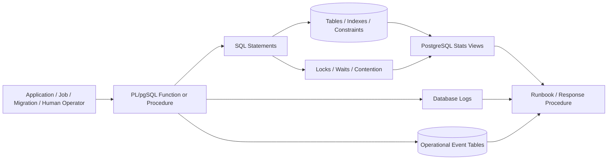
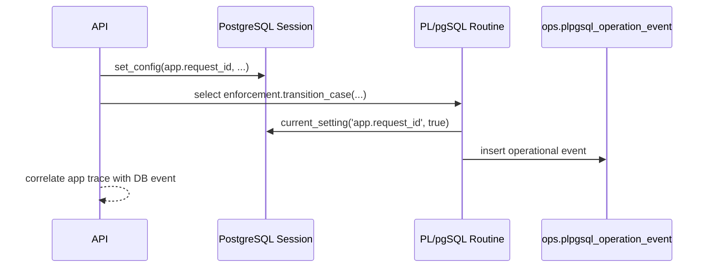
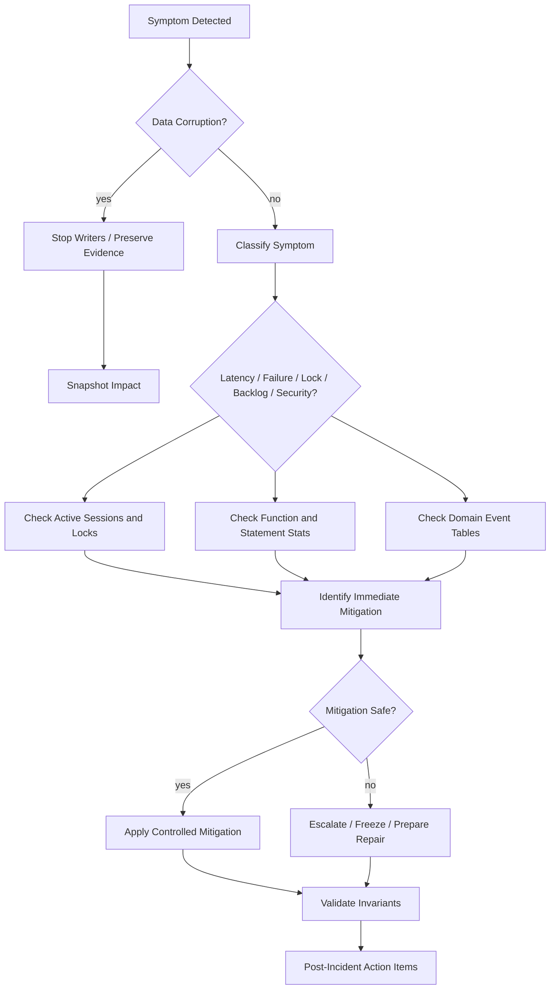

# Part 037 — Operational Readiness, Monitoring, Alerting, and Runbooks

> Goal: make PL/pgSQL code production-operable. A function is not production-ready just because it compiles, passes tests, and has acceptable benchmark numbers. It is production-ready when engineers can detect failure, explain behavior, control blast radius, recover safely, and decide whether to roll forward or roll back.

PL/pgSQL sits inside the database.

That makes it powerful.

It also makes it dangerous.

When application code fails, logs, traces, deployment metadata, and service dashboards usually help you see what happened.

When PL/pgSQL fails, the symptom may appear as:

- blocked transactions,
- slow queries,
- unexpected row changes,
- trigger recursion,
- stale queues,
- audit gaps,
- duplicate side effects,
- strange SQLSTATE errors,
- unexplained lock waits,
- higher WAL volume,
- autovacuum pressure,
- application timeout storms,
- or silent business-state corruption.

Operational readiness is the discipline of making database-side behavior inspectable and recoverable.

This part is not about adding random `RAISE NOTICE` statements.

It is about designing an operational contract.

---

## 1. Operational Mental Model

A PL/pgSQL routine is production-grade when it has six properties:

| Property | Meaning |
|---|---|
| Observable | You can see calls, latency, failures, row effects, locks, and business outcomes. |
| Bounded | Runtime, batch size, affected rows, and lock duration are intentionally limited. |
| Recoverable | Failed work can be retried, resumed, skipped, compensated, or rolled back safely. |
| Explainable | Engineers can answer why the function made a decision. |
| Reversible | Deployment and data mutation have a rollback or forward-fix path. |
| Owned | A team owns alerts, runbooks, review, and retirement. |

The practical model:



The database gives you primitives.

You must turn them into an operational system.

---

## 2. What Must Be Observable?

Do not start with tools.

Start with questions.

For every production PL/pgSQL routine, an operator should be able to answer:

1. Who calls it?
2. How often is it called?
3. How long does it normally take?
4. What does it mutate?
5. What rows can it lock?
6. What business invariant does it protect?
7. What SQLSTATEs are expected?
8. What failures are retryable?
9. What failures are terminal?
10. What is the maximum expected affected row count?
11. What happens if it is called twice?
12. What happens if it is interrupted?
13. What happens if it runs concurrently?
14. What dashboard shows whether it is healthy?
15. What runbook says what to do when it is unhealthy?

If you cannot answer these, the routine is not operationally ready.

---

## 3. Observability Layers

PL/pgSQL observability has several layers.

| Layer | Examples | Best For | Weakness |
|---|---|---|---|
| PostgreSQL logs | errors, duration logs, `auto_explain`, `RAISE` output | incident reconstruction | noisy, unstructured unless disciplined |
| Stats views | `pg_stat_activity`, `pg_stat_user_functions`, `pg_stat_statements`, `pg_locks` | runtime visibility | aggregate or point-in-time, limited business context |
| Operational tables | run ledger, operation event table, queue table, audit table | domain-level observability | must be designed and maintained |
| Application traces | request id, user id, endpoint, job id | end-to-end flow | may not see internal trigger/procedure details |
| Alerting system | SLO alerts, stuck queue alerts, failure-rate alerts | response coordination | alert quality depends on signal design |
| Runbooks | diagnosis and recovery steps | human response | stale if not tested |

A mature system combines all layers.

One layer alone is insufficient.

---

## 4. Routine Operational Contract

Every important function/procedure should have an operational contract.

Example contract:

```txt
Routine: enforcement.transition_case(...)
Kind: command function
Owner: Enforcement Platform Team
Caller: case-management-api, escalation-worker
Mutation scope: one case + one transition event + optional outbox row
Expected latency: p95 < 50 ms, p99 < 250 ms
Max affected domain rows: case=1, transition_event=1, outbox<=1
Concurrency model: row lock on enforcement_case(id)
Idempotency: request_id unique per command source
Retryable SQLSTATE: 40001, 40P01
Terminal SQLSTATE: P24xx domain validation failures
Alert signals: error rate, p99 latency, lock wait, outbox lag, transition rejection spike
Rollback path: deploy previous function body if signature unchanged; otherwise compatibility wrapper
Runbook: RUNBOOK-ENF-CASE-TRANSITION
```

This is not bureaucracy.

It is executable thinking.

A contract tells operators what the function is allowed to do.

---

## 5. Readiness Gate

Before a PL/pgSQL routine reaches production, check this gate:

| Gate | Question |
|---|---|
| Ownership | Who owns it after deployment? |
| Caller map | Which applications, jobs, triggers, or migrations call it? |
| Runtime bound | Is runtime bounded by key lookup, batch size, or timeout? |
| Lock bound | Which rows/tables can it lock? |
| Row-effect bound | Does it validate affected rows? |
| Error contract | Are SQLSTATEs classified? |
| Retry policy | Is retry safe and documented? |
| Idempotency | What happens on duplicate call? |
| Logging | Are logs useful but not noisy? |
| Metrics | Which PostgreSQL/app/business metrics show health? |
| Recovery | Can failed work resume safely? |
| Rollback | Can deployment be rolled back without breaking callers? |
| Security | Are privileges, owner, `search_path`, and grants reviewed? |
| Test evidence | Are concurrency, failure, and regression tests present? |
| Runbook | Is the runbook specific enough for an on-call engineer? |

If a function mutates core domain state and lacks this gate, it is not ready.

---

## 6. PostgreSQL Signals You Should Know

### 6.1 `pg_stat_activity`

Use it to inspect active sessions, current queries, state, wait events, transaction age, backend age, and blocking symptoms.

Typical investigation query:

```sql
select
  pid,
  usename,
  application_name,
  state,
  wait_event_type,
  wait_event,
  now() - xact_start as xact_age,
  now() - query_start as query_age,
  left(query, 160) as query_preview
from pg_stat_activity
where datname = current_database()
order by xact_start nulls last, query_start nulls last;
```

What to look for:

- long `idle in transaction`,
- sessions waiting on locks,
- repeated calls to a hot function,
- migration sessions blocking application traffic,
- queue workers stuck on the same statement,
- transaction age much longer than business expectation.

### 6.2 `pg_locks`

Use it to understand lock contention.

```sql
select
  a.pid,
  a.application_name,
  a.state,
  l.locktype,
  l.mode,
  l.granted,
  l.relation::regclass as relation_name,
  now() - a.query_start as query_age,
  left(a.query, 120) as query_preview
from pg_locks l
join pg_stat_activity a on a.pid = l.pid
where a.datname = current_database()
order by l.granted, query_age desc;
```

A lock view tells you symptoms.

It does not automatically tell you root cause.

Root cause requires knowing the PL/pgSQL routine's lock acquisition order and mutation path.

### 6.3 `pg_stat_user_functions`

Use it to track function calls and timing when function tracking is enabled.

Useful query:

```sql
select
  schemaname,
  funcname,
  calls,
  round(total_time::numeric, 2) as total_ms,
  round(self_time::numeric, 2) as self_ms,
  round((total_time / nullif(calls, 0))::numeric, 3) as avg_ms
from pg_stat_user_functions
where calls > 0
order by total_time desc
limit 30;
```

Read this as a smoke detector, not a full profiler.

A low self-time function may call expensive SQL.

A high total-time function may be waiting on locks, IO, or nested statements.

### 6.4 `pg_stat_statements`

Use it for statement-level planning and execution statistics.

For PL/pgSQL, it helps detect which SQL statements inside functions are expensive or frequently executed.

```sql
select
  calls,
  round(total_exec_time::numeric, 2) as total_exec_ms,
  round(mean_exec_time::numeric, 3) as mean_exec_ms,
  rows,
  left(query, 180) as query_preview
from pg_stat_statements
where dbid = (select oid from pg_database where datname = current_database())
order by total_exec_time desc
limit 30;
```

Be careful:

- normalized queries hide literal values,
- dynamic SQL may produce many query shapes,
- nested PL/pgSQL statements need careful attribution,
- aggregate stats must be compared across reset windows.

### 6.5 `auto_explain`

Use it when you need execution plans for slow nested statements.

Good for incidents where:

- a function got slower after data growth,
- a cached plan is suspicious,
- a trigger statement is unexpectedly expensive,
- an index is not used,
- row estimates drifted.

Typical controlled settings for investigation:

```sql
-- Example for a controlled diagnostic session, not a blanket production recommendation.
load 'auto_explain';
set auto_explain.log_min_duration = '500ms';
set auto_explain.log_analyze = on;
set auto_explain.log_buffers = on;
set auto_explain.log_nested_statements = on;
```

Do not enable noisy plan logging globally without thinking.

Plan logging can become operational noise and may expose sensitive query text.

### 6.6 Database Logs

Logs matter most when messages are structured.

Bad:

```sql
raise notice 'failed here';
```

Better:

```sql
raise warning
  'op=case_transition status=rejected case_id=% from=% to=% reason=% request_id=%',
  p_case_id,
  v_current_status,
  p_target_status,
  v_reason_code,
  p_request_id;
```

Best for durable operations:

- log enough context to diagnose,
- store durable operation events for business-critical flows,
- avoid leaking secrets or personal data,
- keep message vocabulary consistent.

---

## 7. Durable Operational Event Table

For critical routines, logs alone are not enough.

Use a durable event table.

```sql
create schema if not exists ops;

create table if not exists ops.plpgsql_operation_event (
  event_id       bigint generated always as identity primary key,
  occurred_at    timestamptz not null default clock_timestamp(),
  schema_name    text not null,
  routine_name   text not null,
  operation      text not null,
  severity       text not null check (severity in ('debug', 'info', 'warning', 'error')),
  request_id     text,
  actor_id       text,
  subject_type   text,
  subject_id     text,
  sqlstate       text,
  message        text not null,
  detail         jsonb not null default '{}'::jsonb
);

create index if not exists idx_plpgsql_operation_event_lookup
  on ops.plpgsql_operation_event (routine_name, occurred_at desc);

create index if not exists idx_plpgsql_operation_event_request
  on ops.plpgsql_operation_event (request_id)
  where request_id is not null;
```

Helper function:

```sql
create or replace function ops.record_plpgsql_event(
  p_schema_name  text,
  p_routine_name text,
  p_operation    text,
  p_severity     text,
  p_request_id   text,
  p_actor_id     text,
  p_subject_type text,
  p_subject_id   text,
  p_sqlstate     text,
  p_message      text,
  p_detail       jsonb default '{}'::jsonb
)
returns void
language plpgsql
security definer
set search_path = ops, pg_catalog
as $$
begin
  insert into ops.plpgsql_operation_event (
    schema_name,
    routine_name,
    operation,
    severity,
    request_id,
    actor_id,
    subject_type,
    subject_id,
    sqlstate,
    message,
    detail
  ) values (
    p_schema_name,
    p_routine_name,
    p_operation,
    p_severity,
    p_request_id,
    p_actor_id,
    p_subject_type,
    p_subject_id,
    p_sqlstate,
    p_message,
    coalesce(p_detail, '{}'::jsonb)
  );
end;
$$;
```

Design notes:

- Keep this function small.
- Harden its `search_path`.
- Avoid logging secrets.
- Partition this table if volume is high.
- Retain based on operational and regulatory needs.
- Do not let event logging become a reason every transaction becomes slow.

---

## 8. Correlation Context

A production system needs correlation IDs.

PL/pgSQL can read session-local settings.

Application sets context at transaction start:

```sql
select set_config('app.request_id', :request_id, true);
select set_config('app.actor_id', :actor_id, true);
select set_config('app.source', 'case-management-api', true);
```

Function reads it safely:

```sql
create or replace function app_context.request_id()
returns text
language sql
stable
as $$
  select nullif(current_setting('app.request_id', true), '')
$$;

create or replace function app_context.actor_id()
returns text
language sql
stable
as $$
  select nullif(current_setting('app.actor_id', true), '')
$$;
```

Usage:

```sql
perform ops.record_plpgsql_event(
  'enforcement',
  'transition_case',
  'transition_rejected',
  'warning',
  app_context.request_id(),
  app_context.actor_id(),
  'case',
  p_case_id::text,
  'P2401',
  'Invalid transition rejected',
  jsonb_build_object(
    'from_status', v_current_status,
    'to_status', p_target_status,
    'reason_code', v_reason_code
  )
);
```

This creates a bridge:



Important: session settings are not a security boundary.

Treat them as correlation metadata, not proof of authorization.

---

## 9. Alert Design

Bad alerts say:

> Something is wrong.

Good alerts say:

> A specific invariant or operating range was violated, with a response path.

Alert dimensions:

| Alert Type | Signal | Example |
|---|---|---|
| Availability | function fails too often | transition function domain errors spike above baseline |
| Latency | p95/p99 exceeds threshold | escalation worker batch takes > 5 minutes |
| Backlog | queue age/size grows | outbox oldest pending event > 10 minutes |
| Contention | lock waits/deadlocks rise | case transition deadlocks > 3 in 10 minutes |
| Data integrity | invariant violations appear | active policy overlap detected |
| Audit completeness | business mutation without audit | transition count != audit event count |
| Security | unsafe routine created | new `SECURITY DEFINER` without hardened `search_path` |
| Deployment | function changed without ledger | production function hash differs from approved release |

Alerts should point to runbooks.

An alert without a runbook is an invitation to improvise under stress.

---

## 10. Alert Query Patterns

### 10.1 Stale Queue

```sql
select
  count(*) filter (where status = 'pending') as pending_count,
  min(created_at) filter (where status = 'pending') as oldest_pending_at,
  now() - min(created_at) filter (where status = 'pending') as oldest_pending_age
from integration.outbox_event;
```

Alert when `oldest_pending_age` exceeds the operational target.

### 10.2 Failed Batch Runs

```sql
select
  run_type,
  count(*) filter (where status = 'failed') as failed_runs,
  max(finished_at) filter (where status = 'failed') as latest_failure_at
from ops.batch_run
where started_at >= now() - interval '1 hour'
group by run_type
having count(*) filter (where status = 'failed') > 0;
```

### 10.3 Audit Gap

```sql
with transitions as (
  select date_trunc('minute', occurred_at) as bucket, count(*) as transition_count
  from enforcement.case_transition_event
  where occurred_at >= now() - interval '1 hour'
  group by 1
), audits as (
  select date_trunc('minute', occurred_at) as bucket, count(*) as audit_count
  from audit.row_change_event
  where table_name = 'enforcement_case'
    and occurred_at >= now() - interval '1 hour'
  group by 1
)
select
  coalesce(t.bucket, a.bucket) as bucket,
  coalesce(t.transition_count, 0) as transition_count,
  coalesce(a.audit_count, 0) as audit_count
from transitions t
full join audits a using (bucket)
where coalesce(t.transition_count, 0) <> coalesce(a.audit_count, 0)
order by bucket;
```

This query is domain-specific.

That is the point.

Operational checks should encode business expectation.

### 10.4 Long Transactions

```sql
select
  pid,
  application_name,
  usename,
  state,
  now() - xact_start as xact_age,
  wait_event_type,
  wait_event,
  left(query, 120) as query_preview
from pg_stat_activity
where xact_start is not null
  and now() - xact_start > interval '5 minutes'
order by xact_age desc;
```

Long transactions are especially dangerous when PL/pgSQL procedures perform batches, queue processing, or maintenance.

### 10.5 Deadlocks and Database-Level Health

```sql
select
  datname,
  deadlocks,
  temp_files,
  temp_bytes,
  conflicts
from pg_stat_database
where datname = current_database();
```

This does not identify one function by itself.

Use it as a coarse signal, then correlate with logs, app deploys, recent migrations, and hot statements.

---

## 11. Runbook Structure

A useful runbook is precise.

Template:

```md
# RUNBOOK: <Routine / Workflow Name>

## Owner
- Team:
- Slack / Pager:
- Escalation:

## Purpose
What business workflow does this protect?

## Normal Behavior
- Expected call rate:
- Expected latency:
- Expected queue age:
- Expected row effect:
- Expected SQLSTATEs:

## Alert Signals
- Alert name:
- Query / dashboard:
- Threshold:
- Severity:

## First Checks
1. Check active sessions.
2. Check lock waits.
3. Check latest failures.
4. Check run ledger.
5. Check recent deploys.

## Diagnosis Branches
- If queue is stale:
- If lock wait is high:
- If domain rejection spike:
- If deadlock spike:
- If audit gap:

## Safe Actions
- Retry command:
- Resume batch:
- Disable worker:
- Pause caller:
- Rebuild derived table:
- Roll forward migration:

## Dangerous Actions
- Do not truncate:
- Do not manually update status:
- Do not disable trigger except under approved incident procedure:

## Rollback / Forward Fix
- Compatible rollback:
- Function body rollback:
- Data repair:
- Validation query:

## Post-Incident Checks
- Invariant checks:
- Audit checks:
- Replay checks:
- Customer/case impact query:
```

A runbook should include SQL snippets, not just advice.

---

## 12. Example Runbook: Stuck Escalation Worker

### Symptom

`enforcement.escalation_job` oldest pending task is older than 15 minutes.

### First Check

```sql
select
  status,
  count(*) as task_count,
  min(due_at) as oldest_due_at,
  max(updated_at) as latest_update_at
from enforcement.escalation_task
group by status
order by status;
```

### Check Workers

```sql
select
  pid,
  application_name,
  state,
  wait_event_type,
  wait_event,
  now() - query_start as query_age,
  left(query, 160) as query_preview
from pg_stat_activity
where application_name like 'escalation-worker%'
order by query_age desc;
```

### Check Lock Contention

```sql
select
  a.pid,
  a.application_name,
  l.mode,
  l.granted,
  l.relation::regclass as relation_name,
  now() - a.query_start as query_age,
  left(a.query, 120) as query_preview
from pg_locks l
join pg_stat_activity a on a.pid = l.pid
where a.datname = current_database()
  and (
    l.relation = 'enforcement.escalation_task'::regclass
    or a.query ilike '%escalation_task%'
  )
order by granted, query_age desc;
```

### Check Failure Events

```sql
select
  occurred_at,
  severity,
  request_id,
  subject_id,
  sqlstate,
  message,
  detail
from ops.plpgsql_operation_event
where routine_name in ('claim_due_escalations', 'process_escalation_task')
  and occurred_at >= now() - interval '2 hours'
order by occurred_at desc
limit 100;
```

### Safe Recovery

If tasks are pending and workers are not running:

- restart worker process,
- verify worker application identity,
- watch queue age decrease.

If tasks are stuck in `processing` longer than timeout:

```sql
update enforcement.escalation_task
set
  status = 'pending',
  locked_by = null,
  locked_at = null,
  updated_at = clock_timestamp(),
  retry_count = retry_count + 1
where status = 'processing'
  and locked_at < clock_timestamp() - interval '15 minutes'
  and retry_count < 5;
```

Only use this if task processing is idempotent.

If idempotency is not guaranteed, manual reset can duplicate side effects.

### Post-Recovery Validation

```sql
select
  count(*) filter (where status = 'pending') as pending,
  count(*) filter (where status = 'processing') as processing,
  count(*) filter (where status = 'failed') as failed,
  min(due_at) filter (where status = 'pending') as oldest_pending_due
from enforcement.escalation_task;
```

---

## 13. Operational Ledger for Procedures

Batch procedures need a durable ledger.

```sql
create table if not exists ops.procedure_run (
  run_id          bigint generated always as identity primary key,
  procedure_name  text not null,
  requested_by    text,
  request_id      text,
  status          text not null check (status in ('running', 'succeeded', 'failed', 'cancelled')),
  started_at      timestamptz not null default clock_timestamp(),
  finished_at     timestamptz,
  input           jsonb not null default '{}'::jsonb,
  result          jsonb not null default '{}'::jsonb,
  error_sqlstate  text,
  error_message   text
);

create index if not exists idx_procedure_run_name_started
  on ops.procedure_run (procedure_name, started_at desc);

create unique index if not exists uq_procedure_run_request
  on ops.procedure_run (procedure_name, request_id)
  where request_id is not null;
```

Procedure skeleton:

```sql
create or replace procedure ops.run_partition_maintenance(
  p_request_id text,
  p_until_date date
)
language plpgsql
as $$
declare
  v_run_id bigint;
  v_rows_processed bigint := 0;
  v_sqlstate text;
  v_message text;
begin
  insert into ops.procedure_run (
    procedure_name,
    request_id,
    requested_by,
    status,
    input
  ) values (
    'ops.run_partition_maintenance',
    p_request_id,
    current_user,
    'running',
    jsonb_build_object('until_date', p_until_date)
  )
  returning run_id into v_run_id;

  -- Work happens here.
  -- Keep phases visible and bounded.

  update ops.procedure_run
  set
    status = 'succeeded',
    finished_at = clock_timestamp(),
    result = jsonb_build_object('rows_processed', v_rows_processed)
  where run_id = v_run_id;

exception
  when others then
    get stacked diagnostics
      v_sqlstate = returned_sqlstate,
      v_message = message_text;

    update ops.procedure_run
    set
      status = 'failed',
      finished_at = clock_timestamp(),
      error_sqlstate = v_sqlstate,
      error_message = v_message
    where run_id = v_run_id;

    raise;
end;
$$;
```

This pattern gives you:

- idempotency possibility through `request_id`,
- operator visibility,
- post-failure inspection,
- incident timeline,
- safe reporting.

---

## 14. Kill Switches and Feature Flags

Some PL/pgSQL routines need kill switches.

Example:

```sql
create table if not exists ops.runtime_switch (
  switch_name text primary key,
  enabled boolean not null,
  updated_at timestamptz not null default clock_timestamp(),
  updated_by text not null default current_user,
  reason text not null
);
```

Check inside a high-risk function:

```sql
if exists (
  select 1
  from ops.runtime_switch s
  where s.switch_name = 'enforcement.escalation.enabled'
    and s.enabled = false
) then
  raise exception using
    errcode = 'P3701',
    message = 'Escalation processing is temporarily disabled',
    detail = 'Runtime switch enforcement.escalation.enabled is false.';
end if;
```

Use kill switches for:

- background workers,
- non-critical automation,
- risky derived-data refresh,
- external side-effect staging,
- high-risk migration helper procedures.

Do not use kill switches to hide data corruption.

A kill switch is a controlled pause, not a substitute for repair.

---

## 15. Backpressure and Blast Radius

A PL/pgSQL routine should not be able to accidentally mutate the world.

Use blast-radius guards:

```sql
get diagnostics v_row_count = row_count;

if v_row_count > p_max_rows then
  raise exception using
    errcode = 'P3702',
    message = 'Mutation exceeded max row guard',
    detail = format('affected=%s max=%s', v_row_count, p_max_rows);
end if;
```

For batch functions:

- require `p_limit`,
- require `p_request_id`,
- require dry-run support for dangerous changes,
- store candidate rows before applying,
- commit only at safe boundaries if procedure-level transaction control is intended,
- write progress into a run table.

Bad batch:

```sql
update account
set status = 'inactive'
where last_seen_at < now() - interval '2 years';
```

Better batch:

```sql
with candidate as (
  select account_id
  from account
  where last_seen_at < clock_timestamp() - interval '2 years'
    and status = 'active'
  order by account_id
  limit p_limit
), updated as (
  update account a
  set status = 'inactive'
  from candidate c
  where a.account_id = c.account_id
  returning a.account_id
)
select count(*) into v_row_count
from updated;
```

Bounded work creates operability.

---

## 16. Deployment Readiness Dashboard

A practical dashboard for PL/pgSQL-heavy systems should include:

| Panel | Signal |
|---|---|
| Top functions by total time | high cost routines |
| Top functions by calls | hot routines |
| Slow nested statements | SQL hotspots inside routines |
| Lock waits by relation | contention zones |
| Deadlocks over time | concurrency correctness risk |
| Long transactions | batch/procedure/session risk |
| Queue age | background workflow health |
| Procedure run outcomes | maintenance/batch health |
| Domain SQLSTATE rate | validation failure trend |
| Audit gap checks | defensibility signal |
| Function drift | deployed vs approved routine hash |
| Unsafe routine inventory | `SECURITY DEFINER`, volatile, unsafe search path |

A dashboard without domain panels is incomplete.

Database metrics tell you the engine state.

Domain metrics tell you business correctness.

---

## 17. Function Drift Detection

Store approved function source hashes during release.

```sql
create table if not exists ops.approved_routine_hash (
  routine_identity text primary key,
  approved_hash text not null,
  approved_at timestamptz not null default clock_timestamp(),
  approved_by text not null,
  release_id text not null
);
```

Detect drift:

```sql
select
  n.nspname as schema_name,
  p.proname as function_name,
  pg_get_function_identity_arguments(p.oid) as identity_arguments,
  md5(pg_get_functiondef(p.oid)) as current_hash,
  h.approved_hash,
  h.release_id
from pg_proc p
join pg_namespace n on n.oid = p.pronamespace
left join ops.approved_routine_hash h
  on h.routine_identity = n.nspname || '.' || p.proname || '(' || pg_get_function_identity_arguments(p.oid) || ')'
where n.nspname not in ('pg_catalog', 'information_schema')
  and p.prolang = (select oid from pg_language where lanname = 'plpgsql')
  and h.approved_hash is distinct from md5(pg_get_functiondef(p.oid))
order by schema_name, function_name;
```

This catches:

- manual hotfixes,
- incomplete migrations,
- environment drift,
- accidental changes.

It does not replace proper deployment control.

It makes drift visible.

---

## 18. Incident Diagnosis Flow

When a PL/pgSQL incident happens, do not jump to rewriting the function.

Use a disciplined flow:



First principle:

Preserve evidence before manual repair.

For regulatory systems, ad-hoc updates without event trail can be worse than the original bug.

---

## 19. Manual Repair Discipline

Sometimes production needs manual data repair.

Manual repair must be treated as an operation, not a shortcut.

Repair checklist:

1. Create incident ticket.
2. Capture current state.
3. Capture candidate rows.
4. Explain invariant violation.
5. Write repair SQL as a reviewed migration/script.
6. Use transaction boundary.
7. Use affected-row guard.
8. Insert repair audit event.
9. Validate invariant after repair.
10. Store script and evidence.

Repair skeleton:

```sql
begin;

create temporary table repair_candidate as
select case_id, status, escalated_at
from enforcement.enforcement_case
where status = 'open'
  and escalated_at is not null
  and escalation_state = 'not_escalated';

-- Review candidate count before mutation.
select count(*) from repair_candidate;

update enforcement.enforcement_case c
set escalation_state = 'escalated'
from repair_candidate r
where c.case_id = r.case_id;

-- Guard.
do $$
declare
  v_count bigint;
begin
  get diagnostics v_count = row_count;
  if v_count > 500 then
    raise exception 'repair affected too many rows: %', v_count;
  end if;
end;
$$;

insert into audit.manual_repair_event (
  incident_id,
  repaired_by,
  reason,
  candidate_count,
  script_hash
)
select
  'INC-2026-00123',
  current_user,
  'Repair escalation_state derived field after deployment bug',
  count(*),
  'sha256:...'
from repair_candidate;

commit;
```

The above is only a pattern.

In real repair scripts, place the row-count guard immediately after the mutation inside the same procedural block or explicit script structure so the correct `ROW_COUNT` is captured.

---

## 20. Operational Anti-Patterns

### 20.1 Alert on Everything

Noise kills response quality.

Alert only on actionable violation.

Everything else should be dashboard, log, or periodic report.

### 20.2 Log Every Row

Per-row logging inside hot triggers can destroy throughput.

Prefer:

- statement-level transition tables where appropriate,
- compact audit events,
- sampling for diagnostics,
- durable business events only for meaningful domain actions.

### 20.3 No Owner

A database function without an owner becomes nobody's production code.

Nobody's code becomes everyone else's incident.

### 20.4 No Run Ledger

Long-running procedures without run ledgers are opaque.

Operators cannot distinguish:

- currently running,
- failed halfway,
- completed but app timed out,
- duplicated by retry,
- blocked by lock.

### 20.5 Manual Fix Without Audit

In case-management, finance, compliance, and regulatory systems, manual changes must be explainable.

A direct update may restore data but destroy defensibility.

### 20.6 Blanket `auto_explain`

Diagnostic tools can become incidents if enabled carelessly.

Use scoped settings, thresholds, sampling, and planned windows.

---

## 21. Operational Review Checklist

Use this before promoting PL/pgSQL code to production.

```md
## PL/pgSQL Operational Readiness Review

### Identity
- [ ] Routine name is stable and intention-revealing.
- [ ] Owner team is recorded.
- [ ] Callers are known.
- [ ] Deployment migration is reviewed.

### Runtime
- [ ] Runtime is bounded.
- [ ] Batch size is bounded.
- [ ] Row effect is checked.
- [ ] Locking behavior is known.
- [ ] Concurrent call behavior is tested.

### Failure
- [ ] SQLSTATE contract exists.
- [ ] Retryable and terminal errors are separated.
- [ ] Exceptions do not swallow unknown failures.
- [ ] Failure preserves useful diagnostics.

### Observability
- [ ] Function/statement stats can be inspected.
- [ ] Logs contain correlation context.
- [ ] Critical business events are durable.
- [ ] Dashboard panels exist.
- [ ] Alerts point to runbooks.

### Recovery
- [ ] Failed work can resume or be safely abandoned.
- [ ] Manual repair path is documented.
- [ ] Rollback or forward-fix path exists.
- [ ] Data validation queries exist.

### Security
- [ ] Privileges are least-privilege.
- [ ] `SECURITY DEFINER` is justified and hardened.
- [ ] `search_path` is explicitly set where needed.
- [ ] Sensitive data is not logged.

### Lifecycle
- [ ] Function hash/version is tracked.
- [ ] Change is compatible with rolling application deploy.
- [ ] Retirement path exists for obsolete routines.
```

---

## 22. Exercises

### Exercise 1 — Build a Routine Contract

Pick one existing PL/pgSQL function.

Write its operational contract:

- owner,
- caller,
- mutation scope,
- expected latency,
- expected row count,
- lock behavior,
- SQLSTATEs,
- retry policy,
- dashboard signals,
- runbook link.

If you cannot fill it, the function is under-specified.

### Exercise 2 — Add Correlation Context

Modify an application transaction to set:

- `app.request_id`,
- `app.actor_id`,
- `app.source`.

Then modify one function to write an operational event containing those values.

### Exercise 3 — Detect Drift

Create a function hash inventory and compare it with an approved release table.

Find one function that changed manually or differs between environments.

### Exercise 4 — Queue Runbook Drill

Simulate a stuck queue:

- stop the worker,
- observe queue age,
- trigger alert query,
- restart worker,
- validate recovery.

Then document what was unclear.

### Exercise 5 — Manual Repair Review

Write a manual repair script that:

- captures candidate rows,
- uses row-count guard,
- writes repair audit event,
- validates invariant after mutation.

Do not run it in production.

Review it as if it would be executed during an incident.

---

## 23. Final Mental Model

Production PL/pgSQL is not only code.

It is code plus:

- operational contract,
- telemetry,
- ownership,
- bounded execution,
- recoverability,
- security discipline,
- deployment control,
- and runbook-backed response.

The top-level question is not:

> Does this function work?

The better question is:

> When this function misbehaves at 2 AM under concurrency and real data, can we detect, explain, contain, and recover without guessing?

If the answer is yes, the routine is approaching production-grade.

If the answer is no, the implementation is incomplete.

---

## References

- PostgreSQL Documentation — PL/pgSQL Errors and Messages: https://www.postgresql.org/docs/current/plpgsql-errors-and-messages.html
- PostgreSQL Documentation — Monitoring Database Activity: https://www.postgresql.org/docs/current/monitoring-stats.html
- PostgreSQL Documentation — `pg_stat_statements`: https://www.postgresql.org/docs/current/pgstatstatements.html
- PostgreSQL Documentation — `auto_explain`: https://www.postgresql.org/docs/current/auto-explain.html
- PostgreSQL Documentation — Explicit Locking: https://www.postgresql.org/docs/current/explicit-locking.html
- PostgreSQL Documentation — Runtime Configuration / Logging: https://www.postgresql.org/docs/current/runtime-config-logging.html
