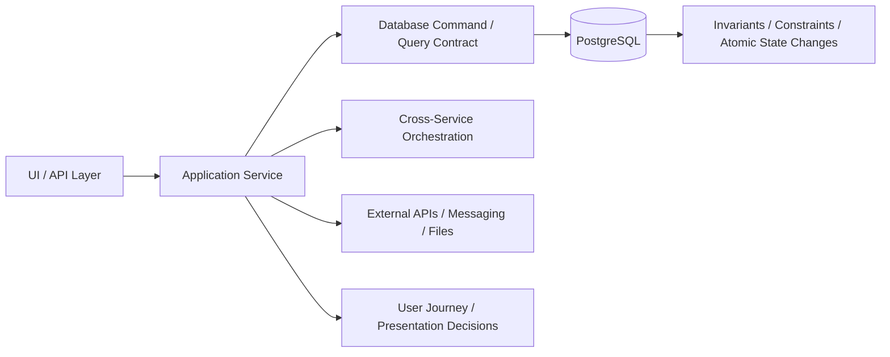
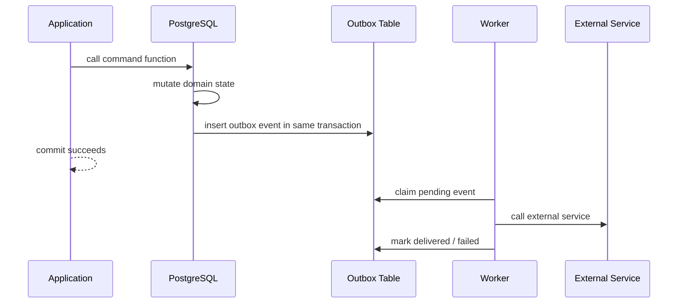
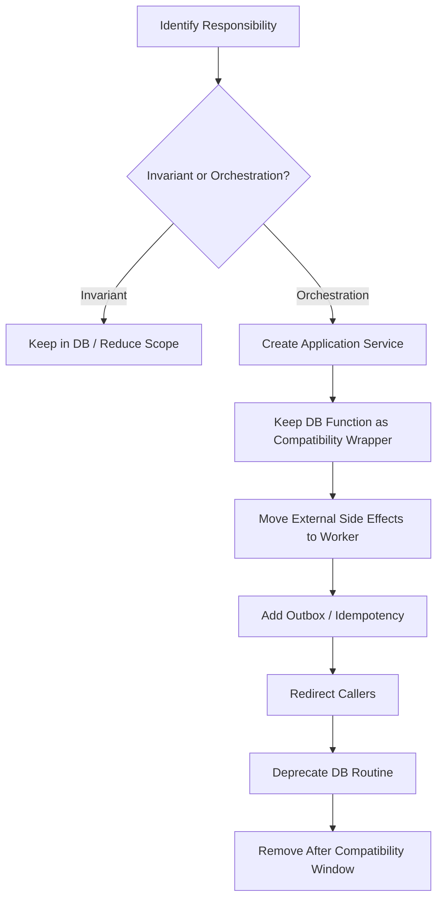
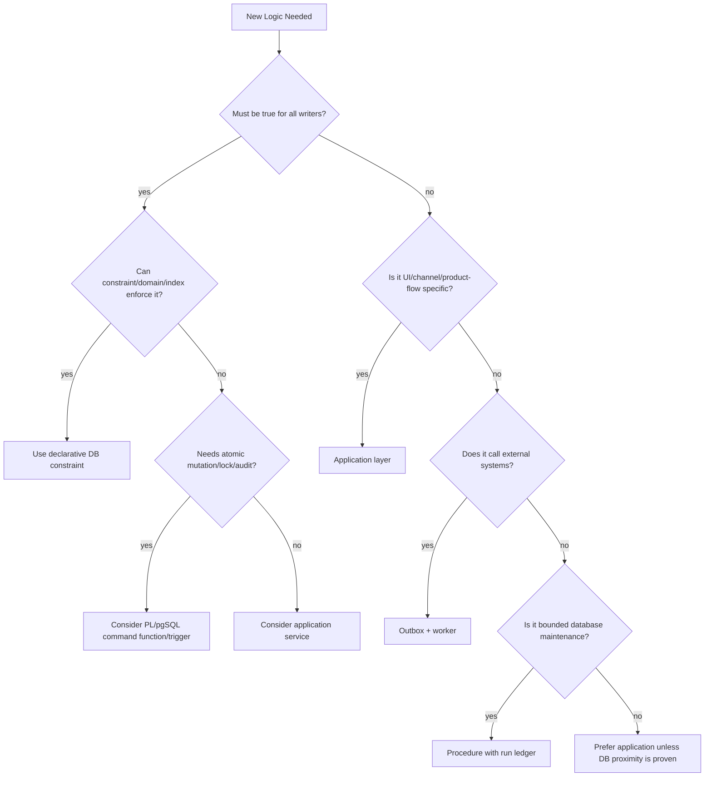

# Part 038 — Anti-Patterns: When Not to Use PL/pgSQL and Application Boundaries

> Goal: learn the architectural boundary of PL/pgSQL. Top engineers do not merely know how to write database-side code. They know when database-side code strengthens correctness and when it turns into hidden coupling, operational opacity, and scaling drag.

PL/pgSQL is a sharp tool.

It is excellent for some jobs.

It is a poor substitute for others.

The strongest PL/pgSQL systems usually share a property:

They keep database-side logic close to data invariants, atomic mutation, auditability, and controlled operational automation.

The weakest PL/pgSQL systems usually share the opposite property:

They use the database as an invisible application server.

This part is about boundaries.

Not because boundaries are fashionable.

Because boundaries are how systems stay understandable under growth.

---

## 1. The Core Boundary

A simple mental model:



Use PL/pgSQL when the logic is tightly coupled to:

- database state,
- transaction atomicity,
- constraints,
- row locking,
- audit trail,
- data repair,
- batch mutation,
- state transition guardrails,
- security boundary near data.

Avoid PL/pgSQL when the logic is primarily about:

- UI flow,
- network calls,
- external service orchestration,
- long-running human workflow,
- complex feature flag behavior,
- application-specific personalization,
- cross-domain choreography,
- large CPU-heavy computation,
- unbounded batch processing,
- logic that needs normal software observability and deployment ergonomics.

The database should be the system of record.

It should not secretly become the entire system.

---

## 2. Decision Matrix

| Need | Best First Tool | PL/pgSQL Role |
|---|---|---|
| Single-row invariant | Constraint / domain / generated column | helper or custom error wrapper only if needed |
| Cross-row invariant in same table | Constraint, exclusion constraint, transaction lock | enforce transition/mutation atomically |
| Multi-table atomic command | SQL transaction + PL/pgSQL command function | good fit if boundary is stable |
| Data-change audit | Trigger + audit table | good fit if bounded and observable |
| Derived counter/cache | Trigger or async refresh | use carefully; watch contention |
| Background database maintenance | Procedure/job worker | good fit with ledger and limits |
| External API call | Application worker | PL/pgSQL should not call external network directly |
| Email/SMS/notification | Outbox + app worker | PL/pgSQL writes outbox row only |
| Long business workflow | Application/workflow engine | PL/pgSQL validates state transitions |
| UI-specific validation | Application | PL/pgSQL enforces final data invariant only |
| Reporting API returning huge data | SQL/view/materialized view/export pipeline | PL/pgSQL only for small orchestration if needed |
| Dynamic tenant-specific logic | Application/config engine | PL/pgSQL only for stable data guardrails |
| Security-sensitive data access | RLS/views/security-definer functions | good fit if privilege boundary is explicit |

A useful heuristic:

If the rule must be true no matter which caller touches the data, the database is a strong candidate.

If the rule changes depending on user journey, channel, product experiment, or external service response, application code is usually better.

---

## 3. Good PL/pgSQL Use Cases

### 3.1 Atomic Command Function

Example:

```sql
select enforcement.transition_case(
  p_case_id       => 'c-123',
  p_expected_from => 'under_review',
  p_target_status => 'escalated',
  p_reason_code   => 'SLA_BREACH',
  p_request_id    => 'req-789'
);
```

This is a good fit when:

- it locks exactly the row whose state is changing,
- validates transition policy,
- inserts transition event,
- writes audit/outbox row,
- returns stable outcome,
- is idempotent or duplicate-safe,
- uses SQLSTATE contract.

Why PL/pgSQL works here:

The invariant and mutation are close to data.

### 3.2 Audit Trigger

Good fit when:

- audit is required for all writers,
- direct table writes are allowed only through known routes,
- audit volume is bounded or partitioned,
- audit event is queryable,
- trigger recursion is controlled.

### 3.3 Database Maintenance Procedure

Good fit when:

- it operates on database metadata,
- it creates partitions,
- it validates catalog drift,
- it runs bounded chunks,
- it writes a run ledger.

### 3.4 Policy Enforcement Near Data

Good fit when:

- multiple services write the same table,
- you need final-line defense,
- mistakes would corrupt core state,
- enforcement needs row locks or constraints.

### 3.5 Security Boundary

Good fit when:

- users need controlled access to data they cannot directly modify,
- privilege escalation is intentional and reviewed,
- `SECURITY DEFINER` is hardened,
- `search_path` is fixed,
- grants are explicit.

---

## 4. Bad PL/pgSQL Use Cases

### 4.1 Database as Application Server

Bad smell:

```sql
select app.render_customer_homepage(p_user_id);
```

Symptoms:

- function contains UI branching,
- feature flags are embedded in SQL,
- response shape changes frequently,
- business experiments require database deployment,
- application engineers cannot reason about behavior without reading database functions.

Why bad:

The database becomes a deployment bottleneck and hides product behavior from the application layer.

### 4.2 Trigger Spiderweb

Bad smell:

```txt
insert into A
  -> trigger updates B
    -> trigger inserts C
      -> trigger updates A
        -> trigger writes outbox
          -> trigger recalculates summary
```

Symptoms:

- one write causes many invisible writes,
- debugging requires reading many trigger definitions,
- order matters but is not obvious,
- test setup is fragile,
- manual repair accidentally fires side effects,
- performance depends on hidden logic.

Trigger logic should be shallow, documented, and discoverable.

### 4.3 Hidden External Side Effects

Bad smell:

- function sends email,
- function calls HTTP API via extension,
- trigger invokes network operation,
- database transaction waits on external system.

Why bad:

Database transactions should not depend on unpredictable external services.

Use outbox pattern:



PL/pgSQL writes the intent.

The worker performs the side effect.

### 4.4 Exception Swallowing

Bad smell:

```sql
begin
  perform critical_mutation();
exception
  when others then
    return false;
end;
```

Why bad:

- hides SQLSTATE,
- breaks transaction semantics,
- makes retry impossible to classify,
- loses diagnostics,
- may produce partial domain assumptions.

Better:

- catch expected exceptions only,
- translate to domain SQLSTATE,
- preserve diagnostics,
- re-raise unknown failures.

### 4.5 Row-by-Row Procedural Processing

Bad smell:

```sql
for r in select * from invoice where status = 'open'
loop
  update invoice
  set status = 'overdue'
  where invoice_id = r.invoice_id;
end loop;
```

Better:

```sql
update invoice
set status = 'overdue'
where status = 'open'
  and due_at < clock_timestamp();
```

Use loops when each item needs truly different logic, bounded side effects, or per-item isolation.

Do not use loops because they feel familiar from application code.

### 4.6 Dynamic SQL as a Template Engine

Bad smell:

- routine generates arbitrary business queries,
- identifiers come from user input,
- SQL text becomes unreadable,
- query shapes explode,
- permissions are unclear.

Dynamic SQL is for metadata-driven operations and controlled polymorphism.

It is not a replacement for application query builders.

### 4.7 Giant Reporting Functions

Bad smell:

```sql
select * from reporting.generate_everything_for_dashboard(:tenant_id);
```

Symptoms:

- returns thousands/millions of rows,
- mixes filtering, authorization, formatting, aggregation, pagination,
- changes frequently with UI needs,
- hard to cache,
- hard to profile.

Better options:

- well-designed SQL views,
- materialized views,
- OLAP/reporting store,
- application pagination,
- export pipeline,
- small stable query functions for reusable domain calculations.

### 4.8 `SECURITY DEFINER` as Shortcut

Bad smell:

```sql
create function do_anything_admin(...)
returns void
language plpgsql
security definer
as $$
begin
  execute p_sql;
end;
$$;
```

Why bad:

This is a privilege escalation engine.

Security-definer functions should be narrow, allow-listed, schema-qualified, and reviewed.

### 4.9 Transaction Control Confusion

Bad smell:

- developer expects `BEGIN ... END` block to start a transaction,
- function tries to commit partial progress,
- trigger assumes it can commit independently,
- procedure is called through a context where transaction control is invalid.

PL/pgSQL block structure is not database transaction control.

Function and trigger work runs inside the caller's transaction context.

Procedures can use transaction control only in valid call contexts.

### 4.10 Mutable Business Rules Hidden in Function Body

Bad smell:

```sql
if p_amount > 100000 then
  v_required_approval := 'director';
end if;
```

This may be fine for stable invariants.

It is poor for frequently changing policy.

Better:

- policy table with effective dates,
- versioned rule registry,
- application policy engine,
- workflow configuration.

The database can enforce the selected policy.

It does not need to hardcode every product rule.

---

## 5. Boundary Patterns

### 5.1 Command Function Boundary

Use for atomic domain mutation.

```sql
create or replace function enforcement.transition_case(
  p_case_id uuid,
  p_expected_status text,
  p_target_status text,
  p_reason_code text,
  p_request_id text
)
returns table (
  case_id uuid,
  old_status text,
  new_status text,
  transition_event_id bigint
)
language plpgsql
as $$
begin
  -- validate idempotency
  -- lock case row
  -- validate transition
  -- update case
  -- insert event
  -- return outcome
end;
$$;
```

Boundary rule:

Application decides when to attempt transition.

Database decides whether the transition is valid at commit-time state.

### 5.2 Query Function Boundary

Use for stable reusable read contracts.

```sql
create or replace function enforcement.case_summary(p_case_id uuid)
returns table (
  case_id uuid,
  status text,
  risk_level text,
  open_days integer,
  latest_event_at timestamptz
)
language sql
stable
as $$
  select
    c.case_id,
    c.status,
    c.risk_level,
    extract(day from clock_timestamp() - c.opened_at)::integer,
    max(e.occurred_at)
  from enforcement.enforcement_case c
  left join enforcement.case_event e on e.case_id = c.case_id
  where c.case_id = p_case_id
  group by c.case_id, c.status, c.risk_level, c.opened_at
$$;
```

Boundary rule:

Prefer SQL functions/views for pure query composition.

Use PL/pgSQL only when procedural control materially improves clarity.

### 5.3 Trigger Guardrail Boundary

Use triggers for universal enforcement.

Good trigger responsibilities:

- prevent illegal direct mutation,
- stamp metadata,
- insert audit row,
- maintain small derived field,
- enforce transition entry point.

Bad trigger responsibilities:

- call external systems,
- orchestrate multi-step workflow,
- run large report refresh,
- hide product behavior,
- mutate many unrelated domains.

### 5.4 Procedure Boundary

Use procedures for bounded operational workflows.

Good:

- partition maintenance,
- staged import apply,
- backfill in chunks,
- archival process,
- repair workflow with run ledger.

Bad:

- long-lived product journey,
- human approval flow,
- cross-service saga,
- unbounded `while true` worker loop without external supervision.

### 5.5 Outbox Boundary

Use PL/pgSQL to write durable side-effect intent.

Do not perform the side effect inside the database transaction.

```sql
insert into integration.outbox_event (
  aggregate_type,
  aggregate_id,
  event_type,
  payload,
  idempotency_key
) values (
  'case',
  p_case_id::text,
  'case.escalated',
  jsonb_build_object('case_id', p_case_id, 'reason_code', p_reason_code),
  p_request_id
)
on conflict (idempotency_key) do nothing;
```

This pattern preserves atomic intent and keeps external IO out of the database.

---

## 6. Function vs Procedure vs Trigger vs Application Service

| Dimension | Function | Procedure | Trigger | Application Service |
|---|---|---|---|---|
| Explicit caller | yes | yes | no, fires from data change | yes |
| Return data | yes | limited | no direct caller result | yes |
| Transaction control | no normal commit/rollback inside function | possible in valid contexts | no independent commit | yes, via DB transaction boundaries |
| Good for | atomic command/query | maintenance/batch orchestration | universal data guardrail | external workflow and user journey |
| Risk | overused as API server | unbounded operational workflow | hidden side effects | weak final data invariant |
| Observability | function stats + custom events | run ledger + logs | trigger audit/events | normal app tracing |

The question is not:

> Can PL/pgSQL do this?

The real question is:

> Is PL/pgSQL the right boundary for this responsibility?

---

## 7. Signs Logic Belongs in PL/pgSQL

Green-light signals:

- the logic must run for every writer,
- the invariant depends on current database state,
- correctness requires row locks or constraints,
- mutation and audit must be atomic,
- multiple applications write the same data,
- direct table access must be constrained,
- failure should abort the transaction,
- the rule is stable and domain-level,
- the result contract is small and stable,
- operational ownership exists.

Examples:

- enforcing case transition rules,
- preventing overlapping effective-date policies,
- writing audit event for every update,
- claiming queue tasks with `SKIP LOCKED`,
- applying staged import after validation,
- creating future partitions,
- wrapping privileged update in narrow security-definer function.

---

## 8. Signs Logic Belongs Outside PL/pgSQL

Red-light signals:

- the rule changes weekly,
- the behavior is UI-specific,
- the operation calls external services,
- the workflow spans many minutes/hours/days,
- human approvals drive flow,
- the result is a large application DTO,
- logic needs feature experimentation,
- the code needs rich library ecosystem,
- debugging requires step-through tooling,
- scaling requires independent service capacity,
- ownership sits with application/product team, not database/platform team,
- rollback must be decoupled from database deployment.

Examples:

- onboarding journey,
- notification delivery,
- pricing experiment orchestration,
- fraud model inference,
- document rendering,
- email template selection,
- third-party API retry choreography,
- UI dashboard composition.

---

## 9. Boundary Failure Modes

### 9.1 Split-Brain Business Logic

Same rule exists in app and PL/pgSQL, but slightly different.

Symptom:

- app accepts action,
- database rejects it,
- users see confusing errors,
- engineers patch whichever layer they touched last.

Better:

- app performs advisory validation for UX,
- database enforces final invariant,
- shared error contract maps SQLSTATE to user-facing message.

### 9.2 Invisible Mutation Path

A table can be mutated by:

- application SQL,
- function,
- trigger,
- migration,
- manual support script,
- batch job.

But no one knows all paths.

Better:

- command functions for core writes,
- limited direct grants,
- trigger guardrail for disallowed direct update,
- catalog inventory of routines/triggers,
- audit event for mutation source.

### 9.3 Operational Coupling

A database deploy now changes product behavior immediately for all application versions.

This breaks rolling deploy compatibility.

Better:

- compatibility wrappers,
- versioned functions,
- policy version column,
- application rollout windows,
- feature flag outside function body when behavior is product-driven.

### 9.4 Security Coupling

A function is created as `SECURITY DEFINER` to make permission errors go away.

Now every caller can do more than intended.

Better:

- define exact operation,
- allow-list input,
- schema-qualify objects,
- set safe `search_path`,
- grant execute narrowly,
- audit calls.

### 9.5 Data-Correctness Theater

A function validates inputs but direct table writes bypass it.

Better:

- use constraints where possible,
- revoke direct writes,
- enforce command boundary,
- use trigger guardrails only if needed.

---

## 10. Refactoring Out of PL/pgSQL

Sometimes PL/pgSQL code should move out.

Migration pattern:



Steps:

1. Inventory callers.
2. Characterize behavior with tests.
3. Separate invariant from orchestration.
4. Keep invariant in database if it protects data.
5. Move external workflow to application/worker.
6. Use outbox for side-effect intent.
7. Keep compatibility wrapper temporarily.
8. Add deprecation logging.
9. Remove only after caller inventory is clean.

Example before:

```sql
create or replace function case_mgmt.close_case_and_notify(...)
returns void
language plpgsql
as $$
begin
  -- validate case transition
  -- update case
  -- insert audit
  -- call notification extension / write external side effect
  -- update UI-specific status
end;
$$;
```

After:

- `enforcement.close_case(...)` validates and mutates database state,
- function writes `case.closed` outbox event,
- application worker sends notification,
- UI status is computed in application/read model.

---

## 11. Refactoring Into PL/pgSQL

Sometimes application code should move closer to data.

Signs:

- multiple services duplicate mutation logic,
- direct SQL writes bypass invariants,
- race conditions appear under concurrency,
- audit events are inconsistent,
- application check-then-update creates bugs,
- permission model is too broad.

Migration pattern:

1. Define command contract.
2. Create database function with strict SQLSTATE errors.
3. Implement row lock / constraint-backed mutation.
4. Add audit/outbox atomically.
5. Update one caller.
6. Revoke direct table mutation where feasible.
7. Add trigger guardrail for remaining direct writes.
8. Monitor rejection/error rates.
9. Migrate remaining callers.

Example:

Application code before:

```txt
GET case
if status == under_review:
  UPDATE case set status = escalated
  INSERT event
else:
  return error
```

Problem:

Two callers can race.

Database command after:

```sql
select enforcement.transition_case(
  p_case_id,
  p_expected_status := 'under_review',
  p_target_status := 'escalated',
  p_reason_code := 'SLA_BREACH',
  p_request_id := :request_id
);
```

The command locks, validates, mutates, audits, and returns one authoritative result.

---

## 12. Review Heuristics

Ask these questions during design review.

### 12.1 Responsibility

- Is this a data invariant or an application workflow?
- Must this rule be true for all writers?
- Is the rule stable enough for database deployment cadence?
- Is the function becoming a hidden application endpoint?

### 12.2 Coupling

- Which services call this?
- Can application and database deploy independently?
- Is return shape stable?
- Does the routine know too much about UI or channel?

### 12.3 Transaction

- Does this need atomicity with data mutation?
- Does it depend on external systems?
- Can it be retried safely?
- What happens if it runs twice?

### 12.4 Performance

- Is work set-based?
- Is batch size bounded?
- Is result size bounded?
- Are locks predictable?
- Can we benchmark realistic concurrency?

### 12.5 Operability

- Is there a runbook?
- Are failures visible?
- Are SQLSTATEs meaningful?
- Is there an owner?
- Is rollback possible?

### 12.6 Security

- Are privileges narrow?
- Does `SECURITY DEFINER` have a concrete reason?
- Is `search_path` safe?
- Can user input influence identifiers or SQL text?

---

## 13. Anti-Pattern Catalog

| Anti-Pattern | Symptom | Better Alternative |
|---|---|---|
| God function | one function does validation, workflow, reporting, side effects | split command, outbox, app orchestration |
| Trigger spiderweb | one write causes invisible chain | shallow triggers, explicit command functions |
| Hidden external IO | database waits on network | outbox + worker |
| Dynamic SQL free-for-all | arbitrary identifiers/text | allow-list + `EXECUTE ... USING` |
| Swallowed exception | errors return false/null | SQLSTATE contract + diagnostics |
| Giant report function | huge result DTO | views/materialized views/reporting pipeline |
| Security definer shortcut | broad privileged routine | narrow security-definer wrapper |
| Row-by-row loop | procedural update over many rows | set-based SQL or bounded chunks |
| Hardcoded volatile policy | frequent DB deploys for rule changes | policy table/versioning/application config |
| Direct update bypass | function validation can be skipped | constraints/grants/trigger guardrail |
| No owner | nobody knows behavior | routine ownership registry |
| No runbook | incidents become guesswork | operational contract |
| Silent audit coupling | audit incomplete or noisy | explicit audit design |
| Unbounded procedure | long locks, unclear progress | chunking + run ledger |
| Overloaded API functions | ambiguous resolution and callers | versioned names/contracts |

---

## 14. Concrete Boundary Examples

### 14.1 Case Transition

Good database responsibility:

- validate current status,
- lock case row,
- enforce allowed transition,
- update status,
- write transition event,
- write outbox event.

Good application responsibility:

- decide button visibility,
- collect user reason,
- call command,
- map SQLSTATE to message,
- orchestrate notification UX,
- render timeline.

### 14.2 Payment Capture

Good database responsibility:

- store payment intent,
- enforce idempotency key,
- record state transition,
- write outbox event.

Good application/worker responsibility:

- call PSP API,
- handle network retries,
- parse PSP response,
- apply callback/webhook,
- manage secret credentials.

### 14.3 Regulatory Escalation

Good database responsibility:

- identify due candidates,
- claim bounded tasks,
- enforce transition legality,
- write audit event.

Good scheduler/worker responsibility:

- run periodically,
- control concurrency,
- handle retry/backoff,
- emit operational metrics.

### 14.4 Tenant Access

Good database responsibility:

- enforce row-level visibility,
- provide security-definer wrapper for narrow operation,
- prevent cross-tenant mutation.

Good application responsibility:

- authenticate user,
- resolve tenant membership,
- set session context,
- present authorization errors.

---

## 15. The “Should This Be PL/pgSQL?” Algorithm

Use this as a first-pass decision tree:



This tree is intentionally conservative.

Putting code into the database should be a design decision, not a reflex.

---

## 16. Practical Rules of Thumb

### Rule 1 — Prefer Declarative Before Procedural

Before PL/pgSQL, ask:

- can a `NOT NULL` constraint solve this?
- can a `CHECK` constraint solve this?
- can a foreign key solve this?
- can a unique index solve this?
- can an exclusion constraint solve this?
- can a generated column solve this?

Declarative constraints are easier to reason about than procedural logic.

### Rule 2 — Keep Functions Narrow

A good command function often has one verb:

- `transition_case`,
- `claim_task`,
- `apply_import_batch`,
- `create_future_partition`,
- `record_audit_event`.

A bad function name often reveals scope creep:

- `process_everything`,
- `sync_all_data`,
- `handle_user_flow`,
- `do_business_logic`,
- `update_status_and_send_notifications_and_recalculate_dashboard`.

### Rule 3 — Keep Side Effects Transactional or External, Not Both

Inside database transaction:

- mutate database state,
- insert audit event,
- insert outbox event.

Outside database transaction:

- send email,
- call API,
- publish to non-transactional broker,
- render document.

### Rule 4 — Make Hidden Execution Visible

Triggers are hidden execution.

If you use them:

- document them,
- inventory them,
- test them,
- keep them shallow,
- make them observable.

### Rule 5 — Avoid “Because It Is Faster” as the Only Reason

PL/pgSQL may reduce network round trips.

That is not enough.

Correct placement depends on:

- correctness,
- ownership,
- observability,
- deployment cadence,
- security,
- concurrency,
- long-term maintainability.

### Rule 6 — Every PL/pgSQL API Needs a Versioning Story

If applications call it, it is an API.

APIs need:

- stable signature,
- stable return contract,
- stable SQLSTATE contract,
- compatibility window,
- deprecation path.

---

## 17. Boundary Checklist

```md
## PL/pgSQL Boundary Review

### Why Database?
- [ ] The logic protects a data invariant.
- [ ] The logic needs atomic mutation with database state.
- [ ] The logic benefits from row locks/constraints.
- [ ] The logic must apply to all writers.
- [ ] Declarative constraints alone are insufficient.

### Why Not Application?
- [ ] It is not UI-specific.
- [ ] It does not call external services.
- [ ] It does not require rich library ecosystem.
- [ ] It does not represent long-running human workflow.
- [ ] It does not change at product-experiment cadence.

### Function Shape
- [ ] Name is narrow and verb-oriented.
- [ ] Inputs are stable.
- [ ] Return contract is stable.
- [ ] Error contract is stable.
- [ ] Result size is bounded.

### Safety
- [ ] Work is set-based or intentionally chunked.
- [ ] Locks are predictable.
- [ ] Row effects are checked.
- [ ] Idempotency/retry behavior is defined.
- [ ] Unknown exceptions are not swallowed.

### Visibility
- [ ] Callers are known.
- [ ] Logs/events are meaningful.
- [ ] Stats can be inspected.
- [ ] Runbook exists.
- [ ] Owner exists.

### Lifecycle
- [ ] Deployment is compatible with application rollout.
- [ ] Rollback path exists.
- [ ] Grants/search_path/security are reviewed.
- [ ] Deprecation path exists if function becomes obsolete.
```

---

## 18. Exercises

### Exercise 1 — Classify Existing Logic

Take ten PL/pgSQL routines from a real database.

Classify each as:

- invariant enforcement,
- command function,
- query helper,
- trigger guardrail,
- audit capture,
- maintenance procedure,
- orchestration smell,
- reporting smell,
- security boundary,
- unknown.

For every `unknown`, find callers and decide ownership.

### Exercise 2 — Find Trigger Spiderwebs

Run a trigger inventory query.

```sql
select
  event_object_schema,
  event_object_table,
  trigger_name,
  action_timing,
  event_manipulation,
  action_statement
from information_schema.triggers
order by event_object_schema, event_object_table, trigger_name;
```

Pick one table with multiple triggers.

Draw the mutation chain.

Then decide whether any trigger should become explicit command logic.

### Exercise 3 — Extract External Side Effects

Find one function/procedure that implies external side effect.

Refactor design to:

- perform database mutation,
- insert outbox event,
- process event with worker,
- record delivery status,
- retry idempotently.

### Exercise 4 — Constraint Before Function

Find one PL/pgSQL validation rule.

Ask whether it can become:

- `NOT NULL`,
- `CHECK`,
- foreign key,
- unique index,
- exclusion constraint,
- generated column.

Keep PL/pgSQL only where declarative enforcement cannot express the rule clearly.

### Exercise 5 — Boundary Decision Record

Write an ADR for one PL/pgSQL function:

```md
# ADR: Use PL/pgSQL for <routine>

## Context

## Decision

## Why database-side?

## Why not application-side?

## Invariants protected

## Operational contract

## Risks

## Alternatives rejected

## Rollback / migration plan
```

This exercise is valuable because weak boundary decisions become obvious when written down.

---

## 19. Final Mental Model

PL/pgSQL is not “business logic in the database” by default.

It is database-side procedural code.

That distinction matters.

Use it where database proximity creates real leverage:

- atomicity,
- constraints,
- locks,
- auditability,
- idempotency,
- security boundary,
- metadata-driven maintenance.

Avoid it where database proximity creates accidental coupling:

- UI flow,
- external orchestration,
- product experimentation,
- giant reporting DTOs,
- unbounded background work,
- hidden side effects.

The mature stance is not anti-PL/pgSQL or pro-PL/pgSQL.

The mature stance is boundary-aware.

A top engineer can explain not only how the function works, but why it belongs there.

---

## References

- PostgreSQL Documentation — PL/pgSQL: https://www.postgresql.org/docs/current/plpgsql.html
- PostgreSQL Documentation — Trigger Functions: https://www.postgresql.org/docs/current/plpgsql-trigger.html
- PostgreSQL Documentation — Overview of Trigger Behavior: https://www.postgresql.org/docs/current/trigger-definition.html
- PostgreSQL Documentation — `CREATE FUNCTION`: https://www.postgresql.org/docs/current/sql-createfunction.html
- PostgreSQL Documentation — Function Volatility Categories: https://www.postgresql.org/docs/current/xfunc-volatility.html
- PostgreSQL Documentation — PL/pgSQL Transaction Management: https://www.postgresql.org/docs/current/plpgsql-transactions.html
- PostgreSQL Documentation — Explicit Locking: https://www.postgresql.org/docs/current/explicit-locking.html
