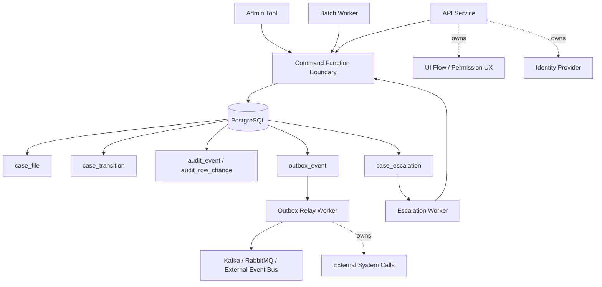
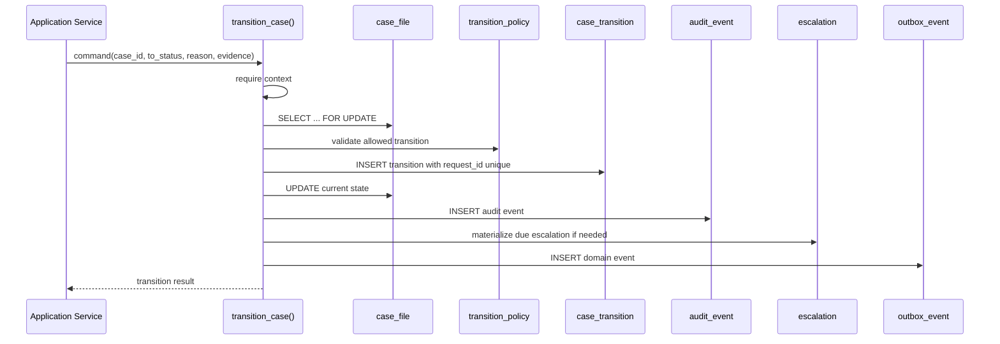
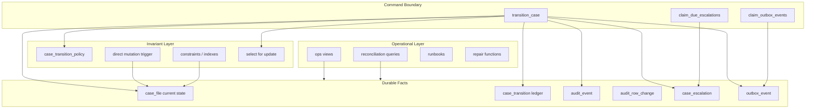

# Part 039 — Enterprise Case Study: Compliance Case Management Engine

> Goal: integrate the previous parts into one coherent production-grade design: a compliance case-management engine whose core invariants are enforced close to the data, whose workflow transitions are auditable, whose escalations are deterministic, and whose operational behavior is observable.

This part is not a toy example.

It is a compressed internal-engineering case study.

We will build the database-side core of a compliance case engine. The application layer still owns UI, user journey, API authentication, external integrations, document rendering, notifications, and long-running orchestration. PL/pgSQL owns the parts that must be atomic, durable, auditable, concurrency-safe, and defensible.

The domain:

- A regulated organization receives signals that may become cases.
- Cases have lifecycle states.
- State transitions require reason codes and sometimes evidence.
- Direct table updates must not bypass transition rules.
- Changes must be auditable.
- Certain states trigger deadlines and escalations.
- External systems must receive events through an outbox.
- API retries must not duplicate transitions.
- Operators need runbooks and repair functions.

The core lesson:

**PL/pgSQL should not become the whole workflow engine. It should become the transactionally correct kernel of the workflow.**

---

## 1. System Boundary

Start by drawing a hard line around what the database-side engine does.



PL/pgSQL owns:

- atomic state transitions,
- row-level invariant enforcement,
- transition audit,
- idempotency claim,
- escalation due-date materialization,
- outbox write in the same transaction,
- direct mutation prevention,
- repair routines with explicit run metadata,
- operational evidence.

Application services own:

- HTTP/API protocol,
- authentication and session handling,
- coarse authorization policy,
- UI journey,
- external service calls,
- message publishing from outbox,
- long-running human workflow,
- notification templates,
- document storage,
- feature flags.

Why this split?

Because the riskiest domain invariant is not “which React page should open after submit”. The riskiest invariant is:

> A case must never move from one regulated lifecycle state to another without a valid actor, reason, policy version, audit record, and event lineage.

That invariant belongs near the data.

---

## 2. Minimal Domain Model

We will use schemas to separate application tables, audit tables, and secure routines.

```sql
create schema if not exists compliance;
create schema if not exists compliance_audit;
create schema if not exists compliance_private;
create schema if not exists compliance_ops;
```

A real platform would use migrations, ownership roles, grants, and default privileges. Here we keep DDL readable.

### 2.1 Enumerated States

Enums are convenient for stable lifecycle values. If states change often or are tenant-configurable, use lookup tables instead. For a regulated case engine, the top-level lifecycle is usually stable enough.

```sql
create type compliance.case_status as enum (
  'draft',
  'intake_review',
  'open',
  'waiting_for_evidence',
  'under_investigation',
  'pending_decision',
  'resolved',
  'closed',
  'rejected',
  'cancelled'
);

create type compliance.case_severity as enum (
  'low',
  'medium',
  'high',
  'critical'
);
```

The first mistake in many systems is treating status as a label.

Status is not a label.

Status is a contract.

It determines:

- allowed commands,
- required evidence,
- SLA clocks,
- visible actions,
- downstream events,
- reporting semantics,
- legal interpretation.

### 2.2 Case Table

```sql
create table compliance.case_file (
  case_id             uuid primary key default gen_random_uuid(),
  case_number         text not null unique,
  tenant_id           uuid not null,
  subject_ref         text not null,
  status              compliance.case_status not null default 'draft',
  severity            compliance.case_severity not null default 'medium',
  assigned_team       text,
  assigned_user_id    uuid,
  opened_at           timestamptz,
  resolved_at         timestamptz,
  closed_at           timestamptz,
  current_policy_code text not null,
  current_policy_version integer not null,
  created_by          uuid not null,
  created_at          timestamptz not null default clock_timestamp(),
  updated_by          uuid not null,
  updated_at          timestamptz not null default clock_timestamp(),
  row_version         bigint not null default 1,
  metadata            jsonb not null default '{}'::jsonb,
  constraint case_file_number_shape_chk
    check (case_number ~ '^CASE-[0-9]{8}-[0-9]{6}$'),
  constraint case_file_resolved_time_chk
    check (
      (status not in ('resolved', 'closed') and resolved_at is null)
      or
      (status in ('resolved', 'closed') and resolved_at is not null)
    ),
  constraint case_file_closed_time_chk
    check (
      (status <> 'closed' and closed_at is null)
      or
      (status = 'closed' and closed_at is not null)
    )
);
```

A few design choices matter:

- `status` is a materialized current state for fast query and locking.
- `row_version` gives application services optimistic-concurrency feedback.
- `metadata` exists for extension data, not core lifecycle semantics.
- Timestamps are not arbitrary fields. They are lifecycle facts.
- `current_policy_code` and `current_policy_version` preserve the policy context used for current lifecycle state.

Do not hide all lifecycle history inside JSON.

The current row answers “what is true now”.

The transition table answers “how did it become true”.

### 2.3 Transition Ledger

```sql
create table compliance.case_transition (
  transition_id       uuid primary key default gen_random_uuid(),
  case_id             uuid not null references compliance.case_file(case_id),
  tenant_id           uuid not null,
  from_status         compliance.case_status not null,
  to_status           compliance.case_status not null,
  command_name        text not null,
  reason_code         text not null,
  reason_text         text,
  evidence_ref        text,
  policy_code         text not null,
  policy_version      integer not null,
  actor_user_id       uuid not null,
  actor_role          text not null,
  request_id          text not null,
  causation_id        uuid,
  correlation_id      text not null,
  occurred_at         timestamptz not null default clock_timestamp(),
  metadata            jsonb not null default '{}'::jsonb,
  constraint case_transition_request_once_uq unique (tenant_id, request_id),
  constraint case_transition_real_change_chk check (from_status <> to_status),
  constraint case_transition_reason_shape_chk check (reason_code ~ '^[A-Z0-9_]{3,64}$')
);

create index case_transition_case_time_idx
  on compliance.case_transition (case_id, occurred_at desc);

create index case_transition_tenant_time_idx
  on compliance.case_transition (tenant_id, occurred_at desc);
```

The unique constraint on `(tenant_id, request_id)` is the idempotency line.

Retrying the same command must not generate a second transition.

### 2.4 Transition Policy Table

Hardcoding every transition inside a function is easy at first. It becomes painful when policy changes. A better pattern is to keep the stable algorithm in PL/pgSQL and place configurable transition rules in data.

```sql
create table compliance.case_transition_policy (
  policy_code            text not null,
  policy_version         integer not null,
  from_status            compliance.case_status not null,
  to_status              compliance.case_status not null,
  command_name           text not null,
  min_actor_role         text not null,
  reason_required        boolean not null default true,
  evidence_required      boolean not null default false,
  allowed_severities     compliance.case_severity[] not null default array['low','medium','high','critical']::compliance.case_severity[],
  opens_case             boolean not null default false,
  resolves_case          boolean not null default false,
  closes_case            boolean not null default false,
  creates_escalation     boolean not null default false,
  escalation_after       interval,
  is_active              boolean not null default true,
  created_at             timestamptz not null default clock_timestamp(),
  primary key (policy_code, policy_version, from_status, to_status, command_name),
  constraint escalation_interval_required_chk
    check ((creates_escalation = false and escalation_after is null)
       or  (creates_escalation = true and escalation_after is not null))
);
```

This table is not a complete policy engine.

That is intentional.

A production case engine should not allow arbitrary user-defined expressions inside the database unless you are ready to own a full policy runtime. The table captures relatively static transition metadata. More complex authorization or human-process rules can stay in application services or a dedicated policy service.

### 2.5 Escalation Table

```sql
create type compliance.escalation_status as enum (
  'scheduled',
  'claimed',
  'completed',
  'cancelled',
  'failed'
);

create table compliance.case_escalation (
  escalation_id       uuid primary key default gen_random_uuid(),
  case_id             uuid not null references compliance.case_file(case_id),
  tenant_id           uuid not null,
  transition_id       uuid not null references compliance.case_transition(transition_id),
  escalation_type     text not null,
  due_at              timestamptz not null,
  status              compliance.escalation_status not null default 'scheduled',
  claimed_by          text,
  claimed_at          timestamptz,
  completed_at        timestamptz,
  failure_message     text,
  created_at          timestamptz not null default clock_timestamp(),
  updated_at          timestamptz not null default clock_timestamp(),
  constraint one_scheduled_escalation_per_case_type_uq
    unique (case_id, escalation_type, status)
    deferrable initially immediate
);

create index case_escalation_due_idx
  on compliance.case_escalation (due_at, escalation_id)
  where status = 'scheduled';
```

The uniqueness constraint as written has a subtle caveat: it allows only one row per `(case_id, escalation_type, status)`, including completed rows. In many production systems you want “only one scheduled escalation”, not only one forever. PostgreSQL partial unique indexes are usually the better fit:

```sql
create unique index case_escalation_one_scheduled_uq
  on compliance.case_escalation (case_id, escalation_type)
  where status = 'scheduled';
```

Prefer partial unique index when the invariant is conditional.

### 2.6 Outbox Table

```sql
create type compliance.outbox_status as enum (
  'pending',
  'claimed',
  'published',
  'failed',
  'discarded'
);

create table compliance.outbox_event (
  outbox_id          uuid primary key default gen_random_uuid(),
  tenant_id          uuid not null,
  aggregate_type     text not null,
  aggregate_id       uuid not null,
  event_type         text not null,
  event_version      integer not null,
  payload            jsonb not null,
  causation_id       uuid,
  correlation_id     text not null,
  request_id         text not null,
  status             compliance.outbox_status not null default 'pending',
  publish_attempts   integer not null default 0,
  next_attempt_at    timestamptz not null default clock_timestamp(),
  claimed_by         text,
  claimed_at         timestamptz,
  published_at       timestamptz,
  last_error         text,
  created_at         timestamptz not null default clock_timestamp(),
  constraint outbox_event_version_chk check (event_version > 0),
  constraint outbox_payload_object_chk check (jsonb_typeof(payload) = 'object')
);

create index outbox_pending_idx
  on compliance.outbox_event (next_attempt_at, outbox_id)
  where status = 'pending';
```

Outbox publishing is not performed by PL/pgSQL.

PL/pgSQL writes the outbox row transactionally. A relay worker reads it and talks to the outside world.

This avoids the fatal anti-pattern: making external HTTP/message calls inside database code.

---

## 3. Command Context

The database needs to know the actor and request context. Do not let every function accept twenty context arguments. Use a small explicit context object or session settings.

Session settings can work well when they are set by a trusted application transaction boundary.

```sql
select set_config('app.tenant_id',       '...', true);
select set_config('app.user_id',         '...', true);
select set_config('app.actor_role',      'compliance_analyst', true);
select set_config('app.request_id',      'req-...', true);
select set_config('app.correlation_id',  'corr-...', true);
```

The third argument `true` means local to the current transaction.

Create a helper function to read context defensively.

```sql
create type compliance_private.command_context as (
  tenant_id       uuid,
  user_id         uuid,
  actor_role      text,
  request_id      text,
  correlation_id  text
);

create or replace function compliance_private.require_command_context()
returns compliance_private.command_context
language plpgsql
security definer
set search_path = compliance_private, compliance, pg_temp
as $$
declare
  v_ctx compliance_private.command_context;
begin
  v_ctx.tenant_id := nullif(current_setting('app.tenant_id', true), '')::uuid;
  v_ctx.user_id := nullif(current_setting('app.user_id', true), '')::uuid;
  v_ctx.actor_role := nullif(current_setting('app.actor_role', true), '');
  v_ctx.request_id := nullif(current_setting('app.request_id', true), '');
  v_ctx.correlation_id := nullif(current_setting('app.correlation_id', true), '');

  if v_ctx.tenant_id is null then
    raise exception using
      errcode = 'P4001',
      message = 'missing tenant context',
      hint = 'set app.tenant_id before calling compliance command functions';
  end if;

  if v_ctx.user_id is null then
    raise exception using
      errcode = 'P4002',
      message = 'missing actor context';
  end if;

  if v_ctx.actor_role is null then
    raise exception using
      errcode = 'P4003',
      message = 'missing actor role context';
  end if;

  if v_ctx.request_id is null then
    raise exception using
      errcode = 'P4004',
      message = 'missing idempotency request id';
  end if;

  if v_ctx.correlation_id is null then
    raise exception using
      errcode = 'P4005',
      message = 'missing correlation id';
  end if;

  return v_ctx;
end;
$$;
```

Why `SECURITY DEFINER` here?

Because we may want application roles to execute command functions without direct read/write access to every table. But every security-definer function must harden `search_path`, avoid unsafe dynamic SQL, and keep ownership controlled.

---

## 4. The Transition Function

The transition function is the kernel.

Its job is not to be clever.

Its job is to be explicit, atomic, and reviewable.



Define a result type.

```sql
create type compliance.case_transition_result as (
  transition_id uuid,
  case_id uuid,
  from_status compliance.case_status,
  to_status compliance.case_status,
  status_changed boolean,
  idempotent_replay boolean,
  outbox_id uuid
);
```

Now the function.

```sql
create or replace function compliance.transition_case(
  p_case_id        uuid,
  p_to_status      compliance.case_status,
  p_command_name   text,
  p_reason_code    text,
  p_reason_text    text default null,
  p_evidence_ref   text default null,
  p_metadata       jsonb default '{}'::jsonb
)
returns compliance.case_transition_result
language plpgsql
security definer
set search_path = compliance, compliance_private, compliance_audit, pg_temp
as $$
declare
  v_ctx              compliance_private.command_context;
  v_case             compliance.case_file%rowtype;
  v_policy           compliance.case_transition_policy%rowtype;
  v_transition_id    uuid;
  v_outbox_id        uuid;
  v_result           compliance.case_transition_result;
  v_existing         compliance.case_transition%rowtype;
begin
  v_ctx := compliance_private.require_command_context();

  if p_case_id is null then
    raise exception using errcode = 'P4101', message = 'case_id is required';
  end if;

  if p_to_status is null then
    raise exception using errcode = 'P4102', message = 'to_status is required';
  end if;

  if p_command_name is null or btrim(p_command_name) = '' then
    raise exception using errcode = 'P4103', message = 'command_name is required';
  end if;

  if p_metadata is null or jsonb_typeof(p_metadata) <> 'object' then
    raise exception using errcode = 'P4104', message = 'metadata must be a JSON object';
  end if;

  -- Idempotency check first. If the request already succeeded, return the original result.
  select *
  into v_existing
  from compliance.case_transition ct
  where ct.tenant_id = v_ctx.tenant_id
    and ct.request_id = v_ctx.request_id;

  if found then
    select oe.outbox_id
    into v_outbox_id
    from compliance.outbox_event oe
    where oe.tenant_id = v_ctx.tenant_id
      and oe.request_id = v_ctx.request_id
      and oe.aggregate_id = v_existing.case_id
    order by oe.created_at desc
    limit 1;

    return (
      v_existing.transition_id,
      v_existing.case_id,
      v_existing.from_status,
      v_existing.to_status,
      true,
      true,
      v_outbox_id
    )::compliance.case_transition_result;
  end if;

  select *
  into v_case
  from compliance.case_file cf
  where cf.case_id = p_case_id
    and cf.tenant_id = v_ctx.tenant_id
  for update;

  if not found then
    raise exception using
      errcode = 'P4105',
      message = 'case not found for tenant',
      detail = format('case_id=%s tenant_id=%s', p_case_id, v_ctx.tenant_id);
  end if;

  if v_case.status = p_to_status then
    raise exception using
      errcode = 'P4106',
      message = 'transition target is same as current status',
      detail = format('case_id=%s status=%s', p_case_id, p_to_status);
  end if;

  select *
  into v_policy
  from compliance.case_transition_policy p
  where p.policy_code = v_case.current_policy_code
    and p.policy_version = v_case.current_policy_version
    and p.from_status = v_case.status
    and p.to_status = p_to_status
    and p.command_name = p_command_name
    and p.is_active = true;

  if not found then
    raise exception using
      errcode = 'P4107',
      message = 'transition is not allowed by current policy',
      detail = format(
        'case_id=%s policy=%s/%s from=%s to=%s command=%s',
        p_case_id,
        v_case.current_policy_code,
        v_case.current_policy_version,
        v_case.status,
        p_to_status,
        p_command_name
      );
  end if;

  if not (v_case.severity = any (v_policy.allowed_severities)) then
    raise exception using
      errcode = 'P4108',
      message = 'transition is not allowed for current severity',
      detail = format('case_id=%s severity=%s', p_case_id, v_case.severity);
  end if;

  if v_policy.reason_required and (p_reason_code is null or btrim(p_reason_code) = '') then
    raise exception using
      errcode = 'P4109',
      message = 'reason code is required for transition';
  end if;

  if v_policy.evidence_required and (p_evidence_ref is null or btrim(p_evidence_ref) = '') then
    raise exception using
      errcode = 'P4110',
      message = 'evidence reference is required for transition';
  end if;

  -- In a real system, role hierarchy should not be compared lexically.
  -- Use a role capability table or an application policy decision.
  if v_ctx.actor_role <> v_policy.min_actor_role and v_policy.min_actor_role <> 'any' then
    raise exception using
      errcode = 'P4111',
      message = 'actor role is not allowed to execute transition',
      detail = format('required=%s actual=%s', v_policy.min_actor_role, v_ctx.actor_role);
  end if;

  insert into compliance.case_transition (
    case_id,
    tenant_id,
    from_status,
    to_status,
    command_name,
    reason_code,
    reason_text,
    evidence_ref,
    policy_code,
    policy_version,
    actor_user_id,
    actor_role,
    request_id,
    correlation_id,
    metadata
  ) values (
    v_case.case_id,
    v_case.tenant_id,
    v_case.status,
    p_to_status,
    p_command_name,
    p_reason_code,
    p_reason_text,
    p_evidence_ref,
    v_case.current_policy_code,
    v_case.current_policy_version,
    v_ctx.user_id,
    v_ctx.actor_role,
    v_ctx.request_id,
    v_ctx.correlation_id,
    p_metadata
  )
  returning transition_id into v_transition_id;

  update compliance.case_file cf
  set status = p_to_status,
      opened_at = case when v_policy.opens_case then coalesce(cf.opened_at, clock_timestamp()) else cf.opened_at end,
      resolved_at = case when v_policy.resolves_case then clock_timestamp() else cf.resolved_at end,
      closed_at = case when v_policy.closes_case then clock_timestamp() else cf.closed_at end,
      updated_by = v_ctx.user_id,
      updated_at = clock_timestamp(),
      row_version = cf.row_version + 1
  where cf.case_id = v_case.case_id
    and cf.tenant_id = v_ctx.tenant_id;

  perform compliance_private.record_case_audit_event(
    p_case_id          => v_case.case_id,
    p_tenant_id        => v_ctx.tenant_id,
    p_event_type       => 'case.transitioned',
    p_correlation_id   => v_ctx.correlation_id,
    p_request_id       => v_ctx.request_id,
    p_actor_user_id    => v_ctx.user_id,
    p_payload          => jsonb_build_object(
      'transition_id', v_transition_id,
      'from_status', v_case.status,
      'to_status', p_to_status,
      'command_name', p_command_name,
      'reason_code', p_reason_code,
      'policy_code', v_case.current_policy_code,
      'policy_version', v_case.current_policy_version
    )
  );

  if v_policy.creates_escalation then
    insert into compliance.case_escalation (
      case_id,
      tenant_id,
      transition_id,
      escalation_type,
      due_at
    ) values (
      v_case.case_id,
      v_ctx.tenant_id,
      v_transition_id,
      p_command_name || '.due',
      clock_timestamp() + v_policy.escalation_after
    )
    on conflict do nothing;
  end if;

  insert into compliance.outbox_event (
    tenant_id,
    aggregate_type,
    aggregate_id,
    event_type,
    event_version,
    payload,
    causation_id,
    correlation_id,
    request_id
  ) values (
    v_ctx.tenant_id,
    'case_file',
    v_case.case_id,
    'case.transitioned',
    1,
    jsonb_build_object(
      'case_id', v_case.case_id,
      'case_number', v_case.case_number,
      'from_status', v_case.status,
      'to_status', p_to_status,
      'transition_id', v_transition_id,
      'occurred_at', clock_timestamp()
    ),
    v_transition_id,
    v_ctx.correlation_id,
    v_ctx.request_id
  ) returning outbox_id into v_outbox_id;

  v_result := (
    v_transition_id,
    v_case.case_id,
    v_case.status,
    p_to_status,
    true,
    false,
    v_outbox_id
  )::compliance.case_transition_result;

  return v_result;

exception
  when unique_violation then
    -- Retry race: another session committed the same idempotency request.
    select *
    into v_existing
    from compliance.case_transition ct
    where ct.tenant_id = v_ctx.tenant_id
      and ct.request_id = v_ctx.request_id;

    if found then
      return (
        v_existing.transition_id,
        v_existing.case_id,
        v_existing.from_status,
        v_existing.to_status,
        true,
        true,
        null
      )::compliance.case_transition_result;
    end if;

    raise;
end;
$$;
```

This function is long.

That is acceptable for a kernel command as long as the shape is disciplined:

1. Read context.
2. Validate input.
3. Check idempotency.
4. Lock aggregate row.
5. Load policy.
6. Validate domain rule.
7. Insert transition.
8. Update current state.
9. Record audit.
10. Materialize escalation.
11. Write outbox.
12. Return stable result.

The dangerous version is not long.

The dangerous version is unclear.

---

## 5. Audit Implementation

Audit is not just a trigger that stores `OLD` and `NEW`.

For regulated workflows, audit has multiple layers:

- domain event audit,
- row-change audit,
- actor context,
- policy context,
- request/correlation lineage,
- reason/evidence references,
- operator repair records.

### 5.1 Audit Event Table

```sql
create table compliance_audit.audit_event (
  audit_event_id   uuid primary key default gen_random_uuid(),
  tenant_id        uuid not null,
  aggregate_type   text not null,
  aggregate_id     uuid not null,
  event_type       text not null,
  actor_user_id    uuid,
  request_id       text,
  correlation_id   text,
  payload          jsonb not null,
  occurred_at      timestamptz not null default clock_timestamp(),
  constraint audit_event_payload_object_chk check (jsonb_typeof(payload) = 'object')
);

create index audit_event_aggregate_time_idx
  on compliance_audit.audit_event (aggregate_type, aggregate_id, occurred_at desc);
```

### 5.2 Audit Helper

```sql
create or replace function compliance_private.record_case_audit_event(
  p_case_id        uuid,
  p_tenant_id      uuid,
  p_event_type     text,
  p_correlation_id text,
  p_request_id     text,
  p_actor_user_id  uuid,
  p_payload        jsonb
)
returns void
language plpgsql
security definer
set search_path = compliance_audit, compliance_private, pg_temp
as $$
begin
  if p_payload is null or jsonb_typeof(p_payload) <> 'object' then
    raise exception using errcode = 'P4201', message = 'audit payload must be object';
  end if;

  insert into compliance_audit.audit_event (
    tenant_id,
    aggregate_type,
    aggregate_id,
    event_type,
    actor_user_id,
    request_id,
    correlation_id,
    payload
  ) values (
    p_tenant_id,
    'case_file',
    p_case_id,
    p_event_type,
    p_actor_user_id,
    p_request_id,
    p_correlation_id,
    p_payload
  );
end;
$$;
```

### 5.3 Row-Change Audit for Direct Visibility

Domain event audit says “case transitioned”.

Row-change audit says “column X changed from A to B”.

Both are useful. They answer different questions.

```sql
create table compliance_audit.audit_row_change (
  row_change_id    uuid primary key default gen_random_uuid(),
  tenant_id        uuid,
  table_schema     text not null,
  table_name       text not null,
  operation        text not null,
  row_pk           jsonb not null,
  old_row          jsonb,
  new_row          jsonb,
  changed_by       uuid,
  request_id       text,
  correlation_id   text,
  changed_at       timestamptz not null default clock_timestamp()
);
```

A generic row audit trigger can be helpful, but keep it narrow. Auditing every table with full JSON rows can become expensive and risky.

```sql
create or replace function compliance_private.audit_case_file_row_change()
returns trigger
language plpgsql
security definer
set search_path = compliance_audit, compliance_private, pg_temp
as $$
declare
  v_ctx compliance_private.command_context;
begin
  v_ctx := compliance_private.require_command_context();

  insert into compliance_audit.audit_row_change (
    tenant_id,
    table_schema,
    table_name,
    operation,
    row_pk,
    old_row,
    new_row,
    changed_by,
    request_id,
    correlation_id
  ) values (
    coalesce((to_jsonb(new)->>'tenant_id')::uuid, (to_jsonb(old)->>'tenant_id')::uuid),
    TG_TABLE_SCHEMA,
    TG_TABLE_NAME,
    TG_OP,
    jsonb_build_object('case_id', coalesce(new.case_id, old.case_id)),
    case when TG_OP in ('UPDATE', 'DELETE') then to_jsonb(old) else null end,
    case when TG_OP in ('INSERT', 'UPDATE') then to_jsonb(new) else null end,
    v_ctx.user_id,
    v_ctx.request_id,
    v_ctx.correlation_id
  );

  if TG_OP = 'DELETE' then
    return old;
  end if;

  return new;
end;
$$;

create trigger audit_case_file_row_change_trg
after insert or update or delete on compliance.case_file
for each row
execute function compliance_private.audit_case_file_row_change();
```

In production, mask sensitive fields and consider partitioning audit tables.

Audit that leaks regulated data is not audit.

It is another liability.

---

## 6. Preventing Direct State Mutation

If state transitions must go through `transition_case()`, table updates must not bypass it.

You can enforce this with privileges first:

- application role gets `EXECUTE` on command functions,
- no direct `UPDATE` on `case_file.status`,
- migration/owner roles remain separate.

Triggers can add a second line of defense.

### 6.1 Session Guard

Set a transaction-local guard inside the transition function before updating `case_file`.

```sql
perform set_config('compliance.transition_guard', v_transition_id::text, true);
```

Then a trigger checks it.

```sql
create or replace function compliance_private.prevent_direct_case_status_update()
returns trigger
language plpgsql
security definer
set search_path = compliance_private, compliance, pg_temp
as $$
declare
  v_guard text;
begin
  if TG_OP = 'UPDATE' and new.status is distinct from old.status then
    v_guard := nullif(current_setting('compliance.transition_guard', true), '');

    if v_guard is null then
      raise exception using
        errcode = 'P4301',
        message = 'direct status update is not allowed',
        hint = 'use compliance.transition_case()';
    end if;
  end if;

  return new;
end;
$$;

create trigger prevent_direct_case_status_update_trg
before update of status on compliance.case_file
for each row
execute function compliance_private.prevent_direct_case_status_update();
```

Then update `transition_case()`:

```sql
perform set_config('compliance.transition_guard', v_transition_id::text, true);

update compliance.case_file ...;
```

This is not a replacement for privilege design.

It is a tripwire.

Tripwires catch mistakes. Privileges prevent access.

---

## 7. Escalation Worker Claim Function

Escalations should be pulled by a worker in small batches using row locks.

```sql
create type compliance.escalation_claim as (
  escalation_id uuid,
  case_id uuid,
  tenant_id uuid,
  escalation_type text,
  due_at timestamptz
);

create or replace function compliance.claim_due_escalations(
  p_worker_id text,
  p_limit integer default 50
)
returns setof compliance.escalation_claim
language plpgsql
security definer
set search_path = compliance, compliance_private, pg_temp
as $$
begin
  if p_worker_id is null or btrim(p_worker_id) = '' then
    raise exception using errcode = 'P4401', message = 'worker id is required';
  end if;

  if p_limit is null or p_limit < 1 or p_limit > 500 then
    raise exception using errcode = 'P4402', message = 'limit must be between 1 and 500';
  end if;

  return query
  with due as (
    select ce.escalation_id
    from compliance.case_escalation ce
    where ce.status = 'scheduled'
      and ce.due_at <= clock_timestamp()
    order by ce.due_at, ce.escalation_id
    for update skip locked
    limit p_limit
  ), claimed as (
    update compliance.case_escalation ce
    set status = 'claimed',
        claimed_by = p_worker_id,
        claimed_at = clock_timestamp(),
        updated_at = clock_timestamp()
    from due
    where ce.escalation_id = due.escalation_id
    returning ce.escalation_id, ce.case_id, ce.tenant_id, ce.escalation_type, ce.due_at
  )
  select * from claimed;
end;
$$;
```

The worker then decides what to do. It may call `transition_case()` if escalation implies a lifecycle transition. It may create a task or send a notification through application services.

Do not perform network notification from this function.

Database transaction lifetime should not depend on Slack, email, HTTP, or a message broker.

---

## 8. Outbox Claim Function

The outbox relay uses the same claim pattern.

```sql
create type compliance.outbox_claim as (
  outbox_id uuid,
  tenant_id uuid,
  aggregate_type text,
  aggregate_id uuid,
  event_type text,
  event_version integer,
  payload jsonb,
  correlation_id text
);

create or replace function compliance.claim_outbox_events(
  p_worker_id text,
  p_limit integer default 100
)
returns setof compliance.outbox_claim
language plpgsql
security definer
set search_path = compliance, compliance_private, pg_temp
as $$
begin
  if p_limit is null or p_limit < 1 or p_limit > 1000 then
    raise exception using errcode = 'P4501', message = 'limit must be between 1 and 1000';
  end if;

  return query
  with candidate as (
    select oe.outbox_id
    from compliance.outbox_event oe
    where oe.status = 'pending'
      and oe.next_attempt_at <= clock_timestamp()
    order by oe.next_attempt_at, oe.outbox_id
    for update skip locked
    limit p_limit
  ), claimed as (
    update compliance.outbox_event oe
    set status = 'claimed',
        claimed_by = p_worker_id,
        claimed_at = clock_timestamp(),
        publish_attempts = publish_attempts + 1
    from candidate
    where oe.outbox_id = candidate.outbox_id
    returning
      oe.outbox_id,
      oe.tenant_id,
      oe.aggregate_type,
      oe.aggregate_id,
      oe.event_type,
      oe.event_version,
      oe.payload,
      oe.correlation_id
  )
  select * from claimed;
end;
$$;
```

A second function marks success or failure.

```sql
create or replace function compliance.mark_outbox_published(
  p_outbox_id uuid,
  p_worker_id text
)
returns void
language plpgsql
security definer
set search_path = compliance, pg_temp
as $$
begin
  update compliance.outbox_event oe
  set status = 'published',
      published_at = clock_timestamp(),
      last_error = null
  where oe.outbox_id = p_outbox_id
    and oe.status = 'claimed'
    and oe.claimed_by = p_worker_id;

  if not found then
    raise exception using
      errcode = 'P4502',
      message = 'outbox event is not claimed by worker';
  end if;
end;
$$;

create or replace function compliance.mark_outbox_failed(
  p_outbox_id uuid,
  p_worker_id text,
  p_error text,
  p_retry_after interval default interval '1 minute'
)
returns void
language plpgsql
security definer
set search_path = compliance, pg_temp
as $$
begin
  update compliance.outbox_event oe
  set status = 'pending',
      claimed_by = null,
      claimed_at = null,
      next_attempt_at = clock_timestamp() + p_retry_after,
      last_error = left(p_error, 2000)
  where oe.outbox_id = p_outbox_id
    and oe.status = 'claimed'
    and oe.claimed_by = p_worker_id;

  if not found then
    raise exception using
      errcode = 'P4503',
      message = 'outbox event is not claimed by worker';
  end if;
end;
$$;
```

The relay is responsible for idempotent publish semantics with the downstream broker or consumer. The database can make publish attempts visible and resumable. It cannot guarantee that an external system processed the event exactly once.

Use the phrase “exactly-once-ish” carefully.

The database can give you atomic write of state + outbox row. End-to-end exactly once across external systems still requires idempotent consumers, deduplication keys, and operational repair.

---

## 9. Permission Model

A credible production design separates roles.

```sql
create role compliance_owner noinherit;
create role compliance_app noinherit;
create role compliance_worker noinherit;
create role compliance_readonly noinherit;
create role compliance_migration noinherit;
```

Then:

```sql
revoke all on schema compliance from public;
revoke all on schema compliance_private from public;
revoke all on schema compliance_audit from public;

-- App can call commands.
grant usage on schema compliance to compliance_app;
grant execute on function compliance.transition_case(uuid, compliance.case_status, text, text, text, text, jsonb)
  to compliance_app;

-- App should not directly mutate protected tables.
revoke insert, update, delete on compliance.case_file from compliance_app;
revoke insert, update, delete on compliance.case_transition from compliance_app;

-- Workers can claim operational queues.
grant execute on function compliance.claim_due_escalations(text, integer) to compliance_worker;
grant execute on function compliance.claim_outbox_events(text, integer) to compliance_worker;
grant execute on function compliance.mark_outbox_published(uuid, text) to compliance_worker;
grant execute on function compliance.mark_outbox_failed(uuid, text, text, interval) to compliance_worker;
```

Security review checklist:

- every security-definer function has explicit `SET search_path`,
- no security-definer function uses untrusted dynamic identifiers,
- no application role owns application tables,
- no application role can update lifecycle columns directly,
- private schema is not usable by public,
- default execute privileges on functions are revoked or explicitly managed,
- routine ownership is not a login role used by humans,
- migrations are performed by a controlled role,
- read-only reporting role cannot access sensitive audit payload unmasked.

---

## 10. Concurrency Scenarios

### 10.1 Two Analysts Transition the Same Case

Scenario:

- Analyst A transitions case from `open` to `pending_decision`.
- Analyst B transitions same case from `open` to `waiting_for_evidence` at the same time.

The `SELECT ... FOR UPDATE` on `case_file` serializes these commands for the same case. One function runs first. The second waits, then sees the new status and validates policy from the new state.

This is the desired behavior.

Do not validate transition before locking the row.

Validation before lock is a stale read.

### 10.2 API Retry After Timeout

Scenario:

- Application calls `transition_case()`.
- Database commits.
- HTTP times out before client receives result.
- Client retries with same `request_id`.

The idempotency lookup returns the original transition.

This is why `request_id` is part of the ledger, not an application log.

### 10.3 Duplicate Outbox Publish

Scenario:

- Worker publishes event to broker.
- Worker crashes before `mark_outbox_published()`.
- Event is retried later.

Downstream consumers must deduplicate on stable event identity, such as `outbox_id` or `(aggregate_id, transition_id, event_type)`.

The outbox pattern gives reliable retry. It does not eliminate duplicate delivery.

### 10.4 Escalation Race

Scenario:

- Ten workers claim due escalations.

`FOR UPDATE SKIP LOCKED` prevents multiple workers from claiming the same row in one claim cycle.

But workers may crash after claim. You need a reaper:

```sql
update compliance.case_escalation ce
set status = 'scheduled',
    claimed_by = null,
    claimed_at = null,
    updated_at = clock_timestamp()
where ce.status = 'claimed'
  and ce.claimed_at < clock_timestamp() - interval '15 minutes';
```

Put this behind an ops function with limits and logging.

---

## 11. Testing Strategy

Do not test only the happy path.

### 11.1 Characterization Tests

Seed policy:

```sql
insert into compliance.case_transition_policy (
  policy_code,
  policy_version,
  from_status,
  to_status,
  command_name,
  min_actor_role,
  reason_required,
  evidence_required,
  opens_case
) values (
  'STD_CASE_POLICY',
  1,
  'draft',
  'open',
  'open_case',
  'compliance_analyst',
  true,
  false,
  true
);
```

Test:

- valid transition succeeds,
- missing reason fails,
- invalid transition fails,
- wrong actor role fails,
- duplicate request returns idempotent replay,
- outbox row exists,
- transition row exists,
- audit event exists,
- `case_file.status` changed,
- `row_version` incremented,
- direct update blocked.

### 11.2 Concurrency Test

Use two sessions:

Session A:

```sql
begin;
select set_config('app.tenant_id', '...', true);
select set_config('app.user_id', '...', true);
select set_config('app.actor_role', 'compliance_analyst', true);
select set_config('app.request_id', 'req-a', true);
select set_config('app.correlation_id', 'corr-x', true);

select * from compliance.transition_case(...);
-- keep transaction open briefly
```

Session B:

```sql
begin;
select set_config('app.tenant_id', '...', true);
select set_config('app.user_id', '...', true);
select set_config('app.actor_role', 'compliance_analyst', true);
select set_config('app.request_id', 'req-b', true);
select set_config('app.correlation_id', 'corr-y', true);

select * from compliance.transition_case(...);
commit;
```

Expected:

- no duplicate transitions,
- no invalid final state,
- second transaction validates against committed state after lock wait.

### 11.3 Permission Tests

As `compliance_app`:

```sql
update compliance.case_file
set status = 'closed'
where case_id = '...';
```

Expected:

- permission denied, or trigger error if permission exists for controlled internal role.

As `compliance_app`:

```sql
select * from compliance.transition_case(...);
```

Expected:

- command succeeds only through function boundary.

---

## 12. Operational Views

Operators need fast answers.

### 12.1 Stuck Outbox

```sql
create or replace view compliance_ops.v_stuck_outbox as
select
  status,
  count(*) as event_count,
  min(created_at) as oldest_created_at,
  max(publish_attempts) as max_attempts
from compliance.outbox_event
where status in ('pending', 'claimed', 'failed')
group by status;
```

### 12.2 Due Escalation Backlog

```sql
create or replace view compliance_ops.v_escalation_backlog as
select
  tenant_id,
  escalation_type,
  count(*) as due_count,
  min(due_at) as oldest_due_at
from compliance.case_escalation
where status = 'scheduled'
  and due_at <= clock_timestamp()
group by tenant_id, escalation_type;
```

### 12.3 Transition Error Review

You cannot query failed transactions after rollback unless you log failure outside the transaction or capture errors at the application boundary. Do not pretend otherwise.

For PL/pgSQL command functions, the preferred operational pattern is:

- emit structured error code,
- application logs request/correlation id and SQLSTATE,
- database stores only committed audit/outbox/transition records,
- failed attempts can be stored by application or a separate durable command log.

A database table cannot keep rows inserted in a transaction that later rolls back.

---

## 13. Migration and Rollout Plan

Rollout steps:

1. Create schemas and roles.
2. Create tables without triggers.
3. Backfill current cases.
4. Create transition policies.
5. Create helper functions.
6. Create command functions.
7. Grant execute to app role.
8. Deploy app path using command function.
9. Enable direct update prevention trigger.
10. Enable outbox relay.
11. Enable escalation worker.
12. Monitor audit/outbox/escalation backlog.
13. Remove legacy direct mutation paths.

Never begin by adding a trigger that blocks legacy writes before the application path is ready.

That is how migrations become incidents.

---

## 14. Failure Mode Table

| Failure | Symptom | Root Cause | Mitigation |
|---|---|---|---|
| Duplicate transition | Same command appears twice | Missing request id uniqueness | Unique `(tenant_id, request_id)` on transition ledger |
| Invalid state jump | Case moves from `draft` to `closed` | Direct update or missing policy validation | Command function + revoke direct update + trigger tripwire |
| Audit gap | Status changed without transition row | Bypass path | Direct mutation prevention + audit reconciliation query |
| Outbox stuck | Events pending forever | Relay down or repeated publish failure | Claim/publish runbook + retry/backoff + stuck view |
| Duplicate external event | Consumer sees same event twice | Worker crash after publish before mark success | Consumer idempotency on event id |
| Escalation missed | Due escalation not processed | Worker down or no materialized escalation | Backlog alert + reaper + escalation reconciliation |
| Deadlock | Random transaction abort | Inconsistent lock order | Lock case row before related rows; document lock order |
| Security bypass | App updates private table | Over-granted privileges | Role review + revoke table DML + security-definer review |
| Slow transition | API timeout | Trigger/audit/index bloat/lock wait | pg_stat, EXPLAIN, lock analysis, partition audit |
| Policy drift | New transitions do not match expected behavior | Policy rows changed without versioning | Versioned policy + immutable published versions |

---

## 15. Reconciliation Queries

### 15.1 Cases Without Transition Ledger

```sql
select cf.case_id, cf.case_number, cf.status, cf.created_at
from compliance.case_file cf
left join compliance.case_transition ct
  on ct.case_id = cf.case_id
where cf.status <> 'draft'
  and ct.case_id is null;
```

### 15.2 Transition Without Outbox

```sql
select ct.transition_id, ct.case_id, ct.occurred_at
from compliance.case_transition ct
left join compliance.outbox_event oe
  on oe.causation_id = ct.transition_id
where oe.outbox_id is null;
```

### 15.3 Current State vs Last Transition

```sql
with last_transition as (
  select distinct on (ct.case_id)
    ct.case_id,
    ct.to_status,
    ct.occurred_at
  from compliance.case_transition ct
  order by ct.case_id, ct.occurred_at desc
)
select cf.case_id, cf.status as current_status, lt.to_status as last_transition_status
from compliance.case_file cf
join last_transition lt on lt.case_id = cf.case_id
where cf.status <> lt.to_status;
```

Reconciliation is not optional.

Any regulated system needs regular proof that derived current state still matches historical facts.

---

## 16. What Belongs Outside PL/pgSQL

Even in this case study, several things should stay out of PL/pgSQL:

- email notification rendering,
- external API calls,
- user-task assignment algorithms with many external dependencies,
- document generation,
- AI classification,
- full BPMN orchestration,
- complex role hierarchy evaluation across enterprise identity providers,
- long-running timers outside database due dates,
- UI-specific validation wording,
- cross-service sagas.

The database kernel emits durable facts.

Application and workflow layers react to those facts.

---

## 17. Final Architecture Map



The shape is simple:

- command boundary,
- invariant layer,
- durable facts,
- operational layer.

That is the mental model to reuse.

---

## 18. Review Checklist

Before approving a PL/pgSQL case-management kernel, ask:

- Is every state transition represented as a durable transition row?
- Is current state locked before validation?
- Is idempotency enforced by a database uniqueness constraint?
- Does the transition function return stable replay information?
- Are reason/evidence/policy fields mandatory where required?
- Is audit separated into domain event and optional row-change audit?
- Are external events written through an outbox, not published inside DB code?
- Are escalations materialized deterministically?
- Can workers claim work with `FOR UPDATE SKIP LOCKED`?
- Are stuck claims recoverable?
- Are security-definer functions hardened with explicit `search_path`?
- Does the app role lack direct update permissions on lifecycle state?
- Are policy versions immutable once published?
- Are reconciliation queries available?
- Are runbooks defined for stuck outbox, stuck escalation, policy error, and repair?

If the answer to any of these is no, the engine is not production-ready.

---

## 19. References

- PostgreSQL Documentation — PL/pgSQL: `https://www.postgresql.org/docs/current/plpgsql.html`
- PostgreSQL Documentation — PL/pgSQL Trigger Functions: `https://www.postgresql.org/docs/current/plpgsql-trigger.html`
- PostgreSQL Documentation — CREATE FUNCTION: `https://www.postgresql.org/docs/current/sql-createfunction.html`
- PostgreSQL Documentation — CREATE TRIGGER: `https://www.postgresql.org/docs/current/sql-createtrigger.html`
- PostgreSQL Documentation — Explicit Locking: `https://www.postgresql.org/docs/current/explicit-locking.html`
- PostgreSQL Documentation — Transaction Isolation: `https://www.postgresql.org/docs/current/transaction-iso.html`
- PostgreSQL Documentation — INSERT / ON CONFLICT: `https://www.postgresql.org/docs/current/sql-insert.html`

---

## 20. What You Should Be Able to Do Now

After this case study, you should be able to:

- design a PL/pgSQL command boundary for a regulated lifecycle,
- prevent direct state mutation,
- enforce transition policies atomically,
- capture transition/audit/outbox records in one transaction,
- design retry-safe idempotent command functions,
- build claim-based worker queues with `SKIP LOCKED`,
- separate database invariants from application orchestration,
- explain where PL/pgSQL strengthens correctness and where it would create hidden coupling.

The next and final part turns the entire series into a reusable production handbook: checklists, pattern library, decision guide, and final skill map.
