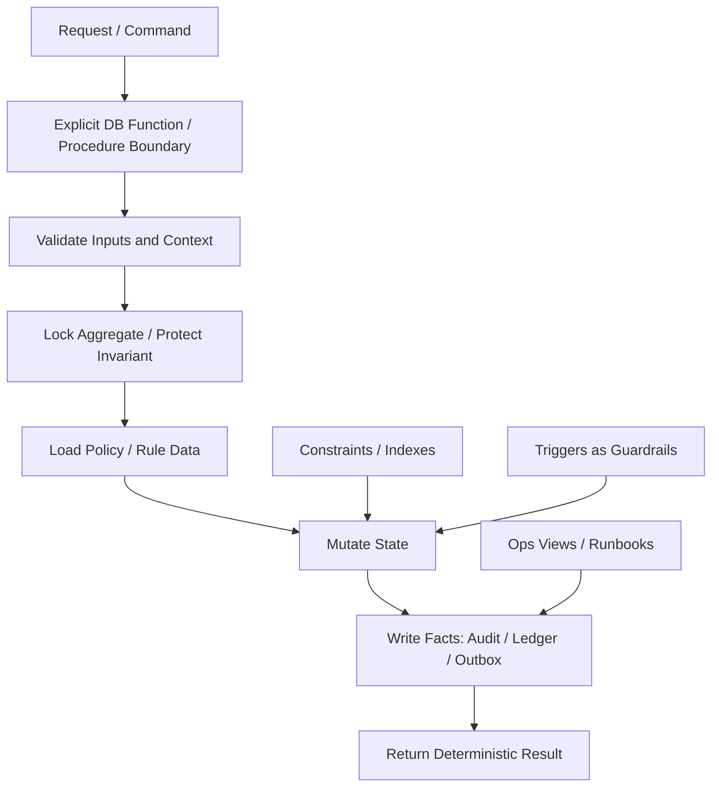
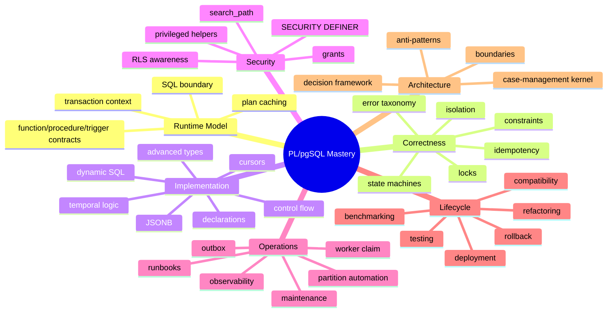

# Part 040 — Production Handbook, Checklists, Pattern Library, and Final Map

> Goal: compress the entire series into an operational handbook you can use during design reviews, implementation, refactoring, incident analysis, and production readiness review.

This is the final part of the planned 40-part series.

The previous parts taught individual mechanisms.

This part turns them into a working review system.

Top engineers do not merely remember syntax. They carry a compact model that lets them decide:

- what belongs in PL/pgSQL,
- what belongs in constraints,
- what belongs in application code,
- what belongs in a worker,
- what belongs in an external workflow engine,
- what must be tested,
- what must be observable,
- what must be reversible.

This handbook is meant to be reused.

---

## 1. The Final Mental Model

PL/pgSQL is best understood as **transactional glue near data invariants**.

Not as “stored procedure programming”.

Not as “business logic in the database”.

Not as “faster application code”.

A useful map:



The strongest PL/pgSQL designs have these properties:

- small number of explicit entry points,
- table constraints protect hard invariants,
- functions protect atomic mutation contracts,
- triggers protect local invariants or audit boundaries,
- procedures handle controlled operational workflows,
- dynamic SQL is isolated and allow-listed,
- security-definer functions are rare and hardened,
- every important side effect is visible as durable data,
- external effects are represented by outbox rows,
- runbooks exist before incidents.

The weakest designs have the opposite:

- hidden triggers everywhere,
- application and database both mutate the same state differently,
- no idempotency key,
- no audit lineage,
- no ownership model,
- no performance evidence,
- no rollback strategy,
- dynamic SQL concatenates user input,
- functions swallow exceptions,
- production repair is done by ad hoc SQL.

---

## 2. Decision Framework: Should This Be PL/pgSQL?

Use this decision table before writing a function.

| Question | If Yes | Preferred Tool |
|---|---|---|
| Is it a simple row/column invariant? | Put it in the schema | `NOT NULL`, `CHECK`, FK, UNIQUE, EXCLUDE, generated column |
| Is it an atomic multi-row mutation around one aggregate? | Keep it near the data | PL/pgSQL function |
| Does it need to commit in chunks? | Use an operational entry point | PL/pgSQL procedure, carefully called |
| Is it a local row-change guardrail? | Use trigger sparingly | BEFORE/AFTER trigger |
| Is it DDL governance? | Use carefully | event trigger + emergency bypass |
| Does it call external systems? | Keep outside DB | app service / worker / outbox relay |
| Is it long-running human workflow? | Keep outside DB | workflow engine / application service |
| Is it complex authorization using external identity data? | Keep outside DB or use policy service | app/policy layer plus DB enforcement for final invariant |
| Is it report formatting or UI transformation? | Keep outside DB | application/reporting layer |
| Is it bulk data validation close to tables? | Use staging + PL/pgSQL | staging functions / procedures |
| Is it a one-off migration repair? | Use controlled ops function | procedure/function with run ledger |

A more compact rule:

```txt
Use PL/pgSQL when correctness depends on the same transaction as the data.
Avoid PL/pgSQL when correctness depends on the outside world.
```

---

## 3. Function Design Checklist

Before approving a PL/pgSQL function:

### 3.1 Contract

- Does the function name describe a command/query, not implementation detail?
- Is the input contract explicit?
- Are nullable parameters intentionally nullable?
- Is output type stable and documented?
- Does the function have a single responsibility?
- Is it clear whether the function reads, mutates, validates, claims, repairs, or reports?

### 3.2 Safety

- Does it validate required arguments?
- Does it reject invalid JSON shapes?
- Does it guard unexpected row counts?
- Does it use `STRICT` only where exact-one-row is required?
- Does it avoid check-then-act races?
- Does it lock before validating mutable state?
- Does it avoid swallowing exceptions?

### 3.3 Naming and Scope

- Are parameter names prefixed, for example `p_`?
- Are local variables prefixed, for example `v_`?
- Are table aliases used consistently?
- Are ambiguous columns qualified?
- Are subblocks labelled when they improve clarity?
- Is `record` used only where shape is intentionally dynamic?

### 3.4 Performance

- Are SQL statements set-based where possible?
- Are loops bounded?
- Is dynamic SQL outside hot loops unless required?
- Could plan caching hurt parameter-sensitive queries?
- Are indexes aligned with predicates?
- Is `RETURN QUERY` returning too much data?
- Has the function been tested with realistic cardinality?

### 3.5 Observability

- Does it emit structured errors?
- Does it preserve SQLSTATE meaning?
- Are audit/outbox/event records written where needed?
- Can operators find stuck work?
- Can you correlate function activity with request id?
- Is there a way to inspect failures that commit partial operational state?

### 3.6 Security

- Is `SECURITY DEFINER` really needed?
- If yes, does it set `search_path` explicitly?
- Is `pg_temp` last in `search_path`?
- Are privileges revoked from `PUBLIC` where needed?
- Does the owner role avoid login use?
- Does dynamic SQL allow-list identifiers?
- Does the application role avoid direct table mutation?

---

## 4. Procedure Design Checklist

Procedures are not just functions with different syntax. They can own transaction-control workflows when called in the right context.

Use a procedure when:

- the routine is operational,
- chunks must commit independently,
- the caller intentionally invokes `CALL`,
- transaction control is part of the design,
- a run ledger records progress.

Avoid procedure when:

- the routine must be called from ordinary SQL expressions,
- it should be used in queries,
- atomic all-or-nothing behavior is required,
- transaction control would surprise the caller,
- it might be invoked inside an outer transaction that forbids commits.

Checklist:

- Is every commit boundary documented?
- Is the procedure safe to resume after failure?
- Does it use a run ledger?
- Does it bound each chunk?
- Does it avoid exception blocks around commit points where transaction control is disallowed?
- Does it have a kill switch or limit?
- Does it expose progress through operational tables?

---

## 5. Trigger Design Checklist

Triggers are powerful because they are automatic.

Triggers are dangerous for the same reason.

Use triggers for:

- timestamp stamping,
- immutable column protection,
- local row invariant guardrails,
- audit capture,
- outbox emission only when tightly scoped,
- enforcing “must use command function” tripwires,
- view `INSTEAD OF` behavior.

Avoid triggers for:

- hidden cross-aggregate workflow,
- external effects,
- complex authorization,
- long-running operations,
- recursive side effects,
- business flows that application teams cannot discover.

Checklist:

- Is the trigger purpose obvious from its name?
- Is it row-level or statement-level intentionally?
- Is `BEFORE` vs `AFTER` chosen for the right reason?
- Does it return `NEW`, `OLD`, or `NULL` correctly?
- Is recursion prevented?
- Are transition tables used when statement-level diff is better?
- Is trigger order deterministic enough?
- Is the trigger documented in table ownership docs?
- Is performance tested for bulk updates?

---

## 6. Dynamic SQL Checklist

Dynamic SQL is not bad.

Unbounded dynamic SQL is bad.

Use dynamic SQL when:

- identifiers are dynamic,
- DDL is generated,
- metadata-driven maintenance is required,
- custom plans are intentionally forced,
- partition/table names are selected from trusted catalog data.

Checklist:

- Are identifiers formatted with `%I` or `quote_ident`?
- Are values passed through `USING` where possible?
- Are literal values formatted with `%L` only when `USING` cannot apply?
- Is there an allow-list for schema/table/column names?
- Are user-provided identifiers rejected unless explicitly allowed?
- Is command text logged safely for diagnostics?
- Is dynamic SQL outside security-definer functions unless needed?
- Does the function avoid concatenating raw input?

Pattern:

```sql
execute format(
  'update %I.%I set %I = $1 where id = $2',
  p_schema_name,
  p_table_name,
  p_column_name
)
using p_value, p_id;
```

Never:

```sql
execute 'update ' || p_table || ' set value = ' || p_value;
```

---

## 7. Error and SQLSTATE Policy

Errors are part of the API.

A mature PL/pgSQL codebase has an error taxonomy.

Example:

| SQLSTATE Range | Meaning |
|---|---|
| `P4000`–`P4099` | Missing or invalid execution context |
| `P4100`–`P4199` | Command input errors |
| `P4200`–`P4299` | Audit/observability contract errors |
| `P4300`–`P4399` | Direct mutation / guardrail violations |
| `P4400`–`P4499` | Worker claim/escalation errors |
| `P4500`–`P4599` | Outbox errors |
| `P4600`–`P4699` | Security/policy errors |
| `P4700`–`P4799` | Migration/repair errors |

Use built-in SQLSTATEs when they naturally fit, such as unique violation, foreign key violation, serialization failure, deadlock detected, or check violation.

Use custom SQLSTATEs when the error is a domain/API contract.

Checklist:

- Does every raised exception include clear `message`?
- Does `detail` contain operator-facing context but not secrets?
- Does `hint` tell the caller how to fix the issue?
- Are retryable errors distinguishable from permanent errors?
- Are exceptions re-raised when not intentionally handled?
- Does the application log SQLSTATE, request id, and correlation id?

---

## 8. Idempotency Pattern Library

### 8.1 Request Ledger Pattern

Use when an API command can be retried.

```sql
create table app_command_request (
  tenant_id uuid not null,
  request_id text not null,
  command_name text not null,
  request_hash text not null,
  result jsonb,
  status text not null,
  created_at timestamptz not null default clock_timestamp(),
  completed_at timestamptz,
  primary key (tenant_id, request_id)
);
```

Flow:

1. Try to insert claim.
2. If insert succeeds, execute command.
3. Store deterministic result.
4. If duplicate request appears, compare request hash.
5. Return stored result if same hash.
6. Raise conflict if same request id has different payload.

### 8.2 Natural Unique Constraint Pattern

Use when idempotency maps directly to business uniqueness.

Example:

```sql
create unique index one_open_case_per_subject_uq
on compliance.case_file (tenant_id, subject_ref)
where status in ('open', 'waiting_for_evidence', 'under_investigation', 'pending_decision');
```

Then use `INSERT ... ON CONFLICT` or catch unique violation.

### 8.3 Outbox Idempotency Pattern

Event payload should include a stable event identity.

```json
{
  "event_id": "outbox uuid",
  "aggregate_id": "case uuid",
  "transition_id": "transition uuid",
  "event_type": "case.transitioned",
  "event_version": 1
}
```

Consumers deduplicate by event id.

Do not rely on a broker to solve semantic duplication.

---

## 9. Concurrency Pattern Library

### 9.1 Lock Aggregate Before Rule Evaluation

```sql
select *
into v_case
from compliance.case_file
where case_id = p_case_id
for update;
```

Then validate transition.

Not before.

### 9.2 Claim Work Queue

```sql
with candidate as (
  select id
  from work_item
  where status = 'pending'
  order by priority desc, created_at
  for update skip locked
  limit p_limit
), claimed as (
  update work_item wi
  set status = 'claimed', claimed_at = clock_timestamp()
  from candidate
  where wi.id = candidate.id
  returning wi.*
)
select * from claimed;
```

### 9.3 Advisory Lock for Synthetic Resource

Use only when no natural row exists to lock.

```sql
perform pg_advisory_xact_lock(hashtextextended(p_resource_key, 0));
```

Rules:

- prefer row locks when a row exists,
- document lock key construction,
- avoid session-level locks unless there is a strong reason,
- keep lock order stable,
- monitor waiting locks.

### 9.4 Retry Boundary

Retry serialization failure and deadlock at the application transaction boundary when possible.

Inside PL/pgSQL, do not blindly retry a non-idempotent operation without a ledger.

---

## 10. Audit Pattern Library

### 10.1 Domain Event Audit

Use for explaining why something happened.

Columns:

- aggregate type,
- aggregate id,
- event type,
- actor,
- reason,
- policy version,
- request id,
- correlation id,
- payload,
- timestamp.

### 10.2 Row-Change Audit

Use for explaining what changed.

Columns:

- table,
- operation,
- primary key,
- old row,
- new row,
- changed by,
- timestamp.

### 10.3 Reconciliation Query

Use for proving current state matches historical facts.

```sql
with last_transition as (
  select distinct on (case_id)
    case_id,
    to_status
  from compliance.case_transition
  order by case_id, occurred_at desc
)
select cf.case_id, cf.status, lt.to_status
from compliance.case_file cf
join last_transition lt using (case_id)
where cf.status <> lt.to_status;
```

Audit should be queryable under pressure.

If it only exists as opaque JSON blobs that nobody can search, it will fail during an incident or regulatory review.

---

## 11. Security Pattern Library

### 11.1 Hardened SECURITY DEFINER Template

```sql
create or replace function app.secure_command(...)
returns ...
language plpgsql
security definer
set search_path = app, app_private, pg_temp
as $$
begin
  -- validate context
  -- avoid unsafe dynamic SQL
  -- execute minimal privileged action
end;
$$;

revoke all on function app.secure_command(...) from public;
grant execute on function app.secure_command(...) to app_role;
```

Rules:

- owner role should not be an everyday login,
- `search_path` must not depend on caller,
- private schema should not be writable by untrusted roles,
- dynamic SQL identifiers must be allow-listed,
- function body must be minimal.

### 11.2 Privilege Boundary Pattern

Application role:

- can execute command functions,
- can read approved views,
- cannot mutate protected tables directly,
- cannot create objects in trusted schemas,
- cannot execute private helper functions unless required.

Migration role:

- can create/alter objects,
- is used by deployment automation,
- is not used by the runtime app.

Owner role:

- owns objects,
- does not login,
- receives no unnecessary memberships.

---

## 12. Performance Pattern Library

### 12.1 Prefer Set-Based Mutation

Bad:

```sql
for v_row in select * from staging loop
  update target set ... where id = v_row.id;
end loop;
```

Better:

```sql
update target t
set value = s.value
from staging s
where t.id = s.id;
```

Use row loops only when each row has different procedural behavior that cannot be expressed cleanly in SQL.

### 12.2 Bounded Batch

```sql
with batch as (
  select id
  from job
  where status = 'pending'
  order by id
  for update skip locked
  limit p_limit
)
update job j
set status = 'processing'
from batch
where j.id = batch.id
returning j.id;
```

### 12.3 Parameter-Sensitive Query Escape Hatch

If a cached generic plan is bad for skewed data, dynamic `EXECUTE ... USING` can force replanning.

Use only after evidence.

Do not make everything dynamic “for performance”.

### 12.4 Instrumentation Table

For complex operational procedures:

```sql
create table ops_run_step (
  run_id uuid not null,
  step_name text not null,
  started_at timestamptz not null,
  finished_at timestamptz,
  row_count bigint,
  message text,
  primary key (run_id, step_name)
);
```

This makes long-running procedures inspectable.

---

## 13. Testing Pattern Library

### 13.1 Test Layers

| Layer | Purpose |
|---|---|
| Unit | Function behavior on small fixtures |
| Contract | Input/output/error SQLSTATE stability |
| Integration | Function + trigger + constraints + audit/outbox |
| Concurrency | Races, locks, duplicate requests |
| Migration | Old and new function compatibility |
| Security | Role permissions and security-definer behavior |
| Performance | Realistic cardinality and contention |
| Regression | Prevent old bugs from returning |

### 13.2 Fixture Discipline

Good fixtures are:

- minimal,
- named by intent,
- inserted in transactions,
- deterministic,
- realistic enough for constraints,
- not dependent on wall-clock unless controlled.

### 13.3 Mutation Function Test Skeleton

For a command function, test:

- valid command changes state,
- invalid input fails,
- invalid state fails,
- missing context fails,
- duplicate request is idempotent,
- audit is written,
- outbox is written,
- direct mutation blocked,
- wrong role denied,
- row version increments,
- concurrent commands serialize correctly.

---

## 14. Deployment and Rollback Checklist

### 14.1 Function Deployment

- Does signature change?
- Does return type change?
- Are callers compatible?
- Are default arguments safe?
- Are overloaded versions ambiguous?
- Does `CREATE OR REPLACE FUNCTION` preserve grants as expected?
- Do you need a new versioned function instead?
- Is rollback possible without dropping dependent objects?

### 14.2 Expand-Contract Pattern

1. Add new nullable columns or new function version.
2. Deploy database changes.
3. Deploy application writing both old/new if needed.
4. Backfill.
5. Switch reads.
6. Enforce constraints.
7. Remove old path.

### 14.3 Trigger Rollout

- Deploy trigger function first.
- Test manually in staging.
- Create trigger disabled or with narrow condition if needed.
- Enable after application path is ready.
- Monitor error rate and write latency.
- Keep emergency disable command in runbook.

### 14.4 Procedure Rollback

A procedure that commits chunks cannot be rolled back as a single transaction.

Therefore it needs:

- run ledger,
- idempotent chunks,
- compensating repair strategy,
- dry-run mode where possible,
- maximum row limit,
- pause/kill switch.

---

## 15. Operational Runbook Templates

### 15.1 Slow Function Runbook

Questions:

- Which function is slow?
- Is time spent inside SQL, lock wait, trigger chain, or client wait?
- Did row count change?
- Did plan change?
- Did table statistics become stale?
- Did a new trigger or index change write cost?
- Is there contention on a hot row or advisory lock?

Evidence:

```sql
select * from pg_stat_user_functions order by total_time desc limit 20;
select * from pg_stat_activity where state <> 'idle';
select * from pg_locks where not granted;
```

Actions:

- capture `EXPLAIN (ANALYZE, BUFFERS)` for inner SQL,
- compare with previous plan if available,
- inspect locks,
- reduce batch size,
- disable noncritical maintenance job,
- apply targeted index/statistics fix,
- deploy function patch only after proof.

### 15.2 Stuck Outbox Runbook

Questions:

- Are rows pending, claimed, or failed?
- Is relay running?
- Are claims stale?
- Are failures permanent or transient?
- Is downstream rejecting payload version?

Actions:

- requeue stale claimed rows,
- increase retry interval for downstream outage,
- discard poison events only with audit approval,
- patch payload transformer in relay,
- replay after fix.

### 15.3 Direct Mutation Violation Runbook

Questions:

- Which role attempted direct mutation?
- Was it an application bug, manual repair, or migration?
- Did state change commit?
- Is audit consistent?

Actions:

- block offending path,
- reconcile current state with transition ledger,
- add missing transition event if approved by governance,
- review grants,
- add regression test.

### 15.4 Deadlock Runbook

Questions:

- Which relations and statements are involved?
- Is lock order inconsistent?
- Did a trigger introduce additional updates?
- Is the operation retry-safe?

Actions:

- capture deadlock log,
- define canonical lock order,
- reduce transaction size,
- move nonessential work to outbox/worker,
- add application retry for safe SQLSTATEs,
- add concurrency test.

---

## 16. Anti-Pattern Detector

Watch for these smells:

### 16.1 Hidden Application Server

Symptoms:

- PL/pgSQL contains feature flags, UI decisions, notifications, external calls, and workflow routing.

Fix:

- move orchestration out,
- keep DB command kernel,
- write outbox facts.

### 16.2 Trigger Spiderweb

Symptoms:

- update table A triggers update B, which triggers C, which updates A again.

Fix:

- replace with explicit command function,
- use triggers only as guardrails/audit,
- document remaining triggers.

### 16.3 Exception Vacuum

Symptoms:

```sql
exception when others then
  return false;
```

Fix:

- catch only expected errors,
- return structured domain result only when safe,
- re-raise unknown errors.

### 16.4 Dynamic SQL Soup

Symptoms:

- table names, column names, and values concatenated as strings.

Fix:

- allow-list identifiers,
- use `format('%I')`,
- use `USING` for values,
- isolate generator logic.

### 16.5 Row-by-Row ETL

Symptoms:

- function loops over millions of rows and runs individual update/insert per row.

Fix:

- stage data,
- validate as data,
- use set-based operations,
- chunk if needed.

### 16.6 Security-Definer Blob

Symptoms:

- giant privileged function with dynamic SQL and broad grants.

Fix:

- split into minimal privileged helpers,
- harden `search_path`,
- narrow grants,
- remove dynamic SQL or allow-list it.

---

## 17. Code Review Questions

During review, ask these in order:

1. What invariant is this code protecting?
2. Why is PL/pgSQL the right boundary?
3. What happens under concurrent calls?
4. What happens on retry after timeout?
5. What durable facts are written?
6. What external side effect is represented, not executed?
7. How does an operator debug it?
8. What is the rollback plan?
9. Which role can execute it?
10. Which role owns it?
11. Does it depend on caller `search_path`?
12. What row counts are expected?
13. What indexes support it?
14. How is it tested under failure?
15. What is the anti-pattern risk?

If the author cannot answer question 1, the function should not be merged.

---

## 18. Final Skill Map



This is the map to keep in your head.

When you learn a new PostgreSQL feature, place it somewhere in this map.

If it does not strengthen correctness, implementation clarity, security, operations, lifecycle, or architecture, it may be trivia rather than leverage.

---

## 19. 20-Hour Practice Plan

A practical mastery sprint:

### Hour 1–2: Runtime and Syntax Refresh

- Write scalar, row, table, and set-returning functions.
- Test `SELECT INTO`, `STRICT`, `FOUND`, and `GET DIAGNOSTICS`.

### Hour 3–4: Dynamic SQL and Safety

- Build a safe metadata-driven maintenance function.
- Reject unsafe identifiers.
- Compare static SQL vs `EXECUTE ... USING`.

### Hour 5–6: Error Contracts

- Create custom SQLSTATE taxonomy.
- Write functions that raise structured `message`, `detail`, and `hint`.
- Test expected failures.

### Hour 7–8: Triggers

- Implement timestamp stamping, immutable column guard, audit trigger.
- Measure bulk update cost.

### Hour 9–10: State Machine

- Build a small case transition table.
- Implement `transition_case()` with row lock and policy table.

### Hour 11–12: Idempotency and Outbox

- Add request id uniqueness.
- Add outbox row write.
- Simulate retry after timeout.

### Hour 13–14: Concurrency

- Run two sessions manually.
- Create race conditions intentionally.
- Fix them with row locks, unique constraints, or advisory locks.

### Hour 15–16: Testing

- Build test fixtures.
- Test permission failures.
- Test triggers and audit.

### Hour 17–18: Performance

- Use `EXPLAIN`, `pg_stat_user_functions`, and realistic data.
- Compare row loop vs set-based update.

### Hour 19: Deployment

- Simulate function version change.
- Practice expand-contract migration.
- Test rollback limitation.

### Hour 20: Production Review

- Write a runbook.
- Create ops views.
- Perform a design review using this handbook.

The goal is not to memorize every feature.

The goal is to compress the feedback loop between design, implementation, test, and operational evidence.

---

## 20. Final Production Readiness Checklist

A PL/pgSQL component is production-ready when:

### Design

- [ ] It has a clear boundary.
- [ ] It protects a real data invariant or operational workflow.
- [ ] It does not hide external orchestration.
- [ ] It has documented caller expectations.

### Correctness

- [ ] Constraints protect simple invariants.
- [ ] Functions protect atomic multi-step invariants.
- [ ] Race conditions have been modeled.
- [ ] Idempotency exists for retryable commands.
- [ ] Isolation/retry behavior is understood.

### Security

- [ ] Privileges are minimal.
- [ ] `SECURITY DEFINER` is justified and hardened.
- [ ] Direct table mutation is prevented where required.
- [ ] Dynamic SQL is safe.

### Observability

- [ ] Errors are structured.
- [ ] Audit/ledger/outbox records exist where needed.
- [ ] Ops views expose backlog/stuck work.
- [ ] Runbooks exist.

### Performance

- [ ] Expected cardinality is known.
- [ ] Set-based operations are preferred.
- [ ] Loops are bounded.
- [ ] Plans are checked for realistic data.
- [ ] Lock contention has been tested.

### Testing

- [ ] Happy path tested.
- [ ] Failure path tested.
- [ ] Permission path tested.
- [ ] Concurrent path tested.
- [ ] Migration compatibility tested.

### Lifecycle

- [ ] Deployment plan exists.
- [ ] Rollback plan exists.
- [ ] Function signature compatibility is understood.
- [ ] Old and new callers can coexist during rollout.
- [ ] Repair strategy exists for partial operational progress.

If these boxes are not checked, the code might work.

It is not yet production-grade.

---

## 21. Closing Principle

PL/pgSQL is not about moving application code into the database.

It is about placing the right logic at the only place where certain facts can be enforced atomically.

The question is never:

> Can this be written in PL/pgSQL?

The question is:

> Should this invariant live at the data boundary, and can we operate it safely when it fails?

If the answer is yes, PL/pgSQL is one of the sharpest tools in PostgreSQL.

If the answer is no, writing it in PL/pgSQL only makes the system harder to understand.

That distinction is the difference between database-side engineering and stored-procedure sprawl.

---

## 22. Series Completion

This is the final planned part of **Learn PL/pgSQL In Action**.

The planned 40-part series is complete.

You now have:

- runtime model,
- syntax and statement discipline,
- function/procedure/trigger design,
- dynamic SQL safety,
- plan caching and performance traps,
- cursor and batching patterns,
- security boundaries,
- concurrency and isolation patterns,
- idempotency and outbox workflows,
- state-machine and compliance workflow design,
- validation and JSONB processing,
- advanced type usage,
- temporal logic,
- bulk and partition maintenance,
- metadata-driven introspection,
- testing and benchmarking,
- refactoring and deployment,
- operational readiness,
- anti-pattern boundaries,
- enterprise case study,
- final production handbook.

The next learning step should not be more syntax.

The next step should be building and operating one complete PL/pgSQL-backed subsystem under test, load, migration, and incident simulation.

---

## 23. References

- PostgreSQL Documentation — PL/pgSQL: `https://www.postgresql.org/docs/current/plpgsql.html`
- PostgreSQL Documentation — PL/pgSQL Basic Statements: `https://www.postgresql.org/docs/current/plpgsql-statements.html`
- PostgreSQL Documentation — PL/pgSQL Control Structures: `https://www.postgresql.org/docs/current/plpgsql-control-structures.html`
- PostgreSQL Documentation — PL/pgSQL Transaction Management: `https://www.postgresql.org/docs/current/plpgsql-transactions.html`
- PostgreSQL Documentation — PL/pgSQL Errors and Messages: `https://www.postgresql.org/docs/current/plpgsql-errors-and-messages.html`
- PostgreSQL Documentation — PL/pgSQL Trigger Functions: `https://www.postgresql.org/docs/current/plpgsql-trigger.html`
- PostgreSQL Documentation — CREATE FUNCTION: `https://www.postgresql.org/docs/current/sql-createfunction.html`
- PostgreSQL Documentation — CREATE TRIGGER: `https://www.postgresql.org/docs/current/sql-createtrigger.html`
- PostgreSQL Documentation — Explicit Locking: `https://www.postgresql.org/docs/current/explicit-locking.html`
- PostgreSQL Documentation — Transaction Isolation: `https://www.postgresql.org/docs/current/transaction-iso.html`
- PostgreSQL Documentation — Monitoring Database Activity: `https://www.postgresql.org/docs/current/monitoring-stats.html`
- PostgreSQL Documentation — EXPLAIN: `https://www.postgresql.org/docs/current/using-explain.html`
