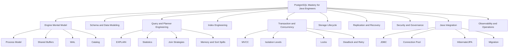
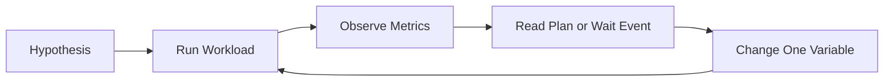
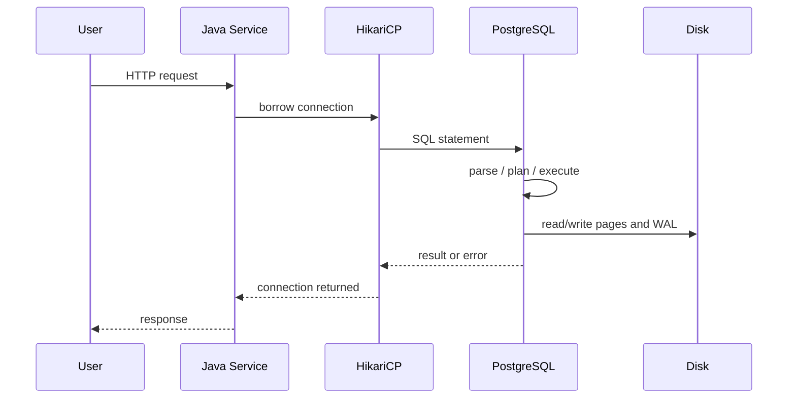
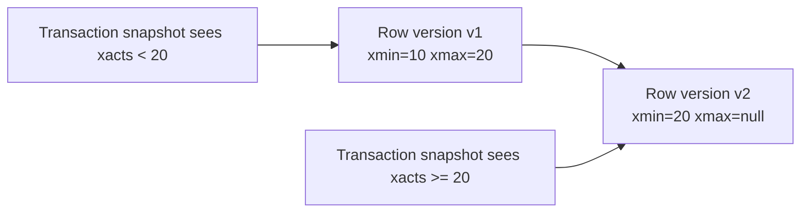
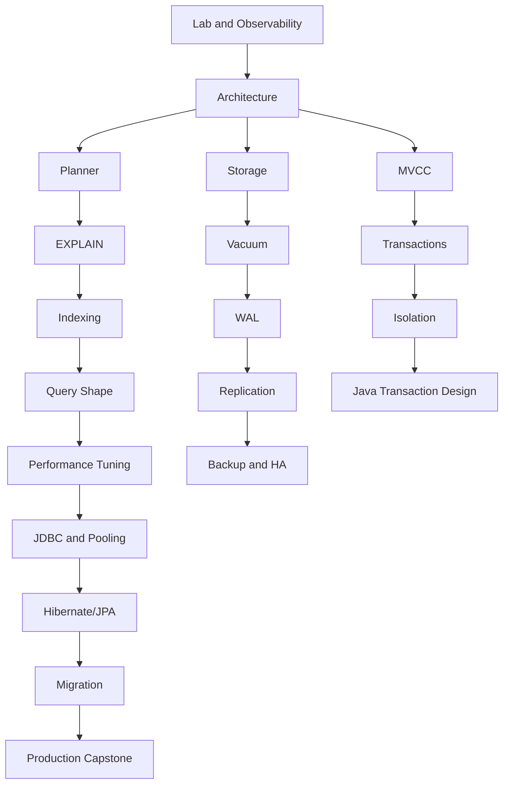
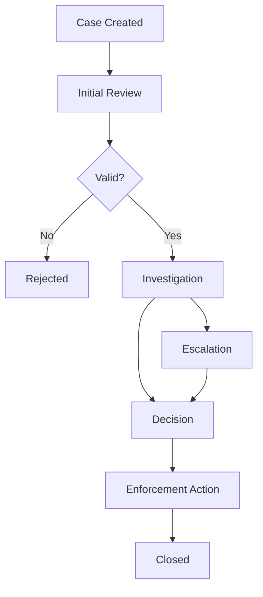

# Part 001 — Kaufman Skill Map for PostgreSQL Mastery

## 1. Tujuan Bagian Ini

Bagian ini adalah **peta belajar operasional** untuk seluruh seri. Kita tidak mulai dari sintaks SQL dasar. Kita mulai dari pertanyaan yang lebih penting:

> Skill PostgreSQL seperti apa yang harus dimiliki Java software engineer agar mampu mendesain, mendiagnosis, mengoperasikan, dan mempertahankan sistem production yang benar, cepat, dan aman?

Dengan kata lain, target kita bukan “bisa pakai PostgreSQL”. Target kita adalah mampu menjadikan PostgreSQL sebagai **komponen sistem yang predictable** di dalam arsitektur software: correctness, performance, concurrency, observability, migration, recovery, dan evolusi schema.

Framework Josh Kaufman dari *The First 20 Hours* membantu kita menghindari dua kesalahan umum:

1. **Over-reading**: membaca dokumentasi, buku, blog, dan benchmark tanpa pernah membangun instinct dari praktik.
2. **Under-modeling**: langsung menulis query/index/migration tanpa memahami engine behavior yang membuat hasilnya benar atau salah.

Maka seri ini disusun dengan pola:

1. deconstruct PostgreSQL menjadi sub-skill kecil;
2. belajar cukup untuk bisa praktik dan self-correct;
3. menghilangkan hambatan praktik;
4. melakukan deliberate practice pada gejala nyata production;
5. mengukur kemajuan dengan rubric, bukan perasaan.

## 2. Baseline Seri

Seri ini memakai **PostgreSQL 18** sebagai baseline stabil karena dokumentasi resmi PostgreSQL saat ini menempatkan PostgreSQL 18 sebagai versi current. Release notes PostgreSQL 18 mencatat fitur penting seperti asynchronous I/O, retained optimizer statistics pada `pg_upgrade`, skip scan untuk multicolumn B-tree indexes, `uuidv7()`, virtual generated columns, temporal constraints, dan OAuth authentication.

> Referensi utama: PostgreSQL 18 Documentation dan PostgreSQL 18 Release Notes.

Namun, bagian awal seri ini sengaja tidak fokus pada fitur baru. Engineer top-tier tidak sekadar tahu fitur terbaru; mereka memahami **invariant lama yang tetap menentukan perilaku sistem**:

- MVCC membuat read/write concurrency tinggi, tetapi menghasilkan dead tuple dan kebutuhan vacuum.
- Planner memilih plan berdasarkan statistik, bukan niat developer.
- Index mempercepat sebagian read path, tetapi memperlambat write path dan memperbesar operational surface.
- WAL memberi durability dan replication stream, tetapi memengaruhi latency, storage, backup, dan recovery.
- Transaction boundary adalah desain domain, bukan detail persistence layer.
- Connection pool adalah resource control, bukan sekadar optimasi koneksi.

## 3. Definisi “Top 1% PostgreSQL Skill” untuk Java Engineer

Klaim “top 1%” tidak boleh dipahami sebagai hafal semua parameter PostgreSQL. Itu framing yang salah. Untuk software engineer, skill tinggi berarti mampu membuat keputusan yang tetap benar ketika:

- data tumbuh dari ribuan menjadi miliaran row;
- traffic berubah dari single user menjadi concurrent workload;
- schema berubah tanpa downtime;
- query cepat di dev tetapi lambat di production;
- transaksi terlihat benar tetapi melanggar invariant saat race condition;
- database sehat secara CPU tetapi lambat karena lock, I/O, bloat, atau pool starvation;
- failover terjadi saat aplikasi masih membuka koneksi lama;
- backup ada, tetapi restore belum pernah diuji.

Skill PostgreSQL yang kita tuju terbagi menjadi tujuh kemampuan.

| Kemampuan | Pertanyaan yang Harus Bisa Dijawab |
|---|---|
| Modeling | Apakah schema, constraints, types, dan keys merepresentasikan invariant domain? |
| Query Engineering | Mengapa query ini memilih plan tersebut, dan apa perubahan shape/index/statistik yang tepat? |
| Concurrency | Apakah transaction boundary melindungi invariant saat ada dua request bersamaan? |
| Storage Lifecycle | Apakah desain update/delete menghasilkan bloat, vacuum pressure, atau wraparound risk? |
| Operational Resilience | Apakah backup, WAL, replication, failover, dan migration bisa diuji dan diaudit? |
| Java Integration | Apakah JDBC/pool/Hibernate menghasilkan query, transaction, timeout, dan retry yang benar? |
| Observability | Apakah kita bisa membedakan CPU bottleneck, I/O bottleneck, lock wait, planner misestimate, dan pool starvation? |

## 4. Kaufman Step 1 — Deconstruct the Skill

“PostgreSQL mastery” terlalu besar. Kita pecah menjadi sub-skill yang dapat dilatih secara terpisah.



### 4.1 Engine Mental Model

Minimal capability:

- tahu bahwa PostgreSQL memakai process-per-connection model;
- memahami peran postmaster, backend process, checkpointer, background writer, WAL writer, autovacuum workers;
- memahami bahwa table bukan “file abstrak”, tetapi heap pages berisi tuple versions;
- memahami bahwa update bukan overwrite sederhana, melainkan membuat tuple version baru;
- memahami bahwa WAL adalah log durability dan replication, bukan sekadar log debug.

Self-correction signal:

- ketika melihat query lambat, kamu tidak langsung membuat index;
- ketika melihat disk usage naik, kamu bertanya soal dead tuples, vacuum, fillfactor, TOAST, dan index bloat;
- ketika melihat latency spike, kamu bertanya soal checkpoint, WAL flush, locks, temp files, dan connection pool pressure.

### 4.2 Schema and Data Modeling

Minimal capability:

- memilih type berdasarkan semantic, bukan convenience;
- membedakan `timestamp` vs `timestamptz` berdasarkan meaning;
- memakai constraints sebagai invariant boundary;
- memahami trade-off enum, domain, lookup table, JSONB, generated column, dan expression index;
- mendesain schema yang bisa berubah tanpa downtime.

Self-correction signal:

- kamu dapat menjelaskan invariant mana yang dijaga database, mana yang dijaga aplikasi, dan risiko jika salah satu gagal;
- kamu tidak memakai JSONB sebagai alasan untuk menghindari modeling;
- kamu tidak membuat nullable foreign key tanpa alasan lifecycle yang jelas.

### 4.3 Query and Planner Engineering

Minimal capability:

- membaca `EXPLAIN (ANALYZE, BUFFERS)`;
- membedakan estimated rows vs actual rows;
- mengenali sequential scan yang wajar vs problematik;
- memahami nested loop, hash join, merge join;
- memahami sort, hash aggregate, materialize, bitmap heap scan, index scan, index-only scan;
- tahu kapan masalahnya query shape, index, statistik, memory, atau data distribution.

Self-correction signal:

- kamu tidak menganggap “query pakai index” selalu lebih cepat;
- kamu tidak mengoptimasi query berdasarkan waktu sekali jalan tanpa buffer/plan context;
- kamu bisa menjelaskan mengapa planner memilih plan tertentu meskipun kamu tidak setuju.

### 4.4 Index Engineering

Minimal capability:

- mendesain B-tree composite index dengan urutan kolom yang benar;
- memahami equality, range, ordering, covering, partial, expression index;
- tahu konsekuensi write amplification;
- memahami kapan GIN/GiST/BRIN lebih cocok daripada B-tree;
- memahami index-only scan dan visibility map;
- memahami skip scan PostgreSQL 18 sebagai optimasi, bukan pengganti desain index yang benar.

Self-correction signal:

- setiap index punya owner, query target, dan deletion condition;
- kamu bisa menghapus redundant index dengan confidence;
- kamu melihat index sebagai lifecycle cost, bukan free acceleration.

### 4.5 Transaction and Concurrency

Minimal capability:

- memahami MVCC snapshot;
- membedakan read committed, repeatable read, dan serializable;
- mengenali lost update, write skew, phantom-like behavior, stale read, lock wait, deadlock;
- mendesain retry boundary di service layer;
- memahami optimistic locking dan `SELECT ... FOR UPDATE` secara tepat.

Self-correction signal:

- kamu dapat menulis race-condition test;
- kamu tahu kapan retry aman dan kapan retry bisa menggandakan side effect;
- kamu tidak memakai serializable sebagai magic fix tanpa observability.

### 4.6 Storage Lifecycle

Minimal capability:

- memahami tuple version, dead tuple, vacuum, autovacuum, freeze;
- memahami bloat pada heap dan index;
- memahami update-heavy workload vs insert-only workload;
- memahami partitioning sebagai lifecycle architecture, bukan sekadar performance trick;
- memahami checkpoint dan WAL pressure.

Self-correction signal:

- kamu bisa menjelaskan mengapa table yang jumlah row-nya stabil tetap membesar;
- kamu bisa membedakan “butuh VACUUM”, “butuh VACUUM FULL”, “butuh REINDEX”, dan “butuh schema/workload redesign”.

### 4.7 Replication, Recovery, and HA

Minimal capability:

- memahami physical streaming replication;
- memahami replication slot dan WAL retention risk;
- memahami logical replication dan CDC;
- memahami PITR;
- memahami RPO/RTO;
- memahami failure mode failover dan split-brain;
- memahami bahwa backup yang belum pernah di-restore belum terbukti berguna.

Self-correction signal:

- kamu tidak menyebut read replica sebagai “scale read” tanpa membahas lag dan read-your-writes;
- kamu tidak menyebut HA tanpa membahas connection routing, fencing, and app behavior after failover.

### 4.8 Java Integration

Minimal capability:

- memahami pgJDBC behavior: prepared statement, batching, fetch size, timeout, cancellation;
- sizing HikariCP berdasarkan database connection budget, bukan jumlah request thread;
- membedakan transaction timeout, statement timeout, socket timeout, pool timeout;
- memahami Hibernate query generation, N+1, batching, flush mode, optimistic locking;
- membuat migration expand-contract.

Self-correction signal:

- kamu bisa melacak satu endpoint Java hingga SQL aktual, query plan, lock behavior, dan pool usage;
- kamu tidak menyelesaikan database bottleneck dengan menaikkan pool size secara membabi buta.

## 5. Kaufman Step 2 — Learn Enough to Self-Correct

Belajar cukup bukan berarti belajar dangkal. Artinya, jangan membaca semua dokumentasi sebelum praktik. Pelajari konsep minimum yang membuatmu bisa mendeteksi kesalahan sendiri.

Untuk PostgreSQL, self-correction loop minimal adalah:



Contoh:

- Hipotesis: query lambat karena tidak memakai index.
- Praktik: jalankan `EXPLAIN (ANALYZE, BUFFERS)`.
- Observasi: index digunakan, tetapi actual rows jauh lebih besar dari estimate.
- Koreksi: masalahnya mungkin statistik/cardinality, bukan index absence.
- Perubahan: `ANALYZE`, extended statistics, query rewrite, atau index berbeda.

Self-correction membutuhkan empat alat dasar:

1. `psql` untuk inspeksi cepat;
2. `EXPLAIN (ANALYZE, BUFFERS)` untuk query behavior;
3. `pg_stat_statements` untuk workload aggregate;
4. `pg_stat_activity` dan wait events untuk concurrency/latency signal.

## 6. Kaufman Step 3 — Remove Practice Barriers

Hambatan belajar PostgreSQL biasanya bukan kurang resource. Hambatannya adalah environment yang tidak repeatable.

Engineer sering belajar dengan database lokal yang:

- datanya terlalu kecil;
- tidak punya concurrency;
- tidak punya slow query;
- tidak punya bloat;
- tidak punya WAL pressure;
- tidak punya failure scenario;
- tidak punya Java connection pool;
- tidak punya migration history.

Seri ini menghilangkan hambatan itu dengan lab yang selalu bisa dibuat ulang.

Minimal lab:

- PostgreSQL 18 container;
- schema latihan;
- synthetic data generator;
- `pgbench` workload;
- Java service kecil dengan HikariCP;
- Flyway migration;
- `pg_stat_statements` aktif;
- logging slow query;
- script untuk membuat locks, deadlocks, plan regression, dan bloat.

Prinsipnya:

> Kalau gejala production tidak bisa direproduksi, skill yang terbentuk hanya teoretis.

## 7. Kaufman Step 4 — Practice the Most Important Sub-Skills

Untuk 20 jam pertama, kita tidak mencoba menguasai semua fitur PostgreSQL. Kita memilih sub-skill dengan return tertinggi untuk Java backend production.

### 7.1 Praktik 20 Jam Pertama

| Jam | Fokus | Output |
|---:|---|---|
| 1 | Lab setup | PostgreSQL 18 berjalan, `psql`, `pgbench`, sample database. |
| 2 | Basic observability | Bisa melihat activity, locks, slow query, extension. |
| 3 | EXPLAIN baseline | Bisa membaca plan sederhana dengan actual rows dan buffers. |
| 4 | Index experiment | Membandingkan seq scan, index scan, bitmap scan. |
| 5 | Composite index | Menguji urutan kolom, equality/range/order. |
| 6 | Cardinality failure | Membuat data skew dan melihat planner salah estimate. |
| 7 | Transaction race | Membuat lost update atau write skew sederhana. |
| 8 | Lock wait | Membuat session blocking dan membaca blocker. |
| 9 | Deadlock | Membuat deadlock controlled dan memahami retry. |
| 10 | Java JDBC | Endpoint sederhana dengan prepared statement dan timeout. |
| 11 | HikariCP | Menguji pool starvation dan backpressure. |
| 12 | Hibernate N+1 | Membuktikan N+1 dari SQL log dan memperbaikinya. |
| 13 | Batch write | Membandingkan row-by-row vs batch insert/update. |
| 14 | Bloat | Membuat update-heavy workload dan melihat dead tuples. |
| 15 | Vacuum | Mengamati autovacuum/vacuum effect. |
| 16 | WAL | Mengamati WAL growth dari workload berbeda. |
| 17 | Partitioning | Membuat range partition dan pruning. |
| 18 | Migration | Menulis expand-contract migration. |
| 19 | Backup/restore | Melakukan restore drill sederhana. |
| 20 | Capstone mini | Diagnosis endpoint lambat dari Java sampai query plan. |

### 7.2 Mengapa Urutan Ini Efektif

Urutan ini sengaja tidak dimulai dari replication atau HA. Tanpa query/concurrency/storage mental model, HA sering dipahami sebagai checklist vendor, bukan desain resilience.

Kita mulai dari loop paling sering ditemui software engineer:



Dalam production, bottleneck bisa terjadi di setiap titik:

- request thread menunggu pool;
- connection idle in transaction;
- statement menunggu lock;
- query salah plan;
- sort spill ke disk;
- WAL flush lambat;
- checkpoint spike;
- autovacuum tertahan;
- replica lag;
- app retry menggandakan side effect.

## 8. PostgreSQL Mental Models yang Wajib Diinternalisasi

### 8.1 Database as Invariant Engine

PostgreSQL bukan hanya tempat menyimpan data. Ia adalah **invariant engine**.

Aplikasi sering berubah: service di-refactor, endpoint bertambah, worker berjalan async, UI berubah, consumer event bertambah. Database bertahan lebih lama dari banyak layer aplikasi. Karena itu, invariant kritis sebaiknya tidak seluruhnya diserahkan ke aplikasi.

Contoh invariant:

- satu invoice tidak boleh punya dua nomor final yang sama;
- account balance tidak boleh berubah tanpa ledger entry;
- case enforcement tidak boleh lompat dari `DRAFT` ke `CLOSED` tanpa transition valid;
- satu job idempotency key hanya boleh diproses satu kali;
- satu user tidak boleh punya dua active session policy yang mutually exclusive.

PostgreSQL tools untuk invariant:

- primary key;
- foreign key;
- unique constraint;
- check constraint;
- exclusion constraint;
- trigger;
- generated column;
- row-level security;
- transaction isolation;
- advisory lock;
- serializable transaction.

Trade-off:

- semakin banyak invariant di database, semakin kuat consistency boundary;
- tetapi migrasi, test, dan ownership harus lebih disiplin;
- trigger dan procedural logic perlu governance agar tidak menjadi hidden application.

### 8.2 Planner as Cost-Based Decision Maker

Planner bukan compiler yang membaca niat developer. Planner memilih plan berdasarkan:

- query text;
- available indexes;
- table statistics;
- cost settings;
- row count estimate;
- data distribution;
- enabled plan types;
- memory assumptions;
- parallelism possibility.

Maka query yang “secara logika sama” bisa sangat berbeda performanya jika shape berbeda.

Contoh:

```sql
-- Bisa sulit dioptimalkan jika fungsi diterapkan pada kolom
WHERE lower(email) = 'a@example.com'

-- Bisa cepat jika ada expression index yang cocok
CREATE INDEX idx_user_lower_email ON app_user (lower(email));
```

Self-correction:

- jangan bertanya “kenapa PostgreSQL bodoh?”;
- tanyakan “informasi apa yang planner punya, dan asumsi mana yang salah?”.

### 8.3 MVCC as Versioned Reality

Di PostgreSQL, transaksi tidak sekadar membaca “row terbaru”. Transaksi membaca versi row yang visible menurut snapshot-nya.

Mental model sederhana:



Konsekuensi:

- update membuat versi baru;
- old version harus dibersihkan vacuum;
- long-running transaction bisa menahan pembersihan dead tuples;
- read tidak selalu block write;
- write tetap bisa saling block;
- isolation level menentukan jenis snapshot dan anomaly yang mungkin.

### 8.4 WAL as Durability Spine

Write-Ahead Log adalah tulang punggung durability dan recovery.

Sebelum perubahan dianggap durable, informasi perubahan harus masuk WAL sesuai aturan durability. WAL juga dipakai untuk crash recovery, replication, backup/PITR, dan logical decoding.

Konsekuensi:

- write-heavy workload menghasilkan WAL volume tinggi;
- index juga menghasilkan WAL;
- large transaction bisa membuat WAL retention risk;
- replication slot yang tertahan bisa membuat disk penuh;
- checkpoint tuning memengaruhi latency spike dan recovery time.

### 8.5 Connection as Expensive Execution Context

Di banyak stack Java, koneksi database terasa seperti object biasa. Di PostgreSQL, connection berarti backend process/server-side state.

Kesalahan umum:

- pool size terlalu besar;
- request thread lebih banyak dari koneksi sehat database;
- idle transaction menahan locks/snapshot;
- tidak ada statement timeout;
- retry loop membuka tekanan tambahan;
- setiap service punya pool sendiri tanpa global connection budget.

Rule of thumb yang akan kita uji di seri ini:

> Pool kecil yang stabil lebih baik daripada pool besar yang membuat database thrash.

## 9. Skill Dependency Graph



Graph ini penting karena banyak materi PostgreSQL gagal karena urutan salah. Misalnya:

- belajar index sebelum planner membuat index dianggap magic;
- belajar isolation sebelum MVCC membuat anomaly terasa abstrak;
- belajar HA sebelum WAL membuat replication tampak seperti feature toggle;
- belajar Hibernate tanpa JDBC/pool membuat problem terlihat seperti framework bug.

## 10. Rubric Kemampuan

Gunakan rubric ini untuk mengukur kemajuan.

### 10.1 Level 1 — User of PostgreSQL

Ciri:

- bisa membuat table dan query;
- bisa memakai ORM;
- bisa membuat index berdasarkan error atau slow query;
- tahu basic transaction.

Risiko:

- sering over-indexing;
- sulit membaca query plan;
- tidak sadar lock dan isolation anomaly;
- menganggap database sebagai dependency pasif.

### 10.2 Level 2 — Productive Backend Engineer

Ciri:

- bisa membaca query plan sederhana;
- tahu kapan memakai composite index;
- bisa menulis migration yang aman untuk table kecil/menengah;
- tahu connection pool dan timeout dasar;
- bisa debugging slow query umum.

Risiko:

- masih reaktif;
- belum kuat di storage lifecycle;
- HA/backup masih diserahkan penuh ke infra team;
- belum sistematis menguji failure mode.

### 10.3 Level 3 — Production PostgreSQL Engineer

Ciri:

- bisa membaca `EXPLAIN (ANALYZE, BUFFERS)` dengan confidence;
- bisa menghubungkan Java endpoint, pool, SQL, plan, lock, dan metrics;
- bisa mendesain index budget;
- bisa menangani lock/deadlock/serialization failure;
- bisa membuat zero-downtime migration;
- tahu bloat/vacuum/WAL basics;
- bisa ikut review HA/DR plan.

### 10.4 Level 4 — Architecture-Level PostgreSQL Engineer

Ciri:

- mendesain data model sebagai invariant boundary;
- memilih partitioning, logical replication, outbox, audit, multi-tenancy dengan alasan jelas;
- bisa membuat performance tuning method, bukan sekadar tuning tips;
- bisa mendefinisikan RPO/RTO dan restore drill;
- bisa membuat database operational readiness checklist;
- bisa menolak desain yang terlihat cepat tetapi tidak defensible.

### 10.5 Level 5 — Expert/Top-Tier Behavior

Ciri:

- berpikir dalam failure mode;
- mengubah problem vague menjadi eksperimen terukur;
- tahu kapan tidak memakai PostgreSQL untuk use case tertentu;
- dapat menjelaskan trade-off kepada engineer, product, security, dan operations;
- membuat sistem lebih mudah didiagnosis oleh orang lain;
- mengurangi hero debugging dengan guardrail, migration policy, dashboard, dan review checklist.

## 11. Error Taxonomy yang Akan Dipakai di Seluruh Seri

Saat ada problem PostgreSQL, kita akan mengklasifikasikan ke salah satu atau kombinasi kategori ini.

| Kategori | Gejala | Pertanyaan Diagnosis |
|---|---|---|
| Query Shape | Query lambat walau data tidak besar | Apakah predicate sargable? Apakah join/order/pagination shape buruk? |
| Statistics | Plan salah drastis | Apakah actual rows jauh dari estimate? Apakah data skew? |
| Index | Full scan tidak wajar atau write lambat | Index apa yang dipakai? Apakah redundant? Apakah partial/covering lebih tepat? |
| Memory | Sort/hash spill | Apakah temp file naik? Apakah `work_mem` sesuai per operation? |
| Lock | Request menggantung | Siapa blocker? Lock type apa? Transaction mana idle? |
| MVCC/Vacuum | Disk membesar, query makin lambat | Dead tuples? Long transaction? Autovacuum tertahan? |
| WAL/Checkpoint | Write latency spike | WAL volume? Checkpoint frequency? fsync pressure? |
| Connection Pool | App timeout tetapi DB CPU rendah | Pool exhausted? Idle transaction? Thread waiting? |
| Replication | Replica stale atau disk penuh | Lag? Slot retained WAL? Hot standby conflict? |
| Migration | Deploy stuck/lock production | DDL lock level? Backfill strategy? Index concurrently? |
| Security | Privilege terlalu luas | Ownership? Grants? RLS? Default privileges? Secret handling? |

## 12. Practice Method: One Variable at a Time

Deliberate practice dalam database harus disiplin. Jangan mengubah query, index, config, data distribution, dan pool size sekaligus.

Format eksperimen:

```md
## Experiment
Hypothesis:

Baseline:

Change:

Measurement:

Result:

Conclusion:

Rollback:
```

Contoh:

```md
## Experiment
Hypothesis:
Query invoice search lambat karena planner melakukan sequential scan akibat tidak ada index pada (tenant_id, status, created_at).

Baseline:
EXPLAIN ANALYZE menunjukkan Seq Scan pada invoice, actual rows 120, buffers read 90k.

Change:
CREATE INDEX CONCURRENTLY idx_invoice_tenant_status_created_at
ON invoice (tenant_id, status, created_at DESC);

Measurement:
Bandingkan plan, latency p95, buffer read, write overhead pada insert/update invoice.

Result:
Index Scan dipakai, latency turun, tetapi write TPS turun 4%.

Conclusion:
Index diterima karena read path endpoint dominan dan write overhead masih dalam SLO.

Rollback:
DROP INDEX CONCURRENTLY idx_invoice_tenant_status_created_at;
```

## 13. PostgreSQL Review Checklist untuk Java Engineer

Gunakan checklist ini saat review desain fitur baru.

### 13.1 Data Model

- Apakah setiap table punya ownership jelas?
- Apakah primary key dipilih untuk lifecycle dan access pattern?
- Apakah foreign key diperlukan dan aman untuk write path?
- Apakah nullable field punya makna domain, bukan sekadar convenience?
- Apakah constraint menangkap invariant penting?
- Apakah status/state transition punya guardrail?
- Apakah soft delete memengaruhi uniqueness dan index?
- Apakah JSONB dipakai untuk data yang benar-benar flexible?

### 13.2 Query and Index

- Apa top 5 query path fitur ini?
- Apa predicate paling selektif?
- Apakah ada query dengan pagination offset besar?
- Apakah query memakai sort yang bisa didukung index?
- Apakah index baru punya query owner?
- Apakah index partial bisa mengurangi ukuran?
- Apakah write amplification diterima?

### 13.3 Transaction

- Apa invariant yang dilindungi dalam satu transaksi?
- Apakah ada read-then-write race?
- Apakah perlu optimistic lock?
- Apakah perlu row lock?
- Apakah retry aman?
- Apakah side effect eksternal terjadi setelah commit?
- Apakah transaction terlalu panjang?

### 13.4 Java Integration

- Apakah endpoint punya statement timeout?
- Apakah pool timeout lebih kecil dari request timeout?
- Apakah transaction boundary jelas di service layer?
- Apakah Hibernate menghasilkan SQL yang diketahui?
- Apakah batch size dikonfigurasi?
- Apakah connection leak terdeteksi?

### 13.5 Operations

- Apakah migration lock-safe?
- Apakah backfill chunked?
- Apakah table akan butuh partitioning/retention?
- Apakah metrics dan log cukup untuk diagnosis?
- Apakah backup/restore memengaruhi perubahan ini?
- Apakah read replica boleh stale untuk query ini?

## 14. Cara Membaca Seri Ini

Setiap part punya tiga lapisan:

1. **Mental model**: cara berpikir agar tidak bergantung pada template.
2. **Mechanics**: perilaku PostgreSQL yang bisa diamati.
3. **Production application**: implikasi untuk Java service dan sistem nyata.

Jangan lanjut terlalu cepat jika belum bisa menjawab pertanyaan self-check di akhir part. Tujuan seri ini bukan menyelesaikan 35 file, melainkan membangun instinct.

## 15. Anti-Pattern Belajar PostgreSQL

### 15.1 Menghafal Parameter

Parameter seperti `shared_buffers`, `work_mem`, `maintenance_work_mem`, `checkpoint_timeout`, dan `autovacuum_*` penting. Tetapi menghafal value tanpa workload context adalah cargo cult.

Pertanyaan yang lebih benar:

- bottleneck apa yang sedang kita hadapi?
- metric mana yang membuktikannya?
- perubahan parameter ini memengaruhi komponen apa?
- apa rollback plan?

### 15.2 Membuat Index untuk Setiap Predicate

Index bukan gratis. Index:

- butuh storage;
- memperlambat insert/update/delete;
- menghasilkan WAL;
- butuh vacuum/maintenance;
- bisa membuat planner memilih plan buruk jika statistik buruk;
- bisa menjadi redundant saat query berubah.

### 15.3 Menganggap ORM Menyembunyikan Database

ORM menyembunyikan SQL dari source code, bukan dari database. PostgreSQL tetap menerima SQL aktual. Maka engineer harus bisa melihat dan memahami SQL yang dihasilkan ORM.

### 15.4 Menyamakan “Works Locally” dengan “Production Ready”

Local database kecil tidak menguji:

- cardinality;
- skew;
- concurrent locks;
- bloat;
- WAL pressure;
- connection pool contention;
- replication lag;
- migration lock duration.

## 16. Capstone yang Akan Kita Bangun Sepanjang Seri

Kita akan memakai domain contoh: **case management / enforcement lifecycle system**, karena domain ini cocok untuk latihan invariant, state machine, audit, escalation, dan workload campuran.

Entities awal:

- `case_file`;
- `case_party`;
- `case_event`;
- `case_assignment`;
- `case_task`;
- `case_decision`;
- `case_audit_log`;
- `outbox_event`;
- `idempotency_key`.

Kita akan mengembangkan sistem ini bertahap:



Kita tidak akan membahas domain business secara panjang. Domain ini hanya alat untuk membuat problem database terasa realistis:

- status transition;
- auditability;
- assignment race;
- SLA escalation;
- search/filter/reporting;
- retention;
- outbox event;
- multi-tenant access;
- row-level security;
- zero-downtime migration.

## 17. Output Akhir Setelah 35 Part

Setelah menyelesaikan seri ini, kamu seharusnya mampu:

1. membuat PostgreSQL lab yang mereproduksi gejala production;
2. membaca query plan dan mengubahnya dengan alasan;
3. mendesain index strategy yang seimbang antara read dan write;
4. mendesain transaction boundary untuk invariant domain;
5. mendiagnosis locks, deadlocks, bloat, vacuum pressure, WAL pressure, dan pool starvation;
6. mengintegrasikan PostgreSQL dengan Java/Hibernate secara production-grade;
7. membuat migration aman tanpa downtime;
8. membuat observability dashboard dan runbook;
9. menilai HA/DR plan secara kritis;
10. mengambil keputusan arsitektural kapan memakai PostgreSQL, kapan memisahkan workload, dan kapan menolak desain.

## 18. Self-Assessment Awal

Jawab tanpa melihat dokumentasi.

1. Apa perbedaan table bloat dan index bloat?
2. Mengapa query dengan index bisa lebih lambat daripada sequential scan?
3. Apa yang terjadi di PostgreSQL saat row di-update?
4. Apa risiko transaction yang `idle in transaction`?
5. Apa perbedaan lock wait dan deadlock?
6. Mengapa `work_mem` berbahaya jika dinaikkan terlalu besar?
7. Apa arti actual rows jauh lebih besar daripada estimated rows?
8. Mengapa connection pool yang terlalu besar bisa memperlambat sistem?
9. Apa risiko replication slot yang tidak dikonsumsi?
10. Bagaimana cara melakukan schema migration tanpa blocking write besar?

Jika sebagian besar belum bisa dijawab, itu normal. Pertanyaan ini akan menjadi checkpoint sepanjang seri.

## 19. Ringkasan

PostgreSQL mastery untuk Java software engineer adalah kemampuan lintas-layer:

- domain invariant;
- SQL dan planner;
- index dan storage;
- transaction dan concurrency;
- Java runtime dan connection pool;
- migration dan operations;
- backup, replication, dan recovery.

Kita tidak akan belajar dengan daftar fitur acak. Kita akan belajar melalui mental model, eksperimen, diagnosis, dan production failure mode.

Part berikutnya membangun lab agar semua konsep ini bisa diuji, bukan hanya dibaca.

## 20. Referensi

- PostgreSQL 18 Documentation: https://www.postgresql.org/docs/current/
- PostgreSQL 18 Release Notes: https://www.postgresql.org/docs/current/release-18.html
- PostgreSQL `pg_stat_statements`: https://www.postgresql.org/docs/current/pgstatstatements.html
- PostgreSQL `pgbench`: https://www.postgresql.org/docs/current/pgbench.html
- Josh Kaufman, *The First 20 Hours: How to Learn Anything... Fast*.
