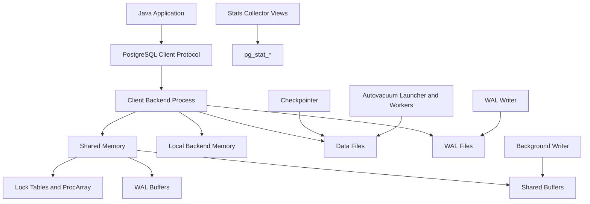
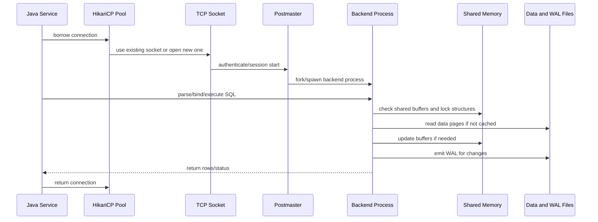
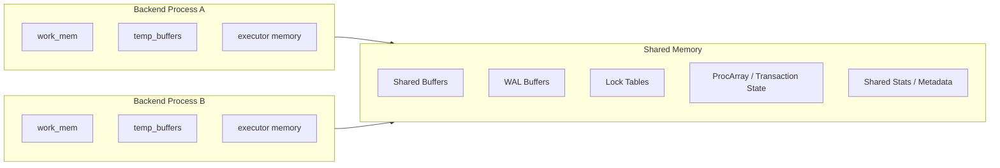
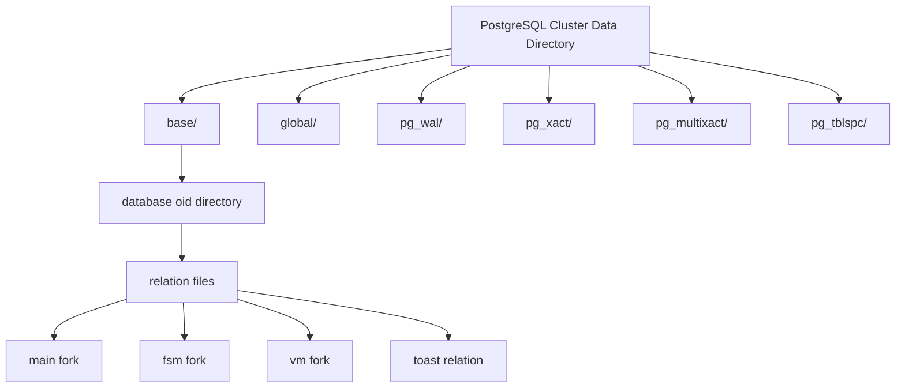
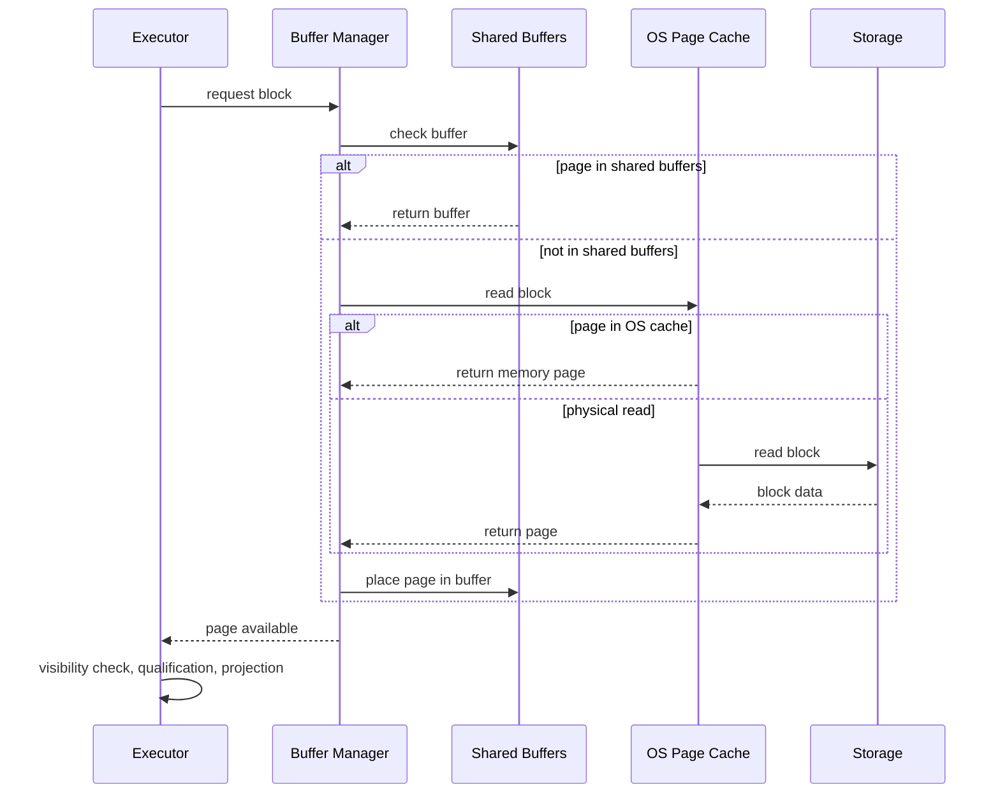
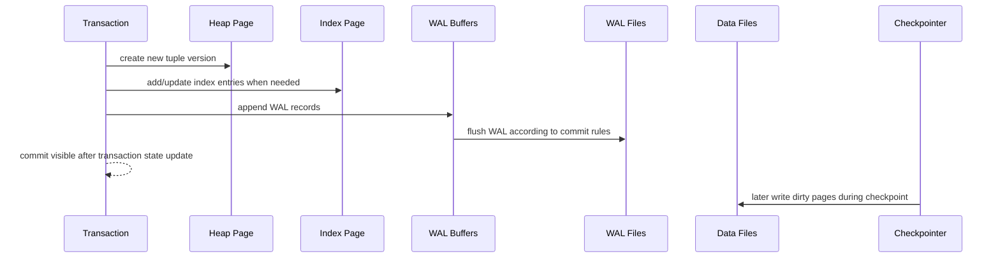
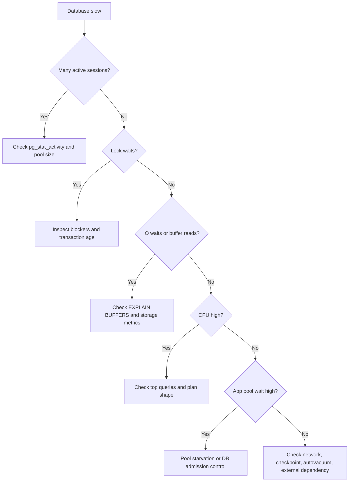

# Part 003 — PostgreSQL Architecture: Process, Memory, Storage

## 1. Tujuan Bagian Ini

Bagian ini membangun mental model PostgreSQL sebagai **database engine yang hidup di atas proses OS, memori, file storage, dan WAL**, bukan sebagai kotak hitam yang menerima SQL lalu mengembalikan row.

Setelah bagian ini, target kemampuan kita adalah:

1. memahami apa yang terjadi ketika Java application membuka koneksi PostgreSQL;
2. membedakan **client backend**, **shared memory**, **background process**, dan **data files**;
3. menjelaskan mengapa koneksi terlalu banyak bukan hanya masalah aplikasi, tetapi masalah OS process, memory, lock table, scheduler, dan cache locality;
4. memahami mengapa query lambat bisa berasal dari planner, cache miss, I/O, lock wait, WAL pressure, checkpoint, atau autovacuum;
5. membaca process list dan `pg_stat_activity` tanpa panik;
6. punya vocabulary yang benar untuk bagian-bagian berikutnya: MVCC, WAL, vacuum, query planner, index, replication, dan Java pooling.

Kita belum melakukan tuning. Di tahap ini, tujuan kita adalah membangun **map of the territory**. Tuning tanpa mental model biasanya berubah menjadi ritual mengganti parameter.

## 2. Mental Model Utama

PostgreSQL dapat dipahami sebagai empat lapisan yang saling terhubung:



Dari diagram ini, ada beberapa invariant penting:

- Setiap koneksi aktif biasanya dilayani oleh satu **backend process**.
- Backend process membaca dan menulis halaman data melalui **shared buffers**.
- Perubahan data harus direkam ke **WAL** sebelum dianggap durable sesuai konfigurasi durability.
- Banyak pekerjaan yang terlihat “magis” sebenarnya dilakukan oleh background process: writer, checkpointer, walwriter, autovacuum, archiver, replication sender/receiver, dan lainnya.
- PostgreSQL tidak menyimpan “table” sebagai objek abstrak di memori; PostgreSQL menyimpan file-file relasi, page, tuple, index, visibility metadata, dan WAL records.

Kalimat ringkasnya:

> PostgreSQL adalah sistem koordinasi antara backend process, shared memory, local memory, data files, WAL, dan background maintenance.

## 3. Dari Request Java ke Backend Process

Bayangkan Java service menjalankan query berikut:

```java
try (Connection c = dataSource.getConnection();
     PreparedStatement ps = c.prepareStatement("select * from orders where id = ?")) {
    ps.setObject(1, orderId);
    try (ResultSet rs = ps.executeQuery()) {
        // read result
    }
}
```

Di sisi PostgreSQL, ini bukan sekadar “fungsi database dipanggil”. Secara konseptual, alurnya seperti ini:



Untuk connection pool, koneksi fisik biasanya dipertahankan. Jadi, aplikasi tidak selalu membuat backend process baru untuk setiap request. Namun jumlah koneksi fisik tetap penting karena setiap koneksi berarti PostgreSQL harus menyediakan backend process/session yang bisa memakai resource.

### 3.1 Kenapa Ini Penting untuk Java Engineer?

Banyak engineer memperlakukan connection pool sebagai “semakin besar semakin aman”. Di PostgreSQL, ini sering salah.

Koneksi terlalu banyak dapat menyebabkan:

- context switching tinggi;
- memory pressure karena setiap backend punya local memory;
- lock table pressure;
- lebih banyak session idle dalam transaksi;
- latency spike ketika OS scheduler dan database saling berebut CPU;
- workload lebih sulit diprediksi;
- autovacuum dan background process kekurangan resource.

Connection pool bukan throttle kosmetik. Connection pool adalah **admission control** menuju database.

## 4. Process Model PostgreSQL

PostgreSQL secara tradisional memakai model **process-per-connection**. Artinya, koneksi client dilayani oleh proses backend terpisah, bukan thread ringan di dalam satu proses monolitik.

Secara production, kita perlu mengenali beberapa tipe proses.

| Process Type | Tugas Utama | Dampak Jika Bermasalah |
|---|---|---|
| `postmaster` / main server process | menerima koneksi, mengelola proses anak | database tidak menerima koneksi baru |
| `client backend` | menjalankan query user | query lambat, lock wait, memory usage |
| `background writer` | menulis dirty shared buffers agar backend tidak sering menulis sendiri | latency spike saat backend harus menulis dirty page |
| `checkpointer` | membuat checkpoint agar recovery tidak terlalu panjang | checkpoint storm, I/O spike |
| `walwriter` | menulis WAL buffers ke file WAL | commit latency dan WAL pressure |
| `autovacuum launcher` | menjadwalkan autovacuum workers | dead tuple menumpuk, bloat, wraparound risk |
| `autovacuum worker` | vacuum/analyze table | I/O dan lock ringan, tetapi penting untuk kesehatan |
| `walsender` | mengirim WAL ke replica/logical client | replication lag atau WAL retention |
| `walreceiver` | menerima WAL pada standby | standby tertinggal |
| `archiver` | mengarsipkan WAL untuk backup/PITR | WAL menumpuk jika archive gagal |
| `parallel worker` | membantu query parallel | query parallel bisa gagal scale jika worker kurang |

PostgreSQL menyediakan informasi `backend_type` di statistik aktivitas, sehingga kita bisa melihat jenis proses yang sedang aktif.

```sql
select
    pid,
    backend_type,
    state,
    wait_event_type,
    wait_event,
    now() - xact_start as xact_age,
    left(query, 120) as query
from pg_stat_activity
order by backend_type, pid;
```

### 4.1 Process List dari OS

Di Linux/macOS, kita juga bisa melihat process title PostgreSQL:

```bash
ps aux | grep postgres
```

Contoh pola yang mungkin terlihat:

```text
postgres: checkpointer
postgres: background writer
postgres: walwriter
postgres: autovacuum launcher
postgres: logical replication launcher
postgres: app_user appdb 10.0.0.5 idle
postgres: app_user appdb 10.0.0.5 SELECT
```

Untuk engineer production, membaca process list berguna ketika:

- monitoring database belum lengkap;
- query menggantung;
- container terlihat hidup tetapi koneksi lambat;
- ada proses autovacuum besar;
- ada session `idle in transaction`;
- CPU tinggi tetapi query tidak jelas dari aplikasi.

## 5. Memory Model

PostgreSQL memory bisa dibagi menjadi dua area besar:

1. **shared memory**: dipakai bersama oleh banyak process;
2. **local backend memory**: milik tiap backend process.



### 5.1 Shared Buffers

`shared_buffers` adalah area memori PostgreSQL untuk cache halaman data/index yang dibaca dari disk atau dimodifikasi sebelum ditulis kembali.

Hal penting:

- Shared buffers bukan seluruh cache database. OS page cache tetap berperan.
- Page PostgreSQL umumnya 8KB pada build default.
- Query membaca data melalui buffer manager.
- Perubahan halaman terjadi di shared buffers lalu nantinya ditulis ke storage.
- Dirty page tidak langsung berarti data hilang; WAL adalah bagian dari durability story.

Kesalahan umum:

```text
shared_buffers besar = pasti cepat
```

Yang lebih benar:

```text
shared_buffers adalah salah satu cache layer. Efeknya bergantung pada working set, OS cache, query shape, checkpoint behavior, dan memory pressure keseluruhan.
```

### 5.2 WAL Buffers

`wal_buffers` adalah shared memory untuk data WAL yang belum ditulis ke file WAL.

Saat transaksi mengubah data:

1. PostgreSQL membuat perubahan pada page di shared buffers.
2. PostgreSQL membuat WAL record yang menjelaskan perubahan itu.
3. WAL record masuk ke WAL buffers.
4. WAL writer/backend menulis WAL ke file.
5. Sesuai `synchronous_commit`, commit menunggu durability tertentu.

WAL adalah alasan PostgreSQL bisa crash lalu recover: data page mungkin belum semua ditulis, tetapi WAL dapat diputar ulang.

### 5.3 work_mem

`work_mem` adalah local memory yang dapat digunakan untuk operasi seperti sort, hash join, hash aggregate, dan materialization. Ini bukan total memory per koneksi. Ini juga bukan batas global.

Yang sering mengejutkan:

- Satu query bisa memakai beberapa operasi yang masing-masing menggunakan `work_mem`.
- Query parallel bisa mengalikan pemakaian memory.
- Banyak koneksi aktif bisa mengalikan konsumsi memory.
- Nilai `work_mem` tinggi dapat membuat satu query cepat tetapi membuat sistem tidak stabil saat concurrency naik.

Mental model:

```text
maximum transient memory risk ≈ active backends × memory-consuming nodes per query × work_mem × parallel workers
```

Ini bukan formula presisi, tetapi cukup untuk menghindari keputusan tuning yang berbahaya.

### 5.4 maintenance_work_mem

`maintenance_work_mem` dipakai untuk operasi maintenance seperti `VACUUM`, `CREATE INDEX`, dan `ALTER TABLE ADD FOREIGN KEY` tertentu. Nilainya bisa lebih besar dari `work_mem`, tetapi tetap perlu dikontrol karena operasi maintenance bisa berjalan bersamaan.

### 5.5 temp_buffers

`temp_buffers` adalah memory untuk temporary tables pada session. Ini jarang menjadi titik awal tuning, tetapi penting jika aplikasi banyak memakai temporary tables.

## 6. Storage Model: Dari Table ke File

PostgreSQL menyimpan data di bawah data directory. Di dalamnya ada banyak file dan subdirectory untuk database, relation, WAL, transaction status, dan metadata.

Kita tidak perlu menghafal semua file. Kita perlu tahu mental modelnya:



### 6.1 Cluster Data Directory

PostgreSQL “cluster” dalam konteks ini berarti satu instance data directory yang dikelola oleh satu server PostgreSQL. Ini bukan “cluster” HA otomatis seperti Kubernetes cluster.

Di dalam data directory terdapat:

- data table dan index;
- system catalog;
- WAL files;
- transaction status;
- configuration;
- replication metadata;
- temporary files;
- tablespace references.

### 6.2 Database OID dan Relation File

Setiap database memiliki directory internal berdasarkan OID. Setiap table/index disimpan sebagai relation file. Table besar dapat dipecah menjadi beberapa segment file.

Implikasi penting:

- rename table tidak berarti file path mudah dikenali secara nama manusia;
- storage debugging sering membutuhkan catalog query;
- operasi DDL bisa membuat relation baru lalu mengganti metadata;
- bloat terlihat sebagai file size yang tidak turun meskipun row logical sudah dihapus.

Untuk melihat mapping table ke file:

```sql
select
    c.oid,
    n.nspname as schema_name,
    c.relname,
    c.relkind,
    pg_relation_filepath(c.oid) as file_path,
    pg_size_pretty(pg_relation_size(c.oid)) as relation_size,
    pg_size_pretty(pg_total_relation_size(c.oid)) as total_size
from pg_class c
join pg_namespace n on n.oid = c.relnamespace
where n.nspname not in ('pg_catalog', 'information_schema')
order by pg_total_relation_size(c.oid) desc
limit 20;
```

### 6.3 Relation Forks

Untuk heap table dan banyak index, PostgreSQL menyimpan beberapa fork:

| Fork | Fungsi |
|---|---|
| main | data utama table/index |
| FSM / free space map | informasi ruang kosong yang bisa dipakai ulang |
| VM / visibility map | informasi page yang semua tuple-nya visible/frozen |
| init | dipakai untuk unlogged relation tertentu |

Visibility map penting untuk index-only scan dan vacuum. Free space map penting untuk reuse ruang kosong.

### 6.4 TOAST

Kolom besar seperti `text`, `jsonb`, `bytea`, atau array besar dapat disimpan di TOAST table internal. Ini membuat row utama tetap relatif kecil, tetapi akses kolom besar bisa memicu I/O tambahan.

Kesalahan desain yang sering terjadi:

- menyimpan payload JSON besar di table OLTP panas;
- selalu `select *` sehingga kolom TOAST ikut diambil;
- index/query dirancang seolah ukuran row kecil padahal payload besar;
- update field kecil menyebabkan tuple baru dan mungkin TOAST churn.

TOAST akan dibahas lebih detail di Part 007 dan Part 019.

## 7. Read Path Sederhana

Ketika backend membaca row:



Important point:

> Query lambat karena “disk” tidak selalu berarti disk fisik. Bisa karena shared buffer miss tetapi OS cache hit, bisa karena physical read, bisa karena lock wait, bisa karena planner memilih terlalu banyak page, bisa karena row visibility check mahal.

Kita akan belajar membedakannya lewat `EXPLAIN (ANALYZE, BUFFERS)` di Part 012.

## 8. Write Path Sederhana

Ketika backend mengubah row:



Critical invariant:

> Data page tidak harus langsung ditulis ke data file saat commit. WAL harus cukup durable untuk memungkinkan recovery.

Ini menjelaskan kenapa:

- commit latency berkaitan dengan WAL flush;
- checkpoint bisa membuat I/O spike;
- `fsync`, `synchronous_commit`, dan storage latency penting;
- backup/PITR berbasis WAL;
- replication lag sering bisa dibaca sebagai WAL shipping/replay problem.

## 9. Checkpoints dan Background Writer

### 9.1 Background Writer

Background writer mencoba menulis dirty buffers secara bertahap agar backend process tidak terlalu sering harus menulis dirty page sendiri ketika butuh clean buffer.

Jika background writer tidak cukup membantu, gejalanya bisa berupa:

- query biasa tiba-tiba punya latency spike;
- `buffers_backend` meningkat;
- write I/O bursty;
- cache churn tinggi.

Query inspeksi:

```sql
select * from pg_stat_bgwriter;
```

### 9.2 Checkpointer

Checkpoint adalah proses membuat titik konsisten agar crash recovery tidak perlu memutar WAL terlalu jauh.

Checkpoint tidak berarti semua aktivitas berhenti, tetapi checkpoint bisa menghasilkan write pressure besar.

Gejala checkpoint pressure:

- write I/O spike periodik;
- latency spike periodik;
- log berisi checkpoint yang terlalu sering;
- WAL tumbuh cepat;
- `pg_stat_checkpointer` menunjukkan write/sync time tinggi.

Query inspeksi:

```sql
select * from pg_stat_checkpointer;
```

Pada PostgreSQL modern, statistik checkpointer dan background writer dipisahkan lebih jelas dibanding versi lama. Ini membantu diagnosis apakah write pressure berasal dari checkpoint atau background writing.

## 10. Autovacuum sebagai Background Health System

Autovacuum bukan “fitur opsional”. Autovacuum adalah bagian dari health system PostgreSQL.

Karena MVCC membuat update/delete menghasilkan tuple lama, PostgreSQL harus membersihkan dead tuples dan memperbarui statistik planner. Autovacuum membantu:

- menghapus dead tuples yang tidak lagi terlihat oleh transaksi aktif;
- menghindari bloat berlebihan;
- menjalankan analyze agar statistik planner tetap akurat;
- mencegah transaction ID wraparound.

Autovacuum yang tertinggal bisa menyebabkan:

- table membesar padahal row logical tidak bertambah;
- index membesar;
- query lambat karena lebih banyak page dibaca;
- planner memilih plan buruk karena statistik stale;
- emergency vacuum untuk wraparound.

Autovacuum akan dibahas dalam Part 021 secara dalam. Untuk sekarang, cukup pegang satu mental model:

> PostgreSQL performance bukan hanya tentang query yang sedang berjalan, tetapi juga tentang sampah MVCC yang ditinggalkan query sebelumnya.

## 11. Observability Dasar Arsitektur

Kita perlu query-query kecil yang bisa dipakai setiap kali database terasa “aneh”.

### 11.1 Session dan Wait Event

```sql
select
    pid,
    usename,
    datname,
    backend_type,
    state,
    wait_event_type,
    wait_event,
    now() - coalesce(xact_start, query_start) as age,
    left(query, 160) as query
from pg_stat_activity
where pid <> pg_backend_pid()
order by age desc nulls last;
```

Interpretasi awal:

| Signal | Kemungkinan Makna |
|---|---|
| `active` + CPU tinggi | query benar-benar bekerja |
| `active` + wait `Lock` | query menunggu lock |
| `active` + wait `IO` | query menunggu I/O |
| `idle in transaction` | aplikasi membuka transaksi lalu diam |
| banyak `idle` | pool besar atau traffic rendah |
| banyak session dari satu service | pool sizing atau leak perlu dicek |

### 11.2 Database Size

```sql
select
    datname,
    pg_size_pretty(pg_database_size(datname)) as size
from pg_database
order by pg_database_size(datname) desc;
```

### 11.3 Largest Relations

```sql
select
    schemaname,
    relname,
    pg_size_pretty(pg_total_relation_size(format('%I.%I', schemaname, relname)::regclass)) as total_size,
    pg_size_pretty(pg_relation_size(format('%I.%I', schemaname, relname)::regclass)) as heap_size,
    pg_size_pretty(pg_indexes_size(format('%I.%I', schemaname, relname)::regclass)) as index_size
from pg_stat_user_tables
order by pg_total_relation_size(format('%I.%I', schemaname, relname)::regclass) desc
limit 20;
```

### 11.4 Checkpoint and Writer Stats

```sql
select * from pg_stat_bgwriter;
select * from pg_stat_checkpointer;
```

### 11.5 WAL Position

```sql
select
    pg_current_wal_lsn() as current_lsn,
    pg_wal_lsn_diff(pg_current_wal_lsn(), '0/0') as bytes_since_origin;
```

## 12. Java Production Implications

### 12.1 Pool Size Harus Berdasarkan Database Capacity

Java service sering punya banyak instance. Misalnya:

```text
20 pods × Hikari maximumPoolSize 30 = 600 possible PostgreSQL sessions
```

Jika database memiliki 8 atau 16 CPU core, 600 active sessions bukan “high throughput”. Itu sering menjadi antrian chaos di dalam database.

Lebih baik:

- pool kecil dan predictable;
- timeout jelas;
- request queue/backpressure di aplikasi;
- batch dan query shape benar;
- observability dari aplikasi sampai database.

### 12.2 Transaction Leak Lebih Berbahaya dari Connection Leak

Connection leak mudah terlihat karena pool habis. Transaction leak bisa lebih halus:

- session terlihat `idle in transaction`;
- vacuum tidak bisa membersihkan tuple lama;
- lock tertahan;
- bloat meningkat;
- query lain makin lambat.

Di Java, penyebab umum:

- `@Transactional` terlalu lebar;
- melakukan HTTP call di dalam transaksi;
- streaming result set tetapi transaksi dibiarkan lama;
- exception handling tidak menutup transaksi;
- Open Session in View.

### 12.3 Timeout Harus Berlapis

Minimal layer timeout yang perlu dipikirkan:

| Layer | Contoh |
|---|---|
| application request timeout | HTTP/gRPC request deadline |
| pool acquisition timeout | Hikari `connectionTimeout` |
| query timeout | JDBC statement timeout |
| transaction timeout | framework transaction timeout |
| PostgreSQL statement timeout | `statement_timeout` |
| lock timeout | `lock_timeout` |
| idle transaction timeout | `idle_in_transaction_session_timeout` |

Tanpa timeout, database bisa menjadi tempat request mati berkumpul.

## 13. Failure Modes yang Harus Diingat

### 13.1 Terlalu Banyak Koneksi

Gejala:

- CPU tinggi tetapi throughput tidak naik;
- latency p99 memburuk;
- banyak backend aktif;
- pool wait meningkat;
- database mulai menolak koneksi.

Penyebab:

- pool per service terlalu besar;
- autoscaling aplikasi tidak memperhitungkan database;
- job worker membuka koneksi sendiri;
- tidak ada PgBouncer ketika topology membutuhkannya.

### 13.2 Dirty Page dan Checkpoint Spike

Gejala:

- latency spike periodik;
- write I/O tinggi;
- checkpoint log sering;
- commit lambat saat WAL/storage pressure.

Penyebab:

- checkpoint terlalu sering;
- workload write burst;
- storage lambat;
- shared buffers/checkpoint configuration tidak sesuai;
- bulk update tanpa strategi.

### 13.3 Long Transaction Menghambat Vacuum

Gejala:

- table/index size naik;
- dead tuples tinggi;
- autovacuum berjalan tetapi tidak efektif;
- query memburuk seiring waktu.

Penyebab:

- transaksi aplikasi terlalu panjang;
- reporting query lama pada primary;
- cursor/streaming lama;
- job batch dalam satu transaksi besar.

### 13.4 Query Lambat karena Salah Layer Diagnosis

Gejala:

- engineer menambah index tetapi query tetap lambat;
- engineer menaikkan `work_mem` tetapi bottleneck sebenarnya lock;
- engineer menaikkan pool tetapi bottleneck sebenarnya database sudah saturated.

Penyebab:

- tidak membedakan planner problem, I/O problem, lock problem, memory spill, dan app pool problem.

## 14. Hands-On Lab

Gunakan lab dari Part 002.

### 14.1 Lihat Process PostgreSQL

```bash
docker compose exec postgres bash -lc "ps aux | grep postgres | grep -v grep"
```

Catat process yang muncul:

- checkpointer;
- background writer;
- walwriter;
- autovacuum launcher;
- logical replication launcher;
- client backend.

### 14.2 Lihat Backend Type

```sql
select backend_type, count(*)
from pg_stat_activity
group by backend_type
order by backend_type;
```

### 14.3 Buka Banyak Session

Di terminal berbeda:

```bash
for i in $(seq 1 20); do
  docker compose exec -T postgres psql -U app_user -d appdb -c "select pg_sleep(30);" &
done
wait
```

Lalu dari session lain:

```sql
select
    backend_type,
    state,
    wait_event_type,
    wait_event,
    count(*)
from pg_stat_activity
group by backend_type, state, wait_event_type, wait_event
order by count(*) desc;
```

Tujuannya bukan benchmarking. Tujuannya melihat bahwa koneksi bukan abstraksi gratis.

### 14.4 Lihat File Path Relation

```sql
create table if not exists architecture_probe (
    id bigint generated always as identity primary key,
    payload text not null,
    created_at timestamptz not null default now()
);

insert into architecture_probe(payload)
select repeat(md5(i::text), 10)
from generate_series(1, 10000) s(i);

select
    'architecture_probe'::regclass::oid as oid,
    pg_relation_filepath('architecture_probe') as file_path,
    pg_size_pretty(pg_relation_size('architecture_probe')) as heap_size,
    pg_size_pretty(pg_total_relation_size('architecture_probe')) as total_size;
```

### 14.5 Lihat Checkpoint Stats

```sql
checkpoint;
select * from pg_stat_checkpointer;
select * from pg_stat_bgwriter;
```

Jangan menjalankan `checkpoint` sembarangan di production hanya untuk eksperimen. Di lab, ini aman untuk belajar.

## 15. Diagnostic Playbook Awal

Ketika PostgreSQL terasa lambat, jangan langsung membuat index. Jalankan diagnosis awal:



Minimal query:

```sql
select
    pid,
    state,
    wait_event_type,
    wait_event,
    now() - query_start as query_age,
    now() - xact_start as xact_age,
    left(query, 200) as query
from pg_stat_activity
where datname = current_database()
order by query_age desc nulls last;
```

## 16. Common Misconceptions

### 16.1 “Database Lambat Berarti Butuh Index”

Index hanya salah satu kemungkinan. Database bisa lambat karena:

- lock wait;
- connection storm;
- memory spill;
- checkpoint I/O;
- stale statistics;
- bad query shape;
- autovacuum tertinggal;
- transaction leak;
- network latency;
- storage latency;
- pool misconfiguration.

### 16.2 “Idle Connection Tidak Masalah”

Idle connection lebih murah daripada active query, tetapi bukan gratis. Ia tetap session dengan state, process, dan potential memory. Dalam jumlah besar, idle connection membuat operasional lebih sulit dan bisa menghabiskan `max_connections`.

### 16.3 “Shared Buffers Harus Sebesar Mungkin”

Shared buffers perlu cukup besar untuk workload, tetapi terlalu besar tanpa mempertimbangkan OS cache, checkpoint, dan memory total dapat membuat sistem tidak stabil.

### 16.4 “Autovacuum Mengganggu, Matikan Saja”

Autovacuum mungkin menambah I/O, tetapi mematikannya seperti mematikan garbage collection. Masalahnya bukan autovacuum ada; masalahnya autovacuum tidak disetel sesuai workload atau workload menghasilkan terlalu banyak sampah.

## 17. Self-Correction Checklist

Sebelum lanjut ke Part 004, pastikan bisa menjawab:

- Apa perbedaan postmaster, backend process, dan background process?
- Mengapa connection pool terlalu besar bisa memperburuk performa PostgreSQL?
- Apa perbedaan shared memory dan local backend memory?
- Apa fungsi shared buffers?
- Apa fungsi WAL buffers?
- Mengapa commit tidak harus langsung menulis semua data page ke disk?
- Apa tugas background writer?
- Apa tugas checkpointer?
- Mengapa autovacuum penting untuk MVCC?
- Bagaimana melihat session aktif dan wait event?
- Bagaimana menemukan file path internal sebuah relation?
- Apa risiko `idle in transaction` dari aplikasi Java?

## 18. Takeaways

- PostgreSQL adalah sistem berbasis proses, shared memory, data files, WAL, dan background maintenance.
- Koneksi PostgreSQL bukan resource gratis. Untuk Java service, pool adalah mekanisme admission control.
- Shared buffers mempercepat akses page, tetapi bukan satu-satunya cache. OS page cache tetap penting.
- WAL adalah inti durability, crash recovery, replication, dan backup.
- Background writer, checkpointer, dan autovacuum adalah bagian dari kesehatan engine, bukan detail internal yang boleh diabaikan.
- Banyak gejala production tidak bisa diselesaikan dengan index karena bottleneck bisa berada di lock, I/O, checkpoint, memory, vacuum, atau connection management.

## 19. Referensi Utama

- PostgreSQL 18 Documentation — Monitoring Statistics: `pg_stat_activity`, `backend_type`, wait events.
- PostgreSQL 18 Documentation — Resource Consumption: `shared_buffers`, background writer, memory configuration.
- PostgreSQL 18 Documentation — Write Ahead Log configuration: `wal_buffers`, checkpoint-related settings.
- PostgreSQL 18 Documentation — Database File Layout and storage-related internals.
- PostgreSQL 18 Documentation — Routine Vacuuming and Autovacuum.

