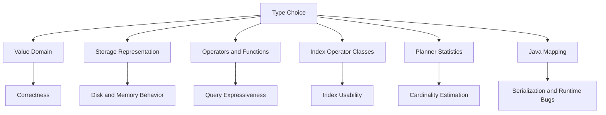
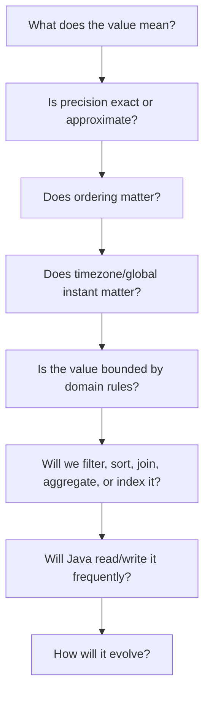
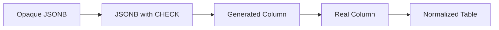

# Part 005 — PostgreSQL Type System Semantics

## 1. Tujuan Bagian Ini

Bagian ini membahas PostgreSQL type system sebagai **semantic boundary** antara domain bisnis, storage engine, query planner, dan Java application.

Kita tidak akan mengulang definisi basic seperti `integer` adalah bilangan bulat atau `text` adalah string. Fokus kita adalah keputusan desain yang sering menentukan correctness, evolvability, performance, dan failure mode production.

Setelah bagian ini, target kemampuan kita adalah:

1. memilih tipe PostgreSQL berdasarkan **makna domain**, bukan kebiasaan framework;
2. memahami efek tipe terhadap storage, indexing, comparison, collation, casting, query plan, dan Java mapping;
3. menghindari bug waktu, timezone, numeric precision, enum evolution, JSONB sprawl, dan array misuse;
4. memahami kapan memakai built-in type, domain type, enum type, range type, composite type, atau JSONB;
5. mendesain tipe yang mendukung constraint, migration, observability, dan queryability;
6. membuat keputusan yang dapat dipertanggungjawabkan di review arsitektur.

Kalimat pentingnya:

> Tipe data bukan detail implementasi. Tipe data adalah bagian dari kontrak domain dan query optimizer.

## 2. Mental Model: Type as Constraint, Encoding, and Operator Contract

Di PostgreSQL, sebuah tipe data membawa minimal empat konsekuensi:



Contoh sederhana:

```sql
create table payment (
    amount numeric(19, 4) not null,
    currency_code char(3) not null,
    paid_at timestamptz not null,
    external_id uuid not null
);
```

Schema di atas bukan hanya menyimpan data. Ia menyatakan:

- `amount` membutuhkan exact decimal arithmetic;
- `currency_code` dibatasi menjadi tiga karakter;
- `paid_at` adalah instant global, bukan local date-time ambigu;
- `external_id` adalah identifier 128-bit dengan format UUID;
- query, index, driver, dan aplikasi akan beroperasi berdasarkan aturan tipe tersebut.

Jika kita mengganti `numeric` menjadi `double precision`, `paid_at` menjadi `timestamp without time zone`, atau `external_id` menjadi `text`, aplikasi mungkin tetap berjalan, tetapi invariant domain mulai melemah.

## 3. Prinsip Memilih Tipe

Gunakan urutan pertanyaan berikut setiap kali mendesain kolom:



Checklist cepat:

| Pertanyaan | Keputusan Tipe |
|---|---|
| Apakah nilai uang? | Biasanya `numeric(p, s)` + currency code, bukan `float` |
| Apakah nilai pengukuran sensor besar dan approximate? | `double precision` bisa tepat |
| Apakah waktu adalah instant global? | `timestamptz` |
| Apakah waktu adalah jadwal lokal tanpa zona? | `timestamp without time zone` bisa masuk akal, tetapi harus eksplisit |
| Apakah status berubah sering? | `text` + check/domain sering lebih fleksibel daripada enum |
| Apakah status sangat stabil? | enum bisa masuk akal |
| Apakah data harus searchable per key? | structured columns atau generated column dari JSONB |
| Apakah data fleksibel tetapi tetap butuh query? | JSONB + constraint/index strategy |
| Apakah interval validitas penting? | `daterange`, `tsrange`, atau `tstzrange` |
| Apakah format harus berlaku di banyak tabel? | domain type |

## 4. Numeric Types: Exactness vs Approximation

### 4.1 Integer Types

PostgreSQL menyediakan `smallint`, `integer`, dan `bigint`. Dalam production, default yang aman untuk identifier sequence-backed biasanya `bigint`.

```sql
create table case_file (
    id bigint generated always as identity primary key,
    case_number text not null unique
);
```

Kenapa `bigint` sering lebih aman?

- ruang identifier lebih besar;
- migration dari `integer` ke `bigint` pada tabel besar bisa mahal;
- biaya storage tambahan 4 byte per row sering lebih murah daripada emergency migration;
- Java mapping ke `Long` lebih konsisten untuk ID database.

Namun jangan otomatis memakai `bigint` untuk semua angka. Untuk domain kecil seperti `priority_level` atau `attempt_count`, `integer` jelas dan cukup.

### 4.2 Numeric / Decimal

Gunakan `numeric(p, s)` ketika nilai harus exact:

```sql
amount numeric(19, 4) not null check (amount >= 0)
```

Cocok untuk:

- uang;
- kuantitas billing;
- rate kontraktual;
- nilai audit yang tidak boleh drift;
- hasil kalkulasi yang harus deterministik.

Di Java, map ke `BigDecimal`, bukan `double`.

```java
BigDecimal amount = resultSet.getBigDecimal("amount");
```

Anti-pattern:

```sql
-- buruk untuk uang
amount double precision not null
```

Masalahnya bukan hanya representasi floating point. Masalahnya adalah kontrak domain salah: database menyatakan nilai itu approximate.

### 4.3 Floating Point

`real` dan `double precision` berguna untuk data approximate:

- telemetry;
- machine learning feature;
- sensor reading;
- geo approximation tertentu;
- scoring yang memang probabilistic.

Jangan gunakan floating point untuk equality-sensitive business rule:

```sql
-- riskan
where calculated_fee = expected_fee
```

Floating point lebih cocok untuk range comparison dengan toleransi:

```sql
where abs(observed_value - expected_value) < 0.0001
```

### 4.4 Serial vs Identity

Untuk schema modern, gunakan identity column:

```sql
id bigint generated always as identity primary key
```

`serial` bukan tipe sejati; ia shorthand lama yang membuat sequence dan default `nextval`. Identity column lebih eksplisit secara SQL standard dan lebih jelas sebagai properti kolom.

Gunakan:

```sql
id bigint generated always as identity
```

atau:

```sql
id bigint generated by default as identity
```

Perbedaan mental model:

| Mode | Makna |
|---|---|
| `ALWAYS` | database mengontrol nilai; explicit insert perlu override khusus |
| `BY DEFAULT` | database memberi default, tetapi aplikasi boleh memasukkan nilai eksplisit |

Untuk tabel domain utama, `ALWAYS` biasanya lebih aman. Untuk tabel import/migration, `BY DEFAULT` bisa lebih praktis.

## 5. Text, Varchar, Char, and Collation

### 5.1 `text` vs `varchar(n)`

Di PostgreSQL, `text` sering menjadi pilihan default yang baik untuk string tidak terbatas secara teknis. Gunakan `varchar(n)` ketika batas panjang adalah bagian dari domain atau integrasi eksternal.

```sql
email text not null,
country_code char(2) not null,
external_reference varchar(64) not null
```

Pertanyaan desain:

- Apakah panjang maksimum berasal dari aturan bisnis?
- Apakah panjang maksimum berasal dari sistem eksternal?
- Apakah panjang maksimum hanya kebiasaan lama dari database lain?

Jika hanya kebiasaan, jangan menambahkan constraint palsu.

### 5.2 `char(n)` Hampir Tidak Pernah Pilihan Default

`char(n)` fixed-length dan melakukan padding. Ini bisa menimbulkan surprise pada comparison dan storage mental model.

Gunakan hanya ketika domain memang fixed-width:

```sql
country_code char(2) not null
```

Untuk kebanyakan field bisnis, gunakan `text` + constraint:

```sql
status text not null check (status in ('OPEN', 'CLOSED', 'ESCALATED'))
```

### 5.3 Case-Insensitive Search

Jangan mengandalkan `lower(column)` tanpa memahami index.

```sql
select *
from app_user
where lower(email) = lower(?);
```

Query ini butuh expression index agar efisien:

```sql
create unique index app_user_email_ci_uq
on app_user (lower(email));
```

Namun untuk email, desain lebih baik biasanya menyimpan normalized value:

```sql
create table app_user (
    id bigint generated always as identity primary key,
    email_original text not null,
    email_normalized text not null,
    constraint app_user_email_normalized_uq unique (email_normalized),
    constraint app_user_email_normalized_chk check (email_normalized = lower(email_normalized))
);
```

Aplikasi Java harus menormalisasi di boundary input dan database menegakkan invariant.

### 5.4 Collation Is a Query Contract

Collation mempengaruhi sorting, equality, pattern matching, index behavior, dan determinism. Dalam sistem multi-lingual, collation bukan detail kosmetik.

Contoh area rawan:

- sorting nama orang;
- case-insensitive comparison;
- accent-insensitive search;
- prefix search;
- index compatibility;
- hasil berbeda antar environment karena locale berbeda.

Untuk identifier teknis seperti status, code, slug, external key, gunakan semantik yang deterministic dan stabil. Untuk user-facing text, tentukan collation/search strategy secara eksplisit.

## 6. Boolean: Small Type, Big Ambiguity

`boolean` terlihat sederhana, tetapi sering menyembunyikan state machine yang belum dimodelkan.

Contoh buruk:

```sql
is_active boolean not null default true,
is_deleted boolean not null default false,
is_approved boolean not null default false
```

Pertanyaan:

- Apakah `is_active=false` berarti suspended, deleted, expired, atau never activated?
- Apakah `is_approved=false` berarti rejected atau pending?
- Apakah kombinasi boolean tertentu invalid?

Sering kali lebih baik memakai status eksplisit:

```sql
account_status text not null
    check (account_status in ('PENDING_ACTIVATION', 'ACTIVE', 'SUSPENDED', 'CLOSED'))
```

Boolean cocok untuk property yang benar-benar binary dan independen:

```sql
email_verified boolean not null default false
```

Tetapi jika boolean mulai membentuk workflow, ubah menjadi state machine.

## 7. Date and Time Types

Waktu adalah sumber bug production yang sangat mahal. PostgreSQL menyediakan `date`, `time`, `timestamp`, `timestamptz`, dan `interval`.

### 7.1 Mental Model

| Tipe | Makna yang Cocok | Java Mapping |
|---|---|---|
| `date` | tanggal kalender tanpa jam | `LocalDate` |
| `time without time zone` | jam lokal tanpa tanggal | `LocalTime` |
| `timestamp without time zone` | local date-time tanpa zona | `LocalDateTime` |
| `timestamp with time zone` / `timestamptz` | instant global | `OffsetDateTime` atau `Instant` via driver handling |
| `interval` | durasi atau periode relatif | `Duration` / custom mapping, hati-hati bulan/hari |

### 7.2 `timestamptz` Bukan Menyimpan Timezone Original

Nama `timestamp with time zone` sering disalahpahami. Untuk event yang terjadi pada waktu global tertentu, gunakan `timestamptz`. PostgreSQL menormalisasi ke instant dan menampilkan berdasarkan session timezone.

Cocok untuk:

- `created_at`;
- `updated_at`;
- event audit;
- payment time;
- login time;
- deadline absolut;
- outbox event timestamp.

```sql
created_at timestamptz not null default now()
```

### 7.3 Kapan `timestamp without time zone` Masuk Akal?

Gunakan ketika nilai adalah local civil time, bukan instant global.

Contoh:

- jadwal toko buka jam 09:00 lokal;
- jadwal recurring meeting sebelum zona diterapkan;
- tanggal/jam yang belum memiliki lokasi/timezone;
- template kalender.

Namun jangan memakai `timestamp without time zone` untuk audit event production.

### 7.4 Store Future Schedules Carefully

Future schedule sering butuh tiga field:

```sql
scheduled_local_at timestamp without time zone not null,
time_zone_id text not null,
scheduled_instant timestamptz not null
```

Kenapa?

- user memilih local time;
- timezone rules bisa berubah;
- eksekusi butuh instant;
- audit perlu tahu niat user dan hasil resolusi.

Untuk sistem regulasi, enforcement, court deadline, SLA, dan escalation, jangan cuma simpan `timestamptz` jika makna legalnya adalah local date/time.

### 7.5 Java Boundary

Aturan praktis:

```java
// Untuk instant global
Instant createdAt;
OffsetDateTime paidAt;

// Untuk tanggal kalender
LocalDate effectiveDate;

// Untuk jadwal lokal
LocalDateTime scheduledLocalAt;
ZoneId zoneId;
```

Anti-pattern:

```java
// java.util.Date menyembunyikan semantik dan membuat API boundary kurang jelas
Date createdAt;
```

## 8. UUID and UUIDv7

PostgreSQL memiliki tipe `uuid`. Jangan simpan UUID sebagai `text` kecuali ada alasan kompatibilitas yang sangat kuat.

```sql
external_id uuid not null unique
```

Manfaat `uuid` dibanding `text`:

- validasi format native;
- storage lebih tepat;
- operator dan index sesuai;
- Java mapping ke `java.util.UUID` lebih eksplisit;
- mengurangi bug string normalization.

### 8.1 UUIDv4 vs UUIDv7

UUIDv4 random dan bagus untuk uniqueness. Namun random key sebagai primary key B-tree bisa menyebabkan locality buruk, page split lebih acak, dan index lebih tersebar.

UUIDv7 bersifat time-ordered. Untuk banyak workload insert-heavy, UUIDv7 lebih ramah terhadap locality dibanding UUID random murni, sambil tetap berguna untuk distributed ID generation.

Contoh:

```sql
id uuid primary key default uuidv7()
```

Pertimbangan:

| Pilihan | Cocok Untuk | Risiko |
|---|---|---|
| `bigint identity` | OLTP internal, compact, locality bagus | tidak global secara natural |
| `uuidv4()` | public id, distributed generation | random index locality |
| `uuidv7()` | public id + time ordering | timestamp leakage dan versi dependency |
| ULID di aplikasi | ecosystem tertentu | bukan native PostgreSQL type kecuali disimpan sebagai text/bytea/uuid-compatible strategy |

Pattern umum:

```sql
create table case_file (
    id bigint generated always as identity primary key,
    public_id uuid not null default uuidv7(),
    case_number text not null unique,
    created_at timestamptz not null default now(),
    constraint case_file_public_id_uq unique (public_id)
);
```

Gunakan `bigint` internal untuk join-heavy OLTP dan `uuid` untuk external/public identifier. Ini bukan aturan mutlak, tetapi sering menjadi trade-off yang baik.

## 9. JSON and JSONB

PostgreSQL memiliki `json` dan `jsonb`. Untuk kebanyakan use case queryable document, gunakan `jsonb`.

Mental model:

| Tipe | Makna |
|---|---|
| `json` | menyimpan text JSON dan mempertahankan representasi input lebih dekat |
| `jsonb` | menyimpan format binary terdekomposisi yang lebih cocok untuk operator dan indexing |

### 9.1 JSONB Bukan Izin untuk Menghapus Model Relasional

JSONB berguna ketika:

- attribute bervariasi antar source;
- integrasi eksternal berubah sering;
- audit snapshot perlu menyimpan payload asli;
- metadata tidak semua layak jadi kolom;
- schema-on-read masih terkendali.

JSONB berbahaya ketika:

- field sering dipakai join;
- field adalah business invariant utama;
- field sering difilter/sorted;
- field perlu foreign key;
- field perlu uniqueness constraint global;
- semua domain object dimasukkan ke satu `payload`.

### 9.2 Hybrid Pattern

```sql
create table enforcement_event (
    id bigint generated always as identity primary key,
    case_id bigint not null,
    event_type text not null,
    occurred_at timestamptz not null,
    source_system text not null,
    payload jsonb not null,
    created_at timestamptz not null default now(),

    constraint enforcement_event_type_chk
        check (event_type in ('NOTICE_SENT', 'PAYMENT_RECEIVED', 'CASE_ESCALATED')),
    constraint enforcement_event_payload_object_chk
        check (jsonb_typeof(payload) = 'object')
);
```

Relational columns menyimpan fields yang dibutuhkan untuk query, integrity, dan lifecycle. JSONB menyimpan detail tambahan.

### 9.3 Generated Columns from JSONB

Jika field JSONB mulai penting untuk query, naikkan ke generated column atau real column.

```sql
create table inbound_message (
    id bigint generated always as identity primary key,
    payload jsonb not null,
    external_id text generated always as (payload ->> 'externalId') stored,
    message_type text generated always as (payload ->> 'type') stored,
    received_at timestamptz not null default now(),
    constraint inbound_message_external_id_uq unique (external_id)
);
```

Ini memberi path evolusi:



Gunakan path ini agar fleksibilitas awal tidak menjadi hutang arsitektur permanen.

### 9.4 Java Mapping

Di Java, hindari memetakan JSONB sebagai `String` di seluruh domain layer. Lebih baik:

- gunakan DTO typed untuk payload yang dikenal;
- simpan raw JSON untuk audit;
- validasi schema di boundary;
- jangan menyebarkan `JsonNode` sampai core domain kecuali memang domainnya dynamic.

```java
record InboundPayload(
    String externalId,
    String type,
    Map<String, Object> attributes
) {}
```

## 10. Arrays

PostgreSQL arrays powerful, tetapi sering disalahgunakan untuk mengganti relasi one-to-many.

Cocok untuk:

- small bounded list;
- tags sederhana;
- denormalized read helper;
- vector kecil yang tidak butuh referential integrity;
- parameter query dengan `= any(?)`.

Tidak cocok untuk:

- child entities dengan lifecycle sendiri;
- data yang butuh foreign key per item;
- data yang sering diupdate per elemen;
- data yang perlu audit per elemen;
- many-to-many relation utama.

Contoh wajar:

```sql
create table document_search_hint (
    document_id bigint primary key,
    keywords text[] not null default '{}'
);
```

Contoh yang biasanya buruk:

```sql
-- buruk jika approver adalah entity dengan role, order, decision, timestamp
approver_user_ids bigint[] not null
```

Model relasional yang lebih defensible:

```sql
create table approval_step (
    workflow_id bigint not null,
    step_no integer not null,
    approver_user_id bigint not null,
    status text not null,
    decided_at timestamptz,
    primary key (workflow_id, step_no)
);
```

## 11. Range and Multirange Types

Range type adalah salah satu fitur PostgreSQL yang sangat kuat untuk sistem jadwal, validitas, pricing, entitlement, policy, dan enforcement lifecycle.

Built-in range umum:

| Range | Subtype | Use Case |
|---|---|---|
| `int4range` | integer | numeric segment kecil |
| `int8range` | bigint | large id/sequence ranges |
| `numrange` | numeric | price/rate ranges |
| `daterange` | date | validitas per tanggal |
| `tsrange` | timestamp without time zone | local time interval |
| `tstzrange` | timestamptz | global instant interval |

Contoh:

```sql
create table policy_version (
    policy_id bigint not null,
    version_no integer not null,
    effective_period daterange not null,
    rule_payload jsonb not null,
    primary key (policy_id, version_no)
);
```

Query ekspresif:

```sql
select *
from policy_version
where policy_id = ?
  and effective_period @> date '2026-07-01';
```

Overlap check:

```sql
select *
from policy_version
where policy_id = ?
  and effective_period && daterange(date '2026-07-01', date '2026-08-01', '[)');
```

### 11.1 Half-Open Interval `[)`

Untuk interval waktu, gunakan default mental model half-open:

```txt
[start, end)
```

Artinya start inclusive, end exclusive.

Manfaat:

- interval adjacent tidak overlap;
- durasi lebih mudah dihitung;
- tidak perlu sentinel `23:59:59.999`;
- cocok untuk scheduling dan validity.

```sql
-- valid: adjacent, not overlapping
[2026-01-01, 2026-02-01)
[2026-02-01, 2026-03-01)
```

### 11.2 Range vs Start/End Columns

Dua kolom biasa:

```sql
valid_from date not null,
valid_to date not null,
check (valid_from < valid_to)
```

Range column:

```sql
valid_period daterange not null,
check (not isempty(valid_period))
```

Range memberi operator native seperti `@>`, `&&`, `lower`, `upper`, dan bisa dipakai dengan GiST/exclusion/temporal constraints.

Untuk domain temporal kompleks, range sering lebih dekat dengan bahasa bisnis.

## 12. Enum Types

Enum PostgreSQL memberi type safety di database:

```sql
create type case_status as enum (
    'DRAFT',
    'OPEN',
    'UNDER_REVIEW',
    'CLOSED'
);

create table case_file (
    id bigint generated always as identity primary key,
    status case_status not null
);
```

Manfaat:

- nilai invalid tidak bisa masuk;
- query lebih jelas;
- domain state terlihat di catalog.

Risiko:

- evolusi enum butuh DDL;
- menghapus/rename value tidak sesederhana mengubah check constraint;
- deployment ordering aplikasi dan database harus dikontrol;
- enum database bisa bertabrakan dengan enum Java jika tidak ada migration discipline.

Gunakan enum PostgreSQL ketika values sangat stabil dan dipakai luas.

Untuk workflow yang sering berubah, pertimbangkan:

```sql
status text not null,
constraint case_file_status_chk check (status in ('DRAFT', 'OPEN', 'UNDER_REVIEW', 'CLOSED'))
```

Atau reference table:

```sql
create table case_status_ref (
    code text primary key,
    description text not null,
    terminal boolean not null default false
);
```

Decision matrix:

| Kebutuhan | Pilihan |
|---|---|
| Values sangat stabil | enum PostgreSQL |
| Values berubah tiap release | text + check |
| Values dikonfigurasi business/admin | reference table |
| Values punya metadata | reference table |
| Values bagian dari state machine formal | reference table + transition table/constraint |

## 13. Domain Types

Domain type memungkinkan reusable constraint di atas base type.

Contoh:

```sql
create domain email_text as text
check (
    value ~* '^[A-Z0-9._%+-]+@[A-Z0-9.-]+\.[A-Z]{2,}$'
);

create domain positive_amount as numeric(19, 4)
check (value >= 0);
```

Pemakaian:

```sql
create table invoice (
    id bigint generated always as identity primary key,
    customer_email email_text not null,
    amount positive_amount not null
);
```

Manfaat:

- invariant konsisten lintas tabel;
- schema lebih expressive;
- review lebih mudah;
- mengurangi copy-paste check constraint.

Risiko:

- migration domain constraint bisa berdampak luas;
- sebagian ORM/tooling kurang nyaman dengan domain;
- error message perlu dikelola;
- constraint terlalu ketat bisa menghambat data cleansing/import.

Gunakan domain untuk invariant yang benar-benar lintas konteks dan stabil, misalnya normalized code, amount positif, percentage, atau identifier format tertentu.

## 14. Composite Types

Composite type merepresentasikan struktur row-like.

```sql
create type money_amount as (
    amount numeric(19, 4),
    currency_code char(3)
);
```

Dalam aplikasi OLTP Java, composite type jarang menjadi default karena mapping ORM/JDBC bisa lebih kompleks. Namun composite berguna untuk:

- function return type;
- stored procedure boundary;
- specialized SQL API;
- encapsulated reporting output;
- extension-like schema design.

Jangan gunakan composite type untuk menghindari normalisasi jika domain child object butuh query, constraint, dan lifecycle sendiri.

## 15. Network, Binary, and Specialized Types

PostgreSQL menyediakan tipe khusus seperti `inet`, `cidr`, `macaddr`, `bytea`, `tsvector`, `pg_lsn`, geometric types, dan lainnya.

Prinsipnya:

> Jika PostgreSQL memiliki tipe yang sesuai dengan domain teknis dan menyediakan operator/index yang relevan, gunakan tipe native dibanding `text`.

Contoh IP address:

```sql
create table login_attempt (
    id bigint generated always as identity primary key,
    user_id bigint,
    source_ip inet not null,
    attempted_at timestamptz not null default now()
);
```

Query:

```sql
select *
from login_attempt
where source_ip << inet '10.0.0.0/8';
```

Jika disimpan sebagai `text`, query network semantics harus dibuat manual dan rawan salah.

## 16. Casting and Implicit Conversion

Type mismatch dapat menyebabkan query tidak memakai index atau menghasilkan plan tidak stabil.

Contoh:

```sql
-- parameter dikirim sebagai text, kolom uuid
select * from account where public_id = ?;
```

Pastikan Java mengirim parameter sebagai UUID:

```java
PreparedStatement ps = connection.prepareStatement(
    "select * from account where public_id = ?"
);
ps.setObject(1, uuid); // java.util.UUID
```

Bukan:

```java
ps.setString(1, uuid.toString());
```

Meskipun PostgreSQL bisa cast, jangan bergantung pada implicit behavior. Explicit type mapping membuat query, plan, dan error lebih predictable.

## 17. Nullability Is Part of the Type Contract

`null` bukan nilai biasa. Ia berarti unknown/absent/not applicable tergantung domain. Jangan menjadikan nullable sebagai default malas.

Pertanyaan untuk setiap nullable column:

1. Apa arti `null`?
2. Apakah `null` berbeda dari empty string, zero, empty array, atau open-ended range?
3. Apakah aplikasi bisa menangani `null` di semua path?
4. Apakah query aggregate dan predicate akan berubah karena `null`?
5. Apakah constraint perlu `is not null`?

Contoh buruk:

```sql
closed_at timestamptz null
```

Bisa benar, tetapi harus jelas:

- `closed_at is null` berarti case belum closed;
- status harus konsisten dengan `closed_at`.

Constraint:

```sql
constraint case_closed_at_consistency_chk check (
    (status = 'CLOSED' and closed_at is not null)
    or
    (status <> 'CLOSED' and closed_at is null)
)
```

## 18. Java Mapping Reference

| PostgreSQL | Java Recommended | Catatan |
|---|---|---|
| `bigint` | `Long` / `long` | ID dan counter besar |
| `integer` | `Integer` / `int` | domain kecil/menengah |
| `numeric` | `BigDecimal` | uang/exact value |
| `double precision` | `Double` / `double` | approximate value |
| `text` | `String` | default string |
| `uuid` | `UUID` | gunakan `setObject` |
| `date` | `LocalDate` | tanggal kalender |
| `timestamptz` | `OffsetDateTime` / `Instant` | instant global |
| `timestamp` | `LocalDateTime` | local date-time |
| `jsonb` | typed DTO / `JsonNode` / custom type | jangan bocorkan ke semua layer |
| `text[]` | `List<String>` / array mapping | hati-hati ORM support |
| range types | custom mapping | sering butuh library/custom converter |
| enum | Java enum + migration discipline | hati-hati rollout |
| domain | base Java type + validation | tooling/ORM perlu dites |

## 19. Production Type-Choice Failure Modes

| Failure | Penyebab | Gejala | Pencegahan |
|---|---|---|---|
| Monetary drift | `double precision` untuk uang | reconciliation mismatch | `numeric` + `BigDecimal` |
| Timezone bug | audit pakai `timestamp` | event bergeser antar timezone | `timestamptz` untuk instant |
| Enum rollout gagal | app deploy sebelum DDL enum | insert status baru error | migration-first rollout |
| JSONB sprawl | semua field masuk payload | query lambat, no FK, no constraint | hybrid model |
| UUID index random | UUIDv4 primary key insert-heavy | bloat/page split/cache miss | bigint internal atau UUIDv7 |
| Array-as-relation | child entity disimpan array | sulit audit/join/update | table child normal |
| Collation drift | environment locale beda | sort/search beda | explicit collation/search policy |
| Implicit cast | parameter Java salah type | index tidak optimal/error | bind typed parameters |
| Nullable ambiguity | null tidak punya arti jelas | bug predicate/reporting | document + constraint |

## 20. Decision Examples

### 20.1 Regulatory Case Table

```sql
create table case_file (
    id bigint generated always as identity primary key,
    public_id uuid not null default uuidv7(),
    case_number text not null,
    status text not null,
    priority integer not null default 3,
    opened_at timestamptz not null default now(),
    closed_at timestamptz,
    metadata jsonb not null default '{}'::jsonb,

    constraint case_file_public_id_uq unique (public_id),
    constraint case_file_case_number_uq unique (case_number),
    constraint case_file_status_chk check (
        status in ('DRAFT', 'OPEN', 'UNDER_REVIEW', 'ESCALATED', 'CLOSED')
    ),
    constraint case_file_priority_chk check (priority between 1 and 5),
    constraint case_file_metadata_object_chk check (jsonb_typeof(metadata) = 'object'),
    constraint case_file_closed_at_chk check (
        (status = 'CLOSED' and closed_at is not null)
        or
        (status <> 'CLOSED' and closed_at is null)
    )
);
```

Why this shape?

- internal `bigint` gives compact joins;
- `public_id uuid` gives safe external reference;
- status is `text + check`, allowing easier evolution than enum;
- `timestamptz` captures real events;
- `metadata jsonb` handles controlled extension;
- constraints encode lifecycle invariants.

### 20.2 Policy Validity Table

```sql
create table policy_rule_version (
    policy_id bigint not null,
    version_no integer not null,
    effective_period daterange not null,
    rule_payload jsonb not null,
    created_at timestamptz not null default now(),

    primary key (policy_id, version_no),
    constraint policy_rule_period_not_empty_chk check (not isempty(effective_period)),
    constraint policy_rule_payload_object_chk check (jsonb_typeof(rule_payload) = 'object')
);
```

Part 006 akan memperkuat ini dengan temporal/exclusion constraints untuk mencegah overlap.

## 21. Kaufman Practice: 90-Minute Type Design Drill

Gunakan lab dari Part 002.

### Drill 1 — Replace Weak Types

Ambil schema mentah berikut:

```sql
create table raw_case (
    id text,
    amount double precision,
    status varchar(255),
    created_at timestamp,
    payload text
);
```

Tugas:

1. ubah menjadi schema PostgreSQL yang defensible;
2. jelaskan setiap tipe;
3. tambahkan constraint minimal;
4. tulis mapping Java;
5. tulis dua query yang akan sering dipakai.

### Drill 2 — Time Semantics

Modelkan:

- event audit yang terjadi sekarang;
- deadline legal berdasarkan tanggal lokal;
- schedule reminder pada timezone user;
- validity period policy.

Untuk setiap field, pilih tipe dan jelaskan mengapa.

### Drill 3 — JSONB Evolution

Mulai dari payload JSONB:

```json
{
  "externalId": "abc-123",
  "type": "NOTICE_SENT",
  "recipient": {
    "email": "user@example.com"
  }
}
```

Desain evolusi:

1. raw JSONB;
2. generated column untuk `externalId` dan `type`;
3. real columns;
4. normalized recipient table.

## 22. Self-Correction Checklist

Sebelum approve schema, tanyakan:

- Apakah tipe mencerminkan makna domain?
- Apakah precision sesuai?
- Apakah timezone semantics eksplisit?
- Apakah identifier internal dan external dibedakan?
- Apakah JSONB dipakai untuk fleksibilitas yang terkendali, bukan sebagai dumping ground?
- Apakah nullable column punya arti jelas?
- Apakah status sebaiknya boolean, text+check, enum, atau reference table?
- Apakah range type bisa membuat temporal logic lebih jelas?
- Apakah Java mapping typed dan tidak bergantung pada string conversion?
- Apakah tipe mendukung query dan index yang akan dipakai?

## 23. Takeaways

1. Type choice adalah bagian dari architecture, bukan detail DDL.
2. `numeric`/`BigDecimal` untuk exact decimal; floating point untuk approximate value.
3. `timestamptz` untuk instant global; `timestamp` untuk local date-time yang memang local.
4. UUID native lebih baik daripada UUID-as-text; UUIDv7 berguna untuk time-ordered identifiers.
5. JSONB powerful jika dikombinasikan dengan constraint, generated columns, dan strategy evolusi.
6. Arrays bukan pengganti child table jika elemen punya lifecycle sendiri.
7. Range types membuat temporal validity dan overlap logic jauh lebih eksplisit.
8. Enum PostgreSQL kuat tetapi perlu migration discipline; text+check/reference table sering lebih evolvable.
9. Domain type berguna untuk invariant reusable yang stabil.
10. Java engineer harus memahami tipe PostgreSQL karena driver, ORM, query planner, dan production behavior bergantung padanya.

## 24. Referensi Resmi

- PostgreSQL Documentation — Chapter 8: Data Types
- PostgreSQL Documentation — UUID Type and UUID Functions
- PostgreSQL Documentation — Date/Time Types
- PostgreSQL Documentation — JSON Types and JSON Functions
- PostgreSQL Documentation — Arrays
- PostgreSQL Documentation — Range Types
- PostgreSQL Documentation — CREATE TABLE
- PostgreSQL 18 Release Notes
