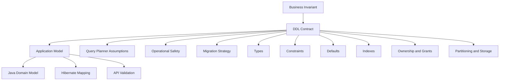
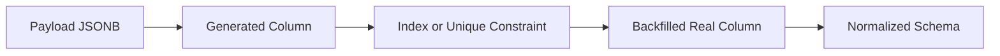

# Part 006 — DDL as Application Contract

## 1. Tujuan Bagian Ini

Bagian ini membahas DDL sebagai **contract boundary** antara database, aplikasi Java, migration pipeline, operasi production, dan domain bisnis.

Banyak engineer melihat DDL sebagai file migration yang “membuat tabel”. Itu terlalu dangkal. Dalam sistem production, DDL adalah tempat kita menyatakan:

- data apa yang mungkin ada;
- kombinasi data apa yang mustahil;
- siapa yang memiliki object;
- perubahan apa yang aman;
- invariant apa yang tidak boleh dilanggar walau ada bug aplikasi;
- bagaimana query planner dapat mempercayai struktur data;
- bagaimana aplikasi melakukan rollout tanpa downtime.

Setelah bagian ini, target kemampuan kita adalah:

1. mendesain table contract yang menegakkan invariant penting;
2. membedakan constraint yang harus ada di database vs cukup di aplikasi;
3. memakai primary key, unique, foreign key, check, not null, exclusion, generated column, identity, dan temporal constraint secara benar;
4. memahami lock dan migration risk dari DDL;
5. menyusun DDL yang cocok untuk Java service, Hibernate/JPA, Flyway/Liquibase, dan production operations;
6. melakukan review schema seperti engineering contract, bukan sekadar syntax review.

Kalimat penting:

> Aplikasi boleh salah. Database contract harus melindungi invariant yang tidak boleh salah.

## 2. Mental Model: DDL Is a Contract Stack



DDL bukan pengganti domain model. DDL adalah garis pertahanan terakhir untuk invariant yang harus benar meskipun:

- ada bug di service;
- ada batch job lama;
- ada manual SQL dari operator;
- ada migration script keliru;
- ada integrasi eksternal mengirim payload buruk;
- ada race condition antar instance aplikasi.

## 3. Apa yang Harus Ditegakkan di Database?

Tidak semua aturan harus menjadi constraint database. Tetapi aturan yang menentukan integritas data utama sebaiknya ditegakkan di database.

| Rule | Database Constraint? | Alasan |
|---|---:|---|
| Primary identity unik | Ya | invariant global table |
| Email unik normalized | Ya | race condition antar app instance |
| Amount tidak negatif | Ya | cheap dan fundamental |
| Status hanya nilai valid | Ya | domain integrity |
| Transition `OPEN -> CLOSED` hanya oleh role tertentu | Sebagian | role check di app; final state consistency di DB |
| File upload max 20MB | Biasanya app/storage | bukan concern relational utama |
| SLA warning jika hampir overdue | App/job | derived behavior |
| Tidak boleh ada dua policy effective period overlap | Ya | temporal invariant global |
| User hanya lihat tenant sendiri | Ya, jika high-risk | RLS atau schema boundary bisa membantu |

Prinsip:

> Simpan aturan yang murah, stabil, dan penting di database. Simpan aturan yang context-heavy dan sering berubah di aplikasi, tetapi jangan biarkan aplikasi menjadi satu-satunya penjaga invariant kritikal.

## 4. Naming Convention untuk Constraint

Constraint name penting untuk observability, error handling, migration, dan debugging.

Gunakan pola eksplisit:

```txt
<table>_<column_or_purpose>_<type_suffix>
```

Contoh:

```sql
constraint case_file_case_number_uq unique (case_number),
constraint case_file_status_chk check (status in ('OPEN', 'CLOSED')),
constraint case_file_customer_fk foreign key (customer_id) references customer(id)
```

Suffix umum:

| Suffix | Makna |
|---|---|
| `_pk` | primary key |
| `_uq` | unique |
| `_fk` | foreign key |
| `_chk` | check |
| `_excl` | exclusion constraint |
| `_nn` | not-null jika diberi nama eksplisit |

Kenapa penting untuk Java?

Saat insert/update gagal, PostgreSQL mengembalikan SQLSTATE dan constraint name. Aplikasi bisa memetakan violation menjadi error domain yang jelas.

Contoh mapping:

```java
catch (PSQLException e) {
    ServerErrorMessage msg = e.getServerErrorMessage();
    String constraint = msg != null ? msg.getConstraint() : null;

    if ("case_file_case_number_uq".equals(constraint)) {
        throw new DuplicateCaseNumberException();
    }
    throw e;
}
```

Jangan mem-parse message text. Gunakan SQLSTATE dan constraint name.

## 5. Primary Key Contract

Primary key bukan hanya unique index. Primary key menyatakan row identity yang menjadi target foreign key, audit, dan mental model domain.

```sql
create table customer (
    id bigint generated always as identity,
    public_id uuid not null default uuidv7(),
    name text not null,
    created_at timestamptz not null default now(),

    constraint customer_pk primary key (id),
    constraint customer_public_id_uq unique (public_id)
);
```

### 5.1 Surrogate vs Natural Key

| Key | Manfaat | Risiko |
|---|---|---|
| Surrogate `bigint identity` | stable, compact FK, join efficient | butuh unique constraint tambahan untuk business key |
| Natural key | meaningful, no duplicate domain key | berubah jika domain/integrasi berubah |
| UUID primary key | external-safe, distributed | index locality/storage trade-off |
| Composite key | representasi domain kuat | ORM dan FK lebih verbose |

Pattern yang sering defensible:

- `id bigint identity` sebagai internal primary key;
- `public_id uuid default uuidv7()` sebagai external identifier;
- natural key tetap diberi unique constraint.

```sql
constraint case_file_case_number_uq unique (case_number)
```

Jangan membuat surrogate key lalu lupa menegakkan natural uniqueness. Itu menghasilkan duplicate domain object yang sulit dibersihkan.

## 6. Identity Columns and Defaults

### 6.1 Identity Column

Gunakan identity untuk ID auto-generated:

```sql
id bigint generated always as identity primary key
```

`ALWAYS` berarti aplikasi tidak boleh sembarang mengirim ID eksplisit kecuali memakai override khusus. Ini cocok untuk domain table utama.

Untuk import table atau table yang perlu preserve ID dari source:

```sql
id bigint generated by default as identity primary key
```

### 6.2 Defaults Are Write-Time Contracts

Default bukan sekadar convenience. Default menyatakan nilai yang digunakan ketika aplikasi tidak memberi nilai.

Contoh baik:

```sql
created_at timestamptz not null default now(),
metadata jsonb not null default '{}'::jsonb,
attempt_count integer not null default 0
```

Contoh perlu hati-hati:

```sql
status text not null default 'OPEN'
```

Apakah semua row baru benar-benar open? Atau seharusnya `DRAFT`? Default status salah dapat membuat workflow bug tidak terlihat.

### 6.3 Defaults Should Not Hide Missing Required Input

Jika nilai harus diberikan oleh caller, jangan beri default palsu.

```sql
-- buruk jika source_system wajib diketahui
source_system text not null default 'UNKNOWN'
```

Lebih baik gagal cepat:

```sql
source_system text not null
```

## 7. NOT NULL Contract

`not null` adalah constraint paling sederhana dan paling penting.

Gunakan `not null` untuk field yang wajib secara domain atau operasional:

```sql
created_at timestamptz not null default now(),
status text not null,
amount numeric(19, 4) not null
```

Nullable harus punya makna jelas.

Contoh nullable yang defensible:

```sql
closed_at timestamptz
```

Tetapi harus dikaitkan dengan status:

```sql
constraint case_file_closed_at_chk check (
    (status = 'CLOSED' and closed_at is not null)
    or
    (status <> 'CLOSED' and closed_at is null)
)
```

## 8. CHECK Constraints

Check constraint cocok untuk invariant row-local.

Contoh:

```sql
constraint payment_amount_non_negative_chk check (amount >= 0),
constraint case_priority_chk check (priority between 1 and 5),
constraint payload_object_chk check (jsonb_typeof(payload) = 'object')
```

### 8.1 Row-Local Means No Cross-Row Lookup

Check constraint tidak cocok untuk aturan seperti “tidak ada dua row overlap” atau “jumlah total child tidak boleh lebih dari X” karena itu cross-row invariant. Gunakan unique, exclusion, FK, trigger, atau transaction-level logic.

### 8.2 CHECK and NULL

Ekspresi check yang menghasilkan `TRUE` atau `UNKNOWN` dianggap pass. Ini berarti `null` dapat lolos jika tidak dicegah oleh `not null`.

```sql
price numeric check (price > 0)
```

`price = null` tidak melanggar check. Jika wajib, tambahkan `not null`:

```sql
price numeric not null check (price > 0)
```

### 8.3 Naming Check Constraints

Jangan biarkan constraint name auto-generated untuk invariant penting.

```sql
constraint invoice_amount_positive_chk check (amount > 0)
```

Nama ini membantu:

- error handling;
- migration;
- log analysis;
- support debugging;
- test assertion.

## 9. UNIQUE Constraints

Unique constraint menegakkan invariant cross-row berdasarkan equality.

```sql
constraint app_user_email_normalized_uq unique (email_normalized)
```

### 9.1 Unique and Race Conditions

Jangan hanya melakukan pre-check di aplikasi:

```java
if (!repository.existsByEmail(email)) {
    repository.insert(user);
}
```

Dua request concurrent bisa melewati check. Database unique constraint tetap wajib.

Pola benar:

1. coba insert;
2. tangkap unique violation;
3. mapping ke domain error atau idempotent response.

```sql
insert into app_user (email_original, email_normalized)
values (?, ?)
on conflict (email_normalized) do nothing;
```

Atau biarkan exception dan map constraint.

### 9.2 Partial Unique Index vs Unique Constraint

Untuk uniqueness bersyarat, gunakan partial unique index:

```sql
create unique index subscription_one_active_per_customer_uq
on subscription (customer_id)
where status = 'ACTIVE';
```

Ini bukan table constraint biasa, tetapi index-level contract.

Cocok untuk:

- hanya satu active subscription;
- hanya satu primary address;
- hanya satu open workflow;
- soft delete uniqueness.

Contoh soft delete:

```sql
create unique index app_user_email_active_uq
on app_user (email_normalized)
where deleted_at is null;
```

Trade-off: foreign key tidak bisa mereferensikan partial unique index sebagai target umum.

### 9.3 NULLS NOT DISTINCT

Secara default, unique constraint memperlakukan null sebagai tidak sama. Jika domain ingin null dianggap sama, gunakan `NULLS NOT DISTINCT`.

```sql
constraint customer_optional_external_ref_uq
unique nulls not distinct (external_ref)
```

Gunakan hanya ketika semantics-nya jelas.

## 10. Foreign Keys

Foreign key menegakkan referential integrity.

```sql
constraint order_customer_fk
foreign key (customer_id) references customer(id)
```

### 10.1 FK Is Not Just Documentation

Tanpa FK, database tidak mencegah orphan row.

Masalah umum ketika FK dihapus demi “performance”:

- orphan data muncul;
- delete/update manual merusak relationship;
- reporting salah;
- cleanup job menjadi kompleks;
- aplikasi harus melakukan integrity enforcement yang rawan race.

FK memang punya biaya, tetapi biaya corruption biasanya lebih tinggi.

### 10.2 ON DELETE Strategy

| Strategy | Makna | Cocok Untuk |
|---|---|---|
| `restrict` / default no action | parent tidak boleh dihapus jika child ada | domain critical |
| `cascade` | child ikut dihapus | child murni dependent |
| `set null` | relationship dilepas | optional relationship |
| soft delete | parent tidak dihapus fisik | audit/regulatory systems |

Untuk sistem regulasi/audit, physical cascade delete sering berbahaya kecuali untuk tabel teknis ephemeral.

Contoh dependent technical table:

```sql
constraint job_attempt_job_fk
foreign key (job_id) references job(id) on delete cascade
```

Contoh audit domain:

```sql
constraint case_event_case_fk
foreign key (case_id) references case_file(id) on delete restrict
```

### 10.3 Index Foreign Key Columns

PostgreSQL tidak otomatis membuat index pada referencing column. Untuk workload delete/update parent atau join child by parent, buat index:

```sql
create index case_event_case_id_idx on case_event (case_id);
```

Tanpa index, operasi parent delete/update dan join umum bisa lambat atau memicu lock wait lebih lama.

## 11. Deferrable Constraints

Deferrable constraint bisa dicek di akhir transaksi, bukan setiap statement.

```sql
constraint workflow_step_order_uq
unique (workflow_id, step_order)
deferrable initially immediate
```

Kapan berguna?

- reorder list dalam satu transaksi;
- circular references tertentu;
- bulk load dengan temporary inconsistent intermediate state;
- complex graph update.

Contoh reorder:

```sql
begin;
set constraints workflow_step_order_uq deferred;

update workflow_step set step_order = -1 where workflow_id = 1 and step_order = 1;
update workflow_step set step_order = 1 where workflow_id = 1 and step_order = 2;
update workflow_step set step_order = 2 where workflow_id = 1 and step_order = -1;

commit;
```

Hati-hati: deferrable constraint tidak cocok untuk semua path dan tidak bisa dipakai sebagai conflict arbiter untuk `ON CONFLICT`.

## 12. Exclusion Constraints

Exclusion constraint menegakkan aturan “tidak boleh ada dua row yang memenuhi kombinasi operator tertentu”. Ini lebih general daripada unique.

Contoh: tidak boleh ada dua booking overlapping untuk room yang sama.

```sql
create extension if not exists btree_gist;

create table room_booking (
    id bigint generated always as identity primary key,
    room_id bigint not null,
    booked_period tstzrange not null,
    booked_by bigint not null,

    constraint room_booking_period_not_empty_chk check (not isempty(booked_period)),
    constraint room_booking_no_overlap_excl exclude using gist (
        room_id with =,
        booked_period with &&
    )
);
```

Makna:

- `room_id with =` berarti room yang sama;
- `booked_period with &&` berarti period overlap;
- constraint melarang kedua kondisi true pada dua row.

Ini sangat berguna untuk:

- room/resource booking;
- policy effective periods;
- entitlement periods;
- assignment validity;
- non-overlapping case ownership;
- price list validity.

### 12.1 Exclusion vs Application Lock

Application lock bisa membantu orchestrasi, tetapi exclusion constraint tetap lebih kuat untuk invariant data.

Tanpa exclusion constraint:

```txt
T1 checks no overlap -> sees none
T2 checks no overlap -> sees none
T1 inserts
T2 inserts
corruption
```

Dengan exclusion constraint, salah satu transaksi akan gagal.

## 13. Temporal Constraints in PostgreSQL 18

PostgreSQL 18 memperkenalkan temporal constraints untuk primary key, unique, dan foreign key berbasis range.

Konsep utama:

```sql
unique (business_id, valid_period without overlaps)
```

Makna: untuk `business_id` yang sama, `valid_period` tidak boleh overlap.

Contoh policy version:

```sql
create extension if not exists btree_gist;

create table policy_version (
    policy_id bigint not null,
    valid_period daterange not null,
    rule_payload jsonb not null,

    constraint policy_version_period_not_empty_chk check (not isempty(valid_period)),
    constraint policy_version_uq unique (policy_id, valid_period without overlaps)
);
```

Secara mental, ini adalah syntax domain-friendly untuk pola exclusion constraint temporal.

### 13.1 Temporal Foreign Key with PERIOD

Temporal FK memastikan referencing row memiliki coverage penuh dari referenced period.

Contoh konseptual:

```sql
create table price_list (
    product_id bigint not null,
    valid_period daterange not null,
    price numeric(19, 4) not null,

    constraint price_list_uq unique (product_id, valid_period without overlaps)
);

create table invoice_line (
    id bigint generated always as identity primary key,
    product_id bigint not null,
    charged_period daterange not null,
    amount numeric(19, 4) not null,

    constraint invoice_line_price_period_fk
    foreign key (product_id, period charged_period)
    references price_list (product_id, period valid_period)
);
```

Makna: invoice line harus mengacu pada price list yang mencakup seluruh charged period.

Ini penting untuk domain seperti:

- entitlement;
- subscription;
- temporal policy;
- regulatory rule validity;
- assignment coverage;
- price validity.

### 13.2 Kapan Pakai Temporal Constraint vs Exclusion Manual?

| Kebutuhan | Pilihan |
|---|---|
| non-overlap sederhana berdasarkan key + range | temporal `without overlaps` |
| overlap rule dengan predicate tambahan | exclusion constraint manual |
| conditional non-overlap, misalnya hanya status active | exclusion + `where` predicate |
| temporal referential coverage | FK `period` |
| versi PostgreSQL < 18 | exclusion constraint manual |

## 14. Generated Columns

Generated column adalah kolom yang nilainya dihitung dari expression.

```sql
create table inbound_message (
    id bigint generated always as identity primary key,
    payload jsonb not null,
    external_id text generated always as (payload ->> 'externalId') stored,
    message_type text generated always as (payload ->> 'type') stored,
    received_at timestamptz not null default now(),

    constraint inbound_message_payload_object_chk check (jsonb_typeof(payload) = 'object'),
    constraint inbound_message_external_id_uq unique (external_id)
);
```

### 14.1 Stored vs Virtual

| Mode | Behavior | Cocok Untuk |
|---|---|---|
| `stored` | dihitung saat write dan disimpan | query/index sering, expression mahal, logical replication needs |
| `virtual` | dihitung saat read dan tidak disimpan | derived value ringan, hemat storage |

PostgreSQL 18 menjadikan virtual generated column sebagai default. Untuk production, tetap pilih eksplisit jika contract penting:

```sql
external_id text generated always as (payload ->> 'externalId') stored
```

### 14.2 Generated Column as Evolution Bridge

Generated columns sangat berguna untuk transisi dari JSONB ke relational model.



Ini mengurangi risiko big-bang migration.

### 14.3 Restrictions Matter

Generation expression harus deterministic/immutable sesuai aturan PostgreSQL. Jangan mencoba generated column yang bergantung pada waktu sekarang, subquery, atau table lain.

Buruk:

```sql
-- tidak valid sebagai generated expression yang stabil
age_days integer generated always as (current_date - created_at::date) stored
```

Gunakan view atau query untuk nilai volatile seperti umur relatif terhadap hari ini.

## 15. Domains as Reusable Contract

Domain type membuat reusable constraint.

```sql
create domain non_empty_text as text
check (length(trim(value)) > 0);

create domain positive_money as numeric(19, 4)
check (value >= 0);
```

Pemakaian:

```sql
create table fee_rule (
    id bigint generated always as identity primary key,
    code non_empty_text not null,
    amount positive_money not null
);
```

Gunakan domain ketika invariant:

- stabil;
- lintas banyak tabel;
- tidak terlalu context-specific;
- layak menjadi vocabulary schema.

Jangan membuat domain terlalu pintar untuk rule yang sering berubah.

## 16. DDL and Java/Hibernate Reality

Hibernate dapat menghasilkan DDL, tetapi untuk sistem production serius, DDL sebaiknya dikelola dengan migration tool seperti Flyway/Liquibase dan direview sebagai artifact engineering.

### 16.1 Jangan Mengandalkan ORM Auto-DDL di Production

Risiko:

- constraint name tidak stabil;
- tipe tidak sesuai domain PostgreSQL;
- index tidak optimal;
- migration lock tidak dikontrol;
- rollback tidak jelas;
- DDL berbeda antar environment;
- generated schema tidak memuat strategi zero-downtime.

Gunakan ORM mapping sebagai consumer dari schema, bukan sebagai sumber kebenaran tunggal.

### 16.2 Mapping Constraint Violation

PostgreSQL mengembalikan SQLSTATE:

| SQLSTATE | Makna Umum |
|---|---|
| `23505` | unique violation |
| `23503` | foreign key violation |
| `23502` | not-null violation |
| `23514` | check violation |
| `23P01` | exclusion violation |

Java service sebaiknya memetakan constraint violation ke domain error:

```java
public RuntimeException mapDataIntegrityViolation(PSQLException e) {
    ServerErrorMessage server = e.getServerErrorMessage();
    String sqlState = e.getSQLState();
    String constraint = server != null ? server.getConstraint() : null;

    return switch (constraint) {
        case "case_file_case_number_uq" -> new DuplicateCaseNumberException();
        case "policy_version_uq" -> new OverlappingPolicyPeriodException();
        default -> new PersistenceContractViolationException(sqlState, constraint, e);
    };
}
```

## 17. Lock-Aware DDL Mindset

DDL dapat mengambil lock yang mengganggu production traffic. Detail lock akan dibahas lebih dalam pada bagian transaction/locking dan migration, tetapi sejak sekarang gunakan prinsip berikut:

1. DDL bukan operasi gratis;
2. tabel besar harus diperlakukan berbeda dari tabel kecil;
3. constraint validation dan index creation perlu strategi;
4. migration harus diuji dengan data volume realistis;
5. setiap migration harus punya rollback/roll-forward plan.

Contoh safer migration untuk menambah constraint pada tabel besar:

```sql
alter table payment
add constraint payment_amount_non_negative_chk
check (amount >= 0) not valid;

alter table payment
validate constraint payment_amount_non_negative_chk;
```

`not valid` memungkinkan constraint berlaku untuk data baru tetapi validasi data lama dilakukan terpisah. Ini berguna untuk rollout bertahap.

Untuk index besar:

```sql
create index concurrently payment_customer_created_at_idx
on payment (customer_id, created_at desc);
```

`concurrently` mengurangi blocking, tetapi memiliki aturan transaksi khusus dan failure handling tersendiri.

## 18. Designing a Production Table Contract

Contoh lengkap:

```sql
create extension if not exists btree_gist;

create table case_file (
    id bigint generated always as identity,
    public_id uuid not null default uuidv7(),
    tenant_id bigint not null,
    case_number text not null,
    status text not null,
    priority integer not null default 3,
    opened_at timestamptz not null default now(),
    closed_at timestamptz,
    metadata jsonb not null default '{}'::jsonb,
    version integer not null default 0,

    constraint case_file_pk primary key (id),
    constraint case_file_public_id_uq unique (public_id),
    constraint case_file_tenant_case_number_uq unique (tenant_id, case_number),
    constraint case_file_status_chk check (
        status in ('DRAFT', 'OPEN', 'UNDER_REVIEW', 'ESCALATED', 'CLOSED')
    ),
    constraint case_file_priority_chk check (priority between 1 and 5),
    constraint case_file_metadata_object_chk check (jsonb_typeof(metadata) = 'object'),
    constraint case_file_closed_at_chk check (
        (status = 'CLOSED' and closed_at is not null)
        or
        (status <> 'CLOSED' and closed_at is null)
    ),
    constraint case_file_version_chk check (version >= 0)
);

create index case_file_tenant_status_opened_idx
on case_file (tenant_id, status, opened_at desc);
```

Apa contract-nya?

- `id` adalah internal identity;
- `public_id` aman untuk external API;
- `tenant_id + case_number` unik per tenant;
- `status` dibatasi;
- `priority` bounded;
- metadata harus object;
- closed state konsisten dengan `closed_at`;
- version tersedia untuk optimistic locking;
- index mengikuti query shape umum.

## 19. Contract for State Machine

Database tidak selalu harus menegakkan semua transition, tetapi minimal harus mencegah state impossible.

```sql
create table enforcement_action (
    id bigint generated always as identity primary key,
    case_id bigint not null references case_file(id),
    action_type text not null,
    status text not null,
    due_at timestamptz,
    completed_at timestamptz,
    cancelled_at timestamptz,

    constraint enforcement_action_type_chk check (
        action_type in ('NOTICE', 'FINE', 'INSPECTION', 'ESCALATION')
    ),
    constraint enforcement_action_status_chk check (
        status in ('PENDING', 'IN_PROGRESS', 'COMPLETED', 'CANCELLED')
    ),
    constraint enforcement_action_terminal_timestamp_chk check (
        (status = 'COMPLETED' and completed_at is not null and cancelled_at is null)
        or
        (status = 'CANCELLED' and cancelled_at is not null and completed_at is null)
        or
        (status in ('PENDING', 'IN_PROGRESS') and completed_at is null and cancelled_at is null)
    )
);
```

Transition authorization tetap di aplikasi. Tetapi impossible terminal timestamp combination dicegah database.

## 20. Contract for Temporal Validity

Policy version tidak boleh overlap:

```sql
create table policy_assignment (
    policy_id bigint not null,
    jurisdiction_code text not null,
    active_period daterange not null,
    assigned_by bigint not null,
    assigned_at timestamptz not null default now(),

    constraint policy_assignment_period_not_empty_chk check (not isempty(active_period)),
    constraint policy_assignment_no_overlap_uq
        unique (jurisdiction_code, active_period without overlaps)
);
```

Untuk versi PostgreSQL sebelum 18, gunakan exclusion constraint:

```sql
create extension if not exists btree_gist;

alter table policy_assignment
add constraint policy_assignment_no_overlap_excl
exclude using gist (
    jurisdiction_code with =,
    active_period with &&
);
```

## 21. Contract for Idempotency

Idempotency penting untuk distributed Java services.

```sql
create table idempotency_record (
    id bigint generated always as identity primary key,
    idempotency_key text not null,
    operation_name text not null,
    request_hash text not null,
    response_payload jsonb,
    status text not null,
    created_at timestamptz not null default now(),
    completed_at timestamptz,

    constraint idempotency_record_key_operation_uq unique (idempotency_key, operation_name),
    constraint idempotency_record_status_chk check (status in ('STARTED', 'COMPLETED', 'FAILED')),
    constraint idempotency_record_response_chk check (
        (status = 'COMPLETED' and response_payload is not null and completed_at is not null)
        or
        (status <> 'COMPLETED')
    )
);
```

Aplikasi melakukan:

1. insert idempotency key;
2. jika unique violation, baca existing result;
3. jika started terlalu lama, apply recovery rule;
4. update completed dalam transaksi yang benar.

## 22. Contract Review Checklist

Saat review DDL, gunakan checklist ini:

### 22.1 Domain Correctness

- Apakah table merepresentasikan satu aggregate/entity yang jelas?
- Apakah setiap column punya makna domain?
- Apakah nullable column punya arti eksplisit?
- Apakah status/state memiliki constraint?
- Apakah timestamp memakai tipe yang benar?
- Apakah money memakai exact numeric?

### 22.2 Integrity

- Apakah primary key jelas?
- Apakah natural key diberi unique constraint?
- Apakah FK penting ada?
- Apakah FK column perlu index?
- Apakah cross-row invariant butuh unique/exclusion/temporal constraint?
- Apakah check constraint row-local sudah cukup?

### 22.3 Evolvability

- Apakah enum terlalu kaku?
- Apakah JSONB punya path evolusi?
- Apakah generated column bisa menjadi bridge?
- Apakah constraint bisa ditambahkan `not valid` dulu?
- Apakah migration bisa berjalan tanpa blocking besar?

### 22.4 Java Integration

- Apakah tipe cocok dengan Java mapping?
- Apakah Hibernate mapping eksplisit?
- Apakah constraint names stabil untuk error mapping?
- Apakah optimistic locking perlu version column?
- Apakah insert/update flow aware terhadap default dan generated columns?

### 22.5 Operations

- Apakah table besar membutuhkan partitioning/lifecycle?
- Apakah audit/soft delete policy jelas?
- Apakah index terkait contract sudah ada?
- Apakah DDL berisiko lock tinggi?
- Apakah rollback/roll-forward path jelas?

## 23. Kaufman Practice: DDL Contract Drill

Gunakan schema buruk berikut:

```sql
create table action (
    id serial,
    case_id int,
    type varchar(255),
    status varchar(255),
    start_date timestamp,
    end_date timestamp,
    amount float,
    payload text
);
```

Tugas 1: ubah menjadi DDL production-grade.

Minimal harus ada:

- `bigint identity` primary key;
- FK ke `case_file`;
- status/type constraint;
- timestamp semantics benar;
- amount exact jika monetary;
- JSONB jika payload JSON;
- lifecycle timestamp consistency;
- index untuk query by case/status/due date;
- constraint names stabil.

Tugas 2: tulis 5 invariant yang dijaga database.

Tugas 3: tulis 3 invariant yang tetap dijaga aplikasi.

Tugas 4: jelaskan migration dari schema lama ke schema baru tanpa downtime.

## 24. Anti-Patterns

| Anti-Pattern | Masalah | Alternatif |
|---|---|---|
| Semua kolom nullable | data ambiguity | `not null` + explicit optional semantics |
| Semua status `varchar(255)` tanpa check | invalid state | text+check/enum/ref table |
| FK dihapus demi performance | orphan data | index FK dan ukur biaya |
| UUID disimpan sebagai text | weak validation/storage | `uuid` native |
| Uang sebagai float | precision bug | `numeric` |
| JSONB untuk semua field | no contract | hybrid schema |
| Constraint auto-name | error handling lemah | explicit naming |
| ORM auto-DDL production | uncontrolled schema | migration scripts reviewed |
| DDL besar langsung di jam traffic | blocking risk | lock-aware migration |
| Unique hanya dicek aplikasi | race condition | unique constraint |

## 25. Takeaways

1. DDL adalah contract, bukan boilerplate migration.
2. Constraint database melindungi invariant saat aplikasi, job, atau operator salah.
3. Primary key menyatakan identity; unique constraint menyatakan domain uniqueness.
4. Foreign key adalah integrity guard, bukan sekadar dokumentasi.
5. Check constraint cocok untuk row-local invariant.
6. Exclusion dan temporal constraints cocok untuk overlap/validity invariant.
7. Generated columns membantu transisi dari flexible JSONB ke queryable relational design.
8. Constraint names adalah API diagnostik untuk Java error mapping.
9. DDL harus didesain dengan lock dan rollout strategy.
10. Production schema review harus membahas correctness, evolvability, Java mapping, dan operations sekaligus.

## 26. Referensi Resmi

- PostgreSQL Documentation — CREATE TABLE
- PostgreSQL Documentation — Constraints
- PostgreSQL Documentation — Generated Columns
- PostgreSQL Documentation — Identity Columns
- PostgreSQL Documentation — Exclusion Constraints
- PostgreSQL Documentation — Temporal Constraints in PostgreSQL 18
- PostgreSQL Documentation — ALTER TABLE
- PostgreSQL 18 Release Notes
