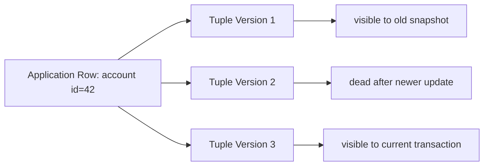
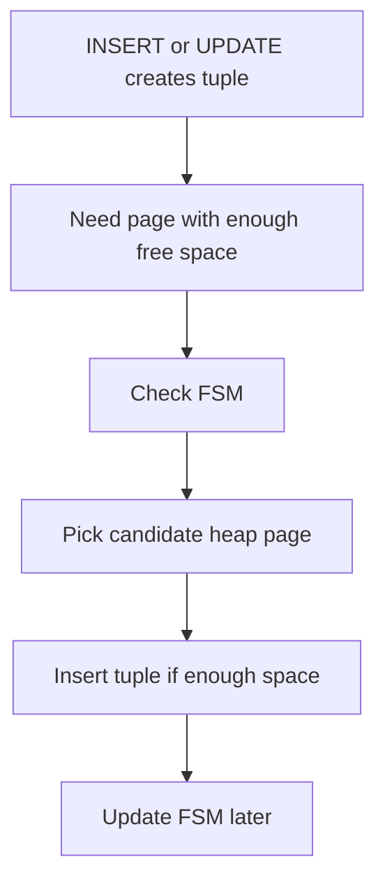
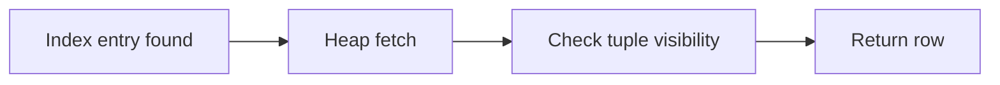
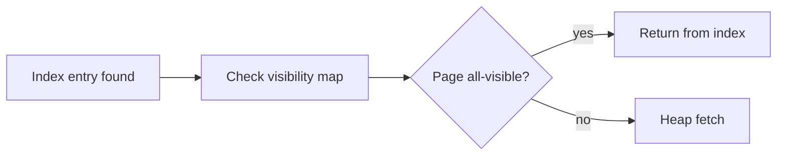
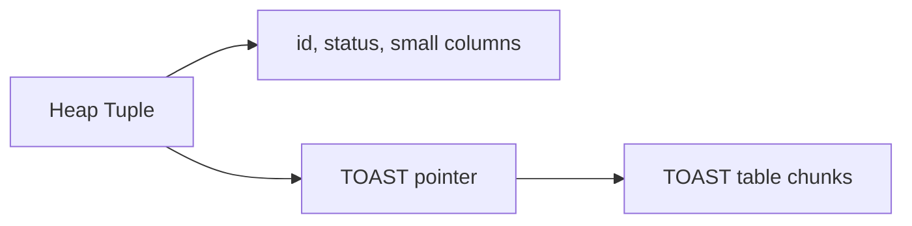
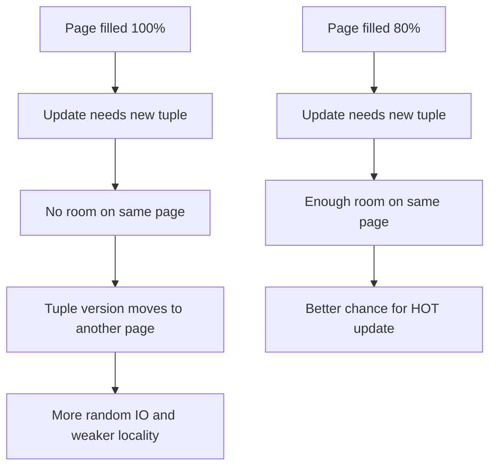
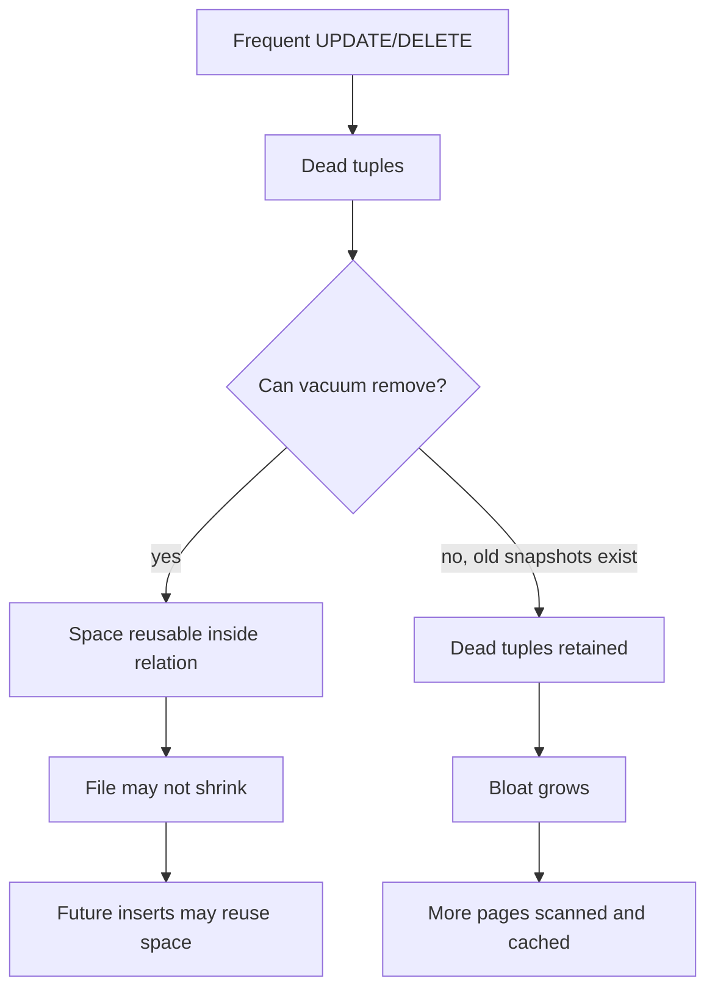
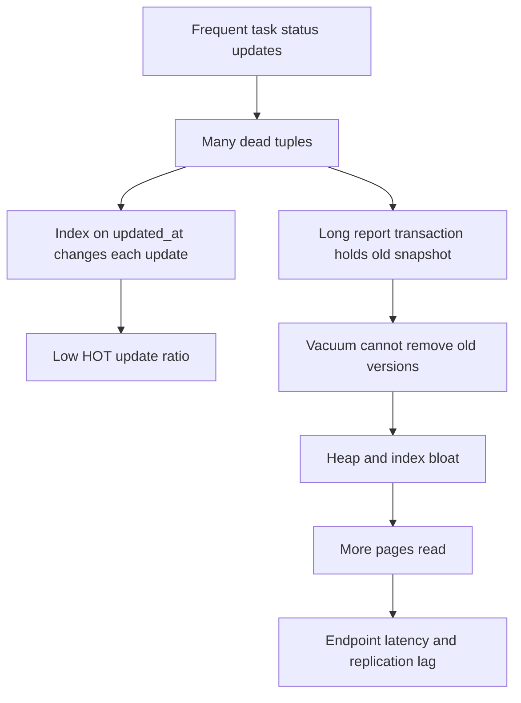
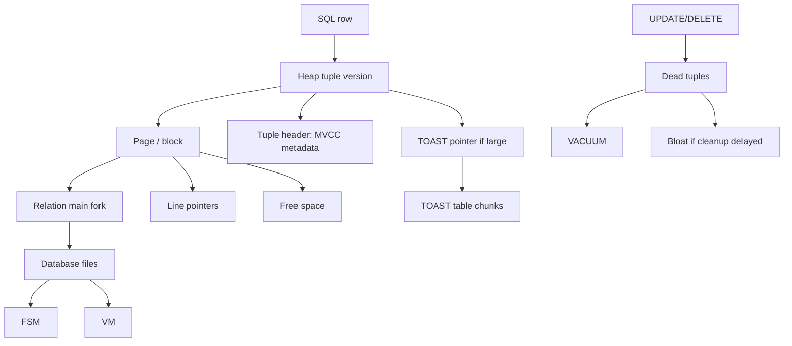

# Part 007 — Physical Storage: Pages, Tuples, TOAST, and Bloat

## 1. Tujuan Bagian Ini

Bagian ini membahas bagaimana PostgreSQL menyimpan data secara fisik: dari table logical yang kita lihat di SQL sampai menjadi file, page, tuple, pointer, dan auxiliary fork di disk.

Kita tidak membahas storage untuk tujuan akademis. Tujuan utamanya adalah agar kita bisa menjawab pertanyaan production seperti:

1. mengapa `UPDATE` bisa membuat table membengkak walaupun jumlah row tidak bertambah;
2. mengapa query index-only scan kadang tetap melakukan heap fetch;
3. mengapa column `jsonb`, `text`, atau `bytea` besar bisa mengubah karakteristik query;
4. mengapa `fillfactor` bisa membantu workload update-heavy;
5. mengapa bloat bukan sekadar masalah disk, tetapi juga masalah cache, vacuum, WAL, replication, dan latency;
6. mengapa schema design dan Java update pattern bisa menentukan bentuk storage di bawahnya.

Kalimat pentingnya:

> PostgreSQL table bukan array of current rows. PostgreSQL table adalah kumpulan page yang menyimpan banyak versi tuple sepanjang waktu.

Jika mental model ini tidak masuk, bagian MVCC, vacuum, index-only scan, autovacuum tuning, dan performance tuning akan terasa seperti kumpulan rule acak.

## 2. Mental Model: Logical Row vs Physical Tuple

Di level aplikasi, kita berpikir seperti ini:

```sql
UPDATE account SET balance = balance - 100 WHERE id = 42;
```

Secara logical, row `account id = 42` berubah.

Namun secara physical, PostgreSQL tidak selalu menulis ulang row yang sama di tempat yang sama sebagai satu mutable object. Karena MVCC, update biasanya menghasilkan versi tuple baru, sementara versi lama tetap ada sampai tidak lagi dibutuhkan oleh snapshot aktif dan kemudian bisa dibersihkan oleh vacuum.

Model yang lebih akurat:



Jadi, storage PostgreSQL perlu dipahami sebagai gabungan dari:

1. **relation file**: file fisik untuk table/index;
2. **fork**: variasi file untuk main data, free space map, visibility map, dan initialization fork;
3. **page/block**: unit I/O internal, biasanya 8 KB;
4. **line pointer**: slot pointer di page yang menunjuk item/tuple;
5. **tuple**: versi fisik row;
6. **tuple header**: metadata MVCC dan layout;
7. **TOAST**: mekanisme menyimpan data besar di luar tuple utama;
8. **FSM/VM**: metadata untuk free space dan visibility;
9. **bloat**: ruang yang ditempati tuple mati, fragmentasi, atau page yang tidak efisien.

## 3. Relation File Layout

PostgreSQL menyimpan object database dalam directory `PGDATA`. Untuk relation biasa, data akhirnya berada dalam file yang terasosiasi dengan `relfilenode`.

Secara sederhana:

```text
PGDATA/
  base/
    <database_oid>/
      <relfilenode>        -- main fork
      <relfilenode>_fsm    -- free space map
      <relfilenode>_vm     -- visibility map, heap relation
```

Untuk table besar, file relation dipecah menjadi segment berukuran tetap, misalnya:

```text
12345
12345.1
12345.2
```

Hal penting untuk engineer aplikasi:

1. table bukan satu objek monolitik dalam memori;
2. query performance sangat dipengaruhi oleh page mana yang harus dibaca;
3. update/delete tidak langsung mengecilkan file;
4. index memiliki file relation sendiri;
5. table dan index masing-masing bisa bloat;
6. logical row count tidak cukup untuk memperkirakan physical size.

Diagnostic query:

```sql
SELECT
    c.oid,
    n.nspname AS schema_name,
    c.relname,
    c.relkind,
    pg_relation_size(c.oid) AS main_bytes,
    pg_total_relation_size(c.oid) AS total_bytes,
    pg_size_pretty(pg_relation_size(c.oid)) AS main_size,
    pg_size_pretty(pg_total_relation_size(c.oid)) AS total_size
FROM pg_class c
JOIN pg_namespace n ON n.oid = c.relnamespace
WHERE n.nspname = 'app'
ORDER BY pg_total_relation_size(c.oid) DESC;
```

Interpretasi:

- `pg_relation_size`: ukuran main fork relation;
- `pg_total_relation_size`: ukuran total termasuk indexes, TOAST, dan fork lain;
- gap besar antara main dan total sering menunjukkan index besar atau TOAST besar.

## 4. Fork: Main, FSM, VM, Init

PostgreSQL relation bisa memiliki beberapa fork.

### 4.1 Main Fork

Main fork menyimpan data utama relation.

Untuk heap table, main fork berisi heap pages. Untuk index, main fork berisi index pages.

### 4.2 Free Space Map

Free Space Map atau FSM menyimpan informasi kasar tentang free space yang tersedia pada page.

Ketika PostgreSQL perlu menyisipkan tuple baru, engine tidak ingin scan seluruh table hanya untuk mencari page kosong. FSM membantu menemukan page yang kemungkinan punya cukup ruang.

Mental model:



FSM bukan sumber kebenaran sempurna. Ia metadata yang membantu. Karena itu, PostgreSQL masih perlu memverifikasi page aktual.

### 4.3 Visibility Map

Visibility Map atau VM menyimpan informasi page-level tentang apakah semua tuple di page terlihat oleh semua transaksi aktif. VM juga membantu vacuum dan index-only scan.

Ini penting sekali untuk query performance.

Normal index scan:



Index-only scan ideal:



Karena index PostgreSQL tidak menyimpan informasi visibility tuple secara lengkap, VM menentukan apakah heap fetch bisa dihindari.

Implikasi:

- table yang sering di-update lebih sulit mendapat index-only scan murni;
- autovacuum yang sehat membantu menandai page all-visible;
- bloat dan dead tuples bisa mengurangi efektivitas index-only scan;
- `EXPLAIN (ANALYZE, BUFFERS)` perlu dilihat, bukan hanya apakah plan tertulis `Index Only Scan`.

Contoh membaca heap fetch:

```sql
EXPLAIN (ANALYZE, BUFFERS)
SELECT id, status
FROM app.case_file
WHERE status = 'OPEN'
ORDER BY created_at DESC
LIMIT 50;
```

Jika plan menunjukkan `Index Only Scan` tetapi `Heap Fetches` tinggi, berarti index-only scan tidak benar-benar “only” secara penuh.

### 4.4 Initialization Fork

Initialization fork dipakai untuk unlogged relation. Saat crash recovery, unlogged relation tidak direplay lewat WAL seperti logged table biasa; relation bisa di-reset dari initialization fork.

Rule praktis:

- jangan gunakan unlogged table untuk data yang tidak boleh hilang;
- cocok untuk transient staging, intermediate processing, atau cache yang bisa dibangun ulang;
- pahami interaksinya dengan crash recovery dan replication.

## 5. Page / Block: Unit Dasar I/O

Page atau block adalah unit dasar storage internal PostgreSQL. Build PostgreSQL default biasanya memakai ukuran block 8 KB.

Satu table terdiri dari banyak page:

```text
relation file
+---------+---------+---------+---------+
| page 0  | page 1  | page 2  | page 3  |
+---------+---------+---------+---------+
```

Setiap page memiliki struktur umum:

```text
+------------------+
| Page Header      |
+------------------+
| Line Pointer[]   |
+------------------+
| Free Space       |
+------------------+
| Tuple Data       |
+------------------+
| Special Space    |
+------------------+
```

Untuk heap table, special space biasanya tidak digunakan seperti index. Untuk index, special space dapat menyimpan metadata index page.

Mental model penting:

- page adalah unit yang masuk shared buffers;
- query yang membaca satu row bisa perlu membaca satu page;
- banyak row kecil dalam page yang sama memberi locality yang baik;
- row besar mengurangi jumlah tuple per page;
- update yang memindahkan tuple ke page lain bisa memperburuk locality;
- table bloat berarti lebih banyak page harus discan untuk logical data yang sama.

## 6. Line Pointer dan CTID

Setiap tuple di heap page diakses melalui line pointer. PostgreSQL mengekspos lokasi fisik tuple melalui pseudo-column `ctid`.

Contoh:

```sql
SELECT ctid, id, status
FROM app.case_file
ORDER BY id
LIMIT 10;
```

Output `ctid` berbentuk:

```text
(42,7)
```

Artinya kira-kira:

- block/page ke-42;
- item/line pointer ke-7 di page itu.

`ctid` berguna untuk eksperimen dan diagnostic, tetapi **bukan primary key**.

Mengapa?

1. `UPDATE` bisa menghasilkan tuple baru dengan `ctid` baru;
2. `VACUUM FULL`, `CLUSTER`, atau rewrite table bisa mengubah lokasi fisik;
3. physical identity bukan domain identity;
4. application tidak boleh bergantung pada lokasi fisik row.

Contoh melihat perubahan `ctid`:

```sql
CREATE TABLE app.ctid_demo (
    id bigint GENERATED ALWAYS AS IDENTITY PRIMARY KEY,
    value text NOT NULL
);

INSERT INTO app.ctid_demo(value) VALUES ('v1');

SELECT ctid, * FROM app.ctid_demo;

UPDATE app.ctid_demo
SET value = 'v2'
WHERE id = 1;

SELECT ctid, * FROM app.ctid_demo;
```

Dalam banyak kasus, `ctid` berubah setelah update karena versi tuple baru dibuat.

## 7. Tuple Header: Metadata di Setiap Row Version

Setiap physical tuple memiliki header. Header ini menyimpan metadata yang diperlukan untuk MVCC dan layout.

Field internal detail bisa berubah antar versi, tetapi konsep pentingnya:

1. transaction id yang membuat tuple;
2. transaction id yang menghapus/mengganti tuple;
3. command id;
4. pointer ke versi tuple berikutnya dalam update chain;
5. null bitmap;
6. flags layout;
7. offset data user.

Ilustrasi:

```text
Heap Tuple
+--------------------------+
| Tuple Header             |
| - xmin                   |
| - xmax                   |
| - ctid / update pointer  |
| - infomask flags         |
| - null bitmap            |
+--------------------------+
| User Columns             |
| - id                     |
| - status                 |
| - payload                |
+--------------------------+
```

Konsekuensi:

- row dengan banyak nullable column memiliki overhead null bitmap;
- row yang sangat lebar mengurangi tuple density per page;
- update chain memengaruhi visibility check;
- MVCC bukan metadata global saja, tetapi juga melekat pada tuple;
- `SELECT *` pada table lebar membuat lebih banyak data harus disentuh.

## 8. Inspecting Pages dengan `pageinspect`

Untuk belajar, extension `pageinspect` membantu melihat struktur page.

> Gunakan hanya untuk lab atau diagnostic hati-hati. Jangan menjadikan query `pageinspect` sebagai bagian normal aplikasi.

Setup:

```sql
CREATE EXTENSION IF NOT EXISTS pageinspect;

CREATE TABLE app.storage_demo (
    id bigint GENERATED ALWAYS AS IDENTITY PRIMARY KEY,
    status text NOT NULL,
    note text
);

INSERT INTO app.storage_demo(status, note)
SELECT 'OPEN', 'note-' || g
FROM generate_series(1, 20) AS g;
```

Melihat page pertama:

```sql
SELECT *
FROM heap_page_items(get_raw_page('app.storage_demo', 0));
```

Kolom yang perlu diperhatikan:

- `lp`: line pointer number;
- `lp_off`: offset tuple dalam page;
- `lp_flags`: status line pointer;
- `lp_len`: panjang item;
- `t_xmin`: transaction id yang membuat tuple;
- `t_xmax`: transaction id yang menghapus/mengganti tuple;
- `t_ctid`: pointer tuple.

Eksperimen update:

```sql
UPDATE app.storage_demo
SET note = note || '-updated'
WHERE id = 1;

SELECT lp, lp_flags, lp_len, t_xmin, t_xmax, t_ctid
FROM heap_page_items(get_raw_page('app.storage_demo', 0));
```

Yang ingin dilatih bukan menghafal semua flag, tetapi melihat bahwa update meninggalkan jejak versi tuple.

## 9. TOAST: The Oversized-Attribute Storage Technique

PostgreSQL page memiliki ukuran terbatas. Tuple harus muat dalam page, tetapi aplikasi sering menyimpan nilai besar seperti:

- `text` panjang;
- `jsonb` besar;
- `bytea`;
- array besar.

TOAST adalah mekanisme PostgreSQL untuk menangani nilai yang terlalu besar. PostgreSQL dapat melakukan compression dan/atau menyimpan value besar out-of-line di TOAST table internal.

Mental model:



Implikasi penting:

1. table logical bisa terlihat sederhana, tetapi `pg_total_relation_size` besar karena TOAST;
2. membaca column besar bisa memicu fetch TOAST data;
3. index pada expression dari JSONB besar bisa mahal;
4. update pada row dengan TOASTed value punya karakteristik berbeda tergantung column yang berubah;
5. `SELECT *` menjadi berbahaya pada table dengan payload besar;
6. API response yang selalu mengambil payload besar bisa membebani database dan network.

Cek TOAST relation:

```sql
SELECT
    c.relname AS table_name,
    c.reltoastrelid::regclass AS toast_table,
    pg_size_pretty(pg_total_relation_size(c.reltoastrelid)) AS toast_size
FROM pg_class c
JOIN pg_namespace n ON n.oid = c.relnamespace
WHERE n.nspname = 'app'
  AND c.relkind = 'r'
  AND c.reltoastrelid <> 0;
```

Eksperimen:

```sql
CREATE TABLE app.toast_demo (
    id bigint GENERATED ALWAYS AS IDENTITY PRIMARY KEY,
    title text NOT NULL,
    payload jsonb NOT NULL
);

INSERT INTO app.toast_demo(title, payload)
SELECT
    'doc-' || g,
    jsonb_build_object(
        'id', g,
        'body', repeat('x', 10000),
        'tags', jsonb_build_array('a', 'b', 'c')
    )
FROM generate_series(1, 1000) AS g;

SELECT
    pg_size_pretty(pg_relation_size('app.toast_demo')) AS main_size,
    pg_size_pretty(pg_total_relation_size('app.toast_demo')) AS total_size;
```

Jika `total_size` jauh lebih besar dari `main_size`, TOAST dan index mungkin mendominasi ukuran.

## 10. Row Width dan Tuple Density

Row width menentukan berapa banyak tuple yang muat dalam satu page.

Misalnya secara kasar:

```text
8 KB page
- page header
- line pointer array
- tuple headers
= ruang efektif untuk user data
```

Jika row kecil, banyak tuple muat dalam satu page. Sequential scan dan cache locality lebih baik.

Jika row besar, lebih sedikit tuple per page. Query yang hanya butuh beberapa column tetap mungkin harus membaca page yang membawa row besar, walaupun TOAST bisa mengeluarkan value sangat besar dari heap utama.

Anti-pattern:

```sql
CREATE TABLE app.case_file (
    id bigint PRIMARY KEY,
    status text NOT NULL,
    assigned_to bigint,
    created_at timestamptz NOT NULL,
    updated_at timestamptz NOT NULL,
    audit_snapshot jsonb NOT NULL,
    external_payload jsonb NOT NULL,
    generated_pdf bytea,
    internal_note text
);
```

Problem:

- hot OLTP columns bercampur dengan cold payload;
- query listing kasus membaca table yang sama dengan payload besar;
- update status bisa menyentuh row yang juga memiliki value besar;
- index strategy menjadi kabur;
- cache efficiency memburuk.

Lebih baik:

```sql
CREATE TABLE app.case_file (
    id bigint GENERATED ALWAYS AS IDENTITY PRIMARY KEY,
    status text NOT NULL,
    assigned_to bigint,
    created_at timestamptz NOT NULL DEFAULT now(),
    updated_at timestamptz NOT NULL DEFAULT now()
);

CREATE TABLE app.case_file_payload (
    case_file_id bigint PRIMARY KEY REFERENCES app.case_file(id),
    audit_snapshot jsonb NOT NULL,
    external_payload jsonb NOT NULL,
    generated_pdf bytea,
    internal_note text
);
```

Rule:

> Pisahkan hot identity/state columns dari cold large payload ketika access pattern-nya berbeda.

## 11. Fillfactor

`fillfactor` menentukan seberapa penuh page diisi saat insert atau table rewrite. Default untuk table biasanya mendekati penuh. Untuk workload update-heavy, menyisakan ruang kosong dalam page dapat membantu update menempatkan versi tuple baru di page yang sama.

Contoh:

```sql
CREATE TABLE app.case_assignment (
    id bigint GENERATED ALWAYS AS IDENTITY PRIMARY KEY,
    case_file_id bigint NOT NULL,
    assignee_id bigint NOT NULL,
    status text NOT NULL,
    updated_at timestamptz NOT NULL DEFAULT now()
) WITH (fillfactor = 80);
```

Mental model:



Trade-off:

- lower fillfactor dapat mengurangi page split/update relocation;
- tetapi membutuhkan lebih banyak page untuk data awal;
- tidak cocok untuk append-only table yang jarang update;
- harus dipilih berdasarkan workload, bukan secara global.

Kapan dipertimbangkan:

1. table kecil sampai menengah dengan update status sering;
2. queue table;
3. table session/state;
4. table assignment/escalation;
5. table yang update-nya tidak mengubah indexed columns.

## 12. HOT Updates

HOT adalah Heap-Only Tuple update. Secara sederhana, jika update bisa membuat versi tuple baru di page yang sama dan tidak perlu mengubah index entries, PostgreSQL dapat menghindari update index untuk update tersebut.

Syarat umum:

1. update tidak mengubah column yang ada di index;
2. ada cukup ruang di page yang sama;
3. kondisi internal lain terpenuhi.

Mengapa ini penting?

Misalkan table:

```sql
CREATE TABLE app.case_queue (
    id bigint GENERATED ALWAYS AS IDENTITY PRIMARY KEY,
    status text NOT NULL,
    retry_count int NOT NULL DEFAULT 0,
    last_error text,
    updated_at timestamptz NOT NULL DEFAULT now()
) WITH (fillfactor = 80);

CREATE INDEX idx_case_queue_status
ON app.case_queue(status);
```

Jika kita sering melakukan:

```sql
UPDATE app.case_queue
SET retry_count = retry_count + 1,
    last_error = 'timeout',
    updated_at = now()
WHERE id = 42;
```

dan `retry_count`, `last_error`, `updated_at` tidak masuk index, update lebih mungkin menjadi HOT.

Tetapi jika kita membuat index:

```sql
CREATE INDEX idx_case_queue_updated_at
ON app.case_queue(updated_at);
```

maka setiap update `updated_at` juga perlu mengubah index. HOT opportunity turun.

Rule penting:

> Setiap index adalah biaya tambahan untuk write. Index pada column yang sering berubah dapat menghancurkan HOT update opportunity.

Diagnostic:

```sql
SELECT
    schemaname,
    relname,
    n_tup_upd,
    n_tup_hot_upd,
    round(100.0 * n_tup_hot_upd / NULLIF(n_tup_upd, 0), 2) AS hot_update_pct
FROM pg_stat_user_tables
WHERE schemaname = 'app'
ORDER BY n_tup_upd DESC;
```

Interpretasi:

- `n_tup_upd` tinggi dan `n_tup_hot_upd` rendah pada workload update-heavy bisa berarti terlalu banyak index atau fillfactor terlalu penuh;
- jangan mengejar HOT ratio buta; lihat juga query requirement.

## 13. Bloat: Apa yang Sebenarnya Membengkak?

Bloat terjadi ketika physical storage jauh lebih besar dari logical live data yang dibutuhkan.

Penyebab umum:

1. dead tuples akibat update/delete;
2. index entries mati;
3. page fragmentation;
4. long-running transaction mencegah vacuum membersihkan tuple lama;
5. autovacuum tertinggal;
6. workload update-heavy tanpa HOT;
7. table yang sering delete massal tetapi tidak pernah direwrite;
8. pattern queue yang terus insert/update/delete.

Bloat bukan hanya disk problem.

Dampaknya:

- sequential scan membaca lebih banyak page;
- index scan lebih banyak random access;
- cache hit ratio turun;
- vacuum makin berat;
- backup lebih besar;
- replication WAL pressure naik;
- failover/recovery bisa lebih lambat;
- planner bisa memilih plan buruk karena size/correlation berubah.

Mental model:



Important nuance:

- `VACUUM` biasa dapat menandai space sebagai reusable, tetapi biasanya tidak mengembalikan file ke OS;
- `VACUUM FULL` dapat mengecilkan file, tetapi melakukan table rewrite dan membutuhkan lock kuat;
- `pg_repack` sering dipakai di production untuk mengurangi bloat dengan downtime lebih rendah, tetapi tetap perlu operational discipline;
- solusi terbaik adalah mencegah bloat ekstrem melalui workload design, autovacuum, dan index strategy.

## 14. Detecting Dead Tuples dan Bloat Signals

Query awal:

```sql
SELECT
    schemaname,
    relname,
    n_live_tup,
    n_dead_tup,
    round(100.0 * n_dead_tup / NULLIF(n_live_tup + n_dead_tup, 0), 2) AS dead_pct,
    last_vacuum,
    last_autovacuum,
    vacuum_count,
    autovacuum_count
FROM pg_stat_user_tables
WHERE schemaname = 'app'
ORDER BY n_dead_tup DESC;
```

Cek size table dan index:

```sql
SELECT
    schemaname,
    relname,
    pg_size_pretty(pg_total_relation_size(relid)) AS total_size,
    pg_size_pretty(pg_relation_size(relid)) AS heap_size,
    pg_size_pretty(pg_indexes_size(relid)) AS index_size
FROM pg_stat_user_tables
WHERE schemaname = 'app'
ORDER BY pg_total_relation_size(relid) DESC;
```

Cek table yang update-heavy:

```sql
SELECT
    schemaname,
    relname,
    seq_scan,
    idx_scan,
    n_tup_ins,
    n_tup_upd,
    n_tup_del,
    n_tup_hot_upd,
    n_live_tup,
    n_dead_tup
FROM pg_stat_user_tables
WHERE schemaname = 'app'
ORDER BY (n_tup_upd + n_tup_del) DESC;
```

Yang harus diperhatikan:

1. `n_dead_tup` tinggi;
2. autovacuum jarang terjadi padahal write tinggi;
3. table size tumbuh tidak proporsional terhadap live rows;
4. index size lebih besar dari heap secara tidak wajar;
5. long-running transaction ada;
6. query plan berubah menjadi sequential scan karena cost index memburuk;
7. `Heap Fetches` tinggi pada index-only scan.

## 15. Java Application Pattern yang Membuat Bloat

### 15.1 Full Entity Update

Anti-pattern dengan ORM:

```java
caseFile.setStatus(newStatus);
caseFile.setUpdatedAt(Instant.now());
caseFileRepository.save(caseFile);
```

Jika ORM mengirim update banyak column:

```sql
UPDATE case_file
SET status = ?,
    assigned_to = ?,
    description = ?,
    payload = ?,
    updated_at = ?
WHERE id = ?;
```

Maka konsekuensinya:

- lebih banyak data ditulis;
- TOAST interaction lebih mahal;
- WAL lebih besar;
- trigger bisa lebih mahal;
- logical replication/outbox bisa membawa payload besar;
- indexed columns mungkin ikut berubah atau dianggap berubah;
- HOT update opportunity bisa turun.

Lebih baik:

```sql
UPDATE app.case_file
SET status = :status,
    updated_at = now()
WHERE id = :id
  AND status <> :status;
```

Atau explicit command method di repository:

```java
int transitionStatus(long caseId, CaseStatus from, CaseStatus to);
```

### 15.2 Heartbeat Update Terlalu Sering

Contoh:

```sql
UPDATE worker_session
SET last_seen_at = now()
WHERE worker_id = ?;
```

Jika terjadi setiap detik untuk ribuan worker, table kecil bisa menjadi bloat factory.

Alternatif:

1. kurangi frekuensi update;
2. gunakan table khusus heartbeat dengan fillfactor lebih rendah;
3. jangan index `last_seen_at` jika tidak perlu;
4. simpan ephemeral state di Redis jika durability database tidak diperlukan;
5. gunakan upsert batch, bukan update per event;
6. desain retention/vacuum lebih agresif.

### 15.3 Queue Table dengan Delete Konstan

Pattern umum:

```sql
SELECT *
FROM app.job_queue
WHERE status = 'READY'
ORDER BY created_at
LIMIT 100
FOR UPDATE SKIP LOCKED;

DELETE FROM app.job_queue
WHERE id = ?;
```

Queue table sangat rentan bloat karena banyak insert/delete/update.

Mitigasi:

- partition by time atau bucket;
- periodic detach/drop partition;
- partial index untuk ready jobs;
- fillfactor disesuaikan;
- autovacuum tuning per table;
- jangan jadikan PostgreSQL queue untuk throughput ekstrem tanpa desain matang;
- ukur `n_dead_tup`, table size, dan vacuum lag.

## 16. Storage-Aware Schema Design

Checklist desain table:

1. Apakah table ini append-only, update-heavy, delete-heavy, atau mixed?
2. Apakah row memiliki payload besar yang jarang dibaca?
3. Apakah column yang sering berubah masuk index?
4. Apakah workload memerlukan index-only scan?
5. Apakah table akan punya retention policy?
6. Apakah data perlu partitioning sejak awal?
7. Apakah update status akan sering terjadi?
8. Apakah ada long-running report yang menahan vacuum?
9. Apakah ORM akan melakukan full update?
10. Apakah logical replication/CDC akan membawa perubahan row besar?

Contoh desain state machine case management:

```sql
CREATE TABLE app.enforcement_case (
    id bigint GENERATED ALWAYS AS IDENTITY PRIMARY KEY,
    case_number text NOT NULL UNIQUE,
    lifecycle_state text NOT NULL,
    priority text NOT NULL,
    assigned_team_id bigint,
    opened_at timestamptz NOT NULL DEFAULT now(),
    updated_at timestamptz NOT NULL DEFAULT now(),
    closed_at timestamptz,
    CONSTRAINT chk_case_lifecycle_state
        CHECK (lifecycle_state IN ('INTAKE', 'REVIEW', 'INVESTIGATION', 'ESCALATED', 'CLOSED'))
) WITH (fillfactor = 85);

CREATE TABLE app.enforcement_case_payload (
    case_id bigint PRIMARY KEY REFERENCES app.enforcement_case(id) ON DELETE CASCADE,
    intake_payload jsonb NOT NULL,
    evidence_summary jsonb,
    raw_external_payload jsonb
);

CREATE TABLE app.enforcement_case_event (
    id bigint GENERATED ALWAYS AS IDENTITY PRIMARY KEY,
    case_id bigint NOT NULL REFERENCES app.enforcement_case(id),
    event_type text NOT NULL,
    actor_id bigint,
    occurred_at timestamptz NOT NULL DEFAULT now(),
    payload jsonb NOT NULL
);
```

Alasan:

- hot lifecycle state terpisah dari payload besar;
- event append-only punya karakter storage berbeda;
- payload besar hanya dibaca saat detail view/audit;
- update state tidak selalu menyentuh JSONB besar;
- table event bisa dipartition di part berikutnya.

## 17. Storage dan Query Planner

Planner memperkirakan cost berdasarkan statistik dan ukuran relation. Bloat mengubah cost landscape.

Contoh:

- table kecil tanpa bloat: index scan murah;
- table membengkak: heap fetch lebih banyak page;
- index bloat: index traversal lebih berat;
- visibility map buruk: index-only scan menjadi heap-heavy;
- correlation buruk: index scan random I/O meningkat.

Karena itu, ketika query lambat, jangan hanya tanya:

> Index apa yang kurang?

Tanya juga:

> Berapa physical page yang harus dibaca untuk menjawab logical result ini?

Diagnostic:

```sql
EXPLAIN (ANALYZE, BUFFERS)
SELECT id, lifecycle_state, priority, updated_at
FROM app.enforcement_case
WHERE lifecycle_state = 'INVESTIGATION'
ORDER BY updated_at DESC
LIMIT 100;
```

Perhatikan:

- `shared hit` vs `shared read`;
- `Heap Fetches`;
- actual rows vs estimated rows;
- scan type;
- sort spill;
- loops;
- buffers pada child node.

## 18. Failure Mode: Table yang Terlihat Kecil tetapi Berat

Skenario:

- table `case_task` hanya punya 500 ribu live rows;
- setiap task mengalami update status 20 kali;
- `updated_at` di-index;
- worker melakukan polling terus;
- autovacuum kalah cepat;
- ada report transaction yang berjalan 2 jam setiap pagi.

Gejala:

1. table size naik terus;
2. index size lebih besar dari heap;
3. query polling makin lambat;
4. autovacuum sering berjalan tetapi tidak cukup;
5. replication lag meningkat;
6. CPU meningkat karena scanning/index traversal;
7. p95 latency Java endpoint naik.

Root cause chain:



Fix strategy:

1. kill or redesign long-running report;
2. move reporting to replica or materialized snapshot;
3. remove unnecessary index on frequently updated column;
4. use partial index matching polling query;
5. set table fillfactor;
6. tune autovacuum per table;
7. consider partitioning completed tasks;
8. rewrite/repack during maintenance if bloat already severe;
9. change Java update to narrow update statement;
10. add monitoring for dead tuples and HOT ratio.

## 19. Practical Lab: Membuktikan Update Membuat Tuple Baru

```sql
DROP TABLE IF EXISTS app.storage_update_lab;

CREATE TABLE app.storage_update_lab (
    id bigint GENERATED ALWAYS AS IDENTITY PRIMARY KEY,
    status text NOT NULL,
    note text NOT NULL
) WITH (fillfactor = 80);

INSERT INTO app.storage_update_lab(status, note)
SELECT 'OPEN', repeat('x', 100)
FROM generate_series(1, 1000);

SELECT ctid, id, status
FROM app.storage_update_lab
WHERE id = 1;

UPDATE app.storage_update_lab
SET note = repeat('y', 100)
WHERE id = 1;

SELECT ctid, id, status
FROM app.storage_update_lab
WHERE id = 1;
```

Lalu cek stats:

```sql
SELECT
    n_tup_ins,
    n_tup_upd,
    n_tup_hot_upd,
    n_live_tup,
    n_dead_tup
FROM pg_stat_user_tables
WHERE relname = 'storage_update_lab';
```

Catatan:

Stats tidak selalu ter-update secara instan di sesi yang sama. Untuk lab, jalankan beberapa transaksi dan refresh.

## 20. Practical Lab: Row Width dan `SELECT *`

```sql
DROP TABLE IF EXISTS app.wide_row_lab;

CREATE TABLE app.wide_row_lab (
    id bigint GENERATED ALWAYS AS IDENTITY PRIMARY KEY,
    tenant_id bigint NOT NULL,
    status text NOT NULL,
    created_at timestamptz NOT NULL DEFAULT now(),
    payload jsonb NOT NULL
);

INSERT INTO app.wide_row_lab(tenant_id, status, payload)
SELECT
    g % 10,
    'ACTIVE',
    jsonb_build_object('body', repeat(md5(g::text), 1000))
FROM generate_series(1, 10000) AS g;

CREATE INDEX idx_wide_row_lab_tenant_status
ON app.wide_row_lab(tenant_id, status, created_at DESC);
```

Bandingkan:

```sql
EXPLAIN (ANALYZE, BUFFERS)
SELECT id, status, created_at
FROM app.wide_row_lab
WHERE tenant_id = 3
  AND status = 'ACTIVE'
ORDER BY created_at DESC
LIMIT 50;
```

Dengan:

```sql
EXPLAIN (ANALYZE, BUFFERS)
SELECT *
FROM app.wide_row_lab
WHERE tenant_id = 3
  AND status = 'ACTIVE'
ORDER BY created_at DESC
LIMIT 50;
```

Yang dipelajari:

- query projection memengaruhi data yang harus diambil;
- payload besar mengubah cost;
- index-only scan bergantung pada column yang tersedia di index dan visibility map;
- API list endpoint sebaiknya tidak memakai entity detail projection.

## 21. Practical Lab: HOT Update Opportunity

```sql
DROP TABLE IF EXISTS app.hot_lab;

CREATE TABLE app.hot_lab (
    id bigint GENERATED ALWAYS AS IDENTITY PRIMARY KEY,
    status text NOT NULL,
    retry_count int NOT NULL DEFAULT 0,
    last_error text
) WITH (fillfactor = 70);

CREATE INDEX idx_hot_lab_status ON app.hot_lab(status);

INSERT INTO app.hot_lab(status)
SELECT 'READY'
FROM generate_series(1, 10000);

UPDATE app.hot_lab
SET retry_count = retry_count + 1,
    last_error = 'timeout'
WHERE id <= 5000;

SELECT
    n_tup_upd,
    n_tup_hot_upd,
    round(100.0 * n_tup_hot_upd / NULLIF(n_tup_upd, 0), 2) AS hot_pct
FROM pg_stat_user_tables
WHERE relname = 'hot_lab';
```

Sekarang tambahkan index pada column yang sering berubah:

```sql
CREATE INDEX idx_hot_lab_retry_count ON app.hot_lab(retry_count);

UPDATE app.hot_lab
SET retry_count = retry_count + 1,
    last_error = 'timeout-again'
WHERE id <= 5000;
```

Cek kembali stats. Diskusikan:

- apakah HOT ratio berubah;
- apakah index tambahan benar-benar dibutuhkan;
- apa dampaknya ke write amplification.

## 22. Storage Decision Matrix

| Workload | Storage Risk | Design Response |
|---|---|---|
| Append-only audit/event | Table growth | Partition by time, retention, BRIN candidate |
| Status workflow update-heavy | Dead tuples, HOT loss | Fillfactor, narrow updates, avoid indexing volatile columns |
| Large JSONB payload | TOAST overhead, slow detail reads | Split hot/cold table, generated columns for query keys |
| Queue table | Insert/delete churn, bloat | Partial index, autovacuum tuning, partition/drop completed data |
| Multi-tenant OLTP | noisy tenant, large scans | tenant-aware indexes, partition only if justified |
| Reporting on primary | old snapshots block vacuum | replica, materialized snapshot, bounded transaction time |
| Full ORM update | WAL and tuple churn | dynamic update/narrow SQL command, dirty checking discipline |

## 23. Anti-Patterns

### Anti-Pattern 1: “Disk Masih Banyak, Bloat Tidak Masalah”

Salah karena bloat memengaruhi:

- buffer cache;
- sequential scan;
- index traversal;
- vacuum cost;
- backup size;
- replication lag;
- recovery time.

### Anti-Pattern 2: Index Semua Column yang Muncul di Filter

Setiap index memperbesar write cost dan bisa mengurangi HOT update.

Pertanyaan review:

1. query mana yang memakai index ini;
2. berapa selectivity-nya;
3. apakah column sering berubah;
4. apakah index redundant;
5. apakah bisa partial;
6. apakah ada lifecycle state yang membuat index kecil.

### Anti-Pattern 3: Menjadikan JSONB Besar sebagai Default Payload untuk Semua Hal

JSONB berguna, tetapi tidak gratis.

Risiko:

- TOAST size besar;
- query sulit dioptimalkan;
- schema contract kabur;
- migration sulit;
- index GIN besar;
- update kecil bisa tetap membawa konsekuensi storage besar.

### Anti-Pattern 4: `SELECT *` di Endpoint List

Endpoint list biasanya butuh projection kecil. Mengambil payload besar untuk list view membuang I/O, CPU, memory, network, dan serialization cost.

### Anti-Pattern 5: Long Transaction untuk Report

Long transaction bisa mempertahankan snapshot lama. Vacuum tidak bisa membersihkan tuple yang masih mungkin terlihat oleh snapshot tersebut.

## 24. Review Checklist untuk Pull Request

Gunakan checklist ini saat review schema/migration:

- Apakah table ini update-heavy atau append-only?
- Apakah ada large payload yang harus dipisah?
- Apakah column volatile masuk index?
- Apakah `updated_at` benar-benar perlu di-index?
- Apakah ada query list yang bisa dibuat projection-only?
- Apakah ada retention policy?
- Apakah autovacuum default cukup untuk churn table ini?
- Apakah table queue perlu partitioning atau cleanup strategy?
- Apakah ORM akan melakukan full update?
- Apakah bloat dapat dimonitor dari awal?
- Apakah index-only scan realistis untuk workload ini?
- Apakah table rewrite migration akan mengunci production?

## 25. Mental Model Ringkas



## 26. What Good Looks Like

Table design production-grade biasanya memiliki karakter berikut:

1. hot columns dan cold payload dipisah jika access pattern berbeda;
2. update-heavy table tidak memiliki index berlebihan pada volatile columns;
3. `fillfactor` dipakai secara selektif, bukan global;
4. query list memakai projection sempit;
5. table churn tinggi punya autovacuum setting dan monitoring khusus;
6. queue/event/audit table punya retention strategy;
7. bloat dipantau sebagai bagian dari SLO database;
8. Java repository menyediakan command-specific update, bukan selalu save full entity;
9. schema review membahas physical consequences;
10. benchmark dilakukan dengan data shape yang realistis.

## 27. Self-Correction Questions

Jawab tanpa melihat materi:

1. Mengapa `UPDATE` di PostgreSQL bisa membuat table membengkak?
2. Apa bedanya `pg_relation_size` dan `pg_total_relation_size`?
3. Mengapa `ctid` tidak boleh dipakai sebagai application identity?
4. Apa fungsi Visibility Map untuk index-only scan?
5. Mengapa index pada `updated_at` bisa buruk untuk update-heavy table?
6. Kapan `fillfactor` membantu?
7. Apa itu HOT update dalam bahasa sederhana?
8. Mengapa `SELECT *` berbahaya pada table dengan JSONB besar?
9. Mengapa `VACUUM` biasa tidak selalu mengecilkan file?
10. Bagaimana long-running transaction bisa menyebabkan bloat?

## 28. Takeaways

- PostgreSQL menyimpan data sebagai page dan tuple version, bukan mutable row tunggal.
- MVCC membuat update/delete meninggalkan versi lama sampai vacuum bisa membersihkannya.
- FSM membantu menemukan free space; VM membantu vacuum dan index-only scan.
- TOAST membuat value besar mungkin disimpan out-of-line, tetapi bukan berarti gratis.
- Bloat adalah masalah performance, bukan hanya storage capacity.
- Index mempercepat read tertentu tetapi memperberat write dan dapat mengurangi HOT update.
- Java application pattern seperti full entity update, heartbeat update, dan queue delete konstan punya dampak fisik langsung.
- Engineer top-tier melihat schema sebagai bentuk storage dan workload, bukan hanya kumpulan kolom.

## 29. Referensi Resmi

- PostgreSQL Documentation — Database Physical Storage: `https://www.postgresql.org/docs/current/storage.html`
- PostgreSQL Documentation — Database File Layout: `https://www.postgresql.org/docs/current/storage-file-layout.html`
- PostgreSQL Documentation — TOAST: `https://www.postgresql.org/docs/current/storage-toast.html`
- PostgreSQL Documentation — Free Space Map: `https://www.postgresql.org/docs/current/storage-fsm.html`
- PostgreSQL Documentation — Visibility Map: `https://www.postgresql.org/docs/current/storage-vm.html`
- PostgreSQL Documentation — Database Page Layout: `https://www.postgresql.org/docs/current/storage-page-layout.html`
- PostgreSQL Documentation — `pageinspect`: `https://www.postgresql.org/docs/current/pageinspect.html`
- PostgreSQL Documentation — `VACUUM`: `https://www.postgresql.org/docs/current/sql-vacuum.html`
