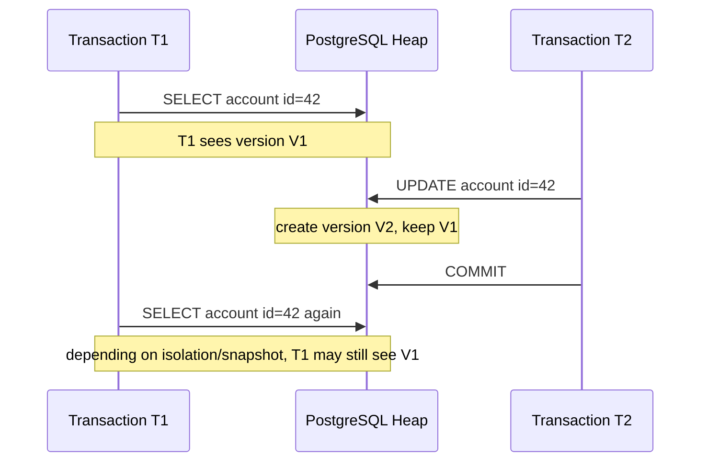
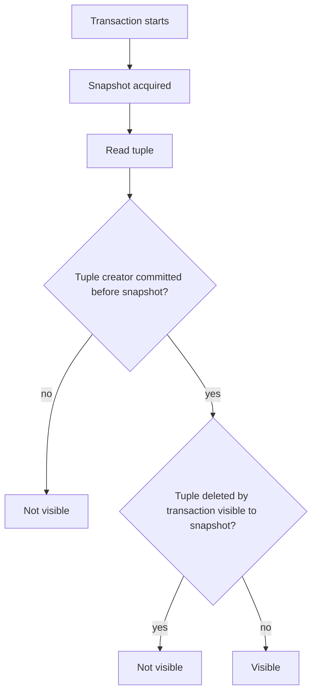
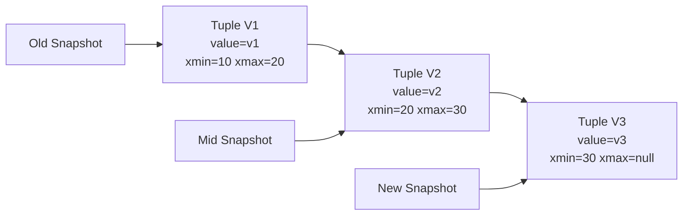
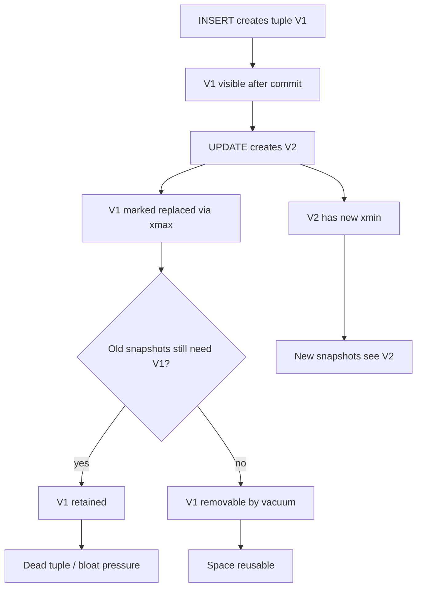

# Part 008 — MVCC and Snapshot Semantics

## 1. Tujuan Bagian Ini

Bagian ini membahas MVCC PostgreSQL: bagaimana database memungkinkan banyak transaksi membaca dan menulis data secara bersamaan tanpa menjadikan semua operasi saling blocking.

Kita tidak akan berhenti pada definisi “MVCC adalah multi-version concurrency control”. Target kita adalah bisa menjelaskan:

1. versi tuple mana yang terlihat oleh transaksi tertentu;
2. mengapa `SELECT` tidak selalu melihat update terbaru yang sudah terjadi secara wall-clock;
3. mengapa update membuat tuple baru;
4. mengapa dead tuple tidak bisa langsung dihapus;
5. mengapa long transaction dapat merusak kesehatan vacuum;
6. mengapa isolation level harus dipilih berdasarkan invariant aplikasi;
7. mengapa retry logic di Java harus sadar transaction boundary;
8. mengapa gejala bloat, lock, dan anomaly sering berasal dari snapshot semantics.

Kalimat pentingnya:

> PostgreSQL concurrency bukan hanya lock. PostgreSQL concurrency adalah kombinasi snapshot, tuple version, transaction id, visibility rule, dan lock.

Part ini menjadi fondasi untuk Part 009 tentang locking/deadlock dan Part 010 tentang isolation levels/application invariants.

## 2. Problem yang Diselesaikan MVCC

Tanpa MVCC, database bisa memilih pendekatan sederhana:

- reader memblok writer;
- writer memblok reader;
- semua transaksi serial secara kasar.

Itu mudah dipahami tetapi buruk untuk throughput OLTP.

MVCC memungkinkan:

- reader membaca snapshot konsisten tanpa memblok writer biasa;
- writer membuat versi baru tanpa menghapus versi lama secara langsung;
- transaksi lama tetap bisa melihat versi lama;
- transaksi baru bisa melihat versi baru;
- cleanup dilakukan kemudian oleh vacuum.

Ilustrasi:



Yang perlu dipahami: PostgreSQL tidak hanya punya “the row”. Ia bisa memiliki beberapa versi fisik dari logical row yang sama.

## 3. Tuple Version dan Visibility

Dari Part 007, kita tahu update dapat menghasilkan tuple baru. MVCC menentukan tuple mana yang visible.

Simplified tuple metadata:

```text
Tuple Version
+-------------------------------+
| xmin: transaction that created |
| xmax: transaction that deleted |
| ctid: pointer/update chain     |
| user columns                   |
+-------------------------------+
```

Makna sederhana:

- `xmin`: transaction id yang membuat tuple version;
- `xmax`: transaction id yang menghapus atau mengganti tuple version;
- jika creator belum commit, tuple biasanya belum visible bagi transaksi lain;
- jika deleter/updater sudah commit, tuple lama mungkin tidak visible bagi snapshot baru;
- jika snapshot lama dimulai sebelum update commit, tuple lama masih bisa visible.

Contoh logical:

```text
account id=42

Version V1:
  balance = 1000
  xmin = 10
  xmax = 20

Version V2:
  balance = 900
  xmin = 20
  xmax = null
```

Jika transaksi melihat snapshot sebelum transaction 20 commit, ia melihat V1.

Jika transaksi baru mulai setelah transaction 20 commit, ia melihat V2.

## 4. Snapshot: Bukan “Current Time”, tetapi Set Transaksi yang Visible

Snapshot bukan timestamp wall-clock. Snapshot adalah representasi transaction visibility.

Secara konseptual, snapshot menjawab:

1. transaksi mana yang sudah commit dan visible;
2. transaksi mana yang masih in-progress saat snapshot dibuat;
3. batas transaction id yang relevan.

Karena itu, dua transaksi yang berjalan bersamaan bisa melihat dunia yang berbeda.



Ini model sederhana. Implementasi PostgreSQL punya detail tambahan, tetapi flow di atas cukup untuk reasoning aplikasi.

## 5. Read Committed Snapshot Behavior

Default PostgreSQL adalah `READ COMMITTED`.

Pada `READ COMMITTED`, setiap statement mendapatkan snapshot baru.

Contoh:

Session A:

```sql
BEGIN;
SELECT balance FROM app.account WHERE id = 42;
-- returns 1000
```

Session B:

```sql
BEGIN;
UPDATE app.account
SET balance = 900
WHERE id = 42;
COMMIT;
```

Session A:

```sql
SELECT balance FROM app.account WHERE id = 42;
-- under READ COMMITTED, this statement can see 900
COMMIT;
```

Mental model:

```text
READ COMMITTED
transaction = container
statement 1 = snapshot A
statement 2 = snapshot B
statement 3 = snapshot C
```

Konsekuensi aplikasi:

- dua `SELECT` dalam satu transaction bisa melihat hasil berbeda;
- read-modify-write harus hati-hati;
- validation di awal transaksi bisa basi sebelum write;
- business invariant tidak otomatis aman hanya karena memakai transaction.

## 6. Repeatable Read Snapshot Behavior

Pada `REPEATABLE READ`, snapshot dibuat saat awal transaksi atau statement pertama yang membutuhkan snapshot, lalu dipakai konsisten sepanjang transaksi.

Session A:

```sql
BEGIN ISOLATION LEVEL REPEATABLE READ;
SELECT balance FROM app.account WHERE id = 42;
-- returns 1000
```

Session B:

```sql
BEGIN;
UPDATE app.account
SET balance = 900
WHERE id = 42;
COMMIT;
```

Session A:

```sql
SELECT balance FROM app.account WHERE id = 42;
-- still returns 1000 in the same repeatable-read transaction
COMMIT;
```

Mental model:

```text
REPEATABLE READ
transaction = one stable snapshot
statement 1 = snapshot A
statement 2 = snapshot A
statement 3 = snapshot A
```

Konsekuensi:

- report konsisten lebih mudah;
- tetapi snapshot lama dapat menahan cleanup vacuum;
- write conflict bisa menghasilkan serialization-like error;
- aplikasi harus siap retry untuk error concurrency tertentu.

## 7. Serializable Snapshot Isolation

`SERIALIZABLE` di PostgreSQL memberi jaminan lebih kuat: hasil concurrent transactions harus setara dengan eksekusi serial tertentu. PostgreSQL menggunakan Serializable Snapshot Isolation dengan predicate/concurrency tracking.

Untuk bagian ini, cukup pahami:

- serializable bukan berarti semua transaksi benar-benar dijalankan satu per satu;
- PostgreSQL mendeteksi pola konflik tertentu;
- transaksi dapat gagal dengan serialization failure;
- aplikasi harus retry seluruh transaction;
- cocok untuk invariant penting yang sulit dilindungi dengan lock/constraint biasa.

Kita bahas lebih dalam pada Part 010.

## 8. Visibility Lab: Melihat `xmin`, `xmax`, dan Snapshot

Setup:

```sql
DROP TABLE IF EXISTS app.mvcc_demo;

CREATE TABLE app.mvcc_demo (
    id bigint GENERATED ALWAYS AS IDENTITY PRIMARY KEY,
    value text NOT NULL
);

INSERT INTO app.mvcc_demo(value) VALUES ('v1');
```

Lihat metadata:

```sql
SELECT xmin, xmax, ctid, id, value
FROM app.mvcc_demo;
```

Update:

```sql
UPDATE app.mvcc_demo
SET value = 'v2'
WHERE id = 1;

SELECT xmin, xmax, ctid, id, value
FROM app.mvcc_demo;
```

Untuk melihat tuple lama, gunakan `pageinspect` seperti Part 007:

```sql
CREATE EXTENSION IF NOT EXISTS pageinspect;

SELECT lp, t_xmin, t_xmax, t_ctid
FROM heap_page_items(get_raw_page('app.mvcc_demo', 0));
```

Yang dipelajari:

- SQL normal hanya menampilkan tuple visible;
- page inspection dapat menunjukkan tuple yang tidak visible untuk snapshot normal;
- tuple lama tetap ada sampai vacuum membersihkan;
- `xmin/xmax` adalah bagian dari physical versioning.

## 9. Why Readers Do Not Usually Block Writers

Dalam PostgreSQL MVCC, plain `SELECT` biasanya tidak memblok `UPDATE`, dan `UPDATE` tidak memblok plain `SELECT`.

Contoh:

Session A:

```sql
BEGIN;
SELECT * FROM app.account WHERE id = 42;
-- transaction remains open
```

Session B:

```sql
BEGIN;
UPDATE app.account
SET balance = balance - 100
WHERE id = 42;
COMMIT;
```

Session B dapat update karena Session A hanya membaca snapshot, bukan memegang row lock yang memblok update.

Tetapi ini berbeda dengan:

```sql
SELECT *
FROM app.account
WHERE id = 42
FOR UPDATE;
```

`FOR UPDATE` mengambil row lock. Kita bahas detail lock di Part 009.

Rule:

> Plain read memakai snapshot. Locking read memakai lock.

## 10. Why Writers Can Block Writers

Dua transaksi yang ingin update row yang sama tetap konflik.

Session A:

```sql
BEGIN;
UPDATE app.account
SET balance = balance - 100
WHERE id = 42;
-- do not commit yet
```

Session B:

```sql
BEGIN;
UPDATE app.account
SET balance = balance - 50
WHERE id = 42;
-- waits for Session A
```

Mengapa?

- dua writer tidak boleh membuat update final yang ambigu untuk logical row yang sama;
- row-level lock dan tuple visibility bekerja bersama;
- setelah Session A commit/rollback, Session B menentukan apa yang harus dilakukan.

Important nuance:

- MVCC mengurangi read-write blocking;
- MVCC tidak menghilangkan write-write conflict;
- lock tetap fundamental.

## 11. Update Chain

Ketika row di-update beberapa kali, PostgreSQL dapat membentuk chain versi tuple.

```text
V1 --updated by--> V2 --updated by--> V3
```

Setiap snapshot perlu menentukan versi mana yang visible.

Ilustrasi:



Semakin panjang chain dan semakin banyak dead tuples, semakin besar pekerjaan visibility check dan vacuum.

HOT update dapat membuat chain lebih murah karena tidak harus mengubah index entries, tetapi chain tetap perlu dibersihkan pada akhirnya.

## 12. Dead Tuple: Tidak Visible Bukan Berarti Hilang

Tuple lama yang tidak lagi visible untuk transaksi baru disebut dead tuple, tetapi ia mungkin belum bisa dihapus.

Alasan dead tuple belum bisa dihapus:

1. masih ada transaksi lama yang snapshot-nya mungkin melihat tuple tersebut;
2. vacuum belum berjalan;
3. vacuum berjalan tetapi tidak bisa cleanup karena horizon transaksi;
4. ada replication slot/logical decoding yang menahan cleanup tertentu;
5. table sedang mengalami churn lebih cepat daripada vacuum.

Konsekuensi:

- table membesar;
- index membesar;
- query membaca lebih banyak page;
- vacuum cost meningkat;
- replication/WAL pressure bisa naik.

Query melihat oldest transaction:

```sql
SELECT
    pid,
    usename,
    application_name,
    state,
    now() - xact_start AS xact_age,
    now() - query_start AS query_age,
    wait_event_type,
    wait_event,
    left(query, 200) AS query
FROM pg_stat_activity
WHERE xact_start IS NOT NULL
ORDER BY xact_start;
```

Long transaction adalah red flag untuk MVCC health.

## 13. Transaction ID dan Wraparound Intuition

PostgreSQL menggunakan transaction ID untuk visibility. Karena transaction ID memiliki ruang terbatas, database perlu melakukan freezing agar tuple lama tidak menyebabkan wraparound ambiguity.

Detail freeze dibahas di Part 021, tetapi mental model awalnya:

- setiap transaksi mendapat ID;
- tuple menyimpan ID transaksi pembuat/penghapus;
- visibility membandingkan snapshot dengan transaction ID;
- ID tidak bisa dibiarkan “menua” tanpa batas;
- vacuum freeze menjaga tuple lama tetap aman;
- long-running transaction dan autovacuum yang gagal bisa menjadi risiko serius.

Jangan menunggu warning wraparound baru peduli. Wraparound adalah failure mode operasional yang harus dicegah sejak desain.

## 14. Snapshot dan Application Correctness

MVCC memberi read consistency, bukan otomatis business correctness.

Contoh invariant:

> Total active assignment untuk satu investigator maksimal 10.

Naive transaction:

```sql
BEGIN;

SELECT count(*)
FROM app.case_assignment
WHERE investigator_id = 7
  AND status = 'ACTIVE';

-- application sees 9

INSERT INTO app.case_assignment(case_id, investigator_id, status)
VALUES (1001, 7, 'ACTIVE');

COMMIT;
```

Jika dua transaksi melakukan hal sama bersamaan, keduanya bisa melihat count 9 lalu insert, sehingga hasil akhir 11.

MVCC tidak otomatis mencegah ini di isolation level default.

Solusi bisa berupa:

1. unique/constraint jika invariant bisa diekspresikan secara declarative;
2. counter row dengan `SELECT FOR UPDATE`;
3. advisory lock per investigator;
4. serializable transaction dengan retry;
5. redesign aggregate boundary;
6. asynchronous capacity allocation dengan queue.

Core lesson:

> Snapshot consistency bukan invariant enforcement.

## 15. Statement Snapshot dan `now()`

PostgreSQL memiliki fungsi waktu dengan semantics berbeda. Dalam transaksi, `now()` atau `transaction_timestamp()` mengembalikan waktu awal transaksi, bukan waktu aktual setiap pemanggilan.

Contoh:

```sql
BEGIN;
SELECT now();
SELECT pg_sleep(5);
SELECT now();
COMMIT;
```

`now()` dapat tetap sama dalam transaksi tersebut.

Jika butuh wall-clock saat statement berjalan, PostgreSQL punya fungsi lain seperti `clock_timestamp()`.

Implikasi Java:

- jangan bingung jika `updated_at = now()` sama untuk beberapa statement dalam transaksi;
- ini sering justru baik karena memberi timestamp konsisten untuk unit of work;
- jika butuh precise event time per row processing, pilih fungsi dengan sadar;
- jangan campur timestamp dari JVM dan database tanpa kebijakan jelas.

## 16. Java Transaction Boundary

Di Java, transaction boundary sering tersembunyi di annotation:

```java
@Transactional
public void assignCase(long caseId, long investigatorId) {
    int active = assignmentRepository.countActive(investigatorId);
    if (active >= 10) {
        throw new CapacityExceededException();
    }
    assignmentRepository.insert(caseId, investigatorId);
}
```

Pertanyaan penting:

1. isolation level apa yang dipakai?
2. apakah `countActive` dan `insert` berada dalam transaksi yang sama?
3. apakah concurrent transaction bisa melihat count yang sama?
4. apakah ada constraint/lock yang menjaga invariant?
5. jika terjadi serialization failure, apakah method di-retry seluruhnya?
6. apakah method melakukan remote call di dalam transaction?
7. apakah transaction terlalu lama karena business logic/IO?

Anti-pattern:

```java
@Transactional
public void processCase(long caseId) {
    CaseFile caseFile = repository.findById(caseId);
    externalRiskApi.evaluate(caseFile); // remote call inside transaction
    caseFile.transitionToReviewed();
    repository.save(caseFile);
}
```

Masalah:

- transaction terbuka selama network call;
- snapshot/lock lebih lama;
- vacuum horizon bisa tertahan jika banyak pattern seperti ini;
- connection pool tertahan;
- failure retry menjadi ambigu;
- user-facing latency naik.

Lebih baik:

```java
public void processCase(long caseId) {
    CaseSnapshot snapshot = transactionTemplate.execute(tx ->
        repository.loadSnapshotForRisk(caseId)
    );

    RiskResult result = externalRiskApi.evaluate(snapshot);

    transactionTemplate.executeWithoutResult(tx ->
        repository.applyRiskResult(caseId, result)
    );
}
```

Tentu perlu idempotency/version check agar result tidak diterapkan pada state yang sudah berubah.

## 17. Optimistic Locking dan MVCC

Optimistic locking di aplikasi biasanya memakai version column:

```sql
CREATE TABLE app.case_file_versioned (
    id bigint GENERATED ALWAYS AS IDENTITY PRIMARY KEY,
    lifecycle_state text NOT NULL,
    version bigint NOT NULL DEFAULT 0,
    updated_at timestamptz NOT NULL DEFAULT now()
);
```

Update:

```sql
UPDATE app.case_file_versioned
SET lifecycle_state = :new_state,
    version = version + 1,
    updated_at = now()
WHERE id = :id
  AND version = :expected_version;
```

Jika affected row = 0, berarti conflict.

Optimistic locking bukan pengganti MVCC; ia adalah application-level conflict detection di atas MVCC.

Cocok untuk:

- aggregate update dengan user think time;
- REST command yang membawa version/ETag;
- state transition yang tidak boleh silently overwrite;
- UI edit form.

Tidak cukup untuk:

- invariant lintas banyak row;
- capacity constraint tanpa aggregate lock;
- race condition berbasis count;
- uniqueness kompleks yang harus dijaga database.

## 18. Lost Update dan PostgreSQL

Lost update terjadi ketika dua actor membaca nilai yang sama lalu menulis hasil update tanpa mendeteksi konflik.

Anti-pattern di aplikasi:

```java
Account a = accountRepository.findById(id);
a.setBalance(a.getBalance().subtract(amount));
accountRepository.save(a);
```

Jika dua request membaca balance 1000, masing-masing mengurangi 100 dan 50, hasil akhir bisa salah jika write terakhir overwrite hasil sebelumnya.

Lebih baik untuk operasi aritmetik:

```sql
UPDATE app.account
SET balance = balance - :amount
WHERE id = :id
  AND balance >= :amount;
```

Ini membuat update atomic di database.

Untuk state transition:

```sql
UPDATE app.case_file
SET lifecycle_state = 'ESCALATED',
    updated_at = now()
WHERE id = :id
  AND lifecycle_state = 'INVESTIGATION';
```

Affected row menjadi signal apakah transition valid.

Rule:

> Jangan pecah read-modify-write menjadi read di aplikasi lalu blind write jika database bisa mengeksekusi perubahan secara atomic.

## 19. Write Skew Intuition

Write skew adalah anomaly ketika dua transaksi membaca set data yang sama, lalu menulis row berbeda, sehingga invariant global dilanggar.

Contoh:

> Minimal satu reviewer harus aktif untuk case.

Data awal:

```text
case_id=1, reviewer=A, active=true
case_id=1, reviewer=B, active=true
```

Transaction 1:

```sql
-- sees two active reviewers
UPDATE reviewer_assignment
SET active = false
WHERE case_id = 1 AND reviewer = 'A';
```

Transaction 2:

```sql
-- also sees two active reviewers
UPDATE reviewer_assignment
SET active = false
WHERE case_id = 1 AND reviewer = 'B';
```

Akhirnya tidak ada reviewer aktif.

MVCC default tidak selalu mencegah ini. Solusi:

- lock parent case row;
- serializable transaction dengan retry;
- constraint redesign;
- model active reviewer sebagai single authoritative row;
- enforce invariant melalui state transition table.

Write skew menunjukkan mengapa transaction isolation harus dibahas dengan invariant, bukan dengan definisi textbook saja.

## 20. Snapshot Too Old dan Long-Running Work

Long-running transaction bisa berdampak besar:

1. menahan snapshot lama;
2. mencegah vacuum membersihkan tuple tertentu;
3. menyebabkan bloat;
4. meningkatkan storage dan query cost;
5. memperbesar risiko freeze pressure;
6. menahan connection pool;
7. membuat failover/recovery lebih berat.

Sumber umum:

- report besar di primary;
- batch job yang membuka transaction terlalu awal;
- cursor/fetch stream yang tidak ditutup;
- interactive transaction dari admin tool;
- migration script lambat;
- Java method `@Transactional` terlalu lebar;
- test suite yang meninggalkan transaction terbuka.

Diagnostic query:

```sql
SELECT
    pid,
    application_name,
    client_addr,
    state,
    backend_xmin,
    now() - xact_start AS xact_age,
    now() - state_change AS state_age,
    left(query, 200) AS query
FROM pg_stat_activity
WHERE backend_xmin IS NOT NULL
ORDER BY xact_start NULLS LAST;
```

`backend_xmin` penting karena menunjukkan horizon yang bisa menahan cleanup.

## 21. Idle in Transaction

`idle in transaction` adalah session yang membuka transaction tetapi sedang tidak menjalankan query.

Ini berbahaya karena:

- transaction tetap terbuka;
- snapshot bisa tetap menahan vacuum;
- locks mungkin masih dipegang;
- connection pool slot terpakai;
- debugging sulit karena query terakhir mungkin terlihat tidak aktif.

Query:

```sql
SELECT
    pid,
    usename,
    application_name,
    client_addr,
    state,
    now() - xact_start AS xact_age,
    now() - state_change AS idle_age,
    left(query, 200) AS last_query
FROM pg_stat_activity
WHERE state = 'idle in transaction'
ORDER BY xact_start;
```

Mitigasi:

```sql
ALTER DATABASE appdb
SET idle_in_transaction_session_timeout = '60s';
```

Atau per role:

```sql
ALTER ROLE app_user
SET idle_in_transaction_session_timeout = '60s';
```

Di Java:

- gunakan transaction timeout;
- pastikan connection dikembalikan;
- jangan stream result tanpa menutup resource;
- jangan tunggu user/external API dalam transaction;
- monitor pool active connection age.

## 22. MVCC dan Replication / CDC

MVCC juga berinteraksi dengan logical decoding dan replication slots. Kita bahas detail di Part 023–024, tetapi intuition-nya:

- logical replication perlu mempertahankan informasi perubahan sampai consumer mengonsumsinya;
- replication slot yang tertinggal bisa menahan WAL;
- long transaction besar bisa membuat decoding terlambat;
- outbox table update/delete pattern harus sadar vacuum dan retention.

Contoh outbox yang buruk:

```sql
UPDATE app.outbox
SET published = true,
    published_at = now()
WHERE id = :id;
```

Jika outbox sangat tinggi throughput dan row terus di-update, dead tuple tinggi.

Alternatif:

- append-only outbox;
- delete/partition old published rows;
- partial index `WHERE published_at IS NULL`;
- batch publish;
- retention via partition drop;
- monitor vacuum.

## 23. MVCC dan Query Plan

MVCC memengaruhi query plan secara tidak langsung melalui:

1. dead tuple count;
2. visibility map;
3. table/index bloat;
4. index-only scan feasibility;
5. vacuum/analyze freshness;
6. row estimates.

Contoh gejala:

```sql
EXPLAIN (ANALYZE, BUFFERS)
SELECT id
FROM app.case_file
WHERE lifecycle_state = 'OPEN'
ORDER BY updated_at DESC
LIMIT 50;
```

Jika plan tampak baik tetapi lambat, cek:

- apakah banyak heap fetch;
- apakah dead tuple tinggi;
- apakah index bloat;
- apakah autovacuum terakhir lama;
- apakah ada long transaction;
- apakah statistics stale.

## 24. MVCC-Aware State Transition Pattern

Untuk workflow/regulatory case management, state transition sebaiknya atomic dan conditional.

Schema:

```sql
CREATE TABLE app.case_file (
    id bigint GENERATED ALWAYS AS IDENTITY PRIMARY KEY,
    lifecycle_state text NOT NULL,
    version bigint NOT NULL DEFAULT 0,
    updated_at timestamptz NOT NULL DEFAULT now(),
    CONSTRAINT chk_case_file_state
        CHECK (lifecycle_state IN ('INTAKE', 'REVIEW', 'INVESTIGATION', 'ESCALATED', 'CLOSED'))
);
```

Transition:

```sql
UPDATE app.case_file
SET lifecycle_state = 'INVESTIGATION',
    version = version + 1,
    updated_at = now()
WHERE id = :case_id
  AND lifecycle_state = 'REVIEW'
  AND version = :expected_version;
```

Interpretasi result:

- affected row = 1: transition success;
- affected row = 0: stale version, invalid state, or missing case;
- aplikasi harus membedakan dengan follow-up read jika perlu UX detail.

Tambahkan event secara transactionally:

```sql
WITH transitioned AS (
    UPDATE app.case_file
    SET lifecycle_state = 'INVESTIGATION',
        version = version + 1,
        updated_at = now()
    WHERE id = :case_id
      AND lifecycle_state = 'REVIEW'
      AND version = :expected_version
    RETURNING id, version
)
INSERT INTO app.case_event(case_id, event_type, payload)
SELECT id, 'CASE_TRANSITIONED', jsonb_build_object('to', 'INVESTIGATION', 'version', version)
FROM transitioned;
```

Keuntungan:

- atomic;
- menghindari blind overwrite;
- event hanya dibuat jika transition sukses;
- MVCC conflict menjadi explicit melalui affected rows;
- cocok dengan Java command handler.

## 25. Retry Semantics di Java

Retry harus dilakukan pada boundary yang benar.

Salah:

```java
@Transactional
public void transfer(...) {
    retryTemplate.execute(ctx -> {
        debit();
        credit();
        insertLedger();
        return null;
    });
}
```

Jika retry terjadi di dalam transaction yang sudah error, connection/session bisa berada dalam aborted transaction state.

Lebih baik:

```java
public void transfer(...) {
    retryTemplate.execute(ctx ->
        transactionTemplate.execute(tx -> {
            debit();
            credit();
            insertLedger();
            return null;
        })
    );
}
```

Rule:

> Retry concurrency failure dengan mengulang seluruh transaction, bukan hanya statement terakhir.

Error yang perlu dipertimbangkan:

- serialization failure;
- deadlock detected;
- lock timeout;
- unique violation pada idempotency key bisa menjadi success-equivalent tergantung konteks;
- optimistic lock affected row = 0.

## 26. MVCC dan Idempotency

Concurrent request sering muncul karena:

- retry dari client;
- message broker redelivery;
- timeout ambigu;
- double click;
- batch rerun;
- failover.

Idempotency table:

```sql
CREATE TABLE app.idempotency_key (
    key text PRIMARY KEY,
    request_hash text NOT NULL,
    status text NOT NULL,
    response_payload jsonb,
    created_at timestamptz NOT NULL DEFAULT now(),
    completed_at timestamptz
);
```

Acquire:

```sql
INSERT INTO app.idempotency_key(key, request_hash, status)
VALUES (:key, :hash, 'PROCESSING')
ON CONFLICT (key) DO NOTHING;
```

Jika insert sukses, request pertama memproses. Jika tidak, request duplicate harus membaca status.

MVCC nuance:

- concurrent insert ke key sama akan konflik pada unique index;
- transaction yang kalah mungkin menunggu transaction yang menang;
- setelah commit, duplicate dapat membaca result;
- jangan simpan external side effect sebelum idempotency state aman.

## 27. Testing MVCC dengan Dua Session

Gunakan dua terminal `psql`.

Setup:

```sql
DROP TABLE IF EXISTS app.account;

CREATE TABLE app.account (
    id bigint PRIMARY KEY,
    balance numeric(19,2) NOT NULL
);

INSERT INTO app.account(id, balance)
VALUES (42, 1000.00);
```

### Experiment A: Read Committed sees new committed data per statement

Session 1:

```sql
BEGIN;
SELECT balance FROM app.account WHERE id = 42;
```

Session 2:

```sql
BEGIN;
UPDATE app.account SET balance = 900 WHERE id = 42;
COMMIT;
```

Session 1:

```sql
SELECT balance FROM app.account WHERE id = 42;
COMMIT;
```

Expected: second select in Session 1 sees new committed value under default `READ COMMITTED`.

### Experiment B: Repeatable Read keeps snapshot stable

Session 1:

```sql
BEGIN ISOLATION LEVEL REPEATABLE READ;
SELECT balance FROM app.account WHERE id = 42;
```

Session 2:

```sql
BEGIN;
UPDATE app.account SET balance = 800 WHERE id = 42;
COMMIT;
```

Session 1:

```sql
SELECT balance FROM app.account WHERE id = 42;
COMMIT;
```

Expected: Session 1 still sees value from its snapshot.

## 28. Testing Writer Blocking

Session 1:

```sql
BEGIN;
UPDATE app.account
SET balance = balance - 100
WHERE id = 42;
```

Session 2:

```sql
BEGIN;
UPDATE app.account
SET balance = balance - 50
WHERE id = 42;
```

Session 2 waits.

Diagnostic in third session:

```sql
SELECT
    a.pid,
    a.state,
    a.wait_event_type,
    a.wait_event,
    now() - a.query_start AS query_age,
    left(a.query, 100) AS query
FROM pg_stat_activity a
WHERE a.datname = current_database()
ORDER BY a.query_start;
```

Commit Session 1:

```sql
COMMIT;
```

Session 2 continues. This demonstrates that MVCC does not remove write-write blocking.

## 29. MVCC Failure Mode Catalog

| Failure Mode | Symptom | Root Cause | Response |
|---|---|---|---|
| Long transaction | dead tuples grow, vacuum ineffective | snapshot horizon old | shorten transaction, timeout, move report |
| Idle in transaction | locks/snapshot held while no query running | app leak/admin session | timeout, pool leak detection |
| Lost update | final value overwrites concurrent change | blind read-modify-write | atomic SQL update, version column |
| Write skew | invariant across rows violated | snapshot reads stale set | lock aggregate, serializable, constraint redesign |
| Bloat from update churn | table/index grows | dead tuples + weak vacuum | autovacuum tuning, HOT, index review |
| Retry wrong boundary | repeated failure/partial side effects | retry inside transaction | retry whole transaction |
| Queue churn | high dead tuples | insert/update/delete loop | partition, partial index, retention |
| Report blocks vacuum | OLTP slows after report | old snapshot on primary | replica/snapshot table, bounded transaction |

## 30. How to Think During Incident

When a PostgreSQL incident smells like MVCC, ask in this order:

1. Are there long transactions?
2. Are there sessions `idle in transaction`?
3. Is `backend_xmin` old?
4. Are dead tuples growing?
5. Is autovacuum running or blocked?
6. Are writer sessions waiting on row locks?
7. Did a recent deployment add full entity updates or new indexes?
8. Did a report/batch job start on primary?
9. Are replication slots retaining WAL?
10. Did query plans degrade due to bloat/stale stats?

Diagnostic bundle:

```sql
-- transaction age
SELECT pid, application_name, state, backend_xmin,
       now() - xact_start AS xact_age,
       wait_event_type, wait_event,
       left(query, 200) AS query
FROM pg_stat_activity
WHERE xact_start IS NOT NULL
ORDER BY xact_start;

-- table dead tuple signals
SELECT schemaname, relname, n_live_tup, n_dead_tup,
       last_autovacuum, autovacuum_count
FROM pg_stat_user_tables
ORDER BY n_dead_tup DESC
LIMIT 20;

-- blocked sessions
SELECT pid, pg_blocking_pids(pid) AS blockers,
       wait_event_type, wait_event,
       left(query, 200) AS query
FROM pg_stat_activity
WHERE cardinality(pg_blocking_pids(pid)) > 0;
```

## 31. Design Rules for Java Services

1. Keep transactions short.
2. Do not call remote services inside database transaction.
3. Prefer atomic SQL commands over read-modify-write in Java.
4. Use version columns for user-driven aggregate edits.
5. Use constraints for invariants that database can express.
6. Use `SELECT FOR UPDATE` only when you intentionally need locking read.
7. Retry whole transaction for serialization/deadlock failures.
8. Set transaction timeout and idle-in-transaction timeout.
9. Avoid streaming huge result sets inside long transactions on primary.
10. Expose application name in JDBC connection for `pg_stat_activity`.
11. Monitor long transaction age, not only slow query duration.
12. Design outbox/queue tables with churn and vacuum in mind.

JDBC connection property example:

```text
jdbc:postgresql://localhost:5432/appdb?ApplicationName=enforcement-case-service
```

Then in PostgreSQL:

```sql
SELECT application_name, count(*)
FROM pg_stat_activity
GROUP BY application_name
ORDER BY count(*) DESC;
```

## 32. Common Misconceptions

### Misconception 1: “Transaction Means Nobody Else Can Change the Data”

False. Transaction gives atomicity and isolation according to isolation level. Under default `READ COMMITTED`, other committed changes may be visible to later statements.

### Misconception 2: “SELECT Does Not Affect Database Health”

Plain select does not write data, but long-running select can hold snapshot and delay cleanup.

### Misconception 3: “MVCC Means No Locks”

False. MVCC reduces certain read-write blocking, but locks still exist for writes, DDL, constraints, indexes, and explicit locking reads.

### Misconception 4: “Repeatable Read Fixes All Race Conditions”

False. It gives stable snapshot, but invariant across rows can still need stronger design.

### Misconception 5: “Retry the Failed Query”

Often wrong. For concurrency failures, retry the whole transaction.

## 33. Mermaid: MVCC Lifecycle



## 34. Self-Correction Questions

Jawab tanpa melihat materi:

1. Apa bedanya logical row dan tuple version?
2. Apa peran `xmin` dan `xmax` secara konseptual?
3. Mengapa `READ COMMITTED` bisa melihat hasil berbeda pada dua `SELECT` dalam satu transaction?
4. Mengapa `REPEATABLE READ` bisa menahan vacuum lebih lama?
5. Mengapa plain `SELECT` biasanya tidak memblok `UPDATE`?
6. Mengapa dua `UPDATE` pada row yang sama tetap bisa saling menunggu?
7. Apa itu lost update dan bagaimana mencegahnya?
8. Apa itu write skew secara intuitif?
9. Mengapa retry harus mengulang seluruh transaction?
10. Mengapa `idle in transaction` berbahaya?
11. Apa hubungan MVCC dengan bloat?
12. Kapan optimistic locking membantu dan kapan tidak cukup?

## 35. Takeaways

- MVCC memungkinkan reader dan writer berjalan bersamaan melalui snapshot dan tuple version.
- PostgreSQL menyimpan metadata visibility di tuple melalui transaction id seperti `xmin` dan `xmax`.
- Snapshot bukan timestamp, tetapi rule visibility terhadap transaksi.
- Default `READ COMMITTED` memberi snapshot per statement, bukan satu snapshot per transaction.
- Long-running transaction bisa mengganggu vacuum dan menyebabkan bloat.
- MVCC tidak menghilangkan lock; writer tetap bisa memblok writer.
- Correctness aplikasi tetap perlu constraint, atomic update, lock, serializable transaction, atau optimistic locking sesuai invariant.
- Java transaction boundary harus pendek, eksplisit, dan retryable secara utuh.
- Engineer yang kuat membaca race condition dari invariant, bukan hanya dari isolation-level label.

## 36. Referensi Resmi

- PostgreSQL Documentation — Concurrency Control: `https://www.postgresql.org/docs/current/mvcc.html`
- PostgreSQL Documentation — Transaction Isolation: `https://www.postgresql.org/docs/current/transaction-iso.html`
- PostgreSQL Documentation — Explicit Locking: `https://www.postgresql.org/docs/current/explicit-locking.html`
- PostgreSQL Documentation — Monitoring Database Activity: `https://www.postgresql.org/docs/current/monitoring-stats.html`
- PostgreSQL Documentation — Routine Vacuuming: `https://www.postgresql.org/docs/current/routine-vacuuming.html`
- PostgreSQL Documentation — Preventing Transaction ID Wraparound Failures: `https://www.postgresql.org/docs/current/routine-vacuuming.html#VACUUM-FOR-WRAPAROUND`
- PostgreSQL Documentation — `pageinspect`: `https://www.postgresql.org/docs/current/pageinspect.html`
