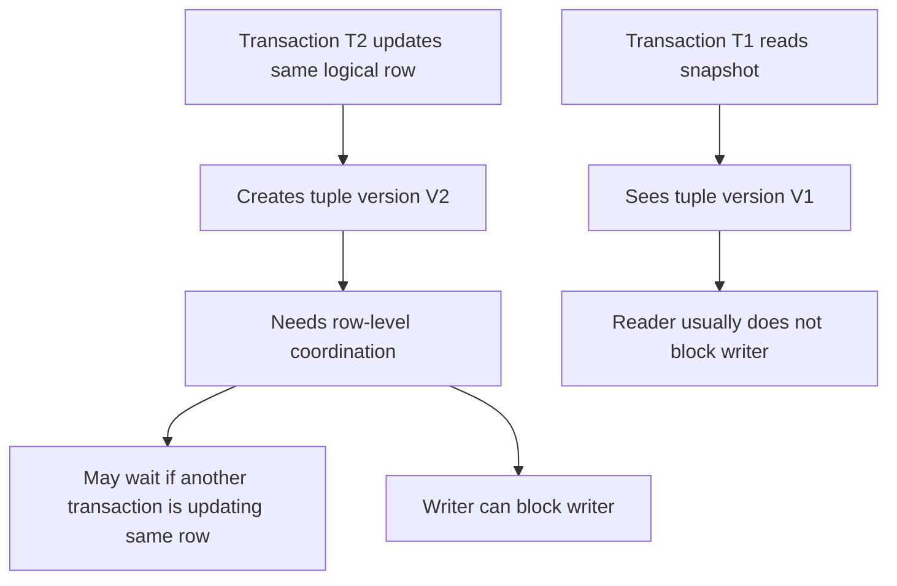
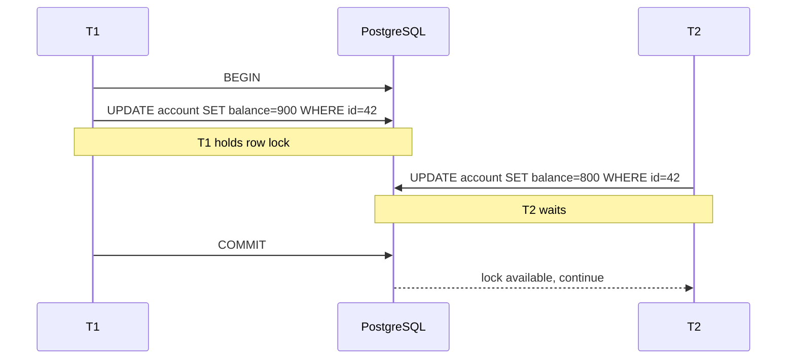
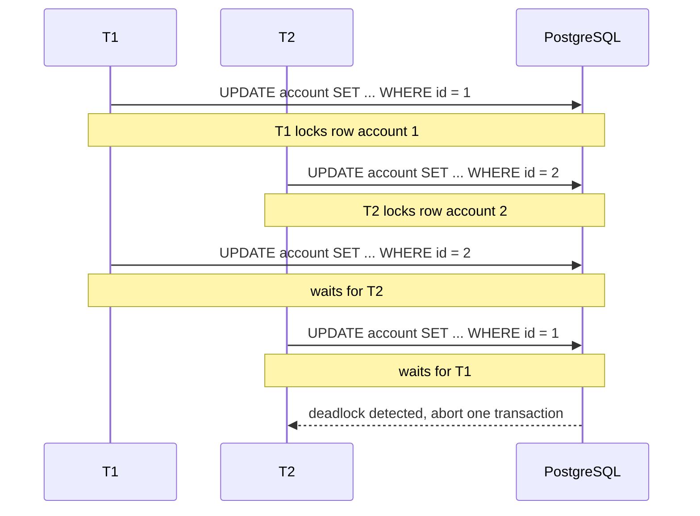
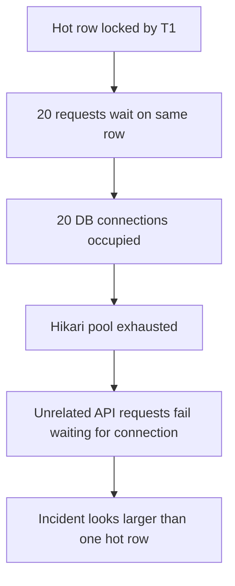

# Part 009 — Transaction Engineering, Locking, and Deadlocks

## 1. Tujuan Bagian Ini

Bagian ini membahas transaksi sebagai **engineering boundary**, bukan sekadar `BEGIN` dan `COMMIT`.

Kita akan fokus pada pertanyaan production:

1. operasi mana yang membuat transaksi lain menunggu;
2. mengapa query yang “cepat di staging” bisa menggantung di production;
3. bagaimana membaca blocking chain dari `pg_stat_activity` dan `pg_locks`;
4. mengapa deadlock terjadi walaupun semua query terlihat benar secara lokal;
5. bagaimana mendesain urutan update agar deadlock tidak menjadi pola harian;
6. kapan memakai optimistic locking, pessimistic locking, advisory lock, dan `SKIP LOCKED`;
7. bagaimana Java service harus menangani lock timeout, deadlock, dan retry;
8. bagaimana membedakan lock problem, isolation problem, dan application invariant problem.

Kalimat penting:

> Lock bukan bug. Lock adalah mekanisme koordinasi. Yang berbahaya adalah lock yang tidak disengaja, lock yang terlalu lama, lock yang tidak terobservasi, dan lock yang dipegang sambil menunggu hal di luar database.

Part ini melanjutkan Part 008 tentang MVCC. MVCC membuat reader dan writer bisa berjalan lebih paralel, tetapi bukan berarti PostgreSQL bebas lock. Writer tetap perlu koordinasi, constraints tetap perlu validasi, DDL tetap perlu proteksi metadata, dan isolation tertentu tetap perlu dependency tracking.

## 2. Mental Model: Transaction as Invariant Envelope

Transaksi bukan hanya “unit of work”. Dalam sistem yang serius, transaksi adalah **envelope untuk menjaga invariant**.

Contoh invariant:

```text
Order cannot be PAID unless payment is captured.
Case cannot be CLOSED while an active enforcement action exists.
Account balance cannot go below zero.
Only one active workflow version can exist per tenant.
A document number must be unique per year and office.
```

Transaksi menjawab:

- data apa yang harus dibaca;
- data apa yang harus dikunci;
- constraint apa yang harus divalidasi;
- perubahan apa yang harus commit bersama;
- side effect apa yang tidak boleh terjadi sebelum commit;
- failure apa yang boleh di-retry.

Buruk:

```text
BEGIN
  read account
  call remote payment provider
  update account
  insert audit log
COMMIT
```

Lebih baik:

```text
call remote payment provider outside DB transaction if possible
BEGIN
  lock/read account
  validate invariant
  update account
  insert durable outbox/audit row
COMMIT
publish side effect after commit through outbox worker
```

Boundary transaksi yang baik:

- pendek;
- deterministik;
- tidak menunggu user input;
- tidak menunggu network call eksternal;
- mengunci object dalam urutan konsisten;
- punya timeout;
- punya retry policy untuk error yang memang retryable;
- tidak menyembunyikan contention sebagai “random slow query”.

## 3. Locking Tidak Bertentangan dengan MVCC

MVCC menjelaskan **versi row mana yang terlihat**. Locking menjelaskan **siapa boleh mengubah apa dan kapan**.

Ilustrasi:



Prinsip sederhana:

- plain `SELECT` biasanya tidak mengambil row lock;
- `UPDATE`, `DELETE`, dan `SELECT ... FOR UPDATE` mengambil row-level lock;
- DML juga mengambil table-level lock tertentu untuk melindungi relation dari DDL yang tidak kompatibel;
- DDL dapat mengambil lock yang jauh lebih kuat;
- foreign key check dapat mengambil lock pada parent row;
- unique constraint dan index juga dapat membuat transaksi saling menunggu;
- serializable isolation memakai dependency tracking yang dapat memicu serialization failure.

## 4. Jenis Lock yang Perlu Dipahami

PostgreSQL punya banyak lock internal. Untuk engineer aplikasi, kelompok paling penting adalah:

| Jenis | Contoh | Gunanya |
|---|---|---|
| Table-level lock | `ACCESS SHARE`, `ROW EXCLUSIVE`, `ACCESS EXCLUSIVE` | Koordinasi operasi terhadap relation/table. |
| Row-level lock | `FOR UPDATE`, `FOR NO KEY UPDATE`, `FOR SHARE`, `FOR KEY SHARE` | Koordinasi perubahan tuple logical row. |
| Page/Buffer-level internal lock | Internal storage engine | Tidak biasanya dikontrol langsung aplikasi. |
| Predicate/SIREAD lock | Serializable isolation | Dependency tracking untuk mencegah anomaly. |
| Advisory lock | `pg_advisory_lock`, `pg_try_advisory_xact_lock` | Lock aplikasi berbasis angka/key, bukan row. |
| Transaction ID lock | Waiting on another transaction | Sering muncul saat menunggu transaksi lain commit/rollback. |

Yang paling sering muncul dalam troubleshooting aplikasi:

- row-level lock contention;
- table lock dari migration/DDL;
- lock karena FK validation;
- deadlock karena urutan update tidak konsisten;
- long transaction yang menahan lock terlalu lama;
- connection pool starvation yang membuat lock wait terlihat lebih buruk.

## 5. Table-Level Locks: Yang Sering Terjadi Tanpa Disadari

Setiap query dapat mengambil table-level lock tertentu. Nama “table-level” tidak berarti selalu mengunci seluruh table terhadap semua operasi. Ia berarti lock object-nya adalah relation/table, tetapi conflict behavior tergantung mode.

Simplified table lock modes:

| Mode | Umum Diambil Oleh | Karakter |
|---|---|---|
| `ACCESS SHARE` | plain `SELECT` | Ringan; conflict dengan `ACCESS EXCLUSIVE`. |
| `ROW SHARE` | `SELECT ... FOR UPDATE/SHARE` | Melindungi table yang row-nya akan dikunci. |
| `ROW EXCLUSIVE` | `INSERT`, `UPDATE`, `DELETE` | DML umum. |
| `SHARE UPDATE EXCLUSIVE` | `VACUUM`, beberapa `ALTER TABLE`, `CREATE INDEX CONCURRENTLY` | Untuk maintenance/DDL tertentu. |
| `SHARE` | `CREATE INDEX` non-concurrent | Dapat mengganggu writes. |
| `SHARE ROW EXCLUSIVE` | Beberapa constraint/trigger operation | Lebih restriktif. |
| `EXCLUSIVE` | Beberapa maintenance operation | Restriktif. |
| `ACCESS EXCLUSIVE` | Banyak DDL berat, `DROP`, `TRUNCATE`, beberapa `ALTER TABLE` | Paling kuat; memblok hampir semua akses. |

Mental model:

```text
SELECT biasa butuh ACCESS SHARE.
ALTER TABLE tertentu butuh ACCESS EXCLUSIVE.
ACCESS EXCLUSIVE conflict dengan ACCESS SHARE.
Artinya: satu DDL buruk bisa memblok SELECT production.
```

Contoh failure:

```sql
ALTER TABLE large_orders ADD COLUMN new_col text DEFAULT 'x' NOT NULL;
```

Tergantung versi, bentuk DDL, default expression, dan validasi, operasi seperti ini bisa mengambil lock yang berdampak besar. Bahkan DDL yang terlihat metadata-only tetap perlu lock untuk mengubah katalog dan memastikan tidak ada operasi lain yang melihat state setengah jadi.

Pola aman:

```sql
-- Step 1: expand schema, nullable first
ALTER TABLE large_orders ADD COLUMN new_col text;

-- Step 2: backfill in small batches outside one giant transaction
UPDATE large_orders
SET new_col = 'x'
WHERE new_col IS NULL
  AND id IN (
    SELECT id
    FROM large_orders
    WHERE new_col IS NULL
    ORDER BY id
    LIMIT 1000
  );

-- Step 3: set default for future rows
ALTER TABLE large_orders ALTER COLUMN new_col SET DEFAULT 'x';

-- Step 4: validate non-null with safer pattern where possible
ALTER TABLE large_orders ADD CONSTRAINT large_orders_new_col_nn CHECK (new_col IS NOT NULL) NOT VALID;
ALTER TABLE large_orders VALIDATE CONSTRAINT large_orders_new_col_nn;
```

Catatan: detail lock tetap harus dicek untuk statement yang dipakai. Jangan menganggap semua DDL aman hanya karena “pernah cepat di staging”.

## 6. Row-Level Locks

Row-level lock adalah lock terhadap tuple/logical row. Ia muncul pada:

- `UPDATE`;
- `DELETE`;
- `SELECT ... FOR UPDATE`;
- `SELECT ... FOR NO KEY UPDATE`;
- `SELECT ... FOR SHARE`;
- `SELECT ... FOR KEY SHARE`;
- constraint enforcement seperti foreign key.

### 6.1 `FOR UPDATE`

Dipakai ketika transaksi akan memodifikasi row dan ingin mencegah transaksi lain mengubah atau mengunci row tersebut secara tidak kompatibel.

```sql
BEGIN;

SELECT *
FROM account
WHERE id = 42
FOR UPDATE;

UPDATE account
SET balance = balance - 100
WHERE id = 42;

COMMIT;
```

Gunakan ketika:

- ada read-then-write;
- keputusan update tergantung nilai sekarang;
- race condition tidak bisa diselesaikan dengan single conditional update;
- kita perlu mencegah writer lain mengubah row sebelum transaksi selesai.

Jangan gunakan sebagai default untuk semua read. Pessimistic lock yang tidak perlu akan menurunkan concurrency.

### 6.2 `FOR NO KEY UPDATE`

Lebih lemah dari `FOR UPDATE`. Biasanya cukup ketika update tidak mengubah key yang direferensikan FK.

Contoh:

```sql
SELECT *
FROM case_file
WHERE id = :caseId
FOR NO KEY UPDATE;
```

Ini cocok untuk update field state atau metadata, bukan perubahan key identity.

### 6.3 `FOR SHARE` dan `FOR KEY SHARE`

Dipakai ketika transaksi ingin memastikan row tidak berubah/dihapus dengan cara yang merusak referential relationship, tetapi tidak selalu ingin melakukan update langsung.

Contoh umum muncul dari foreign key. Saat insert child row, PostgreSQL perlu memastikan parent row valid dan tidak dihapus secara concurrent.

```sql
INSERT INTO order_item(order_id, sku, qty)
VALUES (:orderId, :sku, :qty);
```

Operasi ini dapat berinteraksi dengan lock parent `orders` karena FK perlu menjaga referential integrity.

## 7. Lock Wait dan Blocking Chain

Saat query menunggu lock, database tidak selalu “lambat”. Bisa jadi query sudah siap jalan tetapi sedang menunggu transaksi lain.

Contoh:



Yang harus ditanyakan saat query menunggu:

1. siapa blocker-nya;
2. query blocker sedang apa;
3. sudah berapa lama transaksi blocker hidup;
4. blocker idle atau aktif;
5. lock apa yang ditunggu;
6. apakah ada chain blocker;
7. apakah wait terjadi karena transaksi aplikasi, migration, vacuum, atau maintenance;
8. apakah connection pool menambah efek domino.

## 8. Diagnostic Query: Current Activity

Query pertama saat ada keluhan “database hang”:

```sql
SELECT
    pid,
    usename,
    application_name,
    client_addr,
    state,
    wait_event_type,
    wait_event,
    now() - xact_start AS xact_age,
    now() - query_start AS query_age,
    left(query, 300) AS query
FROM pg_stat_activity
WHERE datname = current_database()
ORDER BY xact_start NULLS LAST, query_start NULLS LAST;
```

Interpretasi:

| Field | Makna |
|---|---|
| `state` | `active`, `idle`, `idle in transaction`, dll. |
| `wait_event_type` | Apakah menunggu `Lock`, `IO`, `Client`, dll. |
| `xact_age` | Umur transaksi, bukan hanya umur query. |
| `query_age` | Umur statement saat ini. |
| `application_name` | Harus diisi oleh service Java untuk tracing. |

Red flag:

```text
state = 'idle in transaction'
xact_age > beberapa menit
wait_event_type = 'Client'
```

Artinya aplikasi membuka transaksi, melakukan sesuatu, lalu tidak commit/rollback. Ini sering disebabkan:

- lupa close transaction/session;
- exception path tidak rollback;
- streaming result set terlalu lama;
- remote call dilakukan di dalam transaction;
- breakpoint/debugging terhadap database production-like;
- connection leak.

## 9. Diagnostic Query: Blocker vs Blocked

Gunakan `pg_blocking_pids(pid)` untuk melihat blocker langsung.

```sql
SELECT
    blocked.pid AS blocked_pid,
    blocked.application_name AS blocked_app,
    blocked.usename AS blocked_user,
    blocked.wait_event_type,
    blocked.wait_event,
    now() - blocked.query_start AS blocked_query_age,
    left(blocked.query, 300) AS blocked_query,
    blocker.pid AS blocker_pid,
    blocker.application_name AS blocker_app,
    blocker.state AS blocker_state,
    now() - blocker.xact_start AS blocker_xact_age,
    left(blocker.query, 300) AS blocker_query
FROM pg_stat_activity blocked
JOIN LATERAL unnest(pg_blocking_pids(blocked.pid)) AS bpid ON true
JOIN pg_stat_activity blocker ON blocker.pid = bpid
WHERE blocked.datname = current_database()
ORDER BY blocked_query_age DESC;
```

Jika hasilnya kosong tetapi sistem tetap lambat, masalah bisa berupa:

- IO wait;
- CPU saturation;
- temp file spill;
- connection pool starvation;
- autovacuum pressure;
- replication lag;
- query plan buruk;
- network/client backpressure.

Lock diagnosis bukan satu-satunya diagnosis.

## 10. Diagnostic Query: `pg_locks`

`pg_locks` lebih detail, tetapi lebih sulit dibaca. Mulai dari tampilan ringkas:

```sql
SELECT
    a.pid,
    a.application_name,
    a.state,
    l.locktype,
    l.mode,
    l.granted,
    l.relation::regclass AS relation,
    l.page,
    l.tuple,
    l.virtualtransaction,
    l.transactionid,
    now() - a.xact_start AS xact_age,
    left(a.query, 200) AS query
FROM pg_locks l
JOIN pg_stat_activity a ON a.pid = l.pid
WHERE a.datname = current_database()
ORDER BY l.granted, a.xact_start NULLS LAST;
```

Interpretasi umum:

| `locktype` | Makna |
|---|---|
| `relation` | Lock table/index/relation. |
| `tuple` | Row-level lock detail. |
| `transactionid` | Menunggu transaction lain commit/rollback. |
| `virtualxid` | Lock virtual transaction. |
| `advisory` | Advisory lock. |

Rule praktis:

- kalau `granted = false`, process sedang menunggu;
- cari PID yang memegang lock kompatibilitas-conflict;
- cek apakah blocker `idle in transaction`;
- cek apakah blocker berasal dari app, migration, BI tool, atau maintenance job.

## 11. Deadlock: Bentuk Paling Sederhana

Deadlock terjadi ketika dua atau lebih transaksi saling menunggu lock yang tidak akan pernah dilepas karena masing-masing menunggu yang lain.

Contoh:



Contoh SQL lab:

Session A:

```sql
BEGIN;
UPDATE account SET balance = balance - 10 WHERE id = 1;
-- wait, then run:
UPDATE account SET balance = balance + 10 WHERE id = 2;
```

Session B:

```sql
BEGIN;
UPDATE account SET balance = balance - 10 WHERE id = 2;
-- wait, then run:
UPDATE account SET balance = balance + 10 WHERE id = 1;
```

Salah satu transaksi akan gagal dengan error deadlock.

Aplikasi tidak boleh menganggap deadlock sebagai data corruption. PostgreSQL membatalkan salah satu transaksi untuk memutus siklus. Aplikasi harus rollback dan, jika operasi aman, retry dari awal.

## 12. Deadlock Prevention: Lock Ordering

Cara paling kuat mencegah deadlock adalah **global lock ordering**.

Buruk:

```java
transfer(fromAccountId, toAccountId, amount) {
    lockAccount(fromAccountId);
    lockAccount(toAccountId);
    debit(fromAccountId);
    credit(toAccountId);
}
```

Jika request A transfer 1 -> 2 dan request B transfer 2 -> 1, urutan lock berlawanan.

Lebih baik:

```java
long first = Math.min(fromAccountId, toAccountId);
long second = Math.max(fromAccountId, toAccountId);

lockAccount(first);
lockAccount(second);

// after locks are acquired, apply domain direction
if (fromAccountId == first) {
    debit(first);
    credit(second);
} else {
    debit(second);
    credit(first);
}
```

SQL pattern:

```sql
SELECT id, balance
FROM account
WHERE id IN (:fromAccountId, :toAccountId)
ORDER BY id
FOR UPDATE;
```

Lalu update berdasarkan role domain.

Invariant:

> Semua transaksi yang mungkin menyentuh set row yang sama harus mengambil lock dalam urutan deterministik yang sama.

## 13. Deadlock Prevention: Strongest Lock First

Jika satu transaksi kadang mengambil lock ringan lalu upgrade ke lock kuat, sementara transaksi lain mengambil lock kuat lebih awal, deadlock bisa muncul.

Prinsip:

```text
Jika nanti pasti butuh lock kuat, ambil lock kuat di awal.
Jangan ambil lock ringan lalu upgrade di tengah transaksi bila ada pola concurrent lain.
```

Contoh:

```sql
BEGIN;

SELECT *
FROM workflow_instance
WHERE id = :id
FOR UPDATE;

-- validate and mutate state
UPDATE workflow_instance
SET state = 'ESCALATED'
WHERE id = :id;

COMMIT;
```

Lebih baik daripada:

```sql
BEGIN;

SELECT * FROM workflow_instance WHERE id = :id;
-- banyak logic aplikasi
UPDATE workflow_instance SET state = 'ESCALATED' WHERE id = :id;

COMMIT;
```

Versi kedua membuka window race lebih besar dan membuat transaksi lain tidak tahu bahwa row tersebut akan dimutasi.

## 14. Lock Timeout, Statement Timeout, Idle Transaction Timeout

Timeout harus didesain sebagai hierarchy.

| Timeout | Level | Fungsi |
|---|---|---|
| `lock_timeout` | PostgreSQL | Maksimum waktu menunggu lock. |
| `statement_timeout` | PostgreSQL | Maksimum waktu menjalankan satu statement. |
| `idle_in_transaction_session_timeout` | PostgreSQL | Memutus session yang idle dalam transaksi terlalu lama. |
| JDBC query timeout | Driver/app | Batas statement dari sisi app. |
| Hikari connection timeout | Pool | Batas menunggu connection dari pool. |
| HTTP request timeout | API boundary | Batas request end-to-end. |

Contoh konfigurasi per transaksi:

```sql
BEGIN;
SET LOCAL lock_timeout = '2s';
SET LOCAL statement_timeout = '15s';

UPDATE account
SET balance = balance - 100
WHERE id = 42;

COMMIT;
```

Pola Java:

```java
@Transactional
public void approveCase(long caseId) {
    jdbcTemplate.execute("SET LOCAL lock_timeout = '2s'");
    jdbcTemplate.execute("SET LOCAL statement_timeout = '15s'");

    CaseFile row = caseRepository.lockForUpdate(caseId);
    row.approve();
    caseRepository.save(row);
}
```

Catatan penting:

- `SET LOCAL` berlaku dalam transaksi saat ini;
- jika autocommit aktif, `SET LOCAL` tidak memberi efek seperti yang diharapkan untuk beberapa statement berikutnya;
- pastikan framework transaction benar-benar membuka transaction boundary.

## 15. Retryable vs Non-Retryable Failures

Tidak semua error boleh di-retry. Tidak semua retry aman.

| Failure | SQLSTATE Umum | Retry? | Catatan |
|---|---:|---|---|
| Deadlock detected | `40P01` | Biasanya ya | Retry seluruh transaction dari awal jika idempotent. |
| Serialization failure | `40001` | Ya | Wajib retry dari awal transaction. |
| Lock timeout | `55P03` | Tergantung | Bisa retry dengan backoff, tetapi bisa juga menandakan overload. |
| Unique violation | `23505` | Tergantung | Bisa menjadi success-equivalent untuk idempotency key. |
| FK violation | `23503` | Biasanya tidak | Biasanya bug/order data issue. |
| Check violation | `23514` | Biasanya tidak | Domain invariant gagal. |
| Not null violation | `23502` | Tidak | Bug input/mapping. |

Retry yang benar:

```java
public <T> T retryTransaction(Supplier<T> tx) {
    int maxAttempts = 3;
    for (int attempt = 1; attempt <= maxAttempts; attempt++) {
        try {
            return tx.get();
        } catch (DataAccessException ex) {
            if (!isRetryablePostgresConflict(ex) || attempt == maxAttempts) {
                throw ex;
            }
            sleepWithJitter(attempt);
        }
    }
    throw new IllegalStateException("unreachable");
}
```

Kesalahan umum:

```text
Retry hanya statement yang gagal, bukan seluruh transaction.
```

Setelah deadlock/serialization failure, state transaksi sudah invalid. Rollback dan ulangi dari awal boundary bisnis.

## 16. Optimistic Locking

Optimistic locking cocok ketika conflict jarang dan kita tidak ingin mengambil lock lebih awal.

Schema:

```sql
CREATE TABLE case_file (
    id bigint PRIMARY KEY,
    status text NOT NULL,
    version bigint NOT NULL DEFAULT 0,
    updated_at timestamptz NOT NULL DEFAULT now()
);
```

Update:

```sql
UPDATE case_file
SET status = :newStatus,
    version = version + 1,
    updated_at = now()
WHERE id = :id
  AND version = :expectedVersion;
```

Jika affected rows = 0:

```text
Someone else modified the row or the row does not exist.
Reload, revalidate, and decide.
```

Kapan cocok:

- edit form;
- approval workflow dengan conflict rendah;
- API command yang membawa expected version;
- aggregate root yang jarang dimutasi bersamaan.

Kapan kurang cocok:

- hot counter;
- inventory decrement intensif;
- job claiming;
- financial ledger dengan high contention pada satu account;
- state machine yang banyak actor mencoba transisi sama.

## 17. Pessimistic Locking

Pessimistic locking cocok ketika conflict cukup sering atau biaya retry tinggi.

```sql
SELECT *
FROM case_file
WHERE id = :id
FOR UPDATE;
```

Kapan cocok:

- state transition yang harus serial per aggregate;
- financial transfer;
- inventory reservation;
- workflow escalation;
- constraint yang bergantung pada beberapa row yang akan segera diubah.

Risiko:

- lock wait;
- deadlock jika urutan tidak konsisten;
- throughput turun jika lock terlalu coarse;
- transaksi panjang memperparah blocking;
- pooled connection dapat habis jika banyak thread menunggu lock.

Pessimistic lock bukan pengganti invariant. Ia hanya mengatur concurrency. Tetap butuh constraint, conditional update, atau validasi domain.

## 18. Conditional Update sebagai Lock-Free-ish Pattern

Banyak kasus tidak perlu explicit `SELECT ... FOR UPDATE`. Gunakan single conditional statement.

Contoh debit saldo:

```sql
UPDATE account
SET balance = balance - :amount
WHERE id = :accountId
  AND balance >= :amount;
```

Jika affected rows = 1, sukses.
Jika affected rows = 0, saldo tidak cukup atau account tidak ada.

Kelebihan:

- atomic;
- menghindari read-then-write race;
- row tetap dikunci saat update, tetapi lock duration pendek;
- logic concurrency dipindah ke predicate SQL.

Buruk:

```java
Account account = repository.findById(id);
if (account.balance().compareTo(amount) >= 0) {
    account.debit(amount);
    repository.save(account);
}
```

Versi ini membuka lost update/race jika tidak dilindungi optimistic/pessimistic locking.

## 19. `SKIP LOCKED` untuk Work Queue

PostgreSQL bisa dipakai sebagai durable work queue untuk skala tertentu. Pattern umum:

```sql
WITH picked AS (
    SELECT id
    FROM job_queue
    WHERE status = 'READY'
      AND run_at <= now()
    ORDER BY priority DESC, run_at ASC, id ASC
    LIMIT 10
    FOR UPDATE SKIP LOCKED
)
UPDATE job_queue j
SET status = 'RUNNING',
    locked_at = now(),
    locked_by = :workerId,
    attempt = attempt + 1
FROM picked
WHERE j.id = picked.id
RETURNING j.*;
```

Makna:

- worker mengambil row yang belum terkunci;
- row yang sedang diambil worker lain dilewati;
- menghindari semua worker menunggu row pertama yang sama;
- cocok untuk job claiming.

Kelemahan:

- tidak fairness sempurna;
- row bisa starvation jika selalu dilewati;
- perlu recovery untuk job `RUNNING` yang worker-nya mati;
- perlu idempotency karena worker bisa crash setelah memproses tetapi sebelum update status;
- perlu index yang tepat.

Index:

```sql
CREATE INDEX job_queue_ready_idx
ON job_queue (priority DESC, run_at ASC, id ASC)
WHERE status = 'READY';
```

Recovery:

```sql
UPDATE job_queue
SET status = 'READY',
    locked_at = NULL,
    locked_by = NULL
WHERE status = 'RUNNING'
  AND locked_at < now() - interval '10 minutes';
```

## 20. `NOWAIT` untuk Fail Fast

Jika aplikasi tidak ingin menunggu lock:

```sql
SELECT *
FROM case_file
WHERE id = :id
FOR UPDATE NOWAIT;
```

Jika row terkunci, query langsung gagal.

Cocok untuk:

- API yang ingin memberi respons cepat “resource is busy”;
- admin action;
- conflict detection eksplisit;
- background worker yang akan mencoba item lain.

Tidak cocok untuk operasi yang user harapkan pasti antre dan selesai.

## 21. Advisory Locks

Advisory lock adalah lock berbasis key aplikasi. Ia tidak terikat langsung pada row tertentu.

Transaction-scoped:

```sql
SELECT pg_try_advisory_xact_lock(hashtext('tenant:' || :tenantId));
```

Session-scoped:

```sql
SELECT pg_advisory_lock(12345);
-- must explicitly unlock or close session
SELECT pg_advisory_unlock(12345);
```

Biasanya lebih aman memakai transaction-scoped advisory lock karena otomatis dilepas saat commit/rollback.

Kapan berguna:

- memastikan satu job per tenant berjalan;
- distributed cron sederhana;
- menjaga operasi maintenance per aggregate;
- mencegah concurrent rebuild materialized view domain tertentu;
- mengunci resource yang belum direpresentasikan oleh satu row.

Risiko:

- key collision jika hashing sembarangan;
- tidak enforce foreign key/constraint;
- tidak terlihat sebagai domain constraint oleh database;
- session-scoped lock bisa bocor jika connection pooling tidak hati-hati;
- terlalu mudah menjadi global mutex yang membunuh throughput.

Pola aman:

```sql
BEGIN;
SELECT pg_advisory_xact_lock(:lockKey);
-- do short protected work
COMMIT;
```

## 22. Foreign Key dan Lock Contention

Foreign key bukan hanya metadata. Ia punya konsekuensi concurrency.

Contoh:

```sql
CREATE TABLE parent_order (
    id bigint PRIMARY KEY,
    status text NOT NULL
);

CREATE TABLE order_item (
    id bigint PRIMARY KEY,
    order_id bigint NOT NULL REFERENCES parent_order(id),
    sku text NOT NULL
);
```

Saat insert child:

```sql
INSERT INTO order_item(id, order_id, sku)
VALUES (1, 42, 'ABC');
```

PostgreSQL harus memastikan `parent_order(42)` ada dan tidak dihapus secara concurrent. Karena itu FK dapat terlibat dalam lock wait.

Failure mode:

- transaksi A mengupdate/delete parent row lama;
- transaksi B insert banyak child row ke parent yang sama;
- transaksi C mencoba state transition parent;
- semua terlihat seperti “insert child lambat”, padahal blocker ada di parent.

Praktik:

- index child FK column;
- hindari transaksi panjang pada parent hot row;
- desain aggregate boundary dengan hati-hati;
- jangan update primary key parent;
- gunakan immutable surrogate key.

Index child FK:

```sql
CREATE INDEX order_item_order_id_idx
ON order_item(order_id);
```

PostgreSQL tidak otomatis membuat index pada referencing column. Tanpa index, delete/update parent dapat mahal karena harus mengecek child.

## 23. DDL dan Migration Locking

Migration adalah sumber lock incident yang umum.

Buruk:

```sql
BEGIN;
ALTER TABLE huge_table ADD COLUMN x text;
CREATE INDEX huge_table_x_idx ON huge_table(x);
ALTER TABLE huge_table ADD CONSTRAINT ...;
COMMIT;
```

Masalah:

- satu transaction memegang DDL locks sampai commit;
- `CREATE INDEX` biasa dapat mengganggu writes;
- validasi constraint besar dapat berjalan lama;
- rollback juga bisa mahal;
- deployment pipeline bisa menahan lock sambil menunggu statement lain.

Lebih aman:

```sql
ALTER TABLE huge_table ADD COLUMN x text;

CREATE INDEX CONCURRENTLY huge_table_x_idx
ON huge_table(x);

ALTER TABLE huge_table
ADD CONSTRAINT huge_table_x_check CHECK (x IS NOT NULL) NOT VALID;

ALTER TABLE huge_table
VALIDATE CONSTRAINT huge_table_x_check;
```

Catatan:

- `CREATE INDEX CONCURRENTLY` tidak boleh dijalankan di dalam transaction block biasa;
- tetap membutuhkan lock tertentu, tetapi didesain agar writes tetap bisa berjalan;
- jika gagal, bisa meninggalkan invalid index yang perlu dibersihkan;
- migration tool harus dikonfigurasi untuk mendukung statement non-transactional.

Part 033 akan membahas zero-downtime migration secara lengkap.

## 24. Java Transaction Boundary

Dalam Java, transaksi sering disembunyikan oleh framework. Itu nyaman, tetapi berbahaya jika engineer tidak tahu boundary sebenarnya.

Contoh Spring:

```java
@Transactional
public void approve(long caseId) {
    CaseFile caseFile = caseRepository.findByIdForUpdate(caseId);
    caseFile.approve();
    auditRepository.insert(caseId, "APPROVED");
}
```

Pertanyaan yang harus jelas:

1. method ini dipanggil dari proxy atau self-invocation?
2. isolation level apa yang dipakai?
3. timeout transaction berapa?
4. apakah read-only transaction benar-benar read-only?
5. apakah ada remote call di dalam method?
6. apakah lazy loading terjadi setelah lock diambil?
7. apakah transaction dibuka terlalu luar, misalnya di controller?
8. apakah exception yang ditangkap tetap memicu rollback?

Anti-pattern:

```java
@Transactional
public void approveAndNotify(long caseId) {
    CaseFile caseFile = caseRepository.findByIdForUpdate(caseId);
    caseFile.approve();
    emailClient.sendApprovalEmail(caseFile); // remote call inside transaction
    caseRepository.save(caseFile);
}
```

Lebih baik:

```java
@Transactional
public void approve(long caseId) {
    CaseFile caseFile = caseRepository.findByIdForUpdate(caseId);
    caseFile.approve();
    caseRepository.save(caseFile);
    outboxRepository.insertApprovalEmailRequested(caseId);
}
```

Lalu worker outbox mengirim email setelah commit.

## 25. Hibernate/JPA Locking

JPA menyediakan optimistic dan pessimistic lock mode.

Optimistic:

```java
@Entity
class CaseFile {
    @Id
    private Long id;

    @Version
    private Long version;

    private String status;
}
```

Pessimistic:

```java
@Lock(LockModeType.PESSIMISTIC_WRITE)
@Query("select c from CaseFile c where c.id = :id")
Optional<CaseFile> findByIdForUpdate(@Param("id") Long id);
```

Yang perlu diuji:

- SQL yang dihasilkan benar-benar `FOR UPDATE` atau tidak;
- lock timeout diterapkan atau tidak;
- query join mengunci table mana saja;
- lazy loading menambah query di dalam transaksi;
- batch update mengambil lock dalam urutan tidak terduga;
- flush otomatis terjadi sebelum query tertentu.

Hibernate bukan pengganti pemahaman PostgreSQL. ORM hanya menghasilkan SQL. Lock tetap dieksekusi database.

## 26. Connection Pool dan Lock Wait

Lock wait memegang connection. Jika banyak thread menunggu lock, pool bisa habis.



Karena itu:

- pool size bukan solusi lock contention;
- menambah pool bisa memperparah database overload;
- gunakan short lock timeout;
- gunakan backpressure;
- gunakan request queue/rate limit;
- pecah hot aggregate bila perlu;
- desain conditional update/idempotency.

Rule praktis:

```text
Connection pool should bound concurrency, not hide unbounded waiting.
```

## 27. Locking Patterns by Use Case

| Use Case | Recommended Pattern | Catatan |
|---|---|---|
| Transfer antar account | Lock account rows ordered by id | Hindari deadlock. |
| Debit saldo | Conditional update | Atomic dan pendek. |
| Edit form | Optimistic locking with version | Conflict jarang. |
| Approval workflow | Pessimistic lock aggregate root | State transition serial. |
| Job queue | `FOR UPDATE SKIP LOCKED` | Butuh recovery/idempotency. |
| One worker per tenant | Transaction-scoped advisory lock | Jangan global mutex. |
| Unique command processing | Idempotency key + unique constraint | Retry-safe. |
| Parent-child insert | FK + child FK index | Hindari parent delete/update mahal. |
| Batch update | Ordered batches | Kurangi deadlock dan lock duration. |
| Online migration | Concurrent index + NOT VALID constraint | Part 033 detail. |

## 28. Anti-Patterns

### 28.1 Transaction Too Wide

```java
@Transactional
public void process(Request request) {
    validateInput(request);
    var entity = repository.lock(request.id());
    var response = externalClient.call(request);
    entity.apply(response);
    repository.save(entity);
}
```

Masalah:

- lock ditahan selama network call;
- timeout external memperpanjang lock;
- retry external bisa menggandakan side effect;
- pool connection ikut tertahan.

### 28.2 Missing Lock Ordering

```sql
-- some code path
UPDATE account SET ... WHERE id = :a;
UPDATE account SET ... WHERE id = :b;

-- another code path
UPDATE account SET ... WHERE id = :b;
UPDATE account SET ... WHERE id = :a;
```

Deadlock akan muncul secara probabilistik.

### 28.3 Read-Modify-Write Without Protection

```java
var row = repo.find(id);
row.setCounter(row.getCounter() + 1);
repo.save(row);
```

Jika tidak ada version check atau atomic SQL update, update bisa hilang.

### 28.4 Open Session in View + Lazy Loading

Jika transaction dibuka terlalu luas sampai rendering response, lock dan snapshot bisa hidup lebih lama dari yang disadari.

### 28.5 Batch Job Monster Transaction

```sql
BEGIN;
UPDATE huge_table SET status = 'ARCHIVED' WHERE created_at < now() - interval '1 year';
COMMIT;
```

Masalah:

- lock banyak row lama;
- WAL besar;
- vacuum pressure;
- replication lag;
- rollback mahal;
- blocking panjang.

Lebih baik batch:

```sql
WITH batch AS (
    SELECT id
    FROM huge_table
    WHERE status <> 'ARCHIVED'
      AND created_at < now() - interval '1 year'
    ORDER BY id
    LIMIT 5000
)
UPDATE huge_table h
SET status = 'ARCHIVED'
FROM batch
WHERE h.id = batch.id;
```

Jalankan berulang dengan commit per batch.

## 29. Case Study: Enforcement Case Escalation

Domain:

```text
A regulatory case can be escalated only if:
- current state is OPEN or UNDER_REVIEW;
- no unresolved blocking appeal exists;
- escalation number is unique per office per year;
- audit log must exist for the state change;
- notification should be sent after commit.
```

Schema ringkas:

```sql
CREATE TABLE enforcement_case (
    id bigint PRIMARY KEY,
    office_id bigint NOT NULL,
    state text NOT NULL,
    version bigint NOT NULL DEFAULT 0,
    updated_at timestamptz NOT NULL DEFAULT now()
);

CREATE TABLE case_appeal (
    id bigint PRIMARY KEY,
    case_id bigint NOT NULL REFERENCES enforcement_case(id),
    status text NOT NULL
);

CREATE TABLE case_escalation (
    id bigint PRIMARY KEY,
    case_id bigint NOT NULL REFERENCES enforcement_case(id),
    office_id bigint NOT NULL,
    escalation_year int NOT NULL,
    escalation_no bigint NOT NULL,
    UNIQUE (office_id, escalation_year, escalation_no)
);

CREATE TABLE outbox_event (
    id uuid PRIMARY KEY,
    aggregate_type text NOT NULL,
    aggregate_id bigint NOT NULL,
    event_type text NOT NULL,
    payload jsonb NOT NULL,
    created_at timestamptz NOT NULL DEFAULT now(),
    published_at timestamptz
);
```

Transaction pattern:

```sql
BEGIN;
SET LOCAL lock_timeout = '2s';
SET LOCAL statement_timeout = '10s';

SELECT *
FROM enforcement_case
WHERE id = :caseId
FOR UPDATE;

SELECT 1
FROM case_appeal
WHERE case_id = :caseId
  AND status IN ('OPEN', 'UNDER_REVIEW')
LIMIT 1;

-- if appeal exists: rollback/domain error

UPDATE enforcement_case
SET state = 'ESCALATED',
    version = version + 1,
    updated_at = now()
WHERE id = :caseId
  AND state IN ('OPEN', 'UNDER_REVIEW');

INSERT INTO case_escalation (...)
VALUES (...);

INSERT INTO outbox_event (...)
VALUES (...);

COMMIT;
```

Observasi:

- aggregate root dikunci lebih awal;
- state transition tetap memakai conditional update;
- uniqueness escalation dijaga constraint;
- notification tidak dikirim di dalam transaksi;
- outbox membuat side effect durable;
- lock timeout mencegah request menggantung terlalu lama.

## 30. Hands-On Lab: Blocking

Session A:

```sql
BEGIN;
UPDATE account SET balance = balance + 100 WHERE id = 1;
SELECT pg_sleep(60);
COMMIT;
```

Session B:

```sql
UPDATE account SET balance = balance - 50 WHERE id = 1;
```

Session C diagnostic:

```sql
SELECT
    blocked.pid AS blocked_pid,
    left(blocked.query, 80) AS blocked_query,
    blocker.pid AS blocker_pid,
    blocker.state AS blocker_state,
    now() - blocker.xact_start AS blocker_xact_age,
    left(blocker.query, 80) AS blocker_query
FROM pg_stat_activity blocked
JOIN LATERAL unnest(pg_blocking_pids(blocked.pid)) bpid ON true
JOIN pg_stat_activity blocker ON blocker.pid = bpid;
```

Expected learning:

- Session B is blocked;
- Session A is blocker;
- blocker may show `active` during `pg_sleep` or `idle in transaction` depending timing;
- `xact_age` matters more than query text alone.

## 31. Hands-On Lab: Deadlock

Session A:

```sql
BEGIN;
UPDATE account SET balance = balance - 10 WHERE id = 1;
-- then after Session B locks id=2:
UPDATE account SET balance = balance + 10 WHERE id = 2;
```

Session B:

```sql
BEGIN;
UPDATE account SET balance = balance - 10 WHERE id = 2;
-- then after Session A locks id=1:
UPDATE account SET balance = balance + 10 WHERE id = 1;
```

Expected:

```text
ERROR: deadlock detected
```

Fix:

```sql
BEGIN;

SELECT id
FROM account
WHERE id IN (1, 2)
ORDER BY id
FOR UPDATE;

UPDATE account SET balance = balance - 10 WHERE id = 1;
UPDATE account SET balance = balance + 10 WHERE id = 2;

COMMIT;
```

## 32. Hands-On Lab: Job Claiming

Schema:

```sql
CREATE TABLE job_queue (
    id bigserial PRIMARY KEY,
    status text NOT NULL DEFAULT 'READY',
    priority int NOT NULL DEFAULT 0,
    run_at timestamptz NOT NULL DEFAULT now(),
    locked_at timestamptz,
    locked_by text,
    attempt int NOT NULL DEFAULT 0,
    payload jsonb NOT NULL DEFAULT '{}'::jsonb
);

CREATE INDEX job_queue_ready_idx
ON job_queue (priority DESC, run_at ASC, id ASC)
WHERE status = 'READY';
```

Seed:

```sql
INSERT INTO job_queue(priority, payload)
SELECT (random() * 10)::int, jsonb_build_object('n', g)
FROM generate_series(1, 100) g;
```

Claim:

```sql
WITH picked AS (
    SELECT id
    FROM job_queue
    WHERE status = 'READY'
      AND run_at <= now()
    ORDER BY priority DESC, run_at ASC, id ASC
    LIMIT 5
    FOR UPDATE SKIP LOCKED
)
UPDATE job_queue j
SET status = 'RUNNING',
    locked_at = now(),
    locked_by = 'worker-1',
    attempt = attempt + 1
FROM picked
WHERE j.id = picked.id
RETURNING j.id, j.priority, j.status, j.locked_by;
```

Run from multiple sessions and observe no workers block on the same row.

## 33. Self-Correction Checklist

Gunakan checklist ini saat mendesain transaksi:

```text
[ ] Apa invariant yang dilindungi transaksi ini?
[ ] Row/table apa yang bisa disentuh transaksi lain secara concurrent?
[ ] Apakah semua code path mengambil lock dalam urutan yang sama?
[ ] Apakah ada remote call di dalam transaction?
[ ] Apakah ada user think-time di dalam transaction?
[ ] Apakah query bisa menunggu lock tanpa batas?
[ ] Apakah lock_timeout diset untuk operasi interactive?
[ ] Apakah statement_timeout lebih kecil dari request timeout?
[ ] Apakah error 40P01/40001 di-retry dari awal transaction?
[ ] Apakah retry idempotent?
[ ] Apakah constraint database tetap menjaga invariant utama?
[ ] Apakah application_name cukup jelas untuk observability?
[ ] Apakah migration bisa mengambil ACCESS EXCLUSIVE terlalu lama?
[ ] Apakah batch job memproses data dalam chunk kecil?
[ ] Apakah FK child column punya index?
```

## 34. Takeaways

1. MVCC mengurangi reader-writer blocking, tetapi writer-writer coordination tetap membutuhkan lock.
2. Lock adalah mekanisme correctness; masalahnya adalah lock yang terlalu lama, tidak teratur, dan tidak terobservasi.
3. Deadlock biasanya berasal dari urutan lock yang tidak konsisten.
4. Solusi deadlock terbaik adalah deterministic lock ordering, bukan hanya retry.
5. Retry harus mengulang seluruh transaction boundary, bukan hanya statement terakhir.
6. `FOR UPDATE SKIP LOCKED` sangat berguna untuk work queue, tetapi perlu idempotency dan recovery.
7. Advisory lock berguna, tetapi berbahaya jika menjadi global mutex tersembunyi.
8. Java transaction boundary harus pendek, eksplisit, timeout-aware, dan bebas remote call.
9. Connection pool tidak menyelesaikan lock contention; ia hanya membatasi concurrency.
10. Observability lock wajib dimulai dari `pg_stat_activity`, `pg_blocking_pids`, dan `pg_locks`.

## 35. Referensi Resmi

- PostgreSQL Documentation — Explicit Locking: https://www.postgresql.org/docs/current/explicit-locking.html
- PostgreSQL Documentation — LOCK: https://www.postgresql.org/docs/current/sql-lock.html
- PostgreSQL Documentation — `pg_locks`: https://www.postgresql.org/docs/current/view-pg-locks.html
- PostgreSQL Documentation — Transaction Isolation: https://www.postgresql.org/docs/current/transaction-iso.html
- PostgreSQL Documentation — Serialization Failure Handling: https://www.postgresql.org/docs/current/mvcc-serialization-failure-handling.html
