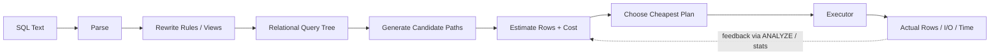
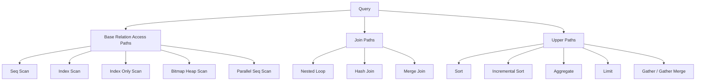
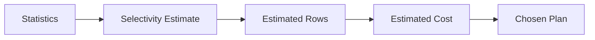
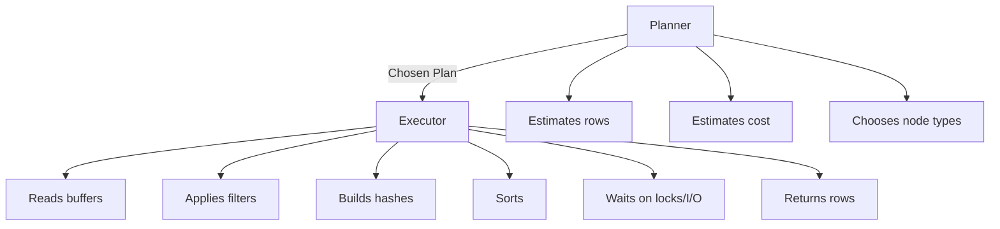
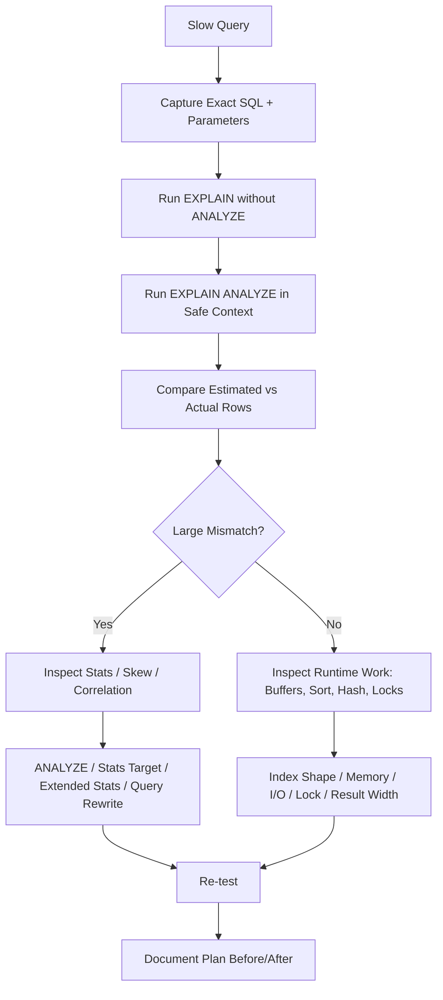

------
title: Learn PostgreSQL in Action - Part 011
description: Query planner mental model for Java engineers: cost model, cardinality, statistics, selectivity, correlation, extended statistics, and plan instability.
series: learn-postgresql-in-action
seriesTitle: Learn PostgreSQL in Action
order: 11
partTitle: Query Planner Mental Model: Cost, Cardinality, Statistics
tags:
- postgresql
- query-planner
- statistics
- performance
- java
- series
date: 2026-07-01
---

# Part 011 — Query Planner Mental Model: Cost, Cardinality, Statistics

PostgreSQL is a cost-based database engine. It does not execute a query by reading the SQL text from left to right and mechanically applying clauses. It transforms the SQL into an internal representation, enumerates possible execution strategies, estimates their cost from metadata and statistics, then chooses the cheapest acceptable plan.

For a Java engineer, this matters because most production query incidents are not caused by PostgreSQL "being slow". They are caused by a mismatch between:

1. the query shape emitted by application code or ORM;
2. the real distribution of data;
3. the statistics PostgreSQL currently has;
4. the indexes available;
5. the memory, I/O, and concurrency conditions at runtime;
6. the plan chosen under those assumptions.

The planner is not magic. It is a model. Like every model, it can be useful, wrong, stale, or under-informed.

This part builds the planner mental model before we read plans deeply in Part 012.

---

## 1. Kaufman Skill Target

The goal is not to memorize every planner node. That comes later. The first target is to develop the ability to predict why PostgreSQL might choose one plan over another.

After this part, you should be able to answer:

- Why did PostgreSQL prefer a sequential scan even though an index exists?
- Why did a query suddenly become slow after data grew?
- Why did the same prepared query behave differently for different tenants?
- Why did adding an index not change the plan?
- Why did PostgreSQL underestimate or overestimate rows?
- Why do correlated columns break otherwise reasonable plans?
- Why does `ANALYZE` matter even if the schema has not changed?
- Why can Java/Hibernate parameterization hide important value-specific selectivity?

The Kaufman-style decomposition for this skill is:

```mermaid
flowchart TD
    A[Query Planner Skill] --> B[Understand Relational Algebra Shape]
    A --> C[Understand Cost Model]
    A --> D[Understand Cardinality Estimation]
    A --> E[Understand Statistics]
    A --> F[Understand Index Selectivity]
    A --> G[Understand Plan Instability]
    A --> H[Understand Java/ORM Influence]

    C --> C1[Startup Cost]
    C --> C2[Total Cost]
    C --> C3[CPU vs I/O]
    C --> C4[Random vs Sequential Page Cost]

    D --> D1[Rows]
    D --> D2[Width]
    D --> D3[Selectivity]
    D --> D4[Join Cardinality]

    E --> E1[pg_class]
    E --> E2[pg_stats]
    E --> E3[Histograms]
    E --> E4[MCV Lists]
    E --> E5[Correlation]
    E --> E6[Extended Statistics]

    H --> H1[Prepared Statements]
    H --> H2[Generic vs Custom Plans]
    H --> H3[Hibernate Query Shape]
    H --> H4[Parameter Skew]
```



The minimum effective capability is not "tune everything". It is this:

> Given a slow query, identify whether the planner made a reasonable decision from bad facts, a bad decision from stale statistics, or a good decision for a bad query shape.

---

## 2. Core Mental Model

PostgreSQL planning is a loop of estimation.



The planner does not know the future. It estimates.

A plan choice is therefore a bet:

```txt
Given what PostgreSQL believes about the table, indexes, filters, joins, and cost parameters,
which execution strategy is expected to finish cheapest?
```

A production engineer’s job is to understand three layers:

| Layer | Question | Typical Evidence |
|---|---|---|
| Query shape | What work did we ask PostgreSQL to do? | SQL, predicates, joins, ordering, limit, ORM-generated SQL |
| Planner belief | What did PostgreSQL think would happen? | `EXPLAIN`, estimated rows, cost, selected nodes |
| Runtime reality | What actually happened? | `EXPLAIN ANALYZE`, buffers, timings, loops, wait events |

Most performance debugging becomes simple once you separate those layers.

---

## 3. The Planner Does Not Optimize Text; It Optimizes Paths

SQL is declarative. You describe the result, not the algorithm.

This query:

```sql
SELECT c.id, c.email, o.id, o.total_amount
FROM app_customer c
JOIN app_order o ON o.customer_id = c.id
WHERE c.status = 'ACTIVE'
  AND o.status = 'PAID'
ORDER BY o.created_at DESC
LIMIT 50;
```

could be executed many ways:

1. scan active customers, then find paid orders for each customer;
2. scan recent paid orders, then lookup customer by id;
3. use an index on `orders(status, created_at)`;
4. use a bitmap scan on `orders(status)` then sort;
5. use a nested loop, hash join, or merge join;
6. parallelize part of the scan;
7. stop early because of `LIMIT`;
8. sort fully despite the limit if no path preserves order.

The SQL text has one shape, but the planner has many candidate paths.

A simplified path enumeration looks like this:



The planner does not simply ask, "Is there an index?" It asks, "Which path has the lowest estimated cost?"

That distinction is the beginning of senior-level PostgreSQL performance work.

---

## 4. Cost Is Not Time

PostgreSQL cost units are arbitrary planner units. They are often described in relation to disk page fetches, but they are not milliseconds.

Example:

```txt
Seq Scan on app_order  (cost=0.00..18421.00 rows=150000 width=64)
```

This means:

| Field | Meaning |
|---|---|
| `0.00` | startup cost before first row can be produced |
| `18421.00` | estimated total cost if node runs to completion |
| `rows=150000` | estimated number of rows output by this node |
| `width=64` | estimated average output row width in bytes |

Cost is used for comparison among candidate paths, not as an SLA prediction.

Bad interpretation:

```txt
The cost is 18421, so it will take 18 seconds.
```

Better interpretation:

```txt
The planner believes this path is cheaper than the alternatives under current statistics and cost settings.
```

### Startup Cost vs Total Cost

Startup cost matters when the executor may stop early.

Examples:

- `LIMIT 1`;
- `EXISTS` subquery;
- nested loop inner lookup;
- cursor/fetch patterns;
- top-N queries.

A plan with low startup cost can win even if total cost is higher.

```sql
SELECT *
FROM app_order
WHERE status = 'PAID'
ORDER BY created_at DESC
LIMIT 1;
```

An index scan on `(status, created_at DESC)` might be preferred because it can return the first row quickly. A full scan plus sort might have a lower cost under some full-result scenario, but it has bad startup behavior for `LIMIT 1`.

### Total Cost

Total cost matters when the query likely consumes the entire result.

Examples:

- reporting query returning many rows;
- aggregation over a large date range;
- export job;
- batch reconciliation;
- analytics-style scan.

A sequential scan can beat an index scan when a large fraction of the table must be read. Index access is not free: it involves index traversal plus heap access unless the query can use an index-only scan.

---

## 5. Important Cost Parameters

PostgreSQL uses planner cost constants. You should understand them conceptually before tuning them.

Common parameters:

| Parameter | Meaning |
|---|---|
| `seq_page_cost` | Estimated cost of sequentially reading a disk page. Default baseline is traditionally `1.0`. |
| `random_page_cost` | Estimated cost of randomly reading a disk page. Historically higher than sequential access. |
| `cpu_tuple_cost` | Estimated CPU cost to process a row. |
| `cpu_index_tuple_cost` | Estimated CPU cost to process an index entry. |
| `cpu_operator_cost` | Estimated CPU cost to execute an operator/function. |
| `parallel_setup_cost` | Cost to start parallel workers. |
| `parallel_tuple_cost` | Cost to pass tuples from workers to leader. |
| `effective_cache_size` | Planner assumption about how much data may be cached by PostgreSQL and OS. |

Inspect current values:

```sql
SHOW seq_page_cost;
SHOW random_page_cost;
SHOW cpu_tuple_cost;
SHOW cpu_index_tuple_cost;
SHOW cpu_operator_cost;
SHOW effective_cache_size;
SHOW work_mem;
SHOW max_parallel_workers_per_gather;
```

Important: `effective_cache_size` does not allocate memory. It tells the planner how much cache is likely available. Underestimating it can discourage index usage; overestimating it can make index-heavy plans look too cheap.

### Do Not Start by Changing Cost Parameters

A common weak move is to force PostgreSQL to choose indexes by lowering `random_page_cost` or disabling sequential scans.

This is rarely the first fix.

Before tuning cost parameters, check:

1. Is the SQL shape correct?
2. Are table and column statistics current?
3. Are estimated rows close to actual rows?
4. Is the index aligned with predicate + join + ordering?
5. Is the data distribution skewed?
6. Is the table bloated?
7. Is the query parameterized in a way that hides value selectivity?

Cost parameter tuning is a system-level calibration problem. Query-level incidents usually need query/index/statistics fixes.

---

## 6. Cardinality Estimation Is the Center of the Planner

The planner’s most important prediction is not cost. It is row count.

Cost is derived from estimated work. Estimated work comes largely from estimated rows.



If row estimation is wrong, the chosen plan can be wrong.

Example:

```txt
Estimated rows: 20
Actual rows:    2,000,000
```

That error can cause:

- nested loop chosen when hash join was needed;
- tiny memory expectation but huge sort spill;
- index scan chosen despite scanning much of the table;
- bad join order;
- terrible latency under concurrency.

### Selectivity

Selectivity means "what fraction of rows survive a predicate?"

```sql
WHERE status = 'PAID'
```

If 5% of orders are `PAID`, selectivity is `0.05`.

```sql
WHERE created_at >= now() - interval '7 days'
```

If recent rows are 2% of the table, selectivity is `0.02`.

For multiple predicates, the planner often combines selectivity assumptions. If it assumes independence, then:

```txt
selectivity(A AND B) ≈ selectivity(A) * selectivity(B)
```

This is where correlated columns become dangerous.

---

## 7. The Independence Assumption

Suppose `country_code` and `currency` are correlated:

```txt
US -> USD
JP -> JPY
ID -> IDR
```

Query:

```sql
SELECT *
FROM app_invoice
WHERE country_code = 'ID'
  AND currency = 'IDR';
```

If 8% of rows have `country_code = 'ID'` and 8% have `currency = 'IDR'`, a naive independent estimate is:

```txt
0.08 * 0.08 = 0.0064 = 0.64%
```

But the actual result may be 8%, because almost every Indonesian invoice uses IDR.

The planner may underestimate by more than 12x.

This can influence:

- index vs sequential scan;
- nested loop vs hash join;
- join order;
- memory sizing for hash/sort;
- parallel plan decisions.

### Strong Rule

When a query filters on multiple correlated columns, inspect extended statistics before blaming the planner.

---

## 8. Where Statistics Live

PostgreSQL stores planner statistics in system catalogs and exposes readable views.

Important objects:

| Object | Purpose |
|---|---|
| `pg_class` | row estimates and relation page estimates via `reltuples`, `relpages` |
| `pg_stats` | readable single-column statistics |
| `pg_statistic` | underlying catalog for statistics |
| `pg_statistic_ext` | extended statistics definitions |
| `pg_statistic_ext_data` | collected extended statistics data |

Inspect table-level estimates:

```sql
SELECT
    n.nspname AS schema_name,
    c.relname AS table_name,
    c.reltuples::bigint AS estimated_rows,
    c.relpages AS estimated_pages
FROM pg_class c
JOIN pg_namespace n ON n.oid = c.relnamespace
WHERE n.nspname = 'public'
  AND c.relname IN ('app_order', 'app_customer')
ORDER BY c.relname;
```

Inspect single-column stats:

```sql
SELECT
    schemaname,
    tablename,
    attname,
    null_frac,
    n_distinct,
    avg_width,
    most_common_vals,
    most_common_freqs,
    histogram_bounds,
    correlation
FROM pg_stats
WHERE schemaname = 'public'
  AND tablename = 'app_order'
ORDER BY attname;
```

`pg_stats` is intentionally easier to read than `pg_statistic`.

---

## 9. Key Fields in `pg_stats`

### `null_frac`

Fraction of rows where the column is null.

High `null_frac` matters for queries like:

```sql
WHERE completed_at IS NULL
```

If most rows have `completed_at IS NOT NULL`, a partial index can be powerful:

```sql
CREATE INDEX CONCURRENTLY idx_order_open
ON app_order (created_at DESC)
WHERE completed_at IS NULL;
```

### `n_distinct`

Estimated number of distinct values.

Interpretation:

| Value | Meaning |
|---|---|
| positive | estimated fixed number of distinct values |
| negative | fraction of table rows that are distinct |
| `-1` | likely unique as table grows |

Example:

```txt
n_distinct = 5
```

A low-cardinality status column.

```txt
n_distinct = -0.8
```

Distinct values scale with table size; around 80% of rows have unique values.

### `most_common_vals` and `most_common_freqs`

Most common values are critical for skew.

Suppose:

```txt
status: ACTIVE 0.92, SUSPENDED 0.05, CLOSED 0.03
```

An index on `status` may be useful for `SUSPENDED`, but not for `ACTIVE`.

Same column. Same index. Different literal. Different selectivity.

This matters heavily for prepared statements and Java services.

### `histogram_bounds`

Histograms approximate distribution for values not captured by most-common-values.

Useful for ranges:

```sql
WHERE created_at >= timestamp '2026-06-01'
```

Histograms can become misleading when data is append-heavy and statistics are stale.

Typical symptom:

```txt
recent time-range query estimated 100 rows, actual 2,000,000 rows
```

### `correlation`

Correlation describes relationship between physical row order and logical column order.

A high positive or negative correlation means an index scan may be cheaper because heap fetches are more sequential.

Common case:

- table inserted in increasing `created_at` order;
- index on `created_at`;
- high physical/logical correlation.

After heavy updates, random inserts, or table rewrites, correlation can change.

---

## 10. `ANALYZE`: Refreshing Planner Facts

`ANALYZE` collects statistics about table contents. Autovacuum can run auto-analyze, but production systems often need explicit understanding of when stats become stale.

Manual command:

```sql
ANALYZE app_order;
```

Verbose:

```sql
ANALYZE VERBOSE app_order;
```

Column-specific stats target:

```sql
ALTER TABLE app_order
ALTER COLUMN status SET STATISTICS 1000;

ANALYZE app_order;
```

Table-level default target:

```sql
ALTER TABLE app_order SET (autovacuum_analyze_scale_factor = 0.02);
ALTER TABLE app_order SET (autovacuum_analyze_threshold = 10000);
```

### When to Suspect Stale Stats

- large bulk load happened;
- large backfill happened;
- status distribution changed after a campaign/migration;
- newly created table has no representative stats;
- partition received a new time range;
- tenant distribution changed;
- query was fast before data lifecycle changed;
- `EXPLAIN ANALYZE` shows large estimated-vs-actual row mismatch.

### Dangerous Misconception

`ANALYZE` does not make queries faster directly.

It updates the facts the planner uses. Queries become faster only if better facts cause better plans.

---

## 11. Statistics Target

Statistics are sample-based. Higher statistics target means PostgreSQL samples more rows and can keep more detailed statistics.

Default target is usually enough for ordinary columns, but not always for:

- skewed tenant IDs;
- status columns with operational hotspots;
- range query columns used for recent data;
- correlated columns;
- columns driving critical joins;
- columns used in partial index predicates;
- JSONB-generated columns used as filters.

Inspect current stats target:

```sql
SELECT
    n.nspname,
    c.relname,
    a.attname,
    a.attstattarget
FROM pg_attribute a
JOIN pg_class c ON c.oid = a.attrelid
JOIN pg_namespace n ON n.oid = c.relnamespace
WHERE n.nspname = 'public'
  AND c.relname = 'app_order'
  AND a.attnum > 0
ORDER BY a.attname;
```

Set specific target:

```sql
ALTER TABLE app_order
ALTER COLUMN tenant_id SET STATISTICS 1000;

ALTER TABLE app_order
ALTER COLUMN status SET STATISTICS 500;

ANALYZE app_order;
```

Avoid setting every column to a huge target. It increases analyze cost and planning overhead.

Use it surgically.

---

## 12. Extended Statistics

Single-column stats cannot understand multi-column relationships well. PostgreSQL supports extended statistics for selected column groups.

Types include:

| Type | Helps With |
|---|---|
| `dependencies` | correlated predicates where one column functionally implies another |
| `ndistinct` | estimating distinct combinations for grouping/joins |
| `mcv` | most common combinations across columns |

### Example: Tenant + Status Skew

In SaaS systems, a query often filters by both tenant and state:

```sql
SELECT *
FROM case_file
WHERE tenant_id = 'tenant_42'
  AND lifecycle_state = 'PENDING_REVIEW';
```

Some tenants may have many pending cases; others almost none.

Single-column stats might know:

```txt
tenant_42 = 3% of table
PENDING_REVIEW = 4% of table
```

Independent estimate:

```txt
0.03 * 0.04 = 0.0012 = 0.12%
```

Actual for tenant_42 may be 2% of table.

Create extended stats:

```sql
CREATE STATISTICS st_case_file_tenant_state_mcv (mcv)
ON tenant_id, lifecycle_state
FROM case_file;

ANALYZE case_file;
```

Inspect:

```sql
SELECT
    se.stxname,
    se.stxkeys,
    sed.stxdmcv
FROM pg_statistic_ext se
JOIN pg_statistic_ext_data sed ON sed.stxoid = se.oid
WHERE se.stxname = 'st_case_file_tenant_state_mcv';
```

### Example: Functional Dependency

If `country_code` strongly determines `currency`:

```sql
CREATE STATISTICS st_invoice_country_currency_dep (dependencies)
ON country_code, currency
FROM app_invoice;

ANALYZE app_invoice;
```

This tells PostgreSQL that these columns are not independent.

### Example: Grouping Cardinality

```sql
SELECT tenant_id, lifecycle_state, count(*)
FROM case_file
GROUP BY tenant_id, lifecycle_state;
```

If the number of distinct combinations is badly estimated:

```sql
CREATE STATISTICS st_case_file_tenant_state_nd (ndistinct)
ON tenant_id, lifecycle_state
FROM case_file;

ANALYZE case_file;
```

### Extended Statistics Are Not Automatic

PostgreSQL cannot create all possible multi-column statistics automatically because the combinations are too many. You create statistics where the workload proves they are needed.

Rule:

> Create extended statistics for stable, high-value workload patterns where row estimates are repeatedly wrong because columns are correlated.

---

## 13. Why Sequential Scan Can Be Correct

Beginners often think:

```txt
Index exists, so PostgreSQL should use it.
```

That is wrong.

A sequential scan can be correct when:

- the query reads a large fraction of the table;
- the table is small;
- the index is not selective;
- the predicate does not match the index operator/expression;
- the query must fetch many heap pages anyway;
- statistics indicate many rows match;
- correlation makes sequential access cheaper;
- the index cannot help with ordering or filtering enough;
- the query asks for wide rows and index-only scan is impossible.

Example:

```sql
SELECT *
FROM app_order
WHERE status = 'ACTIVE';
```

If 95% of rows are active, using an index on `status` may be worse than scanning the table once.

Better solution may be not "force index", but design a partial index for the rare operational state:

```sql
CREATE INDEX CONCURRENTLY idx_order_pending_review
ON app_order (created_at DESC)
WHERE status = 'PENDING_REVIEW';
```

---

## 14. Why Index Scan Can Be Wrong

An index scan can be chosen because PostgreSQL expects few rows, but reality returns many rows.

Symptom:

```txt
Index Scan using idx_order_status on app_order
  (cost=0.43..120.00 rows=100 width=128)
  (actual time=0.030..8420.000 rows=3500000 loops=1)
```

Root causes:

- stale stats;
- skew hidden by prepared statement;
- correlated predicates;
- low statistics target;
- changed data lifecycle;
- partial index predicate misunderstood;
- table bloat or poor correlation;
- generic plan selected for parameterized query.

The fix depends on evidence. It may be:

- `ANALYZE`;
- higher statistics target;
- extended statistics;
- better composite/partial index;
- query rewrite;
- app-level split by state;
- avoiding generic plan for skew-sensitive query;
- archiving/partitioning old data.

---

## 15. Width Estimation Matters

Planner output includes `width`.

Width estimates affect:

- sort cost;
- hash table size;
- join strategy;
- memory pressure;
- network serialization not fully modeled by planner;
- index-only scan feasibility;
- TOAST fetch behavior.

Example:

```sql
SELECT *
FROM audit_event
WHERE entity_id = $1
ORDER BY created_at DESC
LIMIT 100;
```

If `audit_event` has a large JSONB payload, `SELECT *` can turn an otherwise small lookup into a heavy heap/TOAST workload.

Better shape:

```sql
SELECT id, entity_id, event_type, created_at
FROM audit_event
WHERE entity_id = $1
ORDER BY created_at DESC
LIMIT 100;
```

Then fetch payload only when needed:

```sql
SELECT payload
FROM audit_event
WHERE id = $1;
```

This is not premature optimization. It is controlling physical work.

---

## 16. Predicate Shape and Sargability

A predicate is planner-friendly when PostgreSQL can use available statistics and indexes to estimate and access rows efficiently.

Good:

```sql
WHERE created_at >= $1
  AND created_at < $2
```

Bad:

```sql
WHERE date(created_at) = $1
```

The second form applies a function to the column. A normal index on `created_at` cannot be used as a simple range condition.

Better:

```sql
WHERE created_at >= $1::date
  AND created_at < ($1::date + interval '1 day')
```

Or create an expression index if the expression is truly the contract:

```sql
CREATE INDEX CONCURRENTLY idx_order_created_date
ON app_order ((created_at::date));
```

But prefer range predicates for timestamp columns in production APIs.

### Common Non-Sargable Patterns

| Pattern | Risk | Better Direction |
|---|---|---|
| `lower(email) = lower($1)` | normal index not usable | expression index on `lower(email)` or normalized column |
| `date(created_at) = $1` | range index not usable | half-open range |
| `coalesce(status, 'X') = $1` | expression hides column stats | explicit null predicate or expression index |
| `CAST(id AS text) = $1` | type mismatch | bind correct Java type |
| `LIKE '%abc'` | leading wildcard | trigram/full-text strategy |
| `jsonb_col ->> 'x' = $1` | no plain JSONB magic | generated column or expression index |

---

## 17. Java Parameter Binding and Type Inference

Java applications influence plans through parameter types.

Bad example:

```java
preparedStatement.setString(1, orderId.toString());
```

SQL:

```sql
WHERE id = ?
```

If `id` is UUID and the parameter arrives as unknown/text in a way that forces casting on the column side, plan quality can suffer.

Better:

```java
preparedStatement.setObject(1, orderId); // UUID
```

or explicit SQL cast:

```sql
WHERE id = ?::uuid
```

### Timestamp Boundaries

Bad API boundary:

```java
LocalDateTime start = ...; // unclear timezone contract
```

Better:

```java
OffsetDateTime start = ...;
OffsetDateTime end = ...;
```

SQL:

```sql
WHERE created_at >= ?
  AND created_at < ?
```

The planner needs stable predicate shape and correct types. The application needs stable semantics.

---

## 18. Prepared Statements: Custom vs Generic Plans

PostgreSQL can plan prepared statements using parameter-specific values or a generic plan.

For stable distributions, generic plans can be fine.

For skewed distributions, generic plans can be dangerous.

Example:

```sql
SELECT *
FROM app_order
WHERE tenant_id = $1
  AND status = $2
ORDER BY created_at DESC
LIMIT 100;
```

Tenant A may have 10 rows. Tenant B may have 10 million rows.

A generic plan may be mediocre for both and terrible for one.

Senior-level debugging requires asking:

- Is this query prepared?
- Is the driver using server-side prepare?
- Are parameters highly skewed?
- Does the observed plan depend on specific parameter values?
- Does `EXPLAIN` with literal values differ from the prepared execution path?

Diagnostic pattern:

```sql
PREPARE q(uuid, text) AS
SELECT *
FROM app_order
WHERE tenant_id = $1
  AND status = $2
ORDER BY created_at DESC
LIMIT 100;

EXPLAIN EXECUTE q('00000000-0000-0000-0000-000000000001', 'PAID');
EXPLAIN EXECUTE q('00000000-0000-0000-0000-000000000999', 'PAID');
```

If plans should differ but do not, investigate generic plan behavior, driver settings, and query/index strategy.

Do not blindly disable prepared statements. They also protect against SQL injection and reduce parsing/planning overhead. Treat this as a targeted performance topic.

---

## 19. Join Cardinality

Join planning depends heavily on estimated rows from each side and join selectivity.

Example:

```sql
SELECT o.id, p.status
FROM app_order o
JOIN payment p ON p.order_id = o.id
WHERE o.created_at >= now() - interval '1 day'
  AND p.status = 'FAILED';
```

Planner needs to estimate:

1. rows in `app_order` for the last day;
2. rows in `payment` with status failed;
3. how many matching rows after join;
4. which side should be outer/inner;
5. whether hash, nested loop, or merge join is cheapest.

If it underestimates recent orders, it may choose nested loop and perform millions of payment lookups.

If it overestimates, it may build a large hash table unnecessarily.

### The Join Strategy Is a Consequence

Do not start by arguing "nested loop is bad".

Ask:

```txt
What row estimates caused nested loop to look cheap?
```

Plan nodes are symptoms. Cardinality estimates are often the disease.

---

## 20. Query Planning With `ORDER BY` and `LIMIT`

`ORDER BY ... LIMIT` changes planning economics.

Example:

```sql
SELECT id, status, created_at
FROM app_order
WHERE tenant_id = $1
ORDER BY created_at DESC
LIMIT 50;
```

Ideal index:

```sql
CREATE INDEX CONCURRENTLY idx_order_tenant_created_desc
ON app_order (tenant_id, created_at DESC);
```

This index helps both filtering and ordering.

Without it, PostgreSQL may:

- filter then sort;
- scan an index on `created_at` and filter tenant rows;
- use bitmap scan then top-N sort;
- choose different plans for small vs large tenants.

The planner considers not only row count but whether path order satisfies `ORDER BY`.

### Key Insight

For user-facing lists, the index often needs to match:

```txt
WHERE equality prefix + ORDER BY suffix
```

Example:

```txt
tenant_id = ? AND lifecycle_state = ? ORDER BY created_at DESC LIMIT 50
```

Index:

```sql
CREATE INDEX CONCURRENTLY idx_case_worklist
ON case_file (tenant_id, lifecycle_state, created_at DESC);
```

This is not an index "on every column". It is an access path for a specific product workflow.

---

## 21. `LIMIT` Can Hide Bad Total Work

A query returning 50 rows can still scan millions of rows.

```sql
SELECT *
FROM audit_event
WHERE event_type = 'CASE_UPDATED'
ORDER BY created_at DESC
LIMIT 50;
```

If the index is only on `created_at DESC`, PostgreSQL may scan recent events and filter until it finds 50 matching rows. If `CASE_UPDATED` is rare, this could scan a lot.

Better:

```sql
CREATE INDEX CONCURRENTLY idx_audit_event_type_created
ON audit_event (event_type, created_at DESC);
```

Or partial index if only one event type is operationally critical:

```sql
CREATE INDEX CONCURRENTLY idx_audit_case_updated_recent
ON audit_event (created_at DESC)
WHERE event_type = 'CASE_UPDATED';
```

---

## 22. Planner vs Executor

The planner chooses. The executor does.



When debugging, do not mix them:

| Symptom | Planner Problem? | Executor/Runtime Problem? |
|---|---:|---:|
| estimate rows 10, actual rows 1M | yes | consequence |
| high buffer reads despite good estimates | maybe | yes |
| waiting on lock | no | yes |
| temp file spill | maybe | yes |
| wrong join order from bad stats | yes | consequence |
| slow client fetching huge result | no | yes |

The planner may have chosen correctly and runtime still be slow because of I/O, locks, CPU, memory pressure, or network transfer.

---

## 23. Plan Instability

A plan is unstable when small changes cause large execution differences.

Triggers:

- data grows past a threshold;
- stats refresh changes estimates;
- one tenant becomes huge;
- query parameter changes from common to rare value;
- partition pruning changes with date range;
- generic plan replaces custom plan;
- `work_mem` changes;
- index added/dropped;
- table bloat changes page estimates;
- vacuum/analyze timing differs by environment.

### Example: Tenant Skew

```txt
tenant_small: 500 rows
tenant_large: 80,000,000 rows
```

Same query:

```sql
SELECT *
FROM case_file
WHERE tenant_id = $1
  AND lifecycle_state = 'OPEN'
ORDER BY updated_at DESC
LIMIT 100;
```

A plan that is perfect for `tenant_small` can be awful for `tenant_large`.

Options:

- composite index aligned with tenant worklist;
- partitioning by tenant only if operationally justified;
- separate hot tenant architecture;
- custom planning for skew-sensitive queries;
- materialized worklist table;
- partial index for active states;
- API-level query constraints.

The best fix is workload-specific. There is no universal knob.

---

## 24. Planner Debugging Workflow

Use this workflow before touching indexes or settings.



### Step 1: Capture Real SQL

Do not tune pseudo-SQL. Capture the exact SQL and bind values.

In Java/Hibernate, this means:

- enable SQL logging carefully in lower environments;
- capture slow queries from `pg_stat_statements`;
- log query identifiers, not full sensitive values, in production;
- reproduce with representative parameters;
- avoid tuning a query using a different tenant/date/status than production.

### Step 2: Compare Estimates

From `EXPLAIN ANALYZE`, compare every important node:

```txt
estimated rows vs actual rows
```

A 2x mismatch is usually not alarming. A 10x mismatch matters. A 1000x mismatch is the root investigation.

### Step 3: Identify the First Bad Estimate

Plans are trees. A bad estimate near the bottom infects upper nodes.

Do not only inspect the top node. Find the earliest node where reality diverged.

---

## 25. Diagnosing Estimate Mismatch

| Symptom | Likely Cause | Investigation |
|---|---|---|
| equality predicate badly estimated | skew, stale MCV | inspect `pg_stats.most_common_vals` |
| range predicate badly estimated | stale histogram, append-heavy table | inspect `histogram_bounds`, run `ANALYZE` |
| multi-column filter underestimated | independence assumption | create extended stats |
| join result badly estimated | FK distribution, missing stats, correlation | inspect both sides and join key stats |
| partition query scans too much | pruning failure | inspect partition constraint and predicate type |
| generic prepared plan bad for skewed values | parameter skew | compare prepared vs literal plans |
| row width underestimated | TOAST/wide columns | inspect projection and `avg_width` |

---

## 26. Statistics and Partitioning

Partitioned tables add a layer of complexity.

A query on a partitioned table may rely on:

- parent-level stats;
- child partition stats;
- partition pruning;
- per-partition data distribution;
- date range predicates;
- default partition behavior.

Example:

```sql
SELECT count(*)
FROM audit_event
WHERE created_at >= timestamp '2026-07-01'
  AND created_at < timestamp '2026-08-01';
```

If partitioned monthly by `created_at`, PostgreSQL should prune irrelevant partitions if the predicate is compatible with partition bounds.

Bad shape:

```sql
WHERE date(created_at) = date '2026-07-01'
```

This may prevent clean pruning and index use.

Partitioning is not a substitute for good query shape.

---

## 27. Statistics and Partial Indexes

Partial indexes are powerful but require predicate alignment.

Index:

```sql
CREATE INDEX CONCURRENTLY idx_case_open_worklist
ON case_file (tenant_id, updated_at DESC)
WHERE lifecycle_state IN ('OPEN', 'PENDING_REVIEW');
```

Query should imply the predicate:

```sql
SELECT id, updated_at
FROM case_file
WHERE tenant_id = $1
  AND lifecycle_state IN ('OPEN', 'PENDING_REVIEW')
ORDER BY updated_at DESC
LIMIT 100;
```

If application query uses a logically equivalent but planner-unfriendly predicate, the index may not be used.

Bad:

```sql
WHERE tenant_id = $1
  AND NOT lifecycle_state IN ('CLOSED', 'CANCELLED')
```

Humans may see equivalence; planner may not.

Contract principle:

> For partial indexes, application predicates should use the same explicit business vocabulary as the index predicate.

---

## 28. Cardinality and Data Lifecycle

Data distribution changes with lifecycle.

Examples:

- most orders are historical, few are active;
- most cases are closed, open cases are operationally hot;
- audit logs are append-only;
- invoices cluster by billing cycle;
- failed payments spike during payment provider incidents;
- one enterprise tenant dominates data volume.

A good schema captures lifecycle:

```sql
CREATE INDEX CONCURRENTLY idx_case_open_by_assignee
ON case_file (assignee_id, priority DESC, updated_at DESC)
WHERE lifecycle_state IN ('OPEN', 'PENDING_REVIEW');
```

This index says:

```txt
The product frequently asks for active work assigned to a user.
Closed cases are historical and should not dominate the access path.
```

Indexes are not just performance artifacts. They encode workload semantics.

---

## 29. Lab: Build a Skewed Dataset

Use this in your Part 002 lab database.

```sql
DROP TABLE IF EXISTS planner_order;

CREATE TABLE planner_order (
    id bigserial PRIMARY KEY,
    tenant_id int NOT NULL,
    status text NOT NULL,
    created_at timestamptz NOT NULL DEFAULT now(),
    amount numeric(12,2) NOT NULL,
    payload jsonb NOT NULL DEFAULT '{}'::jsonb
);

INSERT INTO planner_order (tenant_id, status, created_at, amount, payload)
SELECT
    CASE
        WHEN gs <= 700000 THEN 1
        WHEN gs <= 850000 THEN 2
        ELSE 3 + (random() * 1000)::int
    END AS tenant_id,
    CASE
        WHEN gs <= 700000 THEN
            CASE WHEN random() < 0.95 THEN 'PAID' ELSE 'FAILED' END
        ELSE
            CASE WHEN random() < 0.20 THEN 'PAID' ELSE 'PENDING' END
    END AS status,
    now() - (random() * interval '180 days') AS created_at,
    (random() * 1000)::numeric(12,2),
    jsonb_build_object('source', 'lab', 'seq', gs)
FROM generate_series(1, 1000000) AS gs;

CREATE INDEX idx_planner_order_tenant_status_created
ON planner_order (tenant_id, status, created_at DESC);

ANALYZE planner_order;
```

Inspect stats:

```sql
SELECT
    attname,
    null_frac,
    n_distinct,
    most_common_vals,
    most_common_freqs,
    correlation
FROM pg_stats
WHERE tablename = 'planner_order'
  AND attname IN ('tenant_id', 'status', 'created_at');
```

Test skew:

```sql
EXPLAIN
SELECT id, tenant_id, status, created_at
FROM planner_order
WHERE tenant_id = 1
  AND status = 'PAID'
ORDER BY created_at DESC
LIMIT 100;

EXPLAIN
SELECT id, tenant_id, status, created_at
FROM planner_order
WHERE tenant_id = 999
  AND status = 'PAID'
ORDER BY created_at DESC
LIMIT 100;
```

Now create extended stats:

```sql
CREATE STATISTICS st_planner_order_tenant_status_mcv (mcv)
ON tenant_id, status
FROM planner_order;

ANALYZE planner_order;
```

Re-run `EXPLAIN` and compare estimates.

---

## 30. Lab: Stale Stats

Create a table where distribution changes after analysis.

```sql
DROP TABLE IF EXISTS planner_ticket;

CREATE TABLE planner_ticket (
    id bigserial PRIMARY KEY,
    state text NOT NULL,
    created_at timestamptz NOT NULL DEFAULT now()
);

INSERT INTO planner_ticket (state, created_at)
SELECT 'CLOSED', now() - interval '30 days'
FROM generate_series(1, 500000);

INSERT INTO planner_ticket (state, created_at)
SELECT 'OPEN', now()
FROM generate_series(1, 1000);

CREATE INDEX idx_planner_ticket_state_created
ON planner_ticket (state, created_at DESC);

ANALYZE planner_ticket;
```

Check plan:

```sql
EXPLAIN
SELECT *
FROM planner_ticket
WHERE state = 'OPEN'
ORDER BY created_at DESC
LIMIT 50;
```

Now change distribution:

```sql
INSERT INTO planner_ticket (state, created_at)
SELECT 'OPEN', now()
FROM generate_series(1, 300000);
```

Without analyze:

```sql
EXPLAIN
SELECT *
FROM planner_ticket
WHERE state = 'OPEN'
ORDER BY created_at DESC
LIMIT 50;
```

Then:

```sql
ANALYZE planner_ticket;

EXPLAIN
SELECT *
FROM planner_ticket
WHERE state = 'OPEN'
ORDER BY created_at DESC
LIMIT 50;
```

Observe whether row estimates changed.

The lesson is not that `ANALYZE` fixes everything. The lesson is that planner facts are time-sensitive.

---

## 31. Lab: Non-Sargable Timestamp Filter

```sql
CREATE INDEX idx_planner_order_created
ON planner_order (created_at);

ANALYZE planner_order;
```

Bad shape:

```sql
EXPLAIN
SELECT count(*)
FROM planner_order
WHERE date(created_at) = current_date;
```

Better shape:

```sql
EXPLAIN
SELECT count(*)
FROM planner_order
WHERE created_at >= current_date
  AND created_at < current_date + interval '1 day';
```

The second query gives the planner a direct range condition on the indexed column.

---

## 32. Java/Hibernate Failure Modes

### Failure Mode 1: `SELECT *` by Accident

Repository method:

```java
List<OrderEntity> findTop100ByTenantIdAndStatusOrderByCreatedAtDesc(UUID tenantId, String status);
```

If `OrderEntity` maps a wide table with JSONB payload, Hibernate may fetch far more data than the endpoint needs.

Better options:

- projection interface;
- DTO query;
- split list view and detail view;
- index aligned with list view columns;
- avoid eager associations.

### Failure Mode 2: N+1 Masks Planner Work

One query may look fine, but the endpoint emits 500 queries.

Planner work is repeated. Network round trips dominate. Index lookups amplify.

Use:

- `pg_stat_statements`;
- application tracing;
- SQL comments/query tags;
- Hibernate statistics in lower environments;
- batch fetching carefully.

### Failure Mode 3: Parameter Skew

A query is fast for test tenant but slow for enterprise tenant.

Do not tune using synthetic uniform data.

For production-like testing, seed data with:

- heavy tenant;
- tiny tenant;
- hot state;
- cold state;
- recent data;
- historical data;
- null-heavy columns;
- skewed enum/status values.

### Failure Mode 4: Wrong Java Type

Binding UUID, timestamp, numeric, enum, and JSON as strings can affect casting and plan quality.

Use correct JDBC types and explicit SQL casts when needed.

---

## 33. Decision Table: What to Change?

| Evidence | Do This | Avoid This |
|---|---|---|
| stale row estimates after data load | `ANALYZE` targeted table | adding random indexes |
| multi-column correlation mismatch | `CREATE STATISTICS` | global cost parameter hacks |
| low-cardinality common value scan | partial index for rare/hot state | forcing index for common state |
| query uses function on column | rewrite predicate or expression index | blaming PostgreSQL |
| `SELECT *` with wide rows | projection / covering index / split query | increasing pool size |
| tenant skew | test with heavy tenant; composite index; custom/generic plan review | tuning with average tenant only |
| estimate OK but slow I/O | inspect buffers, bloat, cache, storage | changing statistics target |
| lock wait | inspect blockers | index tuning first |

---

## 34. Self-Correction Checklist

Before concluding that PostgreSQL chose a "bad plan", answer these:

- Did I capture exact SQL and real bind parameters?
- Did I compare estimated rows to actual rows?
- Did I identify the first node where estimates diverge?
- Are statistics current after recent data changes?
- Is the problematic predicate selective?
- Is the problematic predicate sargable?
- Are filtered columns correlated?
- Would extended statistics help?
- Does the index match predicate + join + ordering?
- Is the query returning wide rows unnecessarily?
- Is a generic prepared plan hiding parameter-specific selectivity?
- Is the problem actually locks, I/O, memory, or network rather than planning?
- Did I test with both common and rare values?
- Did I document before/after evidence?

---

## 35. Production Playbook

When a critical query is slow:

1. Find it in `pg_stat_statements`.
2. Capture exact SQL shape and representative parameters.
3. Run `EXPLAIN (ANALYZE, BUFFERS, SETTINGS)` in a safe environment or transaction rollback wrapper.
4. Compare estimated vs actual rows.
5. Check `pg_stats` for involved columns.
6. Check if predicates are sargable.
7. Check correlation and skew.
8. Check if a composite/partial/expression index matches the workload.
9. Check if extended stats are needed.
10. Check if Java is emitting a wider or more repetitive query than intended.
11. Apply one change at a time.
12. Re-run the same plan with the same representative parameters.
13. Record evidence.

---

## 36. Key Takeaways

- PostgreSQL chooses plans by estimated cost, not by whether an index exists.
- Cost is not time; it is a planner comparison unit.
- Cardinality estimation is the center of query planning.
- Bad row estimates often explain bad join strategy, bad index choice, and bad memory behavior.
- `pg_stats` is one of the most important diagnostic views for performance engineering.
- `ANALYZE` refreshes planner facts; it does not directly optimize queries.
- Extended statistics are essential for correlated columns.
- Java prepared statements and ORM-generated SQL can influence planning behavior.
- Plan debugging starts with evidence, not index guesses.

---

## References

- PostgreSQL Documentation — Using `EXPLAIN`: https://www.postgresql.org/docs/current/using-explain.html
- PostgreSQL Documentation — `EXPLAIN`: https://www.postgresql.org/docs/current/sql-explain.html
- PostgreSQL Documentation — Statistics Used by the Planner: https://www.postgresql.org/docs/current/planner-stats.html
- PostgreSQL Documentation — `pg_stats`: https://www.postgresql.org/docs/current/view-pg-stats.html
- PostgreSQL Documentation — `ANALYZE`: https://www.postgresql.org/docs/current/sql-analyze.html
