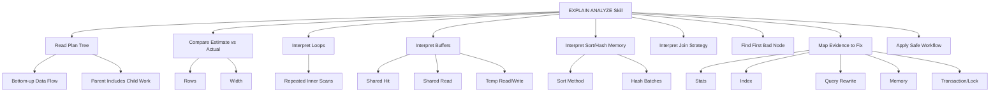
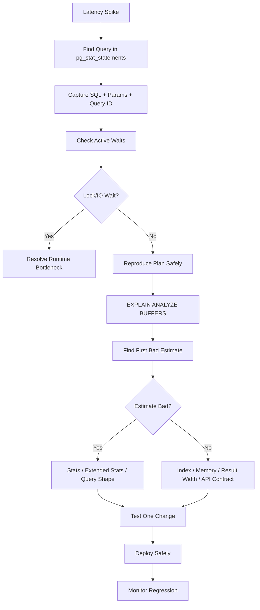

------
title: Learn PostgreSQL in Action - Part 012
description: Practical EXPLAIN ANALYZE diagnostics: reading plans, actual vs estimated rows, buffers, timing, loops, JIT, parallelism, and safe production workflow.
series: learn-postgresql-in-action
seriesTitle: Learn PostgreSQL in Action
order: 12
partTitle: EXPLAIN ANALYZE as a Diagnostic Skill
tags:
- postgresql
- explain-analyze
- diagnostics
- query-tuning
- performance
- java
- series
date: 2026-07-01
---

# Part 012 — EXPLAIN ANALYZE as a Diagnostic Skill

`EXPLAIN` is how PostgreSQL shows what it plans to do. `EXPLAIN ANALYZE` is how PostgreSQL shows what it actually did.

A top-tier engineer does not read `EXPLAIN ANALYZE` as a wall of text. They read it as an execution story:

1. Which rows were accessed first?
2. How many rows did PostgreSQL expect?
3. How many rows appeared in reality?
4. Which node multiplied work through loops?
5. Which node read buffers?
6. Which node sorted, hashed, spilled, or waited?
7. Which node is the first place where the model diverged from reality?
8. Is the bottleneck planning, indexing, memory, I/O, locking, or result shape?

This part turns `EXPLAIN ANALYZE` into a repeatable diagnostic skill.

---

## 1. Kaufman Skill Target

The minimum useful skill is not "understand every possible plan node". It is:

> Given a slow query plan, identify the first wrong assumption and the dominant physical work.

The sub-skills:



A good reading of `EXPLAIN ANALYZE` should produce a sentence like:

```txt
The query is slow because PostgreSQL estimated 300 rows after filtering tenant/state, but 2.4M rows matched; that caused a nested loop with 2.4M index probes. The root cause is correlated tenant/status distribution not represented in statistics. Add extended MCV stats and evaluate a partial composite index for the active worklist query.
```

Not:

```txt
Postgres is slow. Add an index.
```

---

## 2. Safe Use of `EXPLAIN ANALYZE`

`EXPLAIN` only plans.

```sql
EXPLAIN
SELECT * FROM app_order WHERE id = 1;
```

`EXPLAIN ANALYZE` executes the statement.

```sql
EXPLAIN ANALYZE
SELECT * FROM app_order WHERE id = 1;
```

For `SELECT`, the result is discarded but the query runs.

For write statements, side effects happen unless you protect them.

Safe pattern:

```sql
BEGIN;

EXPLAIN (ANALYZE, BUFFERS, SETTINGS)
UPDATE account
SET balance = balance - 100
WHERE id = 42;

ROLLBACK;
```

Use this pattern for:

- `INSERT`;
- `UPDATE`;
- `DELETE`;
- `MERGE`;
- `CREATE TABLE AS`;
- `EXECUTE` of mutating prepared statements.

Do not run destructive `EXPLAIN ANALYZE` casually in production. It performs real work, can acquire locks, can trigger writes, can dirty buffers, and can affect concurrency.

---

## 3. Recommended Diagnostic Form

For investigation, use:

```sql
EXPLAIN (ANALYZE, BUFFERS, VERBOSE, SETTINGS)
SELECT ...;
```

Common options:

| Option | Why It Matters |
|---|---|
| `ANALYZE` | executes and shows actual runtime/rows |
| `BUFFERS` | shows shared/local/temp block usage |
| `VERBOSE` | shows output columns, schema-qualified objects, more details |
| `SETTINGS` | shows non-default planning-related settings |
| `FORMAT JSON` | useful for tooling, diffing, and automated plan analysis |
| `WAL` | useful for write queries when analyzing WAL generation |
| `TIMING OFF` | can reduce instrumentation overhead when row counts/buffers matter more than per-node timing |

Human-readable:

```sql
EXPLAIN (ANALYZE, BUFFERS, SETTINGS)
SELECT ...;
```

Machine-readable:

```sql
EXPLAIN (ANALYZE, BUFFERS, SETTINGS, FORMAT JSON)
SELECT ...;
```

For repeatable plan review, save both:

- original SQL and parameters;
- plan text or JSON;
- schema/index definitions;
- relevant `pg_stats` rows;
- PostgreSQL version;
- planner settings;
- row counts;
- test data profile.

---

## 4. Anatomy of a Plan Node

Example:

```txt
Index Scan using idx_order_tenant_created on app_order o
  (cost=0.43..124.85 rows=50 width=72)
  (actual time=0.041..2.381 rows=50 loops=1)
  Index Cond: (tenant_id = '...'::uuid)
  Buffers: shared hit=172 read=4
```

Interpretation:

| Fragment | Meaning |
|---|---|
| `Index Scan` | node type |
| `idx_order_tenant_created` | index used |
| `app_order o` | relation and alias |
| `cost=0.43..124.85` | estimated startup and total cost |
| `rows=50` | estimated rows produced by this node |
| `width=72` | estimated average row width |
| `actual time=0.041..2.381` | actual startup and completion time per loop |
| `actual rows=50` | actual rows produced per loop |
| `loops=1` | number of times this node executed |
| `Index Cond` | condition applied using index access |
| `Buffers` | block access counts |

Key rule:

> Actual rows are reported per loop. Total output rows are roughly `actual rows * loops`.

This matters for nested loops.

---

## 5. Read Plans Bottom-Up

Execution flows from child nodes to parent nodes.

Example:

```txt
Limit
  ->  Sort
        Sort Key: created_at DESC
        ->  Seq Scan on app_order
              Filter: (status = 'PAID')
```

Data flow:

```txt
Seq Scan -> Sort -> Limit
```

Not:

```txt
Limit -> Sort -> Seq Scan
```

The top node reports final result behavior. The bottom nodes reveal where data came from.

### Parent Cost Includes Child Cost

If the top node has high time, inspect children. Parent timing includes time spent consuming child nodes.

Do not blame the top node just because it has the largest total time.

---

## 6. The First Bad Estimate

A plan is a tree of assumptions.

The most important diagnostic move is finding the first node where estimated rows diverge from actual rows.

Example:

```txt
Nested Loop  (cost=1.00..500.00 rows=100)
             (actual time=0.10..9000.00 rows=2400000 loops=1)
  -> Index Scan on case_file
       (cost=0.50..20.00 rows=100)
       (actual time=0.05..1200.00 rows=2400000 loops=1)
  -> Index Scan on case_note
       (cost=0.50..4.00 rows=1)
       (actual time=0.002..0.003 rows=1 loops=2400000)
```

The first bad node is the scan on `case_file`:

```txt
estimated 100, actual 2.4M
```

The nested loop is not the root cause. It is the consequence.

Fixing join type without fixing cardinality is usually temporary.

---

## 7. Estimate Ratio

Use a simple ratio:

```txt
estimate_ratio = greatest(actual_rows, 1) / greatest(estimated_rows, 1)
```

Guideline:

| Ratio | Interpretation |
|---:|---|
| 1x–2x | normal |
| 2x–10x | inspect if query is important |
| 10x–100x | likely planning issue |
| 100x+ | strong root cause candidate |
| 1000x+ | severe model mismatch |

But context matters. A 10x error from 1 row to 10 rows is often harmless. A 10x error from 1M to 10M rows is serious.

---

## 8. `loops` Is a Multiplier

Nested loop plans often look harmless until you multiply by loops.

Example:

```txt
Index Scan using idx_payment_order_id on payment p
  (cost=0.42..3.21 rows=1 width=48)
  (actual time=0.003..0.004 rows=1 loops=1200000)
```

Per-loop time is tiny. Total work is not.

Approximate total node time:

```txt
0.004 ms * 1,200,000 = 4,800 ms
```

Buffer counts may also accumulate across loops.

Nested loops are excellent when the outer side is small and inner access is cheap. They are disastrous when the outer side was underestimated.

### Senior Diagnostic Phrase

```txt
The inner lookup is cheap per execution, but it is executed too many times because the outer relation was underestimated.
```

---

## 9. Buffers: What Did PostgreSQL Touch?

`BUFFERS` shows block-level access.

Common categories:

| Metric | Meaning |
|---|---|
| `shared hit` | block found in shared buffers/cache path; no physical read by PostgreSQL needed at that moment |
| `shared read` | block read into shared buffers |
| `shared dirtied` | block modified by query |
| `shared written` | dirty block written out by backend |
| `temp read` | temporary blocks read, often sort/hash spill |
| `temp written` | temporary blocks written, often sort/hash spill |
| `local hit/read` | temporary table/index local buffers |

Important: `shared hit` does not mean "free". A huge number of shared hits still means CPU, memory bandwidth, tuple visibility checks, and possible cache churn.

Example:

```txt
Buffers: shared hit=4000000 read=20000
```

This query touched millions of blocks. Even if many were cached, it is physically heavy.

### Buffers and Nested Loops

In nested loops, buffer counts can be repeated through inner scans. A high hit count under an inner index scan may mean the same index pages are touched repeatedly.

Do not interpret buffer counts without considering `loops`.

---

## 10. Timing Caveats

`actual time` is useful, but not perfect.

Timing includes execution instrumentation overhead. It can also be affected by:

- cache warmness;
- concurrent load;
- lock waits;
- I/O waits;
- CPU scheduling;
- JIT compilation;
- client/server environment;
- repeated execution warming pages.

For comparing plan quality, rows and buffers are often more stable than timings.

Use multiple runs in non-production when possible:

```sql
EXPLAIN (ANALYZE, BUFFERS, TIMING OFF)
SELECT ...;
```

`TIMING OFF` still gives actual rows and total execution time, but avoids per-node timing overhead.

---

## 11. Common Scan Nodes

### Sequential Scan

```txt
Seq Scan on app_order
  Filter: (status = 'PAID')
  Rows Removed by Filter: 900000
```

Means PostgreSQL read table pages and applied filter row-by-row.

A sequential scan is not automatically bad.

It can be correct when:

- most rows match;
- table is small;
- index would cause random heap fetches;
- query needs many columns;
- parallel scan is efficient;
- stats show low selectivity.

Investigate:

- estimated vs actual rows;
- rows removed by filter;
- buffers read/hit;
- whether a better partial/composite index matches workload.

### Index Scan

```txt
Index Scan using idx_order_status on app_order
  Index Cond: (status = 'FAILED')
```

Uses index to find row locations, then fetches heap tuples.

Good for selective predicates. Less good for large fractions of table.

### Index Only Scan

```txt
Index Only Scan using idx_order_summary on app_order
  Index Cond: (tenant_id = $1)
  Heap Fetches: 0
```

Can return data from index without heap access when:

- all required columns are in the index;
- visibility map says heap pages are all-visible.

`Heap Fetches` matters. High heap fetches can make "index only" less effective.

### Bitmap Index Scan + Bitmap Heap Scan

```txt
Bitmap Heap Scan on app_order
  Recheck Cond: (status = 'FAILED')
  -> Bitmap Index Scan on idx_order_status
       Index Cond: (status = 'FAILED')
```

Useful when many rows match but not enough to justify full sequential scan. PostgreSQL builds a bitmap of heap pages/tuples, then visits heap pages more efficiently.

Watch for:

```txt
Heap Blocks: exact=... lossy=...
```

Lossy bitmap means PostgreSQL had to compress bitmap information and recheck more rows.

---

## 12. Filter vs Index Cond

This distinction is critical.

```txt
Index Cond: (tenant_id = $1)
Filter: (status = 'PAID')
```

`Index Cond` means the index access path uses the condition.

`Filter` means rows were fetched and then checked.

If a highly selective predicate appears only as `Filter`, the index may not match the query.

Example index:

```sql
CREATE INDEX idx_order_tenant_created
ON app_order (tenant_id, created_at DESC);
```

Query:

```sql
WHERE tenant_id = $1
  AND status = 'FAILED'
ORDER BY created_at DESC
LIMIT 100
```

Plan may use tenant/date ordering and filter status afterward. If `FAILED` is rare, it may scan many tenant rows to find 100 failed orders.

Better index for this workload:

```sql
CREATE INDEX CONCURRENTLY idx_order_tenant_status_created
ON app_order (tenant_id, status, created_at DESC);
```

Or partial:

```sql
CREATE INDEX CONCURRENTLY idx_order_failed_by_tenant_created
ON app_order (tenant_id, created_at DESC)
WHERE status = 'FAILED';
```

---

## 13. Rows Removed by Filter

Example:

```txt
Rows Removed by Filter: 3500000
```

This means PostgreSQL inspected rows that did not survive.

High rows removed by filter can indicate:

- missing selective index;
- wrong index column order;
- filter not usable as index condition;
- partial index predicate mismatch;
- non-sargable expression;
- query asks for a common value.

But it is not always bad. A sequential scan over a small table may remove many rows and still be cheap.

Always interpret with buffers and actual time.

---

## 14. Sort Nodes

Example:

```txt
Sort
  Sort Key: created_at DESC
  Sort Method: quicksort  Memory: 2048kB
```

In-memory sort.

Bad sign:

```txt
Sort Method: external merge  Disk: 204800kB
```

This means sort spilled to disk/temp files.

Causes:

- too many rows sorted;
- row width too large;
- `work_mem` too small for this operation;
- missing index that could provide order;
- unnecessary `SELECT *`;
- sorting before filtering/limiting due to query shape.

Fix options:

- better index matching `WHERE + ORDER BY`;
- reduce projected columns;
- keyset pagination;
- increase `work_mem` surgically for job/session;
- pre-aggregate/materialize for reporting;
- change query shape.

Do not globally increase `work_mem` without concurrency math. `work_mem` is per operation, not per server.

---

## 15. Top-N Sort

For `ORDER BY ... LIMIT`, PostgreSQL may use top-N heapsort.

Example:

```txt
Sort Method: top-N heapsort  Memory: 32kB
```

This is generally better than sorting all rows, but it still needs to scan enough rows to know the top N unless an index provides order.

If the scan input is huge, top-N sort is not enough.

Better:

```sql
CREATE INDEX idx_case_worklist
ON case_file (tenant_id, lifecycle_state, priority DESC, updated_at DESC);
```

Query:

```sql
WHERE tenant_id = $1
  AND lifecycle_state = 'OPEN'
ORDER BY priority DESC, updated_at DESC
LIMIT 50;
```

---

## 16. Incremental Sort

Incremental sort can help when input is already sorted by a prefix.

Example:

```txt
Incremental Sort
  Sort Key: tenant_id, created_at DESC
  Presorted Key: tenant_id
```

This means PostgreSQL can avoid a full sort by sorting smaller groups.

Useful with indexes where partial ordering exists.

Still inspect:

- number of groups;
- memory usage;
- actual rows;
- whether a better index can avoid sort entirely.

---

## 17. Hash Nodes

Hash join or hash aggregate builds an in-memory hash table.

Example:

```txt
Hash
  Buckets: 131072  Batches: 1  Memory Usage: 8192kB
```

Good sign: `Batches: 1`.

Bad sign:

```txt
Batches: 64  Memory Usage: 4096kB
```

Multiple batches mean hash spilled/partitioned due to insufficient memory or underestimated size.

Fix options:

- improve row estimates;
- reduce projected columns;
- increase `work_mem` for the operation;
- create better index to reduce input;
- pre-filter earlier;
- use summary tables for reporting;
- avoid joining huge unfiltered sets in OLTP paths.

---

## 18. Join Nodes

### Nested Loop

```txt
Nested Loop
  -> Index Scan on customer
  -> Index Scan on orders
```

Good when outer side is small and inner lookup is indexed.

Bad when outer side is unexpectedly huge.

Inspect:

- outer actual rows;
- inner loops;
- inner buffer count;
- first bad estimate.

### Hash Join

```txt
Hash Join
  Hash Cond: (o.customer_id = c.id)
  -> Seq Scan on app_order o
  -> Hash
       -> Seq Scan on app_customer c
```

Good for joining larger unsorted sets.

Watch:

- hash build side size;
- batches;
- temp writes;
- whether filters are applied before hash.

### Merge Join

```txt
Merge Join
  Merge Cond: (o.customer_id = c.id)
```

Needs sorted inputs. Good when suitable indexes/order exist or sorted streams are already available.

Watch:

- sort nodes before merge;
- row estimates;
- whether nested loop/hash would be better with different indexes.

---

## 19. Aggregation Nodes

### HashAggregate

```txt
HashAggregate
  Group Key: tenant_id, status
  Batches: 1  Memory Usage: 4096kB
```

Good when groups fit in memory.

Bad:

```txt
Batches: 32  Disk Usage: 500MB
```

### GroupAggregate

```txt
GroupAggregate
  Group Key: tenant_id, status
  -> Sort
```

Requires sorted input. May be efficient if input already sorted by index.

### Aggregate Without Group

```txt
Aggregate
  -> Seq Scan on app_order
```

For `count(*)`, `sum(...)`, etc. A full scan may be unavoidable unless there is a selective predicate or precomputed summary.

Do not expect PostgreSQL to maintain exact row counts for arbitrary filters for free.

---

## 20. Parallel Plans

Example:

```txt
Gather
  Workers Planned: 4
  Workers Launched: 4
  -> Parallel Seq Scan on audit_event
```

Parallelism can improve throughput but is not free.

Inspect:

- workers planned vs launched;
- row distribution per worker;
- whether `Gather Merge` is used for ordering;
- parallel setup overhead;
- query concurrency;
- CPU saturation;
- whether parallel plan hides missing indexes.

Common mistake:

```txt
The query is parallel, so it is optimized.
```

Not necessarily. It may be parallelizing too much avoidable work.

---

## 21. JIT in Plans

You may see:

```txt
JIT:
  Functions: 12
  Options: Inlining true, Optimization true, Expressions true, Deforming true
  Timing: Generation 2.100 ms, Inlining 5.400 ms, Optimization 20.000 ms, Emission 8.000 ms, Total 35.500 ms
```

JIT can help CPU-heavy analytical queries. It can hurt short OLTP queries if compilation overhead dominates.

If a short query spends significant time in JIT, investigate:

```sql
SHOW jit;
SHOW jit_above_cost;
SHOW jit_inline_above_cost;
SHOW jit_optimize_above_cost;
```

Avoid changing JIT globally without workload analysis.

---

## 22. Planning Time vs Execution Time

Example:

```txt
Planning Time: 12.300 ms
Execution Time: 4.500 ms
```

Planning dominates.

Possible causes:

- very complex query;
- many partitions;
- many joins;
- many indexes to consider;
- large `IN` list;
- ORM-generated query explosion;
- dynamic query builder producing many variants;
- repeated ad-hoc SQL instead of prepared reuse.

For OLTP systems, planning time can matter if query volume is high.

But do not optimize planning time before fixing query count. A Java endpoint emitting 300 small queries has a different problem.

---

## 23. Generic Plan Diagnostics

Parameterized queries can use custom or generic plans.

Diagnostic pattern:

```sql
PREPARE q(uuid, text) AS
SELECT id, tenant_id, status, created_at
FROM app_order
WHERE tenant_id = $1
  AND status = $2
ORDER BY created_at DESC
LIMIT 100;

EXPLAIN (ANALYZE, BUFFERS)
EXECUTE q('00000000-0000-0000-0000-000000000001', 'PAID');

EXPLAIN (ANALYZE, BUFFERS)
EXECUTE q('00000000-0000-0000-0000-000000000999', 'PAID');
```

Compare with literal SQL:

```sql
EXPLAIN (ANALYZE, BUFFERS)
SELECT id, tenant_id, status, created_at
FROM app_order
WHERE tenant_id = '00000000-0000-0000-0000-000000000001'
  AND status = 'PAID'
ORDER BY created_at DESC
LIMIT 100;
```

If literal plans differ meaningfully while prepared execution uses the same mediocre plan, you may have parameter-skew/generic-plan issues.

Do not treat this as a reason to abandon prepared statements. Treat it as a reason to design better access paths or selectively adjust driver/query behavior.

---

## 24. `EXPLAIN` and Locks

`EXPLAIN ANALYZE` does not automatically say "this query was slow because of lock wait" in a clean, obvious way.

If execution time is high but buffers/rows look modest, inspect runtime wait events while the query runs:

```sql
SELECT
    pid,
    state,
    wait_event_type,
    wait_event,
    now() - query_start AS age,
    query
FROM pg_stat_activity
WHERE state <> 'idle'
ORDER BY age DESC;
```

Blocker query:

```sql
SELECT
    blocked.pid AS blocked_pid,
    blocked.query AS blocked_query,
    blocker.pid AS blocker_pid,
    blocker.query AS blocker_query
FROM pg_stat_activity blocked
JOIN pg_locks blocked_locks
  ON blocked_locks.pid = blocked.pid
JOIN pg_locks blocker_locks
  ON blocker_locks.locktype = blocked_locks.locktype
 AND blocker_locks.database IS NOT DISTINCT FROM blocked_locks.database
 AND blocker_locks.relation IS NOT DISTINCT FROM blocked_locks.relation
 AND blocker_locks.page IS NOT DISTINCT FROM blocked_locks.page
 AND blocker_locks.tuple IS NOT DISTINCT FROM blocked_locks.tuple
 AND blocker_locks.virtualxid IS NOT DISTINCT FROM blocked_locks.virtualxid
 AND blocker_locks.transactionid IS NOT DISTINCT FROM blocked_locks.transactionid
 AND blocker_locks.classid IS NOT DISTINCT FROM blocked_locks.classid
 AND blocker_locks.objid IS NOT DISTINCT FROM blocked_locks.objid
 AND blocker_locks.objsubid IS NOT DISTINCT FROM blocked_locks.objsubid
 AND blocker_locks.pid <> blocked_locks.pid
JOIN pg_stat_activity blocker
  ON blocker.pid = blocker_locks.pid
WHERE NOT blocked_locks.granted
  AND blocker_locks.granted;
```

Plan tuning does not fix lock waits caused by transaction boundaries.

---

## 25. `EXPLAIN` and Client Fetch Time

The planner does not fully model client-side cost.

A query can execute quickly on the server but still make an endpoint slow because:

- result set is huge;
- rows are wide;
- JSON serialization is expensive;
- network transfer is large;
- ORM hydration is expensive;
- application maps entities recursively;
- client uses small fetch size poorly;
- connection is held while streaming slowly.

Plan evidence:

```txt
Execution Time: 120 ms
```

Application evidence:

```txt
Endpoint latency: 4.2 seconds
```

This is not necessarily a database execution problem.

For Java, inspect:

- JDBC fetch size;
- entity hydration time;
- JSON serialization;
- response payload size;
- transaction scope;
- connection checkout duration;
- downstream calls inside transaction.

---

## 26. Case Study 1: Index Exists but Plan Scans Too Much

Query:

```sql
SELECT id, tenant_id, status, created_at
FROM app_order
WHERE tenant_id = $1
  AND status = 'FAILED'
ORDER BY created_at DESC
LIMIT 100;
```

Existing index:

```sql
CREATE INDEX idx_order_tenant_created
ON app_order (tenant_id, created_at DESC);
```

Plan:

```txt
Limit  (cost=0.43..500.00 rows=100 width=64)
       (actual time=0.080..3200.000 rows=100 loops=1)
  Buffers: shared hit=200000 read=8000
  -> Index Scan using idx_order_tenant_created on app_order
       (cost=0.43..200000.00 rows=40000 width=64)
       (actual time=0.079..3199.000 rows=100 loops=1)
       Index Cond: (tenant_id = $1)
       Filter: (status = 'FAILED')
       Rows Removed by Filter: 2400000
```

Diagnosis:

- index helps tenant and order;
- status is only a filter;
- failed status is rare;
- PostgreSQL scans many tenant rows to find 100 failed rows.

Potential fix:

```sql
CREATE INDEX CONCURRENTLY idx_order_tenant_status_created
ON app_order (tenant_id, status, created_at DESC);
```

Or partial:

```sql
CREATE INDEX CONCURRENTLY idx_order_failed_tenant_created
ON app_order (tenant_id, created_at DESC)
WHERE status = 'FAILED';
```

Decision depends on workload:

| Workload | Better Fit |
|---|---|
| many statuses queried | composite full index |
| one rare hot status | partial index |
| query returns many statuses | different design |
| status lifecycle is unstable | avoid too many partial indexes |

---

## 27. Case Study 2: Nested Loop Explosion

Query:

```sql
SELECT c.id, c.title, n.created_at
FROM case_file c
JOIN case_note n ON n.case_id = c.id
WHERE c.tenant_id = $1
  AND c.lifecycle_state = 'OPEN'
  AND n.note_type = 'ESCALATION';
```

Plan:

```txt
Nested Loop
  (cost=1.00..800.00 rows=200)
  (actual time=0.200..14500.000 rows=900000 loops=1)
  -> Index Scan using idx_case_tenant_state on case_file c
       (cost=0.50..100.00 rows=200)
       (actual time=0.100..2400.000 rows=1200000 loops=1)
       Index Cond: ((tenant_id = $1) AND (lifecycle_state = 'OPEN'))
  -> Index Scan using idx_case_note_case_id on case_note n
       (cost=0.50..3.00 rows=1)
       (actual time=0.006..0.008 rows=1 loops=1200000)
       Index Cond: (case_id = c.id)
       Filter: (note_type = 'ESCALATION')
```

Root cause:

```txt
case_file estimated 200, actual 1.2M
```

Likely causes:

- tenant/state skew;
- stale stats;
- missing extended stats;
- huge enterprise tenant;
- lifecycle distribution changed.

Possible fixes:

```sql
CREATE STATISTICS st_case_tenant_state_mcv (mcv)
ON tenant_id, lifecycle_state
FROM case_file;

ANALYZE case_file;
```

Also consider index on notes:

```sql
CREATE INDEX CONCURRENTLY idx_case_note_type_case
ON case_note (note_type, case_id);
```

But do not add the note index without understanding whether the query should start from notes or cases.

Alternative query shape may be better if escalation notes are rare:

```sql
SELECT c.id, c.title, n.created_at
FROM case_note n
JOIN case_file c ON c.id = n.case_id
WHERE n.note_type = 'ESCALATION'
  AND c.tenant_id = $1
  AND c.lifecycle_state = 'OPEN';
```

The planner can reorder joins, but indexes and estimates determine which path looks cheap.

---

## 28. Case Study 3: Sort Spill

Query:

```sql
SELECT *
FROM audit_event
WHERE tenant_id = $1
ORDER BY created_at DESC;
```

Plan:

```txt
Sort
  (actual time=9000.000..10400.000 rows=3000000 loops=1)
  Sort Key: created_at DESC
  Sort Method: external merge  Disk: 1800000kB
  Buffers: shared hit=100000 read=600000, temp read=220000 written=230000
  -> Seq Scan on audit_event
       Filter: (tenant_id = $1)
```

Problems:

- no `LIMIT`;
- `SELECT *` wide rows;
- huge tenant result;
- sort spilled to disk;
- likely endpoint should not return 3M rows.

Fix sequence:

1. Challenge product/API contract.
2. Add pagination with keyset semantics.
3. Project only list columns.
4. Add index:

```sql
CREATE INDEX CONCURRENTLY idx_audit_tenant_created
ON audit_event (tenant_id, created_at DESC);
```

5. Keep detail payload query separate.

Better API query:

```sql
SELECT id, event_type, created_at
FROM audit_event
WHERE tenant_id = $1
  AND created_at < $2
ORDER BY created_at DESC
LIMIT 100;
```

---

## 29. Case Study 4: Index Only Scan Is Not Really Only

Plan:

```txt
Index Only Scan using idx_invoice_summary on invoice
  (actual time=0.050..1800.000 rows=500000 loops=1)
  Index Cond: (tenant_id = $1)
  Heap Fetches: 480000
```

Problem:

- index has needed columns;
- but many heap fetches are needed for visibility checks;
- visibility map is not sufficiently all-visible.

Likely causes:

- frequent updates;
- autovacuum lag;
- recently inserted/updated pages;
- long-running transactions preventing cleanup.

Investigate:

```sql
SELECT
    relname,
    n_live_tup,
    n_dead_tup,
    last_vacuum,
    last_autovacuum,
    last_analyze,
    last_autoanalyze
FROM pg_stat_user_tables
WHERE relname = 'invoice';
```

Fix may be vacuum/autovacuum tuning, not a new index.

---

## 30. Case Study 5: Good Plan, Bad Endpoint

Plan:

```txt
Index Scan using idx_order_tenant_created on app_order
  (actual time=0.030..35.000 rows=10000 loops=1)
Execution Time: 40.000 ms
```

Endpoint latency: 2.5 seconds.

Likely outside PostgreSQL execution:

- ORM hydration of 10,000 entities;
- N+1 relationships;
- JSON serialization;
- network payload;
- downstream calls;
- connection held through business logic;
- no streaming/backpressure;
- large response contract.

Database tuning is not the answer. Change API/query contract.

---

## 31. Mapping Evidence to Action

| Plan Evidence | Likely Action |
|---|---|
| estimated rows wildly lower than actual | stats, extended stats, analyze, query rewrite |
| high rows removed by filter | index predicate/order mismatch, partial index, rewrite predicate |
| `Sort Method: external merge` | reduce rows/width, better order index, session `work_mem`, pagination |
| `Hash Batches > 1` | improve estimates, reduce input, tune memory, query rewrite |
| inner node loops millions of times | fix outer estimate/access path or join strategy |
| high shared read | I/O-heavy; index, partition, cache, storage, bloat analysis |
| high shared hit but slow | CPU/tuple visibility/repeated loops/result volume |
| high heap fetches in index-only scan | vacuum/visibility map/update pattern |
| planning time high | query complexity, partitions, ORM SQL, prepared statements |
| execution time low but app slow | Java hydration/serialization/network/transaction scope |

---

## 32. Plan Review Template

Use this template in pull requests and incident reviews.

```md
## Query Plan Review

### Context
- Endpoint/job:
- Query owner:
- PostgreSQL version:
- Data profile:
- Parameters tested:

### SQL Shape
- Tables:
- Joins:
- Predicates:
- Ordering:
- Limit/pagination:
- Projection width:

### Current Indexes
- ...

### Plan Summary
- Top node:
- Main access path:
- Join strategy:
- Sort/hash/aggregate:
- Parallelism:

### Estimate Quality
- First bad estimate:
- Estimated rows:
- Actual rows:
- Ratio:

### Physical Work
- Shared hit:
- Shared read:
- Temp read/write:
- Heap fetches:
- Sort/hash memory:

### Diagnosis
- Root cause:
- Non-root symptoms:

### Proposed Change
- SQL rewrite:
- Index/statistics change:
- Java/ORM change:
- Migration safety:

### Validation
- Before plan:
- After plan:
- Latency:
- Buffers:
- Regression risk:
```

This prevents vague tuning discussions.

---

## 33. Lab: Use the Skewed Dataset From Part 011

Run:

```sql
EXPLAIN (ANALYZE, BUFFERS, SETTINGS)
SELECT id, tenant_id, status, created_at
FROM planner_order
WHERE tenant_id = 1
  AND status = 'PAID'
ORDER BY created_at DESC
LIMIT 100;
```

Then:

```sql
EXPLAIN (ANALYZE, BUFFERS, SETTINGS)
SELECT id, tenant_id, status, created_at
FROM planner_order
WHERE tenant_id = 999
  AND status = 'PAID'
ORDER BY created_at DESC
LIMIT 100;
```

Compare:

- estimated rows;
- actual rows;
- index condition;
- filter;
- buffers;
- time;
- plan shape.

Now drop and recreate different indexes:

```sql
DROP INDEX IF EXISTS idx_planner_order_tenant_status_created;

CREATE INDEX idx_planner_order_status_created
ON planner_order (status, created_at DESC);

ANALYZE planner_order;
```

Re-run plans.

Question:

```txt
Which index matches tenant worklist access better? Why?
```

Expected insight:

```txt
The best index is determined by query contract, selectivity, ordering, and data skew, not by column popularity alone.
```

---

## 34. Lab: Read JSON Plans Programmatically

Use JSON format:

```sql
EXPLAIN (ANALYZE, BUFFERS, FORMAT JSON)
SELECT id, tenant_id, status, created_at
FROM planner_order
WHERE tenant_id = 1
  AND status = 'PAID'
ORDER BY created_at DESC
LIMIT 100;
```

JSON plan fields can be parsed for automated checks:

- node type;
- relation name;
- index name;
- plan rows;
- actual rows;
- actual loops;
- shared hit/read blocks;
- temp read/write blocks.

Use this for:

- regression tests for critical query plans;
- CI checks for accidental sequential scans on large tables;
- performance lab automation;
- before/after diffing.

Be careful: exact costs can change across versions, stats, and data. Test structural invariants, not fragile exact numbers.

Good invariant:

```txt
critical worklist query should use idx_case_worklist and should not perform external sort for representative data
```

Bad invariant:

```txt
cost must equal 123.45
```

---

## 35. Java Integration: Capturing Plans Safely

In Java systems, do not concatenate user input into `EXPLAIN`.

For internal tooling, use parameterized explain:

```java
String sql = """
    EXPLAIN (ANALYZE, BUFFERS, FORMAT JSON)
    SELECT id, tenant_id, status, created_at
    FROM app_order
    WHERE tenant_id = ?
      AND status = ?
    ORDER BY created_at DESC
    LIMIT 100
    """;

try (PreparedStatement ps = connection.prepareStatement(sql)) {
    ps.setObject(1, tenantId);
    ps.setString(2, "PAID");
    try (ResultSet rs = ps.executeQuery()) {
        while (rs.next()) {
            String jsonPlan = rs.getString(1);
            // store in diagnostic artifact, not normal app log
        }
    }
}
```

Rules:

- never expose arbitrary `EXPLAIN ANALYZE` to end users;
- never run mutating explain without rollback protection;
- never log sensitive bind values casually;
- tag queries using safe comments if your observability stack supports it;
- prefer lower environment with production-like data for heavy plan tests;
- use read-only role where possible.

---

## 36. Production Incident Workflow

During an incident, do not start with random index creation.



Emergency index creation can be valid, but only after evidence.

For production index creation, use:

```sql
CREATE INDEX CONCURRENTLY ...;
```

But remember:

- concurrent index creation still consumes I/O and CPU;
- it takes longer;
- it can fail and leave invalid indexes;
- it should be monitored;
- it is not free during peak workload.

---

## 37. Anti-Patterns

### Anti-Pattern 1: Reading Only the Top Node

Bad:

```txt
The Limit node took 5 seconds.
```

Better:

```txt
Limit waited for an index scan that removed 2.4M rows by filter.
```

### Anti-Pattern 2: Adding Indexes Without Estimate Review

Bad:

```txt
Slow query. Add index on status.
```

Better:

```txt
Status is common globally but rare within tenant. Need index aligned with tenant/status/order or partial index for operational state.
```

### Anti-Pattern 3: Forcing Planner Nodes

Bad:

```sql
SET enable_seqscan = off;
```

This can be useful as a diagnostic experiment, not as a production fix.

### Anti-Pattern 4: Ignoring Rows Removed by Filter

Bad:

```txt
It used an index, so fine.
```

Better:

```txt
It used an index but filtered millions of rows after heap fetch; index shape is incomplete.
```

### Anti-Pattern 5: Ignoring Java Result Handling

Bad:

```txt
Database query takes 40ms; endpoint takes 2s; increase pool size.
```

Better:

```txt
Database is not dominant. Inspect ORM hydration, serialization, result count, N+1, and transaction scope.
```

---

## 38. Self-Correction Drills

For each critical query in your system, practice this:

1. Write the expected ideal access path in English.
2. Run `EXPLAIN`.
3. Run `EXPLAIN ANALYZE` on representative data.
4. Identify every scan node.
5. Identify every join node.
6. Identify every sort/hash/aggregate node.
7. Compare estimated vs actual rows.
8. Multiply actual rows by loops where relevant.
9. Inspect buffers.
10. Identify the first bad estimate.
11. Decide whether the fix is stats, index, query rewrite, Java mapping, or product contract.
12. Re-run after one change.
13. Record before/after.

Repeat until you can diagnose common plans in minutes.

---

## 39. Fast Plan Reading Checklist

Use this when under pressure:

- What is the top node?
- What are the bottom scan nodes?
- Which table is accessed first?
- Is there a sequential scan on a large table?
- Is the index condition using the most selective predicate?
- Are important predicates stuck as `Filter`?
- Are rows removed by filter high?
- Where is estimated vs actual row mismatch largest?
- Are there huge `loops` values?
- Did sort spill to disk?
- Did hash use many batches?
- Are temp blocks present?
- Are shared reads high?
- Are heap fetches high in index-only scan?
- Is planning time unusually high?
- Is execution time inconsistent with app latency?
- Is the plan parameter-sensitive?

---

## 40. Key Takeaways

- `EXPLAIN` shows the plan; `EXPLAIN ANALYZE` executes and shows runtime evidence.
- For write statements, protect `EXPLAIN ANALYZE` with `BEGIN` and `ROLLBACK` when you do not want side effects.
- Read plans bottom-up, not top-down.
- Estimated rows vs actual rows is the central diagnostic comparison.
- `loops` multiplies work and often reveals nested-loop explosions.
- `BUFFERS` tells you physical block access; large cached work is still work.
- `Filter` is not the same as `Index Cond`.
- Sort/hash spill points to memory, row volume, projection width, or missing access path.
- A good database plan can still produce a slow Java endpoint if result handling is heavy.
- Plan review should end with evidence-backed action, not generic index advice.

---

## References

- PostgreSQL Documentation — Using `EXPLAIN`: https://www.postgresql.org/docs/current/using-explain.html
- PostgreSQL Documentation — `EXPLAIN`: https://www.postgresql.org/docs/current/sql-explain.html
- PostgreSQL Documentation — Statistics Used by the Planner: https://www.postgresql.org/docs/current/planner-stats.html
- PostgreSQL Documentation — `pg_stat_statements`: https://www.postgresql.org/docs/current/pgstatstatements.html
- PostgreSQL Documentation — Monitoring Statistics: https://www.postgresql.org/docs/current/monitoring-stats.html
