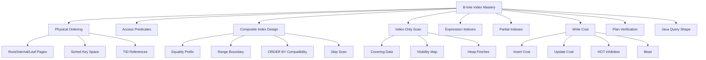
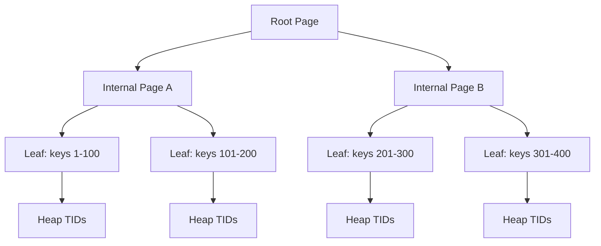
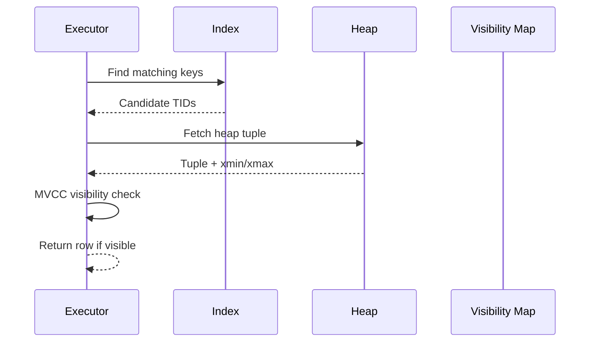

------
title: Learn PostgreSQL in Action - Part 013
description: B-tree index deep dive for Java engineers: physical ordering, composite indexes, left-prefix behavior, skip scan, covering indexes, partial and expression indexes, and production failure modes.
series: learn-postgresql-in-action
seriesTitle: Learn PostgreSQL in Action
order: 13
partTitle: B-tree Index Deep Dive
tags:
- postgresql
- btree
- indexing
- performance
- query-planning
- java
- series
date: 2026-07-01
---

# Part 013 — B-tree Index Deep Dive

A B-tree index is the default PostgreSQL index because it matches the most common OLTP access pattern: find a small set of rows by equality, range, ordering, or uniqueness.

But the common mistake is treating an index as a generic "make query faster" switch.

A production-grade engineer thinks about a B-tree index as a physical access path with a strict ordering, a maintenance cost, a visibility dependency, and a planner contract.

This part focuses only on B-tree indexes. Specialized indexes such as GIN, GiST, SP-GiST, BRIN, and Hash are covered in Part 014.

---

## 1. Kaufman Skill Target

The target skill is not "know how to create an index". That is basic.

The target skill is:

> Given a query, table shape, data distribution, and workload, predict whether a B-tree index is useful, which column order it needs, what failure modes it introduces, and how to validate the decision with `EXPLAIN`.

After this part, you should be able to answer:

- Why does a query ignore an index?
- Why does a composite index help one query but not another?
- Why can an index support both filtering and ordering?
- Why can an index-only scan still hit the heap?
- Why does an expression index require expression equivalence?
- Why is a partial index a business-rule index, not just a performance trick?
- Why can an index make writes slower?
- Why does column order matter less in PostgreSQL 18 than before, but still matter a lot?
- Why should Java/Hibernate query shape be designed with index shape in mind?

Skill decomposition:



---

## 2. The Core Mental Model

A B-tree index is a sorted structure from key value to heap tuple location.

It does not store a magical pointer to a Java object. It stores indexed values plus tuple identifiers that point into the heap.

A simplified view:


For an index to help, several conditions must align:

1. the query predicate must be expressible using the index operator class;
2. the indexed key ordering must narrow the search space;
3. the planner must estimate the selectivity as worth using;
4. the resulting heap fetch pattern must be cheaper than scanning the table;
5. the query shape emitted by Java/ORM must match the indexed expression or columns;
6. the table statistics must describe the data distribution well enough.

The important consequence:

> An index is not attached to a query. It is attached to a physical ordering. A query benefits only when it can exploit that ordering.

---

## 3. B-tree Is the Default, Not the Universal Answer

PostgreSQL creates B-tree indexes by default:

```sql
CREATE INDEX idx_customer_email ON customer (email);
```

Equivalent explicit form:

```sql
CREATE INDEX idx_customer_email ON customer USING btree (email);
```

B-tree works well for:

- equality: `email = ?`;
- range: `created_at >= ? AND created_at < ?`;
- ordered retrieval: `ORDER BY created_at DESC`;
- uniqueness: `UNIQUE (tenant_id, external_id)`;
- prefix patterns under compatible operator classes/collations;
- min/max lookup;
- merge joins when sorted order is useful.

B-tree is usually not the best default for:

- searching inside JSON arrays or arbitrary JSON containment;
- full-text search;
- trigram similarity;
- geospatial overlap;
- very large append-only time-series scans over naturally correlated physical order;
- "contains element" semantics over arrays;
- fuzzy matching.

Those belong mostly to Part 014.

---

## 4. B-tree Physical Shape

Conceptually, a B-tree has:

- a root page;
- internal pages;
- leaf pages;
- sorted keys;
- tuple IDs pointing to heap tuples.



This structure gives PostgreSQL fast navigation to a key range.

For example:

```sql
SELECT *
FROM payment
WHERE tenant_id = 't1'
  AND created_at >= now() - interval '1 day';
```

A useful index might be:

```sql
CREATE INDEX idx_payment_tenant_created
ON payment (tenant_id, created_at DESC);
```

The index key space is ordered like this:

```text
tenant_id -> created_at

t1 -> 2026-07-01 10:00
t1 -> 2026-07-01 09:59
t1 -> 2026-07-01 09:58
...
t2 -> 2026-07-01 10:00
t2 -> 2026-07-01 09:59
```

The equality condition on `tenant_id` gets PostgreSQL into the tenant's slice of the index. The range condition on `created_at` narrows that slice.

---

## 5. Heap Fetches and MVCC Visibility

A normal index scan is two-step:

1. scan the index;
2. fetch candidate rows from the heap;
3. check MVCC visibility;
4. return visible rows.



This matters because an index can be logically selective but physically expensive.

Example:

```sql
SELECT *
FROM audit_event
WHERE event_type = 'VIEWED';
```

If `event_type = 'VIEWED'` matches 60% of the table, an index may cause millions of random heap fetches. A sequential scan may be cheaper.

This is why "but there is an index" is not a diagnosis.

The correct question is:

> Is this index selective enough, ordered enough, and covering enough under current table visibility and workload conditions?

---

## 6. Single-Column Indexes

A single-column B-tree index is useful when one column dominates access.

Example:

```sql
CREATE TABLE account (
    id uuid PRIMARY KEY,
    tenant_id uuid NOT NULL,
    email text NOT NULL,
    status text NOT NULL,
    created_at timestamptz NOT NULL DEFAULT now()
);

CREATE UNIQUE INDEX ux_account_email
ON account (email);
```

Good query:

```sql
SELECT *
FROM account
WHERE email = ?;
```

Potentially poor query:

```sql
SELECT *
FROM account
WHERE lower(email) = lower(?);
```

The index is on `email`, not `lower(email)`.

You need either normalized data:

```sql
ALTER TABLE account
ADD CONSTRAINT ck_email_lowercase CHECK (email = lower(email));
```

or an expression index:

```sql
CREATE UNIQUE INDEX ux_account_email_lower
ON account (lower(email));
```

The broader rule:

> The index must match the query semantics, not merely the column name.

---

## 7. Composite Indexes: The Most Important B-tree Skill

Most serious PostgreSQL indexing work is composite index design.

Example query:

```sql
SELECT id, status, created_at
FROM case_file
WHERE tenant_id = ?
  AND status = ?
  AND created_at >= ?
ORDER BY created_at DESC
LIMIT 50;
```

Candidate index:

```sql
CREATE INDEX idx_case_tenant_status_created
ON case_file (tenant_id, status, created_at DESC);
```

Why this works:

- `tenant_id = ?` creates a tenant-specific slice;
- `status = ?` narrows the slice to a lifecycle state;
- `created_at >= ?` scans a bounded time range;
- `ORDER BY created_at DESC` matches the index order;
- `LIMIT 50` lets PostgreSQL stop early.

This index is not merely for filtering. It is an access path that supports filtering, ordering, and early termination.

---

## 8. The Equality-Then-Range Rule

For composite B-tree indexes, a practical rule is:

> Put high-value equality predicates first, then the range/order predicate that controls scan direction.

Example:

```sql
WHERE tenant_id = ?
  AND status = ?
  AND created_at BETWEEN ? AND ?
ORDER BY created_at DESC
```

Good:

```sql
CREATE INDEX idx_case_tenant_status_created
ON case_file (tenant_id, status, created_at DESC);
```

Usually worse:

```sql
CREATE INDEX idx_case_created_tenant_status
ON case_file (created_at DESC, tenant_id, status);
```

The second index starts with `created_at`, so PostgreSQL enters the global time range first, then filters tenant/status. For multi-tenant systems, that can read many irrelevant entries.

However, this is not a universal law. If the query is global reporting by time across all tenants, the second index may be right.

Index design is workload-relative.

---

## 9. Left-Prefix Behavior

A composite B-tree index has a leading key order.

Given:

```sql
CREATE INDEX idx_order_tenant_status_created
ON orders (tenant_id, status, created_at DESC);
```

The index naturally supports:

```sql
WHERE tenant_id = ?
```

```sql
WHERE tenant_id = ? AND status = ?
```

```sql
WHERE tenant_id = ? AND status = ? AND created_at >= ?
```

It is less naturally aligned with:

```sql
WHERE status = ?
```

or:

```sql
WHERE created_at >= ?
```

because those predicates skip the leading key column.

The old mental model was often summarized as "leftmost prefix". In PostgreSQL 18, B-tree skip scan makes the rule less absolute for some workloads, but not irrelevant.

---

## 10. PostgreSQL 18 Skip Scan: Useful, Not Magic

PostgreSQL 18 can use skip scan on multicolumn B-tree indexes in cases where earlier columns are not constrained but later columns are selective enough.

Example index:

```sql
CREATE INDEX idx_user_region_email
ON app_user (region, email);
```

Query:

```sql
SELECT *
FROM app_user
WHERE email = ?;
```

Historically, this index was often poor for the query because `region` was skipped. With skip scan, PostgreSQL may internally iterate over possible `region` values and search the `email` portion within each region.

Conceptually:

```text
region = 'APAC' -> find email
region = 'EMEA' -> find email
region = 'AMER' -> find email
```

This works best when the skipped leading column has low cardinality.

Bad skip-scan candidate:

```sql
CREATE INDEX idx_user_tenant_email
ON app_user (tenant_id, email);
```

Query:

```sql
SELECT *
FROM app_user
WHERE email = ?;
```

If there are 200,000 tenants, iterating tenant values is not cheap.

Practical rule:

> Skip scan reduces the penalty of skipped low-cardinality prefixes. It does not eliminate the need to design indexes around dominant query paths.

---

## 11. Column Order: How to Decide

When designing a composite index, ask these questions in order.

### 11.1 What is the strongest boundary?

In SaaS systems, often:

```sql
tenant_id
```

In regulatory systems, often:

```sql
jurisdiction_id
case_type
case_status
```

In financial systems, often:

```sql
account_id
ledger_id
posting_date
```

The strongest boundary is not necessarily the most selective globally. It is the boundary that prevents cross-domain scanning.

### 11.2 What predicates are equality predicates?

Equality predicates preserve ordering for later columns:

```sql
WHERE tenant_id = ?
  AND status = ?
  AND created_at > ?
```

`created_at` remains useful as an ordered range because previous columns are fixed.

### 11.3 What predicate is the range or ordering driver?

Common drivers:

- `created_at`;
- `updated_at`;
- `effective_from`;
- `sequence_no`;
- `priority`;
- `due_at`.

### 11.4 Does the query need `LIMIT`?

`LIMIT` changes the economics.

```sql
SELECT *
FROM task
WHERE tenant_id = ?
  AND status = 'READY'
ORDER BY priority DESC, created_at ASC
LIMIT 100;
```

Useful index:

```sql
CREATE INDEX idx_task_ready_pick
ON task (tenant_id, status, priority DESC, created_at ASC);
```

The engine can stop after finding 100 rows.

### 11.5 Does the query project only a few columns?

Then a covering index may help.

---

## 12. Filtering and Ordering with One Index

A B-tree can support both `WHERE` and `ORDER BY` if the order requested is compatible with the index ordering.

Example:

```sql
CREATE INDEX idx_invoice_tenant_due
ON invoice (tenant_id, due_at ASC, id ASC);
```

Query:

```sql
SELECT id, due_at, amount
FROM invoice
WHERE tenant_id = ?
ORDER BY due_at ASC, id ASC
LIMIT 100;
```

This can avoid a separate sort.

Why include `id`?

Because ordering by `due_at` alone may not be stable. Keyset pagination needs deterministic ordering:

```sql
WHERE tenant_id = ?
  AND (due_at, id) > (?, ?)
ORDER BY due_at ASC, id ASC
LIMIT 100;
```

Index:

```sql
CREATE INDEX idx_invoice_tenant_due_id
ON invoice (tenant_id, due_at ASC, id ASC);
```

This is a core production pattern: index order and pagination order must match.

---

## 13. ASC, DESC, and NULLS Ordering

PostgreSQL B-tree indexes can be scanned forward or backward, but mixed ordering can matter.

Example:

```sql
ORDER BY priority DESC, created_at ASC
```

Index:

```sql
CREATE INDEX idx_task_priority_created
ON task (priority DESC, created_at ASC);
```

Do not assume this is the same as:

```sql
CREATE INDEX idx_task_priority_created_default
ON task (priority, created_at);
```

For simple single-column reverse ordering, backward scan often helps. For multi-column mixed directions, explicit order can be important.

Also think about nulls:

```sql
CREATE INDEX idx_event_scheduled_at
ON event (scheduled_at ASC NULLS LAST);
```

If application queries consistently treat nulls as unscheduled, make that semantic explicit.

---

## 14. Covering Indexes and `INCLUDE`

A covering index stores extra columns so PostgreSQL can answer a query from the index without reading all projected data from the heap.

Example:

```sql
CREATE INDEX idx_case_list_covering
ON case_file (tenant_id, status, created_at DESC)
INCLUDE (id, reference_no, assigned_user_id);
```

Query:

```sql
SELECT id, reference_no, assigned_user_id, created_at
FROM case_file
WHERE tenant_id = ?
  AND status = ?
ORDER BY created_at DESC
LIMIT 50;
```

The key columns are:

```text
tenant_id, status, created_at
```

The included columns are payload:

```text
id, reference_no, assigned_user_id
```

Included columns do not define index ordering. They are there to avoid heap access for projection.

Important limitation:

> Index-only scans still depend on visibility information. If pages are not marked all-visible, PostgreSQL may still fetch heap pages.

This is why index-only scans are common on mostly static tables and less reliable on hot, frequently updated tables.

---

## 15. Index-Only Scan: The Visibility Trap

A query can appear coverable but still do heap fetches.

```sql
EXPLAIN (ANALYZE, BUFFERS)
SELECT id, reference_no
FROM case_file
WHERE tenant_id = ?
  AND status = 'OPEN';
```

Possible plan:

```text
Index Only Scan using idx_case_list_covering on case_file
  Index Cond: ((tenant_id = $1) AND (status = 'OPEN'))
  Heap Fetches: 12093
```

This is technically an index-only scan node, but heap fetches are still happening.

Why?

PostgreSQL must confirm MVCC visibility unless the visibility map says the relevant heap pages are all-visible.

Production implication:

- a covering index may perform well after vacuum;
- the same query may degrade on a heavily updated table;
- autovacuum health affects index-only scan quality;
- high update churn can make covering indexes less valuable.

---

## 16. Partial Indexes

A partial index indexes only rows matching a predicate.

Example:

```sql
CREATE INDEX idx_case_open_by_tenant_created
ON case_file (tenant_id, created_at DESC)
WHERE status = 'OPEN';
```

Query:

```sql
SELECT id, reference_no, created_at
FROM case_file
WHERE tenant_id = ?
  AND status = 'OPEN'
ORDER BY created_at DESC
LIMIT 50;
```

This index is smaller and more focused than:

```sql
CREATE INDEX idx_case_status_tenant_created
ON case_file (status, tenant_id, created_at DESC);
```

Partial indexes are excellent when:

- active rows are a small subset;
- lifecycle states are stable;
- queries repeatedly target one state;
- write cost matters;
- old/closed data dominates table size.

Common examples:

```sql
CREATE INDEX idx_job_ready
ON job_queue (priority DESC, created_at ASC)
WHERE status = 'READY';
```

```sql
CREATE INDEX idx_invoice_unpaid_due
ON invoice (tenant_id, due_at ASC)
WHERE paid_at IS NULL;
```

```sql
CREATE INDEX idx_case_assigned_open
ON case_file (assigned_user_id, due_at ASC)
WHERE status IN ('OPEN', 'ESCALATED');
```

A partial index is a business-rule index.

It says:

> This subset of rows is operationally important enough to maintain separately.

---

## 17. Partial Index Predicate Matching

A partial index is useful only when the planner can prove that the query predicate implies the index predicate.

Index:

```sql
CREATE INDEX idx_invoice_unpaid_due
ON invoice (tenant_id, due_at ASC)
WHERE paid_at IS NULL;
```

Good query:

```sql
SELECT *
FROM invoice
WHERE tenant_id = ?
  AND paid_at IS NULL
ORDER BY due_at
LIMIT 100;
```

Risky query:

```sql
SELECT *
FROM invoice
WHERE tenant_id = ?
  AND coalesce(paid_at, timestamp 'infinity') = timestamp 'infinity';
```

The semantics may be equivalent to the application, but not necessarily visible to the planner as the same predicate.

Java/Hibernate risk:

- ORM-generated predicates may not match your partial index predicate;
- boolean flags may be expressed indirectly;
- soft-delete filters may be injected inconsistently;
- parameterized predicates may hide constants.

Practical rule:

> If you rely on a partial index, freeze the query predicate shape in repository/query code and test the plan.

---

## 18. Partial Unique Indexes

Partial unique indexes enforce uniqueness only for a subset.

Example: one active assignment per case.

```sql
CREATE UNIQUE INDEX ux_case_active_assignment
ON case_assignment (case_id)
WHERE ended_at IS NULL;
```

This is better than enforcing the rule in Java only.

Application invariant:

> A case can have many historical assignments, but only one active assignment.

Schema enforcement:

```sql
CREATE TABLE case_assignment (
    id uuid PRIMARY KEY,
    case_id uuid NOT NULL,
    assignee_id uuid NOT NULL,
    started_at timestamptz NOT NULL,
    ended_at timestamptz,
    CHECK (ended_at IS NULL OR ended_at > started_at)
);

CREATE UNIQUE INDEX ux_case_active_assignment
ON case_assignment (case_id)
WHERE ended_at IS NULL;
```

This turns a race-prone application rule into a database-enforced invariant.

---

## 19. Expression Indexes

An expression index indexes the result of an expression.

```sql
CREATE INDEX idx_account_email_lower
ON account (lower(email));
```

Query:

```sql
SELECT *
FROM account
WHERE lower(email) = lower(?);
```

This can use the index.

Expression indexes are useful for:

- case-insensitive lookup;
- normalized phone numbers;
- extracted JSONB fields;
- date truncation in specific scenarios;
- derived business keys;
- immutable function results.

Example: JSONB attribute extraction:

```sql
CREATE INDEX idx_customer_profile_country
ON customer ((profile ->> 'country'));
```

Query:

```sql
SELECT *
FROM customer
WHERE profile ->> 'country' = 'ID';
```

But expression indexes are brittle when query expressions vary.

These may not be equivalent for planner/index matching:

```sql
profile ->> 'country'
```

```sql
(profile #>> '{country}')
```

The application may consider them equivalent. The index matcher may not.

---

## 20. Generated Columns vs Expression Indexes

PostgreSQL supports generated columns. You can materialize a derived value as a column, then index it.

Example:

```sql
ALTER TABLE account
ADD COLUMN email_normalized text
GENERATED ALWAYS AS (lower(email)) STORED;

CREATE UNIQUE INDEX ux_account_email_normalized
ON account (email_normalized);
```

Compared to expression index:

```sql
CREATE UNIQUE INDEX ux_account_email_lower
ON account (lower(email));
```

Trade-off:

| Approach | Strength | Risk |
|---|---|---|
| Expression index | No extra named column | Query expression must match |
| Generated column | Explicit contract, easier Java mapping | Extra schema surface |

Use generated columns when the derived value is part of the domain language.

Examples:

- `email_normalized`;
- `case_reference_sort_key`;
- `effective_period`;
- `document_type_code` extracted from JSON;
- `search_text` for constrained search.

---

## 21. Unique Indexes vs Unique Constraints

A unique constraint creates a unique index underneath, but constraints and indexes are not the same semantic object.

Prefer a constraint when modeling relational integrity:

```sql
ALTER TABLE account
ADD CONSTRAINT ux_account_tenant_external_id
UNIQUE (tenant_id, external_id);
```

Prefer a standalone unique index when you need PostgreSQL-specific index features such as a partial unique predicate:

```sql
CREATE UNIQUE INDEX ux_case_active_assignment
ON case_assignment (case_id)
WHERE ended_at IS NULL;
```

For Java error handling, name uniqueness constraints/indexes deliberately.

Bad:

```text
account_email_key
```

Better:

```text
ux_account_tenant_email_active
```

Then map database constraint names to domain errors:

```text
ux_account_tenant_email_active -> EMAIL_ALREADY_USED_IN_TENANT
ux_case_active_assignment -> CASE_ALREADY_HAS_ACTIVE_ASSIGNEE
```

---

## 22. Foreign Key Indexes: The Hidden Production Requirement

PostgreSQL does not automatically create an index on the referencing side of a foreign key.

Example:

```sql
CREATE TABLE parent_case (
    id uuid PRIMARY KEY
);

CREATE TABLE case_note (
    id uuid PRIMARY KEY,
    case_id uuid NOT NULL REFERENCES parent_case(id),
    body text NOT NULL
);
```

You usually need:

```sql
CREATE INDEX idx_case_note_case_id
ON case_note (case_id);
```

Why?

Common child lookup:

```sql
SELECT *
FROM case_note
WHERE case_id = ?;
```

Also, parent deletes/updates may need to check referencing rows.

Without the child-side index, operations involving parent rows can become unexpectedly expensive or lock-heavy.

Rule:

> Every high-cardinality foreign key used for lookup or parent lifecycle operations should be intentionally reviewed for an index.

Not every FK needs an index, but every FK needs a decision.

---

## 23. Bitmap Index Scans

Sometimes PostgreSQL combines multiple indexes using bitmap operations.

Example:

```sql
CREATE INDEX idx_case_tenant ON case_file (tenant_id);
CREATE INDEX idx_case_status ON case_file (status);
```

Query:

```sql
SELECT *
FROM case_file
WHERE tenant_id = ?
  AND status = 'OPEN';
```

Possible plan:

```text
Bitmap Heap Scan on case_file
  Recheck Cond: (...)
  -> BitmapAnd
       -> Bitmap Index Scan on idx_case_tenant
       -> Bitmap Index Scan on idx_case_status
```

Bitmap scans are useful when multiple predicates each narrow the set somewhat.

But a well-designed composite index may still be better:

```sql
CREATE INDEX idx_case_tenant_status
ON case_file (tenant_id, status);
```

Composite index advantages:

- preserves combined ordering;
- may avoid bitmap materialization;
- may support `ORDER BY`;
- may support index-only scan;
- may improve `LIMIT` behavior.

Bitmap scans are not bad. They are a sign that PostgreSQL is assembling a path from available indexes.

---

## 24. Index Selectivity and Low-Cardinality Columns

A low-cardinality column alone is often a weak B-tree index.

Example:

```sql
status IN ('OPEN', 'CLOSED', 'ESCALATED')
```

Bad standalone index candidate:

```sql
CREATE INDEX idx_case_status
ON case_file (status);
```

If `status = 'CLOSED'` matches 90% of rows, the index is not useful.

But low-cardinality columns are excellent inside composite or partial indexes:

```sql
CREATE INDEX idx_case_tenant_status_created
ON case_file (tenant_id, status, created_at DESC);
```

or:

```sql
CREATE INDEX idx_case_open_tenant_created
ON case_file (tenant_id, created_at DESC)
WHERE status = 'OPEN';
```

The better question is not:

> Is the column selective?

The better question is:

> Is the full access path selective and ordered for the workload?

---

## 25. `LIKE`, Prefix Search, and Collation

B-tree can support prefix search under the right operator class and collation behavior.

Example:

```sql
SELECT *
FROM account
WHERE email LIKE 'john%';
```

A normal B-tree index may or may not be enough depending on collation and operator class.

A common explicit pattern:

```sql
CREATE INDEX idx_account_email_pattern
ON account (email text_pattern_ops);
```

This supports prefix pattern matching for text.

But it does not solve:

```sql
WHERE email LIKE '%john%'
```

Leading wildcard search is not a B-tree problem. Use trigram indexing or full-text search depending on semantics. That is covered in Part 014.

---

## 26. Keyset Pagination

Offset pagination degrades as offset grows:

```sql
SELECT id, created_at
FROM audit_event
WHERE tenant_id = ?
ORDER BY created_at DESC
OFFSET 100000
LIMIT 50;
```

The database still has to walk past many rows.

Keyset pagination uses the last seen key:

```sql
SELECT id, created_at
FROM audit_event
WHERE tenant_id = ?
  AND (created_at, id) < (?, ?)
ORDER BY created_at DESC, id DESC
LIMIT 50;
```

Index:

```sql
CREATE INDEX idx_audit_tenant_created_id
ON audit_event (tenant_id, created_at DESC, id DESC);
```

This is one of the most important B-tree patterns for high-scale APIs.

Rule:

> For pageable production lists, design the sort order first, then design the index to match it.

---

## 27. Multi-Tenant Indexing

For shared-schema multi-tenant systems, most operational indexes should begin with `tenant_id` unless the query is explicitly global.

Example:

```sql
CREATE INDEX idx_case_tenant_status_due
ON case_file (tenant_id, status, due_at ASC);
```

This prevents one tenant's query from scanning another tenant's data.

However, not every index should start with `tenant_id`.

Global operational query:

```sql
SELECT *
FROM job_queue
WHERE status = 'READY'
ORDER BY priority DESC, created_at ASC
LIMIT 100;
```

Index:

```sql
CREATE INDEX idx_job_ready_global_pick
ON job_queue (priority DESC, created_at ASC)
WHERE status = 'READY';
```

If workers are global, `tenant_id` may hurt.

Decision rule:

| Query Scope | Likely Leading Key |
|---|---|
| Tenant-scoped UI/API | `tenant_id` |
| User inbox within tenant | `tenant_id, user_id` |
| Global worker queue | priority/time predicate, often partial |
| Global admin report | time/reporting dimension |
| Cross-tenant reconciliation | domain-specific global key |

---

## 28. Write Amplification

Every index must be maintained on writes.

When you insert a row:

- heap tuple is written;
- every index receives an entry;
- WAL records are generated;
- page splits may occur;
- cache pressure increases.

When you update an indexed column:

- PostgreSQL may need new index entries;
- HOT update may be prevented;
- dead index entries remain until cleanup;
- autovacuum has more work.

Index cost model:

```text
read benefit - write overhead - storage overhead - vacuum overhead - operational complexity
```

A table with 20 indexes is not automatically well-optimized. It may be a write-amplification machine.

Production smell:

```text
INSERT latency high
UPDATE latency high
autovacuum constantly active
index size > table size by large margin
many similar indexes
low index scan count
```

---

## 29. HOT Updates and Index Design

Heap-Only Tuple updates can avoid updating indexes when indexed columns do not change and there is room on the same page.

Example:

```sql
UPDATE account
SET last_seen_at = now()
WHERE id = ?;
```

If `last_seen_at` is not indexed, this update may be HOT-eligible.

If you add:

```sql
CREATE INDEX idx_account_last_seen
ON account (last_seen_at);
```

then frequent updates to `last_seen_at` require index maintenance.

This is a classic trade-off:

- indexing a frequently updated column helps read queries;
- but it can degrade write throughput and increase bloat.

Rule:

> Do not index volatile columns unless their read path justifies the write cost.

---

## 30. Detecting Unused or Redundant Indexes

Start with statistics:

```sql
SELECT
    schemaname,
    relname AS table_name,
    indexrelname AS index_name,
    idx_scan,
    idx_tup_read,
    idx_tup_fetch
FROM pg_stat_user_indexes
ORDER BY idx_scan ASC, indexrelname;
```

But be careful.

An index with low scan count may still be critical:

- uniqueness enforcement;
- foreign key support;
- rare incident query;
- monthly billing;
- end-of-day reconciliation;
- partial index for rare but urgent state.

Look for redundancy:

```text
idx_a: (tenant_id)
idx_b: (tenant_id, status)
idx_c: (tenant_id, status, created_at)
```

`idx_a` may be redundant, but not always. It may be smaller and better for some queries. Validate with real workload plans before dropping.

---

## 31. Safe Index Creation in Production

Normal index creation blocks writes on the table.

For production systems, prefer:

```sql
CREATE INDEX CONCURRENTLY idx_case_tenant_status_created
ON case_file (tenant_id, status, created_at DESC);
```

Trade-offs:

- does not block normal writes in the same way;
- takes longer;
- cannot run inside a normal transaction block;
- may fail and leave an invalid index that must be dropped;
- still consumes CPU, I/O, and WAL;
- still needs operational scheduling.

Safe migration pattern:

```sql
-- deploy 1
CREATE INDEX CONCURRENTLY idx_case_tenant_status_created
ON case_file (tenant_id, status, created_at DESC);

-- verify usage through EXPLAIN and production stats

-- deploy 2 if replacing old index
DROP INDEX CONCURRENTLY idx_case_old;
```

Never combine high-risk index creation with unrelated schema changes in one migration.

---

## 32. Naming Indexes for Operations

Index names should encode intent.

Bad:

```sql
CREATE INDEX idx1 ON case_file (tenant_id, status, created_at);
```

Better:

```sql
CREATE INDEX idx_case_file_tenant_status_created_desc
ON case_file (tenant_id, status, created_at DESC);
```

For partial indexes:

```sql
CREATE INDEX idx_case_file_open_tenant_due
ON case_file (tenant_id, due_at)
WHERE status = 'OPEN';
```

For unique invariants:

```sql
CREATE UNIQUE INDEX ux_case_assignment_active_case
ON case_assignment (case_id)
WHERE ended_at IS NULL;
```

Good names help when:

- reading `EXPLAIN` plans;
- debugging constraint violations;
- correlating logs;
- reviewing migrations;
- deciding whether an index is redundant.

---

## 33. Java and Hibernate Query Shape

PostgreSQL indexes do not see your repository method name. They see SQL.

A Spring Data method like:

```java
findTop50ByTenantIdAndStatusOrderByCreatedAtDesc(...)
```

must emit SQL compatible with:

```sql
WHERE tenant_id = ?
  AND status = ?
ORDER BY created_at DESC
LIMIT 50
```

Index:

```sql
CREATE INDEX idx_case_tenant_status_created
ON case_file (tenant_id, status, created_at DESC);
```

Common ORM index breakers:

### 33.1 Function wrapper on indexed column

```sql
WHERE lower(email) = ?
```

Index on `email` does not directly match.

### 33.2 Implicit casts

```sql
WHERE external_id = ?
```

If `external_id` is `uuid` but the driver binds text incorrectly, plans can suffer. Use correct Java types and parameter binding.

### 33.3 Non-sargable predicate

```sql
WHERE date_trunc('day', created_at) = ?
```

Better:

```sql
WHERE created_at >= ?
  AND created_at < ?
```

### 33.4 Offset pagination

```sql
ORDER BY created_at DESC OFFSET ? LIMIT ?
```

For deep pages, use keyset pagination.

### 33.5 Hidden soft-delete filters

```sql
WHERE deleted = false
```

Maybe you need:

```sql
CREATE INDEX idx_entity_active_tenant_created
ON entity (tenant_id, created_at DESC)
WHERE deleted = false;
```

---

## 34. Case Study: Enforcement Case Inbox

Suppose we have an enforcement case management system.

```sql
CREATE TABLE enforcement_case (
    id uuid PRIMARY KEY,
    tenant_id uuid NOT NULL,
    jurisdiction_id uuid NOT NULL,
    case_type text NOT NULL,
    status text NOT NULL,
    assigned_user_id uuid,
    priority int NOT NULL DEFAULT 0,
    due_at timestamptz,
    created_at timestamptz NOT NULL DEFAULT now(),
    updated_at timestamptz NOT NULL DEFAULT now(),
    closed_at timestamptz
);
```

### Query 1: user inbox

```sql
SELECT id, case_type, status, priority, due_at
FROM enforcement_case
WHERE tenant_id = ?
  AND assigned_user_id = ?
  AND status IN ('OPEN', 'ESCALATED')
ORDER BY priority DESC, due_at ASC, id ASC
LIMIT 100;
```

Index:

```sql
CREATE INDEX idx_case_user_active_inbox
ON enforcement_case (
    tenant_id,
    assigned_user_id,
    priority DESC,
    due_at ASC,
    id ASC
)
WHERE status IN ('OPEN', 'ESCALATED');
```

Why status is in the partial predicate instead of key:

- only active rows matter for the inbox;
- index is smaller;
- ordering starts after tenant/user boundary;
- the worker/UI does not need closed cases.

### Query 2: tenant open cases by created date

```sql
SELECT id, case_type, created_at
FROM enforcement_case
WHERE tenant_id = ?
  AND status = 'OPEN'
ORDER BY created_at DESC, id DESC
LIMIT 50;
```

Index:

```sql
CREATE INDEX idx_case_tenant_open_created
ON enforcement_case (tenant_id, created_at DESC, id DESC)
WHERE status = 'OPEN';
```

### Query 3: global overdue escalation scan

```sql
SELECT id
FROM enforcement_case
WHERE status = 'OPEN'
  AND due_at < now()
ORDER BY due_at ASC
LIMIT 500;
```

Index:

```sql
CREATE INDEX idx_case_open_due_global
ON enforcement_case (due_at ASC, id ASC)
WHERE status = 'OPEN';
```

Do not lead with `tenant_id` here if the escalation worker scans globally.

---

## 35. EXPLAIN Verification Checklist

For every important index, validate with:

```sql
EXPLAIN (ANALYZE, BUFFERS, VERBOSE)
SELECT ...;
```

Look for:

| Signal | Meaning |
|---|---|
| `Index Scan` | Index used, heap fetches likely |
| `Index Only Scan` | Index can supply data, check heap fetches |
| `Bitmap Index Scan` | Index used to build bitmap |
| `Rows Removed by Filter` | Index did not fully match predicate |
| `Sort Method` | Sort still happening |
| `Heap Fetches` | Index-only scan not fully heap-free |
| `actual rows` vs `rows` | Estimate quality |
| `Buffers: shared hit/read` | Cache/I/O pattern |

Red flags:

```text
Index Scan + many Rows Removed by Filter
Index Only Scan + huge Heap Fetches
Bitmap Heap Scan + many lossy pages
Seq Scan on large table for selective query
Sort after index scan when ORDER BY should match
Actual rows 100000, estimated rows 10
```

---

## 36. Index Design Review Template

Before adding an index, write this down.

```mdx
### Proposed Index

```sql
CREATE INDEX CONCURRENTLY idx_name
ON table_name (...)
WHERE ...;
```

### Query It Supports

```sql
SELECT ...
FROM ...
WHERE ...
ORDER BY ...
LIMIT ...;
```

### Why This Shape

- leading column:
- equality predicates:
- range/order predicate:
- partial predicate:
- included columns:
- expected selectivity:
- expected write cost:

### Validation

- EXPLAIN before:
- EXPLAIN after:
- production metric to watch:
- rollback/drop plan:
```

This prevents random indexing.

---

## 37. Common Anti-Patterns

### 37.1 One index per column

```sql
CREATE INDEX idx_case_tenant ON case_file (tenant_id);
CREATE INDEX idx_case_status ON case_file (status);
CREATE INDEX idx_case_created ON case_file (created_at);
```

This may be inferior to one workload-shaped composite index.

### 37.2 Indexing every foreign key blindly

Usually many FKs need indexes. But blindly indexing low-value FKs on write-heavy tables can create overhead. Decide intentionally.

### 37.3 Ignoring ordering

```sql
WHERE tenant_id = ? AND status = ?
ORDER BY created_at DESC
```

Index only on `(tenant_id, status)` may still require sorting.

### 37.4 Wide covering indexes everywhere

`INCLUDE` is useful but not free. Large included columns increase index size and cache pressure.

### 37.5 Partial index with inconsistent application predicate

If some code uses `status = 'OPEN'` and other code uses `status <> 'CLOSED'`, the partial index may not be consistently used.

### 37.6 Indexing volatile columns casually

Indexing `updated_at`, `last_seen_at`, or `heartbeat_at` on hot tables can significantly increase write cost.

### 37.7 Using indexes to compensate for bad query shape

A non-sargable query often needs query rewrite before index creation.

---

## 38. Hands-On Lab

Use the lab from Part 002.

### 38.1 Create table

```sql
DROP TABLE IF EXISTS case_file;

CREATE TABLE case_file (
    id uuid PRIMARY KEY DEFAULT gen_random_uuid(),
    tenant_id uuid NOT NULL,
    assigned_user_id uuid,
    status text NOT NULL,
    priority int NOT NULL DEFAULT 0,
    due_at timestamptz,
    created_at timestamptz NOT NULL DEFAULT now(),
    closed_at timestamptz
);
```

### 38.2 Seed data

```sql
INSERT INTO case_file (
    tenant_id,
    assigned_user_id,
    status,
    priority,
    due_at,
    created_at,
    closed_at
)
SELECT
    ('00000000-0000-0000-0000-' || lpad(((g % 100) + 1)::text, 12, '0'))::uuid,
    ('10000000-0000-0000-0000-' || lpad(((g % 1000) + 1)::text, 12, '0'))::uuid,
    CASE
        WHEN g % 20 = 0 THEN 'ESCALATED'
        WHEN g % 5 = 0 THEN 'OPEN'
        ELSE 'CLOSED'
    END,
    (random() * 10)::int,
    now() + ((g % 30) || ' days')::interval,
    now() - ((g % 365) || ' days')::interval,
    CASE WHEN g % 5 = 0 THEN NULL ELSE now() - ((g % 100) || ' days')::interval END
FROM generate_series(1, 1000000) AS g;

ANALYZE case_file;
```

### 38.3 Baseline query

```sql
EXPLAIN (ANALYZE, BUFFERS)
SELECT id, status, priority, due_at
FROM case_file
WHERE tenant_id = '00000000-0000-0000-0000-000000000001'
  AND assigned_user_id = '10000000-0000-0000-0000-000000000001'
  AND status IN ('OPEN', 'ESCALATED')
ORDER BY priority DESC, due_at ASC, id ASC
LIMIT 100;
```

### 38.4 Add partial composite index

```sql
CREATE INDEX idx_case_user_active_inbox
ON case_file (
    tenant_id,
    assigned_user_id,
    priority DESC,
    due_at ASC,
    id ASC
)
WHERE status IN ('OPEN', 'ESCALATED');

ANALYZE case_file;
```

### 38.5 Compare plan

```sql
EXPLAIN (ANALYZE, BUFFERS)
SELECT id, status, priority, due_at
FROM case_file
WHERE tenant_id = '00000000-0000-0000-0000-000000000001'
  AND assigned_user_id = '10000000-0000-0000-0000-000000000001'
  AND status IN ('OPEN', 'ESCALATED')
ORDER BY priority DESC, due_at ASC, id ASC
LIMIT 100;
```

Observe:

- plan node;
- sort eliminated or not;
- buffer hits/reads;
- estimated vs actual rows;
- execution time;
- index size.

### 38.6 Check index size

```sql
SELECT
    relname,
    pg_size_pretty(pg_relation_size(oid)) AS size
FROM pg_class
WHERE relname IN ('case_file', 'idx_case_user_active_inbox')
ORDER BY pg_relation_size(oid) DESC;
```

### 38.7 Observe index statistics

```sql
SELECT
    relname AS table_name,
    indexrelname AS index_name,
    idx_scan,
    idx_tup_read,
    idx_tup_fetch
FROM pg_stat_user_indexes
WHERE indexrelname = 'idx_case_user_active_inbox';
```

---

## 39. Self-Correction Drills

### Drill 1: Choose index order

Query:

```sql
SELECT *
FROM payment
WHERE tenant_id = ?
  AND account_id = ?
  AND posted_at >= ?
  AND posted_at < ?
ORDER BY posted_at DESC
LIMIT 100;
```

Candidate:

```sql
(tenant_id, account_id, posted_at DESC)
```

Explain why this is likely good.

### Drill 2: Detect non-sargability

Query:

```sql
WHERE date_trunc('day', created_at) = date_trunc('day', now())
```

Rewrite to a range predicate.

### Drill 3: Partial index predicate

Index:

```sql
CREATE INDEX idx_invoice_unpaid
ON invoice (tenant_id, due_at)
WHERE paid_at IS NULL;
```

Which query uses it more reliably?

```sql
WHERE tenant_id = ? AND paid_at IS NULL
```

or:

```sql
WHERE tenant_id = ? AND coalesce(paid_at, now()) = now()
```

Explain why.

### Drill 4: Covering index reality

An index-only scan shows:

```text
Heap Fetches: 900000
```

What does that tell you?

### Drill 5: Write amplification

A table receives 5,000 updates per second to `last_seen_at`. Should you add an index on `last_seen_at` for an occasional admin report?

Answer with trade-offs.

---

## 40. Production Readiness Checklist

Before approving a B-tree index:

- [ ] The query pattern is known and important.
- [ ] The index supports filtering and/or ordering, not just a column name.
- [ ] Column order is justified.
- [ ] Range predicate position is intentional.
- [ ] `ORDER BY` compatibility is checked.
- [ ] `LIMIT` behavior is considered.
- [ ] Partial predicate matches application SQL.
- [ ] Expression index expression matches application SQL.
- [ ] Covering columns are small and justified.
- [ ] Write amplification is acceptable.
- [ ] HOT update impact is considered.
- [ ] Foreign key lifecycle impact is considered.
- [ ] Index name encodes intent.
- [ ] `CREATE INDEX CONCURRENTLY` is used for production-size tables.
- [ ] Before/after `EXPLAIN` is captured.
- [ ] Rollback/drop plan exists.

---

## 41. Key Takeaways

- B-tree indexes are ordered access paths, not generic speed switches.
- Composite index design is the core skill.
- Equality predicates usually belong before range/order predicates.
- PostgreSQL 18 skip scan helps when skipped leading columns have low cardinality, but it does not remove the need for workload-shaped indexes.
- Covering indexes can reduce heap access, but index-only scans still depend on visibility map health.
- Partial indexes encode operationally important subsets and can enforce business invariants.
- Expression indexes require query expression discipline.
- Every index has write, WAL, storage, and vacuum cost.
- Java/Hibernate query shape must be validated against actual SQL and `EXPLAIN` output.
- The best index is not the most clever index. It is the smallest index that reliably protects a valuable access path or invariant.

In Part 014, we move beyond B-tree into specialized index types: GIN, GiST, SP-GiST, BRIN, Hash, trigram, full-text, JSONB, arrays, ranges, and time-series-like access paths.
