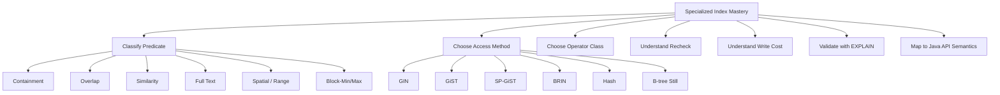
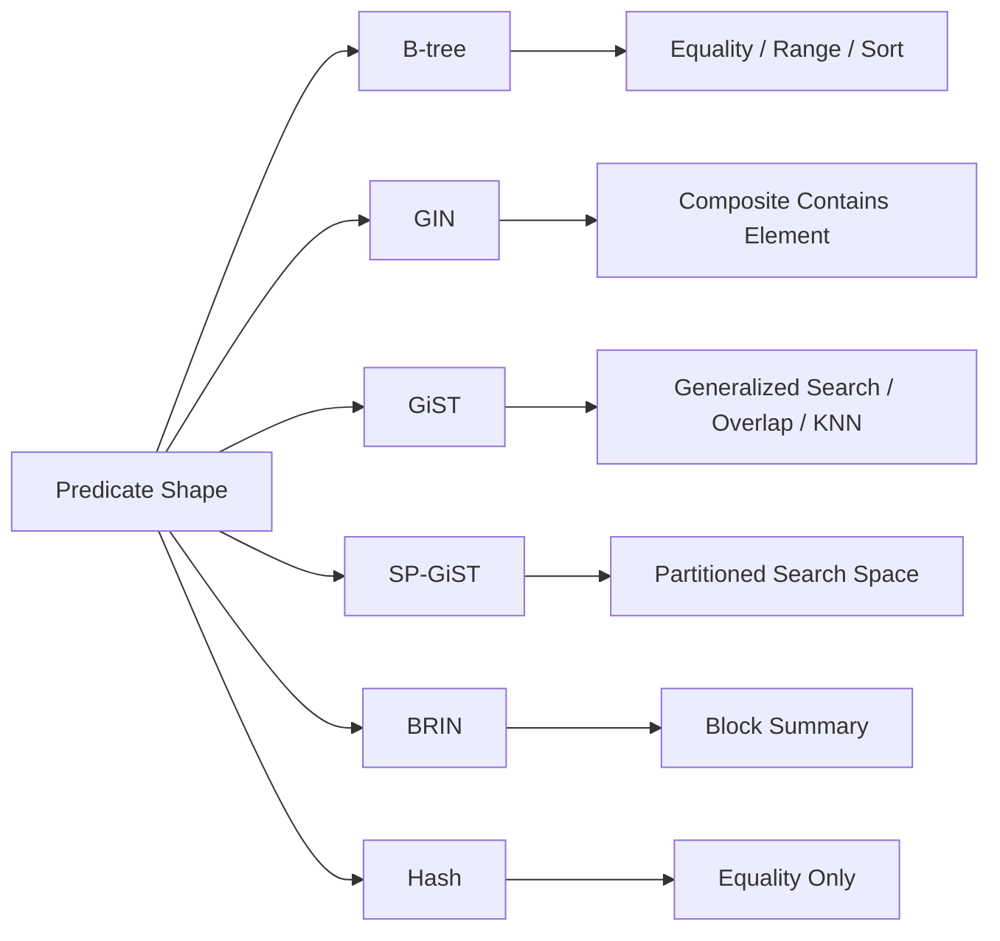
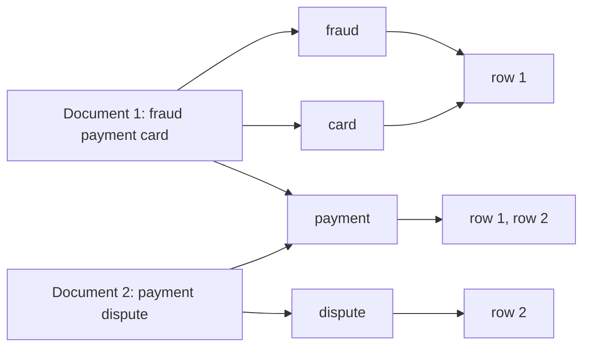
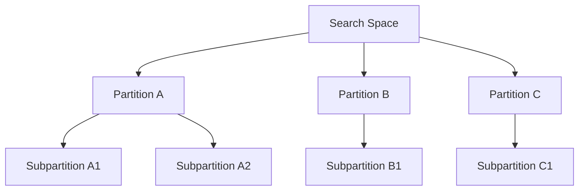
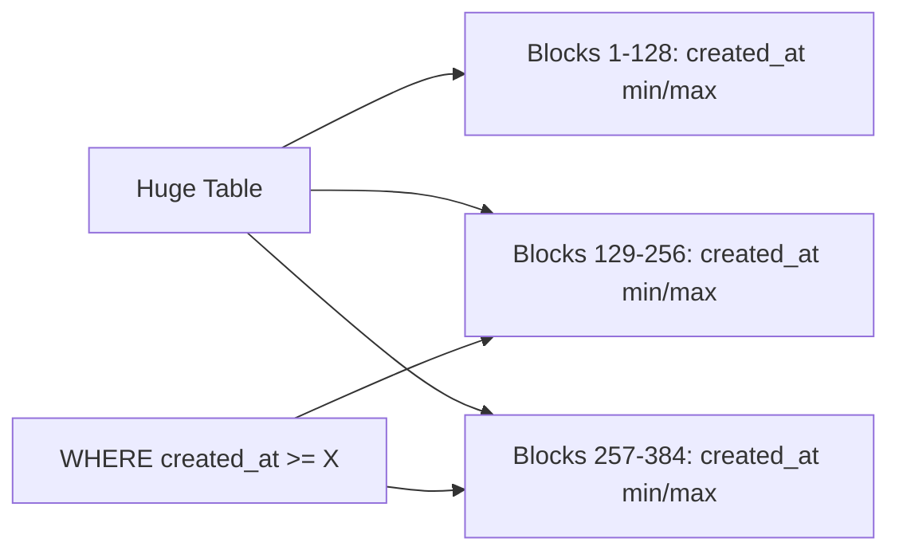

------
title: Learn PostgreSQL in Action - Part 014
description: Specialized PostgreSQL indexes for advanced workloads: GIN, GiST, SP-GiST, BRIN, Hash, JSONB, arrays, full-text search, trigram search, ranges, and time-series access patterns.
series: learn-postgresql-in-action
seriesTitle: Learn PostgreSQL in Action
order: 14
partTitle: Specialized Indexes: GIN, GiST, SP-GiST, BRIN, Hash
tags:
- postgresql
- indexing
- gin
- gist
- brin
- jsonb
- full-text-search
- java
- series
date: 2026-07-01
---

# Part 014 — Specialized Indexes: GIN, GiST, SP-GiST, BRIN, Hash

B-tree indexes dominate OLTP because most applications ask equality, range, and ordered-list questions.

But PostgreSQL is not limited to B-tree. It has multiple index access methods because different data shapes need different search structures.

This part answers one question:

> When the query is not naturally a scalar equality/range/order problem, which PostgreSQL index type should we reach for, and what are the trade-offs?

We will cover:

- GIN;
- GiST;
- SP-GiST;
- BRIN;
- Hash;
- trigram indexes;
- full-text search indexes;
- JSONB indexes;
- array indexes;
- range indexes;
- operational failure modes.

---

## 1. Kaufman Skill Target

The target is not memorizing every index type.

The target is classification:

> Given a query predicate and data shape, classify the problem into the correct index family, choose a safe initial index, and validate it with `EXPLAIN` and workload behavior.

After this part, you should be able to answer:

- Is this a B-tree problem or not?
- Should JSONB use `jsonb_ops`, `jsonb_path_ops`, expression index, or generated column?
- Should search use full-text search or trigram?
- Should time-series data use B-tree or BRIN?
- Why can a GIN index be fast for reads but expensive for writes?
- Why does a GiST index often return candidates that require recheck?
- Why can range/exclusion constraints depend on GiST?
- Why is a Hash index rarely the first index you choose?
- Why should Java APIs expose search semantics clearly before choosing an index?

Skill map:



---

## 2. First Principle: Index Type Follows Predicate Semantics

Do not start with:

> Should we use GIN?

Start with:

> What question is the query asking?

| Query Question | Typical Index Family |
|---|---|
| Is scalar equal to value? | B-tree |
| Is scalar in range? | B-tree |
| Return rows in sorted order? | B-tree |
| Does JSON contain this object/path? | GIN or expression/B-tree |
| Does array contain element? | GIN |
| Does text match words linguistically? | Full-text with GIN/GiST |
| Does text look similar / contain substring? | Trigram GIN/GiST |
| Does range overlap another range? | GiST or SP-GiST depending type/operator |
| Does geometry overlap/intersect? | GiST/SP-GiST via PostGIS/operator classes |
| Is huge append-only table filtered by naturally ordered column? | BRIN |
| Is equality only, no ordering/range? | B-tree usually; Hash only selectively |

The access method is a consequence, not the starting point.

---

## 3. PostgreSQL Index Families at a Glance



Short mental model:

| Index | Mental Model | Common Use |
|---|---|---|
| B-tree | sorted keys | equality, range, order |
| GIN | inverted index from element to row | JSONB, arrays, full-text |
| GiST | generalized tree of bounding predicates | ranges, geometry, nearest-neighbor, exclusion |
| SP-GiST | partitioned search space | certain spatial/prefix/range patterns |
| BRIN | block-level min/max summaries | huge naturally ordered tables |
| Hash | hash equality lookup | narrow equality-only cases |

---

## 4. GIN: Generalized Inverted Index

GIN indexes are designed for composite values where a row contains multiple searchable elements.

Think:

```text
row -> many tokens/elements
```

GIN builds the reverse mapping:

```text
element/token -> rows containing it
```



GIN is common for:

- JSONB containment;
- arrays;
- full-text search `tsvector`;
- trigram search through `pg_trgm`;
- hstore if used.

GIN is usually read-powerful and write-expensive.

---

## 5. GIN for JSONB

Suppose we have flexible case attributes:

```sql
CREATE TABLE case_event (
    id uuid PRIMARY KEY DEFAULT gen_random_uuid(),
    tenant_id uuid NOT NULL,
    event_type text NOT NULL,
    attributes jsonb NOT NULL,
    created_at timestamptz NOT NULL DEFAULT now()
);
```

Example JSON:

```json
{
  "channel": "email",
  "risk": "high",
  "actor": {
    "type": "officer",
    "id": "u123"
  },
  "tags": ["fraud", "priority"]
}
```

Containment query:

```sql
SELECT *
FROM case_event
WHERE attributes @> '{"risk":"high"}'::jsonb;
```

GIN index:

```sql
CREATE INDEX idx_case_event_attributes_gin
ON case_event USING gin (attributes);
```

This supports JSONB containment-style queries.

However, this is broad. It indexes many keys/values and can grow large.

---

## 6. JSONB Operator Class: `jsonb_ops` vs `jsonb_path_ops`

For JSONB GIN, two common operator classes matter:

```sql
CREATE INDEX idx_event_attr_ops
ON case_event USING gin (attributes jsonb_ops);
```

```sql
CREATE INDEX idx_event_attr_path_ops
ON case_event USING gin (attributes jsonb_path_ops);
```

High-level trade-off:

| Operator Class | Strength | Trade-off |
|---|---|---|
| `jsonb_ops` | broad operator support | larger index |
| `jsonb_path_ops` | efficient containment-focused indexing | narrower operator support |

Use `jsonb_path_ops` when your dominant query is containment:

```sql
attributes @> '{"risk":"high"}'::jsonb
```

Use default `jsonb_ops` when you need broader JSONB operator coverage.

Do not choose blindly. Choose based on actual operators.

---

## 7. JSONB: GIN vs Expression B-tree vs Generated Column

Not every JSONB query needs a GIN index.

Query:

```sql
SELECT *
FROM case_event
WHERE attributes ->> 'externalReference' = ?;
```

This is a scalar equality lookup on one extracted value.

Option 1: expression B-tree index:

```sql
CREATE INDEX idx_case_event_external_ref
ON case_event ((attributes ->> 'externalReference'));
```

Option 2: generated column:

```sql
ALTER TABLE case_event
ADD COLUMN external_reference text
GENERATED ALWAYS AS (attributes ->> 'externalReference') STORED;

CREATE INDEX idx_case_event_external_reference
ON case_event (external_reference);
```

Option 3: broad JSONB GIN:

```sql
CREATE INDEX idx_case_event_attributes_gin
ON case_event USING gin (attributes);
```

Decision:

| Need | Better Choice |
|---|---|
| Search many arbitrary JSON keys | GIN |
| Search one stable scalar field | Expression B-tree or generated column |
| Field becomes domain-important | Generated column |
| Need relational constraint on extracted value | Generated column/domain schema |

A mature PostgreSQL system tends to move stable JSON attributes toward relational/generator boundaries.

---

## 8. JSONB Indexing Failure Modes

### 8.1 Over-indexing arbitrary JSON

A broad GIN index on a huge JSONB column can be large and write-heavy.

Bad default:

```sql
CREATE INDEX idx_every_payload_gin
ON audit_log USING gin (payload);
```

If the audit log is append-heavy and rarely queried by arbitrary JSON containment, this may be pure overhead.

### 8.2 Query operator mismatch

Index built for containment:

```sql
attributes @> '{"risk":"high"}'
```

Application emits extraction comparison:

```sql
attributes ->> 'risk' = 'high'
```

Those are different operator shapes. The planner may choose different index strategies.

### 8.3 Unbounded JSON schema drift

If each tenant stores different keys, a GIN index may become large while still not serving stable business queries well.

### 8.4 Type ambiguity

JSON string and number are different:

```json
{"amount": "100"}
```

is not the same as:

```json
{"amount": 100}
```

Your Java serialization contract matters.

---

## 9. GIN for Arrays

PostgreSQL arrays can be indexed with GIN for containment/overlap queries.

Example:

```sql
CREATE TABLE document (
    id uuid PRIMARY KEY DEFAULT gen_random_uuid(),
    tenant_id uuid NOT NULL,
    title text NOT NULL,
    tags text[] NOT NULL DEFAULT '{}'
);

CREATE INDEX idx_document_tags_gin
ON document USING gin (tags);
```

Queries:

```sql
-- contains tag
SELECT *
FROM document
WHERE tags @> ARRAY['fraud'];
```

```sql
-- overlaps any tag
SELECT *
FROM document
WHERE tags && ARRAY['fraud', 'priority'];
```

But arrays should not replace relational modeling when elements have lifecycle, ownership, or metadata.

Bad use:

```sql
case_file.assigned_user_ids uuid[]
```

If assignments have time, actor, role, and audit semantics, use a child table.

Good use:

```text
small immutable labels
simple feature flags
search tags without metadata
```

---

## 10. GIN Pending List and Write Behavior

GIN indexes can use a pending list to optimize writes. Inserts accumulate and later get merged into the main index structure.

Operational implication:

- reads may occasionally pay cleanup cost;
- bulk writes can create pending-list pressure;
- autovacuum and maintenance settings matter;
- sudden latency spikes can appear if cleanup occurs on user queries.

For write-heavy GIN workloads, monitor:

```sql
SELECT *
FROM pg_stat_user_indexes
WHERE indexrelname = 'idx_case_event_attributes_gin';
```

and index size:

```sql
SELECT
    relname,
    pg_size_pretty(pg_relation_size(oid)) AS size
FROM pg_class
WHERE relname LIKE 'idx_case_event%';
```

Practical rule:

> GIN is powerful for search-like reads, but it should be justified on write-heavy tables.

---

## 11. Full-Text Search

Full-text search is for linguistic token search, not substring matching.

Example table:

```sql
CREATE TABLE article (
    id uuid PRIMARY KEY DEFAULT gen_random_uuid(),
    tenant_id uuid NOT NULL,
    title text NOT NULL,
    body text NOT NULL,
    search_vector tsvector GENERATED ALWAYS AS (
        setweight(to_tsvector('english', coalesce(title, '')), 'A') ||
        setweight(to_tsvector('english', coalesce(body, '')), 'B')
    ) STORED
);
```

Index:

```sql
CREATE INDEX idx_article_search_vector
ON article USING gin (search_vector);
```

Query:

```sql
SELECT id, title
FROM article
WHERE search_vector @@ plainto_tsquery('english', ?)
ORDER BY ts_rank(search_vector, plainto_tsquery('english', ?)) DESC
LIMIT 20;
```

Full-text search is good when users search for words/concepts:

```text
"payment dispute"
"regulatory breach"
"late filing"
```

It is not ideal for arbitrary substring:

```text
"abc" inside "XX-abc-123"
```

That is trigram territory.

---

## 12. Trigram Search with `pg_trgm`

Trigram indexing helps similarity and substring search.

Enable extension:

```sql
CREATE EXTENSION IF NOT EXISTS pg_trgm;
```

Index:

```sql
CREATE INDEX idx_customer_name_trgm
ON customer USING gin (name gin_trgm_ops);
```

Substring query:

```sql
SELECT *
FROM customer
WHERE name ILIKE '%' || ? || '%'
LIMIT 50;
```

Similarity query:

```sql
SELECT *
FROM customer
WHERE name % ?
ORDER BY similarity(name, ?) DESC
LIMIT 20;
```

Trigram is useful for:

- user-facing fuzzy search;
- partial identifiers;
- names;
- email fragments;
- case references;
- external IDs with inconsistent formatting.

But it is not a substitute for normalized exact lookup.

If you need exact lookup:

```sql
WHERE reference_no = ?
```

use B-tree.

If you need fuzzy search:

```sql
WHERE reference_no ILIKE '%ABC%'
```

consider trigram.

---

## 13. Java API Semantics: Search Must Be Explicit

Do not expose one vague endpoint:

```http
GET /cases?search=abc
```

without defining semantics.

The database index depends on the meaning of `search`.

Possible meanings:

| API Meaning | Query | Index |
|---|---|---|
| exact reference | `reference_no = ?` | B-tree |
| prefix reference | `reference_no LIKE 'ABC%'` | B-tree pattern ops |
| substring reference | `reference_no ILIKE '%ABC%'` | Trigram |
| full-text notes | `search_vector @@ query` | GIN full-text |
| JSON attribute | `attributes @> ...` | GIN JSONB |

A top-tier engineer forces this distinction into API design.

Bad API contract:

```text
search means whatever product wants this month
```

Good API contract:

```text
referenceExact
referencePrefix
freeText
attributeFilter
```

Indexing starts at the product/API semantic boundary.

---

## 14. GiST: Generalized Search Tree

GiST is a framework for building balanced tree indexes over many kinds of data and predicates.

Mental model:

> GiST stores bounding/summary information that can quickly eliminate impossible rows, then rechecks candidates.

It is common for:

- range types;
- exclusion constraints;
- geometric/spatial indexing;
- nearest-neighbor search for supported operator classes;
- certain full-text scenarios;
- PostGIS indexes.

Example with range type:

```sql
CREATE TABLE room_booking (
    id uuid PRIMARY KEY DEFAULT gen_random_uuid(),
    room_id uuid NOT NULL,
    during tstzrange NOT NULL
);

CREATE INDEX idx_room_booking_during_gist
ON room_booking USING gist (during);
```

Overlap query:

```sql
SELECT *
FROM room_booking
WHERE room_id = ?
  AND during && tstzrange(?, ?);
```

The range overlap operator `&&` is not a simple scalar equality question. GiST is a natural fit.

---

## 15. GiST and Exclusion Constraints

Exclusion constraints can enforce rules like "no overlapping active periods".

Example: no two bookings for the same room may overlap.

```sql
CREATE EXTENSION IF NOT EXISTS btree_gist;

CREATE TABLE room_booking (
    id uuid PRIMARY KEY DEFAULT gen_random_uuid(),
    room_id uuid NOT NULL,
    during tstzrange NOT NULL,
    EXCLUDE USING gist (
        room_id WITH =,
        during WITH &&
    )
);
```

This is more robust than checking in Java:

```sql
SELECT count(*)
FROM room_booking
WHERE room_id = ?
  AND during && ?;
```

then inserting.

The check-then-insert pattern races under concurrency unless protected by proper locks or constraints.

Exclusion constraint turns the invariant into database-enforced concurrency control.

---

## 16. Range Indexing for Temporal Systems

PostgreSQL range types are powerful for temporal modeling.

Example:

```sql
CREATE TABLE policy_version (
    id uuid PRIMARY KEY DEFAULT gen_random_uuid(),
    policy_id uuid NOT NULL,
    valid_during tstzrange NOT NULL,
    status text NOT NULL
);

CREATE EXTENSION IF NOT EXISTS btree_gist;

ALTER TABLE policy_version
ADD CONSTRAINT ex_policy_no_overlap
EXCLUDE USING gist (
    policy_id WITH =,
    valid_during WITH &&
)
WHERE (status = 'ACTIVE');
```

Invariant:

> A policy cannot have overlapping active validity periods.

This is relevant to regulatory systems, pricing engines, entitlement systems, and workflow rules.

Application implication:

- Java should model validity as an interval, not just two loose timestamps;
- service code should handle exclusion violation as a domain conflict;
- tests should include concurrent insert attempts.

---

## 17. GiST Recheck Behavior

GiST often returns candidates that require recheck.

In `EXPLAIN`, you may see:

```text
Index Cond: (during && tstzrange(...))
Rows Removed by Index Recheck: ...
```

This is not automatically bad.

GiST may use bounding approximations. It eliminates impossible rows quickly, then verifies exact conditions.

The key is the ratio:

- few rechecks: good selectivity;
- many rechecks: index is too lossy for the query/data shape;
- high buffer reads: check physical layout and selectivity;
- bad estimates: check statistics and operator class assumptions.

---

## 18. SP-GiST: Space-Partitioned GiST

SP-GiST supports partitioned search structures. It is useful when the data can be partitioned into non-overlapping regions or prefixes depending on operator class.

Mental model:

```text
GiST: bounding hierarchy
SP-GiST: partitioned search space
```

Common use cases can include:

- certain geometric data;
- network address types;
- text prefix/patricia-trie-like operator classes;
- point data where partitioning is effective;
- ranges for some operator classes.

A simplified conceptual diagram:



SP-GiST is less commonly the first index a Java backend engineer reaches for, but it matters in specialized workloads.

Decision rule:

> Use SP-GiST when the data type/operator class documentation and workload indicate partitioned search is better than B-tree/GiST/GIN.

Do not use it because it sounds advanced.

---

## 19. BRIN: Block Range Index

BRIN stands for Block Range Index.

Mental model:

> Instead of indexing every row, BRIN stores summaries for ranges of heap pages.

For each block range, it may store min/max or other summary data.



BRIN is tiny compared to B-tree and excellent when:

- table is very large;
- data is naturally correlated with physical insertion order;
- queries scan time ranges or ordered ranges;
- exact row lookup is not the goal;
- append-only or append-mostly workload.

Common table:

```sql
CREATE TABLE audit_event (
    id uuid DEFAULT gen_random_uuid(),
    tenant_id uuid NOT NULL,
    event_type text NOT NULL,
    created_at timestamptz NOT NULL DEFAULT now(),
    payload jsonb NOT NULL
);
```

BRIN index:

```sql
CREATE INDEX idx_audit_event_created_brin
ON audit_event USING brin (created_at);
```

Query:

```sql
SELECT count(*)
FROM audit_event
WHERE created_at >= now() - interval '1 day';
```

If rows are inserted roughly in `created_at` order, BRIN can skip many irrelevant block ranges.

---

## 20. BRIN vs B-tree for Time-Series-Like Tables

For a 2-billion-row append-only audit table:

```sql
CREATE INDEX idx_audit_created_btree
ON audit_event (created_at);
```

may be large and expensive.

BRIN:

```sql
CREATE INDEX idx_audit_created_brin
ON audit_event USING brin (created_at);
```

is much smaller.

Trade-off:

| Need | Better Fit |
|---|---|
| Exact lookup by timestamp and small result | B-tree may be better |
| Large time range scan | BRIN often good |
| Append-only huge table | BRIN often good |
| Randomly inserted timestamps | BRIN weaker |
| Ordered pagination by tenant/time | B-tree composite likely better |
| Retention by partition/time | Partitioning + BRIN or local B-tree |

BRIN is not a replacement for all time indexes. It is a block-skipping strategy.

---

## 21. BRIN Tuning: `pages_per_range`

BRIN summarizes ranges of pages. The range size affects precision.

Example:

```sql
CREATE INDEX idx_audit_created_brin
ON audit_event USING brin (created_at)
WITH (pages_per_range = 64);
```

Smaller `pages_per_range`:

- more precise;
- larger index;
- more summary entries.

Larger `pages_per_range`:

- smaller index;
- less precise;
- more false positives/rechecks.

Use workload measurement.

---

## 22. Hash Indexes

Hash indexes support equality comparisons.

```sql
CREATE INDEX idx_session_token_hash
ON session USING hash (token);
```

But B-tree also supports equality and is usually more versatile.

B-tree can support:

- equality;
- ordering;
- range;
- uniqueness;
- merge strategies;
- composite access patterns.

Hash index is rarely the default choice for application engineering.

Consider Hash only when:

- equality-only workload is proven;
- B-tree size/performance is not sufficient;
- ordering/range will never be needed;
- operational team accepts the narrower semantics;
- benchmark shows benefit under realistic workload.

Practical rule:

> If you cannot clearly explain why B-tree is inadequate, use B-tree.

---

## 23. Combining Specialized and B-tree Indexes

Specialized indexes often need B-tree companions.

Example:

```sql
SELECT id, created_at
FROM case_event
WHERE tenant_id = ?
  AND attributes @> '{"risk":"high"}'::jsonb
ORDER BY created_at DESC
LIMIT 50;
```

Indexes:

```sql
CREATE INDEX idx_case_event_attr_gin
ON case_event USING gin (attributes jsonb_path_ops);

CREATE INDEX idx_case_event_tenant_created
ON case_event (tenant_id, created_at DESC);
```

PostgreSQL may use one, the other, or combine paths depending on selectivity.

But maybe a generated column is better:

```sql
ALTER TABLE case_event
ADD COLUMN risk text
GENERATED ALWAYS AS (attributes ->> 'risk') STORED;

CREATE INDEX idx_case_event_tenant_risk_created
ON case_event (tenant_id, risk, created_at DESC);
```

If `risk` is a first-class query dimension, this is often cleaner than relying on broad JSONB GIN.

---

## 24. Multi-Column Specialized Indexes

Some specialized index methods support multi-column indexes, but do not assume B-tree-like behavior.

Example:

```sql
CREATE INDEX idx_booking_room_during_gist
ON room_booking USING gist (room_id, during);
```

This may require `btree_gist` for scalar equality combined with range overlap.

The semantics come from operator classes, not just columns.

For mixed access patterns, sometimes two indexes are clearer:

```sql
CREATE INDEX idx_booking_room_id
ON room_booking (room_id);

CREATE INDEX idx_booking_during_gist
ON room_booking USING gist (during);
```

Sometimes one combined GiST index is correct. Validate with actual query plans and constraints.

---

## 25. Specialized Indexes and Recheck

You may see:

```text
Recheck Cond: ...
Rows Removed by Index Recheck: ...
```

This is common for lossy index strategies.

Mental model:


Specialized indexes often answer:

> Which rows might match?

Then PostgreSQL verifies:

> Which rows actually match?

This is not bad by itself. The issue is whether the candidate set is too large.

---

## 26. Index Type Decision Matrix

| Data Shape | Query | Recommended Start |
|---|---|---|
| scalar id | `id = ?` | B-tree |
| tenant list by time | tenant + status + order | composite B-tree or partial B-tree |
| JSON containment | `payload @> ...` | GIN JSONB |
| JSON scalar equality | `payload ->> 'x' = ?` | expression B-tree or generated column |
| text word search | `@@ tsquery` | GIN on `tsvector` |
| text substring | `ILIKE '%x%'` | `pg_trgm` GIN/GiST |
| array contains | `tags @> ARRAY[...]` | GIN |
| range overlap | `during && range` | GiST/SP-GiST depending type |
| no overlapping intervals | exclusion constraint | GiST + `btree_gist` |
| huge append-only time filtering | `created_at BETWEEN ...` | BRIN, often with partitioning |
| equality-only hashable value | `token = ?` | B-tree first, Hash only after proof |

---

## 27. Case Study: Regulatory Case Search

Suppose product asks:

> Users need to search enforcement cases by reference number, party name, notes, risk flags, and assigned officer.

Do not create one giant generic search index immediately.

Decompose search semantics.

### 27.1 Exact reference lookup

```sql
WHERE tenant_id = ?
  AND reference_no = ?
```

Index:

```sql
CREATE UNIQUE INDEX ux_case_tenant_reference
ON enforcement_case (tenant_id, reference_no);
```

### 27.2 Prefix reference search

```sql
WHERE tenant_id = ?
  AND reference_no LIKE ? || '%'
ORDER BY reference_no
LIMIT 20;
```

Index:

```sql
CREATE INDEX idx_case_tenant_reference_pattern
ON enforcement_case (tenant_id, reference_no text_pattern_ops);
```

### 27.3 Party name fuzzy search

```sql
WHERE party_name ILIKE '%' || ? || '%'
```

Index:

```sql
CREATE EXTENSION IF NOT EXISTS pg_trgm;

CREATE INDEX idx_case_party_name_trgm
ON enforcement_case USING gin (party_name gin_trgm_ops);
```

If tenant boundary is required, test whether adding a separate tenant B-tree or generated search table is better.

### 27.4 Notes full-text search

```sql
WHERE notes_vector @@ plainto_tsquery('english', ?)
```

Index:

```sql
CREATE INDEX idx_case_notes_vector_gin
ON enforcement_case USING gin (notes_vector);
```

### 27.5 JSON risk flags

```sql
WHERE attributes @> '{"risk":"high"}'::jsonb
```

Index:

```sql
CREATE INDEX idx_case_attributes_gin
ON enforcement_case USING gin (attributes jsonb_path_ops);
```

Or promote risk to generated column:

```sql
ALTER TABLE enforcement_case
ADD COLUMN risk text
GENERATED ALWAYS AS (attributes ->> 'risk') STORED;

CREATE INDEX idx_case_tenant_risk_status
ON enforcement_case (tenant_id, risk, status);
```

A top-tier solution may use multiple precise indexes, not one universal index.

---

## 28. Case Study: Outbox Table

Outbox table:

```sql
CREATE TABLE outbox_event (
    id uuid PRIMARY KEY DEFAULT gen_random_uuid(),
    aggregate_type text NOT NULL,
    aggregate_id uuid NOT NULL,
    event_type text NOT NULL,
    payload jsonb NOT NULL,
    status text NOT NULL,
    created_at timestamptz NOT NULL DEFAULT now(),
    published_at timestamptz
);
```

Worker query:

```sql
SELECT id, payload
FROM outbox_event
WHERE status = 'READY'
ORDER BY created_at ASC
LIMIT 100
FOR UPDATE SKIP LOCKED;
```

Best initial index is not GIN on payload.

```sql
CREATE INDEX idx_outbox_ready_created
ON outbox_event (created_at ASC, id ASC)
WHERE status = 'READY';
```

But if support needs to search payload for a rare incident:

```sql
SELECT *
FROM outbox_event
WHERE payload @> '{"customerTier":"VIP"}'::jsonb;
```

Do not automatically add a GIN index to the hot outbox table. Consider:

- incident frequency;
- table retention;
- replica-only index;
- archive/search table;
- generated column for stable fields;
- external search system if semantics grow.

---

## 29. Case Study: Audit Log

Audit logs are often append-heavy and huge.

```sql
CREATE TABLE audit_log (
    id bigserial PRIMARY KEY,
    tenant_id uuid NOT NULL,
    actor_id uuid,
    action text NOT NULL,
    created_at timestamptz NOT NULL DEFAULT now(),
    payload jsonb NOT NULL
);
```

Common queries:

### Recent tenant audit

```sql
WHERE tenant_id = ?
ORDER BY created_at DESC
LIMIT 100
```

Index:

```sql
CREATE INDEX idx_audit_tenant_created
ON audit_log (tenant_id, created_at DESC, id DESC);
```

### Large time-range reporting

```sql
WHERE created_at >= ? AND created_at < ?
```

BRIN:

```sql
CREATE INDEX idx_audit_created_brin
ON audit_log USING brin (created_at);
```

### Rare JSON payload investigation

```sql
WHERE payload @> '{"ip":"1.2.3.4"}'::jsonb
```

Decision depends on frequency. A broad GIN may be too expensive. Options:

- add GIN only on archive partition;
- route logs to search/analytics system;
- extract stable fields into columns;
- create temporary incident-specific index and drop later;
- use a read replica for forensic indexing.

---

## 30. EXPLAIN Patterns for Specialized Indexes

### 30.1 GIN JSONB

```sql
EXPLAIN (ANALYZE, BUFFERS)
SELECT *
FROM case_event
WHERE attributes @> '{"risk":"high"}'::jsonb;
```

Look for:

```text
Bitmap Index Scan on idx_case_event_attributes_gin
Bitmap Heap Scan on case_event
Recheck Cond: (attributes @> ...)
```

### 30.2 Trigram

```sql
EXPLAIN (ANALYZE, BUFFERS)
SELECT *
FROM customer
WHERE name ILIKE '%andi%';
```

Look for:

```text
Bitmap Index Scan on idx_customer_name_trgm
```

### 30.3 BRIN

```sql
EXPLAIN (ANALYZE, BUFFERS)
SELECT count(*)
FROM audit_log
WHERE created_at >= now() - interval '1 day';
```

Look for:

```text
Bitmap Index Scan on idx_audit_created_brin
Rows Removed by Index Recheck
```

Some recheck is expected. Too much recheck means the BRIN summary is too coarse or physical correlation is poor.

---

## 31. Operational Signals

For specialized indexes, monitor:

```sql
SELECT
    schemaname,
    relname AS table_name,
    indexrelname AS index_name,
    idx_scan,
    idx_tup_read,
    idx_tup_fetch
FROM pg_stat_user_indexes
ORDER BY idx_scan ASC;
```

Size:

```sql
SELECT
    c.relname,
    pg_size_pretty(pg_relation_size(c.oid)) AS relation_size
FROM pg_class c
WHERE c.relkind IN ('i', 'r')
ORDER BY pg_relation_size(c.oid) DESC
LIMIT 20;
```

Table/index relation:

```sql
SELECT
    t.relname AS table_name,
    pg_size_pretty(pg_relation_size(t.oid)) AS table_size,
    pg_size_pretty(pg_indexes_size(t.oid)) AS indexes_size
FROM pg_class t
WHERE t.relkind = 'r'
ORDER BY pg_indexes_size(t.oid) DESC
LIMIT 20;
```

Watch for:

- GIN index size explosion;
- high write latency after adding GIN/trigram;
- BRIN returning too many false positives;
- GiST recheck ratio too high;
- unused specialized indexes;
- duplicate broad and narrow indexes;
- index creation causing WAL/replication lag.

---

## 32. Specialized Index Creation in Production

Use concurrent creation for large production tables:

```sql
CREATE INDEX CONCURRENTLY idx_customer_name_trgm
ON customer USING gin (name gin_trgm_ops);
```

But remember:

- concurrent creation still consumes resources;
- GIN/GiST/BRIN index builds can create significant I/O;
- replicas must replay WAL;
- index build may hurt cache locality;
- failed concurrent builds can leave invalid indexes;
- extension creation may require elevated privileges;
- managed PostgreSQL may restrict some extensions.

Migration plan should include:

```text
1. create extension if approved
2. create index concurrently
3. analyze table
4. verify plan
5. monitor latency, WAL, replica lag
6. remove old/redundant index later
```

---

## 33. Extension Governance

Some specialized indexes depend on extensions.

Examples:

```sql
CREATE EXTENSION IF NOT EXISTS pg_trgm;
CREATE EXTENSION IF NOT EXISTS btree_gist;
```

Treat extensions as platform dependencies.

Review:

- availability in managed PostgreSQL;
- version compatibility;
- backup/restore behavior;
- security approval;
- migration order;
- local dev/test parity;
- rollback plan.

Do not let an application migration casually introduce extensions without platform review.

---

## 34. Specialized Index Anti-Patterns

### 34.1 GIN on every JSONB column

Bad:

```sql
CREATE INDEX idx_payload_gin ON event USING gin (payload);
```

without known queries.

### 34.2 Full-text search for identifiers

Full-text tokenization may transform input. Exact identifiers need exact or trigram/prefix search, not linguistic search.

### 34.3 Trigram for exact lookup

If you always query `email = ?`, use B-tree, not trigram.

### 34.4 BRIN on uncorrelated data

If physical order does not correlate with indexed column, BRIN may scan too many blocks.

### 34.5 Hash index because "hash is O(1)"

Database performance is not textbook hash-table complexity. B-tree is usually more versatile and competitive.

### 34.6 Ignoring recheck cost

Lossy indexes can produce large candidate sets. Always measure.

### 34.7 Adding specialized indexes to hot write tables without write testing

GIN/trigram indexes can materially affect insert/update latency.

---

## 35. Hands-On Lab

### 35.1 JSONB GIN

```sql
DROP TABLE IF EXISTS case_event;

CREATE TABLE case_event (
    id uuid PRIMARY KEY DEFAULT gen_random_uuid(),
    tenant_id uuid NOT NULL,
    attributes jsonb NOT NULL,
    created_at timestamptz NOT NULL DEFAULT now()
);

INSERT INTO case_event (tenant_id, attributes, created_at)
SELECT
    ('00000000-0000-0000-0000-' || lpad(((g % 100) + 1)::text, 12, '0'))::uuid,
    jsonb_build_object(
        'risk', CASE WHEN g % 10 = 0 THEN 'high' ELSE 'normal' END,
        'channel', CASE WHEN g % 3 = 0 THEN 'email' ELSE 'portal' END,
        'tags', jsonb_build_array('case', CASE WHEN g % 10 = 0 THEN 'priority' ELSE 'standard' END)
    ),
    now() - ((g % 365) || ' days')::interval
FROM generate_series(1, 500000) AS g;

ANALYZE case_event;
```

Baseline:

```sql
EXPLAIN (ANALYZE, BUFFERS)
SELECT count(*)
FROM case_event
WHERE attributes @> '{"risk":"high"}'::jsonb;
```

Add index:

```sql
CREATE INDEX idx_case_event_attributes_path_gin
ON case_event USING gin (attributes jsonb_path_ops);

ANALYZE case_event;
```

Re-test:

```sql
EXPLAIN (ANALYZE, BUFFERS)
SELECT count(*)
FROM case_event
WHERE attributes @> '{"risk":"high"}'::jsonb;
```

### 35.2 Expression B-tree alternative

```sql
CREATE INDEX idx_case_event_risk_expr
ON case_event ((attributes ->> 'risk'));

EXPLAIN (ANALYZE, BUFFERS)
SELECT count(*)
FROM case_event
WHERE attributes ->> 'risk' = 'high';
```

Compare:

- GIN containment query;
- expression B-tree extraction query;
- index size;
- plan shape.

### 35.3 Trigram

```sql
CREATE EXTENSION IF NOT EXISTS pg_trgm;

DROP TABLE IF EXISTS customer_search;

CREATE TABLE customer_search (
    id uuid PRIMARY KEY DEFAULT gen_random_uuid(),
    name text NOT NULL
);

INSERT INTO customer_search (name)
SELECT 'Customer ' || g || ' Andika ' || md5(g::text)
FROM generate_series(1, 300000) AS g;

ANALYZE customer_search;

EXPLAIN (ANALYZE, BUFFERS)
SELECT *
FROM customer_search
WHERE name ILIKE '%andika%'
LIMIT 20;

CREATE INDEX idx_customer_search_name_trgm
ON customer_search USING gin (name gin_trgm_ops);

ANALYZE customer_search;

EXPLAIN (ANALYZE, BUFFERS)
SELECT *
FROM customer_search
WHERE name ILIKE '%andika%'
LIMIT 20;
```

### 35.4 BRIN

```sql
DROP TABLE IF EXISTS audit_log_lab;

CREATE TABLE audit_log_lab (
    id bigserial PRIMARY KEY,
    created_at timestamptz NOT NULL,
    payload jsonb NOT NULL
);

INSERT INTO audit_log_lab (created_at, payload)
SELECT
    timestamp '2025-01-01' + (g || ' seconds')::interval,
    jsonb_build_object('n', g)
FROM generate_series(1, 1000000) AS g;

ANALYZE audit_log_lab;

EXPLAIN (ANALYZE, BUFFERS)
SELECT count(*)
FROM audit_log_lab
WHERE created_at >= timestamp '2025-01-10'
  AND created_at < timestamp '2025-01-11';

CREATE INDEX idx_audit_log_lab_created_brin
ON audit_log_lab USING brin (created_at);

ANALYZE audit_log_lab;

EXPLAIN (ANALYZE, BUFFERS)
SELECT count(*)
FROM audit_log_lab
WHERE created_at >= timestamp '2025-01-10'
  AND created_at < timestamp '2025-01-11';
```

---

## 36. Self-Correction Drills

### Drill 1: JSONB containment or scalar extraction?

Query:

```sql
WHERE payload ->> 'customerId' = ?
```

Should you start with GIN JSONB or expression/generated-column B-tree?

Explain.

### Drill 2: Notes search

Users search free-form notes by words like "late filing penalty".

Should you use trigram or full-text search?

What if they search arbitrary fragments like "FIL-2026"?

### Drill 3: Audit table

A 4-billion-row append-only audit table is queried by monthly date ranges. The table is physically ordered by insertion time.

Should you start with B-tree or BRIN?

What would make BRIN fail?

### Drill 4: No overlapping validity periods

You need to enforce no overlapping active policy versions.

Should this be Java check-then-insert, trigger, or exclusion constraint?

Explain concurrency risk.

### Drill 5: Hot outbox payload search

A hot outbox table gets 2,000 inserts/sec. Support wants occasional JSON search on payload.

Should you add broad GIN immediately?

List safer alternatives.

---

## 37. Production Readiness Checklist

Before approving a specialized index:

- [ ] The query predicate semantics are clear.
- [ ] B-tree has been ruled out or intentionally chosen for extracted scalar fields.
- [ ] Operator class matches actual query operators.
- [ ] JSONB query shape is stable.
- [ ] Text search semantics are separated: exact, prefix, substring, full-text.
- [ ] Extension requirements are reviewed.
- [ ] Write amplification is measured or estimated.
- [ ] Index size is estimated.
- [ ] Recheck behavior is understood.
- [ ] `EXPLAIN (ANALYZE, BUFFERS)` is captured before/after.
- [ ] Production creation uses safe migration strategy.
- [ ] Replica lag/WAL impact is considered.
- [ ] Application API semantics are documented.
- [ ] Rollback/drop plan exists.

---

## 38. Key Takeaways

- Specialized index choice starts from predicate semantics, not from index popularity.
- GIN is an inverted index useful for JSONB, arrays, full-text, and trigram search, but it can be write-expensive.
- JSONB scalar equality often belongs to expression B-tree or generated columns, not broad GIN.
- Full-text search and trigram search solve different problems.
- GiST is powerful for ranges, overlap, spatial-style predicates, and exclusion constraints.
- SP-GiST is useful for partitioned search-space operator classes, but should be chosen based on data/operator fit.
- BRIN is excellent for huge naturally ordered tables and range scans, but it is a block-skipping strategy, not exact row lookup.
- Hash indexes are equality-only and rarely the first choice because B-tree is more versatile.
- Recheck is normal for many specialized indexes; the question is whether the candidate set is acceptably small.
- Java API design must expose search semantics clearly, or the database will be forced into vague and inefficient indexing.

In Part 015, we will step back from individual index types and build an index selection strategy: index budget, write amplification, redundant indexes, governance, anti-patterns, and production review discipline.
