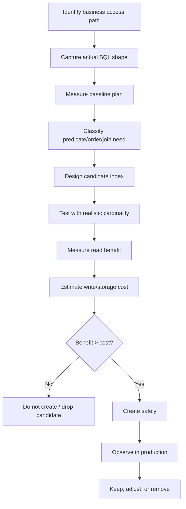

------
title: Learn PostgreSQL in Action - Part 015
description: Index selection strategy for PostgreSQL production systems: workload inventory, index budgets, composite vs separate indexes, partial indexes, covering indexes, redundant index cleanup, and migration-safe index governance for Java applications.
series: learn-postgresql-in-action
seriesTitle: Learn PostgreSQL in Action
order: 15
partTitle: Index Selection Strategy and Anti-Patterns
tags:
- postgresql
- database
- indexing
- performance
- query-planner
- java
- series
date: 2026-07-01
------

# Part 015 — Index Selection Strategy and Anti-Patterns

Part 013 and Part 014 explained how individual index families work. This part answers the question that matters in production:

> Given a real workload, which indexes should exist, which should not exist, and how do we prove that decision without guessing?

A top-tier PostgreSQL engineer does not create indexes because a query is slow. They create indexes because a specific access pattern is important enough to deserve a write, storage, vacuum, and operational cost.

Indexes are not free acceleration. They are additional data structures that must be maintained every time data changes. A good index portfolio is closer to a carefully governed API surface than a pile of performance patches.

---

## 1. What Problem This Solves

In mature systems, performance problems rarely come from having no indexes at all. They usually come from one of these states:

1. too many indexes created reactively;
2. redundant composite indexes;
3. indexes that no longer match the current query shape;
4. partial indexes that are invisible to parameterized queries;
5. covering indexes that improve reads but destroy write throughput;
6. ORM-generated SQL that prevents index usage;
7. missing foreign-key-side indexes causing lock and delete/update pain;
8. missing lifecycle-state indexes for queues, approvals, escalations, and case management flows;
9. migration-created indexes that block production writes;
10. indexes that optimize rare queries while slowing the critical path.

The goal is not “index every WHERE clause.” The goal is:

> Maintain the smallest set of indexes that preserves correctness constraints and supports the dominant business access paths under real concurrency.

---

## 2. Mental Model: Index Portfolio as an Engineering Budget

An index has four costs:

| Cost | Meaning | Typical Production Symptom |
|---|---|---|
| Write cost | Every insert/update/delete may need to update index entries | Slower writes, higher WAL volume, higher replication lag |
| Storage cost | Index pages consume disk and cache | Larger backups, slower restore, lower cache hit ratio |
| Planner cost | Planner must consider possible paths | More planning overhead on complex workloads |
| Operational cost | Index creation, rebuild, vacuum interaction, monitoring | Longer migrations, bloat, maintenance windows |

And it has three benefits:

| Benefit | Meaning |
|---|---|
| Access-path benefit | Finds rows faster for selective predicates |
| Ordering benefit | Avoids sort or supports keyset pagination |
| Constraint benefit | Enforces uniqueness or exclusion invariants |

The decision rule:

```txt
Create or keep an index only when its read/ordering/constraint value is greater than its write/storage/operational cost for the workload that matters.
```

This is why “unused index” is not automatically bad, and “frequently used index” is not automatically good. A unique index used rarely may still be essential because it enforces a business invariant. An index used frequently by a low-value background query may still be harmful if it slows all writes.

---

## 3. PostgreSQL Fact Base You Must Internalize

PostgreSQL documentation states the core trade-off directly: indexes can let the server find rows much faster than without an index, but they add overhead to the database system and should be used sensibly.

Partial indexes are indexes over only a subset of table rows, defined by a predicate. This can be powerful for lifecycle state queries, but the planner can use a partial index only when it can recognize that the query condition implies the index predicate. Parameterized clauses can fail to imply a partial-index predicate at planning time.

PostgreSQL can also combine multiple indexes through bitmap index scans. This lets it AND/OR bitmap results from multiple index scans, but the final heap visit happens in physical order, so the ordering from the original indexes is lost and a separate sort can be required.

These facts produce three practical rules:

1. prefer indexes aligned with stable access paths, not arbitrary columns;
2. do not treat partial indexes as magic filters;
3. do not rely on bitmap combination when query order, pagination, or latency predictability matters.

---

## 4. The Index Selection Loop

Use the same loop every time.



This loop prevents “index by instinct.” Every index should have a traceable reason:

```txt
Index: idx_case_active_owner_due
Reason: supports active case worklist query for enforcement officers.
Query: WHERE tenant_id = ? AND owner_id = ? AND state IN (...) ORDER BY due_at ASC, id ASC LIMIT ?
Expected result: index scan with bounded rows and no sort.
Cost accepted: extra write cost on state/due_at/owner_id changes.
Owner: case-management-service.
Review cadence: quarterly or after query shape change.
```

---

## 5. Workload Inventory Before Index Design

Before designing indexes, inventory the workload.

### 5.1 Classify queries by business path

Do not group by SQL text only. Group by the business reason the query exists.

| Business path | Example | Index implication |
|---|---|---|
| Identity lookup | Load entity by id | Usually primary key is enough |
| Tenant-scoped lookup | Load case by tenant + external ref | Composite unique/index likely |
| Worklist | Active cases assigned to officer ordered by due date | Composite + partial + order-sensitive index |
| State transition validation | Check if action is allowed | Constraint or selective lookup |
| Audit lookup | Entity history by entity id/time | Composite on `(entity_id, created_at)` |
| Reporting | Aggregate many rows by date/status | Maybe BRIN/partition/materialized view, not OLTP index explosion |
| Queue consumer | Find next pending jobs | Partial index + `FOR UPDATE SKIP LOCKED` shape |
| Foreign key maintenance | Delete/update parent | Index child FK columns |

### 5.2 Capture actual SQL

For Java services, capture SQL from:

1. `pg_stat_statements`;
2. slow query logs;
3. Hibernate SQL logging in controlled environments;
4. application traces with query fingerprints;
5. production incident snapshots.

Do not design indexes from repository method names. Design from actual SQL.

A method like this:

```java
List<CaseEntity> findTop50ByTenantIdAndStatusInOrderByDueAtAsc(UUID tenantId, List<Status> statuses);
```

may produce SQL that differs by ORM version, dialect, fetch graph, join fetch, pagination, or implicit filters. The index must match the SQL that PostgreSQL sees.

---

## 6. Access Pattern Anatomy

Every index decision starts by decomposing a query into four parts.

```sql
SELECT id, tenant_id, owner_id, state, due_at
FROM enforcement_case
WHERE tenant_id = $1
  AND owner_id = $2
  AND state IN ('OPEN', 'ESCALATED')
  AND archived_at IS NULL
ORDER BY due_at ASC, id ASC
LIMIT 50;
```

| Component | Example | Index design question |
|---|---|---|
| Equality predicates | `tenant_id = $1`, `owner_id = $2` | Should these be leading columns? |
| Range predicates | `due_at < now()` | Where should the range column appear? |
| Lifecycle predicate | `archived_at IS NULL` | Should this be partial? |
| Ordering | `ORDER BY due_at, id` | Can the index provide order? |
| Projection | selected columns | Should it be covering with `INCLUDE`? |

Candidate:

```sql
CREATE INDEX CONCURRENTLY idx_case_worklist_owner_due
ON enforcement_case (tenant_id, owner_id, state, due_at, id)
WHERE archived_at IS NULL;
```

But this is not automatically correct. If `state IN (...)` is low-cardinality and often broad, placing `state` before `due_at` may fragment ordering. If the common shape is “all active states ordered by due date,” this might be better:

```sql
CREATE INDEX CONCURRENTLY idx_case_worklist_owner_due_active
ON enforcement_case (tenant_id, owner_id, due_at, id)
WHERE archived_at IS NULL
  AND state IN ('OPEN', 'ESCALATED');
```

However, that partial predicate may not match if Java sends the states as bind parameters:

```sql
WHERE archived_at IS NULL AND state = ANY($3)
```

The right answer depends on actual query shape and whether the predicate is constant, parameterized, or generated dynamically.

---

## 7. Equality, Range, Order: The Practical Composite Index Rule

A useful default heuristic for B-tree composite indexes is:

```txt
Equality columns first, then range/order columns, then stable tie-breaker.
```

Example:

```sql
WHERE tenant_id = $1
  AND customer_id = $2
  AND created_at >= $3
ORDER BY created_at DESC, id DESC
LIMIT 100;
```

Candidate:

```sql
CREATE INDEX CONCURRENTLY idx_event_customer_created_desc
ON customer_event (tenant_id, customer_id, created_at DESC, id DESC);
```

Why:

1. `tenant_id` and `customer_id` narrow the search;
2. `created_at DESC, id DESC` supports the range and ordering;
3. `id` is a deterministic tie-breaker for pagination.

But there are exceptions:

| Situation | Better strategy |
|---|---|
| Many query shapes use only `customer_id` without `tenant_id` | Reconsider tenant model or add separate access path |
| `tenant_id` has very low selectivity but is mandatory for security | Keep it for boundary correctness and composite alignment |
| Sort order differs across queries | Avoid trying to satisfy every order with separate indexes |
| Query filters many lifecycle states | Consider partial index for active subset |
| Range predicate is not selective | Index may be useful mainly for order, not filtering |

---

## 8. Composite vs Separate Indexes

Assume these indexes:

```sql
CREATE INDEX idx_case_tenant ON enforcement_case (tenant_id);
CREATE INDEX idx_case_owner ON enforcement_case (owner_id);
```

And this query:

```sql
SELECT *
FROM enforcement_case
WHERE tenant_id = $1
  AND owner_id = $2;
```

PostgreSQL may combine separate indexes using a bitmap scan. But a composite index can often be more efficient:

```sql
CREATE INDEX idx_case_tenant_owner
ON enforcement_case (tenant_id, owner_id);
```

Decision matrix:

| Workload | Prefer |
|---|---|
| Frequent queries on `(tenant_id, owner_id)` together | Composite index |
| Frequent queries on `tenant_id` alone and `owner_id` alone | Separate indexes or carefully chosen composite + separate |
| Frequent queries on `(tenant_id, owner_id)` with ordering | Composite index including order columns |
| Ad hoc filters with many optional predicates | Separate indexes may help bitmap scans, but test carefully |
| Latency-sensitive top-N query | Composite order-aligned index |

A bitmap combination path loses index order. That matters for:

```sql
WHERE tenant_id = $1 AND owner_id = $2
ORDER BY due_at
LIMIT 50;
```

Two separate indexes may find matching row locations, but PostgreSQL may still need to sort. A composite index can both filter and provide order:

```sql
CREATE INDEX idx_case_tenant_owner_due
ON enforcement_case (tenant_id, owner_id, due_at, id);
```

---

## 9. Covering Indexes and `INCLUDE`

A covering index can allow an index-only scan when PostgreSQL can satisfy the query from index entries and visibility information.

Example:

```sql
SELECT id, state, due_at
FROM enforcement_case
WHERE tenant_id = $1
  AND owner_id = $2
ORDER BY due_at, id
LIMIT 50;
```

Candidate:

```sql
CREATE INDEX CONCURRENTLY idx_case_owner_due_cover
ON enforcement_case (tenant_id, owner_id, due_at, id)
INCLUDE (state);
```

Mental model:

```txt
Key columns decide navigation and order.
Included columns are payload.
```

Do not put everything into `INCLUDE` to avoid heap access. Large covering indexes can hurt:

1. insert throughput;
2. update throughput;
3. WAL volume;
4. cache residency;
5. vacuum and bloat behavior;
6. replica apply speed;
7. backup and restore size.

Use covering indexes for narrow, critical, high-frequency queries where avoiding heap visits is measurable.

### 9.1 Good covering index candidates

| Query type | Candidate |
|---|---|
| Small worklist card | Include display fields like `state`, `priority` |
| Authorization lookup | Include permission flags |
| Routing table lookup | Include target shard/region |
| Idempotency key lookup | Include response status or request hash |

### 9.2 Poor covering index candidates

| Query type | Why poor |
|---|---|
| Wide entity load | You are turning the index into a duplicate table |
| Frequently updated projection columns | Every update touches index payload |
| JSONB payload include | Large and unstable |
| Rare admin report | Not worth write cost |

---

## 10. Partial Indexes for Lifecycle Systems

Partial indexes are one of PostgreSQL’s strongest tools for workflow-heavy systems.

Most regulatory/case-management systems have lifecycle-state skew:

1. most cases are closed;
2. active cases are a minority;
3. user-facing queries mostly hit active cases;
4. historical cases are accessed by id, reference, or report windows.

Instead of indexing the whole table for active-worklist queries:

```sql
CREATE INDEX idx_case_owner_due_all
ON enforcement_case (tenant_id, owner_id, due_at, id);
```

use a partial index:

```sql
CREATE INDEX CONCURRENTLY idx_case_active_owner_due
ON enforcement_case (tenant_id, owner_id, due_at, id)
WHERE closed_at IS NULL;
```

This is often excellent because:

1. the index is smaller;
2. active queries scan fewer index pages;
3. closed rows stop participating in the index;
4. cache efficiency improves;
5. update cost for closed historical rows may drop.

But partial indexes are safe only when the predicate is stable and query-visible.

### 10.1 Good partial index predicates

```sql
WHERE deleted_at IS NULL
WHERE closed_at IS NULL
WHERE processed_at IS NULL
WHERE status = 'PENDING'
WHERE archived_at IS NULL AND tenant_id IS NOT NULL
```

### 10.2 Risky partial index predicates

```sql
WHERE created_at > now() - interval '30 days'
WHERE status = $1
WHERE score > $dynamic_threshold
WHERE tenant_id = $currentTenant
```

Problems:

1. volatile expressions are not appropriate index predicates;
2. parameterized conditions may not imply the partial predicate;
3. tenant-specific partial indexes do not scale;
4. dynamic thresholds drift;
5. too many non-overlapping partial indexes become a partitioning smell.

### 10.3 Partial unique indexes as invariants

Partial unique indexes are not just performance tools. They can enforce state-specific business rules.

Example: only one active assignment per case.

```sql
CREATE UNIQUE INDEX uq_case_active_assignment
ON case_assignment (case_id)
WHERE revoked_at IS NULL;
```

This is stronger than application code because concurrent transactions cannot silently violate it.

Java implication:

```java
try {
    assignmentRepository.assign(caseId, officerId);
} catch (DataIntegrityViolationException ex) {
    throw new CaseAlreadyAssignedException(caseId, ex);
}
```

The database enforces the invariant; the application maps the violation to a domain outcome.

---

## 11. Expression Indexes vs Generated Columns

Expression index:

```sql
CREATE INDEX idx_user_lower_email
ON app_user (lower(email));
```

Query must match the expression:

```sql
SELECT *
FROM app_user
WHERE lower(email) = lower($1);
```

Generated column alternative:

```sql
ALTER TABLE app_user
ADD COLUMN email_norm text
GENERATED ALWAYS AS (lower(email)) STORED;

CREATE UNIQUE INDEX uq_user_email_norm
ON app_user (email_norm);
```

Decision matrix:

| Option | Use when |
|---|---|
| Expression index | Expression is simple, local, and only needed for indexing |
| Generated column | Normalized value is part of the domain model or queried often |
| Application-computed column | Expression must use app-specific logic or external library |
| Domain/type | You need stronger reusable semantic constraints |

For Java teams, generated columns can improve readability because application queries use a named column instead of repeating expression SQL. However, generated columns become part of schema contract and migration lifecycle.

---

## 12. Foreign Key Indexes: The Hidden Production Requirement

PostgreSQL automatically creates indexes for primary keys and unique constraints. It does not automatically create an index on the referencing side of every foreign key.

Example:

```sql
CREATE TABLE parent_case (
    id uuid PRIMARY KEY
);

CREATE TABLE case_note (
    id uuid PRIMARY KEY,
    case_id uuid NOT NULL REFERENCES parent_case(id),
    body text NOT NULL
);
```

The child table should usually have:

```sql
CREATE INDEX idx_case_note_case_id
ON case_note (case_id);
```

Why this matters:

1. deleting/updating a parent needs to check referencing rows;
2. joins from parent to child need the child access path;
3. missing FK-side indexes can cause lock waits and table scans;
4. ORM cascades can become unpredictable under load.

Composite FK example:

```sql
CREATE INDEX idx_case_event_case_revision
ON case_event (case_id, revision_no);
```

Do not blindly create FK indexes for tiny/static tables, but in OLTP systems with non-trivial child tables, missing FK-side indexes are a common production smell.

---

## 13. Indexes for State Machines and Escalation Logic

Workflow systems usually have queries like:

```sql
SELECT id
FROM enforcement_case
WHERE tenant_id = $1
  AND state IN ('OPEN', 'UNDER_REVIEW', 'ESCALATED')
  AND next_action_at <= now()
  AND locked_by IS NULL
ORDER BY priority DESC, next_action_at ASC, id ASC
LIMIT 100;
```

Naive index:

```sql
CREATE INDEX idx_case_state
ON enforcement_case (state);
```

Better candidate:

```sql
CREATE INDEX CONCURRENTLY idx_case_due_work
ON enforcement_case (
    tenant_id,
    priority DESC,
    next_action_at ASC,
    id ASC
)
WHERE state IN ('OPEN', 'UNDER_REVIEW', 'ESCALATED')
  AND locked_by IS NULL;
```

But test this carefully. The best key order depends on whether `tenant_id`, `state`, `priority`, or `next_action_at` provides useful selectivity and whether the order matters more than the filter.

The worklist invariant is:

```txt
The query must find the next N actionable items without scanning the historical lifecycle tail.
```

That invariant usually points to partial indexes on active states.

---

## 14. Indexes for Job Queues and `SKIP LOCKED`

A PostgreSQL-backed queue often uses:

```sql
WITH next_job AS (
    SELECT id
    FROM background_job
    WHERE status = 'PENDING'
      AND run_at <= now()
    ORDER BY priority DESC, run_at ASC, id ASC
    FOR UPDATE SKIP LOCKED
    LIMIT 1
)
UPDATE background_job j
SET status = 'RUNNING', locked_at = now()
FROM next_job
WHERE j.id = next_job.id
RETURNING j.*;
```

Candidate:

```sql
CREATE INDEX CONCURRENTLY idx_job_pending_run_order
ON background_job (priority DESC, run_at ASC, id ASC)
WHERE status = 'PENDING';
```

Key idea:

1. partial predicate removes completed jobs;
2. key columns support ordering;
3. stable `id` tie-breaker avoids unstable pagination/selection;
4. `SKIP LOCKED` allows concurrent workers to avoid waiting on already locked rows.

Failure modes:

1. queue table grows forever;
2. completed jobs remain in hot heap pages;
3. autovacuum cannot keep up;
4. partial index is excellent but heap bloat still hurts;
5. too many workers create contention on the same top priority rows.

Indexing is only one part of queue design. You still need retention, partitioning or archival, worker backoff, and metrics.

---

## 15. Redundant Index Detection

Redundancy is subtle. This pair is often redundant for many workloads:

```sql
CREATE INDEX idx_case_tenant ON enforcement_case (tenant_id);
CREATE INDEX idx_case_tenant_owner ON enforcement_case (tenant_id, owner_id);
```

The second index can support queries filtering only `tenant_id`, because `tenant_id` is the leading column. But the first index may still be useful if:

1. it is much smaller;
2. it supports a hot simple lookup;
3. the composite index has low cache residency;
4. write cost is acceptable;
5. the planner chooses the smaller index for count/existence checks.

This pair is not equivalent:

```sql
CREATE INDEX idx_case_tenant_owner ON enforcement_case (tenant_id, owner_id);
CREATE INDEX idx_case_owner_tenant ON enforcement_case (owner_id, tenant_id);
```

Column order changes which access paths are efficient.

### 15.1 Candidate redundant index query

```sql
SELECT
    schemaname,
    relname AS table_name,
    indexrelname AS index_name,
    idx_scan,
    idx_tup_read,
    idx_tup_fetch
FROM pg_stat_user_indexes
ORDER BY idx_scan ASC, relname, indexrelname;
```

This query finds indexes with low scan counts, but do not drop based only on this. Check:

1. whether the index backs a constraint;
2. whether the index is used by rare but critical paths;
3. whether stats reset recently;
4. whether the workload is seasonal;
5. whether the index supports disaster/debug/admin operations;
6. whether the index supports replica/reporting queries not seen on primary.

### 15.2 Constraint-backed index check

```sql
SELECT
    n.nspname AS schema_name,
    c.relname AS table_name,
    i.relname AS index_name,
    con.conname AS constraint_name,
    con.contype AS constraint_type
FROM pg_class i
JOIN pg_index ix ON ix.indexrelid = i.oid
JOIN pg_class c ON c.oid = ix.indrelid
JOIN pg_namespace n ON n.oid = c.relnamespace
LEFT JOIN pg_constraint con ON con.conindid = i.oid
WHERE i.relkind = 'i'
ORDER BY schema_name, table_name, index_name;
```

Never drop a constraint-backed index without understanding the constraint it enforces.

---

## 16. Index Governance for Java Services

Treat indexes as owned artifacts.

```txt
Every non-trivial index should have:
- owner service/team;
- supported query fingerprint;
- expected plan shape;
- accepted write cost;
- creation migration;
- rollback/drop migration;
- production verification query;
- review trigger.
```

Example migration comment:

```sql
CREATE INDEX CONCURRENTLY idx_case_worklist_owner_due
ON enforcement_case (tenant_id, owner_id, due_at, id)
WHERE closed_at IS NULL;

COMMENT ON INDEX idx_case_worklist_owner_due IS
'Supports case-management-service active owner worklist: tenant_id + owner_id ordered by due_at/id where closed_at is null. Review if worklist query changes.';
```

A comment is not a substitute for docs, but it helps future engineers avoid accidental deletion or duplication.

---

## 17. Migration-Safe Index Creation

On production tables, prefer concurrent index creation unless you intentionally schedule write blocking.

```sql
CREATE INDEX CONCURRENTLY idx_case_created_at
ON enforcement_case (created_at);
```

Important constraints:

1. `CREATE INDEX CONCURRENTLY` cannot run inside a normal transaction block;
2. it takes longer than regular index creation;
3. failure can leave invalid indexes that must be cleaned up;
4. unique concurrent indexes need careful duplicate prechecks;
5. migration tools may wrap statements in transactions by default.

Flyway-style approach:

```txt
V20260701_001__create_case_worklist_index.sql
-- configure this migration as non-transactional if using CREATE INDEX CONCURRENTLY
```

Precheck for unique index:

```sql
SELECT tenant_id, external_ref, count(*)
FROM enforcement_case
GROUP BY tenant_id, external_ref
HAVING count(*) > 1
LIMIT 50;
```

Then:

```sql
CREATE UNIQUE INDEX CONCURRENTLY uq_case_tenant_external_ref
ON enforcement_case (tenant_id, external_ref);
```

If you need a named table constraint after creating the unique index:

```sql
ALTER TABLE enforcement_case
ADD CONSTRAINT uq_case_tenant_external_ref
UNIQUE USING INDEX uq_case_tenant_external_ref;
```

Check locking impact in staging using realistic load, not an empty database.

---

## 18. The Index Review Dashboard

A practical review combines stats from index usage, table writes, relation size, and query fingerprints.

### 18.1 Index size

```sql
SELECT
    n.nspname AS schema_name,
    c.relname AS table_name,
    i.relname AS index_name,
    pg_size_pretty(pg_relation_size(i.oid)) AS index_size,
    pg_relation_size(i.oid) AS index_size_bytes
FROM pg_class i
JOIN pg_index ix ON ix.indexrelid = i.oid
JOIN pg_class c ON c.oid = ix.indrelid
JOIN pg_namespace n ON n.oid = c.relnamespace
WHERE i.relkind = 'i'
  AND n.nspname NOT IN ('pg_catalog', 'information_schema')
ORDER BY pg_relation_size(i.oid) DESC
LIMIT 50;
```

### 18.2 Write-heavy tables

```sql
SELECT
    schemaname,
    relname,
    n_tup_ins,
    n_tup_upd,
    n_tup_del,
    n_tup_hot_upd,
    n_live_tup,
    n_dead_tup
FROM pg_stat_user_tables
ORDER BY (n_tup_ins + n_tup_upd + n_tup_del) DESC
LIMIT 50;
```

### 18.3 Index-to-table ratio

```sql
SELECT
    n.nspname AS schema_name,
    c.relname AS table_name,
    pg_size_pretty(pg_relation_size(c.oid)) AS table_size,
    pg_size_pretty(pg_indexes_size(c.oid)) AS total_index_size,
    round(pg_indexes_size(c.oid)::numeric / nullif(pg_relation_size(c.oid), 0), 2) AS index_table_ratio
FROM pg_class c
JOIN pg_namespace n ON n.oid = c.relnamespace
WHERE c.relkind = 'r'
  AND n.nspname NOT IN ('pg_catalog', 'information_schema')
ORDER BY pg_indexes_size(c.oid) DESC
LIMIT 50;
```

High ratio is not always bad. A narrow lookup table with multiple unique access paths may have more index bytes than heap bytes. But a high ratio on a write-heavy event table deserves review.

---

## 19. Anti-Patterns

### 19.1 Indexing every foreign key, every status, every timestamp blindly

Bad:

```sql
CREATE INDEX idx_case_status ON enforcement_case (status);
CREATE INDEX idx_case_created_at ON enforcement_case (created_at);
CREATE INDEX idx_case_updated_at ON enforcement_case (updated_at);
CREATE INDEX idx_case_owner_id ON enforcement_case (owner_id);
```

This is schema-decoration indexing. It does not encode access paths.

Better:

```sql
CREATE INDEX idx_case_owner_active_due
ON enforcement_case (tenant_id, owner_id, due_at, id)
WHERE closed_at IS NULL;
```

### 19.2 Low-cardinality standalone indexes

A standalone index on `status` is often weak when status has only a few common values:

```sql
CREATE INDEX idx_case_status ON enforcement_case (status);
```

Better use status as part of a composite index or partial predicate when aligned with a workload.

### 19.3 Indexes that fight ORM query shape

Index:

```sql
CREATE INDEX idx_user_email_norm ON app_user (lower(email));
```

ORM query:

```sql
WHERE email = ?
```

The expression index does not help. The SQL shape must match the access path.

### 19.4 Partial index with non-matching predicate

Index:

```sql
CREATE INDEX idx_case_open_due
ON enforcement_case (due_at)
WHERE state = 'OPEN';
```

Query:

```sql
WHERE state = $1 AND due_at <= $2
```

The planner may not be able to prove that `$1` always equals `'OPEN'` at planning time. Use exact query shape, generated constant SQL for hot paths, or a non-partial composite index.

### 19.5 Too many partial indexes instead of partitioning

Bad:

```sql
CREATE INDEX idx_event_2025 ON audit_event (created_at) WHERE created_at >= '2025-01-01' AND created_at < '2026-01-01';
CREATE INDEX idx_event_2026 ON audit_event (created_at) WHERE created_at >= '2026-01-01' AND created_at < '2027-01-01';
```

If the table is naturally time-sliced and large, partitioning may be a better architecture.

### 19.6 Indexing to compensate for unbounded queries

Bad:

```sql
SELECT *
FROM audit_event
WHERE tenant_id = $1
ORDER BY created_at DESC;
```

Without `LIMIT`, this can still be huge. An index cannot fix an unbounded API contract.

Better:

```sql
SELECT id, event_type, created_at
FROM audit_event
WHERE tenant_id = $1
ORDER BY created_at DESC, id DESC
LIMIT 100;
```

### 19.7 Missing deterministic tie-breaker

Bad:

```sql
ORDER BY created_at DESC
LIMIT 100;
```

Better:

```sql
ORDER BY created_at DESC, id DESC
LIMIT 100;
```

Candidate:

```sql
CREATE INDEX idx_event_tenant_created_id_desc
ON audit_event (tenant_id, created_at DESC, id DESC);
```

---

## 20. Index Strategy by Table Archetype

### 20.1 Entity table

Example: `customer`, `case`, `account`.

Typical indexes:

1. primary key;
2. tenant + external reference unique;
3. active worklist composite/partial;
4. maybe normalized natural-key lookup.

Avoid:

1. standalone indexes for every attribute;
2. wide covering indexes for full entity loads;
3. ungoverned search indexes.

### 20.2 Event/audit table

Example: `case_event`, `audit_log`.

Typical indexes:

1. `(aggregate_id, sequence_no)` unique;
2. `(aggregate_id, created_at, id)` lookup;
3. BRIN or partition-local indexes for time scans;
4. retention/archival strategy.

Avoid:

1. many mutable indexes;
2. broad GIN on arbitrary JSONB unless justified;
3. OLTP table doubling as analytics warehouse without boundaries.

### 20.3 Queue table

Example: `background_job`, `outbox_event`.

Typical indexes:

1. partial pending index ordered by run time/priority;
2. idempotency unique key;
3. retention index if cleanup is frequent.

Avoid:

1. leaving completed rows forever;
2. indexing every status;
3. ignoring autovacuum and bloat.

### 20.4 Join table

Example: `user_role`, `case_tag`.

Typical indexes:

1. unique `(left_id, right_id)`;
2. reverse index `(right_id, left_id)` if reverse lookup is common.

Avoid:

1. duplicate single-column indexes if composite leading column already covers the path;
2. missing reverse path when needed.

### 20.5 Multi-tenant table

Almost all business indexes should consider tenant boundary:

```sql
CREATE INDEX idx_case_tenant_ref
ON enforcement_case (tenant_id, external_ref);
```

If tenant_id is omitted accidentally, queries may work in development and fail under production cardinality.

---

## 21. Java-Specific Index Implications

### 21.1 Repository method shape is not an index contract

This:

```java
findByTenantIdAndOwnerIdAndClosedAtIsNullOrderByDueAtAsc(...)
```

is not the contract. The contract is the SQL emitted under the actual Hibernate dialect and runtime configuration.

### 21.2 Bind parameters and partial indexes

Java almost always uses bind parameters. That is good for safety and plan reuse, but it can reduce planner ability to prove partial-index predicates.

For extremely hot paths, consider dedicated SQL with constant lifecycle predicates:

```sql
WHERE closed_at IS NULL
```

not dynamic generic filters such as:

```sql
WHERE ($1::boolean IS FALSE OR closed_at IS NULL)
```

### 21.3 Pool pressure hides bad index decisions

A missing or bad index does not just slow one query. It can:

1. hold connections longer;
2. exhaust Hikari pool;
3. increase lock duration;
4. increase heap and index buffer churn;
5. cause timeout cascades;
6. amplify retry storms.

Index review belongs in application performance review, not only database administration.

---

## 22. Hands-On Lab

Use the lab from Part 002.

### 22.1 Create workload table

```sql
DROP TABLE IF EXISTS lab_case;

CREATE TABLE lab_case (
    id bigserial PRIMARY KEY,
    tenant_id int NOT NULL,
    owner_id int NOT NULL,
    state text NOT NULL,
    priority int NOT NULL,
    due_at timestamptz NOT NULL,
    closed_at timestamptz,
    external_ref text NOT NULL,
    payload jsonb NOT NULL DEFAULT '{}'::jsonb
);
```

### 22.2 Load skewed lifecycle data

```sql
INSERT INTO lab_case (
    tenant_id, owner_id, state, priority, due_at, closed_at, external_ref, payload
)
SELECT
    (random() * 20)::int + 1,
    (random() * 500)::int + 1,
    CASE
        WHEN gs % 20 = 0 THEN 'ESCALATED'
        WHEN gs % 10 = 0 THEN 'OPEN'
        ELSE 'CLOSED'
    END,
    (random() * 5)::int + 1,
    now() + ((random() * 60 - 30) || ' days')::interval,
    CASE WHEN gs % 10 = 0 OR gs % 20 = 0 THEN NULL ELSE now() - ((random() * 365) || ' days')::interval END,
    'CASE-' || gs,
    jsonb_build_object('region', 'R' || ((random() * 10)::int + 1))
FROM generate_series(1, 1000000) gs;

ANALYZE lab_case;
```

### 22.3 Baseline worklist query

```sql
EXPLAIN (ANALYZE, BUFFERS)
SELECT id, tenant_id, owner_id, state, priority, due_at
FROM lab_case
WHERE tenant_id = 5
  AND owner_id = 100
  AND closed_at IS NULL
ORDER BY priority DESC, due_at ASC, id ASC
LIMIT 50;
```

### 22.4 Add bad standalone indexes

```sql
CREATE INDEX idx_lab_case_tenant ON lab_case (tenant_id);
CREATE INDEX idx_lab_case_owner ON lab_case (owner_id);
CREATE INDEX idx_lab_case_closed ON lab_case (closed_at);

ANALYZE lab_case;
```

Run the plan again. Observe whether PostgreSQL uses bitmap scans and whether a sort remains.

### 22.5 Add workload-aligned partial index

```sql
CREATE INDEX idx_lab_case_worklist
ON lab_case (tenant_id, owner_id, priority DESC, due_at ASC, id ASC)
WHERE closed_at IS NULL;

ANALYZE lab_case;
```

Run the plan again.

Expected improvement:

1. fewer rows scanned;
2. fewer buffers read;
3. no separate sort or smaller sort;
4. lower execution time;
5. more predictable latency.

### 22.6 Measure write overhead

```sql
EXPLAIN (ANALYZE, BUFFERS)
UPDATE lab_case
SET priority = priority + 1
WHERE id BETWEEN 10000 AND 20000;
```

Compare before and after multiple indexes. More indexes usually mean more update work, especially when indexed columns change.

### 22.7 Detect unused/redundant candidates

```sql
SELECT
    indexrelname,
    idx_scan,
    idx_tup_read,
    idx_tup_fetch
FROM pg_stat_user_indexes
WHERE relname = 'lab_case'
ORDER BY idx_scan ASC;
```

Then inspect index sizes:

```sql
SELECT
    indexrelid::regclass AS index_name,
    pg_size_pretty(pg_relation_size(indexrelid)) AS index_size
FROM pg_index
WHERE indrelid = 'lab_case'::regclass
ORDER BY pg_relation_size(indexrelid) DESC;
```

---

## 23. Review Checklist

Before creating an index:

```txt
[ ] Which exact SQL query or constraint does this index support?
[ ] Is this query frequent, latency-sensitive, correctness-critical, or merely convenient?
[ ] What is the expected plan shape?
[ ] Does the index support filtering, ordering, uniqueness, or covering?
[ ] Is a composite index better than separate indexes?
[ ] Is a partial index safe with the actual query shape?
[ ] Are bind parameters preventing predicate implication?
[ ] Is the table write-heavy?
[ ] Are indexed columns frequently updated?
[ ] Is there already a leading-prefix-equivalent index?
[ ] Does this duplicate a constraint-backed index?
[ ] Can it be created concurrently?
[ ] How will we verify production usage?
[ ] What is the rollback/drop plan?
```

Before dropping an index:

```txt
[ ] Is it backing a primary key, unique, exclusion, or other constraint?
[ ] Were stats reset recently?
[ ] Is the workload seasonal?
[ ] Is it used only on read replicas?
[ ] Does it support rare incident/debug operations?
[ ] Does it support FK maintenance?
[ ] Have we tested plan changes in staging?
[ ] Can we drop concurrently?
[ ] Do we have monitoring after drop?
```

---

## 24. Production Heuristics

1. Every index must justify itself.
2. Indexes should be designed from query shape, not column names.
3. Composite indexes encode access paths.
4. Partial indexes encode lifecycle skew.
5. Unique indexes encode invariants.
6. Covering indexes encode latency trade-offs.
7. GIN/GiST/BRIN encode specialized search patterns, not generic speed.
8. Too many indexes slow writes and amplify WAL.
9. Missing FK-side indexes create hidden operational pain.
10. Index review should be part of schema review, migration review, and incident review.

---

## 25. Self-Correction Questions

Use these to test whether you really understand index strategy.

1. Why is `(tenant_id, owner_id, due_at)` not equivalent to `(owner_id, tenant_id, due_at)`?
2. When can a partial index be invisible to a prepared statement?
3. Why can bitmap index combination still require a sort?
4. Why might an unused unique index still be required?
5. Why can a covering index reduce read latency but increase replication lag?
6. Why is a standalone `status` index often weak?
7. When is `CREATE INDEX CONCURRENTLY` necessary?
8. Why are many non-overlapping partial indexes a partitioning smell?
9. How can an ORM query change invalidate an existing index?
10. How do you prove that an index is beneficial after deployment?

---

## 26. Summary

Index selection is not a syntax skill. It is workload engineering.

A PostgreSQL index portfolio should be:

1. small enough to preserve write performance;
2. rich enough to support critical read paths;
3. explicit enough to enforce invariants;
4. observable enough to review safely;
5. stable enough to survive ORM and application evolution.

The highest-value index is not the one that makes one query fastest in isolation. It is the one that improves the system’s critical path while keeping write cost, storage cost, operational risk, and schema complexity under control.

In the next part, we move one layer up: query shape engineering. Many “missing index” problems are really SQL-shape problems. The planner can only optimize the query you send, not the intent you had in your application code.

---

## References

- PostgreSQL 18 Documentation — Chapter 11, Indexes: https://www.postgresql.org/docs/current/indexes.html
- PostgreSQL 18 Documentation — Partial Indexes: https://www.postgresql.org/docs/current/indexes-partial.html
- PostgreSQL 18 Documentation — Combining Multiple Indexes: https://www.postgresql.org/docs/current/indexes-bitmap-scans.html
- PostgreSQL 18 Documentation — Index-Only Scans and Covering Indexes: https://www.postgresql.org/docs/current/indexes-index-only-scans.html
- PostgreSQL 18 Documentation — CREATE INDEX: https://www.postgresql.org/docs/current/sql-createindex.html
- PostgreSQL 18 Documentation — Monitoring Statistics: https://www.postgresql.org/docs/current/monitoring-stats.html
