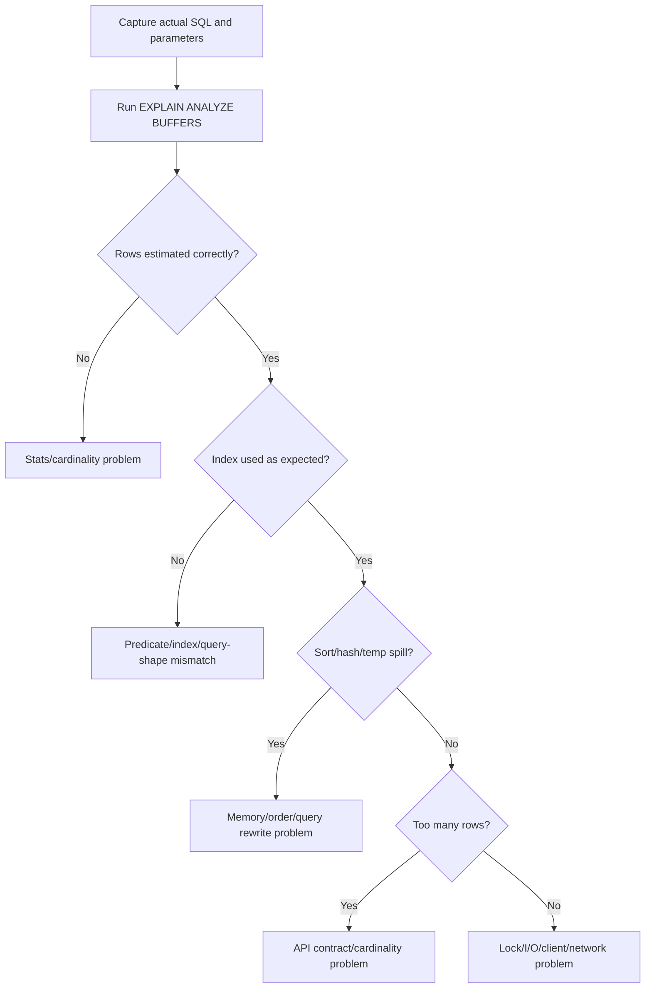

------
title: Learn PostgreSQL in Action - Part 016
description: Query shape engineering for PostgreSQL: sargability, predicate design, CTE materialization, EXISTS, IN, LATERAL, pagination, batching, optional filters, JSONB predicates, and Java/Hibernate query patterns that help or hurt the planner.
series: learn-postgresql-in-action
seriesTitle: Learn PostgreSQL in Action
order: 16
partTitle: Query Shape Engineering
tags:
- postgresql
- database
- sql
- query-planner
- performance
- java
- hibernate
- series
date: 2026-07-01
------

# Part 016 — Query Shape Engineering

A slow PostgreSQL query is not always missing an index. Often the index exists, the data model is acceptable, and the problem is the SQL shape.

The planner optimizes the statement it receives, not the repository method name, not the domain intent, and not the diagram in the architecture document.

This part focuses on engineering SQL shapes that allow PostgreSQL to use good plans predictably.

---

## 1. What Problem This Solves

A query can be logically correct but physically hostile.

Examples:

```sql
WHERE lower(email) = lower($1)
```

may be fine if an expression index exists, but bad otherwise.

```sql
WHERE ($1 IS NULL OR owner_id = $1)
```

is convenient for dynamic filters, but can make selectivity hard and plan choice unstable.

```sql
ORDER BY created_at DESC
OFFSET 500000
LIMIT 50
```

is syntactically simple, but operationally expensive.

```sql
WITH x AS (...)
SELECT ... FROM x JOIN x ...
```

may materialize or not depending on the shape, references, and explicit `MATERIALIZED` / `NOT MATERIALIZED` choice.

Query shape engineering is the skill of writing SQL so the planner can see the useful constraints, indexes, ordering, and cardinality boundaries.

---

## 2. Mental Model: SQL as a Physical Request

Application developers often think of SQL as a declarative description of desired rows.

For performance work, think of SQL as a physical request with these questions:

```txt
1. Which rows are eligible?
2. Can eligibility be tested through an index?
3. How many rows will probably pass?
4. Does the query require order?
5. Can the order come from an index?
6. Can the query stop early?
7. Does the query force materialization, sorting, hashing, or repeated work?
8. Does the query force per-row correlated execution?
9. Does the query return more columns than needed?
10. Does the query shape remain stable across bind values?
```

Good SQL gives the planner useful structure.

Bad SQL hides structure behind functions, casts, OR conditions, dynamic filters, unbounded sorting, wide projection, or ORM-generated accidental joins.

---

## 3. The Planner Can Only Use What the Query Exposes

The following two queries can be logically similar but physically different.

Bad for a normal index on `created_at`:

```sql
SELECT *
FROM case_event
WHERE date(created_at) = date '2026-07-01';
```

Better:

```sql
SELECT *
FROM case_event
WHERE created_at >= timestamptz '2026-07-01 00:00:00+07'
  AND created_at <  timestamptz '2026-07-02 00:00:00+07';
```

The second shape lets PostgreSQL use a B-tree range scan on `created_at`.

Core principle:

```txt
Keep indexed columns visible and unwrapped on the side PostgreSQL needs to navigate.
```

---

## 4. Sargability in PostgreSQL Terms

“Sargable” means the predicate can use an index search argument effectively.

PostgreSQL does not use the term as centrally as some systems, but the idea applies.

### 4.1 Function-wrapped column

Bad unless expression index exists:

```sql
WHERE lower(email) = lower($1)
```

Better with normalized column:

```sql
WHERE email_norm = lower($1)
```

or with expression index:

```sql
CREATE INDEX idx_user_lower_email
ON app_user (lower(email));
```

### 4.2 Cast on column

Bad:

```sql
WHERE order_id::text = $1
```

Better:

```sql
WHERE order_id = $1::uuid
```

Cast the parameter, not the indexed column.

### 4.3 Arithmetic on column

Bad:

```sql
WHERE amount_cents / 100 > 1000
```

Better:

```sql
WHERE amount_cents > 100000
```

### 4.4 Date extraction

Bad:

```sql
WHERE extract(year from created_at) = 2026
```

Better:

```sql
WHERE created_at >= timestamptz '2026-01-01 00:00:00+00'
  AND created_at <  timestamptz '2027-01-01 00:00:00+00'
```

### 4.5 Leading wildcard

Bad for normal B-tree:

```sql
WHERE name LIKE '%bank%'
```

Better options:

1. prefix search: `name LIKE 'bank%'` with suitable operator class/collation strategy;
2. trigram index for contains search;
3. full-text search for language-aware search;
4. external search engine when ranking/faceting/linguistics dominate.

---

## 5. Predicate Shape Patterns

### 5.1 Equality + range

Good:

```sql
WHERE tenant_id = $1
  AND customer_id = $2
  AND created_at >= $3
  AND created_at < $4
ORDER BY created_at DESC, id DESC
LIMIT 100;
```

Index:

```sql
CREATE INDEX idx_event_customer_created_desc
ON customer_event (tenant_id, customer_id, created_at DESC, id DESC);
```

### 5.2 Optional filters

Convenient but dangerous:

```sql
WHERE ($1::uuid IS NULL OR owner_id = $1)
  AND ($2::text IS NULL OR state = $2)
```

This single generic query represents several different physical access paths:

1. no owner, no state;
2. owner only;
3. state only;
4. owner and state.

A single plan may be bad for some combinations.

Better for hot paths: generate distinct SQL shapes.

```sql
-- shape 1: owner worklist
WHERE tenant_id = $1
  AND owner_id = $2
  AND closed_at IS NULL
ORDER BY due_at, id
LIMIT $3;

-- shape 2: tenant active worklist
WHERE tenant_id = $1
  AND closed_at IS NULL
ORDER BY due_at, id
LIMIT $2;
```

This lets each query have an index and stable plan.

### 5.3 Dynamic search endpoints

Do not let a single search endpoint generate arbitrary WHERE clauses against an OLTP table and then “solve it with indexes.”

Use tiers:

| Search type | Recommended path |
|---|---|
| Primary lookup | Exact index-backed query |
| Worklist/filter screen | Bounded set of supported query shapes |
| Admin search | Separate read model or limited indexes |
| Analytics | Warehouse/materialized view/replica path |
| Fuzzy text search | Full-text/trigram/search service |

---

## 6. `OR` Conditions and Rewrites

`OR` can be valid and PostgreSQL can sometimes combine indexes using bitmap OR. But `OR` often causes broader scans, lost ordering, or unstable plans.

Example:

```sql
SELECT id, created_at
FROM case_event
WHERE tenant_id = $1
  AND (case_id = $2 OR actor_id = $3)
ORDER BY created_at DESC
LIMIT 100;
```

Possible rewrite:

```sql
(
    SELECT id, created_at
    FROM case_event
    WHERE tenant_id = $1
      AND case_id = $2
    ORDER BY created_at DESC
    LIMIT 100
)
UNION ALL
(
    SELECT id, created_at
    FROM case_event
    WHERE tenant_id = $1
      AND actor_id = $3
    ORDER BY created_at DESC
    LIMIT 100
)
ORDER BY created_at DESC
LIMIT 100;
```

This can let each branch use a specific index.

But this rewrite changes duplicate behavior. If the same row can match both branches, use `UNION` or deduplicate explicitly:

```sql
SELECT DISTINCT ON (id) id, created_at
FROM (
    ...
) s
ORDER BY id, created_at DESC;
```

Then re-apply final ordering if needed.

Rule:

```txt
Rewrite OR only when you preserve semantics and improve access paths measurably.
```

---

## 7. `IN`, `ANY`, and Large Lists

Small list:

```sql
WHERE state IN ('OPEN', 'ESCALATED')
```

Usually fine.

Parameterized array:

```sql
WHERE state = ANY($1)
```

Also common, but watch partial-index implication and cardinality estimation.

Large list:

```sql
WHERE id IN (... thousands of ids ...)
```

Potential issues:

1. huge SQL text if literals are expanded;
2. poor plan choices depending on list size;
3. parameter limit or driver overhead;
4. unstable latency.

Better options:

1. pass array and use `= ANY($1)` for moderate lists;
2. load ids into a temporary table and join;
3. use a staging table for batch processing;
4. chunk intentionally at application boundary.

Temp table pattern:

```sql
CREATE TEMP TABLE tmp_target_id (
    id uuid PRIMARY KEY
) ON COMMIT DROP;

-- bulk insert ids via JDBC batch or COPY

SELECT c.*
FROM enforcement_case c
JOIN tmp_target_id t ON t.id = c.id;
```

For large batch operations, a temp table makes the data visible to the planner as a relation rather than a giant predicate blob.

---

## 8. `NOT IN`, `NULL`, and Anti-Joins

This can be semantically dangerous:

```sql
WHERE id NOT IN (SELECT case_id FROM blocked_case)
```

If the subquery can return `NULL`, SQL three-valued logic can produce surprising results.

Safer common pattern:

```sql
WHERE NOT EXISTS (
    SELECT 1
    FROM blocked_case b
    WHERE b.case_id = c.id
)
```

For PostgreSQL, `NOT EXISTS` often maps naturally to anti-join strategies.

Guideline:

1. use `EXISTS` / `NOT EXISTS` for existence semantics;
2. use joins when returning columns from both sides;
3. use `IN` for small clear membership lists;
4. be explicit about `NULL` semantics.

---

## 9. `EXISTS` vs `JOIN` for Existence

Bad if you only need existence:

```sql
SELECT c.*
FROM enforcement_case c
JOIN case_attachment a ON a.case_id = c.id
WHERE c.tenant_id = $1;
```

This can duplicate case rows if multiple attachments exist.

Better:

```sql
SELECT c.*
FROM enforcement_case c
WHERE c.tenant_id = $1
  AND EXISTS (
      SELECT 1
      FROM case_attachment a
      WHERE a.case_id = c.id
  );
```

This encodes intent: return cases for which at least one attachment exists.

Index:

```sql
CREATE INDEX idx_attachment_case_id
ON case_attachment (case_id);
```

---

## 10. `LATERAL` for Top-N Per Group

Problem: get the latest event for each active case.

Bad pattern:

```sql
SELECT c.id, e.id, e.created_at
FROM enforcement_case c
JOIN case_event e ON e.case_id = c.id
WHERE c.closed_at IS NULL
ORDER BY e.created_at DESC;
```

This can explode rows before filtering.

`LATERAL` pattern:

```sql
SELECT c.id AS case_id,
       latest_event.id AS event_id,
       latest_event.created_at
FROM enforcement_case c
LEFT JOIN LATERAL (
    SELECT e.id, e.created_at
    FROM case_event e
    WHERE e.case_id = c.id
    ORDER BY e.created_at DESC, e.id DESC
    LIMIT 1
) latest_event ON true
WHERE c.closed_at IS NULL
LIMIT 100;
```

Index:

```sql
CREATE INDEX idx_case_event_case_created_desc
ON case_event (case_id, created_at DESC, id DESC);
```

Mental model:

```txt
For each outer row, run a bounded index-backed inner lookup.
```

This works well when the outer row count is bounded. It can be bad if the outer relation is huge. Always check `EXPLAIN (ANALYZE, BUFFERS)`.

---

## 11. CTE Materialization and Optimization Boundaries

CTEs are useful for readability, recursion, data-modifying statements, and intentional materialization. But they are not always free.

PostgreSQL can fold a side-effect-free non-recursive CTE into the parent query when referenced once. If referenced more than once, it may be materialized by default. PostgreSQL lets you force the choice using `MATERIALIZED` or `NOT MATERIALIZED`.

### 11.1 Good CTE for readability

```sql
WITH active_case AS (
    SELECT id, tenant_id, owner_id
    FROM enforcement_case
    WHERE tenant_id = $1
      AND closed_at IS NULL
)
SELECT *
FROM active_case
WHERE owner_id = $2;
```

If folded, this may behave like a normal query.

### 11.2 Dangerous repeated CTE

```sql
WITH active_case AS (
    SELECT *
    FROM enforcement_case
    WHERE tenant_id = $1
      AND closed_at IS NULL
)
SELECT *
FROM active_case a1
JOIN active_case a2 ON a2.parent_case_id = a1.id;
```

This may materialize a large intermediate result.

### 11.3 Force merge when appropriate

```sql
WITH active_case AS NOT MATERIALIZED (
    SELECT *
    FROM enforcement_case
    WHERE tenant_id = $1
      AND closed_at IS NULL
)
SELECT *
FROM active_case a1
JOIN active_case a2 ON a2.parent_case_id = a1.id;
```

### 11.4 Force materialization when appropriate

```sql
WITH expensive AS MATERIALIZED (
    SELECT id, expensive_stable_function(payload) AS score
    FROM enforcement_case
    WHERE tenant_id = $1
)
SELECT *
FROM expensive e1
JOIN expensive e2 ON e1.score = e2.score;
```

Rule:

```txt
Use CTEs intentionally: readability, recursion, data modification, or materialization control. Do not assume they are always optimized away.
```

---

## 12. Pagination: Offset vs Keyset

### 12.1 Offset pagination

```sql
SELECT id, created_at
FROM case_event
WHERE tenant_id = $1
ORDER BY created_at DESC, id DESC
OFFSET 500000
LIMIT 50;
```

Problem:

1. PostgreSQL still has to walk past many rows;
2. latency grows with page depth;
3. concurrent inserts/deletes can shift pages;
4. user experience often does not require arbitrary deep page jumps.

### 12.2 Keyset pagination

First page:

```sql
SELECT id, created_at
FROM case_event
WHERE tenant_id = $1
ORDER BY created_at DESC, id DESC
LIMIT 50;
```

Next page:

```sql
SELECT id, created_at
FROM case_event
WHERE tenant_id = $1
  AND (created_at, id) < ($2, $3)
ORDER BY created_at DESC, id DESC
LIMIT 50;
```

Index:

```sql
CREATE INDEX idx_event_tenant_created_id_desc
ON case_event (tenant_id, created_at DESC, id DESC);
```

Keyset pagination is not always suitable. It does not support “jump to page 500” naturally. But for timelines, audit logs, work queues, notifications, and event streams, it is usually the right production shape.

---

## 13. `ORDER BY` Without Determinism

Bad:

```sql
ORDER BY created_at DESC
LIMIT 50;
```

If many rows share the same timestamp, order is not deterministic.

Better:

```sql
ORDER BY created_at DESC, id DESC
LIMIT 50;
```

This also supports keyset pagination.

Rule:

```txt
Every paginated query should have a deterministic ORDER BY with a stable tie-breaker.
```

---

## 14. Projection Shape: Stop Selecting Full Entities

Bad for list screens:

```sql
SELECT *
FROM enforcement_case
WHERE tenant_id = $1
  AND closed_at IS NULL
ORDER BY due_at
LIMIT 50;
```

Better:

```sql
SELECT id, external_ref, state, priority, due_at
FROM enforcement_case
WHERE tenant_id = $1
  AND closed_at IS NULL
ORDER BY due_at, id
LIMIT 50;
```

Why:

1. less heap data read;
2. less network transfer;
3. less Java object allocation;
4. easier covering index design;
5. fewer accidental TOAST reads;
6. less pressure on serialization.

In Hibernate, use DTO projection for list views:

```java
public record CaseWorklistRow(
    UUID id,
    String externalRef,
    String state,
    Instant dueAt
) {}
```

Do not load full aggregate roots for simple worklist cards.

---

## 15. Counting Patterns

### 15.1 Exact count on huge filtered set

```sql
SELECT count(*)
FROM audit_event
WHERE tenant_id = $1;
```

This can be expensive because PostgreSQL must count visible rows matching the predicate.

Alternatives:

| Need | Better approach |
|---|---|
| Display “many results” | Avoid exact count |
| Paginated UI | Fetch `limit + 1` to detect next page |
| Dashboard | Pre-aggregate/materialized view |
| Approximate admin insight | Use estimates carefully |
| Compliance report | Exact count in batch/reporting path |

### 15.2 `exists` instead of count

Bad:

```sql
SELECT count(*) > 0
FROM case_attachment
WHERE case_id = $1;
```

Better:

```sql
SELECT EXISTS (
    SELECT 1
    FROM case_attachment
    WHERE case_id = $1
);
```

The latter can stop when the first matching row is found.

---

## 16. Update and Delete Shape

Bad unbounded update:

```sql
UPDATE case_event
SET archived = true
WHERE created_at < now() - interval '2 years';
```

This can create massive WAL, locks, bloat, replication lag, and autovacuum pressure.

Better batch shape:

```sql
WITH batch AS (
    SELECT id
    FROM case_event
    WHERE created_at < now() - interval '2 years'
      AND archived = false
    ORDER BY created_at, id
    LIMIT 5000
)
UPDATE case_event e
SET archived = true
FROM batch
WHERE e.id = batch.id;
```

Repeat from application or job runner with backoff and metrics.

For deletes:

```sql
WITH batch AS (
    SELECT id
    FROM case_event
    WHERE created_at < $1
    ORDER BY created_at, id
    LIMIT 5000
)
DELETE FROM case_event e
USING batch
WHERE e.id = batch.id;
```

But if retention is the dominant operation, partitioning may be better than batch deletes.

---

## 17. JSONB Query Shape

Bad if you need frequent filtering:

```sql
WHERE payload->>'region' = $1
```

Options:

### 17.1 Expression index

```sql
CREATE INDEX idx_case_payload_region
ON enforcement_case ((payload->>'region'));
```

Query:

```sql
WHERE payload->>'region' = $1
```

### 17.2 Generated column

```sql
ALTER TABLE enforcement_case
ADD COLUMN region text
GENERATED ALWAYS AS (payload->>'region') STORED;

CREATE INDEX idx_case_region
ON enforcement_case (tenant_id, region);
```

Query:

```sql
WHERE tenant_id = $1
  AND region = $2
```

### 17.3 GIN containment

```sql
CREATE INDEX idx_case_payload_gin
ON enforcement_case USING gin (payload jsonb_path_ops);
```

Query:

```sql
WHERE payload @> '{"region":"R1"}'::jsonb
```

Decision:

| Shape | Use when |
|---|---|
| Expression index | One or two stable extracted fields |
| Generated column | Field has domain meaning and frequent queries |
| GIN containment | Flexible containment search over JSONB |
| Relational column | Field is core to filtering, joining, constraints, or lifecycle |

Do not use JSONB to avoid schema design when the field is actually part of the query contract.

---

## 18. Prepared Statements, Generic Plans, and Skew

Java applications use prepared statements heavily. This is usually good.

But some queries are highly sensitive to parameter values.

Example:

```sql
WHERE tenant_id = $1
```

If tenant sizes are extremely skewed, the best plan for a tiny tenant may differ from the best plan for a huge tenant.

Another example:

```sql
WHERE state = $1
```

`state = 'OPEN'` may be rare while `state = 'CLOSED'` may be common.

Potential symptoms:

1. query fast for some tenants, slow for others;
2. plan changes after repeated executions;
3. generic plan chosen where custom plan would be better;
4. partial index not used with bind parameters;
5. stable staging plan but unstable production plan due to skew.

Mitigations:

1. use better composite indexes aligned with tenant and lifecycle;
2. avoid over-generic dynamic query shapes for hot paths;
3. separate rare-state and common-state queries when necessary;
4. inspect plans with representative parameter values;
5. understand pgJDBC server-side prepare behavior;
6. use `EXPLAIN (ANALYZE, BUFFERS)` on realistic data.

---

## 19. Hibernate/JPA Query Shape Failure Modes

### 19.1 N+1 is not only a query count problem

N+1 also destroys access-path locality:

```txt
1 query loads 100 cases.
100 queries load notes by case_id.
```

Even if each note query uses an index, total overhead can dominate.

Better options:

1. DTO projection;
2. batch fetching;
3. explicit query for needed child rows;
4. `EXISTS` for presence checks;
5. limited `LATERAL` query for top child row.

### 19.2 Fetch join with pagination

A fetch join over a collection plus pagination can produce unexpected SQL and duplicate rows.

Bad conceptual shape:

```java
@Query("select c from Case c join fetch c.notes where c.tenantId = :tenantId")
Page<Case> findCases(...);
```

Better:

1. page parent ids first;
2. fetch details for those ids;
3. use DTO read model for list screens.

### 19.3 Case-insensitive search without normalized contract

Bad:

```java
where lower(u.email) = lower(:email)
```

Better:

1. normalized column;
2. expression index;
3. PostgreSQL `citext` if its semantics fit;
4. clear application-level normalization policy.

### 19.4 Optional filters in one repository query

Bad:

```java
@Query("""
select c from Case c
where c.tenantId = :tenantId
  and (:ownerId is null or c.ownerId = :ownerId)
  and (:state is null or c.state = :state)
""")
```

Better for hot screens:

1. define supported query shapes;
2. generate different SQL for each shape;
3. keep indexes aligned with those shapes;
4. route ad hoc search elsewhere.

---

## 20. Query Shape Review Template

For each important query, record:

```txt
Name:
Business path:
Frequency:
Latency target:
Rows expected:
Worst-case tenant/cardinality:
SQL text:
Parameters:
Required ordering:
Pagination strategy:
Indexes expected:
Expected plan nodes:
Failure modes:
Fallback:
Owner:
```

Example:

```txt
Name: active-owner-worklist
Business path: officer opens work queue
Frequency: high
Latency target: p95 < 100 ms
Rows expected: 50 returned, < 500 scanned
Worst-case tenant/cardinality: tenant 7 has 4M cases, 120k active
SQL text: tenant_id + owner_id + closed_at is null order by due_at,id limit 50
Parameters: tenant_id, owner_id, limit
Required ordering: due_at asc, id asc
Pagination strategy: keyset
Indexes expected: idx_case_owner_active_due
Expected plan nodes: Index Scan using idx_case_owner_active_due, no Sort
Failure modes: owner filter optional, state filter introduced, due_at nullable
Fallback: route broad search to search endpoint/read model
Owner: case-management-service
```

---

## 21. Hands-On Lab

Use the `lab_case` table from Part 015 or create it again.

### 21.1 Sargability test

Create index:

```sql
CREATE INDEX idx_lab_case_due
ON lab_case (due_at);

ANALYZE lab_case;
```

Bad shape:

```sql
EXPLAIN (ANALYZE, BUFFERS)
SELECT count(*)
FROM lab_case
WHERE date(due_at) = current_date;
```

Better shape:

```sql
EXPLAIN (ANALYZE, BUFFERS)
SELECT count(*)
FROM lab_case
WHERE due_at >= date_trunc('day', now())
  AND due_at <  date_trunc('day', now()) + interval '1 day';
```

Observe index usage and buffer difference.

### 21.2 Offset vs keyset

Index:

```sql
CREATE INDEX idx_lab_case_tenant_due_id
ON lab_case (tenant_id, due_at DESC, id DESC);
```

Offset:

```sql
EXPLAIN (ANALYZE, BUFFERS)
SELECT id, due_at
FROM lab_case
WHERE tenant_id = 5
ORDER BY due_at DESC, id DESC
OFFSET 50000
LIMIT 50;
```

Keyset:

```sql
EXPLAIN (ANALYZE, BUFFERS)
SELECT id, due_at
FROM lab_case
WHERE tenant_id = 5
  AND (due_at, id) < (now(), 900000)
ORDER BY due_at DESC, id DESC
LIMIT 50;
```

Observe whether page depth affects latency.

### 21.3 Optional filter shape

Generic:

```sql
EXPLAIN (ANALYZE, BUFFERS)
SELECT id, tenant_id, owner_id, due_at
FROM lab_case
WHERE tenant_id = 5
  AND (100 IS NULL OR owner_id = 100)
  AND closed_at IS NULL
ORDER BY due_at, id
LIMIT 50;
```

Specific:

```sql
EXPLAIN (ANALYZE, BUFFERS)
SELECT id, tenant_id, owner_id, due_at
FROM lab_case
WHERE tenant_id = 5
  AND owner_id = 100
  AND closed_at IS NULL
ORDER BY due_at, id
LIMIT 50;
```

Compare plan stability.

### 21.4 CTE materialization

```sql
EXPLAIN (ANALYZE, BUFFERS)
WITH active_case AS MATERIALIZED (
    SELECT *
    FROM lab_case
    WHERE closed_at IS NULL
)
SELECT id, due_at
FROM active_case
WHERE tenant_id = 5
ORDER BY due_at, id
LIMIT 50;
```

Then:

```sql
EXPLAIN (ANALYZE, BUFFERS)
WITH active_case AS NOT MATERIALIZED (
    SELECT *
    FROM lab_case
    WHERE closed_at IS NULL
)
SELECT id, due_at
FROM active_case
WHERE tenant_id = 5
ORDER BY due_at, id
LIMIT 50;
```

Observe whether filters can be pushed down and indexes used.

---

## 22. Production Diagnostic Workflow

When a query is slow:



Do not jump directly to `CREATE INDEX`. First identify whether the problem is:

1. bad cardinality estimate;
2. bad predicate shape;
3. missing access path;
4. unbounded result;
5. sort/hash spill;
6. lock wait;
7. client-side fetch/serialization;
8. connection pool starvation;
9. data skew;
10. stale stats.

---

## 23. Query Shape Anti-Patterns

### 23.1 `SELECT *` for list endpoints

Use DTO projection.

### 23.2 Function-wrapped indexed columns

Use range predicates, normalized columns, generated columns, or expression indexes.

### 23.3 Deep offset pagination

Use keyset pagination for timelines and worklists.

### 23.4 One generic query for every screen filter

Use stable query shapes for hot paths.

### 23.5 Missing deterministic order

Always include a stable tie-breaker.

### 23.6 Counting when existence is enough

Use `EXISTS`.

### 23.7 Joining when existence is enough

Use `EXISTS` to avoid duplicate multiplication.

### 23.8 Unbounded update/delete

Batch, partition, or archive intentionally.

### 23.9 JSONB everywhere

Promote frequently queried fields to relational/generated columns.

### 23.10 Querying production OLTP as analytics warehouse

Separate OLTP paths from reporting paths.

---

## 24. Engineering Heuristics

1. Make hot queries boring and explicit.
2. Use separate SQL shapes for materially different access paths.
3. Keep indexed columns visible in predicates.
4. Cast parameters, not columns.
5. Avoid deep offset for large ordered sets.
6. Encode existence as `EXISTS`.
7. Encode top-N per parent with bounded `LATERAL` when appropriate.
8. Use CTE materialization intentionally.
9. Treat JSONB query fields as schema once they become operationally important.
10. Test with production-like cardinality and skew.

---

## 25. Self-Correction Questions

1. Why can `date(created_at) = current_date` block normal B-tree range usage?
2. Why is keyset pagination usually better than deep offset for event streams?
3. When can an `OR` rewrite to `UNION ALL` improve performance?
4. What semantic risk does `UNION ALL` introduce?
5. Why is `NOT EXISTS` usually safer than `NOT IN` when nulls are possible?
6. When should a CTE be `MATERIALIZED`?
7. When should a CTE be `NOT MATERIALIZED`?
8. Why can optional filter queries produce unstable plans?
9. Why does `SELECT *` hurt more than network bandwidth?
10. How can Hibernate generate SQL that defeats an otherwise good index?

---

## 26. Summary

Query shape engineering is the bridge between application intent and PostgreSQL execution.

Good query shape:

1. exposes selective predicates;
2. matches available indexes;
3. preserves deterministic ordering;
4. allows early stop with `LIMIT`;
5. avoids unnecessary materialization;
6. avoids row explosion;
7. separates hot paths from ad hoc paths;
8. respects cardinality and skew;
9. returns only needed columns;
10. remains stable under Java parameter binding and ORM behavior.

A top-tier PostgreSQL engineer does not ask only, “What index do we need?” They ask:

```txt
What exact SQL shape should this business access path have so PostgreSQL can execute it predictably under production data, concurrency, and latency constraints?
```

The next part moves deeper into execution behavior: join strategies. Once you understand query shape, the next skill is reading how PostgreSQL chooses nested loop, hash join, merge join, and how those choices fail under skew, bad statistics, or memory pressure.

---

## References

- PostgreSQL 18 Documentation — WITH Queries / CTE Materialization: https://www.postgresql.org/docs/current/queries-with.html
- PostgreSQL 18 Documentation — Indexes: https://www.postgresql.org/docs/current/indexes.html
- PostgreSQL 18 Documentation — Combining Multiple Indexes: https://www.postgresql.org/docs/current/indexes-bitmap-scans.html
- PostgreSQL 18 Documentation — EXPLAIN: https://www.postgresql.org/docs/current/sql-explain.html
- PostgreSQL 18 Documentation — Query Planning: https://www.postgresql.org/docs/current/planner-optimizer.html
- PostgreSQL 18 Documentation — JSON Types: https://www.postgresql.org/docs/current/datatype-json.html
