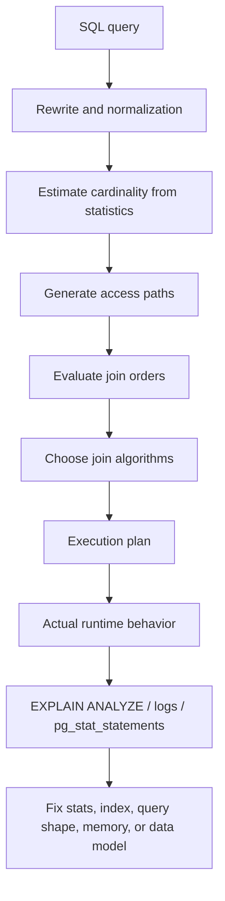
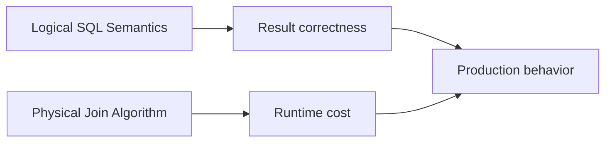
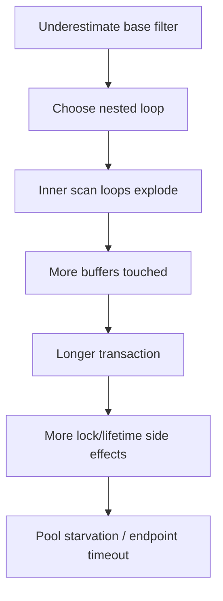
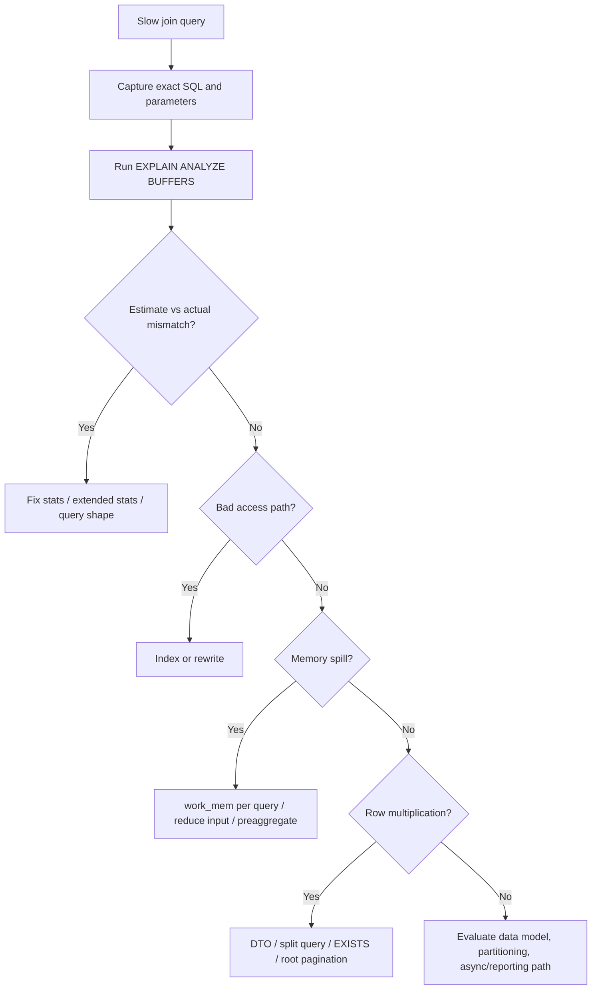

------
title: Learn PostgreSQL in Action - Part 017
description: Join strategies and execution behavior in PostgreSQL: nested loop, hash join, merge join, join order, join cardinality, skew, memory pressure, outer joins, semi/anti joins, Java ORM implications, and production diagnostics.
series: learn-postgresql-in-action
seriesTitle: Learn PostgreSQL in Action
order: 17
partTitle: Join Strategies and Execution Behavior
tags:
- postgresql
- database
- sql
- query-planner
- joins
- performance
- java
- hibernate
- series
date: 2026-07-01
------

# Part 017 — Join Strategies and Execution Behavior

A join is where relational elegance meets physical cost.

At the SQL level, a join is a logical relationship between rows. At the PostgreSQL execution level, a join is a concrete algorithm with memory, CPU, I/O, ordering, and cardinality consequences.

A top-tier engineer does not merely ask:

> “Is this join correct?”

They ask:

> “What row counts does PostgreSQL believe? Which join algorithm did it choose? Which side is outer/inner? Does the chosen plan still hold under real data distribution, parameter values, concurrency, memory pressure, and ORM-generated query shape?”

This part builds the mental model for answering those questions.

---

## 1. What Problem This Solves

Join problems usually show up as one of these symptoms:

- one endpoint is fast for small customers but times out for large customers;
- a report query suddenly shifts from milliseconds to minutes after data growth;
- a Hibernate fetch join produces massive row multiplication;
- a query looks indexed but still scans millions of rows;
- `EXPLAIN` shows a `Nested Loop` where the inner side runs hundreds of thousands of times;
- `Hash Join` spills to temp files;
- `Merge Join` appears with unexpected sort steps;
- the planner underestimates rows by 100x or 10,000x;
- production has high CPU, high temp I/O, or lock wait amplification from long joins.

The immediate question is rarely “which join is best?”

The better question is:

> “Which join strategy is appropriate for this cardinality, access path, ordering, and memory envelope?”

---

## 2. Kaufman Skill Deconstruction

Following Josh Kaufman's skill-acquisition approach, we break join mastery into small sub-skills that can be practiced independently.

| Sub-skill | You should be able to do this quickly |
|---|---|
| Join semantics | Distinguish logical join type from physical join algorithm. |
| Cardinality reading | Compare estimated rows vs actual rows at every join node. |
| Join algorithm recognition | Explain why PostgreSQL chose nested loop, hash join, or merge join. |
| Inner/outer side reasoning | Identify repeated scans, build side, probe side, and sort side. |
| Memory diagnosis | Detect hash batch spill, sort spill, and temp-file pressure. |
| ORM query review | Spot row multiplication and dangerous fetch joins before production. |
| Statistics repair | Know when `ANALYZE`, extended statistics, or query rewrite is the right fix. |
| Workload shaping | Choose indexes and query shape that make the intended join cheap. |

The fastest way to learn joins is not memorizing definitions. It is repeatedly taking a plan, predicting the execution behavior, then checking your prediction with `EXPLAIN (ANALYZE, BUFFERS)`.

---

## 3. Core Mental Model

A join plan is PostgreSQL's answer to four questions:

1. **How many rows will each input produce?**
2. **How can those rows be accessed?**
3. **Which algorithm combines them cheapest?**
4. **What intermediate shape is produced for the next operator?**



The important point:

> The planner chooses from estimated reality. The executor suffers actual reality.

When estimated and actual cardinality diverge, join choices degrade.

---

## 4. Logical Join Type vs Physical Join Algorithm

These are different dimensions.

Logical SQL join types include:

- `INNER JOIN`
- `LEFT JOIN`
- `RIGHT JOIN`
- `FULL JOIN`
- `CROSS JOIN`
- semi-join style via `EXISTS`
- anti-join style via `NOT EXISTS`

Physical algorithms include:

- `Nested Loop`
- `Hash Join`
- `Merge Join`

A `LEFT JOIN` can be executed using a hash join. An `INNER JOIN` can be executed using a nested loop. A `NOT EXISTS` can become an anti join.

Keep these separate:



A query can be logically perfect and physically disastrous.

---

## 5. Baseline Lab Schema

Use this schema to practice the examples in this part.

```sql
CREATE SCHEMA IF NOT EXISTS join_lab;
SET search_path = join_lab, public;

DROP TABLE IF EXISTS payment CASCADE;
DROP TABLE IF EXISTS invoice CASCADE;
DROP TABLE IF EXISTS case_event CASCADE;
DROP TABLE IF EXISTS enforcement_case CASCADE;
DROP TABLE IF EXISTS officer CASCADE;
DROP TABLE IF EXISTS regulated_entity CASCADE;

CREATE TABLE regulated_entity (
    id              bigserial PRIMARY KEY,
    registration_no text NOT NULL UNIQUE,
    legal_name      text NOT NULL,
    risk_tier       text NOT NULL CHECK (risk_tier IN ('LOW', 'MEDIUM', 'HIGH', 'CRITICAL')),
    region_code     text NOT NULL,
    created_at      timestamptz NOT NULL DEFAULT now()
);

CREATE TABLE officer (
    id          bigserial PRIMARY KEY,
    email       text NOT NULL UNIQUE,
    team_code   text NOT NULL,
    active      boolean NOT NULL DEFAULT true
);

CREATE TABLE enforcement_case (
    id                  bigserial PRIMARY KEY,
    regulated_entity_id bigint NOT NULL REFERENCES regulated_entity(id),
    assigned_officer_id bigint REFERENCES officer(id),
    lifecycle_state     text NOT NULL CHECK (lifecycle_state IN ('OPEN', 'ESCALATED', 'HEARING', 'CLOSED')),
    severity            int NOT NULL CHECK (severity BETWEEN 1 AND 5),
    opened_at           timestamptz NOT NULL,
    closed_at           timestamptz
);

CREATE TABLE case_event (
    id          bigserial PRIMARY KEY,
    case_id     bigint NOT NULL REFERENCES enforcement_case(id),
    event_type  text NOT NULL,
    actor_id    bigint REFERENCES officer(id),
    occurred_at timestamptz NOT NULL,
    payload     jsonb NOT NULL DEFAULT '{}'::jsonb
);

CREATE TABLE invoice (
    id          bigserial PRIMARY KEY,
    case_id     bigint NOT NULL REFERENCES enforcement_case(id),
    status      text NOT NULL CHECK (status IN ('DRAFT', 'ISSUED', 'PAID', 'VOID')),
    amount_cents bigint NOT NULL,
    issued_at   timestamptz NOT NULL
);

CREATE TABLE payment (
    id          bigserial PRIMARY KEY,
    invoice_id  bigint NOT NULL REFERENCES invoice(id),
    amount_cents bigint NOT NULL,
    paid_at     timestamptz NOT NULL
);
```

Indexes for baseline workloads:

```sql
CREATE INDEX idx_case_entity ON enforcement_case (regulated_entity_id);
CREATE INDEX idx_case_officer ON enforcement_case (assigned_officer_id);
CREATE INDEX idx_case_state_opened ON enforcement_case (lifecycle_state, opened_at DESC);
CREATE INDEX idx_event_case_occurred ON case_event (case_id, occurred_at DESC);
CREATE INDEX idx_invoice_case_status ON invoice (case_id, status);
CREATE INDEX idx_payment_invoice ON payment (invoice_id);
```

Seed representative data:

```sql
INSERT INTO regulated_entity (registration_no, legal_name, risk_tier, region_code)
SELECT
    'REG-' || gs,
    'Entity ' || gs,
    CASE
        WHEN gs % 100 = 0 THEN 'CRITICAL'
        WHEN gs % 10 = 0 THEN 'HIGH'
        WHEN gs % 3 = 0 THEN 'MEDIUM'
        ELSE 'LOW'
    END,
    'R' || (gs % 20)
FROM generate_series(1, 100000) AS gs;

INSERT INTO officer (email, team_code, active)
SELECT
    'officer' || gs || '@example.test',
    'TEAM-' || (gs % 25),
    gs % 20 <> 0
FROM generate_series(1, 2000) AS gs;

INSERT INTO enforcement_case (
    regulated_entity_id,
    assigned_officer_id,
    lifecycle_state,
    severity,
    opened_at,
    closed_at
)
SELECT
    (random() * 99999 + 1)::bigint,
    (random() * 1999 + 1)::bigint,
    CASE
        WHEN gs % 20 = 0 THEN 'ESCALATED'
        WHEN gs % 7 = 0 THEN 'HEARING'
        WHEN gs % 5 = 0 THEN 'CLOSED'
        ELSE 'OPEN'
    END,
    (random() * 4 + 1)::int,
    now() - ((random() * 365)::int || ' days')::interval,
    CASE WHEN gs % 5 = 0 THEN now() - ((random() * 30)::int || ' days')::interval END
FROM generate_series(1, 500000) AS gs;

INSERT INTO case_event (case_id, event_type, actor_id, occurred_at, payload)
SELECT
    (random() * 499999 + 1)::bigint,
    CASE
        WHEN gs % 11 = 0 THEN 'ESCALATED'
        WHEN gs % 5 = 0 THEN 'COMMENTED'
        WHEN gs % 3 = 0 THEN 'ASSIGNED'
        ELSE 'UPDATED'
    END,
    (random() * 1999 + 1)::bigint,
    now() - ((random() * 365)::int || ' days')::interval,
    jsonb_build_object('seq', gs)
FROM generate_series(1, 2000000) AS gs;

INSERT INTO invoice (case_id, status, amount_cents, issued_at)
SELECT
    (random() * 499999 + 1)::bigint,
    CASE
        WHEN gs % 10 = 0 THEN 'VOID'
        WHEN gs % 4 = 0 THEN 'PAID'
        WHEN gs % 3 = 0 THEN 'DRAFT'
        ELSE 'ISSUED'
    END,
    (random() * 1000000 + 10000)::bigint,
    now() - ((random() * 180)::int || ' days')::interval
FROM generate_series(1, 800000) AS gs;

INSERT INTO payment (invoice_id, amount_cents, paid_at)
SELECT
    i.id,
    i.amount_cents,
    i.issued_at + ((random() * 20)::int || ' days')::interval
FROM invoice i
WHERE i.status = 'PAID';

ANALYZE join_lab.regulated_entity;
ANALYZE join_lab.officer;
ANALYZE join_lab.enforcement_case;
ANALYZE join_lab.case_event;
ANALYZE join_lab.invoice;
ANALYZE join_lab.payment;
```

This dataset is intentionally skewed enough to produce interesting plans.

---

## 6. Nested Loop Join

A nested loop join iterates over rows from one input and repeatedly probes the other input.

Conceptually:

```text
for each row in outer_input:
    find matching rows in inner_input
```

PostgreSQL plan shape:

```text
Nested Loop
  -> outer plan
  -> inner plan
```

The inner plan is executed once per outer row, unless optimized through caching-like executor behavior such as `Memoize` in applicable parameterized nested loop cases.

### 6.1 When Nested Loop Is Good

Nested loop is usually good when:

- outer input is small;
- inner input can be accessed cheaply through an index;
- the join condition is highly selective;
- the query has `LIMIT` and can stop early;
- the plan needs to preserve order;
- the query is OLTP-style lookup rather than broad analytics.

Example:

```sql
EXPLAIN (ANALYZE, BUFFERS)
SELECT c.id, c.lifecycle_state, e.legal_name
FROM enforcement_case c
JOIN regulated_entity e ON e.id = c.regulated_entity_id
WHERE c.lifecycle_state = 'ESCALATED'
ORDER BY c.opened_at DESC
LIMIT 50;
```

With `idx_case_state_opened`, PostgreSQL may read a small number of case rows and then perform indexed primary-key lookups into `regulated_entity`.

That is a healthy nested loop.

### 6.2 When Nested Loop Is Dangerous

Nested loop becomes dangerous when the outer input is large and the inner side is not cheap.

The classic bad plan:

```text
Nested Loop
  -> Seq Scan on large_table_a  actual rows=500000
  -> Seq Scan on large_table_b  actual rows=800000 loops=500000
```

This means PostgreSQL may be scanning the inner relation many times.

The important `EXPLAIN` field is `loops`.

Example warning sign:

```text
Index Scan using idx_event_case_occurred on case_event e
  Index Cond: (case_id = c.id)
  actual rows=8 loops=500000
```

Even if each loop is individually cheap, 500,000 loops can dominate latency.

### 6.3 Nested Loop Checklist

When you see `Nested Loop`, ask:

1. How many actual rows are produced by the outer side?
2. How many loops does the inner node execute?
3. Is the inner side an index scan, index-only scan, or repeated sequential scan?
4. Does the inner side return 0 or 1 row most of the time, or many rows?
5. Is the plan relying on a parameterized index lookup?
6. Is the outer row count underestimated?
7. Is this query under `LIMIT`, or does it need the full result set?

Nested loop is not bad. Unbounded nested loop is bad.

---

## 7. Hash Join

A hash join builds a hash table from one input and probes it with rows from the other input.

Conceptually:

```text
build hash table from smaller/build input
for each row in probe input:
    lookup matching key in hash table
```

Plan shape:

```text
Hash Join
  Hash Cond: (c.regulated_entity_id = e.id)
  -> probe side
  -> Hash
       -> build side
```

The `Hash` child is the build side.

### 7.1 When Hash Join Is Good

Hash join is usually good when:

- both inputs are medium/large;
- equality join condition exists;
- no useful order is required from inputs;
- indexes are not selective enough;
- scanning and hashing is cheaper than repeated index probes.

Example:

```sql
EXPLAIN (ANALYZE, BUFFERS)
SELECT e.region_code, count(*)
FROM enforcement_case c
JOIN regulated_entity e ON e.id = c.regulated_entity_id
WHERE c.opened_at >= now() - interval '180 days'
GROUP BY e.region_code;
```

If many case rows qualify, PostgreSQL may prefer scanning both relations and hashing one side.

### 7.2 Hash Join Memory Pressure

Hash join needs memory for the build hash table. If it does not fit, PostgreSQL batches and spills work to temporary files.

In `EXPLAIN`, look for:

```text
Hash
  Buckets: 262144  Batches: 8  Memory Usage: 4096kB
```

`Batches: 1` is usually healthy. Multiple batches means the hash table did not fit in memory and was partitioned.

Symptoms:

- high temp file I/O;
- `temp read` / `temp written` in `EXPLAIN (BUFFERS)`;
- high `temp_blks_read` or `temp_blks_written` in `pg_stat_statements`;
- slower query under concurrency because many sessions spill simultaneously.

### 7.3 Hash Join Checklist

When you see `Hash Join`, ask:

1. Which side is being hashed?
2. Is the build side actually smaller?
3. Are actual rows much higher than estimated rows?
4. Are there multiple hash batches?
5. Is `work_mem` appropriate for this query class?
6. Is the join key skewed?
7. Would an index-driven nested loop be better for selective OLTP access?
8. Would pre-filtering or pre-aggregation reduce the build/probe input?

---

## 8. Merge Join

A merge join joins two sorted inputs by walking through them in order.

Conceptually:

```text
sort input A by join key
sort input B by join key
walk both streams and match equal keys
```

Plan shape:

```text
Merge Join
  Merge Cond: (c.regulated_entity_id = e.id)
  -> sorted input A
  -> sorted input B
```

The inputs may already be sorted by indexes, or PostgreSQL may add explicit `Sort` nodes.

### 8.1 When Merge Join Is Good

Merge join is usually good when:

- both inputs are already ordered on the join key;
- the query needs ordered output;
- the join involves a large number of rows;
- hash join memory pressure would be high;
- inequality-like mergeable conditions or ordered streams matter.

Example:

```sql
EXPLAIN (ANALYZE, BUFFERS)
SELECT c.id, i.id, i.amount_cents
FROM enforcement_case c
JOIN invoice i ON i.case_id = c.id
ORDER BY c.id, i.id;
```

If indexes provide the needed order, a merge join can avoid extra sort cost.

### 8.2 When Merge Join Is Expensive

Merge join can be expensive when PostgreSQL must sort large inputs first:

```text
Merge Join
  -> Sort
       Sort Key: c.id
       Sort Method: external merge  Disk: 204800kB
  -> Sort
       Sort Key: i.case_id
       Sort Method: external merge  Disk: 512000kB
```

This is not merely a join problem. It is also a sorting and memory problem.

### 8.3 Merge Join Checklist

When you see `Merge Join`, ask:

1. Are the inputs already ordered by index?
2. Did PostgreSQL add large `Sort` nodes?
3. Did sort spill to disk?
4. Is output ordering needed anyway?
5. Would a hash join avoid unnecessary sorting?
6. Would a composite index provide both filtering and ordering?

---

## 9. Join Algorithm Comparison

| Strategy | Core idea | Strong when | Weak when |
|---|---|---|---|
| Nested Loop | Repeat inner lookup per outer row | Small outer, indexed inner, selective OLTP | Large outer, non-selective inner, bad estimates |
| Hash Join | Hash one input, probe with another | Large equality joins, no useful order needed | Build side too large, memory spill, skew |
| Merge Join | Walk sorted inputs | Inputs already sorted, large ordered joins | Requires large sort, sort spills, no useful order |

There is no universally best join algorithm.

The correct engineering posture is:

> Make the desired physical strategy naturally cheap for the planner.

You usually do that through schema design, indexes, statistics, query shape, and memory configuration—not by forcing planner settings.

---

## 10. Join Order Is Often More Important Than Join Algorithm

For a query with many tables, PostgreSQL must choose not only join algorithms but join order.

Example:

```sql
SELECT c.id, e.legal_name, o.email, i.amount_cents, p.paid_at
FROM enforcement_case c
JOIN regulated_entity e ON e.id = c.regulated_entity_id
JOIN officer o ON o.id = c.assigned_officer_id
JOIN invoice i ON i.case_id = c.id
LEFT JOIN payment p ON p.invoice_id = i.id
WHERE e.risk_tier = 'CRITICAL'
  AND c.lifecycle_state IN ('OPEN', 'ESCALATED')
  AND i.status = 'ISSUED';
```

A good plan starts from the most selective, cheapest filter and expands.

A bad plan joins huge tables first and filters later.

### 10.1 Good Join Order Intuition

A useful heuristic:

1. Start with selective predicates.
2. Reduce row counts early.
3. Join to dimension/lookup tables after reducing fact rows when possible.
4. Avoid multiplying rows before filtering.
5. Push aggregation before broad joins when semantics allow.

### 10.2 Why the Planner Can Get Join Order Wrong

Common causes:

- stale statistics;
- low statistics target on skewed columns;
- correlated predicates across columns;
- missing extended statistics;
- functions or casts hiding selectivity;
- optional filters generated by application code;
- parameterized prepared statements with generic plans;
- poor modeling of tenant/customer skew;
- many-to-many relationships hidden inside ORM mapping.

---

## 11. Cardinality Estimation: The Join Plan's Foundation

Every bad join plan starts with a bad belief or a constrained choice.

Example plan smell:

```text
Hash Join  (cost=... rows=120)
           (actual ... rows=350000)
```

PostgreSQL expected 120 rows but got 350,000. That error can cascade upward.

### 11.1 Estimate Error Cascades



A cardinality mistake at the bottom can become a production incident at the top.

### 11.2 Inspect Estimates

Use:

```sql
EXPLAIN (ANALYZE, BUFFERS, VERBOSE)
SELECT ...;
```

Compare:

- `rows=` in estimated section;
- `actual rows=` in actual section;
- `loops=`;
- join node row counts;
- child node row counts.

### 11.3 Cardinality Triage Query

After enabling `pg_stat_statements`, identify expensive statements:

```sql
SELECT
    queryid,
    calls,
    round(total_exec_time::numeric, 2) AS total_ms,
    round(mean_exec_time::numeric, 2) AS mean_ms,
    rows,
    shared_blks_hit,
    shared_blks_read,
    temp_blks_read,
    temp_blks_written,
    left(query, 200) AS sample_query
FROM pg_stat_statements
ORDER BY total_exec_time DESC
LIMIT 20;
```

Then run `EXPLAIN (ANALYZE, BUFFERS)` on representative parameter values.

---

## 12. Extended Statistics for Join-Adjacent Problems

PostgreSQL base column statistics can miss multi-column correlation.

Example:

```sql
WHERE lifecycle_state = 'ESCALATED'
  AND severity = 5
```

If severity and lifecycle state are correlated, independent selectivity assumptions can be wrong.

Create extended statistics:

```sql
CREATE STATISTICS st_case_state_severity
    (dependencies, mcv)
ON lifecycle_state, severity
FROM enforcement_case;

ANALYZE enforcement_case;
```

This does not magically fix every join. It improves base filter estimates that influence join order and join algorithm choice.

Use extended statistics when:

- predicates combine correlated columns;
- row estimates are consistently wrong;
- data distribution is skewed;
- plans flip unpredictably after parameter changes;
- composite indexes are not enough or not appropriate.

---

## 13. Join Skew

Data skew is one of the main reasons plans work in staging and fail in production.

Example:

- most officers have 100 cases;
- one national escalation team has 80,000 cases;
- most regions have 5,000 entities;
- one capital region has 40% of all entities.

A query for the average officer behaves differently from a query for the heavy officer.

### 13.1 Skew-Aware Testing

Do not benchmark only random IDs.

Test:

```sql
-- Typical officer
SELECT assigned_officer_id, count(*)
FROM enforcement_case
GROUP BY assigned_officer_id
ORDER BY count(*)
LIMIT 5;

-- Heavy officer
SELECT assigned_officer_id, count(*)
FROM enforcement_case
GROUP BY assigned_officer_id
ORDER BY count(*) DESC
LIMIT 5;
```

Then run the same query for typical and heavy values.

### 13.2 Skew Failure Pattern

```text
Repository method is tested with a normal tenant.
Production tenant has 20x more rows.
Planner chooses a generic plan.
Nested loop is selected.
Inner index scan loops explode.
Endpoint times out.
Pool saturates.
Other endpoints degrade.
```

The fix might be:

- custom plan behavior;
- query split;
- better partial index;
- per-tenant partitioning;
- extended stats;
- endpoint design change;
- async/reporting workflow instead of synchronous request.

---

## 14. Semi Joins and Anti Joins

A semi join returns rows from one side if a match exists, but does not multiply rows by the number of matches.

SQL shape:

```sql
SELECT c.id
FROM enforcement_case c
WHERE EXISTS (
    SELECT 1
    FROM invoice i
    WHERE i.case_id = c.id
      AND i.status = 'ISSUED'
);
```

This often maps better to the intent than joining and deduplicating:

```sql
-- Often worse intent expression
SELECT DISTINCT c.id
FROM enforcement_case c
JOIN invoice i ON i.case_id = c.id
WHERE i.status = 'ISSUED';
```

### 14.1 Use `EXISTS` for Existence

If your application question is:

> “Does this case have at least one issued invoice?”

then express existence.

```sql
WHERE EXISTS (...)
```

Do not express row multiplication and then fight it with `DISTINCT`.

### 14.2 Anti Join with `NOT EXISTS`

Use:

```sql
SELECT c.id
FROM enforcement_case c
WHERE NOT EXISTS (
    SELECT 1
    FROM invoice i
    WHERE i.case_id = c.id
      AND i.status IN ('ISSUED', 'PAID')
);
```

Prefer this over risky `NOT IN` shapes when nulls may be involved.

### 14.3 Java Implication

Repository methods named `existsBy...` should ideally generate existence-oriented SQL.

A common mistake is fetching full rows or joining collections just to answer a boolean question.

Bad intent mismatch:

```java
boolean hasIssuedInvoice = !invoiceRepository
    .findByCaseIdAndStatus(caseId, ISSUED)
    .isEmpty();
```

Better:

```java
boolean hasIssuedInvoice = invoiceRepository
    .existsByCaseIdAndStatus(caseId, ISSUED);
```

But still verify the generated SQL and index support.

---

## 15. Outer Joins and Null-Preserving Semantics

Outer joins constrain optimization more than inner joins because they preserve unmatched rows.

Example:

```sql
SELECT c.id, p.paid_at
FROM enforcement_case c
LEFT JOIN invoice i ON i.case_id = c.id
LEFT JOIN payment p ON p.invoice_id = i.id
WHERE c.lifecycle_state = 'OPEN';
```

This says: return open cases even if they have no invoice or payment.

### 15.1 Predicate Placement Matters

Compare:

```sql
-- Predicate in WHERE turns this into inner-like behavior for invoice
SELECT c.id, i.id
FROM enforcement_case c
LEFT JOIN invoice i ON i.case_id = c.id
WHERE i.status = 'ISSUED';
```

versus:

```sql
-- Predicate in ON preserves cases with no issued invoice
SELECT c.id, i.id
FROM enforcement_case c
LEFT JOIN invoice i
  ON i.case_id = c.id
 AND i.status = 'ISSUED';
```

These are not equivalent.

### 15.2 Optimization Consequence

Outer joins can reduce the planner's ability to reorder joins because null-preserving semantics must be maintained.

If you do not need unmatched rows, use `INNER JOIN`.

If you need existence, use `EXISTS`.

If you need optional data, use `LEFT JOIN`, but put predicates intentionally.

---

## 16. Row Multiplication

Row multiplication is one of the most common ORM-related PostgreSQL performance problems.

Example:

```sql
SELECT c.id, e.id, i.id, ev.id
FROM enforcement_case c
JOIN regulated_entity e ON e.id = c.regulated_entity_id
LEFT JOIN invoice i ON i.case_id = c.id
LEFT JOIN case_event ev ON ev.case_id = c.id
WHERE c.id = $1;
```

If one case has 5 invoices and 100 events, the result can contain 500 rows for one case.

The database is not confused. The query asked for a multiplication.

### 16.1 Fetch Join Trap

In Hibernate, joining multiple collections can produce explosive results.

Dangerous conceptual shape:

```java
@Query("""
select c
from EnforcementCase c
left join fetch c.invoices
left join fetch c.events
where c.id = :id
""")
Optional<EnforcementCase> findCaseDeep(@Param("id") Long id);
```

The relational result is multiplied before Hibernate reconstructs objects.

Better patterns:

- fetch aggregate root and one collection at a time;
- use batch fetching;
- use DTO projections;
- use separate targeted queries;
- avoid collection fetch joins with pagination;
- model read views for complex screens.

### 16.2 Symptom Checklist

Row multiplication symptoms:

- `actual rows` far larger than root entity count;
- `DISTINCT` added to hide duplicates;
- high network transfer;
- high JVM memory allocation;
- slow JSON serialization;
- endpoint latency mostly outside database execution;
- pagination returns inconsistent root count.

---

## 17. Join + Pagination Failure Modes

Pagination with joins is easy to get wrong.

Bad pattern:

```sql
SELECT c.*, i.*
FROM enforcement_case c
LEFT JOIN invoice i ON i.case_id = c.id
WHERE c.lifecycle_state = 'OPEN'
ORDER BY c.opened_at DESC
LIMIT 50 OFFSET 0;
```

The `LIMIT` applies to joined rows, not necessarily root cases.

If one case has many invoices, it can consume many rows in the page.

### 17.1 Safer Two-Step Pagination

Step 1: page root IDs.

```sql
WITH page AS (
    SELECT c.id
    FROM enforcement_case c
    WHERE c.lifecycle_state = 'OPEN'
    ORDER BY c.opened_at DESC, c.id DESC
    LIMIT 50
)
SELECT c.*, i.*
FROM page p
JOIN enforcement_case c ON c.id = p.id
LEFT JOIN invoice i ON i.case_id = c.id
ORDER BY c.opened_at DESC, c.id DESC;
```

This paginates the root entity first.

For deep object graphs, fetch child collections separately.

---

## 18. Indexes That Support Joins

Indexes support joins in two ways:

1. filtering inputs before joining;
2. providing cheap lookup access for nested loop inner probes.

### 18.1 Foreign Key Side Indexes

PostgreSQL does not automatically create an index on the referencing side of every foreign key.

For this relationship:

```sql
CREATE TABLE invoice (
    case_id bigint NOT NULL REFERENCES enforcement_case(id)
);
```

You usually need:

```sql
CREATE INDEX idx_invoice_case_id ON invoice (case_id);
```

Without it, queries that find invoices for a case, deletes/updates on parent rows, and joins from parent to child can become expensive.

### 18.2 Join + Filter Composite Index

For:

```sql
SELECT *
FROM invoice i
WHERE i.case_id = $1
  AND i.status = 'ISSUED'
ORDER BY i.issued_at DESC;
```

A useful index may be:

```sql
CREATE INDEX idx_invoice_case_status_issued
ON invoice (case_id, status, issued_at DESC);
```

The index supports:

- join lookup by `case_id`;
- filter by `status`;
- ordering by `issued_at`.

### 18.3 Do Not Index Every Join Column Blindly

Index selection still depends on workload.

Consider:

- cardinality;
- write frequency;
- parent delete/update behavior;
- query direction;
- composite predicate shape;
- whether the table is small enough for sequential scan;
- whether partitioning changes local/global access.

---

## 19. Forcing Join Types Is a Diagnostic Tool, Not a Design Pattern

PostgreSQL exposes planner toggles such as:

```sql
SET enable_nestloop = off;
SET enable_hashjoin = off;
SET enable_mergejoin = off;
```

Use these to test hypotheses.

Example:

```sql
BEGIN;
SET LOCAL enable_nestloop = off;
EXPLAIN (ANALYZE, BUFFERS)
SELECT ...;
ROLLBACK;
```

Do not ship production code that depends on global planner toggles.

If disabling nested loop makes a query much faster, ask why nested loop looked cheap:

- bad row estimates?
- missing statistics?
- missing index?
- parameter/generic plan issue?
- data skew?
- query shape hiding selectivity?

Fix the cause.

---

## 20. Parallel Joins

PostgreSQL can use parallel plans for some large queries.

You may see:

```text
Gather
  Workers Planned: 4
  Workers Launched: 4
  -> Parallel Hash Join
```

Parallelism can help when:

- query is CPU-heavy or scan-heavy;
- tables are large;
- functions are parallel safe;
- cost thresholds justify worker setup;
- enough workers are available;
- result transfer does not dominate.

Parallelism is not free.

It can hurt when:

- query is small;
- many concurrent queries compete for workers;
- memory usage multiplies;
- the leader bottlenecks on result gathering;
- the system is already CPU saturated.

### 20.1 Parallel Join Checklist

Ask:

1. How many workers were planned?
2. How many were launched?
3. Did each worker process roughly equal rows?
4. Is there data skew between workers?
5. Did parallel hash or sort spill?
6. Is the query throughput better under real concurrency?

---

## 21. Join Diagnostics Workflow

Use this workflow when a join query is slow.



### 21.1 Minimum Evidence to Collect

For any serious join incident, collect:

```sql
EXPLAIN (ANALYZE, BUFFERS, VERBOSE, SETTINGS)
SELECT ...;
```

Also collect:

```sql
SELECT
    now(),
    pid,
    usename,
    application_name,
    state,
    wait_event_type,
    wait_event,
    now() - query_start AS query_age,
    left(query, 500) AS query_sample
FROM pg_stat_activity
WHERE state <> 'idle'
ORDER BY query_age DESC;
```

For temp-file-heavy joins:

```sql
SELECT
    queryid,
    calls,
    temp_blks_read,
    temp_blks_written,
    round(mean_exec_time::numeric, 2) AS mean_ms,
    left(query, 200) AS query_sample
FROM pg_stat_statements
WHERE temp_blks_read > 0 OR temp_blks_written > 0
ORDER BY temp_blks_written DESC
LIMIT 20;
```

---

## 22. Case Study: Bad Nested Loop from Underestimated Filter

Query:

```sql
EXPLAIN (ANALYZE, BUFFERS)
SELECT c.id, i.id, i.amount_cents
FROM enforcement_case c
JOIN invoice i ON i.case_id = c.id
WHERE c.lifecycle_state = 'ESCALATED'
  AND c.severity = 5
  AND i.status = 'ISSUED';
```

Potential bad plan smell:

```text
Nested Loop
  -> Index Scan on enforcement_case ... rows=100 actual rows=35000
  -> Index Scan on invoice ... loops=35000
```

Root issue:

- PostgreSQL underestimated escalated severity-5 cases;
- nested loop looked cheap;
- actual loops became large.

Possible fixes:

```sql
CREATE STATISTICS st_case_state_severity
    (dependencies, mcv)
ON lifecycle_state, severity
FROM enforcement_case;

ANALYZE enforcement_case;
```

Possibly add index:

```sql
CREATE INDEX CONCURRENTLY idx_case_state_severity_id
ON enforcement_case (lifecycle_state, severity, id);
```

And ensure invoice lookup supports the join/filter:

```sql
CREATE INDEX CONCURRENTLY idx_invoice_case_status_id
ON invoice (case_id, status, id);
```

But validate with actual workload. Do not add indexes blindly.

---

## 23. Case Study: Row Multiplication in Case Detail Screen

Problem endpoint:

```text
GET /cases/{id}/detail
```

Generated SQL:

```sql
SELECT c.*, e.*, i.*, ev.*
FROM enforcement_case c
JOIN regulated_entity e ON e.id = c.regulated_entity_id
LEFT JOIN invoice i ON i.case_id = c.id
LEFT JOIN case_event ev ON ev.case_id = c.id
WHERE c.id = $1;
```

One case:

- 1 regulated entity;
- 8 invoices;
- 300 events.

Result rows:

```text
1 * 8 * 300 = 2400 rows
```

Application wanted one case detail. Query returned 2,400 physical rows.

Better design:

```sql
-- Root
SELECT c.*, e.*
FROM enforcement_case c
JOIN regulated_entity e ON e.id = c.regulated_entity_id
WHERE c.id = $1;

-- Invoices
SELECT i.*
FROM invoice i
WHERE i.case_id = $1
ORDER BY i.issued_at DESC;

-- Events page
SELECT ev.*
FROM case_event ev
WHERE ev.case_id = $1
ORDER BY ev.occurred_at DESC, ev.id DESC
LIMIT 100;
```

This is not “more queries is always worse.”

It is:

> fewer multiplied rows, clearer indexes, better pagination, lower memory pressure, lower network waste.

---

## 24. Case Study: Existence Query Written as Join + Distinct

Bad shape:

```sql
SELECT DISTINCT c.id
FROM enforcement_case c
JOIN invoice i ON i.case_id = c.id
WHERE c.lifecycle_state = 'OPEN'
  AND i.status = 'ISSUED';
```

Better intent:

```sql
SELECT c.id
FROM enforcement_case c
WHERE c.lifecycle_state = 'OPEN'
  AND EXISTS (
      SELECT 1
      FROM invoice i
      WHERE i.case_id = c.id
        AND i.status = 'ISSUED'
  );
```

Supporting index:

```sql
CREATE INDEX CONCURRENTLY idx_invoice_issued_case
ON invoice (case_id)
WHERE status = 'ISSUED';
```

Why this works:

- existence can stop after first match;
- no row multiplication;
- no dedup step;
- partial index focuses on relevant lifecycle subset.

---

## 25. Java and Hibernate Implications

### 25.1 N+1 and Nested Loop Are Not the Same, but They Rhyme

N+1 in ORM:

```text
select cases
for each case:
    select invoices where case_id = ?
```

Nested loop in PostgreSQL:

```text
for each outer row:
    probe inner plan
```

Both can be fine for small N and disastrous for large N.

The difference:

- PostgreSQL nested loop happens inside one statement;
- ORM N+1 happens across many round trips.

Both require cardinality awareness.

### 25.2 Fetch Join Guidelines

Use fetch joins when:

- cardinality is bounded;
- one collection at most is fetched;
- result set size is predictable;
- no pagination over root entities is required;
- you have inspected generated SQL.

Avoid fetch joins when:

- multiple collections are fetched;
- endpoint paginates root entities;
- child cardinality is unbounded;
- resulting rows are much larger than root count;
- query contains broad filters.

### 25.3 DTO Projection Guidelines

Use DTO queries for read models:

```java
public record CaseQueueRow(
    long caseId,
    String registrationNo,
    String legalName,
    String lifecycleState,
    Instant openedAt
) {}
```

SQL shape can then remain narrow:

```sql
SELECT
    c.id,
    e.registration_no,
    e.legal_name,
    c.lifecycle_state,
    c.opened_at
FROM enforcement_case c
JOIN regulated_entity e ON e.id = c.regulated_entity_id
WHERE c.lifecycle_state = 'ESCALATED'
ORDER BY c.opened_at DESC, c.id DESC
LIMIT 100;
```

This avoids loading an object graph when the screen needs a table row.

### 25.4 Parameter Skew and Prepared Statements

Java applications often use prepared statements. Prepared statements can use either custom plans or generic plans depending on execution history and planner judgment.

If parameter values are highly skewed, a generic plan may be acceptable for average values and bad for heavy values.

Mitigation options:

- test typical and heavy parameters;
- avoid one-size-fits-all query for radically different selectivity cases;
- use separate repository methods for different query modes;
- consider partial indexes for hot subsets;
- keep statistics fresh;
- inspect plans with representative bind values.

---

## 26. Design Patterns

### 26.1 Reduce Before Join

Bad:

```sql
SELECT e.region_code, count(*)
FROM enforcement_case c
JOIN case_event ev ON ev.case_id = c.id
JOIN regulated_entity e ON e.id = c.regulated_entity_id
WHERE ev.event_type = 'ESCALATED'
GROUP BY e.region_code;
```

Better if semantics allow event reduction first:

```sql
WITH escalated_cases AS (
    SELECT DISTINCT ev.case_id
    FROM case_event ev
    WHERE ev.event_type = 'ESCALATED'
)
SELECT e.region_code, count(*)
FROM escalated_cases ec
JOIN enforcement_case c ON c.id = ec.case_id
JOIN regulated_entity e ON e.id = c.regulated_entity_id
GROUP BY e.region_code;
```

Even better may be a maintained state column or summary table if this is a frequent query.

### 26.2 Existence Instead of Join

Use `EXISTS` when child rows only prove existence.

### 26.3 Root Page First

When paging entities with children, page root IDs first, then load children.

### 26.4 Pre-Aggregate High-Volume Children

Do not join raw events into every dashboard query if a daily or case-level summary satisfies the use case.

### 26.5 Explicit Read Models

For regulatory systems, many screens are not aggregate mutation screens. They are read views. Model them explicitly.

---

## 27. Anti-Patterns

### 27.1 `DISTINCT` as a Bandaid

`DISTINCT` often hides row multiplication after it already happened.

Ask:

- why were duplicates created?
- is this actually existence?
- should root pagination happen first?
- should child data be fetched separately?

### 27.2 Joining for Columns You Do Not Use

ORM-generated queries often join tables for eager associations that the API response does not use.

Every unnecessary join adds:

- planner search space;
- cardinality risk;
- row width;
- buffer access;
- network payload;
- object mapping cost.

### 27.3 Optional Filter Monster Query

Bad:

```sql
WHERE ($1 IS NULL OR c.lifecycle_state = $1)
  AND ($2 IS NULL OR c.assigned_officer_id = $2)
  AND ($3 IS NULL OR e.region_code = $3)
```

This can make selectivity hard to estimate and plans less stable.

Prefer generated SQL for actual filter combinations when query performance matters.

### 27.4 Joining Unbounded Collections in Synchronous Endpoint

If a case can have 100,000 events, do not fetch all events in a case-detail endpoint.

Expose events as a paginated sub-resource.

---

## 28. Production Checklist for Join Review

Before approving a join-heavy query, answer:

- What is the expected root row count?
- What is the worst-case root row count?
- Which tables are one-to-one, one-to-many, and many-to-many?
- Can this query multiply rows?
- Does the query need child rows or merely child existence?
- Are join-side foreign keys indexed where needed?
- Are filters applied before large joins?
- Are estimated rows close to actual rows?
- Does the plan spill to temp files?
- Does pagination apply to root rows or joined rows?
- Does the Java mapper allocate a large object graph?
- Does the query behave differently for heavy tenants/customers/officers?

---

## 29. Hands-On Practice

### Exercise 1 — Identify Join Algorithm

Run:

```sql
EXPLAIN (ANALYZE, BUFFERS)
SELECT c.id, e.legal_name
FROM enforcement_case c
JOIN regulated_entity e ON e.id = c.regulated_entity_id
WHERE c.id BETWEEN 1000 AND 1100;
```

Questions:

1. Which join algorithm appears?
2. Which side is outer/probe?
3. How many loops does the inner side execute?
4. Is this plan healthy?

### Exercise 2 — Force Alternative Plan for Learning

```sql
BEGIN;
SET LOCAL enable_nestloop = off;
EXPLAIN (ANALYZE, BUFFERS)
SELECT c.id, e.legal_name
FROM enforcement_case c
JOIN regulated_entity e ON e.id = c.regulated_entity_id
WHERE c.id BETWEEN 1000 AND 1100;
ROLLBACK;
```

Do not treat the forced plan as a recommendation. Use it to learn cost trade-offs.

### Exercise 3 — Detect Row Multiplication

```sql
EXPLAIN (ANALYZE, BUFFERS)
SELECT c.id, i.id, ev.id
FROM enforcement_case c
LEFT JOIN invoice i ON i.case_id = c.id
LEFT JOIN case_event ev ON ev.case_id = c.id
WHERE c.id = 42;
```

Then compare:

```sql
SELECT count(*) AS joined_rows
FROM enforcement_case c
LEFT JOIN invoice i ON i.case_id = c.id
LEFT JOIN case_event ev ON ev.case_id = c.id
WHERE c.id = 42;
```

with:

```sql
SELECT
    (SELECT count(*) FROM invoice WHERE case_id = 42) AS invoices,
    (SELECT count(*) FROM case_event WHERE case_id = 42) AS events;
```

### Exercise 4 — Rewrite Join to EXISTS

Original:

```sql
SELECT DISTINCT c.id
FROM enforcement_case c
JOIN invoice i ON i.case_id = c.id
WHERE c.lifecycle_state = 'OPEN'
  AND i.status = 'ISSUED';
```

Rewrite using `EXISTS`, compare plans, and inspect row counts.

### Exercise 5 — Test Skew

Find heavy and light officers:

```sql
SELECT assigned_officer_id, count(*)
FROM enforcement_case
GROUP BY assigned_officer_id
ORDER BY count(*) DESC
LIMIT 10;
```

Run the same officer workload for heavy and light IDs.

---

## 30. Self-Correction Rubric

You are progressing when you can do the following without guessing:

| Level | Capability |
|---|---|
| 1 | Identify join algorithm in an `EXPLAIN` plan. |
| 2 | Explain inner/outer/build/probe side behavior. |
| 3 | Detect bad nested loop from `loops` and row estimates. |
| 4 | Recognize hash spill and sort spill. |
| 5 | Rewrite join + distinct into `EXISTS` where appropriate. |
| 6 | Design indexes that support join + filter + order together. |
| 7 | Detect ORM row multiplication before production. |
| 8 | Use statistics, query shape, and schema design to stabilize plans. |
| 9 | Evaluate join behavior under skewed production parameters. |
| 10 | Design read models that avoid pathological joins entirely. |

---

## 31. Key Takeaways

- Join semantics and join algorithms are different concerns.
- PostgreSQL primarily uses nested loop, hash join, and merge join strategies.
- Nested loop is excellent for small outer inputs and cheap indexed inner probes.
- Hash join is strong for large equality joins but can spill under memory pressure.
- Merge join is strong when ordered inputs are available or ordering is valuable.
- Bad cardinality estimates lead to bad join orders and bad join algorithms.
- `loops`, `actual rows`, and temp buffers are critical evidence.
- `EXISTS` is often better than join + `DISTINCT` for existence questions.
- Multiple collection fetch joins can multiply rows dramatically.
- Production join engineering is about data distribution, not syntax alone.

---

## 32. References

- PostgreSQL Documentation — Using `EXPLAIN`: https://www.postgresql.org/docs/current/using-explain.html
- PostgreSQL Documentation — Planner/Optimizer: https://www.postgresql.org/docs/current/planner-optimizer.html
- PostgreSQL Documentation — Query Planning Configuration: https://www.postgresql.org/docs/current/runtime-config-query.html
- PostgreSQL Documentation — Parallel Plans: https://www.postgresql.org/docs/current/parallel-plans.html
- PostgreSQL Documentation — Statistics Used by the Planner: https://www.postgresql.org/docs/current/planner-stats.html
