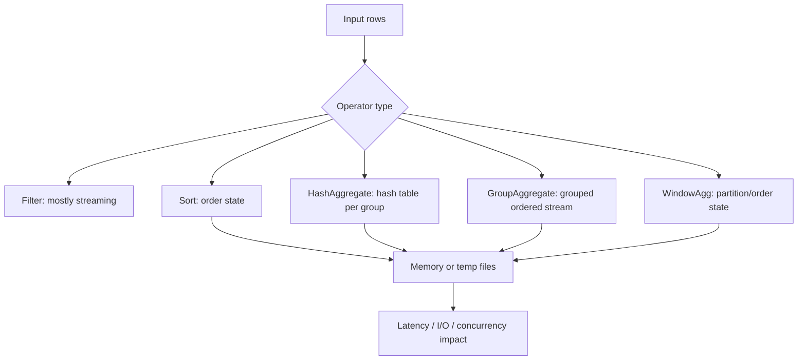
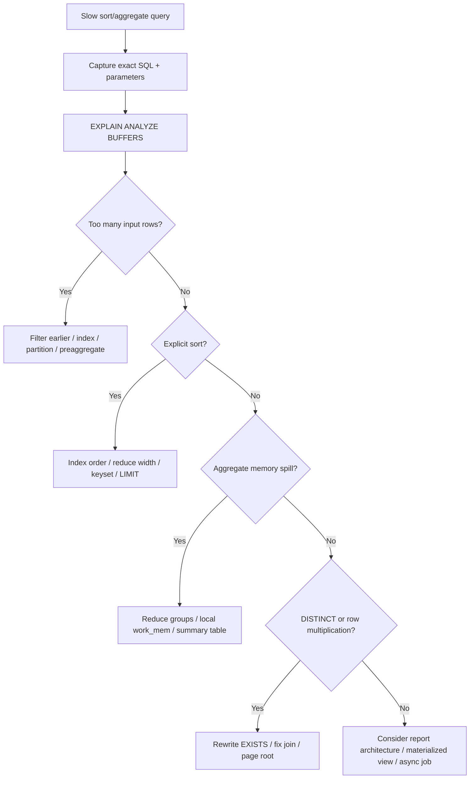

------
title: Learn PostgreSQL in Action - Part 018
description: Aggregation, sorting, and memory engineering in PostgreSQL: sort methods, hash aggregate, group aggregate, DISTINCT, window functions, work_mem, temp files, parallel aggregation, reporting workloads, and Java production implications.
series: learn-postgresql-in-action
seriesTitle: Learn PostgreSQL in Action
order: 18
partTitle: Aggregation, Sorting, and Memory Engineering
tags:
- postgresql
- database
- sql
- query-planner
- aggregation
- sorting
- memory
- performance
- java
- series
date: 2026-07-01
------

# Part 018 — Aggregation, Sorting, and Memory Engineering

Sorting and aggregation are where PostgreSQL turns streams of rows into ordered results, grouped summaries, distinct sets, ranking windows, and reports.

These operations are deceptively simple at the SQL level:

```sql
ORDER BY opened_at DESC
GROUP BY region_code
COUNT(DISTINCT regulated_entity_id)
```

But physically they are memory-sensitive operators. They may fit in memory, spill to disk, multiply per worker, run once per node, and dominate query latency.

This part teaches how to reason about `Sort`, `HashAggregate`, `GroupAggregate`, `Unique`, `WindowAgg`, temp files, `work_mem`, and Java reporting endpoints.

---

## 1. What Problem This Solves

Aggregation/sorting problems usually show up as:

- dashboard query works in staging but spills in production;
- `ORDER BY` causes seconds of latency despite indexes existing;
- `GROUP BY` consumes high CPU or temp I/O;
- `DISTINCT` hides join multiplication and becomes expensive;
- API endpoint returns sorted/paginated data but database sorts millions of rows;
- `work_mem` is increased globally and the server starts swapping under concurrency;
- report query uses parallel workers but still times out;
- Hibernate loads a large result into memory after PostgreSQL already sorted it.

The core lesson:

> Sorting and aggregation are not free formatting steps. They are stateful execution operators with memory budgets.

---

## 2. Kaufman Skill Deconstruction

| Sub-skill | You should be able to do this quickly |
|---|---|
| Sort recognition | Identify explicit sort, top-N sort, incremental sort, and index-provided order. |
| Aggregate recognition | Distinguish `HashAggregate`, `GroupAggregate`, and `Finalize/Partial Aggregate`. |
| Memory reasoning | Estimate why an operation spills and why global `work_mem` is dangerous. |
| Query rewrite | Reduce input rows before sorting/grouping. |
| Index ordering | Design indexes that satisfy filter + order without full sort. |
| Reporting design | Decide when to use live query, summary table, materialized view, or async export. |
| Java integration | Avoid loading huge sorted/grouped result sets into synchronous request flows. |
| Diagnostics | Use `EXPLAIN`, temp blocks, logs, and `pg_stat_statements` to identify spill-heavy statements. |

Practice is simple: run a query, predict which operator appears, then verify with `EXPLAIN (ANALYZE, BUFFERS)`.

---

## 3. Mental Model: Stateful Operators

A filter can stream rows one at a time.

A sort usually needs to see many rows before it can emit ordered output.

An aggregate needs to maintain state per group or consume rows in group order.



The more rows and wider tuples an operator must hold, the higher the memory and temp-file risk.

---

## 4. Baseline Lab Schema

Use the lab schema from Part 017 or create this reporting-oriented subset:

```sql
CREATE SCHEMA IF NOT EXISTS agg_lab;
SET search_path = agg_lab, public;

DROP TABLE IF EXISTS case_event CASCADE;
DROP TABLE IF EXISTS enforcement_case CASCADE;
DROP TABLE IF EXISTS regulated_entity CASCADE;

CREATE TABLE regulated_entity (
    id              bigserial PRIMARY KEY,
    registration_no text NOT NULL UNIQUE,
    legal_name      text NOT NULL,
    risk_tier       text NOT NULL CHECK (risk_tier IN ('LOW', 'MEDIUM', 'HIGH', 'CRITICAL')),
    region_code     text NOT NULL,
    created_at      timestamptz NOT NULL DEFAULT now()
);

CREATE TABLE enforcement_case (
    id                  bigserial PRIMARY KEY,
    regulated_entity_id bigint NOT NULL REFERENCES regulated_entity(id),
    lifecycle_state     text NOT NULL CHECK (lifecycle_state IN ('OPEN', 'ESCALATED', 'HEARING', 'CLOSED')),
    severity            int NOT NULL CHECK (severity BETWEEN 1 AND 5),
    amount_cents        bigint NOT NULL,
    opened_at           timestamptz NOT NULL,
    closed_at           timestamptz
);

CREATE TABLE case_event (
    id          bigserial PRIMARY KEY,
    case_id     bigint NOT NULL REFERENCES enforcement_case(id),
    event_type  text NOT NULL,
    occurred_at timestamptz NOT NULL,
    actor_id    bigint,
    payload     jsonb NOT NULL DEFAULT '{}'::jsonb
);
```

Seed data:

```sql
INSERT INTO regulated_entity (registration_no, legal_name, risk_tier, region_code)
SELECT
    'REG-' || gs,
    'Entity ' || gs,
    CASE
        WHEN gs % 100 = 0 THEN 'CRITICAL'
        WHEN gs % 10 = 0 THEN 'HIGH'
        WHEN gs % 3 = 0 THEN 'MEDIUM'
        ELSE 'LOW'
    END,
    'R' || (gs % 40)
FROM generate_series(1, 200000) AS gs;

INSERT INTO enforcement_case (
    regulated_entity_id,
    lifecycle_state,
    severity,
    amount_cents,
    opened_at,
    closed_at
)
SELECT
    (random() * 199999 + 1)::bigint,
    CASE
        WHEN gs % 25 = 0 THEN 'ESCALATED'
        WHEN gs % 9 = 0 THEN 'HEARING'
        WHEN gs % 4 = 0 THEN 'CLOSED'
        ELSE 'OPEN'
    END,
    (random() * 4 + 1)::int,
    (random() * 5000000 + 5000)::bigint,
    now() - ((random() * 730)::int || ' days')::interval,
    CASE WHEN gs % 4 = 0 THEN now() - ((random() * 300)::int || ' days')::interval END
FROM generate_series(1, 1500000) AS gs;

INSERT INTO case_event (case_id, event_type, occurred_at, actor_id, payload)
SELECT
    (random() * 1499999 + 1)::bigint,
    CASE
        WHEN gs % 17 = 0 THEN 'ESCALATED'
        WHEN gs % 7 = 0 THEN 'HEARING_SCHEDULED'
        WHEN gs % 5 = 0 THEN 'COMMENTED'
        ELSE 'UPDATED'
    END,
    now() - ((random() * 730)::int || ' days')::interval,
    (random() * 5000)::bigint,
    jsonb_build_object('seq', gs)
FROM generate_series(1, 5000000) AS gs;

CREATE INDEX idx_case_state_opened_id
ON enforcement_case (lifecycle_state, opened_at DESC, id DESC);

CREATE INDEX idx_case_opened_id
ON enforcement_case (opened_at DESC, id DESC);

CREATE INDEX idx_case_region_join
ON enforcement_case (regulated_entity_id);

CREATE INDEX idx_entity_region_tier
ON regulated_entity (region_code, risk_tier, id);

CREATE INDEX idx_event_case_occurred
ON case_event (case_id, occurred_at DESC, id DESC);

CREATE INDEX idx_event_type_occurred
ON case_event (event_type, occurred_at DESC);

ANALYZE agg_lab.regulated_entity;
ANALYZE agg_lab.enforcement_case;
ANALYZE agg_lab.case_event;
```

---

## 5. Sort Operator

A `Sort` node orders rows by one or more keys.

Example:

```sql
EXPLAIN (ANALYZE, BUFFERS)
SELECT id, lifecycle_state, opened_at
FROM enforcement_case
WHERE opened_at >= now() - interval '365 days'
ORDER BY opened_at DESC, id DESC;
```

Possible plan:

```text
Sort
  Sort Key: opened_at DESC, id DESC
  Sort Method: quicksort  Memory: 20480kB
  -> Seq Scan on enforcement_case
```

or:

```text
Index Scan using idx_case_opened_id on enforcement_case
```

The second plan avoids an explicit sort because the index already provides the order.

### 5.1 Sort Method

In `EXPLAIN (ANALYZE)`, PostgreSQL may report sort method:

```text
Sort Method: quicksort  Memory: 8192kB
```

or:

```text
Sort Method: external merge  Disk: 102400kB
```

`external merge` means sort spilled to disk.

### 5.2 Top-N Sort

For:

```sql
SELECT id, opened_at
FROM enforcement_case
ORDER BY opened_at DESC
LIMIT 50;
```

PostgreSQL may use a top-N heapsort when no index provides order. It does not need to fully sort all rows to find top 50, but it still must inspect qualifying rows.

Better:

```sql
CREATE INDEX idx_case_opened_desc_id_desc
ON enforcement_case (opened_at DESC, id DESC);
```

Then PostgreSQL can use ordered index access and stop early.

### 5.3 Incremental Sort

If input is already partially ordered, PostgreSQL can use incremental sort in some cases.

Example:

```sql
CREATE INDEX idx_case_state_opened
ON enforcement_case (lifecycle_state, opened_at DESC);

EXPLAIN (ANALYZE, BUFFERS)
SELECT lifecycle_state, opened_at, id
FROM enforcement_case
ORDER BY lifecycle_state, opened_at DESC, id DESC;
```

If the input is ordered by `lifecycle_state, opened_at`, PostgreSQL may only sort within groups for the remaining key.

### 5.4 Sort Checklist

When you see `Sort`, ask:

1. How many rows are sorted?
2. How wide are the rows?
3. Does sort spill to disk?
4. Is `LIMIT` present?
5. Could an index provide the ordering?
6. Does the query sort before or after reducing rows?
7. Is the `ORDER BY` deterministic for pagination?
8. Are collation and expression choices preventing index order usage?

---

## 6. Index-Provided Ordering

A B-tree index can satisfy `ORDER BY` when the requested ordering matches the index order and predicate shape.

Example queue query:

```sql
SELECT id, lifecycle_state, opened_at
FROM enforcement_case
WHERE lifecycle_state = 'ESCALATED'
ORDER BY opened_at DESC, id DESC
LIMIT 100;
```

Good index:

```sql
CREATE INDEX idx_case_escalated_queue
ON enforcement_case (lifecycle_state, opened_at DESC, id DESC);
```

The index supports:

- equality filter on `lifecycle_state`;
- ordering by `opened_at DESC, id DESC`;
- stable keyset pagination.

### 6.1 Deterministic Ordering

This is not deterministic:

```sql
ORDER BY opened_at DESC
```

If many rows have the same `opened_at`, page boundaries can shift.

Prefer:

```sql
ORDER BY opened_at DESC, id DESC
```

Keyset pagination:

```sql
SELECT id, lifecycle_state, opened_at
FROM enforcement_case
WHERE lifecycle_state = 'ESCALATED'
  AND (opened_at, id) < ($1, $2)
ORDER BY opened_at DESC, id DESC
LIMIT 100;
```

Supporting index:

```sql
CREATE INDEX idx_case_escalated_seek
ON enforcement_case (lifecycle_state, opened_at DESC, id DESC);
```

---

## 7. Aggregation Operators

PostgreSQL commonly uses these physical aggregate shapes:

- `HashAggregate`
- `GroupAggregate`
- `MixedAggregate` in some grouping-set scenarios
- `Partial Aggregate` / `Finalize Aggregate` for parallel aggregation

### 7.1 HashAggregate

A hash aggregate builds a hash table keyed by group columns.

Example:

```sql
EXPLAIN (ANALYZE, BUFFERS)
SELECT lifecycle_state, count(*), sum(amount_cents)
FROM enforcement_case
GROUP BY lifecycle_state;
```

Likely plan:

```text
HashAggregate
  Group Key: lifecycle_state
  -> Seq Scan on enforcement_case
```

Hash aggregate is good when:

- group count is manageable;
- input is not already sorted by group keys;
- enough memory exists for hash table;
- grouping keys hash efficiently.

Bad when:

- number of groups is huge;
- rows are wide;
- memory spills;
- skew creates heavy buckets;
- many concurrent sessions perform large aggregates.

### 7.2 GroupAggregate

A group aggregate consumes rows ordered by group key.

Plan:

```text
GroupAggregate
  Group Key: region_code
  -> Sort
       Sort Key: region_code
```

or:

```text
GroupAggregate
  Group Key: region_code
  -> Index Scan using idx_entity_region_tier
```

Group aggregate is good when:

- input is already sorted;
- sort cost is acceptable;
- memory for hash aggregate would be too high;
- ordered output is also needed.

### 7.3 Parallel Aggregate

Large aggregates may use parallel execution:

```text
Finalize GroupAggregate
  -> Gather Merge
       -> Partial GroupAggregate
```

or:

```text
Finalize HashAggregate
  -> Gather
       -> Partial HashAggregate
```

Parallel aggregation divides work across workers, then combines partial states.

This can help large scans, but memory usage and worker availability must be considered.

---

## 8. GROUP BY Design

### 8.1 Group by Narrow Keys

Prefer grouping by stable keys and joining display labels afterward when row counts are large.

Potentially expensive:

```sql
SELECT e.legal_name, count(*)
FROM enforcement_case c
JOIN regulated_entity e ON e.id = c.regulated_entity_id
GROUP BY e.legal_name;
```

Better if entity ID is the real grouping key:

```sql
WITH counts AS (
    SELECT regulated_entity_id, count(*) AS case_count
    FROM enforcement_case
    GROUP BY regulated_entity_id
)
SELECT e.legal_name, counts.case_count
FROM counts
JOIN regulated_entity e ON e.id = counts.regulated_entity_id;
```

This reduces grouping width and may reduce memory.

### 8.2 Aggregate Before Joining

If semantics allow, reduce high-volume fact data before joining dimension tables.

Bad for large fact table:

```sql
SELECT e.region_code, count(*)
FROM enforcement_case c
JOIN regulated_entity e ON e.id = c.regulated_entity_id
GROUP BY e.region_code;
```

Maybe better:

```sql
WITH case_counts AS (
    SELECT regulated_entity_id, count(*) AS n
    FROM enforcement_case
    GROUP BY regulated_entity_id
)
SELECT e.region_code, sum(cc.n)
FROM case_counts cc
JOIN regulated_entity e ON e.id = cc.regulated_entity_id
GROUP BY e.region_code;
```

This helps only when many cases collapse per entity. Validate with `EXPLAIN`.

### 8.3 Filter Before Aggregating

Prefer:

```sql
SELECT lifecycle_state, count(*)
FROM enforcement_case
WHERE opened_at >= date_trunc('month', now())
GROUP BY lifecycle_state;
```

over aggregating all rows and filtering later.

---

## 9. DISTINCT Is Aggregation-Like Work

`DISTINCT` is not a harmless dedup switch.

It requires PostgreSQL to identify unique rows, often via sort/unique or hashing.

Bad smell:

```sql
SELECT DISTINCT c.id
FROM enforcement_case c
JOIN case_event ev ON ev.case_id = c.id
WHERE ev.event_type = 'ESCALATED';
```

If the intent is existence, prefer:

```sql
SELECT c.id
FROM enforcement_case c
WHERE EXISTS (
    SELECT 1
    FROM case_event ev
    WHERE ev.case_id = c.id
      AND ev.event_type = 'ESCALATED'
);
```

### 9.1 DISTINCT on Wide Rows

This is expensive:

```sql
SELECT DISTINCT c.*, e.*, ev.*
FROM enforcement_case c
JOIN regulated_entity e ON e.id = c.regulated_entity_id
JOIN case_event ev ON ev.case_id = c.id;
```

Wide-row distinct increases memory pressure. It may also indicate incorrect data retrieval design.

---

## 10. COUNT Patterns

### 10.1 `count(*)`

`count(*)` counts rows. On a large table with a broad predicate, PostgreSQL may need to scan many rows or many index entries.

```sql
SELECT count(*)
FROM enforcement_case
WHERE lifecycle_state = 'OPEN';
```

A useful index may help if the predicate is selective:

```sql
CREATE INDEX idx_case_open_count
ON enforcement_case (lifecycle_state)
WHERE lifecycle_state = 'OPEN';
```

But if most rows are `OPEN`, a sequential scan can still be rational.

### 10.2 Exact Counts vs Product Needs

For UI pagination, exact total count can be expensive.

Alternative product designs:

- show “more results” instead of exact total;
- cap counts above threshold;
- compute counts asynchronously;
- use materialized summaries;
- count within a narrower filtered subset.

This is an application architecture decision, not merely a SQL decision.

### 10.3 `COUNT(DISTINCT ...)`

```sql
SELECT region_code, count(DISTINCT regulated_entity_id)
FROM ...
GROUP BY region_code;
```

This can be expensive because each group must track unique values.

Consider:

- whether uniqueness is already guaranteed by schema;
- whether pre-aggregation helps;
- whether the query can be decomposed;
- whether a summary table is appropriate.

---

## 11. Window Functions

Window functions compute values over partitions without collapsing rows.

Example:

```sql
SELECT
    id,
    regulated_entity_id,
    opened_at,
    row_number() OVER (
        PARTITION BY regulated_entity_id
        ORDER BY opened_at DESC, id DESC
    ) AS rn
FROM enforcement_case;
```

Plan may include:

```text
WindowAgg
  -> Sort
       Sort Key: regulated_entity_id, opened_at DESC, id DESC
```

Window functions often require ordered partitions.

### 11.1 Latest Row per Group

Common requirement:

> latest case per regulated entity

Window-function version:

```sql
WITH ranked AS (
    SELECT
        c.*,
        row_number() OVER (
            PARTITION BY regulated_entity_id
            ORDER BY opened_at DESC, id DESC
        ) AS rn
    FROM enforcement_case c
)
SELECT *
FROM ranked
WHERE rn = 1;
```

PostgreSQL-specific alternative:

```sql
SELECT DISTINCT ON (regulated_entity_id)
    regulated_entity_id,
    id,
    opened_at,
    lifecycle_state
FROM enforcement_case
ORDER BY regulated_entity_id, opened_at DESC, id DESC;
```

Supporting index:

```sql
CREATE INDEX idx_case_entity_latest
ON enforcement_case (regulated_entity_id, opened_at DESC, id DESC);
```

`DISTINCT ON` can be very effective for top-1-per-group patterns when paired with the right order.

### 11.2 Window Function Checklist

Ask:

1. What is the partition key?
2. What is the order key?
3. How many rows per partition?
4. Does an index provide the partition/order sequence?
5. Does the query need all ranked rows or only top N?
6. Can `DISTINCT ON` solve top-1 more directly?
7. Would precomputed latest pointers be better for OLTP reads?

---

## 12. `work_mem` Mental Model

`work_mem` is the base memory budget for operations such as sort and hash operations before they use temporary files.

The dangerous misunderstanding:

> “If a sort spills, increase `work_mem` globally.”

The production-grade view:

> `work_mem` is per operation, not a single global pool. A complex query can use multiple sort/hash operations, parallel workers can multiply usage, and many concurrent sessions can use it at the same time.

### 12.1 Multiplication Model

Approximate worst-case risk:

```text
active_sessions
* sort_or_hash_nodes_per_query
* parallel_workers_per_query
* work_mem
```

Example:

```text
80 active reporting sessions
* 3 memory-heavy nodes
* 2 workers
* 64MB work_mem
= 30,720MB potential memory envelope
```

This is simplified but useful. Do not tune `work_mem` as if only one query runs.

### 12.2 `hash_mem_multiplier`

Hash-based operations may use a limit based on `work_mem * hash_mem_multiplier`.

This means hash aggregates and hash joins can have a higher memory ceiling than plain sort operations.

### 12.3 Safer Pattern: Local Work Mem for a Controlled Job

For a controlled batch/report job:

```sql
BEGIN;
SET LOCAL work_mem = '128MB';

-- report query here

COMMIT;
```

In Java, this requires care because connection pools reuse connections. Use transaction-scoped `SET LOCAL`, not session-scoped `SET`, unless you deliberately reset state.

---

## 13. Diagnosing Temp Files

Enable temp-file logging in non-production lab or carefully in production:

```sql
SET log_temp_files = 0;
```

For production, choose a threshold such as:

```sql
ALTER SYSTEM SET log_temp_files = '64MB';
SELECT pg_reload_conf();
```

Then identify query classes that spill.

### 13.1 `EXPLAIN` Evidence

Use:

```sql
EXPLAIN (ANALYZE, BUFFERS)
SELECT ...;
```

Look for:

```text
Sort Method: external merge  Disk: ...
Buffers: shared hit=..., temp read=..., written=...
```

For hash operations:

```text
HashAggregate
  Batches: 8  Memory Usage: ...  Disk Usage: ...
```

or hash join batch evidence.

### 13.2 `pg_stat_statements` Evidence

```sql
SELECT
    queryid,
    calls,
    round(total_exec_time::numeric, 2) AS total_ms,
    round(mean_exec_time::numeric, 2) AS mean_ms,
    temp_blks_read,
    temp_blks_written,
    shared_blks_read,
    shared_blks_hit,
    rows,
    left(query, 250) AS sample_query
FROM pg_stat_statements
WHERE temp_blks_read > 0 OR temp_blks_written > 0
ORDER BY temp_blks_written DESC
LIMIT 25;
```

This finds statements with temp I/O. Then inspect specific plans.

---

## 14. Sorting Before vs After Reduction

Bad shape:

```sql
SELECT *
FROM enforcement_case
ORDER BY opened_at DESC
LIMIT 100;
```

This may be fine with an index. Without index, PostgreSQL must inspect a large input.

Better with predicate:

```sql
SELECT *
FROM enforcement_case
WHERE lifecycle_state = 'ESCALATED'
ORDER BY opened_at DESC, id DESC
LIMIT 100;
```

Index:

```sql
CREATE INDEX idx_case_escalated_order
ON enforcement_case (lifecycle_state, opened_at DESC, id DESC);
```

Even better if only a queue row is needed:

```sql
SELECT id, lifecycle_state, opened_at, severity
FROM enforcement_case
WHERE lifecycle_state = 'ESCALATED'
ORDER BY opened_at DESC, id DESC
LIMIT 100;
```

Narrow projection reduces heap reads and network payload.

---

## 15. Aggregating Raw Events vs Summary Tables

Regulatory systems often store event history.

A raw event table may grow forever:

```text
case_event: 500 million rows
```

Dashboard requirement:

> count escalations per region per day for the last 90 days

Live query:

```sql
SELECT
    date_trunc('day', ev.occurred_at) AS day,
    e.region_code,
    count(*)
FROM case_event ev
JOIN enforcement_case c ON c.id = ev.case_id
JOIN regulated_entity e ON e.id = c.regulated_entity_id
WHERE ev.event_type = 'ESCALATED'
  AND ev.occurred_at >= now() - interval '90 days'
GROUP BY day, e.region_code
ORDER BY day, e.region_code;
```

This may be acceptable at small scale and unacceptable at large scale.

### 15.1 Summary Table Pattern

```sql
CREATE TABLE daily_escalation_summary (
    day date NOT NULL,
    region_code text NOT NULL,
    escalation_count bigint NOT NULL,
    PRIMARY KEY (day, region_code)
);
```

Refresh incrementally:

```sql
INSERT INTO daily_escalation_summary (day, region_code, escalation_count)
SELECT
    ev.occurred_at::date AS day,
    e.region_code,
    count(*)
FROM case_event ev
JOIN enforcement_case c ON c.id = ev.case_id
JOIN regulated_entity e ON e.id = c.regulated_entity_id
WHERE ev.event_type = 'ESCALATED'
  AND ev.occurred_at >= $1
  AND ev.occurred_at < $2
GROUP BY ev.occurred_at::date, e.region_code
ON CONFLICT (day, region_code)
DO UPDATE SET escalation_count = EXCLUDED.escalation_count;
```

This shifts expensive aggregation from synchronous read path to controlled batch/update path.

### 15.2 Materialized View Pattern

```sql
CREATE MATERIALIZED VIEW mv_daily_escalation_summary AS
SELECT
    ev.occurred_at::date AS day,
    e.region_code,
    count(*) AS escalation_count
FROM case_event ev
JOIN enforcement_case c ON c.id = ev.case_id
JOIN regulated_entity e ON e.id = c.regulated_entity_id
WHERE ev.event_type = 'ESCALATED'
GROUP BY ev.occurred_at::date, e.region_code;

CREATE UNIQUE INDEX idx_mv_daily_escalation_summary
ON mv_daily_escalation_summary (day, region_code);
```

Refresh:

```sql
REFRESH MATERIALIZED VIEW CONCURRENTLY mv_daily_escalation_summary;
```

This has operational constraints. The concurrent refresh requires a suitable unique index and still consumes resources.

Use materialized views when refresh semantics and staleness are acceptable.

---

## 16. GROUPING SETS, ROLLUP, and CUBE

PostgreSQL supports advanced grouping constructs that compute multiple aggregation levels.

Example:

```sql
SELECT
    region_code,
    risk_tier,
    count(*)
FROM regulated_entity
GROUP BY ROLLUP (region_code, risk_tier)
ORDER BY region_code, risk_tier;
```

This can replace multiple queries, but it can also increase memory and sort complexity.

Use when:

- the reporting shape genuinely needs multiple levels;
- the result size is bounded;
- you understand the null subtotal representation;
- consumers can handle subtotal rows cleanly.

Avoid when:

- the query becomes unreadable;
- application code expects ordinary rows;
- the data volume demands precomputed summaries.

---

## 17. Ordered Aggregates

Some aggregates depend on order:

```sql
SELECT
    case_id,
    string_agg(event_type, ',' ORDER BY occurred_at)
FROM case_event
GROUP BY case_id;
```

This can require per-group ordering and memory.

Be careful with:

- `array_agg` over unbounded groups;
- `jsonb_agg` over unbounded groups;
- `string_agg` over unbounded groups;
- ordered aggregate inside broad reporting queries.

For APIs, aggregating huge child collections into JSON in the database can move memory pressure from JVM to PostgreSQL. That is not automatically better.

Use limits and subqueries intentionally.

---

## 18. Wide Rows Make Sorts and Aggregates Worse

Compare:

```sql
SELECT *
FROM enforcement_case
WHERE lifecycle_state = 'OPEN'
ORDER BY opened_at DESC
LIMIT 1000;
```

versus:

```sql
SELECT id, lifecycle_state, opened_at, severity
FROM enforcement_case
WHERE lifecycle_state = 'OPEN'
ORDER BY opened_at DESC
LIMIT 1000;
```

Even if both plans use similar operators, wide rows increase:

- memory usage;
- sort tuple size;
- cache pressure;
- network transfer;
- Java object allocation;
- serialization cost.

Use projection as a performance tool.

---

## 19. Java Production Implications

### 19.1 Synchronous Reports Are a Trap

This endpoint shape is risky:

```text
GET /reports/case-summary?from=2025-01-01&to=2026-01-01
```

If it performs broad joins, grouping, sorting, and exports all rows synchronously, it can:

- monopolize database CPU;
- spill temp files;
- hold a connection for a long time;
- starve OLTP pool;
- hit HTTP timeouts;
- allocate large JVM objects;
- trigger retries that make load worse.

Better design:

- request report generation;
- enqueue job;
- run with controlled pool and `SET LOCAL work_mem` if needed;
- write output to object storage;
- notify user when ready;
- isolate reporting workload from OLTP pool.

### 19.2 Connection Pool Isolation

Do not run heavy reports through the same Hikari pool as OLTP commands unless concurrency is strictly controlled.

Pattern:

```text
app-oltp-pool: small, low timeout, latency-sensitive
app-report-pool: smaller concurrency, longer timeout, controlled work_mem
```

The report pool may use fewer connections, not more.

This protects the database from too many concurrent memory-heavy queries.

### 19.3 Fetch Size and Streaming

For large result sets, configure fetch size and transaction boundaries intentionally.

With JDBC, streaming-style retrieval requires driver and transaction behavior awareness. Do not assume a Java stream automatically means database-side streaming.

Even with streaming, the database may still have to sort or aggregate before returning rows.

Streaming helps client memory. It does not eliminate database sort/aggregate cost.

### 19.4 Timeouts

Use timeouts at multiple layers:

- application request timeout;
- JDBC query timeout;
- PostgreSQL `statement_timeout`;
- pool connection timeout;
- job timeout for async reports.

Avoid letting one report query run indefinitely.

---

## 20. Tuning Strategy for Sort/Aggregate Queries

Do not tune blindly.

Use this order:



### 20.1 When to Add an Index

Add or modify index when:

- query is frequent;
- filter is selective or ordering can stop early;
- index supports both predicate and `ORDER BY`;
- write overhead is acceptable;
- index is not redundant with existing indexes;
- query shape is stable.

### 20.2 When to Increase `work_mem`

Increase `work_mem` when:

- query is important;
- spill is confirmed;
- input row count cannot be reduced enough;
- concurrency is controlled;
- memory envelope is calculated;
- change is local/session/role-specific if possible.

Avoid global large `work_mem` as first response.

### 20.3 When to Precompute

Precompute when:

- query repeats frequently;
- exact freshness is not required;
- raw table volume is high;
- grouping dimensions are stable;
- result set is much smaller than input;
- operational refresh can be controlled.

---

## 21. Labs

### Exercise 1 — Sort Spill

Force a low memory sort:

```sql
BEGIN;
SET LOCAL work_mem = '1MB';

EXPLAIN (ANALYZE, BUFFERS)
SELECT id, lifecycle_state, amount_cents, opened_at
FROM enforcement_case
ORDER BY amount_cents DESC;

ROLLBACK;
```

Look for:

```text
Sort Method: external merge
```

Then compare:

```sql
BEGIN;
SET LOCAL work_mem = '128MB';

EXPLAIN (ANALYZE, BUFFERS)
SELECT id, lifecycle_state, amount_cents, opened_at
FROM enforcement_case
ORDER BY amount_cents DESC;

ROLLBACK;
```

Question: did runtime improve enough to justify memory risk under concurrency?

### Exercise 2 — Index-Provided Order

```sql
EXPLAIN (ANALYZE, BUFFERS)
SELECT id, lifecycle_state, opened_at
FROM enforcement_case
WHERE lifecycle_state = 'ESCALATED'
ORDER BY opened_at DESC, id DESC
LIMIT 100;
```

If needed:

```sql
CREATE INDEX CONCURRENTLY idx_case_escalated_order_lab
ON enforcement_case (lifecycle_state, opened_at DESC, id DESC);
```

Rerun and compare whether `Sort` disappears.

### Exercise 3 — HashAggregate vs GroupAggregate

```sql
EXPLAIN (ANALYZE, BUFFERS)
SELECT regulated_entity_id, count(*), sum(amount_cents)
FROM enforcement_case
GROUP BY regulated_entity_id;
```

Then test with planner toggles for learning:

```sql
BEGIN;
SET LOCAL enable_hashagg = off;
EXPLAIN (ANALYZE, BUFFERS)
SELECT regulated_entity_id, count(*), sum(amount_cents)
FROM enforcement_case
GROUP BY regulated_entity_id;
ROLLBACK;
```

Do not ship planner toggles. Use them to understand alternatives.

### Exercise 4 — DISTINCT vs EXISTS

```sql
EXPLAIN (ANALYZE, BUFFERS)
SELECT DISTINCT c.id
FROM enforcement_case c
JOIN case_event ev ON ev.case_id = c.id
WHERE ev.event_type = 'ESCALATED';
```

Rewrite:

```sql
EXPLAIN (ANALYZE, BUFFERS)
SELECT c.id
FROM enforcement_case c
WHERE EXISTS (
    SELECT 1
    FROM case_event ev
    WHERE ev.case_id = c.id
      AND ev.event_type = 'ESCALATED'
);
```

Compare:

- rows processed;
- aggregate/unique/sort nodes;
- execution time;
- temp blocks.

### Exercise 5 — Latest Row per Group

Compare window function:

```sql
EXPLAIN (ANALYZE, BUFFERS)
WITH ranked AS (
    SELECT
        c.*,
        row_number() OVER (
            PARTITION BY regulated_entity_id
            ORDER BY opened_at DESC, id DESC
        ) AS rn
    FROM enforcement_case c
)
SELECT id, regulated_entity_id, opened_at
FROM ranked
WHERE rn = 1;
```

with `DISTINCT ON`:

```sql
EXPLAIN (ANALYZE, BUFFERS)
SELECT DISTINCT ON (regulated_entity_id)
    id,
    regulated_entity_id,
    opened_at
FROM enforcement_case
ORDER BY regulated_entity_id, opened_at DESC, id DESC;
```

Then add:

```sql
CREATE INDEX CONCURRENTLY idx_case_entity_latest_lab
ON enforcement_case (regulated_entity_id, opened_at DESC, id DESC);
```

Rerun.

---

## 22. Common Failure Modes

### 22.1 Global `work_mem` Overcorrection

Incident:

```text
One report spills to disk.
Team increases work_mem globally to 256MB.
During business hours, many concurrent queries run.
Database memory pressure spikes.
OS starts swapping or OOM killer appears.
Latency collapses.
```

Better:

- reduce input rows;
- add order-supporting index;
- precompute summary;
- set local memory for controlled job;
- isolate reporting pool;
- cap report concurrency.

### 22.2 `ORDER BY` on Expression Without Index

```sql
ORDER BY lower(legal_name)
```

May require sort unless expression index exists:

```sql
CREATE INDEX idx_entity_lower_legal_name
ON regulated_entity (lower(legal_name));
```

Be intentional with expression/collation behavior.

### 22.3 Sorting Joined Wide Rows

Bad:

```sql
SELECT c.*, e.*, ev.*
FROM enforcement_case c
JOIN regulated_entity e ON e.id = c.regulated_entity_id
JOIN case_event ev ON ev.case_id = c.id
ORDER BY ev.occurred_at DESC
LIMIT 100;
```

This may sort wide multiplied rows.

Better:

- identify the root of pagination;
- fetch narrow IDs first;
- join details after limiting;
- avoid unbounded child joins.

### 22.4 Dashboard on Raw Events

If dashboard uses `GROUP BY date_trunc(...)` over raw event table for every page load, it will eventually become a workload problem.

Use summaries or materialized views when freshness requirements allow.

---

## 23. Production Review Checklist

Before approving a query with `ORDER BY`, `GROUP BY`, `DISTINCT`, or window functions:

- How many rows enter the sort/aggregate?
- How wide are those rows?
- Is there a `LIMIT`, and can PostgreSQL stop early?
- Does an index provide required order?
- Is ordering deterministic?
- Does `DISTINCT` hide row multiplication?
- Is exact count required by product?
- Does the query spill temp files?
- How many memory-heavy nodes exist in the plan?
- Can parallel workers multiply memory usage?
- Does this run under OLTP or reporting pool?
- Is `work_mem` local, role-specific, or global?
- Would summary table/materialized view be better?
- Does Java stream results or load everything?
- Are statement timeouts and report concurrency limits in place?

---

## 24. Self-Correction Rubric

| Level | Capability |
|---|---|
| 1 | Identify `Sort`, `HashAggregate`, `GroupAggregate`, `WindowAgg`, and `Unique` in a plan. |
| 2 | Explain whether sort used memory or disk. |
| 3 | Explain why `work_mem` is dangerous when raised globally. |
| 4 | Design an index that supports filter + order + keyset pagination. |
| 5 | Rewrite `DISTINCT` caused by row multiplication into better SQL shape. |
| 6 | Choose between live aggregation and summary table. |
| 7 | Diagnose temp-file-heavy queries from `pg_stat_statements`. |
| 8 | Estimate memory envelope under concurrency. |
| 9 | Design separate OLTP and reporting execution paths. |
| 10 | Turn a broad report into a stable production workflow. |

---

## 25. Key Takeaways

- Sorting and aggregation are stateful, memory-sensitive operations.
- `Sort Method: external merge` means disk spill.
- `HashAggregate` is fast when group state fits memory, risky when group cardinality is high.
- `GroupAggregate` benefits from ordered input and may avoid hash memory pressure.
- `work_mem` applies per operation and can multiply across nodes, workers, and sessions.
- `hash_mem_multiplier` affects hash operation memory limits.
- `DISTINCT` is often a symptom of row multiplication, not the real fix.
- Indexes can remove sorts when they match predicate and ordering shape.
- Exact counts and live dashboards can be product-level performance traps.
- Java services need separate strategies for OLTP queries and heavy reporting workloads.

---

## 26. References

- PostgreSQL Documentation — Using `EXPLAIN`: https://www.postgresql.org/docs/current/using-explain.html
- PostgreSQL Documentation — Resource Consumption / `work_mem`: https://www.postgresql.org/docs/current/runtime-config-resource.html
- PostgreSQL Documentation — Query Planning Configuration: https://www.postgresql.org/docs/current/runtime-config-query.html
- PostgreSQL Documentation — Indexes and `ORDER BY`: https://www.postgresql.org/docs/current/indexes-ordering.html
- PostgreSQL Documentation — Aggregate Functions: https://www.postgresql.org/docs/current/functions-aggregate.html
- PostgreSQL Documentation — Window Functions: https://www.postgresql.org/docs/current/tutorial-window.html
- PostgreSQL Documentation — Materialized Views: https://www.postgresql.org/docs/current/rules-materializedviews.html
