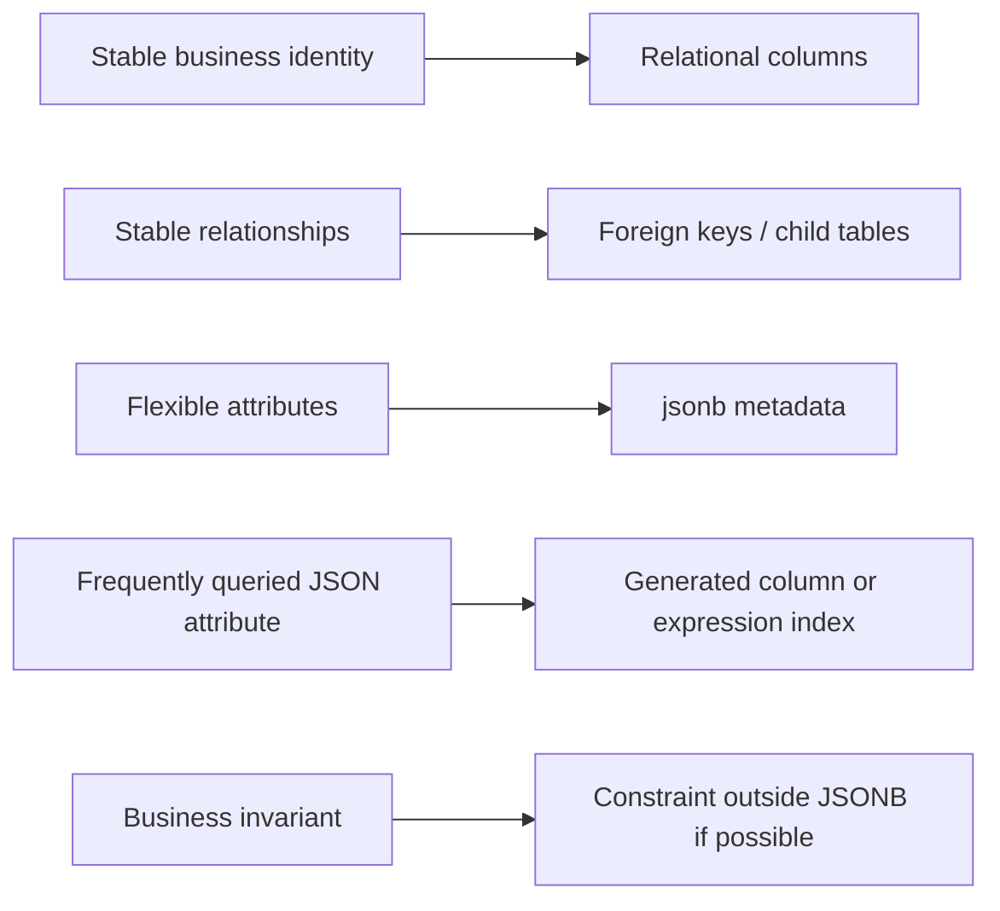

------
title: Learn PostgreSQL in Action - Part 019
description: JSONB dan hybrid relational-document modeling di PostgreSQL untuk engineer Java yang perlu menyeimbangkan fleksibilitas schema, queryability, integrity, performance, migration, dan operasional production.
series: learn-postgresql-in-action
seriesTitle: Learn PostgreSQL in Action
order: 19
partTitle: JSONB and Hybrid Relational-Document Modeling
tags:
- postgresql
- jsonb
- database
- java
- schema-design
- indexing
- performance
- series
date: 2026-07-01
---

# Part 019 — JSONB and Hybrid Relational-Document Modeling

## Learning Goal

Setelah part ini, kamu harus mampu mengambil keputusan yang defensible tentang kapan data harus dimodelkan sebagai kolom relasional biasa, kapan boleh masuk ke `jsonb`, kapan perlu hybrid, dan kapan JSONB justru menjadi smell arsitektural.

Target skill bukan sekadar bisa memakai operator JSONB. Targetnya adalah bisa menjawab pertanyaan seperti:

- Apakah field ini harus menjadi column, generated column, domain object, child table, atau `jsonb`?
- Query mana yang masih sehat bila data disimpan di JSONB?
- Index apa yang benar untuk containment, path extraction, attribute search, dan flexible metadata?
- Bagaimana menjaga integrity saat sebagian data schema-less?
- Bagaimana mapping JSONB di Java tanpa membuat domain model menjadi map-of-string-anything yang rapuh?
- Bagaimana melakukan migrasi dari JSONB fleksibel menuju schema yang lebih kuat saat business rule mulai stabil?

## Kaufman Deconstruction

Josh Kaufman menekankan bahwa skill kompleks harus dipecah menjadi sub-skill kecil yang bisa dilatih cepat. Untuk JSONB production, sub-skill-nya adalah:

| Sub-skill | Yang Harus Bisa Dilakukan | Bukti Penguasaan |
|---|---|---|
| Modeling boundary | Memutuskan column vs JSONB vs child table | Bisa menjelaskan invariant yang hilang jika field masuk JSONB |
| Operator semantics | Memilih operator `->`, `->>`, `#>`, `@>`, `?`, `@@`, `@?` | Query tidak accidental full scan karena salah operator |
| Index selection | Memilih GIN, expression index, partial index, generated column | `EXPLAIN` membuktikan plan menggunakan index yang relevan |
| Integrity strategy | Menjaga validasi JSONB dengan CHECK, generated column, trigger, atau app contract | Invalid document tidak diam-diam masuk production |
| Java mapping | Mapping JSONB ke value object, bukan loose map di semua layer | Domain code tetap type-safe dan migration-friendly |
| Evolution strategy | Migrasi field dari JSONB ke column dengan expand-contract | Tidak perlu big-bang rewrite data |

## Mental Model

JSONB adalah **document fragment inside a relational engine**.

Ia bukan pengganti relational modeling. Ia adalah alat untuk menyimpan bagian data yang:

1. bentuknya fleksibel;
2. tidak selalu hadir pada semua row;
3. sering dibaca bersama parent row;
4. belum stabil menjadi schema kuat;
5. tidak membutuhkan relational integrity yang kompleks;
6. query-nya bisa dibatasi ke pola yang diketahui.

Model paling sehat adalah:



Jika field menentukan identity, ownership, lifecycle state, money, permission, audit, eligibility, or regulatory decision, default-nya **jangan disembunyikan di JSONB**. Data seperti itu biasanya perlu column, constraint, FK, index, dan observability yang kuat.

## PostgreSQL JSON vs JSONB

PostgreSQL memiliki `json` dan `jsonb`.

Secara praktik production, `jsonb` hampir selalu pilihan default karena:

- disimpan dalam bentuk binary decomposed;
- tidak mempertahankan whitespace dan urutan key asli;
- mendukung indexing yang jauh lebih berguna;
- mendukung containment dan operators yang kuat.

`json` masih berguna bila kamu benar-benar perlu mempertahankan representasi textual asli, misalnya payload auditing yang harus persis sama dengan input. Untuk domain querying, gunakan `jsonb`.

```sql
CREATE TABLE case_event (
    id           uuid PRIMARY KEY DEFAULT uuidv7(),
    case_id      uuid NOT NULL,
    event_type   text NOT NULL,
    occurred_at  timestamptz NOT NULL DEFAULT now(),
    payload      jsonb NOT NULL
);
```

### JSONB Normalization Effect

`jsonb` melakukan normalisasi internal. Contoh konsekuensi:

- key order tidak dianggap meaningful;
- duplicate key tidak dipertahankan seperti raw JSON text;
- comparison dan containment berbasis struktur, bukan string literal.

Ini bagus untuk query. Ini kurang cocok bila kamu butuh exact raw payload.

Pattern yang aman untuk audit/event ingestion:

```sql
CREATE TABLE inbound_message (
    id              uuid PRIMARY KEY DEFAULT uuidv7(),
    received_at     timestamptz NOT NULL DEFAULT now(),
    source_system   text NOT NULL,
    raw_payload     jsonb NOT NULL,
    raw_payload_sha bytea NOT NULL,
    processing_state text NOT NULL DEFAULT 'received'
);
```

Jika exact string diperlukan:

```sql
CREATE TABLE inbound_message_raw (
    id              uuid PRIMARY KEY DEFAULT uuidv7(),
    received_at     timestamptz NOT NULL DEFAULT now(),
    raw_payload_text text NOT NULL,
    parsed_payload   jsonb GENERATED ALWAYS AS (raw_payload_text::jsonb) STORED
);
```

Catatan: generated expression harus memenuhi aturan PostgreSQL untuk generated columns. Bila expression tidak valid untuk generated column di versi atau konfigurasi tertentu, gunakan ingestion pipeline atau trigger.

## Modeling Decision Matrix

Gunakan matrix ini sebelum membuat kolom JSONB.

| Data Characteristic | Column | Child Table | JSONB | Reasoning |
|---|---:|---:|---:|---|
| Dibutuhkan untuk FK | ✅ | ✅ | ❌ | FK tidak natural terhadap nested JSONB |
| Dibutuhkan untuk uniqueness | ✅ | ⚠️ | ⚠️ | Bisa expression/partial unique, tapi lebih fragile |
| Dipakai di banyak WHERE/JOIN | ✅ | ✅ | ⚠️ | JSONB query bisa diindex, tetapi lebih sulit distabilkan |
| Bentuk fleksibel per source | ❌ | ⚠️ | ✅ | JSONB cocok untuk source-specific attributes |
| Auditing payload eksternal | ⚠️ | ❌ | ✅ | Raw/parsed payload lebih cocok JSONB/text |
| Business lifecycle state | ✅ | ❌ | ❌ | State harus observable dan constrained |
| Array entity dengan identity sendiri | ❌ | ✅ | ❌ | Child table lebih tepat |
| Rare metadata, dibaca bersama parent | ⚠️ | ❌ | ✅ | JSONB menghindari sparse columns |
| Reporting dimension | ✅ | ✅ | ⚠️ | Reporting butuh stable columns/index/stats |

Rule sederhana:

> JSONB adalah tempat yang baik untuk **context**, bukan tempat yang baik untuk **core invariant**.

## Hybrid Modeling Pattern

Hybrid modeling berarti core fields tetap relasional, sementara data fleksibel disimpan sebagai JSONB.

Contoh domain regulatory case:

```sql
CREATE TABLE enforcement_case (
    id              uuid PRIMARY KEY DEFAULT uuidv7(),
    case_number     text NOT NULL UNIQUE,
    subject_id      uuid NOT NULL,
    lifecycle_state text NOT NULL,
    priority        text NOT NULL,
    opened_at       timestamptz NOT NULL DEFAULT now(),
    closed_at       timestamptz,
    metadata        jsonb NOT NULL DEFAULT '{}'::jsonb,
    CONSTRAINT enforcement_case_lifecycle_state_chk
        CHECK (lifecycle_state IN ('draft', 'screening', 'investigation', 'enforcement', 'closed')),
    CONSTRAINT enforcement_case_priority_chk
        CHECK (priority IN ('low', 'normal', 'high', 'critical'))
);
```

Yang menjadi column:

- `case_number`, karena identity;
- `subject_id`, karena relationship;
- `lifecycle_state`, karena workflow invariant;
- `priority`, karena routing/escalation;
- `opened_at`, karena lifecycle/query/retention.

Yang masuk JSONB:

- source-specific flags;
- external enrichment;
- optional metadata;
- calculated hints yang belum stabil;
- UI display preferences yang tidak menjadi invariant.

Contoh metadata:

```json
{
  "source": {
    "system": "complaints-portal",
    "importBatchId": "batch-2026-07-01"
  },
  "riskSignals": {
    "complaintCountLast90Days": 14,
    "hasPriorWarning": true
  },
  "externalReferences": [
    { "type": "ticket", "value": "TCK-8821" },
    { "type": "document", "value": "DOC-441" }
  ]
}
```

## Operator Semantics

### Extraction Operators

```sql
SELECT
    metadata -> 'source' AS source_json,
    metadata -> 'source' ->> 'system' AS source_system_text,
    metadata #> '{riskSignals,complaintCountLast90Days}' AS complaint_count_json,
    metadata #>> '{riskSignals,complaintCountLast90Days}' AS complaint_count_text
FROM enforcement_case;
```

Mental model:

| Operator | Result | Use Case |
|---|---|---|
| `->` | JSON/JSONB | Extract object/array/value while preserving JSON type |
| `->>` | text | Extract scalar for comparison/cast/display |
| `#>` | JSON/JSONB by path | Nested extraction with path array |
| `#>>` | text by path | Nested scalar extraction |

Common mistake:

```sql
-- Bad for numeric semantics: text comparison
WHERE metadata #>> '{riskSignals,complaintCountLast90Days}' > '9';
```

This is lexical comparison. `'14' > '9'` can behave differently than numeric reasoning expects.

Better:

```sql
WHERE (metadata #>> '{riskSignals,complaintCountLast90Days}')::int > 9;
```

But once a field becomes important enough for numeric comparisons, strongly consider generated column or real column.

### Containment Operator

```sql
SELECT *
FROM enforcement_case
WHERE metadata @> '{"source": {"system": "complaints-portal"}}'::jsonb;
```

`@>` asks whether the left JSONB value contains the right JSONB structure.

This is one of the main query shapes that works well with GIN indexes.

### Key Existence Operators

```sql
SELECT *
FROM enforcement_case
WHERE metadata ? 'riskSignals';

SELECT *
FROM enforcement_case
WHERE metadata ?| array['riskSignals', 'externalReferences'];

SELECT *
FROM enforcement_case
WHERE metadata ?& array['source', 'riskSignals'];
```

Use these for key existence, not for semantic business validation alone.

### JSONPath Operators

PostgreSQL supports SQL/JSON path query operators such as `@?` and `@@` for path existence and predicate checks.

```sql
SELECT *
FROM enforcement_case
WHERE metadata @? '$.externalReferences[*] ? (@.type == "ticket")';
```

JSONPath is expressive, but expressive does not always mean operationally cheap. Use `EXPLAIN (ANALYZE, BUFFERS)` and understand index support before relying on it for hot paths.

## Indexing JSONB

JSONB performance depends on matching query shape to index strategy.

### Strategy 1: General GIN Index

```sql
CREATE INDEX CONCURRENTLY idx_case_metadata_gin
ON enforcement_case
USING gin (metadata);
```

Useful for containment and key existence queries.

Example:

```sql
EXPLAIN (ANALYZE, BUFFERS)
SELECT *
FROM enforcement_case
WHERE metadata @> '{"source": {"system": "complaints-portal"}}'::jsonb;
```

This can use the GIN index.

Trade-off:

- flexible;
- can be large;
- write amplification can be significant;
- may need recheck;
- not a replacement for targeted B-tree indexes on stable scalar fields.

### Strategy 2: `jsonb_path_ops` GIN Index

```sql
CREATE INDEX CONCURRENTLY idx_case_metadata_path_ops
ON enforcement_case
USING gin (metadata jsonb_path_ops);
```

`jsonb_path_ops` is more specialized. It is often smaller and faster for containment-style queries, but supports fewer operators than default `jsonb_ops`.

Use it when the workload is dominated by containment query shapes like:

```sql
WHERE metadata @> '{"source": {"system": "complaints-portal"}}'
```

Do not choose it blindly. It is a workload-specific trade-off.

### Strategy 3: Expression Index for Stable Scalar Path

If you frequently filter by a scalar value:

```sql
CREATE INDEX CONCURRENTLY idx_case_source_system
ON enforcement_case ((metadata #>> '{source,system}'));
```

Query must match expression shape closely:

```sql
SELECT *
FROM enforcement_case
WHERE metadata #>> '{source,system}' = 'complaints-portal';
```

This is often better than a broad GIN index when:

- the field is scalar;
- the predicate is equality/range/sort;
- the field is heavily used;
- you want B-tree behavior.

### Strategy 4: Generated Column + Normal B-tree Index

When a JSONB field becomes semi-stable and important, expose it:

```sql
ALTER TABLE enforcement_case
ADD COLUMN source_system text
GENERATED ALWAYS AS (metadata #>> '{source,system}') STORED;

CREATE INDEX CONCURRENTLY idx_case_source_system_generated
ON enforcement_case (source_system);
```

This has several advantages:

- clearer query shape;
- better statistics;
- easier ORM mapping;
- better reporting compatibility;
- easier migration toward real column.

Generated columns are a bridge from flexible JSONB to stronger schema.

### Strategy 5: Partial Index on JSONB Predicate

```sql
CREATE INDEX CONCURRENTLY idx_case_high_risk_from_portal
ON enforcement_case (opened_at DESC, id)
WHERE metadata @> '{"source": {"system": "complaints-portal"}, "riskSignals": {"hasPriorWarning": true}}'::jsonb;
```

Good for specialized work queues or operational dashboards.

But partial JSONB indexes are fragile if application query predicates do not imply the same condition.

## JSONB and Statistics

Planner statistics for JSONB are not as straightforward as normal columns. A query on:

```sql
WHERE metadata #>> '{source,system}' = 'complaints-portal'
```

may suffer from weak cardinality estimation compared to a normal column with statistics.

If the field is important to planning:

1. use generated column;
2. run `ANALYZE`;
3. inspect `pg_stats`;
4. compare estimated vs actual rows;
5. consider extended statistics if multiple extracted columns correlate.

Example:

```sql
ALTER TABLE enforcement_case
ADD COLUMN source_system text
GENERATED ALWAYS AS (metadata #>> '{source,system}') STORED;

ALTER TABLE enforcement_case
ADD COLUMN has_prior_warning boolean
GENERATED ALWAYS AS ((metadata #>> '{riskSignals,hasPriorWarning}')::boolean) STORED;

CREATE STATISTICS st_case_source_warning
ON source_system, has_prior_warning
FROM enforcement_case;

ANALYZE enforcement_case;
```

Now PostgreSQL has a better chance of estimating combined predicates.

## Integrity in and around JSONB

A JSONB column can easily become a dumping ground. Production-grade design needs integrity layers.

### Layer 1: Non-null and Object Shape

```sql
ALTER TABLE enforcement_case
ADD CONSTRAINT enforcement_case_metadata_object_chk
CHECK (jsonb_typeof(metadata) = 'object');
```

This prevents arrays/scalars from becoming metadata.

### Layer 2: Required Key for Certain Type

```sql
ALTER TABLE case_event
ADD CONSTRAINT case_event_payload_shape_chk
CHECK (
    CASE event_type
        WHEN 'case.assigned' THEN payload ? 'assigneeUserId'
        WHEN 'case.escalated' THEN payload ? 'escalationReason'
        ELSE true
    END
);
```

This is useful when event payload varies by type.

### Layer 3: Type Check Nested Field

```sql
ALTER TABLE enforcement_case
ADD CONSTRAINT enforcement_case_risk_count_number_chk
CHECK (
    metadata #> '{riskSignals,complaintCountLast90Days}' IS NULL
    OR jsonb_typeof(metadata #> '{riskSignals,complaintCountLast90Days}') = 'number'
);
```

### Layer 4: Promote Important JSON Field

If a JSON key becomes part of correctness, promote it.

Bad long-term design:

```sql
WHERE metadata #>> '{approval,status}' = 'approved'
```

Better:

```sql
ALTER TABLE enforcement_case
ADD COLUMN approval_status text;

ALTER TABLE enforcement_case
ADD CONSTRAINT approval_status_chk
CHECK (approval_status IN ('not_required', 'pending', 'approved', 'rejected'));
```

A field that drives workflow should be column-level.

## JSONB Arrays: The Most Common Modeling Trap

JSONB arrays are tempting:

```json
{
  "violations": [
    { "code": "KYC_MISSING", "severity": "high" },
    { "code": "REPORT_LATE", "severity": "medium" }
  ]
}
```

This is acceptable if violations are small embedded facts, rarely updated independently, and always read with the parent.

It becomes a smell if you need:

- unique constraint per violation;
- FK to violation catalog;
- per-violation lifecycle;
- per-violation audit;
- frequent filtering/joining;
- partial updates to individual elements;
- high-volume analytics.

Then use a child table:

```sql
CREATE TABLE case_violation (
    case_id     uuid NOT NULL REFERENCES enforcement_case(id),
    code        text NOT NULL,
    severity    text NOT NULL,
    detected_at timestamptz NOT NULL DEFAULT now(),
    metadata    jsonb NOT NULL DEFAULT '{}'::jsonb,
    PRIMARY KEY (case_id, code)
);
```

Hybrid still works: stable child entity + flexible metadata.

## Update Semantics and Write Amplification

Updating a nested JSONB value still updates the row version under MVCC.

```sql
UPDATE enforcement_case
SET metadata = jsonb_set(
    metadata,
    '{riskSignals,hasPriorWarning}',
    'true'::jsonb,
    true
)
WHERE id = $1;
```

Operational consequence:

- row version changes;
- indexes may need maintenance;
- large JSONB values can increase write cost;
- HOT update eligibility can be lost if indexed expressions depend on changed JSONB;
- frequent small updates inside a large JSONB blob can create bloat.

If a field changes frequently and independently, it probably deserves its own column or child table.

## JSONB and TOAST

Large JSONB documents may be TOASTed. That means the value can be stored out-of-line.

This matters because:

- reading the row may not always read the entire value immediately, depending on query;
- extracting nested values can force detoasting;
- updating large values can be expensive;
- broad JSONB documents can hurt cache behavior.

Design implication:

- keep hot columns separate from cold JSONB;
- avoid selecting JSONB when listing rows;
- use projection discipline in Java queries;
- split large audit payloads into dedicated tables when necessary.

Bad repository method:

```java
// Loads every column including large metadata/payload.
List<CaseEntity> findByLifecycleState(String state);
```

Better query projection:

```sql
SELECT id, case_number, lifecycle_state, priority, opened_at
FROM enforcement_case
WHERE lifecycle_state = ?
ORDER BY opened_at DESC
LIMIT ?;
```

## Java Mapping Strategy

### Anti-pattern: Map Everywhere

```java
class EnforcementCase {
    UUID id;
    String caseNumber;
    Map<String, Object> metadata;
}
```

This looks flexible but creates hidden costs:

- no compile-time semantic boundary;
- string keys leak everywhere;
- casting errors become runtime bugs;
- refactoring is unsafe;
- API contract becomes unclear;
- validation becomes inconsistent.

### Better: Value Object Boundary

```java
public record CaseMetadata(
    SourceInfo source,
    RiskSignals riskSignals,
    List<ExternalReference> externalReferences
) {
    public static CaseMetadata empty() {
        return new CaseMetadata(null, null, List.of());
    }
}

public record SourceInfo(
    String system,
    String importBatchId
) {}

public record RiskSignals(
    Integer complaintCountLast90Days,
    Boolean hasPriorWarning
) {}

public record ExternalReference(
    String type,
    String value
) {}
```

Mapping can still store JSONB, but the application boundary remains typed.

### JDBC Example

With Jackson:

```java
String sql = """
    INSERT INTO enforcement_case (
        case_number,
        subject_id,
        lifecycle_state,
        priority,
        metadata
    ) VALUES (?, ?, ?, ?, ?::jsonb)
    """;

try (PreparedStatement ps = connection.prepareStatement(sql)) {
    ps.setString(1, command.caseNumber());
    ps.setObject(2, command.subjectId());
    ps.setString(3, "draft");
    ps.setString(4, command.priority());
    ps.setString(5, objectMapper.writeValueAsString(command.metadata()));
    ps.executeUpdate();
}
```

### Hibernate Mapping Direction

For Hibernate, prefer explicit type mapping through supported JSON support or a known library. The architecture decision is more important than the annotation:

- map JSONB to a value object;
- avoid exposing mutable map directly;
- use immutable records or defensive copying;
- keep hot query fields as columns;
- avoid dirty-checking huge JSON documents unnecessarily.

Common ORM issue:

- application loads entity;
- modifies one nested JSON attribute;
- Hibernate sees the whole JSONB value as dirty;
- update rewrites the row;
- index maintenance and bloat increase;
- optimistic locking may conflict more broadly than intended.

For high-write fields, split them out.

## Event Payload Pattern

JSONB is a strong fit for event payloads when event type defines payload shape.

```sql
CREATE TABLE domain_event (
    id             uuid PRIMARY KEY DEFAULT uuidv7(),
    aggregate_type text NOT NULL,
    aggregate_id   uuid NOT NULL,
    event_type     text NOT NULL,
    event_version  int NOT NULL,
    occurred_at    timestamptz NOT NULL DEFAULT now(),
    payload        jsonb NOT NULL,
    metadata       jsonb NOT NULL DEFAULT '{}'::jsonb,
    CONSTRAINT domain_event_payload_object_chk CHECK (jsonb_typeof(payload) = 'object')
);

CREATE INDEX CONCURRENTLY idx_domain_event_aggregate
ON domain_event (aggregate_type, aggregate_id, occurred_at, id);

CREATE INDEX CONCURRENTLY idx_domain_event_type_time
ON domain_event (event_type, occurred_at DESC);
```

Do not over-index event payloads unless you have a real query workload. Most event tables should be append-heavy and queried by aggregate/time/type.

## Audit Log Pattern

Audit logs benefit from JSONB but still need relational anchors.

```sql
CREATE TABLE audit_log (
    id            uuid PRIMARY KEY DEFAULT uuidv7(),
    actor_type    text NOT NULL,
    actor_id      text,
    action        text NOT NULL,
    resource_type text NOT NULL,
    resource_id   uuid NOT NULL,
    occurred_at   timestamptz NOT NULL DEFAULT now(),
    before_state  jsonb,
    after_state   jsonb,
    metadata      jsonb NOT NULL DEFAULT '{}'::jsonb
);

CREATE INDEX CONCURRENTLY idx_audit_resource_time
ON audit_log (resource_type, resource_id, occurred_at DESC);

CREATE INDEX CONCURRENTLY idx_audit_action_time
ON audit_log (action, occurred_at DESC);
```

Do not rely on JSONB for the main audit access path. Keep resource identity and actor/action as columns.

## External Integration Payload Pattern

For external systems, store payload in JSONB but classify it relationally.

```sql
CREATE TABLE integration_message (
    id               uuid PRIMARY KEY DEFAULT uuidv7(),
    provider         text NOT NULL,
    message_type     text NOT NULL,
    provider_ref     text,
    received_at      timestamptz NOT NULL DEFAULT now(),
    processing_state text NOT NULL DEFAULT 'received',
    payload          jsonb NOT NULL,
    error_detail     jsonb,
    CONSTRAINT integration_message_state_chk
        CHECK (processing_state IN ('received', 'processing', 'processed', 'failed', 'ignored'))
);

CREATE UNIQUE INDEX CONCURRENTLY ux_integration_provider_ref
ON integration_message (provider, provider_ref)
WHERE provider_ref IS NOT NULL;

CREATE INDEX CONCURRENTLY idx_integration_work_queue
ON integration_message (processing_state, received_at, id)
WHERE processing_state IN ('received', 'failed');
```

This design supports idempotency, retry, observability, and failure triage.

## Query Patterns

### Good: Stable Filter Outside JSONB

```sql
SELECT id, case_number, priority, opened_at
FROM enforcement_case
WHERE lifecycle_state = 'investigation'
  AND priority IN ('high', 'critical')
ORDER BY opened_at DESC
LIMIT 50;
```

### Acceptable: Metadata Filter with Targeted Index

```sql
SELECT id, case_number, opened_at
FROM enforcement_case
WHERE metadata #>> '{source,system}' = 'complaints-portal'
ORDER BY opened_at DESC
LIMIT 50;
```

With:

```sql
CREATE INDEX CONCURRENTLY idx_case_source_opened
ON enforcement_case ((metadata #>> '{source,system}'), opened_at DESC, id);
```

### Better as Field Stabilizes

```sql
ALTER TABLE enforcement_case
ADD COLUMN source_system text
GENERATED ALWAYS AS (metadata #>> '{source,system}') STORED;

CREATE INDEX CONCURRENTLY idx_case_source_system_opened
ON enforcement_case (source_system, opened_at DESC, id);
```

Then query:

```sql
SELECT id, case_number, opened_at
FROM enforcement_case
WHERE source_system = 'complaints-portal'
ORDER BY opened_at DESC
LIMIT 50;
```

### Risky: Open-Ended JSON Search

```sql
SELECT *
FROM enforcement_case
WHERE metadata::text ILIKE '%portal%';
```

This is usually a smell:

- not semantically precise;
- hard to index well;
- expensive on large rows;
- fragile under key/value changes.

If you need search, model it explicitly: generated search fields, full-text index, trigram index, or external search system depending on requirements.

## Migration: JSONB to Column

JSONB often starts as flexibility and later becomes stable schema. Use expand-contract.

### Step 1: Add Nullable Column

```sql
ALTER TABLE enforcement_case
ADD COLUMN source_system text;
```

### Step 2: Backfill in Batches

```sql
UPDATE enforcement_case
SET source_system = metadata #>> '{source,system}'
WHERE source_system IS NULL
  AND metadata ? 'source'
LIMIT 1000;
```

PostgreSQL does not support `LIMIT` directly in `UPDATE` in this form. Use a CTE:

```sql
WITH batch AS (
    SELECT id
    FROM enforcement_case
    WHERE source_system IS NULL
      AND metadata ? 'source'
    ORDER BY id
    LIMIT 1000
)
UPDATE enforcement_case c
SET source_system = c.metadata #>> '{source,system}'
FROM batch
WHERE c.id = batch.id;
```

Repeat from application job or migration runner.

### Step 3: Dual Write

Application writes both `metadata.source.system` and `source_system` temporarily.

### Step 4: Add Constraint When Clean

```sql
ALTER TABLE enforcement_case
ADD CONSTRAINT source_system_consistency_chk
CHECK (
    source_system IS NULL
    OR source_system = metadata #>> '{source,system}'
) NOT VALID;

ALTER TABLE enforcement_case
VALIDATE CONSTRAINT source_system_consistency_chk;
```

### Step 5: Index Column

```sql
CREATE INDEX CONCURRENTLY idx_case_source_system
ON enforcement_case (source_system);
```

### Step 6: Read from Column

Switch queries and application reads to `source_system`.

### Step 7: Decide Whether to Keep JSON Copy

Options:

- keep for raw payload history;
- remove nested key from future writes;
- keep consistency constraint during transition;
- eventually remove duplicate if no audit requirement.

## Migration: Column to JSONB

Less common, but useful for retiring sparse columns.

```sql
UPDATE enforcement_case
SET metadata = jsonb_set(
    metadata,
    '{legacy,oldCategory}',
    to_jsonb(old_category),
    true
)
WHERE old_category IS NOT NULL;
```

Then remove column only after readers no longer depend on it.

## Anti-Patterns

### Anti-pattern 1: JSONB as Escape Hatch for Poor Domain Modeling

```sql
CREATE TABLE thing (
    id uuid PRIMARY KEY,
    data jsonb NOT NULL
);
```

This is not flexible architecture. It is usually schema avoidance.

Ask:

- What is identity?
- What is lifecycle state?
- What relationships exist?
- What constraints must never be violated?
- What access paths matter?

### Anti-pattern 2: Everything in JSONB Because “Requirements Change”

Requirements change. That does not mean no schema. It means schema should evolve safely.

PostgreSQL is good at schema evolution when you use expand-contract, concurrent indexes, nullable-first columns, backfills, and contract checks.

### Anti-pattern 3: JSONB Field Used in Hot Join

```sql
SELECT c.*
FROM enforcement_case c
JOIN subject s
  ON s.external_ref = c.metadata #>> '{subject,externalRef}';
```

If this join matters, promote the field.

### Anti-pattern 4: Huge Mutable JSONB Blob

If a 200KB JSONB document is updated for a single boolean flag, the design is probably wrong.

Split by write frequency:

- hot fields: columns or narrow child table;
- cold payload: JSONB archive table;
- audit: append-only event/audit table.

### Anti-pattern 5: Indexing Every JSON Key

Indexing is not free. Every index creates write overhead and maintenance cost.

Index only proven access paths.

## Diagnostic Queries

### Find Large JSONB Columns

```sql
SELECT
    id,
    pg_column_size(metadata) AS metadata_bytes
FROM enforcement_case
ORDER BY pg_column_size(metadata) DESC
LIMIT 20;
```

### Check JSONB Query Plan

```sql
EXPLAIN (ANALYZE, BUFFERS)
SELECT id
FROM enforcement_case
WHERE metadata @> '{"source": {"system": "complaints-portal"}}'::jsonb;
```

### Find Sequential Scan JSONB Queries via pg_stat_statements

```sql
SELECT
    calls,
    mean_exec_time,
    rows,
    query
FROM pg_stat_statements
WHERE query ILIKE '%jsonb%'
   OR query ILIKE '%metadata%'
ORDER BY mean_exec_time DESC
LIMIT 20;
```

### Compare Expression Index Usage

```sql
EXPLAIN (ANALYZE, BUFFERS)
SELECT id
FROM enforcement_case
WHERE metadata #>> '{source,system}' = 'complaints-portal';
```

Ensure the expression in the query matches the expression in the index.

## Practice Lab

### Lab 1: Create Hybrid Table

```sql
DROP TABLE IF EXISTS enforcement_case;

CREATE TABLE enforcement_case (
    id              uuid PRIMARY KEY DEFAULT uuidv7(),
    case_number     text NOT NULL UNIQUE,
    subject_id      uuid NOT NULL,
    lifecycle_state text NOT NULL,
    priority        text NOT NULL,
    opened_at       timestamptz NOT NULL DEFAULT now(),
    metadata        jsonb NOT NULL DEFAULT '{}'::jsonb,
    CONSTRAINT lifecycle_state_chk CHECK (lifecycle_state IN ('draft', 'screening', 'investigation', 'enforcement', 'closed')),
    CONSTRAINT priority_chk CHECK (priority IN ('low', 'normal', 'high', 'critical')),
    CONSTRAINT metadata_object_chk CHECK (jsonb_typeof(metadata) = 'object')
);
```

### Lab 2: Insert Synthetic Data

```sql
INSERT INTO enforcement_case (
    case_number,
    subject_id,
    lifecycle_state,
    priority,
    metadata
)
SELECT
    'CASE-' || gs,
    uuidv7(),
    (ARRAY['draft', 'screening', 'investigation', 'enforcement', 'closed'])[1 + (random() * 4)::int],
    (ARRAY['low', 'normal', 'high', 'critical'])[1 + (random() * 3)::int],
    jsonb_build_object(
        'source', jsonb_build_object(
            'system', (ARRAY['portal', 'batch', 'api', 'manual'])[1 + (random() * 3)::int],
            'importBatchId', 'batch-' || ((random() * 20)::int)
        ),
        'riskSignals', jsonb_build_object(
            'complaintCountLast90Days', (random() * 100)::int,
            'hasPriorWarning', random() > 0.7
        ),
        'externalReferences', jsonb_build_array(
            jsonb_build_object('type', 'ticket', 'value', 'TCK-' || gs)
        )
    )
FROM generate_series(1, 100000) gs;

ANALYZE enforcement_case;
```

### Lab 3: Test Without Index

```sql
EXPLAIN (ANALYZE, BUFFERS)
SELECT id, case_number
FROM enforcement_case
WHERE metadata @> '{"source": {"system": "portal"}}'::jsonb;
```

Record:

- scan type;
- estimated rows;
- actual rows;
- buffer reads/hits;
- runtime.

### Lab 4: Add GIN Index

```sql
CREATE INDEX CONCURRENTLY idx_case_metadata_gin
ON enforcement_case
USING gin (metadata);

ANALYZE enforcement_case;

EXPLAIN (ANALYZE, BUFFERS)
SELECT id, case_number
FROM enforcement_case
WHERE metadata @> '{"source": {"system": "portal"}}'::jsonb;
```

Observe whether GIN is used.

### Lab 5: Add Expression Index

```sql
CREATE INDEX CONCURRENTLY idx_case_source_system_expr
ON enforcement_case ((metadata #>> '{source,system}'));

ANALYZE enforcement_case;

EXPLAIN (ANALYZE, BUFFERS)
SELECT id, case_number
FROM enforcement_case
WHERE metadata #>> '{source,system}' = 'portal';
```

Compare against GIN containment.

### Lab 6: Promote to Generated Column

```sql
ALTER TABLE enforcement_case
ADD COLUMN source_system text
GENERATED ALWAYS AS (metadata #>> '{source,system}') STORED;

CREATE INDEX CONCURRENTLY idx_case_source_system
ON enforcement_case (source_system);

ANALYZE enforcement_case;

EXPLAIN (ANALYZE, BUFFERS)
SELECT id, case_number
FROM enforcement_case
WHERE source_system = 'portal';
```

Compare clarity, stats, and plan stability.

## Engineering Checklist

Before using JSONB, answer:

- Is this field part of identity, lifecycle, permission, money, or correctness?
- Does it need FK, uniqueness, or check constraint?
- Will it be used in hot WHERE/JOIN/ORDER BY?
- Is it frequently updated independently?
- Is it large enough to affect cache/TOAST behavior?
- Is the Java representation typed or a loose map?
- Do we have a migration path if this field stabilizes?
- Do we know the exact query operators we need?
- Have we validated the plan with `EXPLAIN (ANALYZE, BUFFERS)`?
- Do we have tests for invalid JSON shape?

## Self-Correction Drills

1. Take an existing table with 10+ nullable optional columns. Decide which should become JSONB metadata and which should stay columns.
2. Take an existing JSONB blob. Identify 3 fields that should be promoted to generated columns or real columns.
3. Write the same query using `@>`, `#>>`, and generated column. Compare plans.
4. Create one intentionally bad JSONB design and refactor it to hybrid relational-document design.
5. Simulate large JSONB updates and observe table/index growth.

## Mental Model Summary

JSONB is powerful when it is treated as a controlled flexibility boundary.

It becomes dangerous when it replaces domain modeling, hides invariants, or moves high-value query fields out of the relational planner’s comfort zone.

Top-level rule:

> Put stable business truth in relational structure. Put flexible context in JSONB. Promote JSONB fields when they become important.

## References

- PostgreSQL Documentation — JSON Types: https://www.postgresql.org/docs/current/datatype-json.html
- PostgreSQL Documentation — JSON Functions and Operators: https://www.postgresql.org/docs/current/functions-json.html
- PostgreSQL Documentation — GIN Indexes: https://www.postgresql.org/docs/current/gin.html
- PostgreSQL Documentation — Expression Indexes: https://www.postgresql.org/docs/current/indexes-expressional.html
- PostgreSQL Documentation — Partial Indexes: https://www.postgresql.org/docs/current/indexes-partial.html
