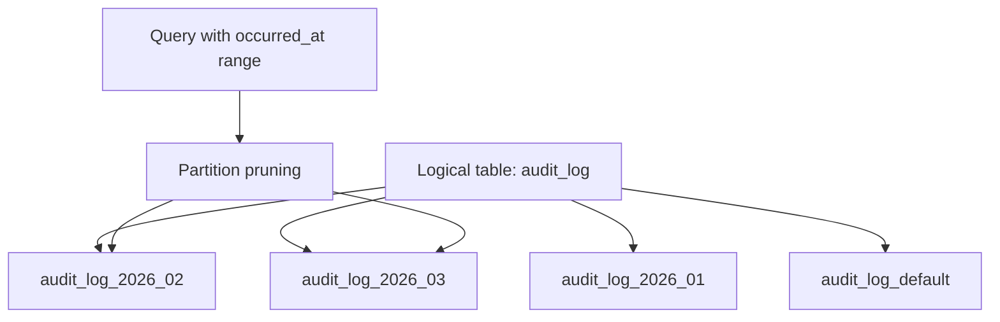
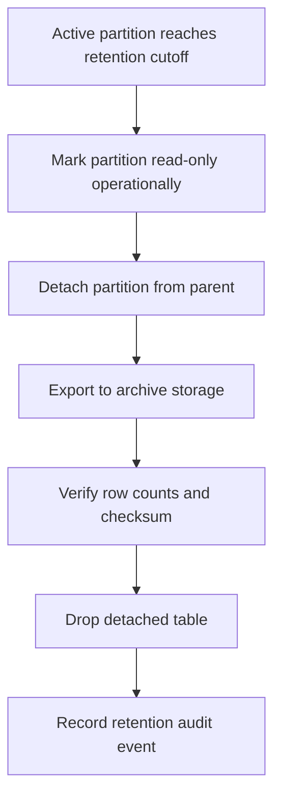

------
title: Learn PostgreSQL in Action - Part 020
description: Partitioning dan data lifecycle architecture di PostgreSQL untuk engineer Java yang perlu merancang tabel besar, retention, pruning, maintenance, archive, dan operational boundaries secara production-grade.
series: learn-postgresql-in-action
seriesTitle: Learn PostgreSQL in Action
order: 20
partTitle: Partitioning and Data Lifecycle Architecture
tags:
- postgresql
- partitioning
- lifecycle
- retention
- performance
- java
- operations
- series
date: 2026-07-01
---

# Part 020 — Partitioning and Data Lifecycle Architecture

## Learning Goal

Setelah part ini, kamu harus mampu memutuskan kapan PostgreSQL partitioning perlu dipakai, memilih partition key yang benar, merancang retention/archive flow, menghindari operational trap, dan memastikan query dari Java benar-benar mendapatkan partition pruning.

Targetnya bukan sekadar bisa menulis:

```sql
PARTITION BY RANGE (created_at)
```

Targetnya adalah bisa menjawab:

- Apakah tabel ini butuh partitioning atau cukup index yang benar?
- Partition key mana yang selaras dengan lifecycle data dan query shape?
- Bagaimana partitioning memengaruhi primary key, unique constraint, foreign key, index, vacuum, backup, dan migration?
- Bagaimana cara menghapus data lama tanpa `DELETE` jutaan row?
- Bagaimana memastikan prepared statements dari Java tetap memungkinkan pruning?
- Bagaimana mengoperasikan partition creation, attach/detach, default partition, dan monitoring?

## Kaufman Deconstruction

Partitioning adalah skill lintas query planning, schema design, data lifecycle, dan operations. Pecah menjadi sub-skill berikut:

| Sub-skill | Yang Harus Bisa Dilakukan | Bukti Penguasaan |
|---|---|---|
| Need diagnosis | Membedakan problem yang butuh partitioning vs problem indexing/query tuning | Tidak memakai partitioning sebagai silver bullet |
| Key selection | Memilih partition key berdasarkan pruning + lifecycle | Query utama selalu menyertakan partition key |
| DDL mechanics | Membuat range/list/hash partition, default partition, indexes | Insert/query berjalan tanpa surprise |
| Pruning verification | Membaca `EXPLAIN` dan memastikan partition pruning terjadi | Plan hanya menyentuh partition relevan |
| Lifecycle operations | Drop/detach/archive partition lama | Retention tidak menyebabkan table bloat besar |
| Java integration | Menghindari query shape yang menghambat pruning | Repository/service API memaksa boundary waktu/tenant yang tepat |

## Mental Model

Partitioning memecah satu logical table menjadi banyak physical child tables, tetapi aplikasi tetap melihatnya sebagai satu table.



Partitioning bukan terutama tentang membuat query individu selalu lebih cepat. Partitioning adalah tentang membuat **data lifecycle dan access path besar menjadi bounded**.

Manfaat utama:

1. partition pruning mengurangi physical data yang disentuh;
2. retention bisa dilakukan dengan `DROP`/`DETACH` partition, bukan massive `DELETE`;
3. vacuum impact lebih terisolasi;
4. index per partition lebih kecil;
5. maintenance bisa dilakukan per partition;
6. archive bisa dilakukan per time slice;
7. write/read locality bisa lebih baik bila partition key sesuai workload.

Risiko utama:

1. partition key salah → tidak ada pruning;
2. terlalu banyak partition → planning/management overhead;
3. uniqueness constraint menjadi lebih terbatas;
4. query tanpa partition predicate bisa menyentuh semua partition;
5. Java prepared statement/generic plan bisa memberi hasil pruning yang tidak sesuai ekspektasi jika query shape buruk;
6. operational job harus membuat future partitions sebelum data datang.

## When Partitioning Is Actually Needed

Partitioning bukan pengganti index, vacuum tuning, atau query optimization.

Pertimbangkan partitioning bila satu atau beberapa kondisi ini benar:

- data tumbuh terus secara time-based atau tenant-based;
- retention harus menghapus data lama secara besar dan rutin;
- tabel append-heavy dan historical data jarang berubah;
- query utama hampir selalu dibatasi oleh waktu/tenant/range tertentu;
- index global menjadi terlalu besar untuk maintenance/cache;
- vacuum pada tabel besar terlalu mahal;
- archive/offload perlu dilakukan per periode;
- table bloat/lifecycle operation menjadi operational pain.

Jangan mulai dengan partitioning jika:

- tabel masih kecil;
- query tidak menyertakan partition key;
- workload random access by primary key saja;
- problem sebenarnya adalah missing index;
- problem sebenarnya adalah query shape buruk;
- business belum jelas mengenai retention/lifecycle;
- tim belum siap mengoperasikan partition maintenance.

Rule praktis:

> Partition when data lifecycle has a natural boundary and your dominant queries can name that boundary.

## Partitioning Types

PostgreSQL declarative partitioning mendukung range, list, dan hash partitioning.

### Range Partitioning

Cocok untuk time-series, audit log, event table, transaction history, dan lifecycle-retention.

```sql
CREATE TABLE audit_log (
    id            uuid NOT NULL DEFAULT uuidv7(),
    resource_type text NOT NULL,
    resource_id   uuid NOT NULL,
    action        text NOT NULL,
    actor_id      text,
    occurred_at   timestamptz NOT NULL,
    payload       jsonb NOT NULL DEFAULT '{}'::jsonb,
    PRIMARY KEY (occurred_at, id)
) PARTITION BY RANGE (occurred_at);

CREATE TABLE audit_log_2026_07
PARTITION OF audit_log
FOR VALUES FROM ('2026-07-01') TO ('2026-08-01');

CREATE TABLE audit_log_2026_08
PARTITION OF audit_log
FOR VALUES FROM ('2026-08-01') TO ('2026-09-01');
```

Range partitioning adalah pilihan default untuk data dengan natural time lifecycle.

### List Partitioning

Cocok bila partition key adalah kategori diskrit yang relatif stabil.

```sql
CREATE TABLE integration_message (
    id          uuid NOT NULL DEFAULT uuidv7(),
    provider    text NOT NULL,
    received_at timestamptz NOT NULL DEFAULT now(),
    message_type text NOT NULL,
    payload     jsonb NOT NULL,
    PRIMARY KEY (provider, id)
) PARTITION BY LIST (provider);

CREATE TABLE integration_message_provider_a
PARTITION OF integration_message
FOR VALUES IN ('provider-a');

CREATE TABLE integration_message_provider_b
PARTITION OF integration_message
FOR VALUES IN ('provider-b');
```

Caution: list partitioning buruk jika kategori terus bertambah tanpa governance.

### Hash Partitioning

Cocok untuk menyebarkan data secara merata ketika tidak ada range/list lifecycle yang kuat.

```sql
CREATE TABLE account_event (
    account_id uuid NOT NULL,
    event_id   uuid NOT NULL DEFAULT uuidv7(),
    occurred_at timestamptz NOT NULL DEFAULT now(),
    payload    jsonb NOT NULL,
    PRIMARY KEY (account_id, event_id)
) PARTITION BY HASH (account_id);

CREATE TABLE account_event_p0
PARTITION OF account_event
FOR VALUES WITH (MODULUS 8, REMAINDER 0);

CREATE TABLE account_event_p1
PARTITION OF account_event
FOR VALUES WITH (MODULUS 8, REMAINDER 1);
```

Hash partitioning tidak membantu retention time-based secara langsung. Ia lebih cocok untuk spreading and bounding per-key data volume.

## Choosing the Partition Key

Partition key harus dipilih berdasarkan dua hal:

1. query pruning;
2. lifecycle operation.

Contoh audit table:

- most queries: `WHERE occurred_at >= ? AND occurred_at < ?`;
- retention: drop data older than 2 years;
- partition key: `occurred_at`.

Contoh SaaS tenant data:

- most queries: `WHERE tenant_id = ?`;
- tenant isolation: backup/export/delete per tenant;
- partition key: `tenant_id` with list/hash strategy, or composite strategy with time depending on volume.

Contoh regulatory case:

- active cases queried by lifecycle state;
- historical events queried by `case_id` and time;
- retention applies to events, not cases;
- partition `case_event` by `occurred_at`, not `lifecycle_state`.

Bad partition key example:

```sql
PARTITION BY LIST (lifecycle_state)
```

This looks attractive for workflow, but state changes. Moving rows across partitions on every state change creates write overhead and operational complexity. Mutable partition keys are usually a smell.

Better:

- keep `lifecycle_state` indexed;
- partition immutable high-volume history by time;
- use partial indexes for active states.

## Partition Key Decision Checklist

Choose a key that is:

- present at insert time;
- usually immutable;
- present in dominant query predicates;
- aligned with retention/archive;
- not too high-cardinality for list partitions;
- not too low-cardinality for range partitions;
- compatible with uniqueness constraints;
- easy for application APIs to require.

Bad:

```sql
PARTITION BY RANGE (updated_at)
```

`updated_at` changes often. Row movement across partitions can happen.

Better:

```sql
PARTITION BY RANGE (created_at)
```

or:

```sql
PARTITION BY RANGE (occurred_at)
```

for immutable event time.

## Partition Pruning

Partition pruning is the planner/executor removing partitions that cannot contain matching rows.

Good query:

```sql
EXPLAIN
SELECT id, action, occurred_at
FROM audit_log
WHERE occurred_at >= timestamptz '2026-07-01'
  AND occurred_at <  timestamptz '2026-08-01'
ORDER BY occurred_at DESC
LIMIT 100;
```

Expected mental result:

```text
Only audit_log_2026_07 should be scanned.
```

Bad query:

```sql
SELECT id, action, occurred_at
FROM audit_log
WHERE date(occurred_at) = date '2026-07-15';
```

This wraps the partition key in a function. It can make pruning harder and may prevent index usage.

Better:

```sql
SELECT id, action, occurred_at
FROM audit_log
WHERE occurred_at >= timestamptz '2026-07-15 00:00:00+00'
  AND occurred_at <  timestamptz '2026-07-16 00:00:00+00';
```

Use half-open ranges.

## Prepared Statements and Java

In Java, you usually use bind parameters:

```sql
SELECT id, action, occurred_at
FROM audit_log
WHERE occurred_at >= ?
  AND occurred_at < ?
ORDER BY occurred_at DESC
LIMIT ?;
```

This is fine when the predicate is direct and typed correctly.

Avoid query builders that produce:

```sql
WHERE date(occurred_at) = ?
```

or:

```sql
WHERE occurred_at::text LIKE ?
```

These destroy the planner’s ability to reason cleanly about partition bounds and indexes.

Java repository boundary should force a time range:

```java
public interface AuditLogRepository {
    List<AuditLogRow> findByResourceWithinTimeRange(
        String resourceType,
        UUID resourceId,
        Instant fromInclusive,
        Instant toExclusive,
        int limit
    );
}
```

Do not expose:

```java
List<AuditLogRow> search(AuditSearchFilter filter);
```

unless the filter contract requires bounded time.

## Primary Key and Unique Constraints on Partitioned Tables

A key PostgreSQL constraint: unique constraints on partitioned tables must include the partition key. This is necessary because PostgreSQL does not maintain a global unique index across all partitions in the same way a single table does.

Example:

```sql
CREATE TABLE audit_log (
    id          uuid NOT NULL DEFAULT uuidv7(),
    occurred_at timestamptz NOT NULL,
    action      text NOT NULL,
    payload     jsonb NOT NULL,
    PRIMARY KEY (occurred_at, id)
) PARTITION BY RANGE (occurred_at);
```

Why not simply `PRIMARY KEY (id)`?

Because uniqueness of `id` across all partitions cannot be enforced by a local per-partition unique index unless the partition key participates in the constraint.

Design options:

1. include partition key in PK;
2. accept per-partition uniqueness and enforce global uniqueness elsewhere;
3. use a separate non-partitioned identity registry table;
4. avoid partitioning that table if global uniqueness is central and query volume does not need partitioning.

For UUID primary keys generated by `uuidv7()`, collision risk is practically negligible, but constraint semantics still matter for relational integrity and FK design.

## Indexes on Partitioned Tables

Creating an index on partitioned parent creates partitioned index metadata and corresponding indexes on partitions, depending on command and existing partitions.

```sql
CREATE INDEX idx_audit_resource_time
ON audit_log (resource_type, resource_id, occurred_at DESC, id);
```

Think of indexes as local to partitions for operational cost.

Benefits:

- each partition index is smaller;
- index maintenance can be isolated;
- old partitions can have different maintenance treatment;
- recently active partitions stay hot.

Risks:

- too many indexes multiplied by many partitions;
- index creation on many partitions can be operationally expensive;
- new partition creation must include expected indexes;
- query without pruning may scan many local indexes.

## Local Index Design

For a time-partitioned audit table, common indexes:

```sql
CREATE INDEX idx_audit_resource_time
ON audit_log (resource_type, resource_id, occurred_at DESC, id);

CREATE INDEX idx_audit_action_time
ON audit_log (action, occurred_at DESC, id);

CREATE INDEX idx_audit_actor_time
ON audit_log (actor_id, occurred_at DESC, id)
WHERE actor_id IS NOT NULL;
```

Note that `occurred_at` appears in indexes because it is both partition key and ordering/filtering dimension.

But avoid over-indexing payload columns across every partition unless proven necessary.

## Default Partition

A default partition catches rows that do not match existing partition bounds.

```sql
CREATE TABLE audit_log_default
PARTITION OF audit_log
DEFAULT;
```

This can prevent production insert failures when a future partition was not created.

But it is not a place to leave data forever.

Operational rule:

- default partition should normally be empty;
- monitor it;
- alert if row count > 0;
- move valid rows to proper partitions;
- investigate partition creation gap.

Diagnostic:

```sql
SELECT count(*)
FROM audit_log_default;
```

Default partition is a safety net, not a lifecycle strategy.

## Creating Future Partitions

For monthly partitions:

```sql
CREATE TABLE audit_log_2026_09
PARTITION OF audit_log
FOR VALUES FROM ('2026-09-01') TO ('2026-10-01');
```

Production systems should create partitions ahead of time.

A simple operational approach:

- create partitions 3–6 months ahead;
- run a daily job that verifies future partition coverage;
- alert when missing;
- use migration-managed DDL for known horizons;
- use scheduled DB job or ops automation for rolling windows.

Validation query pattern:

```sql
SELECT
    inhrelid::regclass AS partition_name
FROM pg_inherits
WHERE inhparent = 'audit_log'::regclass
ORDER BY partition_name::text;
```

## Attaching Existing Table as Partition

For large backfills, create and load a standalone table, index it, validate constraints, then attach.

```sql
CREATE TABLE audit_log_2026_06_staging
(LIKE audit_log INCLUDING DEFAULTS INCLUDING CONSTRAINTS);

ALTER TABLE audit_log_2026_06_staging
ADD CONSTRAINT audit_log_2026_06_bounds_chk
CHECK (
    occurred_at >= timestamptz '2026-06-01'
    AND occurred_at < timestamptz '2026-07-01'
);

-- Load data into staging table here.
-- Create indexes here.

ALTER TABLE audit_log
ATTACH PARTITION audit_log_2026_06_staging
FOR VALUES FROM ('2026-06-01') TO ('2026-07-01');
```

Pre-validating bounds helps avoid expensive scans during attach.

## Retention: Drop or Detach, Not Massive Delete

Without partitioning, deleting old data often looks like:

```sql
DELETE FROM audit_log
WHERE occurred_at < now() - interval '2 years';
```

On a huge table, this can create:

- many dead tuples;
- long-running transactions;
- WAL volume;
- autovacuum pressure;
- lock/contention risk;
- replica lag.

With partitioning:

```sql
DROP TABLE audit_log_2024_06;
```

or:

```sql
ALTER TABLE audit_log
DETACH PARTITION audit_log_2024_06;
```

Then archive/drop separately.

Retention is one of the strongest reasons to partition.

## Archive Flow

A defensible archive flow:



Example:

```sql
ALTER TABLE audit_log
DETACH PARTITION audit_log_2024_06;

-- Export with pg_dump, COPY, or controlled archive pipeline.

DROP TABLE audit_log_2024_06;
```

For regulated systems, archive/delete should produce an audit record:

```sql
CREATE TABLE data_retention_action (
    id             uuid PRIMARY KEY DEFAULT uuidv7(),
    table_name     text NOT NULL,
    partition_name text NOT NULL,
    action         text NOT NULL,
    cutoff_start   timestamptz NOT NULL,
    cutoff_end     timestamptz NOT NULL,
    executed_at    timestamptz NOT NULL DEFAULT now(),
    executed_by    text NOT NULL,
    row_count      bigint,
    checksum       text,
    metadata       jsonb NOT NULL DEFAULT '{}'::jsonb
);
```

## Partitioning and Vacuum

Partitioning helps vacuum because old partitions may become cold or read-only.

Benefits:

- active partition receives most inserts/updates/deletes;
- historical partitions need less vacuum;
- per-partition bloat can be inspected separately;
- retention can drop whole partitions instead of creating dead tuples.

But partitioning does not eliminate vacuum.

Active partitions still need autovacuum. If updates/deletes happen inside active partitions, bloat still occurs.

Diagnostic:

```sql
SELECT
    relname,
    n_live_tup,
    n_dead_tup,
    last_vacuum,
    last_autovacuum,
    vacuum_count,
    autovacuum_count
FROM pg_stat_user_tables
WHERE relname LIKE 'audit_log_%'
ORDER BY n_dead_tup DESC;
```

## Partitioning and Foreign Keys

Foreign keys with partitioned tables are supported, but design must be explicit.

Questions to ask:

- Is the partitioned table parent or child?
- Does FK reference include partition key?
- Will deletes cascade across huge partitions?
- Are referenced rows retained longer than referencing rows?
- Does archive/drop violate FK constraints?

Example risk:

```sql
CREATE TABLE case_event (
    case_id uuid NOT NULL REFERENCES enforcement_case(id),
    occurred_at timestamptz NOT NULL,
    ...
) PARTITION BY RANGE (occurred_at);
```

If `enforcement_case` is retained for 10 years but `case_event` for 2 years, that is fine.

If the parent `enforcement_case` is deleted while event partitions remain, FK prevents deletion unless cascade is configured. For regulated systems, cascade delete is often dangerous.

## Partitioning and Multi-Tenancy

Partitioning can support tenant isolation, but choose carefully.

### Option 1: Hash Partition by Tenant

```sql
CREATE TABLE tenant_event (
    tenant_id uuid NOT NULL,
    event_id  uuid NOT NULL DEFAULT uuidv7(),
    occurred_at timestamptz NOT NULL,
    payload jsonb NOT NULL,
    PRIMARY KEY (tenant_id, event_id)
) PARTITION BY HASH (tenant_id);
```

Good for spreading tenant data.

Weak for tenant-specific retention if you need detach/drop one tenant easily; hash partitions contain many tenants.

### Option 2: List Partition by Tenant

```sql
CREATE TABLE tenant_event (
    tenant_id uuid NOT NULL,
    event_id uuid NOT NULL DEFAULT uuidv7(),
    occurred_at timestamptz NOT NULL,
    payload jsonb NOT NULL,
    PRIMARY KEY (tenant_id, event_id)
) PARTITION BY LIST (tenant_id);
```

Good for strong tenant lifecycle isolation, but only if tenant count is manageable.

Bad if you have thousands of tenants and each gets a partition without governance.

### Option 3: Time Partition + Tenant Index

Often best for event/audit data:

```sql
PARTITION BY RANGE (occurred_at)
```

with local index:

```sql
CREATE INDEX idx_tenant_event_tenant_time
ON tenant_event (tenant_id, occurred_at DESC, event_id);
```

This supports time retention and tenant queries.

## Subpartitioning

PostgreSQL supports nested partitioning by creating a partition that is itself partitioned.

Example: range by month, hash by tenant inside each month.

```sql
CREATE TABLE tenant_event (
    tenant_id uuid NOT NULL,
    event_id uuid NOT NULL DEFAULT uuidv7(),
    occurred_at timestamptz NOT NULL,
    payload jsonb NOT NULL,
    PRIMARY KEY (occurred_at, tenant_id, event_id)
) PARTITION BY RANGE (occurred_at);

CREATE TABLE tenant_event_2026_07
PARTITION OF tenant_event
FOR VALUES FROM ('2026-07-01') TO ('2026-08-01')
PARTITION BY HASH (tenant_id);

CREATE TABLE tenant_event_2026_07_p0
PARTITION OF tenant_event_2026_07
FOR VALUES WITH (MODULUS 4, REMAINDER 0);
```

Use subpartitioning only when complexity is justified. It multiplies object count and operational work.

## Query Shape Patterns

### Good: Time-Bounded Resource Query

```sql
SELECT id, action, occurred_at
FROM audit_log
WHERE resource_type = $1
  AND resource_id = $2
  AND occurred_at >= $3
  AND occurred_at < $4
ORDER BY occurred_at DESC
LIMIT $5;
```

Index:

```sql
CREATE INDEX idx_audit_resource_time
ON audit_log (resource_type, resource_id, occurred_at DESC, id);
```

### Bad: Unbounded Resource Query

```sql
SELECT id, action, occurred_at
FROM audit_log
WHERE resource_type = $1
  AND resource_id = $2
ORDER BY occurred_at DESC
LIMIT 100;
```

This may scan many partition indexes because no time bound exists.

If product wants “latest 100 events”, you need a strategy:

- query recent partitions first;
- enforce default time window;
- maintain summary/latest table;
- use a non-partitioned current-events table;
- accept bounded scan over recent N partitions.

### Good: Current Window API

```java
List<AuditLogRow> findRecentResourceEvents(
    String resourceType,
    UUID resourceId,
    Duration lookback,
    int limit
);
```

Then translate to:

```sql
WHERE occurred_at >= now() - ?::interval
```

But be careful: for plan stability, explicit timestamps from application are often clearer than dynamic expressions.

Better:

```java
Instant to = clock.instant();
Instant from = to.minus(lookback);
```

Then bind `from` and `to`.

## Partitioning and Reporting

Reporting queries often scan broad ranges. Partitioning helps when reports are naturally date-bounded.

Example:

```sql
SELECT date_trunc('day', occurred_at) AS day,
       action,
       count(*)
FROM audit_log
WHERE occurred_at >= $1
  AND occurred_at < $2
GROUP BY 1, 2
ORDER BY 1, 2;
```

If reports frequently scan years of data, partitioning alone is not enough. Consider:

- summary tables;
- materialized views;
- rollups per day/month;
- analytical replica;
- OLAP system/export;
- BRIN indexes for append-only history.

## BRIN + Partitioning

For append-only time-ordered data, BRIN indexes can be very efficient.

```sql
CREATE INDEX idx_audit_occurred_brin
ON audit_log
USING brin (occurred_at);
```

BRIN is not a replacement for B-tree where you need precise point lookup/order. It shines when physical ordering correlates with indexed column and large scans can skip page ranges.

For time-partitioned append-only tables:

- B-tree for hot lookup patterns;
- BRIN for broad time scans;
- partition pruning for coarse exclusion.

## Operational Monitoring

### List Partitions

```sql
SELECT
    parent.relname AS parent,
    child.relname AS partition
FROM pg_inherits
JOIN pg_class parent ON pg_inherits.inhparent = parent.oid
JOIN pg_class child ON pg_inherits.inhrelid = child.oid
WHERE parent.relname = 'audit_log'
ORDER BY child.relname;
```

### Estimate Partition Sizes

```sql
SELECT
    relname,
    pg_size_pretty(pg_total_relation_size(relid)) AS total_size,
    n_live_tup,
    n_dead_tup
FROM pg_stat_user_tables
WHERE relname LIKE 'audit_log_%'
ORDER BY pg_total_relation_size(relid) DESC;
```

### Check Default Partition

```sql
SELECT count(*) AS default_rows
FROM audit_log_default;
```

### Find Queries Touching Parent

```sql
SELECT
    calls,
    mean_exec_time,
    rows,
    query
FROM pg_stat_statements
WHERE query ILIKE '%audit_log%'
ORDER BY mean_exec_time DESC
LIMIT 20;
```

Then run representative queries with:

```sql
EXPLAIN (ANALYZE, BUFFERS)
...
```

Look for whether many partitions are scanned.

## Partition Count Governance

Too few partitions:

- each partition remains huge;
- retention still coarse;
- index maintenance remains heavy.

Too many partitions:

- planning overhead;
- catalog/object management overhead;
- migration complexity;
- monitoring noise;
- index multiplication.

Common starting points:

- monthly partitions for audit/event tables with moderate volume;
- daily partitions for very high write volume or strict daily retention/archive;
- hash partitions with fixed modulus for very large tenant/account distribution;
- avoid per-user/per-case partitions.

Do not create a partition per business object unless object count is small and operationally justified.

## Migration from Non-Partitioned to Partitioned Table

PostgreSQL does not simply flip a regular table into a partitioned table in-place in the way teams often wish. Plan migration carefully.

### Approach 1: Create New Partitioned Table + Backfill + Swap

1. Create new partitioned table.
2. Create partitions and indexes.
3. Dual-write or pause writes.
4. Backfill in batches.
5. Validate counts/checksums.
6. Swap names in maintenance window or use view/compatibility layer.
7. Drop old table after safety period.

### Approach 2: Attach Existing Tables as Partitions

If historical data can be split into standalone tables with valid constraints, attach them.

### Approach 3: Logical Replication / CDC Assisted Migration

For very large production tables:

- create target partitioned table;
- backfill snapshot;
- stream changes;
- cut over once lag is zero;
- verify.

This is complex but safer for high-availability systems.

## Java and Partition-Aware API Design

Bad service design:

```java
List<AuditLogRow> searchAuditLogs(AuditFilter filter);
```

Problem: nothing forces the caller to bound time.

Better:

```java
public record AuditTimeWindow(
    Instant fromInclusive,
    Instant toExclusive
) {
    public AuditTimeWindow {
        if (!fromInclusive.isBefore(toExclusive)) {
            throw new IllegalArgumentException("fromInclusive must be before toExclusive");
        }
        if (Duration.between(fromInclusive, toExclusive).compareTo(Duration.ofDays(31)) > 0) {
            throw new IllegalArgumentException("audit query window too large for online endpoint");
        }
    }
}
```

Then:

```java
List<AuditLogRow> findAuditLogs(
    AuditTimeWindow window,
    String resourceType,
    UUID resourceId,
    int limit
);
```

This makes partition pruning an application invariant.

## Online Endpoint vs Batch Endpoint

Partitioning should influence API design.

Online endpoint:

- strict time window;
- limit required;
- index-supported ordering;
- no unbounded exports;
- timeout budget small.

Batch/reporting endpoint:

- broader ranges allowed;
- async job;
- progress tracking;
- statement timeout tuned separately;
- may run on replica/warehouse;
- may use cursor streaming.

Do not let UI search accidentally become full-history partition scan.

## Failure Modes

### Failure Mode 1: Missing Future Partition

Symptom:

- inserts fail when data arrives for a new range;
- or rows land in default partition.

Prevention:

- create future partitions ahead;
- monitor partition coverage;
- alert on default rows.

### Failure Mode 2: Query Does Not Prune

Symptom:

- `EXPLAIN` shows Append scanning many partitions;
- latency grows as partitions grow.

Causes:

- no predicate on partition key;
- function-wrapped partition key;
- wrong data type/cast;
- optional filter omitted;
- generic query API.

### Failure Mode 3: Too Many Partitions

Symptom:

- planning overhead;
- catalog bloat;
- migration pain;
- operational scripts slow.

Prevention:

- choose partition interval carefully;
- avoid per-entity partitions;
- monitor object count;
- merge/archive old partitions if needed.

### Failure Mode 4: Unique Constraint Surprise

Symptom:

- cannot create desired unique constraint;
- FK design becomes awkward.

Cause:

- unique constraint does not include partition key.

Prevention:

- design identity and partition key together;
- use composite keys;
- separate identity registry if needed.

### Failure Mode 5: Retention Breaks FK or Compliance

Symptom:

- cannot drop partition due to dependencies;
- archive incomplete;
- audit gap.

Prevention:

- model retention policy explicitly;
- check FK direction;
- record retention actions;
- run restore/archive verification.

## Practice Lab

### Lab 1: Create Partitioned Audit Table

```sql
DROP TABLE IF EXISTS audit_log CASCADE;

CREATE TABLE audit_log (
    id            uuid NOT NULL DEFAULT uuidv7(),
    resource_type text NOT NULL,
    resource_id   uuid NOT NULL,
    action        text NOT NULL,
    actor_id      text,
    occurred_at   timestamptz NOT NULL,
    payload       jsonb NOT NULL DEFAULT '{}'::jsonb,
    PRIMARY KEY (occurred_at, id)
) PARTITION BY RANGE (occurred_at);

CREATE TABLE audit_log_2026_07
PARTITION OF audit_log
FOR VALUES FROM ('2026-07-01') TO ('2026-08-01');

CREATE TABLE audit_log_2026_08
PARTITION OF audit_log
FOR VALUES FROM ('2026-08-01') TO ('2026-09-01');

CREATE TABLE audit_log_default
PARTITION OF audit_log
DEFAULT;
```

### Lab 2: Create Indexes

```sql
CREATE INDEX idx_audit_resource_time
ON audit_log (resource_type, resource_id, occurred_at DESC, id);

CREATE INDEX idx_audit_action_time
ON audit_log (action, occurred_at DESC, id);
```

### Lab 3: Seed Data

```sql
INSERT INTO audit_log (
    resource_type,
    resource_id,
    action,
    actor_id,
    occurred_at,
    payload
)
SELECT
    (ARRAY['case', 'subject', 'document'])[1 + (random() * 2)::int],
    uuidv7(),
    (ARRAY['created', 'updated', 'assigned', 'closed'])[1 + (random() * 3)::int],
    'user-' || (1 + (random() * 100)::int),
    timestamptz '2026-07-01' + (random() * interval '60 days'),
    jsonb_build_object('source', 'lab', 'seq', gs)
FROM generate_series(1, 200000) gs;

ANALYZE audit_log;
```

### Lab 4: Verify Partition Routing

```sql
SELECT tableoid::regclass AS partition_name, count(*)
FROM audit_log
GROUP BY tableoid::regclass
ORDER BY 1;
```

### Lab 5: Verify Pruning

```sql
EXPLAIN (ANALYZE, BUFFERS)
SELECT id, action, occurred_at
FROM audit_log
WHERE occurred_at >= timestamptz '2026-07-10'
  AND occurred_at <  timestamptz '2026-07-11'
ORDER BY occurred_at DESC
LIMIT 100;
```

Expected: only July partition should be touched.

### Lab 6: Break Pruning with Bad Query Shape

```sql
EXPLAIN (ANALYZE, BUFFERS)
SELECT id, action, occurred_at
FROM audit_log
WHERE date(occurred_at) = date '2026-07-10'
ORDER BY occurred_at DESC
LIMIT 100;
```

Compare plan and buffers.

### Lab 7: Retention Simulation

```sql
ALTER TABLE audit_log
DETACH PARTITION audit_log_2026_07;

SELECT count(*) FROM audit_log_2026_07;

DROP TABLE audit_log_2026_07;
```

Notice retention deletes a whole time slice without row-by-row delete.

## Production Checklist

Before introducing partitioning:

- What exact problem are we solving: pruning, retention, vacuum, index size, archive, tenant isolation?
- What is the partition key?
- Is the key immutable?
- Do dominant queries include the key?
- Does Java API require a bounded predicate?
- What is partition interval/count?
- How are future partitions created?
- Is there a default partition?
- How is default partition monitored?
- What indexes exist on every partition?
- What uniqueness constraints are required?
- Does PK include partition key?
- Are FKs compatible with retention?
- What is the archive/drop process?
- Is there a restore test?
- Does `EXPLAIN` prove pruning?

## Self-Correction Drills

1. Take a large non-partitioned audit/event table. Decide whether it should be partitioned and justify using query/lifecycle evidence.
2. Create a time-partitioned table and intentionally write one query that prunes and one that does not.
3. Try to create `PRIMARY KEY (id)` on a range-partitioned table. Explain why PostgreSQL rejects or constrains this design.
4. Design a retention workflow that detaches, exports, verifies, and drops a partition.
5. Refactor a Java repository method so every online query includes a time window.
6. Compare monthly vs daily partitions for the same workload and explain operational trade-offs.

## Mental Model Summary

Partitioning is not a magic performance feature. It is a way to make large data physically and operationally bounded.

Good partitioning happens when three things align:

1. data lifecycle boundary;
2. query predicate boundary;
3. operational maintenance boundary.

If those three do not align, partitioning can add complexity without solving the real problem.

Top-level rule:

> Partition by the dimension that your system uses to forget, archive, or exclude data.

## References

- PostgreSQL Documentation — Table Partitioning: https://www.postgresql.org/docs/current/ddl-partitioning.html
- PostgreSQL Documentation — Partition Pruning: https://www.postgresql.org/docs/current/ddl-partitioning.html#DDL-PARTITION-PRUNING
- PostgreSQL Documentation — Best Practices for Declarative Partitioning: https://www.postgresql.org/docs/current/ddl-partitioning.html#DDL-PARTITIONING-DECLARATIVE-BEST-PRACTICES
- PostgreSQL Documentation — CREATE TABLE: https://www.postgresql.org/docs/current/sql-createtable.html
- PostgreSQL Documentation — Indexes: https://www.postgresql.org/docs/current/indexes.html
