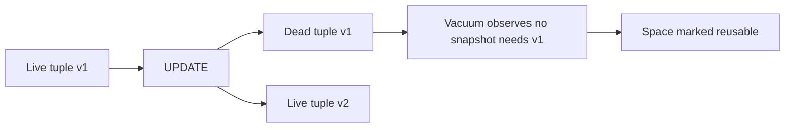
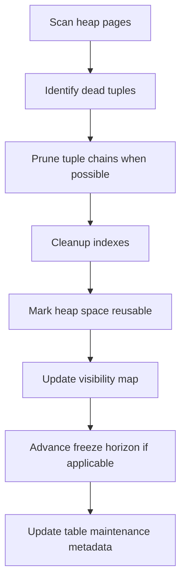
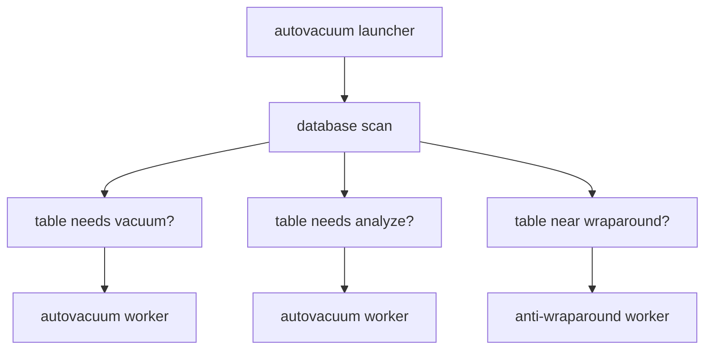
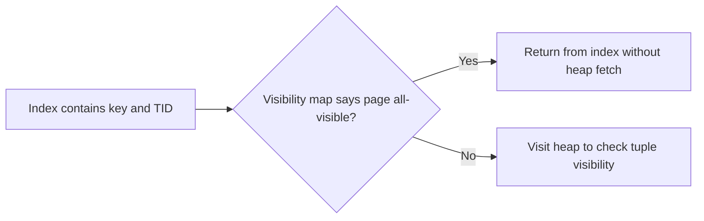

------
title: Learn PostgreSQL in Action - Part 021
description: Vacuum, autovacuum, freeze, transaction ID wraparound, bloat control, and maintenance engineering for production PostgreSQL.
series: learn-postgresql-in-action
seriesTitle: Learn PostgreSQL in Action
order: 21
partTitle: Vacuum, Autovacuum, Freeze, and Wraparound
tags:
- postgresql
- database
- vacuum
- autovacuum
- mvcc
- performance
- java
- series
date: 2026-07-01
---

# Part 021 — Vacuum, Autovacuum, Freeze, and Wraparound

Pada part sebelumnya kita sudah membangun mental model storage, MVCC, lock, planner, index, JSONB, dan partitioning. Sekarang kita masuk ke salah satu area PostgreSQL yang paling sering disalahpahami di production: **vacuum**.

Banyak engineer melihat vacuum sebagai job maintenance yang “membersihkan sampah”. Itu tidak salah, tetapi terlalu dangkal. Dalam PostgreSQL, vacuum adalah bagian dari **correctness, storage reuse, planner accuracy, visibility optimization, dan anti-wraparound safety**.

Kalau vacuum gagal, gejalanya bisa muncul sebagai:

- disk usage terus naik walaupun row count stabil;
- query makin lambat karena membaca terlalu banyak dead tuple;
- index membesar dan makin mahal dipakai;
- planner memilih plan buruk karena statistik stale;
- autovacuum tampak “mengganggu” workload;
- transaksi lama membuat dead tuple tidak bisa dibersihkan;
- replication slot menahan WAL;
- database mendekati transaction ID wraparound dan mulai memaksa emergency vacuum.

Top engineer tidak menanyakan “apakah vacuum jalan?”. Mereka menanyakan:

> Apakah tiap table memiliki lifecycle dead tuple yang stabil, statistik yang cukup segar, freeze horizon yang aman, dan maintenance cost yang seimbang dengan workload write-nya?

Itu mental model yang akan kita bangun di part ini.

---

## 1. Problem yang Diselesaikan Vacuum

PostgreSQL memakai MVCC. Ketika sebuah row di-`UPDATE` atau di-`DELETE`, PostgreSQL tidak langsung menghapus versi lama dari disk karena versi lama itu mungkin masih terlihat oleh transaksi lain.

Contoh:

```sql
BEGIN; -- session A
SELECT * FROM accounts WHERE id = 1;

-- session B
UPDATE accounts SET balance = balance + 100 WHERE id = 1;
COMMIT;

-- session A masih mungkin perlu melihat versi lama tergantung snapshot-nya.
```

Konsekuensinya:

- `UPDATE` menciptakan versi row baru;
- versi row lama menjadi obsolete hanya setelah tidak ada transaksi yang masih bisa melihatnya;
- versi obsolete disebut dead tuple;
- dead tuple tetap mengambil ruang di heap dan index sampai dibersihkan;
- PostgreSQL butuh proses maintenance untuk menandai ruang itu reusable.

Itulah fungsi utama vacuum.

Namun vacuum tidak hanya satu fungsi. Ia memiliki beberapa peran:

| Peran | Penjelasan |
|---|---|
| Space reuse | Menandai space dead tuple agar bisa dipakai lagi oleh row baru. |
| Index cleanup | Menghapus atau menandai entry index yang mengarah ke tuple mati. |
| Visibility map update | Menandai page yang semua tuple-nya visible agar index-only scan bisa efisien. |
| Freeze | Mengganti transaction ID lama agar tidak terkena wraparound. |
| Statistics maintenance | `VACUUM ANALYZE` atau autovacuum analyze memperbarui statistik planner. |
| Production safety | Mencegah database masuk kondisi anti-wraparound emergency. |

Vacuum bukan optional housekeeping. Ia adalah bagian dari mesin PostgreSQL.

---

## 2. Mental Model: Heap Table sebagai Conveyor Belt Versi Row

Bayangkan heap table sebagai conveyor belt yang menampung versi row.



Yang penting:

- vacuum biasa tidak selalu mengecilkan file table;
- vacuum membuat ruang internal bisa dipakai ulang;
- file baru benar-benar menyusut hanya jika free pages berada di akhir relation dan lock eksklusif bisa diperoleh, atau lewat rewrite seperti `VACUUM FULL`, `CLUSTER`, atau beberapa bentuk `ALTER TABLE`;
- `VACUUM FULL` bukan versi lebih baik dari vacuum biasa. Ia operasi rewrite yang lebih mahal dan lebih disruptive.

Mental model production:

```txt
Healthy table size = live data + steady-state churn buffer
Unhealthy bloat    = live data + dead tuple lama + reusable space yang tidak sesuai workload + index bloat
```

Tujuan vacuum bukan membuat ukuran table selalu minimum. Tujuannya menjaga ukuran table pada **steady-state yang sehat**.

---

## 3. Vocabulary yang Harus Dipegang

| Istilah | Arti Production |
|---|---|
| Live tuple | Versi row yang masih valid untuk transaksi saat ini atau future snapshot. |
| Dead tuple | Versi row lama hasil update/delete yang sudah tidak perlu secara logical. |
| Bloat | Space yang terpakai di relation/index tetapi tidak memberi nilai query proporsional. |
| Visibility map | Metadata page-level untuk mengetahui page yang semua tuple-nya visible. |
| Free space map | Metadata untuk menemukan free space saat insert/update. |
| Freeze | Proses menandai tuple lama agar tidak bergantung pada XID lama. |
| `relfrozenxid` | XID tertua yang masih perlu dipertimbangkan untuk sebuah table. |
| `datfrozenxid` | Horizon freeze database, dihitung dari table-table di dalam database. |
| Wraparound | Risiko ketika counter transaction ID 32-bit berputar dan visibility bisa salah jika tuple lama tidak di-freeze. |
| Autovacuum | Daemon PostgreSQL yang menjalankan vacuum/analyze otomatis berdasarkan perubahan table dan umur XID. |
| Anti-wraparound vacuum | Vacuum prioritas tinggi untuk mencegah transaction ID wraparound. |

---

## 4. Vacuum Biasa vs VACUUM FULL

Ini perbedaan yang harus selalu jelas.

| Operasi | Menghapus dead tuple | Reuse space internal | Mengembalikan disk ke OS | Lock impact | Kapan dipakai |
|---|---:|---:|---:|---|---|
| `VACUUM` | Ya | Ya | Umumnya tidak | Relatif ringan | Routine maintenance. |
| `VACUUM ANALYZE` | Ya | Ya | Umumnya tidak | Relatif ringan | Setelah banyak perubahan data dan butuh statistik segar. |
| `VACUUM FULL` | Ya | Ya | Ya | `ACCESS EXCLUSIVE`, rewrite table | Emergency shrink / setelah massive delete yang tidak akan tumbuh lagi. |
| `TRUNCATE` | Menghapus semua row | N/A | Ya | Kuat | Kalau seluruh isi table memang dibuang. |
| `CLUSTER` | Rewrite sesuai index order | Ya | Ya | Kuat | Reorganisasi fisik khusus, bukan routine default. |
| `REINDEX` | Rebuild index | N/A | Untuk index | Bergantung mode | Index bloat/corruption/struktur index buruk. |

Kesalahan umum:

```sql
VACUUM FULL orders;
```

Dipakai sebagai rutinitas mingguan pada table OLTP besar. Ini sering buruk karena:

- membutuhkan lock kuat;
- membuat copy baru table;
- memerlukan extra disk space sementara;
- mengganggu application traffic;
- bloat bisa kembali jika pola write masih sama.

Strategi lebih sehat:

```sql
VACUUM (ANALYZE) orders;
```

Ditambah tuning autovacuum per table jika churn tinggi.

---

## 5. Apa yang Sebenarnya Dilakukan VACUUM

Vacuum tidak sekadar `DELETE FROM internal_garbage`.

Secara high-level:



Detail penting:

1. Vacuum membaca heap untuk menemukan dead tuple.
2. Jika perlu, vacuum membersihkan index entry yang menunjuk ke tuple mati.
3. Vacuum menandai space sebagai reusable, bukan selalu mengecilkan file.
4. Vacuum memperbarui visibility map.
5. Vacuum bisa melakukan freeze terhadap tuple lama.
6. Vacuum dapat berjalan dengan cost delay agar tidak menghajar I/O terlalu agresif.

---

## 6. Dead Tuple Lifecycle

Dead tuple tidak langsung bisa dibersihkan. Ia baru aman dibersihkan jika tidak ada snapshot aktif yang masih bisa melihatnya.

```mermaid
sequenceDiagram
    participant T1 as Long Transaction
    participant T2 as Writer Transaction
    participant H as Heap
    participant V as Vacuum

    T1->>H: SELECT creates old snapshot
    T2->>H: UPDATE row creates new tuple
    T2->>H: Old tuple becomes logically dead
    V->>H: Vacuum checks old tuple
    H-->>V: Cannot remove; T1 snapshot may need it
    T1->>H: COMMIT
    V->>H: Later vacuum removes/reuses dead tuple
```

Production implication:

- long-running transaction bisa menahan vacuum;
- `idle in transaction` adalah bloat generator;
- long analytical query di primary bisa menahan dead tuple cleanup;
- streaming cursor yang dibuka lama dari Java juga bisa memperpanjang snapshot;
- replication/hot standby feedback bisa memperpanjang horizon cleanup.

---

## 7. Autovacuum Trigger Formula

Autovacuum tidak berjalan “setiap X menit untuk semua table”. Ia berjalan berdasarkan activity threshold.

Formula konseptual vacuum trigger:

```txt
autovacuum vacuum trigger = autovacuum_vacuum_threshold
                            + autovacuum_vacuum_scale_factor * estimated_table_rows
```

Formula analyze trigger:

```txt
autovacuum analyze trigger = autovacuum_analyze_threshold
                             + autovacuum_analyze_scale_factor * estimated_table_rows
```

Untuk insert-heavy table, PostgreSQL juga memiliki parameter insert-trigger vacuum seperti:

```txt
autovacuum_vacuum_insert_threshold
autovacuum_vacuum_insert_scale_factor
```

Kenapa formula ini penting?

Karena default scale factor bisa terlalu tinggi untuk table besar.

Misal table `orders` punya 500 juta row.

Jika scale factor 0.2:

```txt
trigger approx = 50 + 0.2 * 500,000,000
               = 100,000,050 dead tuples
```

Itu berarti autovacuum mungkin menunggu sekitar 100 juta dead tuple sebelum vacuum berdasarkan threshold normal. Untuk table OLTP besar, itu terlalu lambat.

Per-table tuning sering lebih sehat:

```sql
ALTER TABLE orders SET (
  autovacuum_vacuum_scale_factor = 0.01,
  autovacuum_vacuum_threshold = 50000,
  autovacuum_analyze_scale_factor = 0.005,
  autovacuum_analyze_threshold = 50000
);
```

Namun jangan asal kecilkan semua parameter global. Tuning harus mengikuti workload.

---

## 8. Autovacuum Architecture

Autovacuum terdiri dari launcher dan worker.



Parameter penting:

| Parameter | Fungsi |
|---|---|
| `autovacuum` | Enable/disable autovacuum. Jangan disable kecuali sangat paham konsekuensi. |
| `autovacuum_max_workers` | Jumlah worker autovacuum paralel. |
| `autovacuum_naptime` | Interval launcher mengecek database. |
| `autovacuum_vacuum_threshold` | Minimum dead tuple sebelum vacuum. |
| `autovacuum_vacuum_scale_factor` | Faktor berdasarkan ukuran table. |
| `autovacuum_analyze_threshold` | Minimum changed tuple sebelum analyze. |
| `autovacuum_analyze_scale_factor` | Faktor analyze berdasarkan ukuran table. |
| `autovacuum_vacuum_cost_delay` | Delay untuk throttling kerja vacuum. |
| `autovacuum_vacuum_cost_limit` | Budget cost vacuum sebelum delay. |
| `autovacuum_freeze_max_age` | Umur XID sebelum vacuum anti-wraparound wajib. |

Rule of thumb:

- global parameter adalah baseline;
- table besar/high-churn butuh per-table override;
- jangan tuning berdasarkan rasa. Tuning berdasarkan `pg_stat_all_tables`, bloat trend, age, dan latency impact.

---

## 9. ANALYZE: Kenapa Vacuum Berkaitan dengan Planner

Planner PostgreSQL bergantung pada statistik. Jika statistik stale, query plan bisa salah.

`ANALYZE` mengumpulkan statistik seperti:

- jumlah row estimasi;
- nilai paling sering muncul;
- histogram;
- null fraction;
- average width;
- correlation;
- extended statistics jika dibuat.

Autovacuum juga menjalankan analyze saat perubahan table melewati threshold.

Failure mode umum:

1. Bulk load 50 juta row.
2. Tidak menjalankan `ANALYZE`.
3. Planner masih mengira table kecil/kosong.
4. Query memilih nested loop buruk atau tidak memakai index yang tepat.
5. Engineer menyalahkan index, padahal statistik stale.

Setelah bulk load:

```sql
ANALYZE orders;
```

Atau:

```sql
VACUUM (ANALYZE) orders;
```

Untuk migration/backfill besar, `ANALYZE` sering harus menjadi bagian dari playbook.

---

## 10. Visibility Map dan Index-Only Scan

Index-only scan hanya benar-benar “only” jika PostgreSQL bisa memastikan tuple di heap page visible untuk semua transaksi.

Informasi itu disimpan dalam visibility map.



Vacuum memperbarui visibility map.

Implikasi:

- table yang jarang divacuum mungkin kehilangan manfaat index-only scan;
- query plan tetap “Index Only Scan”, tetapi `Heap Fetches` tinggi;
- `VACUUM` bisa menurunkan heap fetches setelah page menjadi all-visible.

Contoh diagnosis:

```sql
EXPLAIN (ANALYZE, BUFFERS)
SELECT customer_id, created_at
FROM orders
WHERE status = 'PAID'
ORDER BY created_at DESC
LIMIT 100;
```

Perhatikan:

```txt
Index Only Scan ...
Heap Fetches: 78542
```

Itu sinyal visibility map belum cukup membantu.

---

## 11. Freeze: Problem yang Tidak Terlihat Sampai Terlambat

PostgreSQL memakai transaction ID untuk menentukan visibility versi tuple. Transaction ID punya ruang terbatas. Karena itu, tuple lama harus di-freeze supaya tidak bergantung pada XID lama.

Mental model:

```txt
Tuple lama + XID terlalu tua = harus dibekukan sebelum horizon wraparound berbahaya
```

Freeze bukan optimisasi. Freeze adalah safety mechanism.

Metadata penting:

```sql
SELECT
  datname,
  age(datfrozenxid) AS xid_age
FROM pg_database
ORDER BY xid_age DESC;
```

Untuk table:

```sql
SELECT
  n.nspname AS schema_name,
  c.relname AS table_name,
  age(c.relfrozenxid) AS xid_age,
  c.relfrozenxid
FROM pg_class c
JOIN pg_namespace n ON n.oid = c.relnamespace
WHERE c.relkind IN ('r', 'p', 't')
ORDER BY age(c.relfrozenxid) DESC
LIMIT 30;
```

Jika age terus naik dan vacuum tidak berhasil, database bisa masuk mode darurat anti-wraparound.

---

## 12. Transaction ID Wraparound: Kenapa Ini Serius

Wraparound terjadi ketika transaction ID counter berputar. Tanpa freeze, tuple lama bisa salah terlihat seperti berasal dari future transaction atau visibility semantics rusak.

PostgreSQL mencegah ini dengan:

- vacuum freeze;
- autovacuum anti-wraparound;
- failsafe mechanism;
- membatasi operasi ketika risiko terlalu tinggi.

Yang perlu dipahami:

- anti-wraparound vacuum bisa berjalan walaupun autovacuum untuk table biasa tampak disabled dalam beberapa konfigurasi;
- anti-wraparound vacuum lebih penting daripada kenyamanan workload;
- jika dibiarkan terlalu lama, sistem bisa menolak transaksi baru untuk melindungi data.

Production rule:

> Jangan pernah membiarkan `age(datfrozenxid)` menjadi dashboard yang tidak diawasi.

Minimal alert:

```sql
SELECT
  datname,
  age(datfrozenxid) AS xid_age,
  round(100.0 * age(datfrozenxid) / current_setting('autovacuum_freeze_max_age')::numeric, 2) AS pct_of_freeze_max_age
FROM pg_database
ORDER BY xid_age DESC;
```

---

## 13. Multixact Freeze

Selain transaction ID biasa, PostgreSQL juga memiliki multixact ID, terutama berkaitan dengan row locking oleh banyak transaction.

Workload dengan banyak foreign key check, `SELECT FOR SHARE`, atau concurrent row locks bisa menaikkan multixact age.

Pantau:

```sql
SELECT
  datname,
  age(datminmxid) AS mxid_age
FROM pg_database
ORDER BY mxid_age DESC;
```

Untuk table:

```sql
SELECT
  n.nspname AS schema_name,
  c.relname AS table_name,
  age(c.relminmxid) AS mxid_age
FROM pg_class c
JOIN pg_namespace n ON n.oid = c.relnamespace
WHERE c.relkind IN ('r', 'p', 't')
ORDER BY age(c.relminmxid) DESC
LIMIT 30;
```

Jangan hanya memonitor XID. Monitor juga MXID pada sistem dengan high locking workload.

---

## 14. Bloat: Apa, Kenapa, dan Cara Membacanya

Bloat bukan sekadar “table besar”. Table besar bisa sehat jika live data-nya memang besar.

Bloat adalah space yang tidak memberi manfaat proporsional.

Penyebab umum:

| Penyebab | Dampak |
|---|---|
| Update/delete tinggi | Dead tuple banyak. |
| Long transaction | Dead tuple tidak bisa dibersihkan. |
| Autovacuum threshold terlalu tinggi | Cleanup terlambat. |
| Autovacuum terlalu throttled | Tidak mampu mengejar churn. |
| Index terlalu banyak | Update makin mahal, vacuum index cleanup makin berat. |
| Non-HOT update | Index entry baru untuk setiap update. |
| Fillfactor terlalu padat | Update tidak punya ruang di page yang sama. |
| Massive delete | Banyak free space internal, file tetap besar. |

Prinsip diagnosis:

```txt
row count stabil + disk size naik = bloat/churn/retention/index-growth investigation
```

Basic table statistics:

```sql
SELECT
  schemaname,
  relname,
  n_live_tup,
  n_dead_tup,
  last_vacuum,
  last_autovacuum,
  last_analyze,
  last_autoanalyze,
  vacuum_count,
  autovacuum_count,
  analyze_count,
  autoanalyze_count
FROM pg_stat_all_tables
WHERE schemaname NOT IN ('pg_catalog', 'information_schema')
ORDER BY n_dead_tup DESC
LIMIT 30;
```

Size trend:

```sql
SELECT
  pg_size_pretty(pg_relation_size('orders')) AS heap_size,
  pg_size_pretty(pg_indexes_size('orders')) AS index_size,
  pg_size_pretty(pg_total_relation_size('orders')) AS total_size;
```

---

## 15. HOT Update dan Vacuum

HOT berarti Heap-Only Tuple. PostgreSQL dapat menghindari update index jika update tidak mengubah indexed column dan page yang sama masih punya cukup ruang.

Syarat konseptual:

- column yang berubah tidak termasuk index expression/key yang relevan;
- page punya free space;
- tuple chain bisa tetap di heap page yang sama.

Jika HOT berhasil:

- write amplification lebih rendah;
- index bloat lebih rendah;
- vacuum index cleanup lebih ringan.

Cek rasio HOT:

```sql
SELECT
  schemaname,
  relname,
  n_tup_upd,
  n_tup_hot_upd,
  round(100.0 * n_tup_hot_upd / nullif(n_tup_upd, 0), 2) AS hot_update_pct
FROM pg_stat_all_tables
WHERE n_tup_upd > 0
ORDER BY hot_update_pct ASC
LIMIT 30;
```

Jika `hot_update_pct` rendah untuk table high-update:

- terlalu banyak index pada column yang sering berubah;
- fillfactor terlalu tinggi;
- update pattern dari ORM terlalu lebar;
- dynamic update tidak digunakan;
- audit columns yang diindex berubah pada setiap update.

---

## 16. Java/ORM Update Pattern sebagai Bloat Amplifier

Hibernate/JPA sering memperburuk bloat jika entity mapping tidak dikontrol.

Contoh anti-pattern:

```java
@Transactional
public void touchOrder(Long id) {
    Order order = orderRepository.findById(id).orElseThrow();
    order.setLastViewedAt(Instant.now());
}
```

Jika `last_viewed_at` diindex, setiap akses bisa menciptakan:

- heap tuple baru;
- index entry baru;
- dead tuple lama;
- vacuum debt;
- WAL tambahan.

Pertanyaan design yang harus diajukan:

- Apakah field ini benar-benar harus di-update synchronously?
- Apakah field ini harus berada di table utama?
- Apakah field ini perlu diindex?
- Apakah write ini bisa di-batch?
- Apakah bisa dipindah ke append-only event atau summary table?

Top engineer melihat update bukan hanya “row berubah”, tetapi **maintenance debt**.

---

## 17. Long Transaction: Musuh Tersembunyi Vacuum

Query untuk menemukan transaksi lama:

```sql
SELECT
  pid,
  usename,
  application_name,
  client_addr,
  state,
  now() - xact_start AS xact_age,
  now() - query_start AS query_age,
  wait_event_type,
  wait_event,
  left(query, 500) AS query
FROM pg_stat_activity
WHERE xact_start IS NOT NULL
ORDER BY xact_start ASC;
```

Cari khusus `idle in transaction`:

```sql
SELECT
  pid,
  usename,
  application_name,
  client_addr,
  now() - xact_start AS xact_age,
  left(query, 500) AS last_query
FROM pg_stat_activity
WHERE state = 'idle in transaction'
ORDER BY xact_start ASC;
```

Di Java, penyebab umum:

- method `@Transactional` terlalu luas;
- transaksi dibuka sebelum call network/API eksternal;
- streaming result set dibiarkan terbuka lama;
- connection tidak ditutup karena leak;
- transaction manager tidak commit/rollback karena exception handling buruk;
- batch job melakukan paging dalam satu transaksi raksasa.

Rule:

> Transaction boundary harus melingkupi database invariant, bukan seluruh use case orchestration.

Buruk:

```java
@Transactional
public void approveCase(Long id) {
    Case c = repository.findById(id).orElseThrow();
    externalFraudService.check(c);      // network call inside transaction
    documentService.generatePdf(c);     // expensive CPU/I/O inside transaction
    c.approve();
}
```

Lebih sehat:

```java
public void approveCase(Long id) {
    FraudResult fraud = externalFraudService.check(id);

    transactionTemplate.executeWithoutResult(tx -> {
        Case c = repository.findForUpdate(id).orElseThrow();
        c.approveUsing(fraud);
    });

    documentService.enqueuePdfGeneration(id);
}
```

---

## 18. Autovacuum dan Locks

Plain vacuum didesain berjalan bersamaan dengan operasi normal, tetapi bukan berarti tidak punya interaksi lock.

Yang harus dipahami:

- plain `VACUUM` tidak memblokir normal `SELECT`, `INSERT`, `UPDATE`, `DELETE` secara umum;
- `VACUUM FULL` membutuhkan lock eksklusif kuat;
- DDL tertentu bisa menunggu atau memblokir vacuum;
- autovacuum bisa dibatalkan jika ada DDL yang membutuhkan lock konflik;
- anti-wraparound autovacuum jauh lebih sulit diabaikan karena safety-critical.

Cek vacuum yang sedang berjalan:

```sql
SELECT
  p.pid,
  p.datname,
  p.relid::regclass AS relation,
  p.phase,
  p.heap_blks_total,
  p.heap_blks_scanned,
  p.heap_blks_vacuumed,
  p.index_vacuum_count,
  p.max_dead_tuple_bytes,
  p.dead_tuple_bytes
FROM pg_stat_progress_vacuum p;
```

Cek apakah vacuum diblokir:

```sql
SELECT
  a.pid,
  a.query,
  a.wait_event_type,
  a.wait_event,
  pg_blocking_pids(a.pid) AS blockers
FROM pg_stat_activity a
WHERE a.query ILIKE '%vacuum%'
   OR a.backend_type ILIKE '%autovacuum%';
```

---

## 19. Per-Table Autovacuum Tuning Pattern

Tidak semua table harus punya parameter sama.

### 19.1 Small Reference Table

Characteristics:

- row kecil;
- update jarang;
- read sering;
- bloat rendah.

Biasanya default cukup.

### 19.2 High-Churn OLTP Table

Characteristics:

- banyak update/delete;
- live row besar;
- latency sensitive;
- index banyak;
- sering diquery by status/time.

Tuning:

```sql
ALTER TABLE workflow_task SET (
  autovacuum_vacuum_scale_factor = 0.01,
  autovacuum_vacuum_threshold = 10000,
  autovacuum_analyze_scale_factor = 0.005,
  autovacuum_analyze_threshold = 10000,
  autovacuum_vacuum_cost_limit = 2000,
  autovacuum_vacuum_cost_delay = 2
);
```

### 19.3 Append-Only Time Partition

Characteristics:

- insert tinggi;
- update/delete rendah;
- partition lama immutable.

Tuning:

- analyze setelah load;
- vacuum insert-trigger bisa membantu visibility map;
- freeze partition lama sebelum archive/read-only;
- detach/drop untuk retention lebih baik daripada delete massal.

```sql
VACUUM (FREEZE, ANALYZE) audit_event_2026_06;
```

### 19.4 Queue Table

Characteristics:

- insert/update/delete tinggi;
- status berubah cepat;
- `SKIP LOCKED`;
- row lifecycle pendek.

Strategi:

- partial index untuk active rows;
- autovacuum aggressive;
- batch delete kecil;
- pertimbangkan partition by creation time;
- hindari table menjadi permanent hot spot.

---

## 20. Partitioning dan Vacuum

Partitioning mengubah unit maintenance.

Daripada vacuum satu table raksasa, PostgreSQL bisa vacuum partition yang berubah.

Pattern:

```txt
parent: audit_event
  partition: audit_event_2026_07_01 active insert
  partition: audit_event_2026_06_30 mostly read-only
  partition: audit_event_2026_06_29 frozen/archive candidate
```

Keuntungan:

- vacuum/analyze lebih lokal;
- old partition bisa di-freeze;
- retention bisa `DROP TABLE` atau `DETACH PARTITION`, bukan `DELETE`;
- bloat tidak menyebar ke seluruh dataset.

Anti-pattern:

```sql
DELETE FROM audit_event
WHERE created_at < now() - interval '90 days';
```

Pada table besar, ini membuat dead tuple masif.

Lebih baik jika partitioned by time:

```sql
ALTER TABLE audit_event DETACH PARTITION audit_event_2026_03;
DROP TABLE audit_event_2026_03;
```

---

## 21. Replication Slot dan Vacuum/WAL Debt

Replication slot tidak langsung menahan dead tuple di heap seperti long transaction biasa, tetapi bisa menahan WAL. Pada logical replication, slot juga punya xmin/catalog xmin yang bisa mempengaruhi cleanup tertentu.

Pantau:

```sql
SELECT
  slot_name,
  slot_type,
  active,
  restart_lsn,
  confirmed_flush_lsn,
  xmin,
  catalog_xmin,
  pg_size_pretty(pg_wal_lsn_diff(pg_current_wal_lsn(), restart_lsn)) AS retained_wal
FROM pg_replication_slots;
```

Risiko:

- logical subscriber mati lama;
- CDC connector tidak consume;
- `pg_wal` membesar;
- storage penuh;
- vacuum/freeze/catalog cleanup bisa terpengaruh oleh slot tertentu.

Operational rule:

> Slot adalah contract. Kalau consumer mati, primary tetap membayar retention cost.

---

## 22. Monitoring Dashboard Minimum

Dashboard vacuum/autovacuum sebaiknya punya panel berikut.

### 22.1 Dead Tuple Ranking

```sql
SELECT
  schemaname,
  relname,
  n_live_tup,
  n_dead_tup,
  round(100.0 * n_dead_tup / nullif(n_live_tup + n_dead_tup, 0), 2) AS dead_pct,
  last_autovacuum,
  last_autoanalyze
FROM pg_stat_all_tables
WHERE schemaname NOT IN ('pg_catalog', 'information_schema')
ORDER BY n_dead_tup DESC
LIMIT 20;
```

### 22.2 Tables Never Autovacuumed

```sql
SELECT
  schemaname,
  relname,
  n_live_tup,
  n_dead_tup,
  last_autovacuum,
  autovacuum_count
FROM pg_stat_all_tables
WHERE schemaname NOT IN ('pg_catalog', 'information_schema')
  AND n_live_tup > 100000
  AND last_autovacuum IS NULL
ORDER BY n_live_tup DESC;
```

### 22.3 XID Age

```sql
SELECT
  datname,
  age(datfrozenxid) AS xid_age
FROM pg_database
ORDER BY xid_age DESC;
```

### 22.4 Table Freeze Age

```sql
SELECT
  n.nspname,
  c.relname,
  age(c.relfrozenxid) AS xid_age,
  age(c.relminmxid) AS mxid_age
FROM pg_class c
JOIN pg_namespace n ON n.oid = c.relnamespace
WHERE c.relkind IN ('r', 'p', 't')
ORDER BY age(c.relfrozenxid) DESC
LIMIT 30;
```

### 22.5 Autovacuum Progress

```sql
SELECT
  pid,
  datname,
  relid::regclass AS relation,
  phase,
  heap_blks_total,
  heap_blks_scanned,
  heap_blks_vacuumed,
  round(100.0 * heap_blks_scanned / nullif(heap_blks_total, 0), 2) AS scanned_pct
FROM pg_stat_progress_vacuum;
```

### 22.6 Long Transactions

```sql
SELECT
  pid,
  usename,
  application_name,
  state,
  now() - xact_start AS xact_age,
  wait_event_type,
  wait_event,
  left(query, 300) AS query
FROM pg_stat_activity
WHERE xact_start IS NOT NULL
ORDER BY xact_start ASC;
```

---

## 23. Incident Playbook: Disk Naik Terus

Scenario:

```txt
Disk usage database naik 20 GB/hari.
Row count orders stabil.
Latency update naik.
Autovacuum terlihat sering aktif.
```

### Step 1 — Pisahkan Heap vs Index

```sql
SELECT
  pg_size_pretty(pg_relation_size('orders')) AS heap,
  pg_size_pretty(pg_indexes_size('orders')) AS indexes,
  pg_size_pretty(pg_total_relation_size('orders')) AS total;
```

### Step 2 — Cek Dead Tuple

```sql
SELECT
  n_live_tup,
  n_dead_tup,
  last_autovacuum,
  autovacuum_count
FROM pg_stat_all_tables
WHERE relname = 'orders';
```

### Step 3 — Cek Long Transaction

```sql
SELECT
  pid,
  state,
  now() - xact_start AS xact_age,
  left(query, 500)
FROM pg_stat_activity
WHERE xact_start IS NOT NULL
ORDER BY xact_start ASC;
```

### Step 4 — Cek HOT Ratio

```sql
SELECT
  n_tup_upd,
  n_tup_hot_upd,
  round(100.0 * n_tup_hot_upd / nullif(n_tup_upd, 0), 2) AS hot_pct
FROM pg_stat_all_tables
WHERE relname = 'orders';
```

### Step 5 — Cek Index Count dan Mutable Indexed Columns

```sql
SELECT
  indexname,
  indexdef
FROM pg_indexes
WHERE tablename = 'orders';
```

### Step 6 — Tindakan

Kemungkinan tindakan:

- terminate transaksi idle yang sangat lama jika aman;
- tuning autovacuum per table;
- kurangi index yang tidak perlu;
- ubah update pattern aplikasi;
- turunkan fillfactor untuk high-update table;
- partition by lifecycle;
- schedule `VACUUM (ANALYZE)`;
- `REINDEX CONCURRENTLY` untuk index bloat tertentu;
- `VACUUM FULL` hanya jika benar-benar butuh shrink dan downtime/lock diterima.

---

## 24. Incident Playbook: Query Plan Tiba-Tiba Buruk Setelah Import

Scenario:

```txt
Batch import 30 juta orders selesai.
Query status dashboard tiba-tiba lambat.
Index sudah ada.
```

Diagnosis:

```sql
SELECT
  relname,
  n_live_tup,
  n_mod_since_analyze,
  last_analyze,
  last_autoanalyze
FROM pg_stat_all_tables
WHERE relname = 'orders';
```

Jika `n_mod_since_analyze` tinggi dan `last_analyze` lama:

```sql
ANALYZE orders;
```

Kemudian:

```sql
EXPLAIN (ANALYZE, BUFFERS)
SELECT *
FROM orders
WHERE status = 'PAID'
ORDER BY created_at DESC
LIMIT 100;
```

Lesson:

> Setelah bulk load/backfill, index saja tidak cukup. Planner butuh statistik baru.

---

## 25. Incident Playbook: Anti-Wraparound Warning

Scenario:

```txt
Log PostgreSQL mulai memberi warning bahwa database harus divacuum untuk mencegah wraparound.
```

Langkah:

### Step 1 — Cek Database Age

```sql
SELECT
  datname,
  age(datfrozenxid) AS xid_age
FROM pg_database
ORDER BY xid_age DESC;
```

### Step 2 — Cek Table Tertua

```sql
SELECT
  n.nspname,
  c.relname,
  age(c.relfrozenxid) AS xid_age,
  pg_size_pretty(pg_total_relation_size(c.oid)) AS total_size
FROM pg_class c
JOIN pg_namespace n ON n.oid = c.relnamespace
WHERE c.relkind IN ('r', 'p', 't')
ORDER BY age(c.relfrozenxid) DESC
LIMIT 20;
```

### Step 3 — Cek Blocker

```sql
SELECT
  pid,
  state,
  now() - xact_start AS xact_age,
  left(query, 500) AS query
FROM pg_stat_activity
WHERE xact_start IS NOT NULL
ORDER BY xact_start ASC;
```

### Step 4 — Jalankan Freeze Vacuum Jika Perlu

```sql
VACUUM (FREEZE, VERBOSE) very_old_table;
```

### Step 5 — Jangan Panik dengan Tuning Global Sembarangan

Hal yang buruk saat incident:

- disable autovacuum;
- membunuh worker anti-wraparound tanpa memahami konsekuensi;
- menjalankan `VACUUM FULL` pada semua table besar;
- menaikkan threshold freeze tanpa recovery plan;
- membiarkan long transaction tetap hidup.

---

## 26. Configuration Strategy

### 26.1 Jangan Mulai dari Global Tuning Agresif

Buruk:

```conf
autovacuum_vacuum_scale_factor = 0.001
autovacuum_analyze_scale_factor = 0.001
autovacuum_max_workers = 20
```

Tanpa memahami workload, ini bisa membuat vacuum terlalu agresif dan mengganggu I/O.

Lebih baik:

1. Monitor table yang bermasalah.
2. Tentukan kategori table.
3. Override per table.
4. Pantau efek selama beberapa hari workload nyata.
5. Baru revisi global baseline jika pola umum terbukti.

### 26.2 Contoh Baseline Reasonable untuk OLTP Besar

Ini bukan template universal, hanya contoh arah berpikir:

```conf
autovacuum = on
autovacuum_max_workers = 6
autovacuum_naptime = '30s'
autovacuum_vacuum_cost_limit = 2000
autovacuum_vacuum_cost_delay = '2ms'
log_autovacuum_min_duration = '5s'
```

Lalu high-churn table diberi override.

### 26.3 Log Autovacuum

Aktifkan logging untuk observability:

```conf
log_autovacuum_min_duration = '5s'
```

Untuk sementara saat investigation:

```conf
log_autovacuum_min_duration = 0
```

Jangan biarkan terlalu verbose di production jika log volume besar.

---

## 27. Fillfactor sebagai Tool Anti-Bloat

Default fillfactor table biasanya mencoba mengisi page cukup penuh. Untuk table yang sering diupdate, sisa ruang di page membantu HOT update.

Contoh:

```sql
ALTER TABLE workflow_task SET (fillfactor = 80);
```

Namun perubahan fillfactor tidak otomatis merapikan page lama. Perlu rewrite atau natural churn.

Pilihan:

```sql
VACUUM FULL workflow_task;
-- disruptive
```

Atau:

```sql
CLUSTER workflow_task USING workflow_task_pkey;
-- juga rewrite dan locking kuat
```

Atau approach lebih aman dengan tools eksternal seperti online repack jika diizinkan organisasi.

Rule:

> Fillfactor adalah preventive control, bukan instant cure.

---

## 28. Batch Delete yang Aman

Massive delete menciptakan banyak dead tuple.

Buruk:

```sql
DELETE FROM audit_event
WHERE created_at < now() - interval '180 days';
```

Lebih aman jika tidak bisa partition drop:

```sql
WITH victim AS (
  SELECT id
  FROM audit_event
  WHERE created_at < now() - interval '180 days'
  ORDER BY id
  LIMIT 10000
)
DELETE FROM audit_event e
USING victim v
WHERE e.id = v.id;
```

Ulangi dalam batch, commit tiap batch, dan monitor:

```sql
SELECT n_dead_tup, last_autovacuum
FROM pg_stat_all_tables
WHERE relname = 'audit_event';
```

Tetap ingat: batch delete hanya mengurangi spike. Untuk retention besar, partitioning lebih baik.

---

## 29. Manual Vacuum: Kapan Perlu

Manual vacuum diperlukan ketika:

- setelah batch delete/update besar;
- setelah bulk load dan butuh visibility map/statistik;
- autovacuum tidak mampu mengejar churn;
- sebelum freeze old partition;
- setelah incident long transaction selesai;
- sebelum performance test agar baseline stabil.

Command useful:

```sql
VACUUM (ANALYZE) orders;
```

```sql
VACUUM (VERBOSE, ANALYZE) orders;
```

```sql
VACUUM (FREEZE, ANALYZE) audit_event_2026_06;
```

Untuk database-wide dari shell:

```bash
vacuumdb --all --analyze-in-stages
```

`--analyze-in-stages` berguna setelah restore/import besar agar planner cepat punya statistik awal, lalu disempurnakan.

---

## 30. Common Anti-Patterns

### 30.1 Disable Autovacuum karena “Mengganggu”

Ini biasanya memperburuk masalah.

Autovacuum yang sering aktif mungkin gejala:

- workload update/delete tinggi;
- table design salah;
- index terlalu banyak;
- long transaction;
- threshold buruk;
- retention buruk.

Jangan bunuh alarm karena alarm berisik.

### 30.2 Menggunakan VACUUM FULL sebagai Maintenance Reguler

`VACUUM FULL` adalah operasi rewrite. Untuk table production besar, ini harus diperlakukan seperti maintenance migration.

### 30.3 Semua Table Memakai Autovacuum Setting Sama

Table reference, table queue, table audit, dan table order lifecycle punya karakter berbeda.

### 30.4 Mengabaikan `idle in transaction`

Ini salah satu sumber bloat paling murah untuk dicegah.

Set timeout:

```conf
idle_in_transaction_session_timeout = '60s'
```

Gunakan hati-hati, tetapi hampir selalu lebih baik daripada membiarkan transaksi idle berjam-jam.

### 30.5 Update Semua Column dari ORM

Jika ORM selalu update semua field, peluang HOT update menurun dan index churn meningkat.

---

## 31. Java Production Checklist

### Transaction Boundary

- Hindari transaksi panjang.
- Jangan lakukan network call di dalam transaksi database.
- Jangan lakukan file generation di dalam transaksi.
- Commit per batch, bukan satu transaksi raksasa.
- Gunakan timeout transaksi.

### Connection Pool

- Set leak detection.
- Set max lifetime lebih rendah dari infrastructure timeout.
- Pastikan connection selalu ditutup.
- Monitor active vs idle.
- Jangan biarkan transaction terbuka saat thread menunggu resource lain.

### JDBC Cursor/Streaming

- Streaming result set bisa mempertahankan snapshot.
- Gunakan untuk kebutuhan nyata, bukan default semua query.
- Batasi durasi streaming.

### Hibernate/JPA

- Perhatikan dirty checking.
- Hindari update field yang tidak berubah.
- Pertimbangkan `@DynamicUpdate` secara selektif.
- Jangan index field yang berubah pada setiap request kecuali benar-benar dibutuhkan.
- Pisahkan high-churn metadata dari aggregate utama.

---

## 32. Hands-On Lab

Gunakan database lab dari Part 002.

### 32.1 Buat Table High-Churn

```sql
DROP TABLE IF EXISTS vacuum_lab;

CREATE TABLE vacuum_lab (
  id bigserial PRIMARY KEY,
  status text NOT NULL,
  payload text NOT NULL,
  updated_at timestamptz NOT NULL DEFAULT now()
);

INSERT INTO vacuum_lab (status, payload)
SELECT 'NEW', repeat(md5(i::text), 10)
FROM generate_series(1, 500000) AS s(i);

ANALYZE vacuum_lab;
```

### 32.2 Update Banyak Row

```sql
UPDATE vacuum_lab
SET status = 'DONE', updated_at = now()
WHERE id % 2 = 0;
```

Cek dead tuple:

```sql
SELECT
  n_live_tup,
  n_dead_tup,
  last_vacuum,
  last_autovacuum
FROM pg_stat_all_tables
WHERE relname = 'vacuum_lab';
```

### 32.3 Jalankan Vacuum

```sql
VACUUM (VERBOSE, ANALYZE) vacuum_lab;
```

Cek lagi:

```sql
SELECT
  n_live_tup,
  n_dead_tup,
  last_vacuum,
  vacuum_count
FROM pg_stat_all_tables
WHERE relname = 'vacuum_lab';
```

### 32.4 Demonstrasi Long Transaction Menahan Vacuum

Session A:

```sql
BEGIN;
SELECT count(*) FROM vacuum_lab;
-- biarkan transaksi terbuka
```

Session B:

```sql
UPDATE vacuum_lab
SET payload = payload || 'x'
WHERE id <= 100000;

VACUUM (VERBOSE) vacuum_lab;
```

Session C:

```sql
SELECT
  pid,
  state,
  now() - xact_start AS xact_age,
  left(query, 200)
FROM pg_stat_activity
WHERE xact_start IS NOT NULL
ORDER BY xact_start;
```

Commit session A, lalu vacuum lagi.

### 32.5 Lihat Index-Only Scan dan Heap Fetches

```sql
CREATE INDEX vacuum_lab_status_id_idx
ON vacuum_lab (status, id)
INCLUDE (updated_at);

VACUUM (ANALYZE) vacuum_lab;

EXPLAIN (ANALYZE, BUFFERS)
SELECT id, updated_at
FROM vacuum_lab
WHERE status = 'DONE'
ORDER BY id
LIMIT 1000;
```

Amati `Heap Fetches`.

---

## 33. Self-Correction Questions

Jawab tanpa melihat materi.

1. Kenapa `UPDATE` menciptakan dead tuple?
2. Kenapa vacuum biasa tidak selalu mengembalikan disk space ke OS?
3. Kapan `VACUUM FULL` masuk akal dan kenapa berbahaya sebagai rutinitas?
4. Apa hubungan visibility map dengan index-only scan?
5. Kenapa long transaction bisa membuat vacuum tidak efektif?
6. Bagaimana formula autovacuum threshold bekerja?
7. Kenapa table besar sering butuh per-table autovacuum setting?
8. Apa beda vacuum untuk bloat dan vacuum untuk freeze?
9. Kenapa transaction ID wraparound bisa mengancam correctness?
10. Bagaimana Java `@Transactional` yang terlalu luas bisa menyebabkan bloat?
11. Kenapa `n_dead_tup` hanya estimasi, bukan kebenaran absolut?
12. Bagaimana partitioning membantu vacuum dan retention?
13. Kapan manual `ANALYZE` diperlukan?
14. Bagaimana HOT update mengurangi index churn?
15. Kenapa replication slot harus dimonitor dalam konteks maintenance debt?

---

## 34. Production Readiness Checklist

Sebuah service PostgreSQL-ready harus punya jawaban untuk ini:

- [ ] Apa top 10 table berdasarkan dead tuple?
- [ ] Apa top 10 table berdasarkan total size?
- [ ] Apa top 10 index terbesar?
- [ ] Apa table dengan XID age tertinggi?
- [ ] Apakah ada long transaction lebih dari threshold?
- [ ] Apakah ada session `idle in transaction`?
- [ ] Apakah autovacuum pernah berjalan pada table besar?
- [ ] Apakah table high-churn punya per-table autovacuum override?
- [ ] Apakah batch delete dilakukan dengan partition drop atau batch kecil?
- [ ] Apakah ORM mengupdate field yang tidak perlu?
- [ ] Apakah field high-churn diindex?
- [ ] Apakah visibility map mendukung index-only scan penting?
- [ ] Apakah `log_autovacuum_min_duration` aktif?
- [ ] Apakah ada alert untuk `age(datfrozenxid)`?
- [ ] Apakah vacuum/freeze diuji di staging dengan data volume realistis?

---

## 35. Key Takeaways

- Vacuum adalah bagian dari correctness dan operability PostgreSQL, bukan sekadar cleanup.
- MVCC membuat update/delete murah secara concurrency, tetapi menghasilkan maintenance debt.
- Vacuum biasa menandai space reusable; ia tidak selalu mengecilkan file.
- `VACUUM FULL` adalah rewrite yang butuh lock kuat dan bukan routine maintenance default.
- Autovacuum threshold berbasis perubahan row dan ukuran table; default bisa terlalu lambat untuk table besar.
- Long transaction dan `idle in transaction` adalah penyebab klasik bloat.
- Freeze mencegah transaction ID wraparound dan harus dimonitor.
- Visibility map mempengaruhi efektivitas index-only scan.
- Java transaction boundary, ORM update pattern, dan connection leak langsung mempengaruhi vacuum health.
- Top engineer memperlakukan vacuum sebagai bagian dari desain workload, bukan pekerjaan DBA setelah masalah muncul.

---

## References

- PostgreSQL Documentation — Routine Vacuuming: https://www.postgresql.org/docs/current/routine-vacuuming.html
- PostgreSQL Documentation — VACUUM command: https://www.postgresql.org/docs/current/sql-vacuum.html
- PostgreSQL Documentation — Runtime Vacuum Configuration: https://www.postgresql.org/docs/current/runtime-config-vacuum.html
- PostgreSQL Documentation — Monitoring Statistics: https://www.postgresql.org/docs/current/monitoring-stats.html
- PostgreSQL Documentation — MVCC: https://www.postgresql.org/docs/current/mvcc.html
