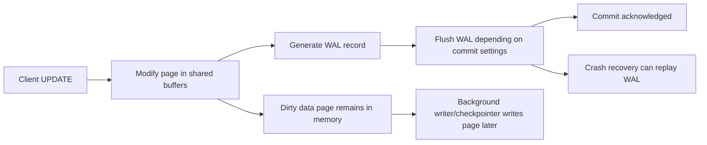
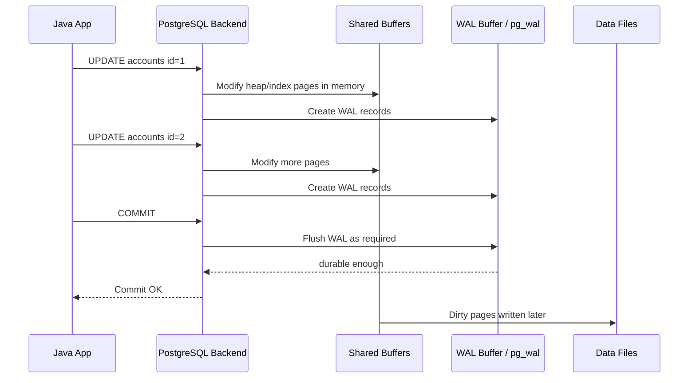
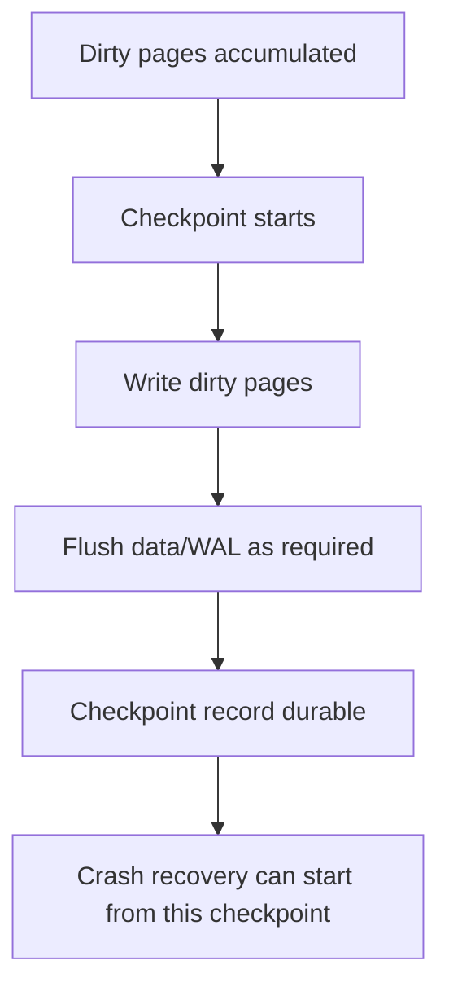
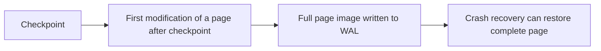
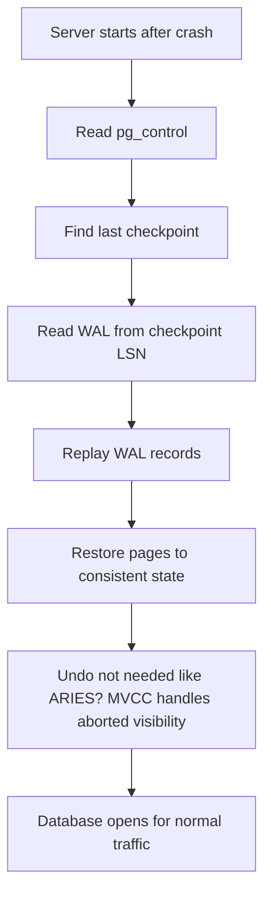
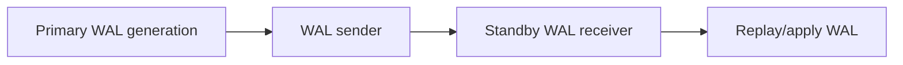
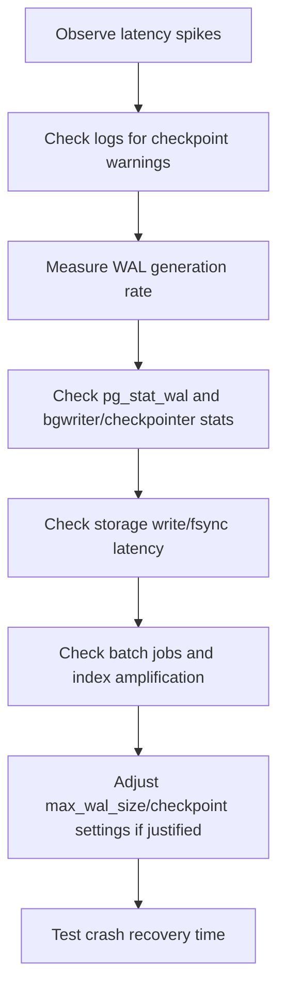
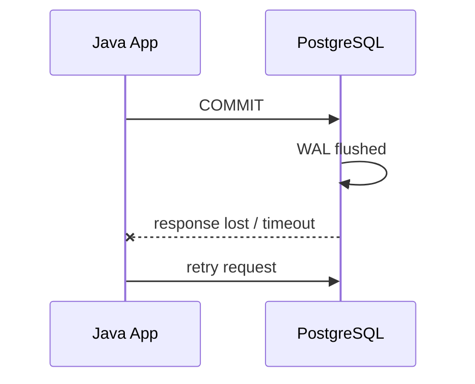

------
title: Learn PostgreSQL in Action - Part 022
description: Write-Ahead Logging, checkpoints, durability, crash recovery, commit semantics, WAL tuning, and production failure modelling.
series: learn-postgresql-in-action
seriesTitle: Learn PostgreSQL in Action
order: 22
partTitle: WAL, Checkpoints, Durability, and Crash Recovery
tags:
- postgresql
- database
- wal
- checkpoint
- durability
- recovery
- performance
- java
- series
date: 2026-07-01
---

# Part 022 — WAL, Checkpoints, Durability, and Crash Recovery

Pada Part 021 kita membahas vacuum sebagai mekanisme menjaga storage tetap sehat dalam dunia MVCC. Sekarang kita masuk ke mekanisme yang membuat PostgreSQL bisa tetap benar setelah crash: **Write-Ahead Log**, atau **WAL**.

WAL adalah salah satu konsep paling penting untuk engineer yang ingin memahami PostgreSQL di level production.

Tanpa mental model WAL, banyak gejala akan terasa acak:

- commit kadang lambat;
- write throughput turun saat checkpoint;
- `pg_wal` tiba-tiba penuh;
- replica lag membesar;
- backup/PITR tidak bisa dipercaya;
- batch job menghasilkan WAL jauh lebih besar dari ukuran data logical;
- `synchronous_commit` disetel sembarangan tanpa memahami konsekuensi durability;
- storage cepat, tetapi latency tetap spike karena fsync/checkpoint behavior.

Top engineer melihat write path PostgreSQL sebagai pipeline:

```txt
SQL change -> shared buffers -> WAL record -> WAL flush -> commit acknowledgment -> later data page checkpoint -> crash recovery replay
```

Fokus part ini: memahami **durability mechanics**, bukan hanya parameter tuning.

---

## 1. Problem yang Diselesaikan WAL

Database harus menjawab pertanyaan ini:

> Kalau server mati setelah transaksi commit tetapi sebelum semua data page ditulis ke disk, bagaimana database tahu perubahan mana yang harus dipertahankan?

Jawabannya: WAL.

Prinsip Write-Ahead Logging:

> Catatan perubahan harus ditulis ke log yang durable sebelum data page terkait dianggap aman berubah.

Dengan WAL, PostgreSQL tidak perlu menulis semua data page ke disk saat commit. PostgreSQL cukup memastikan WAL record yang diperlukan sudah durable sesuai konfigurasi commit. Data page bisa ditulis nanti oleh background writer atau checkpointer.

Ini memberi trade-off penting:

- commit bisa lebih cepat daripada flush semua data page;
- crash recovery perlu replay WAL sejak checkpoint terakhir;
- checkpoint frequency mempengaruhi recovery time dan I/O pressure;
- WAL volume menjadi faktor utama replication, backup, dan storage capacity.

---

## 2. Mental Model: WAL sebagai Journal of Intent and Effects

WAL bukan sekadar log text. WAL adalah log binary internal yang mencatat perubahan database pada level yang cukup untuk redo crash recovery.



Ingat urutan utamanya:

```txt
WAL before data page
```

Bukan:

```txt
data page before WAL
```

Jika data page ditulis dulu lalu crash sebelum WAL durable, recovery bisa melihat page berubah tanpa log yang menjelaskan perubahan itu. Itu merusak consistency.

---

## 3. Vocabulary Minimum

| Istilah | Arti Production |
|---|---|
| WAL | Write-Ahead Log, log perubahan untuk durability dan recovery. |
| LSN | Log Sequence Number, posisi byte/logical dalam WAL stream. |
| `pg_wal` | Direktori WAL segment di data directory. |
| WAL segment | File WAL, biasanya 16 MB default jika tidak diubah saat `initdb`. |
| Dirty page | Data page di memory yang berubah tetapi belum ditulis ke data file. |
| Checkpoint | Titik ketika PostgreSQL memastikan dirty pages sampai titik tertentu ditulis dan recovery bisa mulai dari posisi checkpoint. |
| Redo | Proses replay WAL saat crash recovery. |
| `fsync` | Memaksa data benar-benar durable di storage. |
| `full_page_writes` | Menulis full page image pada perubahan pertama setelah checkpoint untuk melindungi dari torn page. |
| WAL archiving | Menyalin WAL segment ke archive storage untuk PITR/backup. |
| Replication slot | Mekanisme mempertahankan WAL agar replica/subscriber bisa mengejar. |
| `synchronous_commit` | Setting kapan commit dianggap selesai relatif terhadap WAL flush/local/remote. |

---

## 4. PostgreSQL Write Path

Mari pecah satu transaksi sederhana.

```sql
BEGIN;
UPDATE accounts SET balance = balance - 100 WHERE id = 1;
UPDATE accounts SET balance = balance + 100 WHERE id = 2;
COMMIT;
```

High-level path:



Yang sering mengejutkan engineer:

- commit sukses tidak berarti semua data page sudah ditulis ke table file;
- commit sukses berarti WAL yang dibutuhkan sudah cukup durable sesuai setting;
- setelah crash, PostgreSQL membaca checkpoint dan replay WAL;
- dirty page yang belum sempat ditulis bisa direkonstruksi dari WAL.

---

## 5. Commit Semantics dan `synchronous_commit`

`synchronous_commit` mengontrol kapan PostgreSQL menganggap commit cukup aman untuk dikonfirmasi ke client.

Nilai yang sering ditemui:

| Mode | Mental model | Risiko |
|---|---|---|
| `on` | Tunggu WAL flush lokal; default yang aman untuk banyak OLTP. | Latency lebih tinggi daripada async. |
| `off` | Commit bisa dikonfirmasi sebelum WAL flush lokal. | Beberapa transaksi yang sudah “sukses” ke client bisa hilang saat crash. |
| `local` | Tunggu flush lokal, tidak menunggu synchronous standby. | Remote durability tidak dijamin saat pakai sync replication. |
| `remote_write` | Tunggu standby menulis WAL ke OS, belum tentu flush durable. | Standby crash bisa kehilangan. |
| `remote_apply` | Tunggu standby apply perubahan. | Latency tertinggi, consistency read-after-write di standby lebih kuat. |

Prinsip:

> `synchronous_commit=off` adalah latency/durability trade-off, bukan tuning gratis.

Aman untuk:

- telemetry yang bisa hilang sedikit;
- cache invalidation yang bisa direkonsiliasi;
- idempotent event buffer dengan upstream source of truth.

Berbahaya untuk:

- pembayaran;
- ledger;
- enforcement case state transition;
- inventory reservation;
- audit legal/regulatory;
- outbox event yang menjadi source of truth.

Di Java, jangan set session-level durability tanpa boundary jelas:

```sql
SET LOCAL synchronous_commit = off;
```

Hanya masuk akal dalam transaksi yang loss-tolerant.

---

## 6. LSN: Coordinate System untuk WAL

LSN adalah posisi dalam WAL stream.

Useful functions:

```sql
SELECT pg_current_wal_lsn();
```

```sql
SELECT pg_wal_lsn_diff(pg_current_wal_lsn(), '0/0');
```

Dalam replication/backup, LSN dipakai untuk:

- mengetahui posisi WAL sekarang;
- menghitung replication lag dalam byte;
- menentukan restart point slot;
- backup start/end position;
- recovery target;
- debugging WAL retention.

Contoh replication slot WAL retained:

```sql
SELECT
  slot_name,
  slot_type,
  active,
  restart_lsn,
  pg_size_pretty(pg_wal_lsn_diff(pg_current_wal_lsn(), restart_lsn)) AS retained_wal
FROM pg_replication_slots
WHERE restart_lsn IS NOT NULL;
```

---

## 7. WAL Segment dan `pg_wal`

WAL disimpan di direktori `pg_wal` sebagai segment files.

Hal penting:

- default WAL segment biasanya 16 MB;
- ukuran segment bisa diubah saat `initdb` dengan `--wal-segsize`;
- file WAL dapat direcycle;
- WAL bisa membesar karena checkpoint, archiving failure, replication slot, high write workload, atau backup/recovery configuration;
- jangan hapus file `pg_wal` manual kecuali mengikuti prosedur recovery resmi. Ini bukan log aplikasi biasa.

Cek WAL directory dari SQL tidak langsung membaca file system, tetapi kita bisa pantau statistik dan slots.

```sql
SELECT * FROM pg_stat_wal;
```

Cek archiver:

```sql
SELECT
  archived_count,
  last_archived_wal,
  last_archived_time,
  failed_count,
  last_failed_wal,
  last_failed_time,
  stats_reset
FROM pg_stat_archiver;
```

---

## 8. Checkpoint Mental Model

Checkpoint adalah titik koordinasi antara WAL dan data files.

Saat checkpoint:

1. PostgreSQL menentukan checkpoint LSN.
2. Dirty pages sampai titik tertentu ditulis ke data files.
3. WAL yang diperlukan diflush.
4. Checkpoint position disimpan.
5. Crash recovery berikutnya bisa mulai replay dari checkpoint tersebut.



Trade-off checkpoint:

| Checkpoint terlalu sering | Checkpoint terlalu jarang |
|---|---|
| I/O write pressure tinggi. | Crash recovery lebih lama. |
| More full-page writes after each checkpoint. | WAL bisa membesar. |
| Latency spike lebih sering. | Lebih banyak WAL harus direplay. |
| Disk churn tinggi. | Recovery time objective bisa terancam. |

Checkpoint bukan hanya durability event. Ia juga performance event.

---

## 9. Parameter Checkpoint Penting

| Parameter | Arti |
|---|---|
| `checkpoint_timeout` | Maksimum waktu antar automatic checkpoint. Default umum 5 menit. |
| `max_wal_size` | Soft limit WAL growth sebelum checkpoint dipicu. |
| `min_wal_size` | WAL minimum yang dipertahankan/recycled untuk spike. |
| `checkpoint_completion_target` | Seberapa tersebar checkpoint write dilakukan sepanjang interval. |
| `checkpoint_warning` | Log warning jika checkpoint karena WAL penuh terjadi terlalu dekat. |

Mental model:

```txt
checkpoint_timeout controls time pressure
max_wal_size controls WAL volume pressure
checkpoint_completion_target controls smoothing
```

Jika log berisi:

```txt
checkpoints are occurring too frequently
```

Biasanya `max_wal_size` terlalu kecil untuk workload, atau batch job menghasilkan WAL besar.

Jangan langsung menaikkan `max_wal_size` tanpa mengecek:

- apakah batch job wajar;
- apakah index terlalu banyak;
- apakah full-page writes tinggi setelah checkpoint;
- apakah archiving/replication slot menahan WAL;
- apakah recovery time masih sesuai RTO.

---

## 10. Full Page Writes dan Torn Page

Storage menulis page dalam unit tertentu. PostgreSQL page biasanya 8 KB. Jika power loss terjadi saat sebagian page tertulis, page bisa menjadi torn page: setengah lama, setengah baru.

`full_page_writes` membantu melindungi hal ini.

Mental model:



Konsekuensi:

- setelah checkpoint, perubahan pertama pada banyak page bisa menghasilkan WAL besar;
- checkpoint terlalu sering bisa meningkatkan full-page-write overhead;
- mematikan `full_page_writes` berbahaya kecuali storage stack benar-benar menjamin atomic page write dan organisasi menerima risiko.

Rule:

> Jangan matikan `full_page_writes` sebagai tuning biasa.

---

## 11. WAL Volume: Kenapa Write Kecil Bisa Mahal

Sebuah logical update kecil bisa menghasilkan WAL besar karena:

- heap tuple baru;
- index entries;
- visibility/fsm metadata;
- full page image setelah checkpoint;
- TOAST changes;
- foreign key/index maintenance;
- logical decoding metadata;
- replication requirements.

Contoh buruk:

```sql
UPDATE orders
SET updated_at = now()
WHERE status = 'OPEN';
```

Jika menyentuh 10 juta row:

- membuat 10 juta versi tuple baru;
- menghasilkan dead tuple;
- memperbarui index jika `updated_at` atau affected column terindex;
- menghasilkan WAL besar;
- membuat replica lag;
- memicu autovacuum debt;
- memperpanjang backup/archive volume.

Di Java, ini sering muncul dari:

- bulk update tanpa batching;
- migration data correction;
- scheduled “touch all active rows”;
- ORM update semua dirty entity;
- event replay tanpa checkpoint aplikasi;
- audit table dengan index berlebihan.

---

## 12. Measuring WAL Generation

Ukur WAL sebelum dan sesudah operasi.

```sql
SELECT pg_current_wal_lsn() AS before_lsn;
```

Jalankan workload.

```sql
SELECT pg_current_wal_lsn() AS after_lsn;
```

Hitung:

```sql
SELECT pg_size_pretty(pg_wal_lsn_diff('0/1A000000', '0/19000000'));
```

Lebih praktis dalam satu session:

```sql
SELECT pg_current_wal_lsn() \gset

-- run workload here

SELECT
  pg_size_pretty(pg_wal_lsn_diff(pg_current_wal_lsn(), :'pg_current_wal_lsn')) AS wal_generated;
```

Untuk cluster-level stats:

```sql
SELECT
  wal_records,
  wal_fpi,
  pg_size_pretty(wal_bytes) AS wal_bytes,
  wal_buffers_full,
  wal_write,
  wal_sync,
  wal_write_time,
  wal_sync_time,
  stats_reset
FROM pg_stat_wal;
```

Jika `track_wal_io_timing` aktif, timing WAL write/sync lebih informatif.

---

## 13. WAL Buffers

`wal_buffers` adalah memory untuk WAL data sebelum ditulis.

Biasanya default otomatis cukup untuk banyak workload. Tetapi high-write workload bisa menunjukkan pressure.

Signal:

```sql
SELECT wal_buffers_full
FROM pg_stat_wal;
```

Jika `wal_buffers_full` terus naik cepat, backend sering harus flush WAL karena buffer penuh.

Namun tuning `wal_buffers` bukan langkah pertama. Cek dulu:

- transaksi terlalu besar;
- batch job terlalu agresif;
- checkpoint terlalu sering;
- storage latency tinggi;
- synchronous replication;
- index write amplification.

---

## 14. Background Writer vs Checkpointer

PostgreSQL punya proses yang membantu menulis dirty pages.

Mental model sederhana:

| Process | Peran |
|---|---|
| Backend process | Bisa menulis WAL dan kadang data page jika perlu. |
| WAL writer | Membantu flush WAL secara periodik. |
| Background writer | Menulis dirty shared buffers agar backend tidak terlalu sering menulis sendiri. |
| Checkpointer | Mengelola checkpoint dan memastikan dirty pages terkait checkpoint tertulis. |

Jika background/checkpoint tidak mampu mengimbangi dirty page generation, backend client bisa ikut menulis page dan latency naik.

Observability:

```sql
SELECT * FROM pg_stat_bgwriter;
```

Pada versi PostgreSQL modern, statistik checkpointer juga dapat tersedia melalui view khusus seperti `pg_stat_checkpointer`.

Cek view yang tersedia:

```sql
SELECT relname
FROM pg_class
WHERE relname IN ('pg_stat_bgwriter', 'pg_stat_checkpointer', 'pg_stat_wal');
```

---

## 15. Crash Recovery Step-by-Step

Saat PostgreSQL restart setelah crash:



Yang penting:

- PostgreSQL melakukan REDO dari WAL;
- recovery time bergantung pada seberapa banyak WAL sejak checkpoint;
- checkpoint terlalu jarang bisa memperpanjang restart;
- checkpoint terlalu sering bisa memperburuk runtime latency;
- RTO harus mempengaruhi checkpoint tuning.

Pertanyaan production:

> Jika primary crash sekarang, berapa lama recovery sampai service siap menerima traffic?

Jangan hanya mengukur happy-path latency. Ukur crash recovery di staging dengan data volume realistis.

---

## 16. WAL dan Replication

Physical replication mengirim WAL stream dari primary ke standby.



Jika primary menghasilkan WAL lebih cepat daripada standby menerima/apply:

- replication lag naik;
- read replica makin stale;
- failover RPO bisa memburuk;
- replication slot bisa menahan WAL di primary;
- storage primary bisa penuh.

Pantau:

```sql
SELECT
  application_name,
  state,
  sync_state,
  sent_lsn,
  write_lsn,
  flush_lsn,
  replay_lsn,
  pg_size_pretty(pg_wal_lsn_diff(pg_current_wal_lsn(), replay_lsn)) AS replay_lag_bytes
FROM pg_stat_replication;
```

Jangan hanya monitor lag waktu. Monitor byte lag juga.

---

## 17. WAL dan Logical Decoding/CDC

Logical replication dan CDC membaca WAL untuk mengeluarkan perubahan logical.

Trade-off:

- CDC memberi event stream yang kuat;
- tetapi slot CDC yang macet menahan WAL;
- schema change harus dikelola;
- long transaction baru terlihat setelah commit, bisa menghasilkan burst besar;
- large transaction bisa menekan memory/disk consumer.

Cek logical slot:

```sql
SELECT
  slot_name,
  plugin,
  slot_type,
  active,
  restart_lsn,
  confirmed_flush_lsn,
  catalog_xmin,
  pg_size_pretty(pg_wal_lsn_diff(pg_current_wal_lsn(), restart_lsn)) AS retained_wal
FROM pg_replication_slots
WHERE slot_type = 'logical';
```

Rule:

> CDC bukan gratis. Ia memindahkan sebagian coupling dari database query ke WAL retention, schema evolution, dan consumer liveness.

---

## 18. WAL Archiving dan PITR

WAL archiving menyimpan completed WAL segment ke archive storage.

Gunanya:

- Point-in-Time Recovery;
- backup continuous;
- restore ke waktu sebelum human error;
- warm standby tertentu;
- forensic timeline.

Basic config conceptual:

```conf
archive_mode = on
archive_command = 'test ! -f /archive/%f && cp %p /archive/%f'
```

Production archive command harus:

- idempotent;
- return zero hanya jika archive berhasil;
- tidak silently discard WAL;
- punya monitoring failure;
- punya retention policy;
- diuji restore-nya.

Cek:

```sql
SELECT
  archived_count,
  failed_count,
  last_archived_wal,
  last_archived_time,
  last_failed_wal,
  last_failed_time
FROM pg_stat_archiver;
```

Jika archive gagal, WAL bisa menumpuk di primary.

---

## 19. Durability vs Latency: Application-Level Classification

Tidak semua write punya kebutuhan durability sama.

| Data | Durability requirement | Setting attitude |
|---|---|---|
| Ledger/payment | Sangat tinggi | Jangan korbankan durability. |
| Regulatory audit | Sangat tinggi | Commit harus kuat, backup/PITR wajib. |
| Case state transition | Tinggi | Harus recoverable dan idempotent. |
| Outbox event | Tinggi jika source of truth | Jangan async commit sembarangan. |
| Metrics raw high-volume | Medium/low | Bisa batch/loss-tolerant. |
| Cache refresh marker | Low | Bisa async jika dapat direkonstruksi. |
| Search indexing queue | Medium | Bisa replay dari source table. |

Java service sebaiknya tidak hanya punya satu repository abstraction yang menyembunyikan semua durability decision. Untuk domain critical, durability adalah bagian dari contract.

---

## 20. Unlogged Tables

Unlogged table mengurangi WAL untuk data table, tetapi trade-off besar:

- data tidak crash-safe seperti logged table;
- tidak direplikasi secara physical/logical dengan cara sama untuk data;
- setelah crash, isi unlogged table bisa hilang/truncated;
- cocok untuk temporary staging/cache yang bisa dibangun ulang.

Contoh:

```sql
CREATE UNLOGGED TABLE import_stage_orders (
  external_id text,
  payload jsonb,
  loaded_at timestamptz default now()
);
```

Cocok untuk:

- staging import yang bisa diulang;
- intermediate computation;
- cache table rebuilt dari source;
- dedupe scratch table.

Tidak cocok untuk:

- order utama;
- audit;
- outbox;
- job queue yang tidak bisa hilang;
- regulatory evidence.

---

## 21. Temporary Tables dan WAL

Temporary table juga punya WAL behavior berbeda dan lifecycle session-local.

Use case:

- batch processing intermediate result;
- ETL transform dalam session;
- complex report staging;
- migration helper.

Namun di Java connection pool, temporary table perlu hati-hati karena connection dipakai ulang.

Risiko:

- temp table tersisa dalam session pooled connection;
- nama bentrok;
- transaction boundary tidak membersihkan state;
- memory/temp file pressure.

Gunakan:

```sql
CREATE TEMP TABLE tmp_ids (
  id bigint PRIMARY KEY
) ON COMMIT DROP;
```

`ON COMMIT DROP` membantu membersihkan state setelah transaksi.

---

## 22. Checkpoint Tuning Workflow

Jangan tuning checkpoint dari satu parameter.

Workflow:



### 22.1 If Checkpoints Too Frequent

Symptoms:

- log warning checkpoints occurring too frequently;
- latency spikes around checkpoint;
- high full-page writes;
- WAL volume high.

Possible actions:

- increase `max_wal_size`;
- increase `checkpoint_timeout` within RTO constraints;
- tune `checkpoint_completion_target`;
- reduce write amplification;
- reschedule batch jobs;
- improve storage.

### 22.2 If Crash Recovery Too Slow

Symptoms:

- restart takes too long;
- too much WAL replay;
- RTO violated.

Possible actions:

- reduce checkpoint interval;
- reduce `max_wal_size`;
- improve storage read throughput;
- reduce huge transactions;
- test failover rather than relying on crash recovery only.

Trade-off explicit:

```txt
More runtime checkpoint I/O  <-> less crash recovery WAL replay
Less runtime checkpoint I/O  <-> more crash recovery WAL replay
```

---

## 23. Large Transaction Failure Mode

Large transaction is dangerous because it concentrates cost.

Example:

```sql
BEGIN;
UPDATE account_event
SET processed = true
WHERE created_at < now() - interval '30 days';
COMMIT;
```

Risks:

- massive WAL burst;
- long lock duration;
- replication lag spike;
- CDC burst after commit;
- vacuum debt;
- rollback very expensive;
- snapshot horizon held long;
- connection occupied;
- application timeout ambiguity.

Better:

```sql
WITH batch AS (
  SELECT id
  FROM account_event
  WHERE processed = false
    AND created_at < now() - interval '30 days'
  ORDER BY id
  LIMIT 10000
)
UPDATE account_event e
SET processed = true
FROM batch b
WHERE e.id = b.id;
```

Commit per batch from Java:

```java
int total = 0;
while (true) {
    int updated = transactionTemplate.execute(status -> repository.markBatchProcessed(10_000));
    if (updated == 0) break;
    total += updated;
}
```

Benefits:

- WAL distributed;
- lock duration lower;
- replication can catch up;
- failure resumes naturally;
- timeout easier to reason about.

---

## 24. WAL and Index Design

Every index has write cost.

For each insert/update/delete, PostgreSQL may need to log index changes.

Index portfolio affects WAL volume.

Example:

```txt
table: orders
indexes: 14
operation: update status on 1M rows
```

If many indexes include `status`, `updated_at`, or expression derived from changed columns:

- WAL grows;
- index bloat grows;
- vacuum cleanup grows;
- replication lag grows.

Index design question:

> Does this index pay for itself in read latency more than it costs in WAL, vacuum, storage, and write latency?

This is why Part 015 emphasized index budget.

---

## 25. WAL and TOAST

Large values can be stored in TOAST tables. Updating large JSONB/text payloads can generate significant WAL.

Anti-pattern:

```sql
UPDATE customer_profile
SET profile_json = jsonb_set(profile_json, '{lastViewedAt}', to_jsonb(now()))
WHERE id = ?;
```

If `profile_json` large:

- entire modified value may create large storage changes;
- TOAST churn;
- WAL volume high;
- GIN index update if indexed;
- vacuum debt.

Better design:

- move high-churn field to normal column;
- avoid GIN index on frequently rewritten large document unless needed;
- split stable document from mutable metadata;
- append event rather than rewrite large blob.

---

## 26. WAL and `COPY` / Bulk Load

Bulk load can produce huge WAL.

Strategies:

- load into staging table;
- create indexes after load if possible;
- use unlogged staging if data can be reloaded;
- run `ANALYZE` after load;
- consider partition attach strategy;
- avoid one enormous transaction unless atomicity requirement justifies it;
- ensure replica/archive can handle WAL rate.

Example:

```sql
CREATE UNLOGGED TABLE order_import_stage (
  external_id text,
  payload jsonb
);
```

Load:

```sql
COPY order_import_stage (external_id, payload)
FROM '/data/orders.csv'
WITH (FORMAT csv, HEADER true);
```

Then validate and merge in controlled batches.

---

## 27. Observability Minimum

### 27.1 WAL Stats

```sql
SELECT
  wal_records,
  wal_fpi,
  pg_size_pretty(wal_bytes) AS wal_bytes,
  wal_buffers_full,
  wal_write,
  wal_sync,
  wal_write_time,
  wal_sync_time,
  stats_reset
FROM pg_stat_wal;
```

### 27.2 Archiver

```sql
SELECT
  archived_count,
  failed_count,
  last_archived_wal,
  last_archived_time,
  last_failed_wal,
  last_failed_time
FROM pg_stat_archiver;
```

### 27.3 Replication Lag

```sql
SELECT
  application_name,
  state,
  sync_state,
  pg_size_pretty(pg_wal_lsn_diff(pg_current_wal_lsn(), replay_lsn)) AS replay_lag_bytes,
  write_lag,
  flush_lag,
  replay_lag
FROM pg_stat_replication;
```

### 27.4 Replication Slots

```sql
SELECT
  slot_name,
  slot_type,
  active,
  restart_lsn,
  confirmed_flush_lsn,
  pg_size_pretty(pg_wal_lsn_diff(pg_current_wal_lsn(), restart_lsn)) AS retained_wal
FROM pg_replication_slots
WHERE restart_lsn IS NOT NULL;
```

### 27.5 Checkpoint/Background Writer

```sql
SELECT * FROM pg_stat_bgwriter;
```

If available:

```sql
SELECT * FROM pg_stat_checkpointer;
```

---

## 28. Incident Playbook: `pg_wal` Disk Full

Scenario:

```txt
Filesystem containing pg_wal almost full.
Application writes failing or close to failing.
```

### Step 1 — Do Not Delete WAL Manually

Manual deletion can destroy recoverability and corrupt recovery assumptions.

### Step 2 — Check Replication Slots

```sql
SELECT
  slot_name,
  slot_type,
  active,
  restart_lsn,
  pg_size_pretty(pg_wal_lsn_diff(pg_current_wal_lsn(), restart_lsn)) AS retained_wal
FROM pg_replication_slots
WHERE restart_lsn IS NOT NULL
ORDER BY pg_wal_lsn_diff(pg_current_wal_lsn(), restart_lsn) DESC;
```

Inactive slot with huge retained WAL is common.

### Step 3 — Check Archiver Failure

```sql
SELECT
  failed_count,
  last_failed_wal,
  last_failed_time,
  last_archived_wal,
  last_archived_time
FROM pg_stat_archiver;
```

### Step 4 — Check Write Spike

```sql
SELECT
  pg_size_pretty(wal_bytes) AS wal_bytes,
  wal_records,
  wal_fpi,
  stats_reset
FROM pg_stat_wal;
```

### Step 5 — Emergency Options

Possible actions, depending on root cause:

- fix archive destination/permissions/network;
- restart/fix replica or CDC consumer;
- drop obsolete replication slot only after confirming it is safe;
- add disk temporarily;
- stop high-WAL batch job;
- throttle application writes;
- failover only if planned and safe.

Dropping slot:

```sql
SELECT pg_drop_replication_slot('obsolete_slot_name');
```

But only if you accept that consumer cannot resume from that slot.

---

## 29. Incident Playbook: Commit Latency Spikes

Scenario:

```txt
p99 commit latency spikes every few minutes.
```

Check:

1. Are spikes aligned with checkpoints?
2. Is storage fsync latency high?
3. Is synchronous replication waiting?
4. Is WAL generated in bursts?
5. Are batch jobs running?
6. Is `wal_buffers_full` increasing?
7. Are checkpoints too frequent?

Queries:

```sql
SELECT * FROM pg_stat_wal;
```

```sql
SELECT * FROM pg_stat_replication;
```

```sql
SELECT * FROM pg_stat_bgwriter;
```

Also inspect logs for checkpoint messages.

Possible fixes:

- smooth batch jobs;
- increase `max_wal_size`;
- adjust checkpoint completion;
- improve storage latency;
- revisit synchronous replication mode;
- reduce index write amplification;
- batch small commits when correctness allows.

---

## 30. Incident Playbook: Replica Lag After Batch Job

Scenario:

```txt
Nightly job finishes on primary.
Replica is 90 minutes behind.
Read traffic sees stale data.
```

Diagnosis:

```sql
SELECT
  application_name,
  state,
  sent_lsn,
  write_lsn,
  flush_lsn,
  replay_lsn,
  pg_size_pretty(pg_wal_lsn_diff(pg_current_wal_lsn(), replay_lsn)) AS replay_lag_bytes,
  write_lag,
  flush_lag,
  replay_lag
FROM pg_stat_replication;
```

Interpretation:

| Lag point | Meaning |
|---|---|
| `sent_lsn` far behind current | Primary sender/network bottleneck. |
| `write_lsn` behind sent | Standby receiving/writing bottleneck. |
| `flush_lsn` behind write | Standby disk flush bottleneck. |
| `replay_lsn` behind flush | Standby apply/replay bottleneck. |

Fix direction:

- reduce WAL burst;
- batch smaller;
- avoid rewriting huge rows;
- reduce indexes affected by batch;
- improve replica hardware;
- schedule job away from read-SLA window;
- use logical/application-level incremental processing.

---

## 31. Java Integration: Timeout Hierarchy

Durability path interacts with application timeouts.

Set timeout hierarchy intentionally:

```txt
statement_timeout < transaction timeout < request timeout < load balancer timeout
```

Example:

```sql
SET LOCAL statement_timeout = '5s';
SET LOCAL lock_timeout = '500ms';
```

In Java/Spring:

```java
@Transactional(timeout = 10)
public void performCriticalWrite(...) {
    // keep only DB invariant here
}
```

But remember: timeout after commit ambiguity is real.

If client times out while server is committing, application might not know if transaction committed. Solve with:

- idempotency key;
- unique request key;
- outbox/inbox;
- read-after-timeout reconciliation;
- retry only when operation is idempotent.

---

## 32. Java Integration: Idempotency and WAL Reality

Network failure around commit boundary:



The transaction may have committed even if client did not receive response.

Correct pattern:

```sql
CREATE TABLE payment_request (
  idempotency_key text PRIMARY KEY,
  payment_id bigint NOT NULL,
  created_at timestamptz NOT NULL DEFAULT now()
);
```

Application retry inserts same idempotency key. Database uniqueness tells whether operation already happened.

This is not only an application pattern. It is a direct consequence of distributed systems plus WAL-backed commit semantics.

---

## 33. Hands-On Lab

### 33.1 Measure WAL for Insert

```sql
DROP TABLE IF EXISTS wal_lab;

CREATE TABLE wal_lab (
  id bigserial PRIMARY KEY,
  status text NOT NULL,
  payload text NOT NULL,
  created_at timestamptz NOT NULL DEFAULT now()
);

SELECT pg_current_wal_lsn() AS before_lsn \gset

INSERT INTO wal_lab (status, payload)
SELECT 'NEW', repeat(md5(i::text), 20)
FROM generate_series(1, 100000) AS s(i);

SELECT
  pg_size_pretty(pg_wal_lsn_diff(pg_current_wal_lsn(), :'before_lsn')) AS wal_generated;
```

### 33.2 Compare Update WAL

```sql
SELECT pg_current_wal_lsn() AS before_lsn \gset

UPDATE wal_lab
SET status = 'DONE'
WHERE id <= 50000;

SELECT
  pg_size_pretty(pg_wal_lsn_diff(pg_current_wal_lsn(), :'before_lsn')) AS wal_generated;
```

### 33.3 Add Index and Repeat

```sql
CREATE INDEX wal_lab_status_created_idx
ON wal_lab (status, created_at);

SELECT pg_current_wal_lsn() AS before_lsn \gset

UPDATE wal_lab
SET status = 'ARCHIVED'
WHERE id <= 50000;

SELECT
  pg_size_pretty(pg_wal_lsn_diff(pg_current_wal_lsn(), :'before_lsn')) AS wal_generated;
```

Observe how index changes affect WAL.

### 33.4 Observe Checkpoint

```sql
CHECKPOINT;
```

Then watch stats:

```sql
SELECT * FROM pg_stat_wal;
SELECT * FROM pg_stat_bgwriter;
```

Do not run aggressive checkpoint loops on shared production systems.

### 33.5 Test Unlogged Table

```sql
CREATE UNLOGGED TABLE wal_lab_unlogged AS
SELECT * FROM wal_lab WITH NO DATA;

SELECT pg_current_wal_lsn() AS before_lsn \gset

INSERT INTO wal_lab_unlogged
SELECT * FROM wal_lab;

SELECT
  pg_size_pretty(pg_wal_lsn_diff(pg_current_wal_lsn(), :'before_lsn')) AS wal_generated;
```

Compare with logged table behavior. Interpret carefully; metadata/index operations can still produce WAL.

---

## 34. Self-Correction Questions

1. Why does PostgreSQL write WAL before data pages?
2. Why can commit succeed before table files contain the changed data page?
3. What is an LSN?
4. How does checkpoint frequency affect runtime latency and crash recovery time?
5. Why can frequent checkpoints increase WAL volume through full-page writes?
6. What does `synchronous_commit=off` risk?
7. Why can a tiny logical update create large WAL?
8. How do indexes amplify WAL generation?
9. Why can replication slots fill `pg_wal`?
10. What is the difference between write lag, flush lag, and replay lag on a standby?
11. Why is manual deletion from `pg_wal` dangerous?
12. When are unlogged tables acceptable?
13. Why can a Java timeout after commit produce ambiguous outcome?
14. How does idempotency key solve commit ambiguity?
15. Why must backup strategy include WAL archiving or equivalent continuous WAL capture for PITR?

---

## 35. Production Readiness Checklist

- [ ] WAL generation rate is monitored.
- [ ] `pg_wal` filesystem has alerting.
- [ ] Replication slot retained WAL is monitored.
- [ ] Archiver failures are alerted.
- [ ] Checkpoint warnings are reviewed.
- [ ] Commit latency is correlated with WAL/checkpoint/storage metrics.
- [ ] Batch jobs are measured by WAL volume, not only row count.
- [ ] Index portfolio is reviewed for write amplification.
- [ ] `synchronous_commit` changes are domain-classified.
- [ ] Critical writes use idempotency keys or unique request identity.
- [ ] PITR restore has been tested, not merely configured.
- [ ] Crash recovery time is tested against RTO.
- [ ] Replica lag is monitored in bytes and time.
- [ ] CDC consumers have liveness alerts.
- [ ] Unlogged tables are used only for reconstructable data.

---

## 36. Key Takeaways

- WAL is the durability backbone of PostgreSQL.
- Commit does not require every changed data page to be written immediately; WAL makes later recovery possible.
- Checkpoints trade runtime I/O against crash recovery time.
- Frequent checkpoints can increase I/O and full-page-write overhead.
- WAL volume is affected by indexes, TOAST, full page writes, batch size, and update shape.
- Replication, CDC, PITR, and crash recovery all depend on WAL.
- `synchronous_commit` is a correctness/durability decision, not just a performance knob.
- Java services must handle commit ambiguity with idempotency and reconciliation.
- `pg_wal` is not an application log directory; never delete it manually as a “cleanup”.
- Top PostgreSQL engineering requires connecting SQL write shape to WAL, replica lag, checkpoint pressure, backup cost, and recovery time.

---

## References

- PostgreSQL Documentation — WAL Internals: https://www.postgresql.org/docs/current/wal-internals.html
- PostgreSQL Documentation — Write Ahead Log Configuration: https://www.postgresql.org/docs/current/runtime-config-wal.html
- PostgreSQL Documentation — Continuous Archiving and PITR: https://www.postgresql.org/docs/current/continuous-archiving.html
- PostgreSQL Documentation — Monitoring Statistics: https://www.postgresql.org/docs/current/monitoring-stats.html
- PostgreSQL Documentation — Reliability and WAL: https://www.postgresql.org/docs/current/wal.html
