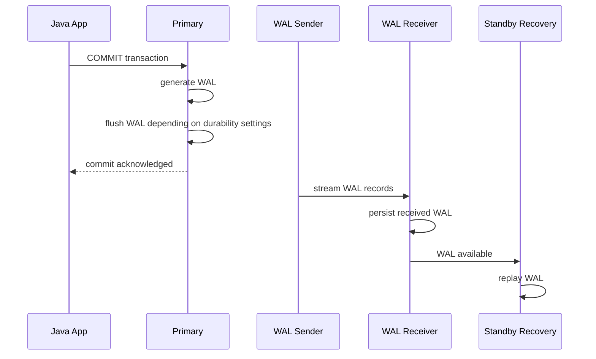
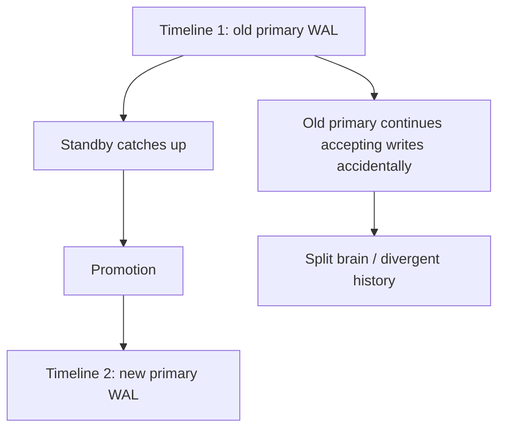

------
title: Learn PostgreSQL in Action - Part 023
description: Physical streaming replication, hot standby, replication slots, lag diagnosis, read replica behavior, and Java application implications.
series: learn-postgresql-in-action
seriesTitle: Learn PostgreSQL in Action
order: 23
partTitle: Streaming Replication and Hot Standby
tags:
- postgresql
- database
- replication
- streaming-replication
- hot-standby
- high-availability
- java
- series
date: 2026-07-01
---

# Part 023 — Streaming Replication and Hot Standby

Pada Part 022 kita membahas WAL sebagai fondasi durability dan crash recovery. Sekarang kita gunakan mental model yang sama untuk memahami **physical streaming replication**.

Physical streaming replication bukan mekanisme “copy table”. Ia adalah mekanisme menjaga cluster standby tetap mengikuti primary dengan cara mengirim dan menerapkan **WAL records**.

Ini penting karena banyak keputusan production bergantung pada pemahaman ini:

- apakah read replica selalu fresh? Tidak selalu;
- apakah replica bisa dipakai untuk semua query? Tidak;
- apakah replication slot aman? Aman jika dimonitor; berbahaya jika dibiarkan menahan WAL tanpa batas;
- apakah failover otomatis cukup? Tidak tanpa fencing, timeline management, dan client routing;
- apakah read scaling dengan replica menyelesaikan query berat? Kadang justru menciptakan recovery conflict dan lag;
- apakah Java application cukup menambahkan read/write datasource? Tidak jika consistency requirement tidak dimodelkan.

Fokus part ini: memahami replication sebagai **WAL continuity and recovery pipeline**, bukan sekadar fitur HA.

---

## 1. Problem yang Diselesaikan Streaming Replication

Satu primary PostgreSQL bisa gagal karena banyak alasan:

- process crash;
- VM/node failure;
- storage failure;
- network isolation;
- kernel/power failure;
- maintenance restart;
- cloud availability-zone issue;
- accidental corruption atau operational mistake.

Tanpa replica, recovery bergantung pada restore backup + WAL archive. Itu valid untuk disaster recovery, tapi biasanya terlalu lambat untuk high availability.

Streaming replication menyediakan standby yang terus menerima WAL dari primary sehingga standby bisa:

1. menjadi target failover;
2. melayani read-only query sebagai hot standby;
3. menjadi sumber backup;
4. menjadi building block untuk HA topology;
5. menjadi intermediate node untuk cascading replication.

Mental model paling sederhana:

```txt
Primary produces WAL -> WAL sender streams WAL -> standby receives WAL -> standby replays WAL -> standby becomes near-current copy
```

Yang direplikasi adalah physical state perubahan cluster, bukan logical business event.

---

## 2. Physical vs Logical Replication

Sebelum masuk detail, bedakan dua keluarga replication:

| Dimension | Physical Streaming Replication | Logical Replication |
|---|---|---|
| Unit replication | WAL physical changes | Logical row changes |
| Scope | Seluruh cluster/database cluster state | Table/publication/subscription |
| Standby writable? | Tidak, kecuali setelah promote | Subscriber writable secara teknis, tapi conflict harus dimodelkan |
| Version flexibility | Umumnya butuh compatibility ketat | Bisa lebih fleksibel untuk upgrade/migration tertentu |
| Use case utama | HA, read replica, DR, backup source | CDC, selective replication, migration, integration |
| DDL replication | Physical state ikut | Tidak semua DDL otomatis sebagai semantic contract |
| Conflict model | Hot standby query vs WAL replay | Apply conflict, replica identity, schema drift |

Physical replication cocok ketika tujuan utamanya adalah:

- failover;
- cluster copy;
- read-only scale-out;
- PITR/backup support;
- minimal semantic transformation.

Logical replication cocok ketika tujuan utamanya adalah:

- integrasi downstream;
- CDC;
- table-level replication;
- migration;
- event pipeline;
- selective data movement.

Part ini fokus ke physical replication. Part 024 akan membahas logical replication, CDC, dan outbox.

---

## 3. Core Architecture


Komponen utama:

| Component | Lokasi | Fungsi |
|---|---|---|
| `wal_level` | primary | Menentukan jumlah informasi WAL yang dicatat. Untuk physical replication minimal `replica`. |
| WAL sender | primary | Process yang mengirim WAL ke standby. |
| WAL receiver | standby | Process yang menerima WAL stream. |
| Startup/recovery process | standby | Menerapkan WAL ke data files standby. |
| replication slot | primary | Menahan WAL agar tidak dihapus sebelum consumer menerimanya. |
| timeline | cluster history | Menandai cabang sejarah WAL setelah promotion/failover. |
| hot standby | standby | Mode read-only selama recovery/replay. |

Streaming replication adalah **continuous recovery**. Standby tidak “menjalankan transaksi” seperti primary. Standby menjalankan recovery dengan menerapkan WAL.

---

## 4. WAL Flow: From Commit to Standby Replay

Saat transaksi commit di primary:

1. backend menghasilkan WAL records;
2. WAL ditulis ke WAL buffer;
3. commit menunggu flush sesuai `synchronous_commit` dan synchronous replication configuration;
4. WAL sender membaca WAL;
5. WAL receiver standby menerima stream;
6. standby menulis WAL ke local `pg_wal`;
7. recovery process replay WAL ke data files;
8. query di standby melihat perubahan setelah replay mencapai LSN terkait.



Kunci mental model:

> Commit acknowledged di primary tidak otomatis berarti standby sudah dapat membaca data tersebut, kecuali synchronous replication dikonfigurasi untuk menunggu level tertentu.

---

## 5. Asynchronous Replication

Default practical topology sering asynchronous.

Pada async replication:

- primary tidak menunggu standby untuk acknowledge commit;
- commit latency lebih rendah;
- standby bisa tertinggal;
- jika primary hilang sebelum WAL sampai/replay di standby, ada potensi data loss;
- RPO tidak nol.

Async cocok untuk:

- read replica;
- reporting replica;
- backup source;
- non-critical HA dengan toleransi kehilangan transaksi kecil;
- multi-region read scaling dengan latency tinggi.

Async berbahaya untuk:

- financial ledger dengan strict durability setelah ack;
- case management enforcement state yang tidak boleh mundur;
- workflow yang mengirim external side effect setelah commit tetapi failover bisa kehilangan commit;
- audit-critical event yang belum tersinkron.

### 5.1 Java Implication

Jika aplikasi menulis ke primary lalu langsung membaca dari replica:

```txt
POST /cases/123/submit -> write primary -> redirect -> GET /cases/123 from replica -> stale
```

Bug ini sering muncul sebagai:

- user baru submit tapi status lama;
- workflow button muncul lagi;
- idempotency check gagal;
- API read-after-write tidak konsisten;
- cache terisi data stale dari replica;
- event processor melihat state lama.

Solusi tidak selalu “jangan pakai replica”. Solusi adalah model consistency:

| Requirement | Strategy |
|---|---|
| Read-your-write wajib | Route read berikutnya ke primary. |
| Staleness acceptable | Baca dari replica dengan lag budget. |
| Read mostly reporting | Replica OK, tapi query timeout harus ketat. |
| Workflow decision | Prefer primary atau consistent snapshot. |
| Audit/invariant check | Primary. |
| UI list eventual | Replica bisa diterima jika jelas. |

---

## 6. Synchronous Replication

Synchronous replication membuat commit primary menunggu acknowledgment dari standby tertentu, tergantung configuration.

Tujuannya:

- mengurangi atau menghilangkan acknowledged-data loss;
- meningkatkan durability across nodes;
- mengorbankan latency dan availability.

Ada beberapa level commit semantics yang harus dibedakan:

| Level | Makna Konseptual |
|---|---|
| local flush | WAL durable di primary. |
| remote write | WAL diterima dan ditulis di standby OS/storage path tertentu. |
| remote flush | WAL sudah durable di standby. |
| remote apply | WAL sudah replay sehingga query standby bisa melihat perubahan. |

Semakin kuat guarantee, semakin mahal latency.

### 6.1 The Real Trade-Off

Synchronous replication bukan magic HA. Ia mengganti risiko data loss dengan risiko latency/availability.

Jika standby lambat atau network bermasalah:

- commit latency primary naik;
- connection pool bisa penuh;
- request timeout meningkat;
- retry bisa memperparah load;
- thread Java menunggu database;
- backpressure harus aktif.

Untuk system regulatory/case management, pertanyaannya bukan “sync atau async?” melainkan:

> State transition mana yang harus survive primary failure setelah user menerima success response?

Contoh klasifikasi:

| Operation | Sync Requirement |
|---|---|
| Submit enforcement decision | Stronger durability recommended. |
| Save UI draft | Async acceptable. |
| Append audit event | Stronger durability recommended. |
| Update denormalized search projection | Async acceptable. |
| Generate report cache | Async acceptable. |

---

## 7. Replication Slots

Replication slot memastikan primary tidak membuang WAL yang masih dibutuhkan consumer.

Tanpa slot:

- standby tertinggal terlalu jauh;
- primary bisa recycle WAL lama;
- standby tidak bisa catch up;
- perlu rebuild standby dari base backup.

Dengan slot:

- primary menahan WAL sampai slot consumer maju;
- standby bisa catch up selama storage cukup;
- jika consumer mati lama, `pg_wal` bisa tumbuh sampai disk penuh.

Mental model:

```txt
Replication slot = retention contract for WAL
```

Kontrak ini harus dimonitor. Slot bukan fitur yang boleh dibuat lalu dilupakan.

### 7.1 Monitoring Replication Slots

```sql
select
    slot_name,
    slot_type,
    active,
    restart_lsn,
    confirmed_flush_lsn,
    wal_status,
    safe_wal_size,
    pg_size_pretty(pg_wal_lsn_diff(pg_current_wal_lsn(), restart_lsn)) as retained_wal
from pg_replication_slots
order by retained_wal desc;
```

Signals penting:

| Signal | Interpretasi |
|---|---|
| `active = false` | Consumer tidak connected. |
| retained WAL membesar | Slot menahan WAL. |
| `safe_wal_size` mengecil | Risiko slot masuk state unsafe/lost jika `max_slot_wal_keep_size` terbatas. |
| `restart_lsn` tidak maju | Consumer stuck atau tidak membaca. |

### 7.2 Failure Mode: Slot Kills Primary

Pattern umum:

1. engineer membuat slot untuk replica/CDC;
2. consumer mati;
3. primary tetap menghasilkan WAL;
4. slot menahan WAL lama;
5. `pg_wal` membesar;
6. disk penuh;
7. primary berhenti menerima write;
8. incident dianggap “storage issue”, padahal root cause adalah abandoned slot.

Preventive controls:

- monitor retained WAL per slot;
- set alert threshold;
- gunakan `max_slot_wal_keep_size` jika sesuai;
- punya runbook drop/recreate slot;
- jangan membuat slot manual tanpa owner;
- tag slot dengan naming convention;
- review slot saat decomission replica/CDC.

---

## 8. Replication Lag: Three Different Lags

“Replica lag” bukan satu angka. Ada beberapa stage:

```txt
Primary current WAL
        |
        | sent lag
        v
Standby received WAL
        |
        | flush lag
        v
Standby flushed WAL
        |
        | replay lag
        v
Standby applied WAL and visible to read queries
```

Query diagnosis di primary:

```sql
select
    application_name,
    client_addr,
    state,
    sync_state,
    sent_lsn,
    write_lsn,
    flush_lsn,
    replay_lsn,
    pg_size_pretty(pg_wal_lsn_diff(pg_current_wal_lsn(), sent_lsn)) as send_lag_bytes,
    pg_size_pretty(pg_wal_lsn_diff(pg_current_wal_lsn(), write_lsn)) as write_lag_bytes,
    pg_size_pretty(pg_wal_lsn_diff(pg_current_wal_lsn(), flush_lsn)) as flush_lag_bytes,
    pg_size_pretty(pg_wal_lsn_diff(pg_current_wal_lsn(), replay_lsn)) as replay_lag_bytes
from pg_stat_replication;
```

Diagnosis di standby:

```sql
select
    pg_is_in_recovery() as is_standby,
    pg_last_wal_receive_lsn() as receive_lsn,
    pg_last_wal_replay_lsn() as replay_lsn,
    pg_size_pretty(pg_wal_lsn_diff(pg_last_wal_receive_lsn(), pg_last_wal_replay_lsn())) as receive_replay_gap,
    now() - pg_last_xact_replay_timestamp() as replay_time_lag;
```

### 8.1 Byte Lag vs Time Lag

Byte lag dan time lag menjawab pertanyaan berbeda.

| Metric | Cocok Untuk |
|---|---|
| byte lag | Mengetahui volume WAL yang belum dikejar. |
| time lag | Mengetahui seberapa stale data dari perspektif waktu commit/replay. |
| receive vs replay gap | Membedakan network issue dari replay/apply issue. |
| write/flush/replay LSN | Melihat stage bottleneck. |

Byte lag kecil tapi time lag besar bisa terjadi pada workload low-write: standby terakhir replay transaksi lama, lalu tidak ada WAL baru.

Time lag kecil tapi byte lag besar bisa terjadi pada write burst yang sedang dikejar.

Jangan membuat routing decision production hanya dari satu metric.

---

## 9. Hot Standby Read Behavior

Hot standby memungkinkan standby menerima read-only query saat recovery berlangsung.

Batasannya:

- tidak bisa write;
- query membaca snapshot dari data yang sudah replay;
- query bisa dibatalkan karena konflik dengan WAL replay;
- long query di standby bisa menahan cleanup di primary jika hot standby feedback aktif;
- DDL atau vacuum cleanup di primary bisa memicu conflict di standby;
- replica bukan tempat aman untuk query reporting tak terbatas.

### 9.1 Read-Only Error Surface

Di standby:

```sql
insert into cases(id, status) values (1, 'OPEN');
```

Akan gagal karena standby read-only.

Di Java, error ini harus dibedakan dari transient network error. Jangan retry write ke standby berulang-ulang tanpa routing fix.

### 9.2 Recovery Conflicts

Standby harus memilih antara:

1. membiarkan query lama berjalan;
2. menerapkan WAL dari primary agar tidak lag.

Kadang standby membatalkan query agar recovery bisa lanjut.

Conflict classes biasanya terkait:

- dropped database/table/index;
- vacuum cleanup row version yang masih dibutuhkan query standby;
- lock conflict dari WAL replay;
- tablespace/database changes;
- snapshot conflict.

Parameter terkait:

- `max_standby_streaming_delay`;
- `max_standby_archive_delay`;
- `hot_standby_feedback`;
- `log_recovery_conflict_waits`.

### 9.3 `hot_standby_feedback`: Helpful but Dangerous

`hot_standby_feedback` membuat standby memberi tahu primary tentang xmin yang masih dibutuhkan query standby. Ini bisa mengurangi query cancellation di standby.

Trade-off:

- query reporting lebih jarang dibatalkan;
- primary mungkin tidak bisa vacuum dead tuples yang masih dibutuhkan standby;
- bloat di primary bisa meningkat;
- long-running standby query bisa menyebabkan storage/performance issue di primary.

Mental model:

```txt
hot_standby_feedback shifts pain from standby query cancellation to primary bloat risk
```

Gunakan dengan kontrol:

- query timeout di replica;
- statement timeout untuk reporting;
- monitoring dead tuples/bloat;
- workload separation;
- read replica khusus reporting jika perlu;
- jangan biarkan BI query tidak terbatas di HA standby kritikal.

---

## 10. Timeline and Promotion

Saat standby dipromosikan menjadi primary, PostgreSQL membuat timeline baru.

Timeline penting karena:

- setelah failover, sejarah WAL bercabang;
- old primary yang kembali hidup tidak boleh langsung menerima write;
- replica lain harus follow primary baru;
- backup/PITR harus memahami target timeline;
- split-brain terjadi jika dua primary menerima write pada timeline berbeda.



### 10.1 Promotion Is Not Failover

Promotion hanya mengubah standby menjadi writable primary.

Failover end-to-end membutuhkan:

- deteksi primary failure;
- memastikan primary lama tidak bisa menerima write;
- memilih candidate standby;
- promote candidate;
- reroute clients;
- reconfigure remaining standbys;
- handle old primary rejoin dengan rewind/rebuild;
- validate replication health;
- update operational source of truth.

Jika salah satu hilang, sistem bisa terlihat “up” tapi correctness rusak.

---

## 11. Split-Brain Mental Model

Split-brain adalah kondisi ketika lebih dari satu node menerima write sebagai primary untuk cluster yang sama.

Ini biasanya lebih buruk daripada downtime karena menciptakan divergent truth.

Penyebab umum:

- network partition disalahartikan sebagai primary failure;
- orchestration promote standby tanpa fencing old primary;
- load balancer masih mengirim write ke old primary;
- DNS/cache delay;
- manual failover tidak sinkron;
- old primary restart otomatis setelah partial outage.

Control:

- fencing/STONITH jika memungkinkan;
- cloud-level detach/block old primary;
- single source of truth untuk leader;
- strong automation seperti Patroni/repmgr/operator yang dipahami, bukan black box;
- connection routing via proxy/service discovery yang punya health semantics;
- deny write di old primary sebelum new primary expose;
- runbook failback yang eksplisit.

---

## 12. Read Replica Routing in Java

Banyak Java stack membuat dua datasource:

- primary datasource untuk write;
- replica datasource untuk read.

Ini berbahaya jika routing rule terlalu sederhana.

### 12.1 Naive Routing Anti-Pattern

```txt
if method starts with get/list/find -> replica
else -> primary
```

Masalah:

- `findForUpdate` butuh primary;
- `getCurrentWorkflowState` setelah write butuh primary;
- `existsByExternalId` untuk idempotency butuh primary;
- `getUserPermissions` mungkin security-critical;
- transaction read-only flag tidak selalu berarti stale read acceptable;
- reporting query bisa membebani HA standby.

### 12.2 Better Routing Model

Gunakan semantic route:

| Read Type | Recommended Route |
|---|---|
| Read-after-write | Primary |
| Invariant check | Primary |
| Authorization/security decision | Primary unless explicitly stale-safe |
| UI search/list | Replica if lag budget acceptable |
| Report/export | Dedicated reporting replica or async projection |
| Cache refresh | Depends on cache correctness requirement |
| Audit verification | Primary or known-consistent snapshot |

### 12.3 Lag-Aware Routing

Pseudo-policy:

```java
public enum ConsistencyMode {
    STRONG,
    READ_YOUR_WRITE,
    STALE_OK,
    REPORTING
}
```

Routing rule:

```txt
STRONG -> primary
READ_YOUR_WRITE -> primary for request/session window
STALE_OK -> replica if lag <= budget, else primary or fail gracefully
REPORTING -> reporting replica with separate timeout/concurrency limit
```

Do not hide this behind repository naming only. Consistency is a business/domain property.

---

## 13. Request-Level Read-Your-Write Pattern

For web/API systems:

1. write request commits to primary;
2. mark session/request/user as requiring primary reads for short TTL;
3. subsequent reads route to primary;
4. after TTL or observed replay LSN catch-up, allow replica again.

Advanced pattern: track commit LSN.

Conceptual flow:

```txt
write commit -> capture current WAL LSN -> client/session carries minimum LSN -> read replica allowed only if replay_lsn >= minimum LSN
```

This is powerful but requires careful infrastructure and driver/query support.

Simpler version:

- after write, route same user/session to primary for N seconds;
- only use replica for obviously stale-safe endpoints.

---

## 14. Reporting on Replica

Replica often becomes dumping ground for expensive query. This can be good, but only if intentional.

Risks:

- long query causes hot standby conflict;
- enabling `hot_standby_feedback` causes primary bloat;
- replica falls behind because replay competes with query load;
- CPU saturation on replica increases lag;
- report uses stale data but stakeholders assume real-time;
- heavy query causes IO pressure and backup contention.

Better approach:

| Need | Better Design |
|---|---|
| Operational read scaling | HA/read replica with strict query timeout. |
| Heavy analytics | Dedicated reporting replica or warehouse. |
| Dashboard | Precomputed summaries/materialized views. |
| Audit report | Consistency window documented. |
| Near-real-time projection | CDC/outbox pipeline. |

---

## 15. Replication and Connection Pooling

Each physical PostgreSQL connection maps to a backend process. Replicas are not unlimited read capacity.

For Java/Hikari:

- separate pool for primary and replica;
- separate max pool size;
- separate timeout;
- separate slow query budget;
- fail closed for write-to-replica routing bug;
- monitor per-pool wait time;
- avoid retry storms during failover.

Example production concerns:

| Scenario | Risk |
|---|---|
| primary down | pool waits/timeouts, app threads pile up |
| replica lag high | stale reads or fallback overload primary |
| replica down | read endpoints fail or fallback overload primary |
| failover | stale DNS/pool connections point to old primary |
| synchronous standby slow | primary commit latency increases |

Connection pools must be actively invalidated or refreshed during failover. Do not assume old connections magically point to new primary.

---

## 16. Observability Queries

### 16.1 On Primary: Replication State

```sql
select
    pid,
    usename,
    application_name,
    client_addr,
    state,
    sync_state,
    sync_priority,
    sent_lsn,
    write_lsn,
    flush_lsn,
    replay_lsn,
    write_lag,
    flush_lag,
    replay_lag
from pg_stat_replication
order by application_name;
```

### 16.2 On Primary: Slot Retention

```sql
select
    slot_name,
    slot_type,
    active,
    wal_status,
    pg_size_pretty(pg_wal_lsn_diff(pg_current_wal_lsn(), restart_lsn)) as retained,
    safe_wal_size
from pg_replication_slots
order by pg_wal_lsn_diff(pg_current_wal_lsn(), restart_lsn) desc nulls last;
```

### 16.3 On Standby: Recovery State

```sql
select
    pg_is_in_recovery() as is_in_recovery,
    pg_last_wal_receive_lsn() as receive_lsn,
    pg_last_wal_replay_lsn() as replay_lsn,
    pg_last_xact_replay_timestamp() as last_replay_ts,
    now() - pg_last_xact_replay_timestamp() as replay_delay;
```

### 16.4 Long Queries on Standby

```sql
select
    pid,
    usename,
    application_name,
    state,
    wait_event_type,
    wait_event,
    now() - query_start as query_age,
    left(query, 200) as query_sample
from pg_stat_activity
where state <> 'idle'
order by query_age desc;
```

---

## 17. Replication Lag Incident Playbook

When lag grows, ask in order:

### 17.1 Is Primary Generating Too Much WAL?

Check:

```sql
select
    now(),
    pg_current_wal_lsn();
```

Sample LSN over time and compute WAL rate.

Possible causes:

- bulk update/delete;
- index creation;
- vacuum freeze activity;
- batch job;
- migration/backfill;
- high-churn table;
- JSONB large-row updates;
- unbounded audit payload;
- full-page writes after checkpoint.

### 17.2 Is Network Sending Slow?

Symptoms:

- `sent_lsn` far behind current LSN;
- WAL sender wait events/network issue;
- cross-region latency;
- bandwidth saturation.

### 17.3 Is Standby Receiving but Not Replaying?

Symptoms:

- receive LSN advances;
- replay LSN lags;
- standby CPU/IO high;
- long read queries;
- recovery conflicts;
- slow storage.

### 17.4 Is a Slot Retaining WAL?

Symptoms:

- `pg_wal` grows;
- replication slot `restart_lsn` stuck;
- CDC or standby consumer disconnected.

Action:

- identify owner;
- restore consumer if needed;
- if abandoned and safe, drop slot;
- consider rebuilding consumer;
- document data loss implication.

---

## 18. Common Failure Modes

### 18.1 Read-After-Write Bug

Symptom:

- user submits change;
- next screen shows old state.

Root cause:

- read routed to async replica.

Fix:

- primary route for read-after-write;
- session-level primary stickiness;
- LSN-aware replica routing.

### 18.2 Replica Used for Critical Invariant Check

Symptom:

- duplicate action accepted;
- idempotency check misses recent row;
- workflow state regresses.

Root cause:

- stale replica used for decision.

Fix:

- invariant checks must use primary or strong consistency boundary.

### 18.3 Reporting Query Cancels on Replica

Symptom:

- BI/export query fails with recovery conflict.

Root cause:

- WAL replay needs to remove/change data needed by query snapshot.

Fix:

- tune standby delay cautiously;
- set reporting timeout;
- use dedicated reporting replica;
- consider logical/warehouse projection.

### 18.4 Primary Bloat After Enabling Hot Standby Feedback

Symptom:

- dead tuples grow on primary;
- vacuum cannot cleanup;
- table/index bloat increases.

Root cause:

- long query on standby holds xmin feedback.

Fix:

- limit standby query duration;
- monitor bloat;
- separate reporting;
- disable feedback if cancellation is preferable.

### 18.5 Disk Full Due to Replication Slot

Symptom:

- `pg_wal` fills disk;
- primary stops writes.

Root cause:

- inactive slot retaining WAL.

Fix:

- restore/drop slot;
- alert on retained WAL;
- configure WAL retention limits where appropriate.

### 18.6 Split-Brain After Manual Failover

Symptom:

- two writable nodes;
- data divergence;
- impossible automatic reconciliation.

Root cause:

- promotion without fencing/routing control.

Fix:

- stop old primary;
- choose source of truth;
- rebuild divergent node;
- redesign failover process.

---

## 19. Lab: Minimal Physical Replication Topology

This lab assumes Docker Compose from Part 002 can be extended. The exact commands differ per image, but the conceptual steps are stable.

### 19.1 Configuration Requirements

Primary needs:

```conf
wal_level = replica
max_wal_senders = 10
max_replication_slots = 10
hot_standby = on
```

Authentication needs a replication user allowed by `pg_hba.conf`.

Conceptual user:

```sql
create role replicator with replication login password 'replicator_pw';
```

### 19.2 Create Base Backup

From standby initialization:

```bash
pg_basebackup \
  -h primary \
  -D /var/lib/postgresql/data \
  -U replicator \
  -Fp \
  -Xs \
  -P \
  -R
```

The `-R` option writes standby configuration needed to follow primary.

### 19.3 Verify Standby

```sql
select pg_is_in_recovery();
```

Expected on standby:

```txt
true
```

On primary:

```sql
select application_name, state, sync_state from pg_stat_replication;
```

### 19.4 Test Replication

On primary:

```sql
create table replication_demo(id bigserial primary key, note text, created_at timestamptz default now());
insert into replication_demo(note) values ('hello from primary');
```

On standby:

```sql
select * from replication_demo;
```

### 19.5 Observe Lag

Run a burst insert on primary:

```sql
insert into replication_demo(note)
select 'event-' || g
from generate_series(1, 100000) g;
```

Observe:

```sql
select
    application_name,
    pg_size_pretty(pg_wal_lsn_diff(pg_current_wal_lsn(), replay_lsn)) as replay_lag
from pg_stat_replication;
```

---

## 20. Lab: Read-After-Write Staleness Simulation

To simulate application behavior:

1. write row to primary;
2. immediately read from standby;
3. under normal local conditions it may succeed quickly;
4. introduce lag with standby load or network delay;
5. observe stale read.

Even if local lab rarely reproduces stale reads, production can reproduce them under:

- cross-zone/cross-region latency;
- write spikes;
- standby CPU saturation;
- long standby query;
- checkpoint/recovery pressure;
- network jitter.

Application design must not depend on “it is usually fast”.

---

## 21. Lab: Hot Standby Query Conflict Concept

On standby, run a long query:

```sql
begin;
select count(*) from large_table, pg_sleep(60);
```

On primary, perform changes that require cleanup or DDL.

Depending on configuration, standby query can be canceled or replay can be delayed.

Observe logs and:

```sql
select * from pg_stat_database_conflicts;
```

This view helps identify conflict counts by database.

---

## 22. Engineering Checklist

Before approving a replication topology, answer:

### 22.1 Correctness

- Which operations require zero acknowledged data loss?
- Which reads require read-your-write consistency?
- Which decisions may use stale data?
- What is the acceptable RPO?
- What is the acceptable RTO?
- What happens to external side effects after failover?
- Are audit events replicated strongly enough?

### 22.2 Operations

- Are replication slots monitored?
- Is retained WAL alerted?
- Is replica lag measured in bytes and time?
- Are hot standby conflicts logged?
- Are standby query timeouts configured?
- Is failover tested?
- Is old primary fenced during failover?
- Is client routing updated atomically enough?

### 22.3 Java/Application

- Are primary and replica pools separate?
- Are routing decisions semantic, not method-name based?
- Are timeouts shorter than user-facing SLA?
- Are retries bounded and idempotent?
- Does application handle read-only errors?
- Does failover refresh stale connections?
- Is read-after-write routed safely?

---

## 23. Decision Table

| Requirement | Recommendation |
|---|---|
| HA with low RPO | Physical streaming replication with tested failover. |
| Zero or near-zero acknowledged data loss | Consider synchronous replication for critical commits. |
| Read scaling for stale-safe endpoints | Async hot standby with lag-aware routing. |
| Heavy analytics | Dedicated reporting replica or warehouse, not HA standby. |
| Integration/CDC | Logical replication or outbox, not physical replica. |
| Cross-region DR | Async replica/WAL archive with explicit RPO. |
| Strong read-after-write | Primary route or LSN-aware read routing. |
| Failover automation | Use orchestrator, but understand fencing/timeline model. |

---

## 24. Self-Correction Exercises

1. A user submits a case decision and immediately sees the old status. Explain the likely replica routing bug and propose a fix.
2. `pg_wal` grows rapidly and disk is near full. Write the queries to inspect replication slots and identify retained WAL.
3. A reporting query on standby keeps getting canceled. Explain hot standby conflict and the trade-off of `hot_standby_feedback`.
4. A synchronous standby becomes slow. Explain why primary commit latency can increase.
5. During failover, old primary comes back. Explain why it must not rejoin as writable node without rewind/rebuild.
6. Design a Java routing policy with `STRONG`, `READ_YOUR_WRITE`, and `STALE_OK` consistency modes.
7. Explain why physical replication is not a CDC/event integration pattern.

---

## 25. Takeaways

- Physical streaming replication is WAL-based continuous recovery.
- A hot standby is read-only and may serve stale data.
- Async replication improves availability/read scale but allows lag and possible data loss after primary failure.
- Synchronous replication improves durability guarantees but increases latency and availability coupling.
- Replication slots are WAL retention contracts; unmonitored slots can fill disk.
- Replica lag has multiple stages: sent, written, flushed, replayed.
- Hot standby read queries can conflict with WAL replay.
- `hot_standby_feedback` reduces cancellations but can cause primary bloat.
- Promotion is not full failover; failover needs fencing, routing, timeline handling, and rejoin strategy.
- Java read/write splitting must be semantic and lag-aware, not based on repository method names.

Part 024 akan membahas **logical replication, CDC, dan outbox architecture**: bagaimana PostgreSQL change stream dipakai untuk integrasi sistem tanpa mencampuradukkan physical HA dengan business event delivery.
