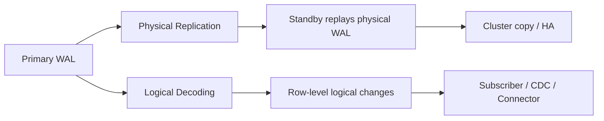
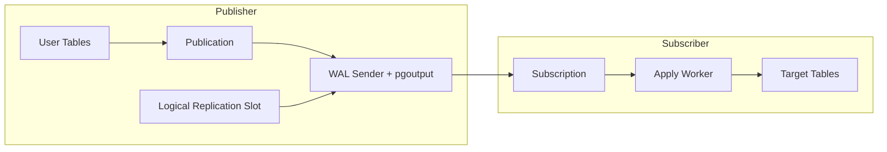
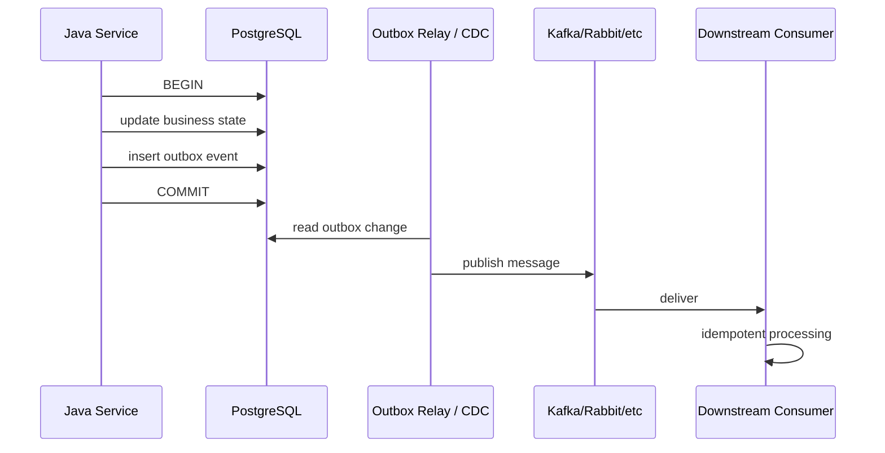

------
title: Learn PostgreSQL in Action - Part 024
description: Logical replication, publications, subscriptions, logical decoding, CDC, outbox architecture, schema drift, replica identity, and exactly-once illusion.
series: learn-postgresql-in-action
seriesTitle: Learn PostgreSQL in Action
order: 24
partTitle: Logical Replication, CDC, and Outbox Architecture
tags:
- postgresql
- database
- logical-replication
- cdc
- outbox
- integration
- java
- series
date: 2026-07-01
---

# Part 024 — Logical Replication, CDC, and Outbox Architecture

Pada Part 023 kita membahas physical streaming replication: WAL dikirim ke standby agar standby menjadi copy fisik yang bisa dipromosikan atau dipakai sebagai read-only replica.

Sekarang kita pindah ke keluarga replication yang berbeda: **logical replication** dan **logical decoding**.

Logical replication bukan sekadar “replica lain”. Ia adalah mekanisme mengubah WAL menjadi **stream perubahan logical** seperti insert, update, delete pada table tertentu. Dari sini lahir banyak arsitektur modern:

- selective database replication;
- migration antar versi/topology;
- change data capture;
- near-real-time projection;
- search indexing;
- data lake ingestion;
- event-driven integration;
- outbox relay;
- audit/event pipeline.

Namun logical replication juga sering disalahgunakan. Banyak engineer menganggap CDC adalah event system yang otomatis exactly-once, schema-safe, dan business-aware. Itu asumsi lemah.

Fokus part ini: membedakan **database change stream** dari **business event stream**, lalu mendesain boundary yang benar untuk Java production systems.

---

## 1. Physical vs Logical: Mental Model

Physical replication menjawab:

> Bagaimana membuat server lain memiliki physical state yang sama agar bisa standby/failover/read replica?

Logical replication menjawab:

> Bagaimana mengekspor perubahan data sebagai stream logical yang bisa diterapkan/dikonsumsi oleh target lain?



Logical replication masih berbasis WAL, tetapi output-nya adalah logical change protocol, bukan page-level recovery.

---

## 2. Use Cases yang Tepat

Logical replication cocok untuk:

| Use Case | Reason |
|---|---|
| Selective table replication | Tidak perlu seluruh cluster. |
| Blue/green database migration | Target bisa disiapkan dan disinkronkan. |
| Major version migration pattern tertentu | Bisa membantu transisi dengan downtime lebih kecil. |
| Read model/projection | Data tertentu didorong ke service/query store lain. |
| CDC ke Kafka/data lake | Perubahan row menjadi stream downstream. |
| Multi-database integration | Satu database publish subset data ke database lain. |
| Outbox relay | Outbox table dibaca sebagai durable integration boundary. |

Logical replication tidak otomatis cocok untuk:

| Misuse | Problem |
|---|---|
| HA failover utama | Physical replication lebih sesuai untuk cluster copy. |
| Multi-master tanpa conflict design | Conflict resolution tidak otomatis secara business-safe. |
| Business events langsung dari arbitrary table changes | Row change tidak selalu sama dengan domain event. |
| Exactly-once distributed transaction | Exactly-once end-to-end adalah ilusi tanpa idempotency. |
| Schema-free integration | Schema drift tetap harus dikelola. |

---

## 3. Publication and Subscription Model

PostgreSQL logical replication menggunakan model publisher/subscriber.

- **Publication** mendefinisikan table atau subset perubahan yang dipublikasikan dari publisher.
- **Subscription** di subscriber menarik perubahan dari publication.
- Apply worker di subscriber menerapkan perubahan.
- Logical replication slot menjaga posisi konsumsi WAL.



Basic example:

```sql
-- publisher
create publication app_pub
for table cases, case_events;

-- subscriber
create subscription app_sub
connection 'host=publisher port=5432 dbname=app user=repl password=secret'
publication app_pub;
```

Untuk production, contoh di atas belum cukup. Perlu memikirkan:

- replica identity;
- initial copy;
- schema synchronization;
- DDL migration ordering;
- conflict handling;
- slot retention;
- lag monitoring;
- failover behavior;
- filtering;
- generated columns;
- operational ownership.

---

## 4. Logical Decoding

Logical decoding adalah proses mengekstrak perubahan dari WAL menjadi representasi logical.

Komponen penting:

| Component | Role |
|---|---|
| `wal_level = logical` | Menghasilkan WAL dengan informasi cukup untuk logical decoding. |
| logical replication slot | Menyimpan posisi konsumsi perubahan. |
| output plugin | Menentukan format output logical changes. |
| `pgoutput` | Plugin standar untuk built-in logical replication. |
| `pg_logical_slot_get_changes` | Fungsi eksplorasi logical changes secara SQL. |
| external connector | Misalnya CDC connector yang membaca slot. |

Contoh eksplorasi:

```sql
select * from pg_create_logical_replication_slot('demo_slot', 'test_decoding');

insert into cases(id, status) values (1001, 'OPEN');
update cases set status = 'SUBMITTED' where id = 1001;

select * from pg_logical_slot_get_changes('demo_slot', null, null);
```

Catatan: `test_decoding` adalah contoh/debug plugin. Production CDC biasanya memakai connector/plugin sesuai platform.

---

## 5. Replica Identity

Untuk `UPDATE` dan `DELETE`, subscriber/consumer perlu tahu row mana yang berubah.

PostgreSQL menggunakan **replica identity**.

Default-nya biasanya primary key. Jika table tidak punya primary key atau unique suitable key, update/delete logical replication bermasalah atau butuh identity lain.

Options konseptual:

| Replica Identity | Meaning |
|---|---|
| default | Primary key jika ada. |
| using index | Gunakan unique index tertentu. |
| full | Kirim old row penuh sebagai identity. |
| nothing | Tidak punya identity untuk update/delete. |

Example:

```sql
alter table cases replica identity using index cases_business_key_uk;
```

Atau:

```sql
alter table cases replica identity full;
```

`REPLICA IDENTITY FULL` bisa mahal karena lebih banyak data dikirim dan lookup subscriber bisa lebih berat. Jangan menjadikannya default tanpa alasan.

### 5.1 Engineering Rule

Untuk table yang dipublikasikan logical replication:

- harus punya primary key atau stable unique identity;
- hindari mutable natural key sebagai identity;
- hindari table tanpa key untuk CDC penting;
- dokumentasikan identity sebagai integration contract;
- uji update/delete path, bukan hanya insert path.

---

## 6. Publication Granularity

Publication bisa mencakup:

- table tertentu;
- semua table dalam schema tertentu;
- semua table;
- subset columns;
- row filter;
- operasi tertentu seperti insert/update/delete/truncate.

Granularity mempengaruhi coupling.

### 6.1 Publish All Tables Anti-Pattern

```sql
create publication everything for all tables;
```

Ini nyaman untuk lab, tetapi sering buruk untuk production integration.

Risiko:

- internal table bocor ke downstream;
- schema change tak sengaja jadi breaking integration;
- PII ikut terpublikasi;
- high-churn table membanjiri pipeline;
- consumer terlalu tergantung pada internal schema;
- sulit melakukan deprecation.

Lebih baik:

```sql
create publication case_integration_pub
for table case_outbox, case_snapshot_projection;
```

Atau gunakan schema khusus integration:

```sql
create publication integration_pub
for tables in schema integration;
```

---

## 7. Initial Copy vs Streaming Changes

Saat subscription dibuat, PostgreSQL bisa menyalin data awal lalu melanjutkan streaming perubahan.

Masalah production:

- initial copy besar bisa membebani publisher/subscriber;
- table berubah saat copy berlangsung;
- index/constraint di subscriber mempengaruhi apply speed;
- schema harus compatible sebelum subscription aktif;
- copy progress perlu dimonitor;
- backfill dan CDC harus punya cutover strategy.

Migration mental model:

```txt
Prepare schema -> initial copy -> stream changes -> validate lag/data -> cutover writes/reads -> decommission old path
```

Jangan menganggap subscription creation sebagai atomic migration plan.

---

## 8. Schema Drift and DDL

Logical replication mereplikasi data changes, bukan semua semantic schema evolution secara otomatis dalam cara yang aman untuk aplikasi.

DDL harus dikelola secara eksplisit.

Contoh masalah:

- publisher tambah column `not null` tanpa default;
- subscriber belum punya column;
- column type berbeda;
- enum value belum ada di subscriber;
- generated column behavior berbeda;
- publication column list tidak update;
- table rename/drop tidak diproses seperti yang diharapkan consumer;
- constraint di subscriber menolak row yang valid di publisher.

### 8.1 DDL Discipline

Untuk logical replication, migration order harus dirancang:

1. apply compatible schema to subscriber;
2. ensure new columns nullable/default-compatible;
3. deploy publisher changes;
4. update publication/column lists if needed;
5. deploy consumer logic;
6. backfill if needed;
7. later enforce constraints.

Prinsipnya sama dengan zero-downtime migration, tetapi ada dua sisi: publisher dan subscriber.

---

## 9. Logical Replication Conflicts

Subscriber menerapkan changes. Conflict bisa terjadi jika target state tidak sesuai.

Contoh:

- duplicate key di subscriber;
- missing row saat update/delete;
- constraint violation;
- type mismatch;
- permission issue;
- trigger side effect;
- manually modified subscriber data;
- apply worker stopped;
- schema drift.

### 9.1 Subscriber Is Not a Magic Mirror

Jika subscriber juga ditulis aplikasi lain, Anda masuk conflict domain.

Rule:

> Treat logical subscriber tables as owned by replication unless you have explicit conflict design.

Untuk read model, biasanya subscriber/projection bersifat derived. Jangan biarkan user write langsung ke table yang sama tanpa model reconciliation.

---

## 10. Monitoring Logical Replication

### 10.1 Publications

```sql
select * from pg_publication;
select * from pg_publication_tables;
```

### 10.2 Subscriptions

```sql
select
    subname,
    subenabled,
    subslotname,
    subpublications
from pg_subscription;
```

### 10.3 Subscription Runtime Stats

```sql
select
    subid,
    subname,
    pid,
    received_lsn,
    latest_end_lsn,
    last_msg_send_time,
    last_msg_receipt_time,
    latest_end_time
from pg_stat_subscription;
```

### 10.4 Replication Slots on Publisher

```sql
select
    slot_name,
    slot_type,
    active,
    plugin,
    database,
    restart_lsn,
    confirmed_flush_lsn,
    pg_size_pretty(pg_wal_lsn_diff(pg_current_wal_lsn(), restart_lsn)) as retained_wal
from pg_replication_slots
where slot_type = 'logical'
order by retained_wal desc;
```

Logical slots have the same operational danger as physical slots: if consumer stops, WAL can be retained.

---

## 11. CDC: What It Is and What It Is Not

Change Data Capture captures database changes and forwards them to downstream systems.

CDC is good at answering:

> What rows changed in this database, in commit order, as observed from WAL?

CDC is not automatically good at answering:

> What business event happened and what does it mean?

Example:

```sql
update cases set status = 'SUBMITTED' where id = 123;
```

CDC can tell downstream:

```json
{
  "table": "cases",
  "op": "u",
  "before": {"status": "DRAFT"},
  "after": {"status": "SUBMITTED"}
}
```

But it may not know:

- who submitted;
- whether submission was user intent or system correction;
- what invariant was validated;
- what command caused it;
- whether external notification should be sent;
- whether this is a domain event or internal repair;
- whether the event should be public to other bounded contexts.

CDC is a transport of data changes. Domain events need semantic design.

---

## 12. Outbox Pattern

The outbox pattern solves a classic distributed systems problem:

> How do we update database state and publish an integration message without a distributed transaction between database and broker?

Approach:

1. within the same database transaction, update business tables;
2. insert event/message into `outbox` table;
3. a relay reads outbox rows or CDC stream;
4. relay publishes to broker/downstream;
5. relay marks processed or downstream deduplicates by event id.



Core guarantee:

> If the business transaction commits, the outbox message commits with it.

This does not guarantee downstream exactly-once processing. It gives a durable source for eventual publication.

---

## 13. Outbox Table Design

Example:

```sql
create table integration_outbox (
    id uuid primary key,
    aggregate_type text not null,
    aggregate_id text not null,
    event_type text not null,
    event_version integer not null,
    occurred_at timestamptz not null default now(),
    payload jsonb not null,
    headers jsonb not null default '{}'::jsonb,
    trace_id text,
    published_at timestamptz,
    publish_attempts integer not null default 0,
    next_attempt_at timestamptz not null default now(),
    created_at timestamptz not null default now(),
    constraint integration_outbox_event_version_ck check (event_version > 0)
);

create index integration_outbox_pending_idx
on integration_outbox (next_attempt_at, id)
where published_at is null;

create index integration_outbox_aggregate_idx
on integration_outbox (aggregate_type, aggregate_id, occurred_at);
```

### 13.1 Recommended Columns

| Column | Purpose |
|---|---|
| `id` | Idempotency key for message. |
| `aggregate_type` | Domain object category. |
| `aggregate_id` | Domain object identity. |
| `event_type` | Semantic event name. |
| `event_version` | Payload schema version. |
| `occurred_at` | Business occurrence timestamp. |
| `payload` | Event body. |
| `headers` | Trace/correlation/tenant metadata. |
| `published_at` | Polling relay bookkeeping if used. |
| `publish_attempts` | Retry visibility. |
| `next_attempt_at` | Backoff scheduling. |

### 13.2 Payload Discipline

Payload should be:

- versioned;
- explicit;
- stable enough for consumers;
- free from accidental internal columns;
- scoped to event meaning;
- compliant with privacy rules;
- documented as contract.

Avoid dumping entire row as event payload unless downstream truly owns that coupling.

---

## 14. Polling Outbox Relay

Polling relay reads pending rows and publishes them.

Example claim query:

```sql
with claimed as (
    select id
    from integration_outbox
    where published_at is null
      and next_attempt_at <= now()
    order by next_attempt_at, id
    for update skip locked
    limit 100
)
select o.*
from integration_outbox o
join claimed c on c.id = o.id;
```

After successful publish:

```sql
update integration_outbox
set published_at = now()
where id = $1
  and published_at is null;
```

For failure:

```sql
update integration_outbox
set publish_attempts = publish_attempts + 1,
    next_attempt_at = now() + make_interval(secs => least(3600, power(2, publish_attempts)::int))
where id = $1;
```

### 14.1 Polling Relay Trade-Offs

| Benefit | Cost |
|---|---|
| Simple; no logical slot required | Polling load |
| Easy to reason about in app DB | Need cleanup/retention |
| Works with normal SQL and transactions | Latency depends on poll interval |
| Explicit publish status | Marking published after broker send can still duplicate |
| Easy operational query | Relay needs concurrency control |

Polling outbox is often good enough and much easier to operate than full CDC for many systems.

---

## 15. CDC-Based Outbox Relay

Instead of polling `integration_outbox`, a CDC connector reads changes from WAL/logical slot and publishes insert events.

Benefits:

- lower database polling overhead;
- commit-order stream;
- low latency;
- scalable integration platform;
- no need to update `published_at` for every message if broker offset is source of progress.

Costs:

- logical slot operations;
- connector lifecycle;
- schema registry/serialization;
- slot lag and WAL retention risk;
- connector failover complexity;
- ordering/partitioning design;
- less obvious debugging for application teams.

### 15.1 CDC Outbox Mental Model

```txt
App transaction inserts outbox row -> WAL contains insert -> logical slot emits row -> connector publishes -> consumer deduplicates by outbox id
```

Critical rule:

> CDC outbox should publish outbox rows, not infer business events from arbitrary table updates.

---

## 16. Exactly-Once Illusion

A common claim:

> CDC gives exactly-once event delivery.

Better statement:

> CDC can provide a reliable ordered source of committed database changes, but end-to-end exactly-once effects require idempotent consumers, deterministic keys, and careful offset/transaction handling.

Failure windows remain:

| Window | Duplicate/Loss Risk |
|---|---|
| Relay reads event then crashes before publish | Event will be retried. |
| Relay publishes then crashes before marking published | Duplicate publish possible. |
| Broker acknowledges but consumer crashes after side effect | Consumer duplicate effect possible. |
| Consumer processes but offset commit fails | Reprocess possible. |
| Schema change breaks connector | Lag and retained WAL possible. |

Design consumers as idempotent:

```sql
create table consumed_messages (
    message_id uuid primary key,
    consumed_at timestamptz not null default now()
);
```

Consumer transaction:

```sql
begin;

insert into consumed_messages(message_id)
values (:messageId)
on conflict do nothing;

-- only perform side effect if insert happened

commit;
```

For external side effects, use provider idempotency keys when possible.

---

## 17. Ordering Semantics

Ordering is subtle.

Possible levels:

| Ordering Level | Meaning |
|---|---|
| Database commit order | WAL/logical stream order from one database. |
| Table order | Changes for one table in commit order. |
| Aggregate order | Events for same aggregate ordered by aggregate version. |
| Broker partition order | Order within one partition. |
| Consumer effect order | Actual applied side effects. |

Outbox event should include aggregate version if order matters:

```sql
alter table integration_outbox
add column aggregate_version bigint;

create unique index integration_outbox_aggregate_version_uk
on integration_outbox (aggregate_type, aggregate_id, aggregate_version)
where aggregate_version is not null;
```

Broker partitioning should use `aggregate_id` when per-aggregate order matters.

---

## 18. Transaction Boundary in Java

Correct outbox insertion must happen in the same database transaction as business state change.

Pseudo-service:

```java
@Transactional
public void submitCase(SubmitCaseCommand command) {
    CaseEntity c = caseRepository.findForUpdate(command.caseId());
    c.submit(command.userId(), command.reason());

    outboxRepository.save(OutboxEvent.of(
        UUID.randomUUID(),
        "Case",
        c.id().toString(),
        "CaseSubmitted",
        1,
        Map.of(
            "caseId", c.id(),
            "submittedBy", command.userId(),
            "submittedAt", clock.now()
        )
    ));
}
```

Bad pattern:

```java
@Transactional
public void submitCase(...) {
    updateCase();
}

public void afterCommitMaybe() {
    kafka.send(...); // not durable if process crashes before send
}
```

Another bad pattern:

```java
kafka.send(...);
repository.save(...);
```

If database save fails after broker send, downstream sees event for state that did not commit.

---

## 19. Triggers vs Application Outbox

Should outbox rows be inserted by database trigger or application code?

### 19.1 Trigger-Based Outbox

Pros:

- hard to forget;
- captures all writes even outside app;
- close to data change.

Cons:

- can lack business context;
- harder to version/domain model;
- hidden side effects;
- migration/testing complexity;
- may emit events for repair/backfill operations unintentionally;
- trigger logic can become mini-application inside database.

### 19.2 Application-Explicit Outbox

Pros:

- event is semantic;
- includes command/user/context;
- versioned with application code;
- easier to test as domain behavior;
- avoids accidental event emission.

Cons:

- developer can forget to emit event;
- requires discipline/review;
- writes outside app bypass events;
- needs transaction boundary correctness.

Rule of thumb:

- use application outbox for domain events;
- use trigger/CDC for audit or technical replication when row-level change is exactly what you need;
- do not confuse technical row capture with semantic event design.

---

## 20. Logical Replication for Migration

Logical replication can support migration:

1. create target database;
2. apply schema;
3. create publication on source;
4. create subscription on target;
5. initial copy data;
6. stream changes;
7. validate row counts/checksums/business queries;
8. freeze writes or dual-write carefully if needed;
9. cut over application;
10. monitor and rollback plan.

Risks:

- sequences not synchronized automatically in the way app expects;
- DDL drift;
- unsupported data types/extensions mismatch;
- large object behavior;
- trigger/constraint differences;
- replication lag at cutover;
- write still hitting old source;
- consumer identity mismatch.

Do not use logical replication migration without a validation plan.

---

## 21. Row Filters and Column Lists

Logical replication can reduce data exposure through row filters and column lists.

Example concept:

```sql
create publication active_cases_pub
for table cases
where (deleted_at is null);
```

Column list concept:

```sql
create publication public_case_summary_pub
for table cases (id, status, assigned_team, updated_at);
```

Use cases:

- avoid PII leakage;
- publish only active data;
- minimize downstream coupling;
- create stable integration view-like contract.

Caveats:

- filters are not a replacement for security model;
- update that changes filter match status has semantics to understand;
- consumers must know partial data contract;
- changing filters can require subscription refresh/copy strategy.

---

## 22. Security and Governance

Logical replication is data exfiltration capability. Treat it as sensitive.

Controls:

- replication role least privilege;
- publication-specific tables only;
- no `FOR ALL TABLES` for broad app integration unless intentional;
- avoid publishing secrets/PII by default;
- TLS for replication connection;
- network restriction;
- slot ownership registry;
- audit who created publications/subscriptions;
- downstream data retention policy;
- schema contract documentation;
- event versioning.

Security question:

> If this publication were consumed by an external system, what data would leak and what contract would be accidentally created?

---

## 23. Failure Modes

### 23.1 Logical Slot Retains WAL

Symptom:

- `pg_wal` grows;
- logical consumer inactive;
- slot `confirmed_flush_lsn` stuck.

Fix:

- restore connector;
- if safe, advance/drop slot;
- understand data loss for downstream;
- alert on retained WAL.

### 23.2 Replica Identity Missing

Symptom:

- update/delete fails to replicate;
- publication works for insert but fails later.

Fix:

- add primary key/unique identity;
- set replica identity;
- avoid `FULL` unless cost accepted.

### 23.3 Schema Drift Breaks Apply

Symptom:

- subscription apply worker stops;
- duplicate/type/column errors;
- lag grows.

Fix:

- apply compatible DDL;
- restart subscription;
- validate rows;
- improve migration ordering.

### 23.4 CDC Emits Too Much

Symptom:

- Kafka/topic flood;
- consumers break from internal table changes;
- cost increases.

Fix:

- narrow publication;
- use outbox table;
- version events;
- separate internal data from integration contract.

### 23.5 Duplicate Events Downstream

Symptom:

- email sent twice;
- external case duplicated;
- payment/notification repeated.

Root cause:

- at-least-once delivery without idempotency.

Fix:

- message id;
- consumer dedup table;
- external idempotency key;
- aggregate version guard.

---

## 24. Lab: Built-In Logical Replication

### 24.1 Publisher Setup

```sql
create table cases (
    id bigint primary key,
    status text not null,
    updated_at timestamptz not null default now()
);

insert into cases(id, status) values (1, 'DRAFT'), (2, 'OPEN');

create publication cases_pub for table cases;
```

Ensure publisher has:

```conf
wal_level = logical
max_replication_slots = 10
max_wal_senders = 10
```

### 24.2 Subscriber Setup

On subscriber, create compatible table:

```sql
create table cases (
    id bigint primary key,
    status text not null,
    updated_at timestamptz not null
);
```

Then:

```sql
create subscription cases_sub
connection 'host=publisher dbname=app user=repl password=secret'
publication cases_pub;
```

### 24.3 Test Changes

Publisher:

```sql
update cases
set status = 'SUBMITTED', updated_at = now()
where id = 1;
```

Subscriber:

```sql
select * from cases order by id;
```

### 24.4 Monitor

Publisher:

```sql
select slot_name, slot_type, active, confirmed_flush_lsn
from pg_replication_slots;
```

Subscriber:

```sql
select subname, received_lsn, latest_end_lsn, last_msg_receipt_time
from pg_stat_subscription;
```

---

## 25. Lab: Outbox Polling Relay Simulation

Create outbox:

```sql
create table integration_outbox (
    id uuid primary key,
    event_type text not null,
    payload jsonb not null,
    published_at timestamptz,
    next_attempt_at timestamptz not null default now(),
    created_at timestamptz not null default now()
);

create index integration_outbox_pending_idx
on integration_outbox (next_attempt_at, id)
where published_at is null;
```

Business transaction:

```sql
begin;

update cases
set status = 'SUBMITTED', updated_at = now()
where id = 1;

insert into integration_outbox(id, event_type, payload)
values (
    gen_random_uuid(),
    'CaseSubmitted',
    jsonb_build_object('caseId', 1, 'status', 'SUBMITTED')
);

commit;
```

Relay claim:

```sql
begin;

with claimed as (
    select id
    from integration_outbox
    where published_at is null
      and next_attempt_at <= now()
    order by next_attempt_at, id
    for update skip locked
    limit 10
)
select *
from integration_outbox
where id in (select id from claimed);

commit;
```

Mark published after successful external publish:

```sql
update integration_outbox
set published_at = now()
where id = :id;
```

---

## 26. Design Checklist

### 26.1 Logical Replication

- Is `wal_level` configured intentionally?
- Are publications narrow?
- Are table identities stable?
- Are update/delete paths tested?
- Is initial copy capacity planned?
- Are DDL migrations ordered on publisher/subscriber?
- Are slots monitored?
- Is lag alerted?
- Are subscriber conflicts visible?
- Is owner/team documented per slot/publication?

### 26.2 CDC

- Is CDC carrying row changes or domain events?
- Are schemas versioned?
- Are PII/secrets excluded?
- Are consumers idempotent?
- Is ordering requirement explicit?
- Is replay/backfill strategy defined?
- Is connector failure modeled?
- Is WAL retention under control?

### 26.3 Outbox

- Is outbox insert in same transaction as business change?
- Does event have stable id?
- Is payload versioned?
- Is aggregate id included?
- Is consumer idempotency required and implemented?
- Is retention/cleanup defined?
- Are stuck events observable?
- Is relay concurrency safe?
- Is event contract documented?

---

## 27. Decision Table

| Problem | Recommended Pattern |
|---|---|
| HA/failover | Physical streaming replication. |
| Read replica | Physical hot standby. |
| Selective table sync | Logical replication. |
| Database migration with lower downtime | Logical replication with validation/cutover plan. |
| Publish business event after transaction | Outbox pattern. |
| Stream row-level changes to data platform | CDC/logical decoding. |
| Search index update | Outbox or CDC projection, depending on semantic needs. |
| Integrate bounded contexts | Prefer semantic outbox events over raw table CDC. |
| Audit every row mutation | CDC or trigger-based audit, with retention/security design. |

---

## 28. Self-Correction Exercises

1. Explain why physical replication is good for HA but not sufficient as a business event pipeline.
2. Create a publication for only `integration_outbox`, not all tables, and explain why this reduces coupling.
3. A logical replication subscription fails on update/delete. Diagnose replica identity.
4. A CDC connector is down for 12 hours and `pg_wal` grows. Explain slot retention and recovery options.
5. Design an outbox event for `CaseSubmitted` with idempotency and versioning.
6. Explain why exactly-once delivery is an illusion unless consumers are idempotent.
7. Compare polling outbox and CDC outbox for a Java service with moderate throughput.
8. Create a migration order for adding a new non-null field to a published table without breaking subscribers.

---

## 29. Takeaways

- Logical replication publishes logical data changes, not physical cluster state.
- Publications/subscriptions are integration contracts and must be governed.
- Logical slots retain WAL; unmonitored CDC can threaten primary storage.
- Replica identity is mandatory for safe update/delete replication.
- DDL/schema drift is one of the most common logical replication failure modes.
- CDC is a database change stream, not automatically a domain event stream.
- Outbox pattern creates atomicity between business state change and durable event record.
- End-to-end exactly-once is usually an illusion; design idempotent consumers.
- For Java systems, the outbox row should be written in the same transaction as the business mutation.
- Publish semantic events when integrating bounded contexts; reserve raw CDC for technical data movement.

Part 025 akan membahas **backup, restore, PITR, dan disaster recovery**: bagaimana membuktikan bahwa data bukan hanya direplikasi, tetapi bisa dipulihkan ketika production benar-benar rusak.
