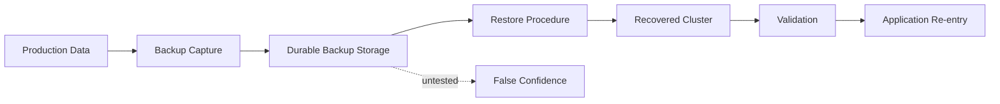
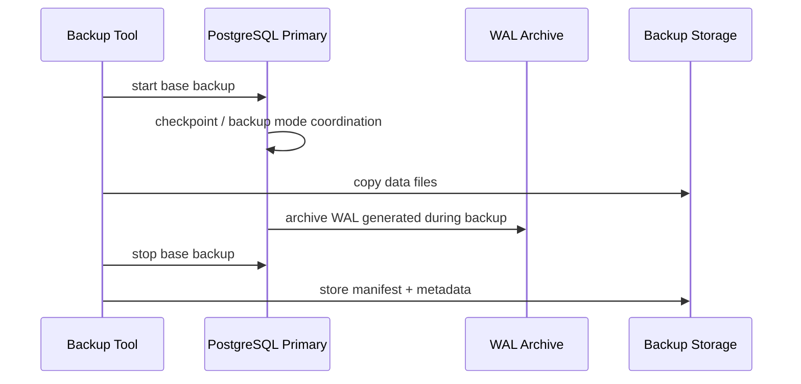
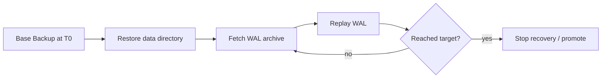
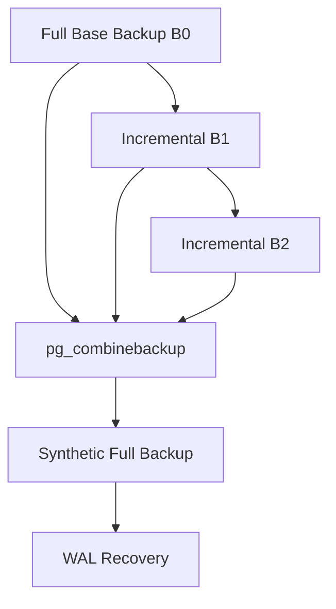
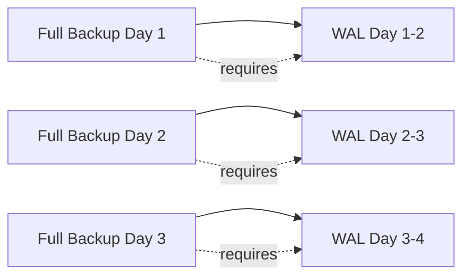
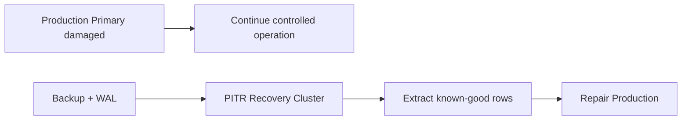
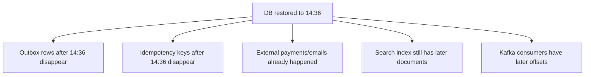
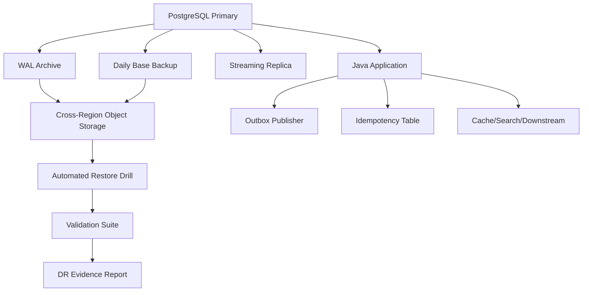

------
title: Learn PostgreSQL in Action - Part 025
description: Backup, restore, point-in-time recovery, disaster recovery design, backup verification, restore drills, RPO/RTO, and Java application implications.
series: learn-postgresql-in-action
seriesTitle: Learn PostgreSQL in Action
order: 25
partTitle: Backup, Restore, PITR, and Disaster Recovery
tags:
- postgresql
- database
- backup
- restore
- pitr
- disaster-recovery
- wal
- java
- series
date: 2026-07-01
---

# Part 025 — Backup, Restore, PITR, and Disaster Recovery

Pada Part 022 kita membahas WAL sebagai fondasi durability. Pada Part 023 kita membahas streaming replication sebagai cara menjaga standby tetap dekat dengan primary. Namun ada satu kesalahan mental model yang sangat umum:

> “Kami punya replica, berarti backup aman.”

Itu salah.

Replica adalah **availability mechanism**. Backup adalah **recovery mechanism**.

Replica bisa ikut menerima corruption logical, accidental delete, bad migration, broken batch job, privilege mistake, atau data poisoning. Backup harus menjawab pertanyaan berbeda:

- bisa kah kita kembali ke titik waktu sebelum kerusakan?
- berapa banyak data yang boleh hilang?
- berapa lama sistem boleh tidak tersedia?
- apakah proses restore sudah pernah diuji?
- apakah backup benar-benar bisa dibaca?
- apakah WAL archive lengkap?
- apakah application layer aman ketika database kembali ke waktu tertentu?

Fokus part ini adalah membangun mental model dan playbook **disaster recovery** untuk PostgreSQL production system, terutama dari sudut pandang Java service yang harus tetap benar ketika database di-restore, dipromosikan, atau dibangun ulang.

---

## 1. Kaufman Skill Deconstruction

Untuk menguasai backup dan DR PostgreSQL, jangan mulai dari hafalan command. Pecah skill menjadi sub-skill berikut:

| Sub-skill | Pertanyaan yang Harus Bisa Dijawab |
|---|---|
| Recovery objective | Berapa RPO/RTO yang benar untuk sistem ini? |
| Backup taxonomy | Kapan pakai logical dump, physical base backup, incremental backup, snapshot, atau replica? |
| WAL continuity | Apakah WAL archive lengkap dari base backup sampai target recovery? |
| PITR | Bagaimana restore ke waktu/LSN tertentu tanpa menimpa evidence? |
| Verification | Bagaimana tahu backup bukan sekadar file yang ada? |
| Restore drill | Bagaimana mengukur waktu restore sebenarnya? |
| Corruption scenario | Bagaimana recovery dari accidental delete, bad deploy, ransomware, disk loss, region loss? |
| Java boundary | Apa yang terjadi pada idempotency key, outbox, cache, search index, dan external side effect setelah restore? |

Target praktis setelah part ini:

> Kamu bisa merancang, menjalankan, dan menguji backup/PITR PostgreSQL dengan narasi RPO/RTO yang jelas, serta memahami efek restore terhadap aplikasi Java dan sistem downstream.

---

## 2. Backup Is Not a File; Backup Is a Recovery Capability

Backup yang tidak pernah di-restore bukan backup. Itu hanya artefak storage.

Mental model yang lebih tepat:



Backup capability terdiri dari:

1. **capture**: bagaimana data dan WAL diambil;
2. **transport**: bagaimana backup dipindahkan ke storage aman;
3. **retention**: berapa lama disimpan;
4. **integrity**: bagaimana diverifikasi;
5. **restore**: bagaimana dibangun ulang;
6. **validation**: bagaimana memastikan database usable;
7. **re-entry**: bagaimana aplikasi kembali membaca/menulis dengan aman.

Kegagalan bisa muncul di setiap tahap.

---

## 3. RPO and RTO: The Contract Before the Tool

Sebelum memilih tooling, definisikan dua angka:

| Term | Meaning | Example |
|---|---|---|
| RPO — Recovery Point Objective | Maksimal data loss yang bisa diterima | “Maksimal kehilangan 5 menit transaksi.” |
| RTO — Recovery Time Objective | Maksimal waktu sampai service usable lagi | “Service harus kembali read/write dalam 30 menit.” |

RPO/RTO bukan angka teknis murni. Ini adalah business contract.

Contoh:

| System | RPO | RTO | Implikasi |
|---|---:|---:|---|
| Payment ledger | 0–seconds | minutes | synchronous replication, strict backup, reconciliation. |
| Audit log regulatory | near-zero | hours | immutability, WAL archival, cross-region copy, evidence retention. |
| Notification preference | hours | hours | logical dump mungkin cukup. |
| Analytics cache | days | hours/days | bisa rebuild dari source. |
| Case management workflow | minutes | < 1 hour | PITR + outbox/idempotency validation. |

Weak framing:

> “Kita butuh backup harian.”

Better framing:

> “Kita butuh kemampuan restore ke titik waktu dalam 5 menit sebelum kerusakan, dengan waktu recovery maksimal 45 menit, untuk seluruh database dan evidence chain tetap dapat diaudit.”

---

## 4. Backup Taxonomy

PostgreSQL punya beberapa pendekatan backup. Masing-masing menjawab masalah berbeda.

| Approach | Level | Cocok Untuk | Tidak Cocok Untuk |
|---|---|---|---|
| `pg_dump` | Logical object/data | selective restore, migration kecil, schema review | database besar dengan RTO ketat |
| `pg_dumpall` | Logical cluster-wide globals + databases | roles/globals export | high-volume PITR |
| physical base backup | cluster file-level | full cluster recovery, standby bootstrap, PITR | selective table restore langsung |
| WAL archiving | change history | PITR, continuous recovery | berguna hanya jika chain lengkap |
| incremental base backup | physical delta since prior backup | mengurangi backup size/time | perlu dependency chain dan combine step |
| filesystem/cloud snapshot | storage-level | fast capture pada platform tertentu | harus PostgreSQL-consistent dan WAL-safe |
| replica | live copy | HA/read scale | bukan backup dari logical corruption |

Key principle:

> Logical backup memindahkan meaning. Physical backup memindahkan state.

---

## 5. Logical Backup: `pg_dump` and `pg_restore`

Logical backup menghasilkan representasi SQL atau archive format dari object database.

### 5.1 When Logical Backup Is Useful

Gunakan logical backup untuk:

- restore subset object;
- migrasi antar environment;
- backup database kecil/menengah;
- review schema/data dalam format portable;
- export sebelum destructive migration;
- disaster recovery tambahan untuk critical table;
- seed staging/dev.

### 5.2 Basic Commands

Custom format:

```bash
pg_dump \
  --format=custom \
  --file=/backups/appdb-2026-07-01.dump \
  --dbname=postgresql://backup_user@db-primary:5432/appdb
```

Restore:

```bash
createdb appdb_restore

pg_restore \
  --dbname=postgresql://postgres@restore-host:5432/appdb_restore \
  --jobs=4 \
  --verbose \
  /backups/appdb-2026-07-01.dump
```

Directory format untuk parallel dump/restore:

```bash
pg_dump \
  --format=directory \
  --jobs=4 \
  --file=/backups/appdb-dir \
  appdb

pg_restore \
  --dbname=appdb_restore \
  --jobs=4 \
  /backups/appdb-dir
```

### 5.3 Logical Dump Failure Modes

| Failure Mode | Why It Happens | Mitigation |
|---|---|---|
| Dump terlalu lama | database besar, IO terbatas | physical backup/PITR untuk DR utama |
| Restore terlalu lama | index/constraint rebuild mahal | parallel restore, tested RTO, physical backup |
| Role/permission hilang | hanya dump database, bukan globals | backup `pg_dumpall --globals-only` |
| Extension mismatch | target belum punya extension/version | restore pre-check extension inventory |
| Sequence drift | manual restore subset tanpa sequence sync | run sequence validation |
| Inconsistent app state | restore subset table tanpa dependensi | dependency-aware restore plan |

### 5.4 Dump Is Not PITR

`pg_dump` mengambil snapshot konsisten, tetapi tidak memberi timeline perubahan setelah snapshot. Kalau backup pukul 00:00 dan accidental delete pukul 14:37, logical dump tidak bisa restore ke 14:36 kecuali ada mekanisme change log lain.

Untuk itu, gunakan physical backup + WAL archiving.

---

## 6. Physical Backup Mental Model

Physical backup mengambil file cluster PostgreSQL. Tetapi karena database bisa tetap menulis saat backup berjalan, backup harus dikombinasikan dengan WAL agar konsisten.



Recovery membutuhkan:

1. base backup;
2. WAL dari start backup sampai target recovery;
3. recovery configuration;
4. valid control files/manifest;
5. restore process yang benar.

---

## 7. `pg_basebackup`: Full Physical Backup

`pg_basebackup` mengambil backup cluster running PostgreSQL melalui replication protocol.

Example:

```bash
pg_basebackup \
  --host=db-primary \
  --port=5432 \
  --username=backup_user \
  --pgdata=/backups/base/2026-07-01T010000Z \
  --format=plain \
  --checkpoint=fast \
  --write-recovery-conf \
  --progress \
  --verbose
```

Tar format:

```bash
pg_basebackup \
  -h db-primary \
  -U backup_user \
  -D /backups/base/2026-07-01T010000Z \
  -Ft \
  -z \
  -P \
  -v
```

Important properties:

- backup mencakup seluruh cluster, bukan satu database saja;
- membutuhkan replication-capable connection;
- harus mempertimbangkan WAL yang dihasilkan selama backup;
- bisa dipakai untuk PITR dan standby bootstrap;
- backup metadata/manifest harus disimpan bersama backup.

### 7.1 Backup Role

Example role:

```sql
CREATE ROLE backup_user WITH LOGIN REPLICATION PASSWORD 'change-me';
```

`pg_hba.conf` example:

```conf
host replication backup_user 10.10.0.0/16 scram-sha-256
host appdb       backup_user 10.10.0.0/16 scram-sha-256
```

Security note:

> Backup role adalah high-impact identity. Siapa pun yang bisa mengambil physical backup bisa membaca data sensitif dari seluruh cluster.

### 7.2 Backup Labeling

Backup harus punya metadata:

```json
{
  "cluster": "prod-appdb-main",
  "environment": "production",
  "postgres_version": "18.x",
  "backup_type": "base_full",
  "started_at": "2026-07-01T01:00:00Z",
  "finished_at": "2026-07-01T01:17:42Z",
  "tool": "pg_basebackup",
  "wal_archive_prefix": "s3://company-pg-wal/prod-appdb-main/",
  "retention_class": "daily-35d-monthly-13m",
  "encryption_key_id": "kms-key-id",
  "operator": "automation"
}
```

Without metadata, restore during incident becomes guessing.

---

## 8. WAL Archiving: The PITR Backbone

WAL archive stores completed WAL segments outside `pg_wal`.

Concept:


Example config:

```conf
archive_mode = on
archive_command = 'test ! -f /archive/%f && cp %p /archive/%f'
archive_timeout = '60s'
```

Production usually uses object storage or backup tooling, not raw local copy. A simplified object-storage shape:

```conf
archive_mode = on
archive_command = 'wal-archive-put %p s3://company-pg-wal/prod/%f'
archive_timeout = '60s'
```

Critical invariant:

> PITR is only possible if the WAL chain from the base backup to the recovery target is complete.

### 8.1 Bad `archive_command` Anti-Pattern

Never do this in production:

```conf
archive_command = '/bin/true'
```

It marks WAL as archived without storing it. That destroys PITR chain.

### 8.2 Archive Command Must Be Idempotent

PostgreSQL may retry archive command. It must be safe when the target object already exists.

Good properties:

- upload atomically or use temp name + rename;
- fail if object exists with different checksum;
- succeed if object exists with same checksum;
- emit observable logs;
- never silently drop WAL;
- alert on repeated archive failures.

Pseudo behavior:

```bash
#!/usr/bin/env bash
set -euo pipefail

SOURCE="$1"
TARGET="$2"

if object_exists "$TARGET"; then
  verify_same_checksum "$SOURCE" "$TARGET"
  exit 0
fi

upload_to_temp "$SOURCE" "$TARGET.tmp"
verify_uploaded_checksum "$SOURCE" "$TARGET.tmp"
promote_temp_object "$TARGET.tmp" "$TARGET"
```

---

## 9. Point-in-Time Recovery Mental Model

PITR restores base backup, then replays WAL until target.



Recovery target can be:

- timestamp;
- LSN;
- transaction ID;
- named restore point;
- immediate consistency point.

### 9.1 Named Restore Point

Before risky operation:

```sql
SELECT pg_create_restore_point('before_case_status_backfill_2026_07_01');
```

Then configure recovery target:

```conf
restore_command = 'wal-archive-get %f %p'
recovery_target_name = 'before_case_status_backfill_2026_07_01'
recovery_target_action = 'pause'
```

This is useful before:

- large data backfill;
- irreversible data cleanup;
- risky schema migration;
- third-party import;
- batch correction job.

### 9.2 Recovery to Timestamp

```conf
restore_command = 'wal-archive-get %f %p'
recovery_target_time = '2026-07-01 14:36:00+00'
recovery_target_action = 'pause'
```

`pause` lets you inspect before accepting target. To continue:

```sql
SELECT pg_wal_replay_resume();
```

To promote:

```bash
pg_ctl promote -D /var/lib/postgresql/data
```

Or:

```sql
SELECT pg_promote();
```

---

## 10. Recovery Drill: Lab Procedure

This lab simulates accidental delete and PITR.

### 10.1 Prepare Data

```sql
CREATE TABLE dr_case_event (
    id bigint GENERATED ALWAYS AS IDENTITY PRIMARY KEY,
    case_id uuid NOT NULL,
    event_type text NOT NULL,
    payload jsonb NOT NULL DEFAULT '{}',
    created_at timestamptz NOT NULL DEFAULT now()
);

INSERT INTO dr_case_event (case_id, event_type, payload)
SELECT gen_random_uuid(), 'CASE_CREATED', jsonb_build_object('i', gs)
FROM generate_series(1, 10000) gs;

SELECT count(*) FROM dr_case_event;
```

### 10.2 Create Restore Point

```sql
SELECT pg_create_restore_point('before_bad_delete_lab');
```

### 10.3 Bad Operation

```sql
DELETE FROM dr_case_event;
SELECT count(*) FROM dr_case_event;
```

### 10.4 Stop Primary and Restore Backup

High-level restore:

```bash
systemctl stop postgresql

mv $PGDATA ${PGDATA}.broken.$(date +%s)
mkdir -p $PGDATA

# restore base backup content into PGDATA
rsync -a /backups/base/latest/ $PGDATA/
chown -R postgres:postgres $PGDATA
chmod 700 $PGDATA
```

Create `recovery.signal`:

```bash
touch $PGDATA/recovery.signal
```

Add recovery settings in `postgresql.conf` or included recovery config:

```conf
restore_command = 'wal-archive-get %f %p'
recovery_target_name = 'before_bad_delete_lab'
recovery_target_action = 'pause'
```

Start PostgreSQL:

```bash
systemctl start postgresql
```

Validate:

```sql
SELECT pg_is_in_recovery();
SELECT count(*) FROM dr_case_event;
```

If correct, promote:

```sql
SELECT pg_promote();
```

---

## 11. Restore Validation Checklist

After restore, do not immediately send all application traffic.

Validate layers:

### 11.1 Cluster-Level Validation

```sql
SELECT version();
SELECT pg_is_in_recovery();
SELECT current_setting('data_directory');
SELECT current_setting('archive_mode');
SELECT current_setting('server_version');
```

Check database list:

```sql
SELECT datname, datallowconn
FROM pg_database
ORDER BY datname;
```

Check invalid indexes:

```sql
SELECT
    n.nspname AS schema_name,
    c.relname AS index_name,
    i.indisvalid,
    i.indisready
FROM pg_index i
JOIN pg_class c ON c.oid = i.indexrelid
JOIN pg_namespace n ON n.oid = c.relnamespace
WHERE NOT i.indisvalid OR NOT i.indisready
ORDER BY 1, 2;
```

### 11.2 Data-Level Validation

Use business invariants:

```sql
-- no negative balances
SELECT count(*)
FROM account_balance
WHERE available_amount < 0;

-- no workflow item in impossible state
SELECT status, count(*)
FROM case_file
GROUP BY status
ORDER BY status;

-- no orphan child rows
SELECT count(*)
FROM case_action a
LEFT JOIN case_file c ON c.id = a.case_id
WHERE c.id IS NULL;
```

### 11.3 Sequence Validation

After logical restore or manual repair:

```sql
SELECT
    sequence_schema,
    sequence_name
FROM information_schema.sequences
ORDER BY 1, 2;
```

Example repair:

```sql
SELECT setval(
    pg_get_serial_sequence('case_file', 'id'),
    COALESCE((SELECT max(id) FROM case_file), 1),
    true
);
```

### 11.4 Extension Validation

```sql
SELECT extname, extversion
FROM pg_extension
ORDER BY extname;
```

### 11.5 Application Smoke Test

Minimum Java-level validation:

- app can connect with normal role;
- migrations are not unexpectedly re-run;
- read endpoint works;
- simple write transaction works;
- idempotency check works;
- outbox relay paused/unpaused intentionally;
- scheduled jobs disabled until declared safe;
- caches/search indexes are consistent or scheduled for rebuild.

---

## 12. Backup Verification

There are two levels:

1. **file/integrity verification**;
2. **restore/use verification**.

### 12.1 Manifest Verification

Modern physical backup can include a backup manifest. Verify it:

```bash
pg_verifybackup /backups/base/2026-07-01T010000Z
```

This helps detect missing/corrupt files, but it does not prove your entire DR procedure works.

### 12.2 Restore Verification

A real restore verification means:

1. provision isolated environment;
2. restore latest base backup;
3. replay WAL to selected target;
4. start database;
5. run invariant checks;
6. run representative application smoke tests;
7. measure duration;
8. store evidence.

Evidence example:

```json
{
  "dr_drill_id": "drill-2026-07-01-prod-appdb",
  "backup_id": "base-2026-07-01T010000Z",
  "target_time": "2026-07-01T03:00:00Z",
  "restore_started_at": "2026-07-01T04:00:00Z",
  "restore_finished_at": "2026-07-01T04:21:18Z",
  "rto_observed_seconds": 1278,
  "rpo_observed_seconds": 60,
  "wal_segments_replayed": 412,
  "validation_status": "passed",
  "checked_by": "automation"
}
```

---

## 13. Incremental Physical Backup in PostgreSQL 18

PostgreSQL 18 supports incremental backup through `pg_basebackup --incremental`, using a prior backup manifest as reference. The output is not directly restorable as a standalone cluster. It must be combined with earlier backups using `pg_combinebackup`.

Mental model:



Example:

```bash
# Full backup
pg_basebackup \
  -h db-primary \
  -U backup_user \
  -D /backups/full-2026-07-01 \
  --manifest-checksums=SHA256 \
  -P

# Incremental backup referencing prior manifest
pg_basebackup \
  -h db-primary \
  -U backup_user \
  -D /backups/incr-2026-07-02 \
  --incremental=/backups/full-2026-07-01/backup_manifest \
  --manifest-checksums=SHA256 \
  -P
```

Combine:

```bash
pg_combinebackup \
  -o /restore/synthetic-full-2026-07-02 \
  /backups/full-2026-07-01 \
  /backups/incr-2026-07-02
```

Then perform normal recovery with WAL.

### 13.1 Incremental Backup Risk

Incremental backup introduces dependency chain risk.

| Risk | Explanation |
|---|---|
| Missing prior backup | incremental cannot reconstruct omitted blocks. |
| Missing manifest | reference chain broken. |
| WAL summary unavailable | incremental backup can fail. |
| More complex restore | combine step adds time and failure modes. |
| Retention mistake | deleting old base backup can make later incrementals useless. |

Use incremental backup only with strong metadata, retention tracking, and restore drills.

---

## 14. Backup Retention Strategy

Retention is not “keep everything forever”. It is a policy balancing compliance, cost, and recovery needs.

Example:

| Backup Type | Frequency | Retention |
|---|---:|---:|
| WAL archive | continuous | 35 days online, 13 months cold |
| Full base backup | daily | 35 days |
| Monthly full backup | monthly | 13 months |
| Yearly compliance snapshot | yearly | 7 years |
| Logical critical export | daily | 90 days |

Need to preserve dependencies:



Do not delete WAL required for any still-retained base backup.

---

## 15. Storage Design for Backup

Backup storage should be:

- encrypted;
- access-controlled;
- immutable or object-locked when needed;
- cross-zone/region replicated for critical systems;
- monitored for growth and failure;
- separated from compromised production credentials;
- periodically sampled by restore automation.

### 15.1 Access Boundary

Bad pattern:

```text
Production app role can write backup bucket and delete old backups.
```

Better pattern:

```text
PostgreSQL backup identity can write WAL/base backups.
Retention automation can expire backups according to policy.
Human break-glass restore role can read backups.
Application runtime role has no backup access.
```

### 15.2 Immutability

For regulated/audit-heavy systems, use object lock / retention lock where possible.

Why:

- compromised DB host should not be able to erase all backups;
- ransomware should not be able to modify historical backup;
- audit evidence should be defensible.

---

## 16. Disaster Scenarios and Recovery Strategy

### 16.1 Accidental Table Delete

Symptom:

```sql
DELETE FROM case_file;
-- or
TRUNCATE case_file CASCADE;
```

Recovery options:

| Option | Pros | Cons |
|---|---|---|
| PITR entire cluster before delete | clean recovery | loses later legitimate writes unless reconciled |
| Restore copy then extract table | preserves current primary | complex merge/reconciliation |
| Logical/audit rebuild | less disruptive if event-sourced | requires complete event history |

Decision depends on data volume, write traffic after incident, and business tolerance.

### 16.2 Bad Migration

Example:

```sql
ALTER TABLE case_file DROP COLUMN regulatory_basis;
```

If migration committed and app continues writing, you may need:

1. stop app writes;
2. restore copy before migration;
3. extract lost data;
4. repair primary;
5. re-run validated migration;
6. reconcile downstream.

This is why lock-safe and reversible migrations matter.

### 16.3 Logical Corruption from Bug

Example: application sets all open cases to `CLOSED` due to bad predicate.

Recovery is not always “restore whole DB”. You may need forensic reconstruction:

```sql
-- On PITR-restored copy:
SELECT id, status, updated_at
FROM case_file
WHERE updated_at < '2026-07-01 14:00:00+00';
```

Then generate repair statements or compare rows between restored copy and current primary.

### 16.4 Primary Disk Loss

If primary disk lost but standby healthy:

- promote standby for HA;
- provision new replica from promoted primary;
- keep backups intact;
- later analyze root cause.

Backup still matters because standby may be missing data or may carry corruption.

### 16.5 Region Loss

Requires:

- backup in another region;
- credentials in another region;
- infrastructure-as-code to provision PostgreSQL;
- DNS/service discovery plan;
- tested restore performance;
- dependency readiness: Kafka, object storage, secrets, app nodes.

---

## 17. Restore Copy and Selective Data Repair

A common production pattern:

> Do PITR into an isolated recovery cluster, not directly over primary.

Then compare/extract.



Example compare:

```sql
-- On restored cluster
COPY (
  SELECT id, status, assigned_team_id, updated_at
  FROM case_file
  WHERE id = ANY(:affected_case_ids)
) TO '/tmp/good_case_file.csv' WITH CSV HEADER;
```

Then load into staging table on production:

```sql
CREATE TABLE repair_case_file_import (
    id uuid PRIMARY KEY,
    status text NOT NULL,
    assigned_team_id uuid,
    updated_at timestamptz NOT NULL
);

COPY repair_case_file_import
FROM '/tmp/good_case_file.csv'
WITH CSV HEADER;
```

Repair transaction:

```sql
BEGIN;

UPDATE case_file c
SET
    status = r.status,
    assigned_team_id = r.assigned_team_id,
    updated_at = clock_timestamp()
FROM repair_case_file_import r
WHERE c.id = r.id;

INSERT INTO repair_audit_log (repair_id, table_name, row_count, executed_at)
SELECT 'INC-2026-07-01', 'case_file', count(*), clock_timestamp()
FROM repair_case_file_import;

COMMIT;
```

---

## 18. Java Application Implications After Restore

PITR can move the database backward in time. External systems cannot be moved backward as easily.

That mismatch is dangerous.



### 18.1 Idempotency Table

If DB restore removes idempotency records, retried client requests may execute external side effects again.

Mitigation:

- store external provider transaction IDs;
- make provider calls idempotent too;
- keep idempotency state in a durable system considered during DR;
- after PITR, reconcile requests processed after recovery target.

### 18.2 Outbox Table

If outbox rows after target time vanish but messages were already published, consumers may observe events not represented in restored DB.

Mitigation:

- pause outbox publisher during recovery;
- record published message IDs;
- reconcile Kafka topic against restored DB;
- design consumers idempotently;
- store event IDs in domain tables when necessary.

### 18.3 Caches and Search Indexes

After PITR:

- Redis caches may contain future state;
- Elasticsearch/OpenSearch may contain future documents;
- materialized projections may be ahead of DB;
- downstream read models may need rebuild.

DR playbook must include:

```text
1. Disable writers.
2. Restore database.
3. Invalidate caches.
4. Pause async workers.
5. Rebuild or rewind projections.
6. Resume traffic gradually.
```

### 18.4 Scheduled Jobs

During recovery, scheduled jobs must be controlled.

Dangerous jobs:

- retry external payment;
- resend notification;
- run status escalation;
- expire cases;
- publish outbox;
- clean “old” records.

Pattern:

```sql
CREATE TABLE system_gate (
    gate_name text PRIMARY KEY,
    enabled boolean NOT NULL,
    updated_at timestamptz NOT NULL DEFAULT now()
);

INSERT INTO system_gate (gate_name, enabled)
VALUES ('background_jobs', false)
ON CONFLICT (gate_name) DO UPDATE
SET enabled = EXCLUDED.enabled,
    updated_at = now();
```

Java scheduler checks gate before execution.

---

## 19. Backup Monitoring Queries

### 19.1 WAL Archiver Status

```sql
SELECT
    archived_count,
    last_archived_wal,
    last_archived_time,
    failed_count,
    last_failed_wal,
    last_failed_time,
    stats_reset
FROM pg_stat_archiver;
```

Alert on:

- `failed_count` increasing;
- `last_archived_time` too old;
- WAL directory growing;
- archive latency beyond RPO.

### 19.2 WAL Generation Rate

```sql
SELECT
    pg_current_wal_lsn() AS current_lsn,
    pg_wal_lsn_diff(pg_current_wal_lsn(), '0/0') AS bytes_since_start;
```

Better in monitoring system: calculate delta over time.

### 19.3 Replication Slot Retention

```sql
SELECT
    slot_name,
    slot_type,
    active,
    restart_lsn,
    confirmed_flush_lsn,
    pg_size_pretty(pg_wal_lsn_diff(pg_current_wal_lsn(), restart_lsn)) AS retained_wal
FROM pg_replication_slots;
```

### 19.4 Database Size

```sql
SELECT
    datname,
    pg_size_pretty(pg_database_size(datname)) AS size
FROM pg_database
ORDER BY pg_database_size(datname) DESC;
```

### 19.5 Table Growth

```sql
SELECT
    schemaname,
    relname,
    pg_size_pretty(pg_total_relation_size(format('%I.%I', schemaname, relname))) AS total_size
FROM pg_stat_user_tables
ORDER BY pg_total_relation_size(format('%I.%I', schemaname, relname)) DESC
LIMIT 20;
```

---

## 20. Backup Runbook Template

### 20.1 Daily Backup Job

```text
Job: PostgreSQL Daily Base Backup
Frequency: daily 01:00 UTC
Inputs:
  - primary host
  - backup role credential
  - backup destination
  - encryption key
Steps:
  1. verify primary reachable
  2. verify archive healthy
  3. start pg_basebackup
  4. upload manifest + metadata
  5. run pg_verifybackup
  6. update backup catalog
  7. emit metrics
Failure behavior:
  - page if backup fails twice
  - page immediately if WAL archive fails
```

### 20.2 Restore Drill Job

```text
Job: Weekly PostgreSQL Restore Drill
Frequency: weekly
Inputs:
  - latest backup id
  - random target timestamp within backup window
Steps:
  1. provision isolated restore environment
  2. restore base backup
  3. replay WAL to target
  4. start PostgreSQL
  5. run invariant checks
  6. run app smoke tests
  7. record observed RTO/RPO
  8. destroy environment
Success criteria:
  - all validation checks pass
  - RTO <= declared objective
  - WAL archive completeness verified
```

---

## 21. `pg_dump` vs PITR Decision Matrix

| Requirement | Better Tool |
|---|---|
| Restore one table from yesterday | `pg_dump` if available; otherwise PITR copy + extract |
| Full cluster disaster recovery | physical backup + WAL |
| Major version migration | logical dump/restore or logical replication strategy |
| Recover to 14:36 before bad job | PITR |
| Copy production-like schema to dev | `pg_dump --schema-only` / sanitized dump |
| Validate schema as code review artifact | logical dump |
| Bootstrap standby | `pg_basebackup` |
| Fast region recovery | physical backup/snapshot + WAL + IaC |

---

## 22. Backup and Migration Safety

Before risky migrations:

1. ensure WAL archiving healthy;
2. ensure latest backup exists and verified;
3. create named restore point;
4. disable high-risk background jobs;
5. run migration in lock-aware manner;
6. collect evidence;
7. keep restore plan nearby.

Example pre-migration gate:

```sql
SELECT
    last_archived_time,
    now() - last_archived_time AS archive_lag,
    failed_count
FROM pg_stat_archiver;
```

If archive is broken, postpone risky migration.

---

## 23. Common Anti-Patterns

### 23.1 “Replica Is Backup”

Replica can replicate bad data. Use backup/PITR.

### 23.2 “Backup Succeeded Because Job Was Green”

Green job may mean files uploaded, not restored.

### 23.3 “We Can Restore Manually During Incident”

Manual restore under stress is slow and error-prone. Automate and test.

### 23.4 “Keep 7 Days of Base Backups but 2 Days of WAL”

Then older base backups may be useless for PITR.

### 23.5 “No App-Level DR Plan”

Database restore without outbox/cache/search/idempotency reconciliation can create inconsistent distributed state.

### 23.6 “No Restore Ownership”

DR must have named owners and escalation path.

---

## 24. DR Architecture for Java Systems

A practical production architecture:



Important design point:

> DR architecture includes the application side effects, not only the database files.

---

## 25. Self-Correction Checklist

Use this to evaluate your production readiness:

- Can we state RPO/RTO per service and dataset?
- Do we have physical backup plus WAL archive for critical DB?
- Do we verify backups using `pg_verifybackup` or equivalent?
- Do we run actual restore drills?
- Do we know observed restore time, not guessed time?
- Are WAL archives immutable enough against compromise?
- Do we know which base backups depend on which WAL ranges?
- Do we preserve incremental backup dependency chains?
- Do we have a restore copy workflow for selective repair?
- Do we have app-level re-entry steps after PITR?
- Are caches/search/projections rebuilt or invalidated after restore?
- Are scheduled jobs disabled during recovery?
- Is outbox publisher controlled during recovery?
- Do we have evidence suitable for audit/regulatory review?

---

## 26. Practice Tasks

### Task 1 — Build a Backup Inventory

Create table:

```sql
CREATE TABLE backup_catalog (
    backup_id text PRIMARY KEY,
    cluster_name text NOT NULL,
    backup_type text NOT NULL,
    started_at timestamptz NOT NULL,
    finished_at timestamptz NOT NULL,
    base_lsn pg_lsn,
    wal_start_lsn pg_lsn,
    wal_end_lsn pg_lsn,
    storage_uri text NOT NULL,
    manifest_uri text,
    verified_at timestamptz,
    restore_tested_at timestamptz
);
```

Think through how automation would populate it.

### Task 2 — Write a DR Runbook

For your current Java service, write:

- RPO;
- RTO;
- critical tables;
- external side effects;
- idempotency mechanism;
- outbox behavior;
- cache/search rebuild steps;
- validation SQL.

### Task 3 — Simulate PITR

In lab:

1. create data;
2. create restore point;
3. delete data;
4. restore to point;
5. validate count;
6. document elapsed time.

### Task 4 — Restore Copy Repair

Simulate:

1. corrupt 100 rows;
2. PITR to isolated cluster;
3. export correct 100 rows;
4. repair primary via staging table.

---

## 27. Key Takeaways

- Backup is not a file; it is a tested recovery capability.
- Replica improves availability, but it is not enough for logical corruption recovery.
- PITR requires base backup plus continuous WAL archive chain.
- `pg_basebackup` is a primary building block for physical backup and standby bootstrap.
- PostgreSQL 18 supports incremental physical backup, but restore depends on backup chain and `pg_combinebackup`.
- Restore drills are mandatory if RTO/RPO matter.
- Java application recovery must account for idempotency, outbox, caches, search indexes, scheduled jobs, and downstream systems.
- The strongest DR plan is evidence-driven: measured restore time, verified backup, validated invariants, documented operator steps.

---

## 28. References

- PostgreSQL Documentation — Backup and Restore: https://www.postgresql.org/docs/current/backup.html
- PostgreSQL Documentation — Continuous Archiving and Point-in-Time Recovery: https://www.postgresql.org/docs/current/continuous-archiving.html
- PostgreSQL Documentation — `pg_basebackup`: https://www.postgresql.org/docs/current/app-pgbasebackup.html
- PostgreSQL Documentation — `pg_combinebackup`: https://www.postgresql.org/docs/current/app-pgcombinebackup.html
- PostgreSQL Documentation — `pg_verifybackup`: https://www.postgresql.org/docs/current/app-pgverifybackup.html
- PostgreSQL Documentation — WAL Configuration: https://www.postgresql.org/docs/current/runtime-config-wal.html
