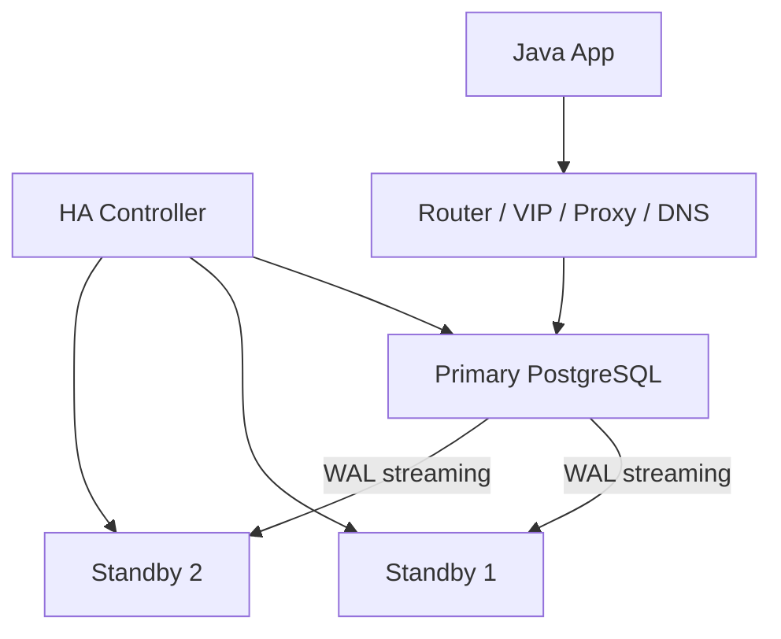
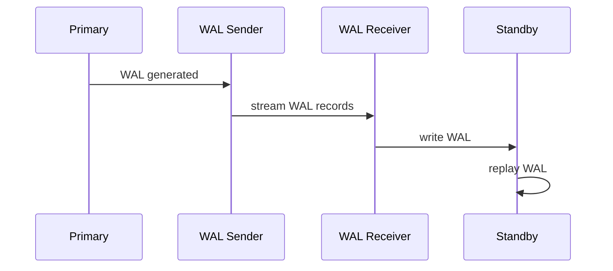
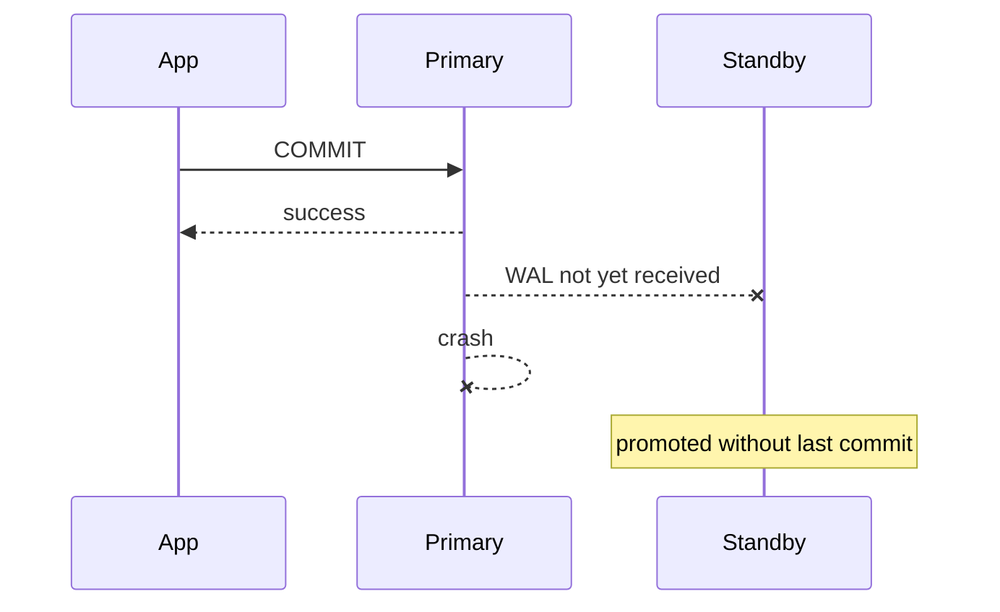
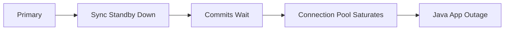
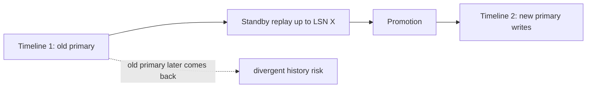
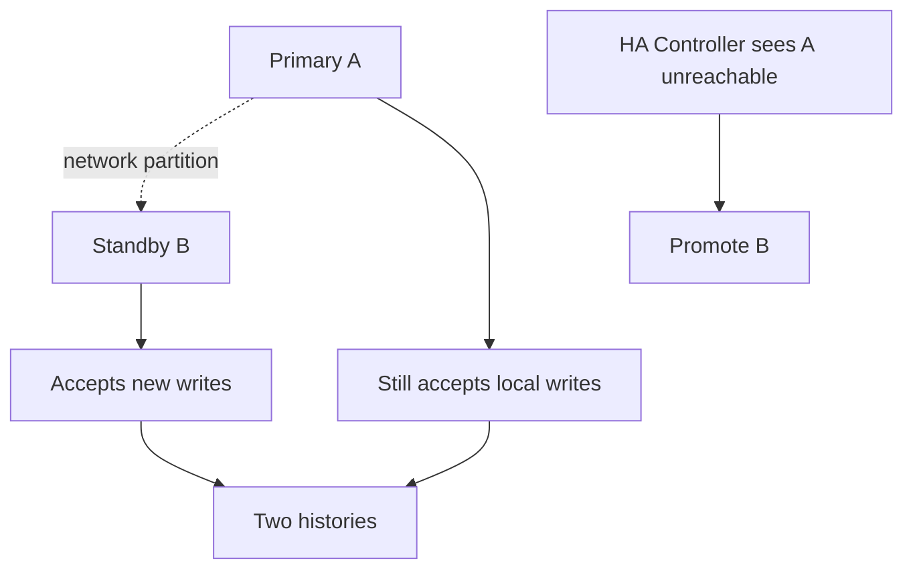
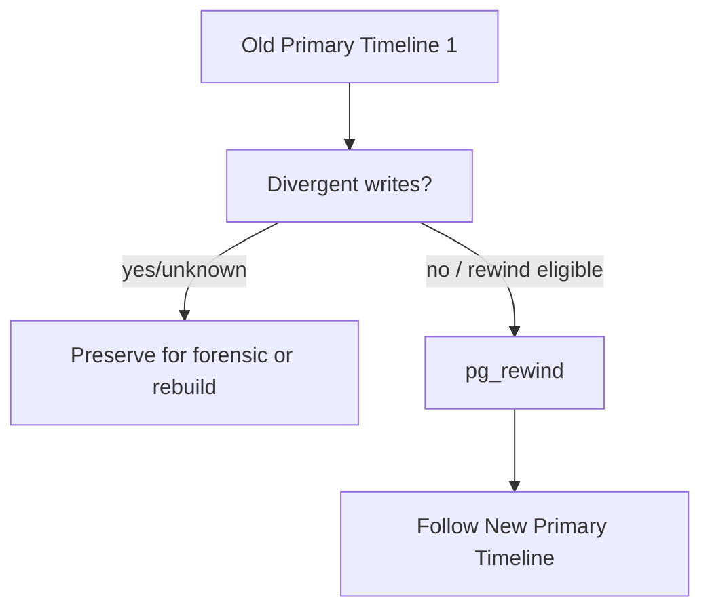
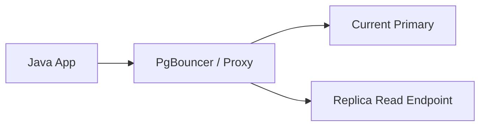
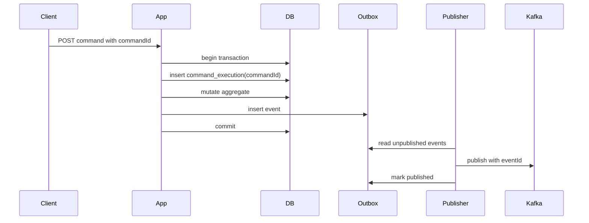

------
title: Learn PostgreSQL in Action - Part 026
description: High availability, failover, promotion, split-brain prevention, synchronous replication, connection routing, application failover behavior, and production topology design.
series: learn-postgresql-in-action
seriesTitle: Learn PostgreSQL in Action
order: 26
partTitle: High Availability and Failover Design
tags:
- postgresql
- database
- high-availability
- failover
- replication
- operations
- java
- series
date: 2026-07-01
---

# Part 026 — High Availability and Failover Design

Pada Part 025 kita membahas backup, restore, PITR, dan disaster recovery. Sekarang kita masuk ke konsep yang sering tertukar dengan backup: **high availability**.

High availability menjawab:

> Bagaimana sistem tetap tersedia atau cepat pulih ketika node database gagal?

Backup menjawab:

> Bagaimana kita memulihkan data ke kondisi benar setelah kehilangan data, corruption, atau kesalahan logical?

Keduanya berbeda dan saling melengkapi.

Part ini membahas desain HA PostgreSQL dari sisi engine, topology, failover, split-brain, connection routing, dan perilaku Java application saat primary berubah.

---

## 1. Kaufman Skill Deconstruction

Sub-skill HA PostgreSQL:

| Sub-skill | Pertanyaan Kunci |
|---|---|
| Topology design | Berapa primary, standby, quorum, dan region? |
| Failure detection | Siapa yang memutuskan primary mati? |
| Promotion | Bagaimana standby menjadi primary? |
| Fencing | Bagaimana primary lama dicegah menerima write? |
| Routing | Bagaimana aplikasi menemukan primary baru? |
| Consistency | Berapa data loss saat async failover? |
| Sync replication | Kapan write latency layak ditukar dengan RPO lebih kecil? |
| Rejoin | Bagaimana node lama bergabung kembali? |
| App behavior | Bagaimana Java pool/retry/transaction merespon failover? |

Target setelah part ini:

> Kamu bisa mendesain HA topology PostgreSQL dengan risiko eksplisit: data loss, split-brain, failover time, routing behavior, dan application retry semantics.

---

## 2. HA Mental Model

PostgreSQL native replication menyediakan building block. Full HA membutuhkan orchestration.



Core components:

| Component | Responsibility |
|---|---|
| Primary | accepts writes |
| Standby | replays WAL, may serve reads |
| WAL archive | backup/PITR continuity |
| HA controller | failure detection and promotion orchestration |
| Fencing mechanism | prevents old primary from writing |
| Router/proxy/DNS | sends clients to current primary |
| Application retry logic | survives connection break and transaction abort |

PostgreSQL itself can promote a standby, but it does not by itself provide a complete distributed consensus/fencing/routing system for every environment.

---

## 3. Availability vs Consistency vs Latency

You cannot optimize everything simultaneously.

| Goal | Trade-Off |
|---|---|
| Minimal data loss | synchronous replication increases write latency and availability dependency. |
| Fast failover | may promote standby before all WAL is received. |
| Low write latency | async replication can lose recent commits on failover. |
| Strong split-brain protection | needs fencing/quorum/control plane. |
| Read scale | replicas introduce stale reads and conflict behavior. |

The mature question is not:

> “Can PostgreSQL fail over?”

The mature question is:

> “Under which failure assumptions can this topology safely elect a new primary, with what data loss, and how does the application behave?”

---

## 4. Failure Taxonomy

HA design starts with failure modes.

| Failure | Example | HA Response |
|---|---|---|
| PostgreSQL process crash | postmaster stops | restart or failover if restart fails |
| host failure | VM/node dead | promote standby |
| disk failure | data volume unavailable | promote standby, restore later |
| network partition | primary isolated | dangerous; needs quorum/fencing |
| slow primary | high IO latency, not dead | avoid false failover or use controlled switchover |
| replica lag | standby behind | do not promote blindly if RPO unacceptable |
| control-plane failure | HA manager unavailable | define safe degradation |
| human error | wrong promotion | runbook + tooling guardrail |

Network partition is the hardest because both sides may think the other is dead.

---

## 5. Streaming Replication Refresher

From Part 023:



A standby can be:

- asynchronous;
- synchronous;
- cascading;
- hot standby read-only;
- candidate for promotion.

Failover promotes a standby so it exits recovery and starts accepting writes.

---

## 6. Async Failover and Data Loss

Async replication means primary acknowledges commit before standby confirms receipt/replay.



Result:

- app saw successful commit;
- standby may not have that commit;
- after failover, committed data can disappear.

This is not PostgreSQL “bug”. It is the consequence of async replication.

### 6.1 Java Implication

If your Java service commits a DB transaction and then calls external system, failover can create inconsistency:

```text
DB commit acknowledged
External message sent
Primary crashes before WAL reaches standby
Standby promoted
DB row missing, external message exists
```

Mitigation:

- synchronous replication for critical transaction classes;
- outbox pattern with reconciliation;
- external idempotency;
- audit ledger reconciliation;
- accept RPO > 0 explicitly.

---

## 7. Synchronous Replication

Synchronous replication makes commit wait for standby acknowledgement according to configured policy.

Simplified config:

```conf
synchronous_commit = on
synchronous_standby_names = 'FIRST 1 (standby_a, standby_b)'
```

Modes of `synchronous_commit` include different wait points. The stricter the wait, the lower the data-loss risk and the higher the latency/availability dependency.

Common conceptual levels:

| Mode | Commit Waits For | Trade-Off |
|---|---|---|
| `off` | local async flush later | fastest, weakest durability |
| `local` | local WAL flush | no remote guarantee |
| `remote_write` | standby wrote WAL to OS | lower loss, not fully replayed/durable depending on failure |
| `on` | standby flushes WAL | stronger remote durability |
| `remote_apply` | standby applies WAL | read-after-write on sync standby, higher latency |

### 7.1 When to Use Sync Replication

Use for:

- financial ledger;
- enforcement/audit state transitions;
- irreversible external commitments;
- critical workflow decisions;
- low RPO requirements.

Avoid blindly for:

- high-latency cross-region commit path;
- low-critical telemetry;
- workloads where availability is more important than zero-ish loss;
- systems with no operational maturity to handle standby failure.

### 7.2 Availability Trap

If synchronous standby is required and unavailable, writes may block.

This can become an availability incident:



Mitigation:

- multiple candidate sync standbys;
- correct `synchronous_standby_names` policy;
- alert on sync standby health;
- explicit runbook to degrade sync requirement if business accepts risk;
- timeouts at application and DB layers.

---

## 8. Failover vs Switchover

| Operation | Meaning | Typical Use |
|---|---|---|
| Failover | unplanned primary failure, promote standby | incident |
| Switchover | planned role change | maintenance, upgrade, topology move |

Switchover should be safer because primary is still reachable:

1. stop writes;
2. wait for standby catch-up;
3. promote standby;
4. redirect traffic;
5. reconfigure old primary as standby.

Failover may involve uncertainty:

- Is primary truly dead or partitioned?
- Which standby is most up-to-date?
- Is old primary fenced?
- Has routing switched everywhere?

---

## 9. Promotion

A standby becomes primary via promotion.

Command options:

```bash
pg_ctl promote -D /var/lib/postgresql/data
```

SQL:

```sql
SELECT pg_promote();
```

After promotion:

- standby exits recovery;
- it starts accepting writes;
- timeline changes;
- old primary cannot simply rejoin without reconciliation/rewind/rebuild;
- clients must route to new primary.

### 9.1 Timeline Mental Model



A promoted standby creates a new timeline. The old primary may have WAL the new primary never saw. That is forked history.

---

## 10. Split-Brain

Split-brain means two nodes accept writes as primary.



This is one of the worst HA failures.

### 10.1 Fencing

Fencing prevents the old primary from continuing as primary.

Possible fencing mechanisms:

- power off old node through infrastructure API;
- detach storage;
- revoke network route/VIP;
- remove write endpoint;
- use consensus/quorum before promotion;
- make old primary unable to serve clients.

Weak pattern:

> “If we cannot ping primary, promote standby.”

Better pattern:

> “Promote only if quorum confirms primary is not the write owner and fencing has succeeded or old primary cannot accept writes.”

---

## 11. HA Control Plane

Common PostgreSQL HA tooling/ecosystem concepts:

- Patroni + distributed consensus store;
- repmgr;
- pg_auto_failover;
- cloud-managed HA layer;
- Kubernetes operator;
- custom runbook with strict manual control.

This series does not require one specific product. The invariant is what matters:

```text
At most one writable primary exists for a cluster identity at a time.
```

Control plane must answer:

- who is leader?
- who can promote?
- what is quorum?
- how is old primary fenced?
- how is routing updated?
- how do replicas follow the new timeline?
- how is operator action audited?

---

## 12. Connection Routing Patterns

Java apps should not hardcode a single node if HA is required.

### 12.1 DNS-Based Routing

```text
appdb-primary.company.internal -> current primary IP
```

Pros:

- simple;
- works with many clients.

Cons:

- DNS cache/TTL behavior;
- JVM DNS caching risk;
- slow convergence if not tuned;
- existing TCP connections break anyway.

Java note:

- review JVM DNS cache TTL;
- use connection pool timeouts;
- do not assume DNS change affects existing pooled connections.

### 12.2 Virtual IP

A VIP moves to current primary.

Pros:

- stable endpoint;
- fast in same network.

Cons:

- network-specific;
- cross-zone/region complexity;
- needs fencing.

### 12.3 Proxy / Router

Examples: HAProxy, PgBouncer topology, cloud proxy, operator-managed service.

Pros:

- central routing;
- health checks;
- can separate read/write endpoints.

Cons:

- proxy becomes critical path;
- health checks must be semantically correct;
- transaction/session pooling caveats.

### 12.4 Cloud-Managed Endpoint

Managed PostgreSQL often provides writer endpoint and reader endpoint.

Pros:

- operationally simpler;
- integrated failover.

Cons:

- failover semantics still affect app;
- connection drops still happen;
- RPO/RTO still need validation;
- vendor-specific behavior.

---

## 13. Health Checks Must Be Semantic

A PostgreSQL process being reachable does not mean it is the primary.

Bad health check:

```bash
pg_isready -h db-node
```

Better writer check:

```sql
SELECT NOT pg_is_in_recovery() AS is_primary;
```

Better read-only replica check:

```sql
SELECT pg_is_in_recovery() AS is_standby;
```

Replication lag check:

```sql
SELECT
    now() - pg_last_xact_replay_timestamp() AS replay_delay;
```

Primary replication view:

```sql
SELECT
    application_name,
    client_addr,
    state,
    sync_state,
    sent_lsn,
    write_lsn,
    flush_lsn,
    replay_lsn,
    pg_wal_lsn_diff(sent_lsn, replay_lsn) AS bytes_lag
FROM pg_stat_replication;
```

Health checks should distinguish:

- alive;
- accepting connections;
- primary;
- read-only standby;
- caught up enough;
- safe promotion candidate.

---

## 14. Read Replicas and Stale Reads

Hot standby can serve read-only queries. But reads are stale relative to primary.

Failure mode:

```text
POST /case/123/approve commits on primary
GET /case/123 reads from replica
Replica has not replayed commit yet
User sees old state
```

Solutions:

| Strategy | Use When |
|---|---|
| read-your-write from primary | user-facing workflows after mutation |
| bounded-staleness replica reads | dashboards/tolerant read models |
| LSN wait | advanced consistency requirement |
| sticky primary after write | session-level UX consistency |
| separate CQRS projection | reporting/search workloads |

### 14.1 LSN-Aware Read Pattern

After write:

```sql
SELECT pg_current_wal_lsn();
```

On replica, wait until replay reaches that LSN:

```sql
SELECT pg_last_wal_replay_lsn();
```

Application can route to primary until replica catches up. Be careful: blocking waits can harm latency and availability.

---

## 15. Java Connection Pool Behavior During Failover

During failover:

- existing connections may break;
- in-flight transactions may abort;
- old primary may become read-only or unreachable;
- DNS/proxy route changes;
- pool may hold stale sockets;
- retries may duplicate operations if not idempotent.

### 15.1 HikariCP Timeout Hierarchy

Typical concerns:

| Setting | Purpose |
|---|---|
| connection timeout | how long app waits to get connection from pool |
| validation timeout | health check timeout |
| max lifetime | recycle old connections |
| keepalive time | keep idle connection alive/detect breakage |
| socket timeout | driver/network read timeout |
| statement timeout | server-side query timeout |
| transaction timeout | application boundary |

Principle:

> Fail fast enough to avoid thread/pool exhaustion, but not so fast that transient promotion causes unnecessary cascading failures.

### 15.2 Retry Boundary

Retry entire transaction, not random SQL statement.

Bad:

```java
try {
    jdbcTemplate.update("insert into payment ...");
} catch (SQLException e) {
    jdbcTemplate.update("insert into payment ..."); // duplicate risk
}
```

Better conceptual pattern:

```java
public ApprovalResult approveCase(UUID caseId, UUID commandId) {
    return retryPolicy.execute(() -> transactionTemplate.execute(tx -> {
        IdempotencyRecord record = idempotencyRepository.tryStart(commandId);
        if (record.alreadyCompleted()) {
            return record.result();
        }

        CaseFile caseFile = caseRepository.lockForUpdate(caseId);
        caseFile.approve();
        caseRepository.save(caseFile);

        outboxRepository.insert(commandId, "CASE_APPROVED", caseFile.toEventPayload());
        idempotencyRepository.markCompleted(commandId);
        return ApprovalResult.approved(caseId);
    }));
}
```

Retryable categories:

- connection lost before transaction outcome known;
- serialization failure;
- deadlock;
- failover-induced read-only error;
- timeout where outcome is uncertain.

Non-retryable categories:

- constraint violation from business invariant;
- authentication failure;
- malformed SQL;
- missing table after bad deployment.

### 15.3 Unknown Transaction Outcome

Hard case:

```text
Client sends COMMIT
Connection drops
Did commit succeed?
```

Application must handle unknown outcome using:

- idempotency key;
- unique business command ID;
- outbox event ID;
- query-by-command after reconnect;
- external reconciliation.

Example:

```sql
CREATE TABLE command_execution (
    command_id uuid PRIMARY KEY,
    command_type text NOT NULL,
    aggregate_id uuid NOT NULL,
    status text NOT NULL,
    result jsonb,
    created_at timestamptz NOT NULL DEFAULT now(),
    completed_at timestamptz
);
```

On retry, check `command_id` first.

---

## 16. Failover Runbook

### 16.1 Detection

Collect:

```sql
-- On candidate standby
SELECT pg_is_in_recovery();
SELECT pg_last_wal_replay_lsn();
SELECT now() - pg_last_xact_replay_timestamp() AS replay_delay;
```

From primary if reachable:

```sql
SELECT pg_current_wal_lsn();
SELECT now();
```

From HA controller:

- primary health;
- standby health;
- replication lag;
- quorum status;
- fencing status.

### 16.2 Decision

Questions:

- Is primary truly failed or partitioned?
- Is fencing possible/successful?
- Which standby is most advanced?
- Is data loss within RPO?
- Is this failover or wait/restart?
- Are application writes stopped or routed away?

### 16.3 Promotion

```bash
pg_ctl promote -D /var/lib/postgresql/data
```

Verify:

```sql
SELECT pg_is_in_recovery(); -- should be false
SELECT timeline_id FROM pg_control_checkpoint(); -- if available in environment/version
```

### 16.4 Routing

- update VIP/DNS/proxy/service endpoint;
- drain old connections;
- restart or recycle app pools if necessary;
- verify app connects to primary;
- verify writes succeed;
- keep background jobs controlled until validation completes.

### 16.5 Post-Failover

- provision new standby;
- inspect old primary;
- use `pg_rewind` if eligible or rebuild;
- verify WAL archive continuity;
- run consistency checks;
- produce incident timeline.

---

## 17. Rejoining the Old Primary

After failover, old primary may have divergent WAL.

Options:

| Option | Use When |
|---|---|
| `pg_rewind` | old primary diverged but has enough WAL/common history and is compatible |
| rebuild from new primary | safest if uncertain |
| discard old node | cloud ephemeral infrastructure |
| forensic preserve | if incident investigation needs old disk |

Never point old primary back as standby blindly.

Mental model:



---

## 18. Multi-Region HA

Multi-region is not just “put a replica far away”.

Questions:

- What is latency between regions?
- Is replication synchronous or asynchronous?
- What is acceptable RPO if region fails?
- Who decides region failover?
- How do clients route cross-region?
- Are dependent services also available?
- Is there a back-failover plan?

### 18.1 Synchronous Cross-Region Writes

Pros:

- lower data-loss risk.

Cons:

- high write latency;
- regional network issues can block writes;
- operational complexity.

### 18.2 Async Cross-Region Standby

Pros:

- lower write latency;
- good DR posture.

Cons:

- non-zero data loss on regional failover;
- stale reads;
- harder reconciliation.

Practical pattern:

```text
Same-region HA for low RTO.
Cross-region async replica + WAL backup for DR.
Business-critical commands are idempotent and reconcilable.
```

---

## 19. Kubernetes and PostgreSQL HA

Running PostgreSQL HA in Kubernetes requires care.

Important risks:

- pod restart is not database failover;
- persistent volume semantics matter;
- network partition still matters;
- operator must handle promotion/fencing correctly;
- readiness probe must distinguish primary vs standby;
- storage latency and fsync behavior matter;
- anti-affinity and topology spread matter.

Readiness example for writer service:

```bash
psql -tAc "SELECT CASE WHEN NOT pg_is_in_recovery() THEN 1 ELSE 0 END"
```

Reader service:

```bash
psql -tAc "SELECT CASE WHEN pg_is_in_recovery() THEN 1 ELSE 0 END"
```

Do not route writes to every healthy PostgreSQL pod.

---

## 20. HA and Connection Poolers

PgBouncer or similar poolers can help manage connection count, but HA introduces issues.

Questions:

- Does pooler know current primary?
- How does pooler drain old server?
- What happens to transaction pooling during failover?
- Are prepared statements safe with pool mode?
- Does app retry correctly after pooler disconnect?

Pattern:



Do not assume pooler solves failover. It may only centralize connection management.

---

## 21. Monitoring for HA

### 21.1 Primary Replication Status

```sql
SELECT
    application_name,
    state,
    sync_state,
    client_addr,
    pg_wal_lsn_diff(pg_current_wal_lsn(), replay_lsn) AS replay_lag_bytes,
    write_lag,
    flush_lag,
    replay_lag
FROM pg_stat_replication
ORDER BY application_name;
```

### 21.2 Standby Replay Status

```sql
SELECT
    pg_is_in_recovery() AS is_standby,
    pg_last_wal_receive_lsn() AS receive_lsn,
    pg_last_wal_replay_lsn() AS replay_lsn,
    pg_wal_lsn_diff(pg_last_wal_receive_lsn(), pg_last_wal_replay_lsn()) AS receive_replay_gap,
    now() - pg_last_xact_replay_timestamp() AS replay_time_lag;
```

### 21.3 Replication Slot Retention

```sql
SELECT
    slot_name,
    active,
    restart_lsn,
    pg_size_pretty(pg_wal_lsn_diff(pg_current_wal_lsn(), restart_lsn)) AS retained
FROM pg_replication_slots;
```

### 21.4 Check Primary Identity

```sql
SELECT
    current_setting('cluster_name', true) AS cluster_name,
    inet_server_addr() AS server_addr,
    pg_is_in_recovery() AS in_recovery;
```

### 21.5 Application Metrics

Monitor:

- DB connection acquisition time;
- active/idle pool connections;
- connection creation failure;
- SQL state distribution;
- transaction retry count;
- command idempotency duplicates;
- outbox publish lag;
- request latency during failover;
- error budget burn.

---

## 22. SQLSTATEs and Failover-Aware Handling

Common categories:

| SQLSTATE | Meaning | App Handling |
|---|---|---|
| `40001` | serialization failure | retry transaction |
| `40P01` | deadlock detected | retry transaction with jitter |
| `08006` | connection failure | reconnect, retry if safe |
| `08003` | connection does not exist | reconnect |
| `57P01` | admin shutdown | reconnect/retry after backoff |
| `57P02` | crash shutdown | reconnect/retry after backoff |
| `57P03` | cannot connect now | retry with backoff |
| `25006` | read-only SQL transaction | reroute to primary or wait failover |

Retry policy must be bounded:

```text
max attempts: 3-5
backoff: exponential + jitter
boundary: entire command transaction
idempotency: required for external side effects
observability: record every retry cause
```

---

## 23. Application Design Pattern: HA-Safe Command



Why this helps failover:

- if connection drops, command ID tells if commit happened;
- outbox makes publish recoverable;
- duplicate retries hit unique constraints;
- external consumers dedupe by event ID.

Schema sketch:

```sql
CREATE TABLE command_execution (
    command_id uuid PRIMARY KEY,
    aggregate_id uuid NOT NULL,
    command_type text NOT NULL,
    status text NOT NULL CHECK (status IN ('STARTED', 'COMPLETED', 'FAILED')),
    result jsonb,
    created_at timestamptz NOT NULL DEFAULT now(),
    completed_at timestamptz
);

CREATE TABLE outbox_event (
    event_id uuid PRIMARY KEY,
    aggregate_id uuid NOT NULL,
    event_type text NOT NULL,
    payload jsonb NOT NULL,
    created_at timestamptz NOT NULL DEFAULT now(),
    published_at timestamptz
);

CREATE INDEX outbox_event_unpublished_idx
ON outbox_event (created_at, event_id)
WHERE published_at IS NULL;
```

---

## 24. Planned Switchover Playbook

Use for maintenance.

```text
1. Announce maintenance window if needed.
2. Stop high-risk background jobs.
3. Reduce app write traffic or enter maintenance gate.
4. Verify standby healthy and caught up.
5. Stop writes on old primary.
6. Wait until standby replay reaches primary LSN.
7. Promote standby.
8. Switch routing endpoint.
9. Recycle application pools.
10. Run write smoke test.
11. Reconfigure old primary as standby.
12. Resume jobs and traffic.
13. Record timeline and metrics.
```

Verification queries:

```sql
-- On old primary before switchover
SELECT pg_current_wal_lsn();

-- On standby
SELECT pg_last_wal_replay_lsn();
```

Compare LSNs before promotion when possible.

---

## 25. Unplanned Failover Playbook

```text
1. Detect primary failure.
2. Freeze automated destructive actions if unclear.
3. Check standby candidates and lag.
4. Fence old primary or confirm impossible to write.
5. Promote best standby.
6. Update routing.
7. Recycle/stabilize app connection pools.
8. Validate primary write path.
9. Keep background jobs paused.
10. Validate business invariants.
11. Create new standby.
12. Preserve old primary for forensic analysis if needed.
13. Produce incident report.
```

Do not skip fencing because “we are in a hurry”. Split-brain repair can be worse than downtime.

---

## 26. HA Testing

You do not know failover behavior until you test it.

### 26.1 Test Cases

| Test | Expected Learning |
|---|---|
| kill PostgreSQL process | restart/failover threshold |
| stop primary host | promotion and routing behavior |
| network partition primary | fencing/quorum correctness |
| saturate IO | false positive failover behavior |
| kill sync standby | write blocking/degradation behavior |
| force connection drop during commit | app unknown outcome handling |
| long-running read on standby | recovery conflict behavior |
| DNS switch | JVM/pool convergence time |

### 26.2 Java Failover Test

Test workflow:

1. start transaction;
2. mutate row;
3. commit while failover occurs;
4. retry command with same command ID;
5. assert no duplicate business side effect;
6. assert outbox emits at most one event ID;
7. assert user-visible result eventually correct.

Pseudo JUnit shape:

```java
@Test
void command_is_idempotent_when_connection_drops_during_failover() {
    UUID commandId = UUID.randomUUID();
    UUID caseId = fixture.createOpenCase();

    simulateFailoverDuringCommit(() -> {
        service.approveCase(caseId, commandId);
    });

    ApprovalResult retry = service.approveCase(caseId, commandId);

    assertThat(retry.status()).isEqualTo(APPROVED);
    assertThat(repository.findCase(caseId).status()).isEqualTo(APPROVED);
    assertThat(outbox.countEventsForCommand(commandId)).isEqualTo(1);
}
```

---

## 27. Common Anti-Patterns

### 27.1 One Health Check for Read and Write

A standby can be healthy but not writable. Writer routing must check primary status.

### 27.2 Blind Promotion Without Fencing

Can produce split-brain.

### 27.3 Async Replication With Claimed Zero RPO

Async failover can lose acknowledged commits.

### 27.4 Infinite Retry Storm

During failover, unbounded retries can overload new primary.

### 27.5 Long DNS TTL in JVM

App may keep trying old primary after endpoint change.

### 27.6 Background Jobs Resume Too Early

They can publish duplicate events or mutate restored state before validation.

### 27.7 No Rejoin Plan

Old primary cannot simply be restarted and trusted.

---

## 28. Architecture Decision Record Template

Use this when designing HA:

```md
# ADR: PostgreSQL HA Topology for <Service>

## Context
- database size:
- write TPS:
- read TPS:
- RPO:
- RTO:
- regions/zones:
- compliance constraints:

## Decision
- primary location:
- standby count:
- sync/async mode:
- HA controller:
- fencing mechanism:
- routing mechanism:
- backup/PITR integration:

## Consequences
- expected failover time:
- possible data loss:
- write latency impact:
- operational risks:
- app retry requirements:

## Validation
- failover test cadence:
- restore drill cadence:
- monitoring alerts:
- rollback plan:
```

---

## 29. Production Readiness Checklist

- Is there exactly one writer endpoint?
- Can health checks distinguish primary from standby?
- Is old primary fenced before promotion?
- Is async data loss explicitly accepted or mitigated?
- Are synchronous standbys monitored?
- Can writes block if sync standby disappears?
- Is failover tested under real client traffic?
- Does Java retry whole commands, not isolated statements?
- Are commands idempotent?
- Does the app handle unknown commit outcome?
- Are connection pools recycled after topology change?
- Are DNS/JVM cache settings known?
- Is there a read-after-write strategy?
- Are background jobs gated during failover?
- Is old primary rejoined via `pg_rewind` or rebuild, not blind restart?
- Are backup/PITR still healthy after failover?

---

## 30. Key Takeaways

- HA and backup solve different problems.
- PostgreSQL replication provides building blocks; complete HA requires orchestration, fencing, and routing.
- Async failover can lose acknowledged commits.
- Synchronous replication reduces loss but can increase latency and reduce write availability.
- Promotion creates a new timeline; old primary must be rewound, rebuilt, or preserved.
- Split-brain prevention is more important than fast but unsafe promotion.
- Java systems must handle broken connections, unknown commit outcome, idempotent command retry, pool reset, and stale replicas.
- Failover readiness must be tested, not assumed.

---

## 31. References

- PostgreSQL Documentation — High Availability, Load Balancing, and Replication: https://www.postgresql.org/docs/current/high-availability.html
- PostgreSQL Documentation — Log-Shipping Standby Servers: https://www.postgresql.org/docs/current/warm-standby.html
- PostgreSQL Documentation — Failover: https://www.postgresql.org/docs/current/warm-standby-failover.html
- PostgreSQL Documentation — Hot Standby: https://www.postgresql.org/docs/current/hot-standby.html
- PostgreSQL Documentation — Monitoring Database Activity: https://www.postgresql.org/docs/current/monitoring-stats.html
- PostgreSQL Documentation — Write Ahead Log Configuration: https://www.postgresql.org/docs/current/runtime-config-wal.html
