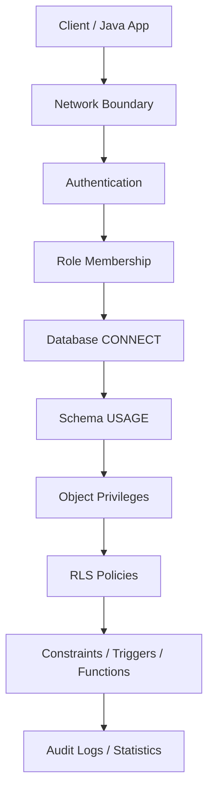
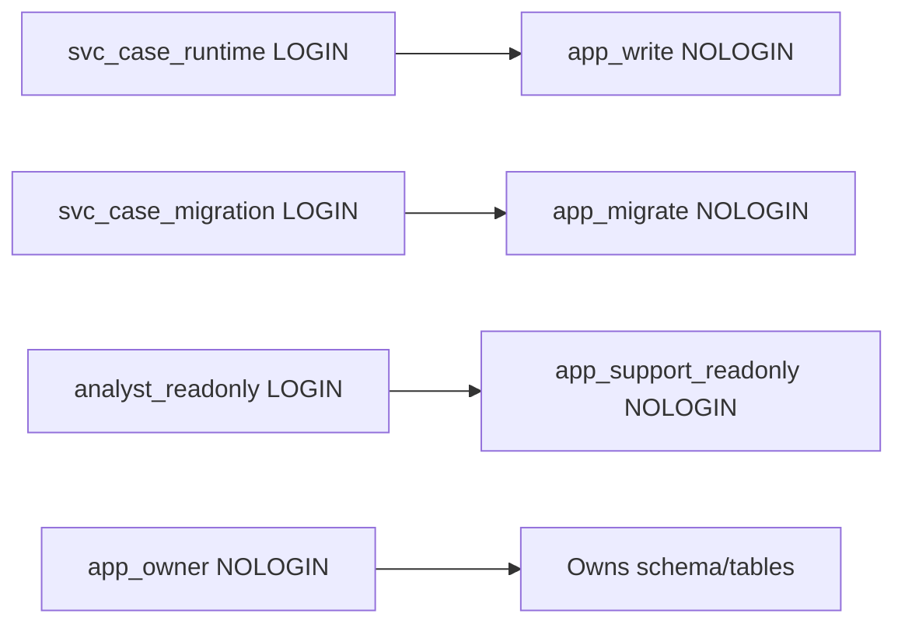
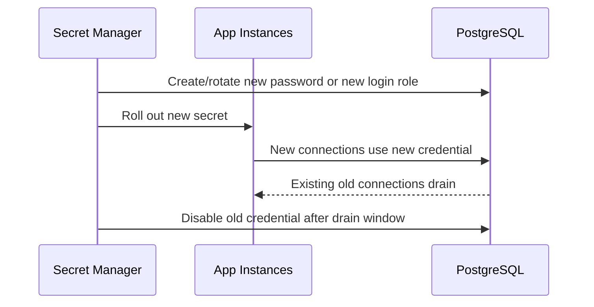

------
title: Learn PostgreSQL in Action - Part 027
description: Security architecture for PostgreSQL: authentication, authorization, privileges, role design, row-level security, search_path hardening, encryption boundaries, auditability, and Java production integration.
series: learn-postgresql-in-action
seriesTitle: Learn PostgreSQL in Action
order: 27
partTitle: Security: Auth, RLS, Privileges, and Encryption
tags:
- postgresql
- database
- security
- authentication
- authorization
- row-level-security
- rls
- encryption
- audit
- java
- series
date: 2026-07-01
---

# Part 027 — Security: Auth, RLS, Privileges, and Encryption

Pada Part 026 kita membahas high availability dan failover. Sekarang kita masuk ke aspek yang menentukan apakah database bisa dipertanggungjawabkan secara production dan regulatory: **security boundary**.

PostgreSQL security bukan hanya `GRANT SELECT`. PostgreSQL security adalah kombinasi dari:

1. siapa yang bisa terkoneksi;
2. siapa yang bisa melihat object;
3. siapa yang bisa menjalankan function;
4. siapa yang memiliki object;
5. siapa yang boleh melewati row policy;
6. bagaimana credential dikelola;
7. bagaimana query dan data access diaudit;
8. bagaimana aplikasi Java tidak secara tidak sengaja mendapatkan privilege terlalu besar.

Target part ini:

> Kamu bisa mendesain PostgreSQL security model yang least-privilege, migratable, testable, dan defensible untuk aplikasi Java production.

---

## 1. Kaufman Skill Deconstruction

Security PostgreSQL perlu dipecah menjadi sub-skill kecil. Kalau dipelajari sebagai “database security” secara umum, cakupannya terlalu luas dan tidak operasional.

| Sub-skill | Pertanyaan Kunci |
|---|---|
| Authentication | Bagaimana client membuktikan identitasnya? |
| Authorization | Setelah masuk, object mana yang boleh diakses? |
| Role design | Role mana untuk owner, migration, runtime app, read-only, support, replication? |
| Object ownership | Siapa pemilik schema, table, sequence, function? |
| Default privilege | Apakah object baru otomatis aman? |
| `search_path` hardening | Apakah object resolution bisa dimanipulasi? |
| RLS | Apakah filtering row enforce di database atau hanya aplikasi? |
| Secrets | Bagaimana credential diputar dan dibatasi? |
| Encryption | Mana boundary TLS, disk encryption, column encryption? |
| Auditability | Bukti apa yang tersedia saat incident/access review? |
| Java integration | Bagaimana JDBC/Hikari/Hibernate tidak menghancurkan model privilege? |

Security skill yang matang bukan menghafal semua command. Skill yang matang adalah bisa menjawab:

> Kalau credential app bocor, blast radius-nya apa?

> Kalau bug query lupa `tenant_id`, apakah database tetap mencegah data leak?

> Kalau migration tool membuat table baru, apakah table itu otomatis punya privilege yang aman?

> Kalau support engineer perlu investigasi, apakah aksesnya read-only, auditable, dan time-bounded?

---

## 2. Mental Model: Security Is Layered Contract

Jangan melihat security sebagai satu pagar. Lihat sebagai beberapa contract berlapis.



Setiap layer menjawab pertanyaan berbeda:

| Layer | Menjawab |
|---|---|
| Network | Dari mana koneksi boleh datang? |
| Authentication | Siapa client ini? |
| Role | Identitas database apa yang dipakai? |
| Database privilege | Boleh masuk database mana? |
| Schema privilege | Boleh resolve object di namespace mana? |
| Object privilege | Boleh `SELECT`, `INSERT`, `UPDATE`, `DELETE`, `EXECUTE` object mana? |
| RLS | Untuk object yang boleh diakses, row mana yang boleh terlihat/diubah? |
| Function security | Function berjalan dengan privilege caller atau owner? |
| Audit | Dapatkah kita membuktikan akses dan perubahan? |

Rule praktis:

> Application security check tetap penting, tetapi database security harus mencegah class of mistakes yang paling mahal: accidental broad access, tenant leakage, privilege creep, dan unsafe migrations.

---

## 3. Authentication vs Authorization

Dua konsep ini sering dicampur.

| Konsep | Arti | Contoh PostgreSQL |
|---|---|---|
| Authentication | Membuktikan siapa client | password/SCRAM, certificate, GSS, OAuth where supported, cloud IAM integration |
| Authorization | Menentukan apa yang boleh dilakukan | `GRANT`, `REVOKE`, role membership, RLS, ownership |

Authentication yang kuat tidak menyelesaikan authorization yang buruk.

Contoh buruk:

```sql
-- App berhasil login dengan password kuat,
-- tetapi role-nya terlalu powerful.
GRANT ALL PRIVILEGES ON DATABASE appdb TO app_user;
GRANT ALL ON SCHEMA public TO app_user;
GRANT ALL ON ALL TABLES IN SCHEMA public TO app_user;
```

Masalahnya bukan password. Masalahnya adalah **runtime identity terlalu kuat**.

---

## 4. Role Model yang Production-Grade

PostgreSQL role bisa digunakan sebagai login identity, group, atau owner. Untuk production, pisahkan ketiganya.

### 4.1 Prinsip Role Design

Gunakan prinsip berikut:

1. **Owner role tidak login.**
2. **Runtime app role tidak punya DDL.**
3. **Migration role berbeda dari runtime role.**
4. **Read-only/reporting role berbeda dari app write role.**
5. **Break-glass role sangat terbatas, diaudit, dan tidak dipakai normal.**
6. **Schema owner bukan app runtime.**

### 4.2 Baseline Role Layout

```sql
-- Group/owner roles: no login
CREATE ROLE app_owner NOLOGIN;
CREATE ROLE app_read NOLOGIN;
CREATE ROLE app_write NOLOGIN;
CREATE ROLE app_migrate NOLOGIN;
CREATE ROLE app_support_readonly NOLOGIN;

-- Login roles
CREATE ROLE svc_case_runtime LOGIN PASSWORD 'replace-with-secret';
CREATE ROLE svc_case_migration LOGIN PASSWORD 'replace-with-secret';
CREATE ROLE analyst_readonly LOGIN PASSWORD 'replace-with-secret';

-- Membership
GRANT app_write TO svc_case_runtime;
GRANT app_migrate TO svc_case_migration;
GRANT app_support_readonly TO analyst_readonly;
```

Mental model:



### 4.3 Owner Role

Object owner punya implicit power besar terhadap object tersebut. Karena itu jangan jadikan runtime app sebagai owner.

```sql
CREATE SCHEMA case_mgmt AUTHORIZATION app_owner;

ALTER DEFAULT PRIVILEGES FOR ROLE app_owner IN SCHEMA case_mgmt
GRANT SELECT, INSERT, UPDATE, DELETE ON TABLES TO app_write;

ALTER DEFAULT PRIVILEGES FOR ROLE app_owner IN SCHEMA case_mgmt
GRANT SELECT ON TABLES TO app_read;
```

Kenapa owner harus `NOLOGIN`?

Karena owner role adalah control-plane identity. Ia dipakai untuk ownership dan migration, bukan untuk traffic runtime harian.

---

## 5. Database, Schema, and Object Privileges

PostgreSQL privilege tidak satu level. Ada privilege di database, schema, table, sequence, function, type, dan lainnya.

### 5.1 Database CONNECT

```sql
REVOKE CONNECT ON DATABASE appdb FROM PUBLIC;
GRANT CONNECT ON DATABASE appdb TO app_write;
GRANT CONNECT ON DATABASE appdb TO app_read;
GRANT CONNECT ON DATABASE appdb TO app_migrate;
```

`CONNECT` hanya berarti role boleh konek ke database. Ia belum tentu bisa melihat table.

### 5.2 Schema USAGE

```sql
REVOKE ALL ON SCHEMA public FROM PUBLIC;

GRANT USAGE ON SCHEMA case_mgmt TO app_write;
GRANT USAGE ON SCHEMA case_mgmt TO app_read;
GRANT USAGE, CREATE ON SCHEMA case_mgmt TO app_migrate;
```

`USAGE` pada schema berarti role boleh resolve object di schema tersebut. Tanpa `USAGE`, privilege table tidak cukup.

### 5.3 Table Privileges

```sql
GRANT SELECT, INSERT, UPDATE, DELETE
ON ALL TABLES IN SCHEMA case_mgmt
TO app_write;

GRANT SELECT
ON ALL TABLES IN SCHEMA case_mgmt
TO app_read;
```

### 5.4 Sequence Privileges

Ini sering dilupakan. Table `INSERT` bisa gagal jika identity/sequence privilege tidak benar.

```sql
GRANT USAGE, SELECT
ON ALL SEQUENCES IN SCHEMA case_mgmt
TO app_write;
```

### 5.5 Function Privileges

Function default bisa menjadi lubang privilege jika tidak diatur.

```sql
REVOKE EXECUTE ON ALL FUNCTIONS IN SCHEMA case_mgmt FROM PUBLIC;
GRANT EXECUTE ON ALL FUNCTIONS IN SCHEMA case_mgmt TO app_write;
```

Untuk object baru:

```sql
ALTER DEFAULT PRIVILEGES FOR ROLE app_owner IN SCHEMA case_mgmt
GRANT SELECT, INSERT, UPDATE, DELETE ON TABLES TO app_write;

ALTER DEFAULT PRIVILEGES FOR ROLE app_owner IN SCHEMA case_mgmt
GRANT USAGE, SELECT ON SEQUENCES TO app_write;

ALTER DEFAULT PRIVILEGES FOR ROLE app_owner IN SCHEMA case_mgmt
REVOKE EXECUTE ON FUNCTIONS FROM PUBLIC;
```

---

## 6. The `PUBLIC` Trap

`PUBLIC` bukan schema `public`. `PUBLIC` adalah pseudo-role yang berarti semua role.

Contoh yang harus dipahami:

```sql
REVOKE ALL ON SCHEMA public FROM PUBLIC;
REVOKE CREATE ON SCHEMA public FROM PUBLIC;
```

Tanpa hardening, environment tertentu bisa memiliki schema `public` yang terlalu permissive. Risiko paling klasik adalah object injection: role yang bisa membuat object di schema yang ada dalam `search_path` dapat mempengaruhi object resolution, terutama function call.

Rule:

> Jangan biarkan runtime role punya `CREATE` di schema yang juga digunakan untuk object resolution aplikasi.

---

## 7. `search_path` Hardening

`search_path` menentukan urutan PostgreSQL mencari object tanpa schema qualification.

Contoh:

```sql
SELECT calculate_risk_score(case_id);
```

Jika function tidak schema-qualified, PostgreSQL mencari function tersebut berdasarkan `search_path`.

### 7.1 Risiko

Misal `search_path = public, case_mgmt` dan ada role yang bisa `CREATE` di `public`. Role itu bisa membuat function bernama sama. Pada konteks tertentu, object resolution bisa menjadi tidak sesuai harapan.

### 7.2 Hardening Pattern

Set default `search_path` untuk role aplikasi:

```sql
ALTER ROLE svc_case_runtime IN DATABASE appdb
SET search_path = case_mgmt, pg_catalog;
```

Gunakan schema qualification pada migration dan function sensitif:

```sql
SELECT case_mgmt.calculate_risk_score($1);
```

Untuk `SECURITY DEFINER` function, selalu set `search_path` eksplisit:

```sql
CREATE OR REPLACE FUNCTION case_mgmt.close_case(p_case_id bigint)
RETURNS void
LANGUAGE plpgsql
SECURITY DEFINER
SET search_path = case_mgmt, pg_catalog
AS $$
BEGIN
    UPDATE case_mgmt.cases
    SET status = 'CLOSED', closed_at = now()
    WHERE id = p_case_id;
END;
$$;
```

---

## 8. `SECURITY INVOKER` vs `SECURITY DEFINER`

Function PostgreSQL biasanya berjalan sebagai caller (`SECURITY INVOKER`). Dengan `SECURITY DEFINER`, function berjalan dengan privilege owner function.

| Mode | Berjalan sebagai | Kapan dipakai |
|---|---|---|
| `SECURITY INVOKER` | caller | default, aman untuk kebanyakan function |
| `SECURITY DEFINER` | owner function | controlled privilege elevation |

### 8.1 Kapan `SECURITY DEFINER` Valid?

Valid ketika kamu ingin menyediakan capability terbatas tanpa memberi privilege table luas.

Contoh:

> Support role tidak boleh update sembarang kolom, tetapi boleh menjalankan `case_mgmt.mark_case_reviewed()` yang melakukan update terbatas dan diaudit.

### 8.2 Hazard

`SECURITY DEFINER` berbahaya jika:

1. owner function terlalu privileged;
2. function tidak schema-qualify object;
3. `search_path` tidak dikunci;
4. input dynamic SQL tidak diquote dengan benar;
5. function melakukan hal lebih luas daripada contract-nya.

Bad example:

```sql
CREATE FUNCTION dangerous(p_table text)
RETURNS void
LANGUAGE plpgsql
SECURITY DEFINER
AS $$
BEGIN
    EXECUTE 'DELETE FROM ' || p_table;
END;
$$;
```

Better pattern:

```sql
CREATE FUNCTION case_mgmt.mark_reviewed(p_case_id bigint, p_actor text)
RETURNS void
LANGUAGE plpgsql
SECURITY DEFINER
SET search_path = case_mgmt, pg_catalog
AS $$
BEGIN
    UPDATE case_mgmt.cases
    SET reviewed_at = clock_timestamp(), reviewed_by = p_actor
    WHERE id = p_case_id
      AND status = 'PENDING_REVIEW';

    INSERT INTO case_mgmt.audit_events(case_id, actor, action, created_at)
    VALUES (p_case_id, p_actor, 'MARK_REVIEWED', clock_timestamp());
END;
$$;
```

---

## 9. Row-Level Security Mental Model

Row-Level Security atau RLS menjawab:

> Untuk table yang sama, row mana yang boleh terlihat atau dimodifikasi oleh role/session tertentu?

Tanpa RLS, tenant filtering biasanya ada di aplikasi:

```sql
SELECT * FROM cases WHERE tenant_id = ?;
```

Dengan RLS, filtering menjadi database-enforced:

```sql
SELECT * FROM cases;
-- Database otomatis hanya mengizinkan row sesuai policy.
```

RLS cocok ketika:

1. multi-tenancy punya risiko data leakage tinggi;
2. banyak query path sulit dijamin selalu membawa predicate tenant;
3. database diakses oleh beberapa tool/service;
4. compliance membutuhkan defense-in-depth;
5. support/reporting role perlu access terbatas.

RLS bukan pengganti desain aplikasi yang benar. RLS adalah safety boundary tambahan.

---

## 10. RLS Basic Pattern untuk Multi-Tenant Java App

### 10.1 Table

```sql
CREATE TABLE case_mgmt.cases (
    id bigint GENERATED ALWAYS AS IDENTITY PRIMARY KEY,
    tenant_id uuid NOT NULL,
    case_number text NOT NULL,
    status text NOT NULL,
    title text NOT NULL,
    created_at timestamptz NOT NULL DEFAULT now(),
    UNIQUE (tenant_id, case_number)
);

ALTER TABLE case_mgmt.cases ENABLE ROW LEVEL SECURITY;
ALTER TABLE case_mgmt.cases FORCE ROW LEVEL SECURITY;
```

`FORCE ROW LEVEL SECURITY` penting agar table owner juga tunduk pada policy saat mengakses table. Superuser dan role dengan `BYPASSRLS` tetap bisa bypass.

### 10.2 Session Context

Gunakan GUC custom untuk menyimpan tenant context:

```sql
SET LOCAL app.tenant_id = '018f95cb-0633-7f13-a44d-39e04c89a091';
```

`SET LOCAL` berlaku hanya dalam transaction. Ini cocok untuk Java transaction boundary.

### 10.3 Policy

```sql
CREATE POLICY tenant_isolation_select
ON case_mgmt.cases
FOR SELECT
TO app_write, app_read
USING (
    tenant_id = current_setting('app.tenant_id', true)::uuid
);

CREATE POLICY tenant_isolation_modify
ON case_mgmt.cases
FOR INSERT
TO app_write
WITH CHECK (
    tenant_id = current_setting('app.tenant_id', true)::uuid
);

CREATE POLICY tenant_isolation_update
ON case_mgmt.cases
FOR UPDATE
TO app_write
USING (
    tenant_id = current_setting('app.tenant_id', true)::uuid
)
WITH CHECK (
    tenant_id = current_setting('app.tenant_id', true)::uuid
);
```

Perbedaan penting:

| Clause | Arti |
|---|---|
| `USING` | row mana yang boleh dilihat/ditarget |
| `WITH CHECK` | row hasil insert/update harus memenuhi kondisi |

Kalau hanya memakai `USING` untuk `UPDATE`, kamu bisa lupa membatasi nilai baru. Kalau hanya memakai `WITH CHECK`, kamu bisa lupa membatasi row lama yang boleh ditarget.

---

## 11. Java Integration for RLS

RLS sering gagal bukan karena SQL policy buruk, tetapi karena app tidak mengelola session state dengan benar.

Connection pool membuat session digunakan ulang. Karena itu tenant context tidak boleh di-set secara global dan dibiarkan menempel di connection.

### 11.1 Wrong Pattern

```sql
SET app.tenant_id = 'tenant-a';
-- connection kembali ke pool
-- request tenant-b bisa menerima session tenant-a jika tidak direset
```

### 11.2 Correct Pattern: Transaction-Scoped Context

Di Java/Spring, set tenant context dalam transaction yang sama dengan query bisnis.

```java
@Transactional
public CaseDto getCase(UUID tenantId, long caseId) {
    jdbcTemplate.update("select set_config('app.tenant_id', ?, true)", tenantId.toString());

    return jdbcTemplate.queryForObject("""
        select id, case_number, status, title
        from case_mgmt.cases
        where id = ?
        """, mapper, caseId);
}
```

Parameter ketiga `true` pada `set_config` membuat setting bersifat local untuk transaction.

### 11.3 Hibernate Interceptor Pattern

Untuk Hibernate/JPA, tenant context harus dipasang pada connection yang dipakai transaksi aktif. Jangan set context di thread-local saja lalu menganggap database tahu.

Simplified pattern:

```java
@Transactional
public void withTenant(UUID tenantId, Runnable action) {
    entityManager.createNativeQuery("select set_config('app.tenant_id', :tenantId, true)")
        .setParameter("tenantId", tenantId.toString())
        .getSingleResult();

    action.run();
}
```

Ingat:

> Thread-local tenant context bukan database tenant context.

---

## 12. RLS Performance Implication

RLS policy menjadi bagian dari query. Karena itu policy harus index-friendly.

Policy:

```sql
tenant_id = current_setting('app.tenant_id', true)::uuid
```

Index yang mendukung:

```sql
CREATE INDEX idx_cases_tenant_status_created
ON case_mgmt.cases (tenant_id, status, created_at DESC, id DESC);
```

Jika mayoritas query tenant-scoped, `tenant_id` biasanya menjadi leading column pada banyak index.

Bad policy example:

```sql
USING (
    lower(tenant_code) = lower(current_setting('app.tenant_code', true))
)
```

Ini bisa membuat predicate lebih sulit dioptimasi kecuali ada expression index.

Better:

1. gunakan canonical tenant id;
2. tipe cocok (`uuid = uuid`, bukan `text = uuid`);
3. index sesuai predicate policy dan query utama;
4. test `EXPLAIN` dengan role runtime, bukan superuser.

---

## 13. RLS Failure Modes

| Failure Mode | Penyebab | Mitigasi |
|---|---|---|
| Tenant context leak | `SET`, bukan `SET LOCAL`, connection pool reuse | `set_config(..., true)` dalam transaction |
| Policy tidak berlaku | query memakai owner/superuser/BYPASSRLS | runtime role non-owner, no bypass, `FORCE RLS` |
| Insert cross-tenant | hanya `USING`, tidak ada `WITH CHECK` | define `WITH CHECK` |
| Query lambat | policy predicate tidak index-friendly | index leading tenant predicate |
| Support role terlalu luas | role read-only tanpa RLS | role-specific policies |
| Migration gagal | migration role terkena RLS | migration role khusus, controlled bypass/owner semantics |
| Test misleading | test pakai superuser | integration test pakai role aplikasi |

---

## 14. Policy Design: Permissive vs Restrictive

Multiple RLS policies bisa digabung secara permissive atau restrictive.

Mental model:

| Policy Type | Kombinasi |
|---|---|
| Permissive | `OR` |
| Restrictive | `AND` |

Contoh:

```sql
CREATE POLICY tenant_visible
ON case_mgmt.cases
AS PERMISSIVE
FOR SELECT
TO app_write
USING (tenant_id = current_setting('app.tenant_id', true)::uuid);

CREATE POLICY not_deleted
ON case_mgmt.cases
AS RESTRICTIVE
FOR SELECT
TO app_write
USING (deleted_at IS NULL);
```

Artinya row harus memenuhi tenant visibility dan juga tidak deleted.

Gunakan restrictive policy untuk global safety predicate seperti:

1. `deleted_at IS NULL` untuk soft-delete visibility;
2. `classification <= current_clearance()` untuk security classification;
3. legal hold/read restriction;
4. jurisdiction visibility.

---

## 15. Column-Level Security and Views

PostgreSQL punya column privileges, tetapi untuk API database yang lebih stabil sering lebih baik menggunakan view.

### 15.1 Column Privilege

```sql
REVOKE SELECT (national_id, internal_notes)
ON case_mgmt.persons
FROM app_support_readonly;
```

Column privilege berguna, tetapi bisa sulit dioperasikan jika schema sering berubah.

### 15.2 Security View

```sql
CREATE VIEW case_mgmt.v_support_cases AS
SELECT
    id,
    tenant_id,
    case_number,
    status,
    title,
    created_at
FROM case_mgmt.cases
WHERE deleted_at IS NULL;

GRANT SELECT ON case_mgmt.v_support_cases TO app_support_readonly;
REVOKE ALL ON case_mgmt.cases FROM app_support_readonly;
```

View sebagai contract membuat support/reporting access lebih eksplisit.

---

## 16. SQL Injection: Database Boundary Still Matters

Prepared statements adalah baseline, bukan bonus.

Bad:

```java
String sql = "select * from cases where case_number = '" + caseNumber + "'";
```

Good:

```java
jdbcTemplate.query(
    "select * from case_mgmt.cases where case_number = ?",
    mapper,
    caseNumber
);
```

Tetapi prepared statement tidak menyelesaikan semua injection risk. Dynamic identifier tetap perlu whitelist.

Bad:

```java
String sql = "select * from cases order by " + sortBy;
```

Better:

```java
Map<String, String> allowedSort = Map.of(
    "createdAt", "created_at",
    "caseNumber", "case_number",
    "status", "status"
);

String column = allowedSort.get(sortBy);
if (column == null) throw new IllegalArgumentException("Unsupported sort");

String sql = "select * from case_mgmt.cases order by " + column + " desc limit ?";
```

Identifiers cannot be bound as value parameters. Whitelist them.

---

## 17. Encryption Boundaries

Encryption sering dibicarakan terlalu abstrak. Untuk PostgreSQL, pisahkan boundary berikut.

| Boundary | Tujuan | Implementasi Umum |
|---|---|---|
| In transit | Lindungi data di network | TLS/SSL |
| At rest | Lindungi disk/snapshot/storage media | storage-level/cloud encryption |
| Backup | Lindungi backup object | backup encryption/KMS |
| Column/application | Lindungi field sensitif dari DB operator atau dump | application-level encryption / pgcrypto with caveats |
| Secret storage | Lindungi credential DB | KMS/secret manager/vault |

### 17.1 TLS

Untuk aplikasi Java, pastikan koneksi PostgreSQL memakai TLS sesuai environment.

Contoh JDBC URL:

```properties
spring.datasource.url=jdbc:postgresql://db.example.internal:5432/appdb?sslmode=verify-full
```

`verify-full` memastikan certificate diverifikasi dan hostname cocok. Jangan pakai mode longgar di production kecuali ada alasan eksplisit dan risiko diterima.

### 17.2 At-Rest Encryption

PostgreSQL community core biasanya mengandalkan storage/filesystem/cloud provider untuk disk encryption. Managed PostgreSQL seperti RDS/Aurora/Cloud SQL/Azure Database biasanya menyediakan encryption-at-rest di layer service/storage.

Implication:

> Kalau attacker punya akses SQL valid, at-rest encryption tidak mencegah dia membaca data. At-rest encryption melindungi storage media, snapshot, disk, dan backup boundary, bukan query authorization.

### 17.3 Column Encryption

Column encryption dibutuhkan jika data harus tetap tidak terbaca oleh sebagian actor yang punya akses database/dump.

Pilihan:

1. encrypt di aplikasi sebelum insert;
2. gunakan envelope encryption dengan KMS;
3. gunakan `pgcrypto` untuk kasus tertentu;
4. tokenization untuk identifier sensitif.

Trade-off:

| Approach | Kelebihan | Biaya |
|---|---|---|
| App-level encryption | DB tidak lihat plaintext | sulit query/index |
| `pgcrypto` | SQL-side convenience | key management risk di DB/session |
| Tokenization | baik untuk lookup terbatas | butuh token service |
| Hash deterministic | lookup equality | tidak reversible, risk brute-force jika low entropy |

Rule:

> Jangan mengenkripsi field yang masih ingin kamu range query, sort, full-text search, atau join secara fleksibel tanpa desain khusus.

---

## 18. Secrets and Credential Rotation

Credential database adalah production control plane. Perlakukan sebagai high-risk asset.

### 18.1 Anti-Pattern

```properties
spring.datasource.username=postgres
spring.datasource.password=super-secret-root-password
```

Masalah:

1. app memakai superuser/admin;
2. password mungkin ada di repo/log/config dump;
3. rotation akan memutus semua service;
4. blast radius sangat besar.

### 18.2 Better Pattern

```properties
spring.datasource.username=svc_case_runtime
spring.datasource.password=${DB_PASSWORD_FROM_SECRET_MANAGER}
```

Dan di database:

```sql
CREATE ROLE svc_case_runtime LOGIN;
GRANT app_write TO svc_case_runtime;
```

### 18.3 Rotation Strategy

Untuk rotation tanpa downtime, gunakan dual credential atau role handoff.



Checklist:

1. pool lifetime lebih pendek dari rotation window;
2. connection retry tidak storm;
3. old credential disable setelah drain;
4. alert kalau masih ada connection memakai old role;
5. app role privilege tidak berubah saat rotation.

---

## 19. Auditing and Evidence

Audit bukan hanya “log semua query”. Logging semua query bisa mahal, noisy, dan tetap tidak menjawab pertanyaan governance.

Audit yang baik menjawab:

1. siapa melakukan apa;
2. terhadap entity apa;
3. kapan;
4. dari aplikasi/session mana;
5. apakah action berhasil;
6. apakah action mengubah state;
7. apakah action normal atau break-glass.

### 19.1 Application-Level Audit Table

Untuk domain action, audit di aplikasi sering lebih bermakna dibanding raw SQL log.

```sql
CREATE TABLE case_mgmt.audit_events (
    id bigint GENERATED ALWAYS AS IDENTITY PRIMARY KEY,
    tenant_id uuid NOT NULL,
    actor_id text NOT NULL,
    action text NOT NULL,
    entity_type text NOT NULL,
    entity_id text NOT NULL,
    reason text,
    request_id text,
    created_at timestamptz NOT NULL DEFAULT clock_timestamp()
);

CREATE INDEX idx_audit_tenant_entity_time
ON case_mgmt.audit_events (tenant_id, entity_type, entity_id, created_at DESC);
```

### 19.2 Database-Level Logging

Useful settings:

```conf
log_connections = on
log_disconnections = on
log_lock_waits = on
log_min_duration_statement = '500ms'
log_line_prefix = '%m [%p] user=%u db=%d app=%a client=%h '
```

Database logs membantu incident diagnosis, tetapi jangan jadikan satu-satunya audit source untuk domain compliance.

### 19.3 Extension-Based Audit

`pgaudit` sering dipakai untuk audit detail di environment yang mendukung extension tersebut. Namun desain audit tetap harus menentukan event apa yang penting dan retention policy-nya.

---

## 20. Data Classification

Sebelum privilege design, klasifikasikan data.

| Class | Contoh | Control |
|---|---|---|
| Public/internal low | feature flag non-sensitive | normal access |
| Confidential business | case status, assignment | role-based access |
| Personal data | name, email, phone | masking, limited support view |
| Sensitive personal | national id, health/legal info | encryption/tokenization, strict audit |
| Secret | API key, credential | jangan simpan plaintext di DB app biasa |

Schema design bisa mengikuti classification:

```sql
CREATE TABLE case_mgmt.persons (
    id bigint GENERATED ALWAYS AS IDENTITY PRIMARY KEY,
    tenant_id uuid NOT NULL,
    display_name text NOT NULL,
    email text,
    phone text,
    created_at timestamptz NOT NULL DEFAULT now()
);

CREATE TABLE case_mgmt.person_sensitive_attributes (
    person_id bigint PRIMARY KEY REFERENCES case_mgmt.persons(id),
    encrypted_national_id bytea,
    encrypted_payload bytea,
    key_id text NOT NULL,
    updated_at timestamptz NOT NULL DEFAULT now()
);
```

Pisahkan field sensitif agar privilege, audit, dan access path lebih mudah dikontrol.

---

## 21. Least Privilege for Java Services

Runtime service biasanya tidak perlu:

1. `CREATE TABLE`;
2. `DROP TABLE`;
3. `ALTER TABLE`;
4. `CREATE EXTENSION`;
5. superuser;
6. ownership of tables;
7. `BYPASSRLS`;
8. access ke schema lain;
9. access ke catalog sensitive yang tidak perlu;
10. unbounded function execution.

Runtime service biasanya perlu:

1. `CONNECT` database;
2. `USAGE` schema;
3. `SELECT/INSERT/UPDATE/DELETE` pada table tertentu;
4. `USAGE/SELECT` sequence;
5. `EXECUTE` function tertentu;
6. maybe `LISTEN/NOTIFY` jika dipakai;
7. maybe temporary table privilege jika benar-benar diperlukan.

### 21.1 Runtime Role Example

```sql
CREATE ROLE app_write NOLOGIN;
CREATE ROLE svc_case_runtime LOGIN PASSWORD '...';
GRANT app_write TO svc_case_runtime;

GRANT CONNECT ON DATABASE appdb TO app_write;
GRANT USAGE ON SCHEMA case_mgmt TO app_write;

GRANT SELECT, INSERT, UPDATE, DELETE
ON case_mgmt.cases,
   case_mgmt.case_events,
   case_mgmt.audit_events
TO app_write;

GRANT USAGE, SELECT
ON ALL SEQUENCES IN SCHEMA case_mgmt
TO app_write;
```

### 21.2 Migration Role Example

```sql
CREATE ROLE app_migrate NOLOGIN;
CREATE ROLE svc_case_migration LOGIN PASSWORD '...';
GRANT app_migrate TO svc_case_migration;

GRANT CONNECT ON DATABASE appdb TO app_migrate;
GRANT USAGE, CREATE ON SCHEMA case_mgmt TO app_migrate;
GRANT app_owner TO svc_case_migration;
```

Migration role perlu lebih powerful, tetapi hanya dipakai dalam pipeline migration yang diaudit.

---

## 22. Managed PostgreSQL Reality

Di managed PostgreSQL, kamu mungkin tidak memiliki superuser penuh. Provider memberi role admin terbatas. Ini baik untuk security, tetapi mempengaruhi operasi:

1. extension tertentu mungkin butuh allowlist;
2. parameter tertentu hanya bisa diubah lewat parameter group;
3. log access via provider console/object storage;
4. TLS/certificate management provider-specific;
5. IAM auth tersedia di sebagian provider;
6. OS-level encryption dikelola provider.

Desain security harus portable secara prinsip, tetapi implementasi detail mengikuti provider.

---

## 23. Security Testing

Security yang tidak diuji akan regress.

### 23.1 Privilege Regression Test

Gunakan integration test dengan runtime role asli.

```sql
-- Should fail: runtime app cannot create table
CREATE TABLE case_mgmt.privilege_probe(id bigint);
```

Expected:

```text
permission denied for schema case_mgmt
```

### 23.2 RLS Regression Test

```sql
BEGIN;
SELECT set_config('app.tenant_id', 'aaaaaaaa-aaaa-7aaa-aaaa-aaaaaaaaaaaa', true);

SELECT count(*)
FROM case_mgmt.cases
WHERE tenant_id = 'bbbbbbbb-bbbb-7bbb-bbbb-bbbbbbbbbbbb';

ROLLBACK;
```

Expected result: `0`.

### 23.3 Insert Tenant Mismatch Test

```sql
BEGIN;
SELECT set_config('app.tenant_id', 'aaaaaaaa-aaaa-7aaa-aaaa-aaaaaaaaaaaa', true);

INSERT INTO case_mgmt.cases(tenant_id, case_number, status, title)
VALUES ('bbbbbbbb-bbbb-7bbb-bbbb-bbbbbbbbbbbb', 'C-1', 'OPEN', 'wrong tenant');

ROLLBACK;
```

Expected: rejected by RLS `WITH CHECK`.

---

## 24. Incident Scenarios

### 24.1 Credential Leak

Questions:

1. Role mana bocor?
2. Apa privilege role tersebut?
3. Bisa akses tenant lain?
4. Bisa DDL?
5. Bisa disable RLS?
6. Bisa create function?
7. Ada audit connection/query?
8. Credential bisa dirotate tanpa downtime?

Playbook:

```sql
-- observe active sessions
SELECT pid, usename, application_name, client_addr, state, query_start
FROM pg_stat_activity
WHERE usename = 'svc_case_runtime';

-- terminate suspicious sessions if needed
SELECT pg_terminate_backend(pid)
FROM pg_stat_activity
WHERE usename = 'svc_case_runtime'
  AND client_addr IS DISTINCT FROM inet '10.0.0.10';
```

Then rotate credential and inspect logs/audit.

### 24.2 Tenant Leakage Bug

If app query forgot tenant predicate, RLS should prevent leakage.

Without RLS:

```sql
SELECT * FROM cases WHERE status = 'OPEN';
```

With RLS and tenant context:

```sql
SELECT * FROM case_mgmt.cases WHERE status = 'OPEN';
-- still tenant-scoped by database policy
```

### 24.3 Unsafe Migration

Migration accidentally grants too much:

```sql
GRANT ALL ON ALL TABLES IN SCHEMA case_mgmt TO app_write;
```

Mitigation:

1. code review migration privilege changes;
2. privilege regression tests;
3. schema drift check;
4. no broad grants unless intentional;
5. default privilege policy documented.

---

## 25. Hands-On Lab

### 25.1 Create Security Sandbox

```sql
CREATE SCHEMA IF NOT EXISTS sec_lab;

CREATE ROLE sec_owner NOLOGIN;
CREATE ROLE sec_app NOLOGIN;
CREATE ROLE sec_reader NOLOGIN;
CREATE ROLE sec_runtime LOGIN PASSWORD 'runtime-pass';
CREATE ROLE sec_analyst LOGIN PASSWORD 'analyst-pass';

GRANT sec_app TO sec_runtime;
GRANT sec_reader TO sec_analyst;

ALTER SCHEMA sec_lab OWNER TO sec_owner;
```

### 25.2 Create Table as Owner/Migration Identity

```sql
SET ROLE sec_owner;

CREATE TABLE sec_lab.documents (
    id bigint GENERATED ALWAYS AS IDENTITY PRIMARY KEY,
    tenant_id uuid NOT NULL,
    title text NOT NULL,
    body text NOT NULL,
    classification text NOT NULL DEFAULT 'NORMAL',
    created_at timestamptz NOT NULL DEFAULT now()
);

RESET ROLE;
```

### 25.3 Grants

```sql
GRANT USAGE ON SCHEMA sec_lab TO sec_app, sec_reader;
GRANT SELECT, INSERT, UPDATE, DELETE ON sec_lab.documents TO sec_app;
GRANT SELECT ON sec_lab.documents TO sec_reader;
GRANT USAGE, SELECT ON ALL SEQUENCES IN SCHEMA sec_lab TO sec_app;
```

### 25.4 Enable RLS

```sql
ALTER TABLE sec_lab.documents ENABLE ROW LEVEL SECURITY;
ALTER TABLE sec_lab.documents FORCE ROW LEVEL SECURITY;

CREATE POLICY doc_tenant_select
ON sec_lab.documents
FOR SELECT
TO sec_app, sec_reader
USING (tenant_id = current_setting('app.tenant_id', true)::uuid);

CREATE POLICY doc_tenant_insert
ON sec_lab.documents
FOR INSERT
TO sec_app
WITH CHECK (tenant_id = current_setting('app.tenant_id', true)::uuid);
```

### 25.5 Test as Runtime

```sql
SET ROLE sec_runtime;

BEGIN;
SELECT set_config('app.tenant_id', '018f95cb-0633-7f13-a44d-39e04c89a091', true);

INSERT INTO sec_lab.documents(tenant_id, title, body)
VALUES ('018f95cb-0633-7f13-a44d-39e04c89a091', 'Allowed', 'ok');

SELECT * FROM sec_lab.documents;
COMMIT;

RESET ROLE;
```

### 25.6 Test Rejected Insert

```sql
SET ROLE sec_runtime;

BEGIN;
SELECT set_config('app.tenant_id', '018f95cb-0633-7f13-a44d-39e04c89a091', true);

INSERT INTO sec_lab.documents(tenant_id, title, body)
VALUES ('11111111-1111-7111-8111-111111111111', 'Rejected', 'wrong tenant');

ROLLBACK;

RESET ROLE;
```

Expected: insert rejected by RLS.

---

## 26. Operational Checklist

Use this checklist before production launch.

### 26.1 Role and Privilege

- [ ] Runtime role is not superuser.
- [ ] Runtime role does not own tables.
- [ ] Runtime role cannot create/drop/alter objects.
- [ ] Migration role is separate.
- [ ] Owner role has `NOLOGIN`.
- [ ] `PUBLIC` grants reviewed.
- [ ] Schema `public` hardened.
- [ ] Default privileges configured.
- [ ] Function `EXECUTE` privileges reviewed.
- [ ] Sequence privileges explicit.

### 26.2 RLS

- [ ] RLS enabled for tenant-sensitive tables.
- [ ] `FORCE ROW LEVEL SECURITY` used where appropriate.
- [ ] Runtime role does not bypass RLS.
- [ ] Policies have both `USING` and `WITH CHECK` where needed.
- [ ] Policy predicates are index-friendly.
- [ ] Tests run under runtime role, not superuser.
- [ ] Tenant context is transaction-scoped.

### 26.3 Java

- [ ] JDBC uses TLS in production.
- [ ] `application_name` set per service.
- [ ] DB credentials loaded from secret manager.
- [ ] Pool lifetime supports credential rotation.
- [ ] No admin credential in app runtime.
- [ ] SQL uses bind parameters.
- [ ] Dynamic identifiers are whitelisted.
- [ ] Migration and runtime data sources separated.

### 26.4 Audit

- [ ] Domain audit table exists for critical actions.
- [ ] DB logs include user, db, app, client, pid.
- [ ] Break-glass access is auditable.
- [ ] Retention policy defined.
- [ ] Support access is read-only or mediated by audited functions.

---

## 27. Common Anti-Patterns

| Anti-Pattern | Why It Fails |
|---|---|
| App uses `postgres` user | blast radius enormous |
| Runtime role owns schema | runtime can mutate control plane |
| All services share one DB user | cannot isolate or audit service behavior |
| Grant everything to app role | least privilege impossible |
| No default privileges | new tables break or become insecure |
| RLS tested as superuser | false confidence |
| `SET app.tenant_id` with pool | tenant leak risk |
| Unqualified `SECURITY DEFINER` function | search path attack surface |
| Encrypt everything blindly | query/index/workflow breaks |
| Audit only raw SQL logs | weak domain evidence |

---

## 28. Self-Correction Questions

1. Apa beda object owner, login role, dan group role?
2. Mengapa runtime service sebaiknya tidak memiliki table?
3. Apa perbedaan `USING` dan `WITH CHECK` pada RLS?
4. Mengapa `SET LOCAL`/`set_config(..., true)` penting saat memakai connection pool?
5. Apa risiko `search_path` dalam `SECURITY DEFINER` function?
6. Mengapa `PUBLIC` bukan schema `public`?
7. Apa yang dilindungi TLS, dan apa yang tidak dilindungi?
8. Kapan app-level encryption membuat query menjadi sulit?
9. Bagaimana membuktikan runtime role tidak bisa melakukan DDL?
10. Kalau credential app bocor, bagaimana kamu menghitung blast radius?

---

## 29. Takeaways

Security PostgreSQL yang matang bukan sekadar membuat password kuat. Ia adalah desain boundary.

Inti part ini:

1. pisahkan owner, migration, runtime, read-only, support, dan break-glass role;
2. runtime Java service tidak boleh menjadi owner dan tidak boleh punya DDL;
3. schema `public`, `PUBLIC` grants, dan `search_path` harus diaudit;
4. RLS adalah defense-in-depth untuk row-level invariant seperti tenant isolation;
5. RLS harus transaction-scoped ketika memakai connection pool;
6. encryption harus dipahami berdasarkan boundary: transit, disk, backup, column, secret;
7. audit terbaik menggabungkan domain audit, DB logs, dan access governance;
8. security harus diuji dengan role nyata, bukan superuser.

Part berikutnya akan membahas **observability**: bagaimana membaca PostgreSQL dari statistik runtime, logs, wait events, `pg_stat_activity`, `pg_stat_statements`, dan dashboard production.
