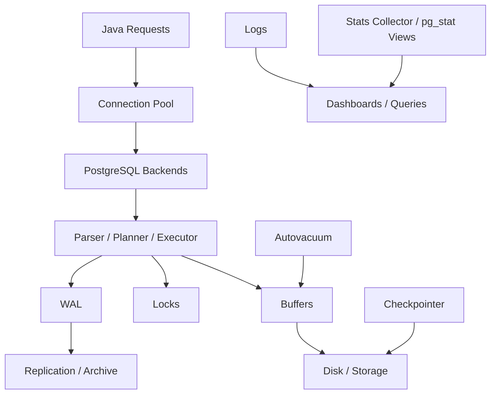
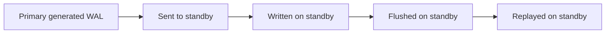
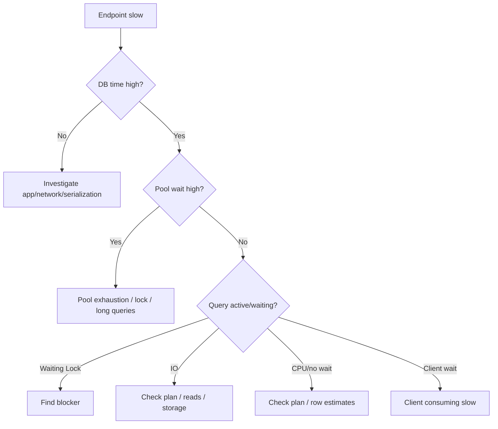

------
title: Learn PostgreSQL in Action - Part 028
description: PostgreSQL observability using pg_stat views, pg_stat_activity, pg_stat_statements, wait events, logs, slow query analysis, lock diagnostics, I/O statistics, replication metrics, and Java correlation.
series: learn-postgresql-in-action
seriesTitle: Learn PostgreSQL in Action
order: 28
partTitle: Observability: pg_stat, Logs, and Production Signals
tags:
- postgresql
- database
- observability
- monitoring
- pg-stat-statements
- pg-stat-activity
- logging
- performance
- java
- series
date: 2026-07-01
---

# Part 028 — Observability: `pg_stat`, Logs, and Production Signals

Pada Part 027 kita membahas security boundary. Sekarang kita masuk ke kemampuan yang membedakan engineer biasa dan engineer production-grade: **membaca kondisi database dari evidence**.

Observability PostgreSQL bukan sekadar dashboard CPU dan memory. Observability berarti kamu bisa menjawab:

1. database sedang lambat karena query, lock, I/O, vacuum, replication, checkpoint, atau connection storm?
2. query mana yang paling mahal secara total dan per-call?
3. apakah bottleneck ada di PostgreSQL atau aplikasi Java/pool/network?
4. apakah ada long transaction yang menahan vacuum?
5. apakah replica lag disebabkan WAL generation, network, replay, atau conflict?
6. apakah autovacuum tertinggal?
7. apakah index dipakai atau hanya menjadi write overhead?
8. apakah incident hari ini disebabkan plan regression setelah data distribution berubah?

Target part ini:

> Kamu bisa membuat observability baseline PostgreSQL yang cukup untuk incident diagnosis, performance tuning, dan operational review tanpa menebak-nebak.

---

## 1. Kaufman Skill Deconstruction

Observability perlu dipecah menjadi sub-skill:

| Sub-skill | Pertanyaan Kunci |
|---|---|
| Current activity | Session apa yang sedang berjalan sekarang? |
| Wait analysis | Session sedang menunggu apa? |
| Statement statistics | Query shape mana yang mahal secara agregat? |
| Lock diagnosis | Siapa memblok siapa? |
| Table/index stats | Table mana tumbuh, discan, divacuum, atau jarang memakai index? |
| I/O stats | Workload menekan read/write/extend di mana? |
| WAL stats | Seberapa banyak WAL dihasilkan? |
| Vacuum stats | Apakah dead tuples dan freeze terkendali? |
| Replication stats | Apakah replica tertinggal dan kenapa? |
| Logging | Evidence apa yang ada setelah kejadian lewat? |
| Java correlation | Request/service mana menghasilkan query/lock? |

Skill observability yang matang bukan menghafal semua view. Skill yang matang adalah memilih evidence yang tepat untuk hipotesis yang tepat.

---

## 2. Mental Model: Database as Runtime System

PostgreSQL adalah runtime system dengan process, memory, locks, I/O, WAL, background workers, dan query executor.



Observability harus mencakup:

| Area | Signal |
|---|---|
| workload | query rate, latency, top statements |
| concurrency | active sessions, blocked sessions, waits |
| storage | buffer hit, reads, writes, temp files |
| maintenance | vacuum/analyze, dead tuples, freeze age |
| durability | WAL generation, checkpoint behavior |
| replication | send/write/flush/replay lag |
| application | pool usage, timeout, request correlation |

---

## 3. Three Sources of Truth

PostgreSQL observability biasanya datang dari tiga sumber besar.

| Source | Digunakan Untuk | Contoh |
|---|---|---|
| Dynamic views | kondisi sekarang | `pg_stat_activity`, `pg_locks` |
| Cumulative stats | tren sejak reset | `pg_stat_database`, `pg_stat_all_tables`, `pg_stat_statements` |
| Logs | evidence historis event | slow query, lock wait, deadlock, connection logs |

Jangan pakai satu source untuk semua.

Contoh:

- `pg_stat_activity` bagus untuk melihat session sekarang, tetapi tidak menjawab query mana yang mahal sepanjang hari.
- `pg_stat_statements` bagus untuk agregat query, tetapi tidak selalu menunjukkan blocking chain saat ini.
- Logs bagus untuk historical forensic, tetapi bisa noisy dan mahal jika terlalu verbose.

---

## 4. `application_name`: Correlation Baseline

Sebelum view apa pun berguna, connection harus punya identitas.

JDBC URL:

```properties
spring.datasource.url=jdbc:postgresql://db.internal:5432/appdb?ApplicationName=case-service
```

Atau:

```sql
SET application_name = 'case-service worker=assignment-dispatcher';
```

Praktik lebih baik:

1. set service name;
2. set worker/job name untuk batch process;
3. gunakan request id di log aplikasi, bukan selalu di `application_name` jika high-cardinality;
4. hindari membuat `application_name` terlalu unique per request karena bisa memperbanyak cardinality di monitoring.

Contoh observasi:

```sql
SELECT application_name, state, count(*)
FROM pg_stat_activity
GROUP BY application_name, state
ORDER BY count(*) DESC;
```

---

## 5. `pg_stat_activity`: What Is Happening Right Now

`pg_stat_activity` adalah view pertama saat incident.

```sql
SELECT
    pid,
    usename,
    application_name,
    client_addr,
    state,
    wait_event_type,
    wait_event,
    backend_type,
    now() - xact_start AS xact_age,
    now() - query_start AS query_age,
    left(query, 500) AS query
FROM pg_stat_activity
WHERE datname = current_database()
ORDER BY query_start NULLS LAST;
```

Kolom penting:

| Column | Arti |
|---|---|
| `pid` | process id backend |
| `state` | active, idle, idle in transaction, etc |
| `wait_event_type` | kategori wait |
| `wait_event` | wait lebih spesifik |
| `xact_start` | kapan transaksi dimulai |
| `query_start` | kapan query sekarang dimulai |
| `backend_type` | client backend, autovacuum worker, walsender, etc |
| `application_name` | identitas app/job |

### 5.1 Dangerous State: Idle in Transaction

```sql
SELECT
    pid,
    usename,
    application_name,
    now() - xact_start AS xact_age,
    state,
    left(query, 300) AS last_query
FROM pg_stat_activity
WHERE state = 'idle in transaction'
ORDER BY xact_start;
```

`idle in transaction` berbahaya karena:

1. menahan snapshot lama;
2. menghambat vacuum cleanup;
3. bisa menahan lock;
4. membuat pool connection terbuang;
5. membuat incident terlihat seperti database lambat padahal aplikasi lupa commit/rollback.

Java mitigation:

```properties
spring.datasource.hikari.auto-commit=false
spring.transaction.default-timeout=30s
```

Dan atur database-side safety:

```sql
ALTER ROLE svc_case_runtime SET idle_in_transaction_session_timeout = '60s';
ALTER ROLE svc_case_runtime SET statement_timeout = '30s';
ALTER ROLE svc_case_runtime SET lock_timeout = '5s';
```

---

## 6. Wait Events: What Is PostgreSQL Waiting For?

Jika query aktif tetapi tidak maju, lihat `wait_event_type` dan `wait_event`.

```sql
SELECT
    wait_event_type,
    wait_event,
    count(*)
FROM pg_stat_activity
WHERE state = 'active'
GROUP BY wait_event_type, wait_event
ORDER BY count(*) DESC;
```

Mental model:

| Wait Category | Interpretasi Awal |
|---|---|
| `Lock` | menunggu lock dari transaksi lain |
| `LWLock` | lightweight internal lock/contention |
| `IO` | menunggu I/O |
| `Client` | menunggu client mengirim/menerima data |
| `WAL` | menunggu aktivitas WAL |
| `Timeout` | menunggu timer/event timeout |
| null | sedang memakai CPU atau tidak sedang wait saat sample |

Caveat:

> Wait event adalah sample kondisi saat ini, bukan root cause otomatis. Gunakan sebagai arah investigasi.

Contoh:

- Banyak `Lock` → cari blocker.
- Banyak `ClientRead` → server menunggu client; mungkin aplikasi lambat mengonsumsi result atau connection idle.
- Banyak `IO` → cek buffer hit, storage latency, query scan besar, cache miss.
- Banyak WAL-related wait → cek commit pressure, synchronous replication, storage write latency.

---

## 7. Lock Diagnosis

### 7.1 Blocked Sessions

```sql
SELECT
    blocked.pid AS blocked_pid,
    blocked.application_name AS blocked_app,
    now() - blocked.query_start AS blocked_duration,
    blocker.pid AS blocker_pid,
    blocker.application_name AS blocker_app,
    now() - blocker.xact_start AS blocker_xact_age,
    left(blocked.query, 300) AS blocked_query,
    left(blocker.query, 300) AS blocker_query
FROM pg_stat_activity blocked
JOIN pg_locks blocked_locks
  ON blocked_locks.pid = blocked.pid
JOIN pg_locks blocker_locks
  ON blocker_locks.locktype = blocked_locks.locktype
 AND blocker_locks.database IS NOT DISTINCT FROM blocked_locks.database
 AND blocker_locks.relation IS NOT DISTINCT FROM blocked_locks.relation
 AND blocker_locks.page IS NOT DISTINCT FROM blocked_locks.page
 AND blocker_locks.tuple IS NOT DISTINCT FROM blocked_locks.tuple
 AND blocker_locks.virtualxid IS NOT DISTINCT FROM blocked_locks.virtualxid
 AND blocker_locks.transactionid IS NOT DISTINCT FROM blocked_locks.transactionid
 AND blocker_locks.classid IS NOT DISTINCT FROM blocked_locks.classid
 AND blocker_locks.objid IS NOT DISTINCT FROM blocked_locks.objid
 AND blocker_locks.objsubid IS NOT DISTINCT FROM blocked_locks.objsubid
 AND blocker_locks.pid <> blocked_locks.pid
JOIN pg_stat_activity blocker
  ON blocker.pid = blocker_locks.pid
WHERE NOT blocked_locks.granted
  AND blocker_locks.granted
ORDER BY blocked.query_start;
```

### 7.2 Simpler Helper

PostgreSQL menyediakan `pg_blocking_pids(pid)`.

```sql
SELECT
    a.pid,
    a.application_name,
    a.state,
    a.wait_event_type,
    a.wait_event,
    pg_blocking_pids(a.pid) AS blocking_pids,
    now() - a.query_start AS query_age,
    left(a.query, 300) AS query
FROM pg_stat_activity a
WHERE cardinality(pg_blocking_pids(a.pid)) > 0
ORDER BY query_age DESC;
```

### 7.3 Termination Decision

Jangan langsung `pg_terminate_backend`. Tentukan:

1. apakah blocker sedang transaksi penting?
2. apakah dia sudah idle in transaction?
3. apakah query bisa retry?
4. apakah terminate akan rollback banyak perubahan?
5. apakah ini migration DDL yang sedang lock table besar?

Safer first step:

```sql
SELECT pg_cancel_backend(<pid>);
```

Harder action:

```sql
SELECT pg_terminate_backend(<pid>);
```

---

## 8. `pg_stat_statements`: Statement-Level Evidence

`pg_stat_statements` adalah extension penting untuk workload profiling. Ia mengagregasi statistik query berdasarkan normalized query shape.

Enable pattern:

```conf
shared_preload_libraries = 'pg_stat_statements'
pg_stat_statements.track = all
pg_stat_statements.max = 10000
```

Create extension:

```sql
CREATE EXTENSION IF NOT EXISTS pg_stat_statements;
```

### 8.1 Top Total Time

```sql
SELECT
    calls,
    round(total_exec_time::numeric, 2) AS total_exec_ms,
    round(mean_exec_time::numeric, 2) AS mean_exec_ms,
    round(max_exec_time::numeric, 2) AS max_exec_ms,
    rows,
    shared_blks_hit,
    shared_blks_read,
    temp_blks_read,
    temp_blks_written,
    left(query, 500) AS query
FROM pg_stat_statements
ORDER BY total_exec_time DESC
LIMIT 20;
```

### 8.2 Slow Per Call

```sql
SELECT
    calls,
    round(mean_exec_time::numeric, 2) AS mean_ms,
    round(stddev_exec_time::numeric, 2) AS stddev_ms,
    round(max_exec_time::numeric, 2) AS max_ms,
    left(query, 500) AS query
FROM pg_stat_statements
WHERE calls > 10
ORDER BY mean_exec_time DESC
LIMIT 20;
```

### 8.3 I/O Heavy Statements

```sql
SELECT
    calls,
    shared_blks_read,
    shared_blks_hit,
    round(
      shared_blks_hit::numeric / nullif(shared_blks_hit + shared_blks_read, 0),
      4
    ) AS hit_ratio,
    round(total_exec_time::numeric, 2) AS total_ms,
    left(query, 500) AS query
FROM pg_stat_statements
WHERE shared_blks_read > 0
ORDER BY shared_blks_read DESC
LIMIT 20;
```

### 8.4 Temp Spill Statements

```sql
SELECT
    calls,
    temp_blks_read,
    temp_blks_written,
    round(total_exec_time::numeric, 2) AS total_ms,
    left(query, 500) AS query
FROM pg_stat_statements
WHERE temp_blks_read > 0 OR temp_blks_written > 0
ORDER BY temp_blks_written DESC
LIMIT 20;
```

Temp spill biasanya mengarah ke:

1. sort besar;
2. hash aggregate besar;
3. hash join besar;
4. `work_mem` terlalu kecil untuk query shape tertentu;
5. query reporting yang seharusnya memakai summary table/materialized view.

---

## 9. Reset Strategy and Baselines

Cumulative stats perlu baseline.

```sql
SELECT pg_stat_statements_reset();
```

Jangan reset sembarangan di production tanpa proses, karena kamu menghapus evidence.

Better practice:

1. scrape metrics secara periodik ke time-series database;
2. reset hanya saat controlled benchmark atau release comparison;
3. catat timestamp reset;
4. bandingkan sebelum/sesudah deployment;
5. track queryid jika tersedia dan stabil dalam environment.

---

## 10. Database-Level Stats

```sql
SELECT
    datname,
    numbackends,
    xact_commit,
    xact_rollback,
    blks_read,
    blks_hit,
    round(blks_hit::numeric / nullif(blks_hit + blks_read, 0), 4) AS buffer_hit_ratio,
    tup_returned,
    tup_fetched,
    tup_inserted,
    tup_updated,
    tup_deleted,
    conflicts,
    temp_files,
    temp_bytes,
    deadlocks
FROM pg_stat_database
WHERE datname = current_database();
```

Interpretasi:

| Signal | Kemungkinan Meaning |
|---|---|
| high rollback | app errors, retries, deadlocks, failed constraints |
| low buffer hit | workload tidak cache-friendly atau memory kecil |
| temp bytes naik | sort/hash spill |
| deadlocks > 0 | transaction ordering issue |
| conflicts | hot standby conflicts jika replica |

Caveat:

> Buffer hit ratio global bisa misleading. Query-level evidence lebih penting untuk tuning.

---

## 11. Table Stats

```sql
SELECT
    schemaname,
    relname,
    seq_scan,
    seq_tup_read,
    idx_scan,
    idx_tup_fetch,
    n_tup_ins,
    n_tup_upd,
    n_tup_del,
    n_tup_hot_upd,
    n_dead_tup,
    last_vacuum,
    last_autovacuum,
    last_analyze,
    last_autoanalyze
FROM pg_stat_all_tables
WHERE schemaname NOT IN ('pg_catalog', 'information_schema')
ORDER BY n_dead_tup DESC
LIMIT 30;
```

Use cases:

1. table dengan dead tuple tinggi;
2. table jarang autoanalyze;
3. table banyak sequential scan;
4. HOT update ratio rendah;
5. write-heavy tables;
6. candidate partitioning/retention.

### 11.1 HOT Update Ratio

```sql
SELECT
    schemaname,
    relname,
    n_tup_upd,
    n_tup_hot_upd,
    round(n_tup_hot_upd::numeric / nullif(n_tup_upd, 0), 4) AS hot_update_ratio
FROM pg_stat_all_tables
WHERE n_tup_upd > 0
ORDER BY hot_update_ratio ASC
LIMIT 30;
```

HOT ratio rendah pada table update-heavy bisa berarti:

1. updated column ada di index;
2. page tidak punya free space;
3. fillfactor terlalu tinggi;
4. ORM update semua kolom dan menyentuh indexed column;
5. index portfolio terlalu luas.

---

## 12. Index Stats

```sql
SELECT
    schemaname,
    relname,
    indexrelname,
    idx_scan,
    idx_tup_read,
    idx_tup_fetch
FROM pg_stat_user_indexes
ORDER BY idx_scan ASC, idx_tup_read DESC
LIMIT 50;
```

Candidate unused indexes:

```sql
SELECT
    s.schemaname,
    s.relname,
    s.indexrelname,
    s.idx_scan,
    pg_size_pretty(pg_relation_size(s.indexrelid)) AS index_size
FROM pg_stat_user_indexes s
JOIN pg_index i ON i.indexrelid = s.indexrelid
WHERE s.idx_scan = 0
  AND NOT i.indisunique
  AND NOT i.indisprimary
ORDER BY pg_relation_size(s.indexrelid) DESC;
```

Caveat:

> `idx_scan = 0` sejak stats reset bukan bukti index tidak berguna selamanya. Bisa saja index dipakai untuk rare but critical query, FK enforcement, monthly job, atau incident workflow.

Index removal harus melewati:

1. business query inventory;
2. production stats window cukup panjang;
3. plan review;
4. staging test;
5. rollback plan.

---

## 13. I/O Observability with `pg_stat_io`

PostgreSQL modern menyediakan `pg_stat_io` untuk melihat I/O berdasarkan backend type, object, dan context.

```sql
SELECT
    backend_type,
    object,
    context,
    reads,
    writes,
    extends,
    hits,
    evictions,
    fsyncs
FROM pg_stat_io
ORDER BY reads + writes + extends DESC
LIMIT 50;
```

Untuk PostgreSQL 18, I/O stats juga lebih informatif karena ada byte-level activity pada area tertentu.

Interpretasi:

| Signal | Kemungkinan Meaning |
|---|---|
| high reads | cache miss, scan besar, working set > memory |
| high writes | checkpoint/bgwriter pressure, write-heavy workload |
| high extends | relation growth |
| high evictions | buffer churn |
| high fsyncs | durability/checkpoint/write pressure |

Gabungkan dengan:

1. top query `shared_blks_read`;
2. table/index size;
3. checkpoint logs;
4. storage latency metrics dari OS/cloud;
5. workload shift.

---

## 14. WAL and Checkpoint Observability

WAL pressure terlihat dari beberapa view/settings/logs.

```sql
SELECT * FROM pg_stat_wal;
```

Useful indicators:

| Signal | Meaning |
|---|---|
| WAL records/bytes naik | write workload atau full-page writes tinggi |
| WAL buffers full | WAL buffer pressure |
| sync time tinggi | storage/durability bottleneck |

Checkpoint stats:

```sql
SELECT
    checkpoints_timed,
    checkpoints_req,
    checkpoint_write_time,
    checkpoint_sync_time,
    buffers_checkpoint,
    buffers_clean,
    maxwritten_clean,
    buffers_backend,
    buffers_backend_fsync
FROM pg_stat_bgwriter;
```

Interpretasi:

- `checkpoints_req` tinggi → checkpoint dipaksa karena WAL size, mungkin `max_wal_size` terlalu kecil atau write burst besar.
- `buffers_backend` tinggi → backend process harus menulis dirty buffer sendiri, bisa menambah latency query.
- `buffers_backend_fsync` > 0 → red flag, backend melakukan fsync.

Logging checkpoint membantu:

```conf
log_checkpoints = on
```

---

## 15. Vacuum and Autovacuum Observability

Dead tuples dan vacuum status:

```sql
SELECT
    schemaname,
    relname,
    n_live_tup,
    n_dead_tup,
    round(n_dead_tup::numeric / nullif(n_live_tup + n_dead_tup, 0), 4) AS dead_ratio,
    last_autovacuum,
    autovacuum_count,
    last_autoanalyze,
    autoanalyze_count
FROM pg_stat_user_tables
ORDER BY n_dead_tup DESC
LIMIT 30;
```

Active autovacuum:

```sql
SELECT
    pid,
    datname,
    relid::regclass AS relation,
    phase,
    heap_blks_total,
    heap_blks_scanned,
    heap_blks_vacuumed,
    index_vacuum_count,
    max_dead_tuples,
    num_dead_tuples
FROM pg_stat_progress_vacuum;
```

Autovacuum observability answers:

1. apakah table mendapat vacuum cukup sering?
2. apakah vacuum sedang berjalan tetapi lambat?
3. apakah ada long transaction menahan cleanup?
4. apakah dead tuple tumbuh lebih cepat dari cleanup?
5. apakah freeze age mendekati bahaya?

Long transaction check:

```sql
SELECT
    pid,
    usename,
    application_name,
    state,
    now() - xact_start AS xact_age,
    backend_xmin,
    left(query, 300) AS query
FROM pg_stat_activity
WHERE backend_xmin IS NOT NULL
ORDER BY xact_start;
```

---

## 16. Replication Observability

Primary-side physical replication:

```sql
SELECT
    application_name,
    client_addr,
    state,
    sync_state,
    sent_lsn,
    write_lsn,
    flush_lsn,
    replay_lsn,
    write_lag,
    flush_lag,
    replay_lag
FROM pg_stat_replication;
```

Replication lag has stages:



Interpretation:

| Lag | Meaning |
|---|---|
| sent lag | primary cannot send fast enough/network issue |
| write lag | standby receives but cannot write fast enough |
| flush lag | standby disk flush slow |
| replay lag | standby apply/recovery slow or conflict |

Standby-side recovery:

```sql
SELECT
    pg_is_in_recovery(),
    now() - pg_last_xact_replay_timestamp() AS replay_delay,
    pg_last_wal_receive_lsn(),
    pg_last_wal_replay_lsn();
```

Logical replication:

```sql
SELECT
    subname,
    pid,
    relid,
    received_lsn,
    latest_end_lsn,
    latest_end_time
FROM pg_stat_subscription;
```

Replication observability must be connected to application routing. A read replica with 30 seconds lag is not suitable for read-after-write screens unless app can tolerate staleness.

---

## 17. Logging Strategy

Logs provide historical evidence after a problem has passed.

Recommended baseline:

```conf
log_line_prefix = '%m [%p] user=%u db=%d app=%a client=%h '
log_min_duration_statement = '500ms'
log_lock_waits = on
deadlock_timeout = '1s'
log_checkpoints = on
log_autovacuum_min_duration = '1s'
```

### 17.1 Slow Query Logs

`log_min_duration_statement` logs statements slower than threshold.

Production strategy:

| Environment | Suggested Approach |
|---|---|
| dev | lower threshold, verbose |
| staging | representative threshold |
| prod OLTP | threshold aligned with SLO |
| incident | temporary lower threshold if safe |

Caveat:

> Very low threshold on high-throughput system can produce log storm and increase cost.

### 17.2 Lock Wait Logs

```conf
log_lock_waits = on
deadlock_timeout = '1s'
```

This logs waits longer than `deadlock_timeout`, not only deadlocks. Useful for diagnosing lock storms.

### 17.3 Autovacuum Logs

```conf
log_autovacuum_min_duration = '5s'
```

Useful to detect large/slow vacuum operations and tables needing per-table tuning.

---

## 18. `auto_explain`

`auto_explain` can log execution plans for slow statements.

Example controlled use:

```conf
shared_preload_libraries = 'pg_stat_statements,auto_explain'
auto_explain.log_min_duration = '1s'
auto_explain.log_analyze = on
auto_explain.log_buffers = on
auto_explain.log_nested_statements = on
auto_explain.sample_rate = 0.01
```

Use carefully.

Risks:

1. `log_analyze` executes instrumentation overhead;
2. logs can become huge;
3. sensitive query text may appear;
4. sampling strategy needed;
5. managed DB support varies.

When useful:

1. plan regression incident;
2. query generated by ORM hard to reproduce;
3. intermittent slow query;
4. stored procedure nested statements;
5. production-only data distribution issue.

---

## 19. Java/Hikari Observability

Database observability without app-side correlation is incomplete.

Track Hikari metrics:

| Metric | Meaning |
|---|---|
| active connections | currently borrowed |
| idle connections | available |
| pending threads | waiting for connection |
| max pool size | hard pool limit |
| connection timeout | acquisition timeout |
| connection lifetime | rotation/drain behavior |

Incident interpretation:

| Symptom | Likely Meaning |
|---|---|
| pending threads high, DB active low | pool too small, leak, blocked app threads |
| DB active high, CPU high | query execution pressure |
| DB idle in transaction high | app transaction leak |
| pool exhausted, DB lock waits high | transactions waiting while holding connections |
| high acquisition timeout | backpressure failure |

### 19.1 Timeout Hierarchy

Recommended mental model:

```text
client/request timeout > transaction timeout > statement_timeout > lock_timeout
```

Example:

```properties
spring.datasource.hikari.connectionTimeout=3000
spring.datasource.hikari.validationTimeout=1000
spring.datasource.hikari.maxLifetime=1800000
spring.datasource.hikari.maximumPoolSize=20
```

Database role settings:

```sql
ALTER ROLE svc_case_runtime SET statement_timeout = '30s';
ALTER ROLE svc_case_runtime SET lock_timeout = '5s';
ALTER ROLE svc_case_runtime SET idle_in_transaction_session_timeout = '60s';
```

Avoid infinite query execution.

---

## 20. Query Tagging

Query tags help correlate application flow and database statements.

Example:

```sql
/* service=case-service usecase=list-open-cases */
SELECT id, case_number, status, created_at
FROM case_mgmt.cases
WHERE tenant_id = $1
  AND status = 'OPEN'
ORDER BY created_at DESC
LIMIT $2;
```

Caveat with `pg_stat_statements`:

1. comments may affect query text storage and cardinality depending normalization/version/config;
2. high-cardinality request IDs in SQL comments can hurt aggregation;
3. prefer low-cardinality tags such as service/usecase/repository method.

Bad:

```sql
/* request_id=4c2254f9-... user_id=928371 */
SELECT ...
```

Better:

```sql
/* service=case-service repo=CaseRepository method=findOpen */
SELECT ...
```

Put high-cardinality request id in application logs/traces, not necessarily SQL text.

---

## 21. Dashboard Baseline

A production PostgreSQL dashboard should answer at least these categories.

### 21.1 Availability and Connections

- database up/down;
- primary/replica role;
- active connections;
- idle connections;
- idle in transaction;
- max connections usage;
- Hikari active/idle/pending;
- connection acquisition latency.

### 21.2 Workload

- transactions/sec;
- commits vs rollbacks;
- queries/sec if available;
- top statements by total time;
- top statements by mean time;
- slow query count;
- rows read/returned ratio.

### 21.3 Concurrency

- lock waits;
- blocked session count;
- deadlocks;
- wait event distribution;
- long transactions;
- statement timeout count from logs.

### 21.4 Storage and I/O

- database size;
- table/index growth;
- buffer hit ratio;
- reads/writes/fsyncs;
- temp files/temp bytes;
- checkpoint frequency;
- storage latency from provider/OS.

### 21.5 Vacuum

- dead tuples;
- last vacuum/autovacuum;
- vacuum progress;
- table bloat estimate where available;
- transaction age/freeze risk;
- oldest transaction age.

### 21.6 Replication

- replica status;
- replication lag by stage;
- replication slot retained WAL;
- standby conflicts;
- WAL archive success/failure;
- logical replication apply lag.

---

## 22. Incident Workflow: Slow Application Endpoint

User says: endpoint `/cases/search` is slow.

Do not start by adding index blindly.

### 22.1 Decision Tree



### 22.2 Evidence Steps

1. Check app trace: DB span time vs total time.
2. Check Hikari pending threads.
3. Check `pg_stat_activity` for active query and wait.
4. Check blocker if lock wait.
5. Check `pg_stat_statements` for query aggregate.
6. Run `EXPLAIN (ANALYZE, BUFFERS)` in safe replica/staging or controlled prod.
7. Compare plan to previous baseline.
8. Fix query shape/index/stats/transaction as evidence indicates.

---

## 23. Incident Workflow: Lock Storm

Symptoms:

1. many active sessions waiting on `Lock`;
2. pool exhaustion;
3. latency spike;
4. maybe migration running;
5. app retries amplify load.

Immediate query:

```sql
SELECT
    a.pid,
    a.application_name,
    a.state,
    a.wait_event_type,
    a.wait_event,
    pg_blocking_pids(a.pid) AS blockers,
    now() - a.query_start AS query_age,
    now() - a.xact_start AS xact_age,
    left(a.query, 500) AS query
FROM pg_stat_activity a
WHERE a.datname = current_database()
ORDER BY cardinality(pg_blocking_pids(a.pid)) DESC, query_age DESC;
```

Actions:

1. identify root blocker, not every blocked query;
2. check if blocker is idle in transaction;
3. cancel/terminate only after evaluating rollback risk;
4. stop retry storm at app/load balancer if needed;
5. if migration caused it, pause deployment;
6. postmortem lock acquisition and migration DDL.

---

## 24. Incident Workflow: Autovacuum Falling Behind

Symptoms:

1. table bloat;
2. slow scans;
3. transaction ID age alert;
4. dead tuples increasing;
5. disk usage growing despite deletes.

Evidence:

```sql
SELECT
    relname,
    n_live_tup,
    n_dead_tup,
    last_autovacuum,
    autovacuum_count
FROM pg_stat_user_tables
ORDER BY n_dead_tup DESC
LIMIT 20;
```

Find blockers:

```sql
SELECT
    pid,
    usename,
    application_name,
    state,
    backend_xmin,
    now() - xact_start AS xact_age,
    left(query, 300) AS query
FROM pg_stat_activity
WHERE backend_xmin IS NOT NULL
ORDER BY xact_start;
```

Possible fixes:

1. kill long idle transaction;
2. tune per-table autovacuum;
3. reduce update churn;
4. reduce index count on update-heavy table;
5. partition retention-heavy data;
6. schedule manual vacuum if safe;
7. avoid long repeatable-read transactions.

---

## 25. Incident Workflow: Replica Lag

Symptoms:

1. stale reads;
2. read-after-write failures;
3. standby behind primary;
4. WAL accumulation;
5. logical subscriber lag.

Primary check:

```sql
SELECT
    application_name,
    state,
    sync_state,
    write_lag,
    flush_lag,
    replay_lag,
    sent_lsn,
    replay_lsn
FROM pg_stat_replication;
```

Standby check:

```sql
SELECT
    now() - pg_last_xact_replay_timestamp() AS replay_delay,
    pg_is_wal_replay_paused() AS replay_paused;
```

Interpretation:

| Pattern | Likely Cause |
|---|---|
| write/flush lag high | standby disk/network |
| replay lag high | apply slow, conflict, heavy query on standby |
| only one replica lagging | replica-specific issue |
| all replicas lagging | primary WAL burst or network/storage shared issue |

Application mitigation:

1. route read-after-write to primary;
2. expose staleness tolerance in API;
3. use session consistency token if architecture supports;
4. pause lagging replica from serving critical reads;
5. avoid long analytical query on hot standby if it conflicts with replay.

---

## 26. Incident Workflow: Temp File Explosion

Symptoms:

1. disk usage spike;
2. temp bytes increasing;
3. slow reporting queries;
4. storage I/O saturation.

Evidence:

```sql
SELECT
    datname,
    temp_files,
    pg_size_pretty(temp_bytes) AS temp_written
FROM pg_stat_database
ORDER BY temp_bytes DESC;
```

Top statements:

```sql
SELECT
    calls,
    temp_blks_read,
    temp_blks_written,
    mean_exec_time,
    left(query, 500) AS query
FROM pg_stat_statements
WHERE temp_blks_written > 0
ORDER BY temp_blks_written DESC
LIMIT 20;
```

Root causes:

1. missing index for ordering/grouping;
2. hash aggregate too large;
3. hash join spills;
4. huge `DISTINCT`;
5. report query on OLTP primary;
6. insufficient `work_mem` for controlled reporting role;
7. unbounded export.

Do not globally increase `work_mem` without calculating concurrency. `work_mem` is per operation, not a single global cap per query.

---

## 27. Lab: Observability Drill

### 27.1 Create Workload Table

```sql
CREATE SCHEMA IF NOT EXISTS obs_lab;

CREATE TABLE obs_lab.case_events (
    id bigint GENERATED ALWAYS AS IDENTITY PRIMARY KEY,
    tenant_id uuid NOT NULL,
    case_id bigint NOT NULL,
    event_type text NOT NULL,
    payload jsonb NOT NULL,
    created_at timestamptz NOT NULL DEFAULT now()
);

INSERT INTO obs_lab.case_events(tenant_id, case_id, event_type, payload, created_at)
SELECT
    gen_random_uuid(),
    (random() * 100000)::bigint,
    CASE WHEN random() < 0.8 THEN 'VIEWED' ELSE 'UPDATED' END,
    jsonb_build_object('source', 'lab', 'n', g),
    now() - ((random() * 30)::int || ' days')::interval
FROM generate_series(1, 200000) g;
```

### 27.2 Run Bad Query

```sql
SELECT case_id, count(*)
FROM obs_lab.case_events
WHERE event_type = 'UPDATED'
GROUP BY case_id
ORDER BY count(*) DESC
LIMIT 50;
```

Observe in another session:

```sql
SELECT pid, state, wait_event_type, wait_event, now() - query_start AS age, query
FROM pg_stat_activity
WHERE query ILIKE '%obs_lab.case_events%';
```

### 27.3 Check Statement Stats

```sql
SELECT calls, total_exec_time, mean_exec_time, rows, left(query, 300)
FROM pg_stat_statements
WHERE query ILIKE '%obs_lab.case_events%'
ORDER BY total_exec_time DESC;
```

### 27.4 Add Better Index

```sql
CREATE INDEX idx_case_events_type_case
ON obs_lab.case_events (event_type, case_id);
```

Run again, compare:

```sql
EXPLAIN (ANALYZE, BUFFERS)
SELECT case_id, count(*)
FROM obs_lab.case_events
WHERE event_type = 'UPDATED'
GROUP BY case_id
ORDER BY count(*) DESC
LIMIT 50;
```

Lesson:

> Observability is not a dashboard decoration. It is how you compare before/after and avoid tuning by intuition.

---

## 28. Common Anti-Patterns

| Anti-Pattern | Why It Fails |
|---|---|
| Only monitor CPU/memory | misses locks, plans, vacuum, WAL, pool waits |
| No `application_name` | cannot attribute sessions to services |
| No `pg_stat_statements` | no aggregate query evidence |
| Only slow logs | misses high-frequency medium-cost query |
| Logging every query forever | log storm, cost, sensitive data exposure |
| Global buffer hit ratio obsession | hides query-level I/O issues |
| Killing random blocked sessions | root blocker remains |
| Increasing pool size during DB saturation | makes contention worse |
| Increasing `work_mem` globally | can cause memory pressure under concurrency |
| Dashboard with no runbook | pretty but not operational |

---

## 29. Self-Correction Questions

1. Apa perbedaan `pg_stat_activity` dan `pg_stat_statements`?
2. Kapan `idle in transaction` berbahaya?
3. Bagaimana mencari blocker dari blocked session?
4. Mengapa top query by total time berbeda dari top query by mean time?
5. Apa arti temp blocks pada `pg_stat_statements`?
6. Mengapa `idx_scan = 0` belum tentu berarti index pasti aman dihapus?
7. Apa bedanya write lag, flush lag, dan replay lag pada replication?
8. Mengapa global `work_mem` increase bisa berbahaya?
9. Apa hubungan Hikari pending threads dengan database lock waits?
10. Apa minimal log line prefix yang berguna untuk incident?

---

## 30. Takeaways

PostgreSQL observability harus evidence-driven.

Inti part ini:

1. `pg_stat_activity` menjawab apa yang sedang terjadi sekarang;
2. wait events memberi arah diagnosis, bukan root cause final;
3. `pg_stat_statements` memberi evidence agregat query shape;
4. lock diagnosis harus mencari root blocker;
5. table/index stats membantu menemukan bloat, write amplification, dan index waste;
6. `pg_stat_io`, WAL stats, checkpoint logs, dan storage metrics harus dibaca bersama;
7. autovacuum observability wajib untuk workload update/delete-heavy;
8. replication lag harus dipecah menjadi send/write/flush/replay;
9. Java observability harus mencakup Hikari pool, timeout, request traces, dan `application_name`;
10. dashboard tanpa runbook tidak cukup.

Part berikutnya akan membahas **systematic performance tuning method**: bagaimana mengubah semua evidence ini menjadi workflow tuning yang aman, repeatable, dan tidak berbasis tebak-tebakan.
