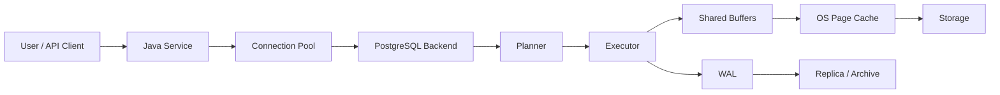
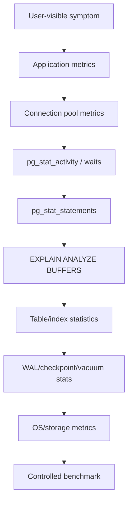
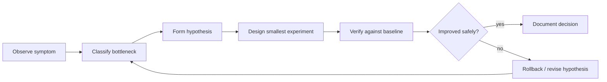
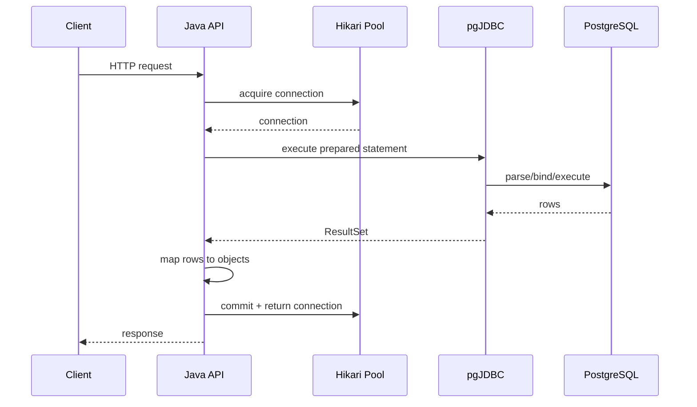

------
title: Learn PostgreSQL in Action - Part 029
description: Systematic performance tuning method for PostgreSQL production systems, covering workload profiling, bottleneck taxonomy, evidence-driven diagnosis, safe experiments, and Java application implications.
series: learn-postgresql-in-action
seriesTitle: Learn PostgreSQL in Action
order: 29
partTitle: Systematic Performance Tuning Method
tags:
- postgresql
- database
- performance
- observability
- java
- tuning
- series
date: 2026-07-01
---

# Part 029 — Systematic Performance Tuning Method

Performance tuning PostgreSQL bukan aktivitas menebak parameter, menambah index secara impulsif, atau menaikkan instance size begitu query lambat. Di level production, tuning adalah proses engineering untuk menemukan constraint yang benar, mengukur dampaknya, mengubah satu variabel secara aman, lalu memverifikasi bahwa perubahan tersebut memperbaiki sistem tanpa merusak invariant lain.

Part ini menyatukan semua materi sebelumnya: planner, index, query shape, joins, aggregation, memory, vacuum, WAL, replication, locking, security, dan observability. Tujuannya adalah membentuk cara kerja yang bisa dipakai saat sistem sedang normal maupun saat incident.

Kita tidak akan membahas daftar “magic settings”. Fokusnya adalah metode.

---

## 1. Problem yang Diselesaikan

Gejala performance PostgreSQL biasanya terlihat sebagai:

- endpoint Java tiba-tiba lambat;
- p95/p99 latency naik;
- CPU database tinggi;
- IO wait naik;
- connection pool penuh;
- query lambat hanya pada tenant tertentu;
- replica lag meningkat;
- autovacuum tidak mengejar;
- lock wait muncul di jam tertentu;
- deployment schema membuat aplikasi timeout;
- reporting query mengganggu OLTP;
- throughput write turun setelah penambahan index;
- database terlihat “idle”, tetapi aplikasi tetap lambat.

Tanpa metode, engineer mudah terjebak pada false diagnosis:

> “CPU tinggi berarti butuh CPU lebih besar.”  
> “Query lambat berarti butuh index.”  
> “Pool penuh berarti pool harus dibesarkan.”  
> “Replica lag berarti replica harus lebih besar.”  
> “Autovacuum jalan berarti database sedang bermasalah.”

Kadang benar. Sering salah.

Performance tuning yang baik menjawab pertanyaan ini secara berurutan:

1. Workload apa yang berubah?
2. Constraint utama ada di query, lock, IO, CPU, memory, WAL, network, pool, atau aplikasi?
3. Evidence apa yang membuktikan constraint tersebut?
4. Perubahan terkecil apa yang bisa diuji?
5. Bagaimana memastikan perubahan tidak menciptakan regresi baru?

---

## 2. Mental Model: Performance adalah Flow Constraint

PostgreSQL berada di tengah flow aplikasi.



Latency user bukan hanya waktu query. Latency user adalah gabungan:

```text
request latency
= app queue time
+ connection acquisition time
+ transaction setup time
+ lock wait time
+ planning time
+ execution time
+ IO wait time
+ WAL flush time
+ result transfer time
+ object mapping time
+ downstream processing time
```

Karena itu, pertanyaan “database lambat?” terlalu kabur. Pertanyaan yang lebih benar:

- bagian mana dari flow yang menjadi constraint?
- apakah constraint itu terjadi sebelum query dikirim, saat query menunggu lock, saat planner memilih plan, saat executor membaca data, saat WAL flush, atau saat Java memproses result set?

---

## 3. Kaufman Deconstruction: Sub-Skill Performance Tuning

Mengikuti pendekatan Josh Kaufman, skill besar “PostgreSQL performance tuning” harus dipecah menjadi sub-skill kecil yang bisa dilatih terpisah.

| Sub-Skill | Kemampuan Praktis | Evidence Utama |
|---|---|---|
| Workload profiling | Mengetahui query dan endpoint yang paling mahal | `pg_stat_statements`, APM, logs |
| Plan diagnosis | Membaca mengapa query lambat | `EXPLAIN (ANALYZE, BUFFERS)` |
| Cardinality diagnosis | Melihat estimator planner salah | estimated vs actual rows |
| Index portfolio | Menambah/menghapus index dengan alasan | `pg_indexes`, `pg_stat_user_indexes` |
| Lock diagnosis | Menemukan blocking chain | `pg_locks`, `pg_blocking_pids()` |
| Memory diagnosis | Melihat sort/hash spill | temp files, EXPLAIN, logs |
| IO diagnosis | Membedakan cache hit vs disk read | buffers, `pg_stat_io`, OS metrics |
| Write-path diagnosis | Melihat WAL/checkpoint pressure | WAL stats, checkpoint stats |
| Vacuum diagnosis | Melihat dead tuple/bloat risk | `pg_stat_user_tables`, autovacuum logs |
| Pool diagnosis | Melihat saturation di app boundary | Hikari metrics |
| Retry diagnosis | Membedakan transient vs permanent failure | SQLSTATE, logs |
| Experiment design | Mengubah satu variabel dengan rollback | migration plan, benchmark diff |

Latihan terbaik bukan membaca konfigurasi. Latihan terbaik adalah mengambil satu gejala dan membuktikan root cause-nya dari evidence.

---

## 4. Taxonomy Bottleneck PostgreSQL

Sebelum tuning, klasifikasikan bottleneck. Setiap kelas punya evidence dan obat yang berbeda.

### 4.1 Query Shape Bottleneck

Gejala:

- query lambat walau database tidak penuh;
- plan memakai sequential scan besar yang tidak diinginkan;
- filter tidak sargable;
- result set terlalu besar;
- pagination offset makin lambat;
- ORM menghasilkan query tidak sesuai index.

Evidence:

```sql
EXPLAIN (ANALYZE, BUFFERS, VERBOSE)
SELECT ...;
```

Yang dicari:

- estimated rows jauh dari actual rows;
- `Rows Removed by Filter` sangat besar;
- sort/hash spill;
- nested loop dengan inner scan terlalu banyak;
- sequential scan di table besar;
- filter memakai function/cast pada kolom indexed;
- bitmap heap scan membaca terlalu banyak heap block.

Perbaikan umum:

- rewrite predicate;
- tambahkan composite/partial/expression index;
- ubah pagination ke keyset;
- kurangi projection;
- split query;
- tambahkan extended statistics;
- ubah data model jika query bertentangan dengan model.

### 4.2 Cardinality Estimation Bottleneck

Planner memilih plan berdasarkan estimasi. Jika estimasi salah, plan bisa salah walau index sudah benar.

Gejala:

```text
rows=10 estimated, actual rows=500000
```

Evidence:

```sql
SELECT
    schemaname,
    tablename,
    attname,
    n_distinct,
    correlation,
    most_common_vals,
    most_common_freqs,
    histogram_bounds
FROM pg_stats
WHERE schemaname = 'app'
  AND tablename = 'case_event';
```

Penyebab:

- statistics stale;
- data skew;
- correlation antar kolom tidak diketahui planner;
- predicate pada expression tanpa expression statistics/index;
- parameterized query memilih generic plan yang buruk;
- tenant tertentu jauh lebih besar dari tenant lain.

Perbaikan:

```sql
ANALYZE app.case_event;

ALTER TABLE app.case_event
ALTER COLUMN tenant_id SET STATISTICS 1000;

CREATE STATISTICS case_event_tenant_status_stat
    (dependencies, ndistinct, mcv)
ON tenant_id, status
FROM app.case_event;

ANALYZE app.case_event;
```

### 4.3 Lock / Contention Bottleneck

Gejala:

- CPU rendah tetapi request timeout;
- session banyak berstatus `active` tetapi menunggu;
- p99 tinggi saat write traffic naik;
- deployment DDL membuat endpoint macet;
- worker queue tampak lambat padahal query sederhana.

Evidence:

```sql
SELECT
    a.pid,
    a.usename,
    a.application_name,
    a.state,
    a.wait_event_type,
    a.wait_event,
    now() - a.query_start AS query_age,
    pg_blocking_pids(a.pid) AS blocking_pids,
    left(a.query, 200) AS query
FROM pg_stat_activity a
WHERE a.datname = current_database()
ORDER BY query_age DESC;
```

Penyebab:

- transaction terlalu panjang;
- row hot spot;
- FK parent row contention;
- missing index pada FK-side query;
- DDL mengambil lock kuat;
- aplikasi idle in transaction;
- job parallel mengambil row yang sama tanpa `SKIP LOCKED`.

Perbaikan:

- perpendek transaksi;
- lock order konsisten;
- gunakan `FOR UPDATE SKIP LOCKED` untuk work queue;
- tambahkan timeout protektif;
- pecah batch besar;
- desain idempotent retry;
- gunakan unique constraint sebagai concurrency primitive.

### 4.4 CPU Bottleneck

Gejala:

- CPU database tinggi;
- buffer hit tinggi tetapi query tetap lambat;
- fungsi/regex/JSON extraction berat;
- aggregation/sort besar;
- terlalu banyak query kecil per request.

Evidence:

- OS CPU metrics;
- `pg_stat_statements.total_exec_time` dan `calls`;
- `EXPLAIN` menunjukkan banyak row diproses walau tidak banyak IO;
- flamegraph di aplikasi menunjukkan object mapping berat.

Perbaikan:

- index/projection lebih baik;
- kurangi row processed;
- materialized summary;
- generated column untuk expression mahal;
- caching di level benar;
- batching;
- kurangi ORM hydration.

### 4.5 IO Bottleneck

Gejala:

- query lambat karena membaca banyak block dari disk;
- read IOPS tinggi;
- checkpoint/writeback spike;
- cold cache regression setelah restart;
- table/index bloat.

Evidence:

```sql
EXPLAIN (ANALYZE, BUFFERS)
SELECT ...;
```

Cari:

```text
Buffers: shared read=..., hit=...
```

Perbaikan:

- index yang lebih selektif;
- reduce row width;
- partition pruning;
- vacuum/bloat remediation;
- avoid large OFFSET;
- tune memory/cache only after query shape benar;
- storage upgrade jika workload memang IO-bound.

### 4.6 Memory Bottleneck

Gejala:

- temporary files besar;
- sort/hash spill;
- reporting query lambat;
- banyak concurrent sort menyebabkan memory pressure.

Evidence:

```sql
EXPLAIN (ANALYZE, BUFFERS)
SELECT ...;
```

Cari:

```text
Sort Method: external merge  Disk: ...
Hash Batches: ...
```

Perbaikan:

- index-provided order;
- reduce result set sebelum sort;
- pre-aggregate;
- per-session `work_mem` untuk job tertentu;
- batasi concurrency reporting;
- jangan menaikkan global `work_mem` tanpa menghitung concurrency.

### 4.7 WAL / Checkpoint Bottleneck

Gejala:

- write latency spike;
- replica lag;
- WAL disk penuh;
- checkpoint terlalu sering;
- bulk update menghasilkan WAL besar.

Evidence:

- WAL generation rate;
- checkpoint stats;
- replica lag;
- storage write latency;
- `EXPLAIN (ANALYZE, WAL)` untuk statement tertentu.

Perbaikan:

- batch write;
- kurangi index yang tidak perlu;
- gunakan partition detach/drop untuk retention;
- hindari massive update satu transaksi;
- tune checkpoint/WAL berdasarkan evidence;
- pastikan archive/replication slot sehat.

### 4.8 Connection Pool Bottleneck

Gejala:

- aplikasi timeout saat ambil connection;
- DB CPU rendah tetapi request stuck;
- pool active penuh;
- banyak thread menunggu connection;
- membuka pool lebih besar memperburuk database.

Evidence:

- Hikari `active`, `idle`, `pending`, `timeout`;
- `pg_stat_activity` jumlah session;
- endpoint trace: waktu menunggu connection vs query execution.

Perbaikan:

- perpendek transaction scope;
- set timeout hierarchy;
- batasi concurrency aplikasi;
- perbaiki slow query;
- pisahkan pool OLTP/reporting;
- jangan menjadikan pool sebagai queue tak terbatas.

---

## 5. Evidence Ladder

Gunakan evidence dari murah ke mahal.



Jangan mulai dari benchmark micro jika production symptom belum dipahami. Benchmark bisa membuktikan perubahan, tetapi jarang menjadi sumber pertama diagnosis.

---

## 6. Golden Workflow: Observe → Classify → Hypothesize → Change → Verify



### 6.1 Observe

Kumpulkan fakta:

- kapan mulai terjadi?
- endpoint apa yang terdampak?
- tenant atau workload tertentu?
- read atau write?
- p50, p95, p99 berubah bagaimana?
- ada deployment aplikasi, migration, data growth, batch job, vacuum, failover?
- pool wait naik atau query execution naik?

### 6.2 Classify

Masukkan symptom ke salah satu kelas bottleneck:

- query shape;
- planner/statistics;
- lock contention;
- CPU;
- IO;
- memory spill;
- WAL/checkpoint;
- vacuum/bloat;
- replication;
- pool/application.

### 6.3 Hypothesize

Bentuk hypothesis yang falsifiable.

Buruk:

```text
Database lambat karena kurang index.
```

Baik:

```text
Endpoint GET /cases lambat karena query list case memakai ORDER BY created_at DESC
pada tenant_id + status, tetapi index yang ada hanya tenant_id.
Akibatnya executor membaca 200k row tenant lalu sort. Jika dibuat partial composite index
(tenant_id, status, created_at DESC) untuk status aktif, plan harus berubah menjadi index scan
atau bitmap scan yang membaca jauh lebih sedikit block.
```

### 6.4 Change

Perubahan harus kecil, reversible, dan punya blast radius jelas.

Contoh:

- `CREATE INDEX CONCURRENTLY` bukan `CREATE INDEX` di production;
- `SET LOCAL work_mem = '256MB'` untuk job tertentu, bukan menaikkan global;
- ubah satu query shape, bukan rewrite seluruh repository;
- tambahkan timeout protektif sebelum menaikkan pool;
- test migration lock di staging dengan data scale realistis.

### 6.5 Verify

Bandingkan sebelum/sesudah:

- execution time;
- buffers hit/read;
- temp files;
- rows processed;
- WAL generated;
- lock wait;
- pool wait;
- p95/p99 endpoint;
- write throughput;
- CPU/IO;
- regression pada query lain.

---

## 7. Workload Profiling dengan `pg_stat_statements`

`pg_stat_statements` adalah starting point untuk mengetahui query mana yang mahal secara agregat.

### 7.1 Top Total Time

```sql
SELECT
    queryid,
    calls,
    round(total_exec_time::numeric, 2) AS total_exec_ms,
    round(mean_exec_time::numeric, 2) AS mean_exec_ms,
    round((100 * total_exec_time / sum(total_exec_time) OVER ())::numeric, 2) AS pct_total,
    rows,
    left(query, 240) AS query
FROM pg_stat_statements
ORDER BY total_exec_time DESC
LIMIT 20;
```

Interpretasi:

- query paling sering belum tentu query paling berbahaya;
- query p99 buruk bisa tersembunyi jika mean kecil;
- query dengan total time tinggi bisa menjadi kandidat optimasi terbaik karena efeknya sistemik.

### 7.2 Top Mean Time

```sql
SELECT
    calls,
    round(mean_exec_time::numeric, 2) AS mean_exec_ms,
    round(max_exec_time::numeric, 2) AS max_exec_ms,
    rows,
    left(query, 240) AS query
FROM pg_stat_statements
WHERE calls > 10
ORDER BY mean_exec_time DESC
LIMIT 20;
```

Gunakan ini untuk menemukan query individual mahal.

### 7.3 High Variance Query

```sql
SELECT
    calls,
    round(mean_exec_time::numeric, 2) AS mean_ms,
    round(stddev_exec_time::numeric, 2) AS stddev_ms,
    round(max_exec_time::numeric, 2) AS max_ms,
    left(query, 240) AS query
FROM pg_stat_statements
WHERE calls > 100
ORDER BY stddev_exec_time DESC
LIMIT 20;
```

High variance sering mengindikasikan:

- parameter sensitivity;
- tenant skew;
- lock wait;
- cache warm/cold effect;
- generic plan buruk;
- data distribution tidak seragam.

### 7.4 IO-Heavy Query

```sql
SELECT
    calls,
    shared_blks_hit,
    shared_blks_read,
    round(
        shared_blks_hit::numeric / nullif(shared_blks_hit + shared_blks_read, 0),
        4
    ) AS hit_ratio,
    round(mean_exec_time::numeric, 2) AS mean_ms,
    left(query, 220) AS query
FROM pg_stat_statements
WHERE shared_blks_read > 0
ORDER BY shared_blks_read DESC
LIMIT 20;
```

Query dengan block read tinggi perlu diperiksa:

- apakah membaca table terlalu besar?
- apakah index tidak selektif?
- apakah bloat tinggi?
- apakah cache tidak cukup karena workload terlalu besar?

---

## 8. Activity and Wait Diagnosis

Saat incident, snapshot activity sering lebih berguna daripada historical aggregate.

```sql
SELECT
    pid,
    usename,
    application_name,
    client_addr,
    state,
    wait_event_type,
    wait_event,
    now() - xact_start AS xact_age,
    now() - query_start AS query_age,
    pg_blocking_pids(pid) AS blockers,
    left(query, 200) AS query
FROM pg_stat_activity
WHERE datname = current_database()
ORDER BY query_age DESC NULLS LAST;
```

Interpretasi cepat:

| Signal | Kemungkinan |
|---|---|
| `wait_event_type = Lock` | blocking transaction / DDL / FK contention |
| many `idle in transaction` | aplikasi membuka transaksi terlalu lama |
| many active same query | thundering herd / missing index / pool overdrive |
| long `xact_age` | vacuum blocked, snapshot tua, bloat risk |
| many waiting clients but DB low CPU | connection pool/application bottleneck |
| same blocker pid many times | root blocker harus ditangani dulu |

Blocking chain query:

```sql
WITH activity AS (
    SELECT
        pid,
        pg_blocking_pids(pid) AS blockers,
        state,
        wait_event_type,
        wait_event,
        now() - query_start AS query_age,
        left(query, 160) AS query
    FROM pg_stat_activity
    WHERE datname = current_database()
)
SELECT *
FROM activity
WHERE cardinality(blockers) > 0
   OR pid IN (
        SELECT unnest(blockers)
        FROM activity
        WHERE cardinality(blockers) > 0
   )
ORDER BY query_age DESC;
```

---

## 9. Query-Level Diagnosis Template

Untuk setiap candidate query, simpan artifact diagnosis.

```sql
EXPLAIN (ANALYZE, BUFFERS, WAL, VERBOSE, SETTINGS)
SELECT ...;
```

Checklist:

```text
Query:
Endpoint / job:
Frequency:
Latency symptom:
Rows returned:
Rows processed:
Estimated rows vs actual rows:
Join strategy:
Sort/hash spill:
Buffers hit/read/dirtied/written:
WAL generated:
Lock wait suspected:
Index used:
Index expected:
Plan stable across parameter values:
Candidate fix:
Rollback plan:
```

### 9.1 Plan Diff Table

| Metric | Before | After | Meaning |
|---|---:|---:|---|
| execution time | 1800 ms | 35 ms | latency improvement |
| shared read blocks | 120000 | 90 | IO reduction |
| rows scanned | 2,000,000 | 500 | selectivity improvement |
| temp file | 800 MB | 0 | memory/sort fixed |
| WAL | 1.2 GB | 200 MB | write amplification reduced |
| plan node | Seq Scan + Sort | Index Scan | access path changed |

---

## 10. Database-Level Health Snapshot

### 10.1 Table Churn

```sql
SELECT
    schemaname,
    relname,
    n_live_tup,
    n_dead_tup,
    round(n_dead_tup::numeric / nullif(n_live_tup + n_dead_tup, 0), 4) AS dead_ratio,
    last_vacuum,
    last_autovacuum,
    last_analyze,
    last_autoanalyze,
    vacuum_count,
    autovacuum_count
FROM pg_stat_user_tables
ORDER BY n_dead_tup DESC
LIMIT 30;
```

High dead ratio bukan otomatis incident. Tapi jika query pada table tersebut lambat, vacuum tertinggal, atau long transaction ada, ini evidence penting.

### 10.2 Index Usage

```sql
SELECT
    s.schemaname,
    s.relname AS table_name,
    s.indexrelname AS index_name,
    s.idx_scan,
    s.idx_tup_read,
    s.idx_tup_fetch,
    pg_size_pretty(pg_relation_size(s.indexrelid)) AS index_size
FROM pg_stat_user_indexes s
ORDER BY pg_relation_size(s.indexrelid) DESC
LIMIT 50;
```

Caveat:

- `idx_scan = 0` bukan bukti index tidak berguna jika server baru restart atau statistik reset;
- unique/constraint index tetap berguna untuk correctness walau jarang discan;
- partial index bisa sangat penting walau workload-nya jarang;
- index besar dengan scan rendah layak direview.

### 10.3 Table and Index Size

```sql
SELECT
    n.nspname AS schema_name,
    c.relname AS relation_name,
    c.relkind,
    pg_size_pretty(pg_total_relation_size(c.oid)) AS total_size,
    pg_size_pretty(pg_relation_size(c.oid)) AS relation_size
FROM pg_class c
JOIN pg_namespace n ON n.oid = c.relnamespace
WHERE n.nspname NOT IN ('pg_catalog', 'information_schema')
ORDER BY pg_total_relation_size(c.oid) DESC
LIMIT 30;
```

Gunakan untuk menemukan table/index yang paling mempengaruhi IO, backup, vacuum, dan cache footprint.

---

## 11. Java-to-PostgreSQL Performance Model

Dalam sistem Java, banyak masalah yang tampak seperti masalah PostgreSQL sebenarnya berasal dari boundary aplikasi.



Tuning harus membedakan:

| Layer | Symptom | Evidence |
|---|---|---|
| HTTP/API | request queue naik | server metrics |
| Pool | connection acquisition timeout | Hikari metrics |
| Driver | result fetch lambat | trace, fetch size, row count |
| Database | query exec lambat | `pg_stat_statements`, EXPLAIN |
| Mapping | CPU app tinggi | profiler/flamegraph |
| Transaction | idle in transaction | `pg_stat_activity` |

### 11.1 Pool Saturation is a Symptom

Connection pool penuh bisa berarti:

- query lambat;
- transaksi terlalu panjang;
- downstream call dilakukan di dalam transaction;
- thread aplikasi terlalu banyak;
- pool terlalu kecil untuk workload valid;
- database tidak mampu melayani concurrency tersebut;
- connection leak.

Menaikkan pool size tanpa diagnosis bisa memperburuk database karena lebih banyak backend bersaing untuk CPU, memory, locks, dan IO.

---

## 12. Timeout Hierarchy

Timeout harus membentuk guardrail berlapis.

```text
HTTP timeout
  > application command timeout
    > connection acquisition timeout
      > database statement_timeout
        > lock_timeout
```

Prinsip:

- `lock_timeout` biasanya lebih kecil daripada `statement_timeout`;
- `statement_timeout` mencegah query runaway;
- connection acquisition timeout mencegah thread menunggu pool selamanya;
- HTTP timeout harus cukup besar untuk error handling dan rollback;
- jangan biarkan transaction idle tanpa batas.

Contoh session setup untuk service OLTP:

```sql
SET statement_timeout = '3s';
SET lock_timeout = '500ms';
SET idle_in_transaction_session_timeout = '10s';
```

Untuk job batch/reporting, gunakan role/pool/session berbeda:

```sql
SET statement_timeout = '15min';
SET lock_timeout = '2s';
SET work_mem = '256MB';
```

Jangan menerapkan setting batch ke pool OLTP.

---

## 13. Safe Index Experiment Workflow

Menambah index adalah tuning paling umum, tetapi juga paling sering disalahgunakan.

### 13.1 Before Creating Index

Pastikan:

- query shape stabil;
- predicate sesuai workload;
- existing index portfolio sudah direview;
- cardinality cukup selektif;
- write amplification dapat diterima;
- constraint correctness tidak tercampur dengan index optimization;
- migration menggunakan `CONCURRENTLY` jika production.

### 13.2 Create Concurrently

```sql
CREATE INDEX CONCURRENTLY idx_case_active_tenant_created
ON app.case_file (tenant_id, created_at DESC)
WHERE status IN ('OPEN', 'ESCALATED');
```

### 13.3 Verify

```sql
EXPLAIN (ANALYZE, BUFFERS)
SELECT id, case_number, created_at
FROM app.case_file
WHERE tenant_id = $1
  AND status IN ('OPEN', 'ESCALATED')
ORDER BY created_at DESC
LIMIT 50;
```

### 13.4 Watch Write Impact

Setelah index ditambahkan, pantau:

- insert/update latency;
- WAL generation;
- autovacuum cost;
- index size;
- HOT update rate;
- checkpoint/write pressure.

---

## 14. Memory Tuning Without Self-Harm

`work_mem` sering disalahpahami sebagai “memory PostgreSQL”. Sebenarnya `work_mem` adalah limit per operation, bukan per database.

Satu query bisa memakai beberapa sort/hash operation. Banyak session bisa menjalankannya bersamaan.

```text
potential memory pressure
≈ active_sessions
  × sort_or_hash_nodes_per_query
  × work_mem
```

Karena itu, menaikkan global `work_mem` dari 4 MB ke 256 MB bisa berbahaya jika concurrency tinggi.

### 14.1 Better Pattern: Local Work Mem for Known Job

```sql
BEGIN;
SET LOCAL work_mem = '256MB';

INSERT INTO app.daily_case_summary (...)
SELECT ...
FROM app.case_event
GROUP BY ...;

COMMIT;
```

Di Java, ini harus berada pada connection/transaction yang sama.

---

## 15. Vacuum and Bloat as Performance Factor

Bloat bukan hanya storage problem. Bloat mempengaruhi:

- more pages read;
- cache footprint naik;
- index traversal lebih mahal;
- vacuum makin berat;
- backup makin besar;
- replica apply workload naik.

Diagnosis awal:

```sql
SELECT
    schemaname,
    relname,
    n_live_tup,
    n_dead_tup,
    round(n_dead_tup::numeric / nullif(n_live_tup, 0), 3) AS dead_to_live_ratio,
    last_autovacuum,
    autovacuum_count
FROM pg_stat_user_tables
WHERE n_live_tup > 100000
ORDER BY dead_to_live_ratio DESC
LIMIT 20;
```

Jika ada long transaction:

```sql
SELECT
    pid,
    usename,
    state,
    now() - xact_start AS xact_age,
    left(query, 200) AS query
FROM pg_stat_activity
WHERE xact_start IS NOT NULL
ORDER BY xact_start ASC
LIMIT 20;
```

Perbaikan performance kadang bukan index baru, tetapi menghilangkan long transaction yang menahan vacuum.

---

## 16. Reporting Workload Isolation

OLTP dan reporting memiliki bentuk beban berbeda.

| Workload | Pattern | Risk |
|---|---|---|
| OLTP | short indexed read/write | lock/pool saturation |
| Reporting | large scan, sort, aggregate | IO/memory pressure |
| Batch | large update/delete/insert | WAL/vacuum pressure |
| CDC | continuous WAL decoding | slot/WAL retention |

Strategi isolasi:

- read replica untuk query toleran stale;
- summary table;
- materialized view dengan refresh terkontrol;
- partitioned data lifecycle;
- separate pool/service account;
- statement timeout berbeda;
- queue batch dengan concurrency limit;
- offload ke analytical store jika workload tidak cocok untuk OLTP.

---

## 17. Performance Decision Matrix

| Symptom | Jangan Langsung | Cek Dulu | Candidate Fix |
|---|---|---|---|
| Endpoint list lambat | tambah random index | plan, rows removed, ORDER BY | composite/partial index, keyset pagination |
| Pool penuh | naikkan pool | active query, xact age, pool wait | fix slow query, shorter transaction, backpressure |
| CPU DB tinggi | scale up | row processed, repeated calls | reduce query count, better index, summary |
| IO tinggi | scale storage | buffers read, bloat, table scan | query/index/partition/bloat fix |
| Write lambat | disable fsync | WAL, index count, checkpoints | batch, reduce indexes, tune checkpoint |
| Replica lag | bigger replica | WAL rate, long query, slot | reduce write burst, cancel conflict, tune replay |
| Autovacuum visible | kill autovacuum | dead tuples, freeze age | tune autovacuum, remove long tx |
| Query random slow | blame DB | locks, parameter skew | lock fix, stats, generic/custom plan |

---

## 18. Performance Incident Playbook

### 18.1 First 5 Minutes

1. Confirm user-visible symptom.
2. Check pool saturation.
3. Check active database sessions.
4. Find blockers.
5. Identify top currently running queries.
6. Check recent deployment/migration/batch.

```sql
SELECT
    state,
    wait_event_type,
    wait_event,
    count(*)
FROM pg_stat_activity
WHERE datname = current_database()
GROUP BY state, wait_event_type, wait_event
ORDER BY count(*) DESC;
```

### 18.2 If Blocking Chain Exists

```sql
SELECT
    pid,
    pg_blocking_pids(pid) AS blockers,
    now() - query_start AS age,
    state,
    wait_event_type,
    wait_event,
    left(query, 200) AS query
FROM pg_stat_activity
WHERE cardinality(pg_blocking_pids(pid)) > 0
ORDER BY age DESC;
```

Do not kill random sessions. Cari root blocker. Jika harus terminate, pastikan dampaknya dipahami.

### 18.3 If One Query Dominates

- Ambil normalized query dari `pg_stat_statements` atau logs.
- Jalankan `EXPLAIN` dengan parameter representatif.
- Bandingkan tenant kecil vs tenant besar.
- Cek statistics freshness.
- Cek index match.

### 18.4 If Everything Is Slow

Kemungkinan systemic:

- checkpoint/write storm;
- storage latency;
- connection storm;
- CPU saturation;
- vacuum/wraparound pressure;
- failover/recovery;
- cloud provider issue;
- app deployment causing query explosion.

---

## 19. Benchmarking: Useful but Dangerous

Benchmark yang buruk menghasilkan confidence palsu.

### 19.1 Principles

- gunakan data distribution realistis;
- gunakan concurrency realistis;
- warm up cache;
- ukur p95/p99, bukan hanya average;
- pisahkan client bottleneck dan database bottleneck;
- catat config, schema, index, data volume, hardware;
- ulangi sebelum/sesudah;
- jangan membandingkan environment berbeda tanpa normalisasi.

### 19.2 `pgbench` Custom Script Example

```sql
\set tenant_id random(1, 1000)
\set case_id random(1, 1000000)

BEGIN;
SELECT id, status, priority
FROM app.case_file
WHERE tenant_id = :tenant_id
  AND id = :case_id;
COMMIT;
```

Run:

```bash
pgbench \
  -h localhost \
  -U app_user \
  -d appdb \
  -c 32 \
  -j 8 \
  -T 300 \
  -f case_lookup.sql
```

Microbenchmark berguna untuk membandingkan query/index alternatif, bukan untuk membuktikan seluruh sistem production akan aman.

---

## 20. Anti-Patterns

### 20.1 Tuning by Configuration First

Mengubah `shared_buffers`, `work_mem`, `random_page_cost`, atau checkpoint parameter tanpa query evidence adalah tanda diagnosis lemah.

Konfigurasi penting, tetapi biasanya bukan akar masalah pertama di sistem aplikasi biasa.

### 20.2 Index Hoarding

Terlalu banyak index membuat write lebih mahal, WAL lebih besar, vacuum lebih berat, dan cache footprint lebih besar.

Index harus punya owner, purpose, dan evidence.

### 20.3 Optimizing Mean Latency Only

Mean latency menyembunyikan tail. Production pain biasanya p95/p99.

### 20.4 Ignoring Data Skew

Query yang cepat untuk tenant kecil bisa gagal untuk tenant besar. Test dengan parameter representatif.

### 20.5 Treating Read Replica as Free Scale

Read replica punya lag, conflict, dan consistency semantics. Menambah read replica tidak memperbaiki bad query shape secara otomatis.

### 20.6 Killing Autovacuum Blindly

Autovacuum sering terlihat sebagai penyebab padahal sebenarnya korban. Kill autovacuum tanpa memahami dead tuple/freeze bisa memperburuk sistem.

### 20.7 Increasing Pool Size as Default Reaction

Pool size lebih besar berarti lebih banyak concurrent query. Jika database sudah saturated, ini memperburuk tail latency.

---

## 21. Hands-On Lab

### Lab 1 — Query Shape vs Index

1. Buat table `case_event` dengan 2 juta row.
2. Query berdasarkan `tenant_id`, `status`, `created_at`.
3. Jalankan tanpa index.
4. Tambahkan index hanya `tenant_id`.
5. Tambahkan composite partial index.
6. Bandingkan plan dan buffers.

Expected learning:

- index single-column sering tidak cukup;
- partial composite index bisa jauh lebih efisien;
- `ORDER BY ... LIMIT` sangat sensitif terhadap index order.

### Lab 2 — Statistics Failure

1. Buat data skew: satu tenant memiliki 70% row.
2. Jalankan query tenant kecil vs tenant besar.
3. Lihat estimated vs actual rows.
4. Tambahkan extended statistics.
5. Jalankan `ANALYZE`.
6. Bandingkan plan.

Expected learning:

- planner tidak tahu correlation antar kolom tanpa statistics yang memadai;
- parameter skew bisa membuat plan tidak stabil.

### Lab 3 — Lock Wait Masquerading as Slow Query

1. Session A update satu row dan tahan transaksi.
2. Session B update row sama.
3. Lihat `pg_stat_activity` dan `pg_blocking_pids()`.
4. Tambahkan `lock_timeout`.
5. Implement retry logic di Java.

Expected learning:

- query sederhana bisa lambat karena menunggu lock;
- latency bukan selalu execution CPU/IO.

### Lab 4 — Sort Spill

1. Jalankan query aggregate/sort besar.
2. Lihat temp files dan `Sort Method: external merge`.
3. Ubah query agar filtering lebih awal.
4. Test `SET LOCAL work_mem`.
5. Bandingkan IO/temp.

Expected learning:

- memory tuning harus query-specific;
- global `work_mem` berbahaya tanpa concurrency model.

### Lab 5 — Pool Saturation

1. Buat endpoint Java yang membuka transaksi lalu sleep.
2. Jalankan load test.
3. Amati Hikari active/pending.
4. Amati `idle in transaction`.
5. Perbaiki transaction scope.

Expected learning:

- pool penuh bisa disebabkan transaksi buruk, bukan pool kecil.

---

## 22. Self-Correction Checklist

Sebelum menyimpulkan root cause performance, tanyakan:

```text
[ ] Apakah saya mengukur gejala user-visible?
[ ] Apakah saya membedakan pool wait dan query execution time?
[ ] Apakah saya melihat pg_stat_activity saat incident?
[ ] Apakah ada blocking chain?
[ ] Apakah candidate query terbukti dari pg_stat_statements/log/APM?
[ ] Apakah saya membaca EXPLAIN ANALYZE BUFFERS?
[ ] Apakah estimated vs actual rows masuk akal?
[ ] Apakah query shape sesuai index?
[ ] Apakah sort/hash spill terjadi?
[ ] Apakah ada bloat/vacuum issue?
[ ] Apakah write path/WAL/checkpoint menjadi constraint?
[ ] Apakah Java transaction boundary terlalu panjang?
[ ] Apakah perubahan saya bisa di-rollback?
[ ] Apakah saya mengukur before/after dengan metric yang sama?
[ ] Apakah fix memperbaiki p95/p99, bukan hanya local query time?
```

---

## 23. Engineering Review Template

Gunakan template ini untuk performance change proposal.

```md
# PostgreSQL Performance Change Proposal

## Symptom
- User-visible impact:
- Start time:
- Affected endpoint/job:
- p50/p95/p99 before:

## Evidence
- pg_stat_statements:
- EXPLAIN:
- waits/locks:
- table/index stats:
- app/pool metrics:

## Root Cause Hypothesis
...

## Proposed Change
...

## Alternatives Considered
...

## Risk
- Read regression:
- Write amplification:
- Lock impact:
- Migration duration:
- Rollback:

## Verification Plan
- Query plan diff:
- Endpoint latency:
- DB CPU/IO:
- WAL/checkpoint:
- Pool metrics:

## Rollback Plan
...
```

---

## 24. What Top Engineers Do Differently

Top PostgreSQL engineers do not memorize all knobs. They build causal models.

They ask:

- What changed?
- What is waiting?
- How many rows are processed, not returned?
- Is the planner wrong or the query shape wrong?
- Is this latency execution, lock wait, pool wait, or result transfer?
- Will this index help reads more than it hurts writes?
- Does this fix work for tenant-scale skew?
- What is the rollback?
- What metric proves success?

This is the difference between “database tuning” and production engineering.

---

## 25. Takeaways

- Performance tuning is an evidence loop, not a list of magic settings.
- Always classify bottleneck before changing anything.
- `pg_stat_statements` finds expensive workload; `EXPLAIN` explains individual query behavior.
- Estimated vs actual rows is one of the most important planner diagnostics.
- Lock wait can masquerade as slow query execution.
- `work_mem` is per operation; global increases can be dangerous.
- Pool saturation is a symptom, not automatically a pool sizing problem.
- Indexes are an engineering portfolio with read benefits and write costs.
- Java transaction scope, batching, fetch size, and timeouts are part of PostgreSQL performance.
- The best fix is small, measurable, reversible, and documented.

In the next part, we move from general performance tuning into Java integration details: pgJDBC, prepared statements, batching, fetch size, timeout hierarchy, SQLSTATE handling, and production-safe transaction behavior.
