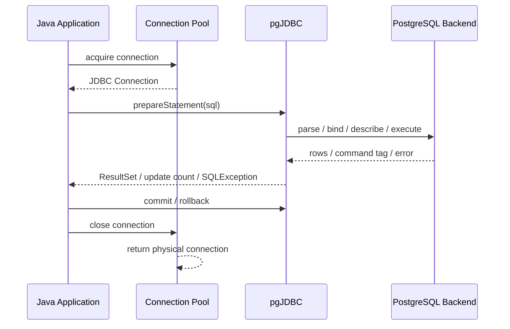
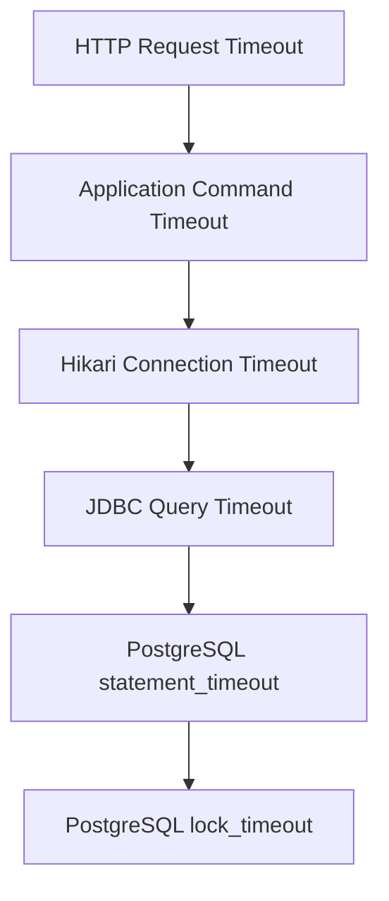

------
title: Learn PostgreSQL in Action - Part 030
description: Production-grade Java integration with PostgreSQL using JDBC and pgJDBC, covering connection URLs, prepared statements, batching, fetch size, streaming, timeouts, transaction boundaries, type mapping, and failure handling.
series: learn-postgresql-in-action
seriesTitle: Learn PostgreSQL in Action
order: 30
partTitle: Java + PostgreSQL with JDBC and pgJDBC
tags:
- postgresql
- java
- jdbc
- pgjdbc
- performance
- transactions
- series
date: 2026-07-01
---

# Part 030 — Java + PostgreSQL with JDBC and pgJDBC

PostgreSQL performance and correctness do not stop at SQL. In a Java system, the database behavior is mediated by the JDBC driver, connection pool, transaction manager, ORM, network, thread model, and error handling strategy.

This part focuses on **pgJDBC**, the PostgreSQL JDBC driver, and how to use it intentionally in production.

We will not repeat basic JDBC syntax. The focus is the boundary where Java decisions affect PostgreSQL execution: prepared statements, batching, fetch size, timeouts, transactions, type mapping, cancellation, retry, and observability.

---

## 1. Problem yang Diselesaikan

Banyak incident PostgreSQL di aplikasi Java bukan disebabkan oleh database engine saja, tetapi oleh cara aplikasi memakai database:

- connection pool terlalu besar atau terlalu kecil;
- transaksi dibuka terlalu lama;
- result set besar dibaca sekaligus ke memory;
- batch insert tidak benar-benar dibatch;
- prepared statement menghasilkan generic plan yang buruk;
- timeout tidak konsisten;
- retry dilakukan pada operasi non-idempotent;
- `timestamp`/timezone salah;
- JSONB diperlakukan sebagai string tanpa kontrak;
- N+1 query dari ORM membuat database overload;
- exception SQLSTATE tidak diklasifikasi;
- query tidak diberi `application_name` sehingga observability buruk.

Tujuan part ini: membuat boundary Java ↔ PostgreSQL menjadi eksplisit dan defensible.

---

## 2. Mental Model: JDBC adalah Protocol Boundary

JDBC bukan hanya library untuk menjalankan SQL. JDBC adalah boundary yang mengubah call Java menjadi PostgreSQL protocol interaction.



Key idea:

> A Java `Connection` from a pool is usually a logical handle to a physical PostgreSQL session. Session-level state can leak if not reset correctly.

Session state includes:

- transaction status;
- isolation level;
- search path;
- role;
- local settings;
- prepared statement cache;
- temporary tables;
- advisory locks;
- listen/notify state.

Karena itu, aplikasi production harus memperlakukan connection sebagai resource berbahaya, bukan object biasa.

---

## 3. Connection URL as Contract

Connection URL harus menyatakan identity, observability, security, dan timeout behavior.

Contoh baseline:

```properties
jdbc:postgresql://db-primary.internal:5432/appdb
  ?ApplicationName=case-service
  &sslmode=require
  &connectTimeout=5
  &socketTimeout=30
  &tcpKeepAlive=true
```

Dalam file config biasanya ditulis satu baris:

```properties
spring.datasource.url=jdbc:postgresql://db-primary.internal:5432/appdb?ApplicationName=case-service&sslmode=require&connectTimeout=5&socketTimeout=30&tcpKeepAlive=true
```

### 3.1 Parameters yang Penting

| Parameter | Fungsi | Catatan |
|---|---|---|
| `ApplicationName` | muncul di `pg_stat_activity` | wajib untuk observability |
| `sslmode` | TLS behavior | gunakan sesuai policy security |
| `connectTimeout` | timeout koneksi awal | bukan query timeout |
| `socketTimeout` | network socket read timeout | guardrail terhadap stuck network |
| `tcpKeepAlive` | enable keepalive | membantu detect dead connection |
| `currentSchema` | default schema | lebih aman daripada mengandalkan `search_path` global |
| `prepareThreshold` | kapan server prepare dipakai | penting untuk plan behavior |
| `defaultRowFetchSize` | default fetch size | berguna untuk streaming read |
| `reWriteBatchedInserts` | rewrite batch insert | berguna untuk bulk insert tertentu |

Jangan memasukkan business logic ke connection URL. Gunakan URL untuk protocol/session behavior, bukan domain behavior.

---

## 4. DataSource over DriverManager

Production Java sebaiknya tidak memakai `DriverManager.getConnection()` langsung untuk request path. Gunakan `DataSource` dan connection pool.

Minimal direct JDBC example untuk lab:

```java
import java.sql.Connection;
import java.sql.DriverManager;
import java.sql.PreparedStatement;
import java.sql.ResultSet;
import java.util.UUID;

public final class CaseLookupExample {
    public static void main(String[] args) throws Exception {
        String url = "jdbc:postgresql://localhost:5432/appdb?ApplicationName=jdbc-lab";

        try (Connection connection = DriverManager.getConnection(url, "app_user", "secret")) {
            UUID tenantId = UUID.fromString("00000000-0000-0000-0000-000000000001");

            String sql = """
                SELECT id, case_number, status
                FROM app.case_file
                WHERE tenant_id = ?
                  AND status = ?
                ORDER BY created_at DESC
                LIMIT 50
                """;

            try (PreparedStatement ps = connection.prepareStatement(sql)) {
                ps.setObject(1, tenantId);
                ps.setString(2, "OPEN");

                try (ResultSet rs = ps.executeQuery()) {
                    while (rs.next()) {
                        System.out.printf(
                            "%s %s %s%n",
                            rs.getObject("id"),
                            rs.getString("case_number"),
                            rs.getString("status")
                        );
                    }
                }
            }
        }
    }
}
```

Production version should rely on pool-managed connections.

---

## 5. Connection Lifecycle Rules

A pooled JDBC connection must be returned quickly and cleanly.

```java
try (Connection connection = dataSource.getConnection()) {
    connection.setAutoCommit(false);

    try {
        // execute SQL work
        connection.commit();
    } catch (Exception ex) {
        connection.rollback();
        throw ex;
    }
}
```

Rules:

- always close logical connection;
- always rollback on failure if transaction is open;
- do not perform HTTP calls inside DB transaction;
- do not keep connection while waiting for user input;
- do not stream a large response while holding write locks;
- do not store `Connection` in fields;
- do not share `Connection` across threads;
- reset session-local state before returning connection if you set it manually.

---

## 6. Transaction Boundary in Java

Auto-commit means every statement is its own transaction. That can be fine for simple reads, but not for workflows requiring invariants.

### 6.1 Explicit Transaction

```java
public void assignCase(UUID caseId, UUID officerId) throws SQLException {
    try (Connection connection = dataSource.getConnection()) {
        connection.setAutoCommit(false);
        connection.setTransactionIsolation(Connection.TRANSACTION_READ_COMMITTED);

        try {
            lockCase(connection, caseId);
            insertAssignment(connection, caseId, officerId);
            appendAuditEvent(connection, caseId, "ASSIGNED");
            connection.commit();
        } catch (SQLException ex) {
            connection.rollback();
            throw ex;
        }
    }
}
```

### 6.2 Transaction Scope Smell

Bad:

```java
connection.setAutoCommit(false);
CaseFile caseFile = loadCase(connection, caseId);
ExternalDecision decision = externalApi.call(caseFile); // slow network call inside transaction
saveDecision(connection, decision);
connection.commit();
```

Better:

```java
CaseFile caseFile = loadCaseReadOnly(caseId);
ExternalDecision decision = externalApi.call(caseFile);
applyDecisionInShortTransaction(caseId, decision);
```

A transaction should protect database invariants, not wrap arbitrary business process duration.

---

## 7. Prepared Statements: Safety and Plan Behavior

Prepared statements solve two separate problems:

1. SQL injection protection through bind parameters.
2. Potential plan/protocol efficiency through statement reuse.

```java
String sql = """
    SELECT id, status
    FROM app.case_file
    WHERE tenant_id = ?
      AND case_number = ?
    """;

try (PreparedStatement ps = connection.prepareStatement(sql)) {
    ps.setObject(1, tenantId);
    ps.setString(2, caseNumber);

    try (ResultSet rs = ps.executeQuery()) {
        ...
    }
}
```

Do not build dynamic values by string concatenation:

```java
// Wrong
String sql = "SELECT * FROM app.case_file WHERE case_number = '" + caseNumber + "'";
```

### 7.1 Dynamic SQL Safely

Values can be parameters. Identifiers cannot.

If sorting field is dynamic, whitelist it.

```java
String orderBy = switch (sortField) {
    case "createdAt" -> "created_at";
    case "priority" -> "priority";
    case "caseNumber" -> "case_number";
    default -> throw new IllegalArgumentException("Unsupported sort field");
};

String sql = """
    SELECT id, case_number, status
    FROM app.case_file
    WHERE tenant_id = ?
    ORDER BY %s DESC
    LIMIT ?
    """.formatted(orderBy);
```

Only identifiers from fixed whitelist may be interpolated.

---

## 8. Server-Side Prepared Statements and `prepareThreshold`

pgJDBC can use server-side prepared statements after a statement crosses a threshold of executions on the same connection.

This can improve repeated execution, but it interacts with PostgreSQL plan selection.

### 8.1 The Trade-Off

| Mode | Benefit | Risk |
|---|---|---|
| Simple one-off statement | flexible plan per literal | more parse/planning overhead |
| Prepared with custom plan | parameter-aware | planning repeated |
| Generic prepared plan | less planning overhead | bad for skewed parameter values |

Generic plan issue example:

```sql
SELECT id, created_at
FROM app.case_file
WHERE tenant_id = $1
  AND status = $2
ORDER BY created_at DESC
LIMIT 50;
```

If tenant sizes vary drastically, one generic plan may be bad for large or small tenants.

### 8.2 Symptoms of Bad Generic Plan

- same query sometimes fast, sometimes slow;
- bad only after warm-up;
- different tenants behave differently;
- `EXPLAIN` with literal values differs from prepared execution;
- `pg_stat_statements` shows high variance.

### 8.3 Controls

At driver level:

```properties
prepareThreshold=0
```

This disables server-side prepare behavior for cases where generic plan risk is worse than planning overhead.

At PostgreSQL session level:

```sql
SET plan_cache_mode = force_custom_plan;
```

Use carefully. Do not globally force custom plans without evidence.

---

## 9. Batching Writes

Batching reduces network round trips and can improve throughput.

```java
String sql = """
    INSERT INTO app.case_event (
        tenant_id, case_id, event_type, payload, created_at
    ) VALUES (?, ?, ?, ?::jsonb, now())
    """;

try (PreparedStatement ps = connection.prepareStatement(sql)) {
    int count = 0;

    for (CaseEvent event : events) {
        ps.setObject(1, event.tenantId());
        ps.setObject(2, event.caseId());
        ps.setString(3, event.type());
        ps.setString(4, event.payloadJson());
        ps.addBatch();

        if (++count % 1000 == 0) {
            ps.executeBatch();
        }
    }

    ps.executeBatch();
}
```

### 9.1 Batch Size

Batch size is a trade-off:

- too small: too many round trips;
- too large: memory pressure, huge transaction, long locks, large WAL burst;
- production-friendly: often hundreds to low thousands depending on row size and constraints.

### 9.2 `reWriteBatchedInserts`

For insert-heavy workload, pgJDBC can rewrite compatible batched inserts into more efficient multi-row inserts.

```properties
jdbc:postgresql://localhost:5432/appdb?reWriteBatchedInserts=true
```

Caveats:

- verify actual performance;
- watch generated keys behavior;
- avoid huge batch transaction;
- ensure error handling can identify failed batch semantics.

### 9.3 Batch Transaction Pattern

```java
connection.setAutoCommit(false);
try {
    executeBatch(connection, batch);
    connection.commit();
} catch (SQLException ex) {
    connection.rollback();
    throw ex;
}
```

Do not batch unbounded data in a single transaction.

---

## 10. Reading Large Result Sets with Fetch Size

Default JDBC behavior can load all rows eagerly depending on driver mode and auto-commit. For large result sets, use cursor-style fetching.

Important rule:

> For PostgreSQL cursor-based fetch behavior, disable auto-commit and set fetch size.

```java
try (Connection connection = dataSource.getConnection()) {
    connection.setAutoCommit(false);

    String sql = """
        SELECT id, case_id, event_type, payload
        FROM app.case_event
        WHERE created_at >= ?
        ORDER BY created_at, id
        """;

    try (PreparedStatement ps = connection.prepareStatement(sql)) {
        ps.setFetchSize(1000);
        ps.setObject(1, fromInstant);

        try (ResultSet rs = ps.executeQuery()) {
            while (rs.next()) {
                processRow(rs);
            }
        }
    }

    connection.commit();
}
```

### 10.1 Streaming Risks

Streaming holds:

- a transaction;
- a snapshot;
- a backend connection;
- possibly resources on server;
- connection pool capacity.

For long exports, consider:

- keyset pagination;
- async job writing to object storage;
- replica read;
- cursor timeout;
- separate pool;
- smaller transaction windows.

---

## 11. Generated Keys

When inserting rows and needing generated IDs:

```java
String sql = """
    INSERT INTO app.case_file (tenant_id, case_number, status)
    VALUES (?, ?, ?)
    RETURNING id
    """;

try (PreparedStatement ps = connection.prepareStatement(sql)) {
    ps.setObject(1, tenantId);
    ps.setString(2, caseNumber);
    ps.setString(3, "OPEN");

    try (ResultSet rs = ps.executeQuery()) {
        if (!rs.next()) {
            throw new SQLException("Insert returned no id");
        }
        UUID id = rs.getObject("id", UUID.class);
    }
}
```

`RETURNING` is explicit and PostgreSQL-native. It also works well for returning computed/generated columns.

---

## 12. Timeout Strategy in Java + PostgreSQL

Timeouts must be consistent across layers.



### 12.1 Connection Acquisition Timeout

This belongs to the pool.

```properties
hikari.connectionTimeout=1000
```

This is not query timeout. It controls how long a request waits to obtain a connection.

### 12.2 JDBC Query Timeout

```java
try (PreparedStatement ps = connection.prepareStatement(sql)) {
    ps.setQueryTimeout(3); // seconds
    ...
}
```

This asks JDBC to cancel the statement after timeout. You still need database-side guardrails.

### 12.3 PostgreSQL Statement Timeout

Set at role/database/session level:

```sql
ALTER ROLE app_runtime SET statement_timeout = '3s';
ALTER ROLE app_runtime SET lock_timeout = '500ms';
ALTER ROLE app_runtime SET idle_in_transaction_session_timeout = '10s';
```

Or per transaction:

```java
try (Statement st = connection.createStatement()) {
    st.execute("SET LOCAL statement_timeout = '3s'");
    st.execute("SET LOCAL lock_timeout = '500ms'");
}
```

Use `SET LOCAL` inside transaction so it automatically resets at transaction end.

### 12.4 Socket Timeout

`socketTimeout` protects against network-level hangs, not normal query planning.

```properties
socketTimeout=30
```

Set it above expected statement timeout to avoid ambiguous network failures before database timeout fires.

---

## 13. Cancellation

A timeout/cancel does not mean business operation safely did not happen.

Cases:

- cancel before execution: no change;
- cancel during execution: statement may be aborted;
- network lost after commit: application may not know commit outcome;
- timeout at HTTP layer: database transaction may still be running unless cancelled.

Design write operations to tolerate unknown outcome:

- idempotency key;
- natural unique constraint;
- request log table;
- outbox event with unique key;
- retry only when operation can be safely repeated.

---

## 14. SQLSTATE-Based Error Classification

Do not parse error message text. Use SQLSTATE.

```java
public enum DbErrorKind {
    UNIQUE_VIOLATION,
    FOREIGN_KEY_VIOLATION,
    CHECK_VIOLATION,
    SERIALIZATION_FAILURE,
    DEADLOCK_DETECTED,
    LOCK_TIMEOUT,
    STATEMENT_TIMEOUT,
    CONNECTION_FAILURE,
    UNKNOWN
}

public static DbErrorKind classify(SQLException ex) {
    return switch (ex.getSQLState()) {
        case "23505" -> DbErrorKind.UNIQUE_VIOLATION;
        case "23503" -> DbErrorKind.FOREIGN_KEY_VIOLATION;
        case "23514" -> DbErrorKind.CHECK_VIOLATION;
        case "40001" -> DbErrorKind.SERIALIZATION_FAILURE;
        case "40P01" -> DbErrorKind.DEADLOCK_DETECTED;
        case "55P03" -> DbErrorKind.LOCK_TIMEOUT;
        case "57014" -> DbErrorKind.STATEMENT_TIMEOUT;
        case "08006", "08003", "08001" -> DbErrorKind.CONNECTION_FAILURE;
        default -> DbErrorKind.UNKNOWN;
    };
}
```

Common SQLSTATE:

| SQLSTATE | Meaning | Typical Response |
|---|---|---|
| `23505` | unique violation | domain conflict / idempotency resolution |
| `23503` | foreign key violation | invalid reference / ordering issue |
| `23514` | check violation | invalid state transition/data |
| `40001` | serialization failure | retry whole transaction |
| `40P01` | deadlock detected | retry whole transaction after jitter |
| `55P03` | lock not available / lock timeout | retry or return busy conflict |
| `57014` | query canceled / statement timeout | return timeout / investigate |
| `08006` | connection failure | retry only if idempotent |

---

## 15. Retry Design

Retry must happen at the correct boundary: the whole transaction, not a single failed statement in the middle of a broken transaction.

```java
public <T> T withSerializableRetry(SqlCallable<T> callable) throws SQLException {
    int maxAttempts = 3;

    for (int attempt = 1; attempt <= maxAttempts; attempt++) {
        try (Connection connection = dataSource.getConnection()) {
            connection.setAutoCommit(false);
            connection.setTransactionIsolation(Connection.TRANSACTION_SERIALIZABLE);

            try {
                T result = callable.call(connection);
                connection.commit();
                return result;
            } catch (SQLException ex) {
                connection.rollback();

                if (isRetryableTransactionError(ex) && attempt < maxAttempts) {
                    sleepWithJitter(attempt);
                    continue;
                }
                throw ex;
            }
        }
    }

    throw new IllegalStateException("unreachable");
}

private boolean isRetryableTransactionError(SQLException ex) {
    return "40001".equals(ex.getSQLState()) || "40P01".equals(ex.getSQLState());
}
```

Rules:

- retry only idempotent or transactionally safe operations;
- retry whole transaction;
- add jitter;
- cap attempts;
- log SQLSTATE and attempt count;
- do not retry constraint violations as if transient.

---

## 16. Savepoints

Savepoints allow partial rollback inside a transaction.

```java
connection.setAutoCommit(false);
Savepoint savepoint = connection.setSavepoint("before_optional_audit");

try {
    insertOptionalAuditRow(connection, audit);
} catch (SQLException ex) {
    connection.rollback(savepoint);
}

updateMainState(connection, command);
connection.commit();
```

Use savepoints sparingly. They are useful for optional work, but too many savepoints can complicate transaction reasoning.

---

## 17. Type Mapping

### 17.1 UUID

Use `UUID`, not string.

```java
ps.setObject(1, tenantId);
UUID id = rs.getObject("id", UUID.class);
```

### 17.2 Numeric

PostgreSQL `numeric` maps naturally to `BigDecimal`.

```java
BigDecimal amount = rs.getBigDecimal("amount");
```

Avoid `double` for money/regulatory quantities.

### 17.3 Timestamp and Timezone

Prefer:

- `Instant` for absolute moment;
- `OffsetDateTime` when offset matters;
- `LocalDate` for date-only domain values;
- avoid `LocalDateTime` for global event time unless semantics are local wall-clock.

```java
ps.setObject(1, OffsetDateTime.now(ZoneOffset.UTC));
OffsetDateTime createdAt = rs.getObject("created_at", OffsetDateTime.class);
```

Design rule:

```text
timestamptz = instant in time
local date/time = human schedule/wall-clock concept
```

### 17.4 JSONB

For JSONB, be explicit.

```java
String sql = """
    INSERT INTO app.case_event (case_id, event_type, payload)
    VALUES (?, ?, ?::jsonb)
    """;

ps.setObject(1, caseId);
ps.setString(2, "CASE_CREATED");
ps.setString(3, objectMapper.writeValueAsString(payload));
```

For frequent predicates, do not repeatedly parse arbitrary JSON in queries. Promote stable attributes into generated columns or relational columns.

### 17.5 Arrays

```java
Array statuses = connection.createArrayOf("text", new String[] {"OPEN", "ESCALATED"});

try (PreparedStatement ps = connection.prepareStatement("""
    SELECT id
    FROM app.case_file
    WHERE status = ANY (?)
    """)) {
    ps.setArray(1, statuses);
    ...
}
```

Use arrays carefully. For large lists, a temp table or join may be better than huge `ANY` parameter.

### 17.6 Enum

Options:

- PostgreSQL enum;
- text + check constraint;
- lookup table;
- Java enum mapped to string.

For systems with frequent enum evolution, `text` + check/domain/migration discipline is often operationally easier than PostgreSQL enum. For stable domain states, PostgreSQL enum can be acceptable.

---

## 18. COPY for Bulk Data

For large ingestion, `COPY` is often more appropriate than row-by-row insert.

Using pgJDBC Copy API requires PostgreSQL-specific API access:

```java
import org.postgresql.PGConnection;
import org.postgresql.copy.CopyManager;

try (Connection connection = dataSource.getConnection()) {
    PGConnection pgConnection = connection.unwrap(PGConnection.class);
    CopyManager copyManager = pgConnection.getCopyAPI();

    try (Reader reader = Files.newBufferedReader(Path.of("case_event.csv"))) {
        copyManager.copyIn(
            "COPY app.case_event (tenant_id, case_id, event_type, payload) FROM STDIN WITH (FORMAT csv, HEADER true)",
            reader
        );
    }
}
```

Use COPY for:

- ingestion jobs;
- data migration;
- backfill;
- bulk import.

Do not use COPY blindly for OLTP command path where per-row validation, authorization, and domain events matter.

---

## 19. Observability from Java

### 19.1 `ApplicationName`

Set it per service.

```properties
ApplicationName=case-service
```

Then PostgreSQL can show:

```sql
SELECT
    application_name,
    state,
    wait_event_type,
    wait_event,
    count(*)
FROM pg_stat_activity
GROUP BY application_name, state, wait_event_type, wait_event
ORDER BY count(*) DESC;
```

### 19.2 Query Tagging

For critical paths, add safe SQL comments.

```java
String sql = """
    /* service=case-service operation=list-open-cases */
    SELECT id, case_number, status
    FROM app.case_file
    WHERE tenant_id = ?
      AND status = 'OPEN'
    ORDER BY created_at DESC
    LIMIT ?
    """;
```

Caveat:

- excessive unique comments can reduce query normalization usefulness;
- avoid putting user IDs, tenant IDs, PII, or request IDs in SQL text;
- use stable operation names.

### 19.3 Metrics to Emit

At application layer:

- connection acquisition time;
- query execution time by operation;
- rows returned;
- batch size;
- SQLSTATE class;
- retry count;
- transaction duration;
- pool active/idle/pending;
- timeout count;
- deadlock/serialization failure count.

---

## 20. Avoiding Session State Leaks

Bad pattern:

```java
try (Statement st = connection.createStatement()) {
    st.execute("SET search_path = tenant_a, app");
}
// connection returned to pool later with modified state
```

Better:

```java
connection.setAutoCommit(false);
try (Statement st = connection.createStatement()) {
    st.execute("SET LOCAL search_path = tenant_a, app");
}
// work
connection.commit(); // SET LOCAL resets
```

Even better for multi-tenant systems: avoid schema-per-tenant unless operationally justified, and prefer explicit tenant predicates/RLS patterns where suitable.

Session state to be careful with:

- `SET ROLE`;
- `SET search_path`;
- `SET statement_timeout`;
- advisory locks;
- temporary tables;
- prepared statements;
- isolation level;
- read-only flag.

---

## 21. Advisory Locks from Java

Advisory locks can coordinate application-level workflows, but they are sharp tools.

Transaction-scoped advisory lock:

```java
String sql = "SELECT pg_try_advisory_xact_lock(?)";

try (PreparedStatement ps = connection.prepareStatement(sql)) {
    ps.setLong(1, lockKey);

    try (ResultSet rs = ps.executeQuery()) {
        rs.next();
        boolean acquired = rs.getBoolean(1);
        if (!acquired) {
            throw new BusyException("Workflow already running");
        }
    }
}
```

Prefer transaction-scoped locks over session-scoped locks in pooled applications.

Why:

- transaction-scoped locks auto-release on commit/rollback;
- session-scoped locks can leak through pool reuse if not carefully released.

---

## 22. LISTEN/NOTIFY Caveat

PostgreSQL `LISTEN/NOTIFY` is useful for lightweight notification, not durable messaging.

In Java systems:

- do not use it as the only event delivery guarantee;
- combine with table-backed outbox if event must not be lost;
- dedicate connection for listener;
- avoid using pooled OLTP connections for long-lived listen loops.

---

## 23. Large Object and Bytea

For most application payloads, prefer external object storage plus reference metadata in PostgreSQL.

Use `bytea` for small binary payloads only when transactional coupling is necessary.

Risks of storing large blobs in PostgreSQL:

- table bloat;
- larger backups;
- heavier WAL;
- slower vacuum;
- higher cache pollution;
- more expensive replication.

---

## 24. Integration with Spring Transactions

Spring hides JDBC boilerplate but does not remove transaction physics.

### 24.1 Common Trap: `@Transactional` Too Wide

```java
@Transactional
public void processCase(UUID caseId) {
    CaseFile file = repository.findById(caseId).orElseThrow();
    ExternalResult result = externalClient.call(file); // bad inside transaction
    file.apply(result);
}
```

Better:

```java
public void processCase(UUID caseId) {
    CaseSnapshot snapshot = loadSnapshot(caseId);
    ExternalResult result = externalClient.call(snapshot);
    applyResult(caseId, result);
}

@Transactional
public void applyResult(UUID caseId, ExternalResult result) {
    CaseFile file = repository.findByIdForUpdate(caseId).orElseThrow();
    file.apply(result);
}
```

### 24.2 Self-Invocation Trap

Spring proxy-based transactions do not apply when a method calls another transactional method on the same instance directly.

Bad:

```java
public void outer() {
    innerTransactional(); // may bypass proxy
}

@Transactional
public void innerTransactional() {
    ...
}
```

Design transaction boundaries at service entry points or use explicit transaction templates for advanced cases.

---

## 25. Production Configuration Example

Example Hikari-style properties:

```properties
spring.datasource.url=jdbc:postgresql://db-primary.internal:5432/appdb?ApplicationName=case-service&sslmode=require&connectTimeout=5&socketTimeout=30&tcpKeepAlive=true
spring.datasource.username=case_runtime
spring.datasource.password=${CASE_DB_PASSWORD}

spring.datasource.hikari.maximumPoolSize=20
spring.datasource.hikari.minimumIdle=5
spring.datasource.hikari.connectionTimeout=1000
spring.datasource.hikari.validationTimeout=1000
spring.datasource.hikari.idleTimeout=600000
spring.datasource.hikari.maxLifetime=1800000
spring.datasource.hikari.leakDetectionThreshold=10000
```

This is not a universal config. It is a shape. Real values depend on:

- DB max connections;
- number of service instances;
- request concurrency;
- query latency;
- transaction duration;
- failover strategy;
- workload separation.

Connection budget:

```text
total_possible_connections
= service_instances × max_pool_size
+ admin connections
+ migration connections
+ job connections
+ replica/maintenance connections
```

This must fit within PostgreSQL capacity, not just `max_connections`.

---

## 26. End-to-End Example: Idempotent Command Handler

Problem: create a case once per external request.

Database constraint:

```sql
CREATE TABLE app.case_request (
    tenant_id uuid NOT NULL,
    idempotency_key text NOT NULL,
    case_id uuid,
    status text NOT NULL,
    created_at timestamptz NOT NULL DEFAULT now(),
    completed_at timestamptz,
    PRIMARY KEY (tenant_id, idempotency_key)
);
```

Java command:

```java
public UUID createCase(CreateCaseCommand command) throws SQLException {
    return withTransaction(connection -> {
        UUID existing = findExistingCase(connection, command.tenantId(), command.idempotencyKey());
        if (existing != null) {
            return existing;
        }

        insertRequestMarker(connection, command.tenantId(), command.idempotencyKey());
        UUID caseId = insertCase(connection, command);
        completeRequestMarker(connection, command.tenantId(), command.idempotencyKey(), caseId);
        insertOutboxEvent(connection, caseId, "CASE_CREATED");
        return caseId;
    });
}
```

Why this matters:

- retry after connection failure can resolve by idempotency key;
- unique constraint handles concurrency;
- outbox event is committed with state;
- Java does not rely on “did timeout mean rollback?” guesswork.

---

## 27. Performance Checklist for JDBC Code Review

```text
[ ] Does every SQL path use bind parameters?
[ ] Are dynamic identifiers whitelisted?
[ ] Is transaction scope minimal?
[ ] Are external calls outside DB transaction?
[ ] Are large result sets using fetch size or keyset pagination?
[ ] Are write batches bounded?
[ ] Is idempotency defined for retryable commands?
[ ] Are SQLSTATEs classified?
[ ] Are statement/lock/socket/pool timeouts aligned?
[ ] Is application_name set?
[ ] Are connection pool metrics exported?
[ ] Is session state reset or SET LOCAL used?
[ ] Are tenant/security settings safe under pooling?
[ ] Does code avoid sharing Connection across threads?
[ ] Are generated IDs handled explicitly with RETURNING?
[ ] Are PostgreSQL-specific types mapped intentionally?
```

---

## 28. Failure Modes

### 28.1 Connection Leak

Symptom:

- Hikari active connections rise and never fall;
- database sessions idle but pool exhausted;
- request eventually times out acquiring connection.

Fix:

- use try-with-resources;
- enable leak detection;
- reduce transaction scope;
- inspect code paths that return early/throw.

### 28.2 Idle in Transaction

Symptom:

```sql
SELECT *
FROM pg_stat_activity
WHERE state = 'idle in transaction';
```

Impact:

- holds snapshot;
- blocks vacuum cleanup;
- may hold locks;
- consumes connection.

Fix:

- enforce transaction timeout;
- fix application boundary;
- avoid interactive work inside transaction.

### 28.3 Batch Too Large

Symptom:

- memory pressure;
- large WAL spike;
- lock duration high;
- rollback expensive;
- replica lag.

Fix:

- chunk batch;
- commit periodically;
- ensure idempotent resume;
- throttle job.

### 28.4 Streaming Export Starves Pool

Symptom:

- export endpoint holds connection for minutes;
- OLTP request cannot acquire connection;
- database shows long transaction.

Fix:

- separate export pool;
- use job-based export;
- read from replica;
- keyset chunking;
- object storage output.

### 28.5 Retry Storm

Symptom:

- transient DB issue causes all app nodes to retry immediately;
- database overload worsens.

Fix:

- exponential backoff;
- jitter;
- circuit breaker;
- concurrency limit;
- idempotency.

---

## 29. Hands-On Lab

### Lab 1 — Fetch Size

1. Create table with 1 million rows.
2. Read all rows with default behavior.
3. Read with `autoCommit=false` and `setFetchSize(1000)`.
4. Compare application memory and duration.
5. Observe transaction duration in `pg_stat_activity`.

Learning:

- streaming saves memory but holds transaction/connection.

### Lab 2 — Batch Insert

1. Insert 100k rows one by one.
2. Insert with `addBatch()` every 500 rows.
3. Enable `reWriteBatchedInserts=true`.
4. Compare duration and WAL.

Learning:

- batching reduces round trips;
- huge batches create different risks.

### Lab 3 — Lock Timeout Handling

1. Session A locks a row.
2. Java update tries to lock same row with `lock_timeout='500ms'`.
3. Classify SQLSTATE.
4. Retry with jitter.

Learning:

- lock timeout is normal operational event, not always fatal system failure.

### Lab 4 — Generic Plan Sensitivity

1. Create skewed tenant data.
2. Execute same prepared statement repeatedly.
3. Compare tenant small vs large.
4. Test `prepareThreshold=0` or `plan_cache_mode=force_custom_plan`.
5. Measure difference.

Learning:

- prepared statements are not automatically faster for all parameter distributions.

### Lab 5 — Idempotent Create

1. Implement create command with idempotency key.
2. Simulate connection failure after commit.
3. Retry same command.
4. Confirm same case ID is returned.

Learning:

- retry safety is a schema/application design problem.

---

## 30. Self-Correction Checklist

Before approving Java/PostgreSQL integration code:

```text
[ ] What is the transaction boundary?
[ ] What database invariant does the transaction protect?
[ ] What happens if commit succeeds but response is lost?
[ ] What SQLSTATEs are retryable?
[ ] Does retry repeat the whole transaction?
[ ] Are all parameters bound safely?
[ ] Is dynamic SQL whitelisted?
[ ] Are large reads streamed or paginated?
[ ] Does streaming hold a connection too long?
[ ] Are timeouts layered correctly?
[ ] Is connection pool size within database budget?
[ ] Are batch sizes bounded?
[ ] Does query shape match indexes?
[ ] Is `application_name` set?
[ ] Are pool metrics monitored?
[ ] Could session state leak across requests?
```

---

## 31. Takeaways

- JDBC is a protocol/session boundary, not just a SQL execution API.
- A pooled connection must be treated as dangerous shared infrastructure.
- Prepared statements protect against injection, but server-side prepare can interact with plan selection.
- Batching improves throughput but increases transaction/WAL/lock risk if unbounded.
- Fetch size can prevent memory blowup, but streaming holds a transaction and connection.
- Timeout hierarchy must align across HTTP, pool, JDBC, and PostgreSQL.
- SQLSTATE classification is mandatory for reliable retry and domain error mapping.
- Retry must happen at the whole-transaction boundary.
- PostgreSQL-specific types should be mapped intentionally, not accidentally.
- Idempotency is the application answer to unknown commit outcomes.

Next, we will move one layer up: connection pooling, HikariCP strategy, backpressure, pool sizing, leak detection, and how to prevent Java concurrency from overwhelming PostgreSQL.
