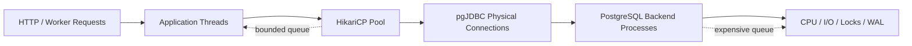
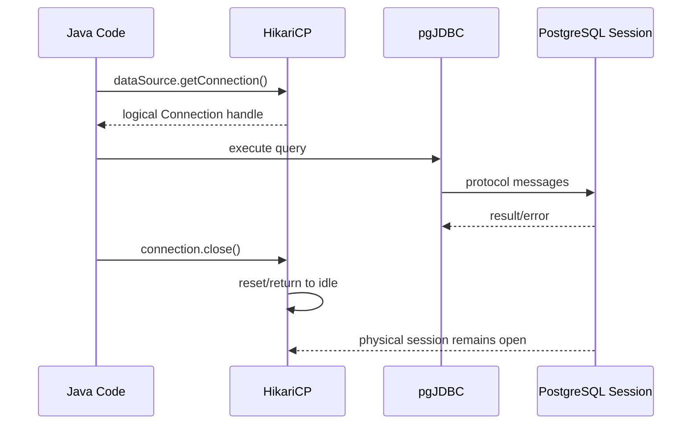
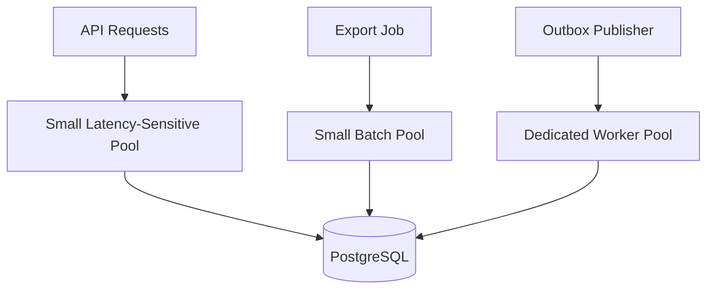
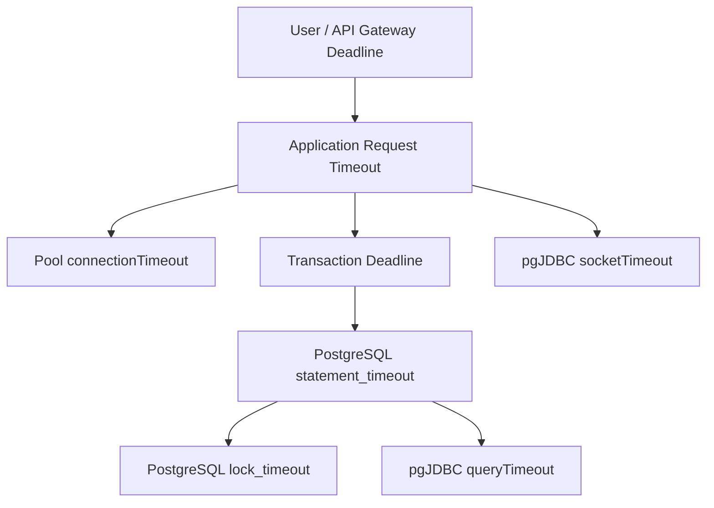
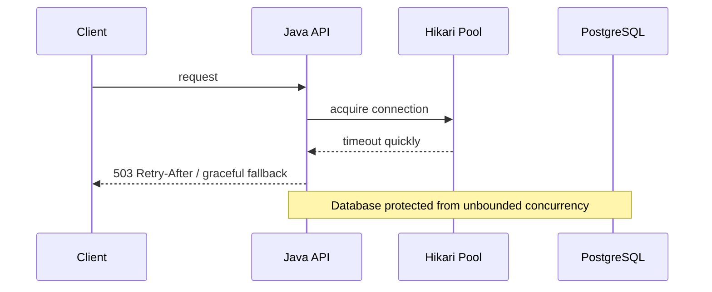
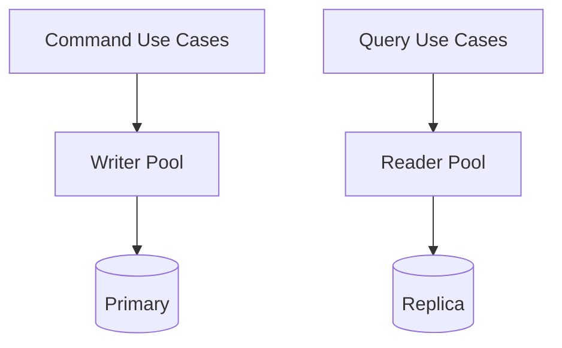

------
title: Learn PostgreSQL in Action - Part 031
description: Production-grade connection pooling, backpressure, timeout hierarchy, leak detection, pool sizing, and HikariCP strategy for Java applications using PostgreSQL.
series: learn-postgresql-in-action
seriesTitle: Learn PostgreSQL in Action
order: 31
partTitle: Connection Pooling, Backpressure, and HikariCP Strategy
tags:
- postgresql
- java
- hikaricp
- jdbc
- connection-pooling
- performance
- backpressure
- series
date: 2026-07-01
---

# Part 031 — Connection Pooling, Backpressure, and HikariCP Strategy

A PostgreSQL connection pool is not just a performance optimization. In a serious Java system, it is a **concurrency governor**, a **failure isolation boundary**, and a **backpressure mechanism**.

Many teams treat HikariCP as a default Spring Boot dependency and only tune `maximumPoolSize`. That is too shallow. A pool controls how many requests are allowed to occupy PostgreSQL backend sessions at the same time. If the pool is oversized, PostgreSQL becomes the queue. If the pool is undersized, the application becomes the queue. Only one of those two queues is usually observable, controllable, and cheap to fail fast.

This part builds the production mental model for connection pooling with PostgreSQL and Java.

---

## 1. Problem yang Diselesaikan

Symptoms yang sering terlihat di production:

- API latency naik, tetapi CPU database tidak selalu penuh;
- `HikariPool - Connection is not available` muncul saat traffic spike;
- query sederhana tiba-tiba lambat karena semua connection sedang dipakai slow request;
- thread aplikasi menunggu connection, lalu request timeout bersamaan;
- `max_connections` PostgreSQL dinaikkan terus, tetapi throughput tidak membaik;
- database penuh session `idle in transaction`;
- autovacuum terganggu oleh transaksi panjang;
- failover selesai, tetapi aplikasi tetap memakai connection lama;
- pool size per service masuk akal, tetapi total connection seluruh replica service melebihi budget database;
- incident dikira “database down”, padahal pool starvation.

Target part ini: mampu mendesain pool sebagai boundary yang eksplisit, terukur, dan aman.

---

## 2. Kaufman Skill Deconstruction

Untuk menguasai connection pooling, pecah skill menjadi sub-skill berikut.

| Sub-skill | Yang Harus Dikuasai | Bukti Kompetensi |
|---|---|---|
| Connection lifecycle | Logical vs physical connection, session state, transaction state | Bisa menjelaskan apa yang terjadi saat `Connection.close()` pada pooled connection |
| Pool sizing | Budget total connection lintas service | Bisa menghitung total potential DB sessions dari seluruh pod/instance |
| Timeout hierarchy | Request, pool, query, lock, socket, transaction timeout | Bisa membuat timeout ladder tanpa timeout saling bertabrakan |
| Backpressure | Fail fast vs queue panjang | Bisa menjelaskan kenapa pool kecil kadang lebih sehat daripada pool besar |
| Leak diagnosis | Connection tidak dikembalikan, long transaction, blocked query | Bisa membedakan leak nyata vs query lama |
| Observability | Hikari metrics + PostgreSQL views | Bisa menghubungkan `pendingThreads` dengan `pg_stat_activity` |
| Failure recovery | restart DB, failover, broken sockets | Bisa merancang max lifetime, keepalive, retry, dan readiness behavior |

---

## 3. Mental Model: Pool adalah Queue di Depan Database



Setiap request yang butuh database harus melewati pool. Pool punya dua resource penting:

1. **available connection** — connection idle yang bisa dipinjam;
2. **wait queue** — request/thread yang menunggu connection.

PostgreSQL juga punya queue internal:

- lock wait;
- I/O wait;
- CPU run queue;
- WAL flush wait;
- connection accept backlog;
- replication wait;
- autovacuum competition.

Prinsipnya:

> Lebih baik request menunggu sebentar di pool aplikasi, dengan timeout jelas, daripada membuat database menerima terlalu banyak concurrent sessions sampai semua query saling memperlambat.

---

## 4. Logical Connection vs Physical Session

Pada HikariCP, aplikasi biasanya menerima `java.sql.Connection` yang secara logical dipinjam dari pool. Ketika aplikasi memanggil `close()`, physical connection tidak benar-benar ditutup; connection dikembalikan ke pool.



Implication:

- `Connection.close()` wajib dipanggil, biasanya via `try-with-resources` atau transaction manager;
- session state bisa bocor jika pool/driver tidak mengembalikan state;
- temporary table, prepared statement, advisory lock, `search_path`, isolation, timezone, dan role/session setting harus dipakai hati-hati;
- connection pool tidak mengurangi jumlah query buruk, hanya mengatur concurrency query tersebut.

---

## 5. Anti-Mental Model: “More Connections = More Throughput”

Ini asumsi yang sering salah.

Menambah connection bisa membantu jika bottleneck sebelumnya adalah kurangnya concurrency untuk memanfaatkan database. Tetapi setelah titik tertentu, connection tambahan hanya menambah:

- context switching;
- memory per backend;
- lock contention;
- buffer churn;
- WAL pressure;
- query plan competition;
- tail latency;
- recovery complexity saat failover.

Untuk PostgreSQL, setiap client connection ditangani oleh backend process. Jadi connection bukan object ringan seperti pointer di aplikasi.

Correct framing:

> Pool size adalah batas maksimum concurrent database work dari satu aplikasi instance, bukan angka “kapasitas request”.

---

## 6. Connection Budget Model

Jangan sizing pool per service secara lokal saja. Hitung secara global.

```text
potential_connections = sum(service_instance_count * maxPoolSize_per_instance)
```

Tambahkan juga:

- migration job;
- batch job;
- admin session;
- BI/reporting tool;
- replica/replication connection;
- connection dari background worker;
- emergency access;
- observability tooling;
- pgbouncer jika dipakai;
- failover window ketika old dan new pool overlap.

Example:

```text
orders-service:     12 pods * 12 connections = 144
payment-service:     8 pods * 10 connections = 80
case-service:       10 pods * 10 connections = 100
scheduler:           2 pods *  4 connections = 8
migration/admin:                               10
reserved/emergency:                            20
-------------------------------------------------
total possible:                              362
```

Jika PostgreSQL `max_connections = 300`, konfigurasi ini sudah salah sebelum traffic masuk.

---

## 7. Database Capacity Bukan Sama dengan `max_connections`

`max_connections` adalah admission limit, bukan throughput guarantee.

Aplikasi boleh saja connect 300 session, tetapi database mungkin hanya mampu menjalankan 20–60 active query secara efisien tergantung:

- CPU core;
- storage latency;
- memory;
- workload read/write ratio;
- query complexity;
- lock contention;
- working set size;
- checkpoint/WAL pressure;
- autovacuum pressure;
- replica topology.

Jadi ada tiga angka berbeda:

| Angka | Makna |
|---|---|
| `max_connections` | batas koneksi yang diterima PostgreSQL |
| total pool capacity | maksimum connection yang bisa diminta semua aplikasi |
| efficient active queries | jumlah query bersamaan yang benar-benar meningkatkan throughput |

Top 1% engineer tidak hanya bertanya: “berapa max connection?”

Mereka bertanya:

> Berapa banyak concurrent database work yang bisa kita izinkan sebelum latency P95/P99 merusak SLO?

---

## 8. Pool Sizing Strategy

Gunakan langkah berikut.

### 8.1 Mulai dari Workload, Bukan Dari Default

Inventory:

- request rate;
- query per request;
- average DB time per request;
- P95/P99 DB time;
- transaction duration;
- blocking/lock rate;
- CPU/IO headroom database;
- number of app instances;
- background jobs;
- spike behavior.

Approximation awal:

```text
needed_concurrency ≈ arrival_rate_per_instance * average_db_hold_time_seconds
```

Example:

```text
200 request/s per instance
average connection hold time = 30 ms = 0.03 s
needed average connection concurrency = 200 * 0.03 = 6
```

Tetapi angka ini hanya average. Tambahkan margin untuk variance, bukan untuk query buruk tanpa batas.

### 8.2 Pisahkan Connection Hold Time dari Query Time

Connection hold time mencakup:

- waktu menjalankan query;
- waktu aplikasi memproses result set sebelum commit/close;
- waktu menunggu remote service di tengah transaksi;
- waktu serialization/deserialization;
- lazy loading tambahan;
- lock wait.

Target:

> Keep connection hold time close to actual database work time.

Jangan lakukan ini:

```java
@Transactional
public Receipt checkout(Command command) {
    Order order = orderRepository.findById(command.orderId()).orElseThrow();

    // Bad: remote call while DB transaction and connection are open
    PaymentResult payment = paymentClient.charge(command.payment());

    order.markPaid(payment.reference());
    return receiptMapper.toReceipt(order);
}
```

Lebih sehat:

```java
public Receipt checkout(Command command) {
    Reservation reservation = txTemplate.execute(status ->
        orderService.reserveInventory(command.orderId())
    );

    PaymentResult payment = paymentClient.charge(command.payment());

    return txTemplate.execute(status ->
        orderService.confirmPayment(reservation.id(), payment.reference())
    );
}
```

Boundary tidak selalu sesederhana itu karena invariant bisa butuh atomicity. Tetapi prinsipnya: jangan menahan connection saat melakukan kerja non-database jika tidak benar-benar perlu.

### 8.3 Gunakan Pool Sebagai Bulkhead

Jika satu service punya dua workload berbeda, pertimbangkan pool terpisah:

- API latency-sensitive;
- background report/export;
- CDC/outbox publisher;
- migration/batch;
- admin/internal tooling.



Tanpa bulkhead, export query bisa menghabiskan semua connection API.

---

## 9. HikariCP Configuration: Essentials

Contoh Spring Boot baseline:

```yaml
spring:
  datasource:
    url: jdbc:postgresql://postgres.example.internal:5432/appdb?ApplicationName=case-service&tcpKeepAlive=true
    username: case_service_app
    password: ${DB_PASSWORD}
    hikari:
      pool-name: case-service-writer
      maximum-pool-size: 12
      minimum-idle: 12
      connection-timeout: 750ms
      validation-timeout: 1000ms
      idle-timeout: 0
      max-lifetime: 1800000
      keepalive-time: 300000
      leak-detection-threshold: 10000
```

Penjelasan praktis:

| Setting | Makna | Guidance |
|---|---|---|
| `maximumPoolSize` | maksimum connection fisik dalam pool | mulai kecil, ukur, lalu naikkan berbasis evidence |
| `minimumIdle` | jumlah idle minimum | untuk fixed-size pool, samakan dengan max; untuk elastic pool, lebih kecil |
| `connectionTimeout` | waktu maksimal menunggu connection dari pool | pendek; ini backpressure signal |
| `validationTimeout` | waktu maksimal validasi connection | harus lebih kecil dari connection timeout |
| `idleTimeout` | berapa lama idle connection boleh hidup sebelum dipensiunkan | tidak relevan jika fixed-size pool |
| `maxLifetime` | umur maksimum physical connection | harus lebih pendek dari timeout jaringan/load balancer/server |
| `keepaliveTime` | ping berkala agar connection tidak mati diam-diam | berguna di network yang memutus idle TCP |
| `leakDetectionThreshold` | log jika connection dipinjam terlalu lama | diagnostic, bukan solusi performa |
| `poolName` | nama pool dalam log/metrics | wajib untuk multi-pool/multi-service observability |

Important:

- `connectionTimeout` bukan query timeout;
- `maxLifetime` bukan transaction timeout;
- `leakDetectionThreshold` bukan bukti pasti leak;
- `minimumIdle` terlalu kecil bisa menambah latency saat spike karena connection creation mahal;
- `maximumPoolSize` terlalu besar bisa memindahkan overload ke PostgreSQL.

---

## 10. Fixed-Size vs Elastic Pool

Untuk banyak service OLTP, fixed-size pool lebih mudah diprediksi.

```yaml
maximum-pool-size: 12
minimum-idle: 12
idle-timeout: 0
```

Keuntungan:

- connection budget stabil;
- warm pool;
- latency acquisition lebih predictable;
- tidak ada spike connection creation saat traffic naik.

Elastic pool:

```yaml
maximum-pool-size: 20
minimum-idle: 4
idle-timeout: 600000
```

Cocok jika:

- workload sporadis;
- connection mahal secara total;
- startup storm harus dikurangi;
- service jarang memakai DB.

Risiko elastic pool:

- spike pertama lebih lambat;
- connection churn;
- lebih sulit membaca capacity;
- database bisa menerima connection burst saat banyak instance scale up bersamaan.

---

## 11. Timeout Hierarchy

Timeout harus membentuk ladder yang konsisten.



Salah satu konfigurasi buruk:

```text
API gateway timeout:       30s
application timeout:       none
Hikari connectionTimeout:  30s
statement_timeout:         none
socketTimeout:             none
lock_timeout:              none
```

Jika database overload, semua layer menunggu terlalu lama dan failure menjadi synchronized.

Baseline yang lebih sehat untuk OLTP latency-sensitive:

```text
API gateway deadline:        5s
application request timeout: 4.5s
pool connectionTimeout:      500ms - 1s
transaction timeout:         3s - 4s
statement_timeout:           2s - 3s
lock_timeout:                100ms - 500ms for hot paths
socketTimeout:               slightly above statement timeout, unless used as network-failure detector
```

Ini bukan angka universal. Yang penting adalah urutan dan maksudnya.

---

## 12. PostgreSQL-Side Timeouts

Set di level role/database/service, bukan hanya di aplikasi.

```sql
ALTER ROLE case_service_app SET statement_timeout = '3s';
ALTER ROLE case_service_app SET lock_timeout = '500ms';
ALTER ROLE case_service_app SET idle_in_transaction_session_timeout = '10s';
ALTER ROLE case_service_app SET application_name = 'case-service';
```

Untuk workload batch, gunakan role berbeda:

```sql
ALTER ROLE case_service_batch SET statement_timeout = '15min';
ALTER ROLE case_service_batch SET lock_timeout = '2s';
ALTER ROLE case_service_batch SET idle_in_transaction_session_timeout = '30s';
```

Prinsip:

> Timeout adalah bagian dari contract antara aplikasi dan database. Jangan biarkan satu role melayani semua workload.

---

## 13. Timeout Semantics yang Sering Tertukar

| Timeout | Layer | Ketika Terpicu | Failure Meaning |
|---|---|---|---|
| Hikari `connectionTimeout` | pool | aplikasi tidak bisa mendapat connection dari pool | pool full/starved; bukan selalu DB down |
| pgJDBC `connectTimeout` | network/driver | membuat socket connection baru terlalu lama | host unreachable/slow network/startup |
| pgJDBC `socketTimeout` | network/driver | read dari socket terlalu lama | query lama, network hang, atau server tidak merespons |
| JDBC `queryTimeout` | driver/statement | statement berjalan terlalu lama | cancel dikirim ke server |
| PostgreSQL `statement_timeout` | server | statement melebihi durasi server-side | query dibatalkan oleh server |
| PostgreSQL `lock_timeout` | server | menunggu lock terlalu lama | contention, bukan query CPU/IO lambat |
| PostgreSQL `idle_in_transaction_session_timeout` | server | session idle tapi transaksi masih terbuka | aplikasi menahan transaction boundary |

---

## 14. Backpressure Strategy

Jika pool penuh, ada tiga pilihan:

1. tunggu lama;
2. fail fast;
3. degrade gracefully.

Untuk API OLTP, pilihan yang sering lebih baik:

- `connectionTimeout` pendek;
- return `503` atau domain-specific temporary failure;
- client retry dengan jitter jika operasi idempotent;
- circuit breaker pada endpoint yang dependency DB-nya sedang overload;
- queue hanya untuk workflow yang memang asynchronous.

Jangan membuat semua request menunggu 30 detik lalu timeout bersamaan. Itu menghasilkan retry storm.



---

## 15. Pool Exhaustion: Diagnostic Workflow

Saat muncul error seperti:

```text
HikariPool-1 - Connection is not available, request timed out after 750ms.
```

Jangan langsung naikkan `maximumPoolSize`.

### 15.1 Pertanyaan Pertama

- Apakah active connections = max pool?
- Apakah pending threads naik?
- Apakah database CPU tinggi?
- Apakah query sedang blocked lock?
- Apakah connection idle in transaction?
- Apakah ada endpoint baru dengan transaksi panjang?
- Apakah ada N+1 query?
- Apakah ada remote call di tengah `@Transactional`?
- Apakah traffic naik atau DB time per request naik?

### 15.2 Query PostgreSQL

```sql
SELECT
    application_name,
    state,
    wait_event_type,
    wait_event,
    count(*)
FROM pg_stat_activity
WHERE datname = current_database()
GROUP BY application_name, state, wait_event_type, wait_event
ORDER BY count(*) DESC;
```

Connection yang sedang menunggu lock:

```sql
SELECT
    a.pid,
    a.application_name,
    a.usename,
    a.state,
    a.wait_event_type,
    a.wait_event,
    now() - a.query_start AS query_age,
    now() - a.xact_start AS xact_age,
    pg_blocking_pids(a.pid) AS blockers,
    left(a.query, 500) AS query
FROM pg_stat_activity a
WHERE a.wait_event_type = 'Lock'
ORDER BY query_age DESC;
```

Idle transaction:

```sql
SELECT
    pid,
    application_name,
    state,
    now() - xact_start AS xact_age,
    now() - state_change AS idle_age,
    left(query, 500) AS last_query
FROM pg_stat_activity
WHERE state = 'idle in transaction'
ORDER BY xact_age DESC;
```

### 15.3 Hikari Metrics yang Harus Ada

Expose via Micrometer/Prometheus:

- active connections;
- idle connections;
- total connections;
- pending threads;
- connection acquisition time;
- connection usage time;
- connection creation time;
- timeout count;
- max pool size;
- min idle;
- pool name.

Interpretasi:

| Signal | Meaning |
|---|---|
| active=max, pending naik, DB CPU rendah | kemungkinan lock, slow remote call in tx, leak, atau query blocked |
| active=max, DB CPU tinggi | database saturated; pool melindungi DB |
| active rendah, pending naik | kemungkinan pool health/check/creation issue atau thread starvation |
| usage time naik | connection ditahan lama oleh transaksi/request |
| acquisition time naik | pool queue mulai terbentuk |
| creation time naik | DB/network lambat membuat connection baru |

---

## 16. Connection Leak vs Long Legitimate Transaction

Leak detection hanya mengatakan connection dipinjam lebih lama dari threshold. Itu bisa berarti:

- connection benar-benar tidak dikembalikan;
- query memang lama;
- transaction blocked lock;
- kode melakukan remote call sambil memegang connection;
- result set besar diproses streaming terlalu lama;
- batch job memegang transaction besar;
- thread stuck.

Contoh leak nyata:

```java
Connection connection = dataSource.getConnection();
PreparedStatement ps = connection.prepareStatement("select 1");
ResultSet rs = ps.executeQuery();
// no close in error path
```

Benar:

```java
try (Connection connection = dataSource.getConnection();
     PreparedStatement ps = connection.prepareStatement("select 1");
     ResultSet rs = ps.executeQuery()) {
    while (rs.next()) {
        // process
    }
}
```

Dalam Spring/Hibernate, leak lebih sering berupa boundary transaksi buruk daripada lupa `close()` manual.

Bad:

```java
@Transactional
public void exportCsv(OutputStream out) {
    repository.findAllForExport().forEach(row -> {
        csvWriter.write(out, row); // slow client IO while connection is held
    });
}
```

Better:

- export ke file/background job;
- read-only transaction dengan cursor/fetch size;
- batch page by keyset;
- jangan memegang transaction selama client download lambat.

---

## 17. Session State Leak

Pooled connection adalah physical PostgreSQL session yang dipakai ulang. Jangan sembarang set session state.

Risky:

```sql
SET search_path = tenant_123, public;
SET ROLE admin_role;
SET statement_timeout = '30min';
```

Jika tidak di-reset, request berikutnya bisa berjalan dengan setting salah.

Lebih aman:

```sql
SET LOCAL statement_timeout = '2s';
SET LOCAL app.tenant_id = 'tenant-a';
```

`SET LOCAL` berlaku hanya selama transaksi berjalan.

Pattern Java:

```java
@Transactional
public CaseView findCase(UUID tenantId, UUID caseId) {
    jdbcTemplate.update("select set_config('app.tenant_id', ?, true)", tenantId.toString());
    return repository.findCase(caseId);
}
```

Parameter ketiga `true` pada `set_config` berarti local untuk transaksi saat ini.

---

## 18. Prepared Statement Cache dan Pool Size

pgJDBC prepared statement cache bersifat per physical connection. Jika pool size besar, cache total juga membesar.

```text
per_connection_statement_cache * pool_size * service_instances
```

Implication:

- pool besar memperbanyak prepared statement cache;
- query dengan banyak variasi SQL literal bisa memenuhi cache;
- ORM yang membuat dynamic SQL berlebihan memperburuk churn;
- generic plan vs custom plan issue bisa muncul pada query dengan parameter skew.

Tuning bukan hanya:

```text
preparedStatementCacheQueries = bigger
```

Tuning yang benar:

- stabilkan query shape;
- bind parameter, jangan string interpolation;
- ukur `pg_stat_statements`;
- cek plan per parameter ekstrem;
- untuk query skewed, pertimbangkan query rewrite, partial index, atau specialized path.

---

## 19. Read Pool dan Write Pool

Jika aplikasi memakai primary dan replica, jangan campur sembarangan.



Risiko read pool:

- replica lag menyebabkan read-your-write violation;
- failover membuat old primary read-only atau unreachable;
- query reporting bisa mengganggu replica apply WAL;
- hot standby conflict bisa membatalkan query;
- application-level routing bisa salah saat transaction read/write bercampur.

Rule praktis:

- command path pakai primary;
- read-after-write critical pakai primary atau consistency token;
- reporting bisa ke replica dengan SLO berbeda;
- pool name harus membedakan writer/reader;
- metrics harus dipisah.

---

## 20. Readiness, Liveness, dan Pool Initialization

Jangan jadikan liveness probe tergantung database. Jika database lambat, orchestrator bisa membunuh semua pod dan membuat recovery lebih buruk.

Recommended framing:

| Probe | Should Depend on DB? | Reason |
|---|---|---|
| liveness | biasanya tidak | proses hidup meski DB sementara gagal |
| readiness | boleh, dengan timeout pendek dan jitter | hanya route traffic jika dependency minimum tersedia |
| startup | boleh, untuk migration/init tertentu | hindari menerima traffic sebelum siap |

Readiness query:

```sql
SELECT 1;
```

Tetapi jangan terlalu sering sehingga health check sendiri menjadi workload.

---

## 21. Startup Storm dan Deployment

Saat rolling deployment, banyak pod baru bisa membuka pool bersamaan.

Jika:

```text
100 pods * 20 maxPoolSize = 2000 potential new connections
```

Maka startup bisa menyerang PostgreSQL bahkan sebelum traffic normal.

Mitigation:

- batasi rollout concurrency;
- gunakan `minimumIdle` realistis;
- gunakan jitter readiness;
- pastikan `max_connections` budget cukup;
- gunakan PgBouncer jika topology membutuhkan session fan-in;
- hindari migration berat bersamaan startup aplikasi;
- pisahkan migration job dari app startup.

---

## 22. PgBouncer: Kapan Dipakai?

PgBouncer berguna saat terlalu banyak client connection ke PostgreSQL dan aplikasi membutuhkan connection multiplexing.

Mode umum:

| Mode | Behavior | Compatibility |
|---|---|---|
| session pooling | connection server ditempel selama client session | paling compatible |
| transaction pooling | server connection dikembalikan setelah transaction selesai | lebih hemat, tetapi session state berbahaya |
| statement pooling | per statement | jarang cocok untuk aplikasi kompleks |

Dengan transaction pooling, hati-hati terhadap:

- prepared statements;
- session-level advisory locks;
- temp tables;
- `LISTEN/NOTIFY`;
- `SET` session;
- cursors;
- transaction assumptions dari ORM.

Untuk Hibernate/JPA, PgBouncer transaction pooling bisa tricky. Jangan pakai tanpa compatibility test.

---

## 23. Pool dan Long-Running Jobs

Background jobs sering menjadi penyebab pool starvation.

Bad:

```java
@Transactional
public void recomputeAllCases() {
    List<CaseEntity> cases = repository.findAll();
    for (CaseEntity c : cases) {
        recompute(c);
    }
}
```

Problems:

- satu transaksi besar;
- satu connection ditahan lama;
- persistence context membengkak;
- lock lama;
- vacuum terganggu;
- rollback mahal;
- pool slot hilang untuk durasi panjang.

Better:

```java
public void recomputeAllCases() {
    UUID lastId = null;
    while (true) {
        List<UUID> ids = txTemplate.execute(status ->
            repository.findNextIds(lastId, 500)
        );
        if (ids.isEmpty()) break;

        for (UUID id : ids) {
            txTemplate.executeWithoutResult(status -> recomputeOne(id));
            lastId = id;
        }
    }
}
```

Gunakan dedicated pool/role untuk batch.

---

## 24. Common Failure Modes

### 24.1 Pool Too Large

Symptoms:

- PostgreSQL CPU high;
- context switching high;
- query latency naik semua;
- lock wait lebih panjang;
- throughput tidak naik;
- P99 buruk;
- autovacuum kalah resource.

Fix:

- turunkan pool;
- tune query/index;
- pisahkan workload;
- gunakan queue asynchronous;
- enforce timeout.

### 24.2 Pool Too Small

Symptoms:

- pending threads naik;
- DB CPU rendah;
- acquisition timeout;
- active connection selalu max;
- query cepat ketika mendapat connection.

Fix:

- cek hold time dulu;
- naikkan pool sedikit jika DB punya headroom;
- kurangi transaksi panjang;
- pisahkan batch workload.

### 24.3 Connection Leak

Symptoms:

- active connection naik lalu tidak turun;
- pending threads naik;
- database query activity tidak sebanding;
- leak detection log muncul.

Fix:

- trace stack leak detection;
- audit manual JDBC;
- cari transaction boundary yang tidak selesai;
- cek thread dump;
- enforce transaction timeout.

### 24.4 Idle in Transaction

Symptoms:

- `pg_stat_activity.state = 'idle in transaction'`;
- xact age tinggi;
- vacuum tidak bisa cleanup;
- bloat meningkat;
- locks tertahan.

Fix:

- set `idle_in_transaction_session_timeout`;
- cari code path yang membuka transaction sebelum input/remote call;
- disable Open Session in View untuk write-heavy service;
- pastikan streaming/export tidak menggantung transaction.

### 24.5 Broken Connection After Failover

Symptoms:

- errors bertahan setelah DB sudah promoted;
- pool berisi stale connection;
- read-only errors pada old primary;
- transaction commit outcome unknown.

Fix:

- `maxLifetime` dan keepalive sehat;
- retry hanya untuk safe/idempotent operation;
- classify SQLSTATE;
- invalidate pool on fatal connection error;
- readiness check ke writer endpoint.

---

## 25. Reference Configuration Profiles

### 25.1 Latency-Sensitive OLTP Service

```yaml
spring:
  datasource:
    hikari:
      pool-name: case-service-writer
      maximum-pool-size: 10
      minimum-idle: 10
      connection-timeout: 750ms
      validation-timeout: 1000ms
      max-lifetime: 1800000
      keepalive-time: 300000
      leak-detection-threshold: 10000
```

PostgreSQL role:

```sql
ALTER ROLE case_service_app SET statement_timeout = '3s';
ALTER ROLE case_service_app SET lock_timeout = '500ms';
ALTER ROLE case_service_app SET idle_in_transaction_session_timeout = '10s';
```

### 25.2 Batch Worker

```yaml
spring:
  datasource:
    hikari:
      pool-name: case-service-batch
      maximum-pool-size: 3
      minimum-idle: 1
      connection-timeout: 2s
      validation-timeout: 1000ms
      max-lifetime: 1800000
      keepalive-time: 300000
      leak-detection-threshold: 60000
```

PostgreSQL role:

```sql
ALTER ROLE case_service_batch SET statement_timeout = '10min';
ALTER ROLE case_service_batch SET lock_timeout = '2s';
ALTER ROLE case_service_batch SET idle_in_transaction_session_timeout = '30s';
```

### 25.3 Read Replica Reporting Pool

```yaml
spring:
  datasource:
    reporting:
      url: jdbc:postgresql://replica.example.internal:5432/appdb?ApplicationName=case-service-reporting&tcpKeepAlive=true
      hikari:
        pool-name: case-service-reporting
        maximum-pool-size: 4
        minimum-idle: 1
        connection-timeout: 2s
        leak-detection-threshold: 120000
```

---

## 26. Observability Dashboard Baseline

Dashboard minimal:

### HikariCP

- active connections by pool;
- idle connections by pool;
- pending threads by pool;
- total connections by pool;
- acquisition latency P50/P95/P99;
- usage latency P50/P95/P99;
- creation latency;
- timeout count.

### PostgreSQL

- active sessions by `application_name`;
- sessions by state;
- wait events by app;
- lock wait count;
- transaction age;
- idle-in-transaction count;
- `pg_stat_statements` top total time;
- `pg_stat_statements` top mean time;
- temp file bytes;
- WAL bytes;
- checkpoints;
- autovacuum activity.

### Application

- request latency;
- endpoint error rate;
- transaction duration;
- downstream remote call latency;
- retry count;
- thread pool utilization.

---

## 27. Incident Playbook: Pool Starvation

### Step 1 — Confirm Pool State

Check:

- active = max?
- pending > 0?
- acquisition timeout count rising?
- usage time rising?

### Step 2 — Correlate with DB Sessions

```sql
SELECT
    application_name,
    state,
    wait_event_type,
    wait_event,
    count(*)
FROM pg_stat_activity
WHERE application_name LIKE 'case-service%'
GROUP BY 1,2,3,4
ORDER BY count(*) DESC;
```

### Step 3 — Find Old Transactions

```sql
SELECT
    pid,
    application_name,
    state,
    now() - xact_start AS xact_age,
    now() - query_start AS query_age,
    wait_event_type,
    wait_event,
    left(query, 500) AS query
FROM pg_stat_activity
WHERE application_name LIKE 'case-service%'
ORDER BY xact_age DESC NULLS LAST
LIMIT 20;
```

### Step 4 — Check Lock Blocking

```sql
SELECT
    blocked.pid AS blocked_pid,
    blocked.application_name AS blocked_app,
    pg_blocking_pids(blocked.pid) AS blocker_pids,
    now() - blocked.query_start AS blocked_for,
    left(blocked.query, 300) AS blocked_query
FROM pg_stat_activity blocked
WHERE cardinality(pg_blocking_pids(blocked.pid)) > 0
ORDER BY blocked_for DESC;
```

### Step 5 — Choose Mitigation

| Evidence | Mitigation |
|---|---|
| blocker transaction old | terminate blocker if safe; fix code path |
| DB CPU saturated | do not increase pool; reduce load/query cost |
| DB idle but pool full | find long hold/leak/remote call in transaction |
| one endpoint dominates | rate limit/circuit break endpoint |
| batch job dominates | stop job; move to dedicated pool |
| replica lag/reporting issue | move reporting workload away or throttle |

---

## 28. Testing Pool Behavior

### 28.1 Simulate Slow Query

```sql
SELECT pg_sleep(5);
```

Run many concurrent requests and observe:

- pool active count;
- pending threads;
- request latency;
- Hikari timeout;
- `pg_stat_activity`.

### 28.2 Simulate Lock Contention

Session A:

```sql
BEGIN;
UPDATE cases SET status = 'IN_REVIEW' WHERE id = '00000000-0000-0000-0000-000000000001';
-- keep transaction open
```

Session B:

```sql
UPDATE cases SET status = 'APPROVED' WHERE id = '00000000-0000-0000-0000-000000000001';
```

Observe lock wait and pool hold time.

### 28.3 Simulate Idle Transaction

```sql
BEGIN;
SELECT * FROM cases LIMIT 1;
-- do nothing
```

Observe `idle in transaction` and transaction age.

---

## 29. Design Rules

1. Pool size is a concurrency limit, not a throughput knob.
2. Total connection budget must include every app instance and every workload.
3. Connection hold time matters more than query count.
4. Never call remote services while holding a DB transaction unless explicitly required.
5. Use separate pools for materially different workloads.
6. Keep `connectionTimeout` short enough to act as backpressure.
7. Enforce server-side `statement_timeout`, `lock_timeout`, and `idle_in_transaction_session_timeout`.
8. Treat leak detection as a smoke alarm, not a root cause.
9. Monitor pool metrics and PostgreSQL sessions together.
10. Do not increase `maximumPoolSize` until you know whether the database has headroom.

---

## 30. Self-Correction Checklist

Before approving a Java/PostgreSQL production pool configuration, answer:

- [ ] How many total possible PostgreSQL sessions can all services open?
- [ ] How many are reserved for admin, migration, replication, and emergency access?
- [ ] What is the expected connection hold time per endpoint?
- [ ] Which endpoints hold transactions across remote calls?
- [ ] What happens when the pool is full?
- [ ] Is `connectionTimeout` shorter than the user-facing request deadline?
- [ ] Are server-side timeouts configured per role?
- [ ] Are batch/reporting workloads isolated?
- [ ] Are Hikari metrics exported with pool names?
- [ ] Can we identify sessions via `application_name`?
- [ ] Is failover tested with existing pooled connections?
- [ ] Is `idle in transaction` actively monitored?
- [ ] Does each pool have a documented owner and SLO?

---

## 31. Hands-On Lab

### 31.1 Create a Small Pool

```yaml
spring:
  datasource:
    hikari:
      pool-name: lab-small-pool
      maximum-pool-size: 2
      minimum-idle: 2
      connection-timeout: 500ms
      leak-detection-threshold: 3000
```

### 31.2 Create Endpoint That Sleeps in Transaction

```java
@Transactional
@GetMapping("/lab/slow-db")
public String slowDb() {
    jdbcTemplate.queryForObject("select pg_sleep(5)", Void.class);
    return "ok";
}
```

Call it concurrently with 10 requests.

Expected:

- 2 requests occupy pool;
- remaining requests wait;
- some fail with connection timeout;
- PostgreSQL only sees 2 active backend sessions from that pool.

### 31.3 Compare With Large Pool

Increase:

```yaml
maximum-pool-size: 20
```

Run again.

Observe:

- more PostgreSQL sessions active;
- request timeout may move from pool to database/query layer;
- database-level impact is larger.

Learning:

> A larger pool can hide application-level backpressure and push overload into PostgreSQL.

---

## 32. References

- HikariCP GitHub README: https://github.com/brettwooldridge/HikariCP
- pgJDBC connection parameters: https://jdbc.postgresql.org/documentation/use/
- PostgreSQL monitoring statistics: https://www.postgresql.org/docs/current/monitoring-stats.html
- PostgreSQL client connection defaults: https://www.postgresql.org/docs/current/runtime-config-connection.html
- PostgreSQL statement timeout: https://www.postgresql.org/docs/current/runtime-config-client.html

---

## 33. Key Takeaways

Connection pooling is one of the most important control points in a Java/PostgreSQL system.

The right model is not:

> “Set Hikari max pool size high enough so requests do not wait.”

The right model is:

> “Use the pool to bound concurrent database work, protect PostgreSQL from overload, expose backpressure early, and keep transaction hold time short.”

A good pool configuration is not judged by whether errors disappear. It is judged by whether the system degrades predictably under pressure.

Next, we move one layer up: Hibernate/JPA. The pool controls concurrency. Hibernate controls much of the SQL shape, transaction behavior, fetch plan, and write amplification that enters that pool.
