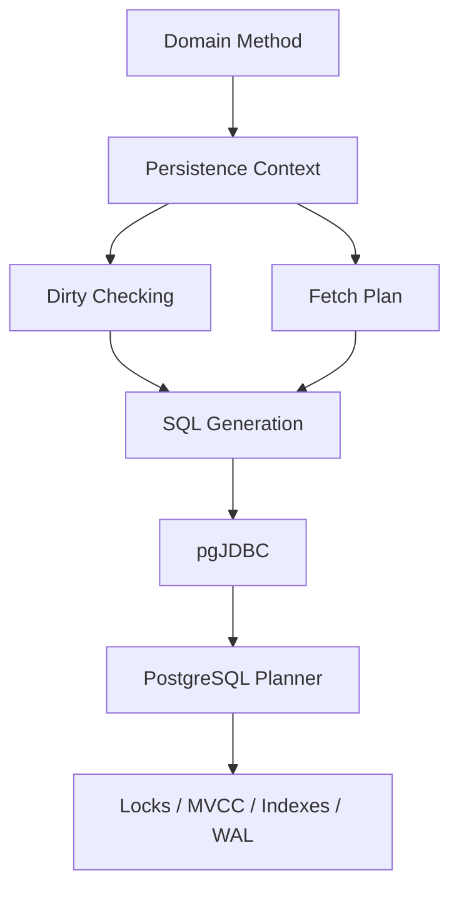
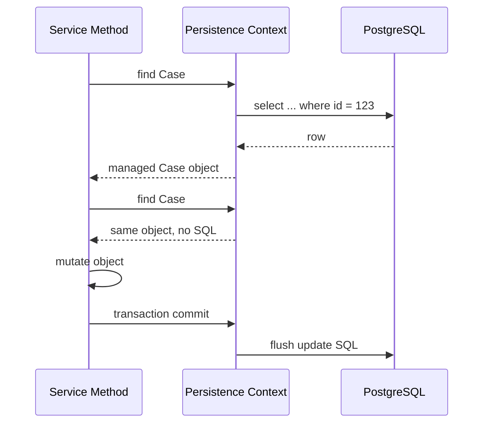
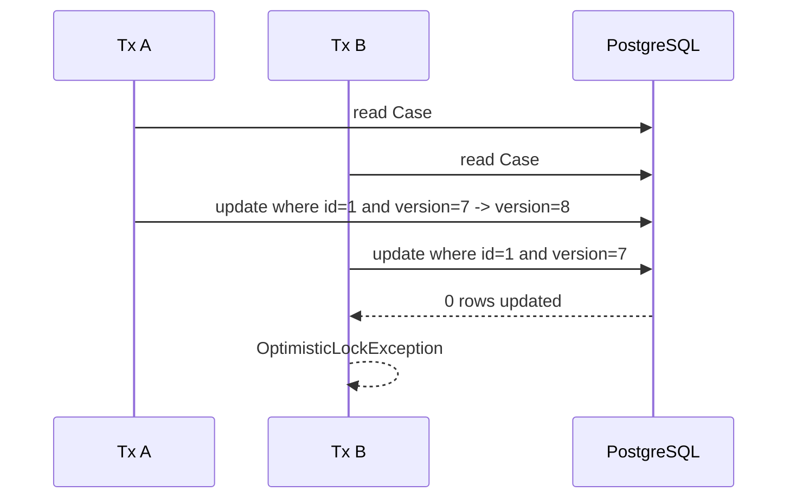

------
title: Learn PostgreSQL in Action - Part 032
description: Production-grade Hibernate/JPA integration with PostgreSQL, covering mapping, fetching, batching, optimistic locking, JSONB, transaction boundaries, query shape, and operational failure modes.
series: learn-postgresql-in-action
seriesTitle: Learn PostgreSQL in Action
order: 32
partTitle: Hibernate/JPA with PostgreSQL in Production
tags:
- postgresql
- java
- hibernate
- jpa
- orm
- performance
- transactions
- series
date: 2026-07-01
---

# Part 032 — Hibernate/JPA with PostgreSQL in Production

Hibernate is not a shortcut around database understanding. In production-grade systems, Hibernate is a **SQL generator**, **unit-of-work manager**, **identity map**, **dirty-checking engine**, **fetch-plan executor**, and **transaction participant**.

If we use it casually, it creates accidental query shapes, transaction bloat, hidden N+1 queries, inefficient batches, and locking surprises. If we use it deliberately, it can reduce boilerplate while preserving PostgreSQL correctness and performance.

This part is not a beginner introduction to JPA annotations. The focus is the PostgreSQL-specific operational reality behind Hibernate/JPA decisions.

---

## 1. Problem yang Diselesaikan

Common production failures:

- N+1 query storm from lazy association traversal;
- huge object graph loaded accidentally;
- pagination broken by `JOIN FETCH` on collections;
- batch insert expected but not happening;
- identity primary key generator disables insert batching;
- transaction spans remote API call;
- `Open Session in View` keeps persistence context alive too long;
- optimistic locking missing, causing lost update;
- `EnumType.ORDINAL` corrupts meaning after enum reorder;
- JSONB mapped as opaque string with no validation/index strategy;
- timestamp/timezone mismatch;
- Hibernate-generated DDL diverges from migration scripts;
- second-level cache returns stale assumptions;
- flush happens earlier than expected;
- bulk JPQL bypasses persistence context expectations.

Target part ini: membuat Hibernate menjadi alat yang bisa diprediksi, bukan black box.

---

## 2. Kaufman Skill Deconstruction

| Sub-skill | Yang Harus Dikuasai | Bukti Kompetensi |
|---|---|---|
| Persistence context | identity map, dirty checking, flush | Bisa menjelaskan kapan SQL dikirim ke PostgreSQL |
| Mapping discipline | entity, value object, enum, timestamp, JSONB | Bisa memilih mapping dengan semantic contract jelas |
| Fetch planning | lazy/eager, join fetch, entity graph, batch fetch | Bisa menghilangkan N+1 tanpa membuat row explosion |
| Write batching | JDBC batch, flush/clear, sequence allocation | Bisa membuktikan batch benar-benar terjadi |
| Concurrency | `@Version`, pessimistic lock, retry | Bisa mencegah lost update dan menangani conflict |
| Transaction boundary | `@Transactional`, read-only, isolation, OSIV | Bisa memisahkan DB work dari remote work |
| Query shape | JPQL/Criteria/native SQL | Bisa membaca SQL yang dihasilkan dan EXPLAIN-nya |
| Observability | Hibernate stats + PostgreSQL stats | Bisa menghubungkan endpoint ke SQL dan plan |

---

## 3. Mental Model: Hibernate Tidak Menghapus Relational Model



Hibernate hidup di antara object model dan relational model. Tetapi PostgreSQL tetap mengeksekusi SQL.

Maka setiap keputusan Hibernate harus diterjemahkan ke pertanyaan database:

- SQL apa yang dihasilkan?
- berapa round trip?
- index apa yang bisa dipakai?
- lock apa yang diambil?
- berapa row yang disentuh?
- berapa WAL yang ditulis?
- bagaimana transaction isolation bekerja?
- apakah constraint database tetap menjaga invariant?

---

## 4. Entity Bukan Table Wrapper Sederhana

Entity sebaiknya merepresentasikan object identity dan lifecycle, bukan semua table harus menjadi entity kaya perilaku.

Good candidates for entity:

- `Case` dengan lifecycle jelas;
- `EnforcementAction` dengan state transition;
- `Payment` dengan invariant dan audit;
- `Account` dengan version/concurrency boundary.

Poor candidates:

- row report read-only;
- denormalized projection;
- audit event append-only yang hanya dibaca by query;
- high-volume time-series metric;
- join table tanpa lifecycle;
- table yang lebih cocok diakses bulk SQL.

Gunakan DTO/native query/projection untuk read model kompleks.

---

## 5. Aggregate Boundary dan Transaction Boundary

ORM sering mendorong developer membuat graph besar:

```text
Customer -> Orders -> OrderItems -> Product -> Supplier -> Address
```

Di production, graph besar berarti:

- query lebih banyak;
- row lebih banyak;
- persistence context lebih besar;
- dirty checking lebih mahal;
- serialization lebih rawan lazy loading;
- transaction lebih panjang;
- lock footprint lebih tidak jelas.

Lebih sehat:

```text
Aggregate root: Case
  - CaseAssignment
  - CaseStatusHistory reference by id/query
  - EnforcementAction separate aggregate
```

Rule:

> Model aggregate berdasarkan consistency boundary, bukan berdasarkan semua foreign key yang bisa dinavigasi.

---

## 6. Persistence Context: Unit of Work dan Identity Map

Dalam satu Hibernate `Session`/JPA `EntityManager`, entity dengan primary key sama hanya punya satu managed instance.



Consequences:

- perubahan object managed bisa otomatis di-flush;
- SQL tidak selalu dikirim saat setter dipanggil;
- query dapat memicu auto-flush sebelum eksekusi;
- bulk update/delete bisa membuat persistence context stale;
- memory bisa membengkak jika memproses banyak entity dalam satu session.

---

## 7. Flush Semantics

Flush adalah sinkronisasi persistence context ke database, bukan commit.

Flush bisa terjadi:

- sebelum commit;
- sebelum query tertentu;
- saat `entityManager.flush()` dipanggil;
- tergantung flush mode.

Example surprise:

```java
@Transactional
public void updateThenQuery(UUID id) {
    CaseEntity c = entityManager.find(CaseEntity.class, id);
    c.setStatus("APPROVED");

    // Hibernate may flush pending update before this query
    long count = repository.countOpenCases();
}
```

Why it matters:

- lock bisa diambil lebih awal dari yang dikira;
- constraint violation muncul sebelum commit;
- query plan/latency endpoint berubah;
- partial work sudah terlihat dalam transaction sendiri.

---

## 8. Mapping Primary Key: Sequence vs Identity vs UUID

### 8.1 Identity

PostgreSQL identity column:

```sql
id bigint generated always as identity primary key
```

JPA:

```java
@Id
@GeneratedValue(strategy = GenerationType.IDENTITY)
private Long id;
```

Problem: identity sering memaksa insert dieksekusi segera untuk mendapatkan generated key, sehingga insert batching bisa terganggu.

### 8.2 Sequence

PostgreSQL sequence:

```sql
create sequence case_id_seq start with 1 increment by 50;

create table cases (
    id bigint primary key default nextval('case_id_seq'),
    title text not null
);
```

JPA:

```java
@Id
@GeneratedValue(strategy = GenerationType.SEQUENCE, generator = "case_id_gen")
@SequenceGenerator(name = "case_id_gen", sequenceName = "case_id_seq", allocationSize = 50)
private Long id;
```

Benefits:

- Hibernate can allocate IDs before insert;
- batching works better;
- fewer round trips if allocation size is aligned;
- ordering and FK insert planning easier.

### 8.3 UUID / UUIDv7

For distributed systems, UUID avoids central numeric allocation. PostgreSQL 18 includes `uuidv7()` support, which is better for index locality than random UUIDv4.

DDL:

```sql
create table cases (
    id uuid primary key default uuidv7(),
    title text not null
);
```

Java:

```java
@Id
@Column(columnDefinition = "uuid")
private UUID id;
```

Decision:

| ID Strategy | Pros | Cons |
|---|---|---|
| sequence bigint | compact, fast index, good batching | central sequence, less natural for external IDs |
| identity bigint | simple DDL | can hurt ORM batching |
| UUIDv4 | decentralized | random index insertion pattern |
| UUIDv7 | decentralized-ish, time-ordered | version requirement, timestamp leakage consideration |

---

## 9. Column Contract: Annotation is Not Enough

This is not sufficient:

```java
@Column(nullable = false, length = 100)
private String title;
```

It helps mapping metadata, but the real contract must exist in PostgreSQL:

```sql
alter table cases
    alter column title set not null,
    add constraint cases_title_non_empty check (length(trim(title)) > 0);
```

Rule:

> JPA annotations describe mapping. PostgreSQL constraints enforce truth.

Use both:

- Bean Validation for early user/application feedback;
- database constraints for invariant enforcement under concurrency and non-Java writers.

---

## 10. Enum Mapping

Bad default for long-lived systems:

```java
@Enumerated(EnumType.ORDINAL)
private CaseStatus status;
```

Why:

- enum order becomes storage contract;
- reordering enum constants corrupts meaning;
- inserting a new enum in middle changes ordinal mapping.

Better baseline:

```java
@Enumerated(EnumType.STRING)
@Column(name = "status", nullable = false)
private CaseStatus status;
```

DDL:

```sql
create table cases (
    id uuid primary key,
    status text not null,
    constraint cases_status_check check (
        status in ('DRAFT', 'SUBMITTED', 'IN_REVIEW', 'APPROVED', 'REJECTED')
    )
);
```

Alternative: PostgreSQL enum:

```sql
create type case_status as enum (
    'DRAFT', 'SUBMITTED', 'IN_REVIEW', 'APPROVED', 'REJECTED'
);
```

Trade-off:

| Strategy | Pros | Cons |
|---|---|---|
| string + check | migration flexible, explicit | constraint updates needed |
| PostgreSQL enum | strong DB type | evolution operationally stricter |
| lookup table | metadata-friendly | join/reference overhead |
| ordinal | compact | unsafe for evolving systems |

---

## 11. Time Mapping

Recommended baseline:

- use `Instant` for event timestamps;
- use `LocalDate` for calendar dates;
- avoid `LocalDateTime` for absolute moments unless carefully scoped;
- store absolute timestamps as `timestamptz`;
- set JDBC/Hibernate timezone explicitly if needed;
- normalize app to UTC.

Entity:

```java
@Column(name = "created_at", nullable = false, updatable = false)
private Instant createdAt;

@Column(name = "due_date")
private LocalDate dueDate;
```

DDL:

```sql
created_at timestamptz not null default now(),
due_date date
```

Do not store future regulatory deadlines as ambiguous local timestamps without jurisdiction/timezone semantics.

---

## 12. BigDecimal and Numeric

For money/regulated amounts, avoid floating point.

Java:

```java
@Column(name = "penalty_amount", precision = 19, scale = 4)
private BigDecimal penaltyAmount;
```

PostgreSQL:

```sql
penalty_amount numeric(19,4) not null check (penalty_amount >= 0)
```

Rules:

- define precision and scale;
- avoid `double` for monetary/legal values;
- enforce non-negative or range constraints in DB;
- define currency separately;
- do not assume numeric comparisons are free at scale; index and aggregation costs still matter.

---

## 13. JSONB Mapping

Hibernate 6+ supports JSON mapping via JDBC type codes.

Example:

```java
@JdbcTypeCode(SqlTypes.JSON)
@Column(name = "metadata", columnDefinition = "jsonb", nullable = false)
private CaseMetadata metadata;
```

DDL:

```sql
metadata jsonb not null default '{}'::jsonb,
constraint cases_metadata_object check (jsonb_typeof(metadata) = 'object')
```

Use JSONB when:

- fields are sparse;
- structure evolves faster than core schema;
- payload is auxiliary;
- query requirements are known and indexed;
- integrity requirement is moderate or enforced with generated columns/checks.

Avoid JSONB when:

- field is core invariant;
- foreign key/reference needed;
- frequent updates target small nested keys;
- query filters need many independent paths;
- analytics/reporting depends heavily on nested data.

Pattern: JSONB plus generated/search columns.

```sql
alter table cases
add column risk_score numeric generated always as
    ((metadata ->> 'riskScore')::numeric) stored;

create index cases_risk_score_idx on cases (risk_score)
where status = 'IN_REVIEW';
```

---

## 14. Arrays and Collections

JPA collection mapping can create hidden tables or serialized values depending on mapping.

Use join table/child table when:

- element has lifecycle;
- query filters by element;
- element needs constraints;
- element count is large;
- partial update matters.

Use PostgreSQL array sparingly when:

- list is small;
- element is scalar;
- query is simple;
- lifecycle is owned entirely by row.

Do not store high-cardinality relationship as array just to avoid join.

---

## 15. Fetch Strategy: Lazy by Default, Explicit by Use Case

Eager association is dangerous because it makes every load heavier.

Bad:

```java
@ManyToOne(fetch = FetchType.EAGER)
private Customer customer;
```

Better:

```java
@ManyToOne(fetch = FetchType.LAZY, optional = false)
private Customer customer;
```

Then fetch explicitly per use case:

```java
@Query("""
select c
from CaseEntity c
join fetch c.assignee
where c.id = :id
""")
Optional<CaseEntity> findDetailById(UUID id);
```

Rule:

> Default mapping should be conservative. Use-case repository methods define fetch shape.

---

## 16. N+1 Query Problem

Classic problem:

```java
List<CaseEntity> cases = caseRepository.findOpenCases();
for (CaseEntity c : cases) {
    log.info("assignee={}", c.getAssignee().getName());
}
```

SQL shape:

```text
select * from cases where status = 'OPEN';
select * from users where id = ?;
select * from users where id = ?;
select * from users where id = ?;
...
```

Solutions:

1. `join fetch` for small one-to-one/many-to-one detail;
2. entity graph;
3. batch fetching;
4. DTO projection;
5. explicit second query with `where id in (...)`;
6. avoid entity graph for report-style read model.

Batch fetch:

```java
@ManyToOne(fetch = FetchType.LAZY)
@BatchSize(size = 50)
private UserEntity assignee;
```

Global:

```properties
hibernate.default_batch_fetch_size=50
```

But batch fetch is not magic. It reduces round trips; it does not fix a bad aggregate/read model.

---

## 17. Join Fetch and Row Explosion

`JOIN FETCH` on to-one association is usually manageable.

```java
select c
from CaseEntity c
join fetch c.assignee
where c.id = :id
```

`JOIN FETCH` on collection can multiply rows.

```java
select c
from CaseEntity c
join fetch c.events
where c.status = :status
```

If one case has 100 events and query returns 100 cases, SQL row count may be huge.

Problem gets worse with multiple collections:

```java
select c
from CaseEntity c
join fetch c.events
join fetch c.comments
```

This can create cartesian multiplication:

```text
cases * events_per_case * comments_per_case
```

Safer alternatives:

- fetch root page first;
- fetch collections in second query by root IDs;
- use DTO projection;
- use aggregate-specific detail endpoint;
- use keyset pagination;
- avoid paginating over collection join fetch.

---

## 18. Pagination with Hibernate

Bad pattern:

```java
@Query("""
select c
from CaseEntity c
left join fetch c.events
where c.status = :status
order by c.createdAt desc
""")
Page<CaseEntity> findPageWithEvents(CaseStatus status, Pageable pageable);
```

Risks:

- SQL row multiplication;
- database-level pagination may not match distinct root entity count;
- Hibernate may apply memory-level de-duplication;
- count query may be wrong/expensive.

Better:

1. page IDs only;
2. fetch details by IDs;
3. preserve ordering.

```java
@Query("""
select c.id
from CaseEntity c
where c.status = :status
order by c.createdAt desc, c.id desc
""")
List<UUID> findPageIds(CaseStatus status, Pageable pageable);

@Query("""
select distinct c
from CaseEntity c
left join fetch c.assignee
where c.id in :ids
""")
List<CaseEntity> findDetailsByIds(List<UUID> ids);
```

For deep pagination, prefer keyset/cursor pattern.

---

## 19. DTO Projection for Read Models

Not every read should hydrate entities.

Projection:

```java
public record CaseListItem(
    UUID id,
    String title,
    CaseStatus status,
    String assigneeName,
    Instant createdAt
) {}
```

Repository:

```java
@Query("""
select new com.example.CaseListItem(
    c.id,
    c.title,
    c.status,
    u.name,
    c.createdAt
)
from CaseEntity c
join c.assignee u
where c.status = :status
order by c.createdAt desc
""")
List<CaseListItem> findListItems(CaseStatus status, Pageable pageable);
```

Benefits:

- fewer columns;
- no dirty checking;
- no lazy loading;
- more predictable SQL;
- better API boundary.

Use native SQL when PostgreSQL-specific features matter:

- JSONB operators;
- window functions;
- `distinct on`;
- CTE with `materialized` / `not materialized`;
- `on conflict`;
- `skip locked`;
- generated columns/expression indexes.

---

## 20. JDBC Batching Through Hibernate

Enable batching:

```properties
hibernate.jdbc.batch_size=50
hibernate.order_inserts=true
hibernate.order_updates=true
```

But verify. Do not assume.

Batching can be defeated by:

- identity generator;
- frequent flush;
- mixed SQL shapes;
- versioned updates depending on config/version;
- entity lifecycle callbacks doing extra queries;
- cascading large graphs;
- persistence context memory pressure.

Batch insert pattern:

```java
@Transactional
public void importCases(List<CaseImportRow> rows) {
    int i = 0;
    for (CaseImportRow row : rows) {
        entityManager.persist(map(row));

        if (++i % 50 == 0) {
            entityManager.flush();
            entityManager.clear();
        }
    }
}
```

Why `flush()`/`clear()`:

- sends batched SQL;
- prevents persistence context from growing unbounded;
- reduces dirty checking cost;
- makes failure chunk boundary clearer.

---

## 21. Sequence Allocation and Batch Insert

If using sequences, align allocation size.

```java
@SequenceGenerator(
    name = "case_id_gen",
    sequenceName = "case_id_seq",
    allocationSize = 50
)
@GeneratedValue(strategy = GenerationType.SEQUENCE, generator = "case_id_gen")
private Long id;
```

DDL:

```sql
create sequence case_id_seq increment by 50;
```

Mismatch between Hibernate allocation and database sequence increment can cause gaps or inefficient round trips depending on optimizer strategy.

Important: gaps in sequence-generated IDs are normal. Do not use sequence values as legal numbering unless gap behavior is acceptable.

---

## 22. Optimistic Locking with `@Version`

Use version column for mutable aggregate roots.

Entity:

```java
@Version
@Column(name = "version", nullable = false)
private long version;
```

DDL:

```sql
version bigint not null default 0
```

Hibernate update shape:

```sql
update cases
set status = ?, version = ?
where id = ? and version = ?;
```

If no row is updated, Hibernate raises optimistic locking failure.

This prevents last-commit-wins lost update.



Application handling:

- return conflict to user;
- retry only if operation is idempotent and merge semantics are clear;
- reload current state and re-evaluate command;
- never blindly retry user decision that depends on stale state.

---

## 23. Pessimistic Locking

JPA:

```java
@Lock(LockModeType.PESSIMISTIC_WRITE)
@Query("select c from CaseEntity c where c.id = :id")
Optional<CaseEntity> findByIdForUpdate(UUID id);
```

SQL concept:

```sql
select * from cases where id = ? for update;
```

Use when:

- contention is expected;
- operation must serialize on row;
- conflict retry is more expensive than wait;
- queue/work item claiming.

Avoid when:

- user interaction is inside transaction;
- lock order is inconsistent;
- lock duration is unbounded;
- remote call happens while lock is held.

For queue workers, native SQL is often better:

```sql
select id
from jobs
where status = 'READY'
order by priority desc, created_at
for update skip locked
limit 100;
```

---

## 24. Transaction Boundary with Spring

Bad:

```java
@Transactional
public CaseDecision decide(UUID caseId, DecisionCommand command) {
    CaseEntity c = repository.findById(caseId).orElseThrow();

    RiskScore score = riskClient.score(c); // remote call inside transaction

    c.applyDecision(command, score);
    return mapper.toDecision(c);
}
```

Better when invariant allows:

```java
public CaseDecision decide(UUID caseId, DecisionCommand command) {
    CaseSnapshot snapshot = txTemplate.execute(status ->
        repository.loadSnapshot(caseId)
    );

    RiskScore score = riskClient.score(snapshot);

    return txTemplate.execute(status -> {
        CaseEntity c = repository.findByIdForUpdate(caseId).orElseThrow();
        c.applyDecision(command, score);
        return mapper.toDecision(c);
    });
}
```

The second version reduces connection hold time and lock duration.

But do not split transactions blindly. If external call result and DB state must be atomic, use patterns like:

- reservation/confirmation;
- outbox;
- saga;
- idempotency key;
- compensating action;
- state machine.

---

## 25. Open Session in View

Open Session in View keeps the persistence context open through web rendering/serialization.

It can hide lazy loading problems:

```java
@GetMapping("/cases/{id}")
public CaseDto get(@PathVariable UUID id) {
    CaseEntity c = repository.findById(id).orElseThrow();
    return mapper.toDto(c); // may trigger lazy SQL during mapping
}
```

Risks:

- SQL runs outside clear service-level boundary;
- serialization can trigger N+1;
- connection may be held longer;
- transaction semantics become blurry;
- tests may not catch hidden lazy load.

For production APIs, prefer:

- disable OSIV;
- use explicit fetch plans;
- map to DTO inside service transaction;
- fail fast on lazy access outside transaction.

---

## 26. Bulk Updates and Persistence Context Staleness

JPQL bulk update:

```java
@Modifying
@Query("""
update CaseEntity c
set c.status = :newStatus
where c.status = :oldStatus
""")
int transitionAll(CaseStatus oldStatus, CaseStatus newStatus);
```

Bulk operations bypass normal entity dirty checking. Managed entities already loaded may now be stale.

Safe patterns:

- execute bulk operation in separate transaction;
- clear persistence context after bulk update;
- avoid mixing bulk update with managed entity mutation in same unit of work;
- rely on database constraints/triggers carefully.

---

## 27. Hibernate Query Comments and Application Name

Make SQL attributable.

Properties:

```properties
hibernate.use_sql_comments=true
```

Example repository method comment in Hibernate/native query can make `pg_stat_statements` and logs easier to interpret.

Also set pgJDBC `ApplicationName`:

```text
jdbc:postgresql://db:5432/app?ApplicationName=case-service
```

At minimum, logs should let you connect:

```text
endpoint -> repository method -> SQL fingerprint -> pg_stat_statements entry -> EXPLAIN plan
```

---

## 28. Logging SQL Without Lying to Yourself

Development logging:

```properties
logging.level.org.hibernate.SQL=DEBUG
logging.level.org.hibernate.orm.jdbc.bind=TRACE
```

Use carefully. Bind logging can expose secrets/PII and generate huge logs.

Better production approach:

- PostgreSQL slow query log;
- `pg_stat_statements`;
- application-level span names;
- query comments for use-case identification;
- sampled SQL logging;
- masked bind values.

Do not use `show_sql=true` in serious production setups.

---

## 29. Second-Level Cache

Hibernate first-level cache is the persistence context and always exists per session.

Second-level cache is optional and cross-session.

Use second-level cache only when:

- data is mostly read-only;
- invalidation semantics are clear;
- cache keys are tenant-safe;
- stale reads are acceptable or controlled;
- write frequency is low;
- observability exists.

Avoid second-level cache for:

- mutable regulatory case state;
- permission-sensitive data;
- rapidly changing workflow queues;
- data changed by multiple services;
- data with strict read-after-write requirements.

Rule:

> Cache is not a substitute for correct indexes, query shape, or transaction design.

---

## 30. Multi-Tenancy Patterns

Hibernate supports several multi-tenancy models, but PostgreSQL boundary matters more.

| Pattern | PostgreSQL Shape | Pros | Risks |
|---|---|---|---|
| discriminator column | shared table with `tenant_id` | efficient shared schema | every query must filter; RLS recommended |
| schema per tenant | `tenant_a.cases` | stronger namespace boundary | migration/search_path complexity |
| database per tenant | separate database | isolation | operations explosion |
| cluster per tenant | separate PostgreSQL cluster | strongest isolation | expensive operations |

For discriminator multi-tenancy, combine:

- `tenant_id` in primary/unique keys where needed;
- partial/composite indexes;
- RLS if appropriate;
- transaction-local tenant setting;
- repository tests that assert tenant filter.

Hibernate filters are not a complete security boundary by themselves. Database RLS is stronger for defense-in-depth.

---

## 31. Schema Migration: Do Not Let Hibernate Own Production DDL

Hibernate can generate DDL. That is useful for prototyping/tests, not as the source of truth for production migration.

Production rule:

- Flyway/Liquibase/manual reviewed migration owns schema;
- Hibernate validates mapping against schema;
- DDL generation disabled for production;
- migration includes lock analysis and rollback/forward plan;
- constraints/indexes named explicitly;
- generated SQL is reviewed.

Configuration:

```properties
spring.jpa.hibernate.ddl-auto=validate
```

Avoid:

```properties
spring.jpa.hibernate.ddl-auto=update
```

Why:

- unsafe schema changes;
- hidden DDL lock;
- non-repeatable environments;
- drift from reviewed migration process;
- weak rollback discipline.

---

## 32. PostgreSQL-Specific Native Queries

Use native SQL when PostgreSQL gives a better primitive.

### 32.1 Upsert

```sql
insert into idempotency_keys(key, response_hash, created_at)
values (:key, :hash, now())
on conflict (key) do nothing;
```

### 32.2 Work Queue

```sql
with claimed as (
    select id
    from jobs
    where status = 'READY'
    order by priority desc, created_at
    for update skip locked
    limit :limit
)
update jobs j
set status = 'RUNNING', claimed_at = now()
from claimed
where j.id = claimed.id
returning j.*;
```

### 32.3 JSONB Predicate

```sql
select *
from cases
where metadata @> cast(:filter as jsonb);
```

### 32.4 Distinct Latest Per Group

```sql
select distinct on (case_id)
    case_id, status, changed_at
from case_status_history
order by case_id, changed_at desc;
```

Do not force JPQL to express PostgreSQL-specific logic awkwardly.

---

## 33. Testing Strategy

### 33.1 Use Real PostgreSQL

For PostgreSQL-specific behavior, H2 is not enough.

Use Testcontainers:

```java
@Testcontainers
class CaseRepositoryTest {

    @Container
    static PostgreSQLContainer<?> postgres = new PostgreSQLContainer<>("postgres:18")
        .withDatabaseName("app")
        .withUsername("app")
        .withPassword("app");
}
```

Test:

- migrations;
- constraints;
- JSONB queries;
- enum mapping;
- timestamp behavior;
- optimistic locking;
- deadlock/retry handling;
- batch insert count;
- native SQL.

### 33.2 Assert Query Count

For critical endpoints, assert query count to prevent N+1 regression.

Tools can include Hibernate statistics or datasource proxy in tests.

Pseudo-assertion:

```java
assertThat(queryCounter.count()).isLessThanOrEqualTo(3);
```

### 33.3 Explain Critical Queries

For native/JPQL-generated SQL, capture SQL and run:

```sql
explain (analyze, buffers)
select ...;
```

Do this for:

- high-volume API;
- background job;
- dashboard query;
- pagination query;
- export query;
- state transition query.

---

## 34. Common Anti-Patterns

### 34.1 Entity Everywhere

Using entity hydration for every read model creates unnecessary persistence context overhead.

Use DTO/native projection for query-heavy screens.

### 34.2 Bidirectional Associations Everywhere

Bidirectional mapping makes object navigation convenient but increases accidental loading and cascade complexity.

Prefer unidirectional unless bidirectional navigation is truly needed.

### 34.3 Cascade Too Broad

Dangerous:

```java
@OneToMany(cascade = CascadeType.ALL)
private List<CaseEvent> events;
```

If lifecycle is not fully owned, cascade can delete/update too much.

### 34.4 `EnumType.ORDINAL`

Never use for long-lived business meaning.

### 34.5 No `@Version` on Mutable Aggregates

Lost update risk.

### 34.6 Blind `JOIN FETCH`

Can produce row explosion and broken pagination.

### 34.7 Relying on Hibernate DDL Update

Unsafe in production.

### 34.8 Remote Call Inside `@Transactional`

Connection hold time and lock duration explode.

### 34.9 Logging All Binds in Production

PII/security/log volume risk.

### 34.10 Treating Cache as Correctness Layer

Cache can improve latency; it must not be the only place invariant exists.

---

## 35. Hibernate + PostgreSQL Production Checklist

### Mapping

- [ ] Entities represent aggregate/lifecycle boundaries, not every query shape.
- [ ] Mutable aggregate roots use `@Version`.
- [ ] `EnumType.ORDINAL` is not used.
- [ ] Time fields use `Instant`/`timestamptz` for absolute moments.
- [ ] Numeric precision/scale are explicit.
- [ ] JSONB fields have validation/index strategy.
- [ ] Database constraints enforce invariants.

### Fetching

- [ ] Associations are lazy by default unless justified.
- [ ] Each use case has explicit fetch plan.
- [ ] N+1 query count is tested for critical endpoints.
- [ ] Pagination does not rely on collection `JOIN FETCH`.
- [ ] DTO projection is used for read models.

### Writing

- [ ] Batch insert/update is enabled only where measured useful.
- [ ] Identity generator is avoided for high-volume batch insert.
- [ ] Flush/clear is used for large imports.
- [ ] Bulk updates clear or isolate persistence context.
- [ ] Transaction boundaries avoid remote calls when possible.

### Operations

- [ ] Production DDL is migration-owned, not Hibernate auto-update.
- [ ] SQL can be traced from endpoint to PostgreSQL stats.
- [ ] Slow SQL is visible via logs/`pg_stat_statements`.
- [ ] Query comments/application name identify service/use case.
- [ ] Hibernate metrics/statistics are available in non-prod/perf test.

---

## 36. Hands-On Lab

### 36.1 Detect N+1

Create:

```java
@Entity
class CaseEntity {
    @ManyToOne(fetch = FetchType.LAZY)
    private UserEntity assignee;
}
```

Run:

```java
List<CaseEntity> cases = caseRepository.findTop100ByStatus(CaseStatus.OPEN);
for (CaseEntity c : cases) {
    c.getAssignee().getName();
}
```

Observe SQL count.

Then fix with:

```java
@Query("""
select c
from CaseEntity c
join fetch c.assignee
where c.status = :status
""")
List<CaseEntity> findOpenWithAssignee(CaseStatus status, Pageable pageable);
```

Compare SQL count and row count.

### 36.2 Verify Batch Insert

Set:

```properties
hibernate.jdbc.batch_size=50
hibernate.order_inserts=true
```

Insert 1000 rows with sequence IDs and flush/clear every 50.

Observe:

- PostgreSQL logs;
- driver behavior;
- execution time;
- memory use;
- sequence calls.

Then switch to identity strategy and compare.

### 36.3 Test Optimistic Locking

Two concurrent transactions:

```java
CaseEntity a = tx1.find(id);
CaseEntity b = tx2.find(id);

a.approve();
tx1.commit();

b.reject();
tx2.commit(); // expect optimistic locking failure
```

Expected:

- second commit fails;
- no silent lost update;
- application handles conflict.

### 36.4 JSONB Query Plan

Create JSONB field and query:

```sql
explain (analyze, buffers)
select *
from cases
where metadata @> '{"risk":"HIGH"}'::jsonb;
```

Add GIN index:

```sql
create index cases_metadata_gin on cases using gin (metadata jsonb_path_ops);
```

Compare plan and buffers.

---

## 37. References

- Hibernate ORM User Guide: https://docs.hibernate.org/stable/orm/userguide/html_single/
- Hibernate `@BatchSize` Javadoc: https://docs.hibernate.org/orm/6.6/javadocs/org/hibernate/annotations/BatchSize.html
- pgJDBC documentation: https://jdbc.postgresql.org/documentation/
- PostgreSQL JSON types/functions: https://www.postgresql.org/docs/current/datatype-json.html
- PostgreSQL explicit locking: https://www.postgresql.org/docs/current/explicit-locking.html
- PostgreSQL transaction isolation: https://www.postgresql.org/docs/current/transaction-iso.html

---

## 38. Key Takeaways

Hibernate is valuable when it is constrained by clear engineering rules.

The mature model is not:

> “Hibernate saves us from writing SQL.”

The mature model is:

> “Hibernate manages object persistence, but every mapping, fetch plan, flush, batch, and transaction still becomes PostgreSQL work that must preserve invariants and meet SLO.”

For top-level engineering, the question is never simply whether an annotation works. The question is:

- What SQL does it produce?
- What locks does it take?
- What indexes can support it?
- What happens under concurrency?
- What happens when the data volume is 100x?
- What happens when a transaction fails halfway?

Next, we move from runtime ORM behavior to schema evolution: zero-downtime migration, lock-safe DDL, expand-contract rollout, backfill strategy, and rollback discipline.
