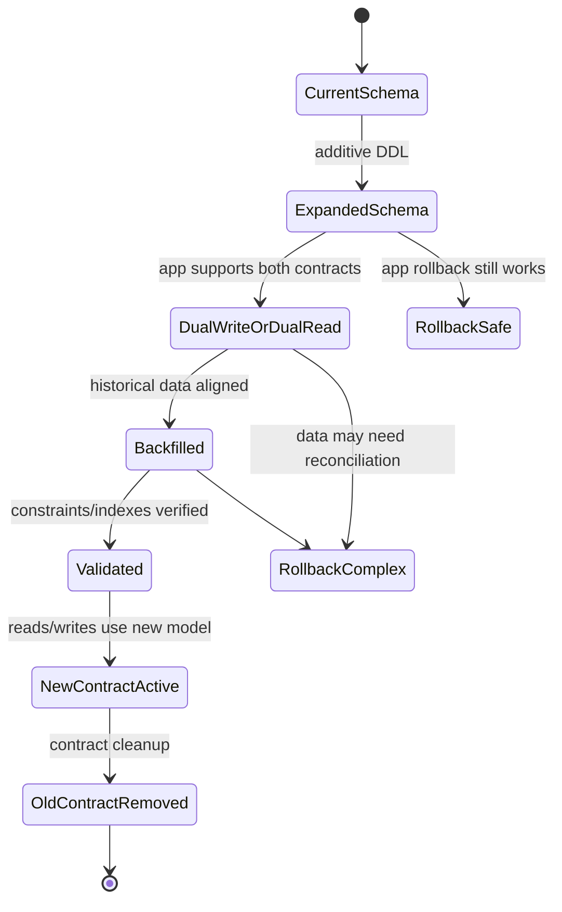
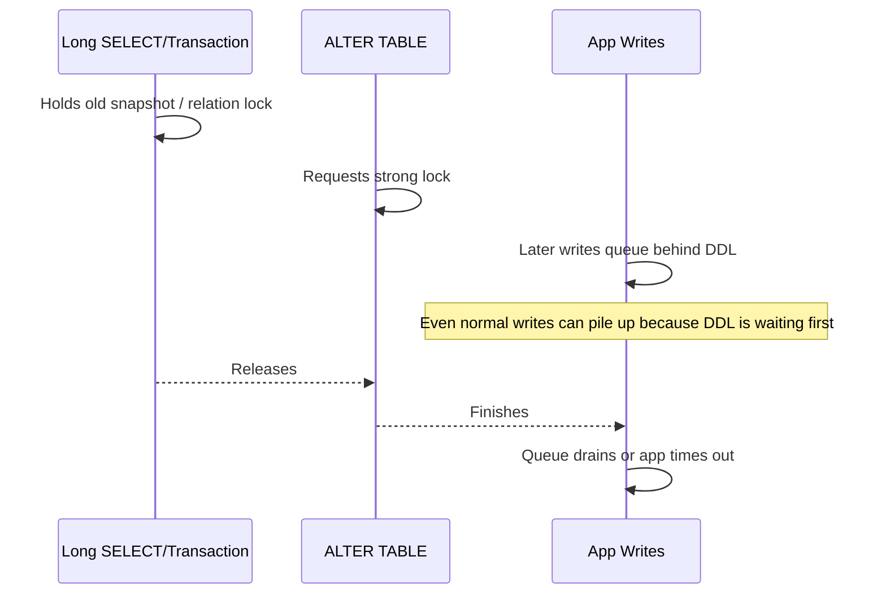
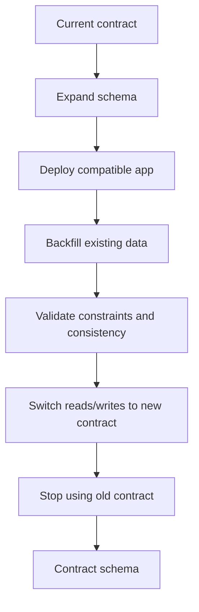
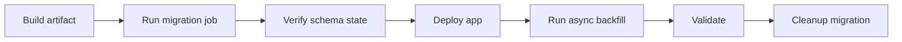
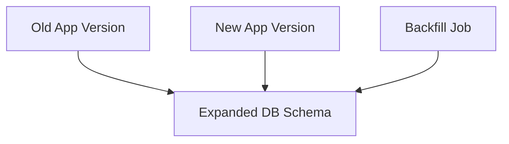

------
title: Learn PostgreSQL in Action - Part 033
description: Schema migration and zero-downtime change for PostgreSQL production systems, with lock-aware DDL, expand-contract, backfill, validation, and Java release coordination.
series: learn-postgresql-in-action
seriesTitle: Learn PostgreSQL in Action
order: 33
partTitle: Schema Migration and Zero-Downtime Change
tags:
- postgresql
- migration
- ddl
- zero-downtime
- java
- flyway
- liquibase
- series
date: 2026-07-01
---

# Part 033 — Schema Migration and Zero-Downtime Change

Zero-downtime schema migration is not a bag of clever SQL commands. It is the discipline of changing a live data contract while old application code, new application code, background jobs, replicas, caches, batch processes, and external consumers may all exist at the same time.

A top-tier PostgreSQL engineer thinks of migration as **distributed systems change management**.

The database schema is not merely structure. It is a runtime contract among:

- application binaries;
- migration tooling;
- connection pools;
- query planner assumptions;
- ORM mappings;
- batch/backfill workers;
- replication/CDC consumers;
- backup and restore procedures;
- operational dashboards;
- humans running incident response.

The goal is not “run DDL successfully”. The goal is:

> Change the schema without breaking correctness, availability, observability, rollback ability, or future evolution.

---

## 1. Kaufman Skill Decomposition

Following Josh Kaufman’s skill acquisition model, we decompose zero-downtime migration into small sub-skills that can be practiced independently.

| Sub-skill | What to practice | Failure if ignored |
|---|---|---|
| Lock awareness | Predict lock level and lock duration before running DDL | Production writes block unexpectedly |
| Expand-contract thinking | Split incompatible changes into safe phases | Old/new app versions break each other |
| Backfill design | Move large data in controlled batches | WAL explosion, replica lag, vacuum pressure |
| Constraint validation | Add integrity without long blocking scans | Bad historical data or long exclusive lock |
| Dual compatibility | Make app code tolerate old and new schema | Rolling deploy fails halfway |
| Rollback design | Separate code rollback from data rollback | “Rollback” makes corruption worse |
| Migration governance | Review, test, measure, and audit changes | Unsafe DDL reaches production unnoticed |
| Runtime diagnostics | Watch locks, lag, temp files, bloat, error rates | Incident detected too late |

The minimum useful target is:

> Given a schema change proposal, you can classify it as safe/unsafe, design an expand-contract rollout, identify required backfills, write lock-safe SQL, define rollback behavior, and specify what metrics to watch during deployment.

---

## 2. Mental Model: Schema Migration Is a State Machine

A schema migration is not one event. It is a multi-state transition.



The dangerous mistake is treating this as:

```text
ALTER TABLE ...;
deploy app;
done.
```

That only works for tiny systems, controlled maintenance windows, or purely additive changes with no behavioral dependency.

In production, schema migration should be modeled as:

```text
state before -> safe transition -> compatibility window -> verification -> cleanup
```

---

## 3. Migration Taxonomy

Not all migrations have the same risk profile.

### 3.1 Usually safe additive changes

These are usually safe when done carefully:

- create a new nullable column;
- create a new table;
- create a new schema;
- add a non-enforced object used later;
- create an index concurrently;
- add a `CHECK`, `FOREIGN KEY`, or `NOT NULL` constraint as `NOT VALID` when supported;
- create a view/function not yet used by old code.

“Usually safe” does not mean “free”. Even additive DDL can briefly take locks, invalidate plans, increase catalog churn, or trigger ORM assumptions.

### 3.2 Potentially dangerous changes

These require deliberate sequencing:

- rename a column used by application code;
- drop a column;
- change column type;
- add `NOT NULL` to a large existing table;
- add a foreign key to a high-write table;
- create a non-concurrent index on a large table;
- add a unique constraint over dirty historical data;
- rewrite a large table;
- change enum values used by application code;
- change partitioning structure;
- change primary key semantics;
- change tenant boundary or RLS policy;
- alter a function used by triggers or constraints.

### 3.3 Operationally dangerous changes

These may appear safe from a schema perspective but are dangerous operationally:

- backfill millions of rows in one transaction;
- create many indexes at once;
- run migration during peak write traffic;
- run heavy validation while replicas are lagging;
- ship a migration that assumes no old application instances exist;
- run DDL without `lock_timeout`;
- run migration through a connection pool with normal application traffic;
- execute migration in a transaction when the command requires autocommit;
- deploy without observing locks and replication lag.

---

## 4. PostgreSQL DDL Lock Reality

Every DDL statement has a locking profile. The critical variables are:

1. **Which lock is acquired?**
2. **How long is the lock held?**
3. **Does the command scan the table?**
4. **Does it rewrite the table?**
5. **Does it block reads, writes, or both?**
6. **Does it wait for old transactions?**
7. **Can it run inside a transaction block?**

The production incident usually comes from confusing **lock level** with **lock duration**.

A command may take a strong lock only briefly. That can still be dangerous if it waits behind a long-running transaction; once queued, it can block later application traffic behind it.



### 4.1 Always use lock timeout for migrations

A migration should generally not wait indefinitely for a lock.

```sql
SET lock_timeout = '5s';
SET statement_timeout = '30min';
SET idle_in_transaction_session_timeout = '60s';
```

The intent is:

- fail fast if the migration cannot acquire a lock safely;
- avoid silent production traffic pileups;
- retry during a safer window;
- make lock waits observable.

Do not set `lock_timeout` so high that the migration becomes an outage.

---

## 5. Expand-Contract Pattern

The expand-contract pattern is the default mental model for zero-downtime schema change.



### 5.1 Example: split `full_name` into `first_name` and `last_name`

Unsafe version:

```sql
ALTER TABLE customer DROP COLUMN full_name;
ALTER TABLE customer ADD COLUMN first_name text NOT NULL;
ALTER TABLE customer ADD COLUMN last_name text NOT NULL;
```

This breaks every old binary that still reads or writes `full_name`.

Safe phased version:

```sql
-- Phase 1: expand
ALTER TABLE customer ADD COLUMN first_name text;
ALTER TABLE customer ADD COLUMN last_name text;
```

Deploy application version A:

- writes `full_name` and new columns;
- reads from new columns when present;
- falls back to `full_name` when missing.

Backfill:

```sql
UPDATE customer
SET first_name = split_part(full_name, ' ', 1),
    last_name = nullif(regexp_replace(full_name, '^\S+\s*', ''), '')
WHERE first_name IS NULL
   OR last_name IS NULL;
```

For real production, do not run this as one huge update. Use chunked backfill.

Then validate:

```sql
SELECT count(*)
FROM customer
WHERE first_name IS NULL OR last_name IS NULL;
```

Then enforce:

```sql
ALTER TABLE customer
    ADD CONSTRAINT customer_first_name_nn CHECK (first_name IS NOT NULL) NOT VALID;

ALTER TABLE customer
    ADD CONSTRAINT customer_last_name_nn CHECK (last_name IS NOT NULL) NOT VALID;

ALTER TABLE customer VALIDATE CONSTRAINT customer_first_name_nn;
ALTER TABLE customer VALIDATE CONSTRAINT customer_last_name_nn;
```

Then deploy application version B:

- reads new columns only;
- no longer writes `full_name`.

Then cleanup:

```sql
ALTER TABLE customer DROP COLUMN full_name;
```

Cleanup is often the riskiest phase because it removes rollback compatibility. Delay it until the new contract has proven stable.

---

## 6. Add Column Safely

### 6.1 Add nullable column

```sql
ALTER TABLE enforcement_case
ADD COLUMN risk_score integer;
```

This is usually an expand-phase operation.

### 6.2 Add column with default

Modern PostgreSQL avoids rewriting the whole table for many constant defaults, but engineers should still review the exact expression.

Usually acceptable:

```sql
ALTER TABLE enforcement_case
ADD COLUMN source_system text DEFAULT 'legacy';
```

Potentially dangerous if volatile or backfill-heavy semantics are needed:

```sql
ALTER TABLE enforcement_case
ADD COLUMN generated_at timestamptz DEFAULT now();
```

Why? The semantic question is not just performance. It is whether old rows should receive a historical value, migration-time value, or null-then-backfilled value.

### 6.3 Add required column safely

Do not jump directly to:

```sql
ALTER TABLE enforcement_case
ADD COLUMN priority text NOT NULL;
```

Safer sequence:

```sql
ALTER TABLE enforcement_case
ADD COLUMN priority text;
```

Deploy app that writes `priority` for new rows.

Backfill old rows.

```sql
UPDATE enforcement_case
SET priority = 'normal'
WHERE priority IS NULL
  AND id BETWEEN :start_id AND :end_id;
```

Validate no nulls remain.

```sql
SELECT count(*)
FROM enforcement_case
WHERE priority IS NULL;
```

Then enforce using a lock-aware approach.

In PostgreSQL 18, `NOT NULL` constraints can be added as not-valid constraints, enabling a staged validation model similar in spirit to other constraints.

```sql
ALTER TABLE enforcement_case
    ADD CONSTRAINT enforcement_case_priority_nn NOT NULL priority NOT VALID;

ALTER TABLE enforcement_case
    VALIDATE CONSTRAINT enforcement_case_priority_nn;
```

When in doubt, check the exact PostgreSQL version and syntax support in your environment. Managed databases may lag behind upstream versions.

---

## 7. Add Constraint Safely

### 7.1 Add check constraint with `NOT VALID`

```sql
ALTER TABLE enforcement_case
ADD CONSTRAINT enforcement_case_status_valid
CHECK (status IN ('draft', 'open', 'escalated', 'closed'))
NOT VALID;
```

This means PostgreSQL does not immediately scan all existing rows for validity. New or updated rows must satisfy the constraint.

Later:

```sql
ALTER TABLE enforcement_case
VALIDATE CONSTRAINT enforcement_case_status_valid;
```

This is a powerful pattern:

1. prevent new bad data;
2. clean historical bad data;
3. validate the old data;
4. rely on the constraint as part of the application invariant.

### 7.2 Add foreign key safely

Unsafe on a large busy table:

```sql
ALTER TABLE enforcement_action
ADD CONSTRAINT enforcement_action_case_fk
FOREIGN KEY (case_id) REFERENCES enforcement_case(id);
```

Safer:

```sql
ALTER TABLE enforcement_action
ADD CONSTRAINT enforcement_action_case_fk
FOREIGN KEY (case_id) REFERENCES enforcement_case(id)
NOT VALID;
```

Then validate later:

```sql
ALTER TABLE enforcement_action
VALIDATE CONSTRAINT enforcement_action_case_fk;
```

Before adding a foreign key, ensure the referencing side has a supporting index for common checks and deletes/updates on parent keys.

```sql
CREATE INDEX CONCURRENTLY IF NOT EXISTS idx_enforcement_action_case_id
ON enforcement_action(case_id);
```

### 7.3 Unique constraint safely

A unique constraint over existing data must first prove data is clean.

```sql
SELECT external_reference, count(*)
FROM enforcement_case
GROUP BY external_reference
HAVING count(*) > 1;
```

Then create a unique index concurrently:

```sql
CREATE UNIQUE INDEX CONCURRENTLY ux_enforcement_case_external_reference
ON enforcement_case(external_reference)
WHERE external_reference IS NOT NULL;
```

Then attach it as a constraint when appropriate:

```sql
ALTER TABLE enforcement_case
ADD CONSTRAINT enforcement_case_external_reference_unique
UNIQUE USING INDEX ux_enforcement_case_external_reference;
```

The index-first approach separates the expensive build from the metadata-level constraint attachment.

---

## 8. Create Index Safely

For large production tables, prefer:

```sql
CREATE INDEX CONCURRENTLY idx_case_status_created_at
ON enforcement_case(status, created_at DESC);
```

`CREATE INDEX CONCURRENTLY` allows normal writes to continue, but it is not magic:

- it takes longer than a regular index build;
- it performs multiple phases;
- it cannot run inside a normal transaction block;
- if it fails, it can leave an invalid index that must be dropped;
- it still consumes CPU, I/O, WAL, and maintenance resources;
- concurrent builds on the same table should be serialized.

Always inspect:

```sql
SELECT
    schemaname,
    tablename,
    indexname,
    indexdef
FROM pg_indexes
WHERE tablename = 'enforcement_case';
```

Check invalid indexes:

```sql
SELECT
    n.nspname AS schema_name,
    c.relname AS index_name,
    i.indisvalid,
    i.indisready,
    pg_get_indexdef(i.indexrelid) AS definition
FROM pg_index i
JOIN pg_class c ON c.oid = i.indexrelid
JOIN pg_namespace n ON n.oid = c.relnamespace
WHERE NOT i.indisvalid OR NOT i.indisready;
```

Drop failed index safely:

```sql
DROP INDEX CONCURRENTLY IF EXISTS idx_case_status_created_at;
```

---

## 9. Rename Without Breaking Rolling Deploys

Column rename is not backward compatible.

Unsafe:

```sql
ALTER TABLE enforcement_case RENAME COLUMN officer_id TO assigned_officer_id;
```

Old code still querying `officer_id` fails immediately.

Safer sequence:

1. Add new column.
2. Dual write.
3. Backfill.
4. Switch reads.
5. Stop writing old column.
6. Drop old column later.

```sql
ALTER TABLE enforcement_case
ADD COLUMN assigned_officer_id bigint;
```

Backfill:

```sql
UPDATE enforcement_case
SET assigned_officer_id = officer_id
WHERE assigned_officer_id IS NULL
  AND officer_id IS NOT NULL;
```

Add consistency check during migration window:

```sql
SELECT count(*)
FROM enforcement_case
WHERE officer_id IS DISTINCT FROM assigned_officer_id;
```

Renaming is acceptable only when you can guarantee no old code, SQL job, BI query, view, trigger, or CDC consumer refers to the old name.

In many organizations, that guarantee is weaker than people think.

---

## 10. Change Column Type Safely

Some type changes are metadata-only. Others rewrite the table.

Dangerous example:

```sql
ALTER TABLE enforcement_case
ALTER COLUMN external_reference TYPE uuid USING external_reference::uuid;
```

This can fail due to invalid historical data and may rewrite the table.

Safer expand-contract:

```sql
ALTER TABLE enforcement_case
ADD COLUMN external_reference_uuid uuid;
```

Deploy dual write:

- new writes populate both columns;
- parsing errors are rejected at application boundary.

Backfill in batches:

```sql
UPDATE enforcement_case
SET external_reference_uuid = external_reference::uuid
WHERE external_reference_uuid IS NULL
  AND external_reference ~* '^[0-9a-f]{8}-[0-9a-f]{4}-[0-9a-f]{4}-[0-9a-f]{4}-[0-9a-f]{12}$'
  AND id BETWEEN :start_id AND :end_id;
```

Detect dirty data:

```sql
SELECT id, external_reference
FROM enforcement_case
WHERE external_reference IS NOT NULL
  AND external_reference_uuid IS NULL;
```

Then switch reads and eventually drop the old column.

---

## 11. Backfill Engineering

Backfill is where many “zero downtime” migrations fail.

### 11.1 Bad backfill

```sql
UPDATE enforcement_case
SET normalized_subject_name = lower(subject_name)
WHERE normalized_subject_name IS NULL;
```

Possible consequences:

- huge transaction;
- huge WAL burst;
- replica lag;
- table and index bloat;
- lock contention;
- autovacuum pressure;
- long rollback if cancelled;
- application latency spike;
- checkpoint pressure.

### 11.2 Chunked backfill

Use deterministic chunks.

```sql
UPDATE enforcement_case
SET normalized_subject_name = lower(subject_name)
WHERE id >= :start_id
  AND id < :end_id
  AND normalized_subject_name IS NULL;
```

Loop with bounded batch size:

```text
batch size: 1,000 to 10,000 rows initially
sleep: 50ms to 500ms between batches
commit: every batch
observe: WAL, locks, replica lag, app latency
adapt: reduce batch when lag grows
```

### 11.3 Backfill with keyset cursor

```sql
WITH batch AS (
    SELECT id
    FROM enforcement_case
    WHERE normalized_subject_name IS NULL
    ORDER BY id
    LIMIT 1000
)
UPDATE enforcement_case c
SET normalized_subject_name = lower(c.subject_name)
FROM batch
WHERE c.id = batch.id
RETURNING c.id;
```

This avoids offset scanning.

### 11.4 Backfill progress table

```sql
CREATE TABLE migration_progress (
    migration_name text PRIMARY KEY,
    last_id bigint NOT NULL DEFAULT 0,
    updated_at timestamptz NOT NULL DEFAULT now()
);
```

Backfill workers should be restartable.

A production backfill must tolerate:

- process restart;
- transaction failure;
- deadlock retry;
- application deploy rollback;
- partial completion;
- duplicate execution.

---

## 12. Dual Write and Dual Read

Dual write is a temporary compatibility mechanism, not an architecture destination.

### 12.1 Dual write pattern

```java
@Transactional
public void assignOfficer(long caseId, long officerId) {
    repository.updateOfficerColumns(caseId, officerId, officerId);
}
```

SQL:

```sql
UPDATE enforcement_case
SET officer_id = :officerId,
    assigned_officer_id = :officerId,
    updated_at = now()
WHERE id = :caseId;
```

### 12.2 Dual read pattern

```sql
SELECT
    id,
    COALESCE(assigned_officer_id, officer_id) AS effective_officer_id
FROM enforcement_case
WHERE id = :id;
```

### 12.3 Consistency check

```sql
SELECT count(*) AS mismatch_count
FROM enforcement_case
WHERE officer_id IS DISTINCT FROM assigned_officer_id;
```

### 12.4 When dual write is risky

Dual write is risky when:

- two columns have different semantics;
- transformation is lossy;
- writes happen from multiple services;
- triggers also mutate data;
- CDC consumers interpret both fields;
- rollback may write only one field again.

In that case, prefer a single source of truth plus derived field regeneration.

---

## 13. Trigger-Based Compatibility

Sometimes you can use triggers to keep old and new columns consistent.

```sql
CREATE OR REPLACE FUNCTION sync_officer_columns()
RETURNS trigger
LANGUAGE plpgsql
AS $$
BEGIN
    IF NEW.assigned_officer_id IS NULL AND NEW.officer_id IS NOT NULL THEN
        NEW.assigned_officer_id := NEW.officer_id;
    END IF;

    IF NEW.officer_id IS NULL AND NEW.assigned_officer_id IS NOT NULL THEN
        NEW.officer_id := NEW.assigned_officer_id;
    END IF;

    RETURN NEW;
END;
$$;

CREATE TRIGGER trg_sync_officer_columns
BEFORE INSERT OR UPDATE ON enforcement_case
FOR EACH ROW
EXECUTE FUNCTION sync_officer_columns();
```

Use this sparingly.

Pros:

- centralizes compatibility in database;
- protects non-Java writers;
- helps during long migration windows.

Cons:

- hidden behavior;
- harder to reason about from application code;
- can add write overhead;
- can surprise CDC consumers;
- can create recursion or ordering issues when trigger graph grows.

A trigger-based migration should have an explicit removal plan.

---

## 14. Migration Tooling: Flyway and Liquibase

### 14.1 Flyway mental model

Flyway is migration-file driven. Common categories:

- versioned migrations: run once in version order;
- repeatable migrations: re-run when checksum changes;
- baseline migrations: establish starting point for existing databases.

Typical structure:

```text
src/main/resources/db/migration/
  V001__create_case_table.sql
  V002__add_case_priority.sql
  V003__add_case_priority_constraint_not_valid.sql
  R__views.sql
```

Rules for serious systems:

- migrations are immutable after applied;
- do not edit old versioned migrations to “fix” production;
- create a new migration instead;
- avoid environment-specific DDL in the same script;
- do not mix massive backfill with application startup migration;
- separate DDL from long-running data migration when needed;
- run migration from a controlled deploy step, not from every app replica at once.

### 14.2 Liquibase mental model

Liquibase uses changelogs and changesets. It can express changes in XML/YAML/JSON/SQL and supports preconditions and rollback descriptions.

A changeset is not just SQL. It is governance metadata.

Use preconditions for state-aware deployments:

```yaml
databaseChangeLog:
  - changeSet:
      id: 033-add-priority-column
      author: platform-team
      preConditions:
        - onFail: MARK_RAN
        - not:
            columnExists:
              tableName: enforcement_case
              columnName: priority
      changes:
        - addColumn:
            tableName: enforcement_case
            columns:
              - column:
                  name: priority
                  type: text
```

For PostgreSQL-heavy systems, SQL migrations are often clearer for lock-aware DDL.

The tool should not hide PostgreSQL behavior from engineers.

---

## 15. Application Startup Migrations: Be Careful

Running migrations automatically at application startup is convenient but dangerous in horizontally scaled services.

Possible failure modes:

- multiple pods attempt migration;
- app readiness blocks on migration;
- migration takes locks during traffic spike;
- app starts with new code before migration completes;
- rollback image encounters partially migrated schema;
- long backfill runs inside app lifecycle;
- failed migration causes crash loop.

Safer pattern:



For small systems, startup migration can be acceptable. For regulated or high-availability systems, prefer a controlled migration job.

---

## 16. Lock-Safe Deployment Checklist

Before migration:

```sql
SELECT pid, usename, application_name, state, wait_event_type, wait_event,
       now() - xact_start AS xact_age,
       now() - query_start AS query_age,
       query
FROM pg_stat_activity
WHERE datname = current_database()
ORDER BY xact_start NULLS LAST;
```

Find blockers:

```sql
SELECT
    blocked.pid AS blocked_pid,
    blocked.query AS blocked_query,
    blocking.pid AS blocking_pid,
    blocking.query AS blocking_query
FROM pg_stat_activity blocked
JOIN pg_stat_activity blocking
  ON blocking.pid = ANY(pg_blocking_pids(blocked.pid));
```

Check invalid indexes:

```sql
SELECT c.relname AS index_name,
       i.indisvalid,
       i.indisready
FROM pg_index i
JOIN pg_class c ON c.oid = i.indexrelid
WHERE NOT i.indisvalid OR NOT i.indisready;
```

Check replication lag:

```sql
SELECT
    application_name,
    state,
    sync_state,
    write_lag,
    flush_lag,
    replay_lag
FROM pg_stat_replication;
```

During migration watch:

- lock waits;
- blocked app sessions;
- WAL generation;
- replica lag;
- slow query rate;
- error rate by SQLSTATE;
- CPU/I/O saturation;
- connection pool wait time;
- dead tuples and autovacuum activity after backfill.

---

## 17. Rollback Strategy

Rollback is not always “run down migration”.

There are three rollback classes.

### 17.1 Code rollback only

Safe when schema is expanded and backward compatible.

Example:

- new nullable column added;
- old code ignores it;
- rollback app image works.

### 17.2 Forward fix

Common for database migrations.

If data has been transformed or contract changed, a forward fix may be safer than reverting.

Example:

- bad constraint was too strict;
- relax constraint with new migration;
- preserve data.

### 17.3 Data rollback

Most dangerous.

Needed when:

- destructive migration ran;
- data was overwritten;
- semantic transformation was wrong;
- external consumers received bad events.

Data rollback must account for:

- writes after migration;
- events already emitted;
- caches/search indexes;
- audit logs;
- external side effects;
- PITR implications.

A real migration plan should state:

```text
Rollback before phase 1: no action.
Rollback after expand: code rollback safe.
Rollback after dual write: code rollback safe if old column maintained.
Rollback after backfill: code rollback safe; data remains extra.
Rollback after contract cleanup: code rollback unsafe; restore/forward fix required.
```

---

## 18. Zero-Downtime Migration Patterns

### 18.1 Add nullable column

```text
DDL -> deploy writer -> deploy reader -> optional constraint -> cleanup none
```

### 18.2 Add required column

```text
add nullable -> deploy writer -> backfill -> validate -> enforce not-null -> cleanup fallback code
```

### 18.3 Rename column

```text
add new column -> dual write -> backfill -> switch reads -> stop old writes -> drop old column
```

### 18.4 Change type

```text
add new typed column -> dual write conversion -> backfill -> validate conversion -> switch -> drop old
```

### 18.5 Add unique invariant

```text
detect duplicates -> clean data -> create unique index concurrently -> attach constraint -> app relies on invariant
```

### 18.6 Add foreign key

```text
create referencing index concurrently -> add FK not valid -> clean orphan rows -> validate -> monitor write impact
```

### 18.7 Split table

```text
create new table -> dual write or trigger sync -> backfill -> validate counts/checksums -> switch reads -> stop old writes -> cleanup
```

### 18.8 Merge tables

```text
create target contract -> dual write target -> backfill from sources -> validate semantic equivalence -> switch readers -> remove source dependency
```

---

## 19. Schema Migration and Java Release Coordination

### 19.1 App code must support compatibility windows

Bad Java DTO:

```java
record CaseDto(Long id, String priority) {}
```

If old rows have null priority and code assumes non-null, migration fails at runtime.

Better transition DTO:

```java
record CaseDto(Long id, String priority) {
    String effectivePriority() {
        return priority == null ? "normal" : priority;
    }
}
```

Later, after backfill and constraint validation, remove fallback.

### 19.2 Avoid ORM auto-DDL in production

Disable Hibernate schema mutation in production.

```properties
spring.jpa.hibernate.ddl-auto=validate
```

Use explicit migrations.

Hibernate auto-DDL is not a zero-downtime migration tool. It does not encode release compatibility, lock budget, backfill strategy, or rollback semantics.

### 19.3 Versioned application behavior

During rolling deployment, both old and new app versions may run.



Schema must support all live writers and readers.

---

## 20. Practice Lab

Use the lab from Part 002.

### 20.1 Create baseline table

```sql
CREATE TABLE case_assignment (
    id bigserial PRIMARY KEY,
    case_id bigint NOT NULL,
    officer_id bigint NOT NULL,
    assigned_at timestamptz NOT NULL DEFAULT now(),
    status text NOT NULL DEFAULT 'active'
);

INSERT INTO case_assignment(case_id, officer_id, assigned_at, status)
SELECT
    gs,
    (random() * 1000)::bigint,
    now() - ((random() * 365)::int || ' days')::interval,
    CASE WHEN random() < 0.8 THEN 'active' ELSE 'closed' END
FROM generate_series(1, 500000) gs;
```

### 20.2 Migration challenge

Goal: introduce `assignment_source text NOT NULL DEFAULT 'manual'` safely.

Phases:

1. add nullable column;
2. deploy writer logic;
3. backfill in batches;
4. add constraint not valid;
5. validate;
6. remove fallback.

### 20.3 Observe locks

In one session:

```sql
BEGIN;
SELECT * FROM case_assignment WHERE id = 1;
-- Keep transaction open.
```

In another session:

```sql
SET lock_timeout = '3s';
ALTER TABLE case_assignment ADD COLUMN migration_test text;
```

In a third session:

```sql
SELECT pid, state, wait_event_type, wait_event, query
FROM pg_stat_activity
WHERE query ILIKE '%case_assignment%';
```

Understand what blocks, what waits, and what times out.

---

## 21. Production Review Template

Before approving any migration, answer:

```text
1. What invariant or product capability requires this schema change?
2. Is the change additive, destructive, or behavioral?
3. Which old and new app versions must coexist?
4. Which SQL objects depend on the changed object?
5. What lock does each DDL statement take?
6. Does any statement scan or rewrite a large table?
7. Is CREATE INDEX CONCURRENTLY needed?
8. Is NOT VALID / VALIDATE CONSTRAINT applicable?
9. Is there a backfill? Is it chunked and restartable?
10. What is the WAL and replica-lag risk?
11. What dashboards/queries will be watched during rollout?
12. What happens if the migration fails halfway?
13. What is the rollback or forward-fix plan by phase?
14. When can cleanup happen safely?
15. Has this been tested on production-like volume?
```

---

## 22. Common Anti-Patterns

### 22.1 “One PR changes everything”

Schema, app behavior, backfill, and cleanup in one deployment is not zero downtime.

### 22.2 “Rollback migration generated automatically”

Automatic rollback scripts often reverse syntax, not business semantics.

### 22.3 “It worked in staging”

Staging usually lacks:

- production volume;
- long transactions;
- replica lag;
- BI/reporting queries;
- real connection pool pressure;
- dirty historical data.

### 22.4 “Just add the index”

An index build can saturate I/O, generate WAL, and make replicas lag.

### 22.5 “Drop old column immediately”

Dropping compatibility too soon converts an easy app rollback into a database restore problem.

### 22.6 “Backfill inside migration transaction”

Long data migration inside a schema migration transaction is a classic outage pattern.

---

## 23. Self-Correction Checklist

You understand this part when you can:

- explain why rename/drop/type-change are not rolling-deploy safe;
- design expand-contract phases for a required column;
- add a foreign key safely to a large table;
- create and recover from a failed concurrent index build;
- design a restartable backfill;
- define rollback behavior for each migration phase;
- explain why app startup migrations can be dangerous;
- review a migration PR for lock, WAL, replica, and Java compatibility risks.

---

## 24. Key Takeaways

Schema migration is one of the highest-leverage PostgreSQL skills because it combines database internals, application compatibility, operational safety, and human process.

The core rules are:

1. Prefer additive changes first.
2. Keep old and new app versions compatible.
3. Use expand-contract for incompatible changes.
4. Never run large backfills as one blind transaction.
5. Use `CREATE INDEX CONCURRENTLY` for large online index builds.
6. Use `NOT VALID` and later validation where appropriate.
7. Always set lock and statement timeouts.
8. Treat rollback as phase-specific, not a generic undo button.
9. Delay destructive cleanup until the new contract is proven.
10. Test migration behavior on production-like data volume.

---

## References

- PostgreSQL 18 Documentation — `ALTER TABLE`: https://www.postgresql.org/docs/current/sql-altertable.html
- PostgreSQL 18 Documentation — `CREATE INDEX`: https://www.postgresql.org/docs/current/sql-createindex.html
- PostgreSQL 18 Documentation — Constraints: https://www.postgresql.org/docs/current/ddl-constraints.html
- Redgate Flyway Documentation — Migrations: https://documentation.red-gate.com/fd/migrations-271585107.html
- Redgate Flyway Documentation — Repeatable Migrations: https://documentation.red-gate.com/fd/repeatable-migrations-273973335.html
- Liquibase Documentation — Preconditions: https://docs.liquibase.com/secure/user-guide-5-1/what-are-preconditions
- Liquibase Documentation — Rollback: https://docs.liquibase.com/secure/user-guide-5-1-1/what-is-a-rollback
