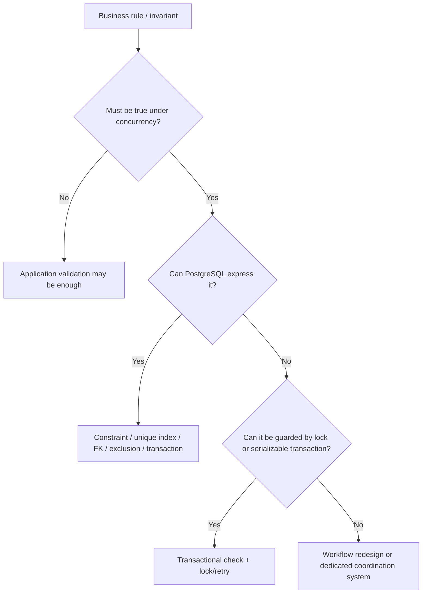
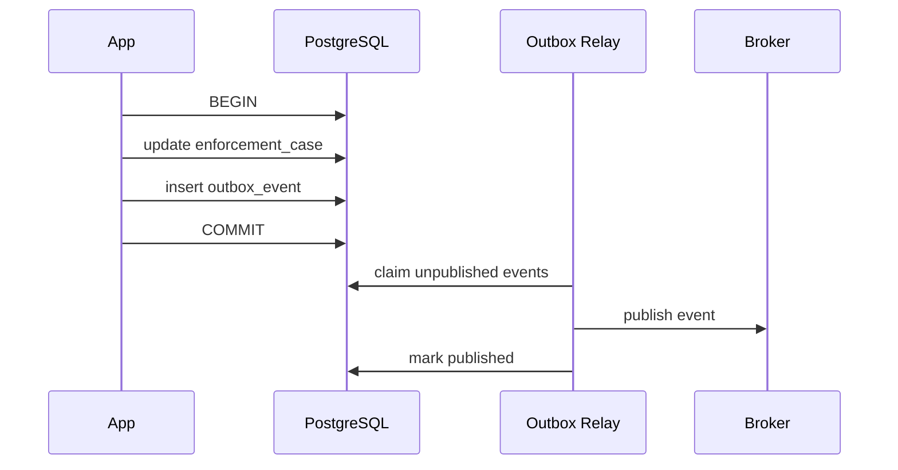
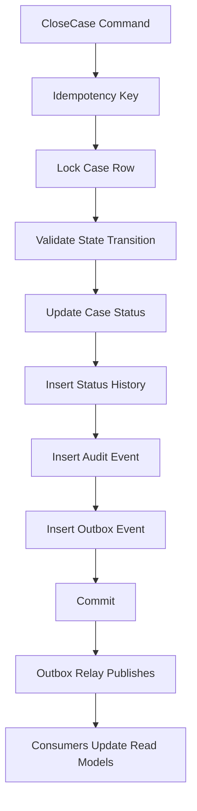

------
title: Learn PostgreSQL in Action - Part 034
description: Application architecture patterns with PostgreSQL for Java systems, including outbox, inbox, idempotency, job queues, advisory locks, audit logs, multi-tenancy, read models, and workflow state machines.
series: learn-postgresql-in-action
seriesTitle: Learn PostgreSQL in Action
order: 34
partTitle: Application Architecture Patterns with PostgreSQL
tags:
- postgresql
- java
- architecture
- outbox
- idempotency
- workflow
- distributed-systems
- series
date: 2026-07-01
---

# Part 034 — Application Architecture Patterns with PostgreSQL

PostgreSQL is not only a persistence engine. In many production systems, it becomes the **coordination boundary** for correctness.

That does not mean PostgreSQL should become a dumping ground for every architectural concern. It means that when business invariants require atomicity, uniqueness, ordering, visibility, or auditability, PostgreSQL is often the strongest place to enforce them.

A top-tier Java engineer using PostgreSQL should know when to use the database as:

- a transaction boundary;
- an invariant enforcer;
- an idempotency ledger;
- a workflow state store;
- an outbox/inbox transport boundary;
- a job queue for moderate workloads;
- a lock coordinator;
- an audit log;
- a read-model builder;
- a tenant boundary;
- a lifecycle engine.

The question is not “can PostgreSQL do this?”

The better question is:

> Is PostgreSQL the right place to enforce this invariant, coordinate this state transition, or persist this evidence?

---

## 1. Kaufman Skill Decomposition

| Sub-skill | Practice target | Why it matters |
|---|---|---|
| Invariant placement | Decide DB constraint vs app code vs message broker | Prevents correctness gaps |
| Transactional messaging | Implement outbox/inbox safely | Avoids dual-write loss |
| Idempotency | Deduplicate commands/events/retries | Makes distributed retries safe |
| Workflow modeling | Represent state machines defensibly | Prevents illegal lifecycle transitions |
| Queue design | Use `SKIP LOCKED` and leases correctly | Avoids duplicate workers and stuck jobs |
| Advisory locking | Coordinate coarse-grained work | Reduces accidental concurrent mutation |
| Audit design | Capture evidence without corrupting OLTP | Supports debugging and regulation |
| Multi-tenancy | Pick tenant isolation model | Prevents data leaks and noisy-neighbor failure |
| Read model design | Separate write invariant from read efficiency | Keeps OLTP stable |

The minimum useful target:

> Given an application workflow, you can identify which invariants must live in PostgreSQL, design the schema and transaction boundary, handle retries/idempotency, expose observability, and avoid turning PostgreSQL into an accidental monolith.

---

## 2. Decision Model: Where Should the Invariant Live?



Examples:

| Invariant | Weak placement | Stronger placement |
|---|---|---|
| Email must be unique | Java pre-check | `UNIQUE` index |
| One active assignment per case | service query before insert | partial unique index |
| Case cannot close with open actions | app-only validation | transaction with locks or deferrable constraint model |
| Same external command processed once | cache key | idempotency table with unique key |
| Event must publish after DB commit | direct Kafka publish in transaction method | transactional outbox |
| Job processed by one worker | Java synchronized block | row lease with `FOR UPDATE SKIP LOCKED` |

---

## 3. Pattern 1 — Transactional Outbox

### 3.1 Problem

A service updates PostgreSQL and publishes an event.

Naive flow:

```java
@Transactional
public void closeCase(long caseId) {
    caseRepository.close(caseId);
    kafka.send("case-closed", event);
}
```

Failure cases:

| Failure | Result |
|---|---|
| DB commit succeeds, publish fails | state changed but no event |
| publish succeeds, DB rolls back | event says something happened but DB disagrees |
| app crashes between DB and broker | unknown event status |
| broker retry duplicates event | consumer may process twice |

This is the dual-write problem.

### 3.2 Core idea

Store the domain change and event record in the same PostgreSQL transaction.



### 3.3 Schema

```sql
CREATE TABLE outbox_event (
    id uuid PRIMARY KEY DEFAULT uuidv7(),
    aggregate_type text NOT NULL,
    aggregate_id text NOT NULL,
    event_type text NOT NULL,
    event_version integer NOT NULL,
    payload jsonb NOT NULL,
    headers jsonb NOT NULL DEFAULT '{}'::jsonb,
    status text NOT NULL DEFAULT 'pending',
    attempts integer NOT NULL DEFAULT 0,
    available_at timestamptz NOT NULL DEFAULT now(),
    created_at timestamptz NOT NULL DEFAULT now(),
    published_at timestamptz,
    last_error text,
    CONSTRAINT outbox_event_status_check
        CHECK (status IN ('pending', 'publishing', 'published', 'failed'))
);

CREATE INDEX idx_outbox_pending_available
ON outbox_event(available_at, id)
WHERE status = 'pending';

CREATE INDEX idx_outbox_aggregate_order
ON outbox_event(aggregate_type, aggregate_id, created_at, id);
```

### 3.4 Write transaction

```sql
BEGIN;

UPDATE enforcement_case
SET status = 'closed',
    closed_at = now(),
    version = version + 1
WHERE id = :case_id
  AND status <> 'closed';

INSERT INTO outbox_event(
    aggregate_type,
    aggregate_id,
    event_type,
    event_version,
    payload
)
VALUES (
    'enforcement_case',
    :case_id::text,
    'CaseClosed',
    1,
    jsonb_build_object(
        'caseId', :case_id,
        'closedAt', now()
    )
);

COMMIT;
```

### 3.5 Relay claim query

```sql
WITH next_events AS (
    SELECT id
    FROM outbox_event
    WHERE status = 'pending'
      AND available_at <= now()
    ORDER BY available_at, id
    LIMIT 100
    FOR UPDATE SKIP LOCKED
)
UPDATE outbox_event e
SET status = 'publishing',
    attempts = attempts + 1
FROM next_events n
WHERE e.id = n.id
RETURNING e.*;
```

After publishing:

```sql
UPDATE outbox_event
SET status = 'published',
    published_at = now(),
    last_error = NULL
WHERE id = :id;
```

On failure:

```sql
UPDATE outbox_event
SET status = CASE WHEN attempts >= 10 THEN 'failed' ELSE 'pending' END,
    available_at = now() + make_interval(secs => least(3600, attempts * attempts * 5)),
    last_error = :error
WHERE id = :id;
```

### 3.6 Outbox truths

Transactional outbox guarantees:

- if the DB transaction commits, the event intent exists;
- relay can recover after crash;
- publishing can be retried.

It does **not** guarantee:

- exactly-once broker delivery;
- consumer exactly-once processing;
- global ordering across all aggregates;
- instant delivery;
- schema compatibility.

Consumers must still be idempotent.

---

## 4. Pattern 2 — Inbox / Idempotent Consumer

### 4.1 Problem

Distributed systems retry. Brokers redeliver. HTTP clients retry after timeouts. Schedulers run twice.

If processing is not idempotent, duplicate input creates duplicate side effects.

### 4.2 Inbox schema

```sql
CREATE TABLE processed_message (
    consumer_name text NOT NULL,
    message_id text NOT NULL,
    processed_at timestamptz NOT NULL DEFAULT now(),
    payload_hash text,
    PRIMARY KEY (consumer_name, message_id)
);
```

### 4.3 Idempotent processing transaction

```sql
BEGIN;

INSERT INTO processed_message(consumer_name, message_id, payload_hash)
VALUES (:consumer_name, :message_id, :payload_hash)
ON CONFLICT DO NOTHING;

-- Check whether insert happened.
-- In Java, use update count or RETURNING.

-- Only execute side effect if inserted.

COMMIT;
```

Better with `RETURNING`:

```sql
WITH inserted AS (
    INSERT INTO processed_message(consumer_name, message_id, payload_hash)
    VALUES (:consumer_name, :message_id, :payload_hash)
    ON CONFLICT DO NOTHING
    RETURNING 1
)
SELECT EXISTS (SELECT 1 FROM inserted) AS should_process;
```

### 4.4 Java pseudo-code

```java
@Transactional
public void handle(Event event) {
    boolean firstTime = inboxRepository.tryRecord(
        "case-projection",
        event.messageId(),
        event.payloadHash()
    );

    if (!firstTime) {
        return;
    }

    projectionRepository.apply(event);
}
```

### 4.5 Retention

The inbox table grows forever unless you define retention.

Options:

- retain forever for regulatory evidence;
- retain for replay window only;
- partition by month and drop old partitions;
- archive to cold storage.

Retention depends on the maximum duplicate delivery window and audit requirements.

---

## 5. Pattern 3 — Idempotency Key for Commands

### 5.1 Problem

A user submits a command. The API times out. The client retries. Did the command run once or twice?

Examples:

- create payment;
- submit enforcement action;
- close case;
- approve workflow step;
- generate report;
- create external reference.

### 5.2 Schema

```sql
CREATE TABLE idempotency_key (
    key text PRIMARY KEY,
    request_hash text NOT NULL,
    status text NOT NULL,
    response_code integer,
    response_body jsonb,
    locked_until timestamptz,
    created_at timestamptz NOT NULL DEFAULT now(),
    updated_at timestamptz NOT NULL DEFAULT now(),
    CONSTRAINT idempotency_status_check
        CHECK (status IN ('processing', 'completed', 'failed'))
);
```

### 5.3 Claim command

```sql
INSERT INTO idempotency_key(key, request_hash, status, locked_until)
VALUES (:key, :request_hash, 'processing', now() + interval '2 minutes')
ON CONFLICT DO NOTHING;
```

If inserted, process command.

If conflict, inspect row:

```sql
SELECT status, request_hash, response_code, response_body, locked_until
FROM idempotency_key
WHERE key = :key;
```

Rules:

- same key + same request hash + completed → return stored response;
- same key + different request hash → reject;
- processing and lock not expired → return 409/202;
- processing and lock expired → allow recovery path;
- failed → decide whether retry is allowed.

### 5.4 Store result atomically

The command side effect and idempotency completion should be in the same transaction when possible.

```sql
BEGIN;

-- business mutation
INSERT INTO enforcement_action(case_id, action_type, created_by)
VALUES (:case_id, 'NOTICE_SENT', :user_id)
RETURNING id;

UPDATE idempotency_key
SET status = 'completed',
    response_code = 201,
    response_body = jsonb_build_object('actionId', :action_id),
    updated_at = now()
WHERE key = :key;

COMMIT;
```

---

## 6. Pattern 4 — Work Queue with `FOR UPDATE SKIP LOCKED`

PostgreSQL can serve as a reliable moderate-throughput job queue when the queue is naturally coupled to the database state.

It should not replace Kafka, RabbitMQ, or a dedicated queue for high-throughput streaming, fanout, long retention, or complex broker semantics.

### 6.1 Schema

```sql
CREATE TABLE job_queue (
    id bigserial PRIMARY KEY,
    job_type text NOT NULL,
    payload jsonb NOT NULL,
    status text NOT NULL DEFAULT 'ready',
    priority integer NOT NULL DEFAULT 100,
    run_at timestamptz NOT NULL DEFAULT now(),
    attempts integer NOT NULL DEFAULT 0,
    max_attempts integer NOT NULL DEFAULT 10,
    locked_by text,
    locked_until timestamptz,
    created_at timestamptz NOT NULL DEFAULT now(),
    updated_at timestamptz NOT NULL DEFAULT now(),
    last_error text,
    CONSTRAINT job_queue_status_check
        CHECK (status IN ('ready', 'running', 'done', 'failed', 'cancelled'))
);

CREATE INDEX idx_job_queue_ready
ON job_queue(priority, run_at, id)
WHERE status = 'ready';

CREATE INDEX idx_job_queue_expired_running
ON job_queue(locked_until, id)
WHERE status = 'running';
```

### 6.2 Claim jobs

```sql
WITH candidate AS (
    SELECT id
    FROM job_queue
    WHERE status = 'ready'
      AND run_at <= now()
    ORDER BY priority, run_at, id
    LIMIT 10
    FOR UPDATE SKIP LOCKED
)
UPDATE job_queue j
SET status = 'running',
    locked_by = :worker_id,
    locked_until = now() + interval '5 minutes',
    attempts = attempts + 1,
    updated_at = now()
FROM candidate c
WHERE j.id = c.id
RETURNING j.*;
```

### 6.3 Complete job

```sql
UPDATE job_queue
SET status = 'done',
    locked_by = NULL,
    locked_until = NULL,
    updated_at = now()
WHERE id = :id
  AND locked_by = :worker_id;
```

### 6.4 Retry job

```sql
UPDATE job_queue
SET status = CASE WHEN attempts >= max_attempts THEN 'failed' ELSE 'ready' END,
    run_at = now() + make_interval(secs => least(3600, attempts * attempts * 10)),
    locked_by = NULL,
    locked_until = NULL,
    last_error = :error,
    updated_at = now()
WHERE id = :id
  AND locked_by = :worker_id;
```

### 6.5 Reap expired jobs

```sql
UPDATE job_queue
SET status = 'ready',
    locked_by = NULL,
    locked_until = NULL,
    updated_at = now()
WHERE status = 'running'
  AND locked_until < now();
```

### 6.6 Queue anti-patterns

Avoid PostgreSQL queue when:

- jobs take very long and hold DB transactions open;
- queue throughput dominates OLTP workload;
- fanout to many consumers is required;
- strict broker-like delivery semantics are needed;
- payloads are huge;
- polling rate creates heavy database load.

For many internal workflow jobs, PostgreSQL queue is excellent. For event streaming, use a broker.

---

## 7. Pattern 5 — Advisory Locks

Advisory locks are application-defined locks managed by PostgreSQL.

They are useful for coarse-grained coordination:

- one scheduler instance runs a task;
- one worker processes a tenant;
- one migration/backfill runs at a time;
- avoid duplicate report generation;
- serialize aggregate-level maintenance.

### 7.1 Transaction-level advisory lock

```sql
SELECT pg_try_advisory_xact_lock(hashtext(:lock_name));
```

If it returns false, someone else owns the lock.

Transaction-level locks are released automatically at commit/rollback.

### 7.2 Example: one scheduled job per cluster

```java
@Transactional
public void runDailyEscalationScan() {
    boolean acquired = jdbc.queryForObject(
        "select pg_try_advisory_xact_lock(hashtext(?))",
        Boolean.class,
        "daily-escalation-scan"
    );

    if (!acquired) {
        return;
    }

    escalationService.scanAndCreateWorkItems();
}
```

### 7.3 Advisory lock cautions

- They do not protect rows unless every code path obeys the convention.
- Session-level locks can leak through connection pools if mishandled.
- Use transaction-level locks when possible.
- Design lock names/keys deterministically.
- Avoid advisory locks as a substitute for constraints.

---

## 8. Pattern 6 — Workflow State Machine

Regulatory and case-management systems often need defensible lifecycle transitions.

Bad model:

```sql
UPDATE enforcement_case
SET status = :new_status
WHERE id = :id;
```

This allows illegal transitions unless every caller validates correctly.

### 8.1 Explicit state transition table

```sql
CREATE TABLE case_status_transition (
    from_status text NOT NULL,
    to_status text NOT NULL,
    required_permission text NOT NULL,
    PRIMARY KEY (from_status, to_status)
);

INSERT INTO case_status_transition(from_status, to_status, required_permission)
VALUES
    ('draft', 'open', 'case.open'),
    ('open', 'escalated', 'case.escalate'),
    ('escalated', 'closed', 'case.close'),
    ('open', 'closed', 'case.close');
```

### 8.2 Transition command

```sql
WITH current_case AS (
    SELECT id, status, version
    FROM enforcement_case
    WHERE id = :case_id
    FOR UPDATE
), allowed AS (
    SELECT c.id
    FROM current_case c
    JOIN case_status_transition t
      ON t.from_status = c.status
     AND t.to_status = :to_status
)
UPDATE enforcement_case e
SET status = :to_status,
    version = version + 1,
    updated_at = now()
FROM allowed a
WHERE e.id = a.id
RETURNING e.id, e.status, e.version;
```

If no row returns, the transition is illegal or the case does not exist.

### 8.3 Transition audit

```sql
CREATE TABLE case_status_history (
    id bigserial PRIMARY KEY,
    case_id bigint NOT NULL REFERENCES enforcement_case(id),
    from_status text NOT NULL,
    to_status text NOT NULL,
    changed_by bigint NOT NULL,
    reason text,
    changed_at timestamptz NOT NULL DEFAULT now(),
    command_id text NOT NULL,
    UNIQUE (command_id)
);
```

Write history in the same transaction.

```sql
BEGIN;

-- lock and update case
-- insert history
-- insert outbox event

COMMIT;
```

### 8.4 Why this matters

A lifecycle model should answer:

- who changed the state;
- when it changed;
- why it changed;
- what the previous state was;
- which command caused it;
- whether the transition was legal at that time.

This is crucial for regulated systems.

---

## 9. Pattern 7 — Audit Log

Audit log is not the same as application log.

Application log is diagnostic evidence.
Audit log is business/legal evidence.

### 9.1 Audit schema

```sql
CREATE TABLE audit_event (
    id uuid PRIMARY KEY DEFAULT uuidv7(),
    actor_id text,
    actor_type text NOT NULL,
    action text NOT NULL,
    entity_type text NOT NULL,
    entity_id text NOT NULL,
    before_state jsonb,
    after_state jsonb,
    metadata jsonb NOT NULL DEFAULT '{}'::jsonb,
    request_id text,
    created_at timestamptz NOT NULL DEFAULT now()
);

CREATE INDEX idx_audit_entity
ON audit_event(entity_type, entity_id, created_at DESC);

CREATE INDEX idx_audit_actor
ON audit_event(actor_type, actor_id, created_at DESC);
```

### 9.2 Audit write rule

Write audit in the same transaction as the business mutation when audit must prove the mutation.

```sql
BEGIN;

UPDATE enforcement_case
SET status = 'escalated'
WHERE id = :case_id
RETURNING to_jsonb(enforcement_case.*);

INSERT INTO audit_event(
    actor_id,
    actor_type,
    action,
    entity_type,
    entity_id,
    before_state,
    after_state,
    request_id
)
VALUES (...);

COMMIT;
```

### 9.3 Audit design cautions

- Avoid storing secrets or sensitive payloads accidentally.
- Define retention and access control.
- Partition high-volume audit tables.
- Do not make every audit query hit hot OLTP tables.
- Consider immutable append-only design.
- Decide whether audit captures intent, state diff, or full snapshot.

---

## 10. Pattern 8 — Append-Only Ledger

For certain domains, updates destroy evidence.

Instead of mutating balances/status facts directly, append entries.

```sql
CREATE TABLE case_risk_ledger (
    id bigserial PRIMARY KEY,
    case_id bigint NOT NULL REFERENCES enforcement_case(id),
    delta integer NOT NULL,
    reason text NOT NULL,
    command_id text NOT NULL UNIQUE,
    created_at timestamptz NOT NULL DEFAULT now()
);
```

Current value:

```sql
SELECT case_id, sum(delta) AS risk_score
FROM case_risk_ledger
WHERE case_id = :case_id
GROUP BY case_id;
```

For performance, maintain summary table transactionally:

```sql
CREATE TABLE case_risk_summary (
    case_id bigint PRIMARY KEY REFERENCES enforcement_case(id),
    risk_score integer NOT NULL,
    updated_at timestamptz NOT NULL DEFAULT now()
);
```

Update both in one transaction:

```sql
BEGIN;

INSERT INTO case_risk_ledger(case_id, delta, reason, command_id)
VALUES (:case_id, :delta, :reason, :command_id);

INSERT INTO case_risk_summary(case_id, risk_score)
VALUES (:case_id, :delta)
ON CONFLICT (case_id)
DO UPDATE SET
    risk_score = case_risk_summary.risk_score + EXCLUDED.risk_score,
    updated_at = now();

COMMIT;
```

The ledger is evidence. The summary is a cache/read model.

---

## 11. Pattern 9 — Temporal Validity

Many regulatory facts are not simply true or false. They are valid during a period.

Examples:

- license active during a date range;
- officer assignment valid during a date range;
- policy version applies during a period;
- sanction effective from/to;
- legal entity relationship active during a period.

### 11.1 Range-based model

```sql
CREATE TABLE officer_assignment (
    id bigserial PRIMARY KEY,
    case_id bigint NOT NULL REFERENCES enforcement_case(id),
    officer_id bigint NOT NULL,
    valid_during tstzrange NOT NULL,
    created_at timestamptz NOT NULL DEFAULT now(),
    EXCLUDE USING gist (
        case_id WITH =,
        valid_during WITH &&
    )
);
```

This exclusion constraint prevents overlapping assignments for the same case.

### 11.2 Query current assignment

```sql
SELECT *
FROM officer_assignment
WHERE case_id = :case_id
  AND valid_during @> now();
```

### 11.3 Temporal mental model

Do not overwrite history when the business asks:

- what was true then?
- who was responsible at that time?
- which rule version applied?
- what changed between two points?

Temporal data is not an implementation detail. It is a domain model.

---

## 12. Pattern 10 — Multi-Tenancy

PostgreSQL supports multiple multi-tenancy models. Each has trade-offs.

| Model | Pros | Cons | Good fit |
|---|---|---|---|
| Tenant column | simple operations, shared schema | leakage risk if query misses tenant filter | many small tenants |
| Schema per tenant | namespace isolation | migration complexity, many objects | medium tenants, customization |
| Database per tenant | strong isolation | operational overhead | high-value tenants |
| Cluster per tenant | strongest isolation | expensive | regulated/high-risk tenants |

### 12.1 Tenant-column pattern

```sql
CREATE TABLE tenant_case (
    tenant_id uuid NOT NULL,
    id uuid NOT NULL DEFAULT uuidv7(),
    status text NOT NULL,
    created_at timestamptz NOT NULL DEFAULT now(),
    PRIMARY KEY (tenant_id, id)
);
```

Indexes should usually start with `tenant_id` for tenant-scoped queries:

```sql
CREATE INDEX idx_tenant_case_status_created
ON tenant_case(tenant_id, status, created_at DESC);
```

### 12.2 RLS pattern

```sql
ALTER TABLE tenant_case ENABLE ROW LEVEL SECURITY;

CREATE POLICY tenant_case_isolation
ON tenant_case
USING (tenant_id = current_setting('app.tenant_id')::uuid)
WITH CHECK (tenant_id = current_setting('app.tenant_id')::uuid);
```

Set per transaction:

```sql
BEGIN;
SET LOCAL app.tenant_id = '00000000-0000-0000-0000-000000000001';
SELECT * FROM tenant_case;
COMMIT;
```

Java caution: `SET LOCAL` is safer than session-level `SET` with pooled connections because it is scoped to the transaction.

### 12.3 Multi-tenancy anti-patterns

- relying only on application filters for high-risk tenant isolation;
- forgetting tenant_id in unique indexes;
- global sequences exposing cross-tenant volume;
- using schema-per-tenant without migration automation;
- allowing ad-hoc support queries without tenant guardrails;
- mixing tenant and non-tenant data in unclear ways.

---

## 13. Pattern 11 — Materialized Read Models

OLTP schema should enforce writes. Read schema should serve query needs.

When a dashboard query becomes too expensive, do not blindly add indexes to OLTP tables. Consider a read model.

### 13.1 Summary table

```sql
CREATE TABLE case_status_daily_summary (
    summary_date date NOT NULL,
    status text NOT NULL,
    count bigint NOT NULL,
    PRIMARY KEY (summary_date, status)
);
```

Refresh incrementally from events or daily job.

```sql
INSERT INTO case_status_daily_summary(summary_date, status, count)
SELECT current_date, status, count(*)
FROM enforcement_case
GROUP BY status
ON CONFLICT (summary_date, status)
DO UPDATE SET count = EXCLUDED.count;
```

### 13.2 Materialized view

```sql
CREATE MATERIALIZED VIEW case_status_summary_mv AS
SELECT status, count(*) AS total
FROM enforcement_case
GROUP BY status;

CREATE UNIQUE INDEX ux_case_status_summary_mv_status
ON case_status_summary_mv(status);
```

Refresh concurrently when unique index requirements are met:

```sql
REFRESH MATERIALIZED VIEW CONCURRENTLY case_status_summary_mv;
```

### 13.3 Read model rule

A read model may be stale. That is acceptable only when the product and workflow semantics allow it.

Classify read models by freshness:

| Freshness | Example |
|---|---|
| transactionally fresh | case detail page after update |
| seconds stale | operational dashboard |
| minutes stale | analytics summary |
| daily stale | compliance report snapshot |

---

## 14. Pattern 12 — Soft Delete and Lifecycle States

Soft delete is often overused.

```sql
ALTER TABLE enforcement_case
ADD COLUMN deleted_at timestamptz;
```

If used, make it explicit in indexes and constraints.

```sql
CREATE UNIQUE INDEX ux_active_case_external_ref
ON enforcement_case(external_reference)
WHERE deleted_at IS NULL;
```

Common failure:

```sql
SELECT * FROM enforcement_case WHERE external_reference = :ref;
```

This accidentally returns deleted records unless every query remembers the predicate.

Better for many domains:

```sql
status IN ('draft', 'open', 'closed', 'archived')
```

Use soft delete only when semantics truly require hidden-but-retained rows.

---

## 15. Pattern 13 — Optimistic Concurrency Control

Optimistic locking prevents lost updates in request/response workflows.

```sql
ALTER TABLE enforcement_case
ADD COLUMN version bigint NOT NULL DEFAULT 0;
```

Update:

```sql
UPDATE enforcement_case
SET status = :status,
    version = version + 1,
    updated_at = now()
WHERE id = :id
  AND version = :expected_version;
```

If zero rows update, someone else changed the row.

In Hibernate, this maps naturally to `@Version`.

Use optimistic concurrency when:

- conflicts are relatively rare;
- users edit stale views;
- lost update would be harmful;
- retry or conflict UI is acceptable.

Use pessimistic locking when:

- conflict is expected;
- workflow must serialize;
- failure after conflict is expensive;
- state transition must inspect current state and mutate immediately.

---

## 16. Pattern 14 — Policy and Rule Versioning

Regulatory systems often apply rules that change over time.

Bad design:

```sql
case_result.reason = 'violated rule X'
```

Better:

```sql
CREATE TABLE policy_version (
    id uuid PRIMARY KEY DEFAULT uuidv7(),
    policy_code text NOT NULL,
    version integer NOT NULL,
    effective_during tstzrange NOT NULL,
    definition jsonb NOT NULL,
    created_at timestamptz NOT NULL DEFAULT now(),
    UNIQUE (policy_code, version)
);
```

Link decision to policy version:

```sql
CREATE TABLE case_decision (
    id uuid PRIMARY KEY DEFAULT uuidv7(),
    case_id uuid NOT NULL,
    policy_version_id uuid NOT NULL REFERENCES policy_version(id),
    decision text NOT NULL,
    rationale text NOT NULL,
    decided_at timestamptz NOT NULL DEFAULT now()
);
```

This lets the system answer:

- which policy was applied?
- what did the policy say at that time?
- why was the decision made?
- would the decision differ under the current policy?

---

## 17. Pattern 15 — Search Boundary

PostgreSQL can do strong search for many cases:

- exact lookup;
- prefix search with proper index;
- trigram fuzzy search;
- full-text search;
- JSONB containment;
- filtered relational search.

But PostgreSQL is not always the right search engine.

Use PostgreSQL search when:

- source of truth is relational;
- search is scoped and transactional;
- result freshness matters;
- query volume is moderate;
- ranking requirements are simple.

Use external search when:

- advanced relevance/ranking is required;
- large-scale free-text search dominates;
- heavy faceting/autocomplete is required;
- search workload threatens OLTP stability.

When using external search, treat it as a derived read model. PostgreSQL remains source of truth.

Outbox can feed the search index.

---

## 18. Pattern Composition: Case Closure Workflow

A robust case closure workflow may combine multiple patterns.



Single transaction core:

```sql
BEGIN;

-- 1. claim idempotency key
-- 2. lock case
-- 3. validate transition
-- 4. update case
-- 5. insert history
-- 6. insert audit
-- 7. insert outbox event

COMMIT;
```

The transaction boundary should contain only the state that must commit atomically.

Do not perform slow external calls inside the DB transaction.

---

## 19. Java Service Boundary

A good Java service method should make the transaction boundary obvious.

```java
@Transactional
public CloseCaseResult closeCase(CloseCaseCommand command) {
    IdempotencyDecision decision = idempotency.claim(command.idempotencyKey(), command.hash());
    if (decision.completed()) {
        return decision.previousResponse();
    }

    CaseRecord current = caseRepository.lockById(command.caseId())
        .orElseThrow(CaseNotFoundException::new);

    transitionPolicy.assertAllowed(current.status(), CaseStatus.CLOSED, command.actor());

    CaseRecord updated = caseRepository.close(command.caseId(), current.version());

    historyRepository.insertStatusChange(...);
    auditRepository.insert(...);
    outboxRepository.insert(...);

    CloseCaseResult result = CloseCaseResult.from(updated);
    idempotency.complete(command.idempotencyKey(), result);

    return result;
}
```

Important details:

- no HTTP calls inside transaction;
- no Kafka publish inside transaction;
- no blocking long computation inside transaction;
- use row lock only when needed;
- use optimistic version for stale update detection;
- insert outbox event before commit;
- return deterministic result for idempotent retry.

---

## 20. Observability for Application Patterns

Each pattern needs metrics.

### 20.1 Outbox metrics

```sql
SELECT status, count(*)
FROM outbox_event
GROUP BY status;
```

Oldest pending:

```sql
SELECT min(created_at), now() - min(created_at) AS oldest_age
FROM outbox_event
WHERE status = 'pending';
```

Failed events:

```sql
SELECT event_type, count(*), max(last_error)
FROM outbox_event
WHERE status = 'failed'
GROUP BY event_type;
```

### 20.2 Queue metrics

```sql
SELECT status, count(*)
FROM job_queue
GROUP BY status;
```

Expired running jobs:

```sql
SELECT count(*)
FROM job_queue
WHERE status = 'running'
  AND locked_until < now();
```

### 20.3 Idempotency metrics

```sql
SELECT status, count(*)
FROM idempotency_key
WHERE created_at > now() - interval '1 day'
GROUP BY status;
```

### 20.4 Workflow metrics

```sql
SELECT from_status, to_status, count(*)
FROM case_status_history
WHERE changed_at > now() - interval '7 days'
GROUP BY from_status, to_status
ORDER BY count(*) DESC;
```

---

## 21. Failure Mode Catalog

| Pattern | Failure mode | Mitigation |
|---|---|---|
| Outbox | published but not marked published | idempotent consumers, relay retry |
| Outbox | stuck pending events | age alert, relay health check |
| Inbox | table grows forever | retention/partitioning |
| Idempotency | key reused with different payload | request hash check |
| Queue | worker dies after claim | lease expiration/reaper |
| Queue | job holds DB tx too long | claim then commit; process outside tx when safe |
| Advisory lock | session lock leaks | prefer transaction-level locks |
| Audit | sensitive data logged | redaction and access control |
| Multi-tenant | missing tenant predicate | RLS and composite keys |
| Read model | stale data misused as truth | freshness contract |
| Soft delete | deleted rows included | partial indexes, scoped repository methods |
| Optimistic lock | conflict ignored | check affected row count |

---

## 22. Practice Lab

Build a mini case workflow using PostgreSQL.

### 22.1 Tables

```sql
CREATE TABLE enforcement_case (
    id uuid PRIMARY KEY DEFAULT uuidv7(),
    status text NOT NULL DEFAULT 'draft',
    version bigint NOT NULL DEFAULT 0,
    created_at timestamptz NOT NULL DEFAULT now(),
    updated_at timestamptz NOT NULL DEFAULT now(),
    CONSTRAINT enforcement_case_status_check
        CHECK (status IN ('draft', 'open', 'escalated', 'closed'))
);

CREATE TABLE case_status_history (
    id bigserial PRIMARY KEY,
    case_id uuid NOT NULL REFERENCES enforcement_case(id),
    from_status text NOT NULL,
    to_status text NOT NULL,
    command_id text NOT NULL UNIQUE,
    changed_at timestamptz NOT NULL DEFAULT now()
);

CREATE TABLE outbox_event (
    id uuid PRIMARY KEY DEFAULT uuidv7(),
    aggregate_type text NOT NULL,
    aggregate_id text NOT NULL,
    event_type text NOT NULL,
    payload jsonb NOT NULL,
    status text NOT NULL DEFAULT 'pending',
    created_at timestamptz NOT NULL DEFAULT now()
);
```

### 22.2 Task

Implement `openCase(commandId, caseId)` with:

- idempotency;
- legal transition from `draft` to `open` only;
- optimistic or pessimistic concurrency;
- status history;
- outbox event;
- retry-safe behavior.

### 22.3 Expected invariant

After any number of retries:

```sql
SELECT count(*)
FROM case_status_history
WHERE command_id = :command_id;
```

should be at most `1`.

And:

```sql
SELECT status
FROM enforcement_case
WHERE id = :case_id;
```

should be deterministic.

---

## 23. Design Heuristics

Use PostgreSQL as the source of truth when:

- the invariant is relational;
- correctness must survive concurrent requests;
- retries and duplicate messages are expected;
- auditability matters;
- the state transition must be atomic;
- data must be recoverable from backup/PITR;
- Java instances are horizontally scaled.

Avoid overusing PostgreSQL when:

- the workload is unbounded stream processing;
- fanout dominates;
- search ranking dominates;
- jobs are long-running and external-resource heavy;
- coordination would be better served by a dedicated system;
- database load becomes a bottleneck for unrelated OLTP traffic.

---

## 24. Self-Correction Checklist

You understand this part when you can:

- explain the dual-write problem and solve it with outbox;
- design an idempotency key table;
- implement an idempotent consumer with inbox;
- use `FOR UPDATE SKIP LOCKED` for moderate job queues;
- use advisory locks without leaking locks through connection pools;
- model lifecycle transitions defensibly;
- design audit logs as evidence, not debug logs;
- choose a multi-tenancy model and understand its failure modes;
- decide when a read model is safer than pushing OLTP indexes further;
- compose these patterns into one coherent Java/PostgreSQL transaction boundary.

---

## 25. Key Takeaways

Application architecture with PostgreSQL is about placing invariants where they can actually be enforced.

The practical rules:

1. Use constraints and unique indexes for invariants PostgreSQL can express.
2. Use transactions for state changes that must commit atomically.
3. Use outbox to avoid DB/broker dual-write loss.
4. Use inbox/idempotency keys to survive retries and duplicate delivery.
5. Use `SKIP LOCKED` for moderate database-backed queues.
6. Use advisory locks for coarse coordination, not data integrity.
7. Treat audit logs as business evidence.
8. Model workflows as explicit state transitions.
9. Keep read models separate when query needs diverge from write invariants.
10. Make every pattern observable.

Part 035 will turn the whole series into a production-readiness capstone: given a realistic PostgreSQL-backed Java system, we will design schema, indexes, transactions, migrations, observability, HA/DR, and failure drills end to end.

---

## References

- PostgreSQL 18 Documentation — Explicit Locking: https://www.postgresql.org/docs/current/explicit-locking.html
- PostgreSQL 18 Documentation — Advisory Locks: https://www.postgresql.org/docs/current/explicit-locking.html#ADVISORY-LOCKS
- PostgreSQL 18 Documentation — `SELECT ... FOR UPDATE SKIP LOCKED`: https://www.postgresql.org/docs/current/sql-select.html
- PostgreSQL 18 Documentation — JSON Types: https://www.postgresql.org/docs/current/datatype-json.html
- PostgreSQL 18 Documentation — Constraints: https://www.postgresql.org/docs/current/ddl-constraints.html
- PostgreSQL 18 Documentation — Row Security Policies: https://www.postgresql.org/docs/current/ddl-rowsecurity.html
- PostgreSQL 18 Documentation — Materialized Views: https://www.postgresql.org/docs/current/rules-materializedviews.html
