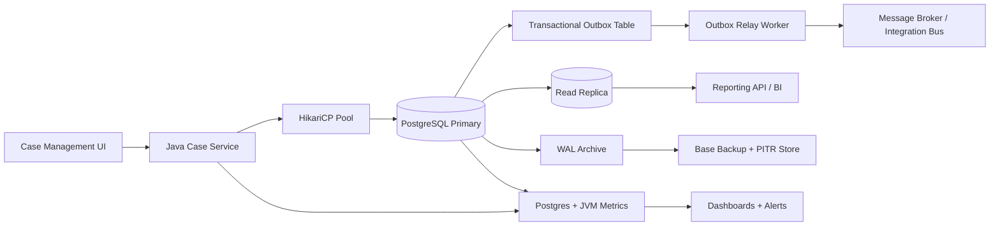
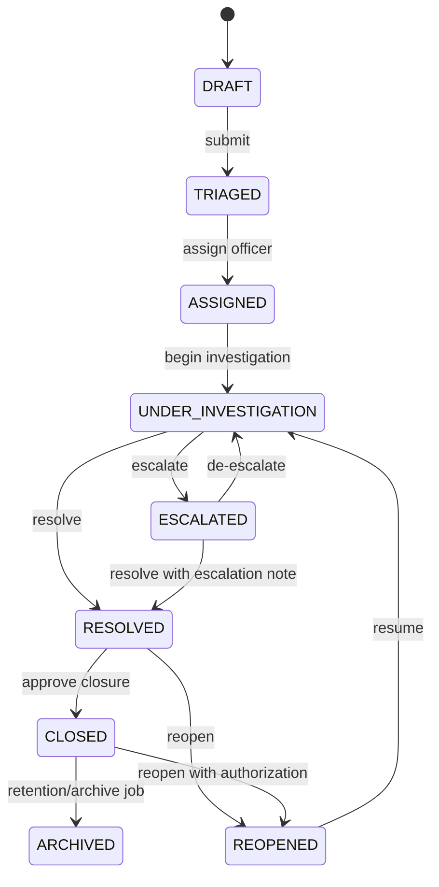
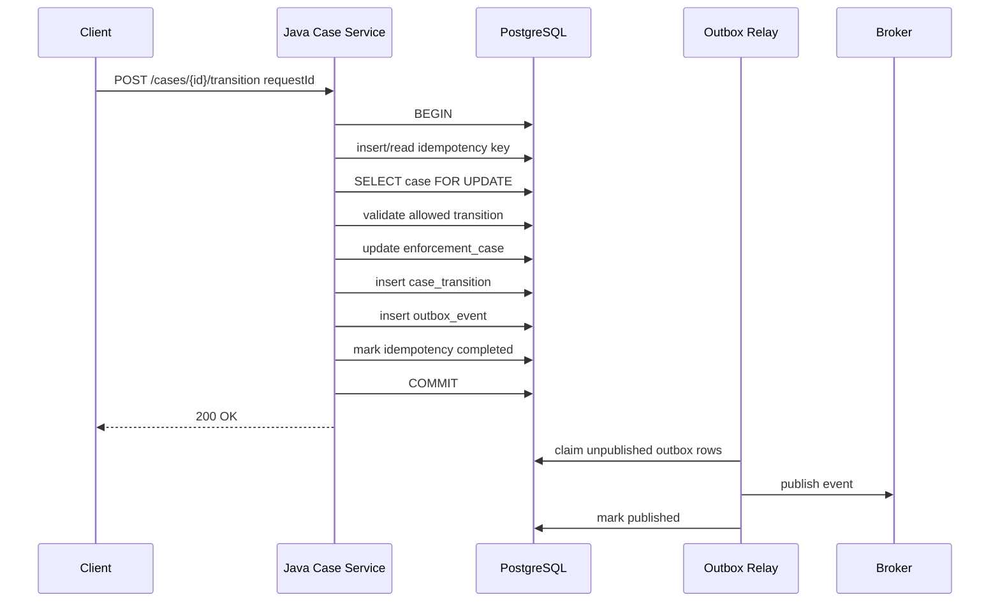
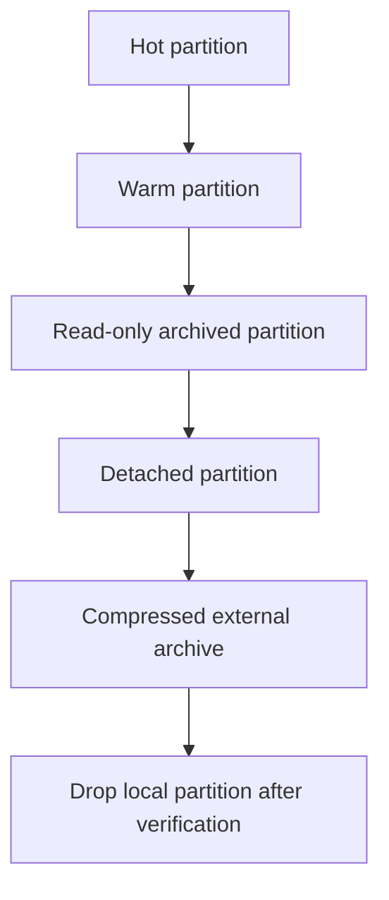
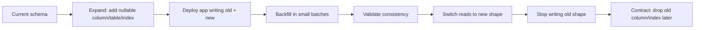
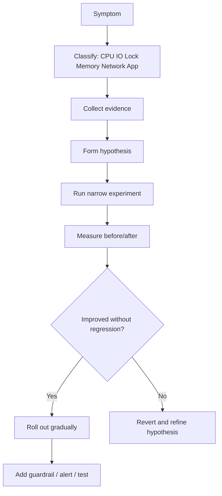

------
title: Learn PostgreSQL in Action - Part 035
description: Production readiness capstone and engineering playbook for PostgreSQL-backed Java systems, covering schema, indexes, transactions, migrations, observability, HA/DR, failure drills, and release governance.
series: learn-postgresql-in-action
seriesTitle: Learn PostgreSQL in Action
order: 35
partTitle: Production Readiness Capstone and Engineering Playbook
tags:
- postgresql
- java
- production-readiness
- performance
- observability
- high-availability
- disaster-recovery
- capstone
- series
date: 2026-07-01
---

# Part 035 — Production Readiness Capstone and Engineering Playbook

This is the final part of **Learn PostgreSQL in Action**.

The goal is to integrate the previous 34 parts into one production-grade operating model. A senior engineer should be able to move from product requirement to schema, transaction boundary, index plan, migration strategy, operational telemetry, recovery plan, and failure drill without treating PostgreSQL as a black box.

This capstone is written as an internal engineering handbook. It is not a checklist you blindly copy. It is a decision framework for building PostgreSQL-backed Java systems that remain correct under concurrency, observable under pressure, and recoverable after failure.

The central idea:

> PostgreSQL readiness is not only query speed. It is the combined quality of invariants, storage behavior, query shape, transaction discipline, migration safety, observability, recovery, and application integration.

---

## 1. Kaufman Final Skill Integration

Josh Kaufman's approach is useful because mastery is not achieved by passively reading every feature. It is achieved by decomposing the skill, practicing the high-value sub-skills, shortening feedback loops, and removing friction.

For PostgreSQL, the final integrated skill looks like this:

| Skill layer | What you must be able to do | Evidence that you can do it |
|---|---|---|
| Data modeling | Translate business invariants into relational constraints and lifecycle tables | Schema prevents invalid states under concurrency |
| Transaction design | Define atomic boundaries and retry semantics | Race-condition tests pass under parallel execution |
| Query engineering | Shape queries so the planner has healthy options | `EXPLAIN ANALYZE` shows stable cardinality, index usage, and no accidental spill |
| Index governance | Maintain an index portfolio, not random indexes | Indexes map to workload, not developer guesses |
| Storage maintenance | Control bloat, vacuum pressure, and write amplification | Dead tuple growth and autovacuum lag stay within budget |
| Migration safety | Change schema without blocking production | DDL is lock-aware, reversible, and validated gradually |
| Observability | Explain current database behavior from runtime evidence | Dashboards show workload, wait, lock, IO, WAL, vacuum, replication, and pool signals |
| HA/DR | Recover service after node, disk, region, operator, and data corruption incidents | Restore drills and failover drills are rehearsed, timed, and documented |
| Java integration | Align JDBC, pooling, ORM, timeouts, retries, and transaction scopes | Application behavior remains predictable during slow queries, failover, and contention |

The minimum production-grade capability:

> Given a non-trivial Java service backed by PostgreSQL, you can identify correctness-critical invariants, implement them safely, diagnose performance from evidence, evolve the schema without downtime, and prove recoverability through drills.

---

## 2. Capstone Scenario

We will use a complex **regulatory case management platform** as the capstone example. This domain is useful because it has the characteristics of serious production systems:

- long-running lifecycle state;
- strict auditability;
- cross-entity consistency;
- concurrent officer actions;
- escalation logic;
- deadlines and temporal validity;
- sensitive tenant/agency data;
- reporting workloads;
- operational case queues;
- integration events;
- legal defensibility.

The concrete business object is an **enforcement case**.

A case can be created, triaged, assigned, investigated, escalated, resolved, reopened, and archived. Each transition must be auditable. Some transitions require uniqueness or temporal constraints. Some actions emit integration events. Some actions must be idempotent because Java services may retry after timeout or failover.

### 2.1 Domain Invariants

| Invariant | Why it matters | PostgreSQL mechanism |
|---|---|---|
| Case reference is unique per agency | Prevents duplicate legal identity | `UNIQUE (agency_id, case_ref)` |
| Case status must be valid | Prevents illegal lifecycle states | `CHECK`, reference table, transition table |
| Only one active assignment per case | Prevents multiple owners claiming exclusive authority | partial unique index or temporal exclusion |
| Escalation must be recorded before escalated status is visible | Ensures audit defensibility | single transaction boundary |
| Audit event must exist for every transition | Ensures evidence trail | trigger or explicit transactional insert |
| External command must be idempotent | Prevents duplicate case creation on retry | idempotency key table with unique constraint |
| Outbound integration event must not be lost | Avoids dual-write failure | transactional outbox |
| Archived cases should not degrade hot OLTP paths | Controls bloat and latency | partitioning and retention strategy |
| Officers can only access their agency/tenant data | Prevents data leakage | tenant predicate, RLS where appropriate |
| Reporting cannot starve OLTP | Protects command path | replica/read model/materialized view strategy |

The important lesson:

> A production schema is not a collection of fields. It is executable business policy.

---

## 3. Architecture Overview



The architectural posture:

- PostgreSQL primary owns transactional truth.
- Java owns orchestration, API behavior, retry policy, authorization context, and user journey.
- Outbox owns reliable handoff to asynchronous systems.
- Read replicas or read models own expensive reporting.
- Backup and WAL archive own recovery, not hope.
- Observability owns feedback loops.

---

## 4. Production Schema Blueprint

The schema below is intentionally partial. It is a capstone baseline, not a full product.

```sql
CREATE SCHEMA IF NOT EXISTS case_mgmt;

CREATE TABLE case_mgmt.agency (
    agency_id          uuid PRIMARY KEY DEFAULT uuidv7(),
    agency_code        text NOT NULL UNIQUE,
    display_name       text NOT NULL,
    created_at         timestamptz NOT NULL DEFAULT now()
);

CREATE TABLE case_mgmt.case_status (
    status_code text PRIMARY KEY,
    terminal    boolean NOT NULL DEFAULT false
);

INSERT INTO case_mgmt.case_status(status_code, terminal) VALUES
    ('DRAFT', false),
    ('TRIAGED', false),
    ('ASSIGNED', false),
    ('UNDER_INVESTIGATION', false),
    ('ESCALATED', false),
    ('RESOLVED', true),
    ('CLOSED', true),
    ('ARCHIVED', true),
    ('REOPENED', false)
ON CONFLICT DO NOTHING;

CREATE TABLE case_mgmt.enforcement_case (
    case_id            uuid PRIMARY KEY DEFAULT uuidv7(),
    agency_id          uuid NOT NULL REFERENCES case_mgmt.agency(agency_id),
    case_ref           text NOT NULL,
    status_code        text NOT NULL REFERENCES case_mgmt.case_status(status_code),
    severity           smallint NOT NULL CHECK (severity BETWEEN 1 AND 5),
    subject_name       text NOT NULL,
    opened_at          timestamptz NOT NULL DEFAULT now(),
    due_at             timestamptz,
    resolved_at        timestamptz,
    archived_at        timestamptz,
    version            bigint NOT NULL DEFAULT 0,
    created_at         timestamptz NOT NULL DEFAULT now(),
    updated_at         timestamptz NOT NULL DEFAULT now(),

    CONSTRAINT enforcement_case_ref_unique UNIQUE (agency_id, case_ref),
    CONSTRAINT enforcement_case_resolved_at_check CHECK (
        (status_code IN ('RESOLVED', 'CLOSED', 'ARCHIVED') AND resolved_at IS NOT NULL)
        OR
        (status_code NOT IN ('RESOLVED', 'CLOSED', 'ARCHIVED'))
    )
);

CREATE TABLE case_mgmt.case_assignment (
    assignment_id      uuid PRIMARY KEY DEFAULT uuidv7(),
    case_id            uuid NOT NULL REFERENCES case_mgmt.enforcement_case(case_id),
    officer_id         uuid NOT NULL,
    assigned_by        uuid NOT NULL,
    assigned_at        timestamptz NOT NULL DEFAULT now(),
    released_at        timestamptz,
    release_reason     text,

    CONSTRAINT assignment_period_check CHECK (released_at IS NULL OR released_at >= assigned_at)
);

CREATE UNIQUE INDEX case_assignment_one_active_idx
ON case_mgmt.case_assignment(case_id)
WHERE released_at IS NULL;

CREATE TABLE case_mgmt.case_transition (
    transition_id      uuid PRIMARY KEY DEFAULT uuidv7(),
    case_id            uuid NOT NULL REFERENCES case_mgmt.enforcement_case(case_id),
    from_status        text NOT NULL REFERENCES case_mgmt.case_status(status_code),
    to_status          text NOT NULL REFERENCES case_mgmt.case_status(status_code),
    actor_id           uuid NOT NULL,
    reason             text NOT NULL,
    occurred_at        timestamptz NOT NULL DEFAULT now(),
    request_id         uuid NOT NULL,

    CONSTRAINT case_transition_request_unique UNIQUE (case_id, request_id)
);

CREATE TABLE case_mgmt.command_idempotency (
    command_key        text PRIMARY KEY,
    command_type       text NOT NULL,
    request_hash       bytea NOT NULL,
    response_ref       jsonb,
    status             text NOT NULL CHECK (status IN ('IN_PROGRESS', 'COMPLETED', 'FAILED_RETRYABLE', 'FAILED_FINAL')),
    created_at         timestamptz NOT NULL DEFAULT now(),
    updated_at         timestamptz NOT NULL DEFAULT now()
);

CREATE TABLE case_mgmt.outbox_event (
    outbox_id          bigserial PRIMARY KEY,
    aggregate_type     text NOT NULL,
    aggregate_id       uuid NOT NULL,
    event_type         text NOT NULL,
    event_version      integer NOT NULL,
    payload            jsonb NOT NULL,
    created_at         timestamptz NOT NULL DEFAULT now(),
    published_at       timestamptz,
    attempt_count      integer NOT NULL DEFAULT 0,
    last_error         text
);

CREATE INDEX outbox_event_unpublished_idx
ON case_mgmt.outbox_event(created_at, outbox_id)
WHERE published_at IS NULL;
```

### 4.1 Why This Schema Is Production-Oriented

It encodes rules in the database where concurrency can otherwise violate them.

| Design choice | Production purpose |
|---|---|
| `UNIQUE (agency_id, case_ref)` | Prevents duplicate case identity across retries and race conditions |
| `case_status` reference table | Makes status values auditable and extensible |
| partial unique index on active assignment | Enforces exclusive active ownership |
| `version` column | Supports optimistic concurrency in Java/Hibernate |
| idempotency table | Converts network retry into deterministic command semantics |
| transition table | Preserves lifecycle evidence independent of current state |
| outbox table | Couples DB commit and integration event creation atomically |
| JSONB outbox payload | Allows event payload evolution without polluting OLTP schema |

The strongest production posture is not “put all rules in PostgreSQL.” It is:

> Put invariants that must survive concurrency and retries close to the data. Put orchestration and user behavior in Java. Make both observable.

---

## 5. Lifecycle State Machine



### 5.1 Transition Table

For a stricter design, model allowed transitions explicitly.

```sql
CREATE TABLE case_mgmt.allowed_case_transition (
    from_status text NOT NULL REFERENCES case_mgmt.case_status(status_code),
    to_status   text NOT NULL REFERENCES case_mgmt.case_status(status_code),
    requires_reason boolean NOT NULL DEFAULT true,
    PRIMARY KEY (from_status, to_status)
);
```

Then transaction logic checks the transition under row lock.

```sql
SELECT 1
FROM case_mgmt.allowed_case_transition
WHERE from_status = :current_status
  AND to_status = :new_status;
```

This is not just validation. It is workflow defensibility. When auditors ask why a transition was allowed, the answer is not hidden inside stale application code; it is represented as data and change-controlled through migrations.

---

## 6. Command Transaction Boundary

A typical transition command should be a single PostgreSQL transaction.



### 6.1 Java Transaction Pseudocode

```java
@Transactional
public TransitionResponse transitionCase(UUID caseId, TransitionCommand command) {
    IdempotencyRecord idem = idempotencyService.claimOrReturn(
        command.commandKey(),
        command.requestHash()
    );

    if (idem.isCompleted()) {
        return idem.toResponse();
    }

    EnforcementCase current = caseRepository.findByIdForUpdate(caseId)
        .orElseThrow(CaseNotFoundException::new);

    transitionPolicy.assertAllowed(
        current.status(),
        command.toStatus(),
        command.actor()
    );

    current.transitionTo(command.toStatus(), command.reason());

    caseRepository.save(current);
    transitionRepository.insertTransition(
        caseId,
        current.previousStatus(),
        command.toStatus(),
        command.actor(),
        command.reason(),
        command.requestId()
    );

    outboxRepository.insert(
        "EnforcementCase",
        caseId,
        "CaseStatusChanged",
        1,
        eventPayload(current, command)
    );

    return idempotencyService.complete(command.commandKey(), response(current));
}
```

The transaction boundary is not arbitrary. It protects these invariants:

- the current case row cannot be concurrently transitioned into two incompatible states;
- the transition audit exists if and only if the state update commits;
- the outbox event exists if and only if the state update commits;
- retrying the same command does not create duplicate transitions;
- the client gets deterministic behavior despite network or failover uncertainty.

---

## 7. Isolation and Retry Policy

A mature PostgreSQL-backed Java service classifies failures, not just catches `Exception`.

| Failure | Likely SQLSTATE / signal | App behavior |
|---|---|---|
| Unique violation | `23505` | Convert to duplicate/idempotent result or business conflict |
| FK violation | `23503` | Return invalid reference or stale client state |
| Check violation | `23514` | Return domain validation failure |
| Serialization failure | `40001` | Retry full transaction if idempotent |
| Deadlock detected | `40P01` | Retry full transaction with jitter and lock-order review |
| Lock timeout | `55P03` or configured timeout behavior | Return busy/retryable, investigate contention |
| Statement timeout | query cancellation | Return timeout; do not assume transaction succeeded unless boundary known |
| Connection loss after commit attempt | unknown outcome | Use idempotency key or read-after-reconnect to resolve outcome |

### 7.1 Retry Boundary Rule

Only retry when all of the following are true:

1. the operation is idempotent or has an idempotency key;
2. the whole transaction can be re-run from the beginning;
3. no external side effect occurred outside the DB transaction;
4. retry count and backoff are bounded;
5. logs preserve the original failure evidence.

Unsafe retry creates duplicate side effects. Safe retry converts transient database conflict into controlled application behavior.

---

## 8. Index Portfolio for the Capstone

Do not create indexes because columns “look searchable.” Create indexes because workload evidence needs them.

### 8.1 Command Path Indexes

```sql
CREATE INDEX enforcement_case_agency_status_due_idx
ON case_mgmt.enforcement_case(agency_id, status_code, due_at, case_id)
WHERE archived_at IS NULL;

CREATE INDEX enforcement_case_officer_active_idx
ON case_mgmt.case_assignment(officer_id, assigned_at DESC, case_id)
WHERE released_at IS NULL;

CREATE INDEX case_transition_case_time_idx
ON case_mgmt.case_transition(case_id, occurred_at DESC);
```

### 8.2 Queue and Outbox Indexes

```sql
CREATE INDEX outbox_event_ready_idx
ON case_mgmt.outbox_event(created_at, outbox_id)
WHERE published_at IS NULL;
```

### 8.3 Reporting Indexes

Reporting indexes should not be mixed blindly with OLTP indexes. They may belong on a replica, read model, summary table, or materialized view.

```sql
CREATE MATERIALIZED VIEW case_mgmt.case_daily_summary AS
SELECT
    agency_id,
    date_trunc('day', opened_at)::date AS day,
    status_code,
    severity,
    count(*) AS case_count
FROM case_mgmt.enforcement_case
GROUP BY agency_id, date_trunc('day', opened_at)::date, status_code, severity;

CREATE UNIQUE INDEX case_daily_summary_key
ON case_mgmt.case_daily_summary(agency_id, day, status_code, severity);
```

### 8.4 Index Decision Checklist

Before adding an index, answer:

| Question | Why it matters |
|---|---|
| Which exact query shape needs this index? | Prevents speculative indexes |
| What is the estimated selectivity? | Avoids indexes that filter too little |
| Does the index support ordering? | Avoids extra sort on hot paths |
| Is a partial index possible? | Reduces write amplification |
| Does this duplicate an existing index prefix? | Prevents index bloat |
| Will updates to indexed columns break HOT update? | Prevents silent write cost increase |
| How will the index be created in production? | Avoids long blocking DDL |
| How will we validate that it helped? | Forces evidence-based tuning |

---

## 9. Query Shape Playbook

### 9.1 Hot Case Queue Query

Bad shape:

```sql
SELECT *
FROM case_mgmt.enforcement_case c
WHERE lower(c.status_code) = lower(:status)
ORDER BY c.due_at ASC
LIMIT 50;
```

Problems:

- function-wrapped column prevents normal B-tree use unless expression index exists;
- no tenant boundary;
- `SELECT *` increases IO and network payload;
- no stable tie-breaker in ordering.

Better shape:

```sql
SELECT
    c.case_id,
    c.case_ref,
    c.status_code,
    c.severity,
    c.due_at
FROM case_mgmt.enforcement_case c
WHERE c.agency_id = :agency_id
  AND c.status_code = :status_code
  AND c.archived_at IS NULL
ORDER BY c.due_at ASC NULLS LAST, c.case_id ASC
LIMIT :limit;
```

Supporting index:

```sql
CREATE INDEX enforcement_case_queue_idx
ON case_mgmt.enforcement_case(agency_id, status_code, due_at, case_id)
WHERE archived_at IS NULL;
```

### 9.2 Keyset Pagination

Offset pagination becomes expensive and unstable on large tables.

```sql
SELECT
    c.case_id,
    c.case_ref,
    c.due_at,
    c.status_code
FROM case_mgmt.enforcement_case c
WHERE c.agency_id = :agency_id
  AND c.status_code = :status_code
  AND c.archived_at IS NULL
  AND (
      c.due_at, c.case_id
  ) > (
      :last_due_at, :last_case_id
  )
ORDER BY c.due_at ASC, c.case_id ASC
LIMIT 50;
```

The stable ordering key must be unique or tie-broken by a unique column. Otherwise pages can skip or duplicate records under concurrent writes.

### 9.3 Audit Timeline Query

```sql
SELECT
    t.transition_id,
    t.from_status,
    t.to_status,
    t.actor_id,
    t.reason,
    t.occurred_at
FROM case_mgmt.case_transition t
WHERE t.case_id = :case_id
ORDER BY t.occurred_at DESC, t.transition_id DESC
LIMIT 100;
```

Supporting index:

```sql
CREATE INDEX case_transition_timeline_idx
ON case_mgmt.case_transition(case_id, occurred_at DESC, transition_id DESC);
```

---

## 10. Partitioning and Lifecycle Strategy

Partitioning is not a first response to bad queries. It is a lifecycle strategy.

Use partitioning when at least one is true:

- retention requires fast detach/drop of old data;
- time-bounded queries dominate workload;
- vacuum pressure from old and hot data should be isolated;
- archive/restore operations need partition-level boundaries;
- table size makes maintenance windows difficult.

### 10.1 Candidate Partition Tables

| Table | Partition key | Reason |
|---|---|---|
| `case_transition` | `occurred_at` monthly | Append-heavy audit trail, retention/archive |
| `outbox_event` | `created_at` monthly or weekly | High churn, deletion after publish/archive |
| `case_audit_event` | `occurred_at` monthly | Evidence trail and reporting |
| `enforcement_case` | usually not first choice | Current state table is often better kept unpartitioned unless very large or tenant/time access is dominant |

### 10.2 Retention Pattern



Retention is not `DELETE FROM huge_table WHERE old`. For large append-only tables, a partition lifecycle is often safer:

1. create future partitions ahead of time;
2. route writes through the partitioned parent;
3. detach old partitions after retention boundary;
4. export/archive detached partition;
5. verify archive checksums and restore path;
6. drop detached partition only after verification.

---

## 11. Zero-Downtime Migration Playbook

Most production schema incidents are not caused by PostgreSQL being unreliable. They are caused by unsafe DDL, large backfills, and application/schema version mismatch.

### 11.1 Expand-Contract Pattern



### 11.2 Example: Add Normalized Severity Table

Step 1: expand.

```sql
CREATE TABLE case_mgmt.severity_level (
    severity smallint PRIMARY KEY,
    label text NOT NULL,
    requires_escalation boolean NOT NULL DEFAULT false
);

INSERT INTO case_mgmt.severity_level(severity, label, requires_escalation) VALUES
    (1, 'Low', false),
    (2, 'Medium', false),
    (3, 'High', false),
    (4, 'Critical', true),
    (5, 'Emergency', true);

ALTER TABLE case_mgmt.enforcement_case
ADD CONSTRAINT enforcement_case_severity_fk
FOREIGN KEY (severity)
REFERENCES case_mgmt.severity_level(severity)
NOT VALID;
```

Step 2: validate later.

```sql
ALTER TABLE case_mgmt.enforcement_case
VALIDATE CONSTRAINT enforcement_case_severity_fk;
```

Step 3: deploy application logic that reads severity metadata.

Step 4: monitor.

Step 5: only then remove old duplicated severity interpretation from Java code.

### 11.3 Online Index Creation

```sql
CREATE INDEX CONCURRENTLY enforcement_case_due_worklist_idx
ON case_mgmt.enforcement_case(agency_id, due_at, case_id)
WHERE archived_at IS NULL;
```

Rules:

- do not run `CREATE INDEX CONCURRENTLY` inside a normal transaction block;
- watch for invalid indexes after failure;
- throttle competing maintenance if the database is already IO-bound;
- validate improvement with `EXPLAIN ANALYZE` and production query stats;
- remove redundant indexes only after observing workload stability.

---

## 12. Observability Dashboard Blueprint

A production PostgreSQL dashboard should answer questions, not merely show metrics.

### 12.1 Questions the Dashboard Must Answer

| Question | Evidence |
|---|---|
| What is running now? | `pg_stat_activity` |
| What is waiting? | wait events, blocking PIDs |
| Which queries dominate time? | `pg_stat_statements` |
| Are estimates wrong? | plan review, actual vs estimated rows |
| Is IO the bottleneck? | `pg_stat_io`, buffer hit/read, temp files |
| Are locks causing latency? | lock wait graph |
| Is vacuum keeping up? | dead tuples, autovacuum progress, freeze age |
| Are checkpoints disruptive? | checkpoint frequency, WAL/checkpoint stats |
| Is replication lag safe? | replay lag, slot retained WAL |
| Is the Java pool saturated? | active/idle/pending Hikari metrics |
| Are timeouts rising? | app error rate by SQLSTATE and timeout type |

### 12.2 Baseline Diagnostic Query Set

Active sessions:

```sql
SELECT
    pid,
    application_name,
    usename,
    state,
    wait_event_type,
    wait_event,
    now() - query_start AS query_age,
    left(query, 200) AS query_preview
FROM pg_stat_activity
WHERE state <> 'idle'
ORDER BY query_start NULLS LAST;
```

Blocking chain:

```sql
SELECT
    blocked.pid AS blocked_pid,
    blocked.application_name AS blocked_app,
    now() - blocked.query_start AS blocked_age,
    blocker.pid AS blocker_pid,
    blocker.application_name AS blocker_app,
    now() - blocker.query_start AS blocker_age,
    left(blocked.query, 160) AS blocked_query,
    left(blocker.query, 160) AS blocker_query
FROM pg_stat_activity blocked
JOIN pg_stat_activity blocker
  ON blocker.pid = ANY(pg_blocking_pids(blocked.pid));
```

Top normalized queries:

```sql
SELECT
    queryid,
    calls,
    total_exec_time,
    mean_exec_time,
    rows,
    shared_blks_hit,
    shared_blks_read,
    temp_blks_read,
    temp_blks_written,
    left(query, 300) AS query_preview
FROM pg_stat_statements
ORDER BY total_exec_time DESC
LIMIT 20;
```

Table health:

```sql
SELECT
    schemaname,
    relname,
    n_live_tup,
    n_dead_tup,
    last_vacuum,
    last_autovacuum,
    last_analyze,
    last_autoanalyze
FROM pg_stat_user_tables
ORDER BY n_dead_tup DESC
LIMIT 30;
```

Index usage:

```sql
SELECT
    schemaname,
    relname,
    indexrelname,
    idx_scan,
    idx_tup_read,
    idx_tup_fetch
FROM pg_stat_user_indexes
ORDER BY idx_scan ASC, idx_tup_read DESC
LIMIT 50;
```

### 12.3 Application Metrics That Must Be Correlated

| Java metric | PostgreSQL correlation |
|---|---|
| Hikari active connections | active sessions in `pg_stat_activity` |
| Hikari pending threads | lock waits, slow queries, or undersized pool |
| request latency p95/p99 | top query mean/max time |
| transaction duration | long-running transaction and vacuum delay |
| SQLSTATE counts | constraint conflict, deadlock, serialization failure, timeout |
| outbox relay lag | unpublished outbox count and publish errors |
| retry counts | deadlock/serialization/network instability |
| JVM GC pauses | apparent DB latency caused by app pause |

---

## 13. Performance Tuning Method

Do not tune by folklore. Tune by evidence.



### 13.1 Bottleneck Taxonomy

| Symptom | Likely cause | First checks |
|---|---|---|
| High DB CPU | expensive query, bad join, over-parallelism, expression-heavy filters | `pg_stat_statements`, plans, CPU profile |
| High IO read | missing index, cold cache, table scan, bloat | buffers in plans, `pg_stat_io`, table/index size |
| Temp file growth | sort/hash spill, low `work_mem`, large reporting query | logs, `EXPLAIN ANALYZE`, temp blocks |
| Lock waits | long transaction, DDL, FK contention, hot row | blocking query, lock modes, transaction age |
| Pool exhaustion | slow DB, too many concurrent requests, leaked transactions | Hikari metrics, active DB sessions |
| Replica lag | WAL surge, slow apply, long replay conflict, slot retention | replication stats, WAL generation |
| Autovacuum lag | long transactions, high churn, weak table settings | dead tuples, vacuum progress, freeze age |
| Plan regression | stale stats, data skew, generic plan, changed parameter distribution | `ANALYZE`, extended stats, plan comparison |

### 13.2 Query Tuning Ladder

Use this order:

1. Confirm the query text and bind shape.
2. Confirm row estimates vs actual rows.
3. Confirm whether predicate is sargable.
4. Confirm whether existing indexes match filter + order + projection.
5. Confirm join cardinality and join order.
6. Confirm sort/hash memory and spill.
7. Confirm bloat and table/index size.
8. Confirm prepared statement generic/custom plan behavior.
9. Add or adjust statistics before adding indexes when estimates are wrong.
10. Add index only when workload evidence justifies write cost.
11. Rewrite query only when planner lacks a good representation of intent.
12. Split workload into read model/materialized view if OLTP query shape is inherently expensive.

---

## 14. Java Production Configuration Playbook

### 14.1 Pool Sizing

The pool is not a speed booster. It is a concurrency limiter.

Bad posture:

```properties
spring.datasource.hikari.maximumPoolSize=200
```

Better posture:

```properties
spring.datasource.hikari.maximumPoolSize=20
spring.datasource.hikari.minimumIdle=5
spring.datasource.hikari.connectionTimeout=1000
spring.datasource.hikari.validationTimeout=500
spring.datasource.hikari.idleTimeout=600000
spring.datasource.hikari.maxLifetime=1800000
spring.datasource.hikari.leakDetectionThreshold=30000
```

The right value depends on:

- PostgreSQL `max_connections` and reserved admin connections;
- number of service instances;
- query latency distribution;
- CPU cores and IO capacity;
- OLTP vs reporting mix;
- failover behavior;
- PgBouncer or direct connection model.

### 14.2 Timeout Hierarchy

Timeouts must be ordered so the caller fails in a controlled way.

| Layer | Example | Purpose |
|---|---|---|
| Client request timeout | HTTP/gRPC deadline | User-facing boundary |
| Service method budget | internal deadline | Avoids work after caller gave up |
| Pool acquisition timeout | Hikari `connectionTimeout` | Prevents thread pile-up |
| Statement timeout | PostgreSQL `statement_timeout` or JDBC query timeout | Cancels runaway SQL |
| Lock timeout | PostgreSQL `lock_timeout` | Avoids waiting forever on locks |
| Socket timeout | pgJDBC `socketTimeout` | Detects broken network/read stall |
| Transaction idle timeout | `idle_in_transaction_session_timeout` | Prevents forgotten open transactions |

Bad timeout design causes ambiguous failure. Good timeout design makes overload visible and bounded.

### 14.3 Recommended Session Settings Per Service

```sql
SET application_name = 'case-service';
SET statement_timeout = '5s';
SET lock_timeout = '500ms';
SET idle_in_transaction_session_timeout = '15s';
```

In production, do not blindly set the same values for every workload. A command API, reporting API, batch worker, migration runner, and outbox relay have different budgets.

---

## 15. HA/DR Readiness Playbook

High availability and disaster recovery are not the same.

| Concern | Primary question |
|---|---|
| HA | Can the service continue after a node/process/instance failure? |
| DR | Can the organization recover after data loss/corruption/region failure/operator error? |
| Backup | Do we have recoverable data? |
| Restore | Can we actually use the backup? |
| PITR | Can we recover to a specific point before corruption? |
| Failover | Can another server safely become primary? |
| Fencing | Can the old primary be prevented from accepting writes? |

### 15.1 RPO/RTO Contract

| Term | Meaning | PostgreSQL implication |
|---|---|---|
| RPO | Maximum acceptable data loss | WAL archiving, replication mode, backup frequency |
| RTO | Maximum acceptable recovery time | restore automation, standby readiness, runbook clarity |
| MTD | Maximum tolerable downtime | business continuity decision |
| Restore confidence | Proof that recovery works | scheduled restore drills |

Never claim an RPO/RTO that has not been tested.

### 15.2 Restore Drill Template

```md
# Restore Drill Record

Date:
Environment:
Backup source:
Target restore time:
Operator:

## Steps
1. Provision isolated restore environment.
2. Restore latest valid base backup.
3. Replay WAL to target time.
4. Run checksum/integrity checks.
5. Run application smoke tests.
6. Verify critical counts and invariants.
7. Measure elapsed time.
8. Record gaps and remediation.

## Results
- RPO achieved:
- RTO achieved:
- Data validation result:
- Application validation result:
- Issues found:
- Follow-up actions:
```

### 15.3 Failover Drill Template

```md
# Failover Drill Record

Date:
Topology:
Failover type: planned switchover / unplanned failover
Application version:

## Observed Timeline
- Failure injected at:
- Detection at:
- Promotion at:
- Routing updated at:
- App recovered at:
- Old primary fenced at:

## Validation
- New writes accepted:
- Old primary blocked:
- Replication resumed:
- Connection pools recovered:
- Unknown commit outcomes reconciled:
- Outbox relay resumed:

## Issues
- Split-brain risk:
- DNS/cache delay:
- pool stale connection behavior:
- duplicate external events:
- manual steps requiring automation:
```

---

## 16. Security and Access Readiness

Security is production correctness. A data leak is a correctness failure with legal consequences.

### 16.1 Role Model

```sql
CREATE ROLE case_mgmt_owner NOLOGIN;
CREATE ROLE case_mgmt_migrator LOGIN;
CREATE ROLE case_mgmt_app LOGIN;
CREATE ROLE case_mgmt_readonly LOGIN;

GRANT case_mgmt_owner TO case_mgmt_migrator;

GRANT USAGE ON SCHEMA case_mgmt TO case_mgmt_app, case_mgmt_readonly;

GRANT SELECT, INSERT, UPDATE, DELETE
ON ALL TABLES IN SCHEMA case_mgmt
TO case_mgmt_app;

GRANT SELECT
ON ALL TABLES IN SCHEMA case_mgmt
TO case_mgmt_readonly;
```

Principles:

- application role should not own tables;
- migration role should not be used by runtime services;
- reporting role should not mutate OLTP data;
- default privileges should be configured intentionally;
- `search_path` should be explicit;
- sensitive functions using `SECURITY DEFINER` must harden `search_path`.

### 16.2 Tenant Boundary Options

| Model | Pros | Risks |
|---|---|---|
| tenant column | efficient, common, simple deployment | every query must include tenant predicate |
| schema per tenant | namespace isolation | migration complexity, many schema operational cost |
| database per tenant | stronger isolation | connection/migration/operational explosion |
| cluster per tenant | strongest blast-radius isolation | highest cost |
| RLS | centralizes row visibility | policy complexity, bypass role risk, debugging overhead |

Use tenant column for many systems, but enforce it through repository conventions, query tests, unique composite keys, and optionally RLS for defense-in-depth.

---

## 17. Release Readiness Gate

Before a PostgreSQL-affecting release, run this gate.

### 17.1 Schema and Migration Gate

| Check | Pass criteria |
|---|---|
| DDL lock analysis done | Known lock modes and expected duration |
| Large backfill split | Batch size, sleep, checkpoint, retry plan defined |
| Index creation safe | Uses concurrent build where appropriate |
| Constraint validation staged | `NOT VALID` / validation plan where useful |
| Rollback strategy defined | Includes data compatibility, not just code rollback |
| Old and new app versions compatible | Rolling deploy does not break schema assumptions |
| Migration tested on production-like data volume | Runtime and lock behavior observed |

### 17.2 Query and Index Gate

| Check | Pass criteria |
|---|---|
| Hot queries reviewed | `EXPLAIN ANALYZE BUFFERS` captured |
| Query estimates reasonable | actual rows not wildly different from estimated rows |
| Indexes justified | each new index maps to known query/invariant |
| Redundant indexes reviewed | no avoidable write amplification |
| Pagination stable | deterministic ordering with tie-breaker |
| Batch APIs bounded | no unbounded `IN`, result sets, or transaction time |
| Reporting isolated | heavy reports do not starve OLTP |

### 17.3 Java Runtime Gate

| Check | Pass criteria |
|---|---|
| Pool size budgeted | total connections across replicas and instances safe |
| Timeouts aligned | request, pool, statement, lock, socket timeouts coherent |
| Retry policy classified | retry only for safe SQLSTATEs and idempotent commands |
| Transaction boundaries short | no remote calls inside DB transactions |
| ORM SQL inspected | no surprise N+1 or full-table scans |
| Query tags/application name set | production queries traceable to service and endpoint |
| Outbox relay bounded | publish retries, poison events, and lag alerts defined |

### 17.4 Operations Gate

| Check | Pass criteria |
|---|---|
| Dashboards updated | new tables/queries visible |
| Alerts updated | error budget, locks, replication, vacuum, disk, WAL |
| Backup impact considered | new data included in restore validation |
| Runbook updated | on-call knows failure modes |
| Capacity reviewed | storage, WAL, CPU, memory, connections |
| DR impact reviewed | RPO/RTO still realistic |

---

## 18. Failure Drill Catalog

A top-tier team does not wait for production to discover whether the design works.

| Drill | What it tests | Expected evidence |
|---|---|---|
| Deadlock injection | retry and lock-order handling | bounded retries, no user-visible corruption |
| Long transaction | vacuum delay and monitoring | alert fires, blocker identified |
| Outbox relay crash | dual-write safety | unpublished events remain and later publish |
| Duplicate command retry | idempotency correctness | same result, no duplicate case/event |
| Replica lag | read-after-write routing | critical reads avoid stale replica |
| Primary failover | app connection recovery | pools reconnect, unknown outcomes reconciled |
| Restore to PITR target | backup validity | restored app passes invariants |
| Index regression | query plan governance | regression detected before deploy |
| Large backfill | migration safety | bounded locks, stable latency |
| Disk pressure/WAL growth | operational alerting | WAL/disk alert fires before outage |
| Autovacuum blocked | maintenance readiness | blocking transaction found and terminated safely |
| Poison outbox event | relay resilience | event quarantined, queue continues |

### 18.1 Deadlock Drill Example

Session A:

```sql
BEGIN;
UPDATE case_mgmt.enforcement_case
SET severity = 2
WHERE case_id = '00000000-0000-0000-0000-000000000001';

-- then attempt second row later
UPDATE case_mgmt.enforcement_case
SET severity = 3
WHERE case_id = '00000000-0000-0000-0000-000000000002';
COMMIT;
```

Session B:

```sql
BEGIN;
UPDATE case_mgmt.enforcement_case
SET severity = 4
WHERE case_id = '00000000-0000-0000-0000-000000000002';

-- then attempt first row later
UPDATE case_mgmt.enforcement_case
SET severity = 5
WHERE case_id = '00000000-0000-0000-0000-000000000001';
COMMIT;
```

The expected outcome is not “deadlocks never happen.” The expected outcome is:

- one transaction is aborted;
- application maps SQLSTATE correctly;
- retry is safe if command is idempotent;
- logs contain enough context to identify lock order violation;
- engineering fixes the lock ordering if it is systematic.

---

## 19. Production Incident Playbooks

### 19.1 Slow API Incident

1. Confirm whether latency is DB, app, network, or downstream.
2. Check Hikari active/pending connections.
3. Check `pg_stat_activity` for active and waiting queries.
4. Check blocking PIDs.
5. Check `pg_stat_statements` top total and mean execution time.
6. Capture representative `EXPLAIN ANALYZE BUFFERS` in safe environment.
7. Identify bottleneck: IO, CPU, lock, memory spill, bad plan, pool saturation.
8. Apply the least risky mitigation:
   - cancel runaway query;
   - disable expensive endpoint;
   - increase timeout only if correctness allows;
   - add narrow index only after evidence;
   - route reporting away from primary;
   - reduce concurrency/backpressure.
9. Document root cause and add regression guard.

### 19.2 Lock Storm Incident

1. Identify blockers with `pg_blocking_pids`.
2. Determine transaction age and query.
3. Check if blocker is application, migration, autovacuum, or manual session.
4. Prefer canceling the specific statement before terminating backend.
5. If transaction is idle-in-transaction, terminate after confirming blast radius.
6. Record why the blocker existed.
7. Add timeout, lock ordering, migration change, or app fix.

### 19.3 WAL/Disk Growth Incident

1. Check disk usage and WAL directory growth.
2. Check replication slots and retained WAL.
3. Check archive failures.
4. Check long-running transactions and replication lag.
5. Resolve stalled slot/replica/archive pipeline.
6. Do not delete WAL manually unless following a known recovery-safe procedure.
7. After mitigation, run a postmortem on why alerting did not fire earlier.

### 19.4 Autovacuum Lag Incident

1. Identify tables with high dead tuples.
2. Check long transactions preventing cleanup.
3. Check autovacuum workers and progress.
4. Check table-specific autovacuum settings.
5. Reduce churn source if possible.
6. Run manual `VACUUM` carefully if needed.
7. Tune table thresholds for high-churn tables.
8. Review ORM update patterns and indexed-column churn.

---

## 20. Capstone Review: End-to-End Design Walkthrough

Given the requirement:

> Officers need a work queue showing active high-severity cases due soon, with exclusive assignment, auditable transitions, retries from mobile clients, and integration events for downstream notification.

A production-grade solution should include:

### 20.1 Schema

- `enforcement_case` for current state;
- `case_assignment` for active/exclusive ownership;
- `case_transition` for audit trail;
- `command_idempotency` for retry safety;
- `outbox_event` for integration reliability.

### 20.2 Constraints

- unique case reference per agency;
- severity check;
- FK to status table;
- one active assignment per case via partial unique index;
- idempotency key uniqueness;
- transition request uniqueness per case.

### 20.3 Transaction

- claim idempotency key;
- lock case row;
- validate transition;
- update current state;
- insert transition event;
- insert outbox event;
- complete idempotency record;
- commit.

### 20.4 Indexes

- queue index by agency/status/due date;
- assignment index by officer;
- transition timeline index;
- outbox unpublished index.

### 20.5 Observability

- dashboard for active queries, lock waits, top statements, vacuum, WAL, replication;
- application metrics for pool saturation, retries, SQLSTATE, outbox lag;
- query tagging with service/endpoint information.

### 20.6 HA/DR

- read routing rules for replica staleness;
- failover runbook;
- unknown commit outcome reconciliation through idempotency key;
- backup and PITR drill;
- outbox replay safety.

### 20.7 Release Safety

- expand-contract migration;
- concurrent index creation;
- staged constraint validation;
- rolling deploy compatibility;
- backfill batches;
- rollback plan.

This is the PostgreSQL production-readiness mindset in one flow.

---

## 21. Senior Engineering Rubric

Use this rubric to evaluate your own PostgreSQL maturity.

| Level | Behavior |
|---|---|
| Beginner | Can write SQL and create tables/indexes but treats PostgreSQL as storage |
| Intermediate | Can use transactions, indexes, and `EXPLAIN` for common cases |
| Advanced | Understands MVCC, planner estimates, locks, vacuum, WAL, and Java integration |
| Senior | Designs invariants, migrations, observability, HA/DR, and failure handling systematically |
| Top-tier | Can predict failure modes before they happen, prove recovery, and teach the system to others |

Top-tier behavior is not memorizing every PostgreSQL feature. It is building a reliable mental model and using evidence to correct it.

---

## 22. Final PostgreSQL Engineering Principles

1. **A schema is a contract.** If an invariant matters under concurrency, encode it close to the data.
2. **Indexes are workload investments.** Every index has read benefit and write/maintenance cost.
3. **MVCC creates old row versions.** Vacuum is part of the write path lifecycle, not optional cleanup.
4. **Transactions are application boundaries.** Keep them short, explicit, and idempotent where retries exist.
5. **The planner estimates.** Bad estimates create bad plans; statistics are part of performance engineering.
6. **`EXPLAIN ANALYZE` is evidence.** Guessing is slower than reading the plan.
7. **Locks are not bugs by default.** Unbounded lock waits are design failures.
8. **Replication is not magic consistency.** Read replicas can lag; logical replication has identity and schema constraints.
9. **Backup without restore drill is hope.** Recovery must be proven.
10. **Connection pools are governors.** Oversized pools often amplify overload.
11. **ORMs generate SQL.** Generated SQL is production code and must be reviewed.
12. **Migrations are distributed-system events.** Old app, new app, old schema, and new schema can coexist during deploy.
13. **Outbox solves dual-write loss, not all delivery semantics.** Consumers still need idempotency.
14. **Observability is part of design.** You cannot operate what you cannot explain.
15. **The database is a shared concurrency machine.** Design for contention, retries, and failure from the beginning.

---

## 23. 20-Hour Deliberate Practice Plan

This plan compresses the series into a focused practice loop.

### Hour 1–2: Lab and Mental Model

- Run PostgreSQL locally with observability enabled.
- Create the capstone schema.
- Insert sample cases, assignments, transitions, and outbox events.
- Practice reading `pg_stat_activity` and `pg_stat_statements`.

### Hour 3–4: Constraints and Transactions

- Implement the transition command.
- Add idempotency key logic.
- Add concurrent tests that attempt duplicate assignment.
- Confirm database constraints protect correctness.

### Hour 5–6: MVCC and Locks

- Simulate concurrent updates.
- Observe row locks.
- Create a deadlock intentionally.
- Implement safe retry for `40P01` and `40001`.

### Hour 7–8: Query Plans

- Run queue and audit timeline queries.
- Capture `EXPLAIN ANALYZE BUFFERS`.
- Add indexes and compare before/after.
- Break sargability and observe plan regression.

### Hour 9–10: Index Portfolio

- Add redundant indexes intentionally.
- Measure write overhead with `pgbench` or scripted inserts.
- Remove redundant indexes.
- Document index ownership.

### Hour 11–12: JSONB and Outbox

- Store event payloads in JSONB.
- Add GIN index for a diagnostic query.
- Implement relay claim using `FOR UPDATE SKIP LOCKED`.
- Simulate relay crash and replay.

### Hour 13–14: Vacuum and Bloat

- Generate update churn.
- Observe dead tuples.
- Run vacuum.
- Compare table/index size and stats.

### Hour 15–16: Migration Safety

- Add a new constraint with `NOT VALID`.
- Validate it separately.
- Create an index concurrently.
- Run a backfill in small batches.

### Hour 17–18: Java Integration

- Configure Hikari with bounded pool size.
- Add query timeout and lock timeout.
- Test large result fetching with fetch size.
- Observe application name in PostgreSQL activity.

### Hour 19: HA/DR Simulation

- Run a backup/restore in a separate environment.
- Practice outbox replay after restore.
- Document RPO/RTO measurement.

### Hour 20: Capstone Review

- Present schema, transaction, indexes, observability, HA/DR, and failure drills.
- Identify three remaining risks.
- Convert risks into engineering tasks.

The aim is not to complete everything perfectly. The aim is to build correction loops fast enough that PostgreSQL stops feeling mysterious.

---

## 24. Final Self-Correction Checklist

Before saying “this PostgreSQL-backed service is production-ready,” answer yes to these:

### Correctness

- [ ] Critical invariants are enforced by constraints, locks, or serializable/retry-safe transactions.
- [ ] Idempotent commands are safe across retries and unknown outcomes.
- [ ] Transaction boundaries do not include remote network calls.
- [ ] Deadlock and serialization failures are classified and handled.
- [ ] Audit evidence is written atomically with state changes.

### Performance

- [ ] Hot queries have captured plans.
- [ ] Indexes map to known workload.
- [ ] Pagination is stable and bounded.
- [ ] Reporting does not starve OLTP.
- [ ] Pool size and timeouts are explicitly designed.

### Operability

- [ ] Runtime behavior is visible through dashboards.
- [ ] Lock, vacuum, WAL, replication, and disk alerts exist.
- [ ] Slow query and plan regression workflow is defined.
- [ ] On-call has incident playbooks.
- [ ] Query tagging identifies service and endpoint.

### Change Safety

- [ ] Migrations are compatible with rolling deploy.
- [ ] Large backfills are batched and restartable.
- [ ] DDL lock impact is understood.
- [ ] Rollback and forward-fix options are documented.
- [ ] Production-like migration test has been run.

### Recovery

- [ ] Base backups and WAL archives exist.
- [ ] Restore drill has been performed.
- [ ] PITR target recovery has been tested.
- [ ] Failover behavior has been rehearsed.
- [ ] Unknown commit outcomes can be reconciled.

---

## 25. What Comes After This Series

After this PostgreSQL series, the most valuable follow-up topics are:

1. **PostgreSQL Internals from Source Code**  
   Buffer manager, executor, planner, WAL, heap access method, and index access methods.

2. **Distributed Data Systems for Java Engineers**  
   Consensus, replication, CDC, messaging, idempotency, ordering, materialized views, and consistency models.

3. **Database Reliability Engineering**  
   Capacity planning, incident command, postmortems, restore automation, chaos drills, and database SLOs.

4. **Advanced Query Optimization**  
   Cardinality estimation, extended statistics, plan stability, cost parameters, and workload-specific tuning.

5. **Regulatory Workflow Data Architecture**  
   Temporal modeling, audit evidence, state-machine correctness, policy versioning, legal defensibility, and case lifecycle analytics.

---

## 26. References

Primary references used across the series:

- PostgreSQL Documentation — Current: https://www.postgresql.org/docs/current/
- PostgreSQL Monitoring Database Activity: https://www.postgresql.org/docs/current/monitoring.html
- PostgreSQL Cumulative Statistics System: https://www.postgresql.org/docs/current/monitoring-stats.html
- PostgreSQL `pg_stat_statements`: https://www.postgresql.org/docs/current/pgstatstatements.html
- PostgreSQL `EXPLAIN`: https://www.postgresql.org/docs/current/sql-explain.html
- PostgreSQL MVCC: https://www.postgresql.org/docs/current/mvcc.html
- PostgreSQL Explicit Locking: https://www.postgresql.org/docs/current/explicit-locking.html
- PostgreSQL Indexes: https://www.postgresql.org/docs/current/indexes.html
- PostgreSQL Partitioning: https://www.postgresql.org/docs/current/ddl-partitioning.html
- PostgreSQL Routine Vacuuming: https://www.postgresql.org/docs/current/routine-vacuuming.html
- PostgreSQL WAL Internals: https://www.postgresql.org/docs/current/wal-internals.html
- PostgreSQL Continuous Archiving and PITR: https://www.postgresql.org/docs/current/continuous-archiving.html
- PostgreSQL `pg_basebackup`: https://www.postgresql.org/docs/current/app-pgbasebackup.html
- PostgreSQL High Availability: https://www.postgresql.org/docs/current/high-availability.html
- PostgreSQL Warm Standby / Streaming Replication: https://www.postgresql.org/docs/current/warm-standby.html
- PostgreSQL Logical Replication: https://www.postgresql.org/docs/current/logical-replication.html
- PostgreSQL JDBC Driver Documentation: https://jdbc.postgresql.org/documentation/
- HikariCP Configuration: https://github.com/brettwooldridge/HikariCP
- Hibernate ORM User Guide: https://docs.hibernate.org/stable/orm/userguide/html_single/

---

## 27. Series Completion

This is the final part:

```txt
learn-postgresql-in-action-part-035-production-readiness-capstone.mdx
```

The series **Learn PostgreSQL in Action** is now complete at **Part 035 of 035**.

The intended outcome is not that you remember every command. The intended outcome is that you can reason from first principles:

- What invariant must hold?
- What transaction protects it?
- What query shape reads it?
- What index supports it?
- What failure can break it?
- What metric reveals it?
- What migration evolves it?
- What restore proves it can survive disaster?

That is PostgreSQL in action.
