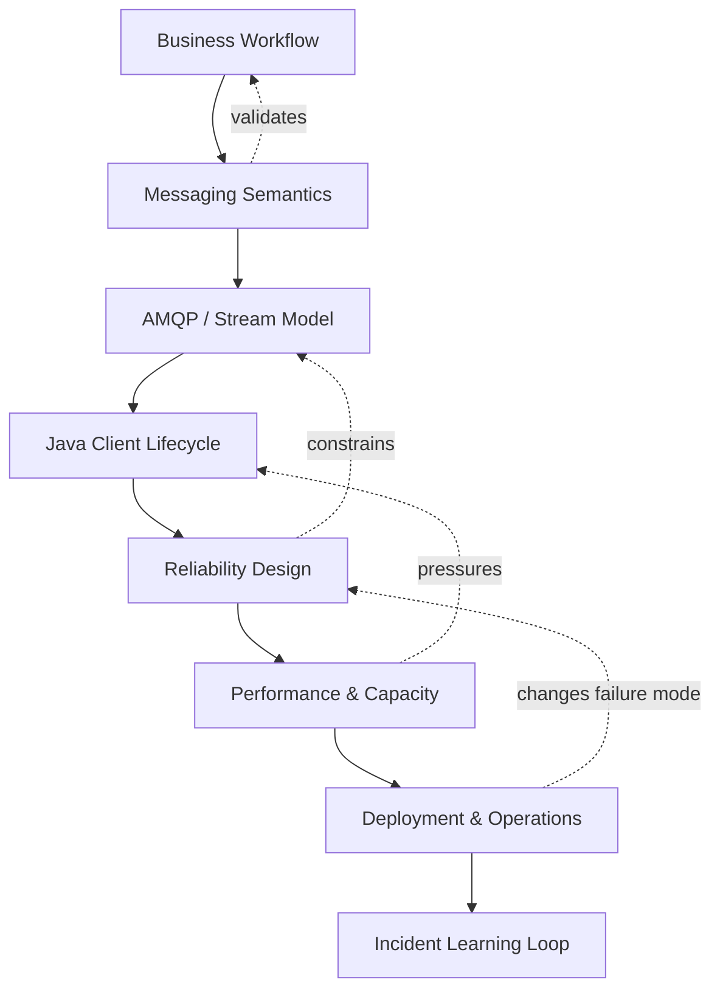
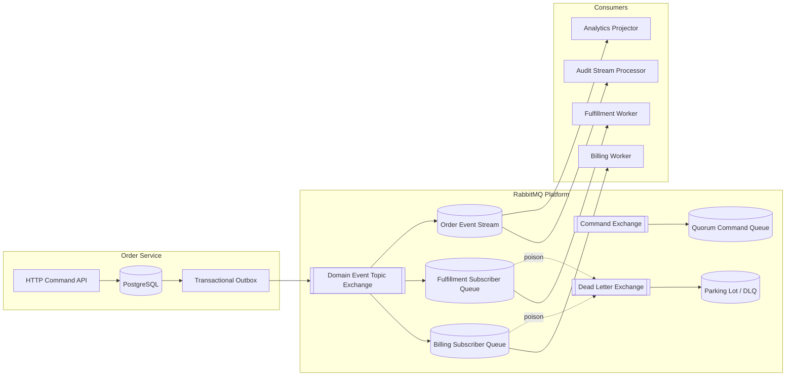
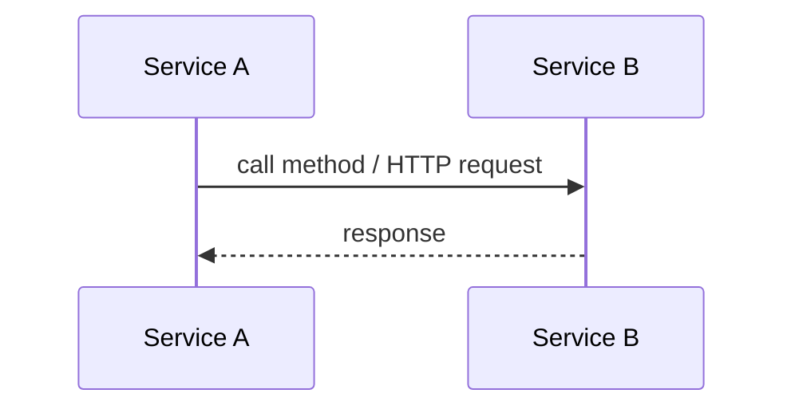
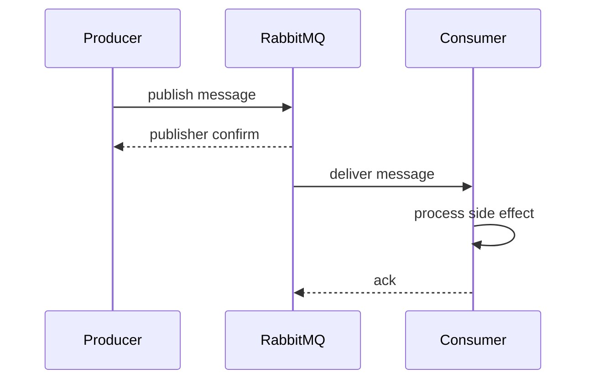
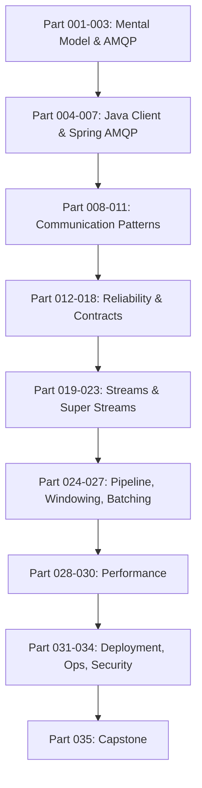
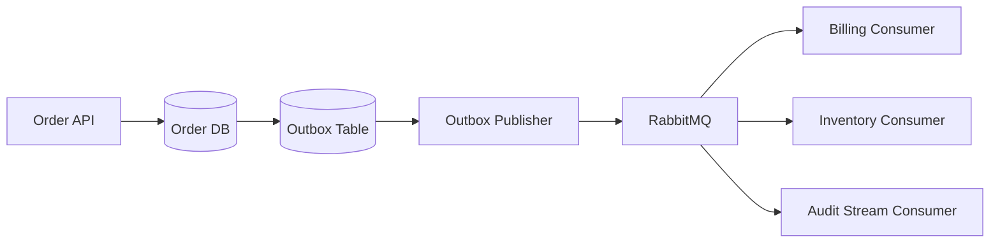

# Part 001 — Kaufman Skill Map for Java RabbitMQ In Action

## 1. Tujuan Part Ini

Part ini adalah **peta belajar**, bukan tutorial hello world. Tujuannya adalah membuat kita tahu:

1. **skill apa yang sebenarnya harus dikuasai** untuk memakai RabbitMQ secara production-grade;
2. **apa yang harus dilatih lebih dulu** supaya 20 jam pertama tidak habis untuk hal yang salah;
3. **mental model apa yang wajib dibangun** sebelum masuk ke Java client, Spring AMQP, RabbitMQ Streams, retry, DLQ, batching, windowing, dan deployment;
4. **bagaimana cara mengukur progres** seperti engineer senior, bukan sekadar merasa sudah bisa karena berhasil publish-consume satu pesan.

Seri ini menganggap kita sudah paham Java dasar, concurrency dasar, HTTP/API, database transaction dasar, Docker/Kubernetes dasar, dan konsep microservice umum. Yang akan dibahas adalah bagian yang sering membuat sistem messaging gagal di production: **semantics, topology, backpressure, duplicate handling, failure recovery, observability, dan operational design**.

---

## 2. Kaufman Framework yang Dipakai

Josh Kaufman dalam *The First 20 Hours* mendorong pendekatan belajar skill dengan empat ide besar:

1. **Deconstruct the skill** — pecah skill besar menjadi sub-skill kecil.
2. **Learn enough to self-correct** — pelajari cukup teori agar bisa mengenali kesalahan sendiri.
3. **Remove practice barriers** — hilangkan hambatan eksperimen.
4. **Practice deliberately for at least 20 hours** — latihan sengaja dengan umpan balik cepat.

Untuk RabbitMQ, versi engineering-nya menjadi seperti ini:

| Prinsip Kaufman | Terjemahan untuk RabbitMQ |
|---|---|
| Deconstruct | Pecah menjadi broker model, AMQP model, Java client lifecycle, topology, reliability, stream, observability, deployment. |
| Learn enough | Bukan hafal API, tapi tahu mengapa message hilang, duplicate muncul, queue menumpuk, consumer lambat, dan broker memberi flow control. |
| Remove barriers | Siapkan local lab, test harness, docker compose, chaos script, perf test, dashboard, dan project skeleton. |
| Deliberate practice | Latihan publish confirm, manual ack, retry/DLQ, outbox, stream replay, batching, load test, consumer crash, broker restart. |

Kita tidak mengejar “bisa menjalankan RabbitMQ”. Kita mengejar **bisa mendesain sistem berbasis RabbitMQ yang tetap benar saat ada crash, retry, overload, reordering, deployment, dan incident**.

---

## 3. Definisi Skill: Apa Artinya “Menguasai Java RabbitMQ”

Menguasai RabbitMQ bukan berarti hanya tahu istilah producer, queue, dan consumer. Di level senior, skill ini terdiri dari tujuh lapisan.



### 3.1 Business Workflow Layer

Pertanyaan utamanya:

- Apa pesan ini merepresentasikan **command**, **event**, **notification**, **task**, **audit record**, atau **stream fact**?
- Apakah pengirim butuh hasil sinkron?
- Apakah penerima boleh memproses duplicate?
- Apakah ordering dibutuhkan per entity, per tenant, atau global?
- Apakah pesan harus bisa direplay?

Kesalahan paling mahal biasanya terjadi bukan di kode Java, tetapi di sini: memakai queue untuk kebutuhan log replay, memakai RPC untuk workflow async, memakai event tanpa versioning, atau memakai broker untuk menyembunyikan transaksi domain yang belum matang.

### 3.2 Messaging Semantics Layer

Lapisan ini menjawab:

- Apakah delivery guarantee yang dibutuhkan: at-most-once, at-least-once, atau effectively-once?
- Kapan producer boleh menganggap publish berhasil?
- Kapan consumer boleh ack?
- Apa yang terjadi jika consumer crash setelah database commit tapi sebelum ack?
- Apa yang terjadi jika broker menerima pesan tapi producer tidak menerima confirm?

Di sini kita belajar bahwa **message delivery adalah distributed protocol**, bukan pemanggilan method lokal.

### 3.3 AMQP / Stream Model Layer

RabbitMQ memiliki beberapa model penting:

- AMQP 0-9-1: exchange, queue, binding, routing key, channel, ack, confirm.
- Classic/quorum queue: queue sebagai buffer dengan destructive consumption.
- Stream: append-only log dengan non-destructive consumption.
- Super stream: stream yang dipartisi untuk scaling.

Exchange, queue, dan binding membentuk routing graph. Stream membentuk log yang bisa dibaca ulang. Keduanya sama-sama berada di RabbitMQ, tetapi mental model dan failure model-nya berbeda.

### 3.4 Java Client Lifecycle Layer

Di Java, kita harus menguasai:

- connection management;
- channel lifecycle;
- thread-safety boundary;
- publisher confirm;
- consumer callback;
- executor isolation;
- graceful shutdown;
- automatic recovery;
- exception classification;
- metrics dan tracing.

Java client bukan sekadar transport. Ia adalah bagian dari reliability boundary aplikasi.

### 3.5 Reliability Design Layer

Ini inti dari production RabbitMQ:

- durable topology;
- publisher confirms;
- manual consumer acknowledgements;
- retry dan DLQ;
- idempotent consumer;
- transactional outbox;
- poison message handling;
- replay-safe processing;
- bounded retry budget.

Reliability bukan satu fitur. Reliability adalah komposisi beberapa keputusan yang konsisten.

### 3.6 Performance & Capacity Layer

Kita harus bisa menjawab:

- Berapa throughput producer?
- Berapa consumer concurrency yang aman?
- Berapa prefetch?
- Apa bottleneck: CPU, disk, network, memory, DB, serializer, atau downstream API?
- Apakah latency naik karena broker, consumer, database, atau retry storm?
- Bagaimana load test yang tidak menipu?

RabbitMQ performance tidak bisa dipisahkan dari workload shape: message size, durability, confirm mode, consumer cost, replication, batching, dan queue depth.

### 3.7 Deployment & Operations Layer

Di production, desain messaging harus cocok dengan:

- node dan cluster topology;
- quorum queue replication;
- stream replication;
- storage class;
- memory/disk alarm;
- Kubernetes restart semantics;
- rolling upgrade;
- TLS dan credential rotation;
- dashboard, alert, dan runbook.

Sistem messaging yang desainnya bagus di laptop bisa runtuh saat rolling restart, consumer spike, disk alarm, atau network partition.

---

## 4. North Star: Kemampuan Akhir Seri Ini

Setelah menyelesaikan seri ini, target akhirnya bukan “tahu RabbitMQ”, tetapi mampu membangun blueprint berikut.



Blueprint ini mencakup:

- command processing dengan quorum queue;
- domain event publication via outbox;
- queue-per-subscriber isolation;
- stream untuk replay/audit/analytics;
- DLQ dan parking lot;
- idempotent consumer;
- metric, trace, dan runbook;
- load test dan failure test.

---

## 5. Skill Decomposition Map

Kita pecah skill besar menjadi 12 sub-skill.

| No | Sub-skill | Outcome |
|---:|---|---|
| 1 | Broker mental model | Bisa menjelaskan perbedaan queue, stream, log, broker, dan event store. |
| 2 | AMQP topology | Bisa mendesain exchange, queue, binding, routing key, DLX, alternate exchange. |
| 3 | Java client lifecycle | Bisa mengelola connection, channel, thread, recovery, shutdown. |
| 4 | Producer reliability | Bisa memakai mandatory publish, publisher confirms, retry, backpressure. |
| 5 | Consumer reliability | Bisa memakai manual ack, nack, prefetch, idempotency, poison handling. |
| 6 | Communication patterns | Bisa memilih command, event, pub/sub, RPC, scatter-gather, saga. |
| 7 | Data contracts | Bisa mendesain envelope, versioning, schema compatibility, trace id. |
| 8 | Failure modelling | Bisa membuat failure matrix untuk crash, duplicate, timeout, broker restart. |
| 9 | RabbitMQ Streams | Bisa memakai stream untuk replay, audit, retention, offset, super stream. |
| 10 | Pipeline patterns | Bisa membuat staged pipeline, batching, windowing, aggregation. |
| 11 | Performance | Bisa mengukur throughput, latency, lag, queue depth, confirm latency. |
| 12 | Operations | Bisa deploy, monitor, secure, upgrade, dan menjalankan incident runbook. |

---

## 6. Apa yang Tidak Kita Ulang

Agar efisien, seri ini tidak akan mengulang:

- syntax Java dasar;
- konsep thread dasar;
- SQL dasar;
- Docker Compose dasar;
- Kubernetes Deployment/Service dasar;
- REST API dasar;
- microservice introduction;
- observability introduction yang terlalu umum.

Jika topik itu muncul, ia hanya akan dibahas sebagai **konsekuensi desain RabbitMQ**.

Contoh:

- Kita tidak akan menjelaskan “apa itu transaction” dari nol.
- Kita akan membahas **mengapa consumer ack harus terjadi setelah database commit** dan apa failure mode-nya.

---

## 7. Core Mental Models

### 7.1 Broker Is a Boundary, Not a Function Call

Message broker memisahkan waktu eksekusi producer dan consumer. Ini membuat sistem lebih resilient, tetapi juga menambah kelas kegagalan baru.

Local method call:



Message broker:



Di broker model, “berhasil” memiliki minimal dua makna:

1. producer berhasil menyerahkan pesan ke broker;
2. consumer berhasil memproses pesan.

Keduanya tidak terjadi dalam satu atomic transaction.

### 7.2 Queue Is a Work Distribution Structure

Queue cocok untuk:

- task distribution;
- command processing;
- background jobs;
- load leveling;
- isolasi consumer lambat;
- retry dan DLQ;
- worker pool.

Queue kurang cocok untuk:

- replay historis panjang;
- multi-consumer replay dari posisi berbeda;
- event sourcing;
- analytics fanout berbasis offset;
- audit log jangka panjang.

### 7.3 Stream Is a Replayable Log

Stream cocok untuk:

- event replay;
- audit trail;
- analytics feed;
- event-carried state transfer;
- temporal reconstruction;
- multi-consumer independent progress;
- high-throughput append-read workload.

Stream tidak otomatis menyelesaikan:

- business idempotency;
- schema evolution;
- exactly-once side effect;
- consumer lag operationally;
- hot partition;
- long-running transaction di consumer.

### 7.4 Acknowledgement Is a Correctness Boundary

Consumer ack bukan formalitas. Ack berarti:

> “Broker boleh menganggap delivery ini selesai dan tidak perlu mengirim ulang pesan ini ke consumer lain.”

Maka ack harus terjadi setelah side effect yang dibutuhkan benar-benar aman.

Salah:

```java
channel.basicAck(deliveryTag, false);
orderRepository.markPaid(orderId); // jika crash di sini, pesan hilang tetapi DB belum berubah
```

Benar secara umum:

```java
orderRepository.markPaid(orderId);
channel.basicAck(deliveryTag, false); // jika crash sebelum ack, pesan dapat redeliver; consumer harus idempotent
```

Tetapi ini membuat duplicate mungkin terjadi, maka idempotency wajib.

---

## 8. Production Invariants

Gunakan invariants berikut sepanjang seri.

### 8.1 Producer Invariants

1. Producer tidak boleh menganggap publish berhasil sebelum mendapat sinyal sukses yang sesuai.
2. Producer harus punya timeout dan bounded retry.
3. Producer harus bisa membedakan publish failure, unroutable message, broker unavailable, dan confirm timeout.
4. Producer tidak boleh membuat topology sembarangan di runtime tanpa governance.
5. Producer harus menyertakan metadata minimal: `messageId`, `correlationId`, `causationId`, `schemaVersion`, `producer`, `occurredAt`.

### 8.2 Broker Topology Invariants

1. Exchange adalah routing boundary, bukan sekadar nama string.
2. Queue adalah ownership consumer/subscriber, bukan ownership producer.
3. Binding adalah kontrak routing yang harus bisa diaudit.
4. DLQ bukan tempat sampah permanen; harus punya owner dan runbook.
5. Queue/stream durability harus cocok dengan nilai bisnis pesan.

### 8.3 Consumer Invariants

1. Consumer harus idempotent untuk semua pesan yang memiliki side effect.
2. Ack dilakukan setelah side effect aman.
3. Poison message tidak boleh menyebabkan infinite retry storm.
4. Consumer concurrency tidak boleh melebihi kapasitas downstream.
5. Consumer harus expose metric: processing duration, ack/nack count, failure class, redelivery count, lag/depth.

### 8.4 Operations Invariants

1. Queue depth tinggi adalah gejala, bukan diagnosis.
2. DLQ spike adalah incident candidate, bukan sekadar metric.
3. Disk alarm dan memory alarm harus punya runbook.
4. Rolling restart harus diuji dengan active consumers dan publishers.
5. Capacity planning harus berbasis workload, bukan jumlah service.

---

## 9. Learning Sequence: Mengapa Urutannya Begini

Urutan seri ini sengaja mengikuti dependency skill.



Alasannya:

- Kita tidak bisa membahas retry sebelum paham ack.
- Kita tidak bisa membahas publisher confirm sebelum paham publish lifecycle.
- Kita tidak bisa membahas stream replay sebelum paham queue consumption.
- Kita tidak bisa membahas super stream sebelum paham partitioning dan ordering.
- Kita tidak bisa membahas deployment sebelum paham reliability requirement.

---

## 10. The First 20 Hours Plan

Walaupun seri ini panjang, 20 jam pertama harus menghasilkan kemampuan nyata. Berikut rencana deliberate practice.

### Hour 0–2: Broker and AMQP Model

Latihan:

- Buat exchange direct, fanout, topic.
- Buat queue-per-consumer.
- Uji routing key match dan miss.
- Uji mandatory publish untuk unroutable message.

Target self-correction:

- Bisa menjelaskan mengapa pesan tidak sampai.
- Bisa membaca topology dan menemukan binding yang salah.

### Hour 2–5: Java Producer/Consumer Correctness

Latihan:

- Publish dengan message properties.
- Aktifkan publisher confirms.
- Consumer manual ack.
- Simulasikan crash sebelum dan sesudah ack.

Target self-correction:

- Bisa menjelaskan kapan message loss terjadi.
- Bisa menjelaskan kapan duplicate terjadi.

### Hour 5–8: Retry, DLQ, Poison Message

Latihan:

- Consumer gagal transient.
- Consumer gagal permanent.
- Buat DLX dan parking lot.
- Tambahkan retry header atau attempt counter.

Target self-correction:

- Bisa mencegah infinite retry.
- Bisa membedakan retryable vs non-retryable error.

### Hour 8–11: Idempotent Consumer and Outbox

Latihan:

- Implement dedup table.
- Simulasikan duplicate message.
- Implement outbox publisher.
- Simulasikan crash setelah DB commit sebelum publish.

Target self-correction:

- Bisa membuktikan side effect tidak double.
- Bisa menjelaskan transaksi DB vs broker.

### Hour 11–14: Streams and Replay

Latihan:

- Buat RabbitMQ stream.
- Produce event ke stream.
- Consume dari offset awal.
- Replay dari offset tertentu.

Target self-correction:

- Bisa membedakan queue dan stream secara operasional.
- Bisa menjelaskan consumer progress.

### Hour 14–17: Performance and Backpressure

Latihan:

- Uji prefetch 1, 10, 100, 1000.
- Uji confirm sync vs batch.
- Uji message size kecil vs besar.
- Uji consumer lambat.

Target self-correction:

- Bisa membaca queue depth dan throughput.
- Bisa menemukan bottleneck consumer/downstream.

### Hour 17–20: Failure Drill

Latihan:

- Restart broker saat producer aktif.
- Kill consumer saat processing.
- Putus network sementara.
- Simulasikan DLQ spike.

Target self-correction:

- Bisa membuat incident timeline.
- Bisa menjelaskan data safety outcome.

---

## 11. Practice Lab yang Akan Dipakai

Kita akan memakai satu domain contoh yang konsisten: **Order Processing Platform**.

Domain ini cukup kaya untuk memodelkan:

- command: `SubmitOrderCommand`, `ReserveInventoryCommand`, `CapturePaymentCommand`;
- event: `OrderSubmitted`, `InventoryReserved`, `PaymentCaptured`, `OrderFulfilled`;
- failure: payment timeout, inventory unavailable, downstream API 500;
- pipeline: validation → pricing → payment → fulfillment → audit;
- stream: order event stream untuk audit dan analytics;
- DLQ: invalid payload, permanent business failure, schema mismatch;
- idempotency: command id, event id, order id;
- ordering: per order id;
- partitioning: per tenant/order id.

### 11.1 Minimal Service Boundary



### 11.2 Message Envelope

Kita akan memakai envelope seperti ini sebagai default:

```json
{
  "messageId": "01JZ7QK3W9M6Y8W3K5R4A1B2C3",
  "messageType": "OrderSubmitted",
  "schemaVersion": "1.0",
  "producer": "order-service",
  "correlationId": "corr-20260701-0001",
  "causationId": "cmd-20260701-0001",
  "tenantId": "tenant-a",
  "occurredAt": "2026-07-01T10:15:30Z",
  "payload": {
    "orderId": "ord-1001",
    "customerId": "cus-7788",
    "totalAmount": 150000
  }
}
```

Envelope ini tidak sempurna untuk semua perusahaan, tetapi cukup sebagai baseline.

---

## 12. Quality Bar: Apa yang Membuat Solusi RabbitMQ Senior-Level

Solusi RabbitMQ dianggap matang jika memenuhi kriteria berikut.

### 12.1 Correctness

- Tidak kehilangan pesan yang bernilai bisnis penting.
- Duplicate tidak menyebabkan side effect ganda.
- Ack semantics jelas.
- Retry tidak tak terbatas.
- DLQ memiliki owner dan proses recovery.
- Message contract versioned.

### 12.2 Operability

- Bisa menjawab “apa yang terjadi?” dari metrics/log/traces.
- Ada dashboard untuk producer, broker, queue/stream, consumer.
- Ada alert yang action-oriented.
- Ada runbook untuk queue growth, DLQ spike, disk alarm, memory alarm, consumer lag.

### 12.3 Performance

- Throughput diketahui dari benchmark.
- Latency SLO jelas.
- Prefetch dan concurrency tidak asal tinggi.
- Batching punya flush policy.
- Backpressure tidak hanya mengandalkan broker.

### 12.4 Evolvability

- Routing key taxonomy terdokumentasi.
- Schema evolution punya aturan.
- Topology bisa dimigrasi tanpa downtime besar.
- Subscriber baru tidak merusak subscriber lama.
- Stream replay bisa dilakukan tanpa side effect liar.

---

## 13. Common Failure Modes yang Akan Terus Kita Pakai

| Failure Mode | Gejala | Root Cause Umum | Skill yang Dibutuhkan |
|---|---|---|---|
| Message loss | Data bisnis hilang | auto ack, no confirm, non-durable route | ack, confirm, durability |
| Duplicate processing | Payment double, email double | crash after commit before ack | idempotency |
| Infinite retry | Queue penuh pesan yang sama | poison message tanpa DLQ | retry architecture |
| Queue buildup | Queue depth naik terus | consumer lambat/downstream bottleneck | capacity, backpressure |
| Redelivery storm | Broker terus mengirim ulang | nack requeue terus | failure classification |
| Unroutable message | Pesan publish tapi tidak ada consumer | binding/routing salah | topology design |
| Hot partition | Satu stream/queue sangat sibuk | routing key skew | partition strategy |
| Hidden coupling | Deploy service A merusak service B | shared queue/schema | contract governance |
| Operational blindness | Incident sulit dianalisis | no correlation id/metrics | observability |

---

## 14. Decision Heuristics Awal

### 14.1 Queue atau Stream?

| Kebutuhan | Pilihan Awal |
|---|---|
| Background job satu kali diproses | Queue |
| Competing workers | Queue |
| Subscriber independent isolation | Queue-per-subscriber |
| Event replay | Stream |
| Audit history | Stream |
| Analytics feed | Stream / Super Stream |
| Strict per-entity ordering | Queue/stream partition by entity key |
| High fanout dengan replay | Stream |
| Delayed retry sederhana | Queue + DLX/TTL/delay mechanism |

### 14.2 Command atau Event?

| Pertanyaan | Command | Event |
|---|---|---|
| Siapa targetnya? | Penerima spesifik | Subscriber tidak selalu diketahui |
| Apakah meminta aksi? | Ya | Tidak, menyatakan fakta |
| Nama pesan | Imperative: `CapturePayment` | Past tense: `PaymentCaptured` |
| Ownership | Sender tahu intent | Producer menyatakan state change |
| Failure handling | Perlu response/compensation | Subscriber bertanggung jawab sendiri |

### 14.3 Ack Kapan?

| Situasi | Ack? |
|---|---|
| Payload invalid permanen | Reject/nack ke DLQ atau parking lot |
| Downstream timeout transient | Retry dengan budget |
| DB commit sukses | Ack setelah commit |
| DB commit gagal | Jangan ack; retry/park sesuai failure class |
| Side effect eksternal tidak idempotent | Jangan desain seperti itu; tambahkan idempotency boundary |

---

## 15. RabbitMQ Concept Baseline

RabbitMQ AMQP 0-9-1 memakai beberapa konsep inti:

- **Producer** menerbitkan pesan.
- **Exchange** menerima pesan dari producer dan merutekannya.
- **Binding** menghubungkan exchange ke queue atau exchange lain.
- **Routing key** membantu exchange memilih binding yang sesuai.
- **Queue** menyimpan pesan sampai dikonsumsi.
- **Consumer** menerima delivery dari queue dan mengirim acknowledgement jika manual ack digunakan.

RabbitMQ Streams memperluas broker dengan model lain:

- stream adalah append-only log;
- data tidak hilang hanya karena dikonsumsi;
- consumer membaca berdasarkan offset;
- retention mengontrol umur/ukuran data;
- super stream mempartisi stream untuk scaling.

Kita akan memakai dua mental model tersebut secara eksplisit agar tidak mencampur desain queue dan desain log.

---

## 16. How to Self-Correct

Kaufman menekankan belajar cukup teori agar bisa memperbaiki diri sendiri. Untuk RabbitMQ, self-correction berarti bisa menjawab pertanyaan berikut tanpa menebak.

### 16.1 Saat Pesan Tidak Sampai

Checklist:

1. Apakah producer publish ke exchange yang benar?
2. Apakah exchange ada?
3. Apakah routing key cocok dengan binding?
4. Apakah queue bound ke exchange?
5. Apakah mandatory flag dipakai?
6. Apakah return listener menangkap unroutable message?
7. Apakah consumer aktif?
8. Apakah consumer ack/nack menyebabkan requeue?
9. Apakah pesan masuk DLQ?
10. Apakah ada permission/vhost mismatch?

### 16.2 Saat Duplicate Terjadi

Checklist:

1. Apakah consumer crash setelah side effect sebelum ack?
2. Apakah producer retry setelah confirm timeout?
3. Apakah network timeout menyebabkan publish ambiguity?
4. Apakah DLQ replay mengirim pesan lama?
5. Apakah stream replay menjalankan side effect ulang?
6. Apakah idempotency key stabil?
7. Apakah dedup store transactional dengan side effect?

### 16.3 Saat Queue Menumpuk

Checklist:

1. Arrival rate berapa?
2. Processing rate berapa?
3. Consumer count berapa?
4. Prefetch berapa?
5. Processing time p50/p95/p99 berapa?
6. Downstream latency naik?
7. Error/retry rate naik?
8. Broker disk/memory alarm aktif?
9. Message size berubah?
10. Ada hot routing key?

---

## 17. Lab Repository Blueprint

Struktur repository yang akan kita pakai di seri ini:

```text
rabbitmq-in-action/
  docker/
    docker-compose.yml
    rabbitmq.conf
    enabled_plugins
  services/
    order-service/
      src/main/java/...
    billing-worker/
      src/main/java/...
    inventory-worker/
      src/main/java/...
    audit-stream-consumer/
      src/main/java/...
  libs/
    messaging-contracts/
    messaging-rabbitmq/
    idempotency-core/
  loadtest/
    perftest/
    stream-perftest/
  ops/
    dashboards/
    alerts/
    runbooks/
  docs/
    adr/
    topology/
    failure-matrix/
```

Kita akan menjaga pemisahan:

- `messaging-contracts`: message envelope dan schema.
- `messaging-rabbitmq`: producer/consumer abstraction.
- `idempotency-core`: dedup dan idempotent handler.
- service modules: business-specific usage.

Ini penting agar RabbitMQ tidak tersebar sebagai detail acak di seluruh codebase.

---

## 18. Engineering Rubric

Gunakan rubric ini setiap selesai part.

| Level | Indikator |
|---|---|
| 1 — Familiar | Bisa menjalankan contoh publish-consume. |
| 2 — Functional | Bisa membuat topology dan consumer manual ack. |
| 3 — Reliable | Bisa memakai confirms, retry, DLQ, idempotency. |
| 4 — Operable | Bisa monitor, load test, troubleshoot, dan membuat runbook. |
| 5 — Architectural | Bisa memilih queue/stream/pattern/deployment berdasarkan trade-off. |
| 6 — Top-tier | Bisa memodelkan failure, membuktikan correctness, dan memimpin incident/design review. |

Target seri ini adalah level 5–6.

---

## 19. What Good Looks Like: Design Review Checklist

Saat review desain RabbitMQ, tanyakan:

1. Apa jenis pesan ini: command, event, notification, task, stream fact?
2. Apa consequence jika pesan hilang?
3. Apa consequence jika pesan diproses dua kali?
4. Apa consequence jika pesan diproses out of order?
5. Apa maximum acceptable delay?
6. Bagaimana producer tahu publish berhasil?
7. Bagaimana consumer tahu processing berhasil?
8. Bagaimana retry dibatasi?
9. Bagaimana poison message ditangani?
10. Bagaimana message contract berevolusi?
11. Apa metric utama untuk health?
12. Apa runbook saat queue depth naik?
13. Apa strategi deployment/rollback?
14. Apa ownership queue/DLQ/stream?
15. Apa rencana replay/backfill?

Jika desain tidak bisa menjawab ini, desain belum production-ready.

---

## 20. Summary

Part ini membentuk peta belajar. Intinya:

- RabbitMQ adalah distributed boundary, bukan sekadar queue library.
- Skill inti bukan API, tetapi semantics, topology, reliability, failure modelling, performance, dan operations.
- Kaufman framework membantu kita memecah skill dan berlatih dengan feedback cepat.
- Target seri ini adalah kemampuan mendesain, membangun, menguji, mengoperasikan, dan memperbaiki sistem RabbitMQ production-grade.
- Mulai Part 002, kita masuk ke mental model messaging: queue, log, broker, stream, dan batas distributed system.

---

## 21. Official References

- RabbitMQ AMQP 0-9-1 Concepts: https://www.rabbitmq.com/tutorials/amqp-concepts
- RabbitMQ Java Client API Guide: https://www.rabbitmq.com/client-libraries/java-api-guide
- RabbitMQ Reliability Guide: https://www.rabbitmq.com/docs/reliability
- RabbitMQ Streams and Super Streams: https://www.rabbitmq.com/docs/streams
- RabbitMQ Stream Plugin: https://www.rabbitmq.com/docs/stream
