# Part 002 — Messaging Mental Model: Queue, Log, Broker, and Distributed Boundary

## 1. Tujuan Part Ini

Part ini menjawab pertanyaan paling fundamental sebelum kita menulis Java code:

> “Ketika kita memakai RabbitMQ, struktur distributed apa yang sebenarnya sedang kita tambahkan ke sistem?”

Jawabannya bukan sekadar “queue”. RabbitMQ bisa berperan sebagai:

- work distribution broker;
- command transport;
- pub/sub routing layer;
- event notification bus;
- delayed/retry boundary;
- stream/log untuk replay;
- audit/analytics feed;
- load leveling buffer;
- failure isolation boundary.

Jika mental model salah, semua keputusan teknis berikutnya ikut salah: exchange topology, queue ownership, ack timing, retry, DLQ, idempotency, stream retention, capacity planning, dan deployment.

---

## 2. Kaufman Angle: Deconstruct Before Coding

Kita tidak mulai dari `ConnectionFactory` atau `basicPublish`. Kita mulai dari dekomposisi skill:

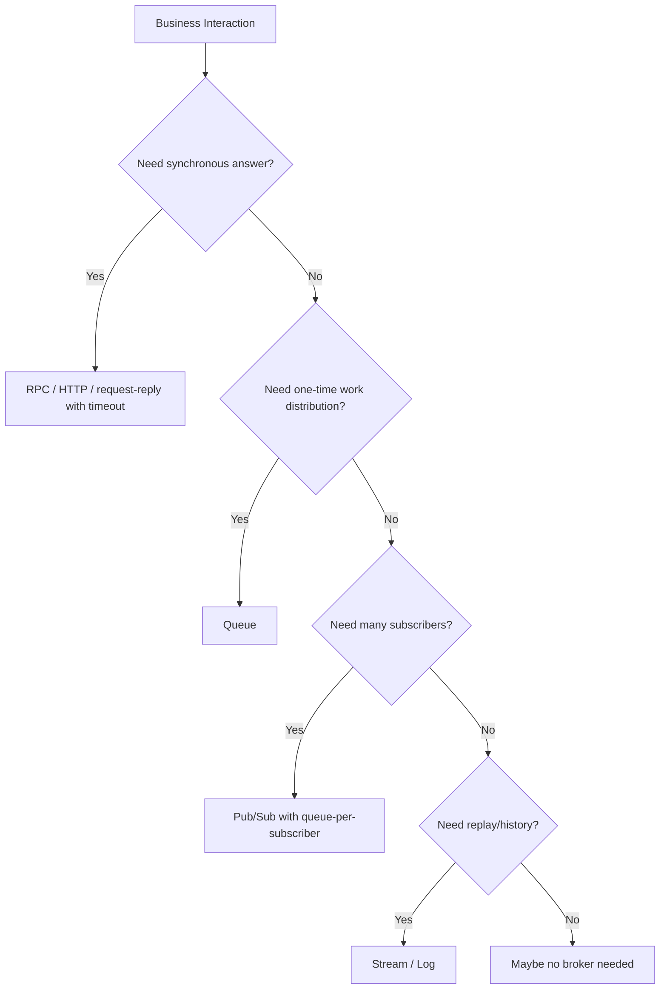

Tujuan awal bukan memakai RabbitMQ di mana-mana, tetapi memilih boundary yang benar.

---

## 3. Local Call vs Remote Call vs Message

### 3.1 Local Call

Local method call punya karakteristik:

- satu process;
- memory shared;
- failure relatif sederhana;
- exception langsung terlihat;
- transaction boundary lebih mudah dikontrol.

```java
paymentService.capture(orderId, amount);
```

Jika method return sukses, caller biasanya bisa menganggap operasi selesai.

### 3.2 Remote Synchronous Call

HTTP/gRPC synchronous call menambah failure mode:

- network timeout;
- partial failure;
- remote service overload;
- response hilang;
- retry bisa membuat duplicate side effect.

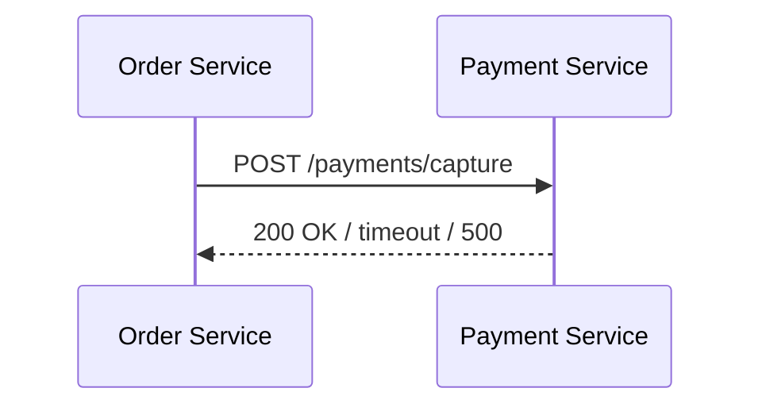

Synchronous remote call masih mempertahankan mental model “saya minta sesuatu dan menunggu hasil”.

### 3.3 Message-Based Interaction

Message-based interaction memecah request dan processing menjadi dua waktu berbeda.

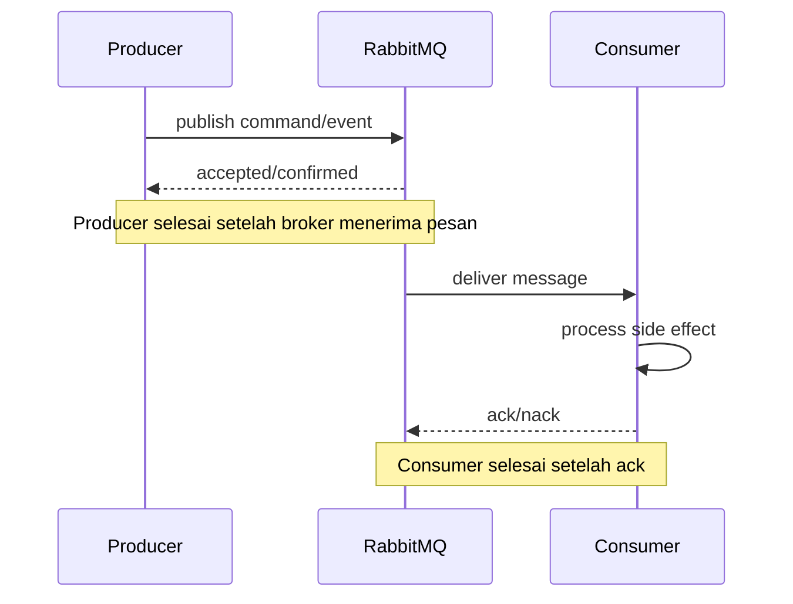

Ada dua success boundary:

1. producer-to-broker success;
2. broker-to-consumer processing success.

Ini berarti kita harus mendesain:

- publish confirmation;
- consumer acknowledgement;
- duplicate tolerance;
- retry;
- observability across asynchronous time.

---

## 4. Broker as a Distributed Boundary

Broker bukan hanya “tempat menyimpan pesan”. Broker adalah boundary yang mengubah bentuk coupling.

| Coupling Type | Tanpa Broker | Dengan Broker |
|---|---|---|
| Temporal | Producer dan consumer harus aktif bersamaan | Producer bisa selesai sebelum consumer aktif |
| Spatial | Producer tahu alamat consumer | Producer tahu exchange/routing contract |
| Load | Producer langsung menekan consumer | Broker menyerap burst sementara |
| Failure | Failure consumer terlihat langsung | Failure consumer menjadi backlog/retry/DLQ |
| Ownership | Caller sering tahu implementasi callee | Producer hanya tahu contract pesan |
| Observability | Trace langsung request-response | Perlu correlation id dan async tracing |

Broker mengurangi beberapa coupling, tetapi menambah coupling baru:

- topology coupling;
- schema coupling;
- routing key coupling;
- operational coupling;
- delivery semantics coupling.

Top-tier engineer tidak berkata “broker decouples services” secara naif. Yang benar:

> Broker mengubah bentuk coupling dari runtime address/time coupling menjadi contract/topology/semantics coupling.

---

## 5. Queue Mental Model

Queue adalah struktur untuk menyimpan pesan sampai pesan didistribusikan ke consumer.

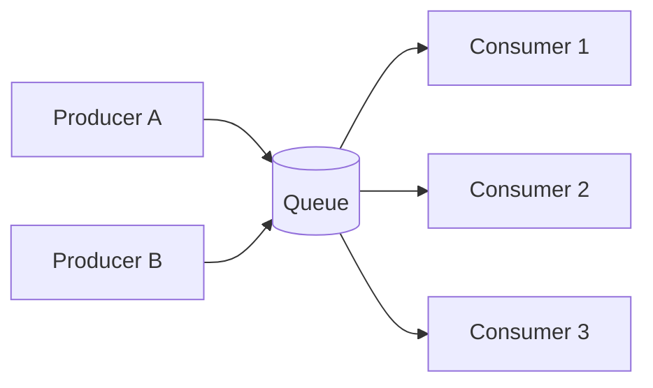

Dengan competing consumers, setiap delivery normalnya ditangani oleh salah satu consumer, bukan semua consumer.

### 5.1 Queue Cocok Untuk

- background task;
- command processing;
- worker pool;
- load leveling;
- bounded retry;
- isolasi consumer lambat;
- distributed work queue;
- request fan-in menuju satu service capability.

Contoh:

```text
billing.capture-payment.commands
inventory.reserve-stock.commands
email.send-notification.tasks
report.generate-pdf.tasks
```

### 5.2 Queue Tidak Cocok Untuk

- replay historis panjang;
- semua subscriber membaca pesan yang sama dari posisi berbeda;
- event sourcing utama;
- analytics stream jangka panjang;
- audit trail yang harus bisa dibaca ulang berkali-kali;
- multi-consumer independent offset.

Queue biasanya memakai **destructive consumption**: setelah pesan diproses dan di-ack, pesan tidak lagi tersedia di queue.

### 5.3 Queue Ownership

Rule penting:

> Queue biasanya dimiliki oleh consumer/subscriber, bukan producer.

Producer tidak seharusnya tahu semua queue downstream. Producer publish ke exchange. Consumer/subscriber membuat queue dan binding sesuai kebutuhan.

Salah:

```text
order-service publishes directly to billing-queue
order-service publishes directly to fulfillment-queue
order-service publishes directly to analytics-queue
```

Lebih baik:

```text
order-service publishes OrderSubmitted to order.events exchange
billing-service owns billing.order-events queue
fulfillment-service owns fulfillment.order-events queue
analytics-service owns analytics.order-events queue
```

Diagram:

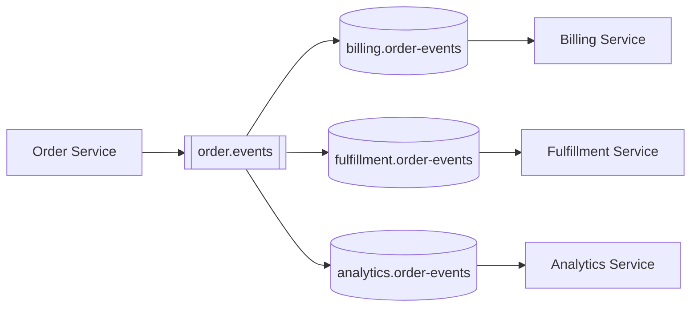

---

## 6. Exchange Mental Model

Di AMQP 0-9-1, producer tidak publish langsung ke queue dalam desain yang matang. Producer publish ke exchange.

Exchange adalah routing table.

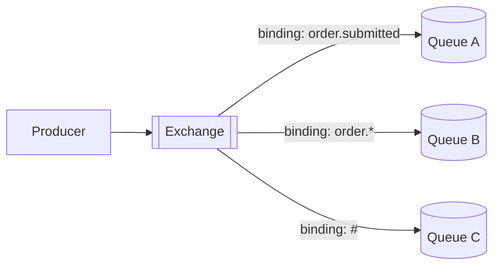

### 6.1 Exchange as API Surface

Exchange adalah bagian dari API asynchronous. Ia harus didesain seperti kita mendesain REST endpoint atau public library API.

Pertanyaan desain:

- Apakah exchange per domain atau per service?
- Apakah routing key merepresentasikan event type, tenant, priority, region, atau capability?
- Siapa boleh publish?
- Siapa boleh bind?
- Bagaimana versioning?
- Bagaimana observability per routing key?

### 6.2 Exchange Type Simplified

| Exchange Type | Mental Model | Cocok Untuk |
|---|---|---|
| Direct | exact routing key match | command routing, severity routing |
| Topic | pattern-based routing | domain events, multi-dimensional routing |
| Fanout | broadcast ke semua binding | simple pub/sub notification |
| Headers | routing via headers | kasus khusus dengan routing atribut kompleks |

Topic exchange powerful, tetapi bisa menjadi liar jika routing key taxonomy tidak dikontrol.

---

## 7. Log and Stream Mental Model

Queue menjawab: “siapa yang harus mengerjakan pesan ini?”

Stream/log menjawab: “apa fakta yang pernah terjadi, dan dari posisi mana consumer ingin membaca?”

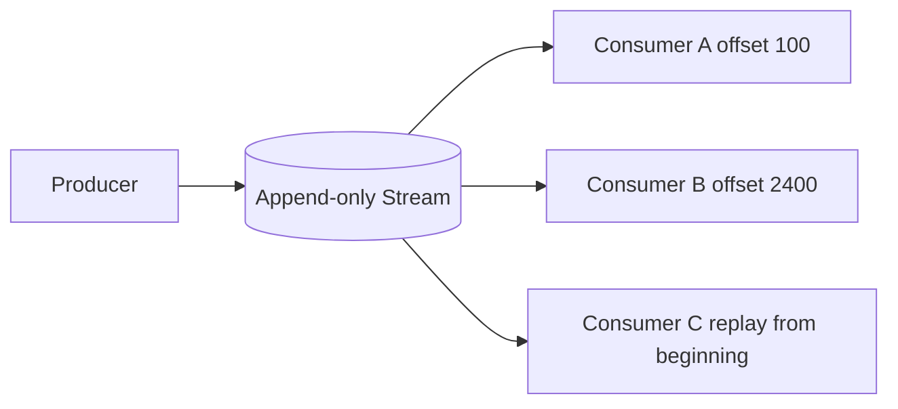

### 7.1 Stream Cocok Untuk

- event replay;
- audit log;
- analytics;
- rebuilding projections;
- multiple independent consumers;
- high-throughput event ingestion;
- time-based retention;
- consumer catch-up dari offset tertentu.

### 7.2 Stream Tidak Otomatis Sama dengan Event Store

Event store biasanya memiliki requirement tambahan:

- aggregate-level optimistic concurrency;
- append with expected version;
- domain event stream per aggregate;
- snapshotting;
- projection rebuild;
- event schema migration;
- audit immutability policy.

RabbitMQ Stream bisa menjadi transport/log untuk event, tetapi jangan otomatis dianggap sebagai full event store untuk domain event sourcing.

### 7.3 Stream vs Queue

| Aspek | Queue | Stream |
|---|---|---|
| Consumption | Pesan hilang setelah ack | Pesan tetap ada sampai retention expire |
| Consumer progress | Broker track delivery/ack | Consumer membaca berdasarkan offset |
| Replay | Tidak natural setelah ack | Natural dari offset tertentu |
| Fanout | Queue-per-subscriber | Multiple consumers bisa baca log yang sama |
| Work distribution | Sangat cocok | Bisa, tapi modelnya berbeda |
| Audit | Terbatas | Cocok |
| Retention | Biasanya sampai consumed/expired | Size/time based retention |
| Scaling | More queues/consumers | Partitioned stream/super stream |

---

## 8. Event, Command, Task, and Notification

Banyak desain RabbitMQ gagal karena semua pesan disebut “event”. Kita perlu vocabulary yang presisi.

### 8.1 Command

Command adalah permintaan melakukan aksi.

```text
CapturePayment
ReserveInventory
GenerateInvoice
SendWelcomeEmail
```

Ciri:

- imperative;
- punya target capability;
- biasanya satu logical owner;
- failure perlu dikontrol;
- sering butuh idempotency key;
- retry bisa valid, tetapi harus bounded.

Command cocok dengan queue.

### 8.2 Event

Event adalah fakta yang sudah terjadi.

```text
OrderSubmitted
PaymentCaptured
InventoryReserved
InvoiceGenerated
```

Ciri:

- past tense;
- producer tidak memerintah subscriber;
- subscriber bisa banyak;
- subscriber bisa datang belakangan;
- event contract harus stabil;
- replay mungkin penting.

Event notification cocok dengan exchange + queue-per-subscriber. Event replay cocok dengan stream.

### 8.3 Task

Task adalah pekerjaan teknis/background.

```text
ResizeImage
GenerateReportPdf
SyncCrmContact
PurgeExpiredSession
```

Task biasanya tidak merepresentasikan domain event. Ia adalah unit kerja.

Task cocok dengan work queue.

### 8.4 Notification

Notification adalah sinyal ringan bahwa sesuatu perlu diketahui.

```text
CacheInvalidationRequested
ConfigurationChanged
UserPresenceChanged
```

Notification tidak selalu membawa state lengkap. Subscriber mungkin harus fetch data lagi.

### 8.5 Stream Fact

Stream fact adalah record yang sengaja ditulis untuk dibaca ulang.

```text
OrderLifecycleFact
PaymentLedgerEntry
AuditTrailRecord
MetricIngestionRecord
```

Stream fact harus didesain dengan replay, retention, ordering, dan schema evolution sejak awal.

---

## 9. Communication Pattern Decision Matrix

| Pattern | Transport Shape | RabbitMQ Fit | Catatan |
|---|---|---|---|
| Fire-and-forget task | Producer → queue → worker | Sangat cocok | Butuh confirm/ack/idempotency jika penting. |
| Pub/sub event | Producer → exchange → many queues | Sangat cocok | Queue-per-subscriber untuk isolasi. |
| Async command | Producer → command exchange/queue | Cocok | Perlu idempotent command handler. |
| Request-reply | Producer → queue → reply queue | Bisa | Gunakan timeout, bounded concurrency, correlation id. |
| Audit stream | Producer → stream → many readers | Cocok dengan RabbitMQ Streams | Perlu retention dan replay-safe consumer. |
| Analytics pipeline | Producer → stream/super stream | Cocok | Perlu partitioning dan lag monitoring. |
| Long-running saga | Command/event mix | Cocok dengan disiplin tinggi | Perlu correlation/causation dan compensation. |
| Strong transaction across services | Broker as transaction coordinator | Tidak cocok | Gunakan saga/outbox, bukan distributed transaction palsu. |

---

## 10. Message Lifecycle in Queue-Based RabbitMQ

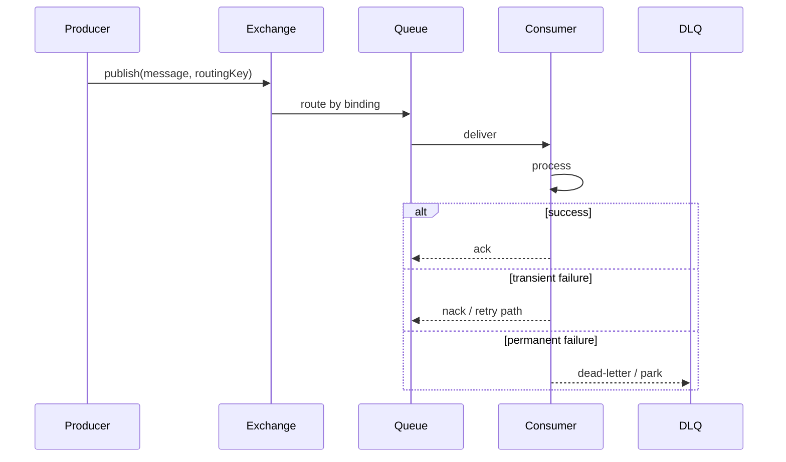

### 10.1 Important Boundaries

1. Publish to exchange does not guarantee any consumer processed it.
2. Routing to queue does not guarantee consumer success.
3. Delivery to consumer does not guarantee processing success.
4. Ack means broker may remove the delivery from responsibility.
5. Nack/reject behavior depends on requeue/dead-letter configuration.
6. Retry can amplify load if not bounded.

---

## 11. Message Lifecycle in Stream-Based RabbitMQ

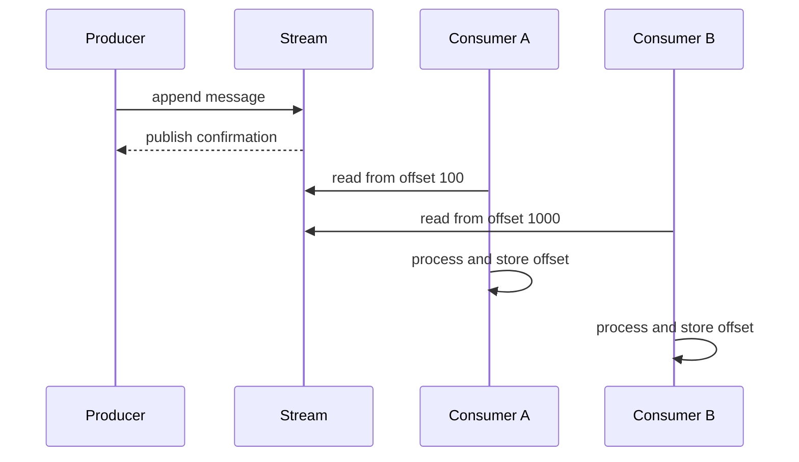

Stream consumer progress is based on offset. Processing one message does not delete it for other consumers.

### 11.1 Important Boundaries

1. Retention controls how long data remains available.
2. Consumer offset controls replay/catch-up.
3. Reprocessing can repeat side effects unless handler is replay-safe.
4. Consumer lag is central operational signal.
5. Partitioning affects ordering and throughput.

---

## 12. Ordering Mental Model

Ordering is one of the most misunderstood parts of messaging.

### 12.1 Bad Requirement

> “Messages must be ordered.”

This is incomplete.

### 12.2 Better Requirement

> “For each `orderId`, payment-related events must be processed in the order they were accepted by the Order Service. Ordering across different orders is not required.”

This tells us:

- ordering key: `orderId`;
- scope: per order;
- global ordering not required;
- partitioning strategy can use `orderId`;
- consumer parallelism is possible across orders.

### 12.3 Ordering Trade-Off

| Requirement | Consequence |
|---|---|
| Global ordering | Low parallelism, fragile throughput |
| Per-entity ordering | Partition by entity key |
| No ordering | Easier scaling |
| Ordering + retry inline | Poison message can block progress |
| Ordering + DLQ skip | Later messages may proceed but business sequence can be incomplete |

Ordering is not free. It is a capacity and failure-handling constraint.

---

## 13. Delivery Guarantees Mental Model

### 13.1 At-Most-Once

Pesan dikirim maksimal sekali. Bisa hilang.

Cocok untuk:

- telemetry tidak penting;
- ephemeral notification;
- best-effort update.

Tidak cocok untuk:

- payment;
- order state;
- compliance audit.

### 13.2 At-Least-Once

Pesan tidak boleh hilang, tetapi bisa duplicate.

Ini default target banyak sistem production.

Konsekuensi:

- consumer harus idempotent;
- message id harus stabil;
- retry harus bounded;
- observability harus jelas.

### 13.3 Effectively-Once

Effectively-once bukan broker magic. Ini hasil dari:

- at-least-once delivery;
- deterministic idempotency;
- transactional side effect boundary;
- deduplication;
- consistent message identity;
- correct ack timing.

Pseudo-flow:

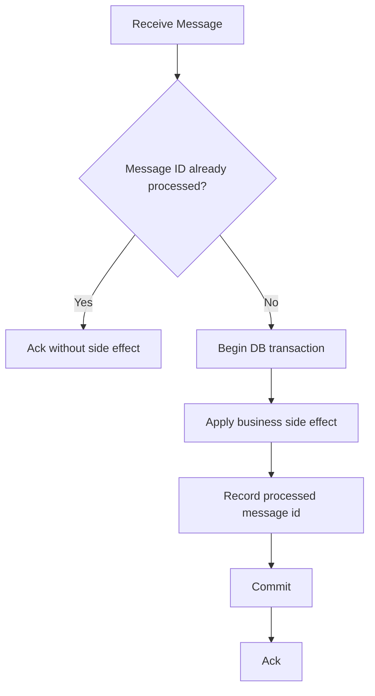

---

## 14. Backpressure Mental Model

Backpressure adalah kemampuan sistem untuk memperlambat input ketika output tidak mampu mengikuti.

Tanpa backpressure:

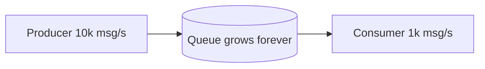

Dengan backpressure:

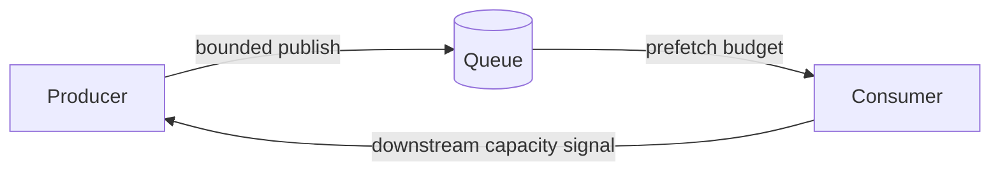

### 14.1 Backpressure Signals

| Layer | Signal |
|---|---|
| Producer | confirm latency, publish timeout, local buffer full |
| Broker | queue depth, memory alarm, disk alarm, connection blocked |
| Consumer | processing latency, executor queue, nack rate |
| Downstream | DB pool saturation, API latency, 429/503 |
| Business | SLA breach, delayed order processing |

Backpressure harus dilihat sebagai control loop, bukan parameter tunggal.

---

## 15. Queue Depth Is Not Diagnosis

Queue depth tinggi bisa berarti banyak hal.

| Queue Depth Naik Karena | Diagnosis |
|---|---|
| Traffic naik | Butuh scale out atau capacity plan |
| Consumer mati | Availability issue |
| Consumer lambat | Bottleneck downstream/CPU/DB |
| Retry storm | Failure classification salah |
| Poison message block | DLQ/retry strategy salah |
| Broker disk lambat | Storage bottleneck |
| Prefetch terlalu rendah | Underutilized consumers |
| Prefetch terlalu tinggi | Latency/duplicate impact memburuk |

Jangan langsung scale consumer tanpa tahu penyebab. Jika bottleneck di database, scale consumer bisa memperburuk incident.

---

## 16. Broker Is Not a Database

RabbitMQ bisa menyimpan pesan, tetapi bukan pengganti database aplikasi.

### 16.1 Jangan Gunakan Broker Untuk

- query state bisnis;
- long-term source of truth tanpa governance;
- arbitrary search;
- transactional aggregate consistency;
- relational constraints;
- business reporting langsung dari queue;
- menyimpan payload besar tanpa lifecycle.

### 16.2 Gunakan Broker Untuk

- membawa pesan antar boundary;
- buffer work;
- merutekan command/event;
- memisahkan producer-consumer timing;
- retry/DLQ flow;
- stream replay dengan retention eksplisit;
- distributed workflow signaling.

Rule praktis:

> Database menyimpan state yang ingin ditanya. Broker menggerakkan perubahan dan distribusi kerja.

---

## 17. Broker Is Not a Scheduler for Everything

RabbitMQ bisa mendukung delayed retry atau TTL-based delay pattern, tetapi hati-hati memakai broker sebagai scheduler besar.

Hindari:

- jutaan delayed messages dengan horizon panjang tanpa capacity test;
- scheduling workflow kompleks hanya via TTL queue;
- retry delay tanpa observability;
- delayed messages untuk business calendar logic yang butuh update/cancel/reschedule sering.

Gunakan pendekatan lain jika:

- job harus bisa dicari, dibatalkan, dijadwalkan ulang;
- jadwal sangat panjang;
- butuh calendar/business-day semantics;
- butuh audit lifecycle scheduler.

RabbitMQ cocok untuk delay/retry messaging, bukan selalu cocok sebagai full scheduler engine.

---

## 18. Broker Is Not a Distributed Transaction Manager

Kesalahan umum:

```text
Service A writes DB
Service A publishes message
Service B writes DB
Assume all of this is one transaction
```

Itu bukan satu transaksi.

### 18.1 Real Failure

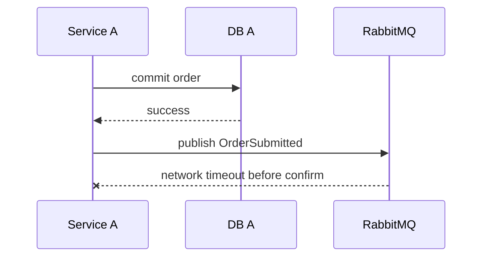

Apa status publish?

- Bisa belum sampai broker.
- Bisa sudah sampai broker tetapi confirm hilang.
- Bisa routed, tetapi producer tidak tahu.

Solusi bukan distributed transaction palsu, tetapi pattern seperti:

- transactional outbox;
- idempotent producer;
- publisher confirm;
- deduplication;
- reconciliation job;
- consumer idempotency.

---

## 19. Message Identity Mental Model

Message identity harus stabil.

### 19.1 Bad Identity

```text
random UUID generated on every retry
```

Dampaknya:

- deduplication gagal;
- retry dianggap pesan baru;
- tracing sulit;
- idempotency tidak stabil.

### 19.2 Better Identity

```text
messageId = stable id generated when business event/command is created
correlationId = id for end-to-end workflow/request
causationId = id of message/command that caused this message
```

Example:

```json
{
  "messageId": "evt-order-submitted-ord-1001-v1",
  "correlationId": "checkout-flow-789",
  "causationId": "cmd-submit-order-456",
  "messageType": "OrderSubmitted"
}
```

### 19.3 Identity Relationship

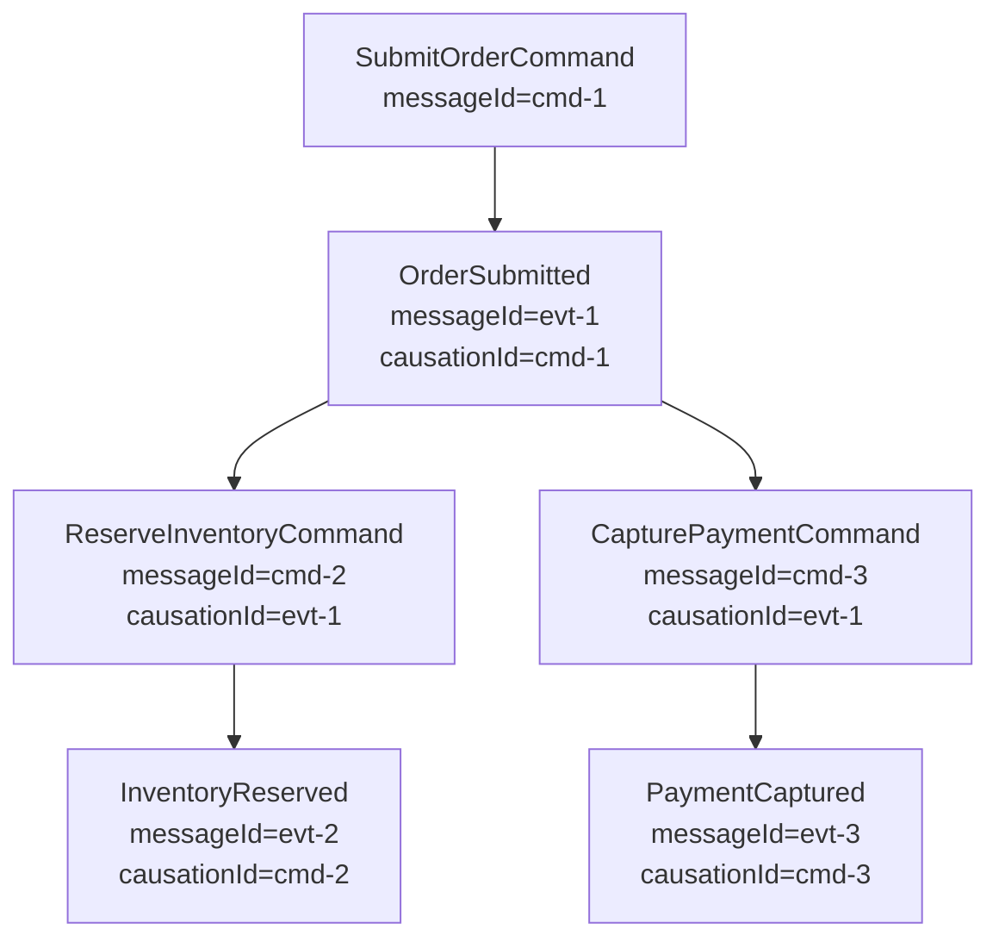

Correlation and causation are not decoration. They are how we reconstruct distributed behavior.

---

## 20. Consumer Ownership Model

A consumer owns:

- queue name;
- binding keys;
- retry policy;
- DLQ ownership;
- idempotency store;
- processing concurrency;
- alert thresholds;
- replay policy.

Producer owns:

- message contract;
- exchange publish contract;
- routing key semantics;
- publish reliability;
- event correctness.

Platform team owns:

- broker availability;
- cluster policy;
- permissions;
- resource limits;
- monitoring baseline;
- upgrade process;
- operational guardrails.

This ownership split prevents “nobody owns the queue” incidents.

---

## 21. Topology as Architecture

A RabbitMQ topology is not incidental configuration. It is architecture.

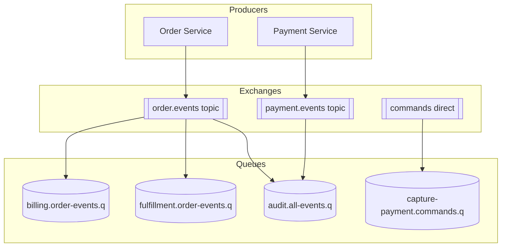

Review topology seperti review API:

- naming convention;
- versioning;
- backward compatibility;
- security permissions;
- ownership;
- migration path;
- deprecation policy.

---

## 22. Decision Examples

### 22.1 Payment Capture

Requirement:

- must not lose command;
- duplicate capture must not double charge;
- processing can be async;
- latency target under 30 seconds;
- payment provider idempotency key exists.

Design:

- command queue;
- quorum queue if high data safety required;
- publisher confirms;
- manual ack after DB/payment state persisted;
- idempotency key = payment intent id;
- retry transient provider error;
- DLQ permanent validation/provider rejection.

### 22.2 Order Submitted Event

Requirement:

- many subscribers;
- each subscriber independent;
- new subscriber may be added later;
- audit wants replay.

Design:

- topic exchange for notification;
- queue-per-subscriber for operational isolation;
- stream copy for replay/audit;
- versioned event schema;
- correlation/causation id.

### 22.3 Analytics Clickstream

Requirement:

- very high throughput;
- consumers read independently;
- replay last 7 days;
- ordering only per user/session.

Design:

- stream or super stream;
- partition by user/session id;
- retention by size/time;
- batch producer;
- lag monitoring;
- replay-safe aggregation.

### 22.4 Email Sending

Requirement:

- async task;
- duplicate email undesirable but not catastrophic;
- provider can fail transiently;
- some messages invalid.

Design:

- task queue;
- idempotency per notification id;
- retry provider timeout;
- DLQ invalid template/address;
- rate limiter per provider;
- consumer concurrency bounded by provider quota.

---

## 23. Architecture Smells

### 23.1 Shared Queue Across Multiple Logical Services

Smell:

```text
billing-service and analytics-service consume same queue
```

Problem:

- competing consumers steal each other’s messages;
- one service may miss events;
- ownership unclear.

Fix:

- queue-per-subscriber;
- bind each queue to same exchange/routing key.

### 23.2 Producer Publishes Directly to Many Queues

Smell:

```text
order-service knows billing.queue, fulfillment.queue, email.queue
```

Problem:

- producer coupled to subscribers;
- adding subscriber requires producer change;
- topology evolves poorly.

Fix:

- producer publishes to exchange;
- subscriber owns binding.

### 23.3 Auto Ack for Important Work

Smell:

```text
autoAck=true for payment processing
```

Problem:

- message can be lost if consumer crashes during processing.

Fix:

- manual ack after durable side effect;
- idempotent consumer.

### 23.4 Infinite Requeue

Smell:

```text
catch exception -> basicNack(requeue=true)
```

Problem:

- poison message loops forever;
- queue capacity wasted;
- consumer CPU wasted;
- incident hidden.

Fix:

- classify failure;
- retry budget;
- DLQ/parking lot.

### 23.5 RabbitMQ as Hidden Database

Smell:

```text
Important business state exists only as messages waiting in queue
```

Problem:

- hard to query;
- hard to audit;
- retention unclear;
- operational lifecycle risky.

Fix:

- persist business state in database;
- use broker for distribution.

---

## 24. Practical Design Method

Gunakan 12 pertanyaan ini sebelum memilih pattern.

1. Apa pesan ini: command, event, task, notification, stream fact?
2. Siapa owner pesan?
3. Siapa owner queue/stream?
4. Apakah pesan boleh hilang?
5. Apakah pesan boleh duplicate?
6. Apakah ordering dibutuhkan? Scope-nya apa?
7. Apakah consumer perlu replay?
8. Apa retention requirement?
9. Apa retryable failure?
10. Apa permanent failure?
11. Apa observable success/failure metric?
12. Apa operational runbook saat backlog naik?

Jika belum bisa menjawab, jangan mulai dari Java code.

---

## 25. Mini Lab: Classify the Message

Klasifikasikan pesan berikut.

| Message | Classification | Suggested Shape |
|---|---|---|
| `SubmitOrder` | Command | Command queue |
| `OrderSubmitted` | Event | Topic exchange + subscriber queues; optional stream |
| `GenerateMonthlyInvoicePdf` | Task | Work queue |
| `PaymentCaptured` | Event | Topic exchange + audit stream |
| `RebuildCustomerProjection` | Command/task | Queue, possibly batch controlled |
| `CustomerProfileChanged` | Event notification | Topic exchange |
| `ClickRecorded` | Stream fact | Stream/super stream |
| `SendPasswordResetEmail` | Task/command | Queue with idempotency |

Practice goal:

- Jangan hanya pilih “queue”. Jelaskan failure, duplicate, ordering, replay, dan ownership.

---

## 26. Mini Lab: Choose Queue vs Stream

Requirement:

```text
A fraud detection service must inspect all payment events.
It may be down for maintenance for 2 hours.
When it comes back, it must catch up from where it stopped.
A new ML feature extractor may be added later and needs to replay the last 30 days.
```

Analysis:

- many independent consumers;
- replay required;
- retention required;
- catch-up required;
- likely high volume;
- ordering may be per account/payment id.

Better fit:

- RabbitMQ Stream or Super Stream;
- retention >= 30 days or size equivalent;
- partition key based on account/payment identity;
- consumers track offsets;
- idempotent side effects for replay.

Queue-only design would make replay and independent progress difficult.

---

## 27. Mini Lab: Diagnose the Bad Design

Bad design:

```text
Order Service publishes directly to billing.queue.
Billing consumer uses autoAck=true.
If billing API fails, consumer logs error and continues.
There is no DLQ.
There is no messageId.
```

Problems:

1. Producer is coupled to consumer queue.
2. Auto ack can lose important work.
3. Failure is hidden in logs.
4. No retry policy.
5. No DLQ.
6. No idempotency identity.
7. No operational signal except logs.

Better design:

```text
Order Service publishes PaymentCaptureRequested command or OrderSubmitted event to exchange.
Billing owns its queue and binding.
Consumer uses manual ack.
Processing is idempotent by payment intent id.
Transient failures retry with budget.
Permanent failures dead-letter to billing.payment.dlq.
Metrics track success/failure/retry/dlq.
```

---

## 28. Summary

Part ini memberikan mental model utama:

- RabbitMQ adalah distributed boundary yang mengubah bentuk coupling.
- Queue cocok untuk work distribution dan command/task processing.
- Exchange adalah routing API, bukan detail kecil.
- Stream cocok untuk append-only replayable log, audit, dan independent consumers.
- Command, event, task, notification, dan stream fact harus dibedakan sejak desain.
- Delivery guarantee dan ack semantics menentukan correctness.
- Queue depth, duplicate, retry, dan DLQ harus dibaca sebagai sinyal desain dan operasi.
- Jangan mulai dari Java API sebelum memahami boundary, ownership, dan failure semantics.

Part berikutnya akan membedah AMQP 0-9-1 secara teknis: exchange, queue, binding, routing key, exchange types, alternate exchange, default exchange, dan topology design.

---

## 29. Official References

- RabbitMQ AMQP 0-9-1 Concepts: https://www.rabbitmq.com/tutorials/amqp-concepts
- RabbitMQ Exchanges: https://www.rabbitmq.com/docs/exchanges
- RabbitMQ Queues: https://www.rabbitmq.com/docs/queues
- RabbitMQ Publishers: https://www.rabbitmq.com/docs/publishers
- RabbitMQ Reliability Guide: https://www.rabbitmq.com/docs/reliability
- RabbitMQ Streams and Super Streams: https://www.rabbitmq.com/docs/streams
- RabbitMQ Stream Plugin: https://www.rabbitmq.com/docs/stream
